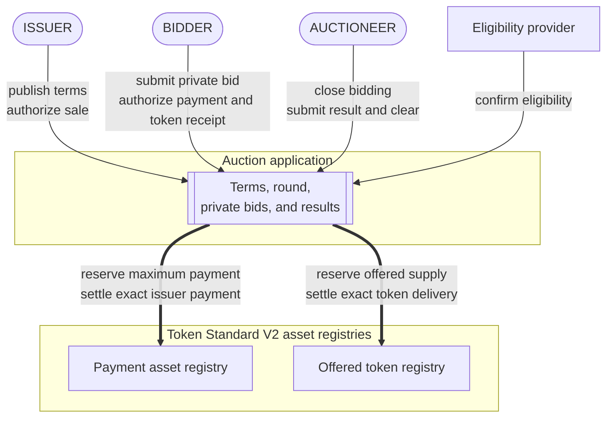
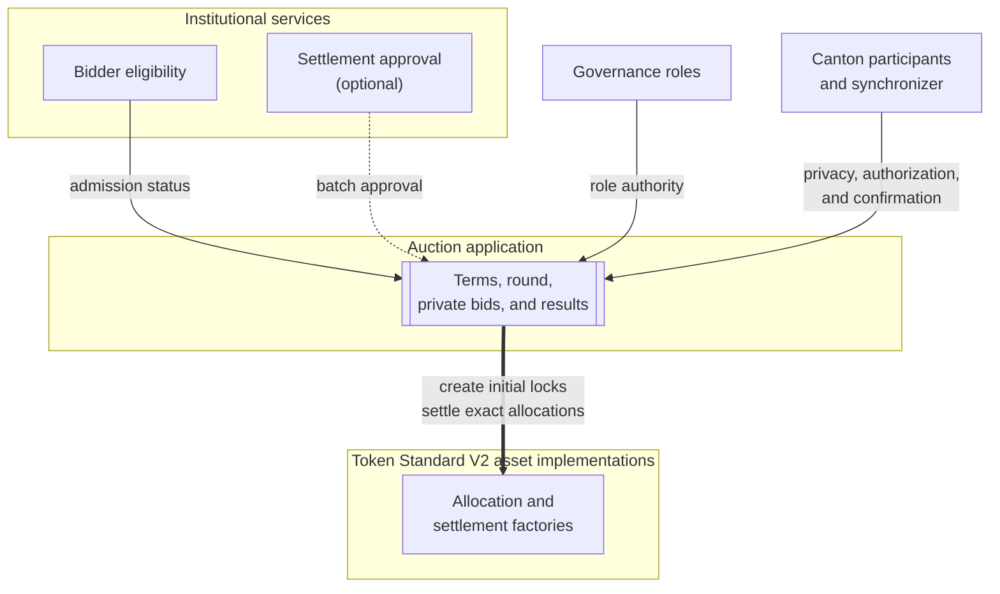
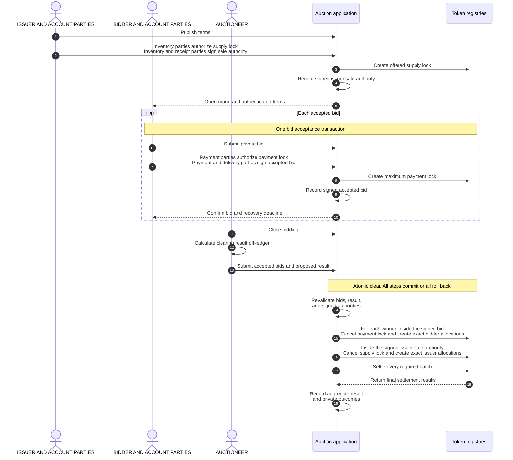

# Confidential auction reference architecture

A single-round sealed-bid auction on Canton distributes a fungible token. The
application keeps bids private from competitors, locks the issuer's
supply and each bidder's maximum payment before clearing, calculates one
clearing price, and settles payment and token delivery atomically.

## 1. Product Definition

Five properties define the product:

- **Single round.** The issuer offers a fixed quantity during one bidding
  period, and the round produces one final result.
- **Sealed bids.** Each bidder submits the requested quantity and maximum unit
  price privately to the issuer and auctioneer. Competing bidders do not
  receive that bid.
- **Uniform price.** Every winner pays the same clearing price under a rule
  published before bidding starts.
- **Prefunded settlement.** The issuer locks the offered tokens before opening
  the round, and each accepted bidder locks its maximum payment.
- **Permissioned participation.** The auction application checks bidder
  eligibility when it accepts a bid and again before assigning tokens.

A **Canton party** is an on-ledger identity. An **asset account** identifies
where tokens are held and which parties own or service them. **Authority** is
the on-ledger consent required from those parties for an action.

We use [Token Standard V2](https://github.com/canton-foundation/cips/blob/main/cip-0112/cip-0112.md)
allocations to lock the offered supply and bidder payments. An **allocation**
records account authority for specified asset movements and may reserve the
required holdings. A **committed allocation** prevents the account parties from
withdrawing those holdings before the settlement deadline, while its configured
settlement executors may settle or cancel it. A settlement executor controls
when those choices are invoked; executor status does not supply missing sender
or receiver account authority for a final movement.

The auction uses committed Token Standard allocations to lock the issuer's
offered tokens and each bidder's maximum payment before the result is known.
These initial allocations reserve the assets without authorizing payment or
delivery to another account. Separate signed auction records, the accepted bid
and issuer sale authority, authorize only the final movements permitted by the
published terms. We call the final all-or-nothing settlement transaction the
**clear**. It cancels the issuer's initial supply lock and each winner's payment
lock, uses the released holdings to create allocations for the exact payments
and token deliveries, and settles every winner movement atomically: all steps
succeed together, or none takes effect. Losing bidders recover their locked
payments separately.

### 1.1 Auction Mechanics

We require the issuer and auctioneer to publish immutable round terms before
bidding opens. The **reserve price** is the minimum unit price the issuer will
accept. It is fixed before bidding, and bids below it are rejected. A **price
tick** is the smallest allowed price increment, and a **lot** is the smallest
quantity increment. A bidder's **fill** is the quantity it wins. The **marginal
price** is the lowest maximum unit price among bids that receive a fill. When
demand exceeds supply, it is the price band where the remaining supply runs
out.

The terms include:

- the payment asset and offered token;
- the offered quantity and reserve price;
- the price tick, token lot size, and payment rounding rule;
- the bidding and settlement deadlines;
- the maximum number of accepted bids;
- the uniform-price clearing rule; and
- the fixed bid order used to assign any whole lots left after proportional
  fills are rounded down.

Bids below the reserve price are rejected. Bids at or above it are ordered by
maximum unit price, so higher price bands fill first. If the remaining supply is
smaller than demand at the marginal price, that price band receives a
proportional allocation. Each provisional fill is rounded down to a whole lot.
The round terms publish how each accepted bid receives an immutable order
number. That number is used only to assign any whole lots left after
proportional rounding and remains fixed through clearing. Because it can decide
who receives the final leftover lot, the terms must explain how order numbers
are assigned.

All winners pay the same **clearing price**. When the total quantity requested
by bids at or above the reserve price does not exceed the offered quantity, the
clearing price is the reserve price. When that demand exceeds the offered
quantity, the clearing price is the marginal price.

For example, consider 100 tokens, a reserve price of 8, and a lot size of 10:

| Bid | Fixed order | Quantity | Maximum price | Fill |
|---|---:|---:|---:|---:|
| A | 0 | 50 | 12 | 50 |
| B | 1 | 80 | 10 | 40 |
| C | 2 | 40 | 10 | 10 |

Bid A receives its full 50 tokens above the marginal price, leaving 50 tokens
for B and C. At the marginal price, B requested 80 tokens and C requested 40,
so their provisional fills are 33.33 and 16.67 tokens. Because fills must be
multiples of 10 tokens, these amounts are rounded down to 30 and 10, leaving one
10-token lot. B receives that lot because its fixed order precedes C, producing
final fills of 40 and 10 tokens. The reserve price is 8 units of the payment
asset per token. The marginal and clearing prices are 10, so every winner pays
10 per token.

### 1.2 Scope

| Auction scope | Separate designs |
|---|---|
| One primary token distribution with one bidding period and one result | Repeated auctions, continuous issuance, secondary trading, and derivatives |
| Uniform-price allocation with proportional marginal fills | Pay-as-bid pricing, bonding curves, and discretionary book building |
| Fungible payment and offered assets using Token Standard V2 allocations | Nonfungible assets and registries without compatible allocation settlement |
| One Canton synchronizer coordinating ordering and confirmation, and one atomic clear | Cross-synchronizer settlement and cross-chain delivery |
| Permissioned bidder eligibility | Public participation without an eligibility policy |
| Asset systems that complete every required movement during the clear | Asset systems whose transfers require later transactions |

## 2. Architecture Overview

The auction has three principal business participants: the bidder, issuer, and
auctioneer. The payment asset and offered token each have a Token Standard V2
registry that creates and settles allocations; one registry may serve both
assets. An eligibility provider issues or validates the reusable credential
that permits a bidder to participate.

**Business flow**



The auction application records the terms, round, accepted bids, and results.
Asset implementations, institutional services, governance roles, and Canton
infrastructure provide the dependencies shown below:

**Application dependencies**



Each Canton party receives a **transaction projection**: the portion of a
transaction it is authorized to see.

We implement the auction terms, round, accepted bids, and results in the
application. Token Standard V2 supplies the common asset interface. Eligibility
and, when enabled, settlement approval come from institutional policy services.
Governance roles assign application powers; the issuer and auctioneer may hold
them directly or a deployment may separate them. Canton hosts the parties,
authorizes transactions, and reveals each transaction only to entitled parties.

In Token Standard terminology, each asset is an **instrument**. Its
**instrument admin** governs the asset implementation. An **allocation factory**
creates allocations, while a **settlement factory** settles compatible
allocations for that admin.

Each participating asset account names an owner and may name a custody or
service provider. The asset implementation determines which account parties
must authorize an action. A named provider also sees that account's holdings
and movements.

A **transfer leg** describes one asset movement: instrument, sender account,
receiver account, and amount. Token Standard V2 records the two accounts'
authorizations separately as the **sender side** and **receiver side**.

Each initial lock contains only the sender side of a leg whose sender and
receiver are the same account. In the selected asset implementation, this
outgoing authorization locks the stated amount. The missing receiver side keeps
that leg from settling. Clearing cancels the issuer's supply lock and each
winner's payment lock, then uses the released holdings to create the exact
winner allocations. Losing payment locks remain available for separate
recovery.

A **settlement batch** groups compatible allocations and legs for one instrument
admin and settlement factory. We place both assets in one batch when they share
that admin and the factory supports both. Otherwise, we settle one batch per
compatible admin and factory, all inside the same Daml transaction.

### 2.1 Privacy and Result Trust

Each bidder submits the actual bid once. The required parties for the bidder's
payment and token delivery accounts see the complete bid because they authorize
it. The auctioneer and issuer also see every accepted bid. Competing bidders see
neither one another's bids nor private outcomes unless the same Canton party
also acts as issuer, auctioneer, instrument admin, or account provider.

Private outcomes rely on two requirements. Selected asset implementations keep
each account's settlement legs private, and the clear places each bidder's
authorization and outcome in a separate transaction-tree branch visible to that
bidder, beneath a root visible only to the issuer and auctioneer. Assets with
public settlement legs do not provide this privacy.

The payment instrument admin sees the bidder's locked payment allocation. The
offered token admin sees the issuer's locked token allocation. During clearing,
each admin sees the settlement data for the asset it administers. The same party
may administer both assets, or each asset may have a different admin.

The auctioneer calculates the result off-ledger. The clear recomputes the
published rule for the accepted bids supplied by the auctioneer. Bidders still
trust the auctioneer to protect bid data, include every accepted bid, and
attempt clearing on time.

The application records an aggregate result visible to the issuer and
auctioneer and a private outcome for each bidder. Authorized disclosure of
accepted bids and outcomes lets an auditor recompute the submitted result.
Completeness still depends on the auctioneer.

### 2.2 Business Roles

| Participant | Responsibility and visibility |
|---|---|
| Bidder | Submits a quantity and maximum price. The required owners and providers of the payment and delivery accounts authorize the bid and see its complete contents. |
| Issuer | Publishes the round terms, locks the offered supply, receives payment, and sees every accepted bid. |
| Auctioneer | Operates the round, sees accepted bids, closes bidding, calculates the result, submits the clear, and coordinates cancellation. |
| Instrument admins | Administer the payment and offered token registries. Each validates settlement for its asset and enforces its published approval, pause, and seizure policies. One party may administer both assets. |
| Eligibility provider | Issues or validates the reusable credential that permits a bidder to participate. The issuer or auctioneer may operate this service or use an independent provider. |
| Settlement attester, when required | Approves the exact settlement batch under an instrument policy. Organizational independence from the admin and auctioneer is a deployment decision. |
| Auditor, when enabled | Receives authorized bid and outcome disclosures and recomputes the submitted result without exposing those records more broadly. |

The issuer and auctioneer configure the round and coordinate close, clear, and
recovery. We support an optional pause on accepting bids and separation of
launch, pause, audit, and upgrade powers among additional parties. Those
changes alter governance and availability while leaving auction economics
unchanged.

Canton participant nodes, often operated by validators, host the parties and
their private contract data. Sequencers order encrypted protocol messages,
while mediators coordinate confirmation without receiving bid plaintext. A
participant receives bid data only for the parties it hosts that are entitled
to see it. Actual visibility for each party still requires testing because
application topology, account providers, and overlapping roles determine it.
See the
[Canton ledger model](https://docs.canton.network/overview/reference/ledger-model-detailed)
and [architecture overview](https://docs.canton.network/overview/learn/architecture).

### 2.3 Core Application Concepts

We separate the application into six responsibilities:

| Component | Responsibility |
|---|---|
| Auction terms | Fix the assets, economics, deadlines, clearing rule, capacity, eligibility policy, registry references, and governance before bidding begins. |
| Round status | Records whether the round is open, closed, cleared, cancelled, or expired while preserving the auction terms. |
| Accepted bid | Names the required bidder account parties, issuer, and auctioneer as signatories. It fixes the bid and bounds the authority used to create the exact winner payment and token receipt. The initial payment allocation retains its cancellation and withdrawal paths. |
| Issuer sale authority | Is signed by every party required for the issuer's inventory and payment receipt accounts. During a successful clear, it limits use of the locked supply to winner delivery or return of unsold tokens. Cancellation and withdrawal follow the initial allocation's recovery rules. |
| Results | Records aggregate clearing data for the issuer and auctioneer and gives each bidder a private fill, payment, exclusion, or refund outcome. |
| Asset registries | Create, cancel, withdraw, and settle allocations under each instrument's policy. |

At bid acceptance, the payment account parties authorize the allocation that
locks the maximum payment. Every party required by the bidder's payment and
delivery accounts also signs the accepted bid. That record limits later
settlement to the round, accounts, bid, deadlines, and asset references it
contains. Before bidding opens, every party required by the issuer's inventory
and payment receipt accounts signs equivalent sale authority for the locked
supply. If the bid wins, clearing creates the exact payment and token receipt
allocations within the accepted bid action, and the matching issuer allocations
within the sale authority action. Daml applies each record's signatory authority
to those asset calls, so the bidder and issuer account parties do not sign again
during clearing. Participants hosting those parties may still need to confirm
the transaction under the Canton topology.

### 2.4 Institutional Controls

We use four OpenZeppelin application labels for institutional controls and pair
each label with a descriptive name:

| Control | Treatment |
|---|---|
| Settlement approval (`D1`) | An optional instrument policy may require approval from a configured trusted attester, the party authorized to validate each settlement batch. Organizational independence is a deployment requirement when the product requires it. |
| Allocation seizure (`D2`) | An instrument policy may let its admin mark an allocation and let privileged parties move its holdings. A mark can block auction settlement and ordinary recovery. |
| Bidder eligibility (`D3`) | Admission checks that the bidder's payment and delivery accounts name the same owner and that the owner has an accepted credential. Clearing checks eligibility again before assigning a fill. |
| Application governance (`D4`) | Assigns authority to configure, close, clear, cancel, recover, and approve application code. A deployment may add pause authority or separate these powers. |

Related-party screening is an optional part of bidder eligibility. We support
either an accepted relationship status in the eligibility credential or a
separate compliance provider.

A seizure-enabled instrument can block or redirect settlement of a locked
allocation. Its admin can mark an allocation without approval from the account
parties. A mark blocks settlement and ordinary recovery until the admin removes
it, its time limit permits release, or privileged parties **sweep** the locked
holdings to an authorized destination. Before accepting that instrument, we
publish whether seizure is disabled or enabled. An enabled policy also
identifies the authorized operators and destinations, the maximum window, and
any required legal order. A disabled policy requires the asset implementation
to reject both marking and sweeping. The auction application cannot override
that policy.

## 3. Target Design

The issuer and auctioneer open the round, bidders submit individual bids, and
the auctioneer closes bidding. The auctioneer then computes the proposed result
off-ledger. The successful clear is one Daml transaction: validation, exact
allocation creation, settlement, and result recording either all commit or all
roll back. The sequence below shows that boundary.

**Round lifecycle**



### 3.1 Configure and Open the Round

The issuer and auctioneer first agree on the immutable economics and operating
policy. We select the two instruments, their admins and factories, and the
account types each registry supports. The same terms fix the offered quantity,
reserve price, lot and tick sizes, rounding, capacity, deadlines, eligibility,
clearing rule, and governance roles.

Before the round opens, the parties required by the issuer's inventory account
create a committed allocation that locks the full offered quantity. Every party
required by the issuer's inventory and payment receipt accounts also signs the
sale authority that lets a validated clear cancel this initial supply lock and
create the matching token delivery and payment receipt allocations. The auction
opens after the application authenticates the allocation and confirms it is
active and unmarked.

Every auction allocation names the auctioneer as its sole settlement
executor. A deployment that uses several executors must bring the complete
configured set into every cancellation and settlement action.

Each of the four business accounts names an owner: the bidder's payment and
delivery accounts, and the issuer's payment receipt and inventory accounts. A
selected registry may also require provider authority. The bidder's two
accounts share the same owner, and the issuer uses pre-existing inventory.

### 3.2 Accept a Bid and Lock Maximum Payment

The wallet presents the bidder with authenticated terms, the current open
round, both instrument policies, the issuer's active locked supply, and the
recovery deadlines. Every owner or provider required by the bidder's payment
and delivery accounts sees and authorizes the complete bid.

Admission verifies that the round is still accepting bids and that:

- the requested quantity and maximum price are positive and respect the lot and
  price tick;
- the maximum price meets the reserve;
- the payment and delivery accounts are supported by their registries and name
  the same eligible owner;
- the bidder credential comes from an accepted issuer, identifies the account
  owner, has the required type and status, and remains unexpired; and
- the issuer's locked supply remains active and unmarked.

The round's payment rule calculates the rounded maximum payment:

```text
maximum payment = apply the published payment rounding rule
                  (requested quantity x maximum unit price)
```

Bid acceptance creates two linked records in one transaction. The payment
registry creates a committed allocation that locks exactly that amount. This
allocation reserves the funds but does not authorize their payment to the
issuer. The application also records the accepted bid and its fixed order. The
accepted bid fixes the round, accounts, instruments, requested quantity,
maximum price, maximum payment, deadlines, and asset references. It names the
bidder's required account parties, issuer, and auctioneer as Daml signatories.
The open round supplies the issuer's and auctioneer's authority for its
creation, so they provide no new signature for each bid. The application
accepts the bid only while that round is open.

Ordinary cancellation returns the funds to the bidder's payment account. The
accepted bid lets the clear cancel this initial payment lock and replace it with
the exact winner payment and token receipt allocations.

### 3.3 Close Bidding and Calculate the Result

At or after the bidding deadline, the auctioneer closes bidding. No further bids
can be accepted. The auctioneer is then expected to submit every accepted bid,
but the on-ledger clear cannot search for private bids it cannot see. The
auctioneer remains trusted for completeness.

The auctioneer computes the proposed result and prepares its settlement data
off-ledger; the clear recomputes the fixed rule before settlement.

Before recomputing, the clear validates the current issuer sale authority,
locked supply, accepted bids, bidder credentials, and locked payments. A bidder
whose eligibility has expired or been revoked receives a zero-fill outcome. A
seizure mark on that bidder's payment allocation also produces a zero fill. A
mark on the issuer's locked supply blocks the entire clear.

If a required payment or inventory allocation has already closed through
settlement, cancellation, withdrawal, expiry handling, or a sweep, clearing
stops. Because the required value is no longer available, the backend first
reconciles the ledger update and then starts round recovery.

The clear then verifies every submitted bid exactly once and recomputes the
price and fills. It checks supply, price limits, lot and tick alignment, and the
rounded payment for every winner.

### 3.4 Create Exact Allocations and Settle

The bidder authorized a maximum payment, but a winner owes only the rounded
payment for its fill. Clearing acts through the signed accepted bid. Within that
action, it cancels the initial payment lock, creates the bidder's exact payment
and token receipt allocations, and returns the difference. Clearing separately
acts through the signed issuer sale authority. Within that action, it cancels
the supply lock, creates the issuer's matching payment receipt and token
delivery allocations, and returns unsold inventory. Keeping the asset calls
inside these signed actions supplies the account party authority required by
the registries.

Each winner has two transfer legs:

| Asset | Sender | Receiver | Amount |
|---|---|---|---:|
| Payment asset | Bidder payment account | Issuer payment account | Published payment-rounding rule applied to `fill quantity x clearing price` |
| Offered token | Issuer inventory account | Bidder delivery account | Final fill quantity |

Each settlement factory receives only allocations for instruments governed by
its admin and supported by that factory. Different admins or settlement
factories require separate batch calls. If both assets use the same admin and a
factory that supports both, their allocations may be included in one batch
call. Every required batch remains inside the same Daml transaction.

An instrument that enables settlement approval requires one approval from its
configured trusted attester for each relevant batch. The approval is used once
and names the batch, authorized submitters, and every transfer leg. All
allocation and settlement factory calls must complete within the clear
transaction.

Any failed allocation or batch call aborts the complete clear. No winner pays
without receiving tokens, no issuer transfers tokens without receiving the
matching payment, and no result becomes final without every required batch.
The selected asset registry must enforce these checks on every settlement path.

On success, the round becomes cleared. The aggregate result is available to the
issuer and auctioneer, while each bidder receives its own outcome. Bids with no
fill then use independent recovery paths. A later recovery failure or active
mark cannot undo the completed winner settlement.

### 3.5 Release Locked Assets

A failed clear rolls back every step inside it and leaves the round closed. The
auctioneer can refresh state that may have changed and retry while the
settlement window remains open. A retry must use the current eligibility,
allocation, approval, and registry state.

Because the auctioneer is the sole settlement executor, it can cancel an
active unmarked bidder or issuer allocation at any time. Once the settlement
deadline passes, the account parties that authorized a committed allocation may
also withdraw it, so cancellation and withdrawal can race. Unfilled bidders use
the same rules after a successful clear. A successful clear returns unsold
inventory through the issuer sale authority. If the round ends without
clearing, the initial supply lock returns through allocation cancellation or
withdrawal.

An active allocation seizure mark is the disclosed exception. It blocks normal
settlement, auctioneer cancellation, and account withdrawal until the admin
removes the mark, its time limit permits release, or an authorized sweep closes
the allocation. The auction application cannot override the instrument policy.

An asset operation outside the auction may also close a locked allocation. The
backend observes and classifies that ledger outcome before recording the
corresponding auction recovery result.

### 3.6 Execution and Timing

The workflow is asynchronous across commands but atomic within each committed
transaction:

| Stage | Execution boundary | What can invalidate the step |
|---|---|---|
| Open | The setup transactions create the supply lock, record the signed sale authority, and open the round | Inventory, account, asset implementation, or policy no longer matches the terms |
| Bid | One transaction per bidder creates the maximum-payment lock and records the signed accepted bid | Bidding closes or eligibility, supply, account, or asset state changes |
| Calculate | Off-ledger auctioneer computation | Eligibility or asset state changes before clear |
| Approve | Optional settlement approval transaction for an enabled instrument | Approval expires or its transfer legs change |
| Clear | One Daml transaction validates, allocates, settles, and records outcomes | A deadline passes or required funds, approval, registry state, or authority changes |
| Recover | Independent cancellation or withdrawal transactions | The active allocation, required party, deadline, or seizure state does not permit the action |

The bidding deadline stops admission. The settlement deadline bounds clearing
and makes committed allocations withdrawable afterwards. An allocation factory,
approval, asset policy, or transaction assembled for signing may impose an
earlier bound. We use the earliest effective deadline and leave a
published margin for preparation, signing, confirmation, and recovery.

A transaction assembled for signing remains usable only while its inputs and
time bounds remain valid. The backend gives it a latest allowed recording time.
A changed input, passed deadline, or expired submission window requires a fresh
transaction and any new external signatures required from its submitting
parties. It does not make the bidder or issuer account parties sign the clear:
their authority remains in the active accepted bid and issuer sale authority.
See
[External Signing](https://docs.canton.network/appdev/deep-dives/external-signing-transactions)
and [Working with Time](https://docs.canton.network/appdev/modules/m3-working-with-time).

The client waits for the Ledger API's definitive completion before treating a
submission as final. While the prepared transaction remains valid, retries use
the same command ID, user, acting parties, and submitting participant, but a
fresh submission ID. The explicit deduplication period covers the complete
retry horizon. The backend prepares and signs a new transaction only after a
rejection is definitive or the prior recording-time bound has passed, while
retaining the same deduplication identity and coverage. See
[Command Deduplication](https://docs.canton.network/appdev/deep-dives/command-deduplication).

## 4. Failure Recovery

The round starts open and becomes closed when bidding ends. A successful clear
makes it cleared. Cancellation and expiry are the other terminal outcomes. A
failed clear rolls back and leaves the round closed, so the auctioneer can retry
with current state. An optional pause stops new bids without blocking close,
clear, recovery, or expiry.

| Situation | Result | Next action |
|---|---|---|
| A step inside clear fails | The complete clear rolls back and the round stays closed | Refresh ledger state and retry within the settlement window |
| Bidder eligibility is invalid at clear | That bid receives zero fill | The auctioneer cancels the allocation, or account parties withdraw after the deadline |
| Bidder payment allocation is marked | That bid receives zero fill and ordinary release is blocked | Remove the mark, wait for permitted release, or follow the sweep policy |
| Issuer token allocation is marked | The complete clear is blocked | Resolve the mark; if a sweep or another asset operation permanently closes it, cancel or expire the round as applicable and reconcile that outcome |
| Required allocation is already closed | The clear stops because the required value is unavailable | Reconcile the asset operation, then cancel or expire the round |
| Auctioneer or participant is unavailable | Close, clear, or early cancellation is delayed | Restore service and refresh state; account parties withdraw after the deadline, subject to the seizure policy |
| Synchronizer is unavailable | No auction or recovery transaction can confirm | Refresh state after service returns and resume the action allowed by the current round state and deadlines |

## 5. Security and Auditability

The architecture separates ledger-enforced properties from parties and systems
that remain trusted.

### 5.1 Ledger-Enforced Properties

| Property | Enforcement |
|---|---|
| Fixed auction rule | Round terms fix the assets, supply, price rule, rounding, order, capacity, deadlines, and enabled controls before bidding. |
| Bounded bidder payment | The bidder locks a known maximum and signs an accepted bid that limits the final payment and token receipt to the published terms. Clearing computes an exact payment at or below that maximum and returns the difference. |
| Reserved supply | The issuer locks the offered quantity and signs sale authority that limits its use to the published terms. A disclosed instrument seizure path remains separate. |
| Correct clearing of submitted bids | The clear recomputes eligibility, ordering, clearing price, fills, exclusions, and rounded payments for each submitted bid. |
| Atomic delivery versus payment | Every compatible asset batch settles inside one Daml transaction. A failed step rolls back allocation, settlement, result, and state changes. |
| Per-bidder result privacy | The transaction tree and selected asset implementations restrict each bidder to its own authorization, settlement legs, and outcome. |
| Deadline-based recovery | The auctioneer, as the allocation's sole settlement executor, can cancel it at any time while it remains active and unmarked. After the settlement deadline, the required account parties may also withdraw, subject to the instrument's seizure policy. |

### 5.2 Trust Boundaries

| Trusted party or system | Required behavior and consequence |
|---|---|
| Auctioneer | Includes every accepted bid, protects bid confidentiality, computes and submits on time, and uses cancellation powers according to policy. Omission or delay can change the outcome or prevent settlement. |
| Issuer | Protects the confidentiality of every accepted bid and supplies valid inventory and treasury authority. Issuer and auctioneer collusion remains an application governance risk. |
| Issuer, auctioneer, and account parties | Parties that jointly approve round or asset authority can also approve other transactions using those powers. Wallets bind users to the intended on-ledger round, and operators audit unexpected state transitions. |
| Instrument admins and factories | Keep compatible registries available, validate their asset batches, and apply published approval, pause, and seizure policies. Policy-authorized seizure or movement can bypass the auction settlement path. |
| Eligibility provider | Correctly binds credentials to the bidder owner and keeps status, expiry, revocations, and the accepted-issuer list current. |
| Settlement attester, when required | Approves only batches that satisfy policy. A compromised or affiliated attester weakens the independent review expected by the deployment. |
| Canton infrastructure | Keeps required parties hosted, approved code available, and transactions confirmable within the round deadlines. |
| Auditor, when enabled | Receives enough authorized disclosures to check the submitted set and result without exposing records more broadly. |

The most important residual risk is bid completeness. Deterministic on-ledger
clearing proves the result for the set the auctioneer supplies. It cannot prove
that the auctioneer omitted an accepted bid the clear cannot see. Acceptance
receipts and private audit disclosure can detect or attribute
omissions but cannot make the submitted set complete. Fixed capacity,
operational controls, and legal accountability remain necessary.

Asset implementations enforce asset controls. We support only
implementations that enforce every claimed control across all settlement and
privileged movement paths. The reference token experiment exposes seizure on
every allocation and lets the admin choose the destination when marking. It
therefore cannot by itself enforce the immutable seizure policy selected for
the round.

## 6. Deployment and Operations

Before opening a round, we fix the approved application and asset package IDs,
instrument admins, credential issuers, governance parties, accounts, and
deadlines. A Canton synchronizer coordinates ordering and confirmation for the
clear. All records used by that clear remain on one compatible synchronizer,
and every involved participant supports the approved application and asset
code.

We require the following production checks:

| Area | Required decision and evidence |
|---|---|
| Assets and factories | Pin both instruments, admins, factories, supported account rules, limits, and control policies. Require every selected factory to complete during the clear. Test the initial supply and payment locks, cancellation, replacement allocations, exact winner payment and delivery, and returned change. |
| Code and synchronizer | Make the approved application, Token Standard interfaces, and asset code available to every participant involved in the clear. Verify that all round records use one compatible synchronizer. |
| Roles and authorization | Assign issuer, auctioneer, account, eligibility, optional settlement approval, and governance powers. Verify that every required account party signs the accepted bid or issuer sale authority and that the corresponding asset calls run inside those signed actions. Test that clearing needs no new bidder or issuer account signature and fails if a required party is omitted or an asset call is moved outside its signed action. Configure confirmation and signing thresholds while keeping at least one authorized recovery path available. |
| Privacy | Test party projections for bidders, account providers, issuer, auctioneer, admins, settlement attesters, and auditors. Display every required disclosure before signature. |
| Time and retry | Publish bidding, preparation, settlement, and recovery cutoffs. Monitor the earliest dependency deadline, command completions, retries, and changed state. |
| Recovery | Exercise clear rollback, auctioneer cancellation, withdrawal by account parties, backend outage, synchronizer outage, allocation changes, and every supported seizure outcome. |
| Capacity | Test the largest allowed bid and winner set against applicable factory, transaction, signature, and network limits. Stop accepting bids at the published capacity. |
| Operations | Monitor round phase, locked allocations, eligibility and approval status, approved code, party availability, confirmation latency, network submission capacity, and unresolved recovery actions. |

Wallets authenticate the round terms and current state before asking a bidder to
sign. They show the requested quantity, maximum unit price, rounded maximum
payment, both accounts, deadlines, administrators, settlement approval, seizure
powers, and available recovery actions. Wallets calculate visibility and
signing requirements from verified party roles and instrument policies.

On a traffic-controlled network such as the Global Synchronizer, each validator
participant that sends auction protocol messages spends its own participant-wide
base or extra traffic balance. All parties and applications hosted on that
participant share the balance. Operators monitor every participant required by
the flow and the Canton Coin used to buy extra traffic. When neither base nor
extra traffic is available, that participant cannot submit messages. See the
[traffic documentation](https://docs.sync.global/deployment/traffic.html).

## 7. Production Decisions

We make these decisions before opening a production round:

| Decision | Design default | Production choice |
|---|---|---|
| Governance powers | Issuer and auctioneer configure and operate the round | Decide whether launch, pause, clear, recovery, audit, and upgrade require separate authorities |
| Tie-break order | Each accepted bid receives one immutable, unique order number | Publish the assignment rule and explain its fairness and availability tradeoffs |
| Bidder accounts and supply | Both bidder accounts have the same owner, and the issuer uses existing inventory | Review delegated payers, different beneficiaries, or minting as separate authorization and eligibility designs |
| Bidder eligibility | One reusable credential checked at admission and clear | Decide whether related-party screening belongs in that credential or a separate approval |
| Settlement approval | Disabled unless an instrument requires it | Select the trusted attester and enforce organizational independence when required |
| Allocation seizure | Accept only assets whose disclosed policy fits the auction | Require immutable opt-out, bounded seizure with approved destinations, or refuse the asset |
| Result audit | Private bidder outcomes and aggregate result | Select any cryptographic summaries, private proofs, and authorized audit disclosure |
| Settlement coordination | The auctioneer is the sole settlement executor, and factories complete inside the clear | Define authority and availability when several executors are required |

## 8. References

Primary foundations include:

- [CIP-0112 Token Standard V2](https://github.com/canton-foundation/cips/blob/main/cip-0112/cip-0112.md),
  especially its allocation and settlement factory model;
- the pinned OpenZeppelin [reference token experiment](https://github.com/OpenZeppelin/canton-contracts/tree/7696749737885e25cd88422847105f890f03b00d/experiments/token/tokenCIP112-v1)
  for allocation, settlement approval, and seizure mechanics;
- the local [credential-check experiment](../../experiments/identity/hook-shape-b/)
  for typed eligibility checks; and
- the [Canton ledger model](https://docs.canton.network/overview/reference/ledger-model-detailed)
  for authorization, transaction projection, and visibility.

We use these experiments for the cited mechanisms. Production delivery includes
the auction application, backend, wallet integration, asset selection,
operations, recovery services, and end-to-end validation.
