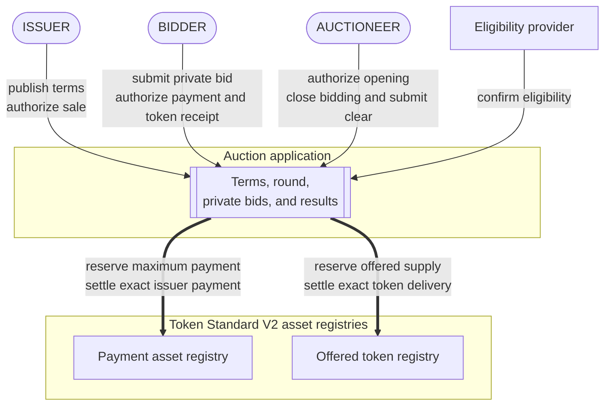
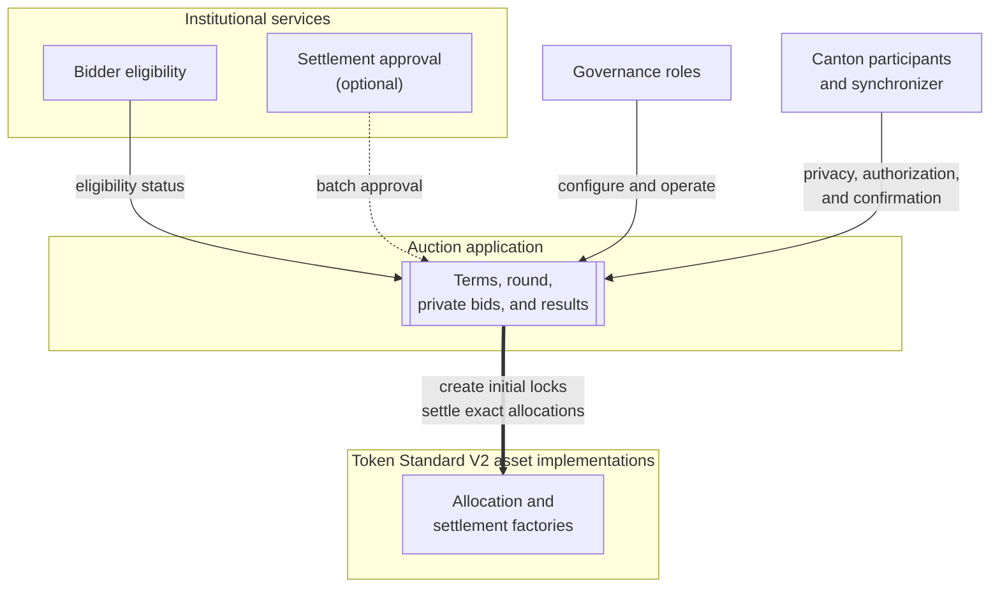
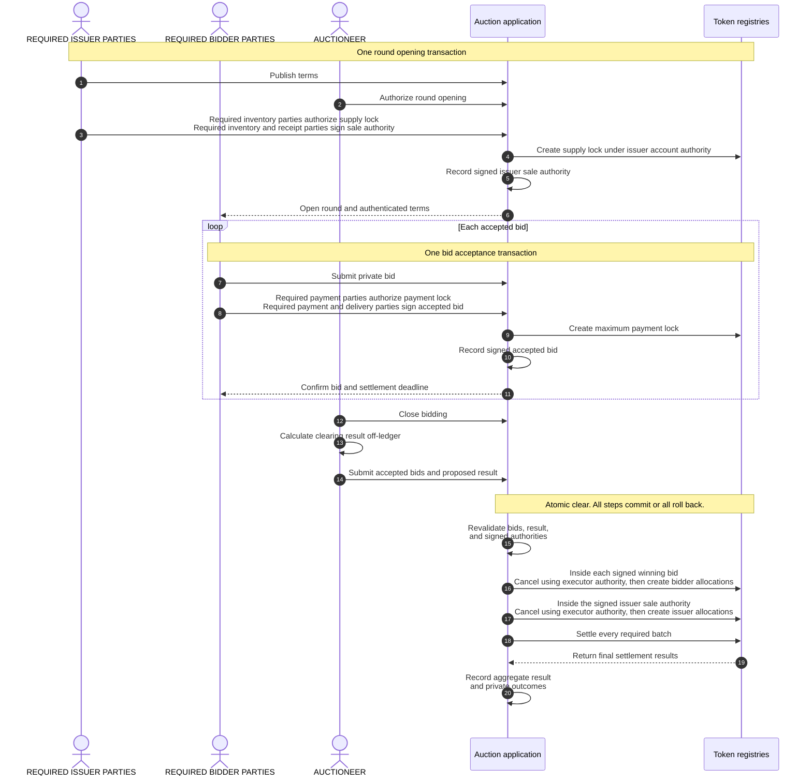

# Confidential auction reference architecture

A single-round sealed-bid auction on Canton distributes a fungible token. The
application keeps bids private from competitors, locks the issuer's
supply and each bidder's maximum payment before clearing, calculates one
clearing price, and settles payment and token delivery atomically.

## 1. Product Definition

Five properties define the product:

- **Single round.** The issuer offers a fixed quantity during one bidding
  period, and the round produces one final result.
- **Sealed bids.** Each bidder submits the requested quantity and maximum unit
  price privately to the issuer and auctioneer. Competing bidders do not
  receive that bid.
- **Uniform price.** Every winner pays the same clearing price under a rule
  published before bidding starts.
- **Prefunded settlement.** The issuer locks the offered tokens before opening
  the round, and each accepted bidder locks its maximum payment.
- **Permissioned participation.** The auction application checks bidder
  eligibility when it accepts a bid and again before assigning tokens.

A **Canton party** is an on-ledger identity. A regular **asset account**
identifies where tokens are held and names an owner. Some asset implementations
also support an account provider or an additional account identifier.
**Authority** is the on-ledger consent required from the parties that control an
action.

We use [Token Standard V2](https://github.com/canton-foundation/cips/blob/main/cip-0112/cip-0112.md)
allocations to lock the offered supply and bidder payments. An **allocation**
records account authority for specified asset movements and may reserve the
required holdings. A **committed allocation** cannot be withdrawn before the
settlement deadline; after that deadline, it becomes withdrawable under the
registry's authorization rules. Its configured settlement executors may settle
or cancel it. A settlement executor controls when those choices are invoked;
executor status does not provide the sender or receiver account authority
required for a final movement.

The auction uses committed Token Standard allocations to lock the issuer's
offered tokens and each bidder's maximum payment before the result is known.
These initial allocations reserve the assets without authorizing payment or
delivery to another account. Separate signed auction records, the accepted bid
and issuer sale authority, authorize only the final movements permitted by the
published terms. We call the final all-or-nothing settlement transaction the
**clear**. It cancels the issuer's initial supply lock and each winner's payment
lock, uses the released holdings to create allocations for the exact payments
and token deliveries, and settles every winner movement atomically: all steps
succeed together, or none takes effect. Losing bidders recover their locked
payments separately.

### 1.1 Auction Mechanics

We require the issuer and auctioneer to publish immutable round terms before
bidding opens. The **reserve price** is the minimum unit price the issuer will
accept. It is fixed before bidding, and bids below it are rejected. A **price
tick** is the smallest allowed price increment, and a **lot** is the smallest
quantity increment. A bidder's **fill** is the quantity it wins. The **marginal
price** is the lowest maximum unit price among bids that receive a fill. When
demand exceeds supply, it is the price band where demand exceeds the remaining
supply.

The terms include:

- the payment asset and offered token;
- the offered quantity and reserve price;
- the price tick, token lot size, and payment rounding rule;
- the bidding and settlement deadlines;
- the maximum number of accepted bids;
- the uniform-price clearing rule; and
- the fixed bid order used to assign any whole lots left after proportional
  fills are rounded down.

Bids below the reserve price are rejected. Bids at or above it are ordered by
maximum unit price, so higher price bands fill first. If the remaining supply is
smaller than demand at the marginal price, that price band receives a
proportional allocation. Each provisional fill is rounded down to a whole lot.
The round terms publish how each accepted bid receives an immutable order
number. That number is used only to assign any whole lots left after
proportional rounding and remains fixed through clearing. Because it can decide
who receives the final leftover lot, the terms must explain how order numbers
are assigned.

All winners pay the same **clearing price**. When the total quantity requested
by bids at or above the reserve price does not exceed the offered quantity, the
clearing price is the reserve price. When that demand exceeds the offered
quantity, the clearing price is the marginal price.

For example, consider 100 tokens, a reserve price of 8, and a lot size of 10:

| Bid | Fixed order | Quantity | Maximum price | Fill |
|---|---:|---:|---:|---:|
| A | 0 | 50 | 12 | 50 |
| B | 1 | 80 | 10 | 40 |
| C | 2 | 40 | 10 | 10 |

Bid A receives its full 50 tokens above the marginal price, leaving 50 tokens
for B and C. At the marginal price, B requested 80 tokens and C requested 40,
so their provisional fills are 33.33 and 16.67 tokens. Because fills must be
multiples of 10 tokens, these amounts are rounded down to 30 and 10, leaving one
10-token lot. B receives that lot because its fixed order precedes C, producing
final fills of 40 and 10 tokens. The reserve price is 8 units of the payment
asset per token. The marginal and clearing prices are 10, so every winner pays
10 per token.

### 1.2 Scope

| Auction scope | Separate designs |
|---|---|
| One primary token distribution with one bidding period and one result | Repeated auctions, continuous issuance, secondary trading, and derivatives |
| Uniform-price allocation with proportional marginal fills | Pay-as-bid pricing, bonding curves, and discretionary book building |
| Fungible payment and offered assets using Token Standard V2 allocations | Nonfungible assets and registries without compatible allocation settlement |
| One Canton synchronizer coordinating ordering and confirmation, and one atomic clear | Cross-synchronizer settlement and cross-chain delivery |
| Permissioned bidder eligibility | Public participation without an eligibility policy |
| Asset systems that complete every required movement during the clear | Asset systems whose transfers require later transactions |

## 2. Architecture Overview

The auction has three principal business participants: the bidder, issuer, and
auctioneer. The payment asset and offered token each have a Token Standard V2
registry that creates and settles allocations; one registry may support both
assets. An eligibility provider issues or validates the reusable credential
that permits a bidder to participate.

**Business flow**



The auction application records the terms, round, accepted bids, and results.
It depends on the asset implementations, institutional services, governance
roles, and Canton infrastructure shown below.

**Application dependencies**



Token Standard V2 defines the common interface for locking and settling assets.
Institutional services provide eligibility and optional settlement approval.
Governance roles define application authority. Canton participant nodes host
parties and private contract data. Daml authorization determines which parties
must authorize an action, while transaction projections determine which parts
each party sees.

In Token Standard terminology, each asset is an **instrument**. Its
**instrument admin** governs the asset implementation. An **allocation factory**
creates allocations, while a **settlement factory** settles compatible
allocations for that admin.

Each account used by the auction is a regular account with an owner. Some asset
registries also support an **account provider**, such as a custodian or service
provider. [Canton Coin supports only basic accounts](https://github.com/canton-foundation/cips/blob/main/cip-0112/cip-0112.md#6-canton-coin-implementation),
which have no provider or additional account identifier. Each registry
determines which account forms it supports and which parties must authorize an
action. When an account has a provider,
[Token Standard V2](https://github.com/canton-foundation/cips/blob/main/cip-0112/cip-0112.md#432-accounts-instead-of-parties)
requires it to see every holding and asset movement for that account.

A **transfer leg** describes one asset movement: instrument, sender account,
receiver account, and amount. Token Standard V2 records the two accounts'
authorizations separately as the **sender side** and **receiver side**.

Each initial allocation authorizes only the sender side of a leg whose sender
and receiver are the same account. In the selected asset implementation, this
outgoing authorization locks the stated amount. The missing receiver side keeps
that leg from settling. Clearing cancels the issuer's supply lock and each
winner's payment lock, then uses the released holdings to create the exact
winner allocations. Losing payment locks remain available for separate
recovery.

A **settlement batch** groups compatible allocations and legs for one instrument
admin and settlement factory. We place both assets in one batch when they share
that admin and the factory supports both. Otherwise, we settle one batch per
compatible admin and factory, all inside the same Daml transaction.

### 2.1 Privacy and Result Trust

Each party receives a **transaction projection**: the transaction branches that
party is entitled to see. Each bidder and every party that signs its accepted
bid sees that complete bid. The auctioneer and issuer also see every accepted
bid. A competing bidder sees another bid or private outcome only when another
role entitles the same Canton party to see that application record.

Asset roles have separate visibility. Each instrument admin sees settlement
data for the instrument it administers, and an account provider sees every
holding and asset movement for the account it services. Neither role alone
reveals the complete accepted bid or its private application outcome.

Private outcomes depend on the transaction shape and the selected asset
implementations' visibility rules. With privacy-compatible assets, each
bidder's projection contains only that bidder's accepted bid action, settlement
legs, and outcome. The issuer and auctioneer see the complete clear. Each asset
implementation must also keep the settlement legs for that account private. An
asset that publishes settlement legs cannot provide this privacy. Canton Coin
publishes all transfer legs, so its payment or delivery movements are public
even when the application outcome record is private.

The auctioneer calculates the result off-ledger, and the clear recomputes the
published rule for the accepted bids the auctioneer supplies. This verifies the
calculation, but bidders trust the auctioneer to protect bid data, include
every accepted bid, and attempt clearing on time.

The application records an aggregate result for the issuer and auctioneer and a
private outcome for each bidder. An auditor with authorized access to the
accepted bids and outcomes can recompute the result. The audit can detect an
incorrect calculation, while completeness of the bid set depends on the
auctioneer.

### 2.2 Business Roles

| Participant | Responsibility and visibility |
|---|---|
| Bidder | Submits a quantity and maximum price. Every party required by the selected payment and delivery registries authorizes the bid and sees its complete contents. |
| Issuer | Publishes the round terms, locks the offered supply, receives payment, and sees every accepted bid. |
| Auctioneer | Authorizes opening, operates the round, sees accepted bids, closes bidding, calculates the result, submits the clear, and coordinates recovery. |
| Instrument admins | Administer the payment and offered token registries. Each validates settlement for its asset and enforces its published approval and seizure policies. One party may administer both assets. |
| Eligibility provider | Issues or validates the reusable credential that permits a bidder to participate. The issuer or auctioneer may operate this service or use an independent provider. |
| Settlement attester, when required | Approves the exact settlement batch under an instrument policy. Organizational independence from the admin and auctioneer is a deployment decision. |
| Auditor, when enabled | Receives authorized bid and outcome disclosures and recomputes the submitted result without exposing those records more broadly. |

The issuer and auctioneer configure the round and coordinate close, clear, and
recovery. By default, they also hold the application governance powers. A
deployment may add a pause that stops new bids, or separate launch, audit, and
upgrade authority among other parties. This changes who can operate the auction
and which parties must remain available, while the auction rule remains the
same.

Canton participant nodes, often operated by validators, host the parties and
their private contract data. Sequencers order encrypted protocol messages,
while mediators coordinate confirmation without receiving bid plaintext. A
participant receives bid data only for the parties it hosts that are entitled
to see it. Actual visibility for each party requires testing because
application topology, selected asset visibility rules, any configured account
providers, and overlapping roles determine it.
See the
[Canton ledger model](https://docs.canton.network/overview/reference/ledger-model-detailed)
and [architecture overview](https://docs.canton.network/overview/learn/architecture).

### 2.3 Core Application Concepts

We separate the architecture into six responsibilities:

| Component | Responsibility |
|---|---|
| Auction terms | Fix the assets, economics, deadlines, clearing rule, capacity, eligibility policy, registry references, and governance before bidding begins. |
| Round status | Records whether the round is open, closed, cleared, cancelled, or expired while preserving the auction terms. |
| Accepted bid | Names every party required by the selected registries for the bidder's accounts, together with the issuer and auctioneer, as signatories. It records the exact payment allocation created for the bid and limits later use of that authority to the winner payment and token receipt defined by the bid. The initial allocation retains its cancellation and withdrawal paths. |
| Issuer sale authority | Is signed by every party required for the issuer's inventory and payment receipt accounts. It records the exact supply allocation created for the round and limits its use to winner delivery or return of unsold tokens. Cancellation and withdrawal follow the allocation's recovery rules. |
| Results | Records aggregate clearing data for the issuer and auctioneer and a private fill, payment, exclusion, or refund outcome for each bidder. |
| Asset registries | Create, cancel, withdraw, and settle allocations under each instrument's policy. |

At bid acceptance, the parties required by the payment registry authorize the
allocation that locks the maximum payment. Every party required by the payment
and delivery registries also signs the accepted bid. That record limits later
settlement to the round, accounts, bid, deadlines, and asset references it
contains. Before bidding opens, every party required by the issuer's inventory
and payment receipt registries signs equivalent sale authority for the locked
supply. If the bid wins, clearing creates the exact payment and token receipt
allocations within the accepted bid action, and the matching issuer allocations
within the sale authority action. Daml applies each record's signatory authority
to those asset calls, so the parties that signed these records do not sign again
during clearing. Participants hosting those parties may still need to confirm
the transaction under the Canton topology.

### 2.4 Institutional Controls

We use D1 through D4 as local shorthand for four independent institutional
controls. A deployment enables only the controls required by its policy:

| Control | Treatment |
|---|---|
| Settlement approval (`D1`) | An optional instrument policy may require approval from a configured trusted attester, the party authorized to validate each settlement batch. When policy requires independent approval, the attester must operate independently of the instrument admin and auctioneer. |
| Allocation seizure (`D2`) | An instrument policy may let its admin mark an allocation and let privileged parties move its holdings. A mark can block auction settlement and ordinary recovery. |
| Bidder eligibility (`D3`) | Bid acceptance checks that the bidder's payment and delivery accounts name the same owner and that the owner has an accepted credential. Clearing checks eligibility again before assigning a fill. |
| Application governance (`D4`) | Assigns authority to configure, close, clear, or cancel a round and to approve application code. A deployment may add pause authority or separate these powers. Allocation recovery remains governed by the configured executors, each registry's authorization rules, and instrument policy. |

Related-party screening is an optional part of bidder eligibility. When it is
required, the round can require an accepted relationship status in the bidder's
credential.

Before accepting an instrument, we publish whether allocation seizure is
disabled or enabled. When enabled, the instrument admin can **mark** a locked
allocation without the authorization used for ordinary account movements. The
mark blocks ordinary settlement and recovery until the admin removes it, its
time limit permits release, or privileged parties **sweep** the holdings to an
authorized destination. The policy identifies the operators, permitted
destinations, maximum window, and any required legal order. A disabled policy
requires the asset implementation to reject marking and sweeping. The auction
application cannot override the instrument's policy.
[Section 3.5](#35-release-locked-assets) describes how a mark affects recovery.

## 3. Target Design

The issuer and auctioneer open the round, bidders submit individual bids, and
the auctioneer closes bidding. The auctioneer then computes the proposed result
off-ledger. The successful clear is one Daml transaction: validation, exact
allocation creation, settlement, and result recording either all commit or all
roll back.

**Round lifecycle**



### 3.1 Configure and Open the Round

The issuer and auctioneer first agree on the immutable economics and operating
policy. We select the two instruments, their admins and factories, and the
account forms and authorization rules each registry supports. The same terms fix
the offered quantity, reserve price, lot and tick sizes, rounding, capacity,
deadlines, eligibility, clearing rule, and governance roles.

Before the round opens, the parties required by the inventory registry authorize
a committed allocation that locks the full offered quantity. Every party
required by the inventory and payment registries for the issuer's accounts also
signs the sale authority. It records the exact supply allocation. During clear,
the auctioneer cancels that allocation using executor authority, while the
matching token delivery and payment receipt allocations are created with the
sale authority's signatories. The auction opens after the application validates
the allocation and confirms it is active and unmarked.

Every auction allocation names the auctioneer as its sole settlement executor,
the party authorized to coordinate settlement and cancel the allocation. If a
deployment configures several executors, every cancellation and settlement
action must use the complete configured set. [Section 7](#7-production-decisions)
records this production choice.

The design uses four regular accounts, each with an owner: the bidder's payment
and delivery accounts, and the issuer's payment receipt and inventory accounts.
Each registry determines whether it supports a provider or additional account
identifier and whether a named provider must authorize an action. The bidder's
two accounts share the same owner, and the issuer uses pre-existing inventory.
[Section 7](#7-production-decisions) identifies variants that require a separate
authorization design.

This design requires every initial and final allocation factory call to create
its allocation in the transaction that calls it. A registry that requires later
acceptance needs a different preauthorization and clearing design.

### 3.2 Accept a Bid and Lock Maximum Payment

The auction wallet presents the bidder with authenticated terms, the current open
round, both instrument policies, the issuer's active locked supply, the
settlement deadline, and the recovery rules. Every party required by the
selected payment and delivery registries sees and authorizes the complete bid.

Bid acceptance verifies that the round is still accepting bids and that:

- the requested quantity and maximum price are positive and respect the lot and
  price tick;
- the maximum price meets the reserve;
- each registry supports the exact account form, including any provider or
  additional account identifier, and the bidder's two accounts name the same
  eligible owner;
- the bidder credential comes from an accepted issuer, identifies the account
  owner, has the required type and status, and remains unexpired; and
- the issuer's locked supply remains active and unmarked.

The round's payment rule calculates the rounded maximum payment:

```text
maximum payment = apply the published payment rounding rule
                  (requested quantity x maximum unit price)
```

Bid acceptance creates two records in one transaction. The payment registry
creates a committed allocation that locks the maximum payment without
authorizing payment to the issuer. The application then records an accepted bid
that identifies that exact allocation and fixes the bid's order. It also fixes
the round, both accounts, both instruments, requested quantity, maximum price,
maximum payment, deadlines, and selected asset registries. Its signatories are
every party required by the selected payment and delivery registries, together
with the issuer and auctioneer. Because the issuer and auctioneer already sign
the open round, their authority applies to creation of the accepted bid; they do
not sign every bid separately. The application accepts the bid only while that
round is open.

When the auctioneer cancels an active unmarked allocation, its funds return to
the bidder's payment account. For a winner, the clear uses that executor
authority to cancel the lock, then uses the accepted bid's signatory authority
to create the exact payment and token receipt allocations.

### 3.3 Close Bidding and Calculate the Result

At or after the bidding deadline, the auctioneer closes bidding, which prevents
further bid acceptance. The clear evaluates the accepted bids supplied by the
auctioneer. Canton's privacy model prevents the clear from enumerating private
bids globally, so the auctioneer remains trusted to supply the complete set.

The auctioneer computes the proposed result and prepares its settlement data
off-ledger; the clear recomputes the fixed rule before settlement.

Before recomputing, the clear validates the current issuer sale authority,
locked supply, accepted bids, bidder credentials, and locked payments. A bidder
whose eligibility has expired or been revoked receives a zero fill outcome. A
seizure mark on that bidder's payment allocation also produces a zero fill. A
mark on the issuer's locked supply blocks the entire clear.

If settlement, cancellation, withdrawal, or a sweep has already consumed a
required payment or inventory allocation, clearing stops because the value is
no longer available. The backend identifies the asset operation that consumed
it before starting round recovery. [Section 4](#4-failure-recovery) summarizes
the resulting recovery paths.

The clear then verifies every accepted bid supplied to it exactly once and
recomputes the price and fills. It checks supply, price limits, lot and tick
alignment, and the rounded payment for every winner.

### 3.4 Create Exact Allocations and Settle

The bidder authorized a maximum payment, but a winner owes only the rounded
payment for its fill. Inside each winning accepted bid, the clear uses the
auctioneer's executor authority to cancel the payment lock, then uses the bid's
signatory authority to create the exact bidder payment and token receipt
allocations and return the difference. Inside the issuer sale authority, it uses
the same executor authority to cancel the supply lock, then uses the sale
authority's signatories to create the matching issuer payment receipt and token
delivery allocations and return unsold inventory.

Each winner has two transfer legs. Four allocations authorize both sides:
bidder sender and issuer receiver for payment, then issuer sender and bidder
receiver for token delivery. The legs are:

| Asset | Sender | Receiver | Amount |
|---|---|---|---:|
| Payment asset | Bidder payment account | Issuer payment receipt account | Published payment rounding rule applied to `fill quantity x clearing price` |
| Offered token | Issuer inventory account | Bidder delivery account | Final fill quantity |

Each settlement factory receives only allocations for instruments governed by
its admin and supported by that factory. Different admins or settlement
factories require separate batch calls. If both assets use the same admin and a
factory that supports both, their allocations may be included in one batch
call. Every required batch remains inside the same Daml transaction.

An instrument that enables settlement approval requires one approval from its
configured trusted attester for each relevant batch. The approval is used once
and identifies the settlement, executor set, and every transfer leg. All
allocation and settlement factory calls must complete within the clear
transaction.

Any failed allocation or batch call aborts the complete clear. No winner pays
without receiving tokens, no issuer transfers tokens without receiving the
matching payment, and no result becomes final without every required batch.
Each selected settlement factory must reject a batch unless the allocations
exactly cover the sender and receiver sides of every transfer leg.

On success, the round becomes cleared. The aggregate result is available to the
issuer and auctioneer, while each bidder receives its own outcome. Bids with no
fill then use independent recovery paths. A later recovery failure or active
mark cannot undo the completed winner settlement.

### 3.5 Release Locked Assets

A round and its allocations have separate lifecycles. The auctioneer may cancel
an uncleared round before the settlement deadline or record it as expired after
that deadline. Either transition prevents a later clear. Asset release remains
a separate action under the allocation recovery rules below.

A failed clear rolls back every step inside it and leaves the round closed. The
auctioneer can refresh state that may have changed and retry while the
settlement deadline has not passed. A retry must use the current eligibility,
allocation, approval, and registry state.

Because the auctioneer is the sole settlement executor, it can cancel an
active unmarked bidder or issuer allocation at any time. Once the settlement
deadline passes, each committed allocation also becomes withdrawable under its
registry's authorization rules, so cancellation and withdrawal can race.
Unfilled bidders use the same rules after a successful clear. A successful
clear returns unsold inventory through the issuer sale authority. If the round
ends without clearing, the initial supply lock returns through allocation
cancellation or withdrawal.

An active allocation seizure mark blocks normal settlement, auctioneer
cancellation, and allocation withdrawal until the admin removes the mark, its
time limit permits release, or an authorized sweep closes the allocation. The
auction application cannot override the instrument policy.

An asset operation outside the auction may also consume a locked allocation.
The backend processes that ledger update and records whether the allocation was
settled, cancelled, withdrawn, or swept before finalizing the auction's
recovery outcome.

### 3.6 Manage Execution and Timing

Opening, bidding, approval, clearing, and recovery are separate submissions, so
each may be delayed or retried. Within any one committed transaction, however,
all of its actions remain atomic:

| Stage | Execution boundary | Invalidation conditions |
|---|---|---|
| Open | One transaction creates the supply lock, records the signed sale authority, and opens the round | Inventory, account, asset implementation, or policy no longer matches the terms |
| Bid | One transaction per bidder creates the maximum payment lock and records the signed accepted bid | Bidding closes or eligibility, supply, account, or asset state changes |
| Calculate | Off-ledger auctioneer computation | Eligibility or asset state changes before clear |
| Approve | Optional settlement approval transaction for an enabled instrument | Approval expires or its transfer legs change |
| Clear | One Daml transaction validates, allocates, settles, and records outcomes | A deadline passes or required funds, approval, registry state, or authority changes |
| Recover | Independent cancellation or withdrawal transactions | The active allocation, required party, deadline, or seizure state does not permit the action |

The bidding deadline stops new bids. The settlement deadline bounds clearing
and makes committed allocations withdrawable afterwards. The settlement window
runs from bidding close to that deadline. Preparation and recovery targets are
operational margins. An allocation factory, approval, asset policy, or
transaction assembled for signing may impose an earlier bound. We use the
earliest effective deadline and leave a published margin for preparation,
signing, confirmation, and recovery.

A transaction assembled for signing remains usable only while its inputs and
time bounds remain valid. The backend gives it a latest allowed recording time.
If an input changes or a time bound passes, the backend prepares a fresh
transaction and collects any external signatures required from its submitting
parties. The parties that signed the accepted bids and issuer sale authority do
not sign the clear again; their authority remains in those active records.
See
[External Signing](https://docs.canton.network/appdev/deep-dives/external-signing-transactions)
and [Working with Time](https://docs.canton.network/appdev/modules/m3-working-with-time).

The client waits for the Ledger API's definitive completion before treating a
submission as final. A retry of the same intended ledger change keeps the same
command ID, user, acting parties, and submitting participant, but uses a fresh
submission ID. Its explicit deduplication period covers the complete retry
horizon. The backend prepares a replacement and obtains the required signatures
only after a rejection is definitive or the previous recording time bound has
passed, while retaining the same deduplication identity and coverage. See
[Command Deduplication](https://docs.canton.network/appdev/deep-dives/command-deduplication).

## 4. Failure Recovery

The round starts open and becomes closed when bidding ends. A successful clear
makes it cleared. Before the settlement deadline, the auctioneer may instead
cancel an uncleared round; after the deadline, it may record the round as
expired. Allocation release remains a separate action governed by
[section 3.5](#35-release-locked-assets). A failed clear rolls back and leaves
the round closed, so the auctioneer can retry with current state. An optional
pause stops new bids without blocking close, clear, or recovery.

| Situation | Result | Next action |
|---|---|---|
| A step inside clear fails | The complete clear rolls back and the round stays closed | Refresh ledger state and retry within the settlement window |
| Settlement approval is missing or expires | The relevant batch cannot settle, so the complete clear rolls back | Obtain fresh approval within the settlement window; otherwise recover under [section 3.5](#35-release-locked-assets) |
| Bidder eligibility is invalid at clear | That bid receives zero fill | The auctioneer cancels the allocation, or its authorizer withdraws after the deadline under the registry's rules |
| Bidder payment allocation is marked | That bid receives zero fill and ordinary release is blocked | Remove the mark, wait for permitted release, or follow the sweep policy |
| Issuer token allocation is marked | The complete clear is blocked | Resolve the mark; if a sweep or another asset operation permanently closes it, cancel or expire the round as applicable and reconcile that outcome |
| Required allocation is already closed | The clear stops because the required value is unavailable | Reconcile the asset operation, then cancel or expire the round |
| Auctioneer service or a required Canton participant is unavailable | Close, clear, or early cancellation is delayed | Restore service and refresh state; allocation authorizers may withdraw after the deadline under registry rules, subject to the seizure policy |
| Synchronizer is unavailable | No auction or recovery transaction can confirm | Refresh state after service returns and resume the action allowed by the current round state and deadlines |

## 5. Security and Auditability

The architecture separates ledger-enforced properties from parties and systems
that remain trusted.

### 5.1 Ledger-Enforced Properties

| Property | Enforcement |
|---|---|
| Fixed auction rule | Round terms fix the assets, supply, price rule, rounding, order, capacity, deadlines, and enabled controls before bidding. |
| Bounded bidder payment | The parties required by the payment registry authorize a known maximum to be locked. Every party required by the payment and delivery registries for the bidder's accounts signs an accepted bid that limits the final payment and token receipt to the published terms. Clearing computes an exact payment at or below that maximum and returns the difference. |
| Reserved supply | The parties required by the inventory registry authorize the offered quantity to be locked. Every party required by the inventory and payment registries for the issuer's accounts signs sale authority that limits its use to the published terms. A disclosed instrument seizure path remains separate. |
| Correct clearing of supplied bids | The clear recomputes eligibility, ordering, clearing price, fills, exclusions, and rounded payments for every accepted bid supplied to it. |
| Atomic delivery versus payment | Every compatible asset batch settles inside one Daml transaction. A failed step rolls back allocation, settlement, result, and state changes. |
| Private bidder outcomes | With privacy-compatible assets, the transaction projection restricts each bidder to its own authorization, settlement legs, and outcome. Assets with public legs expose the corresponding movements even when the application outcome record remains private. |
| Deadline-based recovery | The auctioneer, as the allocation's sole settlement executor, can cancel it at any time while it remains active and unmarked. After the settlement deadline, the allocation becomes withdrawable under its registry's authorization rules, subject to the instrument's seizure policy. |

### 5.2 Trust Boundaries

| Trusted party or system | Required behavior and consequence |
|---|---|
| Auctioneer | Includes every accepted bid, protects bid confidentiality, computes and submits on time, and uses cancellation powers according to policy. Omission or delay can change the outcome or prevent settlement. |
| Issuer | Protects the confidentiality of every accepted bid and supplies valid inventory and authority for its payment receipt account. Issuer and auctioneer collusion remains an application governance risk. |
| Round and account authorities | Parties controlling the round or underlying accounts can jointly authorize transactions outside the auction. Wallets bind signatures to the intended round, and operators audit unexpected state transitions. |
| Instrument admins and factories | Keep compatible registries available, validate their asset batches, and apply published approval and seizure policies. Policy-authorized seizure or movement can bypass the auction settlement path. |
| Eligibility provider and auction governance | The provider binds credentials to the bidder owner and maintains status, expiry, and revocations. Auction governance fixes the accepted credential issuers in the round terms. |
| Settlement attester, when required | Approves only batches that satisfy policy. A compromised or affiliated attester weakens the independent review expected by the deployment. |
| Canton infrastructure | Keeps required parties hosted, approved code available, and transactions confirmable within the round deadlines. |
| Auditor, when enabled | Receives enough authorized disclosures to check the supplied bid set and result without exposing records more broadly. |

Bid completeness remains the main residual risk. Deterministic on-ledger
clearing proves the result for the set the auctioneer supplies. It cannot prove
that the auctioneer omitted an accepted bid the clear cannot see. A signed
accepted bid record lets an omitted bidder demonstrate the omission, and
authorized disclosure lets an auditor recompute the supplied result. Neither
forces the auctioneer to submit every accepted bid. Fixed capacity, operational
controls, and legal accountability remain necessary.

We select asset implementations that enforce every claimed control across all
settlement and privileged movement paths. The pinned OpenZeppelin
[reference token experiment](https://github.com/OpenZeppelin/canton-contracts/tree/7696749737885e25cd88422847105f890f03b00d/experiments/token/tokenCIP112-v1)
defines seizure choices on every allocation and lets the admin choose the
destination when marking. It therefore cannot by itself enforce the immutable
seizure policy selected for the round.

## 6. Deployment and Operations

Before opening a round, we fix the approved package IDs, the immutable
identifiers for the deployed application and asset code. We also fix the
instrument admins, credential issuers, governance parties, accounts, and
deadlines. A Canton synchronizer coordinates ordering and confirmation for the
clear. All records used by that clear remain on one compatible synchronizer,
and every involved participant supports the approved application and asset
code.

On a traffic-controlled synchronizer, auction protocol messages consume traffic
from the participant that sends them. Each participant's hosted parties and
applications share its balance. Operators monitor and fund every participant
required by the flow; an exhausted balance blocks its messages. See the
[traffic documentation](https://docs.sync.global/deployment/traffic.html).

We require the following production checks:

| Area | Required decision and evidence |
|---|---|
| Assets and factories | Pin both instruments, admins, factories, supported account forms, authorization and visibility rules, limits, and control policies. Require every initial and final allocation call to complete in its calling transaction and settlement to complete during the clear; use a different preauthorization and clearing design for factories that require later acceptance. Test the initial supply and payment locks, cancellation, exact bidder and issuer allocations, winner payment and delivery, and returned change. |
| Code and synchronizer | Make the approved application, Token Standard interfaces, and asset code available to every participant involved in the clear. Verify that all round records use one compatible synchronizer. |
| Roles and authorization | Assign issuer, auctioneer, eligibility, optional settlement approval, and governance powers, together with every party required by the selected asset registries. Verify that those parties sign the accepted bid or issuer sale authority and that the corresponding asset calls run inside those signed actions. Test that clearing needs no new bidder or issuer account signature and fails if a required party is omitted or an asset call is moved outside its signed action. |
| Hosting and submission | Verify each party's hosting and signing setup, keep the participants needed for confirmation available, and preserve at least one authorized recovery path. |
| Privacy | Test party projections for bidders, issuer, auctioneer, admins, settlement attesters, auditors, and every configured account provider. Display every required disclosure before signature. |
| Time and retry | Publish the bidding and settlement deadlines together with preparation and recovery margins. Monitor the earliest dependency deadline, command completions, retries, and changed state. |
| Recovery | Exercise clear rollback, auctioneer cancellation, withdrawal under each registry's authorization rules, backend outage, synchronizer outage, allocation changes, and every supported seizure outcome. |
| Capacity | Test the largest allowed bid and winner set against applicable factory, transaction, signature, and participant traffic limits. Stop accepting bids at the published capacity. |
| Operations | Monitor round phase, locked allocations, eligibility and approval status, approved code, party availability, confirmation latency, participant traffic balances, and unresolved recovery actions. |

The auction wallet authenticates the round terms and current state before asking
a bidder to sign. It shows the requested quantity, maximum unit price, rounded
maximum payment, payment and delivery accounts, any provider or additional
account identifier, deadlines, administrators, settlement approval, seizure
powers, and available recovery actions. The backend and wallet derive the
required signers and disclosures from the selected registries' documented
account and authorization rules, then verify them in the prepared transaction.
Deployment tests verify the resulting transaction projections.

## 7. Production Decisions

We make these decisions before opening a production round:

| Decision | Design default | Production choice |
|---|---|---|
| Governance powers | Issuer and auctioneer configure and operate the round | Decide whether launch, pause, clear, round cancellation or expiry, audit, and upgrade require separate authorities |
| Tie-break order | Each accepted bid receives one immutable, unique order number | Publish how order numbers are assigned, how they allocate leftover lots, and how the rule prevents later reordering |
| Bidder accounts and supply | Both bidder accounts have the same owner, and the issuer uses existing inventory | Review delegated payers, different beneficiaries, or minting as separate authorization and eligibility designs |
| Bidder eligibility | One reusable credential checked when the bid is accepted and again during clear | Decide whether that credential must include an accepted related-party status |
| Settlement approval | Disabled unless an instrument requires it | Select the trusted attester and enforce organizational independence when required |
| Allocation seizure | Accept only assets whose disclosed policy fits the auction | Choose disabled seizure, bounded seizure with approved destinations, or refuse the asset |
| Result audit | Private bidder outcomes and aggregate result | Decide whether signed accepted bid records and authorized disclosures provide enough auditability; add a proof scheme only when its exact claim is defined |
| Settlement coordination | The auctioneer is the sole settlement executor, and factories complete inside the clear | Define authority and availability when several executors are required |

## 8. References

Primary foundations include:

- [CIP-0112 Token Standard V2](https://github.com/canton-foundation/cips/blob/main/cip-0112/cip-0112.md),
  especially its allocation and settlement factory model;
- the pinned OpenZeppelin [reference token experiment](https://github.com/OpenZeppelin/canton-contracts/tree/7696749737885e25cd88422847105f890f03b00d/experiments/token/tokenCIP112-v1)
  for allocation, settlement approval, and seizure mechanics;
- the local [credential-check experiment](../../experiments/identity/hook-shape-b/)
  for typed eligibility checks; and
- the [Canton ledger model](https://docs.canton.network/overview/reference/ledger-model-detailed)
  for authorization, transaction projection, and visibility.

The experiments provide the cited mechanisms. A production auction also
requires the application, backend, wallet integration, asset selection,
operations, and recovery services.
