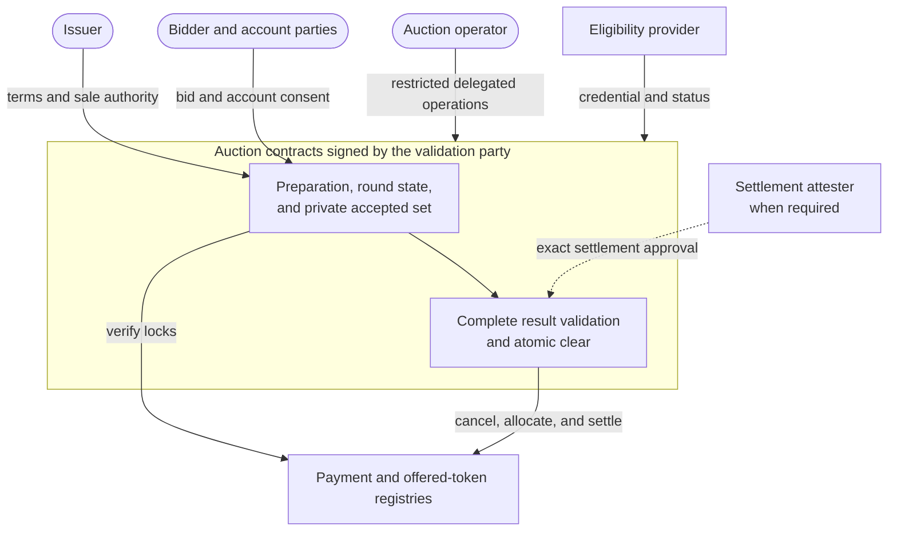
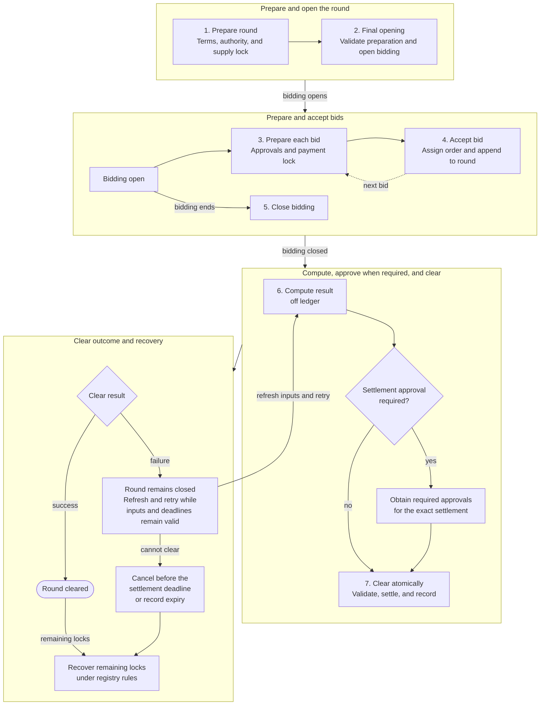
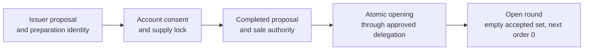
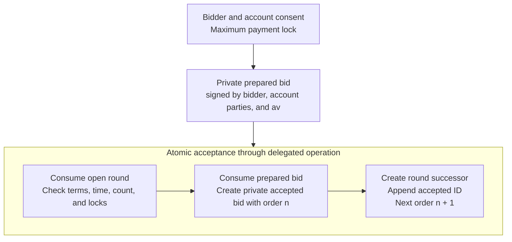
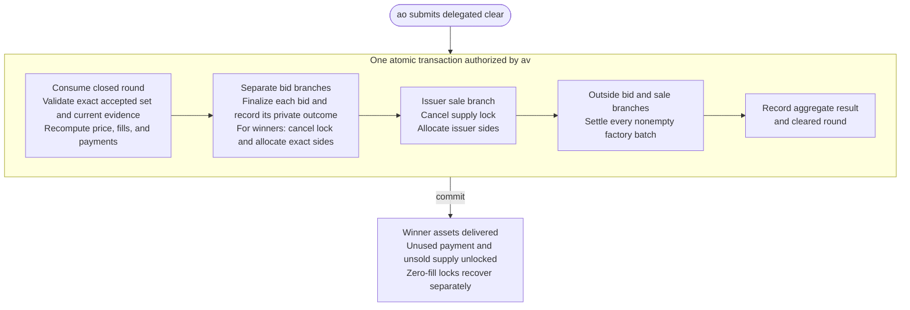
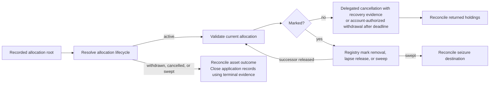

# Confidential auction reference architecture

This reference architecture defines a confidential auction for distributing a
fungible token in one sealed-bid round on Canton. The issuer offers inventory,
bidders authorize bounded payments, and an auction operator coordinates bidding
and settlement. A separate auction validation party, hosted by independent
organizations, validates the auction state and holds settlement authority.

The target application combines on-ledger contracts, an operator backend, wallet
integration, and a defined hosting topology. The referenced experiments provide
evidence for individual mechanisms. The complete auction requires implementation
and end-to-end validation.

## 1. Product Definition

This report specifies a confidential, uniform-price auction for distributing
fungible tokens on Canton. The token seller, called the **issuer**, offers a
fixed quantity in one round. Bidders specify the quantities they want and their
maximum unit prices. The terms are published before bidding opens. After it
closes, the clearing rule determines the quantities awarded and the common unit
price. Payments follow the published rounding rule.

Bids are private from competing bidders. The issuer, operator, validation hosts,
and each bid's authorizers receive the disclosures needed for their roles.
Registry rules govern asset visibility. The application checks bidder eligibility
at acceptance and before awarding tokens.

The settlement workflow uses **Canton parties**, on-ledger identities hosted by
organizations' **participant nodes**. These nodes validate their parties'
transaction views. **Asset accounts** name an owner and optionally a provider and
account identifier. **Account parties** supply the consent the registry requires
for account actions.

The registries use [Token Standard V2](https://github.com/canton-foundation/cips/blob/6f37c896a5a76ec3bc1aa67bc045623ae5df41e5/cip-0112/cip-0112.md)
**allocations** to authorize movements and reserve holdings when needed.
**Committed allocations** restrict account withdrawal until the settlement
deadline, subject to registry and seizure rules. The validation party is the sole
**settlement executor**, authorized to settle or cancel under those rules. The
operator uses its restricted delegation. Settlement still requires sender and
receiver consent.

The issuer locks supply before opening, and each accepted bid has a maximum
payment lock. These **self-return locks** authorize only the sender side of a
movement back to the same account. Prepared bid and issuer sale records provide
consent for final payment and delivery.

The **clear** cancels the supply and winners' payment locks, creates exact payment
and delivery allocations from returned holdings, and settles all winners in one
atomic transaction. The round produces one result or ends without a sale.
Zero-fill locks recover separately under registry rules.

### 1.1 Auction Mechanics

The issuer and auction validation party fix the round terms before bidding
opens. The **reserve price** is the minimum unit price the issuer accepts. A
**price tick** is the allowed price increment, and a **lot** is the allowed
quantity increment. A bidder's **fill** is the quantity it wins. The
**marginal price** is the lowest maximum unit price among bids receiving a fill.

The round terms include:

- the payment asset, offered token, and supported registry policies
- positive offered quantity, reserve price, price tick, and token lot size
- the payment quantum and rounding rule
- the bidding and settlement deadlines
- the **bid limit**, the maximum number of accepted bids
- bidder eligibility and exclusion rules
- the uniform-price rule and acceptance order used for rounding remainders

The offered quantity and bid quantities are whole lots. Reserve and bid prices
align to the price tick. The payment rounding function is monotone, and a single
lot at the reserve price produces a positive payment. The same function rounds
both a bid's maximum lock and its final payment, so a smaller fill at a price no
higher than the bid's maximum unit price cannot exceed that lock. Arithmetic
bounds are checked before opening and bid acceptance.

Every accepted bid receives the next order number in the round's sequence of
successful acceptance transactions. This is ledger acceptance order, not the
time an off-ledger request reached the operator. A rejected or retried command
does not reserve a number. The operator remains responsible for timely, fair
admission. A bidder can verify its own recorded acceptance and order.

Clearing accounts for every accepted bid. A bid whose credential is expired or
revoked, or whose active payment allocation is marked for seizure, receives zero
fill and is excluded from price-setting demand. Missing evidence or an
unavailable participant cannot be treated as proof of ineligibility. The
remaining bids are ordered by maximum unit price, with higher price bands
filling first. Bids below the reserve are rejected at acceptance.

When demand at the marginal price exceeds the remaining supply, that price band
receives proportional fills. Each provisional fill is rounded down to a whole
lot. Any leftover lots are assigned, one per bid in ascending acceptance order,
to bids in that band that have remaining demand. Accepted bids retain their
order through close, clear, and retries. The rule applies per bid. Deployments
must disclose their policy on multiple bids and related accounts because bid
splitting can affect the allocation of leftover lots.

All winners pay the same **clearing price**. If eligible demand does not exceed
the offered quantity, it is the reserve price. Otherwise it is the marginal
price. A round with no eligible demand records zero sales, uses the reserve as
its reported price, and releases the supply without calling an empty settlement
batch. Zero-fill bids retain separate payment recovery paths.

A rejected clear commits no auction-state or asset changes. Submission traffic
may still be charged, as described in [section 6.1](#61-traffic-and-application-rewards).
A retry includes the same accepted set and applies the same published rule to
current eligibility and allocation status. Those permitted status changes can
alter the proposed price and fills. A confirmation timeout alone never permits
dropping a bid. If the complete round cannot settle before its deadline, it ends
without a sale.

For example, consider 100 tokens, a reserve price of 8, and a lot size of 10.
All three accepted bids remain eligible and unmarked:

| Bid | Order number | Quantity | Maximum price | Fill |
|---|---:|---:|---:|---:|
| A | 0 | 50 | 12 | 50 |
| B | 1 | 80 | 10 | 40 |
| C | 2 | 40 | 10 | 10 |

Bid A receives 50 tokens, leaving 50 for B and C. Their proportional fills are
approximately 33.33 and 16.67 tokens. Rounding to lots gives 30 and 10. B receives
the remaining 10-token lot because its acceptance order precedes C's. The final
fills are 50, 40, and 10, and every winner pays 10 units of the payment asset per
token.

### 1.2 Scope

| Auction scope | Separate designs |
|---|---|
| One primary token distribution with one bidding period and one result | Repeated auctions, continuous issuance, secondary trading, and derivatives |
| Uniform-price allocation with proportional marginal fills | Pay-as-bid pricing, bonding curves, and discretionary book building |
| Existing inventory and fungible assets using compatible Token Standard V2 registries | Mint-on-demand delivery, nonfungible assets, and mixed Token Standard versions |
| One compatible Canton synchronizer and one atomic clear | Cross-synchronizer settlement and cross-chain delivery |
| Permissioned bidder eligibility and complete accounting for accepted bids | Public admission without eligibility checks and discretionary omission after acceptance |
| Operator submission through a separately governed validation party | Direct bidder submission of the complete clear or additional settlement executors |

Asset selection includes an explicit compatibility check. The registries must
support the account authorizations, committed self-return locks, synchronous
cancellation and final allocation creation, settlement, and recovery described
in [section 3](#3-target-design). Preparation may require several transactions.
Every final movement must complete inside the clear. A conformant Token Standard
V2 interface alone does not promise this particular workflow or the optional
approval and seizure extensions.

The bid limit bounds both the private accepted set and the largest clearing
transaction. Capacity is established for the actual registries and participant
topology. Splitting a round's winners across separately committed transactions
would change the all-or-nothing product and requires a separate design.

## 2. Architecture Overview

The application coordinates account consent, auction state, and asset registry
operations. Preparation obtains the supply and payment locks and the account
approvals for final movements. Opening and acceptance bind those inputs to a
round. After close, the operator proposes a result. The validation party's
contracts check the complete accepted set and settle the result atomically.

The payment and offered token may use different registries or one compatible
registry. Each registry enforces its account authorizations and asset policies.
The auction application enforces the round terms and complete clearing rule.
The validation hosts confirm the portions of the transaction visible to their
party, including the auction checks. Hosting, authorization, and submission
have distinct responsibilities in the deployment below.

### 2.1 Personas and Components

In Token Standard terminology, each asset is an **instrument**, and its
**instrument admin** governs the asset implementation. An **allocation factory**
creates allocations, while a **settlement factory** settles compatible
allocations for that admin. A Daml **signatory** authorizes a contract and its
choice consequences. A choice's **controller** authorizes exercising it. An
**observer** receives visibility without providing that authority.

| Persona | Responsibility |
|---|---|
| Bidder and account parties | Propose quantity and maximum price and authorize payment and token receipt. |
| Issuer | Proposes terms, supplies inventory, and authorizes its asset movements. |
| Auction operator (`ao`) | Runs the backend, coordinates preparation and recovery, computes results, and submits delegated operations. |
| Auction validation party (`av`) | Signs auction state and restricted delegations, validates complete transitions, and acts as sole allocation executor. |
| Instrument admins | Enforce account authority, settlement, approval, and seizure policies. One admin may govern both instruments. |
| Eligibility provider | Authenticates bidder-owner credentials, expiry, and revocation status. |
| Settlement attester, when required | Approves exact movements under instrument policy. Independent approval requires an organization independent of the admin and operator. |
| Auditor, when enabled | Records and checks `av`'s projection through an observation-only host. |

Account authority is registry-defined for each action, separate from instrument
admin authority and settlement approval.
[Canton Coin supports basic accounts](https://github.com/canton-foundation/cips/blob/6f37c896a5a76ec3bc1aa67bc045623ae5df41e5/cip-0112/cip-0112.md#6-canton-coin-implementation)
with no provider or additional identifier. [Section 2.3](#23-privacy-and-result-trust)
specifies each role's visibility, including providers and shared hosts.

#### Hosting and Governance

The worked deployment uses the operator organization and two independent
validation organizations, each running a participant that hosts `av`, with a
2-of-3 confirmation threshold. The operator hosts `ao` separately as a
single-organization party. The issuer, account parties, asset admins, and
attesters use their own or explicitly trusted participants. Sharing a participant
with a competitor discloses hosted-party data to that participant's operator.

Three controls are configured independently:

- **Confirmation:** two of the three validation hosts must confirm `av`'s views.
  Each independently vets the approved auction and dependency packages.
- **Topology governance:** a 2-of-3 decentralized namespace governs changes to
  `av`'s hosting and other topology mappings. A single operator cannot lower the
  confirmation threshold or appoint a replacement host unilaterally.
- **Administrative submission:** separately configured 2-of-3 external signing
  authority controls direct submissions as `av`, including creation and
  revocation of delegation contracts. Confirmation does not itself provide
  these signatures or Daml account authority.

These are deployment choices using Canton's
[decentralization controls](https://docs.canton.network/overview/reference/decentralization)
and [multi-signature submission](https://docs.canton.network/global-synchronizer/production-operations/multi-sig).
The organizations approve the exact topology and keys before onboarding users.
A colluding governance/signing quorum remains able to change trusted code or
authority. Independent hosting does not remove that trust boundary. Every host
receives the data visible to `av`, regardless of the confirmation threshold.

The operator submits as `ao` through `av`-signed contracts exposing specific
preparation, opening, acceptance, close, clear, and recovery choices.
These choices call fixed application workflows. They do not expose arbitrary
exercises, partial winner settlement, or unrestricted registry cancellation.
Governance can revoke an operator's delegation and appoint a replacement.
Opening authority is separately revocable so a release cutoff can stop old
opening paths while existing rounds retain operations and recovery.

#### Application Records

A **contract ID** identifies one contract. Recreating it produces a different
ID. An allocation's **root** is the original lock's ID. Its **current successor**
is the active continuation under the registry's lifecycle rules. Auction records
retain the root. Operations resolve and validate the successor.

| Component | Responsibility |
|---|---|
| Preparation state | An `av`-signed workflow records a unique preparation identity, terms, account consent, and one allocation root. Each transition consumes the previous state. Preparation can complete once or be abandoned. |
| Round proposal and opening authority | The issuer proposes terms. A governed opening delegation authorizes the approved opening workflow. Opening consumes the completed proposal and fixes the round terms. |
| Published terms | Signed by issuer and `av` and disclosed to prospective bidders. It contains the fixed terms and stable round identity, without the private accepted list. |
| Round state | Signed by issuer and `av`, observed by `ao`, and private from bidders. It records the lifecycle state, next acceptance number, and bounded list of accepted bid contract IDs and order numbers. |
| Prepared bid | Signed by bidder, required account parties, and `av`, and also visible to issuer and operator. It binds the proposed bid, round, lock root, and complete account approvals. It has no acceptance number. |
| Accepted bid | Signed by issuer, `av`, bidder, and the bid's account parties, with `ao` as observer. It records the immutable bid, lock root, and acceptance number. Its finalization choice supplies that bid's account authority inside the complete clear. |
| Issuer sale authority | Records the inventory lock root and account consent for payment receipt and token delivery. When bound at opening, issuer, `av`, and the required issuer account parties sign it. |
| Results | An aggregate result for issuer, `av`, and operator, plus one private outcome for every accepted bid, including zero fills and exclusion reasons. |
| Asset registries | Create, cancel, withdraw, and settle allocations and enforce asset controls. Registry state remains distinct from auction state. |

Recording an account party's identifier does not supply its authority. The
preparation workflows obtain its consent, and the corresponding bid or sale
choice carries that authority only into its own nested asset operations.

### 2.2 Auction Lifecycle

The same lifecycle applies to every round:

Preparation can span several consent transactions. Opening, each acceptance,
close, and clear are separate atomic transactions submitted through restricted
delegation. Acceptance appends to the private bid list, close fixes it, and clear
validates and settles the complete result.

Round state and registry state are independent. Locks can outlive failed
preparation, cancellation, expiry, or a zero-fill result. Their release follows
the registry rules in [section 3.5](#35-release-locked-assets).

### 2.3 Privacy and Result Trust

A **transaction projection** contains the branches a party may see. A
participant operator can access its hosted parties' projections. Combined roles
and shared hosts therefore combine visibility.

| Persona | Private auction records | Asset records |
|---|---|---|
| Bidder and bid account parties | Their complete prepared and accepted bid, acceptance number, and private outcome | Their allocations and movements, subject to registry disclosure rules |
| Issuer, operator, and validation party | Every prepared and accepted bid, the complete accepted set, and the complete clear | Every movement in the clear |
| Instrument admin | No bid or private outcome from this role alone | Movements governed by that admin |
| Account provider | The full bid when required to sign its account approvals | Every holding and movement for its accounts |
| Eligibility provider | The credentials and status it issues. No bid or private outcome from this role alone | No asset records from this role alone |
| Settlement attester | No bid or private outcome from this role alone | The exact batch it approves |
| Auditor hosting `av` with observation permission | The full validation-party projection, including every accepted bid and its outcome | All settlement branches visible to `av` |

Bid-authorized operations occupy separate child branches. Shared factory calls
sit outside them. Issuer, `av`, and operator see the enclosing clear. The actual
registry and provider projections must be verified before deployment.
[Canton Coin movements are public](https://github.com/canton-foundation/cips/blob/6f37c896a5a76ec3bc1aa67bc045623ae5df41e5/cip-0112/cip-0112.md#6-canton-coin-implementation)
even when bid records are private.

The clearing rule determines the result. The closed round's private list
determines which bids must be included. Together they prevent omissions,
additions, duplicates, and altered order without enumerating private ledger
state. These guarantees depend on approved code and governance
([section 5](#5-security-and-auditability)).

Before acceptance, the operator can refuse or delay requests and influence their
order. Signed submission receipts and an admission policy support audit, but
give unaccepted bids no right to a fill. After acceptance, unavailability is not
an exclusion reason. The operator can still fail to clear on time.

An optional independent auditor continuously records `av`'s projection through
an observation-only host. It receives all disclosed bids, with user consent,
but gains no confirmation vote or submission authority. It checks acceptance
against the closed list, recomputes results and exclusions, and reconciles
recovery. Auditing earlier events requires a verified historical export.

Failed submissions create no committed auction events, and completion errors
are not automatically shared. The operator retains receipts, command IDs,
timing, and completion evidence for audit. Claiming a timeout does not prove its
cause.

### 2.4 Institutional Controls

D1 through D4 are local shorthand for distinct institutional controls. The
round publishes their policies and responsible parties before bidding:

| Control | Owner and treatment |
|---|---|
| Settlement approval (`D1`) | An optional instrument policy requires the configured attester to approve the exact settlement batch. The target approval binds the full settlement reference (`SettlementInfo`), exact legs, and validity period. Section 3.4 identifies the additional binding required beyond the cited experiment. |
| Allocation seizure (`D2`) | An optional instrument policy allows marking a lock and, when authorized, sweeping its holdings. A mark can block settlement and ordinary recovery. |
| Bidder eligibility (`D3`) | The application checks a credential for the common owner of the bidder's payment and delivery accounts at acceptance and clear. The configured provider authenticates current status, expiry, and revocations. |
| Application governance (`D4`) | The validation organizations govern `av`'s topology, signing, approved code, and delegations. Restricted workflows define the operator's opening, admission, close, clear, cancellation, and recovery powers. |

Acceptance fixes the credential's provider, owner, and identity for that bid.
For revocable credentials, it also binds a provider-signed status record. That
record states whether the credential is valid or revoked and gives its expiry.
A status update consumes the prior record and creates an authenticated successor.
The provider's implementation must preserve one active status for that identity.
Clear checks the current successor against the accepted binding and compares its
authenticated expiry with ledger time. Revocation requires an explicit revoked
status. Archiving a credential without leaving this evidence is insufficient.

A copied status can become stale, and absence from an operator's cache proves
neither expiry nor revocation. Missing current evidence blocks validation.
Nonrevocable credentials still need authenticated ownership and expiry checks.
The credential and status contracts include `av` as an observer, allowing the
acceptance and clear choices to fetch them under their own authority. Status
successors preserve this visibility. The provider receives no bid amounts or
complete accepted list through these checks. Related-party screening, when
required, is part of the fixed eligibility policy.

Before accepting an instrument, the deployment publishes whether seizure is
enabled. Its policy fixes who can mark, remove a mark, release a lapsed mark, and
sweep. It also specifies the permitted destinations, maximum duration, and any
required legal order. A disabled policy must be enforced by the asset code on every privileged
movement path. The application cannot override the registry's seizure policy.

Marking, unmarking, or releasing a lapsed mark may consume an allocation and
create a successor with a different contract ID. The auction binds the original
root and checks an authenticated current successor against that binding. A
live marked payment successor gives its bid zero fill. A marked supply successor
blocks the entire clear. Terminal consumption without a funded successor, such
as a sweep, invalidates the required lock and prevents clearing the round.
[Section 3.4](#34-create-exact-allocations-and-settle) defines the lineage checks,
and [section 3.5](#35-release-locked-assets) defines recovery.

Governance pauses new preparation and acceptance by consuming their separately
revocable delegation grants. Resumption issues approved replacement grants. The
grants for close, clear, and recovery remain active, so the pause preserves those
operations for existing commitments. Revoking a compromised operator's
delegation requires appointing a replacement for those operations. Replacement
procedures specify the operator party and hosting, authorized access to existing
private records, and continuing disclosures to the former operator. Revoking
delegation leaves existing observer rights unchanged. Ordinary account-authorized
withdrawal remains subject to registry deadlines and policy.
Operator cancellation ends an uncleared round without a sale and records a
reason. It does not permit selective removal of an accepted bid or early release
of its lock while the round remains clearable.

## 3. Target Design

Preparation obtains the locks and consent. Opening and acceptance validate and
bind them to the round. The following choices define the target application.

### 3.1 Prepare and Open the Round

Round preparation uses [proposal and acceptance](https://docs.canton.network/appdev/modules/m3-authorization#use-propose-accept-workflow-for-one-off-authorization)
workflows to collect the issuer's and account parties' consent. The application
creates an `av`-signed preparation state with a unique identity derived from its
initial contract ID. Each preparation transition consumes the previous state.
Completion binds one supply allocation root and one issuer sale authority to
that identity. Abandonment prevents later completion.

The terms identify both instruments and admins, supported accounts, factories,
asset policies, eligibility evidence, economics, bid limit, deadlines, and
clearing-rule revision. The bidder uses payment and delivery accounts with the
same owner. The issuer uses payment-receipt and inventory accounts. Registry
rules determine all required account parties. Preparation obtains consent for
both payment receipt and token delivery even when these require different parties.

The initial supply allocation locks the offered quantity in the sender-only
self-return form defined in section 1. It is committed through the settlement
deadline, names only `av` as executor, and binds the preparation identity in its
settlement reference. Opening rejects an external destination or unrelated
preparation reference. The missing receiver side prevents self-return settlement.

The operator invokes the governed opening delegation as `ao`. That delegation
supplies `av` authority to the completed proposal's opening choice. The proposal
also carries issuer authority. Opening checks the exact terms, account approvals,
sale record, and current supply allocation. The lock must have the expected
admin, instrument, account, quantity, commitment, executor set, preparation
reference, and deadline, and must be active and unmarked. Supported successor
allocations follow [section 3.4](#34-create-exact-allocations-and-settle).

Opening atomically consumes the completed proposal, binds the sale authority
through its account-authorized choice, and creates issuer- and `av`-signed round
and terms records. The round starts with an empty accepted list and next order
zero. Its stable identity derives from the consumed proposal and persists across
state successors. The disclosed terms carry that identity without the private
list. Consuming preparation prevents a second opening of the same supply.

The current opening grant must authorize the workflow. Opening precedes the
bidding deadline by the published preparation margin. The bidding deadline
precedes the settlement deadline by the clearing margin. Opening authority is separately
revocable ([section 6.3](#63-smart-contract-upgrade-process)).

Opening failure leaves the proposal and lock intact. The operator can retry or
abandon preparation through its consuming cancellation path and recover the
lock under [section 3.5](#35-release-locked-assets). Opening and abandonment
compete for the same state.

### 3.2 Prepare and Accept a Bid

The wallet authenticates the terms before the bidder approves quantity,
maximum price, and payment and delivery accounts. Preparation follows section
3.1 with its own unique identity. Bidder, account parties, and `av` sign the
prepared bid, authorizing the maximum lock and bounded final payment and receipt.

The maximum lock is the published rounding of `requested quantity x maximum
unit price`. It uses the committed self-return form, sole `av` executor, and
preparation-specific settlement reference. Completion consumes preparation and
binds one root. Matching that reference and allowing completion only once
prevents reusing the lock through another prepared bid.

The acceptance workflow checks:

- the admission grant is active, the round is open, ledger time precedes the
  bidding deadline, and the accepted count is below the bid limit
- the bid binds the same stable round identity and exact published terms, with
  positive whole-lot quantity, tick-aligned price at least the reserve, and
  representable quantities and payments
- both registries support the accounts, their common owner is the bidder, and
  authenticated eligibility evidence is current and valid, with the provider,
  credential identity, and any status-record binding retained in the accepted bid
- the supply remains active and unmarked
- the payment allocation or authenticated successor is active and unmarked,
  with the expected admin, instrument, account, amount, commitment, preparation
  reference, executor set, and deadline

Acceptance consumes the current round state and exercises the prepared bid's
consuming acceptance choice with issuer and `av` as controllers. The round
supplies those authorizers. The prepared bid supplies bidder and account-party
consent. That child creates the accepted bid with order `n` and returns its ID.
The enclosing round choice then appends `(acceptedBidCid, n)` and creates the
round successor with next order `n + 1`. Bidders see their own child branch, not
the private list or round successor.

The list length equals the next order number, starting at zero. Entries are
distinct, and all transitions preserve existing entries and their order. Competing acceptances consume
the same round state. Only one succeeds, and the other retries against its
successor. Failed acceptance leaves the prepared bid and lock intact.

The bidder or delegated operator can abandon an unaccepted preparation and
recover its lock. An accepted bid cannot be unilaterally withdrawn or amended
while the round remains clearable. [Section 3.5](#35-release-locked-assets)
defines recovery after zero fill, round termination, or the registry deadline.

### 3.3 Close Bidding and Compute the Result

At or after the bidding deadline, delegated close consumes the open round and
creates a closed successor with the same terms, sale authority, accepted list,
and next order number. It has no acceptance choice. Acceptance requires ledger
time before that deadline and competes for the same state. Reaching the bid
limit stops admission but does not advance close.

The operator reads every bid in the closed list, resolves current credentials
and allocation successors, and computes the result under section 1.1. It obtains
any required approval for those exact movements. Clear independently verifies
the list, current evidence, and result under section 3.4.

Only the published credential and seizure exclusions remove demand from pricing.
Missing evidence, stale IDs, and participant timeouts require reconciliation or
retry. A consumed lock without a funded successor prevents clear, even for a
losing bid. A rejected attempt leaves the closed round intact. Retries recheck
current evidence and recompute while preserving every accepted bid.

### 3.4 Create Exact Allocations and Settle

The clear validates the complete result and settles all winner movements in one
Daml transaction. It consumes the closed round, every accepted bid, and the
issuer sale authority, and creates terminal result records. A failure rolls
back all of these actions and every nested asset operation.

#### Validate the Result and Authority

The clear fetches the exact accepted list recorded by the closed round, checks
each bid's round and order, and rejects duplicates or substituted records. It
recomputes eligibility, exclusions, ordering, clearing price, fills, and rounded
payments. It checks total fills against supply, each fill against demand, each
payment against the maximum lock, lot and tick alignment, and all deadlines.
The proposed result must match this computation exactly.

The following choice structure supplies authority. These names describe target
application choices, not an existing auction package API.

| Choice | Signatories of its contract | Controller | Permitted consequences |
|---|---|---|---|
| Delegation: clear round | `av` | `ao` | Check the delegated scope and invoke the fixed clear choice on the specified closed round. |
| Closed round: clear | Issuer and `av` | `av` | Validate the entire accepted set and result, finalize every bid and the sale authority, settle every batch, and create the aggregate result. |
| Accepted bid: finalize | Issuer, `av`, bidder, and required bid account parties | `av` | Recheck that bid's bound terms and result limits. For a winner, cancel its lock and create its exact payment and delivery authorizations. Create the bid's private outcome. |
| Issuer sale authority: finalize | Issuer, `av`, and required issuer account parties | `av` | Recheck the bound round and aggregate sale limits, cancel the supply lock, and create the issuer's exact authorizations. |
| Registry cancellation and settlement | Registry-defined signatories | Registry-validated actors, using `av` executor authority | Apply only the supported registry operations with their required additional authority and approval. |

The [Daml authorization rule](https://docs.canton.network/appdev/modules/m3-authorization#damls-authorization-model)
gives each exercise's consequences the authority of its controllers and the
exercised contract's signatories. Authority from an unrelated ancestor does not
automatically pass through a nested exercise. The bid and sale choices therefore
carry their own required account parties and `av`. Factories receive the actors
required by their documented rules.

The operator cannot directly finalize a bid, invoke the sale choice, or settle
an allocation as `av`. Its delegation grants only the complete workflow, with
no caller-supplied action body or arbitrary choice forwarding. Bid and sale
choices enforce local bounds. The enclosing round enforces global pricing and
completeness. Consuming the round and those records prevents replay or a second
successful clear. Direct submissions approved by `av`'s administrative quorum,
or malicious code accepted by the required validators, remain governance trust
boundaries rather than protections supplied by the operator delegation.

Required registry implementations also enforce their batch authorization on
direct allocation-settlement calls. An executor cannot bypass exact side
coverage or instrument approval by calling a subordinate registry choice.

#### Create Exact Allocations and Settle Batches

A **transfer leg** identifies an instrument, sender account, receiver account,
amount, and `transferLegId`. Token Standard V2 represents consent to each leg as
separate **sender** and **receiver** sides. Every winner has two legs:

| Leg | Sender | Receiver | Amount |
|---|---|---|---:|
| Payment | Bidder payment account | Issuer payment-receipt account | Published rounding applied to `fill x clearing price` |
| Delivery | Issuer inventory account | Bidder delivery account | Fill quantity |

These require four authorization sides per winner. Allocation count depends on
the account, admin, and factory grouping: one allocation can authorize several
sides. For example, the issuer can authorize receipts from multiple winners in
one allocation for its payment account, and deliveries in one for its inventory
account, subject to registry limits. Each side appears exactly once. Combining
sides must preserve its authorizing account and the bid's visibility boundary.

The clear assigns deterministic, distinct leg IDs from the acceptance number
and movement kind, such as `bid-7-payment` and `bid-7-delivery`. Each leg belongs
to exactly one **settlement batch**, grouped by compatible instrument admin and
settlement factory. Both assets can share a batch when that factory supports
them. Otherwise all required batch calls still execute in this one transaction.

For each batch, the clear constructs one identical `SettlementInfo` value for
every allocation and the `SettlementFactory_SettleBatch` call. Equality includes
`executors`, `id`, `cid`, and `meta`, not merely a round label. The executor set is
`[av]`. The `cid` identifies the stable round, `id` distinguishes the batch, and
metadata is fixed for that settlement. The `(id, cid, meta)` identity is unique
for each settlement under that executor set. Daml cannot convert a contract ID
to text, so the round reference belongs in `cid`, not a constructed textual ID.
The initial self-return locks use their own preparation identities and never
substitute for these final allocations. Shared settlement metadata contains no
private bid quantities or maximum prices.

Inside each winning bid's finalization choice, `av` cancels the current payment
lock. The choice uses the cancellation result's `authorizerHoldingCids` to fund
the exact payment allocation and creates the bidder's delivery receiver side
under its recorded account consent. The allocation result must be completed
synchronously. Its unused payment holdings remain with the bidder's account.
The issuer sale choice similarly cancels the supply lock, funds exact deliveries
from the returned holdings, and creates the issuer's payment receiver sides.
Unused inventory remains with the issuer. The application checks returned
instruments, accounts, amounts, and completed allocation references. It does not
reuse pre-cancellation holding IDs or rely on an off-ledger balance estimate.

Each bid choice receives only its own terms, result, leg sides, and settlement
references. Its account parties do not receive the complete result as a choice
argument. The choice checks its stored terms and stable round identity without
fetching the already-consumed round. Private outcomes are created in the same
bid branch. The sale branch contains issuer authorizations. The enclosing clear
collects the resulting allocation references and calls each settlement factory
outside both kinds of account-authorized branch.

Each factory validates the exact `SettlementInfo`, its instrument admin, unique
leg IDs, and complete sender/receiver coverage without extra or missing sides.
The clear supplies the exact legs and finalized allocations produced by the
validated result. Where D1 applies, the factory must verify and consume an
approval binding the full `SettlementInfo`, including `cid` and `meta`, and the
exact legs. This prevents approval reuse for another round with the same textual
batch ID and movements.

The [reference approval contract](https://github.com/OpenZeppelin/canton-contracts/blob/7696749737885e25cd88422847105f890f03b00d/experiments/token/tokenCIP112-v1/daml/OpenZeppelin/TokenCIP112V1/D1.daml)
checks `settlement.id`, executors, exact legs, trusted attester, and validity. It
does not bind `cid` or `meta`. A D1-enabled deployment therefore needs an approval
payload and verifier that also bind those fields. Factory checks that allocations
share the same settlement do not establish what the attester approved.

An expired approval or one for different movements fails. No final allocation
may require a later acceptance transaction. A failure in any factory rolls back
all factories, lock cancellations, approval consumption, final allocations,
outcomes, and round consumption.

This design uses self-return locks followed by cancellation and exact allocation
creation because the final counterparties and amounts are known only at clear,
while the bid and sale contracts already hold the required bounded consent.
It requires synchronous cancellation with usable holding references and
synchronous final allocation and settlement. The cited token experiment provides
those mechanisms and rejects iterated settlement. V2 iterated settlement is a
separate possible design with different funding and continuation requirements.
The auction does not assume every V2 registry supports either profile.

#### Validate Allocation Successors and Record Outcomes

Opening, acceptance, clear, and asset release validate the current allocation
against its recorded root. The backend discovers successor IDs from registry
lifecycle events visible to `av`. The ledger checks the supplied contract's activeness,
authenticated registry implementation, and root relation. For an initial
allocation with no `originalAllocationCid`, its own ID must equal the bound root.
For a successor, `originalAllocationCid` must equal that root. The accepted
registry must preserve a single active continuation and prevent callers from
forging that relation. Matching a caller-provided root field alone is insufficient.

The successor must preserve the authorized account, instrument, amount, sender
side, commitment, executor set, settlement information, and agreed deadline.
Only lifecycle changes allowed by the fixed asset policy, such as a seizure
mark, are permitted. Registry-specific status evidence is required where the
standard view does not expose those changes. A stale ID triggers reconciliation
to the current successor. A consumed root with no funded continuation, including
a swept payment lock for an otherwise losing bid, prevents the complete clear.

The clear records one private outcome for every accepted bid: acceptance number,
fill, clearing price, rounded payment, exclusion reason when applicable, and
whether its lock was consumed or remains for recovery. Exclusion evidence binds
the credential identity accepted for that bid and its current authenticated
status, or the current registry seizure state. The aggregate record retains the
accepted count, price, total sold, total payments, and unsold supply for issuer,
`av`, and operator. Monetary totals use the sum of individually rounded payments.

A zero-fill bid's finalization records its outcome without cancelling its lock.
This also covers a live marked payment allocation: fetching its status is
distinct from performing a prohibited asset movement. The outcome is not a
claim that a refund has completed. The bidder and account parties may still be
needed to confirm that outcome branch, so exclusion does not solve participant
unavailability.

With no winners, the clear consumes the same application records, records zero
sales at the reserve price, and cancels the unmarked supply lock under the sale
authority. It creates no final movement allocations and calls no settlement
factory with an empty leg list. All payment locks follow separate recovery.
When winners exist, their exact movements and the supply release succeed with
all outcomes or the entire transaction rolls back.

### 3.5 Release Locked Assets

Releasing a remaining lock uses the authenticated current allocation from section
3.4. A terminal round or zero-fill outcome permits recovery but does not itself
move assets.

| Recovery path | Required evidence and authority | Asset effect |
|---|---|---|
| Abandoned preparation | Consuming cancellation prevents opening or acceptance. Delegated recovery verifies the preparation identity and terms, including for locks created before completion. | `av` cancels the matching unmarked lock. |
| Zero-fill bid | An `av`-signed private outcome identifies the bid and retained root. | Delegated `av` cancellation releases the unmarked payment lock. |
| Cancelled or expired round | The terminal record retains sale authority and accepted list. Delegated cleanup verifies membership. | Close each application record independently. Release its remaining lock when registry policy allows. |
| Deadline withdrawal | The registry deadline has passed, and the required account parties authorize withdrawal. | An unmarked committed allocation becomes withdrawable independently of operator bookkeeping. |
| Mark removal or lapse | The registry's designated actor authorizes removal or release. | Resolve the successor and retry ordinary cancellation or withdrawal. |
| Authorized sweep | Privileged actors satisfy the published seizure policy. | Record movement to the authorized destination as seizure, not refund. |

Delegation permits cancellation only in these recovery states or inside a
complete clear. Broader registry powers of `av` remain controlled by its
administrative quorum.

Round cancellation or expiry consumes the open or closed state and records its
reason or deadline. It competes with clear but can commit without cleaning up
every bid. Later cleanup uses separate bid branches, passing only each bidder's
outcome and keeping the accepted list outside those branches. One unavailable
bidder therefore need not block recovery for others.

If the allocation has already been consumed without a funded successor,
application cleanup uses the terminal evidence above without fetching or
cancelling it. The backend reconciles withdrawal, cancellation, or seizure from
authenticated registry events and holdings. Application closure does not establish
that assets were returned. Unverified asset outcomes remain unresolved.

Cancellation, withdrawal, and seizure normally commit separately. Competing
actions can consume an allocation only once. Reconcile the winning registry
event and returned holdings before retrying, using lifecycle and holdings-change
events where supported. A lapsed mark may need an explicit release transaction.
Recovery still requires its account and registry participants, synchronizer,
and traffic.

### 3.6 Manage Execution and Timing

| Stage | Transaction boundary |
|---|---|
| Round or bid preparation | Several independently committed consent and allocation transactions |
| Opening | One consuming proposal transition |
| Acceptance | One consuming round and prepared-bid transition |
| Close | One consuming round transition |
| Compute and approval | Off-ledger computation and optional separate attester transaction |
| Clear | One transaction for every accepted bid and factory batch |
| Recovery | Independent application and registry transactions |

Choices check ledger time: acceptance requires a time before the bidding
deadline, close requires a time at or after it, and clear requires a time before
the round's settlement deadline. Every initial lock remains committed at least
through that deadline. Its registry deadline, storage expiry, and any holding
lock expiry must support the entire workflow. Longer locks disclose the later
withdrawal time to users. Preparation, signing, confirmation, and recovery
margins are published before funds are locked.

The backend uses the earliest bound imposed by the round, registries, approvals,
and submission time limits. Ledger time checks and Canton recording-time bounds
serve different purposes: a locally elapsed request timeout is not evidence that
the transaction can no longer commit. Prepared transactions or external
signatures whose inputs or validity bounds change must be regenerated.

The operator queues admission, refreshes round state after conflicts, and tracks
prepared bids to avoid duplicate acceptance. Capacity tests set the bid limit
using a complete clear, including zero-fill outcome branches.

For an uncertain command, persist its intended change, command ID, Ledger API
user ID, acting parties, submitting participant, and completion-stream position.
Retries of that same change use the same change identity and participant,
deduplication coverage spanning the retry period, and a fresh submission ID.
Recover the completion and committed ledger state before reporting success or
failure. Prepare a different attempt only after definitive rejection or after
the prior attempt's supported latest recording bound has passed and its outcome
has been reconciled. See [command deduplication](https://docs.canton.network/appdev/deep-dives/command-deduplication),
[time handling](https://docs.canton.network/appdev/modules/m3-working-with-time),
and [external signing](https://docs.canton.network/appdev/deep-dives/external-signing-transactions).

Retries preserve the accepted set and apply only the eligibility and seizure
changes allowed by section 1.1. Each branch needs its issuer, bid/account,
registry, and `av` confirmations as applicable, plus eligibility-provider
confirmations for credential/status fetches and attester confirmations for
consuming D1 approvals. An approval issued earlier still requires its attester's
confirming hosts at clear. If time runs out, cancel or expire the round and
recover its locks. Confirmation supplies neither missing account consent nor a
guarantee of availability.

## 4. Failure Recovery

Rejection commits none of that transaction's actions. Earlier preparation and
registry transactions remain effective. Reconcile uncertain submissions under
[section 3.6](#36-manage-execution-and-timing) before treating them as rejected.

The operator can cancel an uncleared round before its settlement deadline or
record expiry at or after it. Clear's own time check prevents late settlement
even if expiry recording is delayed. Release follows
[section 3.5](#35-release-locked-assets).

| Failure or change | Consequence and operator response |
|---|---|
| Preparation stops after locking funds | No opening or acceptance is implied. Complete preparation or abandon it and recover the lock with the account parties. |
| Opening rejects its inputs or grant | Proposal remains unconsumed. Correct inputs and retry, or abandon. An older command cannot bypass a revoked grant. |
| Acceptance fails validation or loses a state race | No bid append or order increment commits. Reconcile and retry the same prepared bid while admission remains allowed. |
| Close precedes a pending acceptance | The list is final and that bid remains unaccepted. Report the failed admission and recover its prepared lock. |
| Clear has incorrect inputs or result, or any factory step fails | All clear effects roll back, and the round stays closed. Correct inputs and retry the complete clear before its earliest deadline. |
| D1 approval is missing, stale, or mismatched | Whole clear fails. Obtain approval for the exact current settlement and legs, or end without a sale. |
| Authenticated credential expiry or revocation | Keep the bid in the accepted set with zero fill, then recover separately. Missing evidence instead blocks validation. |
| Live marked payment lock | Record zero fill. Registry-authorized actors may remove the mark or sweep. Ordinary recovery remains blocked while marked. |
| Marked supply lock | Whole clear is blocked. Registry-authorized actors resolve the mark. Retry or cancel/expire. |
| Registry lifecycle changes a contract ID | Resolve and validate the successor. A consumed ID alone does not prove lost funding. |
| Sweep, withdrawal, or other consumption leaves no funded successor | Clear is impossible. Reconcile the asset outcome, terminate the round, close remaining application records, and recover other locks. |
| Operator unavailable or delegation revoked | Governance restores service or appoints a replacement. Account withdrawal remains subject to registry deadlines and policy. |
| Required confirming hosts or party quorum unavailable | Retry the same accepted set, including zero-fill branches. Never omit bids or reprice for a timeout. Terminate if time runs out. |
| Synchronizer, registry, or traffic unavailable | Responsible infrastructure operators restore service. Reconcile state before resuming. |

Cancellation, expiry, and each later recovery need only their own transaction
dependencies. This limits shared failure, but cannot guarantee withdrawal while
a required participant, registry, or synchronizer is unavailable.

## 5. Security and Auditability

The architecture separates ledger-enforced properties from parties and systems
that remain trusted.

### 5.1 Ledger-Enforced Properties

These are target-contract requirements under approved code and topology.
End-to-end auction implementation and validation remain required.

| Property | Enforcing mechanism |
|---|---|
| Fixed terms and ordered admission | Consuming opening and acceptance transitions in sections 3.1-3.2. |
| Complete accepted set | Atomic append, closed list, exact clear inputs, and an outcome per bid in sections 3.2-3.4. |
| Bounded payment and reserved supply | Account-signed approvals, verified locks, and local and aggregate movement checks in section 3.4. Disclosed seizure powers remain effective. |
| Uniform-price result | Clear recomputes the section 1.1 rule using authenticated current evidence. |
| Atomic settlement and replay prevention | Round and bid consumption, restricted delegation, complete batch coverage, and rollback in section 3.4. |
| Scoped authority and visibility | Separate bid/sale branches and shared factory calls in section 3.4, subject to the registry and hosting disclosures in section 2.3. |
| Controlled recovery | Evidence and authority in section 3.5. Registry and infrastructure dependencies still apply. |
| Governed opening cutoff | Revocable release grants in section 6.3, independently of package preferences. |

### 5.2 Trust Boundaries

| Trusted party or system | Required behavior and residual risk |
|---|---|
| Operator | Admit and submit promptly under the published policy, protect bid data, and coordinate recovery. It can censor or reorder requests before acceptance, cancel an uncleared round, or fail to submit. Accepted-set validation does not force progress. |
| Validation organizations | Independently verify code, maintain the configured confirmation and governance thresholds, protect keys and bid data, and restrict administrative use of `av`. A controlling quorum can change hosting or authorize actions outside the operator's delegated workflow. |
| Issuer | Supply valid inventory and account consent and protect all disclosed bids. Its access to private demand creates an informational advantage that requires operational and institutional controls. |
| Account parties and their hosts | Protect consent and availability. Shared custodians or hosts receive the union of their customers' authorized disclosures. Parties whose combined authority is sufficient may authorize actions outside the intended application. |
| Instrument admins and factories | Enforce authentic allocation lineage, complete settlement coverage, and the published seizure and approval policies. Asset policy or malicious asset code can affect holdings independently of auction state. |
| Eligibility provider | Maintain authentic, current status for the configured credential identities. Incorrect revocation or expiry evidence can change eligible demand and thus price and fills. |
| Settlement attester | Approve only exact movements satisfying the instrument policy. Withheld approval blocks settlement. An affiliated or compromised attester weakens any promised independent review. |
| Canton infrastructure | Maintain the required synchronizer, participant availability, packages, and traffic. Consensus and transaction atomicity do not guarantee admission or timely confirmation. |
| Auditor | Preserve the full disclosed history and independently reconcile accepted bids, results, exclusions, and recovery. Observation detects inconsistencies and operational omissions but supplies no veto or liveness guarantee. |

The operator's approved delegation enforces the accepted set but cannot force
admission or progress. Receipts, service commitments, audit, and replacement
procedures address that risk. A bidder verifies its own acceptance and outcome.
Its limited projection cannot support independent recomputation of the auction.

Confirmation thresholds provide no threshold confidentiality. Any recipient can
disclose bid data, and removing a host cannot retract it. Wallets identify these
organizations before consent.

An SCU-compatible package can weaken checks or misuse authority. Package IDs and
rule revisions do not prevent malicious choice bodies. Independent review and
controlled vetting must enforce the release policy in section 6.3.

Production assets must enforce the disclosed seizure policy across settlement
and privileged paths, including upgrades. The pinned OpenZeppelin
[reference token experiment](https://github.com/OpenZeppelin/canton-contracts/tree/7696749737885e25cd88422847105f890f03b00d/experiments/token/tokenCIP112-v1)
exposes seizure choices on every allocation and lets the admin choose the
destination when marking. It demonstrates the mechanism but does not itself
enforce an auction deployment's disabled-seizure or destination-allowlist policy.

## 6. Deployment and Operations

Before onboarding, record the package/dependency inventory, registries,
factories, credential issuers, attesters, hosting organizations, thresholds, and
keys. Validation organizations independently approve and vet their required code.
Wallets authenticate this configuration and the signed terms.

All workflow inputs must be usable on one compatible synchronizer. Verify
package support, participant availability, and capacity for the actual topology.
The operator indexes preparation, round identities and successors, bids,
allocation roots and successors, submissions, results, and outstanding recovery.

### 6.1 Traffic and Application Rewards

Each participant operator funds its charged traffic, including retries and
recovery. Service agreements allocate submission costs, validation operating
costs, and reimbursements before onboarding. The auction deducts no fee from
maximum payments, winner payments, deliveries, or refunds.

[Traffic balances are per participant](https://docs.sync.global/deployment/traffic.html),
shared by its parties. Assign top-up responsibility and budget for preparation,
admission contention, maximum-size clear, failed attempts, and recovery under
the target network's active rules. Under CIP-0104's model, conformant
confirmation responses are free in net cost. Its reimbursement mechanism still
needs traffic for responses awaiting reimbursement, and duplicates can incur costs.

The auction's designated application-provider party is `av`. Under
[CIP-0104](https://github.com/canton-foundation/cips/blob/main/cip-0104/cip-0104.md),
attribution depends on an active `FeaturedAppRight` and confirmation roles in
successful views. Observation alone does not qualify. `av` signs auction state.
An independently featured asset admin may also qualify for its asset views.
Three hosts of `av` still represent one application-provider party.

Reward issuance, collection, and expiry follow active network configuration.
Governance defines sharing among operator and validation organizations. Fund
operation without assuming rewards will cover fees or service costs.

### 6.2 Production Readiness

The complete auction needs application-level and multi-participant evidence
before deployment. The following checks are required. The referenced experiments
cover only their documented component mechanisms.

| Area | Required evidence |
|---|---|
| Preparation and funding | Interrupt every preparation stage. Reject wrong terms, owner, instrument, account, amount, executor, commitment, deadline, and preparation reference. Reject reuse of a root across bids or rounds and repeated completion/opening. Show recovery of locks left by failed preparation. |
| Admission and close | Race two acceptances and acceptance against close, pause, and preparation abandonment. Prove one successful append per prepared bid, contiguous order numbers, unchanged prior entries, enforcement at the bid limit, and deadline boundary behavior. |
| Complete result | Reject omitted, extra, duplicate, foreign-round, reordered, or substituted accepted records. Exercise oversubscription, exact supply, undersubscription, equal-price ties, partial marginal lots, empty accepted sets, all exclusions, and arithmetic bounds. Reproduce the worked example and verify sums of rounded payments. |
| Authority and direct calls | Reject `ao` or a bidder calling bid finalization, sale finalization, registry cancellation, or partial settlement outside the delegated workflows. Reject missing account consent, arbitrary exercise forwarding, replay, unauthorized delegation creation, and premature recovery. Exercise legitimate full-clear and recovery paths with only their documented authority. |
| Factory batches | Reject a differing `SettlementInfo` field, duplicate leg ID, wrong admin, missing/extra side, wrong amount/account, incomplete allocation result, and missing or mismatched D1 approval. Reject another round's approval even when its textual settlement ID and legs match. The D1 verifier must also check `cid` and `meta`. Force failure in a later factory and verify rollback of earlier factory effects, approval consumption, lock cancellation, outcomes, and round consumption. |
| Allocation lifecycle | Exercise initial lock, mark, unmark, lapsed-mark release, and terminal sweep. Verify current successor discovery and rejection of stale, forged-root, unrelated, underfunded, or altered-term successors. Show marked payment exclusion, marked supply failure, and cancellation or expiry after terminal consumption. Verify application cleanup after prior cancellation, withdrawal, or sweep without a current allocation or a false refund claim. |
| Eligibility | Verify that acceptance and clear can fetch credentials and status with their documented authority. Reject wrong-owner or wrong-provider evidence, a substituted credential identity, stale or duplicate status records, and claimed revocation without an explicit authenticated revoked state. Missing evidence must block the clear. Verify expiry and permitted status changes between failed attempts without changing the accepted set. |
| Privacy | Inspect projections for each bidder, issuer, `ao`, every `av` host, admins, providers, attesters, and auditor through preparation, acceptance, clear, and recovery. Check choice arguments, metadata, factory branches, private outcomes, and disclosure of the accepted list. Include shared-provider/host cases, public asset movements, and disclosures after operator replacement. |
| Hosting and governance | On a real multi-participant synchronizer, verify confirmation thresholds independently of topology and external-signature thresholds. Reject a unilateral operator topology change or direct `av` submission. Exercise delegation revocation, operator replacement with authorized access to existing records, and observation-only audit without granting a vote or submission rights. |
| Timing and outages | Exercise unavailable winner and zero-fill bidder hosts, eligibility-provider outages, attester outages after approval issuance, insufficient validation quorum, traffic exhaustion, backend restart, and uncertain submission. Verify deduplication and reconciliation, retention of the complete accepted set, no timeout-driven repricing, and independent recovery after the deadline. |
| Capacity and funding | Measure the largest allowed accepted and winner sets, all outcome branches, per-account allocation sizes, factory limits, transaction size, confirmation latency, traffic, and retries. Fund preparation and recovery as well as successful settlement. An interface's per-allocation minimum capacity is not proof that the whole round fits. |
| Upgrades | Perform the compatibility, malicious-upgrade, active-round, and legacy-opening checks in section 6.3 with the actual package dependencies and vetting configuration. |

Daml Script can check contract logic and authorization. Hosting, package vetting,
participant projections, external signing, and outage behavior require an
authenticated multi-participant Canton environment. A sandbox result alone does
not establish those deployment properties.

The wallet shows the authenticated terms, requested quantity, maximum price,
rounded maximum payment, accounts and providers, deadlines, exclusion rules,
seizure powers, and recovery conditions. It identifies the issuer, operator,
validation hosts, and any auditor receiving the bid. The wallet obtains current
admission information from the operator but treats successful ledger acceptance
as the admission decision. Creating a payment lock alone does not enter the
auction. It derives and verifies the required signers and registry disclosures
before each authorization.

Operations monitor admission queues, preparation without acceptance, round
deadlines, allocation successors, credential and approval status, package and
topology changes, participant health, charged traffic, and unresolved recovery.
The audit service reconciles these against retained ledger events and the
operator's durable submission evidence. Recovery and reward collection use
separate tracking so an uncollected reward cannot be mistaken for auction funds.

### 6.3 Smart Contract Upgrade Process

Releases preserve active-round economics, the accepted set, account consent,
and recovery. Smart Contract Upgrade (SCU) compatibility permits changes to
choice bodies without proving these properties. Validation organizations
independently review and approve each release's vetting.

Track auction packages separately from standard interfaces, registries,
credentials, and attestations. Their maintainers control their upgrade lineages.
Auction governance must review supported dependencies as well as its own code.

Compatible releases retain the package name, increase the version, and declare
`upgrades:` against the predecessor DAR under the
[SCU rules](https://docs.canton.network/appdev/deep-dives/smart-contract-upgrade).
For added optional fields, define what `None` means for existing contracts'
acceptance, clear, recovery, authority, and visibility. Code must preserve each
round's fixed rule revision and original semantics. IDs and revision fields
alone cannot enforce that.

#### Opening Cutover and Existing Rounds

Each release has a distinct opening-delegation template signed by `av`, with a
fixed opening workflow and `ao` controller. Existing-round delegation exposes
only operations on already-opened rounds. It cannot create an opening grant or
forward an arbitrary exercise. The administrative signing quorum creates and
revokes opening grants. The operator cannot create them directly.

At cutover, governance consumes every active grant exposing the retired opening
workflow and issues the approved release's grant. A distinct template prevents
the new grant from being viewed as an old opening delegation. Old proposal
opening still requires `av` authority, which the operator's remaining choices
cannot supply to that path. A transaction already using the retired grant must
either commit before its revocation or conflict with it. The on-ledger cutover
determines that ordering. Direct quorum-authorized submissions remain an
explicit governance responsibility.

For example, a release can add an optional sanctions-screening policy to terms
and round records. New opening requires `Some policy` with issuer and account
consent. Existing rounds read `None` and keep their original eligibility rule.
A populated field may prevent downgrade to an old view, but cannot prevent
creation of a fresh old-format round. Revoking old opening grants does that.

An unopened proposal prepared under retired terms must be abandoned or prepared
again with the required consent. Existing rounds continue through their approved
acceptance, close, clear, cancellation, expiry, and recovery paths. Keep the code
needed by those paths vetted until the rounds and outstanding allocations are
resolved. Unvetting packages prematurely can disable recovery. Wallet and backend
package preferences coordinate normal submissions but are not access controls.

Economically incompatible changes, including different pricing, ordering,
authority, or topology assumptions, use a separately named package/design and
freshly consented rounds. They do not reinterpret active-round commitments merely
because a compiler would accept the structural upgrade.

#### Release Evidence

For each release, build with the declared upgrade lineage, run
`dpm upgrade-check --both` with the predecessor and successor DARs, validate the
DARs, and test on the target participant version. Review dependency changes and
disable automatic vetting on unreviewed uploads. Every required participant,
including an observation-only audit host, must support the packages used for
its views.

On an authenticated multi-participant deployment, verify old-round acceptance,
complete clear, zero fills, cancellation, successor recovery, and expiry under
the approved release. Reject legacy opening through a revoked grant, direct
opening as `ao`, use of the new grant as an old template, and new opening without
the required policy. Test a structurally compatible but deliberately unsafe
choice-body change: compatibility checking may accept it, while release review
and vetting must prevent its use. These checks establish both semantic behavior
and the deployment boundary that controls which code can exercise existing
authority.

## 7. Production Decisions

Uniform pricing, complete accepted-set validation, separate `ao` and `av`, sole
`av` execution, and atomic clearing are fixed. Before opening a round, record:

| Decision | Configuration |
|---|---|
| Organizations and keys | Named operators, validation hosts, namespace governors, administrative signers, and replacement procedures. Any departure from section 2.1's three separate 2-of-3 controls needs a trust and availability analysis. |
| Admission and economics | Section 1.1's terms, measured bid limit, admission commitments, and multiple-bid/related-account policy. |
| Assets and accounts | Instruments, admins, registries, factories, accounts/providers, limits, privacy, and asset upgrade controls satisfying section 3.4. |
| Institutional controls | Credential providers, credential identities, status mechanisms, attesters and their independence, and an enforceable seizure policy or disabled seizure, as specified in section 2.4. |
| Audit | Optional observation host, user disclosure, history/submission retention, review responsibility, and data handling. |
| Funding and availability | Traffic, top-ups, validation service costs, recovery funding, and reward sharing under section 6.1. |
| Releases | Approved packages/dependencies, vetting authorities, opening grants, cutover, and retained recovery support under section 6.3. |

Delegated payers, different delivery beneficiaries, mint-on-demand inventory,
additional executors, different pricing, or settlement across committed
transactions require a separate consent, privacy, eligibility, and atomicity
design.

## 8. References

Standards and platform semantics:

- [CIP-0112 Token Standard V2, pinned revision](https://github.com/canton-foundation/cips/blob/6f37c896a5a76ec3bc1aa67bc045623ae5df41e5/cip-0112/cip-0112.md):
  account authority, allocation sides, executor responsibilities, and settlement
  factories. The [canonical Allocation V2 interface](https://github.com/hyperledger-labs/splice/blob/22e775d614ad67af0290380ae4ab07dd2dceb62d/token-standard/splice-api-token-allocation-v2/daml/Splice/Api/Token/AllocationV2.daml)
  defines `SettlementInfo`, `originalAllocationCid`, cancellation results, and
  `SettlementFactory_SettleBatch`.
- Canton [authorization](https://docs.canton.network/appdev/modules/m3-authorization)
  and [ledger model](https://docs.canton.network/overview/reference/ledger-model-detailed):
  signatories, controllers, consuming choices, and transaction projections.
- Canton [decentralization](https://docs.canton.network/overview/reference/decentralization)
  and [multi-signature submission](https://docs.canton.network/global-synchronizer/production-operations/multi-sig):
  distinct hosting, confirmation, topology, and administrative signing controls.
- Canton [SCU](https://docs.canton.network/appdev/deep-dives/smart-contract-upgrade):
  structural compatibility, data conversion, package selection, and vetting.
- [CIP-0104 Traffic-Based App Rewards](https://github.com/canton-foundation/cips/blob/main/cip-0104/cip-0104.md)
  and [synchronizer traffic](https://docs.sync.global/deployment/traffic.html):
  reward attribution and traffic accounting, applied according to the deployed
  network's active configuration.

Component evidence:

- The pinned OpenZeppelin [reference token experiment](https://github.com/OpenZeppelin/canton-contracts/tree/7696749737885e25cd88422847105f890f03b00d/experiments/token/tokenCIP112-v1)
  provides synchronous allocation, cancellation, batch authorization, optional
  settlement approval, and seizure lifecycle mechanisms. Its approval needs the
  additional full-settlement binding specified in section 3.4 for this auction.
  Production asset policies and the complete auction need separate implementation.
- The local [credential-check experiment](../../experiments/identity/hook-shape-b/)
  demonstrates typed eligibility checks. A deployment must separately supply
  the current-status and revocation behavior required by its policy.
- The local [SCU experiment](../../experiments/identity/upgrade/README.md)
  provides bounded upgrade evidence. Auction-specific semantic preservation,
  delegation cutover, and multi-participant behavior require the application
  tests described in section 6.

The reference architecture specifies the target application. Its complete
contracts, backend, wallet, registry integration, and operational evidence belong
to the application implementation. The component experiments establish only
their documented mechanisms.
