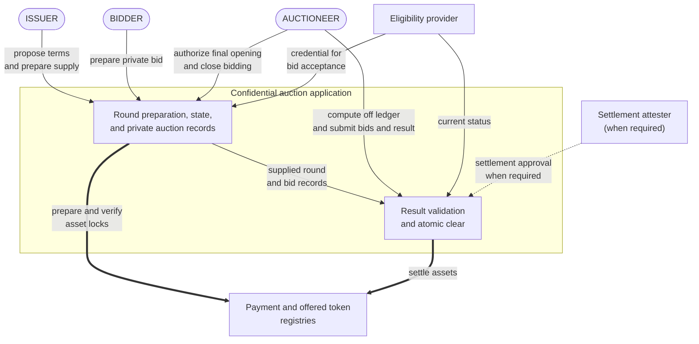
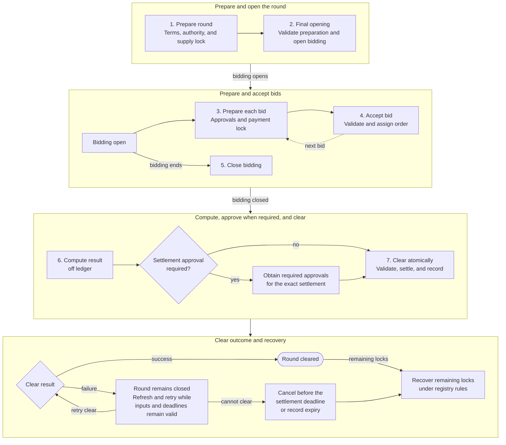
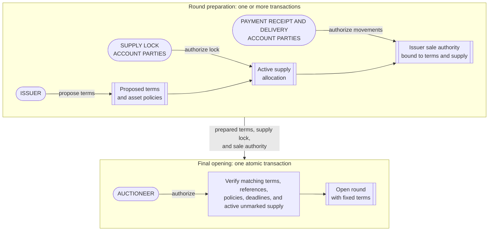
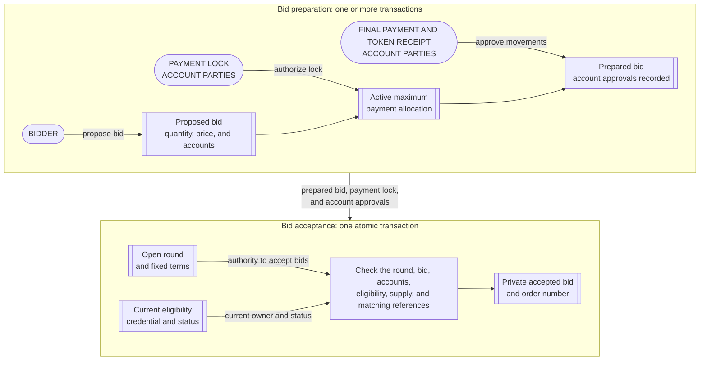
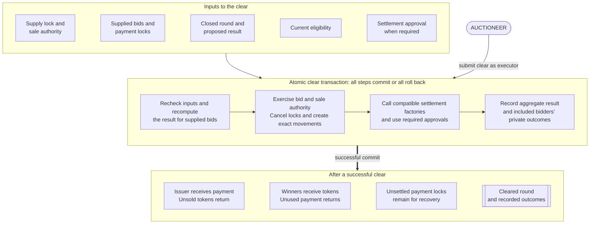
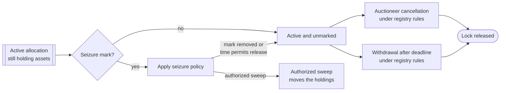

# Confidential auction reference architecture

This reference architecture defines a confidential auction for distributing a
fungible token in one sealed-bid round on Canton. The application keeps bids
private from competitors, locks the issuer's supply and each bidder's maximum
payment before clearing, computes one clearing price, and settles payment and
token delivery atomically.

## 1. Product Definition

Five properties define the product:

- **Single round.** The issuer offers a fixed quantity during one bidding
  period, and the round produces one final result.
- **Sealed bids.** Each bidder submits the requested quantity and maximum unit
  price privately to the issuer and auctioneer. Competing bidders do not
  receive that bid.
- **Uniform price.** Every winner pays the same clearing price under a rule
  published before bidding starts.
- **Prefunded settlement.** The issuer locks the offered tokens before opening
  the round, and every accepted bid is backed by a maximum payment lock created
  during bid preparation.
- **Permissioned participation.** The auction application checks bidder
  eligibility when it accepts a bid and again before assigning tokens.

A **Canton party** is an on-ledger identity. A regular **asset account**
identifies where tokens are held and names an owner. Some asset implementations
also support an account provider or an additional account identifier.
**Authority** is the on-ledger consent required from the parties that control an
action. We call the parties whose authority an asset registry requires for an
account action the **account parties**.

We use [Token Standard V2](https://github.com/canton-foundation/cips/blob/main/cip-0112/cip-0112.md)
allocations to lock the offered supply and bidder payments. An **allocation**
records account authority for specified asset movements and may reserve the
required holdings. A **committed allocation** cannot be withdrawn before the
settlement deadline; after that deadline, it becomes withdrawable under the
registry's authorization rules. Its configured settlement executors may settle
or cancel it. A settlement executor controls when those choices are invoked;
executor status does not provide the sender or receiver account authority
required for a final movement.

These initial allocations reserve the assets without authorizing a final
payment or delivery. [Section 2.2](#22-personas-and-components) introduces the
prepared and accepted bid records and the issuer sale authority through which
the required parties authorize those final movements.

We call the final all-or-nothing settlement transaction the **clear**. It
cancels the issuer's initial supply lock and each winner's payment lock, uses the
released holdings to create allocations for the exact payments and token
deliveries, and settles every winner movement atomically: all steps succeed
together, or none takes effect. Losing bidders recover their locked payments
separately.

### 1.1 Auction Mechanics

We require the issuer and auctioneer to publish immutable round terms before
bidding opens. The **reserve price** is the minimum unit price the issuer will
accept. It is fixed before bidding, and bids below it are rejected. A **price
tick** is the smallest allowed price increment, and a **lot** is the smallest
quantity increment. A bidder's **fill** is the quantity it wins. The **marginal
price** is the lowest maximum unit price among bids that receive a fill. When
total demand exceeds the offered supply, it is the price band in which the
remaining supply is allocated.

The round terms include:

- the payment asset and offered token;
- the offered quantity and reserve price;
- the price tick, token lot size, and payment rounding rule;
- the bidding and settlement deadlines;
- the **bid limit**, which is the maximum number of accepted bids;
- the uniform-price clearing rule; and
- the fixed bid order used to assign any whole lots left after proportional
  fills are rounded down.

Bids below the reserve price are rejected. Bids at or above it are ordered by
maximum unit price, so higher price bands fill first. If the remaining supply is
smaller than demand at the marginal price, that price band receives a
proportional allocation. Each provisional fill is rounded down to a whole lot.
The round terms publish how each accepted bid receives an immutable order
number. That number is used only to assign any whole lots left after
proportional rounding and remains fixed through clearing. Because it can decide
who receives the final leftover lot, the terms must explain how order numbers
are assigned.

All winners pay the same **clearing price**. When the total quantity requested
by bids at or above the reserve price does not exceed the offered quantity, the
clearing price is the reserve price. When that demand exceeds the offered
quantity, the clearing price is the marginal price.

For example, consider 100 tokens, a reserve price of 8, and a lot size of 10:

| Bid | Order number | Quantity | Maximum price | Fill |
|---|---:|---:|---:|---:|
| A | 0 | 50 | 12 | 50 |
| B | 1 | 80 | 10 | 40 |
| C | 2 | 40 | 10 | 10 |

Bid A receives its full 50 tokens above the marginal price, leaving 50 tokens
for B and C. At the marginal price, B requested 80 tokens and C requested 40,
so their provisional fills are 33.33 and 16.67 tokens. Because fills must be
multiples of 10 tokens, these amounts are rounded down to 30 and 10, leaving one
10-token lot. B receives that lot because its order number precedes C's,
producing final fills of 40 and 10 tokens. The reserve price is 8 units of the
payment asset per token. The marginal and clearing prices are 10, so every
winner pays 10 per token.

### 1.2 Scope

| Auction scope | Separate designs |
|---|---|
| One primary token distribution with one bidding period and one result | Repeated auctions, continuous issuance, secondary trading, and derivatives |
| Uniform-price allocation with proportional marginal fills | Pay-as-bid pricing, bonding curves, and discretionary book building |
| Fungible payment asset and offered token using Token Standard V2 allocations | Nonfungible assets and registries without compatible allocation settlement |
| One Canton synchronizer coordinating ordering and confirmation, and one atomic clear | Cross-synchronizer settlement and cross-chain delivery |
| Permissioned bidder eligibility | Public participation without an eligibility policy |
| Asset systems that complete every required movement during the clear | Asset systems whose transfers require later transactions |

## 2. Architecture Overview

The round and each bid are prepared before they become active. The issuer
proposes the round terms, while the required account parties authorize the
supply lock, payment receipt, and token delivery. Each bidder proposes a
quantity, maximum price, and accounts, while its required account parties
authorize the payment lock, payment to the issuer, and token receipt. These
approvals may arrive in separate transactions. Final opening validates the
prepared round inputs and creates the active round. A separate bid acceptance
transaction validates each prepared bid and creates the accepted bid.

After bidding closes, the auctioneer computes a proposed result off ledger. The
application checks that result against the accepted bids supplied by the
auctioneer, replaces the supply and winner payment locks with exact asset
movements, and settles those movements atomically.

**System context**

The payment asset and offered token may use different registries or one registry
that supports both. The application records the round state, prepared and
accepted bids, and results, while the registries create and settle allocations
under their own policies. The application checks the bidder credential during
bid acceptance and again before assigning a fill. When an asset policy requires
settlement approval, the configured attester approves the exact asset movements.

### 2.1 Auction Lifecycle

The same lifecycle applies to every round:

Round and bid preparation can span several transactions as independent parties
provide their approvals. Final opening, each bid acceptance, close, and clear are
separate atomic transactions. The auctioneer computes the proposed result off
ledger and obtains approval for the exact asset movements when an instrument
requires it. The clear rechecks its inputs, recomputes the published rule for
the accepted bids supplied by the auctioneer, and either settles and records
every required result or rolls back every step.

Round state and allocation state remain independent. A supply or payment
allocation can therefore exist even if final opening or bid acceptance fails.
Cancelling or expiring an uncleared round stops clearing, while the asset
registries determine how its locks are released. A successful clear settles
winner movements and leaves payment locks not settled by the clear available for
separate recovery.

### 2.2 Personas and Components

In Token Standard terminology, each asset is an **instrument**, and its
**instrument admin** governs the asset implementation. An **allocation factory**
creates allocations, while a **settlement factory** settles compatible
allocations for that admin.

The auction uses the following personas. A persona describes an application
responsibility, and one Canton party may act as several personas.

| Persona | Responsibility and visibility |
|---|---|
| Bidder | Proposes a quantity and maximum price. Every party required to authorize payment to the issuer or receipt of the offered token becomes a signatory of the accepted bid and sees it in full. |
| Issuer | Proposes the round terms, prepares the offered supply, receives payment, and sees every prepared and accepted bid. |
| Auctioneer | Coordinates round preparation, authorizes final opening, operates the round, sees every prepared and accepted bid, closes bidding, computes the result, submits the clear, and coordinates recovery. |
| Instrument admins | Administer the payment and offered token registries. Each validates settlement for its asset and enforces its published approval and seizure policies. One party may administer both assets. |
| Eligibility provider | Issues or validates the reusable credential that permits a bidder to participate. The issuer or auctioneer may operate this service or use an independent provider. |
| Settlement attester, when required | Approves the exact settlement under an instrument policy. Organizational independence from the admin and auctioneer is a deployment decision. |
| Auditor, when enabled | Receives authorized bid and outcome disclosures and recomputes the submitted result without exposing those records more broadly. |

The issuer and auctioneer prepare and operate the round and approve its
application code by default. A deployment may add authority to pause new bids or
assign round preparation, final opening, audit, and upgrade authority to
different parties. These choices change who can operate the auction and which
parties must remain available. They do not change the round economics or clearing
rule.

Each auction account is a regular account with an owner. Some asset registries
also support an **account provider**, such as a custodian or service provider,
and an additional account identifier.
[Canton Coin supports only basic accounts](https://github.com/canton-foundation/cips/blob/main/cip-0112/cip-0112.md#6-canton-coin-implementation),
which have no provider or additional account identifier. Each registry
determines the account forms it supports and whose authority is required for an
action. The account parties may differ by account and action. Instrument admin
authority and optional settlement approval are separate from account authority.
When an account has a provider,
[Token Standard V2](https://github.com/canton-foundation/cips/blob/main/cip-0112/cip-0112.md#432-accounts-instead-of-parties)
requires the provider to see every holding and asset movement for that account.

The design separates seven responsibilities:

| Component | Responsibility |
|---|---|
| Round proposal and terms | The issuer proposes the assets, economics, deadlines, clearing rule, bid limit, eligibility policy, registry references, and governance. Final opening fixes the exact proposal as the round terms. |
| Round state | Begins when final opening succeeds and records whether the round is open, closed, cleared, cancelled, or expired while preserving the terms. |
| Prepared bid | Records the private proposed bid, its maximum payment allocation, and the account approvals required before the bid can be accepted. It has no order number and cannot participate in clearing. |
| Accepted bid | Records the private bid and its maximum payment allocation. Its signatories provide the account authority needed for any winner payment and token receipt permitted by the bid and round terms. The allocation keeps its registry recovery paths. |
| Issuer sale authority | Prepared before final opening, it records the offered supply allocation. Its signatories provide the account authority needed to receive payment, deliver sold tokens, and return unsold supply under the round terms. The allocation keeps its registry recovery paths. |
| Results | Records aggregate clearing data for the issuer and auctioneer and a private fill, payment, exclusion, or refund outcome for each bidder included in the clear. |
| Asset registries | Create, cancel, withdraw, and settle allocations under each instrument's policy. |

The required account parties become signatories of the accepted bid and issuer
sale authority. Exercising their clearing choices carries that authority into
the exact asset operations nested inside each choice. Recording a party
identifier alone does not provide its authority. An account party may also be
the bidder, issuer, or auctioneer, but each action still requires the authority
assigned to every capacity in which it acts.

### 2.3 Privacy and Result Trust

Each party receives a **transaction projection** containing only the branches it
is entitled to see. A party acting as several personas receives the visibility
associated with each.

| Persona | Private auction records | Asset records |
|---|---|---|
| Bidder and bid account parties | The complete prepared and accepted bid and, when included in the clear, that bidder's outcome | That bidder's allocations and asset movements, subject to the asset's visibility rules |
| Issuer and auctioneer | Every prepared and accepted bid and the complete clear | Every movement in the clear |
| Instrument admin | No prepared or accepted bid or private outcome from this persona alone | Asset movements for its instruments |
| Account provider | No prepared or accepted bid or private outcome from this persona alone | Every holding and asset movement for the accounts it services |
| Settlement attester, when required | No prepared or accepted bid or private outcome from this persona alone | The exact asset movements it approves |
| Auditor, when enabled | Only the bid and outcome disclosures it is authorized to receive | No additional asset visibility from this persona alone |

When the asset implementations keep movements private, a competing bidder sees
only its own prepared and accepted bid, asset movements, and outcome. The issuer
and auctioneer see the complete clear. Canton Coin makes all asset movements
public, so using it for either asset exposes those movements even when the
application outcome remains private.

The clear recomputes the published clearing rule for the accepted bids supplied
by the auctioneer. This prevents settlement of an incorrectly computed result,
but it cannot prove that every accepted bid was supplied. Bidders therefore
trust the auctioneer to submit the complete set and clear on time, and they trust
the issuer and auctioneer to keep bids confidential. An auditor with authorized
disclosures can recompute the result for the disclosed bids, but cannot prove
that the set is complete.

Section 6 lists the required projection tests.

### 2.4 Institutional Controls

We use D1 through D4 as local shorthand for four independent institutional
controls. A deployment enables only the controls required by its policy:

| Control | Lifecycle point | Treatment |
|---|---|---|
| Settlement approval (`D1`) | Approval and clear | An optional instrument policy may require approval from a configured settlement attester. When policy requires independent approval, the attester must operate independently of the instrument admin and auctioneer. |
| Allocation seizure (`D2`) | While locked, clear, and recovery | An instrument policy may let its admin mark an allocation and let privileged parties move its holdings. A mark can block auction settlement and ordinary recovery. |
| Bidder eligibility (`D3`) | Bid acceptance and clear | Bid acceptance checks that the bidder's payment and delivery accounts name the same owner and that the owner has an accepted credential. Clearing checks eligibility again before assigning tokens. |
| Application governance (`D4`) | Round operations | Assigns authority to prepare a round, complete final opening, accept bids, close, clear, or cancel the round. It also assigns authority to approve application code. A deployment may add pause authority or separate these powers. Allocation recovery remains governed by the configured executors, each registry's authorization rules, and instrument policy. |

Related party screening is an optional part of bidder eligibility. When it is
required, the round can require an accepted related party status in the bidder's
credential.

Before accepting an instrument, we publish whether allocation seizure is
disabled or enabled. When enabled, the instrument admin can **mark** a locked
allocation without the authorization used for ordinary account movements. The
mark blocks ordinary settlement and recovery until the admin removes it, its
time limit permits release, or privileged parties **sweep** the holdings to an
authorized destination. The policy identifies the operators, permitted
destinations, maximum mark duration, and any required legal order. A disabled
policy requires the asset implementation to reject marking and sweeping. The
auction application cannot override the instrument's policy.
[Section 3.5](#35-release-locked-assets) describes how a mark affects recovery.

## 3. Target Design

Round and bid preparation create the locks and authority used by later
transactions. Final opening and bid acceptance validate those prepared inputs.
Unsettled allocations follow the selected registries' recovery rules.

### 3.1 Prepare and Open the Round

Round preparation uses separate
[proposal and acceptance](https://docs.canton.network/appdev/modules/m3-authorization#use-propose-accept-workflow-for-one-off-authorization)
workflows and allocation transactions to establish the
[auction mechanics](#11-auction-mechanics), selected asset policies, supply
lock, and issuer sale authority. Final opening validates the completed
preparation and opens bidding atomically.

The issuer sale authority created during preparation identifies the exact supply
allocation and carries the authority required for payment receipt and token
delivery. The parties required for payment receipt may differ from those
required for token delivery, so preparation completes every account
authorization required by the selected registries before final opening.

Final opening checks that the proposed terms, supply allocation, and sale
authority still match, that the supply remains active and unmarked, and that its
deadline leaves enough time for bidding, clearing, and any recovery required
before the deadline. It then creates the open round with references to those
exact inputs.

The application provides cancellation paths for an abandoned round proposal
and sale authority. If preparation stops after the supply allocation is created,
the auctioneer cancels that allocation or the account parties withdraw it when
the registry permits. Consuming the bound allocation prevents final opening.

Every auction allocation names the auctioneer as its sole settlement executor.
The design uses four regular accounts: bidder payment and delivery accounts with
the same owner, and issuer payment receipt and inventory accounts backed by
existing inventory. [Section 7](#7-production-decisions) covers account and
executor variants.

### 3.2 Accept a Bid and Lock Maximum Payment

A bidder first proposes its bid. The required account parties then create the
maximum payment lock and approve the permitted payment and token receipt. These
steps may use separate transactions. Bid acceptance validates the prepared bid,
assigns its order number, and records the accepted bid atomically.

The payment lock reserves funds without naming the issuer as their final
destination. Preparation makes the bid and its required account approvals
available to the issuer and auctioneer without exposing it to competing
bidders. Before creating the payment lock, the wallet checks the proposed terms.
Bid acceptance then rechecks three groups of conditions against current ledger
state:

- the round is open and below its bid limit, and the positive quantity and
  maximum price satisfy its lot, tick, and reserve rules;
- each selected registry supports the account used with its asset, and the
  payment and delivery accounts name the same eligible owner; and
- the credential remains valid for that owner, while the issuer's supply lock
  remains active and unmarked.

The published payment rounding rule applies to `requested quantity x maximum
unit price` to determine the maximum payment. The accepted bid identifies the
committed allocation and binds its fixed order number, round, accounts,
instruments, bid values, deadlines, and selected registries.

The payment lock and winner movements may require different account parties.
Their preparation transactions record both sets of approvals. Bid acceptance
combines those approvals with the issuer and auctioneer authority carried by the
open round. The resulting accepted bid has those parties as signatories, and its
clearing choice carries their authority only into movements allowed by the bid
and round terms.

If bid acceptance fails after the payment allocation is created, the bid
receives no order number and cannot enter clearing. The application lets the
bidder or auctioneer close the abandoned proposal and prepared bid. The
auctioneer cancels the allocation, or the account parties withdraw it when the
registry permits.

### 3.3 Close Bidding and Compute the Result

Closing is one transaction that prevents further bid acceptance. The auctioneer
then computes the proposed result off ledger and supplies the accepted bids to
the clear. The application cannot enumerate all private accepted bids on its
own, so the auctioneer remains trusted to supply the complete set.

### 3.4 Create Exact Allocations and Settle

The clear is the only transaction that validates the result and settles every
winner movement together.

A failed clear leaves the round closed. [Section 4](#4-failure-recovery) covers
retry and recovery.

**Validate the proposed result.** The clear rechecks the issuer sale authority,
supply lock, accepted bids, credentials, and payment locks. A bidder receives a
zero fill if its eligibility has expired or been revoked, or if its payment lock
is marked. A mark on the supply lock, or prior consumption of a required payment
or supply allocation, blocks the clear.

The clear rejects duplicate supplied bids, recomputes the clearing price, fills,
and rounded winner payments, and validates supply, bid price limits, and lot and
tick alignment. [Section 4](#4-failure-recovery) covers these failures and their
recovery paths.

**Create exact movements.** A **transfer leg** describes one asset movement:
instrument, sender account, receiver account, and amount. Token Standard V2
records the two accounts' authorizations separately as the **sender side** and
**receiver side**.

Each initial allocation supplies only the sender authorization for a leg from
the account back to itself. The selected asset implementation treats this as a
lock. Without receiver authorization, that return movement cannot settle, so
the allocation reserves the holdings without approving an external recipient.

Inside the choice on each winning accepted bid, the auctioneer uses executor
authority to cancel the payment lock. The exact bidder payment and token receipt
allocations are consequences of that choice, so its signatories authorize their
creation and the return of the unused portion of the maximum payment. Inside the
choice on the issuer sale authority, the auctioneer cancels the supply lock and
its signatories authorize the matching issuer payment receipt and token delivery
allocations. Unsold inventory returns to the issuer. Payment locks for zero-fill
bids remain available for recovery.

Each winner has two transfer legs. Four allocations authorize both sides:
bidder sender and issuer receiver for payment, then issuer sender and bidder
receiver for token delivery.

| Asset | Sender | Receiver | Amount |
|---|---|---|---:|
| Payment asset | Bidder payment account | Issuer payment receipt account | Published payment rounding rule applied to `fill quantity x clearing price` |
| Offered token | Issuer inventory account | Bidder delivery account | Final fill quantity |

**Settle every batch.** A **settlement batch** groups compatible allocations and
legs for one instrument admin and settlement factory. Each factory receives only
allocations for instruments governed by its admin and supported by that factory.
Different admins or factories require separate batch calls. If both assets use
the same admin and a factory that supports both, their allocations may be
included in one batch call. Every required batch remains inside the same Daml
transaction.

An instrument that enables settlement approval requires one approval from its
configured settlement attester for each relevant batch. The approval is used
once and identifies the settlement, executor set, and every transfer leg. Every
final allocation and settlement factory call must complete within the clear. A
factory that requires another account party to accept a final movement in a
later transaction needs a different clearing design and is outside this scope.

Each selected settlement factory must reject a batch unless its allocations
exactly cover both sides of every transfer leg. Any failed call rolls back the
complete clear. Completed winner settlement is final.

### 3.5 Release Locked Assets

Round and allocation state are independent. Cancelling, expiring, or clearing a
round does not close an allocation that remains active. This also applies to an
allocation created during round or bid preparation when final opening or bid
acceptance fails.

Cancellation, withdrawal, mark changes, and sweeping are independent registry
operations, normally submitted separately. After the settlement deadline,
cancellation and withdrawal may race; only one can consume the allocation.
[Section 4](#4-failure-recovery) covers recovery outcomes.

### 3.6 Manage Execution and Timing

Each lifecycle stage has its own execution boundary:

| Stage | Execution boundary | Main invalidation conditions |
|---|---|---|
| Round preparation | One or more independently committed transactions | Terms, inventory, accounts, authority, registry policy, or deadlines change between steps |
| Final opening | One atomic transaction | A required record is missing or no longer matches, the supply allocation is consumed or marked, or a deadline leaves too little time |
| Bid preparation | One or more independently committed transactions | The round closes, or the bid, accounts, allocation, authority, or deadline changes between steps |
| Bid acceptance | One atomic transaction per accepted bid | A referenced round, bid, credential, supply lock, payment lock, or recorded value changes |
| Close | One atomic transaction | The round has already left the open state |
| Compute | Off ledger | Eligibility or asset state changes before clear |
| Approval | Optional separate transaction after computation | Approval expires or the exact settlement changes |
| Clear | One atomic Daml transaction | A deadline passes or required funds, approval, registry state, or authority changes |
| Recovery | Independent operations, normally submitted separately | The allocation state, deadline, registry authorization rules, or seizure policy do not permit the requested action |

The bidding deadline stops new bids. The settlement deadline bounds clearing and
makes committed allocations withdrawable afterward under registry rules. Because
the supply and payment locks can exist before final opening or bid acceptance,
their deadlines must leave enough time for the remaining preparation, bidding,
clearing, and any recovery expected before the deadline. Withdrawal based on the
deadline begins only afterward. We use the earliest bound imposed by the round,
asset policies, approvals, factories, or transaction submission time bounds,
with a published margin for signing and confirmation.

A transaction prepared for later submission or external signing must be replaced
when its inputs or time bounds change. The backend prepares the replacement from
current ledger state and obtains any supported external signature required for
submission. Required Daml authority comes from the submitting parties or prior
authorization contracts. Canton participant confirmation validates the
submitted transaction; it does not provide missing account consent.
[Section 6](#6-deployment-and-operations) covers submission and retry handling.

## 4. Failure Recovery

A failed final opening leaves bidding closed, and a failed bid acceptance leaves
the bid without an order number. Any supply or payment allocation already
created remains active until a registry operation closes it.

A failed clear leaves the round closed, so the auctioneer can retry while its
inputs remain valid and the earliest applicable deadline has not passed. Before
the settlement deadline it may cancel an uncleared round; afterward it may
record the round as expired.
Allocation release follows [section 3.5](#35-release-locked-assets). An optional
application pause stops new bid preparation and bid acceptance without blocking
close, clear, or recovery.

| Situation | Result | Next action |
|---|---|---|
| Round preparation stops after the supply lock is created, or final opening rejects its inputs | No round opens; the supply remains locked | Complete preparation with current inputs, or cancel the application records and release the allocation under registry and seizure rules |
| Bid preparation stops after the payment lock is created, or bid acceptance rejects its inputs | No bid is accepted and no order number is assigned; the payment remains locked | Retry while bidding remains open, or cancel the application records and release the allocation under registry and seizure rules |
| A step inside the clear fails | The complete clear rolls back and the round stays closed | Refresh ledger state and retry while current inputs remain valid and the earliest applicable deadline has not passed |
| Settlement approval is missing or expires | The relevant batch cannot settle, so the complete clear rolls back | Obtain fresh approval while clearing remains allowed; otherwise recover under [section 3.5](#35-release-locked-assets) |
| Bidder eligibility is invalid at clear | That bid receives zero fill | The auctioneer cancels the allocation, or it is withdrawn after the settlement deadline under the registry's rules |
| Bidder payment lock is marked | That bid receives zero fill and ordinary release is blocked | Remove the mark, wait for permitted release, or follow the sweep policy |
| Issuer supply lock is marked | The complete clear is blocked | Resolve the mark; if a sweep or another asset operation permanently closes it, cancel or expire the round as applicable and reconcile that outcome |
| Required allocation has already been consumed | The clear stops because the locked assets are no longer available | Reconcile the asset operation, then cancel or expire the round |
| Auctioneer service or a required Canton participant is unavailable | Round or bid preparation, final opening, bid acceptance, close, clear, or early cancellation are delayed | Restore service and refresh state; withdrawal becomes available after the settlement deadline under registry rules, subject to the seizure policy |
| Synchronizer is unavailable | No auction or recovery transaction can confirm | Refresh state after service returns and resume the action allowed by the current round state and deadlines |

## 5. Security and Auditability

The architecture separates ledger-enforced properties from parties and systems
that remain trusted.

### 5.1 Ledger-Enforced Properties

| Property | Enforcement |
|---|---|
| Fixed auction rule | Round preparation defines the assets, supply, clearing rule, rounding, fixed bid order, bid limit, deadlines, and enabled controls. Final opening fixes those exact terms before bidding begins. |
| Bounded bidder payment | The parties required to provide account authority for the maximum payment lock authorize that allocation. The parties required to authorize payment to the issuer or receipt of the offered token approve a prepared bid that limits both movements to the published terms. Bid acceptance verifies those exact approvals and the active payment lock. Clearing computes a payment at or below the maximum and releases the unused amount. |
| Reserved supply | The parties required to provide account authority for the supply lock authorize that allocation. The parties required to authorize payment receipt or token delivery approve the issuer sale authority, which limits both movements to the published terms. Final opening verifies the exact authority and an active, unmarked supply lock whose deadline covers the round. The instrument policy may still permit seizure. |
| Correct clearing of supplied bids | The clear recomputes eligibility, ordering, clearing price, fills, exclusions, and rounded payments for every accepted bid supplied to it. |
| Atomic delivery versus payment | All required factory batch calls settle inside the same clear transaction. A failed step rolls back allocation, settlement, result, and state changes. |
| Private bidder outcomes | When the asset implementations keep movements private, each bidder's transaction projection contains only its prepared and accepted bid, asset movements, and outcome. Public asset movements remain visible even when the application outcome is private. |
| Deadline-based recovery | The auctioneer, as the allocation's sole settlement executor, can cancel it at any time while it remains active and unmarked. After the settlement deadline, the allocation becomes withdrawable under its registry's authorization rules, subject to the instrument's seizure policy. |

### 5.2 Trust Boundaries

| Trusted party or system | Required behavior and consequence |
|---|---|
| Auctioneer | Coordinates round and bid preparation, completes final opening and bid acceptance only with valid inputs, includes every accepted bid, protects bid confidentiality, computes and submits on time, and releases abandoned locks according to policy. Omission or delay can change the outcome or prevent settlement. |
| Issuer | Protects the confidentiality of every prepared and accepted bid and supplies valid inventory and authority for its payment receipt account. Issuer and auctioneer collusion remains an application governance risk. |
| Parties controlling the round or accounts | These parties can jointly authorize transactions outside the auction. Wallets bind signatures to the intended round, and operators audit unexpected state transitions. |
| Instrument admins and factories | Keep compatible registries available, validate their asset batches, and apply published approval and seizure policies. Policy-authorized seizure or movement can bypass the auction settlement path. |
| Eligibility provider and auction governance | The provider binds credentials to the bidder owner and maintains status, expiry, and revocations. Auction governance fixes the accepted credential issuers in the round terms. |
| Settlement attester, when required | Approves only batches that satisfy policy. A compromised or affiliated attester weakens the independent review expected by the deployment. |
| Canton infrastructure | Keeps required parties hosted, approved code available, and transactions confirmable within the round deadlines. |
| Auditor, when enabled | Receives authorized disclosures to recompute the disclosed result without exposing records more broadly. It cannot prove that the supplied bid set is complete. |

Bid completeness remains the main residual risk. Deterministic on-ledger
clearing proves the result for the set the auctioneer supplies. It cannot prove
that the auctioneer omitted an accepted bid from that set. An accepted bid
record lets the affected bidder demonstrate the omission, and
authorized disclosure lets an auditor recompute the supplied result. Neither
forces the auctioneer to submit every accepted bid. A fixed bid limit,
operational controls, and legal accountability remain necessary.

Production assets must enforce the round's immutable seizure policy across all
settlement and privileged movement paths. The pinned OpenZeppelin
[reference token experiment](https://github.com/OpenZeppelin/canton-contracts/tree/7696749737885e25cd88422847105f890f03b00d/experiments/token/tokenCIP112-v1)
defines seizure choices on every allocation and lets the admin choose the
destination when marking, so it does not meet that requirement by itself.

## 6. Deployment and Operations

Before round preparation, we fix the approved package IDs, the immutable
identifiers for the deployed application and asset code. We also fix the
instrument admins, credential issuers, governance parties, accounts, and
deadlines. The preparation records, final opening, accepted bids, and clear use
one compatible synchronizer, and every involved Canton participant supports the
approved application and asset code.

### 6.1 Traffic and Application Rewards

Round and bid preparation, final opening, bid acceptance, closing, clearing,
and recovery require sufficient traffic on every Canton participant that sends
protocol messages. A participant's hosted parties and applications share
its balance, so operators monitor and fund every required participant. An
exhausted balance blocks its messages. See the
[traffic documentation](https://docs.sync.global/deployment/traffic.html).

For reward attribution, the auctioneer is the **app provider party**. Under
[CIP-0104](https://github.com/canton-foundation/cips/blob/main/cip-0104/cip-0104.md),
an active `FeaturedAppRight` naming the auctioneer lets it earn traffic-based
rewards from successful auction transactions for which it confirms one or more
views. Final opening, bid acceptance, close, clear, and auctioneer-led recovery
use auctioneer authority and can therefore contribute. Preparation transactions
can also contribute when the auctioneer confirms a view; observation alone does
not qualify. Eligible activity contributes to a reward calculated for each
network reward round. When that reward meets the network threshold, the network
issues a coupon that the auctioneer can redeem before it expires, directing some
or all of the resulting Canton Coin to named beneficiaries.

These rewards can help fund traffic and other operating costs. A quantitative
analysis of the traffic costs incurred by the auction flows, the rewards accrued
to the auctioneer, and the resulting net operating cost is outside the scope of
this initial reference architecture. We will perform that analysis once the
implemented flows can be measured under the target network configuration.

### 6.2 Production Readiness

We require the following production checks:

| Area | Required decision and evidence |
|---|---|
| Assets and factories | Pin both instruments, admins, factories, supported accounts, authorization and visibility rules, limits, and control policies. Require a completed supply lock before final opening and a completed payment lock before bid acceptance. Final allocations and settlement must complete inside the clear; factories that require later acceptance of final movements need a separate design. Test partial preparation, matching references and values, rejection at final opening and bid acceptance, cancellation, winner settlement, and release of unused or abandoned locks. |
| Code and synchronizer | Make the approved application, Token Standard interfaces, and asset code available to every involved Canton participant. Verify that every preparation record, allocation, round record, accepted bid, approval, and clear input uses one compatible synchronizer before it is combined in a transaction. |
| Personas and authorization | Assign round preparation, final opening, bid acceptance, eligibility, optional settlement approval, and governance powers. Test the authority required for every preparation transaction and initial lock. Verify that prepared bids carry the bidder account approvals, the issuer sale authority carries the issuer account approvals, and final allocation creation occurs inside their clearing choices. Keep settlement batch calls under the executor-controlled clear. Test that missing or misplaced authority causes rejection. |
| Hosting and submission | Verify each party's hosting and signing setup, keep the Canton participants needed for confirmation available, and preserve at least one authorized recovery path. |
| Privacy | Test transaction projections during preparation, final opening, bid acceptance, clear, and recovery for bidders, issuer, auctioneer, instrument admins, settlement attesters, auditors, and every configured account provider. Display every required disclosure before signature. |
| Time and retry | Publish the bidding and settlement deadlines together with preparation and recovery margins. Track each command independently and monitor the earliest dependency deadline, completion, retries, and ledger state changes. |
| Recovery | Exercise interruption after each preparation step, rejection at final opening and bid acceptance, clear rollback, auctioneer cancellation, registry withdrawal, backend or synchronizer outage, allocation changes, and every supported seizure outcome. |
| Capacity | Test the largest allowed individual bid, accepted bid set, and winner set against applicable factory, transaction, signature, and Canton participant traffic limits. Stop accepting bids at the published bid limit. |
| Operations | Monitor incomplete preparation, allocations whose round or bid never became active, round state, eligibility and approval status, approved code, party availability, confirmation latency, Canton participant traffic balances, reward coupons and expiry, and unresolved recovery actions. |

For an auction command with an uncertain outcome, the client tracks its
completion and latest allowed recording time. The Ledger API deduplicates retries
of one intended ledger change using its command ID, user, and acting parties at
the submitting Canton participant. A retry preserves those values, returns to
the same participant, requests coverage for the complete retry period, and uses
a fresh submission ID. The backend prepares a replacement only after a
definitive rejection or after the previous transaction's latest allowed
recording time has passed. See
[External Signing](https://docs.canton.network/appdev/deep-dives/external-signing-transactions),
[Working with Time](https://docs.canton.network/appdev/modules/m3-working-with-time),
and [Command Deduplication](https://docs.canton.network/appdev/deep-dives/command-deduplication).

The auction wallet authenticates the round terms and current round state before
asking a bidder to authorize preparation. It shows the requested quantity,
maximum unit price, rounded maximum payment, payment and delivery accounts, any
provider or additional account identifier, deadlines, instrument admins,
settlement approval, seizure powers, and available recovery actions. The backend
and wallet derive the required account parties and disclosures from the selected
registries' documented rules, then verify them before each preparation
transaction is submitted.

### 6.3 Smart Contract Upgrade Process

The auction application will use Smart Contract Upgrade (SCU) for additive
changes to its packages, but an upgrade will never change the published terms
of an active round. A round's final opening records the clearing-rule revision and the
approved application package identity in its audit evidence. A v2
implementation handling a v1 round will therefore keep applying the v1 rule,
never silently reinterpreting accepted bids, rounding, eligibility, ordering,
visibility, or recovery rights under a later one.

An additive release will keep the package name, raise the version, set
`upgrades:` to the prior deployed DAR, and only append `Optional` fields to
existing templates, records, and choice arguments; the
[Canton SCU guide](https://docs.canton.network/appdev/deep-dives/smart-contract-upgrade)
defines the remaining compatibility rules.

Every release will first define what `None` means on each v1 `RoundProposal`,
`Round`, prepared bid, accepted bid, issuer sale authority, and result, and
will test both directions: v1 round state and allocations under the v2
implementation, and the expected rejection of an old exact-version workflow
facing populated v2 data.

As a worked example, take a new rule requiring a sanctions screen on every
accepted bid.

Adding a new, hardened acceptance choice is not enough: the existing one stays
callable, so the screen would be optional. The v2 release therefore changes the
body of the existing acceptance choice to enforce a screening policy, stored as
a new `Optional` field on the `Round` (the only kind of field SCU may add).
The enforcement point is round opening: the v2 opening choice refuses to open
a round without `Some policy`, so every new round carries the screen. An
active v1 round reads as `None`, meaning "opened before the rule": it
completes under the rule its final opening published and is never
reinterpreted retroactively.

The populated field is also what retires the old code path. SCU does not
delete the v1 DAR: while it stays vetted, a caller can pin the old package id
and run the old choice body, so a deprecation marker is not an access control.
But a round carrying `Some policy` no longer downgrades to a v1 view, so the
old acceptance choice cannot execute against it. Unlike the DEX, no live state
is migrated: v1 rounds drain naturally by completing, expiring, or being
cancelled. The rollout is therefore: vet the v2 DAR at every affected
participant, then switch wallets, issuer services, auctioneer services, and
auditors to the announced package preference together.

This path covers compatible changes only. Changes to the clearing formula, bid
ordering, economic terms, party or observer topology, or asset authorization
are breaking, even if a choice body can technically be replaced: they will use
a separately named package and template, open new rounds only under the new
design, and drain every active old round under the terms it published. An
unopened proposal may be recreated only with the authorities that approved it,
so an upgrade authority never becomes authority to alter a bidder's accepted
terms.

Before release, the operators will run `dpm build` with the `upgrades:`
lineage and `dpm upgrade-check --both`, validate the DAR against the target
participant, and exercise the round workflow on LocalNet as the minimum
release evidence.

## 7. Production Decisions

We make these decisions before round preparation begins:

| Decision | Design default | Production choice |
|---|---|---|
| Governance powers | Issuer and auctioneer prepare and operate the round and approve its application code | Decide whether round preparation, final opening, bid acceptance, pause, close, clear, round cancellation or expiry, audit, and upgrade require separate authorities |
| Fixed bid order | Each accepted bid receives one immutable, unique order number | Publish how order numbers are assigned, how they allocate leftover lots, and how the rule prevents later reordering |
| Bidder accounts and supply | The bidder's payment and delivery accounts have the same owner, and the issuer uses existing inventory | Review delegated payers, different beneficiaries, or minting as separate authorization and eligibility designs |
| Bidder eligibility | One reusable credential checked when the bid is accepted and again during clear | Decide whether that credential must include an accepted related-party status |
| Settlement approval | Disabled unless an instrument requires it | Select the settlement attester and enforce organizational independence when required |
| Allocation seizure | Accept only assets whose disclosed policy fits the auction | Choose disabled seizure, bounded seizure with approved destinations, or refuse the asset |
| Result audit | Private bidder outcomes and aggregate result | Decide whether accepted bid records and authorized disclosures provide enough auditability; add a proof scheme only when its exact claim is defined |
| Settlement coordination | The auctioneer is the sole settlement executor, and factories complete inside the clear | Define authority and availability when several executors are required |

## 8. References

Primary foundations include:

- [CIP-0104 Traffic-Based App Rewards](https://github.com/canton-foundation/cips/blob/main/cip-0104/cip-0104.md)
  for application activity attribution and reward accounting;
- [CIP-0112 Token Standard V2](https://github.com/canton-foundation/cips/blob/main/cip-0112/cip-0112.md),
  especially its allocation and settlement factory model;
- the Canton [authorization model](https://docs.canton.network/appdev/modules/m3-authorization)
  and [multi-party workflows](https://docs.canton.network/appdev/modules/m2-multi-party-workflows)
  for proposal, acceptance, and authority carried through choices;
- the pinned OpenZeppelin [reference token experiment](https://github.com/OpenZeppelin/canton-contracts/tree/7696749737885e25cd88422847105f890f03b00d/experiments/token/tokenCIP112-v1)
  for allocation, settlement approval, and seizure mechanics;
- the local [credential-check experiment](../../experiments/identity/hook-shape-b/)
  for typed eligibility checks; and
- the [Canton ledger model](https://docs.canton.network/overview/reference/ledger-model-detailed)
  for authorization, transaction projection, and visibility.

The experiments provide the cited mechanisms. A production auction also
requires the application, backend, wallet integration, asset selection,
operations, and recovery services.
