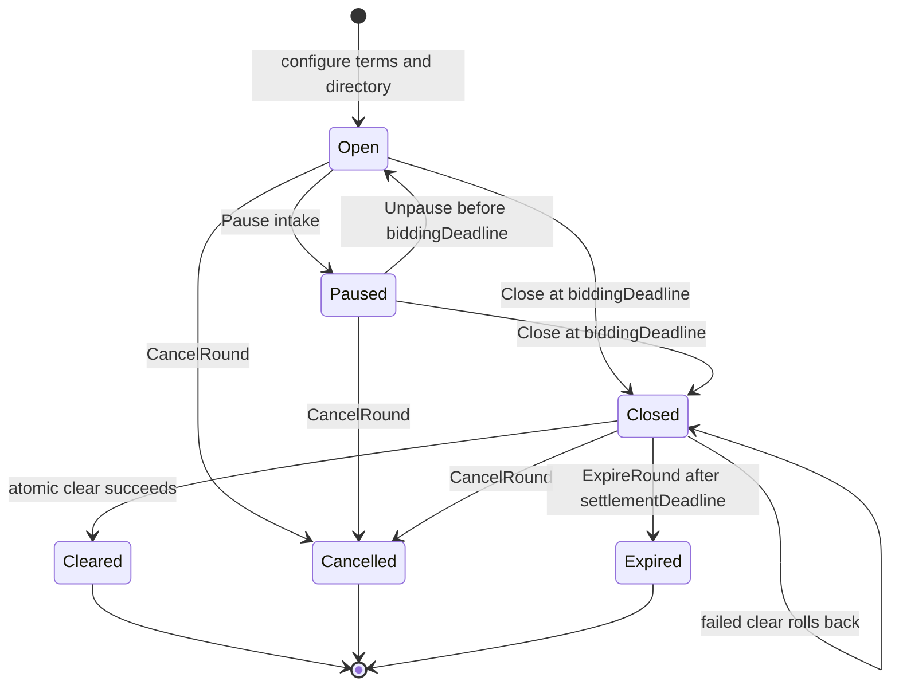
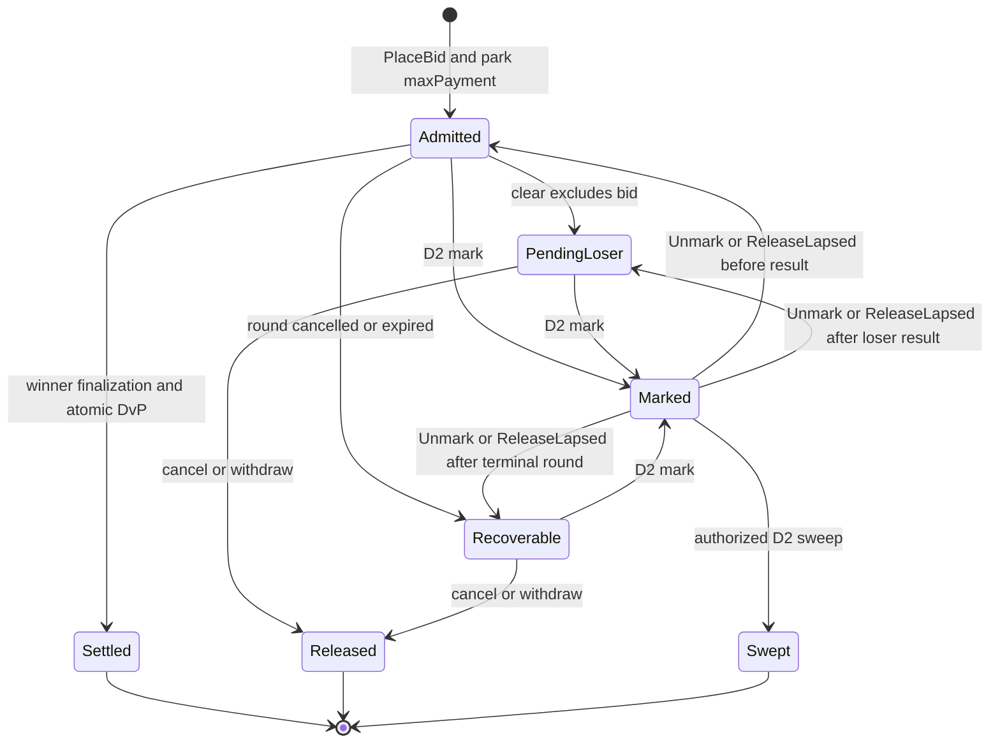

# Confidential Auction Launchpad reference architecture

This architecture defines a single-round sealed-bid auction for distributing a
token on Canton. Bidders authorize a maximum payment before the round closes.
The auctioneer computes one clearing price off-ledger, and the application
settles payment and token delivery atomically on-ledger.

This architecture specifies target application behavior and production
requirements. Linked experiments provide executable evidence for selected
mechanisms. Production readiness and standards conformance depend on
implementing and validating the complete composition described here.

## 1. Product Definition

The launchpad accepts confidential quantity bids. Each bid specifies a requested
token quantity and maximum unit price, then locks the rounded maximum payment in
a committed payment allocation. This parking allocation reserves funds without
authorizing payment to the issuer before clearing. Bids at or above the reserve
price are ranked by price. Every winner pays the same clearing price per token,
even if that bidder offered a higher maximum price. If several bids at the
cutoff price compete for the remaining supply, the available tokens are divided
among them in proportion to their requested quantities. Each fill is rounded to
the token's configured lot size, and a predefined deterministic rule assigns any
whole lots left after rounding.

The target workflow is one primary distribution. It runs one bidding period,
produces one result, and either atomically settles that result or leaves the
round and its escrows available for retry or recovery. Secondary trading,
continuous issuance, bonding curves, derivatives, and cross-synchronizer
settlement belong to adjacent architectures.

### 1.1 Privacy and Visibility Model

Each bidder submits the actual bid once. Canton transaction projection discloses
it to the bidder's account parties, the auctioneer, and, in the baseline
topology, the issuer. Competing bidders do not receive the `BidAuthorization`
contract or its transaction view. This design therefore needs no separate hash
commitment and reveal phase. Here, sealed bidding means confidentiality from
competitors, not from the auctioneer or issuer. A deployment that separates
issuer and auctioneer visibility requires a different contract topology and
tests of the resulting transaction projections.

Confidential does not mean encrypted from every participant involved in
settlement:

- The auctioneer, as settlement executor, sees the complete clearing result.
- Each instrument admin sees the transfer legs for instruments it administers.
- The owners and providers of the bidder's payment and token delivery accounts
  sign the `BidAuthorization`. Each sees the complete bid, both account records,
  and the pinned factory references.
- The synchronizer orders encrypted transaction views and does not receive bid
  plaintext.
- Transaction projections may include contract data for parties beyond the
  contract's stakeholders. The auction topology limits bidder and account
  provider visibility to bids and settlement branches associated with their
  accounts. See the [detailed ledger model](https://docs.canton.network/overview/reference/ledger-model-detailed).

### 1.2 Bidder Trust Assumptions

The auctioneer is trusted for price discovery and allocation. It can omit a bid,
publish an unfair result, leak bid information, or favor a bidder. The ledger
can enforce price limits, supply bounds, authorization, and atomic exchange, but
it cannot prove that an off-ledger auctioneer included every eligible bid or ran
the advertised algorithm honestly.

After clearing, the application creates an `AuctionResult`, described in
[section 4.1](#41-contract-responsibilities). It references the immutable round
terms, including the versioned clearing and rounding rules. The result records
the committed bid set, clearing price, aggregate fill, and a commitment to the
private bidder outcomes. An auditor with authorized access to the bids and
outcomes can recompute the result. This provides accountability while
preserving the auctioneer trust assumption.

Bidders rely on each instrument admin to keep its settlement factory available
and enforce its disclosed compliance policy. They also rely on the instrument's
allocation seizure policy and privileged parties. The allocation admin can mark
an allocation without the bidder's approval, blocking settlement, cancellation,
and withdrawal. A sweep authorized by the required privileged parties can then
move the locked assets under the instrument's policy.
[Section 1.3](#13-control-model-and-allocation-seizure) defines this control and
its production requirements.

Any instrument admin can also block the entire clear by rejecting its batch. A
successful clear commits every admin batch together.

### 1.3 Control Model and Allocation Seizure

This repository uses D1 through D4 as shorthand for control areas shared by its
reference architectures. The labels keep references consistent across the
cited OpenZeppelin experiments and related architecture guides. They are
repository terminology, not Canton or CIP-0112 requirements.

- **Settlement attestation (`D1`)** requires a trusted attester to approve the
  exact asset movements before a settlement factory executes them.
- **Allocation seizure (`D2`)** governs when an instrument admin may mark an
  allocation as seized and when the required parties may move its assets to a
  custodian.
- **Bidder identity (`D3`)** verifies that bidder accounts satisfy the venue's
  eligibility rules.
- **Application authority (`D4`)** separates launch, auction, intake pause, and
  upgrade powers.

The detailed [control profile](#24-control-profile) defines their actors,
ledger behavior, and production requirements.

The launchpad never takes ownership of bidder funds. A bid locks payment in an
allocation owned by the bidder's account, and an unsuccessful settlement cannot
move only one side of the trade. This is **non-custodial settlement**, not
holder-only control: an instrument's admin may still have powers over that
instrument.

In the current OpenZeppelin experiment, every allocation supports the seizure
workflow (`D2`). The allocation admin can mark an allocation and select the
receiving custodian account without the bidder's approval. The required
privileged parties can then move the locked assets to that account. An unmarked
allocation may still be marked later; the experiment has no permanent opt out
at creation. See the pinned
[`TokenAllocation`](https://github.com/OpenZeppelin/canton-contracts/blob/7696749737885e25cd88422847105f890f03b00d/experiments/token/tokenCIP112-v1/daml/OpenZeppelin/TokenCIP112V1/Allocation.daml)
source and the component evidence in [section 2.1](#21-core-components-and-evidence).

Time limits, burner capabilities, destination-account authority from a principal
distinct from the admin, and the lawful-process path reduce misuse, but they do
not make seizure impossible. The pinned code does not require the burner and
destination account owner to be different parties.

A production instrument must publish an immutable, machine-readable D2 policy.
The target policy is:

```text
D2Policy = Disabled
         | Enabled {
             approvedCustodians,
             maximumSeizureWindow,
             orderPolicy = NoExternalOrder
                         | LawfulProcessPathOnly
                         | EverySweep,
             seizureOrderRegistry
           }
```

The token registry, not the auction, enforces this policy on every allocation.
`Disabled` makes mark and both sweep paths ledger-impossible. An enabled policy
requires a nonempty order registry whenever its `orderPolicy` requires an order.
The auction configuration can reject instruments whose policy does not match the
venue's requirements, but it cannot weaken or override an instrument admin's
authority.

### 1.4 Operational Scope and Boundaries

| In scope | Boundary |
|---|---|
| Sealed bids | Each bid is visible to its bidder, required account providers, issuer, and auctioneer. Unrelated bidders do not see it. |
| Uniform-price allocation | Immutable terms fix the algorithm version and rounding rule. Every admitted bid binds to them; the auctioneer remains trusted to apply them honestly. |
| Marginal partial fills | During clearing, prior bidder authorization lets the application replace the parked maximum with the exact payment and return any change. No new bidder signature is required. |
| Atomic delivery versus payment | Both assets settle in one Daml transaction. Different admins or settlement factory CIDs require separate `SettleBatch` calls within it. |
| KYC and compliance | Bidder identity is checked at admission and rechecked for winners. Each factory independently verifies the settlement attestation it requires. |
| Recovery | Executors may cancel losing payment allocations. After the settlement deadline, all payment account parties may withdraw. Active allocation seizure blocks both. |

## 2. Architecture Overview

Canton contracts are visible only to their stakeholders and to parties that
witness relevant transaction subtrees. Signatories authorize contract creation;
choice controllers authorize an exercise. Within a choice body, the controllers
and the exercised contract's signatories jointly authorize its immediate
consequences. The target uses that propose-and-accept property to carry bidder
and issuer authority into clearing without collecting new signatures after the
deadline. See the [detailed Canton ledger model](https://docs.canton.network/overview/reference/ledger-model-detailed).

An `Account` can include an owner and a provider. Bidder or issuer authorization
therefore includes every account party required by the instrument registry as a
signatory of the corresponding authorization contract.

### 2.1 Core Components and Evidence

**Experiment** marks executable component evidence; production readiness and
standards conformance require separate validation. **Target** marks application
behavior that production implementations must provide and validate end to end.

| Component | Status | Responsibility | Evidence or required implementation |
|---|---|---|---|
| Access control, ownership, pause guards | **Experiment** | Provide role grant and revocation, ownership transfer by explicit acceptance, and pause primitives for application controls. | [`AccessControlV1.daml`](https://github.com/OpenZeppelin/canton-contracts/blob/7696749737885e25cd88422847105f890f03b00d/experiments/access/access-control-v1/daml/OpenZeppelin/AccessControlV1.daml), [`OwnableV1.daml`](https://github.com/OpenZeppelin/canton-contracts/blob/7696749737885e25cd88422847105f890f03b00d/experiments/access/ownable-v1/daml/OpenZeppelin/OwnableV1.daml), and [`PausableV1.daml`](https://github.com/OpenZeppelin/canton-contracts/blob/7696749737885e25cd88422847105f890f03b00d/experiments/security/pausable-v1/daml/OpenZeppelin/PausableV1.daml). |
| Token Standard V2 allocation and settlement | **Experiment** | Lock holdings, create sender and receiver allocations, settle a compatible admin-scoped batch, emit holding-change events, and recover allocations. | Pinned [`TokenRules`](https://github.com/OpenZeppelin/canton-contracts/blob/7696749737885e25cd88422847105f890f03b00d/experiments/token/tokenCIP112-v1/daml/OpenZeppelin/TokenCIP112V1/Registry.daml) and [`TokenAllocation`](https://github.com/OpenZeppelin/canton-contracts/blob/7696749737885e25cd88422847105f890f03b00d/experiments/token/tokenCIP112-v1/daml/OpenZeppelin/TokenCIP112V1/Allocation.daml). |
| D1 settlement attestation | **Experiment** | Verify one consumed attestation for one settlement ID, executor set, factory admin's registry, validity policy, and exact transfer leg set. | [`D1.daml`](https://github.com/OpenZeppelin/canton-contracts/blob/7696749737885e25cd88422847105f890f03b00d/experiments/token/tokenCIP112-v1/daml/OpenZeppelin/TokenCIP112V1/D1.daml). |
| D2 allocation seizure | **Experiment** | Mark an allocation, block settlement, cancellation, and withdrawal, and sweep under allocation admin, burner capability, destination account, and time checks. | [`Allocation.daml`](https://github.com/OpenZeppelin/canton-contracts/blob/7696749737885e25cd88422847105f890f03b00d/experiments/token/tokenCIP112-v1/daml/OpenZeppelin/TokenCIP112V1/Allocation.daml#L152-L234). Production requires the target policy in section 1.3. |
| D3 KYC claim | **Experiment** | Demonstrate transfer-time validation of a typed claim, expiry, and trusted-issuer membership snapshot. | Local [`ShapeB.daml`](../../experiments/identity/hook-shape-b/daml/OpenZeppelin/Experimental/Identity/ShapeB.daml). Production additionally requires current-status and revocation handling. |
| `AuctionTerms`, `AuctionRegistration`, `AuctionRoundState` | **Target** | Keep terms immutable and establish the canonical phase and terminal result chain. | Implement and validate these proposed application contracts as one workflow. See [section 4.1](#41-contract-responsibilities). |
| `BidAuthorization`, `WinnerPermit`, `IssuerPermit`, `LoserPermit`, `IssuerAuthorization`, `AuctionResult`, `BidOutcome` | **Target** | Admit one allocation-backed bid, carry bidder and treasury-account authority into clearing and recovery, and publish aggregate and bidder-private results. | Implement and validate these proposed application contracts as one workflow. See [section 4.1](#41-contract-responsibilities). |
| Clearing service and wallet integration | **Target** | Compute and validate results, prepare commands from current ledger state, obtain required attestations and any required external command signatures, submit and retry idempotently, authenticate disclosures, and present private outcomes. | Implement and validate the off-ledger application services against the configured algorithm and ledger contracts. |

The pinned settlement code provides component-level evidence for the allocation,
settlement, D1, and D2 mechanisms above. Its evidence boundary includes a local
`TokenHolding` implementation and non-iterated settlement. Production assets
must be discovered and assessed through their accepted Token Standard interfaces
and registry policies.

### 2.2 Party and Role Model

| Party or service | Type | Authority and visibility |
|---|---|---|
| Bidder account parties | Daml parties | The required owners and providers of both bidder accounts authorize the maximum payment and later exact winner allocations. Each sees the complete bid authorization. |
| Auctioneer | Daml party plus off-ledger service | Provides standing admission authority with the issuer, sees all admitted bids, computes the result, controls clear and pre-deadline cancellation, and is the sole baseline settlement executor. |
| Issuer | Daml party | Signs immutable terms and round states, provides standing admission authority, and sees all admitted bids. It may be distinct from either instrument admin. |
| Issuer treasury account parties | Daml parties | The owners and providers required by the issuer inventory and payment-receipt accounts authorize the exact issuer-side allocations through `IssuerAuthorization`. |
| Launch administrator | Daml party | Pins the canonical registration and configures each new round. Multi-hosting or multisignature command authorization can protect this party without changing its ledger type. |
| Intake pauser | Daml party | Controls intake pause and resume. It cannot change immutable terms or block close, clearing, or recovery in the baseline. |
| Upgrade governance | Daml parties plus deployment governance | Approves supported packages and factory policies between rounds. Existing `AuctionTerms` remain immutable. |
| Payment instrument admin | Daml party | As payment admin, sees and validates the payment-instrument batch and enforces that instrument's D1/D2 policy. A party holding another role may see additional data. |
| Launched-token admin | Daml party | As launched-token admin, sees and validates the launched-token batch and enforces that instrument's D1/D2 policy. A party holding another role may see additional data. |
| KYC issuer | Daml party operated directly or by a credential service | Signs D3 eligibility credentials. D3 and D1 remain separate roles even when one organization operates both. |
| D1 attester | Daml party | Sees and signs the settlement ID, executor set, and exact transfer legs for one compatible factory batch. |
| Burner and destination account parties | Daml parties | Under an enabled D2 policy, the burner presents a capability issued by the admin with an expiry, and the destination account parties authorize creation of replacement holdings. Instrument and case scopes are optional in the current code, which also permits role overlap. |
| Participant or validator | Infrastructure node and application services | Hosts parties and their contract data, exposes the Ledger API, submits commands, validates relevant transaction views, and manages the participant-wide traffic balance. |
| Synchronizer sequencers and mediators | Infrastructure services | Sequencers order and distribute encrypted messages; mediators aggregate participant confirmations and issue transaction verdicts. They are not auction roles and do not receive bid plaintext. |

### 2.3 Authority and Visibility by Action

The current [`AuctionRoundState`](#41-contract-responsibilities) records the
round phase. While it is `Open`, all parties required by the bidder's payment
and delivery accounts control its `PlaceBid` choice. The issuer and auctioneer
are signatories of the round state, so exercising it combines bidder authority
with their standing venue authority. The resulting `BidAuthorization` has the
bidder account parties, issuer, and auctioneer as signatories; each sees the
complete bid.

The auctioneer computes the result off ledger and is the sole baseline
settlement executor. Exact bidder allocations are created inside
`BidAuthorization_FinalizeWinner`, and exact issuer allocations are created
inside `IssuerAuthorization_Use`. Each allocation factory call uses the
instrument and factory CID pinned in the round terms. Each `SettleBatch` call
receives only legs and allocations compatible with its instrument admin and
settlement factory CID.

Daml authority is local to the exercised choice. Fetching or consuming an
authorization contract does not make its signatories' authority available to a
later sibling action. A variant with multiple executors or an independent clear
guard must make every required party's authority available inside the choice
that cancels or settles.

D2 belongs to the instrument's allocation policy and operates independently of
auction roles. Under a policy that enables D2, the allocation admin may mark an
allocation. While the mark is active, settlement, cancellation, and withdrawal
fail. A sweep also requires a valid burner capability and authorization from the
destination account parties. Holding the allocation alone grants the bidder no
controller role in either action; a bidder participates only when it separately
holds a required privileged role.

### 2.4 Control Profile

The following profile maps each project label to its actors, ledger behavior,
and production requirements.

| Control | Actor and scope | Ledger behavior | Production requirement |
|---|---|---|---|
| **Settlement attestation (`D1`)** | The cited `TokenRules` settlement factory optionally pins a `TrustedAttesterRegistry` CID. | When `requiredAttesterRegistryCid` is present, the factory reads a `ComplianceAttestation` CID from `extraArgs.context`. Verification checks that the registry belongs to the factory admin, the signer and claim kind are trusted, the settlement ID, executor set, and transfer leg set match, and the validity window is current and within the configured maximum. It then consumes the attestation. | Supply one compatible attestation for each factory call that requires D1. The CID travels through choice context rather than a direct `SettleBatch` field. |
| **Allocation seizure (`D2`)** | `allocation.admin` controls the mark. A sweep combines the allocation's standing admin authority, a burner with a capability issued by the admin and carrying an expiry, and the destination account parties. | An active mark blocks settle, cancel, and withdraw. Any single stakeholder can release a lapsed mark. The ordinary sweep must occur before the settlement deadline and does not require a `SeizureOrder`. | The token registry enforces and discloses an immutable `D2Policy` with an independent order policy and authority registry. In the cited experiment, the admin supplies the destination at mark time; the code accepts any regular account whose principal differs from the admin. |
| **Bidder identity (`D3`)** | A trusted KYC issuer signs a credential whose subject matches both bidder account owners in the baseline. | The target bid gate validates the credential at intake and revalidates every winner during clear. D1 remains a separate settlement attestation. | Define issuer rotation, current status and revocation, accepted claim kinds, owner binding, and expiry. Keep the credential reference in the private `BidAuthorization` rather than transfer leg metadata. |
| **Application authority (`D4`)** | The target assigns launch administrator, auctioneer, intake pauser, and upgrade governance responsibilities. Deployment policy defines permitted role overlap. | Target contract signatories and controllers enforce these roles. The access control experiment supplies grants, revocation, and timelocked acceptance; accepting a grant does not revoke the previous holder. | Bind every power to its exact choices, preserve close, clear, and recovery during an intake pause, require explicit acceptance for role changes, revoke superseded grants where exclusivity is required, and disclose emergency powers. |

#### Pinned Experiment Limitations

The cited `TokenRules` uses one optional `requiredAttesterRegistryCid` for D1
and the D2 lawful process path. When it is `None`, D1 is disabled and
`TokenAllocation_SweepD2WithLawfulProcess` proceeds without validating the
supplied seizure order; the remaining D2 authority and time checks still apply.
When it is `Some`, the same registry governs settlement attesters and seizure
order authorities. The target D2 policy therefore defines its own immutable
order policy and authority registry.

Production registry rotation must keep an authenticated registry resolvable by
every dependent factory and active allocation. In the cited experiment,
`TrustedAttesterRegistry_Update` consumes the registry and creates a successor
with a new CID. `TokenRules` retains the archived CID, and every existing
`TokenAllocation` created under those rules also retains it. D1 verification
and the D2 lawful process path can no longer fetch that registry after rotation.
Operators must preserve the old trust root until its dependencies are retired,
or implement authenticated successor resolution for both factories and
allocations. Replacing the rules and opening a new round protects new
allocations but does not repair existing ones.

### 2.5 Wallet Integration Requirements

A bidder-facing wallet must:

- obtain `AuctionRegistration` from a launch trust anchor pinned in wallet
  configuration or an authenticated launch directory. Before collecting any
  account-party signature, verify the disclosed `AuctionTerms` against that
  registration and confirm that the current `AuctionRoundState` descends from
  the first state it pins. If the wallet cannot verify that chain, it must
  present the state as a venue assertion and disclose that trust assumption to
  the user;
- verify the allocation and settlement factories referenced by the terms for
  both instruments, including each factory's package/interface and admin, and
  confirm the D1 and D2 policies enforced by each instrument's registry.
  Production mode supports only instruments whose registries expose and enforce
  the immutable D2 policy required by
  [section 1.3](#13-control-model-and-allocation-seizure);
- show every account party the requested quantity, maximum unit price, rounded
  maximum payment, parking allocation, deadlines and recovery rules, account
  owners and providers, instrument admins, and applicable D2 seizure powers
  before requesting authorization;
- record the first parking-allocation CID and its complete immutable allocation
  fingerprint. A successor is accepted only when its `originalAllocationCid`
  identifies that first CID and all immutable fields match the stored
  fingerprint; and
- use party-filtered ledger updates and active-contract state to maintain the
  bidder's private outcome and current allocation status;
- derive each displayed recovery action from the auction contracts, the
  allocation's live `availableActions`, and ledger time. Identify the required
  actors and timing, and distinguish application paths from independently
  callable token actions, including executor cancellation, admin expiry, D2
  unmark, stakeholder lapse release, and terminal sweep; and
- use the completion stream only to confirm commands submitted by the wallet.
  Follow its update ID and offset to the visible transaction, then reconcile
  the active-contract state.

### 2.6 Deployment and Bootstrap

Deployment fixes the packages, synchronizer, party topology, and trust anchors
used throughout a round. Fixed checks complete before intake opens;
checks for each bidder repeat during admission.

#### Runtime and Package Compatibility

This architecture assigns every contract used by one clear to the same
synchronizer; settlement across synchronizers follows a separate design. Pin the
application and factory package IDs and Token Standard interface
versions for the lifetime of the round. Audit and approve that package set,
then load and vet it, including dependencies, on every participant that may
interpret an auction transaction. See the [package management guide](https://docs.canton.network/global-synchronizer/production-operations/manage-packages).

#### Party Topology and Authorization

Configure confirmation topology and command authorization separately for the
launch administrator, issuer, auctioneer, intake pauser, and upgrade governance.
`PartyToParticipant.threshold` sets the number of hosting participants required
to confirm. For external submission, `partySigningKeys` supplies the signing
keys and their threshold. Command authorization may use Daml delegation,
signature verification in Daml, or external multisignature submission. See the
[multi-signature party operations guide](https://docs.canton.network/global-synchronizer/production-operations/multi-sig).

The single executor baseline fixes `settlement.executors = [auctioneer]`. A
design with multiple executors must place every executor's authority inside
each cancel and settlement choice and account for the resulting visibility,
availability, and signing latency.

#### Round Bootstrap

Before opening intake, operators:

1. Create immutable `AuctionTerms`, the first `AuctionRoundState`, the bounded
   `IssuerAuthorization`, and an `AuctionRegistration` that pins the terms and
   first state. Publish the registration CID through the authenticated trust
   anchor used by bidder wallets.
2. For each instrument, pin its ID, admin, allocation factory CID, settlement
   factory CID, package and interface versions, account rules, D1 and D2
   policies and registries, deadlines, limits, and pause or freeze behavior.
   Keep every referenced registry resolvable for the lifetime of dependent
   factories and allocations.
3. Approve only factories tested to return completed allocation instructions
   and final, noniterated settlement results for the transfer shapes used by
   this architecture.
4. Validate the issuer's regular payment and inventory accounts and initial
   inventory coverage. Continue monitoring inventory because
   `IssuerAuthorization` carries authority without reserving holdings; disclose
   and recheck the current issuer holdings at clear.
5. Test authenticated disclosure, party projections, and recovery actions for
   every supported bidder account owner and provider arrangement. Each
   admission separately validates the bidder's regular payment and delivery
   accounts and D3 owner binding, and confirms that the participants hosting
   those parties have the required packages and disclosures.
6. Verify that account parties, executors, attesters, and external signers can
   complete within the configured deadline and submission margins described in
   [section 3.8](#38-time-model-and-deadlines).

#### Optional Contract Key Discovery

`AuctionRegistration` provides the canonical round identity. A deployment that
also uses contract keys for discovery targets Daml-LF 2.3 or later on a
Protocol Version 35 or later compatible synchronizer. On the Protocol Version
35 baseline, an external submission that uses keys explicitly selects
`HASHING_SCHEME_VERSION_V3`. Because Canton keys are nonunique and negative
lookups do not prove global absence, every discovery result must resolve to the
pinned registration and remain safe when duplicate keys exist. See the
[contract key guide](https://docs.canton.network/appdev/modules/m3-contract-keys)
and [Canton 3.5.1 release notes](https://docs.canton.network/global-synchronizer/release-notes/canton-releases/3-5-1).

## 3. Target Design

The lifecycle separates immutable economic terms from mutable phase state.
`AuctionTerms` is immutable: its contract ID and terms hash identify the signed
round terms, and every admitted bid binds both. Setup creates the first
`AuctionRoundState` and an `AuctionRegistration` that pins its CID and the terms.
Every successor state records `registrationCid`, `firstStateCid`,
`predecessorCid`, a monotonic `revision`, `termsCid`, and the terms hash.

A wallet establishes canonicality by verifying those successor transactions
from an authorized stakeholder's transaction stream or a separately signed
state-chain proof. Explicit disclosure of the current contract proves its
payload, not its ancestry; a wallet that cannot verify the chain trusts the
venue's assertion. Directly created lookalike states and results are ignored.

Every admitted bid also binds `registrationCid`, `firstStateCid`,
`admissionStateCid`, `admissionStateRevision`, and its own allocation root. A
failed clear rolls back all nested cancellation, allocation, settlement, result,
and round state transitions, leaving the closed round and inputs available for
a retry based on current state.

Sections 3.1 through 3.6 describe the settlement critical path: configure the
round, admit and park each bid, close intake, validate one result, materialize
exact allocations, and settle every compatible group. Section 3.7 covers loser
release and external recovery; sections 3.8 and 3.9 define deadline and state
semantics.

### 3.1 Round Configuration and Clearing Math

The launch administrator, issuer, and auctioneer configure:

- immutable `AuctionTerms`, including the algorithm version, offered quantity,
  reserve, ticks, lots, deterministic tie rule, deadlines, and maximum winners;
- for each instrument, its ID, admin, allocation-factory CID,
  settlement-factory CID, regular treasury/bidder account requirements, D1
  registry, and disclosed D2 policy;
- `settlement.executors = [auctioneer]` for the baseline;
- an `AuctionRoundState` in phase `Open` plus a stable `AuctionRegistration` that
  pins it and the terms; and
- an `IssuerAuthorization` signed by every owner/provider required by the
  issuer payment and inventory accounts.

All four business accounts are regular accounts with `owner = Some`. The
payment-account owner and delivery-account owner both equal the D3 subject. A
delegated payer or beneficiary requires an explicit delegation design and KYC
for every relevant owner. This baseline transfers existing issuer inventory;
mint and burn accounts require a separate design.

`IssuerAuthorization` is bound to the terms, accounts, factories, offered
quantity, and settlement deadline. It carries authority but does not reserve
inventory, so inventory availability remains a disclosed liveness assumption.
At clear, the issuer/provider service explicitly discloses the current unlocked
issuer holding CIDs to the clearing participant. `IssuerAuthorization_Use`
field-checks their account, instrument, amount ceiling, and factory; the
auctioneer cannot discover private treasury holdings from the authorization
alone.

The clearing rule ranks positive, tick-aligned bids by maximum unit price. It
fully accepts price bands above the marginal band, allocates the marginal band
pro rata in whole lots, and assigns remainder lots using the order committed in
the terms. Under-subscription clears at the reserve; otherwise the marginal
accepted price is used.

### 3.2 Admit a Bid and Park Maximum Payment

Wallets first receive authenticated disclosure of the terms, registration, the
current `AuctionRoundState` in phase `Open`, and both allocation factories. All
bidder payment and delivery account parties then call the nonconsuming
`PlaceBid` choice. It checks the open phase, `biddingDeadline`, positive quantity
and price, ticks and lots, regular accounts, and the D3 credential's subject,
kind, trusted issuer, current status, and expiry.

It also fetches `AuctionRegistration`. Revision zero must match `firstStateCid`.
Every later state must preserve that root, the terms, its predecessor, and the
revision chain supplied in the verified state proof.

The terms define one fixed-scale, overflow-checked payment rounding function:

```text
maxPayment = paymentRound(requestedQuantity * maximumUnitPrice)
```

`maxPayment` must be positive. In the same transaction, `PlaceBid`:

1. asks the payment allocation factory to create a committed, single-instrument
   sender-side parking allocation for exactly `maxPayment`, with the bidder
   payment account as both the authorizer and `otherside`;
2. requires `AllocationInstructionResult_Completed`, records the returned
   allocation CID as the allocation root, and records any returned change;
3. creates `BidAuthorization` with the bidder account parties **and** the issuer
   and auctioneer as signatories; and
4. binds `termsCid`, terms hash, `registrationCid`, `firstStateCid`, the
   `admissionStateCid`, `admissionStateRevision`, full accounts, both instrument
   IDs/admins, both factory CIDs, treasury accounts, quantity, limit,
   `maxPayment`, rounding, deterministic leg IDs, deadline, and credential
   reference; and
5. fingerprints the root allocation's full `SettlementInfo`,
   `AllocationSpecification`, holding CIDs, `createdAt`, `expiresAt`, and
   `numIterations = 0`.

Venue signatories are load-bearing: Daml templates do not have private
constructors, so bidder-only signatories could directly create a purported bid
after the deadline or create several authorizations for one allocation. The
baseline admission signatures prevent that without venue collusion. Because all
required account parties sign the authorization, they all see the complete bid.

The self-return parking shape cannot pay the issuer if someone settles it outside
clear. The auctioneer can still cancel it because it is the configured executor;
this is a disclosed availability power, not a payment power.

### 3.3 Pause Intake, Close, Cancel, or Expire

`AuctionRoundState` choices consume the current state and create its canonical
successor:

- `Pause` stops intake by changing `Open` to `Paused`; `Unpause` returns to
  `Open` before the bidding deadline.
- `Close` changes `Open` or `Paused` to `Closed` at the bidding deadline and ends
  any intake pause. `Closed` has no separate pause bit and is the only phase that
  can clear.
- `CancelRound` creates a terminal closure and makes every bid independently
  releasable under the unchanged recovery deadline.
- `ExpireRound` closes an unsettled round after `settlementDeadline`.

No phase choice recreates or edits `AuctionTerms`. A policy or factory change
therefore requires a new round. Bidder recovery does not depend on an operator
successfully archiving an expired state: payment-account parties retain the
Token Standard withdrawal path after the allocation deadline.

### 3.4 Compute and Validate One Result

After close, the auctioneer computes the uniform-price result from the admitted
bids in its projection and collects D1 inputs for the exact settlement groups.
The clear command includes the complete proposed bid set and outcome vector.

The consuming clear choice checks the canonical `Closed` state, deadline,
algorithm, unique bid and allocation roots, strictly positive winner quantities,
price, and payments, price limits, lots, deterministic tie output, rounded
payment equality, and aggregate supply. It revalidates every winner's current D3
status. The auctioneer remains trusted for completeness of the submitted bid set.

After those checks, the transaction creates an aggregate `AuctionResult` and:

- one `WinnerPermit` per winner, bound to the result CID, terms, bid, allocation
  root, fill, price, payment, settlement, leg IDs, and factory-group IDs;
- one `IssuerPermit`, bound to the result and exact issuer-side legs; and
- one private `LoserPermit` per excluded bid, bound to the same result and that
  bid's exclusion reason.

`WinnerPermit` is signed by the issuer and auctioneer and has a consuming `Use`
choice controlled by the auctioneer. It prevents out-of-chain winner
finalization by the auctioneer alone. During canonical clear, the issuer's
signature on the round state is standing preauthorization for valid choice
consequences, not a fresh per-clear signature. All permit signatories could
still collude to create the template directly.

A stronger deployment makes an independent clear guard a local `ClearRound`
controller/signatory or exercises a one-use guard authorization whose choice
body creates and uses the permits. Merely naming a guard does not supply its
authority to sibling actions, and the guard sees the result data it authorizes.

An empty winner set remains valid. Its `IssuerPermit` binds an empty issuer-leg
set; `IssuerAuthorization_Use` consumes and closes the authorization without
calling either allocation factory. Clear makes no settlement-factory calls and
requires no D1 inputs, but still creates the zero-fill result, loser permits, and
canonical successor state.

### 3.5 Materialize Exact Winner and Issuer Allocations

For each winner, clear exercises `BidAuthorization_FinalizeWinner`. The choice
consumes the matching permit and accepts a current allocation CID only when:

- it equals the recorded root, or its `originalAllocationCid` equals that root;
- its full `SettlementInfo`, `AllocationSpecification`, holding CIDs,
  `createdAt`, `expiresAt`, authorizer, admin, payment side, commitment,
  executor list, and `numIterations = 0` match the recorded fingerprint; only
  `originalAllocationCid`, vetted D2 metadata, and time-derived
  `availableActions` may differ; and
- it has no active D2 seizure mark. An authenticated unmarked or lapse-released
  successor may continue; a swept chain is terminal.

Inside that bidder-authorized choice body, the application:

1. calls `Allocation_Cancel` with `actors = [auctioneer]` and requires the
   standard cancelled output and returned bidder holdings;
2. calls the pinned payment allocation factory with those holdings, requires a
   completed result, and records the returned exact-payment allocation and
   unlocked change; and
3. calls the launched-token allocation factory for an exact receiver-only
   allocation, again requiring a completed result and using the returned CID.

The same fixed-scale rule computes positive
`fillPayment = paymentRound(fillQuantity * clearingPrice)` and checks
`fillPayment <= maxPayment`. The pinned experiment can create receiver-only
allocations without funding and synchronously returns change
([`Registry.daml` lines 276-372](https://github.com/OpenZeppelin/canton-contracts/blob/7696749737885e25cd88422847105f890f03b00d/experiments/token/tokenCIP112-v1/daml/OpenZeppelin/TokenCIP112V1/Registry.daml#L276-L372)).
It rejects iterated settlement, which this flow does not use.

Issuer allocations are created **inside** `IssuerAuthorization_Use`. That choice
exercises a consuming `IssuerPermit_Use`, verifies the result, terms, accounts,
amounts, factories, and deadline, then field-checks the explicitly disclosed
unlocked issuer holdings. This nesting is required because Daml authority is
local: fetching or consuming the authorization does not lend treasury-party
authority to a sibling action. The choice creates the issuer's receiver/sender
allocations and requires completed factory results. With no winners, it consumes
the empty permit and authorization without a factory call.

### 3.6 Group, Settle, and Publish Atomically

The application groups legs and finalized allocations by compatible
`(admin, settlementFactoryCid)`. Two instruments with the same admin coalesce
only when they use the same compatible settlement factory. Otherwise the outer
clear makes separate calls. Allocation-factory CIDs remain distinct and are not
assumed to equal the settlement-factory CID merely because the pinned
`TokenRules` implements both interfaces on one contract.

Within each group, sender and receiver sides exactly cover every transfer leg.
Allocations are normally separated by authorizer account; compatible sides may
share an allocation only when that factory documents the shape. The
`allocations` argument contains `FinalizedAllocation` values. Each D1-enabled
factory call receives its own consumed, leg-bound attestation at
`openzeppelin.com/d1-attestation` in `extraArgs.context`.

Every `SettlementFactory_SettleBatch` call runs inside the same outer clear with
`actors = [auctioneer]`. This satisfies CIP-0112's assignment of atomicity across
admins to the settlement executors. See
[CIP-0112 section 4.3.1](https://github.com/canton-foundation/cips/blob/main/cip-0112/cip-0112.md#431-configurable-executors-and-batch-settlement-via-settlementfactory).
The application requires the result count to equal the submitted allocation
count and every positional output to be final
`AllocationResult_Settled` with no next-iteration allocation. Result entries do
not carry allocation CIDs, so positional allocation-to-result correspondence is
a settlement-factory conformance assumption. `Pending`, a successor iteration,
or any invalid result aborts the clear.

The same transaction replaces the canonical round state with
`Cleared(resultCid)`. Consumers accept a result
only through that successor chain. It also creates private winner outcomes,
consumes winner bids and permits, and consumes `IssuerAuthorization`. Any failed
child action rolls back the entire transaction; separate commands per factory
would not provide this DvP guarantee.

`AuctionResult` contains only aggregates and commitments. A `BidOutcome` is
signed by the issuer and auctioneer and observed by that bid's account parties;
it carries only that bidder's fill, payment, or exclusion. A CID reference alone
does not disclose a contract, so outcomes contain the bidder-facing result data
rather than assuming visibility of the aggregate contract.

Holding-change ingestion follows `EventLog_HoldingsChange` exercises. The pinned
experiment creates and archives temporary event-log hosts in the transaction;
it does not leave persistent `TokenEventLog` CIDs for the application to query.

### 3.7 Release Losers and Reconcile External Recovery

Winner settlement never cancels losers. Each result-bound `LoserPermit` is a
separate recovery handle, so one stale or seized loser cannot abort DvP.

- Before `settlementDeadline`, the auctioneer exercises the consuming
  `BidAuthorization_CancelLoser`. Inside that bid-authorized body, the choice
  field-checks and consumes `LoserPermit_Use`, authenticates the current
  allocation-root member, calls `Allocation_Cancel` with `[auctioneer]`, and
  creates the private outcome.
- After the deadline, all payment-account parties exercise the consuming
  `BidAuthorization_WithdrawLoser`; its body consumes the matching bidder variant
  of `LoserPermit_Use`, authenticates the allocation, and calls
  `Allocation_Withdraw`.
- If the round is cancelled or expires without a result,
  `BidAuthorization_CancelTerminal` and `BidAuthorization_WithdrawTerminal`
  verify that canonical terminal state and provide the equivalent two paths
  without a loser permit.
- If clear fails, the closed state and bids remain active because all attempted
  result and settlement actions rolled back.

Nesting recovery under `BidAuthorization` is load-bearing: its signatories
include payment and delivery account parties, issuer, and auctioneer. Starting
from `LoserPermit` would not make those additional account-party signatures
available locally. `IssuerAuthorization_Close`, controlled by all treasury
account parties, consumes the standing issuer authorization after a canonical
cancel/expiry or after its deadline and moves no value.

Token Standard choices remain independently callable. A payment-account party
can withdraw directly after the deadline, an executor can cancel, an admin can
expire an allocation, and D2 can sweep it without consuming the application
authorization. Production ingestion must reconcile those terminal token events.

A non-value-moving `CloseExternallyResolved` choice may archive the now-dangling
`BidAuthorization` after the deadline. When a loser permit exists, the choice
also consumes its matching externally-resolved variant. It labels the resolution
as externally observed rather than claiming an on-ledger proof the pinned
registry does not provide.

While D2 is active, settle, cancel, and withdraw fail. The admin can unmark; a
stakeholder can release a lapsed mark; or an authorized sweep makes the
allocation chain terminal. Unmark and lapse release create successor CIDs, so
all application paths authenticate the current member against the recorded
allocation root and immutable fields.

### 3.8 Time Model and Deadlines

| Time boundary | Purpose | Recovery consequence |
|---|---|---|
| `biddingDeadline` | Last ledger-time instant at which `PlaceBid` can succeed. | An intake pause may stop bids earlier but does not move the deadline. |
| `settlementDeadline` | Last instant at which committed winner allocations can settle. | After it, the authorizer can withdraw; the executor must stop trying to clear. |
| Registry `expiresAt` / lock expiry | Storage cleanup and holding-lock boundary selected by the instrument registry. | The application uses the earliest relevant bound and does not assume all registries share a TTL. |
| D2 `windowEnd` | Last instant for an active seizure path. | A stakeholder can release the mark after lapse; an allowed lawful-process path may extend beyond the settlement deadline but not beyond this window. |

Deadlines are evaluated against ledger time. Externally signed paths use
ledger-time primitives or assertions rather than `getTime` and budget the
synchronizer's configured tolerances. The backend sets `max_record_time` on
every prepared clear; signing and submission must finish before that bound. An
expired transaction is re-prepared and re-signed. Multi-instrument settlement
uses the earliest bound imposed by the prepared transaction and every referenced
registry or context contract. See [Working with Time](https://docs.canton.network/appdev/modules/m3-working-with-time)
and [External Signing: Submitting Transactions](https://docs.canton.network/appdev/deep-dives/external-signing-transactions).

For idempotency, persist one change ID (`userId`, `commandId`, and `actAs`) for
each logical clear and submit it with an explicit deduplication period within the
participant's configured maximum. Every retry uses the same change ID and
participant but a fresh submission ID. Rejected submissions do not establish
the deduplication guarantee, so the backend revalidates ledger state before
retrying. See [Command Deduplication](https://docs.canton.network/appdev/deep-dives/command-deduplication).

If Canton Coin is the payment instrument,
[CIP-0107](https://github.com/canton-foundation/cips/blob/main/cip-0107/cip-0107.md)
makes Canton Coin's Token Standard implementation compatible with its configured
long signing window through `ExternalPartyConfigState`. That guarantee is
CC-specific. For every payment instrument, preserve the registry context
returned during preparation and enforce the concrete `max_record_time`;
settlement remains limited by the shortest referenced-state lifetime.

### 3.9 State Models

#### Round States



#### Bid and Allocation Recovery States



## 4. Application Contract Design

The application layer coordinates existing token interfaces while each
instrument registry remains the source of token policy. The contracts below are
the minimum target surface for a single-use, recoverable, auditable lifecycle.

### 4.1 Contract Responsibilities

| Contract | Stakeholders | Responsibility |
|---|---|---|
| `AuctionTerms` | Launch administrator, issuer, auctioneer | Holds immutable economics, deadlines, instrument/factory bindings, policies, and arithmetic rules. |
| `AuctionRegistration` | Launch administrator, issuer, auctioneer | Pins the terms CID and first `AuctionRoundState` CID. Wallets verify successors from this stable root rather than a human-readable ID or negative key lookup. |
| `AuctionRoundState` | Issuer and auctioneer | Holds phase, registration/terms identity, `firstStateCid`, `predecessorCid`, and revision; consuming choices form the phase chain. |
| `BidAuthorization` | Bidder account parties, issuer, auctioneer | Proves venue admission and carries one bid's account authority, terms binding, and parking-allocation root into clear or recovery. |
| `WinnerPermit` / `IssuerPermit` | Issuer and auctioneer | Bind exact bidder- or issuer-side allocations to the proposed canonical result; each is consumed inside the corresponding authorization choice. |
| `LoserPermit` | Issuer and auctioneer; bidder account parties observe | Binds one excluded bid and reason to the result; a consuming variant is used inside bid-authorized cancel/withdraw. |
| `IssuerAuthorization` | Issuer treasury account parties; auctioneer observes | Carries bounded treasury authority. `Use` creates allocations inside its body; `Close` removes it after a terminal round/deadline. |
| `AuctionResult` | Issuer and auctioneer | Stores aggregate result data and commitments, not individual confidential fills. |
| `BidOutcome` | Issuer and auctioneer; bidder account parties observe | Stores only that bidder's fill/payment or exclusion/release result. |

### 4.2 Choice Surface

| Choice | Controller | Consuming? | Required effect |
|---|---|---:|---|
| `AuctionRoundState_PlaceBid` | Required parties of both bidder accounts | No | Use standing venue authority from the `Open` state to validate intake/D3 and create a completed parking allocation plus admitted `BidAuthorization`. |
| `Pause` / `Unpause` / `Close` | Configured venue governance | Yes | Stop or resume intake, or create the `Closed` round state, without changing terms or recovery bounds. |
| `CancelRound` / `ExpireRound` | Configured venue or recovery governance | Yes | Create a terminal round state that enables independent bid recovery. |
| `ClearRound` | Auctioneer | Yes | Validate the canonical `Closed` state and result, finalize winners, settle every factory group, create permits/outcomes, and create `Cleared(resultCid)`. |
| `BidAuthorization_FinalizeWinner` | Auctioneer | Yes | Consume the exact `WinnerPermit`; authenticate/cancel the current parking-chain member; create completed exact winner allocations inside bidder authority. |
| `WinnerPermit_Use` | Auctioneer | Yes | Verify the result, bid, fill, price, payment, settlement, legs, and factory groups; return the bound data to winner finalization. |
| `IssuerPermit_Use` | Auctioneer | Yes | Verify the result, terms, accounts, exact legs/amounts, factories, and deadline; return the bound data to issuer authorization. |
| `IssuerAuthorization_Use` | Auctioneer | Yes | Exercise `IssuerPermit_Use`, check disclosed holdings, and create completed issuer receiver/sender allocations inside treasury-party authority; with no winners, close without factory calls. |
| `IssuerAuthorization_Close` | All treasury account parties | Yes | After canonical cancel/expiry or the authorization deadline, remove standing authority without moving value. |
| `BidAuthorization_CancelLoser` / `WithdrawLoser` | Auctioneer before deadline / all payment-account parties after it | Yes | Inside bid authority, consume the matching `LoserPermit_Use`, authenticate the current allocation, cancel or withdraw, and create the private outcome. |
| `LoserPermit_Use` | Same actors as the enclosing bid choice | Yes | Verify result, bid, exclusion, and actor/time variant; return its bound data to the enclosing recovery choice. |
| `BidAuthorization_CancelTerminal` / `WithdrawTerminal` | Auctioneer before deadline / all payment-account parties after it | Yes | Verify canonical `Cancelled`/`Expired`, then authenticate and cancel/withdraw without a loser permit. |
| `BidAuthorization_CloseExternallyResolved` | Payment-account parties after deadline | Yes | Archive application metadata and any matching loser permit after an independent token choice; move no value and label the disposition as externally observed. |

### 4.3 Allocation Matrix

CIP-0112 requires both sides of each transfer leg to be authorized. It also
scopes each settlement factory to one admin. For one winner, the final
authorizations are:

| Settlement group | Authorizer account | Side | Amount |
|---|---|---|---:|
| `(paymentAdmin, paymentSettlementFactoryCid)` | Bidder payment | Sender | `fillPayment` |
| `(paymentAdmin, paymentSettlementFactoryCid)` | Issuer payment receipt | Receiver | `fillPayment` |
| `(tokenAdmin, tokenSettlementFactoryCid)` | Issuer inventory | Sender | `fillQuantity` |
| `(tokenAdmin, tokenSettlementFactoryCid)` | Bidder delivery | Receiver | `fillQuantity` |

The parking allocation is an input to winner finalization, not another leg;
cancel, exact reallocation, and change all roll back if a later child fails. The
default is one finalized allocation per authorizer account and compatible
`(admin, settlementFactoryCid)` group. Coalescing requires documented account
and factory compatibility.

### 4.4 Token Standard API Fidelity

Implementations should preserve these exact interface facts:

- `settlementDeadline` belongs to `AllocationSpecification` and is the
  allocation's agreed settlement bound.
- `SettlementFactory_SettleBatch.allocations` is a list of
  `FinalizedAllocation`. With the pinned non-iterated experiment,
  `extraTransferLegSides` is empty and `nextIterationFunding` is `None`.
- `AllocationFactory` and `SettlementFactory` are separate interfaces. Bind both
  CIDs per instrument and group settlement by compatible
  `(admin, settlementFactoryCid)` rather than assuming one registry CID.
- Standard allocation instructions and settlement can return pending or
  iterative results. This baseline accepts only completed instructions and final
  settled outputs with no successor iteration.
- `SettlementFactory_SettleBatchResult` is positional and carries no allocation
  CID per entry. Check count and finality, then rely on the vetted factory's
  conformance for allocation-to-result ordering.
- D1 input travels through the namespaced choice context when that factory
  requires it. D1 and D3 are separate artifacts and validations.
- The pinned `TokenRules` stores `requiredAttesterRegistryCid`; a caller does not
  select an arbitrary trusted registry for each clear.
- Factory settlement returns its standard result. Holding-change information is
  observed through event-log exercises, not persistent `TokenEventLog` CIDs.
- D2 successors are correlated through `originalAllocationCid`, but every path
  also field-checks the complete immutable allocation view before acting.

## 5. Security and Auditability

Security review starts by separating ledger guarantees from powers and
assumptions that the application cannot enforce.

### 5.1 Guarantee Boundary

| Ledger-enforced in the target | Trusted or deployment-dependent |
|---|---|
| Only required signatories/controllers authorize each contract and choice. | The auctioneer includes all eligible bids and follows the advertised algorithm. |
| A verified round state is consumed at most once, and its clear creates one terminal successor. | Clients verify transaction ancestry from the authentic registration; disclosure of a current state alone proves only its payload. |
| A bidder cannot create an admitted bid without the venue admission signatories. | All admission or permit signatories can collude to create their jointly signed contracts directly; Daml does not prove constructor ancestry. |
| A bid cannot pay above its signed maximum or receive above its requested quantity. | Instrument admins keep factories available and use emergency powers according to policy. |
| Sender and receiver sides cover every transfer leg within each compatible factory group. | The issuer keeps sufficient launched-token inventory available until clear. |
| Every factory group in `ClearRound` commits or rolls back together. | D1 attesters and KYC issuers make correct decisions and protect their keys. |
| Completed allocation and final settlement outputs are checked before the result becomes canonical. | Operators configure hosting, signing thresholds, deadlines, explicit disclosure, and traffic reserves correctly. |
| Losing or failed bids recover through cancel/withdraw, subject to disclosed D2 policy. | Authorized auditors receive enough confidential evidence to recompute the result. |

### 5.2 Security Invariants

An implementation must enforce and test the following production invariants:

| Invariant | Required property |
|---|---|
| Canonical admission and finality | Registration pins immutable terms and the first round state; verified successors consume their predecessor. `PlaceBid` creates one completed self-return parking allocation plus its venue-authorized bid; only `Cleared(resultCid)` finalizes. |
| Complete binding and arithmetic | Each bid binds accounts/parties, instrument/admin/factory identities, registration/state identities, full allocation fingerprint, credential, settlement, deadline, leg IDs, and one positive fixed-scale, overflow-checked amount calculation. |
| Eligibility and controls | Both bidder owners match D3; D3 is checked at intake and clear. Each required factory call independently checks D1 and the instrument's disclosed D2 policy. |
| Local authority | Bidder allocations are created inside the consumed bid choice and issuer allocations inside the issuer choice. No workflow assumes authority escapes a choice body. |
| Factory isolation and atomicity | Each `(admin, settlementFactoryCid)` call has exact leg coverage and completed allocations. All calls share one clear and return final outputs; an empty winner set calls no token factory. |
| Allocation-chain authentication | Cancel, withdraw, and finalize accept only the root or a full-field-matching successor naming that root. Active D2 fails; sweep is terminal. |
| Independent recovery | Bid choices nest loser/terminal cancel or withdraw; issuer authority has a terminal close. Direct token actions are reconciled without claiming unavailable ancestry proof. |
| Privacy and auditability | Bidders receive no sibling bid/outcome view; required providers see their bidder's full authorization. Commitments cover exact inputs, algorithm, fills, exclusions, and leg IDs. |

### 5.3 Threat Model and Failure Recovery

| Threat or failure | Effect | Required defense or recovery |
|---|---|---|
| Auctioneer omits or misorders bids | Unfair price or allocation. | Fixed algorithm, commitments, private outcomes, and auditor disclosure. The ledger still cannot prove completeness. |
| Admission or permit is forged or reused | Intake checks or bidder authority could be bypassed. | The `Open` round state supplies standing venue admission authority; permits bind every result field and are consumed. Add a locally authorized clear guard if issuer-plus-auctioneer trust is insufficient. |
| Venue presents two results | Conflicting prices or double allocation. | Only a transaction-verified canonical round state can create the accepted `Cleared(resultCid)` successor; clients ignore lookalikes. |
| Factories are split into separate commands, mis-grouped, or return nonfinal output | Partial DvP or premature finality. | One outer transaction, compatible `(admin, settlementFactoryCid)` groups, and exact completed/final result checks. |
| D1 is missing or D3 becomes invalid | A batch or winner is no longer compliant. | One exact D1 input per required factory call; revalidate D3 and follow the published exclude-or-fail rule. |
| D2 marks a winner or loser | Settle and recovery block; a winner can abort clear. | Preflight marks, apply the published recomputation policy, and release losers independently. |
| D1 is off or privileged D2 roles collude | The pinned lawful-process order check becomes a no-op when its shared registry is `None`; admin, burner, and destination authority can sweep under the remaining rules. | Independent immutable D2 order policy, destination allowlist, role-separation policy, monitoring, and incident response. |
| Issuer inventory or account semantics are wrong | Issuer allocation creation fails or the expected lock is not created. | Regular business accounts, bounded issuer authorization, explicit holding disclosure, balance preflight, and intake stop on lost coverage. |
| D2 or a direct token choice changes/consumes parking | The bid points to a successor or becomes dangling. | Authenticate the root chain and fields; reconcile terminal events; never couple loser cleanup to DvP. |
| Required executors are absent locally | Cancel or settle authorization fails. | Baseline `[auctioneer]`; reviewed multi-executor designs bring every actor into each local choice. |
| Package, signing, or retry state is stale | Preparation/confirmation fails or work is duplicated. | Preflight vetting and disclosed contracts; bound signing time; stable change ID and participant; fresh ledger reads after rejection. |

Destination-account authority proves consent to receive swept assets. It does
not by itself protect the holder, and the current experiment does not require a
destination owner distinct from the burner. Likewise, a finite seizure window
bounds how long a mark can block normal choices; it does not make a sweep
legitimate.

### 5.4 Validation Strategy

The settlement and identity experiments test individual behaviors. They do not
test the target registration/directory chain, cross-factory DvP composition,
clearing math, result finality, venue admission, winner authorization, or
end-to-end privacy.

Before production, the application test suite must cover:

- property tests for price bands, marginal pro rata allocation, ticks, lots,
  fixed-scale rounding/overflow, zero/negative rejection, empty demand,
  oversubscription, and supply remainder. Empty-winner clear must make no token
  factory or D1 call and must close issuer authority;
- authorization failures for every missing account party, admin, executor,
  issuer, venue admission signer, clear guard if used, attester, pauser, burner,
  and destination account party;
- direct creation of bidder-only or venue-lookalike authorizations after close,
  reused/mismatched winner and loser permits, and simultaneous clear attempts;
- attempted direct settlement of the parking allocation, missing or extra
  executors, regular versus special accounts, and provider-bearing accounts;
- projection tests using each party's ledger view plus inspection of the full
  transaction tree for provider/issuer/auctioneer visibility and divulgence;
- registration bootstrap, successor/predecessor/revision verification, direct
  lookalike rejection, and the documented fallback when a wallet trusts the
  venue's state-chain proof;
- different-admin, same-admin/different-factory, and compatible shared-factory
  settlement, with injected failure and `Pending`/iterated/misordered results in
  each nested call to prove rollback and final-result checks;
- D1 enabled/disabled combinations, one consumed attestation per factory call,
  registry rotation while factories or allocations still depend on the prior
  CID, and the pinned shared-registry coupling to D2 orders;
- D3 expiry, issuer removal, both-owner subject mismatch, delegated-owner policy,
  revocation, and retry behavior;
- D2 mark, unmark, lapse release, ordinary sweep, lawful-process sweep, and a
  compromised-admin/burner/destination-owner scenario, including role overlap,
  order-check disabled behavior, and exact successor-field validation;
- nested loser cancel/withdraw authority, terminal issuer close, direct
  cancel/withdraw/admin expiry/sweep followed by application reconciliation,
  deadline boundaries, and crash/retry idempotency;
- authenticated disclosure of terms, registration, the current round state,
  and factory contracts to every supported bidder account owner and provider,
  plus issuer holding disclosure to the clearing participant; and
- ingestion of `EventLog_HoldingsChange` events and correlation to one result.

Repository experiments are built and tested with the commands documented in
[`CONTRIBUTING.md`](../../CONTRIBUTING.md). Passing those tests is necessary for
the evidence components; it is not a substitute for the application suite above.

### 5.5 Capacity, Contention, and Monitoring

Batch size is bounded by more than token quantity. Operators must budget for the
number of winners, transfer legs, allocations, account parties, D1 contracts,
transaction views, package dependencies, and external signatures. The round's
`maxWinners` must fit the smallest limit advertised or tested by either
instrument registry.

Competing clear submissions consume the same canonical `Closed` state, so only
one can commit. A rejected contender re-reads the current state before deciding
whether to retry; independent rounds can proceed in parallel.

Monitor at least:

- active rounds and time remaining to both deadlines;
- escrowed maximum payment versus eligible demand;
- issuer inventory versus offered and tentatively filled supply;
- current package-vetting and party-hosting state;
- D1/D3 credential expiry and attester availability;
- D2 marks, window ends, burner capabilities, destinations, and releases;
- preparation latency, confirmation latency, abort reasons, and retry counts;
- loser allocations awaiting cancel/withdraw; and
- submitting-participant traffic and Canton Coin balances.

## 6. Network Economics: Traffic Costs and App Rewards

### 6.1 Traffic Costs

Traffic is accounted to the submitting participant for sequenced messages; cost
includes a write-size component and recipient-scaled delivery. All parties and
applications on that participant share its traffic balance. Cost estimates
query live `SynchronizerFeesConfig` and free-tier parameters from Scan. Run the
validator's traffic-top-up loop or an equivalent, alert on both extra-traffic
and Canton Coin balances, and stop new launchpad submissions before the
submitting participant's reserve is exhausted.

The validator app's safeguard does not protect custom application submissions.
A request rejected after sequencing may still consume traffic and earns no app
reward, so preflight checks and bounded batches matter. See the
[traffic documentation](https://docs.sync.global/deployment/traffic.html).

### 6.2 App Rewards

When `RewardVersion_TrafficBasedAppRewards` is active, actual create signatories
and exercise input signatories/actors may earn as featured app confirmers; mere
observers do not. Read the `FeaturedAppRight` and `RewardConfig` effective for
the attributed round, and use each coupon's `expiresAt` for collection rather
than inferring earners or TTLs from business roles. The DSO creates
`RewardCouponV2`; `RewardCoupon_AssignBeneficiaries` uses percentages summing to
1. `MintingDelegation` can delegate collection, not beneficiary assignment. See
[CIP-0104](https://github.com/canton-foundation/cips/blob/main/cip-0104/cip-0104.md),
[`RewardCouponV2`](https://docs.sync.global/app_dev/api/splice-amulet/Splice-Amulet.html#type-splice-amulet-rewardcouponv2-66779),
[`RewardCoupon_AssignBeneficiaries`](https://docs.sync.global/app_dev/api/splice-api-reward-assignment-v1/Splice-Api-RewardAssignmentV1.html#type-splice-api-rewardassignmentv1-rewardcouponassignbeneficiaries-91237),
and [`RewardConfig`](https://docs.sync.global/app_dev/api/splice-amulet/Splice-AmuletConfig.html#type-splice-amuletconfig-rewardconfig-87101).

Operators apply through the [Canton Foundation Featured App Request](https://canton.foundation/featured-app-request/).
The Tokenomics Committee reviews the application; SV governance grants or
updates the on-ledger `FeaturedAppRight`. Rewards are conditional income, not a
guaranteed traffic rebate, and should not be required for auction solvency.

## 7. Production Decisions and Readiness Checklist

The target lifecycle is complete only after the following decisions are encoded
in contracts, configuration, tests, and bidder-facing disclosures. Items marked
**blocking** are not satisfied by the cited experiments.

| ID | Decision | Production acceptance condition |
|---|---|---|
| **R-01 blocking** | D2 capability | `Disabled` makes mark and both sweep paths ledger-impossible. `Enabled` pins destinations, window, `NoExternalOrder` / `LawfulProcessPathOnly` / `EverySweep`, and a D2-specific registry when orders are required. |
| **R-02 blocking when D2 is enabled** | Privileged roles | Admin, burner grantor, burners, destination owners, order authorities, pauser, and upgrade governance have documented custody, enforced separation where required, rotation, and incident response. |
| **R-03 blocking** | Factory and D1 topology | Each instrument pins separate allocation and settlement factory CIDs, admin, account rules, expiry, limits, exact executors, and D1 policy. Groups use `(admin, settlementFactoryCid)`, return final outputs, and have one D1 input per required call. D1 and D2 use independent trust roots. Registry rotation preserves a resolvable authenticated registry for every dependent factory and active allocation, or waits until those dependencies are retired. |
| **R-04 blocking** | Venue finality and recovery | Registration bootstrap and successor evidence, immutable terms, venue-admitted bids, local permit/guard authority, terminal states, nested loser recovery, issuer close, and direct-token-action reconciliation are implemented. Only the verified `AuctionRoundState` successor finalizes a result. |
| **R-05 blocking** | D3 status | Credential kind, subject/account mapping, issuers, expiry, current status, revocation, rotation, and exclude-or-fail behavior are fixed and winners are rechecked. |
| R-06 | Clearing arithmetic | Algorithm, reserve, ticks, lots, marginal rule, remainder order, maximum winners, fixed-scale rounding/overflow, and positive-value rules have published test vectors. |
| R-07 | Inventory and accounts | Both bidder owners satisfy D3, all business accounts are regular, every provider is bound, issuer authorization has a terminal path, and current holdings are disclosed/preflighted before clear. Mint/burn or iterated variants receive separate review. |
| R-08 | Party signing | Confirmation and key thresholds plus local authorization workflows are defined for venue, account, admin, attester, intake pause, and D2 roles; their latency fits the deadline. |
| R-09 | Visibility and audit | Provider/issuer bid visibility, private outcome delivery, auditor disclosure, and authenticated wallet disclosure are verified from party projections and the transaction tree. |
| R-10 | Packages and upgrades | Package IDs and interface versions are vetted and pinned; wallets authenticate registration; upgrades close and recover active rounds before new terms open. |

A deployment reaches the production-review gate when every blocking item has an
implemented control, the two-instrument test matrix passes against the actual
registries, and the bidder disclosure matches the ledger-enforced authority and
recovery paths. Until then, the reusable sources and experiments remain
evidence for components rather than evidence for a production auction.
