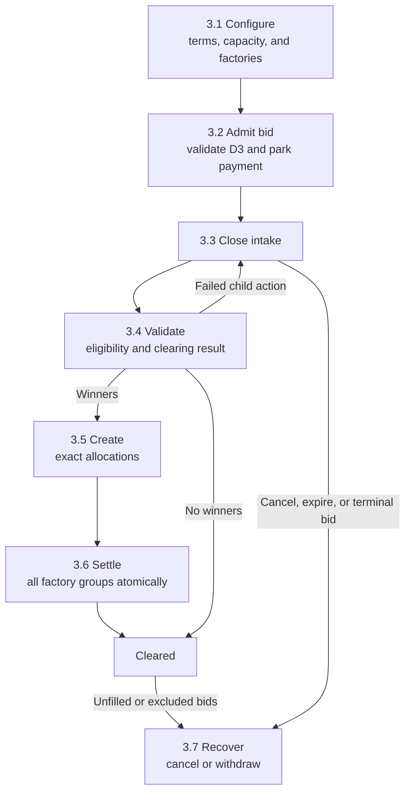
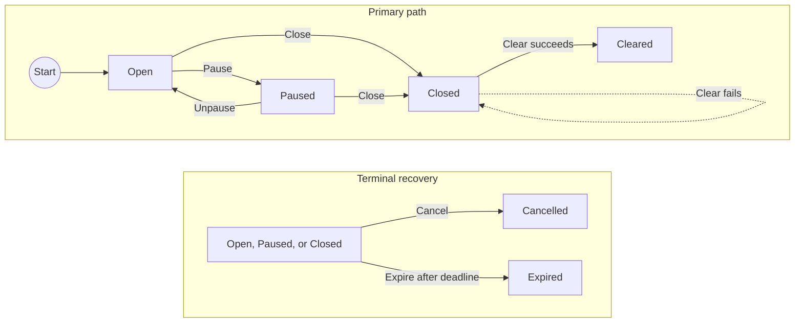
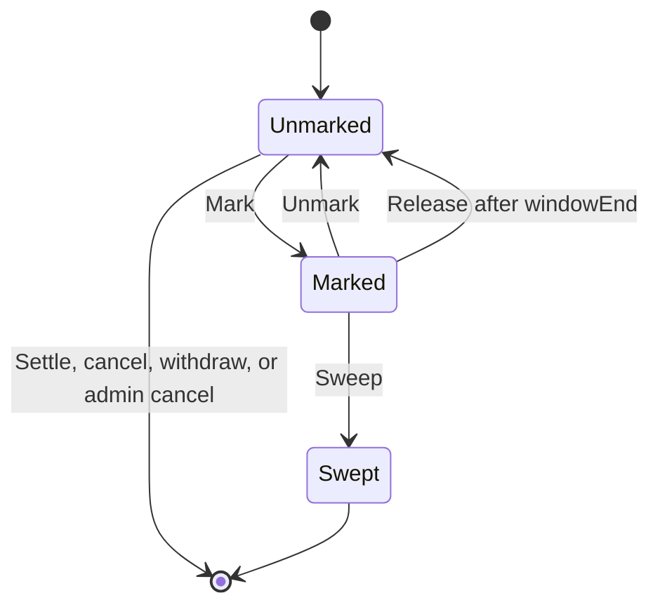
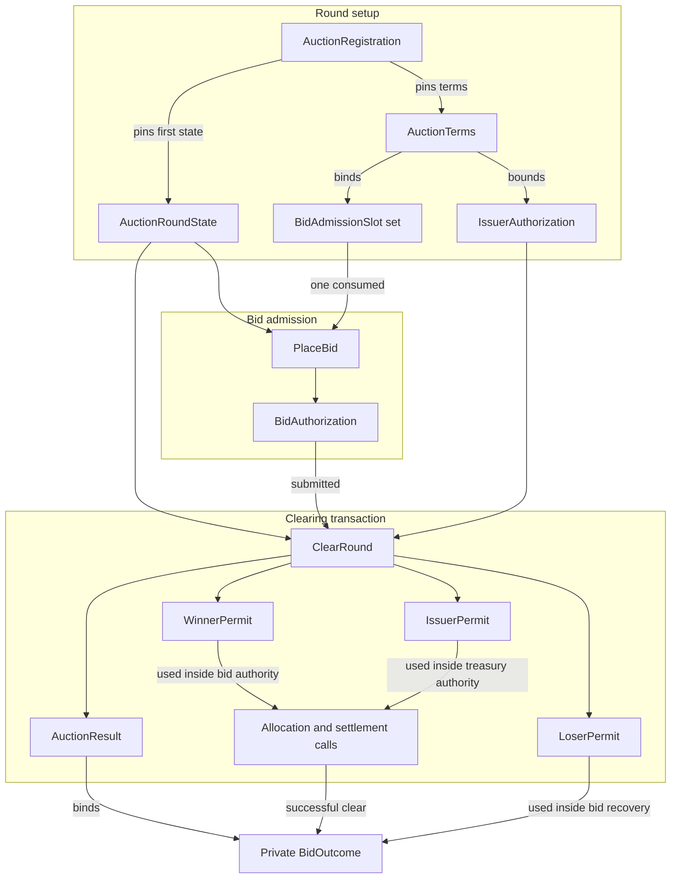

# Confidential auction launchpad reference architecture

This architecture defines a single-round sealed-bid auction for distributing a
token on Canton. Bidders authorize a maximum payment before the round closes.
The auctioneer computes one clearing price off-ledger, and the application
settles payment and token delivery atomically on-ledger.

This architecture specifies target application behavior and production
requirements. Linked experiments provide executable evidence for selected
mechanisms. Production readiness and standards conformance require the complete
composition to be implemented and validated.

## 1. Product Definition

The launchpad accepts confidential quantity bids. Each bid specifies a requested
token quantity and maximum unit price, then locks the rounded maximum payment in
a committed payment allocation. This parking allocation reserves funds without
authorizing payment to the issuer before clearing. Bids at or above the reserve
price are ranked by price. Every winner pays the same clearing price per token,
even if that bidder offered a higher maximum price. If several bids at the
cutoff price compete for the remaining supply, the available tokens are divided
among them in proportion to their requested quantities. Each fill is rounded to
the token's configured lot size, and the fixed admission slot order assigns any
whole lots left after rounding.

The target workflow is one primary distribution. It runs one bidding period,
produces one result, and either atomically settles that result or leaves the
round and its escrows available for retry or recovery. Secondary trading,
continuous issuance, bonding curves, derivatives, and cross-synchronizer
settlement belong to adjacent architectures.

### 1.1 Privacy and Visibility Model

Each bidder submits the actual bid once. Canton transaction projection discloses
it to the bidder's account parties, the auctioneer, and, in the baseline
topology, the issuer. Competing bidders do not receive the `BidAuthorization`
contract or its transaction view. This design therefore needs no separate hash
commitment and reveal phase. Here, sealed bidding means confidentiality from
competitors, not from the auctioneer or issuer. A deployment that separates
issuer and auctioneer visibility requires a different contract topology and
tests of the resulting transaction projections.

Confidential does not mean encrypted from every participant involved in
settlement:

- The auctioneer, as settlement executor, sees the complete clearing result.
- Each instrument admin sees the transfer legs for instruments it administers.
- The owners and providers of the bidder's payment and token delivery accounts
  sign the `BidAuthorization`. Each sees the complete bid, both account records,
  and the pinned factory references.
- The synchronizer orders encrypted transaction views and does not receive bid
  plaintext.
- Transaction projections may include contract data for parties beyond the
  contract's stakeholders. The auction topology limits bidder and account
  provider visibility to bids and settlement branches associated with their
  accounts. See the [detailed ledger model](https://docs.canton.network/overview/reference/ledger-model-detailed).

### 1.2 Bidder Trust Assumptions

The auctioneer sees every admitted bid and submits the bid set for clearing. It
can omit a bid, leak bid information, delay clearing, or refuse to clear. The
target `ClearRound` choice recomputes the configured algorithm for the submitted
set, so the auctioneer cannot change that set's price, fills, or rounding. The
ledger cannot prove that the submitted set includes every admitted bid. The
issuer also sees admitted bids in the baseline and shares the confidentiality
obligation.

Admission slot order resolves whole lots left after pro rata rounding. A venue
that chooses which available slot each bidder receives can influence those final
lots. Production deployments must use an independently verifiable slot
assignment policy and disclose that policy to bidders.

After clearing, the application creates an `AuctionResult`, described in
[section 4.1](#41-contract-responsibilities). It references the immutable round
terms, including the versioned clearing and rounding rules. The result records
the bid and outcome commitment roots, clearing price, and aggregate fill. Each
bidder receives its own outcome record and inclusion proof. An auditor with
authorized access to the bids and outcomes can recompute both the result and the
commitments. This provides accountability for the submitted set while preserving
the bid completeness trust assumption.

Bidders rely on each instrument admin to keep its settlement factory available
and enforce its disclosed compliance policy. They also rely on the instrument's
allocation seizure policy and privileged parties. The allocation admin can mark
an allocation without the bidder's approval, blocking settlement, cancellation,
and withdrawal. A sweep authorized by the required privileged parties can then
move the locked assets under the instrument's policy.
[Section 1.3](#13-control-model-and-allocation-seizure) defines this control and
its production requirements.

Any instrument admin can also block the entire clear by rejecting its batch. A
successful clear commits every admin batch together.

### 1.3 Control Model and Allocation Seizure

This repository uses D1 through D4 as shorthand for control areas shared by its
reference architectures. The labels keep references consistent across the
cited OpenZeppelin experiments and related architecture guides. They are
repository terminology, not Canton or CIP-0112 requirements.

- **Settlement attestation (`D1`)** requires a trusted attester to approve the
  exact asset movements before a settlement factory executes them.
- **Allocation seizure (`D2`)** governs when an instrument admin may mark an
  allocation as seized and when the required parties may move its assets to a
  custodian.
- **Bidder identity (`D3`)** verifies that bidder accounts satisfy the venue's
  eligibility rules.
- **Application authority (`D4`)** separates launch, auction, intake pause,
  round recovery, and upgrade powers.

The detailed [control profile](#24-control-profile) defines their actors,
ledger behavior, and production requirements.

The launchpad never takes ownership of bidder funds. A bid locks payment in an
allocation owned by the bidder's account, and an unsuccessful settlement cannot
move only one side of the trade. This is **non-custodial settlement**, not
holder-only control: an instrument's admin may still have powers over that
instrument.

In the current OpenZeppelin experiment, every allocation supports the seizure
workflow (`D2`). The allocation admin can mark an allocation and select the
receiving custodian account without the bidder's approval. The required
privileged parties can then move the locked assets to that account. An unmarked
allocation may still be marked later; the experiment has no permanent opt out
at creation. See the pinned
[`TokenAllocation`](https://github.com/OpenZeppelin/canton-contracts/blob/7696749737885e25cd88422847105f890f03b00d/experiments/token/tokenCIP112-v1/daml/OpenZeppelin/TokenCIP112V1/Allocation.daml)
source and the component evidence in [section 2.1](#21-core-components-and-evidence).

Time limits, burner capabilities, destination-account authority from a principal
distinct from the admin, and the lawful process path reduce misuse, but they do
not make seizure impossible. The pinned code does not require the burner and
destination account owner to be different parties.

A production instrument must publish an immutable, machine-readable D2 policy.
The target policy is:

```text
D2Policy = Disabled
         | Enabled {
             approvedCustodians,
             maximumSeizureWindow,
             orderPolicy = NoExternalOrder
                         | LawfulProcessPathOnly
                         | EverySweep,
             seizureOrderRegistry
           }
```

The token registry, not the auction, enforces this policy on every allocation.
`Disabled` makes mark and both sweep paths ledger-impossible. An enabled policy
requires a nonempty order registry whenever its `orderPolicy` requires an order.
The auction configuration can reject instruments whose policy does not match the
venue's requirements, but it cannot weaken or override an instrument admin's
authority.

### 1.4 Operational Scope and Boundaries

| In scope | Boundary |
|---|---|
| Sealed bids | Each bid is visible to its bidder, required account providers, issuer, and auctioneer. Unrelated bidders do not see it. |
| Uniform-price allocation | Immutable terms fix the algorithm and rounding rules. `ClearRound` recomputes them for the submitted bid set; the auctioneer remains trusted to submit every admitted bid. |
| Marginal partial fills | During clearing, prior bidder authorization lets the application replace the parked maximum with the exact payment and return any change. No new bidder signature is required. |
| Atomic delivery versus payment | Both assets settle in one Daml transaction. Different admins or settlement factory CIDs require separate `SettleBatch` calls within it. |
| KYC and compliance | Bidder identity is checked at admission and again during clear. A bid that no longer qualifies receives the fixed exclusion result. Each factory verifies its required settlement attestation. |
| Recovery | The configured executor set may cancel losing payment allocations. After the settlement deadline, all required payment account parties may withdraw. Active allocation seizure blocks both. |

## 2. Architecture Overview

Canton contracts are visible only to their stakeholders and to parties that
witness relevant transaction subtrees. Signatories authorize contract creation;
choice controllers authorize an exercise. Within a choice body, the controllers
and the exercised contract's signatories jointly authorize its immediate
consequences. The target uses that propose-and-accept property to carry bidder
and issuer authority into clearing without collecting new signatures after the
deadline. See the [detailed Canton ledger model](https://docs.canton.network/overview/reference/ledger-model-detailed).

An `Account` can include an owner and a provider. Bidder or issuer authorization
therefore includes every account party required by the instrument registry as a
signatory of the corresponding authorization contract.

### 2.1 Core Components and Evidence

**Experiment** marks executable component evidence; production readiness and
standards conformance require separate validation. **Target** marks application
behavior that production implementations must provide and validate end to end.

| Component | Status | Responsibility | Evidence or required implementation |
|---|---|---|---|
| Access control, ownership, pause guards | **Experiment** | Provide role grant and revocation, ownership transfer by explicit acceptance, and pause primitives for application controls. | [`AccessControlV1.daml`](https://github.com/OpenZeppelin/canton-contracts/blob/7696749737885e25cd88422847105f890f03b00d/experiments/access/access-control-v1/daml/OpenZeppelin/AccessControlV1.daml), [`OwnableV1.daml`](https://github.com/OpenZeppelin/canton-contracts/blob/7696749737885e25cd88422847105f890f03b00d/experiments/access/ownable-v1/daml/OpenZeppelin/OwnableV1.daml), and [`PausableV1.daml`](https://github.com/OpenZeppelin/canton-contracts/blob/7696749737885e25cd88422847105f890f03b00d/experiments/security/pausable-v1/daml/OpenZeppelin/PausableV1.daml). |
| Token Standard V2 allocation and settlement | **Experiment** | Lock holdings, create sender and receiver allocations, settle a compatible admin-scoped batch, emit holding-change events, and recover allocations. | Pinned [`TokenRules`](https://github.com/OpenZeppelin/canton-contracts/blob/7696749737885e25cd88422847105f890f03b00d/experiments/token/tokenCIP112-v1/daml/OpenZeppelin/TokenCIP112V1/Registry.daml) and [`TokenAllocation`](https://github.com/OpenZeppelin/canton-contracts/blob/7696749737885e25cd88422847105f890f03b00d/experiments/token/tokenCIP112-v1/daml/OpenZeppelin/TokenCIP112V1/Allocation.daml). |
| D1 settlement attestation | **Experiment** | Verify one consumed attestation for one settlement ID, executor set, factory admin's registry, validity policy, and exact transfer leg set. | [`D1.daml`](https://github.com/OpenZeppelin/canton-contracts/blob/7696749737885e25cd88422847105f890f03b00d/experiments/token/tokenCIP112-v1/daml/OpenZeppelin/TokenCIP112V1/D1.daml). |
| D2 allocation seizure | **Experiment** | Mark an allocation, block settlement, cancellation, and withdrawal, and sweep under allocation admin, burner capability, destination account, and time checks. | [`Allocation.daml`](https://github.com/OpenZeppelin/canton-contracts/blob/7696749737885e25cd88422847105f890f03b00d/experiments/token/tokenCIP112-v1/daml/OpenZeppelin/TokenCIP112V1/Allocation.daml#L152-L234). Production requires the target policy in section 1.3. |
| D3 KYC claim | **Experiment** | Demonstrate transfer-time validation of a typed claim, expiry, and trusted-issuer membership snapshot. | Local [`ShapeB.daml`](../../experiments/identity/hook-shape-b/daml/OpenZeppelin/Experimental/Identity/ShapeB.daml). Production additionally requires current status and revocation handling. |
| `AuctionTerms`, `AuctionRegistration`, `AuctionRoundState`, `BidAdmissionSlot` | **Target** | Keep terms immutable, establish the canonical phase chain, and cap admitted bids with consumable slots. | Implement and validate these proposed application contracts as one workflow. See [section 4.1](#41-contract-responsibilities). |
| `BidAuthorization`, `WinnerPermit`, `IssuerPermit`, `LoserPermit`, `IssuerAuthorization`, `AuctionResult`, `BidOutcome` | **Target** | Carry admitted bid and treasury-account authority into clearing and recovery, then publish aggregate and bidder-private results. | Implement and validate these proposed application contracts as one workflow. See [section 4.1](#41-contract-responsibilities). |
| Clearing service and wallet integration | **Target** | Compute and validate results, prepare commands from current ledger state, obtain required attestations and any required external command signatures, submit and retry idempotently, authenticate disclosures, and present private outcomes. | Implement and validate the off-ledger application services against the configured algorithm and ledger contracts. |

The pinned settlement code provides component-level evidence for the allocation,
settlement, D1, and D2 mechanisms above. Its evidence boundary includes a local
`TokenHolding` implementation and non-iterated settlement. Production assets
must be discovered and assessed through their accepted Token Standard interfaces
and registry policies.

### 2.2 Party and Role Model

| Party or service | Type | Authority and visibility |
|---|---|---|
| Bidder account parties | Daml parties | The required owners and providers of both bidder accounts authorize the maximum payment and later exact winner allocations. Each sees the complete bid authorization. |
| Auctioneer | Daml party plus off-ledger service | Provides standing admission authority with the issuer, sees all admitted bids, submits the bid set and proposed result, controls close and clear, belongs to the baseline round cancellation and expiry actor groups, and is the sole settlement executor. `ClearRound` recomputes the result for the submitted set. |
| Issuer | Daml party | Signs immutable terms and round states, provides standing admission authority, sees all admitted bids, and belongs to the baseline round cancellation and expiry actor groups. It may be distinct from either instrument admin. |
| Issuer treasury account parties | Daml parties | The owners and providers required by the issuer inventory and payment-receipt accounts authorize the exact issuer-side allocations through `IssuerAuthorization`. |
| Launch administrator | Daml party | Pins the canonical registration and configures each new round. Multi-hosting or multisignature command authorization can protect this party without changing its ledger type. |
| Intake pauser | Daml party | Controls intake pause and resume. It cannot change immutable terms or block close, clearing, or recovery in the baseline. |
| Upgrade governance | Daml parties plus deployment governance | Approves supported packages and factory policies between rounds. Existing `AuctionTerms` remain immutable. |
| Payment instrument admin | Daml party | As payment admin, sees and validates the payment-instrument batch and enforces that instrument's D1/D2 policy. A party holding another role may see additional data. |
| Launched token admin | Daml party | As launched token admin, sees and validates the launched token batch and enforces that instrument's D1/D2 policy. A party holding another role may see additional data. |
| KYC issuer | Daml party operated directly or by a credential service | Signs D3 eligibility credentials. D3 and D1 remain separate roles even when one organization operates both. |
| D1 attester | Daml party | Sees and signs the settlement ID, executor set, and exact transfer legs for one compatible factory batch. |
| Burner and destination account parties | Daml parties | Under an enabled D2 policy, the burner presents a capability issued by the admin with an expiry, and the destination account parties authorize creation of replacement holdings. Instrument and case scopes are optional in the current code, which also permits role overlap. |
| Participant or validator | Infrastructure node and application services | Hosts parties and their contract data, exposes the Ledger API, submits commands, validates relevant transaction views, and manages the participant-wide traffic balance. |
| Synchronizer sequencers and mediators | Infrastructure services | Sequencers order and distribute encrypted messages; mediators aggregate participant confirmations and issue transaction verdicts. They are not auction roles and do not receive bid plaintext. |

### 2.3 Authority and Visibility by Action

The target [`AuctionRoundState`](#41-contract-responsibilities) records the
round phase. While it is `Open`, all parties required by the bidder's payment
and delivery accounts control its `PlaceBid` choice. The issuer and auctioneer
are signatories of the round state, so exercising it combines bidder authority
with their standing venue authority. The choice also consumes one
`BidAdmissionSlot` from the state's fixed list. The resulting `BidAuthorization`
has the bidder account parties, issuer, and auctioneer as signatories; each sees
the complete bid.

The auctioneer submits the bid set and proposed result and is the sole baseline
settlement executor. `ClearRound` recomputes deterministic eligibility, price,
fills, and rounding for that set. Exact bidder allocations are created inside
`BidAuthorization_FinalizeWinner`, and exact issuer allocations are created
inside `IssuerAuthorization_Use`. Each allocation factory call uses the
instrument and factory CID pinned in the round terms. Each `SettleBatch` call
receives only legs and allocations compatible with its instrument admin and
settlement factory CID.

Daml authority is local to the exercised choice. Fetching or consuming an
authorization contract does not make its signatories' authority available to a
later sibling action. A variant with multiple executors or an independent clear
guard must make every required party's authority available inside the choice
that cancels or settles.

D2 belongs to the instrument's allocation policy and operates independently of
auction roles. Under a policy that enables D2, the allocation admin may mark an
allocation. While the mark is active, settlement, cancellation, and withdrawal
fail. A sweep also requires a valid burner capability and authorization from the
destination account parties. Holding the allocation alone grants the bidder no
controller role in either action; a bidder participates only when it separately
holds a required privileged role.

### 2.4 Control Profile

The following profile maps each project label to its actors, ledger behavior,
and production requirements.

| Control | Actor and scope | Ledger behavior | Production requirement |
|---|---|---|---|
| **Settlement attestation (`D1`)** | The cited `TokenRules` settlement factory optionally pins a `TrustedAttesterRegistry` CID. | When `requiredAttesterRegistryCid` is present, the factory reads a `ComplianceAttestation` CID from `extraArgs.context`. Verification checks that the registry belongs to the factory admin, the signer and claim kind are trusted, the settlement ID, executor set, and transfer leg set match, and the validity window is current and within the configured maximum. It then consumes the attestation. | Supply one compatible attestation for each factory call that requires D1. The CID travels through choice context rather than a direct `SettleBatch` field. |
| **Allocation seizure (`D2`)** | `allocation.admin` controls the mark. A sweep combines the allocation's standing admin authority, a burner with a capability issued by the admin and carrying an expiry, and the destination account parties. | An active mark blocks settle, cancel, and withdraw. Any single stakeholder can release a lapsed mark. The ordinary sweep must occur before the settlement deadline and does not require a `SeizureOrder`. | The token registry enforces and discloses an immutable `D2Policy` with an independent order policy and authority registry. In the cited experiment, the admin supplies the destination at mark time; the code accepts any regular account whose principal differs from the admin. |
| **Bidder identity (`D3`)** | A trusted KYC issuer signs a credential whose subject matches both bidder account owners in the baseline. | The target bid gate validates the credential at intake and revalidates every submitted bid during clear. Invalid D3 produces the fixed zero fill exclusion. D1 remains a separate settlement attestation. | Define issuer rotation, current status and revocation, accepted claim kinds, owner binding, and expiry. Keep the credential reference in the private `BidAuthorization` rather than transfer leg metadata. |
| **Application authority (`D4`)** | The target assigns launch administrator, auctioneer, intake pauser, round recovery, and upgrade governance responsibilities. Deployment policy defines permitted role overlap. | Target contract signatories and controllers enforce these roles. The access control experiment supplies grants, revocation, and timelocked acceptance; accepting a grant does not revoke the previous holder. | Pin every actor group in `AuctionTerms`, preserve close, clear, and recovery during an intake pause, require explicit acceptance for role changes, revoke superseded grants where exclusivity is required, and disclose emergency powers. |

#### Pinned Experiment Limitations

The cited `TokenRules` uses one optional `requiredAttesterRegistryCid` for D1
and the D2 lawful process path. When it is `None`, D1 is disabled and
`TokenAllocation_SweepD2WithLawfulProcess` proceeds without validating the
supplied seizure order; the remaining D2 authority and time checks still apply.
When it is `Some`, the same registry governs settlement attesters and seizure
order authorities. The target D2 policy therefore defines its own immutable
order policy and authority registry.

Production registry rotation must keep an authenticated registry resolvable by
every dependent factory and active allocation. In the cited experiment,
`TrustedAttesterRegistry_Update` consumes the registry and creates a successor
with a new CID. `TokenRules` retains the archived CID, and every existing
`TokenAllocation` created under those rules also retains it. D1 verification
and the D2 lawful process path can no longer fetch that registry after rotation.
Operators must preserve the referenced trust root until its dependencies are retired,
or implement authenticated successor resolution for both factories and
allocations. Allocations created under replacement rules use the replacement
trust root; existing allocations retain their dependency on the original CID.

The pinned allocation factory and D1 verifier also call `getTime`. A prepared
externally signed transaction that exercises either path must reach the
synchronizer within its configured ledger-time and record-time tolerance. The
application can use ledger-time assertions for its own deadlines, but that does
not remove a factory or verifier's tighter time dependency. A production
deployment must verify that every selected implementation supports its signing
window or keep preparation, signing, and submission within the measured bound.

### 2.5 Wallet Integration Requirements

A bidder-facing wallet must:

- obtain `AuctionRegistration` from a launch trust anchor pinned in wallet
  configuration or an authenticated launch directory. Before collecting any
  account party signature, verify the disclosed `AuctionTerms` against that
  registration and confirm that the current `AuctionRoundState` descends from
  the first state it pins. If the wallet cannot verify that chain, it must
  present the state as a venue assertion and disclose that trust assumption to
  the user. Before admission, confirm that the disclosed `BidAdmissionSlot` CID
  and index occur exactly once in the current state's fixed slot list;
- verify the allocation and settlement factories referenced by the terms for
  both instruments, including each factory's package/interface and admin, and
  confirm the D1 and D2 policies enforced by each instrument's registry.
  Production mode supports only instruments whose registries expose and enforce
  the immutable D2 policy required by
  [section 1.3](#13-control-model-and-allocation-seizure);
- show every account party the requested quantity, maximum unit price, rounded
  maximum payment, parking allocation, deadlines and recovery rules, account
  owners and providers, instrument admins, and applicable D2 seizure powers
  before requesting authorization;
- record the first parking-allocation CID and its complete immutable allocation
  fingerprint. A successor is accepted only when its `originalAllocationCid`
  identifies that first CID and all immutable fields match the stored
  fingerprint;
- use party-filtered ledger updates and active-contract state to maintain the
  bidder's private outcome and current allocation status;
- derive each displayed recovery action from the auction contracts, the
  allocation's live `availableActions`, and ledger time. Identify the required
  actors and timing, and distinguish application paths from independently
  callable token actions, including executor cancellation, admin cancellation
  after `expiresAt`, expired-lock owner unlock, registry garbage collection,
  D2 unmark, stakeholder lapse release, and terminal sweep;
  and
- use the completion stream only to confirm commands submitted by the wallet.
  Follow its update ID and offset to the visible transaction, then reconcile
  the active-contract state.

### 2.6 Deployment and Bootstrap

Deployment fixes the packages, synchronizer, party topology, and trust anchors
used throughout a round. Fixed checks complete before intake opens;
checks for each bidder repeat during admission.

#### Runtime and Package Compatibility

This architecture assigns every contract used by one clear to the same
synchronizer; settlement across synchronizers follows a separate design. The
application package targets Daml-LF 2.3 on a Protocol Version 35 or later
compatible synchronizer so `CommitmentV1` can use the stable SHA-256 primitives.
Pin the application and factory package IDs and Token Standard interface
versions for the lifetime of the round. Audit and approve that package set,
then load and vet it, including dependencies, on every participant that may
interpret an auction transaction. See the [package management guide](https://docs.canton.network/global-synchronizer/production-operations/manage-packages)
and [Canton 3.5.1 release notes](https://docs.canton.network/global-synchronizer/release-notes/canton-releases/3-5-1).

Externally signed prepared clears explicitly request
`HASHING_SCHEME_VERSION_V3`, which covers `max_record_time` and the Protocol
Version 35 transaction fields. The prepare API defaults to V2.

#### Party Topology and Authorization

Configure confirmation topology and command authorization separately for the
launch administrator, issuer, auctioneer, intake pauser, and upgrade governance.
`PartyToParticipant.threshold` sets the number of hosting participants required
to confirm. For external submission, `partySigningKeys` supplies the signing
keys and their threshold. Command authorization may use Daml delegation,
signature verification in Daml, or external multisignature submission. See the
[multi-signature party operations guide](https://docs.canton.network/global-synchronizer/production-operations/multi-sig).

The single executor baseline fixes `settlement.executors = [auctioneer]`. A
design with multiple executors must place every executor's authority inside
each cancel and settlement choice and account for the resulting visibility,
availability, and signing latency.

#### Round Bootstrap

Before opening intake, operators:

1. Create immutable `AuctionTerms` and exactly `maximumBids` consumable
   `BidAdmissionSlot` contracts. Create the first `AuctionRoundState` with those
   slot CIDs, the bounded `IssuerAuthorization`, and an `AuctionRegistration`
   that pins the terms and first state. Publish the registration CID through the
   authenticated trust anchor used by bidder wallets.
2. For each instrument, pin its ID, admin, allocation factory CID, settlement
   factory CID, package and interface versions, account rules, D1 and D2
   policies and registries, deadlines, limits, and pause or freeze behavior.
   Keep every referenced registry resolvable for the lifetime of dependent
   factories and allocations.
3. Approve only factories tested to return completed allocation instructions
   and final, noniterated settlement results for the transfer shapes used by
   this architecture. Verify that factory and D1 time checks fit the prepared
   transaction signing window.
4. Validate the issuer's regular payment and inventory accounts and initial
   inventory coverage. Continue monitoring inventory because
   `IssuerAuthorization` carries authority without reserving holdings; disclose
   and recheck the current issuer holdings at clear.
5. Test authenticated disclosure, party projections, and recovery actions for
   every supported bidder account owner and provider arrangement. Each
   admission separately validates the bidder's regular payment and delivery
   accounts, D3 owner binding, and disclosed admission slot. Confirm that the
   participants hosting those parties have the required packages and
   disclosures.
6. Verify that account parties, executors, attesters, and external signers can
   complete within the configured deadline and submission margins described in
   [section 3.8](#38-time-model-and-deadlines).

#### Optional Contract Key Discovery

`AuctionRegistration` provides the canonical round identity. A deployment that
also uses contract keys for discovery uses the same Daml-LF 2.3 and Protocol
Version 35 baseline and the V3 hashing scheme, which contract keys require.
Because Canton keys are nonunique and negative lookups do not prove global
absence, every discovery result must resolve to the pinned registration and
remain safe when duplicate keys exist. See the
[contract key guide](https://docs.canton.network/appdev/modules/m3-contract-keys)
and [Canton 3.5.1 release notes](https://docs.canton.network/global-synchronizer/release-notes/canton-releases/3-5-1).

## 3. Target Design

The lifecycle separates immutable economic terms from mutable phase state.
`AuctionTerms` is immutable. Every admitted bid binds the terms CID and hash.
`AuctionRegistration` pins the terms and first `AuctionRoundState`. Each state
successor preserves the registration, first state, predecessor, revision, terms
CID, and terms hash.

A wallet verifies the successor transactions from a stakeholder's transaction
stream or a signed state chain proof. Disclosure of a current contract proves
its payload, not its ancestry. A wallet that cannot verify the chain trusts the
venue's assertion and must present it as such.

The main path moves from configuration to atomic settlement. Unfilled and
excluded bids leave through independent recovery, while a failed clear leaves
the round closed for another attempt based on current ledger state.



Sections 3.8 and 3.9 define the time and state rules that constrain these paths.
An active D2 mark excludes a bid from clearing and can delay its recovery; the
D2 overlay in section 3.9 shows the available exits.

### 3.1 Round Configuration and Clearing Math

The launch administrator, issuer, and auctioneer configure:

- immutable `AuctionTerms`, including a versioned `algorithmId` for the exact
  clearing function, a versioned `commitmentSchemeId` for the record encoding
  and hash tree, offered quantity, reserve price, price tick, token lot size,
  payment rounding, remainder order, deadlines, and `maximumBids`;
- each instrument's ID, admin, allocation factory CID, settlement factory CID,
  regular account requirements, D1 policy, and disclosed D2 policy;
- the D3 issuer registry, accepted credential kinds, account owner binding, and
  current status and revocation policy;
- `settlement.executors = [auctioneer]` for the baseline;
- an immutable D4 policy. The baseline assigns intake pause and resume to the
  intake pauser, close to the auctioneer, and round cancellation or expiry to
  either the issuer or auctioneer through separately allowed one-party groups;
- one `Open` round state whose ordered `admissionSlotCids` list contains exactly
  `maximumBids` unique `BidAdmissionSlot` contracts;
- an `AuctionRegistration` that pins the terms and first round state; and
- an `IssuerAuthorization` signed by every owner and provider required by the
  issuer payment and inventory accounts.

The setup checks positive offered quantity, reserve price, price tick, token lot
size, and bid capacity. Offered quantity is lot aligned, reserve price is tick
aligned, setup completes before `biddingDeadline`, and
`biddingDeadline < settlementDeadline`. The settlement deadline also fits every
selected factory and referenced-state lifetime. Both versioned IDs resolve to
implementations and test vectors approved before intake.

All four business accounts are regular accounts with `owner = Some`. Both
bidder account owners equal the D3 subject. A delegated payer or beneficiary
requires a separate delegation and eligibility design. This baseline transfers
existing issuer inventory; mint and burn accounts follow a separate design.

`IssuerAuthorization` binds the terms, accounts, factories, offered quantity,
and settlement deadline. It carries authority but does not reserve inventory.
At clear, the issuer treasury service discloses current unlocked holding CIDs to
the clearing participant. `IssuerAuthorization_Use` verifies their account,
instrument, amount ceiling, and factory before using them.

The clearing function is selected by `algorithmId` and implemented as a pure,
deterministic function in `ClearRound`. It orders eligible bids by maximum unit
price and then by admission slot. It fills price bands above the marginal band,
allocates the marginal band pro rata in whole lots, and gives remaining lots in
slot order only to bids with unfilled requested quantity. Under-subscribed demand
clears at the reserve price. Otherwise the clearing price is the marginal
accepted price.

For example, consider 100 tokens, a reserve price of 8, a price tick of 1, and a
lot size of 10:

| Bid | Admission slot | Requested quantity | Maximum unit price | Final fill |
|---|---:|---:|---:|---:|
| A | 0 | 50 | 12 | 50 |
| B | 1 | 80 | 10 | 40 |
| C | 2 | 40 | 10 | 10 |

Bid A takes 50 tokens above the marginal price band. The remaining 50 tokens are
divided between B and C in the ratio 80:40. Lot rounding first gives them 30 and
10 tokens. The final 10-token lot goes to B because slot 1 precedes slot 2. All
three winners pay the uniform clearing price of 10 per token.

### 3.2 Admit a Bid and Park Maximum Payment

Wallets receive authenticated disclosure of the terms, registration, current
`Open` round state, one available admission slot, and both allocation factories.
All parties required by the bidder's payment and delivery accounts control the
nonconsuming `AuctionRoundState_PlaceBid` choice.

Admission requires ledger time before `biddingDeadline`, regular accounts,
positive and aligned quantity and maximum unit price, a maximum price at or
above the reserve, and a current D3 credential with the required subject, kind,
issuer, and expiry. The state and registration identities must match the chain
verified by the wallet.

The terms define one fixed scale, overflow checked payment function:

```text
maxPayment = paymentRound(requestedQuantity * maximumUnitPrice)
```

`maxPayment` must be positive. In the same transaction,
`AuctionRoundState_PlaceBid`:

1. exercises the supplied `BidAdmissionSlot_Use`, checking that its CID and
   slot index occur exactly once in the round state's ordered slot list;
2. asks the payment allocation factory to create a committed, single-instrument
   sender-side parking allocation for exactly `maxPayment`, with the bidder
   payment account as both authorizer and `otherside`;
3. requires `AllocationInstructionResult_Completed`, records the returned
   allocation CID as the allocation root, and records returned change; and
4. creates `BidAuthorization` with the bidder account parties, issuer, and
   auctioneer as signatories.

`BidAuthorization` binds the slot CID and index; terms, registration, and
admission state identities; full accounts; instrument, admin, and both factory
references; treasury accounts; quantity; limit price; `maxPayment`; rounding;
leg IDs; deadline; D3 reference; and a random 32-byte commitment nonce. It also
fingerprints the root allocation's complete `SettlementInfo`,
`AllocationSpecification`, holding CIDs, `createdAt`, `expiresAt`, and
`numIterations = 0`.

The round state's fixed slot list enforces the bid cap. Venue signatories prevent
bidder account parties from creating an admitted authorization on their own.
All admission signatories could still collude, which remains a disclosed trust
boundary. Because every required account party signs `BidAuthorization`, each
sees its complete contents.

The parking allocation returns payment to the same bidder account if settled
outside the auction, so it cannot pay the issuer. The auctioneer can cancel it
as the configured executor, which remains a disclosed availability power.

### 3.3 Pause Intake, Close, Cancel, or Expire

Each phase choice consumes the current `AuctionRoundState` and creates its
canonical successor:

- The intake pauser controls `Pause`, which changes `Open` to `Paused`, and
  `Unpause`, which restores `Open` before the bidding deadline.
- The auctioneer controls `Close`, which changes `Open` or `Paused` to `Closed`
  at or after the bidding deadline. `Closed` has no pause flag and is the only
  phase that can clear.
- One cancellation actor group pinned in the terms controls `CancelRound`. It
  creates `Cancelled` from any live phase and enables independent bid recovery
  under the existing allocation deadlines.
- One expiry actor group pinned in the terms controls `ExpireRound`. It creates
  `Expired` from any live phase at or after the settlement deadline.

No phase choice edits or recreates `AuctionTerms`. A policy, factory, algorithm,
or arithmetic change requires a new round. Token Standard withdrawal remains
available to all required payment account parties after the allocation's
settlement deadline, subject to D2, even if the venue does not exercise
`ExpireRound`.

### 3.4 Compute and Validate One Result

After close, the auctioneer submits the complete admitted bid set, each bid's
authenticated current parking allocation, current D3 evidence, and the D1 inputs
needed by the resulting factory groups. `ClearRound` cannot discover omitted
contracts, so bid set completeness remains an auctioneer trust assumption.

For every submitted bid, the choice verifies the admission slot and complete bid
binding. It accepts the root allocation or an authenticated successor with the
same immutable fingerprint. A bid with expired or revoked D3, or an active D2
mark, receives a deterministic zero fill exclusion reason. A bid whose
allocation has already reached an unreconciled terminal state cannot enter the
baseline clear. The venue cancels the round and reconciles every bid. Excluding
such a bid while preserving the round would require an authenticated terminal
receipt that the pinned registry does not provide. A concurrent credential or
allocation change invalidates the prepared transaction and requires a fresh
submission.

`ClearRound` runs the configured function over the remaining eligible bids. It
checks that each supplied bid appears exactly once, every outcome follows the
fixed exclusion and allocation rules, and totals respect price limits, lot and
tick alignment, rounded payment equality, and offered supply. This removes
auctioneer discretion over the submitted set's price and fills. It does not
prove that the set is complete.

`CommitmentV1` uses SHA-256 Merkle roots over domain separated, length prefixed
canonical records ordered by admission slot. Bid leaves include the terms hash,
slot, bid CID, quantity, limit price, and commitment nonce. Outcome leaves
include the slot, bid CID, disposition, fill quantity, payment, exclusion
reason, and leg IDs. `AuctionResult` stores the terms CID and hash,
`algorithmId`, `commitmentSchemeId`, both roots, the clearing price, and
aggregate fill. Each `BidOutcome` binds that result and carries the bidder's
record and inclusion proof. The versioned commitment specification includes
published test vectors that define the encoding and tree construction.

After validation, the transaction creates the aggregate result and:

- one `WinnerPermit` per winner, bound to the result, terms, bid, allocation
  root, fill, price, payment, settlement, leg IDs, and exact compatible factory
  groups;
- one `IssuerPermit`, bound to the result and exact issuer legs; and
- one private `LoserPermit` per excluded or unfilled bid, bound to its result
  commitment and deterministic reason.

The issuer and auctioneer sign each permit. Their authority comes from the
canonical clear, not a fresh signature collected after close. An optional clear
guard must authorize the exact choice body that creates and consumes its permit;
naming a guard elsewhere does not lend its authority.

An empty winner set is valid. The issuer authorization closes without calling
either allocation factory. Clear makes no settlement or D1 call, then creates
the zero fill result, loser permits, and terminal successor.

### 3.5 Materialize Exact Winner and Issuer Allocations

For each winner, clear exercises `BidAuthorization_FinalizeWinner`. The current
allocation CID must equal the recorded root or identify it through
`originalAllocationCid`. Its complete immutable allocation fingerprint must
match, and it must have no active D2 mark. An unmarked or lapse-released
successor may continue; a terminal chain cannot.

Inside that bidder-authorized choice body, the application:

1. calls `Allocation_Cancel` with `actors = [auctioneer]` and requires the
   standard cancelled output and returned bidder holdings;
2. uses those holdings to create the exact payment allocation, requires
   `AllocationInstructionResult_Completed`, and records returned change; and
3. creates an exact receiver-only launched token allocation and again requires
   a completed result.

The same fixed scale rule computes positive
`fillPayment = paymentRound(fillQuantity * clearingPrice)` and checks
`fillPayment <= maxPayment`. The pinned experiment supports the receiver-only
and returned-change shapes and rejects iterated settlement
([`Registry.daml` lines 276-372](https://github.com/OpenZeppelin/canton-contracts/blob/7696749737885e25cd88422847105f890f03b00d/experiments/token/tokenCIP112-v1/daml/OpenZeppelin/TokenCIP112V1/Registry.daml#L276-L372)).

Issuer allocations are created inside `IssuerAuthorization_Use`. It consumes
`IssuerPermit_Use`, verifies the result and exact issuer legs, then checks the
disclosed unlocked holdings. The choice creates the issuer payment receiver and
launched token sender allocations and requires completed factory results.
Keeping these actions inside their authorization choices preserves the required
account party authority.

[Section 4.3](#43-allocation-matrix) shows the resulting payment and launched
token sides for one winner.

### 3.6 Group, Settle, and Publish Atomically

The application groups legs and finalized allocations by compatible
`(admin, settlementFactoryCid)`. Instruments sharing an admin coalesce only when
the same settlement factory supports both. Allocation factory and settlement
factory references are pinned separately; one contract may implement both
interfaces, but the design does not assume that they share a CID.

Within each group, sender and receiver sides exactly cover every transfer leg.
Allocations are normally separate for each authorizer account. Each D1-enabled
factory call receives one consumed, leg-bound attestation at
`openzeppelin.com/d1-attestation` in `extraArgs.context`.

Every `SettlementFactory_SettleBatch` call runs inside the same outer clear with
`actors = [auctioneer]`. CIP-0112 assigns executors responsibility for
coordinating atomic settlement across admins; this architecture requires those
calls to be children of one Daml transaction. See
[CIP-0112 section 4.3.1](https://github.com/canton-foundation/cips/blob/main/cip-0112/cip-0112.md#431-configurable-executors-and-batch-settlement-via-settlementfactory).

The application requires one positional result per submitted allocation and
requires every result to be final `AllocationResult_Settled` with no next
iteration. Because result entries do not contain allocation CIDs, positional
correspondence remains a vetted factory conformance assumption. `Pending`, a
successor iteration, or any invalid result aborts the clear.

The same transaction consumes the closed round state and creates
`Cleared(resultCid)`, winner outcomes, and the canonical result. It also consumes
winner bids, permits, and `IssuerAuthorization`. Consumers accept only a result
reached through the verified state chain. Any failed child action rolls back the
entire transaction.

`AuctionResult` exposes aggregates and commitment roots. Each `BidOutcome` is
signed by the issuer and auctioneer, observed by that bid's account parties, and
contains only that bidder's result and commitment proof.

### 3.7 Release Losers and Reconcile External Recovery

Winner settlement does not cancel losers. Each `LoserPermit` is an independent
recovery handle, so a stale or seized loser cannot abort winner settlement.

- Before `settlementDeadline`, the auctioneer exercises
  `BidAuthorization_CancelLoser`. Inside the bid-authorized body, it consumes the
  matching `LoserPermit_Use`, authenticates the current allocation, calls
  `Allocation_Cancel` with `[auctioneer]`, and creates the private outcome.
- After the deadline, all parties required by the payment account exercise
  `BidAuthorization_WithdrawLoser`. Its body consumes the matching permit,
  authenticates the allocation, and calls `Allocation_Withdraw`.
- After round cancellation or expiry,
  `BidAuthorization_CancelTerminal` and
  `BidAuthorization_WithdrawTerminal` provide the same paths without a loser
  permit.
- A failed clear leaves the closed state and bids active because every attempted
  child action rolled back.

These actions begin on `BidAuthorization`, whose signatories supply the required
bidder and venue authority. `IssuerAuthorization_Close`, controlled by all
treasury account parties, closes the standing issuer authorization after a
canonical cancellation, expiry, or its own deadline without moving value.

Token Standard choices remain independently callable. All required payment
account parties can withdraw after the deadline. The configured executor set
can cancel; the baseline set is `[auctioneer]`. After `expiresAt`, the allocation
admin can also cancel under the pinned implementation. An authorized D2 sweep
can consume the allocation. After `lockExpiresAt`, the payment account parties
can unlock the backing holding directly and the allocation admin can garbage
collect the stale allocation. Application ingestion must reconcile each
terminal token event.

`BidAuthorization_CloseExternallyResolved` closes the application record after
`settlementDeadline` when the token allocation has already terminated. If a loser
permit exists, it consumes the matching externally resolved variant. The choice
records an observed disposition; the pinned registry does not provide an
on-ledger proof of every external terminal action.

An active D2 mark blocks settle, cancel, and withdraw. The admin can unmark it,
one stakeholder can release it after the seizure window lapses, or an authorized
sweep can terminate the allocation. Every application path authenticates the
current successor against the recorded root and immutable fingerprint.

### 3.8 Time Model and Deadlines

| Time boundary | Purpose | Recovery consequence |
|---|---|---|
| `biddingDeadline` | Intake succeeds only while ledger time is before this cutoff. | An intake pause may stop bids earlier but does not move the cutoff. |
| `settlementDeadline` | Clear and committed winner settlement complete before this cutoff. | Afterwards, all required payment account parties may withdraw and the executor stops clearing. |
| Registry `expiresAt` | Registry-selected lock cleanup bound. | The application uses the earliest applicable bound and does not assume common registry lifetimes. |
| D2 `windowEnd` | End of the active seizure window. | A stakeholder can release a lapsed mark. The experiment's `TokenAllocation_SweepD2WithLawfulProcess` path may pass the settlement deadline but not this bound; section 2.4 describes its order-validation limitation. |

The target auction choices use ledger-time assertions for their deadlines. The
backend sets `max_record_time` on each prepared clear and completes signing and
submission before that bound. Expired transactions are prepared and signed
again. Multi-instrument settlement uses the earliest bound from the prepared
transaction and every referenced registry or context contract. See
[Working with Time](https://docs.canton.network/appdev/modules/m3-working-with-time)
and [External Signing: Submitting Transactions](https://docs.canton.network/appdev/deep-dives/external-signing-transactions).

The pinned allocation factory and D1 verifier call `getTime`. Prepared commands
that exercise them also inherit the synchronizer's configured ledger-time and
record-time tolerance. `max_record_time` does not remove that constraint. The
deployment therefore selects implementations compatible with its signing window
or proves that its preparation and signing path stays within the tighter bound.

For idempotency, persist one change ID (`userId`, `commandId`, and `actAs`) for
each logical clear. Submit it with an explicit deduplication period that covers
the retry horizon and stays within the participant's configured maximum. A retry
of the same proposed result uses that change ID and participant with a fresh
submission ID. Recomputing the result after a state or eligibility change is a
new logical clear and uses a new change ID. Rejected submissions do not
establish deduplication, so the backend revalidates ledger state before retrying.
See
[Command Deduplication](https://docs.canton.network/appdev/deep-dives/command-deduplication).

When Canton Coin is the payment instrument,
[CIP-0107](https://github.com/canton-foundation/cips/blob/main/cip-0107/cip-0107.md)
makes Canton Coin's Token Standard implementation compatible with its configured
long signing window through `ExternalPartyConfigState`. This CC-specific
behavior does not extend auction, D1, or other token contracts. Every prepared
clear preserves the registry context returned during preparation and respects
the shortest referenced-state lifetime.

### 3.9 State Models

#### Round States

The primary panel shows intake and clearing. The terminal panel applies to each
live state named in its source node; section 3.8 supplies the time conditions.



#### D2 Allocation Overlay

An active D2 mark overlays the lifecycle rather than creating a new round phase.
It blocks settlement and recovery until the allocation returns to an unmarked
successor or is swept.



## 4. Application Contract Design

The application contracts coordinate the auction lifecycle and call the
configured token interfaces. Each instrument registry remains the source of
token policy. The target application owns these contract types; Canton,
CIP-0112, and the cited OpenZeppelin experiments provide the ledger and token
mechanisms they compose.

The relationship map separates round setup, bid admission, clearing, and private
outcome delivery. Permits bind result data, while bidder and issuer authorization
contracts supply the authority of the required account parties inside the
relevant choice body.



### 4.1 Contract Responsibilities

| Contract | Signatories and observers | Responsibility |
|---|---|---|
| `AuctionTerms` | Launch administrator, issuer, and auctioneer sign | Holds immutable economics, deadlines, instrument and factory bindings, D1-D4 policies, algorithm and commitment scheme IDs, capacity, and arithmetic rules. |
| `AuctionRegistration` | Launch administrator, issuer, and auctioneer sign | Pins the terms CID and first `AuctionRoundState` CID. Wallets use this stable root to verify the successor chain. |
| `AuctionRoundState` | Issuer and auctioneer sign | Holds the phase, registration and terms identity, first state, predecessor, revision, and ordered admission slot CIDs. Consuming choices form the phase chain. |
| `BidAdmissionSlot` | Issuer and auctioneer sign | Caps intake. `PlaceBid` consumes one slot from the state and binds its index to the admitted bid. |
| `BidAuthorization` | Required parties of both bidder accounts, issuer, and auctioneer sign | Carries one admitted bid's account authority, terms and slot binding, commitment nonce, and parking allocation root into clearing or recovery. |
| `WinnerPermit` | Issuer and auctioneer sign | Binds one winner's exact fill, payment, legs, and factory groups to the result. It is consumed inside bidder authority. |
| `IssuerPermit` | Issuer and auctioneer sign | Binds the issuer's exact receiver and sender legs to the result. It is consumed inside treasury authority. |
| `LoserPermit` | Issuer and auctioneer sign; that bid's account parties observe | Binds one unfilled or excluded bid and reason to the result. It is consumed inside bid recovery. |
| `IssuerAuthorization` | Required issuer treasury account parties sign; auctioneer observes | Carries bounded treasury authority. `Use` creates issuer allocations inside its body; `Close` removes unused authority after a terminal round or deadline. |
| `AuctionResult` | Issuer and auctioneer sign | References the immutable terms and stores the `algorithmId`, `commitmentSchemeId`, bid and outcome commitment roots, clearing price, and aggregate fill. |
| `BidOutcome` | Issuer and auctioneer sign; that bid's account parties observe | Binds the result and stores one bidder's result record and commitment proof without exposing sibling outcomes. |

### 4.2 Choice Surface

`AuctionTerms` pins every D4 actor group. The baseline assigns pause and resume
to the intake pauser, close and clear to the auctioneer, and round cancellation
or expiry to either the issuer or auctioneer through separate one-party groups.
A choice with an `actors` argument accepts only a group listed in the terms.

Controller authority applies inside the exercised choice body. A permit is
therefore consumed from within the authorization choice that creates, cancels,
withdraws, or settles the corresponding allocation.

| Choice | Controller | Consuming? | Required effect |
|---|---|---:|---|
| `AuctionRoundState_PlaceBid` | Required parties of both bidder accounts | No | Validate intake and D3, consume one listed admission slot, and create a completed parking allocation with its admitted `BidAuthorization`. |
| `BidAdmissionSlot_Use` | Auctioneer | Yes | Verify the terms, round identity, slot CID, and index; return the bound slot data inside `PlaceBid`. |
| `AuctionRoundState_Pause` / `Unpause` | Intake pauser | Yes | Stop or resume intake without changing terms, deadlines, close, clear, or recovery authority. |
| `AuctionRoundState_Close` | Auctioneer in the baseline | Yes | Create `Closed` from `Open` or `Paused` at or after `biddingDeadline`. |
| `AuctionRoundState_CancelRound` | One cancellation actor group pinned in the terms | Yes | Create `Cancelled` from any live phase and enable independent bid recovery. |
| `AuctionRoundState_ExpireRound` | One expiry actor group pinned in the terms | Yes | Create `Expired` from any live phase at or after `settlementDeadline`. |
| `AuctionRoundState_ClearRound` | Auctioneer | Yes | Validate the canonical `Closed` state and submitted bid set, recompute deterministic eligibility and clearing, finalize winners, settle every factory group, and create `Cleared(resultCid)`. |
| `BidAuthorization_FinalizeWinner` | Auctioneer | Yes | Consume the exact `WinnerPermit`; authenticate/cancel the current parking-chain member; create completed exact winner allocations inside bidder authority. |
| `WinnerPermit_Use` | Auctioneer | Yes | Verify the result, bid, fill, price, payment, settlement, legs, and factory groups; return the bound data to winner finalization. |
| `IssuerPermit_Use` | Auctioneer | Yes | Verify the result, terms, accounts, exact legs/amounts, factories, and deadline; return the bound data to issuer authorization. |
| `IssuerAuthorization_Use` | Auctioneer | Yes | Exercise `IssuerPermit_Use`, check disclosed holdings, and create completed issuer receiver/sender allocations inside treasury-party authority; with no winners, close without factory calls. |
| `IssuerAuthorization_Close` | All treasury account parties | Yes | After canonical cancel/expiry or the authorization deadline, remove standing authority without moving value. |
| `BidAuthorization_CancelLoser` / `WithdrawLoser` | Auctioneer before deadline / all payment account parties after it | Yes | Inside bid authority, consume the matching `LoserPermit_Use`, authenticate the current allocation, cancel or withdraw, and create the private outcome. |
| `LoserPermit_Use` | Same actors as the enclosing bid choice | Yes | Verify result, bid, exclusion, and actor/time variant; return its bound data to the enclosing recovery choice. |
| `BidAuthorization_CancelTerminal` / `WithdrawTerminal` | Auctioneer before deadline / all payment account parties after it | Yes | Verify canonical `Cancelled`/`Expired`, then authenticate and cancel/withdraw without a loser permit. |
| `BidAuthorization_CloseExternallyResolved` | Payment-account parties after deadline | Yes | Archive application metadata and any matching loser permit after an independent token choice; move no value and label the disposition as externally observed. |

### 4.3 Allocation Matrix

CIP-0112 requires authorization for both sides of each transfer leg and scopes
each settlement factory to one instrument admin. The rows below show the four
logical sides for one winner. A compatible `(admin, settlementFactoryCid)`
combines its rows in one batch; different groups use separate calls inside the
same outer Daml transaction.

| Asset movement | Compatible factory group | Authorizer account | Side | Amount |
|---|---|---|---|---:|
| Payment to issuer | `(paymentAdmin, paymentSettlementFactoryCid)` | Bidder payment | Sender | `fillPayment` |
| Payment to issuer | `(paymentAdmin, paymentSettlementFactoryCid)` | Issuer payment receipt | Receiver | `fillPayment` |
| Token delivery | `(tokenAdmin, tokenSettlementFactoryCid)` | Issuer inventory | Sender | `fillQuantity` |
| Token delivery | `(tokenAdmin, tokenSettlementFactoryCid)` | Bidder delivery | Receiver | `fillQuantity` |

Winner finalization uses the parking allocation as an input. Its cancellation,
exact reallocation, and returned change all roll back if a later child fails. The
default is one finalized allocation per authorizer account and compatible
`(admin, settlementFactoryCid)` group. Coalescing requires documented account
and factory compatibility. The admin and factory constraints come from the
pinned Token Standard [`SettlementFactory`](https://github.com/hyperledger-labs/splice/blob/69b43eb761e38695052c983715aa855c8cb207fc/token-standard/splice-api-token-allocation-v2/daml/Splice/Api/Token/AllocationV2.daml#L369-L434)
interface.

### 4.4 Token Standard API Fidelity

The target integration preserves the following interface constraints:

| Interface constraint | Application handling |
|---|---|
| `AllocationSpecification.settlementDeadline` is optional in the interface. | Set it for every auction allocation and use the earliest bound imposed by every allocation, factory, registry, context contract, and prepared transaction. |
| `AllocationFactory` and `SettlementFactory` are separate interfaces. | Bind both CIDs per instrument. Group settlement by compatible `(admin, settlementFactoryCid)` rather than by a presumed registry CID. |
| An allocation instruction may return `Pending`, `Completed`, or `Failed`. | Accept only `Completed` and use its returned allocation CID and change. A factory used by this lifecycle must complete synchronously for the supported shape. |
| `SettlementFactory_SettleBatch.allocations` contains `FinalizedAllocation` values. | For the pinned non-iterated experiment, submit empty `extraTransferLegSides` and `nextIterationFunding = None`. |
| Settlement results are positional and contain no allocation CID per entry. | Check the result count and require every positional result to be final `Settled` with no next iteration. Treat ordering as a vetted factory conformance property. |
| A D1-enabled pinned factory reads its attestation from `openzeppelin.com/d1-attestation` in `extraArgs.context`. | Supply one exact attestation for each factory call that requires D1. The factory uses its pinned `requiredAttesterRegistryCid`; the caller does not choose a registry for the clear. |
| D1 settlement attestation and D3 bidder identity are separate controls. | Validate D3 on the private bid path and provide D1 only to the applicable settlement factory call. |
| Holding changes are exposed through event-log exercises. | Ingest those exercises and correlate them to the result. The pinned temporary event-log host is created and archived within the emitting transaction. |
| `originalAllocationCid` correlates a successor with its first allocation. | Also compare the complete immutable allocation fingerprint before finalizing, cancelling, or withdrawing. |
| The pinned allocation factory and D1 verifier call `getTime`. | Include their ledger-time tolerance in prepared transaction conformance and signing-window tests. |

These shapes are defined by the pinned Token Standard
[`AllocationV2`](https://github.com/hyperledger-labs/splice/blob/69b43eb761e38695052c983715aa855c8cb207fc/token-standard/splice-api-token-allocation-v2/daml/Splice/Api/Token/AllocationV2.daml)
and
[`AllocationInstructionV2`](https://github.com/hyperledger-labs/splice/blob/69b43eb761e38695052c983715aa855c8cb207fc/token-standard/splice-api-token-allocation-instruction-v2/daml/Splice/Api/Token/AllocationInstructionV2.daml)
interfaces.

## 5. Security and Auditability

Security review separates guarantees that the completed application and vetted
factories must enforce from assumptions managed through governance, operations,
and disclosure.

### 5.1 Guarantee Boundary

#### Required Ledger Guarantees

| Guarantee | Enforcement point |
|---|---|
| Local authorization | Contract creation requires every signatory. Each choice requires its controller and carries the exercised contract's signatories only inside that choice body. |
| Canonical phase transition | Registration pins the first state. Every verified phase transition consumes one predecessor and creates one successor. Only `Cleared(resultCid)` accepts a result. |
| Bounded admission | `PlaceBid` consumes one unique CID from the state's fixed list of `maximumBids` slots. |
| Deterministic submitted-set result | `ClearRound` recomputes eligibility, price, fills, exclusions, and rounding for the supplied admitted bids. |
| Signed value limits | Each winner stays within its signed quantity and maximum payment under the fixed arithmetic rule. |
| Complete and atomic DvP | Each factory group has exact sender and receiver coverage. Every group executes in the same outer Daml transaction. |
| Final output acceptance | Allocation creation must be completed and every settlement result must be final before `AuctionResult` becomes canonical. |
| Bounded recovery | Cancel and withdraw use authenticated allocation chains and exact actor/time rules. An active D2 mark remains the disclosed exception. |

#### Trusted and Deployment Assumptions

| Assumption | Consequence |
|---|---|
| Bid completeness and confidentiality | The auctioneer submits every admitted bid. The auctioneer and issuer protect the bid data they receive. |
| State-chain authenticity | Clients begin with an authentic registration and verify successor evidence. A disclosed current state proves its payload, not its ancestry. |
| Joint-signer behavior | Parties that jointly sign admission or permit contracts can collude to create lookalikes. Daml authorization proves consent, not constructor ancestry. |
| Venue recovery powers | The immutable D4 policy allows its named actor groups to cancel or expire a round. Bidders rely on the published policy and recovery deadlines. |
| Instrument administration | Admins keep vetted factories available and use D1, D2, pause, or freeze powers according to the instrument policy. |
| Issuer inventory | The issuer keeps enough unlocked launched tokens available until clear because `IssuerAuthorization` reserves authority, not holdings. |
| Compliance decisions | D1 attesters and D3 credential issuers apply the stated policy and protect their keys. |
| Deployment and audit evidence | Operators configure packages, topology, signing, time bounds, disclosures, and traffic correctly. Auditors receive the confidential records needed to recompute a result. |

### 5.2 Security Invariants

An implementation must enforce and test the following production invariants:

| Invariant | Required property |
|---|---|
| Canonical admission and finality | Registration pins immutable terms and the first round state; verified successors consume their predecessor. `PlaceBid` consumes one listed admission slot and creates one completed self-return parking allocation with its venue-authorized bid. Only `Cleared(resultCid)` finalizes. |
| Complete binding and arithmetic | Each bid binds its slot; accounts and parties; instrument and factory identities; registration and state identities; allocation fingerprint; credential; settlement; deadline; leg IDs; commitment nonce; and positive fixed-scale amount calculation. |
| Deterministic clearing | Terms fix the algorithm, reserve, ticks, lots, payment rounding, remainder order, and maximum bid count. `ClearRound` recomputes the only valid result for the submitted set. |
| Eligibility and controls | Both bidder account owners match the D3 subject. D3 is checked at intake and clear. Invalid D3 and active D2 have fixed exclusion results. Each required factory call checks its own D1 input. |
| Local authority | Bidder allocations are created inside the consumed bid choice and issuer allocations inside the issuer choice. Every dependent action executes where the required account authority is locally available. |
| Factory isolation and atomicity | Each `(admin, settlementFactoryCid)` call has exact leg coverage and completed allocations. All calls share one clear and return final outputs; an empty winner set calls no token factory. |
| Allocation-chain authentication | Finalize, cancel, and withdraw accept only the root or a full-field-matching successor naming that root. A marked bid receives the fixed exclusion and cannot recover until unmark or lapse release; sweep is terminal. |
| Independent recovery | Bid choices nest loser or terminal cancel and withdraw. Issuer authority has a terminal close. Direct token actions are reconciled as observed dispositions. |
| Privacy and auditability | Bidders receive no sibling bid or outcome record; required providers see their bidder's full authorization. Versioned commitments cover the exact bids, algorithm outputs, exclusions, and leg IDs. |

### 5.3 Threat Model and Failure Recovery

| Threat or failure | Effect | Required defense or recovery |
|---|---|---|
| Auctioneer omits a bid | The submitted set can produce an unfair price or allocation. | Fixed slot identities, commitment proofs, private outcomes, and auditor disclosure expose discrepancies when evidence is available. The ledger cannot prove completeness. |
| Auctioneer misorders or changes submitted bids | The proposed result differs from the published algorithm. | `ClearRound` orders by the immutable rule and recomputes eligibility, price, fills, and rounding. |
| Admission or permit lookalike is created or reused | Intake checks or bidder authority could be bypassed. | The `Open` state lists the only valid consumable slots; venue signatories authorize admission; permits bind every result field and are consumed. Add a local clear guard if issuer and auctioneer trust is insufficient. |
| Venue presents two results | Conflicting prices or double allocation. | Only a transaction-verified canonical round state can create the accepted `Cleared(resultCid)` successor; clients ignore lookalikes. |
| Factory calls are split, mis-grouped, or return nonfinal output | Partial DvP or premature finality. | One outer transaction, compatible `(admin, settlementFactoryCid)` groups, and exact completed/final result checks. |
| D1 is missing or D3 becomes invalid | A batch cannot settle or a bid becomes ineligible. | One exact D1 input per required factory call; invalid D3 produces the fixed zero fill exclusion before clearing. |
| D2 marks a bid | Settlement and recovery are blocked while the mark remains active. | Active D2 produces the fixed zero fill exclusion; release remains pending until unmark, lapse release, or sweep. |
| Pinned D1/D2 trust root is absent or stale | With `requiredAttesterRegistryCid = None`, the pinned lawful process path skips order validation. After registry rotation, dependent contracts retain the archived CID. | Use an independent immutable D2 order policy and resolvable trust roots for every active dependency. |
| Privileged D2 roles collude | Admin, burner, and destination authority can sweep under the instrument's remaining rules. | Destination allowlists, enforced role separation where required, monitoring, and incident response. |
| Issuer inventory or account semantics are wrong | Issuer allocation creation fails or the expected lock is not created. | Regular business accounts, bounded issuer authorization, explicit holding disclosure, balance preflight, and intake stop on lost coverage. |
| A direct token choice changes the parking allocation or its backing holding | The bid points to a successor, a terminal allocation, or an allocation whose recorded holding no longer exists. | Authenticate the root, successor fields, and holding CIDs. A terminal action before clear cancels the baseline round; terminal loser cleanup remains independent of DvP. |
| Required executors are absent locally | Cancel or settle authorization fails. | Baseline `[auctioneer]`; reviewed multi-executor designs bring every actor into each local choice. |
| Package, signing, or retry state is stale | Preparation or confirmation fails, or work is duplicated. | Preflight vetting and disclosures; factory-specific time bounds; same change ID only for the same proposed result; fresh state after rejection. |

Destination-account authority proves consent to receive swept assets. It does
not by itself protect the holder, and the current experiment does not require a
destination owner distinct from the burner. Likewise, a finite seizure window
bounds how long a mark can block normal choices; it does not make a sweep
legitimate.

### 5.4 Validation Strategy

The component experiments and the target application have separate evidence
boundaries. The application test suite must cover the complete composition:

| Area | Minimum evidence |
|---|---|
| Clearing arithmetic | Property tests for reserve admission, price bands, marginal pro rata allocation, ticks, lots, fixed-scale rounding and overflow, positive-value checks, empty demand, oversubscription, supply remainder, deadlines, and `maximumBids`. Empty-winner clear calls no token factory or D1 verifier and closes issuer authority. |
| Commitments and outcomes | Published `CommitmentV1` vectors for canonical encoding, domain separation, slot ordering, nonces, bid and outcome roots, exclusion records, and inclusion proofs. |
| Canonicality and admission | Registration bootstrap, successor and revision verification, slot membership, slot reuse, capacity exhaustion, lookalike rejection, direct authorization creation without venue authority, mismatched or reused permits, and concurrent clear attempts. |
| Authority and accounts | Failure for every missing account party, venue signer, recovery actor, executor, admin, attester, pauser, burner, destination party, and optional clear guard. Include provider-bearing and special accounts, direct parking settlement, and missing or extra executors. |
| Privacy and disclosure | Party projection and transaction-tree tests for bidder, provider, issuer, auctioneer, instrument admin, and auditor views. Verify authenticated disclosure of terms, registration, current state, slots, factories, private outcomes, and issuer holdings. |
| Factory composition | Different admins; one admin with different factories; compatible shared factories; injected child failure; and factory conformance for allocation completion, positional ordering, pending output, and successor iterations. Every invalid child result rolls back the clear. |
| D1 and D3 | D1 enabled and disabled per factory, one consumed attestation per required call, trust-root rotation with active dependencies, and the pinned D1/D2 coupling. Cover D3 expiry, revocation, issuer removal, both-owner mismatch, delegated-owner policy, exclusion, and result recomputation. |
| D2 and recovery | Mark, exclusion, unmark, lapse release, both sweep paths, the `requiredAttesterRegistryCid = None` order bypass in the pinned experiment, privileged-role overlap, exact successor validation, loser cancel and withdraw, terminal issuer close, admin cancellation after `expiresAt`, expired-lock owner unlock, allocation garbage collection, external token resolution, and round cancellation after pre-clear allocation termination. |
| Time, retry, and events | Expiry from every live round phase, deadline boundaries, prepared submissions through pinned `getTime` paths, crash and retry behavior, a fresh change ID for a changed proposed result, and `EventLog_HoldingsChange` correlation to one result. |

The commands in [`CONTRIBUTING.md`](../../CONTRIBUTING.md) validate the
repository experiments. The matrix above defines the additional evidence for
the composed application.

### 5.5 Capacity, Contention, and Monitoring

Batch size is bounded by more than token quantity. Operators must budget for the
number of admitted bids, winners, transfer legs, allocations, account parties,
D1 contracts, transaction views, package dependencies, and external signatures.
`maximumBids` must fit the smallest tested application, participant, and
instrument limit. Its fixed admission slot list makes that capacity visible and
ledger enforced.

Competing clear submissions consume the same canonical `Closed` state, so only
one can commit. A rejected contender re-reads the current state before deciding
whether to retry; independent rounds can proceed in parallel.

Monitoring connects each signal to an operating decision:

| Signal | Required response |
|---|---|
| Round phase and time remaining to both deadlines | Stop intake, close, reprepare, cancel, or expire according to the immutable terms. |
| Available slots, parked payment, and eligible demand | Enforce capacity and detect admission or commitment discrepancies. |
| Issuer inventory versus offered and tentative fill | Stop intake or cancel before coverage falls below the required amount. |
| Package vetting, party hosting, and authenticated disclosure | Stop preparation when any participant cannot interpret or authorize the transaction. |
| D1 and D3 expiry, status, and provider availability | Refresh evidence, exclude ineligible bids, or delay preparation within the deadline. |
| D2 marks, window ends, capabilities, destinations, and releases | Alert affected bidders, prevent unsupported recovery claims, and trigger the governed incident path. |
| Preparation and confirmation latency, abort reasons, and retries | Reprepare from current state or escalate before the earliest time bound. |
| Loser and terminal allocations awaiting reconciliation | Drive cancel, withdraw, lapse release, or externally resolved closure. |
| Submitting-participant traffic and Canton Coin balances | Top up or stop new submissions before the participant loses write capacity. |

## 6. Network Economics: Traffic Costs and App Rewards

Traffic is a participant-level operating cost. App rewards are conditional
post-accounting revenue. Neither changes the auction's price, allocation, or
solvency rules.

### 6.1 Traffic Costs

| Operating concern | Production rule |
|---|---|
| Balance ownership | Traffic is accounted per validator participant. Every party and application hosted there shares its base and extra traffic balance. |
| Cost estimate | Include message write size and recipient-scaled delivery. Query the live `SynchronizerFeesConfig`, free-tier parameters, and Canton Coin price from Scan. |
| Continuity | Run the validator traffic top-up loop or an equivalent. Alert on both extra traffic and Canton Coin, and stop custom launchpad submissions before the participant exhausts its balance. |
| Failed requests | A request rejected after sequencing may still consume traffic. Preflight state and authority, bound batch size, and monitor wasted traffic. |

The validator app's low-balance safeguard applies to its own submissions, not a
custom launchpad client. See the
[traffic documentation](https://docs.sync.global/deployment/traffic.html).

### 6.2 App Rewards

| Reward concern | Production handling |
|---|---|
| Active scheme | Apply this model only when `RewardVersion_TrafficBasedAppRewards` is the effective minting version for the attributed tokenomics round. |
| Attribution | The traffic cost of a successful confirmation request is attributed to featured app confirmers. The qualifying parties are signatories of created contracts and signatories or actors of exercised input contracts; observers alone do not qualify. Use the `FeaturedAppRight` and activity weight effective at the start of the attributed tokenomics round. |
| Coupon collection | The DSO creates `RewardCouponV2` for qualifying providers. Read the `RewardConfig` effective for the attributed tokenomics round and each coupon's `expiresAt`; do not infer thresholds or lifetimes from application roles. |
| Beneficiaries and delegation | `RewardCoupon_AssignBeneficiaries` uses unique beneficiaries with percentages that sum to 1. `MintingDelegation` can delegate collection, not beneficiary assignment. |
| Governance and budgeting | The Canton Foundation request goes to the Tokenomics Committee for review. SV governance grants or updates the on-ledger `FeaturedAppRight`. Treat rewards as conditional income rather than a traffic rebate or solvency input. |

See [CIP-0104](https://github.com/canton-foundation/cips/blob/main/cip-0104/cip-0104.md),
[`RewardCouponV2`](https://docs.sync.global/app_dev/api/splice-amulet/Splice-Amulet.html#type-splice-amulet-rewardcouponv2-66779),
[`RewardCoupon_AssignBeneficiaries`](https://docs.sync.global/app_dev/api/splice-api-reward-assignment-v1/Splice-Api-RewardAssignmentV1.html#type-splice-api-rewardassignmentv1-rewardcouponassignbeneficiaries-91237),
[`RewardConfig`](https://docs.sync.global/app_dev/api/splice-amulet/Splice-AmuletConfig.html#type-splice-amuletconfig-rewardconfig-87101),
the [Canton Foundation Featured App Request](https://canton.foundation/featured-app-request/),
and the [Splice governance architecture](https://docs.sync.global/background/architecture.html).

## 7. Production Decisions and Readiness Checklist

Every gate below is required for production review. The application owns the
design gates; the cited experiments supply the individual component mechanisms.
The deployment gates bind the design to the actual parties, packages, factories,
accounts, and operating environment.

### 7.1 Design Gates

| ID | Decision | Production acceptance condition |
|---|---|---|
| R-01 | D2 capability | The [D2 policy](#13-control-model-and-allocation-seizure) makes mark and both sweep paths ledger-impossible under `Disabled`. `Enabled` pins allowed destinations, maximum window, order policy, and an independent D2 registry whenever orders are required. |
| R-02 | Privileged roles | Admin, burner grantor, burners, destination owners, order authorities, pauser, and upgrade governance have documented custody, enforced separation where required, rotation, monitoring, and incident response. |
| R-03 | Factory and trust-root topology | Each instrument pins its allocation and settlement factory CIDs independently, along with its admin, account rules, limits, exact executors, and D1 policy. The two interfaces may share a CID only when the pinned contract implements both. Every compatible group returns final output and receives one D1 input when required. D1 and D2 trust roots rotate without stranding active dependencies, and factory time checks fit the signing window. |
| R-04 | Venue finality and recovery | Registration, immutable terms, verified successors, fixed admission slots, local permit authority, terminal states, loser recovery, issuer close, and direct token reconciliation are implemented. Only the verified state successor finalizes a result. |
| R-05 | D3 status | Credential kind, bidder-owner mapping, issuers, expiry, current status, revocation, rotation, and delegated-owner policy are fixed. Clear applies the immutable exclusion rule to every submitted bid. |
| R-06 | Clearing and commitments | Algorithm, reserve, ticks, lots, marginal rule, verifiable slot assignment, remainder order, capacity, fixed-scale arithmetic, overflow behavior, exclusions, canonical commitment encoding, Merkle roots, and proofs have published test vectors. |

### 7.2 Deployment Gates

| ID | Decision | Production acceptance condition |
|---|---|---|
| R-07 | Inventory and accounts | The payment and delivery account owners match the D3 subject, all business accounts are regular, every provider is bound, issuer authorization has a terminal path, and current holdings are disclosed and checked before clear. Mint/burn or iterated variants receive separate review. |
| R-08 | Party signing and time | Confirmation and signing-key thresholds plus local authorization workflows are defined for venue, account, admin, attester, intake pause, recovery, and D2 roles. Preparation, signing, and confirmation fit every configured time bound. |
| R-09 | Visibility and audit | Provider and issuer bid visibility, private outcome delivery and proofs, auditor disclosure, bid set completeness checks, and authenticated wallet disclosure are verified from party projections and the transaction tree. |
| R-10 | Packages and upgrades | Package IDs and interface versions are vetted and pinned; wallets authenticate registration; upgrades close and recover active rounds before new terms open. |

A production review package includes implementation evidence for every gate,
passes the [validation matrix](#54-validation-strategy) against both
instruments' actual registries and factories, and matches bidder-facing
disclosure to the ledger-enforced authority and recovery paths. The cited
experiments support the individual mechanisms; production approval rests on the
completed composition.
