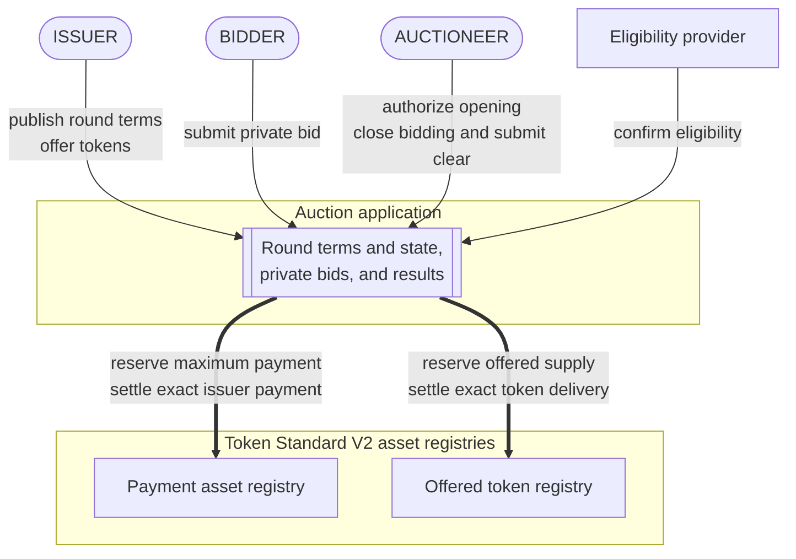
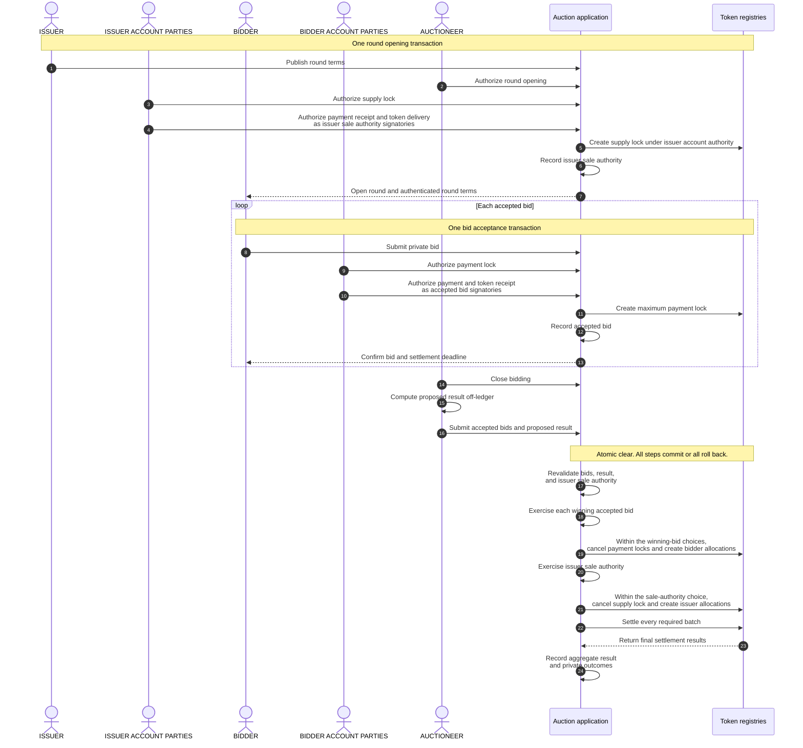

# Confidential auction reference architecture

This reference architecture defines a confidential auction for distributing a
fungible token in one sealed-bid round on Canton. The application keeps bids
private from competitors, locks the issuer's supply and each bidder's maximum
payment before clearing, computes one clearing price, and settles payment and
token delivery atomically.

## 1. Product Definition

Five properties define the product:

- **Single round.** The issuer offers a fixed quantity during one bidding
  period, and the round produces one final result.
- **Sealed bids.** Each bidder submits the requested quantity and maximum unit
  price privately to the issuer and auctioneer. Competing bidders do not
  receive that bid.
- **Uniform price.** Every winner pays the same clearing price under a rule
  published before bidding starts.
- **Prefunded settlement.** The issuer locks the offered tokens before opening
  the round, and each accepted bidder locks its maximum payment.
- **Permissioned participation.** The auction application checks bidder
  eligibility when it accepts a bid and again before assigning tokens.

A **Canton party** is an on-ledger identity. A regular **asset account**
identifies where tokens are held and names an owner. Some asset implementations
also support an account provider or an additional account identifier.
**Authority** is the on-ledger consent required from the parties that control an
action.

We use [Token Standard V2](https://github.com/canton-foundation/cips/blob/main/cip-0112/cip-0112.md)
allocations to lock the offered supply and bidder payments. An **allocation**
records account authority for specified asset movements and may reserve the
required holdings. A **committed allocation** cannot be withdrawn before the
settlement deadline; after that deadline, it becomes withdrawable under the
registry's authorization rules. Its configured settlement executors may settle
or cancel it. A settlement executor controls when those choices are invoked;
executor status does not provide the sender or receiver account authority
required for a final movement.

These initial allocations reserve the assets without authorizing a final
payment or delivery. [Section 2.3](#23-core-application-concepts) introduces the
accepted bid and issuer sale authority contracts through which the required
parties authorize those final movements.

We call the final all-or-nothing settlement transaction the **clear**. It
cancels the issuer's initial supply lock and each winner's payment lock, uses the
released holdings to create allocations for the exact payments and token
deliveries, and settles every winner movement atomically: all steps succeed
together, or none takes effect. Losing bidders recover their locked payments
separately.

### 1.1 Auction Mechanics

We require the issuer and auctioneer to publish immutable round terms before
bidding opens. The **reserve price** is the minimum unit price the issuer will
accept. It is fixed before bidding, and bids below it are rejected. A **price
tick** is the smallest allowed price increment, and a **lot** is the smallest
quantity increment. A bidder's **fill** is the quantity it wins. The **marginal
price** is the lowest maximum unit price among bids that receive a fill. When
total demand exceeds the offered supply, it is the price band in which the
remaining supply is allocated.

The round terms include:

- the payment asset and offered token;
- the offered quantity and reserve price;
- the price tick, token lot size, and payment rounding rule;
- the bidding and settlement deadlines;
- the **bid limit**, which is the maximum number of accepted bids;
- the uniform-price clearing rule; and
- the fixed bid order used to assign any whole lots left after proportional
  fills are rounded down.

Bids below the reserve price are rejected. Bids at or above it are ordered by
maximum unit price, so higher price bands fill first. If the remaining supply is
smaller than demand at the marginal price, that price band receives a
proportional allocation. Each provisional fill is rounded down to a whole lot.
The round terms publish how each accepted bid receives an immutable order
number. That number is used only to assign any whole lots left after
proportional rounding and remains fixed through clearing. Because it can decide
who receives the final leftover lot, the terms must explain how order numbers
are assigned.

All winners pay the same **clearing price**. When the total quantity requested
by bids at or above the reserve price does not exceed the offered quantity, the
clearing price is the reserve price. When that demand exceeds the offered
quantity, the clearing price is the marginal price.

For example, consider 100 tokens, a reserve price of 8, and a lot size of 10:

| Bid | Order number | Quantity | Maximum price | Fill |
|---|---:|---:|---:|---:|
| A | 0 | 50 | 12 | 50 |
| B | 1 | 80 | 10 | 40 |
| C | 2 | 40 | 10 | 10 |

Bid A receives its full 50 tokens above the marginal price, leaving 50 tokens
for B and C. At the marginal price, B requested 80 tokens and C requested 40,
so their provisional fills are 33.33 and 16.67 tokens. Because fills must be
multiples of 10 tokens, these amounts are rounded down to 30 and 10, leaving one
10-token lot. B receives that lot because its order number precedes C's,
producing final fills of 40 and 10 tokens. The reserve price is 8 units of the
payment asset per token. The marginal and clearing prices are 10, so every
winner pays 10 per token.

### 1.2 Scope

| Auction scope | Separate designs |
|---|---|
| One primary token distribution with one bidding period and one result | Repeated auctions, continuous issuance, secondary trading, and derivatives |
| Uniform-price allocation with proportional marginal fills | Pay-as-bid pricing, bonding curves, and discretionary book building |
| Fungible payment asset and offered token using Token Standard V2 allocations | Nonfungible assets and registries without compatible allocation settlement |
| One Canton synchronizer coordinating ordering and confirmation, and one atomic clear | Cross-synchronizer settlement and cross-chain delivery |
| Permissioned bidder eligibility | Public participation without an eligibility policy |
| Asset systems that complete every required movement during the clear | Asset systems whose transfers require later transactions |

## 2. Architecture Overview

The auction has three principal business participants: the bidder, issuer, and
auctioneer. The payment asset and offered token each have a Token Standard V2
registry that creates and settles allocations; one registry may support both
assets. An eligibility provider either issues the reusable bidder credential or
validates one from an approved credential issuer.

**Business flow**

The auction application records the round terms, current round state, accepted
bids, and results. It depends on the asset implementations, institutional
services, governance roles, and Canton infrastructure shown below.

**Application dependencies**

Token Standard V2 defines the common interface for locking and settling assets.
Institutional services provide eligibility and optional settlement approval.
Governance roles define application authority. Canton participant nodes host
parties and private contract data. Daml authorization determines which parties
must authorize an action, while Canton visibility rules determine which parts of
a transaction each party sees.

A **Daml signatory** is a party whose authority is required to create a
contract. When a choice is exercised, that contract's signatories also authorize
the consequences nested under the choice.

In Token Standard terminology, each asset is an **instrument**. Its
**instrument admin** governs the asset implementation. An **allocation factory**
creates allocations, while a **settlement factory** settles compatible
allocations for that admin.

Each account used by the auction is a regular account with an owner. Some asset
registries also support an **account provider**, such as a custodian or service
provider. [Canton Coin supports only basic accounts](https://github.com/canton-foundation/cips/blob/main/cip-0112/cip-0112.md#6-canton-coin-implementation),
which have no provider or additional account identifier. Each registry
determines which account forms it supports and whose account authority is
required for each action. We call those required parties the **account parties**;
the set may differ by account and action. Instrument-admin authority and
optional settlement approval are separate. When an account has a provider,
[Token Standard V2](https://github.com/canton-foundation/cips/blob/main/cip-0112/cip-0112.md#432-accounts-instead-of-parties)
requires it to see every holding and asset movement for that account.

A **transfer leg** describes one asset movement: instrument, sender account,
receiver account, and amount. Token Standard V2 records the two accounts'
authorizations separately as the **sender side** and **receiver side**.

Each initial allocation authorizes only the sender side of a leg whose sender
and receiver are the same account. In the selected asset implementation, this
outgoing authorization locks the stated amount. The missing receiver side keeps
that leg from settling. Clearing cancels the issuer's supply lock and each
winner's payment lock, then uses the released holdings to create the exact
winner allocations. Losing payment locks remain available for separate
recovery.

A **settlement batch** groups compatible allocations and legs for one instrument
admin and settlement factory. We place both assets in one batch when they share
that admin and the factory supports both. Otherwise, we settle one batch per
compatible admin and factory, all inside the same Daml transaction.

### 2.1 Privacy and Result Trust

Each party receives a **transaction projection** containing only the branches
it is entitled to see. A bidder and every signatory of its accepted bid see that
bid in full. The issuer and auctioneer see every accepted bid. Among the private
application records, a competing bidder sees only its own accepted bid and, when
included in the clear, its outcome unless the same Canton party also holds
another role that grants access.

Asset roles have separate views. Each instrument admin sees settlement legs for
its instruments, and an account provider sees every holding and asset movement
for the accounts it services. These roles do not by themselves reveal an
accepted bid or private outcome. With privacy-compatible assets, each bidder
included in the clear sees only its own settlement legs and outcome, while the
issuer and auctioneer see the complete clear. Canton Coin publishes all transfer
legs, so using it for either asset exposes those movements even when the
application outcome record remains private.

The clear recomputes the published clearing rule for the accepted bids supplied
by the auctioneer. This prevents settlement of an incorrectly computed result,
but it cannot prove that every accepted bid was supplied. Bidders therefore
trust the auctioneer to submit the complete set and clear on time, and they trust
the issuer and auctioneer to keep bids confidential. An auditor with authorized
disclosures can recompute the result for the disclosed bids, but cannot prove
that the set is complete.

### 2.2 Business Roles

| Participant | Responsibility and visibility |
|---|---|
| Bidder | Submits a quantity and maximum price. Every party required to provide account authority for payment to the issuer or receipt of the offered token is a signatory of the accepted bid and sees it in full. |
| Issuer | Publishes the round terms, locks the offered supply, receives payment, and sees every accepted bid. |
| Auctioneer | Authorizes opening, operates the round, sees accepted bids, closes bidding, computes the result, submits the clear, and coordinates recovery. |
| Instrument admins | Administer the payment and offered token registries. Each validates settlement for its asset and enforces its published approval and seizure policies. One party may administer both assets. |
| Eligibility provider | Issues or validates the reusable credential that permits a bidder to participate. The issuer or auctioneer may operate this service or use an independent provider. |
| Settlement attester, when required | Approves the exact settlement batch under an instrument policy. Organizational independence from the admin and auctioneer is a deployment decision. |
| Auditor, when enabled | Receives authorized bid and outcome disclosures and recomputes the submitted result without exposing those records more broadly. |

The issuer and auctioneer configure the round and coordinate close, clear, and
recovery. By default, they also hold the application governance powers. A
deployment may add a pause that stops new bids, or separate opening, audit, and
upgrade authority among other parties. This changes who can operate the auction
and which parties must remain available, while the round economics and clearing
rule remain the same.

Party hosting, application and asset visibility rules, account providers, and
overlapping roles determine each party's transaction projection. Section 6
defines the required projection tests. See the
[Canton ledger model](https://docs.canton.network/overview/reference/ledger-model-detailed)
and [architecture overview](https://docs.canton.network/overview/learn/architecture).

### 2.3 Core Application Concepts

We separate the architecture into six responsibilities:

| Component | Responsibility |
|---|---|
| Round terms | Fix the assets, economics, deadlines, clearing rule, bid limit, eligibility policy, registry references, and governance before bidding begins. |
| Round state | Records whether the round is open, closed, cleared, cancelled, or expired while preserving the round terms. |
| Accepted bid | Names every party required to provide account authority for payment to the issuer or receipt of the offered token, together with the issuer and auctioneer, as Daml signatories. It records the exact payment allocation created for the bid and limits later use of that authority to any winner payment and token receipt permitted by the bid and round terms. The initial allocation retains its cancellation and withdrawal paths. |
| Issuer sale authority | Names every party required to provide account authority for receipt of payment or delivery of the offered token as a Daml signatory. It records the exact supply allocation created for the round and limits its use to winner payment receipt and token delivery, or return of unsold tokens. Cancellation and withdrawal follow the allocation's recovery rules. |
| Results | Records aggregate clearing data for the issuer and auctioneer and a private fill, payment, exclusion, or refund outcome for each bidder included in the clear. |
| Asset registries | Create, cancel, withdraw, and settle allocations under each instrument's policy. |

At bid acceptance, the parties required to provide account authority for the
maximum payment lock authorize that allocation. The parties required to provide
account authority for payment to the issuer or receipt of the offered token
also become signatories of the accepted bid. Before bidding opens, the parties
required for the issuer's payment receipt and token delivery become signatories
of the issuer sale authority. If the bid wins, the auctioneer exercises a
clearing choice on each winning accepted bid and on the issuer sale authority.
The corresponding asset calls occur inside those choices, so the signatory
authority applies only to those calls. The account parties do not act or sign
again solely to authorize those movements. A party that also acts as auctioneer
or executor still authorizes the clear in that role.

### 2.4 Institutional Controls

We use D1 through D4 as local shorthand for four independent institutional
controls. A deployment enables only the controls required by its policy:

| Control | Treatment |
|---|---|
| Settlement approval (`D1`) | An optional instrument policy may require approval from a configured settlement attester. When policy requires independent approval, the attester must operate independently of the instrument admin and auctioneer. |
| Allocation seizure (`D2`) | An instrument policy may let its admin mark an allocation and let privileged parties move its holdings. A mark can block auction settlement and ordinary recovery. |
| Bidder eligibility (`D3`) | Bid acceptance checks that the bidder's payment and delivery accounts name the same owner and that the owner has an accepted credential. Clearing checks eligibility again before assigning a fill. |
| Application governance (`D4`) | Assigns authority to configure, close, clear, or cancel a round and to approve application code. A deployment may add pause authority or separate these powers. Allocation recovery remains governed by the configured executors, each registry's authorization rules, and instrument policy. |

Related-party screening is an optional part of bidder eligibility. When it is
required, the round can require an accepted related-party status in the bidder's
credential.

Before accepting an instrument, we publish whether allocation seizure is
disabled or enabled. When enabled, the instrument admin can **mark** a locked
allocation without the authorization used for ordinary account movements. The
mark blocks ordinary settlement and recovery until the admin removes it, its
time limit permits release, or privileged parties **sweep** the holdings to an
authorized destination. The policy identifies the operators, permitted
destinations, maximum mark duration, and any required legal order. A disabled
policy requires the asset implementation to reject marking and sweeping. The
auction application cannot override the instrument's policy.
[Section 3.5](#35-release-locked-assets) describes how a mark affects recovery.

## 3. Target Design

Opening, each bid acceptance, closing, and clearing are separate atomic
transactions. The auctioneer computes the proposed result off-ledger. The clear
recomputes the published clearing rule for the supplied bid set and either
validates, allocates, settles, and records those outcomes or rolls back every
step.

An account party may also be the bidder or issuer. Each diagram arrow uses only
the parties required for that action.

**Round lifecycle**

### 3.1 Configure and Open the Round

The round fixes the [auction mechanics](#11-auction-mechanics) and selected asset
policies before it opens. One opening transaction creates a committed allocation
for the full offered quantity, records the issuer sale authority that identifies
that allocation, and opens the round after confirming that the allocation is
active and unmarked.

The account parties required by the offered token registry authorize the supply
lock. The parties required for the issuer's payment receipt and token delivery
become signatories of the issuer sale authority.

Every auction allocation names the auctioneer as its sole settlement executor.
The design uses four regular accounts: bidder payment and delivery accounts with
the same owner, and issuer payment receipt and inventory accounts backed by
existing inventory. [Section 7](#7-production-decisions) covers account and
executor variants.

### 3.2 Accept a Bid and Lock Maximum Payment

Bid acceptance checks three groups of conditions:

- the round is open and below its bid limit, and the positive quantity and
  maximum price satisfy its lot, tick, and reserve rules;
- both registries support the selected bidder accounts, which name the same
  eligible owner; and
- the credential remains valid for that owner, while the issuer's supply lock
  remains active and unmarked.

The published payment rounding rule applies to `requested quantity x maximum
unit price` to determine the maximum payment. One bid acceptance transaction
creates a committed allocation that locks this amount without authorizing
payment to the issuer, then records an accepted bid that identifies the
allocation and fixes its order number. The record also binds the round,
accounts, instruments, bid, deadlines, and selected registries.

The account parties required by the payment asset registry authorize the payment
lock. The parties required for the final bidder payment and token receipt become
signatories of the accepted bid, together with the issuer and auctioneer. Bid
acceptance is a choice on the open round, whose signatories provide the issuer
and auctioneer authority without a separate action for each bid.

### 3.3 Close Bidding and Compute the Result

Closing prevents further bid acceptance. The auctioneer computes the proposed
result off-ledger and supplies the accepted bids to the clear. Canton's privacy
model prevents the application from enumerating all private bids, so the
auctioneer remains trusted to supply the complete set.

The clear rechecks the issuer sale authority, supply lock, accepted bids,
credentials, and payment locks. A bidder receives a zero fill if its eligibility
has expired or been revoked, or if its payment lock is marked. A mark on the
supply lock, or prior consumption of a required payment or supply allocation,
blocks the clear.

The clear rejects duplicate supplied bids, recomputes the clearing price, fills,
and rounded winner payments, and validates supply, bid price limits, and lot and
tick alignment. [Section 4](#4-failure-recovery) covers these failures and their
recovery paths.

### 3.4 Create Exact Allocations and Settle

Inside the choice on each winning accepted bid, the auctioneer uses executor
authority to cancel the payment lock. The exact bidder payment and token receipt
allocations are direct consequences of that choice, so its signatories authorize
their creation and the return of the unused portion of the maximum payment.
Inside the choice on the issuer sale authority, the auctioneer cancels the supply
lock and its signatories authorize the matching issuer payment receipt and token
delivery allocations.
Unsold inventory returns to the issuer. Losing payment locks remain available
for recovery.

Each winner has two transfer legs. Four allocations authorize both sides:
bidder sender and issuer receiver for payment, then issuer sender and bidder
receiver for token delivery. The legs are:

| Asset | Sender | Receiver | Amount |
|---|---|---|---:|
| Payment asset | Bidder payment account | Issuer payment receipt account | Published payment rounding rule applied to `fill quantity x clearing price` |
| Offered token | Issuer inventory account | Bidder delivery account | Final fill quantity |

Each settlement factory receives only allocations for instruments governed by
its admin and supported by that factory. Different admins or settlement
factories require separate batch calls. If both assets use the same admin and a
factory that supports both, their allocations may be included in one batch
call. Every required batch remains inside the same Daml transaction.

An instrument that enables settlement approval requires one approval from its
configured settlement attester for each relevant batch. The approval is used
once and identifies the settlement, executor set, and every transfer leg. All
allocation and settlement factory calls must complete within the clear. An
allocation factory that requires later acceptance needs a different clearing
design.

Each selected settlement factory must reject a batch unless its allocations
exactly cover both sides of every transfer leg. Any failed call rolls back the
complete clear. On success, the round becomes cleared, the issuer and auctioneer
receive the aggregate result, and each bidder included in the clear receives its
own outcome. Later recovery cannot undo the completed winner settlement.

### 3.5 Release Locked Assets

Round and allocation state are independent: cancelling or expiring a round
prevents clearing but does not release its allocations. The auctioneer can
cancel active, unmarked allocations; after the settlement deadline, withdrawal
is also available under the registry's authorization rules. A seizure mark
blocks both paths until the admin removes it, the mark's time limit permits
release, or an authorized sweep closes the allocation. After the settlement
deadline, cancellation and withdrawal may race; only one can consume the active
allocation. [Section 4](#4-failure-recovery) covers retries and recovery
outcomes.

### 3.6 Manage Execution and Timing

Each lifecycle stage has its own execution boundary:

| Stage | Execution boundary | Invalidation conditions |
|---|---|---|
| Open | One transaction creates the supply lock, records the issuer sale authority, and opens the round | Inventory, account, asset implementation, or policy no longer matches the terms |
| Bid | One transaction per bidder creates the maximum payment lock and records the accepted bid | Bidding closes or eligibility, supply, account, or asset state changes |
| Close | One transaction stops bid acceptance | The round has already left the open state |
| Compute | Off-ledger auctioneer computation | Eligibility or asset state changes before clear |
| Approve | Optional settlement approval transaction for an enabled instrument | Approval expires or its transfer legs change |
| Clear | One Daml transaction validates, allocates, settles, and records outcomes | A deadline passes or required funds, approval, registry state, or authority changes |
| Recover | Independent cancellation or withdrawal transactions | The allocation state, deadline, registry authorization rules, or seizure policy do not permit cancellation or withdrawal |

The bidding deadline stops new bids. The settlement deadline bounds clearing and
makes committed allocations withdrawable afterwards. The settlement window runs
from bidding close to the settlement deadline. We use the earliest bound imposed
by those deadlines, asset policies, approvals, factories, or prepared
transactions, with a published margin for signing, confirmation, and recovery.

A prepared transaction remains usable only while its inputs and time bounds are
valid. If either changes, the backend prepares a new transaction from current
ledger state and obtains any external signatures required for submission.
The account parties do not externally sign the clear solely to authorize the
nested asset movements. Participants hosting those parties may still need to
confirm it. A party that also submits the clear still provides the authority
and any external signature required by that role.
[Section 6](#6-deployment-and-operations) covers submission and retry handling.

## 4. Failure Recovery

The round starts open. At or after the bidding deadline, the auctioneer closes it
in a separate transaction, ending bid acceptance. A successful clear changes
the round state to cleared. Before the settlement deadline, the auctioneer may
instead cancel an uncleared round; after that deadline, it may record the round
as expired. Allocation release follows the rules in
[section 3.5](#35-release-locked-assets). A failed clear rolls back and leaves
the round closed, so the auctioneer can retry with current ledger state. An
optional pause stops new bids without blocking close, clear, or recovery.

| Situation | Result | Next action |
|---|---|---|
| A step inside the clear fails | The complete clear rolls back and the round stays closed | Refresh ledger state and retry within the settlement window |
| Settlement approval is missing or expires | The relevant batch cannot settle, so the complete clear rolls back | Obtain fresh approval within the settlement window; otherwise recover under [section 3.5](#35-release-locked-assets) |
| Bidder eligibility is invalid at clear | That bid receives zero fill | The auctioneer cancels the allocation, or it is withdrawn after the settlement deadline under the registry's rules |
| Bidder payment lock is marked | That bid receives zero fill and ordinary release is blocked | Remove the mark, wait for permitted release, or follow the sweep policy |
| Issuer supply lock is marked | The complete clear is blocked | Resolve the mark; if a sweep or another asset operation permanently closes it, cancel or expire the round as applicable and reconcile that outcome |
| Required allocation has already been consumed | The clear stops because the locked assets are no longer available | Reconcile the asset operation, then cancel or expire the round |
| Auctioneer service or a required Canton participant is unavailable | Close, clear, or early cancellation is delayed | Restore service and refresh state; withdrawal becomes available after the settlement deadline under registry rules, subject to the seizure policy |
| Synchronizer is unavailable | No auction or recovery transaction can confirm | Refresh state after service returns and resume the action allowed by the current round state and deadlines |

## 5. Security and Auditability

The architecture separates ledger-enforced properties from parties and systems
that remain trusted.

### 5.1 Ledger-Enforced Properties

| Property | Enforcement |
|---|---|
| Fixed auction rule | Round terms fix the assets, supply, clearing rule, rounding, fixed bid order, bid limit, deadlines, and enabled controls before bidding. |
| Bounded bidder payment | The parties required to provide account authority for the maximum payment lock authorize that allocation. The parties required to provide account authority for payment to the issuer or receipt of the offered token become signatories of an accepted bid that limits both movements to the published terms. Clearing computes an exact payment at or below that maximum and returns the unused portion of the maximum payment. |
| Reserved supply | The parties required to provide account authority for the supply lock authorize that allocation. The parties required to provide account authority for receipt of payment or delivery of the offered token become signatories of the issuer sale authority, which limits both movements to the published terms. The instrument policy may still permit seizure of the locked allocation. |
| Correct clearing of supplied bids | The clear recomputes eligibility, ordering, clearing price, fills, exclusions, and rounded payments for every accepted bid supplied to it. |
| Atomic delivery versus payment | Every compatible asset batch settles inside one Daml transaction. A failed step rolls back allocation, settlement, result, and state changes. |
| Private bidder outcomes | With privacy-compatible assets, each bidder's transaction projection contains only its own authorization, settlement legs, and outcome when included in the clear. Assets with public legs expose the corresponding movements even when the application outcome record remains private. |
| Deadline-based recovery | The auctioneer, as the allocation's sole settlement executor, can cancel it at any time while it remains active and unmarked. After the settlement deadline, the allocation becomes withdrawable under its registry's authorization rules, subject to the instrument's seizure policy. |

### 5.2 Trust Boundaries

| Trusted party or system | Required behavior and consequence |
|---|---|
| Auctioneer | Includes every accepted bid, protects bid confidentiality, computes and submits on time, and uses cancellation powers according to policy. Omission or delay can change the outcome or prevent settlement. |
| Issuer | Protects the confidentiality of every accepted bid and supplies valid inventory and authority for its payment receipt account. Issuer and auctioneer collusion remains an application governance risk. |
| Parties controlling the round or accounts | These parties can jointly authorize transactions outside the auction. Wallets bind signatures to the intended round, and operators audit unexpected state transitions. |
| Instrument admins and factories | Keep compatible registries available, validate their asset batches, and apply published approval and seizure policies. Policy-authorized seizure or movement can bypass the auction settlement path. |
| Eligibility provider and auction governance | The provider binds credentials to the bidder owner and maintains status, expiry, and revocations. Auction governance fixes the accepted credential issuers in the round terms. |
| Settlement attester, when required | Approves only batches that satisfy policy. A compromised or affiliated attester weakens the independent review expected by the deployment. |
| Canton infrastructure | Keeps required parties hosted, approved code available, and transactions confirmable within the round deadlines. |
| Auditor, when enabled | Receives enough authorized disclosures to check the supplied bid set and result without exposing records more broadly. |

Bid completeness remains the main residual risk. Deterministic on-ledger
clearing proves the result for the set the auctioneer supplies. It cannot prove
that the auctioneer omitted an accepted bid from that set. An accepted bid
record lets the affected bidder demonstrate the omission, and
authorized disclosure lets an auditor recompute the supplied result. Neither
forces the auctioneer to submit every accepted bid. A fixed bid limit,
operational controls, and legal accountability remain necessary.

Production assets must enforce the round's immutable seizure policy across all
settlement and privileged movement paths. The pinned OpenZeppelin
[reference token experiment](https://github.com/OpenZeppelin/canton-contracts/tree/7696749737885e25cd88422847105f890f03b00d/experiments/token/tokenCIP112-v1)
defines seizure choices on every allocation and lets the admin choose the
destination when marking, so it does not meet that requirement by itself.

## 6. Deployment and Operations

Before opening a round, we fix the approved package IDs, the immutable
identifiers for the deployed application and asset code. We also fix the
instrument admins, credential issuers, governance parties, accounts, and
deadlines. A Canton synchronizer coordinates ordering and confirmation for the
clear. All records used by that clear remain on one compatible synchronizer,
and every involved participant supports the approved application and asset
code.

### 6.1 Traffic and Application Rewards

On a traffic-controlled synchronizer, auction protocol messages consume traffic
from the participant that sends them. Each participant's hosted parties and
applications share its balance. Operators monitor and fund every participant
required for opening, bidding, clearing, or recovery; an exhausted balance
blocks its messages. See the
[traffic documentation](https://docs.sync.global/deployment/traffic.html).

For reward attribution, the auctioneer is the **app provider party**. Under
[CIP-0104](https://github.com/canton-foundation/cips/blob/main/cip-0104/cip-0104.md),
an active `FeaturedAppRight` naming the auctioneer lets it earn traffic-based
rewards from successful auction transactions for which it confirms one or more
views. Opening, bid acceptance, close, clear, and auctioneer-led recovery all use
auctioneer authority and can therefore contribute; observation alone does not
qualify. Eligible activity contributes to a reward calculated for each network
reward round. When that reward meets the network threshold, the network issues a
coupon that the auctioneer can redeem before it expires, directing some or all
of the resulting Canton Coin to named beneficiaries.

These rewards can help fund traffic and other operating costs. A quantitative
analysis of the traffic costs incurred by the auction flows, the rewards accrued
to the auctioneer, and the resulting net operating cost is outside the scope of
this initial reference architecture. We will perform that analysis once the
implemented flows can be measured under the target network configuration.

### 6.2 Production Readiness

We require the following production checks:

| Area | Required decision and evidence |
|---|---|
| Assets and factories | Pin both instruments, admins, factories, supported account forms, authorization and visibility rules, limits, and control policies. Require every initial and final allocation call to complete in its calling transaction and settlement to complete during the clear. An allocation factory that requires later acceptance needs an earlier authorization step and a clearing design that completes acceptance before the clear. Test the initial supply and payment locks, cancellation, exact bidder and issuer allocations, winner payment and delivery, and return of unused maximum payment. |
| Code and synchronizer | Make the approved application, Token Standard interfaces, and asset code available to every participant involved in the clear. Verify that all round records use one compatible synchronizer. |
| Roles and authorization | Assign issuer, auctioneer, eligibility, optional settlement approval, and governance powers. Identify and test the account authority required for each initial lock. Separately identify the parties required to provide account authority on both sides of each payment and token delivery created during clearing. Verify that the accepted bid names the parties acting for bidder accounts as signatories, the issuer sale authority names those acting for issuer accounts, and the corresponding asset calls occur inside those choices. Test that clearing fails if required authority is missing or an asset call moves outside its intended choice. |
| Hosting and submission | Verify each party's hosting and signing setup, keep the participants needed for confirmation available, and preserve at least one authorized recovery path. |
| Privacy | Test transaction projections for bidders, issuer, auctioneer, instrument admins, settlement attesters, auditors, and every configured account provider. Display every required disclosure before signature. |
| Time and retry | Publish the bidding and settlement deadlines together with preparation and recovery margins. Monitor the earliest dependency deadline, command completions, retries, and ledger-state changes. |
| Recovery | Exercise clear rollback, auctioneer cancellation, withdrawal under each registry's authorization rules, backend outage, synchronizer outage, allocation changes, and every supported seizure outcome. |
| Capacity | Test the largest allowed individual bid, accepted bid set, and winner set against applicable factory, transaction, signature, and participant traffic limits. Stop accepting bids at the published bid limit. |
| Operations | Monitor round state, locked allocations, eligibility and approval status, approved code, party availability, confirmation latency, participant traffic balances, reward coupons and expiry, and unresolved recovery actions. |

For interactive submission, the client waits for a definitive completion before
treating an attempt as final. We give each prepared transaction a latest allowed
recording time. The Ledger API deduplicates retries of one intended ledger change
using its command ID, user, and acting parties at the submitting participant. A
retry preserves those values, returns to the same participant, requests coverage
for the complete retry period, and uses a fresh submission ID. The backend
prepares a replacement only after a definitive rejection or after the previous
transaction's latest allowed recording time has passed. See
[External Signing](https://docs.canton.network/appdev/deep-dives/external-signing-transactions),
[Working with Time](https://docs.canton.network/appdev/modules/m3-working-with-time),
and [Command Deduplication](https://docs.canton.network/appdev/deep-dives/command-deduplication).

The auction wallet authenticates the round terms and current round state before
asking a bidder to sign. It shows the requested quantity, maximum unit price,
rounded maximum payment, payment and delivery accounts, any provider or
additional account identifier, deadlines, instrument admins, settlement
approval, seizure powers, and available recovery actions. The backend and wallet
derive the required account parties and disclosures from the selected
registries' documented account and authorization rules, then verify them in the
prepared transaction.

## 7. Production Decisions

We make these decisions before opening a production round:

| Decision | Design default | Production choice |
|---|---|---|
| Governance powers | Issuer and auctioneer configure and operate the round | Decide whether configuration, opening, pause, close, clear, round cancellation or expiry, audit, and upgrade require separate authorities |
| Fixed bid order | Each accepted bid receives one immutable, unique order number | Publish how order numbers are assigned, how they allocate leftover lots, and how the rule prevents later reordering |
| Bidder accounts and supply | Both bidder accounts have the same owner, and the issuer uses existing inventory | Review delegated payers, different beneficiaries, or minting as separate authorization and eligibility designs |
| Bidder eligibility | One reusable credential checked when the bid is accepted and again during clear | Decide whether that credential must include an accepted related-party status |
| Settlement approval | Disabled unless an instrument requires it | Select the settlement attester and enforce organizational independence when required |
| Allocation seizure | Accept only assets whose disclosed policy fits the auction | Choose disabled seizure, bounded seizure with approved destinations, or refuse the asset |
| Result audit | Private bidder outcomes and aggregate result | Decide whether accepted bid records and authorized disclosures provide enough auditability; add a proof scheme only when its exact claim is defined |
| Settlement coordination | The auctioneer is the sole settlement executor, and factories complete inside the clear | Define authority and availability when several executors are required |

## 8. References

Primary foundations include:

- [CIP-0104 Traffic-Based App Rewards](https://github.com/canton-foundation/cips/blob/main/cip-0104/cip-0104.md)
  for application activity attribution and reward accounting;
- [CIP-0112 Token Standard V2](https://github.com/canton-foundation/cips/blob/main/cip-0112/cip-0112.md),
  especially its allocation and settlement factory model;
- the pinned OpenZeppelin [reference token experiment](https://github.com/OpenZeppelin/canton-contracts/tree/7696749737885e25cd88422847105f890f03b00d/experiments/token/tokenCIP112-v1)
  for allocation, settlement approval, and seizure mechanics;
- the local [credential-check experiment](../../experiments/identity/hook-shape-b/)
  for typed eligibility checks; and
- the [Canton ledger model](https://docs.canton.network/overview/reference/ledger-model-detailed)
  for authorization, transaction projection, and visibility.

The experiments provide the cited mechanisms. A production auction also
requires the application, backend, wallet integration, asset selection,
operations, and recovery services.
