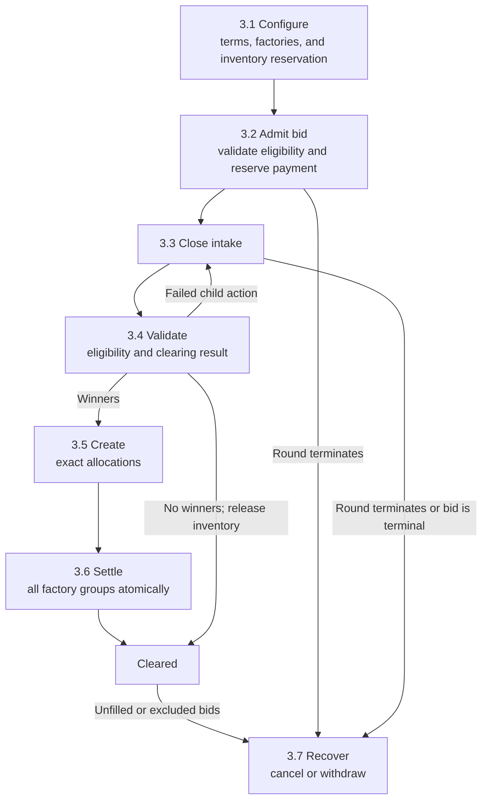
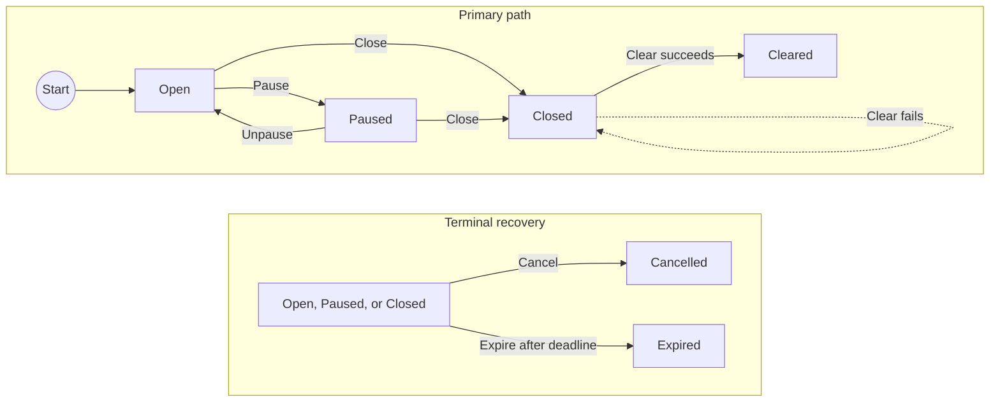
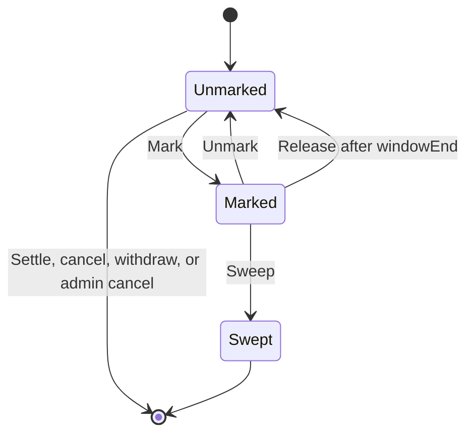
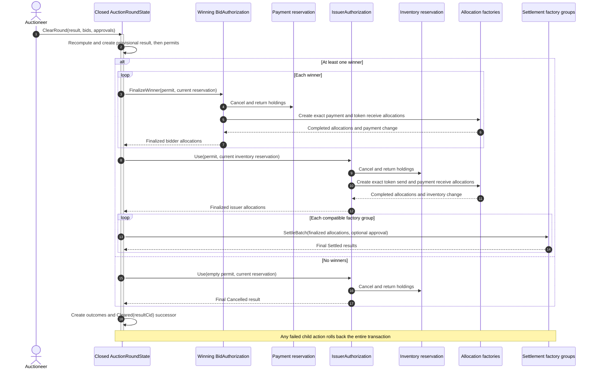

# Confidential auction launchpad reference architecture

This architecture defines a single-round sealed-bid auction for distributing a
token on Canton. Bidders authorize a maximum payment before the round closes.
The auctioneer computes one clearing price off-ledger, and the application
settles payment and token delivery atomically on-ledger.

This architecture specifies target application behavior and production
requirements. Linked experiments provide executable evidence for selected
mechanisms. Production readiness and standards conformance require the complete
composition to be implemented and validated.

## 1. Product Definition

The launchpad accepts confidential quantity bids. Each bid specifies a requested
token quantity and maximum unit price, then locks the rounded maximum payment in
a committed payment allocation, called the payment reservation. It reserves
funds without authorizing payment to the issuer before clearing. Before intake
opens, the issuer creates a matching reservation for the full offered quantity.
Bids at or above the reserve price are ranked by price. Every winner pays the
same clearing price per token, even if that bidder offered a higher maximum
price. If several bids at the cutoff price compete for the remaining supply,
the available tokens are divided among them in proportion to their requested
quantities. Each fill is rounded to the token's configured lot size, and the
fixed admission slot order assigns any whole lots left after rounding.

The target workflow is one primary distribution. It runs one bidding period,
produces one result, and either atomically settles that result or leaves the
round and its reservations available for retry or recovery. Secondary trading,
continuous issuance, bonding curves, derivatives, and cross-synchronizer
settlement belong to adjacent architectures.

### 1.1 Privacy and Visibility Model

Each bidder submits the actual bid once. Canton transaction projection discloses
it to the bidder's account parties, the auctioneer, and, in the baseline
topology, the issuer. Competing bidders do not receive the `BidAuthorization`
contract or its transaction view. This design therefore needs no separate hash
commitment and reveal phase. Here, sealed bidding means confidentiality from
competitors, not from the auctioneer or issuer. A deployment that separates
issuer and auctioneer visibility requires a different contract topology and
tests of the resulting transaction projections.

Settlement visibility is role scoped:

- The auctioneer, as settlement executor, sees the complete clearing result.
- The payment instrument admin sees each payment reservation and its maximum
  payment at admission. The launched token admin sees the issuer's inventory
  reservation before intake. During clearing, each admin sees the transfer legs
  and asset changes for its instrument.
- Each bidder receives the active inventory reservation and
  `IssuerAuthorization` as authenticated admission inputs. This reveals the
  public offered quantity, issuer inventory account, and launched token factory,
  but not unrelated treasury holdings.
- The owners and providers of the bidder's payment and token delivery accounts
  sign the `BidAuthorization`. Each sees the complete bid, the payment and
  delivery account records, and the pinned factory references.
- Sequencers order encrypted views, and mediators coordinate confirmation.
  Neither receives bid plaintext.
- Transaction projections may include contract data for parties beyond the
  contract's stakeholders. The auction topology limits bidder and account
  provider visibility to bids and settlement branches associated with their
  accounts. See the [detailed ledger model](https://docs.canton.network/overview/reference/ledger-model-detailed).

### 1.2 Bidder Trust Assumptions

The auctioneer sees every admitted bid and submits the bid set for clearing. It
can omit a bid, leak bid information, delay clearing, or refuse to clear. The
target `ClearRound` choice recomputes the configured algorithm for the submitted
set, so the auctioneer acting alone cannot change that set's price, fills, or
rounding. The ledger cannot prove that the submitted set includes every admitted
bid. The issuer also sees admitted bids in the baseline and shares the
confidentiality obligation.

Admission slot order resolves whole lots left after pro rata rounding. A venue
that chooses which available slot each bidder receives can influence those final
lots. Production deployments must use an independently verifiable slot
assignment policy and disclose that policy to bidders.

The clearing function validates bids, while a separate related party policy
governs bidder independence. `AuctionTerms` selects `Prohibited` or
`DiscloseAndAudit`, pins the policy version and evidence issuer, and defines how
current relationship evidence is handled. Each bid binds that evidence. A
prohibited round rejects a direct issuer or auctioneer owner and any bidder not
classified as independent. A disclosure round admits each accepted relationship
status and retains its evidence for authorized audit. Both modes trust the
configured evidence issuer to assess beneficial ownership.

After clearing, `AuctionResult` records the immutable terms, versioned algorithm,
bid and outcome roots, clearing price, and aggregate fill. Each bidder receives
its own outcome and inclusion proof. An authorized auditor can recompute the
result and commitments; this supports accountability for the submitted set, not
proof that the set was complete. [Section 4.1](#41-contract-responsibilities)
defines these contracts.

Bidders rely on each instrument admin to keep its factory available and apply
the disclosed approval and seizure policy. An admin can reject its batch or mark
a bidder payment reservation or the issuer inventory reservation. A mark blocks
normal settlement and recovery; an authorized sweep can move the reserved
assets. The auctioneer can also cancel either reservation as the baseline
executor. Admission and clearing authenticate the live issuer reservation, so a
cancellation or seizure stops further bids or the clear.
[Section 1.3](#13-control-model-and-allocation-seizure) defines these powers. A
successful clear commits every instrument batch together.

### 1.3 Control Model and Allocation Seizure

Four controls expose the trust boundaries shared by this repository's reference
architectures. D1 through D4 are cross-document shorthand, not Canton or
CIP-0112 requirements. Their descriptive names and owners define their meaning:

- **Bidder eligibility (`D3`)** is the baseline venue gate. It verifies that
  the owner of both the bidder's payment and delivery accounts satisfies the
  venue's identity policy at admission and again during clearing.
- **Optional settlement approval (`D1`)** is an instrument policy. It applies
  only to a settlement factory call whose instrument requires an attester to
  approve that exact batch.
- **Allocation seizure (`D2`)** is an instrument administration power. It
  governs marking an allocation and moving its assets under the disclosed
  seizure policy.
- **Application authority and recovery (`D4`)** is the venue governance model.
  It assigns launch, auction, intake pause, round recovery, and upgrade powers.

The [control ownership and enforcement profile](#24-control-ownership-and-enforcement)
defines their actors, ledger behavior, and production requirements. D1 and D3
remain separate because they authorize different subjects: reusable bidder
eligibility and one exact settlement batch. D2 and D4 describe privileged
powers rather than participation gates.

Bidder funds remain in bidder-owned allocations. Atomic settlement prevents
one-sided movement, while the executor and instrument admins retain their
published cancellation and seizure powers.

In the current OpenZeppelin experiment, every allocation supports the seizure
workflow (`D2`). The allocation admin can mark an allocation and select the
receiving custodian account without the bidder's approval. The required
privileged parties can then move the locked assets to that account. An unmarked
allocation may still be marked later; the experiment has no permanent opt out
at creation. See the pinned
[`TokenAllocation`](https://github.com/OpenZeppelin/canton-contracts/blob/7696749737885e25cd88422847105f890f03b00d/experiments/token/tokenCIP112-v1/daml/OpenZeppelin/TokenCIP112V1/Allocation.daml)
source and the component evidence in [section 2.1](#21-core-components-and-evidence).

The experiment requires a sweep capability and destination account authority,
but permits the sweep operator and destination account owner to be the same
party. Section 4.4 records the remaining order and lock-lifetime limitations.

A production instrument must publish an immutable, machine-readable D2 policy.
The target policy is:

```text
D2Policy = Disabled
         | Enabled {
             approvedCustodians,
             maximumSeizureWindow,
             sweepOperators,
             sweepMode = CapabilityBeforeDeadline
                       | CapabilityBeforeDeadlineOrOrderedAfterDeadline {
                           orderRegistry,
                           orderAuthorities
                         }
                       | OrderedOnly {
                           orderRegistry,
                           orderAuthorities
                         }
           }
```

The token registry enforces this policy on every allocation, and the auction
accepts only instruments whose policy meets the venue requirements.
`Disabled` makes mark and both sweep paths ledger-impossible. Under `Enabled`,
the allocation admin issues capabilities only to the listed sweep operators.
`CapabilityBeforeDeadline` disables the ordered path.
`CapabilityBeforeDeadlineOrOrderedAfterDeadline` permits a capability sweep
before the settlement deadline and requires an order afterwards. `OrderedOnly`
disables the path without an order. Each order comes from a listed authority
distinct from the allocation admin and binds the allocation root and
fingerprint, instruments and amounts, destination, case reference, and validity
window. The funding lock remains effective through `windowEnd`; owner unlock
and admin cleanup cannot bypass an active mark. The auction cannot weaken or
override an instrument admin's authority.

### 1.4 Operational Scope and Boundaries

| In scope | Boundary |
|---|---|
| Sealed bids | Each bid is visible to its bidder, required account providers, issuer, and auctioneer. Unrelated bidders do not see it. |
| Reserved supply and demand | The issuer reserves the offered quantity before intake. Each bidder reserves its maximum payment only while that inventory reservation remains active. The executor, admin, and seizure paths remain disclosed termination powers. |
| Uniform-price allocation | Immutable terms fix the algorithm and rounding rules. `ClearRound` recomputes them for the submitted bid set; the auctioneer remains trusted to submit every admitted bid. |
| Marginal partial fills | During clearing, prior bidder authorization lets the application replace the maximum payment reservation with the exact payment and return any change. No new bidder signature is required. |
| Atomic delivery versus payment | Both assets settle in one Daml transaction. Different admins or settlement factory CIDs require separate `SettleBatch` calls within it. |
| Inline factory completion | Selected factories return `Completed` for every auction allocation, final `Cancelled` results with usable holdings, and final `Settled` results. Pending and iterated workflows require a different lifecycle. |
| Eligibility and settlement approval | Bidder eligibility is checked at admission and clear. A bid that no longer qualifies receives the fixed exclusion result. A factory verifies a settlement attestation only when its instrument policy enables that approval. |
| Recovery | The auctioneer may cancel reservations before the deadline. Afterwards, each reservation's authorizer account parties may withdraw. Active allocation seizure blocks both. |

## 2. Architecture Overview

Canton contracts are visible only to their stakeholders and to parties that
witness relevant transaction subtrees. Signatories authorize contract creation;
choice controllers authorize an exercise. Within a choice body, the controllers
and the exercised contract's signatories jointly authorize its immediate
consequences. The target uses this local authorization rule to carry bidder and
issuer authority into clearing without collecting new signatures after the
deadline. See the [detailed Canton ledger model](https://docs.canton.network/overview/reference/ledger-model-detailed).

An `Account` can include an owner and a provider. Bidder or issuer authorization
therefore includes every account party required by the instrument registry as a
signatory of the corresponding authorization contract.

### 2.1 Core Components and Evidence

**Experiment** marks executable component evidence; production readiness and
standards conformance require separate validation. [Section 4](#4-application-contract-design)
defines the target application contracts that compose these mechanisms.

| Component | Status | Responsibility | Evidence or required implementation |
|---|---|---|---|
| Application authority and recovery primitives (`D4`) | **Experiment** | Provide role grant and revocation, ownership transfer by explicit acceptance, and pause primitives for venue controls. | [`AccessControlV1.daml`](https://github.com/OpenZeppelin/canton-contracts/blob/7696749737885e25cd88422847105f890f03b00d/experiments/access/access-control-v1/daml/OpenZeppelin/AccessControlV1.daml), [`OwnableV1.daml`](https://github.com/OpenZeppelin/canton-contracts/blob/7696749737885e25cd88422847105f890f03b00d/experiments/access/ownable-v1/daml/OpenZeppelin/OwnableV1.daml), and [`PausableV1.daml`](https://github.com/OpenZeppelin/canton-contracts/blob/7696749737885e25cd88422847105f890f03b00d/experiments/security/pausable-v1/daml/OpenZeppelin/PausableV1.daml). |
| Pinned Token Standard V2 allocation and settlement implementation | **Experiment** | Lock holdings, create sender and receiver allocations, settle a compatible admin-scoped batch, emit holding-change events, and recover allocations. | Pinned [`TokenRules`](https://github.com/OpenZeppelin/canton-contracts/blob/7696749737885e25cd88422847105f890f03b00d/experiments/token/tokenCIP112-v1/daml/OpenZeppelin/TokenCIP112V1/Registry.daml) and [`TokenAllocation`](https://github.com/OpenZeppelin/canton-contracts/blob/7696749737885e25cd88422847105f890f03b00d/experiments/token/tokenCIP112-v1/daml/OpenZeppelin/TokenCIP112V1/Allocation.daml). |
| Optional settlement approval (`D1`) | **Experiment** | Verify one consumed attestation for one settlement ID, executor set, factory admin's registry, validity policy, and exact transfer leg set. | [`D1.daml`](https://github.com/OpenZeppelin/canton-contracts/blob/7696749737885e25cd88422847105f890f03b00d/experiments/token/tokenCIP112-v1/daml/OpenZeppelin/TokenCIP112V1/D1.daml). |
| Allocation seizure (`D2`) | **Experiment** | Mark an allocation, block settlement, cancellation, and withdrawal, and sweep under allocation admin, sweep authority, destination account, and time checks. | [`Allocation.daml`](https://github.com/OpenZeppelin/canton-contracts/blob/7696749737885e25cd88422847105f890f03b00d/experiments/token/tokenCIP112-v1/daml/OpenZeppelin/TokenCIP112V1/Allocation.daml#L152-L234). Production requires the target policy in section 1.3. |
| Bidder eligibility credential (`D3`) | **Experiment** | Demonstrate transfer-time validation of a typed claim, expiry, and trusted-issuer membership snapshot. | Local [`ShapeB.daml`](../../experiments/identity/hook-shape-b/daml/OpenZeppelin/Experimental/Identity/ShapeB.daml). Production additionally requires current status and revocation handling. |

The pinned settlement code provides component-level evidence for allocation,
settlement, optional attestation, and seizure (`D1` and `D2`). Its evidence
boundary includes a local `TokenHolding` implementation and non-iterated
settlement. Production assets must be discovered and assessed through their
accepted Token Standard interfaces and registry policies.

### 2.2 Party and Role Model

| Party or service | Type | Authority and visibility |
|---|---|---|
| Bidder account parties | Daml parties | The required owners and providers of the bidder's payment and delivery accounts authorize the maximum payment and later exact winner allocations. Each sees the complete bid authorization. |
| Auctioneer | Daml party plus off-ledger service | Provides standing admission authority with the issuer, sees all admitted bids, submits the bid set and proposed result, controls close, clear, and predeadline cancellation, may expire a round, and is the sole settlement executor. |
| Issuer | Daml party | Signs immutable terms and round states, provides standing admission authority, sees all admitted bids, and may expire a round after the settlement deadline. It may be distinct from either instrument admin. |
| Issuer treasury account parties | Daml parties | The owners and providers required by the issuer inventory and payment receipt accounts reserve the offered inventory before intake and authorize exact issuer allocations or recovery through `IssuerAuthorization`. |
| Launch administrator | Daml party | Pins the canonical registration and configures each new round. Multi-hosting or multisignature command authorization can protect this party without changing its ledger type. |
| Intake pauser | Daml party | Controls intake pause and resume. It cannot change immutable terms or block close, clearing, or recovery in the baseline. |
| Upgrade governance | Daml parties plus deployment governance | Approves supported packages and factory policies between rounds. Existing `AuctionTerms` remain immutable. |
| Payment instrument admin | Daml party | Sees each payment reservation and maximum payment at admission, validates the payment batch, and enforces the instrument's optional settlement approval and seizure policies. A party holding another role may see additional data. |
| Launched token admin | Daml party | Sees the issuer inventory reservation before intake, validates the launched token batch, and enforces the instrument's optional settlement approval and seizure policies. A party holding another role may see additional data. |
| Bidder eligibility issuer | Daml party operated directly or by a credential service | Signs reusable bidder eligibility credentials. This role remains distinct from a settlement attester even when one organization operates both. |
| Relationship evidence issuer | Daml party operated by an independent identity or compliance service | Signs the relationship status used by the round's related party policy. The policy defines accepted evidence, freshness, and audit access. |
| Settlement attester | Daml party | When an instrument enables settlement approval, sees and signs the settlement ID, executor set, and exact transfer legs for one compatible factory batch. |
| Sweep operator and destination account parties | Daml parties | Under an enabled D2 policy, the sweep operator presents an expiring admin-issued capability, and the destination account parties authorize replacement holdings. The pinned experiment calls this actor `burner` and its grant `BurnerCapability`; instrument and case scopes are optional, and the roles may overlap. |
| Participant or validator | Infrastructure node and application services | Hosts parties and their contract data, exposes the Ledger API, submits commands, validates relevant transaction views, and manages the participant-wide traffic balance. |
| Synchronizer sequencers and mediators | Infrastructure services | Sequencers order and distribute encrypted messages; mediators aggregate participant confirmations and issue transaction verdicts. They are not auction roles and do not receive bid plaintext. |

### 2.3 Authority and Visibility by Action

While [`AuctionRoundState`](#41-contract-responsibilities) is `Open`, the bidder
account parties control `PlaceBid`. The choice authenticates the state-pinned
issuer authorization and active inventory reservation, combines bidder and
venue authority, consumes one listed slot, and creates a `BidAuthorization`
signed by all three groups. Every signatory sees the bid.

The auctioneer submits and executes the clear. Exact bidder and issuer
allocations are created inside their respective authorization choices, using
the pinned factories. Each `SettleBatch` receives only the legs and allocations
compatible with its admin and settlement factory.

Daml authority remains local to each exercised choice. Fetching or consuming an
authorization does not lend its signatories to a sibling action. A multiple
executor variant must bring every required party into the choice that uses it.

Allocation seizure belongs to the instrument admin, independently of auction
roles. The owner of a marked allocation does not authorize its mark or sweep;
[section 1.3](#13-control-model-and-allocation-seizure) defines the required
policy and authorities.

### 2.4 Control Ownership and Enforcement

Only bidder eligibility is a baseline participation gate. Settlement approval
is optional per instrument, allocation seizure belongs to each instrument, and
application authority governs the venue.

| Control | Owner and enforcement | Production policy |
|---|---|---|
| **Bidder eligibility (`D3`)** | A trusted issuer signs a reusable credential for the common owner of the bidder's payment and delivery accounts. Admission and clear validate it; an ineligible bid receives a zero fill. | Pin credential kinds, issuers, owner binding, expiry, current status, revocation, and rotation. |
| **Optional settlement approval (`D1`)** | An instrument admin may configure its factory to consume one attestation for the exact settlement ID, executors, legs, and validity window. | Supply one compatible attestation to each factory call that enables approval. |
| **Allocation seizure (`D2`)** | The allocation admin controls the mark. An active mark blocks settle, cancel, and withdraw; sweep also requires configured sweep and destination authority. | The registry enforces the immutable policy in section 1.3. Its order registry remains separate from settlement approval. |
| **Application authority and recovery (`D4`)** | Application signatories and controllers enforce launch, auction, intake pause, cancellation, expiry, and upgrade roles. | Pin actor groups in `AuctionTerms`, preserve close and recovery during intake pause, and disclose emergency powers. |

### 2.5 Wallet Integration Requirements

A bidder-facing wallet must:

- authenticate the registration, terms, current state, unique listed slot,
  state-pinned issuer authorization, and active inventory reservation. A wallet
  that cannot verify the successor chain presents it as a venue assertion;
- verify both instruments' package, interface, admin, factory CIDs, inline
  completion, settlement approval, and immutable seizure policy;
- show every signing account party the bid, rounded maximum payment, accounts,
  related party policy and evidence, admins, factories, deadlines, recovery
  rules, and seizure powers;
- record the payment and inventory reservation roots and fingerprints, and
  accept only full-field-matching successors that name those roots;
- use party-filtered updates and active-contract state for private outcomes and
  allocation status;
- display only recovery actions allowed by the live `availableActions`, actor
  set, and ledger time; and
- use the completion stream for the wallet's own commands, follow each update ID
  to its visible transaction, and reconcile active state.

### 2.6 Deployment and Bootstrap

Deployment fixes the packages, synchronizer, party topology, and trust anchors
used throughout a round. Fixed checks complete before intake opens;
checks for each bidder repeat during admission.

#### Runtime and Package Compatibility

Every contract used by one clear resides on the same synchronizer. The pinned
OpenZeppelin experiment uses Daml SDK 3.4.11 and targets Daml-LF 2.1. The target
application uses SDK 3.5.1 or later and Daml-LF 2.3 on a Protocol Version 35 or
later compatible synchronizer for stable SHA-256. Deployment validates the
target application together with the LF 2.1 package built from the pinned
experiment and its vendored LF 2.1 API dependencies.

Pin application and factory package IDs and Token Standard interface versions
for the round. Load and vet the approved package set and dependencies on every
participant that may interpret an auction transaction. See the pinned experiment
[`daml.yaml`](https://github.com/OpenZeppelin/canton-contracts/blob/7696749737885e25cd88422847105f890f03b00d/experiments/token/tokenCIP112-v1/daml.yaml),
the [package management guide](https://docs.canton.network/global-synchronizer/production-operations/manage-packages),
and [Canton 3.5.1 release notes](https://docs.canton.network/global-synchronizer/release-notes/canton-releases/3-5-1).

Externally signed prepared clears explicitly request
`HASHING_SCHEME_VERSION_V3`, which covers `max_record_time` and the contract-key
fields introduced with Protocol Version 35. The prepare API defaults to V2.

#### Party Topology and Authorization

Configure confirmation topology and command authorization separately for the
launch administrator, issuer, auctioneer, intake pauser, and upgrade governance.
`PartyToParticipant.threshold` sets the number of hosting participants required
to confirm. For external submission, `partySigningKeys` supplies the signing
keys and their threshold. Command authorization may use Daml delegation,
signature verification in Daml, or external multisignature submission. See the
[multi-signature party operations guide](https://docs.canton.network/global-synchronizer/production-operations/multi-sig).

The single executor baseline fixes `settlement.executors = [auctioneer]`. A
design with multiple executors must place every executor's authority inside
each cancel and settlement choice and account for the resulting visibility,
availability, and signing latency.

#### Round Bootstrap

Before opening intake, operators:

1. Create immutable terms and one `AuctionBootstrap`. Treasury parties exercise
   its consuming `Open` choice. One transaction reserves the full offered
   quantity and creates the bound `IssuerAuthorization`, exactly `maximumBids`
   admission slots, the first round state, and its registration. Publish the
   registration CID through the wallet trust anchor. The consuming choice is
   atomic and cannot be replayed on that bootstrap CID. Deployment admits and
   publishes one approved bootstrap per round and rejects duplicates.
2. For each instrument, pin its ID, admin, allocation factory CID, settlement
   factory CID, package and interface versions, account rules, optional
   settlement approval (`D1`) and allocation seizure (`D2`) policies and
   registries, deadlines, limits, and pause or freeze behavior.
   Keep every referenced registry resolvable for the lifetime of dependent
   factories and allocations.
3. Approve only factories tested to complete every auction shape inline. These
   shapes include bidder and issuer self-return sender allocations, exact sender
   and receiver allocations, cancellation with returned holdings and change,
   and final noniterated settlement. Reject direct settlement outside the
   authenticated batch path. Verify that factory and enabled settlement approval
   time checks fit the prepared transaction signing window.
4. Validate the issuer's regular payment and inventory accounts. Confirm that
   the inventory reservation locks exactly the offered quantity, uses the
   launched token factory pinned in the terms, and remains active and unmarked
   before intake opens.
5. Test disclosure, projections, and recovery for every supported account owner
   and provider arrangement. Each admission revalidates the state-pinned issuer
   authorization, active inventory reservation, bidder accounts, eligibility,
   relationship evidence, slot, and package availability.
6. Verify that account parties, executors, attesters, and external signers can
   complete within the configured deadline and submission margins described in
   [section 3.8](#38-execution-time-and-retry-model).

Package or factory upgrades open through new terms and a new registration.
Active rounds retain their pinned packages, factories, and trust roots until
they settle or every allocation recovers. Wallets authenticate each new
registration independently.

## 3. Target Design

The lifecycle separates immutable economic terms from mutable phase state.
`AuctionTerms` is immutable. Every admitted bid binds the terms CID and hash.
`AuctionRegistration` is created after the first `AuctionRoundState` and pins
the terms and first-state CIDs. The first state verifies that registration when
exercised. Each successor preserves the registration, first state, predecessor,
revision, terms CID, terms hash, and exact `issuerAuthorizationCid`.

A wallet verifies the successor transactions from a stakeholder's transaction
stream or a signed state chain proof. Disclosure of a current contract proves
its payload, not its ancestry. A wallet that cannot verify the chain trusts the
venue's assertion and must present it as such.

The main path moves from configuration to atomic settlement. Unfilled and
excluded bids leave through independent recovery, while a failed clear leaves
the round closed for another attempt based on current ledger state.



Sections 3.8 and 3.9 define the execution, time, and state rules that constrain
these paths. A mark on a payment reservation excludes that bid; a mark on the
inventory reservation blocks clear. Either mark can delay recovery.

### 3.1 Round Configuration and Clearing Math

The launch administrator, issuer, and auctioneer configure:

- immutable `AuctionTerms`, including a versioned `algorithmId` for the exact
  clearing function, a versioned `commitmentSchemeId` for the record encoding
  and hash tree, offered quantity, reserve price, price tick, token lot size,
  payment rounding, remainder order, deadlines, `maximumBids`, and a unique
  settlement ID and metadata version;
- each instrument's ID, admin, allocation factory CID, settlement factory CID,
  regular account requirements, optional settlement approval policy, and
  disclosed allocation seizure policy;
- the bidder eligibility issuer registry, accepted credential kinds,
  account owner binding, and current status and revocation policy;
- a versioned related party bid policy with mode `Prohibited` or
  `DiscloseAndAudit`, its trusted evidence issuer, accepted evidence kinds,
  freshness rule, and authorized audit recipients;
- `settlement.executors = [auctioneer]` for the baseline;
- an immutable application authority and recovery policy. The baseline
  assigns intake pause and resume to the intake pauser, close to the
  auctioneer, predeadline round cancellation to the auctioneer, and expiry after
  `settlementDeadline` to either the issuer or auctioneer.

The consuming bootstrap creates:

- one `Open` round state whose ordered `admissionSlotCids` list contains exactly
  `maximumBids` unique `BidAdmissionSlot` contracts and whose
  `issuerAuthorizationCid` identifies the inventory reservation authority;
- an `AuctionRegistration` that pins the terms and first round state; and
- an `IssuerAuthorization` signed by every owner and provider required by the
  issuer payment and inventory accounts. It records the inventory reservation
  root and immutable allocation fingerprint.

The setup checks positive offered quantity, reserve price, price tick, token lot
size, and bid capacity. Offered quantity is lot aligned, reserve price is tick
aligned, setup completes before `biddingDeadline`, and
`biddingDeadline < settlementDeadline`. The settlement deadline also fits every
selected factory and referenced-state lifetime. The algorithm and commitment
IDs resolve to implementations and test vectors approved before intake.

Bootstrap constructs one round-scoped `SettlementInfo` with
`executors = [auctioneer]`, the unique settlement ID, the terms CID, and the
versioned metadata. The executors guarantee that its `(id, cid, meta)` tuple is
unique across every settlement they coordinate. Every reservation, exact
allocation, permit, and `SettleBatch` preserves that value, as required by
[CIP-0112 section 4.3.3](https://github.com/canton-foundation/cips/blob/main/cip-0112/cip-0112.md#433-improved-timing-parametrization).

The bidder payment, bidder delivery, issuer payment receipt, and issuer inventory
accounts are regular accounts with `owner = Some`. The bidder payment and
delivery accounts have the same owner, who is the bidder eligibility subject.
A delegated payer or beneficiary requires a separate delegation and eligibility
design. This baseline transfers existing issuer inventory; mint and burn
accounts follow a separate design.

The consuming `AuctionBootstrap_Open` choice creates `IssuerAuthorization` and a
committed sender-side inventory reservation in the same transaction as the
slots, first state, and registration. The reservation uses the issuer inventory
account as both authorizer and `otherside`, locks the full offered quantity, and
names the auctioneer as executor. The authorization binds its root and immutable
fingerprint together with the terms, accounts, factories, and settlement
deadline. Admission authenticates its active, unmarked state. At clear, the
treasury service also supplies the current reservation and backing holding CIDs.

The clearing function is selected by `algorithmId` and implemented as a pure,
deterministic function in `ClearRound`. It orders eligible bids by maximum unit
price and then by admission slot. It fills price bands above the marginal band,
allocates the marginal band pro rata in whole lots, and gives remaining lots in
slot order only to bids with unfilled requested quantity. Under-subscribed demand
clears at the reserve price. Otherwise the clearing price is the marginal
accepted price.

For example, consider 100 tokens, a reserve price of 8, a price tick of 1, and a
lot size of 10:

| Bid | Admission slot | Requested quantity | Maximum unit price | Final fill |
|---|---:|---:|---:|---:|
| A | 0 | 50 | 12 | 50 |
| B | 1 | 80 | 10 | 40 |
| C | 2 | 40 | 10 | 10 |

Bid A takes 50 tokens above the marginal price band. The remaining 50 tokens are
divided between B and C in the ratio 80:40. Lot rounding first gives them 30 and
10 tokens. The final 10-token lot goes to B because slot 1 precedes slot 2. All
three winners pay the uniform clearing price of 10 per token.

### 3.2 Admit a Bid and Reserve Maximum Payment

Wallets receive authenticated disclosure of the terms, registration, current
`Open` round state, one available admission slot, state-pinned issuer
authorization, current inventory reservation, and both allocation factories.
All parties required by the bidder's payment and delivery accounts control the
nonconsuming `AuctionRoundState_PlaceBid` choice.

Admission requires ledger time before `biddingDeadline`, regular accounts,
positive and aligned quantity and maximum unit price, a maximum price at or
above the reserve, a current bidder eligibility credential with the required
subject, kind, issuer, and expiry, and relationship evidence accepted by the
round policy. `Prohibited` rejects a direct issuer or auctioneer owner and any
status other than independent. `DiscloseAndAudit` records the accepted
relationship status and evidence reference.
The state and registration identities must match the chain verified by the
wallet.

The terms define one fixed scale, overflow checked payment function:

```text
maxPayment = paymentRound(requestedQuantity * maximumUnitPrice)
```

`maxPayment` must be positive. In the same transaction,
`AuctionRoundState_PlaceBid` first verifies the registration that pins the terms
and first state. It also fetches the exact state-pinned `IssuerAuthorization` and
requires a current inventory allocation in its authenticated root chain with the
full fingerprint, offered amount, deadline, executor, active state, and no
seizure mark. It then:

1. exercises the supplied `BidAdmissionSlot_Use`, checking that its CID and
   slot index occur exactly once in the round state's ordered slot list;
2. asks the payment allocation factory to create a committed, single-instrument
   sender-side payment reservation for exactly `maxPayment`, with the bidder
   payment account as both authorizer and `otherside` and the round's exact
   `SettlementInfo`;
3. requires `AllocationInstructionResult_Completed`, records the returned
   allocation CID as the allocation root, and records returned change; and
4. creates `BidAuthorization` with the bidder account parties, issuer, and
   auctioneer as signatories.

`BidAuthorization` binds the round and slot identities; the bidder payment and
delivery accounts; the issuer payment receipt and inventory accounts; each
instrument, admin, and factory reference; quantity, limit price, `maxPayment`,
rounding, legs, deadline, eligibility and relationship evidence, and a random
32-byte commitment nonce. It also binds the exact
`issuerAuthorizationCid`, inventory reservation root, and complete immutable
fingerprint of the initial payment reservation: `SettlementInfo`,
`AllocationSpecification`, holding CIDs, `createdAt`, `expiresAt`, and
`numIterations = 0`.

The round state's fixed slot list enforces the bid cap. Venue signatories prevent
bidder account parties from creating an admitted authorization on their own.

The payment reservation's only authorized leg returns payment to the bidder. A
valid settlement also needs compatible receiver authority, so the allocation
cannot independently pay the issuer. This design uses an allocation because the
standard interface supplies funding, deadlines, executor cancellation,
withdrawal, and settlement semantics; an arbitrary holding lock is specific to
its token registry. The selected payment factory must accept and complete this
exact self-return shape.

### 3.3 Pause Intake, Close, Cancel, or Expire

Each phase choice verifies the registration, consumes the current
`AuctionRoundState`, and creates its canonical successor:

- The intake pauser controls `Pause`, which changes `Open` to `Paused`, and
  `Unpause`, which restores `Open` before the bidding deadline.
- The auctioneer controls `Close`, which changes `Open` or `Paused` to `Closed`
  at or after the bidding deadline. `Closed` has no pause flag and is the only
  phase that can clear.
- The auctioneer controls `CancelRound`. It creates `Cancelled` from any live
  phase and can cancel the reservations before their deadline.
- The issuer or auctioneer controls `ExpireRound`. It creates `Expired` from any
  live phase at or after the settlement deadline.

`AuctionTerms` remains immutable across phase changes; a policy, factory,
algorithm, or arithmetic change opens a new round. Token Standard withdrawal
remains available to each reservation's authorizer account parties after its
settlement deadline, subject to allocation seizure, even if the venue does not
exercise `ExpireRound`.

### 3.4 Compute and Validate One Result

After close, the auctioneer submits the set it presents as complete, the exact
state-pinned issuer authorization, the current inventory reservation, every
submitted bid's current payment reservation, current bidder eligibility and
relationship evidence, and an attestation for each factory group whose
instrument enables settlement approval.
`ClearRound` cannot discover omitted contracts, so bid set completeness remains
an auctioneer trust assumption.

For every submitted bid, the choice verifies the admission slot and complete bid
binding. It accepts each reservation root or a full-field-matching authenticated
successor and requires the exact canonical `issuerAuthorizationCid`. Expired or
revoked eligibility, a relationship status rejected by the round policy, or a
mark on that bid's payment reservation gives it a deterministic zero fill. A
marked inventory reservation blocks the entire clear. A terminal payment or
inventory reservation makes the prepared clear fail because the pinned registry
supplies no authenticated terminal receipt for safe partial continuation. After
ingesting the terminal token event, the auctioneer cancels the round and starts
recovery. Concurrent evidence or allocation changes also require a fresh
submission.

`ClearRound` runs the configured function over the remaining eligible bids. It
checks that each supplied bid appears exactly once, every outcome follows the
fixed exclusion and allocation rules, and totals respect price limits, lot and
tick alignment, rounded payment equality, and offered supply.

`CommitmentV1` uses SHA-256 Merkle roots over domain separated, length prefixed
canonical records ordered by admission slot. Bid leaves include the terms hash,
slot, bid CID, quantity, limit price, relationship evidence hash, and commitment
nonce. Outcome leaves include the slot, bid CID, disposition, fill quantity,
payment, exclusion reason, and leg IDs. `AuctionResult` stores the terms CID and hash,
`algorithmId`, `commitmentSchemeId`, both roots, the clearing price, and
aggregate fill. Each `BidOutcome` binds that result and carries the bidder's
record and inclusion proof. The versioned commitment specification must publish
test vectors that define the encoding and tree construction.

After validation, the transaction creates the aggregate result, then creates:

- one `WinnerPermit` per winner, bound to the result, terms, bid, allocation
  root, fill, price, payment, settlement, leg IDs, and exact compatible factory
  groups;
- one `IssuerPermit`, bound to the result, exact `issuerAuthorizationCid`,
  inventory reservation root, `SettlementInfo`, and exact issuer legs; and
- one private `LoserPermit` per excluded or unfilled bid, bound to its result
  commitment and deterministic reason.

The issuer and auctioneer sign each permit in the intended clear flow. Together
they could create a lookalike permit because Daml proves signer authority rather
than constructor ancestry. This joint signer trust boundary is explicit in
[section 5.1](#51-ledger-guarantees-and-trust-boundaries).

An empty winner set is valid. After creating the zero fill result and permits,
`IssuerAuthorization_Use` cancels the inventory reservation and returns its
holdings. Clear makes no allocation factory, settlement factory, or attestation
call, then creates the terminal successor.

### 3.5 Materialize Exact Winner and Issuer Allocations

For each winner, clear exercises `BidAuthorization_FinalizeWinner`. The current
allocation CID must equal the recorded root or identify it through
`originalAllocationCid`. Its complete immutable allocation fingerprint must
match, and it must have no active seizure mark. An unmarked or lapse-released
successor may continue; a terminal chain cannot.

Inside that bidder-authorized choice body, the application:

1. calls `Allocation_Cancel` with `actors = [auctioneer]` and requires the
   standard cancelled output and returned bidder holdings;
2. uses those holdings to create the exact payment allocation, requires
   `AllocationInstructionResult_Completed`, and records returned change; and
3. creates an exact receiver-only launched token allocation and again requires
   a completed result.

Both replacements preserve the round's exact `SettlementInfo`.

The same fixed scale rule computes positive
`fillPayment = paymentRound(fillQuantity * clearingPrice)` and checks
`fillPayment <= maxPayment`. The pinned experiment supports the receiver-only
and returned-change shapes and rejects iterated settlement
([`Registry.daml` lines 276-372](https://github.com/OpenZeppelin/canton-contracts/blob/7696749737885e25cd88422847105f890f03b00d/experiments/token/tokenCIP112-v1/daml/OpenZeppelin/TokenCIP112V1/Registry.daml#L276-L372)).

Issuer allocations are created inside the exact state-pinned
`IssuerAuthorization_Use`. It consumes an `IssuerPermit_Use` bound to that
authorization CID, authenticates the current inventory reservation, requires it
to be unmarked, and cancels it with `actors = [auctioneer]`. The choice uses the
returned holdings to create the exact launched token sender allocation and
returns unused inventory as change. It also creates the issuer payment receiver
allocation and requires both factory results to be completed. Keeping these
actions inside the authorization choice preserves treasury account authority.

[Section 4.3](#43-allocation-matrix) shows the resulting payment and launched
token sides for one winner.

### 3.6 Group, Settle, and Publish Atomically

The application groups legs and finalized allocations by compatible
`(admin, settlementFactoryCid)`. Instruments sharing an admin coalesce only when
the same settlement factory supports both. Allocation factory and settlement
factory references are pinned separately; one contract may implement both
interfaces, but the design does not assume that they share a CID.

Within each group, sender and receiver sides exactly cover every transfer leg.
Allocations are normally separate for each authorizer account. Each factory
with settlement approval enabled receives one consumed, leg-bound attestation at
`openzeppelin.com/d1-attestation` in `extraArgs.context`.

Every `SettlementFactory_SettleBatch` call runs inside the same outer clear with
the round's exact `SettlementInfo` and `actors = [auctioneer]`. CIP-0112 assigns
executors responsibility for
coordinating atomic settlement across admins; this architecture requires those
calls to be children of one Daml transaction. See
[CIP-0112 section 4.3.1](https://github.com/canton-foundation/cips/blob/main/cip-0112/cip-0112.md#431-configurable-executors-and-batch-settlement-via-settlementfactory).

The application requires one positional result per submitted allocation and
requires every result to be final `AllocationResult_Settled` with no next
iteration. Because result entries do not contain allocation CIDs, positional
correspondence remains a vetted factory conformance assumption. `Pending`, a
successor iteration, or any invalid result aborts the clear.

The same transaction consumes the closed round state and creates
`Cleared(resultCid)`, making the result created during validation canonical. It
also creates winner outcomes and consumes winner bids, permits, and
`IssuerAuthorization`. Consumers accept only a result reached through the
verified state chain. Any failed child action rolls back the entire transaction.

`AuctionResult` exposes aggregates and commitment roots. Each `BidOutcome` is
signed by the issuer and auctioneer, observed by that bid's account parties, and
contains only that bidder's result and commitment proof.

### 3.7 Recover Funds After Clearing Fails or the Round Ends

Winner settlement does not cancel losers. Each `LoserPermit` is an independent
recovery handle, so a stale or seized loser cannot abort winner settlement.

- Before `settlementDeadline`, the auctioneer exercises
  `BidAuthorization_CancelLoser`. Inside the bid-authorized body, it consumes the
  matching `LoserPermit_Use`, authenticates the current allocation, calls
  `Allocation_Cancel` with `[auctioneer]`, and creates the private outcome.
- After the deadline, all parties required by the payment account exercise
  `BidAuthorization_WithdrawLoser`. Its body consumes the matching permit,
  authenticates the allocation, and calls `Allocation_Withdraw`.
- After round cancellation or expiry,
  `BidAuthorization_CancelTerminal` and
  `BidAuthorization_WithdrawTerminal` provide the same paths without a loser
  permit.
- A failed clear leaves the closed state and bids active because every attempted
  child action rolled back.

These actions begin on `BidAuthorization`, whose signatories supply the required
bidder and venue authority. Issuer inventory follows parallel recovery:

- `IssuerAuthorization_CancelTerminal`, controlled by the auctioneer, cancels
  the authenticated reservation after canonical round cancellation and before
  the settlement deadline;
- `IssuerAuthorization_WithdrawTerminal`, controlled by the issuer inventory
  account parties, withdraws it after the settlement deadline.

Each path authenticates the current allocation against the recorded root and
fingerprint. An active seizure mark blocks cancel and withdraw until unmark,
lapse release, or sweep.

Token Standard choices remain independently callable. Each reservation's
authorizer account parties can withdraw after the deadline, and the auctioneer
can cancel before it. After `expiresAt`, the allocation admin can also cancel
under the pinned implementation. An authorized seizure sweep can consume the
allocation. After `lockExpiresAt`, its authorizer account parties can unlock the
backing holding and the admin can garbage collect the stale allocation.
Application ingestion reconciles each terminal token event.

After `settlementDeadline`, `BidAuthorization_CloseExternallyResolved` and
`IssuerAuthorization_CloseExternallyResolved` close application metadata for a
reservation with an observed terminal disposition. The bidder path also consumes
any matching loser permit. These choices move no value; the pinned registry does
not prove every external terminal action on-ledger.

### 3.8 Execution, Time, and Retry Model

Actors submit separate commands across the workflow. Each resulting ledger
transaction is atomic, including the single transaction that clears the round.

| Step | Actor | Execution boundary | Stale or unavailable when |
|---|---|---|---|
| Open the round and reserve inventory | Issuer treasury account parties | One consuming bootstrap transaction creates the inventory reservation, authorization, slots, first state, and registration. | The offered holdings, factory, account, or policy does not match the terms. |
| Admit a bid | Bidder account parties | One transaction per bid also authenticates the live issuer reservation. | Intake closes or a phase, slot, credential, relationship, or reservation input changes. |
| Compute the result | Auctioneer backend | Deterministic off-ledger computation. | A disclosed input changes. |
| Issue settlement approval | Attester for an enabled instrument | A separate transaction bound to one factory batch. | The approval expires or the batch changes. |
| Clear and settle | Auctioneer executor | One atomic transaction validates, allocates, settles every group, publishes the result and winner outcomes, and advances state. | A deadline, `max_record_time`, approval, referenced state, or required confirmation threshold expires, changes, or becomes unavailable. |
| Release or recover | Auctioneer, account parties, or instrument actors | Independent transactions after or instead of clear. | The actor, time, allocation, or seizure state does not permit the action. |

| Time boundary | Purpose | Recovery consequence |
|---|---|---|
| `biddingDeadline` | Intake succeeds only while ledger time is before this cutoff. | An intake pause may stop bids earlier but does not move the cutoff. |
| `settlementDeadline` | Clear and committed winner settlement complete before this cutoff. | Afterwards, each reservation's authorizer account parties may withdraw and the executor stops clearing. |
| Allocation `expiresAt` | Registry-selected allocation expiry. | The pinned admin may cancel after this bound; an active seizure mark still blocks cancellation. |
| `lockExpiresAt` | End of the pinned funding lock's grace period. | Its authorizer account parties may unlock the holding, and the admin may garbage collect the stale allocation. |
| Seizure `windowEnd` | End of the active seizure window. | A stakeholder can release a lapsed mark. The experiment's `TokenAllocation_SweepD2WithLawfulProcess` path may pass the settlement deadline but not this bound; section 4.4 describes its order-validation limitation. |

Before intake, operators publish the actual bidding period, close-to-settle
budget, preparation cutoff, `max_record_time`, synchronizer ledger-time
tolerance, approval validity, allocation expiry and grace, and maximum seizure
window.

Target choices use ledger-time assertions. Every prepared clear sets
`max_record_time`; expiry requires preparation and signing again. The effective
bound is the earliest one imposed by the transaction or referenced state. See
[Working with Time](https://docs.canton.network/appdev/modules/m3-working-with-time)
and [External Signing: Submitting Transactions](https://docs.canton.network/appdev/deep-dives/external-signing-transactions).

The pinned allocation factory and settlement approval verifier call `getTime`,
so those commands also fit the synchronizer's configured ledger-time and
record-time tolerance. At preparation start, each bootstrap, admission, or clear
records one `requestedAt` and passes it unchanged to its child allocation calls.
At execution, that value must already precede ledger time and be no more than
`maxTTL` old; the settlement deadline must also fall within `maxTTL`.

The backend persists workflow stage, one change ID (`userId`, `commandId`, and
`actAs`) per logical result, each fresh submission ID, visible update ID, and
completion bound. A retry of the same result uses the same participant and
change ID; a recomputed result uses a new one. Rejected submissions require
state revalidation. Preflight occurs immediately before preparation, and no new
clear starts after the published cutoff. A missed bound marks the workflow
stuck and triggers bounded retry, then cancellation or expiry. See
[Command Deduplication](https://docs.canton.network/appdev/deep-dives/command-deduplication).

When Canton Coin is the payment instrument,
[CIP-0107](https://github.com/canton-foundation/cips/blob/main/cip-0107/cip-0107.md)
makes Canton Coin's Token Standard implementation compatible with its configured
long signing window through `ExternalPartyConfigState`. Preserve the prepared
registry context and its shortest lifetime; the behavior applies to Canton Coin,
not to the auction or other token contracts.

### 3.9 State Models

#### Round States

The primary panel shows intake and clearing. The terminal panel applies to each
live state named in its source node; section 3.8 supplies the time conditions.



#### Allocation Seizure Overlay

A seizure mark applies independently to the bidder payment reservation and
issuer inventory reservation rather than creating a new round phase. In the
target design, a marked bidder reservation blocks that bid and its recovery. A
marked inventory reservation blocks the entire clear and its normal release
until it returns to an unmarked successor or is swept. Section 4.4 explains why
the pinned experiment does not yet guarantee this through the full seizure
window.



## 4. Application Contract Design

The sequence below shows the nested authority and factory calls inside one
clear attempt. Every message from `ClearRound` through final state creation
belongs to the same Daml transaction.



### 4.1 Contract Responsibilities

| Contract | Signatories and observers | Responsibility |
|---|---|---|
| `AuctionTerms` | Launch administrator, issuer, and auctioneer sign | Holds immutable economics, deadlines, instrument and factory bindings, bidder eligibility, related party, optional settlement approval, seizure, venue authority, algorithm, commitment, capacity, and arithmetic policies. |
| `AuctionBootstrap` | Launch administrator, issuer, and auctioneer sign | Provides one consuming path that reserves inventory and creates the authorization, slots, first state, and registration atomically. |
| `AuctionRegistration` | Launch administrator, issuer, and auctioneer sign | Pins the terms CID and first `AuctionRoundState` CID. Wallets use this stable root to verify the successor chain. |
| `AuctionRoundState` | Issuer and auctioneer sign | Holds the phase, canonical chain references, admission slots, and exact issuer authorization CID. Every consuming successor preserves that authorization CID. |
| `BidAdmissionSlot` | Issuer and auctioneer sign | Caps intake. `PlaceBid` consumes one slot from the state and binds its index to the admitted bid. |
| `BidAuthorization` | Required parties of the bidder's payment and delivery accounts, issuer, and auctioneer sign | Carries one admitted bid's account authority, terms and slot binding, relationship evidence, payment reservation root, and exact issuer authorization and inventory root into clearing or recovery. |
| `WinnerPermit` | Issuer and auctioneer sign | Binds one winner's exact fill, payment, legs, and factory groups to the result. It is consumed inside bidder authority. |
| `IssuerPermit` | Issuer and auctioneer sign | Binds the exact issuer authorization CID, inventory reservation root, `SettlementInfo`, and issuer legs to the result. It is consumed inside treasury authority. |
| `LoserPermit` | Issuer and auctioneer sign; that bid's account parties observe | Binds one unfilled or excluded bid and reason to the result. It is consumed inside bid recovery. |
| `IssuerAuthorization` | Required issuer treasury account parties sign; auctioneer observes | Records the inventory reservation root and fingerprint and carries bounded treasury authority. `Use` replaces the reservation with exact issuer allocations; terminal choices release or reconcile it. |
| `AuctionResult` | Issuer and auctioneer sign | References the immutable terms and stores the `algorithmId`, `commitmentSchemeId`, bid and outcome commitment roots, clearing price, and aggregate fill. |
| `BidOutcome` | Issuer and auctioneer sign; that bid's account parties observe | Binds the result and stores one bidder's result record and commitment proof without exposing sibling outcomes. |

### 4.2 Choice Surface

The application authority and recovery policy (`D4`) in `AuctionTerms` pins
every venue actor group. The baseline assigns pause and resume to the intake
pauser; close, clear, and predeadline cancellation to the auctioneer; and expiry
after `settlementDeadline` to the issuer or auctioneer.
A choice with an `actors` argument accepts only a group listed in the terms.

Controller authority applies inside the exercised choice body. A permit is
therefore consumed from within the authorization choice that creates, cancels,
withdraws, or settles the corresponding allocation.

| Choice | Controller | Consuming? | Required effect |
|---|---|---:|---|
| `AuctionBootstrap_Open` | Required parties of the issuer inventory and payment receipt accounts | Yes | Create one completed inventory reservation, its bound `IssuerAuthorization`, the exact admission slot set, first round state, and registration atomically. |
| `AuctionRoundState_PlaceBid` | Required parties of the bidder's payment and delivery accounts | No | Verify the registration, intake state, exact issuer authorization, active inventory reservation, bidder eligibility, and related party evidence; consume one listed slot; and create a completed payment reservation with its admitted `BidAuthorization`. |
| `BidAdmissionSlot_Use` | Auctioneer | Yes | Verify the terms, round identity, slot CID, and index; return the bound slot data inside `PlaceBid`. |
| `AuctionRoundState_Pause` / `Unpause` | Intake pauser | Yes | Stop or resume intake without changing terms, deadlines, close, clear, or recovery authority. |
| `AuctionRoundState_Close` | Auctioneer in the baseline | Yes | Create `Closed` from `Open` or `Paused` at or after `biddingDeadline`. |
| `AuctionRoundState_CancelRound` | Auctioneer | Yes | Create `Cancelled` from any live phase and enable predeadline executor cancellation or later authorizer withdrawal. |
| `AuctionRoundState_ExpireRound` | Issuer or auctioneer | Yes | Create `Expired` from any live phase at or after `settlementDeadline`. |
| `AuctionRoundState_ClearRound` | Auctioneer | Yes | Validate the canonical `Closed` state, exact issuer authorization, live reservations, and submitted bid set; recompute clearing, create the provisional result and permits, settle every factory group, and create `Cleared(resultCid)`. |
| `BidAuthorization_FinalizeWinner` | Auctioneer | Yes | Consume the exact `WinnerPermit`; authenticate and cancel the current payment reservation or its valid successor; create completed exact winner allocations inside bidder authority. |
| `WinnerPermit_Use` / `IssuerPermit_Use` / `LoserPermit_Use` | Actor of the enclosing authorization choice | Yes | Verify and return the permit's complete bound result, authorization, allocation, amount, leg, factory, and recovery data inside local authority. |
| `IssuerAuthorization_Use` | Auctioneer | Yes | Exercise `IssuerPermit_Use`, authenticate and cancel the inventory reservation, and create completed issuer receiver/sender allocations inside treasury authority. With no winners, return the reserved holdings without allocation factory calls. |
| `IssuerAuthorization_CancelTerminal` / `WithdrawTerminal` | Auctioneer before deadline / issuer inventory account parties after it | Yes | After canonical cancellation or expiry, authenticate and cancel or withdraw the inventory reservation. |
| `IssuerAuthorization_CloseExternallyResolved` | Issuer inventory account parties after deadline | Yes | Close application metadata after an observed independent token choice terminates the reservation; move no value. |
| `BidAuthorization_CancelLoser` / `WithdrawLoser` | Auctioneer before deadline / all payment account parties after it | Yes | Inside bid authority, consume the matching `LoserPermit_Use`, authenticate the current allocation, cancel or withdraw, and create the private outcome. |
| `BidAuthorization_CancelTerminal` / `WithdrawTerminal` | Auctioneer before deadline / all payment account parties after it | Yes | Verify canonical `Cancelled`/`Expired`, then authenticate and cancel/withdraw without a loser permit. |
| `BidAuthorization_CloseExternallyResolved` | Payment-account parties after deadline | Yes | Archive application metadata and any matching loser permit after an independent token choice; move no value and label the disposition as externally observed. |

### 4.3 Allocation Matrix

CIP-0112 requires authorization for both sides of each transfer leg and scopes
each settlement factory to one instrument admin. The rows below show the four
logical sides for one winner after the payment and inventory reservations have
been cancelled and resized. A compatible `(admin, settlementFactoryCid)`
combines its rows in one batch; different groups use separate calls inside the
same outer Daml transaction.

| Asset movement | Compatible factory group | Authorizer account | Side | Amount |
|---|---|---|---|---:|
| Payment to issuer | `(paymentAdmin, paymentSettlementFactoryCid)` | Bidder payment | Sender | `fillPayment` |
| Payment to issuer | `(paymentAdmin, paymentSettlementFactoryCid)` | Issuer payment receipt | Receiver | `fillPayment` |
| Token delivery | `(tokenAdmin, tokenSettlementFactoryCid)` | Issuer inventory | Sender | `fillQuantity` |
| Token delivery | `(tokenAdmin, tokenSettlementFactoryCid)` | Bidder delivery | Receiver | `fillQuantity` |

Winner finalization uses the payment reservation as an input. Its cancellation,
exact reallocation, and returned change all roll back if a later child fails. The
default is one finalized allocation per authorizer account and compatible
`(admin, settlementFactoryCid)` group. Coalescing requires documented account
and factory compatibility. The admin and factory constraints come from the
pinned Token Standard [`SettlementFactory`](https://github.com/hyperledger-labs/splice/blob/69b43eb761e38695052c983715aa855c8cb207fc/token-standard/splice-api-token-allocation-v2/daml/Splice/Api/Token/AllocationV2.daml#L369-L434)
interface.

### 4.4 Token Standard API Fidelity

The target integration preserves the following interface constraints:

| Interface constraint | Application handling |
|---|---|
| `AllocationSpecification.settlementDeadline` is optional in the interface. | Set it for every auction allocation and use the earliest bound imposed by every allocation, factory, registry, context contract, and prepared transaction. |
| Executors must keep each `SettlementInfo (id, cid, meta)` tuple unique across settlements. | Create one round-scoped value, bind it to the terms, and preserve it across every reservation, replacement allocation, permit, and factory call. |
| `AllocationFactory` and `SettlementFactory` are separate interfaces. | Bind both CIDs per instrument. Group settlement by compatible `(admin, settlementFactoryCid)` rather than by a presumed registry CID. |
| An allocation instruction may return `Pending`, `Completed`, or `Failed`. | Accept only `Completed` for each auction shape and use its returned allocation CID and change. The selected factory may support pending workflows elsewhere. |
| The pinned factory requires `requestedAt` to have passed and to be no more than `maxTTL` old. It also bounds the settlement deadline by `maxTTL`. | Set one `requestedAt` at preparation start and reuse it for every child allocation call in that transaction. Reprepare when the value or deadline is stale. See [`Registry.daml` lines 286-315](https://github.com/OpenZeppelin/canton-contracts/blob/7696749737885e25cd88422847105f890f03b00d/experiments/token/tokenCIP112-v1/daml/OpenZeppelin/TokenCIP112V1/Registry.daml#L286-L315). |
| The standard permits `authorizer` and `otherside` to be the same account. | Conformance test both self-return sender shapes, exact locked amounts, final cancellation outputs, and returned holdings and change against each selected factory. |
| `SettlementFactory_SettleBatch.allocations` contains `FinalizedAllocation` values. | For the pinned non-iterated experiment, submit empty `extraTransferLegSides` and `nextIterationFunding = None`. |
| Settlement results are positional and contain no allocation CID per entry. | Check the result count and require every positional result to be final `Settled` with no next iteration. Treat ordering as a vetted factory conformance property. |
| A D1-enabled pinned factory reads its attestation from `openzeppelin.com/d1-attestation` in `extraArgs.context`. | Supply one exact attestation for each factory call that requires D1. The factory uses its pinned `requiredAttesterRegistryCid`; the caller does not choose a registry for the clear. |
| Holding changes are exposed through event-log exercises. | Ingest those exercises and correlate them to the result. The pinned temporary event-log host is created and archived within the emitting transaction. |
| `originalAllocationCid` correlates a successor with its first allocation. | Also compare the complete immutable allocation fingerprint before finalizing, cancelling, or withdrawing. |

Production requires these controls in addition to the pinned component flows:

| Pinned behavior | Production requirement |
|---|---|
| `BatchSettlementAuthorization` is signed only by the admin. The admin and executor can create a matching authorization and call `Allocation_Settle` directly, bypassing factory validation and D1 approval. | Select a token implementation that disables direct settle or authenticates batch authorization independently of the admin and executors. This is an instrument implementation requirement, not an auction contract. See [`Allocation.daml` lines 25-47](https://github.com/OpenZeppelin/canton-contracts/blob/7696749737885e25cd88422847105f890f03b00d/experiments/token/tokenCIP112-v1/daml/OpenZeppelin/TokenCIP112V1/Allocation.daml#L25-L47). |
| One optional `requiredAttesterRegistryCid` governs settlement approval and the lawful process seizure path. Without it, that path validates no supplied order. | Give seizure its own order policy and authority registry. |
| A per-settlement D1 hook can require a compliance reference even when `requiredAttesterRegistryCid` is absent, making every settle fail. | Reject unsatisfiable D1 field combinations when rules are created or vetted. |
| `SeizureOrder_Verify` returns its case reference, but the sweep discards it. The order does not bind an allocation root, instruments, or amounts, and its authority may be the admin if the shared registry permits it. | Require a distinct order authority and bind the order to the exact allocation, assets, destination, case, and validity window. See [`D1.daml` lines 118-168](https://github.com/OpenZeppelin/canton-contracts/blob/7696749737885e25cd88422847105f890f03b00d/experiments/token/tokenCIP112-v1/daml/OpenZeppelin/TokenCIP112V1/D1.daml#L118-L168). |
| A seizure window can outlive the funding lock. After `lockExpiresAt`, the holding can be unlocked or garbage collected before the seizure window closes. | Keep the lock effective through `windowEnd` and make unlock and cleanup seizure-aware. See [`Holding.daml` lines 29-42](https://github.com/OpenZeppelin/canton-contracts/blob/7696749737885e25cd88422847105f890f03b00d/experiments/token/tokenCIP112-v1/daml/OpenZeppelin/TokenCIP112V1/Holding.daml#L29-L42) and [`Allocation.daml` lines 236-244](https://github.com/OpenZeppelin/canton-contracts/blob/7696749737885e25cd88422847105f890f03b00d/experiments/token/tokenCIP112-v1/daml/OpenZeppelin/TokenCIP112V1/Allocation.daml#L236-L244). |
| Registry updates create a new CID while existing rules and allocations retain the old CID. | Preserve every referenced registry until its dependencies retire, or implement authenticated successor resolution. |

These shapes are defined by the pinned Token Standard
[`AllocationV2`](https://github.com/hyperledger-labs/splice/blob/69b43eb761e38695052c983715aa855c8cb207fc/token-standard/splice-api-token-allocation-v2/daml/Splice/Api/Token/AllocationV2.daml)
and
[`AllocationInstructionV2`](https://github.com/hyperledger-labs/splice/blob/69b43eb761e38695052c983715aa855c8cb207fc/token-standard/splice-api-token-allocation-instruction-v2/daml/Splice/Api/Token/AllocationInstructionV2.daml)
interfaces.

## 5. Security and Auditability

The architecture separates guarantees enforced by the completed application and
vetted factories from boundaries managed through governance, operations, and
disclosure.

### 5.1 Ledger Guarantees and Trust Boundaries

The ledger guarantees below describe the canonical `ClearRound` path. The joint
signer boundary that follows can exercise stored bidder or treasury authority
outside that path; audit can detect this behavior, but the current target
contracts do not prevent it.

| Ledger guarantee | Enforcement point |
|---|---|
| Canonical admission and finality | The approved bootstrap atomically creates one inventory reservation, slot set, first state, and registration and can be exercised once. Each phase change consumes one predecessor and preserves the issuer authorization CID. `PlaceBid` consumes one listed slot, and only the verified `Cleared(resultCid)` successor finalizes a result. |
| Active reservations and signed value limits | Admission authenticates the live inventory reservation before locking `maxPayment`. Clear authenticates the inventory root and every submitted payment root. Exact winner allocations stay within the signed quantity and payment under the fixed arithmetic rule. |
| Deterministic submitted-set result | `ClearRound` recomputes eligibility, ordering, price, fills, exclusions, and rounding for the supplied admitted bids. |
| Local authorization | Contract creation requires every signatory. Choice controllers and the exercised contract's signatories authorize consequences only inside that choice body. |
| Eligibility and instrument controls | Bidder eligibility and the immutable related party policy are checked at admission and clear. Each enabled settlement approval applies to one exact factory call. Allocation seizure follows the instrument's immutable policy. |
| Complete and atomic settlement | The selected allocation implementation rejects direct settlement outside its authenticated batch path. Every factory group then has exact side coverage, completed allocations, and final results in the same outer Daml transaction. |
| Authenticated recovery | Finalize, cancel, and withdraw accept only a recorded allocation root or a full-field-matching successor. Bidder and issuer reservations have terminal recovery paths; an active seizure mark remains the disclosed exception. |
| Privacy and auditability | Bidders receive no sibling bid or outcome record. Versioned commitments bind the submitted bids, relationship evidence hashes, algorithm outputs, exclusions, and leg IDs. |

| Trust boundary | Consequence |
|---|---|
| Bid completeness, independence, and confidentiality | The auctioneer submits every admitted bid. The issuer and auctioneer protect bid data. The related party policy relies on its evidence issuer; `DiscloseAndAudit` supports accountability rather than prevention. The ledger does not prove completeness or beneficial ownership. |
| State-chain authenticity | Clients start from an authentic registration and verify successor evidence. A disclosed current state proves its payload, not its ancestry. |
| Joint signer behavior | The launch signers can create a duplicate bootstrap, and the issuer and auctioneer can jointly create lookalike permits and exercise stored bidder or treasury authority outside the canonical clear. Daml proves consent, not constructor ancestry; deployment admits one bootstrap and authorized audit detects divergence. |
| Venue recovery powers | The auctioneer can cancel either reservation before its deadline. Authorizer account parties recover after the deadline; the issuer or auctioneer may mark the round expired. |
| Instrument administration | Admins keep vetted factories available and apply settlement approval, seizure, pause, or freeze according to the instrument policy. |
| Compliance decisions | Settlement attesters, bidder eligibility issuers, and relationship evidence issuers apply the stated policies and protect their keys. |
| Deployment and audit evidence | Operators configure packages, topology, time bounds, disclosures, and traffic. Auditors receive the confidential records needed to recompute a result. |

### 5.2 Threat Model

| Threat | Effect | Required defense |
|---|---|---|
| Auctioneer omits an admitted bid | The submitted set can produce an unfair price or allocation. | Fixed slot identities, commitments, private outcomes, and authorized audit disclosure expose discrepancies when evidence is available. |
| Issuer, auctioneer, or related party submits a funded bid | A valid bid can influence the marginal price. | Pin `Prohibited` or `DiscloseAndAudit`, bind independently issued relationship evidence to each bid, and audit identities and slots. Deterministic clearing proves arithmetic, not beneficial ownership. |
| Auctioneer changes ordering, fills, or rounding | The proposed result departs from the published algorithm. | `ClearRound` applies the immutable ordering and recomputes every outcome. |
| An unauthorized or replayed admission, permit, or result lookalike is used | Intake or finality checks could be bypassed. | Canonical state, consumable slots, complete permit binding, and one verified `Cleared` successor reject unilateral and replay attacks. Issuer and auctioneer collusion remains the disclosed, auditable trust boundary. |
| Factory calls are split, misgrouped, accepted before final output, or bypassed through direct settle | The transaction could produce uncovered, unapproved, partial, or premature settlement. | The selected token implementation makes factory validation unavoidable; the application also enforces compatible groups, exact side coverage, inline completion, final results, and one outer transaction. |
| Settlement approval or bidder eligibility is bypassed | An unapproved batch settles or an ineligible bid wins. | Verify each enabled approval on its exact factory call and revalidate bidder eligibility before clearing. |
| Allocation seizure is abused | A mark blocks normal actions, privileged parties move reserved assets, or an expired lock defeats a pending sweep. | Immutable instrument policy, exact order binding, destination allowlists, role separation, seizure-aware lock lifetime and cleanup, monitoring, and incident response. The pinned constraints in section 4.4 remain deployment blockers. |

### 5.3 Failure Modes and Recovery

| Failure | Effect | Recovery |
|---|---|---|
| A payment or inventory reservation changes, is marked, or terminates | Admission stops, a bid becomes ineligible, or the issuer reservation blocks clear. | Authenticate its successor. Retry after a valid unmark or lapse release; otherwise cancel or expire the round and reconcile the terminal action. |
| Required executor authority is absent from a choice | Cancel or settlement authorization fails. | The baseline supplies `[auctioneer]` locally. A multiple executor design supplies every configured actor inside each relevant choice. |
| A required signer or confirmer threshold is unavailable | The atomic clear cannot confirm even when the submitting participant is healthy. | Restore the required threshold and retry within the settlement budget. After the cutoff, cancel or expire and use the valid recovery paths. |
| Auctioneer backend or submitting participant is unavailable | Close, clear, and predeadline cancellation are delayed. | Resume through a preconfigured redundant service or participant. If service does not return, authorizer account parties recover after the deadline, subject to allocation seizure. |
| Synchronizer is unavailable | No auction, settlement, or recovery transaction can confirm. | After service returns, refresh ledger state and clear within the remaining bounds or use the then-valid recovery path. |
| Approval, credential, package, or prepared state becomes stale | Preparation or confirmation fails. | Preflight mutable inputs, reprepare with current state, and preserve retry identity only for the same result. |
| The clear preparation budget is exhausted | Repeated stale inputs or unavailable actors leave insufficient settlement margin. | Stop new preparation at the disclosed cutoff, then cancel or expire according to the round policy. |

### 5.4 Validation Strategy

The component experiments and the target application have separate evidence
boundaries. The application test suite must cover the complete composition:

| Area | Minimum evidence |
|---|---|
| Clearing and commitments | Property tests cover admission, marginal allocation, ticks, lots, fixed-scale arithmetic, empty and oversubscribed demand, capacity, deterministic exclusions, canonical encoding, roots, and proofs. |
| Canonicality and authority | Verify atomic bootstrap, replay rejection for its CID, duplicate-bootstrap detection, registration and successor chains, exact issuer authorization preservation, slot consumption, lookalike and permit rejection, concurrent clear attempts, and every missing authority. |
| Accounts and reservations | Cover regular and provider-managed accounts, both self-return shapes, admission against a live inventory reservation, exact locked amounts, executor cancellation, returned change, terminal recovery, and direct token actions. |
| Factory and control composition | Cover unique and preserved `SettlementInfo`, different and shared admin/factory groups, inline completion, pending and iterated rejection, child rollback, and settlement approval per required call. Adversarial tests cover direct settle, invalid D1 field combinations, bidder eligibility changes, order and allocation mismatches, admin-issued orders, seizure windows beyond lock expiry, unlock and cleanup during a mark, and trust-root rotation. |
| Privacy and audit | Test bidder, provider, issuer, auctioneer, instrument admin, evidence issuer, and auditor projections; authenticated disclosure; private outcomes; commitment proofs; and both related party policy modes. |
| Time, retry, and events | Test every deadline, `requestedAt` and `maxTTL` boundary, preparation cutoff, `getTime` path, required threshold outage, retry identity, stale input exhaustion, and `EventLog_HoldingsChange` correlation. |

The commands in [`CONTRIBUTING.md`](../../CONTRIBUTING.md) validate the
repository experiments. The matrix above defines the additional evidence for
the composed application.

### 5.5 Capacity, Contention, and Monitoring

Batch size is bounded by more than token quantity. Operators must budget for the
number of admitted bids, winners, transfer legs, allocations, account parties,
optional D1 attestation contracts, transaction views, package dependencies, and
external signatures.
`maximumBids` must fit the smallest tested application, participant, and
instrument limit. Its fixed admission slot list makes that capacity visible and
ledger enforced.

Competing clear submissions consume the same canonical `Closed` state, so only
one can commit. A rejected contender re-reads the current state before deciding
whether to retry; independent rounds can proceed in parallel.

Monitoring connects each signal to an operating decision:

| Signal | Required response |
|---|---|
| Round phase and time remaining to both deadlines | Stop intake, close, reprepare, cancel, or expire according to the immutable terms. |
| Available slots, reserved payment, and eligible demand | Enforce capacity and detect admission or commitment discrepancies. |
| Bidder payment and issuer inventory reservation roots | Stop preparation when a root cannot be authenticated, its amount changes, or a mark or terminal action prevents normal use. |
| Package vetting, party hosting, confirmation thresholds, and authenticated disclosure | Stop preparation when any required participant cannot interpret, authorize, or confirm the transaction. |
| Settlement approval, bidder eligibility, and relationship evidence status and provider availability | Refresh evidence, exclude rejected bids, or delay preparation within the deadline. |
| Seizure marks, window ends, capabilities, destinations, and releases | Alert affected bidders, prevent unsupported recovery claims, and trigger the governed incident path. |
| Preparation and confirmation latency, abort reasons, and retries | Reprepare from current state within the published budget, then cancel or expire at the cutoff. |
| Loser and terminal allocations awaiting reconciliation | Drive cancel, withdraw, lapse release, or externally resolved closure. |
| Submitting-participant traffic and Canton Coin balances | Top up or stop new submissions before the participant loses write capacity. |

## 6. Network Economics: Traffic Costs and App Rewards

Traffic is a participant-level operating cost. App rewards are conditional
post-accounting revenue. Neither changes the auction's price, allocation, or
solvency rules.

### 6.1 Traffic Costs

| Operating concern | Production rule |
|---|---|
| Balance ownership | Traffic is accounted per validator participant. All parties and application workloads using that participant share its base and extra traffic balance. |
| Cost estimate | Include message write size and recipient-scaled delivery. Query the live `SynchronizerFeesConfig`, free-tier parameters, and Canton Coin price from Scan. |
| Continuity | Run the validator traffic top-up loop or an equivalent. Alert on both extra traffic and Canton Coin, and stop custom launchpad submissions before the participant exhausts its balance. |
| Failed requests | A request rejected after sequencing may still consume traffic. Preflight state and authority, bound batch size, and monitor wasted traffic. |

The validator app's low-balance safeguard applies to its own submissions, not a
custom launchpad client. See the
[traffic documentation](https://docs.sync.global/deployment/traffic.html).

### 6.2 App Rewards

| Reward concern | Production handling |
|---|---|
| Active scheme | Apply this model only when `RewardVersion_TrafficBasedAppRewards` is the effective minting version for the attributed tokenomics round. |
| Attribution | The traffic cost of a successful confirmation request is attributed to featured app confirmers. The qualifying parties are signatories of created contracts and signatories or actors of exercised input contracts; observers alone do not qualify. Use the `FeaturedAppRight` and activity weight effective at the start of the attributed tokenomics round. |
| Coupon collection | The DSO creates `RewardCouponV2` for qualifying providers. Read the `RewardConfig` effective for the attributed tokenomics round and each coupon's `expiresAt`; do not infer thresholds or lifetimes from application roles. |
| Beneficiaries and delegation | `RewardCoupon_AssignBeneficiaries` uses unique beneficiaries with percentages that sum to 1. `MintingDelegation` can delegate collection, not beneficiary assignment. |
| Governance and budgeting | The Canton Foundation request goes to the Tokenomics Committee for review. SV governance grants or updates the on-ledger `FeaturedAppRight`. Treat rewards as conditional income rather than a traffic rebate or solvency input. |

See [CIP-0104](https://github.com/canton-foundation/cips/blob/main/cip-0104/cip-0104.md),
[`RewardCouponV2`](https://docs.sync.global/app_dev/api/splice-amulet/Splice-Amulet.html#type-splice-amulet-rewardcouponv2-66779),
[`RewardCoupon_AssignBeneficiaries`](https://docs.sync.global/app_dev/api/splice-api-reward-assignment-v1/Splice-Api-RewardAssignmentV1.html#type-splice-api-rewardassignmentv1-rewardcouponassignbeneficiaries-91237),
[`RewardConfig`](https://docs.sync.global/app_dev/api/splice-amulet/Splice-AmuletConfig.html#type-splice-amuletconfig-rewardconfig-87101),
the [Canton Foundation Featured App Request](https://canton.foundation/featured-app-request/),
and the [Splice governance architecture](https://docs.sync.global/background/architecture.html).

## 7. Production Decisions and Readiness Checklist

Each item below is required for production review.

### 7.1 Design Decisions

| ID | Decision | Production acceptance condition |
|---|---|---|
| R-01 | D2 capability | The [D2 policy](#13-control-model-and-allocation-seizure) makes mark and both sweep paths ledger-impossible under `Disabled`. `Enabled` pins destinations, operators, maximum window, and one explicit sweep mode. Required orders bind the exact allocation, assets, destination, case, and validity. The funding lock and cleanup rules preserve an active mark through `windowEnd`. |
| R-02 | Privileged roles | The allocation admin as capability grantor, sweep operators, destination owners, order authorities, pauser, and upgrade governance have documented custody, enforced separation where required, rotation, monitoring, and incident response. A required order authority is distinct from the allocation admin. |
| R-03 | Factory and trust-root topology | Each instrument pins its allocation and settlement factory CIDs, admin, account rules, limits, executors, and optional settlement approval policy. The selected token implementation prevents direct settle from bypassing factory validation. Every group preserves the round's unique `SettlementInfo`, returns final output, and receives one approval when required. D1 configuration is satisfiable, and D1 and D2 trust roots rotate without stranding active dependencies. |
| R-04 | Venue finality and recovery | The approved bootstrap is atomic and single use; duplicate detection, registration, immutable terms, exact issuer authorization preservation, verified successors, fixed slots, exact permit binding, joint signer audit, terminal states, and token reconciliation are implemented. |
| R-05 | Bidder eligibility (`D3`) | Credential kind, bidder-owner mapping, issuers, expiry, current status, revocation, rotation, and delegated-owner policy are fixed. Clear applies the immutable exclusion rule to every submitted bid. |
| R-06 | Clearing and commitments | The algorithm, arithmetic, exclusions, encoding, roots, and proofs have published test vectors. The related party policy pins its mode, version, evidence issuer, accepted claims, freshness, and audit handling. |

### 7.2 Deployment Decisions

| ID | Decision | Production acceptance condition |
|---|---|---|
| R-07 | Reservations and accounts | The bidder payment, bidder delivery, issuer receipt, and issuer inventory accounts are regular and bind every provider. Reservations lock exact amounts while active, bind authenticated roots, and disclose executor, admin, seizure, and recovery paths. |
| R-08 | Party signing and time | Confirmation and signing-key thresholds plus local authorization workflows are defined for every required role. The published timing profile and preparation cutoff leave enough margin for signing, confirmation, retry, and recovery. |
| R-09 | Visibility and audit | Admin admission visibility, provider and issuer bid visibility, private outcomes and proofs, relationship evidence, bid-set completeness checks, and authenticated wallet disclosure are verified from party projections and the transaction tree. |
| R-10 | Packages and upgrades | Package IDs and interface versions are vetted and pinned. Existing rounds retain their dependencies through settlement or recovery; wallets authenticate each upgraded registration independently. |

A production review package passes the [validation matrix](#54-validation-strategy)
against both instruments' actual registries and factories and matches bidder
disclosure to the enforced authority and recovery paths.
