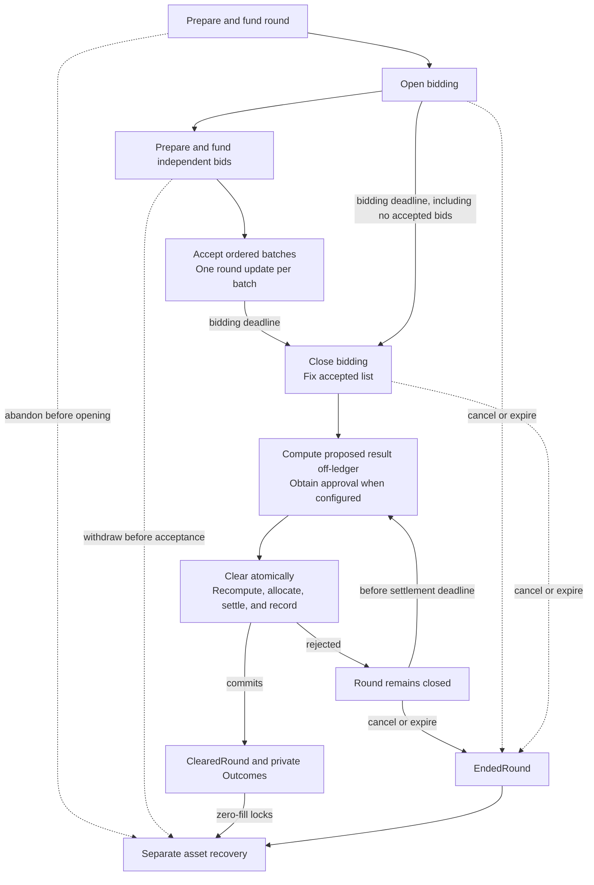

# Confidential auction reference architecture

This reference architecture defines a confidential, uniform-price auction for
distributing a fungible token in one sealed-bid round on Canton. The issuer
offers inventory, bidders authorize bounded payments, and an auction operator
coordinates bidding and settlement. A separate auction validation party, hosted
by the operator organization and independent validation organizations, holds
the authority used by the auction contracts.

## 1. Product Definition

The token seller, called the **issuer**, offers a fixed quantity in one round.
Bidders specify quantities and maximum unit prices under terms published before
bidding opens. After bidding closes, the clearing rule determines the quantities
awarded and the common unit price. Payments follow the published rounding rule.

Bids are private from competing bidders. The issuer, operator, validation hosts,
and each bid's account authorizers receive the disclosures needed for their
roles. Registry rules govern asset visibility. The application checks bidder
eligibility at acceptance and before awarding tokens.

The registries use [Token Standard V2](https://github.com/canton-foundation/cips/blob/6f37c896a5a76ec3bc1aa67bc045623ae5df41e5/cip-0112/cip-0112.md)
**allocations** to authorize movements and reserve holdings. The issuer reserves
the supply before opening. Each bidder reserves its maximum payment before
acceptance. These **committed allocations** restrict account-authorized
withdrawal until their settlement deadline, subject to registry rules. They
name the validation party as their sole settlement executor.

The operator accepts prepared bids in batches. Each committed acceptance appends
the bids to the round's private list. Preparation alone does not enter a bid in
the auction. Closing fixes the list, and clearing must account for every bid on
it. The operator can refuse or delay admission and chooses the order within
each batch. Accepted-set validation prevents omission after acceptance, but does
not guarantee admission or fair ordering of requests.

The **clear** is one atomic transaction. It validates the complete result,
cancels the supply and winners' payment locks, creates allocations for the exact
payments and deliveries, and settles them. Previously collected account consent
authorizes those operations. The round produces one result or ends without a
sale. Bids awarded no tokens retain their locks for separate recovery.

See the [auction lifecycle](#22-auction-lifecycle) for the workflow and
[section 3](#3-target-design) for its transactions and authority.

### 1.1 Auction Mechanics

The issuer and validation party fix the terms before opening. A **lot** is the
allowed quantity increment, a **price tick** is the allowed price increment, and
the **reserve price** is the minimum unit price the issuer accepts. A bid's
**fill** is the quantity it wins.

The round terms include:

- payment asset, offered token, issuer accounts, registries, and supported asset policies
- positive offered quantity, reserve price, price tick, and lot size
- payment quantum and rounding rule
- bidding and settlement deadlines, with preparation and clearing margins
- maximum accepted bids and maximum bids per acceptance batch
- eligibility provider, credential requirements, and permitted exclusions
- optional settlement attester, clearing-rule revision, and acceptance ordering

Quantities are whole lots. Reserve and bid prices align to the price tick, and
bids below the reserve are rejected. The rounding function is monotone and
produces a positive payment for one lot at reserve. It rounds both the maximum
payment lock and the final payment. A smaller fill at a price no higher than
the bid's maximum therefore cannot exceed its lock. Opening and acceptance
check arithmetic bounds.

Every accepted bid receives a consecutive number, starting at zero. Numbers
follow committed batch order and the operator's chosen order within each batch.
Rejected transactions assign no numbers. This is acceptance order, not the
arrival time of an off-ledger request or a bid's synchronizer record time.
Retries retain the numbers already assigned.

Clearing includes every accepted bid. Authenticated credential expiry or
revocation gives a bid zero fill and excludes it from price-setting demand.
Missing evidence, registry cancellation, or an unavailable participant is not
proof of ineligibility. A required allocation with no valid funded continuation
prevents the complete clear. Asset restrictions remain enforced by the registry.

Eligible bids are ordered by maximum unit price, with higher price bands filling
first. If a band's demand exceeds the remaining supply, that band
receives proportional fills rounded down to whole lots. Leftover lots are
assigned, one per bid in ascending acceptance order, to bids in that band with
remaining demand. This rule applies per bid, so deployments disclose their
multiple-bid and related-account policies. Splitting bids can affect leftover
lot allocation.

All winners pay the same **clearing price**. If eligible demand does not exceed
supply, it is the reserve price. Otherwise it is the lowest maximum unit price
among bids receiving a fill. With no eligible demand, the result reports zero
sales at reserve and releases the supply without an empty settlement call.

For example, consider 100 tokens, a reserve of 8, and a lot size of 10. All bids
remain eligible:

| Bid | Acceptance number | Quantity | Maximum price | Fill |
|---|---:|---:|---:|---:|
| A | 0 | 50 | 12 | 50 |
| B | 1 | 80 | 10 | 40 |
| C | 2 | 40 | 10 | 10 |

A receives 50 tokens. B and C share the remaining 50 proportionally, giving
approximately 33.33 and 16.67 before lot rounding. Rounding gives 30 and 10.
B receives the leftover lot because its acceptance number precedes C's. All
winners pay 10 per token.

Retries preserve the accepted set and apply the same rule to current evidence.
Credential changes can affect price and fills. A timeout alone never permits
omission or repricing. If the complete round cannot settle on time, it ends
without a sale.

### 1.2 Scope

The design covers one primary distribution of existing fungible inventory,
permissioned eligibility, and one atomic clear on a compatible synchronizer.
Repeated auctions, secondary trading, mint-on-demand delivery, other pricing
rules, additional executors, and settlement across separately committed
transactions require separate designs.

The selected registries must support the account authorizations, committed
locks, synchronous cancellation, allocation creation, settlement, and recovery
in section 3. Funding must create its allocation and completed application
record in one transaction. Consent collection may use several transactions.
Token Standard V2 conformance alone does not guarantee these capabilities.

The bid limit bounds the accepted list and the largest clearing transaction,
including zero-fill outcomes. Capacity must be measured for the actual
registries and participant topology. Partial settlement is outside this design.

## 2. Architecture Overview

The application coordinates account consent, auction membership, and registry
operations. The operator submits workflows through contracts signed by the
validation party. Account-signed bid and sale contracts authorize bounded asset
operations. Registries enforce account authority and asset policy, while the
auction contracts enforce the round's terms and complete result.

### 2.1 Personas and Components

In Token Standard terminology, each asset is an **instrument** governed by an
**instrument admin**. An **allocation factory** creates allocations. A
**settlement factory** settles compatible allocations for that admin. One
registry may support both auction assets, or each may use a different registry.

| Persona | Responsibility |
|---|---|
| Bidder and account parties | Approve quantity, maximum price, payment, and token receipt. |
| Issuer and its account parties | Approve the terms, supply inventory, and authorize token delivery and payment receipt. |
| Auction operator (`ao`) | Runs the backend, coordinates preparation and recovery, proposes results, and submits delegated operations. |
| Auction validation party (`av`) | Signs auction state and grants. Its approved choices validate transitions. It is the sole allocation executor. |
| Instrument admins | Enforce account authority, settlement, and asset restrictions through registry code. |
| Eligibility provider | Authenticates bidder credentials, expiry, and revocation status. |
| Settlement attester, when configured | Approves the exact auction settlement through a separate application contract. |
| Auditor, when enabled | Records and checks the disclosed history through observation access to `av`. |

The registry determines the **account parties** required to authorize each
action. An account may require its provider's consent as well as its owner's.
[Canton Coin supports basic accounts](https://github.com/canton-foundation/cips/blob/6f37c896a5a76ec3bc1aa67bc045623ae5df41e5/cip-0112/cip-0112.md#6-canton-coin-implementation)
without a provider or additional account identifier.

#### Hosting and Governance

The worked deployment has three participants hosting `av`: the operator's and
those of two independent validation organizations. Its confirmation threshold
is 2-of-3. The operator also hosts `ao` as a separate, single-hosted party.
The issuer, account parties, asset admins, and attesters use their own or
explicitly trusted participants.

Three controls are configured independently:

- **Confirmation:** two validation hosts must confirm `av`'s transaction views.
  Each independently vets the auction and dependency packages.
- **Topology governance:** a 2-of-3 decentralized namespace governs changes to
  `av`'s and `ao`'s hosting and topology. The operator cannot change them
  unilaterally.
- **Administrative submission:** separately configured 2-of-3 external signing
  authority controls direct submissions as `av`, including grant administration
  and recovery reconciliation. Confirmation does not supply these signatures
  or account consent.

These are deployment choices using Canton's
[decentralization controls](https://docs.canton.network/overview/reference/decentralization)
and [multi-signature submission](https://docs.canton.network/global-synchronizer/production-operations/multi-sig).
More independent organizations and different thresholds are possible, subject
to trust, availability, and capacity analysis. A controlling governance or
signing quorum remains trusted. Every `av` host receives its party's disclosed
data, regardless of the confirmation threshold.

The operator submits as `ao` through `av`-signed **grants**. Each grant instance
authorizes one category of operation, such as preparation or clearing. Choices
invoke fixed workflows and expose no arbitrary choice forwarding. Operator
read access to `av` supplies visibility, not authority to submit as `av`.

#### Auction Contracts

Open and closed are states of `Round`. Operator grants are separate contracts
for each operation category, referred to as `Grant` in the flows below. Opening
grants use release-specific templates as described in
[section 6.3](#63-smart-contract-upgrade-process).

| Contract | Purpose |
|---|---|
| `RoundPreparation` | Collects issuer and account consent. Funding consumes it and creates the supply allocation, `Proposal`, and `SaleAuthority` together. |
| `BidPreparation` | Collects bidder and account consent. Funding consumes it and creates the payment allocation and `PreparedBid` together. |
| `Proposal` | Holds completed round preparation. Opening or abandonment consumes it. Its ID becomes the stable round identity on opening. |
| `Grant` | Signed by `av`. Separate contracts authorize preparation and funding, opening, admission, close, clear, termination, and recovery by `ao`. |
| `PublishedTerms` | Issuer- and `av`-signed terms and stable round identity, disclosed to prospective bidders without the accepted list. |
| `Round` | Issuer- and `av`-signed private state, observed by `ao`. Holds terms, phase, sale authority, accepted bid IDs, and the next acceptance number. |
| `PreparedBid` | Bidder-, account-party-, and `av`-signed bid and payment lock binding. Acceptance or withdrawal consumes it. It has no acceptance number. |
| `AcceptedBid` | Issuer-, bidder-, account-party-, and `av`-signed accepted bid, observed by `ao`. Carries its immutable terms, lock binding, number, and account authority. |
| `SaleAuthority` | Signed by `av`, issuer, and required issuer account parties. Authorizes bounded delivery and payment receipt. Opening binds it to the round. |
| `BatchApproval` | Optional attester-signed approval of the full settlement reference, exact movements, and validity period. |
| `Outcome` | Records one accepted bid's fill, payment, and any exclusion or recovery obligation. Visible to that bid's parties, issuer, `av`, and operator. |
| `ClearedRound` | Terminal aggregate result for issuer, `av`, and operator. |
| `EndedRound` | Terminal record of cancellation or expiry, retaining accepted membership and sale authority for independent cleanup. |
| `RecoveryTicket` | `av`-signed lock binding for recovery. Consumed after release or verified administrative reconciliation. |

Recording an account-party identifier does not supply its authority. Preparation
collects consent through signed contracts, and bid or sale choices carry it into
the corresponding asset operations. A contract's recreation produces a new ID.
Round successors retain the stable round identity, while allocation successors
are checked against the original allocation's ID, called its **root**.

### 2.2 Auction Lifecycle


```mermaid
flowchart TB
    PrepareRound["Prepare and fund round"] --> Open["Open bidding"]
    Open --> PrepareBid["Prepare and fund independent bids"]
    PrepareBid --> Accept["Accept ordered batches<br/>One round update per batch"]
    Accept -->|"bidding deadline"| Close["Close bidding<br/>Fix accepted list"]
    Open -->|"bidding deadline, including no accepted bids"| Close
    Close --> Propose["Compute proposed result off-ledger<br/>Obtain approval when configured"]
    Propose --> Clear["Clear atomically<br/>Recompute, allocate, settle, and record"]
    Clear -->|"commits"| Done["ClearedRound and private Outcomes"]
    Clear -->|"rejected"| Retry["Round remains closed"]
    Retry -->|"before settlement deadline"| Propose
    Retry -->|"cancel or expire"| End["EndedRound"]
    Open -.->|"cancel or expire"| End
    Close -.->|"cancel or expire"| End
    PrepareRound -.->|"abandon before opening"| Recover["Separate asset recovery"]
    PrepareBid -.->|"withdraw before acceptance"| Recover
    Done -->|"zero-fill locks"| Recover
    End --> Recover
```

Consent approvals are separate transactions. Funding, opening, each acceptance
batch, close, and clear are distinct atomic transactions. Bidding can close with
any accepted count, including zero. Preparation and funding do not update the
round. Only committed acceptance establishes membership.

The round and its allocations have separate lifecycles. Closing, cancellation,
expiry, or a zero-fill outcome does not itself release a retained payment lock.
Asset release follows [section 3.5](#35-release-locked-assets).

### 2.3 Privacy and Result Verification

A party's **transaction projection** contains the branches it may see. A
participant operator can access its hosted parties' projections. Sharing a
participant does not itself give one customer access to another customer's
data. Ledger API permissions still restrict customer access. Organizations
combining roles receive the disclosures of those roles.

| Persona | Private auction records | Asset records |
|---|---|---|
| Bidder and bid account parties | Their preparation, prepared and accepted bid, number, and outcome | Their allocations and movements under registry disclosure rules |
| Issuer, operator, and validation party | All prepared and accepted bids, accepted list, and complete clear | Every movement in the clear |
| Issuer account parties | Sale authority and its branches. No bid contracts from this role alone | Issuer allocations, including winning accounts and amounts. Further visibility follows registry rules |
| Instrument admin | No bid contracts or private outcomes from this role alone | Allocations, holdings, and movements governed by that admin |
| Account provider | Bids and outcomes for which it signs the account approvals | Holdings and movements for its accounts |
| Eligibility provider | Its credentials and status. No bids from this role alone | No asset records from this role alone |
| Settlement attester | Approval terms. No bid contracts or private outcomes from this role alone | Exact approved movements, including accounts, instruments, and amounts |
| Auditor observing `av` | Full validation-party projection, including accepted bids and outcomes | All settlement branches visible to `av` |

Each bid's authorized operations occupy a separate child branch. Factory
settlement calls sit outside bid and sale branches. The issuer, `av`, and
operator see the enclosing clear. Actual registry and provider projections must
be verified before deployment.

Allocation IDs and disclosure responses are sensitive. Registry APIs can use
an allocation ID to provide settlement context and disclosed contracts. Keep
other bidders' allocation IDs out of published terms, shared metadata, and
bid-visible arguments or results. Backend APIs and logs must preserve the same
boundary. Keeping the accepted list private alone does not establish this.

A payment lock reveals its maximum payment amount to parties that can see it.
[Canton Coin movements are public](https://github.com/canton-foundation/cips/blob/6f37c896a5a76ec3bc1aa67bc045623ae5df41e5/cip-0112/cip-0112.md#431-configurable-executors-and-batch-settlement-via-settlementfactory)
even when bid contracts are private. Acceptance numbers also disclose prior
acceptance counts. Comparing several numbers and their timing can reveal
acceptance activity, including batching, but not off-ledger request arrival.

A bidder can verify its own acceptance and outcome. Recomputing the complete
result requires the private accepted set. The auditor's checks and the limits
of this verification are defined in [section 5](#5-security-and-auditability).

### 2.4 Institutional Controls

The round publishes the applicable eligibility and approval policies and their
responsible parties before bidding. Registry asset policies remain separate.

| Control | Enforcement |
|---|---|
| Optional settlement approval | The configured attester signs `BatchApproval`. The auction clear checks and consumes it for the exact settlement. Registries independently enforce any approvals required by their own policies. |
| Bidder eligibility | The provider authenticates status for the common owner of the payment and delivery accounts. Acceptance and clear check that evidence. |
| Application governance | The organizations in section 2.1 govern `av`'s and `ao`'s topology, direct `av` signing, approved code, and grants. |
| Registry restrictions | Registry code governs asset cancellation, withdrawal, and privileged movements. The auction cannot override these controls or treat a cancelled lock as funded. |

Acceptance binds the credential's provider, owner, and identity. A revocable
credential needs a provider-signed status whose update consumes the previous
version and preserves one authenticated active successor. Clear validates that
successor and its expiry against ledger time. Revocation requires explicit
revoked status. A missing or archived credential without current evidence
blocks validation rather than proving exclusion.

Nonrevocable credentials still require authenticated ownership and expiry.
Credential and status contracts include `av` as an observer, allowing its choices
to fetch them under their own authority. Successors preserve this observer.
The provider receives no bid amounts or accepted list from these checks. Any
related-party screening belongs in the fixed eligibility policy.

An auditor may also act as attester through a separate party. Observation access
to `av` provides the evidence for review. The attester party signs the approval.
This adds a settlement condition without giving the auditor a confirmation
vote or submission authority as `av`. Independent approval requires an
independent organization and the evidence needed for the promised review.

Grant choices are non-consuming during ordinary use. Governance pauses starting
and funding preparations and accepting bids by consuming the corresponding
grants. Funding checks a live preparation grant even when called directly.
Stopping new rounds also requires revoking opening authority. Close, clear,
termination, and recovery grants remain available for existing commitments.

Operator replacement preserves the `ao` party used by existing contracts.
Governance revokes the old grants and transfers `ao` to the replacement host,
removing the former host from `ao`'s topology. It restores authorized access
to private records before issuing replacement grants. Changing the party
itself requires contract migration and any required consent. Grant revocation
does not remove observer rights, and replacement procedures disclose any
continuing access by the former operator.

## 3. Target Design

Each numbered submission below is a separate transaction. Indented calls occur
inside that transaction. Account services supply the factory and holding
disclosures needed for submission. A disclosed contract must still be read and
exercised with the authority required by its API.

The intended user integration uses an auction UI and a wallet provider through
[CIP-0103](https://github.com/canton-foundation/cips/blob/6f37c896a5a76ec3bc1aa67bc045623ae5df41e5/cip-0103/cip-0103.md).
The UI displays authenticated terms and constructs approval requests. The wallet
obtains user authorization and submits through the user's authorized participant
connection. Account providers submit their required approvals through their own
services. The operator backend submits `ao` actions through its participant.

### 3.1 Prepare and Open the Round

The issuer supplies the section 1.1 terms. Preparation gathers the account
consent needed for inventory funding, token delivery, and payment receipt.
Account-party sets may differ by operation.

```text
1. ao exercises preparation Grant.StartRound(terms)
   create RoundPreparation, signed by av

2. Each required issuer/account party exercises ApproveRound
   consume the preparation and add that approver to its successor's signatories

3. ao exercises RoundPreparation.FundRound(preparation grant, inventory holdings)
   check a live preparation grant for this av and ao
   require complete consent and a valid bidding deadline
   allocate the supply using inventory-account authority
   consume preparation and create Proposal and SaleAuthority

4. ao exercises opening Grant.OpenRound(proposal, current supply allocation)
   exercise Proposal.Proposal_Open with av authority, consuming Proposal
     validate the proposal, consent, supply, and timing
     exercise SaleAuthority.BindSale to bind its successor to the round
     create Round(Open) and PublishedTerms
```

The preparation's initial contract ID is preserved through consent transitions
and used in the supply allocation's settlement reference. Funding creates that
allocation, `Proposal`, and `SaleAuthority` atomically. A failed funding
transaction leaves the approved preparation intact and creates no lock.

All auction allocations disable iterated settlement with
`nextIterationFunding = None`. Executors therefore cannot add transfer sides
through iterated settlement.

The initial supply allocation is **sender-only and self-returning**: it
authorizes the sender side of a transfer whose sender and receiver are the same
inventory account. It reserves the offered quantity, names `[av]` as executor,
and remains committed through the settlement deadline. It alone cannot settle
that transfer because it lacks receiver-side authorization. The clear cancels
this reservation and uses `SaleAuthority` to authorize actual winner deliveries.
Bid payment locks use the same form for the bidder's payment account.

The opening grant supplies `av` authority to `Proposal_Open`, whose body also
has issuer authority from the proposal's signatories. It checks
the exact terms, complete consent, sale authority, and funded supply binding:
admin, instrument, account, amount, allocation sides, commitment, executor set,
preparation reference, and deadline. Supported successors follow section 3.4.

The consumed proposal's ID becomes the stable round identity, retained in
`Round` successors and `PublishedTerms`. The round starts with an empty accepted
list and next number zero. The bound sale authority retains issuer account
consent for final movements.

Opening must leave the published **preparation margin** before the bidding
deadline. That deadline must leave the **clearing margin** before the settlement
deadline. These margins allow time for the corresponding operations and retries.
The opening grant must remain active when the transaction commits.

Failed opening leaves the proposal, sale authority, and supply lock intact.
The issuer can instead exercise `AbandonProposal`, which consumes the proposal
and unbound sale authority and creates a recovery ticket. Opening and abandonment
compete for the same proposal. Abandoning an unfunded preparation consumes only
that preparation, since no allocation has been created.

### 3.2 Prepare Bids and Accept Batches

#### Prepare a Bid

The bidder reviews the authenticated terms, quantity, maximum unit price,
payment and delivery accounts, required approvals, deadlines, and disclosures.
Both accounts have the bidder as their common owner. The UI requests preparation
from the operator, then presents each account approval to the responsible party.

```text
1. ao exercises preparation Grant.StartBid(published terms, bid)
   create BidPreparation, signed by av

2. Each required bidder/account party exercises ApproveBid
   consume the preparation and add that approver to its successor's signatories

3. ao exercises BidPreparation.FundBid(preparation grant, payment holdings)
   check a live preparation grant for this av and ao
   require complete consent and time before the bidding deadline
   allocate the rounded maximum payment using payment-account authority
   consume preparation and create PreparedBid
```

The maximum lock is the published rounding of `quantity x maximum unit price`.
Funding creates it and the prepared bid atomically. The bidder and account
parties authorize funding and bounded final payment and receipt. The operator
submits funding using that previously collected authority, without submitting
as the bidder.

`PreparedBid` binds the round, exact terms, accounts, preparation identity, and
allocation root. The preparation-specific allocation reference and consuming
completion prevent one lock from completing multiple preparations.

Different bids prepare independently when they use distinct funding inputs and
account resources. Preparation does not update `Round` or establish admission.
If acceptance never occurs, the bidder can withdraw the prepared bid for recovery.

#### Accept a Batch

The operator queues prepared bids and submits bounded batches against the
current open round. It chooses their order and limits waiting time under the
published admission policy.

```text
ao exercises admission Grant.AcceptBatch(round, ordered bids, evidence)
  exercise Round.Round_AcceptBatch with av authority, consuming Round
    check Open, deadline, batch size, total capacity, and distinct bid IDs
    validate the current supply allocation
    for each prepared bid in the supplied order:
      validate round, terms, accounts, funded allocation, and eligibility
      exercise PreparedBid.Prepared_Accept with issuer and av authority
        consume PreparedBid and create AcceptedBid with number n
      append the returned ID and advance n
    create one Round successor with the complete appended list
```

The round supplies issuer and `av` authority to each acceptance choice. The
prepared bid supplies bidder and account-party authority. Bidders see their own
child branch, not the enclosing private list or round successor.

Acceptance requires ledger time before the bidding deadline, a nonempty batch
within the batch limit, and room for all its bids within the round limit. Every
bid must bind the same round and terms, have positive whole-lot demand and a
tick-aligned price at least reserve, and satisfy arithmetic bounds. Its funded
allocation must match the expected account, admin, instrument, maximum amount,
commitment, executor, preparation reference, and deadline. Current authenticated
eligibility must be valid, and its identity is retained in `AcceptedBid`.

A batch of `k` bids receives numbers `n` through `n + k - 1`. The successor's
next number is `n + k`, equal to its accepted-list length. Existing entries and
their order are preserved. One invalid or unconfirmable bid rejects the entire
batch, leaving all prepared bids, locks, and the prior round unchanged.

There is still one shared round contract. Competing acceptance transactions can
consume it only once. The operator reconciles outcomes and retries against its
current successor while admission remains open. Batching reduces round updates
from one per bid to one per batch, but does not establish a throughput or cost
guarantee. The ledger enforces the stored order, not fairness of the operator's
ordering decision.

`WithdrawPreparedBid` consumes an unaccepted bid and creates `RecoveryTicket`.
It competes with acceptance and does not itself unlock funds. An accepted bid
cannot be withdrawn or amended unilaterally while its round remains clearable.

### 3.3 Close Bidding and Compute the Result

At or after the bidding deadline, `ao` exercises the closing grant's `CloseRound`.
It calls `Round_Close`, consuming the open round and creating a closed successor
with the same terms, accepted list, next number, and sale authority. Acceptance
requires the open phase and time before the deadline. Reaching capacity stops
admission but does not advance close.

The operator reads the closed list, resolves current allocation and credential
evidence, and computes a proposed price, fills, and payments under section 1.1.
It obtains application approval when configured. The clear independently
recomputes the result from authenticated inputs and rejects any mismatch.

### 3.4 Create Exact Allocations and Settle

The operator submits one transaction through the clearing grant. It consumes
the closed round, all accepted bids, and sale authority and records the result
only if every required asset operation succeeds.

```text
ao exercises clearing Grant.ClearRound(round, evidence, proposed result)
  exercise Round.Round_Clear with av authority, consuming Round
    validate the exact accepted list, current evidence, and deadlines
    recompute price, fills, and payments and compare with the proposal

    for every AcceptedBid, exercise FinalizeBid with av authority
      check local quantity, price, and payment bounds
      winner: cancel payment lock and create exact payment/delivery sides
      zero fill: create RecoveryTicket for the retained lock
      consume AcceptedBid and create its private Outcome

    exercise SaleAuthority.FinalizeSale with av authority
      cancel supply lock and create exact issuer payment/delivery sides
      consume SaleAuthority

    when configured, exercise BatchApproval.VerifyBatch
      check attester, full settlement reference, exact legs, and expiry
      consume approval

    outside bid and sale branches, call each SettlementFactory_SettleBatch
      transfer assets using the exact allocations
    create ClearedRound
```

All calls above belong to the same transaction. A failure in a later factory
rolls back earlier asset operations, approval consumption, outcomes, and round
consumption. Bidders do not sign again, but the required confirming participants
must remain available.

#### Validate Allocation Successors

Opening, admission, clear, and recovery check the current allocation against
the recorded root. The backend discovers successors from authenticated registry
events. The ledger checks activeness, the approved registry implementation, and
lineage. An initial allocation's ID must equal the root. A successor's
`originalAllocationCid` must equal it, and the registry must preserve a single
active continuation and prevent forged lineage.

The allocation must retain the authorized account, instrument, amount, sides,
commitment, executor set, settlement reference, and deadline, with
`nextIterationFunding = None`. Registry-specific evidence supplies any
required status absent from the standard view. A stale ID requires
reconciliation, not an assumption of lost funding. A consumed lock without a
valid funded successor prevents the complete clear, even for a bid that would
otherwise receive zero fill. Registry restrictions never authorize the
operator to remove an accepted bid.

#### Validate the Result and Authority

Clear inputs must match the closed round's accepted IDs in their stored order.
The choice rejects omissions, duplicates, substitutions, foreign-round bids,
and changed numbers. It recomputes eligibility, ordering, fills, price, and
rounded payments, checking total supply, individual demand and payment bounds,
lot and tick alignment, and deadlines. The proposed result must match exactly.

The authority chain is:

| Contract and choice | Contract signatories | Controller |
|---|---|---|
| `Grant.ClearRound` | `av` | `ao` |
| `Round.Round_Clear` | Issuer and `av` | `av` |
| `AcceptedBid.FinalizeBid` | Issuer, `av`, bidder, and required bid account parties | `av` |
| `SaleAuthority.FinalizeSale` | `av`, issuer, and required issuer account parties | `av` |
| `BatchApproval.VerifyBatch` | Attester | Settlement executors, fixed to `[av]` |
| Registry choices | Registry-defined signatories | Registry-validated actors with the required authority |

Under the [Daml authorization rule](https://docs.canton.network/appdev/modules/m3-authorization#daml%E2%80%99s-authorization-model),
the enclosing choice must have every nested choice controller's authority. The
nested choice body uses its own controllers and contract signatories as
authorizers. Thus bid and sale contracts supply account authority inside their
own branches. Merely naming a party in a registry's `actors` argument does not
supply its consent.

Bid and sale choices enforce local bounds. The enclosing round enforces global
pricing and completeness. `ao` cannot directly exercise those `av`-controlled
choices, and its grant permits only the complete workflow. Unrestricted direct
submission as `av` can bypass that workflow. Restricting administrative authority
and approved code is therefore essential to the atomic-clear guarantee.

#### Create Exact Allocations and Settle Batches

A **transfer leg** specifies an instrument, sender, receiver, amount, and leg ID.
Every winner has two legs:

| Leg | Sender | Receiver | Amount |
|---|---|---|---:|
| Payment | Bidder payment account | Issuer proceeds account | Rounded `fill x clearing price` |
| Delivery | Issuer inventory account | Bidder delivery account | Fill quantity |

Each leg needs sender and receiver authorization, giving four sides per winner.
The winning bid's branch cancels its original payment lock as executor `av`.
It uses the returned `authorizerHoldingCids` to fund an allocation for the exact
payment sender side and creates the delivery receiver side without funding.
These operations use the bid contract's account authority.

The sale branch cancels the supply lock, uses its returned holdings for delivery
sender sides, and creates payment receiver sides under issuer account consent.
One allocation may cover multiple sides for the same account, admin, and
settlement. The issuer can therefore group all payment receipts and all token
deliveries. Grouping must respect registry limits and bid privacy.

Cancellation and allocation creation do not themselves transfer the auction
assets between accounts. The settlement factory calls execute those movements.
Unused payment and unsold supply remain in their original accounts. The clear
checks returned accounts, instruments, amounts, and completed allocation
references. It uses returned holding IDs, not pre-cancellation IDs or cached
balances, and requires synchronous completion without later account acceptance.

Each leg receives a deterministic ID from its acceptance number and movement,
such as `bid-7-payment`. Legs are grouped by compatible admin and settlement
factory. Both assets may share a batch, otherwise all factory calls still
execute inside the same clear transaction.

Every allocation in a batch and its settlement call uses the identical full
`SettlementInfo`: `executors`, `id`, `cid`, and `meta`. Executors are `[av]`, `cid`
is the stable round identity, and `id` distinguishes the batch. Metadata is
fixed and contains no private bid prices or quantities. A preparation's
reservation reference never substitutes for the final settlement reference.
Use the contract-ID field for round identity rather than converting an ID into
a textual label.

Each bid choice receives only its own terms, fill, price, legs, and settlement
reference. It checks its stored round identity without fetching the consumed
round. The enclosing clear collects allocation references and calls factories
outside the bid and sale branches. Factories validate complete, exact
sender/receiver coverage, unique leg IDs, admin, amounts, accounts, and matching
settlement information. Direct subordinate calls must not bypass these checks
or the registry's own approval policy.

If an application attester is configured, `BatchApproval` must bind the full
settlement reference and exact payment and delivery legs, with an unexpired
validity period. For several settlement references, approval must cover the
complete set. This prevents using one round's approval for another with the
same textual batch ID and movements. The clear verifies and consumes approval
in the same transaction. Any registry-required approval is an additional,
independent condition.

#### Record Outcomes

Every accepted bid receives a private `Outcome`, including zero fills. It must
be traceable to the accepted bid and round and record its number, fill, price,
rounded payment, authenticated exclusion evidence when applicable, and retained
lock or recovery ticket. `ClearedRound` records aggregate price, sold quantity,
payments, and unsold supply with references to the outcomes. Payment totals sum
the individually rounded amounts.

Zero-fill finalization retains the payment lock for separate cancellation under
a recovery ticket. Recording an outcome does not assert that funds have already
been returned. The bidder's confirming hosts may still be needed for that
branch, so exclusion does not solve participant unavailability.

With no winners, clear consumes the same application records, records zero sales
at reserve, and cancels the supply lock. It creates no final movement allocations
and calls no factory with an empty leg list. Configured application approval
still covers the settlement reference and empty movement set.

### 3.5 Release Locked Assets

`RecoveryTicket` binds the original lock and expected allocation terms to an
authorized recovery event. It is signed by `av` and visible to the operator and
affected account parties. Release is a separate transaction:

```text
ao exercises recovery Grant.Release(ticket, current allocation)
  exercise RecoveryTicket.Recover with av authority
    validate the allocation and its root binding
    cancel it through the registry and return the released holdings
    consume RecoveryTicket
```

| Recovery path | Evidence and effect |
|---|---|
| Unfunded preparation abandoned | Consume `RoundPreparation` or `BidPreparation`. No allocation exists to release. |
| Funded proposal abandoned | `AbandonProposal` consumes the proposal and unbound sale authority and creates a supply recovery ticket. |
| Prepared bid withdrawn or left unaccepted | `WithdrawPreparedBid` consumes it and creates a payment recovery ticket. Withdrawal remains possible after bidding closes. |
| Zero-fill result | The outcome references the recovery ticket for the retained payment lock. |
| Round cancelled or expired | `EndedRound` retains membership and sale authority. Recovery choices close each accepted bid and the sale independently, creating outcomes and tickets. |
| Registry deadline passed | Required account parties may withdraw under registry rules, independently of operator bookkeeping. Reconcile any retained ticket as described below. |

Before its deadline, the operator may cancel an uncleared round with a reason.
At or after the deadline, it may record expiry. `Grant.EndRound` calls
`Round_End`, consuming the open or closed round and creating `EndedRound`.
Termination competes with acceptance or close while open, and with clear while
closed. It requires no prior clearing attempt.

Subsequent `CloseUnsettledBid` and `CloseUnsettledSupply` calls use the terminal
record to verify membership and close each commitment separately. One
unavailable bidder need not block recovery for other bidders. The accepted list
stays outside the individual bid branches.

Delegation permits lock cancellation only inside a complete clear or an
authorized recovery path. After a zero-fill result or abandonment, `av` may
cancel a retained lock before its deadline if the registry permits. A committed
lock's deadline restricts account withdrawal, not every executor cancellation.

If the allocation was already consumed with no funded successor, close the bid
or sale through its applicable cleanup choice without fetching or cancelling
the allocation. Reconcile its ticket, or any existing ticket, against
authenticated registry events and holdings. Governance verifies the terminal
asset outcome and retains the supporting event references before exercising
`RecoveryTicket.Archive` through a direct `av` submission. Operator grants
expose no such archival path. This administrative cleanup transfers no assets
and does not itself prove a refund.

Recovery tracking distinguishes returned funds, other authorized destinations,
and unresolved outcomes. Missing evidence leaves the ticket unresolved and
active. Competing cancellation and withdrawal can consume a lock only once.
Required participants, registry controls, synchronizer availability, and traffic
still constrain asset recovery.

### 3.6 Manage Execution and Timing

Choices check ledger time: acceptance requires a time before the bidding
deadline, close a time at or after it, and clear a time before settlement ends.
Each lock's registry deadline, storage expiry, and holding-lock expiry must
support the entire workflow. Longer lock periods disclose the later withdrawal
time to users.

The preparation and clearing margins include signing, submission, confirmation,
and retries. Clearing also needs time for close, computation, and approval.
The backend uses the earliest limit imposed by the round, registries, approvals,
and transaction submission bounds. Recovery expectations are disclosed
separately and depend on the relevant infrastructure and asset policies.

A client timeout leaves the result uncertain. Persist command and change
identities, acting parties, Ledger API user, submitting participant, and
completion position. Reconcile completions and committed state before reporting
failure or issuing a different attempt. Retries use consistent change identity
and participant for the same change, with adequate deduplication coverage and
fresh submission IDs. A different attempt requires definitive rejection, or
expiry of the prior attempt's supported latest recording bound followed by
reconciliation.
Changed inputs or validity bounds require new transaction preparation and any
new signatures. Ledger time and recording-time bounds serve different purposes.
See [deduplication](https://docs.canton.network/appdev/deep-dives/command-deduplication),
[time handling](https://docs.canton.network/appdev/modules/m3-working-with-time),
and [external signing](https://docs.canton.network/appdev/deep-dives/external-signing-transactions-part-1).

Clear requires the confirming hosts or quorum for every relevant issuer,
account, registry, and `av` branch. Credential fetches and approval consumption
also require their corresponding confirmations. Issuing approval earlier does
not remove the attester's confirmation dependency. An offline wallet needs no
new user interaction at clear, but unavailable required confirming infrastructure
can still block the entire transaction, including zero-fill branches.

## 4. Failure Recovery

A rejected transaction commits none of its effects. Earlier transactions remain
effective. Reconcile an uncertain submission before treating it as rejected.

| Failure or change | Consequence and response |
|---|---|
| Preparation stops before funding | Resume approval collection or abandon. No auction allocation exists. |
| Funding fails | Approved preparation remains active. Correct the inputs and retry or abandon. |
| Opening fails | Proposal, sale authority, and supply lock remain. Retry or abandon and recover. |
| Acceptance batch fails validation or loses a state race | No bid or number in the batch is accepted. Reconcile and retry eligible prepared bids before the deadline. |
| Bid remains unaccepted when admission closes | It has no fill entitlement. Withdraw its prepared bid and recover the retained payment lock. |
| Clear has wrong evidence or result, or an asset operation fails | Entire clear rolls back. Correct inputs and retry the complete accepted set before the earliest deadline. |
| Required approval is missing, expired, or mismatched | Obtain approval for the exact current settlement or end without a sale. |
| Authenticated credential expiry or revocation | Retain the accepted bid with zero fill. Missing current evidence instead blocks validation. |
| Registry changes an allocation ID | Resolve and validate its successor. An archived ID alone does not establish lost funding. |
| Required lock has no valid funded successor | The round cannot clear. Terminate, reconcile that asset outcome, and recover remaining locks. |
| Required confirming hosts or quorum unavailable | Retry the complete clear, including zero-fill branches. Do not omit bids or reprice for a timeout. |
| Settlement deadline passes | Clear is no longer permitted. Record expiry and recover each commitment independently. |
| Operator unavailable or grants revoked | Governance restores grants or transfers operation of `ao` under section 2.4. Account withdrawal remains subject to registry deadlines and policy. |
| Synchronizer, registry, or traffic unavailable | Restore the required infrastructure and reconcile state before resuming. |

Termination and recovery have their own dependencies. Independent cleanup limits
shared failure, but does not guarantee withdrawal while a required party or
registry is unavailable. Application closure alone is never evidence of refund.

## 5. Security and Auditability

### 5.1 Ledger-Enforced Properties

These properties depend on approved contract code, registry implementations,
and the authority boundaries in section 2.1:

| Property | Mechanism |
|---|---|
| Fixed terms and ordered admission | Consuming proposal, batch acceptance, and round transitions. |
| Complete accepted set | Append-only membership, closed list, exact clear inputs, and one outcome per accepted bid. |
| Bounded payments and reserved supply | Account-signed consent, funded-allocation validation, and local and aggregate movement checks. Registry powers remain effective. |
| Uniform-price result | Independent on-ledger computation under section 1.1. |
| Atomic settlement and replay prevention | Restricted complete-clear delegation, consumed round and bids, complete allocation coverage, and transaction rollback. |
| Scoped authority and disclosure | Account-authorized child branches, separate factory calls, and tested participant projections. |
| Controlled recovery | Bound tickets, terminal membership checks, and registry authorization. |

### 5.2 Trust Boundaries

| Trusted party or system | Residual risk |
|---|---|
| Operator | Can censor or reorder requests before acceptance, cancel an uncleared round, delay submission, or fail to recover funds promptly. |
| Validation and governance organizations | A controlling quorum can change trusted code or topology or authorize direct `av` actions outside operator delegation. Every host can disclose the data it receives. |
| Issuer | Sees private demand and must protect it. Inventory and account consent must remain valid. |
| Account parties and hosting providers | Supply consent, protect data, and maintain availability. A shared host's operator can access hosted-party data, while customer API access remains permissioned. |
| Instrument admins and registries | Enforce authentic lineage, funding, side coverage, and asset policies. Privileged asset operations or malicious code can affect holdings independently of auction state. |
| Eligibility provider | Incorrect status can change eligible demand, price, and fills. Missing evidence can block clear. |
| Settlement attester | Can withhold approval or approve an inappropriate settlement. An affiliated attester provides no independent review. |
| Canton infrastructure | Atomicity does not guarantee admission, timely confirmation, or sufficient traffic. |
| Auditor | Must retain complete disclosed history and review it correctly. Observation alone supplies neither a veto nor a progress guarantee. |

An optional independent auditor observes `av` through an observation-only host,
with disclosure to users. It receives no `av` confirmation vote or submission
authority. Its audit checks:

- committed acceptance batches and numbers against the closed list
- credentials, permitted exclusions, price, fills, and rounded payments
- one private outcome per accepted bid and matching aggregate totals
- actual payments and deliveries against the result
- recovery obligations against registry events and returned holdings
- admission and timing against the published policy and retained submission evidence

Ledger observation alone cannot prove fair treatment of every off-ledger
request. The operator retains receipts, command IDs, completions, and timing for
that review. A claimed timeout does not establish its cause. Auditing events
before the auditor joined requires a verified historical export. An auditor
that also serves as attester can withhold its separate application approval.

A bidder's limited projection supports its own acceptance and outcome checks,
but not independent recomputation of the complete auction. Confirmation
thresholds provide no threshold confidentiality, and removing a host cannot
retract data already disclosed. Direct `av` authority and malicious compatible
upgrades remain governance risks, as addressed in section 6.3.

## 6. Deployment and Operations

Before onboarding, publish the relevant organizations, registries, factories,
account providers, credential and approval policies, package inventory, and
topology. Each validation organization independently approves its vetted code.
All workflow inputs must be usable on the selected synchronizer.

The auction UI presents maximum payment, accounts and required signers,
deadlines, eligibility, registry restrictions, recovery conditions, and the
organizations receiving bid data. Successful ledger acceptance is the admission
decision. A funded preparation or operator receipt is not a fill entitlement.

The backend tracks preparation, current round and allocation IDs, acceptance
batches, submission outcomes, deadlines, credentials, approvals, participant
health, and outstanding recovery. It separates auction assets from traffic
funding and application rewards.

### 6.1 Traffic and Application Rewards

Each participant operator funds its charged traffic, including retries and
recovery. [Traffic balances are per participant](https://docs.sync.global/deployment/traffic.html),
shared by its parties. Service agreements assign top-up responsibility,
validation costs, and reimbursements. The auction deducts no fee from locked
funds, payments, deliveries, or refunds.

Budget using measured preparation, batch admission, maximum-size clear,
retries, and recovery. Batching alone is not proof of lower total traffic.
Under [CIP-0104](https://github.com/canton-foundation/cips/blob/6f37c896a5a76ec3bc1aa67bc045623ae5df41e5/cip-0104/cip-0104.md),
conformant confirmation responses are free in net cost, but traffic is still
needed pending reimbursement and duplicates can cost more.

The designated application-provider party is `av`. Attribution depends on its
active `FeaturedAppRight` and confirmation role in successful views. Observation
alone does not qualify, and three hosts still represent one party. Asset admins
may qualify independently for their views. Reward issuance and collection follow
active network rules. Governance defines sharing, and operations must be funded
without assuming rewards cover costs.

### 6.2 Production Readiness

Deployment requires evidence for the selected registries, clients, and
participant topology:

| Area | Required checks |
|---|---|
| Consent and funding | Missing account authority, incorrect lock fields, insufficient holdings, repeated completion, reused roots, funding rollback, grant revocation before funding, and abandonment before and after funding. |
| Batch admission | Duplicate or foreign bids, invalid batch member, batch and round limits, contiguous numbering, unchanged earlier entries, and races against another batch, withdrawal, close, or grant revocation. |
| Result | Omitted, extra, reordered, or substituted bids, all supply/demand cases, marginal ties, lot remainders, empty rounds, exclusions, arithmetic bounds, and sums of rounded payments. |
| Authority | Direct `ao` or bidder attempts to finalize, cancel, or settle outside grants. Missing consent, arbitrary forwarding, premature recovery, replay, and administrative `av` bypass boundaries. |
| Settlement and approval | Wrong settlement fields or attester, another round's approval, iterated funding, missing or extra sides, wrong amounts or accounts, incomplete allocation results, and rollback when a later factory fails. Test application and registry approvals separately. |
| Allocation lifecycle and recovery | Authenticated successors, stale or forged roots, changed terms, registry cancellation with no successor, independent cleanup, deadline withdrawal, and verified ticket archival. Missing evidence leaves recovery unresolved. |
| Eligibility | Wrong owner/provider, substituted identity, stale or duplicate status, explicit revocation, expiry, fetch authority, and unavailable evidence. |
| Privacy | Actual projections for every role, shared-host customer access, bid and factory branches, choice arguments/results, allocation IDs and disclosure APIs, public movements, and operator replacement. |
| Hosting and availability | Confirmation, topology, and administrative-signature thresholds independently. Operator handover preserving `ao` and removing former submission access. Unavailable winners and zero-fill bidders, attesters after approval, credential providers, validation quorum, and observation-only audit. |
| Timing and capacity | Deadline boundaries, preparation and clearing margins, uncertain completion, deduplication, restart recovery, batch waiting time, maximum clear size, allocation limits, traffic, and latency. |
| Upgrades | Approved dependencies, active-round semantics, retired opening paths, recovery support, and rejection of malicious compatible changes. |

Daml Script checks contract logic and authorization. Production hosting,
external signing, package vetting, privacy, and outages require an authenticated
multi-participant environment. Capacity checks must use concurrent clients.
Privacy checks must inspect transaction projections as well as visible contracts.

### 6.3 Smart Contract Upgrade Process

Releases preserve active-round economics, accepted membership, account consent,
and recovery. Smart Contract Upgrade compatibility permits choice-body changes
without proving those properties. Each validation organization reviews the
auction and its dependency upgrades before vetting them.

Compatible packages retain their name, increase their version, and declare
`upgrades:` under the [SCU rules](https://docs.canton.network/appdev/deep-dives/smart-contract-upgrade).
Define the meaning of absent optional fields for existing rounds. A stored
rule revision or package ID does not prevent malicious choice bodies. Changed
pricing, ordering, authority, or other incompatible semantics require a separate
design and fresh consent.

Opening is controlled by a separately revocable grant. Production releases need
distinct opening-grant templates so that an approved replacement cannot be
used through a retired template's view. At cutover, governance consumes every
grant exposing the retired opening workflow and issues the approved grant.
An in-flight opening either commits before revocation or conflicts with it.
Package preferences alone do not prevent an old-format opening.

Unopened proposals under retired terms are abandoned or prepared again with
fresh consent. Existing rounds retain their approved admission, close, clear,
termination, and recovery paths. Keep the code for unresolved commitments
vetted. Replacement grants must not forward arbitrary exercises or recreate
retired opening authority.

Validate package compatibility, including both upgrade directions where
supported, and test old-round operations and grant cutover on the actual
dependencies and topology. A structurally compatible but unsafe change must be
rejected by release review and vetting. Direct quorum-authorized submissions as
`av` remain an explicit governance responsibility.

## 7. Production Decisions

Uniform pricing, complete accepted-set validation, batch admission, separate
`ao` and `av`, sole `av` execution, and atomic clearing define this design. Before
opening, record:

| Decision | Configuration |
|---|---|
| Organizations and authority | Hosts, confirmation thresholds, topology governors, administrative signers, approved grants, and replacement procedures. |
| Admission and economics | Fixed terms, measured bid and batch limits, maximum batch waiting time, admission commitments, and related-account policy. |
| Assets and accounts | Instruments, admins, registries, factories, account authority, asset restrictions, deadlines, privacy, and upgrade controls. |
| Eligibility and approval | Credential identities and status mechanism, optional application attester, required registry approvals, and review independence. |
| Audit | Observation access, user disclosure, historical retention, submission evidence, review responsibility, and data handling. |
| Operations and releases | Traffic funding, recovery service, approved package inventory, vetting, opening cutover, and support for existing commitments. |

Record-time-based membership would replace the explicitly accepted list with a
different inclusion and audit model. Single-transaction preparation would need
a different way to gather authority. Neither alternative is assumed by the
staged workflow described here.

## 8. References

Standards and platform semantics:

- [CIP-0112 Token Standard V2](https://github.com/canton-foundation/cips/blob/6f37c896a5a76ec3bc1aa67bc045623ae5df41e5/cip-0112/cip-0112.md)
  and the [Allocation V2 interface](https://github.com/canton-network/splice/blob/22e775d614ad67af0290380ae4ab07dd2dceb62d/token-standard/splice-api-token-allocation-v2/daml/Splice/Api/Token/AllocationV2.daml):
  account authority, allocation sides, executors, lineage, and settlement.
- [CIP-0103 dApp API](https://github.com/canton-foundation/cips/blob/6f37c896a5a76ec3bc1aa67bc045623ae5df41e5/cip-0103/cip-0103.md):
  user authorization, wallet connectivity, and transaction submission.
- Canton [authorization](https://docs.canton.network/appdev/modules/m3-authorization)
  and [ledger model](https://docs.canton.network/overview/reference/ledger-model-detailed):
  choice authority, contract consumption, and projections.

Component references:

- The pinned [token registry experiment](https://github.com/OpenZeppelin/canton-contracts/tree/7696749737885e25cd88422847105f890f03b00d/experiments/token/tokenCIP112-v1)
  supports synchronous cancellation, allocation, and settlement and rejects
  iterated funding. Its optional D1 approval binds the textual settlement ID,
  executors, and legs, but not `cid` or `meta`. The auction's `BatchApproval`
  must bind the full reference and exact movements as specified in section 3.4.
  Registry approval remains a separate condition.
- The [credential-check module](../../experiments/identity/hook-shape-b/daml/OpenZeppelin/Experimental/Identity/ShapeB.daml)
  demonstrates typed eligibility checks. The deployment must supply its chosen
  current-status and revocation mechanism.
- The [SCU experiment](../../experiments/identity/upgrade/README.md) provides
  bounded compatibility evidence. Auction semantics and deployment cutover
  require the application checks in section 6.

The application repository owns the complete contracts, backend, UI, registry
integration, and operational evidence. The component references establish only
their documented mechanisms.
