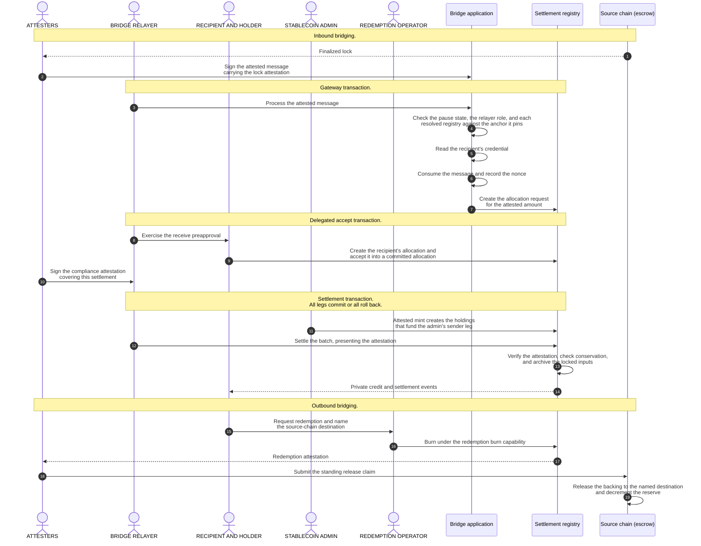

# Canton-side stablecoin bridge

This reference architecture defines the Canton side of a stablecoin bridge. An
attested lock on an external chain mints a wrapped instrument on Canton, and a
burn on Canton releases the backing on that chain. Each inbound credit lands as
a private, compliance-gated settlement, so no intermediary holds the asset in
transit.

## 1. Product Definition

Institutional participants accept value that reaches Canton from an external
chain. The value arrives as a gateway-minted **wrapped instrument**, written
wTOK. The settlement amount, the payer and payee identities, and the compliance
markers project only to the authorized parties.

**Inbound** moves value from the external chain to Canton, by **lock-and-mint**.
**Outbound** moves it back, by **burn-and-release**.

The transfer must credit the recipient with the intended amount or with nothing.
On Canton, the
[CIP-0112](https://github.com/canton-foundation/cips/blob/main/cip-0112/cip-0112.md)
[committed allocation](https://github.com/canton-foundation/cips/blob/main/cip-0112/cip-0112.md#416-committed-allocations-for-prefunded-trading-and-iterated-settlement)
carries that property. An **allocation** records the authority one account gives
for one asset movement, and a committed allocation fixes that movement's amount
on-ledger. One all-or-nothing **settlement batch** settles the committed sides
together.

No transaction spans both chains. The cross-chain hop is therefore
lock-then-attested-mint, and not an atomic exchange. The binding checks
of [section 3.2](#32-reserve-and-lock-attestation) tie the inbound amount,
recipient, and instrument to the attestation.

`OpenZeppelin/canton-contracts` holds an
[experimental settlement implementation](https://github.com/OpenZeppelin/canton-contracts/tree/7696749737885e25cd88422847105f890f03b00d/experiments/token/tokenCIP112-v1/daml/OpenZeppelin/TokenCIP112V1).
Per-party projection is what makes it private. A counterparty sees only the legs
it sends or receives, so one recipient's payment is never visible to another.
The **instrument admin** of the settled instrument is the one deliberate
exception. It signs that instrument's holdings and allocations, so it sits
inside the trust boundary ([section 2.2](#22-privacy-and-visibility)).

**Privacy scope.** The guarantee covers the Canton side only. The source-chain
lock is a public transaction, and it must carry enough data to route the
transfer on Canton. An observer of the source chain can therefore link a public
lock of amount *N* to a named Canton recipient who will receive *N*. Canton's
per-party projection hides everything downstream: the settled holding, the
settlement events, the compliance markers, and every later private transfer.
Hiding the link itself (hashed commitments,
shielded payloads, or relayer-side blinding) is out of scope.

### 1.1 Institutional Controls

We use D1 through D4 as local shorthand for four institutional controls. They are shared with the sibling reference architectures, and they are not Canton or CIP-0112 requirements.

| ID | Control | Mechanism | Where enforced | Invariant |
|---|---|---|---|---|
| **D1** | Compliance | A single-use attestation from a registry-listed attester, bound to this settlement's own legs and never cached. | The [settle entrypoint](https://github.com/OpenZeppelin/canton-contracts/blob/7696749737885e25cd88422847105f890f03b00d/experiments/token/tokenCIP112-v1/daml/OpenZeppelin/TokenCIP112V1/Registry.daml#L79), against the [attester registry](https://github.com/OpenZeppelin/canton-contracts/blob/7696749737885e25cd88422847105f890f03b00d/experiments/token/tokenCIP112-v1/daml/OpenZeppelin/TokenCIP112V1/D1.daml#L22) pinned on the registry rules. | No valid attestation, no settlement. |
| **D2** | Seizure | Mark the allocation, then sweep its locked holdings to a preset custodian account. | The [mark](https://github.com/OpenZeppelin/canton-contracts/blob/7696749737885e25cd88422847105f890f03b00d/experiments/token/tokenCIP112-v1/daml/OpenZeppelin/TokenCIP112V1/Allocation.daml#L158) on the allocation, plus one of the two sweep paths ([section 3.6](#36-control-enforcement)). | The asset is never burned, seized funds never return to the sender through the seizure path, and the freeze window is bounded and releasable. |
| **D3** | Identity | The recipient holds a credential from an issuer on the trusted-issuer list. | The gateway, at request time, before any allocation exists. | No valid credential from a listed issuer, no allocation request. |
| **D4** | Authority | Every privileged action binds to a named role rather than to one admin. | [Role administration](https://github.com/OpenZeppelin/canton-contracts/tree/7696749737885e25cd88422847105f890f03b00d/experiments/access/access-control-v1) and two-step ownership handover. | Privileges are granted, transferred, and revoked without a redeploy. |

### 1.2 Scope

| Bridge scope | Out of scope |
|---|---|
| The Canton side of the bridge: attested mint, private settlement, and attested burn | The relayer backend, the attester services, the source-chain lock escrow, external oracles, source-chain validator sets, and light-client proofs |
| Settlement of wTOK, the wrapped instrument this design mints | The issuance, peg, and collateral mechanism of any stablecoin, and any asset that already has a native Canton rail |
| On-ledger compliance and identity checks that deny the action when the attestation or the credential is absent or invalid | Any gate that reads a stored compliance flag, a risk score, or a threshold |
| CIP-0112 allocations and settlement batches | The superseded CIP-56 token standard and legacy allocation paths |
| One Canton synchronizer, with a cross-chain boundary outside it | Cross-synchronizer settlement and cross-synchronizer identity |

### 1.3 Status at a Glance

Six of the thirteen components below are not built, the cross-chain boundary
among them.

| Component | Location | What is missing |
|---|---|---|
| Settlement spine: registry rules, allocations, holdings, and the event host | [`canton-contracts` `tokenCIP112-v1`](https://github.com/OpenZeppelin/canton-contracts/tree/7696749737885e25cd88422847105f890f03b00d/experiments/token/tokenCIP112-v1) | Nothing for settlement itself. The wTOK registry must still close the [admin mint](https://github.com/OpenZeppelin/canton-contracts/blob/7696749737885e25cd88422847105f890f03b00d/experiments/token/tokenCIP112-v1/daml/OpenZeppelin/TokenCIP112V1/Registry.daml#L149), which consumes no attestation and can therefore issue unbacked supply ([section 3.2](#32-reserve-and-lock-attestation)) |
| Compliance attestation path (D1) | Same package, `D1.daml` | The verification of an N-of-M attester quorum, in place of the single attestation the registry verifies today ([section 2.3](#23-decentralization-and-trust-topology)) |
| Seizure path (D2): mark, two sweeps, seizure capability, lawful-process order | Same package, `Allocation.daml` and `D1.daml` | The sweep for an already-settled holding, since the seizure capability ships only an unlock; and capability revocation or rotation |
| Identity credential hook (D3) | This workspace, [`experiments/identity/hook-shape-b`](../../experiments/identity/hook-shape-b/) | The gateway action that runs the check, and the observer entries that let the gateway read the credential and the trusted-issuer list |
| Per-action role binding (D4) | Libraries in `canton-contracts` `experiments/access` | The wiring. The primitives exist, and this rail does not use them |
| Access control, ownership handover, and pausing | `canton-contracts` `experiments/access` and `experiments/security` | Nothing for access control and ownership. The pause state needs the observer entry that lets the gateway read it |
| Holdings and the receive preapproval | [`canton-token-template`](https://github.com/OpenZeppelin/canton-token-template) | The delegated accept that allocates under the recipient's preapproval. The template's own action only sends a transfer ([section 4.2](#42-inbound-credit-under-a-receive-preapproval)) |
| Messaging gateway | [Section 4.1](#41-messaging-gateway) | The whole implementation |
| Lock-attestation carrier and consumed-nonce registry | [Section 3.2](#32-reserve-and-lock-attestation) | The whole implementation |
| Attested mint and redemption burn | [Section 3.2](#32-reserve-and-lock-attestation) | The whole implementation |
| Contract keys on the pause state and the trusted-issuer list | [Section 3.4](#34-registry-uniqueness-under-non-unique-keys) | SDK support, Daml-LF 2.3 on Protocol Version 35, and a deploy-and-migrate path per template |
| Token Standard V2 interfaces | Splice `splice-api-token-*`, vendored as pinned DARs | Nothing. They are consumed by interface |
| Validation tooling | [Section 5.7](#57-automated-validation) | The whole validation pipeline for this rail |

---

## 2. Architecture Overview

The wrapped instrument has one Token Standard V2 registry that creates and
settles its allocations. Institutional services supply the compliance
attestation and the identity credential.

**Bridge lifecycle**

### 2.1 Business Roles

Canton identifies an actor by a party. The source chain identifies it by an
address. Neither chain records that one address and one party are the same
actor, so no on-ledger check can validate the pairing. An operator that acts on
both chains holds both credentials, and configuration is what keeps them
aligned. The lock attestation therefore names the Canton recipient explicitly,
and the attester set carries the trust that the name is correct.

"The attesters sign" means two different things. Inbound, the attester party
signs on Canton, and the source chain never sees that signature. Outbound, the
escrow cannot read Canton, so each attester also holds a source-chain key that
the escrow's own verifier accepts.

| Participant | Responsibility and visibility |
|---|---|
| Lock escrow | Source-chain contract. It holds the backing and releases it against a verified redemption attestation. |
| Bridge relayer | Settlement executor. It signs the allocation request and holds the relayer role that the gateway checks. Its authority covers transport and liveness, so a relayer without an attestation cannot mint. It observes every allocation it assembles. |
| Relayer backend | Off-Canton process. It watches the source chain and submits every inbound command as the bridge relayer. |
| Attesters, M of them | The trust role, separate from the relayer's transport role. They sign the lock attestation, the compliance attestation, and the redemption attestation. The attester registry lists them, and they see the legs of the settlements they attest. |
| Attester services | M independent operators on M participants. Each submits as its own attester party. |
| Stablecoin Admin | Instrument admin for wTOK. It signs the instrument's holdings and allocations and authors the attested mint, so it sees every wTOK payment. |
| Compliance Verifier | Administers the trusted-issuer list and issues the identity credential. It observes no settlement leg. |
| Custodian | Holds the seizure capability and owns the preset sweep account. It sees nothing until a seizure. |
| Lawful-process authority | Signs the seizure order that a sweep past the settlement deadline requires. The attester registry lists it, and it is never the instrument admin. |
| Recipient, or Holder outbound | Signs the receiving allocation, live or through a receive preapproval. |
| Recipient wallet | Off-Canton process. It creates the receive preapproval and submits as the recipient. |
| Pause authority | Signs the pause state and maintains its key. |
| Gateway admin | Sole signatory of the gateway and the consumed-nonce registry, and the party that operates the gateway. It submits nothing and holds the `FeaturedAppRight`. It reads the pause state, the trusted-issuer list, and each credential the gateway checks. |
| Redemption operator | Holds the redemption burn capability. |

The gateway and the registries are contracts, not services. The gateway has one
action that the relayer exercises. The pause state, the attester registry, the
trusted-issuer list, and the consumed-nonce registry are single contracts that a
caller resolves. The lock attestation is a data record inside the attested
message, so an attester signs the message and not a standalone attestation.

### 2.2 Privacy and Visibility

Target visibility per record. Every record belongs to the settlement registry
unless the row says otherwise. A party outside a row sees that record only
transiently, when a transaction it witnesses divulges it.

| Record | Signatories | Observers |
|---|---|---|
| Allocation request | The settlement executors, that is the bridge relayer | The leg's authorizer |
| Allocation, and the factory call that creates it | The instrument admin and the leg's authorizer | The settlement executors |
| Event host, created and archived in one transaction | The instrument admin | None |
| wTOK holding | The instrument admin and the account's parties | The lock's observers, while locked |
| Compliance attestation | The attester | The executor that verifies it |
| Attester registry | The settlement factory's admin | The listed attesters |
| Seizure order | The lawful-process authority | The instrument admin and the Custodian |
| Allowance | The instrument admin and the owner's account parties | The spender |
| Identity credential | The issuing party | The subject and the gateway admin |
| Trusted-issuer list | The registry admin | The gateway admin |
| Pause state | The pause authority | The gateway admin |
| Messaging gateway | The gateway admin | None |
| Consumed-nonce registry | The gateway admin | The attester set |

Consequences:

- **No recipient sees another recipient's legs.** Each allocation carries only
  the legs its own authorizer sends or receives. A batch of several inbound
  payments therefore discloses nothing to recipients of other payments.
- **The Stablecoin Admin sees every wTOK payment.** A leg's metadata travels
  into the event stream, so amounts, accounts, and the leg metadata are readable
  by construction. This is a trust assumption and not a leak to close. An issuer
  that authors the mint leg cannot also be blind to it. Any issued instrument
  puts its own issuer in this position.
- **The relayer and the attesters see what they handle.** The relayer's
  transport-only role bounds its authority, not what it sees. Attester
  membership is therefore a privacy decision as well as a compliance one.
- **The Custodian sees nothing until a seizure.** The seizure hook holds its
  destination as a data field and not as an observer entry.
- **A gate the gateway runs makes the gateway a stakeholder.** A fetch needs
  authorization from one stakeholder of the record it returns. The gateway
  action carries only its own admin authority. The pause state, the
  trusted-issuer list, and every credential the gateway checks must therefore
  name the gateway admin as an observer. The admin carries those entries, which
  keeps durable visibility off the relayer, whose set this design wants to
  open ([section 2.3](#23-decentralization-and-trust-topology)). The submitting
  relayer still witnesses the credential transiently, because a fetch divulges
  to whoever witnesses the exercise.
- **Settlement outcomes arrive as events, not as a queryable record.** The event
  host is created and archived inside one transaction. The event data therefore
  lives in the exercise node its observers witness. Integrators read the
  transfer-events stream ([section 5.6](#56-off-ledger-reconciliation)) and not
  the active contract set. The durable evidence of a settled payment is the
  recipient's holding.
- **No personal data on the ledger.** A credential carries an issuer reference
  and not personal attributes. The data stays with the issuer off-ledger.

### 2.3 Decentralization and Trust Topology

Two constraints bound every posture below. First, a quorum written in Daml is
worth its stated N only if N independent participants must confirm it. That
means N parties on disjoint participants that separate organizations operate,
or one party whose
[confirmation threshold](https://docs.canton.network/overview/reference/decentralization)
is at least N. Second, a party above threshold 1 cannot submit for itself. It
acts through another party's submission, or through external signing.

The Stablecoin Admin authors wTOK mint legs, and the Custodian can sweep locked
value. Both hold critical authority, so no single key may exercise either
role. Canton offers two routes to an N-of-M posture, and the choice between them
is open ([section 7](#7-open-design-questions)):

- **On-ledger approval workflow.** The multisig is written in Daml, as a
  [Multiple Party Agreement](https://docs.canton.network/appdev/modules/m3-design-patterns#multiple-party-agreement).
  The approvals are durable, named, and auditable on-ledger.
- **External party with threshold signing keys.** The role party's transactions
  require N of M keys held by independent organizations. The Daml code never
  sees this, and each action costs one ledger transaction. The
  [Bitsafe decentralization-manager](https://github.com/DLC-link/decentralization-manager)
  is one candidate implementation.

| Role | Target posture | Why |
|---|---|---|
| Attesters | Several independent parties in the attester registry, threshold N-of-M, never all-of-M | One unavailable or unvetted attester must not halt the rail, and one malicious attester must not mint |
| Bridge relayer | Multi-hosted on several participants, confirmation threshold 1 | It holds no minting trust and is the most submission-heavy role in the design. Integrity comes from the attester split, and relay should ultimately be permissionless, so no single party gates liveness |
| Pause authority | Multi-hosted, confirmation threshold 1 | An emergency stop must be instant, and a quorum would slow it down. The price is a griefing window where a malicious pauser stalls settlement until the deadlines lapse, capped by the sender's right to reclaim committed funds |
| Compliance Verifier | Several independent issuers on the trusted-issuer list | A recipient needs a credential from only one listed issuer, so no single issuer can block onboarding. The list is only as strict as its most permissive issuer, which makes the choice of whom to list a governance decision |
| Recipients | No rail-side decentralization | Nothing binds a recipient without its own signature, live or preapproved, so it trusts only its own keys and participant |

The relayer is the only party on both sides of the cross-chain boundary. It pays
nearly all the traffic ([section 6.1](#61-traffic-costs)), and the rail halts
when its validator runs out of traffic
([section 5.4](#54-failure-modes-and-recovery)).

---

## 3. Target Design

Only the settle is atomic, and only on Canton. The inbound path is three
relayer-submitted transactions, orchestrated off-ledger by the relayer backend.
The attesters sign the attested message and the compliance attestation in
transactions of their own.

### 3.1 Inbound Credit

**Bridge mode.** The rejected alternative is lock-and-unlock, which pays the
recipient from liquidity held on the destination side. It adds a
liquidity-provider role and an inventory-imbalance surface that a reference rail
does not need. The messaging gateway is the seam where another mode plugs in.

1. **Attested message.** The external chain finalizes a locked deposit. An
   attester signs a message that carries the typed **lock attestation**: the
   locked amount, the Canton recipient, the target instrument, a one-time nonce,
   and an expiry. The message has one attester signatory, which matches the
   single attestation the registry verifies today. An N-of-M quorum aggregated
   onto the message is the target
   ([section 2.3](#23-decentralization-and-trust-topology)).
2. **Request and identity gate.** The gateway consumes the message once, which
   is what gives replay protection. It then creates an executor-signed
   allocation request that names the mint leg with exactly the attested amount.
   The identity check runs on-ledger and fails closed: the recipient must hold
   an unexpired credential from a listed issuer. That is D3. The settle later
   needs a separate compliance attestation.
3. **Recipient authorization.** An offline corporate treasury cannot sign
   interactively, so its wallet pre-establishes a **receive preapproval** for
   the wrapped instrument. The relayer exercises it through a delegated accept
   ([section 4.2](#42-inbound-credit-under-a-receive-preapproval)).
   That one submission creates the recipient's committed allocation and consumes
   the request, so the payment leaves no residue.
4. **Settlement.** The relayer submits the committed allocations as one
   settlement batch. What settles is a single transfer leg: the Stablecoin Admin
   sends the attested amount out of the holdings its mint created, and the
   recipient receives it. There is no counter-leg on Canton. The all-or-nothing
   property therefore binds the payments that ride one batch together, and adds
   nothing within a single payment. Events are scoped per authorizer, so a
   recipient in a multi-leg batch sees its own legs and no one else's.

**Why settle a one-leg credit.** A direct attested mint into the recipient's
account would credit it just as well. Settling reuses controls the rail needs
anyway:

- conservation forces the mint to fund a locked sender leg, so no settle path
  creates supply ([section 3.2](#32-reserve-and-lock-attestation));
- the receiving allocation carries the recipient's own signature, so nothing
  credits an unwilling recipient
  ([section 5.1](#51-ledger-enforced-properties));
- D1 sits on the settle entrypoint, and the D2 mark and sweep sit on the
  allocation ([section 3.6](#36-control-enforcement));
- per-authorizer projection lets unrelated payments share one batch and one
  confirmation round-trip ([section 2.2](#22-privacy-and-visibility));
- a credit that never settles is reclaimable after the deadline
  ([section 5.4](#54-failure-modes-and-recovery)).

**Upstream choice surface.** Steps 3 and 4 call CIP-0112 interface actions, and
not actions this design owns. Allocation creation, request acceptance, batch
settlement, cancellation, and withdrawal are declared upstream, and the
settlement registry supplies the implementation behind each one.
Registry-specific arguments travel in the standard's own extension slot. The
compliance attestation and the registry's own per-batch authorization both reach
the settlement factory that way. That is what makes the conservation check and
the D1 gate unavoidable rather than conventional. A settle that omits the
attestation fails instead of passing ungated. Settlement returns a result
per allocation and no receipt record, so there is nothing on-ledger to query
afterwards.

**Resubmission.** Command deduplication over 24 hours makes the three inbound
commands safe to resubmit after a crash, because a resubmission cannot
double-execute. A stalled workflow blocks only this rail, because inbound
settlements serialize on the per-rail nonce record
([section 5.5](#55-throughput-and-contention)).

**Delivery.** Nothing guarantees that the Canton settlement of an attested lock
executes. Delivery liveness is bounded by the trusted relayer and attester set,
and this design adds no automatic cross-chain recovery protocol. A compensating
message back to the source chain would need multi-round message passing, with
its own delay, cost, and failure surface. What remains is structural and
fail-closed ([section 5.4](#54-failure-modes-and-recovery)). A timeout and
forced refund at the escrow is open ([section 7](#7-open-design-questions)).

### 3.2 Reserve and Lock Attestation

The flow above settles an inbound payment privately. What makes it a bridge is
the binding between the Canton mint and the backing locked on the source chain.

**What is attested.** The lock attestation asserts that backing is locked on the
source chain. It also asserts that the backing is claimable only by minting the
matching amount on Canton. The lock and the asset are foreign references, so
nothing on Canton can validate them. That is the trust the attester set
carries.

**Who signs it, and what binds.** Not a lone relayer. The check runs on-ledger
against the attester registry, and that separates the relayer's transport role
from the trust role. The target posture is a threshold N-of-M attester set
([section 2.3](#23-decentralization-and-trust-topology)). The mint binds amount,
recipient, and instrument to the attestation. It also requires the attestation
to be registry-trusted, unexpired, and to carry an unconsumed nonce. Any failure
fails the batch: no mint, and no partial credit.

**How the nonce is enforced.** Two layers. Consuming the attested message
archives it, so one message can never be processed twice. A second message could
still be attested for the same lock. An admin-signed consumed-nonce registry
therefore records the source-chain id and nonce at consumption, and fails closed
on a duplicate. That holds even if the attesters misbehave. The registry
observes the attester set. The parties who must not re-attest a used nonce can
therefore read the dedup state and witness any admin edit. The lock transaction
id already identifies the lock, so an implementation may pair it with the
source-chain id instead of the nonce.

**Reserve invariant.** Minted wrapped supply never exceeds the sum of the locked
amounts of valid, unredeemed attestations. A mint increments the claimed
reserve, and a redemption decrements it.

**Which action has to enforce the binding.** Settlement funds the recipient's
leg from a sender's locked holdings. The exposure to unbacked issuance is
therefore the creation of those holdings, and not the settle. One attested mint,
co-authorized by the Stablecoin Admin, must be the only creator of wTOK
holdings. It re-verifies the checks above and creates the holdings that fund the
admin's sender side. The mint is a funded transfer leg and not a sibling create.
The minted amount therefore passes the same per-instrument conservation check as
every other leg.

That is a required change to the registry, and not a property of it. The spine
ships an admin mint that checks only a positive amount and a regular target
account, and consumes no attestation. The wTOK registry must close it, either
through a registry template that omits the action or by gating the action on the
same attestation. Appending a stricter action is not enough, because a stricter
action does not close a looser one ([section 3.7](#37-upgrade-path)). Until
then the 1:1 reserve invariant holds by admin discipline rather than by
construction. The admin burn is admin-plus-account-controlled in the same way,
which shapes the redemption burn capability below.

### 3.3 Outbound Redemption

Redemption mirrors the inbound flow.

1. **Burn on Canton.** The holder requests redemption, and the burn destroys the
   wrapped holding and produces a typed **redemption attestation**. That
   attestation names the instrument the burn removed supply from. It lists the
   lock attestations the burn draws against, with the amount taken from each,
   and it bounds the standing source-chain claim. Without all three, the reserve
   arithmetic has nothing on-ledger to bind to. The holder names the
   source-chain destination in the redemption request, and the burn binds that
   destination into the attestation, so the escrow releases only to an address
   the holder signed for. The burn gate is not the D2
   seizure capability, which is the Custodian's credential and must never be
   reused for a user-initiated redemption. A separate redemption burn capability
   gates this burn. It has the same witness shape, the redemption operator holds
   it, and the holder whose asset the burn destroys co-authorizes the action.
2. **Attest.** A registry-trusted attester signs the redemption attestation
   through the same attester registry path.
3. **Release on the source chain.** The signed attestation is submitted to the
   escrow, which releases the amount to the source-chain destination and
   decrements the reserve. The burn draws down specific unredeemed lock
   attestations, so the sum of unredeemed locked amounts and the actual supply
   cannot drift under partial burns.

**Cross-chain atomicity.** The source-chain release is not in the same Daml
transaction as the Canton burn. The design is therefore burn-first and
attested-release. The Canton burn is the irreversible commit, and the foreign
release is gated on the signed burn attestation. If the release stalls, the burn
is already final, so the reserve accounting stays sound. The redemption becomes
a standing, replay-protected claim. The redemption operator owns the retry, and
the claim is permissionless, so the holder or any relayer can also resubmit it
until the escrow releases. The failure mode is a delayed release, and never a
double-spend or unbacked supply.

### 3.4 Registry Uniqueness Under Non-Unique Keys

A [Canton 3.x key](https://docs.canton.network/appdev/modules/m3-contract-keys)
does not enforce uniqueness, so this design has to supply it. The bridge relayer
builds every inbound submission, and its disclosures decide which of two
same-key registries the gateway resolves. A nonce registry that lacks an entry
lets an already-minted lock mint twice. A trusted-issuer list that is wider
passes an identity check that the narrower one refuses. One botched rotation
creates the pair, because the successor goes on the ledger before the
predecessor is archived.

**Decision.** Every keyed registry sits on an on-ledger successor chain. Each
version pins the genesis contract id and consumes its predecessor. Each consumer
checks a resolved registry against the genesis it pinned once. A planted
parallel registry then fails a check, and no operator has to notice it.

**Consequences.** The genesis version cannot name itself, so its pinned field is
empty. A consumer therefore accepts the genesis id itself, or any version that
points at it. The gateway resolves by key, so it must be a stakeholder of every
registry it reads ([section 2.2](#22-privacy-and-visibility)). No check may rest
on the absence of a key. The attester registry stays outside the scheme. The
settlement registry pins it by contract id, which is the same anchoring without
a key ([section 3.6](#36-control-enforcement)).

### 3.5 Time and Deadlines

CIP-0112 defines the deadline fields and no values. The settlement deadline stops
a settle and makes a committed allocation withdrawable, and a registry-set
expiry handles hygiene. Enforcement sits in each token registry, so with a
third-party token the policy is that registry's. Canton Coin, for one, caps an
allocation lifetime at 90 days.

The settlement registry's own ceilings bind before any policy this design sets:
a maximum allocation lifetime, which rejects a longer deadline outright instead
of truncating it; a maximum attestation validity, which stops an attester issuing
a permanent pass; and a maximum seizure extension, which bounds how far past the
settlement deadline a D2 window may reach. Their values are open
([section 7](#7-open-design-questions)).

Each flow derives its own deadline. The floor is the slowest required actor's
service level. The ceiling is the tightest of the allocation-lifetime ceiling,
the staleness tolerance, and the capital-lock tolerance. Ledger-time tolerance
makes
sub-minute deadlines meaningless. The prepared-transaction window bounds each
submission and not the allocation, so a multi-day settlement deadline still lets
every submission be signed inside its own window.

| Flow | Slowest actor | Window | Rationale |
|---|---|---|---|
| Inbound settle | Automated attester plus relayer | Settlement deadline, minutes to an hour | Not price-sensitive, but a lapse strands the spent nonce, so the deadline must comfortably exceed the attester and relayer service levels |
| Outbound redemption | Attester | Settlement deadline, hours | The burn comes first, and the source-chain claim is standing and replay-protected, so a slow release costs latency and not funds |
| Compliance attestation | Attester | The attestation's own expiry, capped by the registry's maximum attestation validity | It is verified at settle, so the window must span gateway processing through settle. The cap stops an attester issuing a permanent pass |

### 3.6 Control Enforcement

[Section 1.1](#11-institutional-controls) states the four controls and their
invariants. This section places each one.

**D1.** The check runs on the settle entrypoint, which requires an attestation
covering this specific settlement from a registry-listed attester. Attestations
are single-use, so none can be cached or reused. The trust anchor is a pinned
contract id, and not a key and not a caller argument. The settle reads the
pinned attester registry from the registry rules, and the caller supplies only
the attestation. The verification also checks that the registry's admin is the
settlement factory's admin, on a registry the caller never named.

Two consequences belong to the deployment rather than to the code. A registry
created with no attester registry pinned verifies nothing, and every settle then
succeeds without an attestation. Setting that field is a precondition of the D1
claim, and not a default. And rotating the attester roster means recreating the
registry rules, because the contract id is stamped on them.

**D2.** Seizure is a strict lock-and-sweep. A mark locks the allocation, and a
sweep then moves the locked holdings to the preset custodian account. The
equivalent sweep for an already-settled holding does not exist yet, because the
seizure capability ships only an unlock.

The two sweep paths differ in authority. The in-flight sweep needs the admin's
mark plus the Custodian's capability, and it must land inside both the settlement
deadline and the seizure window. Only one path reaches past the settlement
deadline. It needs a seizure order signed by a non-admin party that the attester
registry lists. That order binds the case reference, the account it sweeps, and
the preset custodian account. The admin cannot sign it.

The mark is bounded and reversible. It refuses a window past the maximum seizure
extension, the admin can lift it, and any stakeholder can release it once it
lapses. An abandoned mark therefore cannot strand funds. The capability is a
witness and not an actor, so a sweep validates it before it archives any
holding. D2 never burns the asset, and the seizure path has no reverse path: a
sweep lands only at the preset custodian account, and no D2 action moves value
from there back to the account it swept. An ordinary transfer failure does
return to sender, which is a different route. Restitution after a case that
ends without forfeiture is therefore a custodian action outside D2, and its
authority is open ([section 7](#7-open-design-questions)).
Revocation today means the admin archives the capability, and a rotation path
is open there too.

**D3.** Identity is single-synchronizer. Both templates live in this workspace,
and the gateway action that enforces the check does not. The gate is therefore
templates plus a test harness today, and not a wired inbound rail. Cross-domain
resolution is deferred and kept forward-compatible through additive upgrade.

**D4.** No single admin holds every privilege. Each action sits with the role
responsible for it: relay with the relayer role grant, mint-leg authoring with
the Stablecoin Admin, seizure with the Custodian's capability witness, and
registry maintenance with the Compliance Verifier. A permission binds by direct
controllership when its holder is fixed for the life of the contract. It binds
through a role grant and a role check when it must be swappable or revocable, so
authority can change hands without a redeploy.

### 3.7 Upgrade Path

The design stays upgradeable through additive Smart Contract Upgrade.
Cross-domain identity is the pattern: the settlement path is never mutated, and
a new action takes the proof as an appended optional argument, so existing
relayers keep working. The identity-hook upgrade spike in this workspace is the
evidence that the additive path holds.

Two limits bind this design specifically. A template's key definition can be
neither added nor removed in a later version. Package vetting rejects the
upload, so the compiler never catches it. The key plan of
[section 3.4](#34-registry-uniqueness-under-non-unique-keys) is therefore a
deploy-and-migrate path for the pause state and the trusted-issuer list, and not
an upgrade. And an additive extension is not a security retrofit: adding a
stricter action does not close the looser one. If the stricter path must become
mandatory, the upgrade must also make the looser action fail unconditionally and
mark it deprecated.

### 3.8 Extension Points

- The messaging gateway is the substitution point for the bridge boundary.
  Another bridge mode, or a different source-chain proof scheme, changes the
  gateway and leaves settlement and compliance untouched.
- The credential and trusted-issuer hook is the substitution point for a richer
  identity regime, including the deferred cross-domain D3.

---

## 4. Component Structure

Two components carry authority this design has to place deliberately.

### 4.1 Messaging Gateway

The gateway is a contract signed by its admin, with one
nonconsuming action that the relayer exercises. That action does six things. It
validates the relayer's role grant. It resolves the pause state, the
trusted-issuer list, and the nonce registry by key, and checks each against the
genesis anchor it pins. It reads the recipient's credential. It consumes the
one-time attested message. It records the nonce fail-closed. And it creates an
executor-signed allocation request. Every field of the mint leg it names binds to
the lock attestation: amount, recipient, instrument, and the recipient's receive
side.

Binding the recipient happens in
[section 4.2](#42-inbound-credit-under-a-receive-preapproval), under the
signature the recipient's preapproval carries, because the gateway holds no
recipient authority.

### 4.2 Inbound Credit Under a Receive Preapproval

The recipient's co-authorization flows through an action on a contract the
recipient signed. That action contributes the recipient's authority when the
relayer exercises it.

The receive preapproval exposes only a send, which cannot allocate on the
settlement spine. The delegated accept this design needs does not exist. Two
shapes can carry it, and the choice between them is open: an additive action on
the receive preapproval, or a dedicated recipient-signed grant.
Either way, both spine steps that need the recipient's signature run inside its
body. Those steps create the recipient's allocation from the gateway's request,
then accept it into a committed allocation.

The relayer then settles the issuer's sender side and the recipient's receiver
side in one batch. It presents the compliance attestation through the standard's
extension slot. The attester registry is pinned on the registry rules, so the
caller never names it.

---

## 5. Security and Auditability

Security rests on Daml's authorization model and on per-party projection, and
not on cryptography this design supplies. This section separates what the ledger
enforces from what stays trusted.

### 5.1 Ledger-Enforced Properties

| Property | Enforcement |
|---|---|
| Conservation of funds | Settlement cannot output more value than its input allocations. Every settle path archives the locked inputs and asserts, per instrument, that they cover the authorizer's sender-side amounts. Any surplus returns as one change holding. |
| 1:1 reserve backing | Minted wrapped supply never exceeds the sum of valid, unredeemed lock attestations. This is blocked on closing the spine's admin mint ([section 3.2](#32-reserve-and-lock-attestation)). |
| Replay protection | One source-chain lock can credit Canton at most once, through one-time message consumption and then the consumed-nonce registry. It holds provided that registry sits on its anchored successor chain ([section 3.4](#34-registry-uniqueness-under-non-unique-keys)). |
| Privacy partitioning | The amount, payer, and the metadata of a settled leg project only to that leg's counterparties, the executing relayer, the attester whose attestation gates the settle, and the instrument admin. The Compliance Verifier observes no settlement leg. The per-authorizer allocation is what enforces this. |
| Non-custodial recipient binding | No allocation binds a recipient without its signature, live or preapproved. Committed value is recoverable once the settlement deadline passes, and the spine refuses to create an allocation that has no deadline at all. |

### 5.2 Trust Boundaries

| Trusted party or system | Required behavior and consequence |
|---|---|
| Attester set | Attests only a finalized lock, with the true amount, recipient, and instrument, and never re-attests a spent lock. A quorum that attests a lock which does not exist mints unbacked supply. This is the largest trust surface in the design. |
| Bridge relayer | Submits every attested message, and submits it once. It cannot change the amount or the recipient, so a faulty relayer delays a credit rather than misdirecting it. It does decide which registry contract each submission discloses ([section 3.4](#34-registry-uniqueness-under-non-unique-keys)). |
| Stablecoin Admin | Authors a mint leg only against a valid attestation. A compromised key can issue supply until the multisig posture lands. |
| Custodian and lawful-process authority | Sweep only under a bounded mark and, past the settlement deadline, only under a lawful-process order. A colluding pair can move locked value to the preset account inside the deadline window. |
| Credential issuers | Bind a credential to the recipient and maintain expiry and revocation. The trusted-issuer list is only as strict as its most permissive issuer. |
| Pause authority | Pauses for an incident, and not to grief. A malicious pauser stalls inbound settlement until the deadlines lapse, and the senders then reclaim. |
| Gateway admin | Maintains the registry anchors and the consumed-nonce record. An admin that edits that record can re-open a spent lock, and the attester set witnesses the edit. |
| Lock escrow | Holds the backing and releases only against a verified redemption attestation. A broken escrow strands a redemption, and the Canton burn is already final. |
| Canton infrastructure | Keeps the required parties hosted, the packages vetted, and transactions confirmable inside each deadline ([section 5.3](#53-threat-model)). |

### 5.3 Threat Model

| Vector | Attack | Mitigation |
|---|---|---|
| Malicious relayer routing | Routes valid inbound funds to an unauthorized or sanctioned account. | The signed lock attestation pins the Canton recipient, and D3 requires a credential whose subject matches it. The relayer cannot spoof the destination. |
| Unbacked mint | A relayer, or anyone without attester authorization, mints wTOK with no real source-chain lock. | The amount and instrument derive only from a registry-trusted, unexpired, single-use lock attestation, and a lone relayer holds transport authority rather than trust authority. The admin mint has to be closed first ([section 3.2](#32-reserve-and-lock-attestation)). Residual risk concentrates in the attester set. |
| Replay of a used lock | A consumed message, or a second message for the same lock, is submitted again to mint twice. | One-time message consumption plus the consumed-nonce registry. A duplicate source-chain id and nonce fails closed even if the attesters misbehave. |
| Delegated spend on wTOK | A spender draws on a CIP-86 allowance to move a holder's balance without a fresh signature. | An allowance is created only by the owner's own account parties, and it is capped by the amount remaining. Whether wTOK exposes the surface at all is the same decision as closing the admin mint ([section 7](#7-open-design-questions)). |
| Shadowing registry duplicate | A rotation leaves two nonce registries or trusted-issuer lists active under one key, and the submitter discloses whichever suits it. | The key prevents nothing, because Canton 3.x keys are not unique. Each consumer checks the resolved registry against the genesis anchor it pins, and fails closed when the registry is off that chain. |
| Toxic or spam inflow | A sender forces a settlement onto an unwilling recipient. | The allocation never commits without the recipient's accept ([section 5.1](#51-ledger-enforced-properties)). An unsettled allocation expires and returns to sender. |
| Compromised admin key | A compromised Stablecoin Admin or Custodian key attempts arbitrary expropriation. | A sweep is hardcoded to the preset custodian destination, and a sweep past the settlement deadline needs an order the admin cannot sign. An in-flight seizure inside the deadline needs no such order, so that window is the residual exposure. Supply-changing authority is slated for N-of-M multisig, and today a single key holds it. |
| D1 deployed unset | The wTOK registry is created with no attester registry pinned, so every settle passes with no attestation. | The spine offers no mitigation, because an unset field is a silent no-op. The reference implementation sets and asserts the field at deployment, which is a deployment-time control rather than a code-level one. |
| Upgrade breaks in-flight allocations | A poorly executed upgrade mutates fields, so existing allocations can no longer settle. | Programmatic adherence to the upgrade rule: optional appends and new actions only. Existing actions stay operable, and in-flight settlements conclude before users transition. |
| Package unvetting | A participant unvets the rail's package, which blocks every action on contracts its parties are stakeholders of. | Unvetting freezes contracts rather than freeing them. The holder cannot move the asset either, and the locked value stays sweepable once re-vetted. Attester-side liveness risk is bounded by the N-of-M posture. Holder-side unvetting is an inherent Canton vetting property with no protocol-level bypass. |

### 5.4 Failure Modes and Recovery

Beyond the adversarial vectors sit liveness failures: parties that crash, stall,
or never appear, and the infrastructure they depend on. One invariant governs
them.

**Bounded custody.** Every locked holding has a unilateral, time-bounded exit
for its owner that does not depend on the workflow contract surviving. A
committed allocation becomes withdrawable after the settlement deadline. Once
the funding lock expires, the account parties can reclaim the holding directly,
which covers the case where the admin already collected the referencing
allocation. The non-recoverable resource is not funds but the consumed nonce. A
settlement that lapses after the gateway transaction needs a fresh attestation
to re-drive. The sole custody exception is an active D2 seizure, which has a
finite window and a lawful-process reference.

| Failure | Effect while pending | Recovery path | Funds locked at most |
|---|---|---|---|
| The attester never signs the message | Nothing on Canton | Reclaiming the source-chain lock is open ([section 7](#7-open-design-questions)) | Nothing on Canton |
| The relayer crashes before the gateway transaction | Nothing consumed | Any relayer resubmits, because the message is standing | Nothing |
| The relayer crashes after the gateway transaction | The nonce is spent, and the settlement is pending | Complete the allocate and settle on restart. If the deadline lapses, the funds unlock and the nonce stays spent | Settlement deadline |
| The attestation expires before the settle | The settle is blocked, and fails closed | Re-attest within the window, or let the deadline lapse and withdraw | Settlement deadline |
| The recipient has no receive preapproval | The delegated accept fails, and nothing is locked | The recipient establishes the preapproval, and the relayer retries | Nothing |
| A pause during an in-flight settlement | The settle is blocked by the pause check | Unpause, or let the deadline lapse and withdraw ([section 2.3](#23-decentralization-and-trust-topology)) | Settlement deadline |
| The relayer validator runs out of traffic | The rail halts, because every inbound submission is relayer-paid | Top up the traffic, and monitor it ([section 6.1](#61-traffic-costs)) | Settlement deadline |
| Synchronizer outage | The ledger is halted, so no one can settle and no one can withdraw | Service resumes. An allocation whose deadline lapsed during the outage is withdraw-only | Outage duration plus settlement deadline |
| Marked for seizure, never swept | The settle, the withdraw, and the cancel are all blocked | The admin lifts the mark, or any stakeholder releases it once the window lapses | Seizure window end, itself capped by the maximum seizure extension |

### 5.5 Throughput and Contention

Every inbound mint records its nonce in one admin-keyed consumed-nonce registry,
and each settlement archives and recreates that contract. Inbound settlements
for the rail therefore serialize. The contention is per rail, and it follows
from the consuming nonce record.

Sharding the registry is the mitigation, with one shard per source chain or per
source-chain escrow contract. That restores parallelism across sources, and each
shard keeps its own fail-closed dedup guarantee. Independent rails settle in
parallel, and several allocations can ride one settlement batch.

### 5.6 Off-Ledger Reconciliation

The Token Standard V2 transfer-events API emits holdings-change events, and the
recipient correlates them with the id of the gateway's attested message. That
gives a 1:1 linkage between the external lock or burn and the Canton credit. The
API is upstream and not vendored here, and the linkage is a reference pattern.

### 5.7 Automated Validation

Three tiers apply to the properties above:
[`daml-lint`](https://github.com/OpenZeppelin/daml-lint/commits/main/) for
decimal bounds and archive-before-execute,
[`daml-props`](https://github.com/OpenZeppelin/daml-props) for conservation and
reserve backing under generated inputs, and
[`daml-verify`](https://github.com/OpenZeppelin/daml-verify) for the narrow
invariants a proof can close. None is wired to this rail yet.

---

## 6. Network Economics: Traffic Costs and App Rewards

Who pays for the rail, and who earns from it, is not symmetric. Both follow from
where the design puts submission and signing.

### 6.1 Traffic Costs

Cost scales with serialized view bytes, and with the number of recipients each
view projects to
([CIP-0042](https://github.com/canton-foundation/cips/blob/main/cip-0042/cip-0042.pdf),
[CIP-0084](https://github.com/canton-foundation/cips/blob/main/cip-0084/cip-0084.md)).
The projection choices of this design are therefore its cost model.

- An inbound payment is roughly three relayer-submitted transactions, plus the
  attester's message and attestation and the issuer's mint-leg funding. The
  settle is the heaviest. It projects the batch outputs to the recipient, the
  relayer, and the Stablecoin Admin, and verifies the attestation and the
  registry on the way.
- The bridge relayer pays for nearly everything. Its own purchases mint validator
  reward coupons to its validator operator, which is a partial rebate.
- A failed transaction burns traffic and earns no reward, because CIP-0104
  credits only a successful confirmation request. The loser of two concurrent
  inbound mints retries and pays twice. Sharding the nonce registry bounds that
  waste as well as the contention
  ([section 5.5](#55-throughput-and-contention)).
- Several allocations can ride one settlement batch, which shares one
  confirmation round-trip and one set of views.
- Validator auto-top-up is off by default, and the validator's reserved-traffic
  floor protects its own automation rather than this app. Running the rail
  requires configured top-up plus balance monitoring on the relayer's validator.

### 6.2 App Rewards

Traffic-based app rewards
([CIP-0104](https://github.com/canton-foundation/cips/blob/main/cip-0104/cip-0104.md))
are off until the super validators vote them on. The analysis below assumes they
vote it on.

The gateway admin holds the `FeaturedAppRight`. Rewards accrue to
the parties that confirm a successful request, and not to the one that submits
it. Per-transaction beneficiary attribution does not exist. The gateway admin
therefore settles any split with the attesters or the Stablecoin Admin
off-ledger, out of its own allowance.

Two tensions follow, both specific to this design. First, a `FeaturedAppRight`
names one provider party, which sits poorly with permissionless relay
([section 2.3](#23-decentralization-and-trust-topology)). The relay set either
shares one party, or leaves most relayers unrewarded. Second, the earn rule pays
signers and not submitters. The relayer signs only the allocation request, while
the Stablecoin Admin signs the instructions, the allocations, and the holdings.
Most of the credit for relayer-funded transactions therefore goes to the
Stablecoin Admin if it is featured, and to nobody if only the relayer is.

This document defines no fee model, so there is no revenue for rewards to
rebate. The credit is an issuance-scaled fraction of each transaction's own
burn, and it cannot carry the rail by itself.

---

## 7. Open Design Questions

Decisions to settle before implementation starts, rather than build tasks. The
design default is what the architecture above assumes today. **Blocks** names
what cannot be built or deployed until the question is answered, and severity is
how much of the design the answer moves. The owner is the internal team unless
the question belongs to someone else by construction.

| Question | Design default | Blocks | Severity | Owner |
|---|---|---|---|---|
| **Attester and relayer trust model.** Open: M and the threshold N, attester selection, rotation, slashing, set governance, and whether the quorum check takes one aggregated attestation or M attestations. | One attester signatory on the message, with a threshold N-of-M set as the target ([section 2.3](#23-decentralization-and-trust-topology)) | The quorum check, and any production attester set | **High**, the largest trust surface in the design | Internal team |
| **Multisig for value-critical roles.** Open: whether the Stablecoin Admin and the Custodian each use the on-ledger approval workflow, an external party with threshold signing keys, or a combination, and the N, M, and confirmation threshold per role. | A single key holds each role | Party onboarding for both roles | **High**, a compromised key is unmitigated until it lands | Internal team |
| **Closing the admin mint.** Open: whether wTOK gets a purpose-built registry template that omits the admin mint and the allowance surface, or the shared registry rules gain an attestation gate and keep allowances, and which the upgrade path can deliver on a live rail. | A purpose-built registry template that omits both ([section 3.2](#32-reserve-and-lock-attestation)) | The wTOK registry template, and with it the reserve invariant | **High**, the headline economic claim rests on it | Internal team |
| **Registry uniqueness enforcement.** Open: who pins the genesis contract id and how it reaches each consumer, how a rotation keeps predecessor and successor from being active together, and whether keying the pause state earns a new package lineage at all. | An anchored successor chain, checked once per read against the pinned genesis ([section 3.4](#34-registry-uniqueness-under-non-unique-keys)) | The gateway's registry resolution, and the keying work | **High**, replay protection and the identity gate both rest on it | Internal team |
| **Capability lifecycle.** Open: the additive revoke and rotate shape for the seizure capability, either a single contract or a registry of capabilities, and the holder and co-authorization model for the redemption burn capability. | The admin archives a capability to revoke it | Any public authority surface, and the outbound burn gate | Medium | Internal team |
| **Restitution after a sweep.** A sweep leaves the value in the Custodian's account, and no action returns it. Open: whether the return gets its own action, bound to the case reference and to the account the sweep took from, and whether it needs the same non-admin authority that the past-deadline sweep needs. | The Custodian moves the funds out of the preset account like any other holding, with nothing tying the return to the case ([section 3.6](#36-control-enforcement)) | The Custodian's runbook, and the audit trail for a returned seizure | Medium, an unbound return can land anywhere and proves nothing | Internal team |
| **Outbound-redemption atomicity.** Open: the standing-claim resubmission protocol and service level for a stalled release, and whether a bounded grace window before the burn suits specific source chains. | Burn first, then attested release, with a standing resubmittable claim ([section 3.3](#33-outbound-redemption)) | The redemption operator's runbook and service level | Medium | Internal team |
| **Synchrony and time assumptions.** Open: the values for the allocation-lifetime, attestation-validity, and seizure-extension ceilings, the margin between source-chain finality and Canton ledger time, attester turnaround ceilings, and whether the nonce should be recorded at settlement rather than at the gateway. | The registry stamps its ceilings at creation, and the gateway records the nonce ([section 3.5](#35-time-and-deadlines)) | Every deployment, because those ceilings are stamped once | Medium | Internal team |
| **Expired inbound-allocation lifecycle.** Open: who runs the post-deadline reclaim for a dead inbound flow, since an automated handler needs executor or authorizer authority, and how the local lifecycle aligns with the upstream allocation lifecycle once imported. | The allocation becomes withdrawable after the deadline, with no automated handler | The reclaim automation and its authority model | Medium | Internal team |
| **Gateway behavior under source-chain reorgs.** Open: how inbound attestations are sequenced if the origin chain deep-reorgs, and whether the gateway manages confirmation delays internally or the relayer uses a time-locked allocation against rollback risk. | The gateway processes a lock the attester calls finalized, and holds no finality policy of its own | The production gateway's finality policy | Medium | Whoever builds the production gateway |
| **Aligning gateway scope with native rails.** Open: a general rule for when an inbound asset already has a native Canton rail, so the architecture never re-bridges an already-bridged asset. | The gateway carries only an asset with no native Canton path ([section 1.2](#12-scope)) | Which assets the rail onboards, and no code | Low, a scope rule and not a mechanism | Internal team |
| **Cross-domain identity proof injection.** Open: whether the trusted-issuer list ingests external state proofs through an oracle, or relies on a cross-chain identity protocol synchronized across the global synchronizer. | Single-synchronizer identity, deferred and additive ([section 3.6](#36-control-enforcement)) | D3 beyond one synchronizer, and nothing in the scope above | Low, explicitly deferred | Internal team, then an audit of the proof-injection trust model |

**Composability with the other reference architectures** needs no new mechanism.
A recipient that holds an instrument settled here can supply a
[DEX](./dex.md) pool, or collateralize a [lending](./lending.md) vault, over the
shared settlement entrypoint
([section 3.8](#38-extension-points)).
