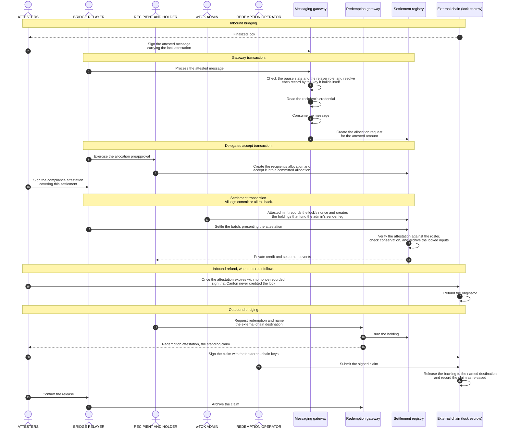

# Cross-Chain Stablecoin Payment Orchestration on Canton

This reference architecture defines the Canton side of a stablecoin bridge. An
attested lock on an external chain mints a wrapped instrument on Canton, and a
burn on Canton releases the backing on that chain. Each inbound credit lands as
a private, compliance-gated settlement, so no intermediary holds the asset in
transit.

## 1. Product Definition

Institutional holders accept value that reaches Canton from an external
chain. The value arrives as a **wrapped instrument**, written wTOK, that the
instrument's admin mints against an attested lock. The settlement amount, the
payer and payee identities, and the compliance markers project only to the
authorized parties.

The Canton contract that turns an attested lock into a settlement request is the
**messaging gateway**. It runs the checks that gate an inbound credit, and it is
the seam where a different bridge mode plugs in
([section 3.8](#38-extension-points)).

**Inbound** moves value from the external chain to Canton, by **lock-and-mint**.
**Outbound** moves it back, by **burn-and-release**.

> NOTE: This document calls the other chain the **external chain** in both directions.

The transfer must credit the recipient with the intended amount or with nothing.
On Canton, the
[CIP-0112](https://github.com/canton-foundation/cips/blob/main/cip-0112/cip-0112.md)
[committed allocation](https://github.com/canton-foundation/cips/blob/main/cip-0112/cip-0112.md#416-committed-allocations-for-prefunded-trading-and-iterated-settlement)
carries that property. An **allocation** records the authority one account gives
for one asset movement, and a committed allocation fixes that movement's amount
on-ledger. One all-or-nothing **settlement batch** settles the committed sides
together.

No transaction spans both chains. The cross-chain hop is therefore
lock-then-attested-mint, and not an atomic exchange. The binding checks
of [section 3.2](#32-reserve-and-lock-attestation) tie the inbound amount,
recipient, and instrument to the attestation.

`OpenZeppelin/canton-contracts` holds an
[experimental settlement implementation](https://github.com/OpenZeppelin/canton-contracts/tree/7696749737885e25cd88422847105f890f03b00d/experiments/token/tokenCIP112-v1/daml/OpenZeppelin/TokenCIP112V1).
Per-party projection is what makes it private. A counterparty sees only the legs
it sends or receives, so one recipient's payment is never visible to another.
The **instrument admin** of the settled instrument is the one deliberate
exception. It signs that instrument's holdings and allocations, so it sits
inside the trust boundary ([section 2.2](#22-privacy-and-visibility)).

**Privacy scope.** The guarantee covers the Canton side only. The
external-chain lock is a public transaction, and it must carry enough data to
route the transfer on Canton. An observer of the external chain can therefore
link a public lock of amount *N* to a named Canton recipient who will receive
*N*. Canton's per-party projection hides everything downstream: the settled
holding, the settlement events, the compliance markers, and every later private
transfer. Hiding the link itself (hashed commitments, shielded payloads, or
relayer-side blinding) is out of scope.

### 1.1 Institutional Controls

We use D1 through D4 as local shorthand for four institutional controls. They
are shared with the sibling reference architectures, and they are not Canton or
CIP-0112 requirements.

| ID | Control | Mechanism | Where enforced | Invariant |
|---|---|---|---|---|
| **D1** | Compliance | A single-use attestation from a registry-listed attester, bound to this settlement's own legs and never cached. | The settlement of the batch, against the attester set that the wTOK registry pins. | No valid attestation, no settlement. |
| **D2** | Seizure | Mark the allocation, then sweep its locked holdings to a preset custodian account. | The mark on the allocation, plus one of the two sweep paths ([section 3.6](#36-control-enforcement)). | The asset is never burned, seized funds never return to the sender through the seizure path, and the freeze window is bounded and releasable. |
| **D3** | KYC identity | The recipient holds an identity credential that attests a KYC check by an issuer on the trusted-issuer list. | The allocation request, before any allocation exists. | No valid credential from a listed issuer, no allocation request. |
| **D4** | Authority | Every privileged action binds to a named role rather than to one admin. | Each privileged action, against the role grant that carries the privilege. A two-step handover moves the grant. | Privileges are granted, transferred, and revoked without a redeploy. |

### 1.2 Scope

| Bridge scope | Out of scope |
|---|---|
| The Canton side of the bridge: attested mint, private settlement, and attested burn | The relayer backend, the attester services, the external-chain lock escrow, external oracles, external-chain validator sets, and light-client proofs |
| Settlement of wTOK, the wrapped instrument this design mints | The issuance, peg, and collateral mechanism of any stablecoin, and any asset that already has a native Canton rail |
| On-ledger compliance and identity checks that deny the action when the attestation or the credential is absent or invalid | Any gate that reads a stored compliance flag, a risk score, or a threshold |
| CIP-0112 allocations and settlement batches | The CIP-0056 token standard that CIP-0112 extends, and its allocation paths |
| One Canton synchronizer, with a cross-chain boundary outside it | Cross-synchronizer settlement and cross-synchronizer identity |
| One external chain behind the wrapped instrument | Backing one instrument from several external chains, and the per-chain reserve accounting and routing it needs |

### 1.3 Component Status

An experimental settlement package exists in `canton-contracts`. The
cross-chain boundary - the messaging gateway, the redemption gateway, the
lock-attestation message, and the attested mint - is unbuilt.

Every package below is experimental, apart from the vendored Token Standard V2
interfaces. Each one was a result of research for this proposal, so all will
require an additional analysis and a full audit.
The last column names only what this rail adds on top, so a cell that adds
nothing says nothing about how complete the component is.

| Component | Location | Remaining work |
|---|---|---|
| Settlement package: registry rules, allocations, holdings, and the event host | [`canton-contracts` `tokenCIP112-v1`](https://github.com/OpenZeppelin/canton-contracts/tree/7696749737885e25cd88422847105f890f03b00d/experiments/token/tokenCIP112-v1) | No new settlement behavior. The package's [admin mint](https://github.com/OpenZeppelin/canton-contracts/blob/7696749737885e25cd88422847105f890f03b00d/experiments/token/tokenCIP112-v1/daml/OpenZeppelin/TokenCIP112V1/Registry.daml#L149) consumes no attestation and can therefore issue unbacked supply, so the wTOK registry must not expose it ([section 3.2](#32-reserve-and-lock-attestation)) |
| Compliance attestation path (D1) | Same package, `D1.daml` | The verification of an N-of-M attester quorum ([section 2.3](#23-decentralization-and-trust-topology)) |
| Seizure path (D2): mark, sweep before the deadline, sweep after it, seizure capability, lawful-process order | Same package, `Allocation.daml` and `D1.daml` | The sweep for a holding that already settled, because the seizure capability only unlocks. Also a way to revoke or rotate a capability |
| Identity credential check (D3) | This workspace, [`experiments/identity/hook-shape-b`](../../experiments/identity/hook-shape-b/) | The action that runs the check, and the observer entries that let the checking party read the credential and the trusted-issuer list |
| Per-action role binding (D4) | Libraries in `canton-contracts` `experiments/access` | The wiring. The primitives exist, and this rail has to call them |
| Access control, ownership handover, and the pause state | `canton-contracts` `experiments/access` and `experiments/security` | No new access-control or ownership behavior. The pause state needs the observer entry that lets the gateway read it |
| Allocation preapproval and delegated accept | [Section 3.1](#31-inbound-credit) | The whole implementation. No upstream contract authorizes an allocation on the recipient's behalf ([section 6](#6-open-design-questions)) |
| Messaging gateway | [Section 3.1](#31-inbound-credit) | The whole implementation |
| Lock-attestation message and consumed-nonce registry | [Section 3.2](#32-reserve-and-lock-attestation) | The whole implementation |
| Attested mint | [Section 3.2](#32-reserve-and-lock-attestation) | The whole implementation |
| Redemption gateway and the burn it drives | [Section 3.3](#33-outbound-redemption) | The whole implementation |
| Contract keys on the pause state, the trusted-issuer list, the consumed-nonce registry, and the attester registry | [Section 3.4](#34-registry-uniqueness-under-non-unique-keys) | A key definition in each template, fixed before that template first deploys. The design targets Daml-LF 2.3 on Protocol Version 35 |
| Token Standard V2 interfaces | Splice `splice-api-token-*`, vendored as pinned DARs | Nothing. They are consumed by interface |
| Validation tooling | [`daml-lint`](https://github.com/OpenZeppelin/daml-lint), [`daml-props`](https://github.com/OpenZeppelin/daml-props), [`daml-verify`](https://github.com/OpenZeppelin/daml-verify) | The whole validation pipeline |

---

## 2. Architecture Overview

The wrapped instrument has one Token Standard V2 registry that creates and
settles its allocations. Institutional services supply the compliance
attestation and the identity credential.

### 2.1 Business Roles

Canton identifies an actor by a party. The external chain identifies it by an
address. Neither chain records that one address and one party are the same
actor, so no on-ledger check can validate the pairing. An operator that acts on
both chains holds both credentials, and configuration is what keeps them
aligned. The lock attestation therefore names the Canton recipient explicitly,
and the attester set carries the trust that the recipient is correct.

"The attesters sign" means two different things. Inbound, the attester party
signs on Canton, and the external chain never sees that signature. Outbound,
the escrow cannot read Canton, so each attester also holds an external-chain
key that the escrow's own verifier accepts.

| Role | Responsibility and visibility |
|---|---|
| Lock escrow | External-chain contract. It holds the backing and releases it against a verified redemption attestation. Any submitter can present that attestation ([section 3.3](#33-outbound-redemption)). |
| Bridge relayer | Settlement executor. CIP-0112 defines the executors as a set, and this design puts this one party in it. It signs the allocation request and holds the relayer role that the gateway checks. Its authority covers transport and liveness, so a relayer without an attestation cannot mint. It observes every allocation it assembles. |
| Relayer backend | Off-Canton process. It watches the external chain and submits every inbound command as the bridge relayer. |
| Attesters, M of them | The trust role, separate from the relayer's transport role. They sign the lock attestation, the compliance attestation, and the redemption attestation. The attester registry lists them, and they see the legs of the settlements they attest. |
| Attester services | M independent operators on M participants. Each submits as its own attester party. |
| wTOK admin | The instrument admin for wTOK. One party holds three surfaces, because the registry rules template carries a single admin field: it signs the wTOK registry, it is therefore the settlement factory admin for wTOK, and it signs that instrument's holdings and allocations. It authors the attested mint, so it sees every wTOK payment. It also maintains the attester registry and the consumed-nonce registry that the mint reads. |
| KYC issuers | They sign the identity credential that D3 checks, and they maintain its expiry and revocation. The trusted-issuer list names them. Each observes no settlement leg. |
| Trusted-issuer list admin | Sole signatory of the trusted-issuer list, and the party that decides which issuers it names. It issues no credential and observes no settlement leg. |
| Custodian | Holds the seizure capability and owns the preset sweep account. It sees nothing until a seizure. |
| Lawful-process authority | Signs the seizure order that a sweep past the settlement deadline requires. The attester registry lists it, and it is never the wTOK admin. |
| Recipient, or Holder outbound | Signs the receiving allocation, live or through an allocation preapproval it signed earlier. |
| Recipient wallet | Off-Canton process. It creates the allocation preapproval and submits as the recipient. |
| Pause authority | Signs the pause state and maintains its key. |
| Gateway admin | Sole signatory of the gateway, and the party that operates it. It submits nothing and holds the `FeaturedAppRight`. It reads the pause state, the trusted-issuer list, and each credential the gateway checks. |
| Redemption operator | Off-Canton process. It submits for holders that delegate to it, and it owns the retry of a stalled release ([section 3.3](#33-outbound-redemption)). |

The gateways and the registries are contracts, not services. The messaging
gateway has one action that the relayer exercises, and the redemption gateway
one that the holder authorizes. The pause state, the attester registry, the
trusted-issuer list, and the consumed-nonce registry resolve by key. Each key
names the party that maintains it, so only that party creates a version under
that key ([section 3.4](#34-registry-uniqueness-under-non-unique-keys)). The
lock attestation is a data record inside the attested message, so an attester
signs the message and not a standalone attestation.

### 2.2 Privacy and Visibility

Target visibility per record. Every record belongs to the wTOK registry
unless the row says otherwise. A party outside a row sees that record only
transiently, when a transaction it witnesses divulges it.

| Record | Signatories | Observers |
|---|---|---|
| Allocation request | The bridge relayer | The leg's authorizer |
| Allocation, and the factory call that creates it | The wTOK admin and the leg's authorizer | The bridge relayer |
| Event host, created and archived in one transaction | The wTOK admin | None |
| wTOK holding | The wTOK admin and the account's parties | The lock's observers, while locked |
| Compliance attestation | The attester | The bridge relayer the attestation is issued to |
| Attester registry | The wTOK admin | The listed attesters |
| Seizure order | The lawful-process authority | The wTOK admin and the Custodian |
| Identity credential | The KYC issuer that signs it | The subject and the gateway admin |
| Trusted-issuer list | The trusted-issuer list admin | The gateway admin |
| Pause state | The pause authority | The gateway admin |
| Attested message | The attester | The bridge relayer |
| Redemption attestation | The wTOK admin | The holder and the attester set |
| Messaging gateway | The gateway admin | None |
| Consumed-nonce registry | The wTOK admin | The attester set |

Consequences:

- **No recipient sees another recipient's legs.** Each allocation carries only
  the legs its own authorizer sends or receives. A batch of several inbound
  payments therefore discloses nothing to recipients of other payments.
- **The wTOK admin sees every wTOK payment.** A leg's metadata travels
  into the event stream, so amounts, accounts, and the leg metadata are readable
  by construction. This is a trust assumption and not a leak to close. An issuer
  that authors the mint leg cannot also be blind to it. Any issued instrument
  puts its own issuer in this position.
- **The relayer and the attesters see what they handle.** The relayer's
  transport-only role bounds its authority, not what it sees. Attester
  membership is therefore a privacy decision as well as a compliance one.
- **The Custodian sees nothing until a seizure.** The seizure mark carries the
  custodian destination as a data field and not as an observer entry.
- **A gate makes the party that runs it a stakeholder.** A fetch needs
  authorization from one stakeholder of the record it returns. The gateway
  action carries only its own admin authority, so the pause state, the
  trusted-issuer list, and every credential the gateway checks must name the
  gateway admin as an observer. The admin carries those entries, which keeps
  durable visibility off the relayer, whose set this design wants to
  open ([section 2.3](#23-decentralization-and-trust-topology)). A gate placed
  elsewhere moves the entries to the party that runs it
  ([section 6](#6-open-design-questions)). The submitting relayer still
  witnesses the credential transiently, because a fetch divulges to whoever
  witnesses the exercise.
- **Settlement outcomes arrive as events, not as a queryable record.** The event
  host is created and archived inside one transaction. The event data therefore
  lives in the exercise node its observers witness. Integrators read the
  transfer-events stream ([section 4.6](#46-off-ledger-reconciliation)) and not
  the active contract set. The durable evidence of a settled payment is the
  recipient's holding.
- **No personal data on the ledger.** A credential carries an issuer reference
  and not personal attributes. The data stays with the issuer off-ledger.

### 2.3 Decentralization and Trust Topology

A quorum written in Daml is worth its stated N only if N independent
participants must confirm it. That means N parties on disjoint participants
that separate organizations operate, or one party whose
[confirmation threshold](https://docs.canton.network/overview/reference/decentralization)
is at least N.
Also, a party above threshold 1 cannot submit for itself. It acts through
another party's submission, or through external signing.

The wTOK admin authors wTOK mint legs, and the Custodian can sweep locked
value. Both hold critical authority, so no single key may exercise either
role. Everything that decides whether wTOK supply is legitimate sits with the
wTOK admin by design: the mint, the attester roster that gates every settle, and
the consumed-nonce registry that bounds replay. Splitting those would create a
second key that can break the reserve without being able to mint, so the answer
to the concentration is the posture below and not a division of the records. Canton offers two routes to an N-of-M posture, and the choice between them
is open ([section 6](#6-open-design-questions)):

- **On-ledger approval workflow.** The multisig is written in Daml, as a
  [Multiple Party Agreement](https://docs.canton.network/appdev/modules/m3-design-patterns#multiple-party-agreement).
  The approvals are durable, named, and auditable on-ledger.
- **External party with threshold signing keys.** The role party's transactions
  require N of M keys held by independent organizations. The Daml code never
  sees this, and each action costs one ledger transaction. The
  [Bitsafe decentralization-manager](https://github.com/DLC-link/decentralization-manager)
  is one candidate implementation.

| Role | Target posture | Why |
|---|---|---|
| Attesters | Several independent parties in the attester registry, threshold N-of-M, never all-of-M | One unavailable or unvetted attester must not halt the rail, and one malicious attester must not mint |
| Bridge relayer | Multi-hosted on several participants, confirmation threshold 1 | It holds no minting trust and is the most submission-heavy role in the design. Integrity comes from the attester split, and relay should ultimately be permissionless, so no single party gates liveness |
| Pause authority | Multi-hosted, confirmation threshold 1 | A pause must be instant, and a quorum would slow it down. The price is a griefing window where a malicious pause authority stalls settlement until the deadlines lapse, capped by the sender's right to reclaim committed funds |
| KYC issuers | Several independent issuers on the trusted-issuer list | A recipient needs a credential from only one listed issuer, so no single issuer can block onboarding. The list is only as strict as its most permissive issuer, which makes the choice of whom to list a governance decision |
| Recipients | No rail-side decentralization | Nothing binds a recipient without its own signature, live or carried by an allocation preapproval, so it trusts only its own keys and participant |

The relayer is the only party on both sides of the cross-chain boundary. It pays
nearly all the traffic ([section 5.1](#51-traffic-costs)), and the rail halts
when its validator runs out of traffic
([section 4.4](#44-failure-modes-and-recovery)).

---

## 3. Target Design

Only the settle is atomic, and only on Canton. The inbound path is three
relayer-submitted transactions, orchestrated off-ledger by the relayer backend.
The attesters sign the attested message and the compliance attestation in
transactions of their own.

**Bridge lifecycle**

### 3.1 Inbound Credit

Four steps carry a finalized external-chain lock to a settled wTOK holding. The
attesters submit step 1, and the relayer submits the three that follow.

1. **Attested message.** The external chain finalizes a locked deposit. The
   attesters sign a message that carries the typed **lock attestation**: the
   locked amount, the Canton recipient, the target instrument, the nonce the
   external chain assigned to the lock, and an expiry. An N-of-M quorum aggregates onto that message
   ([section 2.3](#23-decentralization-and-trust-topology)).
2. **Request and identity gate.** The gateway consumes the message and creates
   a relayer-signed allocation request in one action. Every field of the mint
   leg binds to the lock attestation: the amount, the recipient, the instrument,
   and the recipient's receive side. Consumption archives the message, so that
   message cannot be replayed, and the mint records the lock's nonce when it
   credits ([section 3.2](#32-reserve-and-lock-attestation)). The identity check
   runs on-ledger in the same transaction and fails closed: the recipient must
   hold an unexpired credential from a listed issuer. That is D3. The settle
   later needs a separate compliance attestation.
3. **Recipient authorization.** An offline corporate treasury cannot sign
   interactively, so its wallet pre-establishes an **allocation preapproval**:
   a recipient-signed contract that authorizes creating the receiving
   allocation. wTOK defines that preapproval itself, because no upstream
   registry authorizes an allocation on the recipient's behalf: Canton Coin's
   transfer preapproval covers Canton Coin transfers only, and it approves a
   transfer rather than an allocation. The preapproval's shape is open
   ([section 6](#6-open-design-questions)). The relayer exercises the
   preapproval through a **delegated accept** that contributes the
   recipient's authority. That one submission creates the recipient's committed
   allocation and consumes the request, so the payment leaves no residue.
4. **Settlement.** The relayer submits the committed allocations as one
   settlement batch. What settles is a single transfer leg: the wTOK admin
   sends the attested amount out of the holdings the attested mint created
   ([section 3.2](#32-reserve-and-lock-attestation)), and the recipient receives
   it. There is no counter-leg on Canton, so all-or-nothing binds the payments
   that ride one batch together and adds nothing within a single payment. What
   fixes one payment at the intended amount or nothing is the committed
   allocation of step 3. Events are scoped per authorizer, so a recipient in a
   multi-leg batch sees its own legs and no one else's.

**Rejected alternative: lock-and-unlock.** It pays the recipient from liquidity
held on the destination side, which adds a liquidity-provider role and an
inventory-imbalance surface that a reference rail does not need. The messaging
gateway is the seam where another mode plugs in.

**Settlement over a direct mint.** A direct attested mint into the recipient's
account would credit it just as well. Settling reuses controls the rail needs
anyway:

- **conservation**, the settle's per-instrument check that input allocations
  cover every sender-side amount, makes the recipient's leg payable only from
  locked holdings, so supply changes at the attested mint and never at the
  settle ([section 3.2](#32-reserve-and-lock-attestation));
- the receiving allocation carries the recipient's own signature, so nothing
  credits an unwilling recipient
  ([section 4.1](#41-ledger-enforced-properties));
- D1 sits on the settle entrypoint, and the D2 mark and sweep sit on the
  allocation ([section 3.6](#36-control-enforcement));
- per-authorizer projection lets unrelated payments share one batch and one
  confirmation round-trip ([section 2.2](#22-privacy-and-visibility));
- a credit that never settles is reclaimable after the deadline
  ([section 4.4](#44-failure-modes-and-recovery)).

**Standard-owned actions.** Steps 3 and 4 call CIP-0112 interface actions, and
not actions this design owns. Allocation creation, request acceptance, and batch
settlement are declared upstream. So are the cancel and withdraw paths that
[section 4.4](#44-failure-modes-and-recovery) relies on. The wTOK registry
supplies the implementation behind each one. Registry-specific arguments travel
in the standard's own extension slot. The compliance attestation and the
wTOK registry's own per-batch authorization both reach the settlement factory
that way. That is what makes the conservation check and the D1 gate unavoidable
rather than conventional. A settle that omits the attestation fails instead of
passing ungated. Settlement returns a result per allocation and no receipt
record, so integrators read the event stream
([section 4.6](#46-off-ledger-reconciliation)).

**Delivery and retry.** Nothing guarantees that the Canton settlement of an
attested lock executes. Delivery liveness is bounded by the trusted relayer and
attester set, and this design adds no automatic cross-chain recovery protocol.
A message that re-drives a credit from the external chain would need
multi-round message passing, with its own delay, cost, and failure surface. What
remains is structural and fail-closed. Command deduplication over 24 hours makes
the three relayer commands safe to resubmit after a crash, and a stall blocks
only this rail ([section 4.5](#45-throughput-and-contention)). [Section
4.4](#44-failure-modes-and-recovery) maps each failure to its recovery path. A
timeout that refunds the external-chain lock is the escrow's own path, and the
escrow is out of scope ([section 1.2](#12-scope)). The condition that gates that
refund belongs here, because it decides whether one lock pays out twice.

**Refund exclusivity.** A refund on the external chain must never pay out a lock
that Canton already credited, and no credit may follow a refund. Two rules
together give that, and each covers one of the two orderings.

- The lock attestation carries an expiry, and the mint rejects an expired
  attestation ([section 3.2](#32-reserve-and-lock-attestation)). After that
  expiry no credit can happen, so no mint overtakes a refund. The settlement
  deadline therefore sits inside the attestation's validity
  ([section 3.5](#35-time-and-deadlines)).
- The escrow refunds only against a signed statement from an attester quorum
  that Canton never credited the lock. The consumed-nonce registry is the record
  that statement reads, and the attesters observe it
  ([section 3.2](#32-reserve-and-lock-attestation)). A quorum signs only after
  the attestation expires, because before then the answer can still change. The
  escrow already verifies attester signatures for a redemption release
  ([section 2.1](#21-business-roles)), so a refund reuses that verifier.

### 3.2 Reserve and Lock Attestation

The inbound flow of [section 3.1](#31-inbound-credit) settles a payment
privately. This section binds that mint to the backing locked on the external
chain. That binding makes the rail a bridge.

**Attested claim.** The lock attestation asserts that backing is locked on the
external chain, and that the backing is claimable only by a mint of the matching
amount on Canton. The lock and the asset live outside Canton, so nothing on
Canton can validate either claim. That is the trust the attester set carries.

**Signatures and mint checks.** A threshold N-of-M attester set signs the lock
attestation ([section 2.3](#23-decentralization-and-trust-topology)), and the
check runs on-ledger against the attester registry. That split keeps the trust
role away from the relayer's transport role. The mint binds amount, recipient,
and instrument to the attestation, and it requires the attestation to be
registry-trusted, unexpired, and to carry an unconsumed nonce. A failed check
fails the batch: no mint, and no partial credit.

**Nonce enforcement.** The consumed-nonce registry makes the lock, and not the
message, the unit of one-time use. It is a record, signed by the wTOK admin, of
the nonce of every lock that credited Canton. Its key scopes it to one
instrument ([section 3.4](#34-registry-uniqueness-under-non-unique-keys)), and
the rail serves one external chain ([section 1.2](#12-scope)), so the record
holds nonces alone. The mint writes the nonce in the same transaction that
credits the recipient, and it rejects a nonce the registry already holds. The
recorded set only grows: each version carries every nonce of the version it
replaces, so a lock that credited stays recorded.

The external chain assigns the nonce, either as the escrow's own sequence number
or as the id of the lock transaction. Every attester then reads the same value
off the same lock, which is what lets a quorum sign one message
([section 2.3](#23-decentralization-and-trust-topology)).

The registry therefore records credits. A flow that stalls or lapses leaves the
lock creditable, so an honest retry proceeds under a fresh attestation, and the
refund path of [section 3.1](#31-inbound-credit) reads the registry as the
answer to whether Canton credited a lock. The attester set observes the
registry, so the parties who must not re-attest a credited lock read that state
directly. They also read it before they attest, which stops most duplicates
before they reach Canton. The mint's own check is what protects the reserve, so
an attester that cannot reach the registry still signs.

Without that record, one lock of *N* units can credit Canton twice and leave
2*N* of wrapped supply against *N* of backing. Message consumption does not
prevent it, because archiving the message makes the message single-use and not
the lock: a second message for the same lock still carries a valid amount,
recipient, instrument, and attester signature. An attester service that
re-observes a finalized lock after a restart produces such a message, and so
does a relayer that asks for a fresh attestation for a lock it already minted.
The mint reads the consumed-nonce registry on-ledger, so the check holds even
when the whole attester quorum signs that second message.

**Reserve invariant.** Each lock attestation states the amount that the source
chain holds against it. Minted wrapped supply never exceeds the total of those
amounts, across the attestations that are valid and not yet redeemed. A mint
increments the claimed reserve, and a redemption decrements it. One escrow
holds the backing, so a burn is payable whenever the invariant holds.

**Supply creation.** Settlement funds the recipient's leg from a sender's locked
holdings, so the exposure to unbacked issuance is the creation of those
holdings, and not the settle. Supply is created in one place: the attested mint,
co-authorized by the wTOK admin. It is the only holding creation that no
archived input funds. It re-runs the checks above, and it creates the holdings
that fund the admin's sender side. The mint is a funded transfer leg, and not a
create that sits beside the settled legs, so the minted amount passes the same
per-instrument conservation check as every other leg.

A wTOK registry that exposes no unattested mint bounds who can mint: no relayer,
attester, or operator mints without an attestation. It does not reach the
wTOK admin, which signs every wTOK holding and can therefore create one
directly. No registry rules template closes that path. The residual exposure
is the admin key, and its mitigation is the N-of-M posture of
[section 2.3](#23-decentralization-and-trust-topology).

The registry's own burn is admin-plus-account-controlled, so it takes the
holder's consent and cannot expropriate, but a burn outside the redemption
path reduces supply without producing an attestation. The escrow's reserve
would then be higher than the supply it backs.

### 3.3 Outbound Redemption

Redemption mirrors the inbound flow. The holder burns the wrapped holding on
Canton, an attester signs the result, and the escrow releases the backing on the
external chain.

1. **Burn on Canton.** The holder asks for redemption and names the
   external-chain destination. The burn destroys the wrapped holding and
   produces a typed **redemption attestation** that carries three fields:

   - the instrument the burn removed supply from;
   - the lock attestations the burn draws against, and the amount taken from
     each;
   - the bound on the standing external-chain claim.

   All three are needed, because the reserve arithmetic has nothing else
   on-ledger to bind to. The attestation also binds the destination the holder
   named, so the escrow releases only to an address the holder signed for.

   The **redemption gateway** carries that request, as the outbound counterpart
   of the messaging gateway. It initiates the redemption and owns the resulting
   external-chain claim, while the token registry owns the burn itself. The
   gateway stays on Canton: it burns the holding through the registry's ordinary
   admin-plus-account-controlled burn and creates the attestation in the same
   transaction, so every burn leaves a claim and no claim stands without a burn.
   Carrying the claim to the external chain is the attester's and the
   submitter's work in steps 2 and 3. The wTOK admin signs the redemption
   gateway, which is where the burn's admin authority comes from, and the
   holder whose asset the burn destroys co-authorizes the action.

   The redemption path and the D2 seizure path stay separate. A
   user-initiated redemption never runs on the seizure capability, which is the
   Custodian's credential and only unlocks.
2. **Attest.** A registry-trusted attester signs the redemption attestation
   through the same attester registry path.
3. **Release on the external chain.** Any submitter presents the signed
   attestation to the escrow. The escrow releases the amount to the
   external-chain destination and decrements the reserve. The burn draws down
   named lock attestations, so a partial burn cannot make the attested total
   drift from the actual supply.

**Cross-chain atomicity.** The external-chain release does not sit in the same
Daml transaction as the Canton burn, so the order is burn first and attested
release second. The Canton burn is the irreversible commit, and the signed
attestation gates the release. That order assumes an external chain where any
submitter can claim the release, against escrow state that the escrow committed
before the burn.

Under that assumption, a stalled release is safe. The burn stays final, the
reserve accounting stays sound, and the redemption becomes a standing claim that
nobody can replay. The escrow records each claim it releases, so replay
protection for the outbound direction sits there, as the consumed-nonce registry
sits on Canton for the inbound one. The redemption operator owns the retry, and
the claim is permissionless, so the holder or any relayer can resubmit it until
the escrow releases. A stalled release therefore costs time. It never causes a
double-spend or unbacked supply.

The claim contract stands on Canton until the relayer archives it, under the
authority of an attester quorum that confirms the escrow released it. That
archive is bookkeeping and not a control, because the escrow refuses a second
release either way. Attesters carry the confirmation because only they observe
the external chain, and the relayer submits it because it carries transport and
pays traffic ([section 2.1](#21-business-roles)).

**Chains that cannot gate the payout.** Some chains cannot make the payout
conditional on the attestation. On a UTXO chain without contracts, the release
is a plain threshold-signed transaction, so the payout exists only if the signer
quorum produces it. A quorum that stalls or refuses then looks the same as a
loss, and under burn-first the redeemer holds neither asset. A permissioned
release on a chain with contracts fails the same way, because the holder cannot
submit the claim itself.

The sound ordering there is burn-last. Lock the wrapped holding, authorize
on-ledger against the pinned input and output sets of the payout, sign,
broadcast, confirm the payout, and burn last. The reserve invariant then has to
allow for the in-flight window, because the backing is spent while the wrapped
holding still exists. Without that allowance, 1:1 monitoring reads an honest
redemption as under-collateralized.

Burn-last is a different trust model, and not a variant of the ordering above.
It needs an attested claim that the payout confirmed, and it needs the unlock
path and the burn path to exclude each other. This design does not cover it. A
bridge to a chain that cannot gate the payout must not inherit the burn-first
claim.

### 3.4 Registry Uniqueness Under Non-Unique Keys

The pause state, the trusted-issuer list, the consumed-nonce registry, and the
attester registry all resolve by key. A
[Canton 3.x key](https://docs.canton.network/appdev/modules/m3-contract-keys)
does not enforce uniqueness, so two contracts can share one key, and a submitter
that holds both decides which one a lookup returns. A nonce registry that lacks
an entry lets a lock that already credited credit again. A trusted-issuer list
that is wider passes an identity check that the narrower one refuses. An
attester registry with one extra member passes a settle that the real roster
refuses.

**Decision.** Every key carries the party that maintains it, together with every
field that scopes the record it names. A consumer, meaning the mint, the
gateway, or any other contract that resolves a record at execution time, builds
the key itself: the party comes from the consumer's own configuration, and the
instrument comes from the attested message. The caller supplies no part of the
key.

Uniqueness then rests on authority. A key's maintainer signs the contract, so
that party alone creates a version under that key. A consumer that builds the
key from the party it trusts resolves only that party's records, because another
party's key names another party.

The consumed-nonce registry is the record where this decides who can inflate
supply, so the wTOK admin maintains it.

**Key shape.** Each key holds its maintainer and the scope of the record.

| Record | Key | Maintainer |
|---|---|---|
| Consumed-nonce registry | The admin, and the instrument | wTOK admin |
| Attester registry | The admin | wTOK admin |
| Trusted-issuer list | The admin, and the instrument | Trusted-issuer list admin |
| Pause state | The admin, and the instrument | Pause authority |

An upgrade can neither add nor remove a key field, so each key carries every
scope field the rail can ever need ([section 3.7](#37-upgrade-path)).

**Rotation.** A new version of a record arrives through an action on the live
one, which archives that version in the same transaction. A replaced version
cannot be resolved afterwards, because a lookup returns live contracts only.

A consumer resolves by key, so it must be a stakeholder of every record it reads
([section 2.2](#22-privacy-and-visibility)). The gateway admin carries an
observer entry on the pause state and the trusted-issuer list. The attester
registry and the consumed-nonce registry need no entry for the mint, because the
wTOK admin maintains both and every settle already carries that authority.
The attester set keeps its observer entry on the consumed-nonce registry for its
own reads.

**Residual.** Nothing stops a maintainer from holding two live versions of a
registry under one key and presenting a different one to different
transactions. The observers on each record make the duplicate visible, and they
rely on the maintaining party's own key custody to keep the bridge honest
([section 2.3](#23-decentralization-and-trust-topology)).

### 3.5 Time and Deadlines

CIP-0112 defines the deadline fields and no values. The settlement deadline stops
a settle and makes a committed allocation withdrawable, and a registry-set
expiry handles hygiene. Enforcement sits in each token registry, so with a
third-party token the policy is that registry's. Canton Coin, for one, caps an
allocation lifetime at 90 days.

The wTOK registry's own ceilings bind before any policy this design sets:
a maximum allocation lifetime, which rejects a longer deadline outright instead
of truncating it; a maximum attestation validity, which stops an attester issuing
a permanent pass; and a maximum seizure extension, which bounds how far past the
settlement deadline a D2 window may reach. Their values are open
([section 6](#6-open-design-questions)).

Each flow derives its own deadline. The floor is the slowest required actor's
service level. The ceiling is the tightest of the allocation-lifetime ceiling,
the staleness tolerance, and the capital-lock tolerance. Ledger-time tolerance
makes
sub-minute deadlines meaningless. The prepared-transaction window bounds each
submission and not the allocation, so a multi-day settlement deadline still lets
every submission be signed inside its own window.

| Flow | Slowest actor | Window | Rationale |
|---|---|---|---|
| Inbound settle | Automated attester plus relayer | Settlement deadline, minutes to an hour | Not price-sensitive. A lapse credits nothing and leaves the lock creditable, so the cost is latency. The deadline exceeds the attester and relayer service levels, and sits inside the attestation's validity |
| Outbound redemption | Attester | Settlement deadline, hours | The burn comes first, and the external-chain claim is standing and replay-protected, so a slow release costs latency and not funds |
| Compliance attestation | Attester | The attestation's own expiry, capped by the registry's maximum attestation validity | It is verified at settle, so the window must span gateway processing through settle. The cap stops an attester issuing a permanent pass |

### 3.6 Control Enforcement

[Section 1.1](#11-institutional-controls) states the four controls. This section
states the authority each enforcement needs, and where each one can fail.

**D1.** Every settlement requires a single-use attestation that covers that
settlement and comes from a registry-listed attester. The settle resolves the
roster by a key it builds itself, from the admin party the wTOK registry
carries, so no caller input decides which roster the attestation is checked
against
([section 3.4](#34-registry-uniqueness-under-non-unique-keys)). The check sits
on the only path that reaches a settlement, so a settle that omits the
attestation fails. The attester registry's admin must be the wTOK admin,
so one party governs both the roster and the wTOK registry.

The wTOK registry carries the admin party it trusts for the roster, and it
carries it from creation. A registry created without that party verifies
nothing, and every settle then passes with no attestation
([section 4.3](#43-threat-model)).

**D2.** Seizure is a strict lock-and-sweep. A mark locks the allocation, and a
sweep moves the locked holdings to the preset custodian account. The same sweep
reaches a holding that already settled. The settlement deadline separates two
sweep paths:

- **Inside the deadline.** The admin's mark plus the Custodian's capability.
- **Past the deadline.** The same authority, plus a seizure order that names the
  case and the account it sweeps. A non-admin party that the attester registry
  lists signs that order.

Either sweep must land inside the seizure window. The deadline is the split
because it is where the owner's right to reclaim starts
([section 4.4](#44-failure-modes-and-recovery)), and overriding that right needs
authority outside the operator set.

The mark is bounded and reversible. It refuses a window past the maximum seizure
extension, the admin can lift it, and any stakeholder can release it once it
lapses, so an abandoned mark cannot strand funds.

D2 never burns the asset, and a sweep lands only at the preset custodian
account. Returning swept value is a custodian action outside D2, and revoking a
capability means the admin archives it. The authority for each is open
([section 6](#6-open-design-questions)).

**D3.** The gate binds the credential's subject to the recipient that the lock
attestation names, so a relayer cannot route a credit to an account that holds
no credential.

The check runs under the authority of the party that runs it, and that party has
to be a stakeholder of the credential and of the trusted-issuer list
([section 2.2](#22-privacy-and-visibility)). The default places the check in the
gateway transaction, so both records name the gateway admin as an observer.
Another placement moves those entries ([section 6](#6-open-design-questions)).

The check binds at request time, and no later action re-reads the credential, so
a revocation or an expiry before the settle still credits the recipient. The
exposure is one settlement deadline. A second read at the settle would close
that window, at the cost of making a settlement-side party an observer of every
credential. [Section 2.2](#22-privacy-and-visibility) keeps that durable
visibility off the relayer set, and the settled holding would stay ungated
either way.

D3 is an entry condition and not a transfer restriction. A settled wTOK holding
moves over the standard's own transfer path, and no credential gates that move.
Value already credited is D2's surface.

**D4.** No single admin holds every privilege. Each action sits with the role
responsible for it: relay with the relayer role grant, mint-leg authoring with
the wTOK admin, seizure with the Custodian's capability witness, and
the trusted-issuer list with its own admin. A permission whose holder never
changes sits on the contract itself. A permission that must move or be revoked
sits on a separate role grant, so a change of holder recreates no contract.

### 3.7 Upgrade Path

The design extends through additive Smart Contract Upgrade: an existing action
keeps its fields and its meaning, and a new capability arrives as a new action or
as an appended optional argument. The keyed registries of
[section 3.4](#34-registry-uniqueness-under-non-unique-keys) cannot take that
path at all, because an upgrade can neither add nor remove a key definition, so
every one of them must carry its final key definition in the package that first
deploys it.

### 3.8 Extension Points

- The messaging gateway and the redemption gateway are the substitution points
  for the bridge boundary, inbound and outbound. Another bridge mode, or a
  different external-chain proof scheme, changes the two gateways and leaves the
  token, settlement, and compliance untouched.
- The identity check, with its credential and its trusted-issuer list, is the
  substitution point for a richer identity regime.

---

## 4. Security and Auditability

Security rests on Daml's authorization model and on per-party projection.
This section separates what the ledger enforces from what stays trusted.

### 4.1 Ledger-Enforced Properties

| Property | Enforcement |
|---|---|
| Conservation of funds | Settlement cannot output more value than its input allocations. Every settle path archives the locked inputs and asserts, per instrument, that they cover the authorizer's sender-side amounts. Any surplus returns as one change holding. |
| 1:1 reserve backing | Minted wrapped supply never exceeds the total amount locked against the valid, unredeemed lock attestations. The wTOK registry exposes no unattested admin mint, so no relayer, attester, or operator mints without an attestation. The wTOK admin signs every holding and can create one directly, so this row binds every party except that admin ([section 3.2](#32-reserve-and-lock-attestation)). |
| Replay protection | One external-chain lock can credit Canton at most once. The mint records the lock's nonce in the transaction that credits the recipient, and it refuses a nonce the registry already holds. It holds provided the registry the mint resolves is the one the wTOK admin maintains ([section 3.4](#34-registry-uniqueness-under-non-unique-keys)). |
| Privacy partitioning | The amount, payer, and the metadata of a settled leg project only to that leg's counterparties, the executing relayer, the attester whose attestation gates the settle, and the wTOK admin. No KYC issuer observes a settlement leg. |
| Non-custodial recipient binding | No allocation binds a recipient without its signature, live or carried by an allocation preapproval. Committed value is recoverable once the settlement deadline passes, and no allocation can be created without a deadline. |

### 4.2 Trust Boundaries

| Trusted party or system | Required behavior and consequence |
|---|---|
| Attester set | Attests only a finalized lock, with the true amount, recipient, and instrument, and never re-attests a lock that credited. It signs a refund statement only after an attestation expires with no credit recorded ([section 3.1](#31-inbound-credit)). A quorum that attests a lock which does not exist mints unbacked supply, and one that signs a refund for a credited lock releases backing that live supply still stands on. This is the largest trust surface in the design. |
| Bridge relayer | Submits every attested message, and submits it once. It cannot change the amount or the recipient, so a faulty relayer delays a credit rather than misdirecting it. |
| wTOK admin | Authors a mint leg only against a valid attestation, and keeps one live version of the attester registry and of the nonce registry it maintains. A compromised key can issue unbacked supply; the multisig design mitigates this. |
| Custodian and lawful-process authority | Sweep only under a bounded mark and, past the settlement deadline, only under a lawful-process order. A colluding pair can move locked value to the preset account inside the deadline window. |
| KYC issuers | Bind a credential to the recipient and maintain expiry and revocation. The trusted-issuer list is only as strict as its most permissive issuer. |
| Pause authority | Sets the pause state for an incident, and not to grief. A malicious pause authority stalls inbound settlement until the deadlines lapse, and the senders then reclaim. |
| Gateway admin | Operates the gateway and reads the records its own checks depend on. Its authority covers the gateway transaction, so a faulty gateway admin delays inbound credits and leaves a credited lock closed. |
| Lock escrow | Holds the backing, releases only against a verified redemption attestation, and refunds only against a verified statement that Canton never credited the lock. A broken escrow strands a redemption, and the Canton burn is already final. |
| Canton infrastructure | Keeps the required parties hosted, the packages vetted, and transactions confirmable inside each deadline ([section 4.3](#43-threat-model)). |

### 4.3 Threat Model

| Vector | Attack | Mitigation |
|---|---|---|
| Malicious relayer routing | Routes valid inbound funds to an unauthorized or sanctioned account. | The signed lock attestation pins the Canton recipient, and D3 requires a credential whose subject matches it. The relayer cannot spoof the destination. |
| Unbacked mint | A relayer, or anyone without attester authorization, mints wTOK with no real external-chain lock. | The wTOK admin co-authorizes every mint, so a relayer cannot mint at all. Two sources of unbacked supply remain: an attester quorum that signs a lock which never happened, and the admin key, which signs every holding of its own instrument and can create one directly. |
| Replay of a used lock | A consumed message, or a second message for the same lock, is submitted again to mint twice. | One-time message consumption, and then the consumed-nonce registry that the mint writes as it credits. A nonce the registry already holds is rejected even if the attesters misbehave. |
| Shadowing registry duplicate | Two versions of one keyed record are live under the same key, and the submitter presents whichever suits it. The record may be a nonce registry, a trusted-issuer list, or an attester registry. | A key names the party that maintains it, so no other party creates a second version, and a rotation archives the version it replaces. |
| Refund of a credited lock | The escrow refunds a lock whose credit already settled on Canton, so the same value stands on both chains. | The mint refuses an expired attestation, and the escrow refunds only against an attester statement that no credit was recorded. A deadline on its own does not authorize a refund ([section 3.1](#31-inbound-credit)). |
| Toxic or spam inflow | A sender forces a settlement onto an unwilling recipient. | No allocation commits without the recipient's approval ([section 4.1](#41-ledger-enforced-properties)), and an unsettled allocation expires and returns to sender. An offline recipient gives that approval in advance, so the bound is the preapproval's own: its instrument, its ceiling, its expiry, and the party it names. The recipient signs the preapproval, so it can archive it at any time ([section 6](#6-open-design-questions)). |
| Unattributable inbound origin | A deposit arrives over a privacy pool or a shielded-provenance path, so no sender can be attributed to it. | Nothing mints without an attestation, so an unresolved origin means the attesters withhold the signature, the deposit stays locked on the external chain, and a refund is the escrow's own path ([section 4.4](#44-failure-modes-and-recovery)). The origin resolution is a precondition on issuing one attestation, and not a stored flag, a score, or a threshold ([section 1.2](#12-scope)). |
| Compromised admin key | A compromised wTOK admin or Custodian key attempts arbitrary expropriation. | A sweep is hardcoded to the preset custodian destination, and a sweep past the settlement deadline needs an order the admin cannot sign. An in-flight seizure inside the deadline needs no such order, so that window is the residual exposure. Supply-changing authority is mitigated by N-of-M multisig. |
| D1 deployed unset | The wTOK registry is created with no trusted roster admin, so every settle passes with no attestation. | The settlement package cannot catch this, because an unset party is a silent no-op. The wTOK deployment has to set that party and assert it before the rail accepts a settle. |
| Upgrade breaks in-flight allocations | An upgrade of a deployed rail changes how its live contracts are interpreted, so an allocation created under the previous version can no longer settle. | Programmatic adherence to the upgrade rule: optional appends and new actions only. Each deployed action stays operable, and a pending settlement concludes before its parties move to the new version. |
| Package unvetting | A participant that hosts a stakeholder party unvets the rail's package, which blocks every action on the contracts that party is a stakeholder of. | Unvetting freezes contracts rather than freeing them. The holder cannot move the asset either, and the locked value stays sweepable once re-vetted. If one attester unvets the package, the remaining attesters still reach the threshold. Holder-side unvetting is an inherent Canton vetting property with no protocol-level bypass. |

### 4.4 Failure Modes and Recovery

Beyond the adversarial vectors sit liveness failures: parties that crash, stall,
or never appear, and the infrastructure they depend on.

One invariant governs them - **bounded custody.**
Every locked holding has a unilateral, time-bounded exit for its owner that does
not depend on the workflow contract surviving.

| Failure | Effect while pending | Recovery path | Funds locked at most |
|---|---|---|---|
| The attester never signs the message | Nothing on Canton | The escrow refunds the originator. No attestation exists, so no credit can follow the refund ([section 3.1](#31-inbound-credit)) | Nothing on Canton |
| The attestation expires with no credit | Nothing on Canton | The attester quorum signs the refund statement, and the escrow refunds the originator ([section 3.1](#31-inbound-credit)) | Nothing on Canton |
| The relayer crashes before the gateway transaction | Nothing consumed | Any relayer resubmits, because the message is standing | Nothing |
| The relayer crashes after the gateway transaction | The message is consumed, and the settlement is pending | Complete the allocation and settle on restart. If the deadline lapses, nothing credits, and the lock stays creditable under a fresh attestation | Settlement deadline |
| A second message reaches the settle for a lock that already credited | A committed allocation stands against a lock with no backing left to claim | The mint refuses the recorded nonce, and the allocation is withdrawn or expires. The attesters' own read of the registry rejects most duplicates earlier ([section 3.2](#32-reserve-and-lock-attestation)) | Settlement deadline |
| The attestation expires before the settle | The settle is blocked | Re-attest within the window, or let the deadline lapse and withdraw | Settlement deadline |
| The recipient has no allocation preapproval | The delegated accept fails, and nothing is locked | The recipient establishes the preapproval, and the relayer retries | Nothing |
| The pause state is set during an in-flight settlement | The settle is blocked by the pause state | Clear the pause state, or let the deadline lapse and withdraw ([section 2.3](#23-decentralization-and-trust-topology)) | Settlement deadline |
| The relayer validator runs out of traffic | The rail halts, because every inbound submission is relayer-paid | Top up the traffic, and monitor it ([section 5.1](#51-traffic-costs)) | Settlement deadline |
| Synchronizer outage | The ledger is halted, so no one can settle and no one can withdraw | Service resumes. An allocation whose deadline lapsed during the outage is withdraw-only | Outage duration plus settlement deadline |
| Marked for seizure, never swept | The settle, the withdraw, and the cancel are all blocked | The admin lifts the mark, or any stakeholder releases it once the window lapses | Seizure window end, itself capped by the maximum seizure extension |

The sole custody exception is an active D2 seizure, which has a finite window
and a lawful-process reference.

### 4.5 Throughput and Contention

The consumed-nonce registry serializes every inbound mint of the rail, because
each record archives and recreates that one contract. Its key scopes it to one
instrument ([section 3.4](#34-registry-uniqueness-under-non-unique-keys)), so
the rail has one shard, and that shard is the throughput ceiling. Splitting an
instrument's nonces across shards needs a discriminator in the key, which no
upgrade adds later. Independent rails settle in parallel, and several
allocations can be part of a single settlement batch.

### 4.6 Off-Ledger Reconciliation

The Token Standard V2 transfer-events API reports each change to a holding. The
recipient matches an event to the id of the attested message that caused it, so
one external lock or burn maps to one Canton credit. The API is upstream and not
vendored here, and this match is a reference pattern, not a rule the rail
enforces.

---

## 5. Network Economics: Traffic Costs and App Rewards

Different parties pay for the rail and earn from it. Both follow from where the
design puts submission and signing.

### 5.1 Traffic Costs

Cost scales with the serialized byte size of each sequenced message, plus a
per-recipient delivery surcharge
([traffic accounting](https://docs.canton.network/overview/reference/tokenomics-of-gs)).
The projection choices of this design are therefore its cost model.

- An inbound payment is roughly three relayer-submitted transactions, plus the
  attester's message and attestation and the issuer's mint-leg funding. The
  settle is the heaviest. It projects the batch outputs to the recipient, the
  relayer, and the wTOK admin, and verifies the attestation and the
  registry on the way.
- The bridge relayer pays for nearly everything. Its own purchases mint validator
  reward coupons to its validator operator, which is a partial rebate.
- A failed transaction burns traffic and earns no reward, because [CIP-0104](https://github.com/canton-foundation/cips/blob/main/cip-0104/cip-0104.md)
  credits only a successful confirmation request. The loser of two concurrent
  inbound mints retries and pays twice. A message for a lock that already
  credited fails at the settle, the heaviest transaction of the three, which is
  what the attesters' read of the nonce registry keeps it away from
  ([section 3.2](#32-reserve-and-lock-attestation)).
- Several allocations can ride one settlement batch, which shares one
  confirmation round-trip and one set of views.
- Validator auto-top-up is off by default, and the validator's reserved-traffic
  floor protects its own automation rather than this app. Running the rail
  requires configured top-up plus balance monitoring on the relayer's validator.

### 5.2 App Rewards

This rail earns through traffic-based app rewards
([CIP-0104](https://github.com/canton-foundation/cips/blob/main/cip-0104/cip-0104.md)).
The super validators must vote them on first, so the rail earns nothing before
that vote.

The gateway admin holds the `FeaturedAppRight`. Rewards accrue to
the parties that confirm a successful request, and not to the one that submits
it. CIP-0104 records no per-transaction beneficiary, so the holder assigns
beneficiaries on-ledger per reward round, before it mints. An external party,
whether the holder or a beneficiary, needs an active minting delegation to mint
its share ([section 2.3](#23-decentralization-and-trust-topology)).

Two tensions follow, both specific to this design. First, a `FeaturedAppRight`
names one provider party, which sits poorly with permissionless relay
([section 2.3](#23-decentralization-and-trust-topology)). The relay set either
shares one party, or leaves most relayers unrewarded. Second, the earn rule pays
signers and not submitters. The relayer signs only the allocation request, while
the wTOK admin signs the instructions, the allocations, and the holdings.
Most of the credit for relayer-funded transactions therefore goes to the
wTOK admin if it is featured, and to nobody if only the relayer is.

This document defines no fee model, so the reward is the only income. Network
issuance parameters that the super validators set decide how much of the traffic
cost it returns, and a round below the reward minimum returns nothing. The rail
therefore needs a fee or an operator subsidy.

---

## 6. Open Design Questions

Each question below is a decision to settle before implementation starts, and
not a build task. The **design default** is what the architecture above assumes.
**Blocks** names what cannot be built or deployed until the question is
answered, and **severity** is how much of the design the answer moves. The
internal team owns every question, and the super validators own the app-reward
activation vote.

| Question | Design default | Blocks | Severity |
|---|---|---|---|
| **Attester set and quorum shape.** The attesters carry the trust that an external-chain lock is real. Open: the set size M, the threshold N, and who admits or removes a member. Open too: whether the quorum check reads one combined attestation or M separate ones. | An N-of-M quorum signs the message, with M, N, and the admission path unset ([section 2.3](#23-decentralization-and-trust-topology)) | The quorum check, and any production attester set | **High**, the largest trust surface in the design |
| **Shape of the allocation preapproval.** CIP-0112 makes the recipient sign an allocation for the leg it receives, and an offline recipient cannot sign it live. No upstream contract supplies that signature, because Canton Coin's transfer preapproval approves a transfer and covers Canton Coin only. Open: the preapproval's shape. It stands in for a per-payment signature, so it has to bound what it authorizes: the instrument, an amount ceiling, an expiry, and the party that may exercise it. | The recipient signs the preapproval, and the relayer exercises it through a delegated accept ([section 3.1](#31-inbound-credit)) | The whole inbound path, because no credit commits without the recipient's signature | **High**, every inbound settlement rests on it |
| **Multisig for the wTOK admin and the Custodian.** The admin can mint supply, and the Custodian can sweep locked value. Open: whether each role uses the on-ledger approval workflow or an external party with threshold signing keys. The N, M, and confirmation threshold per role are open too. | A single key holds each role | Party onboarding for both roles | **High**, one stolen key is enough under the default |
| **Closing the admin mint and the direct burn.** The shared registry rules template ships a mint that needs no attestation, so the wTOK registry must not expose that path, and it must expose no burn outside the redemption path either. Open: whether wTOK gets its own registry rules template, or the shared template gains an attestation gate on the mint and routes the burn. An upgrade cannot drop an action, so the answer has to land before the first deployment. | wTOK gets its own registry rules template, without the admin mint and with the burn reachable only from the redemption gateway ([section 3.2](#32-reserve-and-lock-attestation)) | The registry rules template that wTOK deploys, and with it the reserve invariant | **High**, the 1:1 backing claim rests on it |
| **Registry key shapes and rotation.** A key cannot change after the template that carries it first deploys. Open: the exact key fields of each record, the rotation procedure that keeps one live version under each key, and whether a nonce registry key carries a shard discriminator. | Each key carries its maintainer and the scope of the record, and a rotation archives the version it replaces ([section 3.4](#34-registry-uniqueness-under-non-unique-keys)) | The keys themselves, because no upgrade changes them | **High**, replay protection, the identity gate, and the D1 roster all rest on them |
| **Where the D1 and D3 checks sit.** Each control must fail at the step that [section 1.1](#11-institutional-controls) states, and both a registry-side and an application-side check can meet that. Open: whether the wTOK registry carries the compliance check and the identity check, or the bridge application carries them. The answer decides which party needs the observer entries that D3 reads ([section 2.2](#22-privacy-and-visibility)). | The settle entrypoint carries D1, and the gateway transaction carries D3 ([section 3.6](#36-control-enforcement)) | The D3 observer entries, and which action carries the D1 gate | Medium |
| **Capability revoke and rotate.** The seizure capability names one holder and cannot move to another. Open: whether revoke and rotate arrive as new actions on one capability contract, or a registry of capabilities holds them. | The admin archives a capability to revoke it, and no action rotates a holder ([section 3.6](#36-control-enforcement)) | Any deployment where a capability holder can change | Medium |
| **Restitution after a sweep.** A sweep leaves the value in the Custodian's account, and no action returns it. Open: whether the return gets its own action, tied to the case reference and to the account the sweep emptied. Open too: whether that action needs the non-admin authority that a past-deadline sweep needs. | The Custodian moves the funds like any other holding, and nothing ties the return to the case ([section 3.6](#36-control-enforcement)) | The Custodian's runbook, and the audit trail for a returned seizure | Medium, an unbound return can land in any account and proves nothing |
| **Deadline values.** Section 3.5 names the ceilings and sets no values. Open: the allocation lifetime, the attestation validity, the seizure extension, the margin between external-chain finality and Canton ledger time, the attester turnaround, and how long an attester waits past an expired attestation before it signs a refund statement. | The registry stamps its ceilings at creation ([section 3.5](#35-time-and-deadlines)) | Every deployment, because those ceilings are stamped once | Medium |
| **Reclaim after an expired inbound flow.** An inbound allocation becomes withdrawable when the settlement deadline lapses, and no component of this design withdraws it. Open: who runs that reclaim, because an automated handler needs the authority of the executor or of the leg's authorizer. | The allocation becomes withdrawable after the deadline, with no automated handler | The reclaim automation and its authority model | Medium |
| **Who holds the featured app right.** CIP-0104 pays the parties that confirm a request, and the gateway admin confirms only the gateway transaction. Open: whether the right sits with the gateway admin, the wTOK admin, or the relay set. Open too: how the holder points each round's rewards at the parties that paid the traffic. | The gateway admin holds the right, and the rail earns nothing until the vote passes ([section 5.2](#52-app-rewards)) | Who earns each round, and no code | Low, an attribution choice and not a mechanism |

**Composability with the other reference architectures** needs no new mechanism.
A recipient that holds an instrument settled here can supply a
[DEX](./dex.md) pool, or collateralize a [lending](./lending.md) vault, over the
shared settlement entrypoint
([section 3.8](#38-extension-points)).
