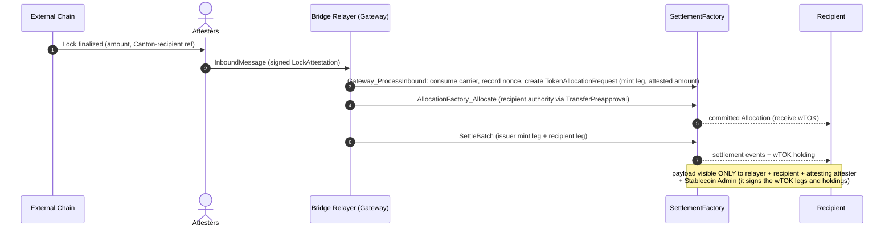

# Architectural Overview Report: Cross-Chain Stablecoin Payment Orchestration on Canton

This document describes a *reference design* for private, atomic settlement on Canton of stablecoin payments originating on external blockchains, grounded in the OpenZeppelin Canton components from this workspace, as well as the Canton Network Token Standard V2.

Instrument and token names are written in backticks in running prose (`wTOK`, `USDCx`, `USDC`, `Amulet`); mermaid labels and Daml comments leave them bare, because backticks render literally there.

Source-grounding tags used throughout: `[EXPERIMENT]` real experimental code, either in this workspace or in `OpenZeppelin/canton-contracts` `experiments/`, with the owning repository named where the item is introduced, `[EVIDENCE]` real code in the [`OpenZeppelin/canton-token-template`](https://github.com/OpenZeppelin/canton-token-template) evidence repository but not the M1 surface, `[UPSTREAM]` Splice / CIP / external-ecosystem reference, including the CIP-0112 interface choices whose argument records the standard fixes ([section 3](#the-upstream-choice-surface-upstream)), `[FUTURE]` proposed RI-level design, not built in M1 scope, `[GAP]` a required change to code that already exists, and therefore a blocker for the claim it sits under rather than something a later milestone adds.

## 1. Product Definition

This report specifies a cross-chain stablecoin payment orchestration design for the Canton Network. Institutional participants accept an inbound asset representation, either an already-native Canton stablecoin such as `USDCx` or a gateway-minted wrapped instrument (written **`wTOK`** throughout), while the settlement amount, payer and payee identities, and compliance markers stay projected only to explicitly authorized parties.

Most of the payment path is planned, external, or evidenced elsewhere rather than present in this
workspace. [Status at a glance](#status-at-a-glance) states that once, per component; the inline
tags then mark each item at its first mention in a section rather than at every mention. The
out-of-scope table below carries no tags, because its rows describe what the design excludes and
therefore ground no claim. [Section 7](#7-open-design-questions) collects the open questions.

For such a payment rail to work, the inbound credit must settle atomically: the recipient is credited exactly the attested amount or nothing at all, and no intermediary holds the assets along the way. Therefore the settlement architecture centers on [CIP-0112 - Canton Network Token Standard V2](https://github.com/canton-foundation/cips/blob/main/cip-0112/cip-0112.md), specifically its support for [atomic settlement](https://github.com/canton-foundation/cips/blob/main/cip-0112/cip-0112.md#416-committed-allocations-for-prefunded-trading-and-iterated-settlement). The core building block is the **atomic delivery-versus-payment (DvP) settlement**: committed allocations are settled in one all-or-nothing transaction, with each leg's amount fixed on-ledger by the allocation sides their authorizers signed. A signed side is what makes the amount non-repudiable, not what makes it *correct*: tying the inbound amount, recipient, and instrument to the attesters' `LockAttestation` `[FUTURE]` is the job of the explicit binding checks in [section 3](#3-target-design), without which a signed side is only the submitter's own declaration.

The `OpenZeppelin/canton-contracts` repository contains an [experimental implementation of atomic settlement](https://github.com/OpenZeppelin/canton-contracts/tree/7696749737885e25cd88422847105f890f03b00d/experiments/token/tokenCIP112-v1/daml/OpenZeppelin/TokenCIP112V1). It brings **privacy through per-party projection** `[EXPERIMENT]`: a *counterparty* sees only the legs on which they are the sender or receiver, so one recipient's payment is never visible to another. The issuing admin of the settled instrument is the deliberate exception: it signs that instrument's holdings and allocations, so it sits *inside* the trust boundary rather than outside it (see [Privacy and Visibility Model](#privacy-and-visibility-model)).

Four capability gates sit on top of that settlement. D1 and D2 come from the same implementation, D3 from this workspace, and D4 from the access-control library. Each is stated once here and detailed in [section 3](#capability-gates-d1-d4):

| Gate | Mechanism | Where enforced | Tag | Invariant |
|---|---|---|---|---|
| **D1** Compliance | a single-use attestation from a registry-listed attester, bound to this settlement's own legs and never cached | [`SettlementFactory_SettleBatch`](https://github.com/OpenZeppelin/canton-contracts/blob/7696749737885e25cd88422847105f890f03b00d/experiments/token/tokenCIP112-v1/daml/OpenZeppelin/TokenCIP112V1/Registry.daml#L79), against the [`TrustedAttesterRegistry`](https://github.com/OpenZeppelin/canton-contracts/blob/7696749737885e25cd88422847105f890f03b00d/experiments/token/tokenCIP112-v1/daml/OpenZeppelin/TokenCIP112V1/D1.daml#L22) pinned on `TokenRules` | `[EXPERIMENT]` (`canton-contracts`) | no valid attestation, no credit - and no gate at all until the deployment sets the registry cid |
| **D2** Seizure | mark the allocation, then sweep its locked holdings to a preset custodian account | [`TokenAllocation_MarkD2Seizure`](https://github.com/OpenZeppelin/canton-contracts/blob/7696749737885e25cd88422847105f890f03b00d/experiments/token/tokenCIP112-v1/daml/OpenZeppelin/TokenCIP112V1/Allocation.daml#L158) plus one of two sweep choices; past the settlement deadline only under an attester-signed [`SeizureOrder`](https://github.com/OpenZeppelin/canton-contracts/blob/7696749737885e25cd88422847105f890f03b00d/experiments/token/tokenCIP112-v1/daml/OpenZeppelin/TokenCIP112V1/D1.daml#L121) | `[EXPERIMENT]` (`canton-contracts`) | never burns the asset to nothing, never returns seized funds to the sender, and the freeze window is bounded and releasable |
| **D3** Identity | the recipient holds a `KycClaim` from an issuer listed in the `TrustedIssuerRegistry` | the gateway, at request time, before any allocation exists | templates `[EXPERIMENT]` (this workspace, ShapeB); the enforcing choice `[FUTURE]` | no valid claim from a listed issuer, no allocation request |
| **D4** Authority | every privileged action binds to a named role rather than to one admin | [`openzeppelin-access-control-v1`](https://github.com/OpenZeppelin/canton-contracts/tree/cec416d6e3c2118551c761d5598c403ab27ee342/experiments/access/access-control-v1) role administration and `openzeppelin-ownable-v1` two-step handover | `[FUTURE]` | privileges are granted, transferred, and revoked without redeploying, and each traces to a role |

**Privacy scope (explicit non-goal).** The privacy guarantee covers the **Canton side only**. The source-chain lock is a public transaction on its own chain, and it necessarily encodes enough routing data (e.g. a Canton-recipient reference) for the attesters to produce the `LockAttestation`. An external observer who reads the source chain can therefore link a public lock of amount *N* to the fact that some identified Canton recipient will be credited *N*. What Canton's per-party projection hides is everything downstream: the settled holding, the settlement events, compliance markers, and all subsequent private transfers. Decoupling or hiding the source-chain linkage itself (hashed commitments, shielded payloads, relayer-side blinding) is out of scope for this RI.

### Operational Scope and Boundaries

The reference implementation favors **simplicity and modular extensibility**. Through the tables below, we highlight what we consider in versus out-of-scope.

| Feature Category | In-Scope Architectural Components |
|---|---|
| Atomic Settlement | Private on-Canton settlement of inbound stablecoin payments via [`SettlementFactory_SettleBatch`](https://github.com/OpenZeppelin/canton-contracts/blob/7696749737885e25cd88422847105f890f03b00d/experiments/token/tokenCIP112-v1/daml/OpenZeppelin/TokenCIP112V1/Registry.daml#L79) `[UPSTREAM]` (atomic DvP). |
| Cross-Chain Bridge `[FUTURE]` | An inbound/outbound bridge **interface** (the Standardized Messaging Gateway) as a **bounded, verifiable mock**: attested inbound mint ([section 3](#3-target-design)) and attested outbound redemption. |
| Compliance & Control `[EXPERIMENT]` | D1: a settlement does not execute unless an attester has signalled compliance. D2: a privileged party can block settlement and sweep allocation funds to a preset custodian account. D3: single-synchronizer identity. |
| Asset Representation `[FUTURE]` | The gateway-minted wrapped instrument (`wTOK`), compliant with the CIP-0112 Token Standard V2 holding interfaces, and the integration **shape** for settling an existing native Canton stablecoin (e.g. `USDCx`) by interface. |
| Component Integration | Direct reuse of `openzeppelin-access-control-v1`, `openzeppelin-ownable-v1`, `openzeppelin-pausable-v1` (all `[EXPERIMENT]` in `canton-contracts` `experiments/`, and none of the three is a released package yet), the CIP-0112 settlement spine, as well as patterns from the [`OpenZeppelin/canton-token-template`](https://github.com/OpenZeppelin/canton-token-template) and [`OpenZeppelin/canton-stablecoin`](https://github.com/OpenZeppelin/canton-stablecoin) codebases. |

| Feature Category | Out-of-Scope Architectural Components |
|---|---|
| Production Bridge Infrastructure | Production bridge/relayer services, external oracle infrastructure, validator networks, and cryptographic light-client proofs. |
| Stablecoin Mechanism | The stablecoin issuance / peg / CDP mechanism itself; `USDCx` issuance and its native rail are external. |
| Cross-Domain Identity | Cross-domain identity resolution (ONCHAINID / ERC-3643 / Chainlink CCID); deferred, kept SCU-forward-compatible only. |
| Off-Ledger Compliance Shortcuts | Off-ledger caching of compliance status, probabilistic risk scoring, heuristic filtering. |
| Legacy Standards | Any reliance on the superseded CIP-56 token standard or legacy V1 allocation paths. The RI integrates strictly with V2 abstractions. |
| Cross-Synchronizer Operation | This RI is *cross-chain* (external chains to and from Canton via the gateway) but single-synchronizer on Canton. Cross-synchronizer settlement and identity have not been fully considered, so they are **out of scope**. The design for M1 is single-synchronizer. |

Narrowing scope to the standardized interface boundary means a production gateway can be swapped in later without modifying the settlement spine or the compliance logic.

### Instrument Naming: `wTOK` vs `USDCx` `[UPSTREAM]`

All flows in this report mint, settle, and redeem a **generic gateway-minted wrapped instrument, `wTOK`**, whose issuing admin is this RI's Stablecoin Admin. **`USDCx` is not that instrument**: it is already issued on Canton through Circle's own first-party rail, [xReserve](https://www.circle.com/blog/usdcx-on-canton-now-available-via-circle-xreserve) - `USDC` deposited into the xReserve contract on Ethereum is held there and `USDCx` is minted 1:1 on Canton, i.e. **lock-and-mint** in the taxonomy below, with Circle as the issuing authority. (Circle Gateway and CCTP sit *beside* that rail to keep `USDCx` interoperable with native `USDC` on other chains; CCTP is burn-and-mint and is not the `USDCx` mint path.) Routing `USDCx` through this gateway would therefore re-bridge an already-bridged asset, adding trust surface. Where a native rail exists, the RI simply *settles* the native mint output by interface (no RI-side issuer role); the gateway is the reference rail only for assets that **lack** a native Canton path. The general native-rail-vs-gateway rule is an open question ([section 7](#7-open-design-questions)).

### Target Ecosystem Participants

- **Regulated Financial Institutions and Corporate Treasuries** can accept inbound liquidity from public networks without exposing internal treasury flows, payment detail, or counterparty relationships to competitors or on-chain analytics.
- **Bridge and Gateway Builders** can swap a production messaging integration in behind the standardized interface boundary, reusing the settlement and compliance layers unchanged.
- **Wallet and Client Integrators** can validate delegated-accept inbound flows (a standing `TransferPreapproval` supplying an offline treasury's co-authorization) against a working reference.
- **Security and Assurance Auditors** can evaluate the reserve invariant, explicit authority boundaries, and the **proposed** validation workflow (`daml-lint → daml-props → daml-verify`).

### Educational Framing: How to Think About Building This on Canton

On public EVM networks, a bridge mints tokens into a globally visible state ledger any observer can trace. Canton operates on a privacy-preserving, **per-party projection** model enforced by the Canton protocol: a Canton contract is an instance of a template, signed and authorized by a set of parties (signatories), and visible only to its signatories and observers.

The inbound message from the gateway therefore does **not** mint-and-broadcast an asset in one global update. Instead the gateway drives an isolated, recipient-targeted allocation on the spine. State changes by archive-and-recreate rather than in-place mutation, and the atomic DvP archives the inbound request, credits the recipient's holding, and emits its holdings-change events through [`TransferEventsV2.EventLog`](https://github.com/OpenZeppelin/canton-contracts/blob/7696749737885e25cd88422847105f890f03b00d/experiments/token/tokenCIP112-v1/daml/OpenZeppelin/TokenCIP112V1/Base.daml#L80) to the recipient, the relayer, and the issuing admin that signs the instrument. Cross-chain settlement thereby inherits Canton's data compartmentalization.

Because a recipient's signature (or a standing delegation of it) is required to bind them to an allocation, **two-step handshakes (Daml's propose-and-accept pattern) are a necessity, not a style choice**. The design uses **contract keys** `[GAP]` (reintroduced in [Canton 3.5](https://github.com/digital-asset/canton/releases/tag/v3.5.1)) so the `PauseState`, the trusted-issuer registry, and the consumed-nonce registry keep a stable lookup handle across those archive-and-recreate cycles. A key is a handle, not a uniqueness constraint: Canton 3.x lets several active contracts share one key, so uniqueness is the rail's job rather than the engine's ([Registry Uniqueness Under Non-Unique Keys](#registry-uniqueness-under-non-unique-keys-gap)). The trusted-attester registry is the deliberate exception: its contract id is pinned on the settlement registry itself (`requiredAttesterRegistryCid`), so nothing is resolved and no caller names it (diagram A, [section 3](#3-target-design)).

Contract keys are the design target, not what runs today, and adopting them touches five things:

- **SDK.** The `[EXPERIMENT]` experiment code sits on the workspace's pinned 3.4.11 baseline, which has no key support at all, so each choice instead takes a caller-supplied registry contract id and asserts that registry shares the factory's admin.
- **Daml-LF and protocol version.** Keys are available from Daml-LF 2.3 onwards, which itself is available from Protocol Version 35, and their use requires `HASHING_SCHEME_VERSION_V3` - relevant here because [section 2](#decentralization-and-trust-topology) proposes externally signed submissions for the value-critical roles. Adopting keys is therefore a synchronizer protocol-version migration that every participant on the rail must complete, not a package-level change.
- **LF alignment with the vendored dependencies.** This workspace targets LF 2.1 because the vendored Splice V2 API DARs do, and `tokenCIP112-v1` pins `--target=2.1` for the same reason: the upstream splice packages target 2.1 even on newer SDKs. Moving the OpenZeppelin package to 2.3 puts it on a different LF from every package it depends on. Depending downwards is generally permitted, but it is a compatibility question to answer rather than assume. That same build-options comment says no stable LF compiles keys, which holds for the 3.4.11 baseline it was written against; confirm it against whichever SDK the RI selects.
- **Templates.** No template in this workspace declares a `key` today, so the by-key resolution shown below is a template change, not only an SDK migration.
- **Migration.** Adding a key to an existing template is not an SCU-legal change. The [Canton 3.5.1 release notes](https://github.com/digital-asset/canton/releases/tag/v3.5.1) `[UPSTREAM]` forbid adding or removing a key definition in a later version of a template, and package vetting enforces it, so the failure lands at package upload on a real participant rather than at compile time. Of the three templates named above only `ConsumedNonceRegistry` can be born keyed. `PauseState` is released code, pinned here as `dars/vendor/openzeppelin-pausable-v1-0.1.0.dar`, and `TrustedIssuerRegistry` is a live experimental template; keying either one means a new template in a new package lineage plus migration of every active contract, which is a fresh deploy rather than an upgrade.

Because a key's maintainers must be signatories of the keyed contract, each key is fixed by that contract's own authority rather than by the rail `admin`: [`PauseState`](https://github.com/OpenZeppelin/canton-contracts/blob/cec416d6e3c2118551c761d5598c403ab27ee342/experiments/security/pausable-v1/daml/OpenZeppelin/PausableV1.daml#L47) `[EXPERIMENT]` is `signatory pauser` and carries no `admin` field, so its key is `pauser`, and ShapeB's [`TrustedIssuerRegistry`](../../experiments/identity/hook-shape-b/daml/OpenZeppelin/Experimental/Identity/ShapeB.daml#L74) `[EXPERIMENT]` is `signatory registryAdmin`, so its key is `registryAdmin`. The snippets and diagrams below use those maintainers.

### Registry Uniqueness Under Non-Unique Keys `[GAP]`

A Canton 3.x key is a lookup handle, and the rail supplies the uniqueness itself. The [contract-keys reference](https://docs.canton.network/appdev/modules/m3-contract-keys) `[UPSTREAM]` states three properties the design must absorb:

- several active contracts of one template may share a key, and `DA.ContractKeys` ships `lookupNByKey` and `lookupAllByKey` for exactly that case;
- negative lookups are not validated, so no check may rest on the *absence* of a key;
- where duplicates exist, `fetchByKey` resolution order is not guaranteed, and the submitter can steer it, because disclosed contracts are prioritized over known contracts during command submission.

Only the maintainer can create a duplicate, but creating one is an ordinary rotation mistake: a migration that creates the successor before it archives the predecessor leaves both active. From that point the Bridge Relayer, which builds every inbound submission and holds no minting trust ([section 2](#decentralization-and-trust-topology)), picks which registry the gateway sees by disclosing it. A `ConsumedNonceRegistry` that lacks a given `(sourceChainId, nonce)` lets an already-minted lock mint a second time, and a `TrustedIssuerRegistry` with a wider `trustedIssuers` list passes a D3 check that the narrower one refuses.

The RI therefore anchors every keyed registry to an on-ledger successor chain. Each version pins the genesis contract id and consumes its predecessor, so a consumer resolves by key and then checks the anchor it pinned once. A planted parallel registry fails against that anchor rather than against operator vigilance.

```daml
-- [FUTURE] Uniqueness comes from the chain, not from the key.
template ConsumedNonceRegistry
  with
    admin : Party
    genesis : ContractId ConsumedNonceRegistry                 -- self at genesis; pinned by every consumer
    predecessor : Optional (ContractId ConsumedNonceRegistry)  -- None only at genesis
    consumed : [Text]
  where
    signatory admin
    key admin : Party        -- convenience lookup only; carries no uniqueness
    maintainer key
```

Two constraints follow. `lookupByKey` requires authorization from **all** maintainers of the key, which bounds where such a lookup can be written at all. And the trusted-attester registry stays outside this scheme: it is pinned by contract id on the settlement registry, which is the same anchoring idea without the key ([D1](#capability-gates-d1-d4)).

### Status at a Glance

What exists, where, and what an implementer still has to build. Six of the thirteen components below are `[FUTURE]`, and the design's whole cross-chain boundary is among them. The `[GAP]` marks are the shorter and sharper list: four changes to code that already exists, without which the claims above them do not hold. That is stated here rather than reconstructed from the inline tags.

| Component | Tag | Location | What is missing |
|---|---|---|---|
| CIP-0112 settlement spine (`TokenRules`, `TokenAllocation`, `TokenHolding`, event log) | `[EXPERIMENT]` | [`canton-contracts` `tokenCIP112-v1`](https://github.com/OpenZeppelin/canton-contracts/tree/7696749737885e25cd88422847105f890f03b00d/experiments/token/tokenCIP112-v1) | nothing for settlement itself; the `wTOK` registry must still close `TokenRules_Mint` `[GAP]` |
| D1 attestation path (`TrustedAttesterRegistry`, `ComplianceAttestation`) | `[EXPERIMENT]` | same package, `D1.daml` | the N-of-M quorum choice `[GAP]`; and the registry cid must be set at deployment, or D1 verifies nothing |
| D2 seizure path (mark, two sweeps, `BurnerCapability`, `SeizureOrder`) | `[EXPERIMENT]` | same package, `Allocation.daml` and `D1.daml` | the settled-holding forced sweep `[GAP]`, and capability revocation or rotation |
| D3 identity hook (`KycClaim`, `TrustedIssuerRegistry`) | `[EXPERIMENT]` | this workspace, [`experiments/identity/hook-shape-b`](../../experiments/identity/hook-shape-b/) | the choice that enforces the check on the inbound path |
| D4 per-action role binding | `[FUTURE]` | libraries in `canton-contracts` `experiments/access` | the wiring; the role and ownership primitives exist, this rail does not use them yet |
| Access control, ownership handover, pausing | `[EXPERIMENT]` | `canton-contracts` `experiments/access` and `experiments/security` | nothing; composed as-is |
| Holdings and standing `TransferPreapproval` | `[EVIDENCE]` | [`canton-token-template`](https://github.com/OpenZeppelin/canton-token-template) | the spine-aware delegated allocate-and-accept choice |
| Standardized Messaging Gateway | `[FUTURE]` | [section 4.1](#41-component-standardized-messaging-gateway-bounded-mock-future) | all of it; no code exists in any repository |
| `LockAttestation` carrier and `ConsumedNonceRegistry` | `[FUTURE]` | [section 3](#reserve-and-lock-attestation-model-future) | all of it, plus the successor-chain anchoring that keys do not provide |
| `wTOK` attested mint and redemption burn | `[FUTURE]` | [section 3](#reserve-and-lock-attestation-model-future) | all of it, including closing the spine's ungated admin mint |
| Contract keys on `PauseState` and the issuer registry | `[GAP]` | [section 1](#registry-uniqueness-under-non-unique-keys-gap) | SDK support, Daml-LF 2.3 on Protocol Version 35, and a deploy-and-migrate path per template |
| Token Standard V2 interfaces | `[UPSTREAM]` | Splice `splice-api-token-*`, vendored as pinned DARs | nothing; consumed by interface |
| `daml-lint`, `daml-props`, `daml-verify` | `[FUTURE]` | [section 5.2](#52-automated-validation-engine-future) | the whole validation pipeline for this rail |

---

## 2. Architecture Overview

The architecture is assembled from reused OpenZeppelin Daml primitives (role management, two-step ownership handover, pausing), the CIP-0112 settlement spine as the engine for all asset movement, and a bounded gateway mock at the cross-chain boundary. This section maps each component to its library, then defines the party/role topology and the trust configuration.

### Core Components and Library Mapping

| Component Suite | Applied Templates and Libraries | Architectural Function |
|---|---|---|
| Access Control `[EXPERIMENT]` (`canton-contracts`) | `openzeppelin-access-control-v1`: [`RoleGrant`](https://github.com/OpenZeppelin/canton-contracts/blob/cec416d6e3c2118551c761d5598c403ab27ee342/experiments/access/access-control-v1/daml/OpenZeppelin/AccessControlV1.daml#L58), [`RoleAdmin`](https://github.com/OpenZeppelin/canton-contracts/blob/cec416d6e3c2118551c761d5598c403ab27ee342/experiments/access/access-control-v1/daml/OpenZeppelin/AccessControlV1.daml#L116), [`DefaultAdminTransferOffer`](https://github.com/OpenZeppelin/canton-contracts/blob/cec416d6e3c2118551c761d5598c403ab27ee342/experiments/access/access-control-v1/daml/OpenZeppelin/AccessControlV1.daml#L237), [`requireRole`](https://github.com/OpenZeppelin/canton-contracts/blob/cec416d6e3c2118551c761d5598c403ab27ee342/experiments/access/access-control-v1/daml/OpenZeppelin/AccessControlV1.daml#L287) | Role-based permissioning. Gates the bridge relayer and custodian roles; D4 authority. |
| Ownership Lifecycle `[EXPERIMENT]` (`canton-contracts`) | `openzeppelin-ownable-v1`: [`Ownership`](https://github.com/OpenZeppelin/canton-contracts/blob/cec416d6e3c2118551c761d5598c403ab27ee342/experiments/access/ownable-v1/daml/OpenZeppelin/OwnableV1.daml#L41), [`OwnershipOffer`](https://github.com/OpenZeppelin/canton-contracts/blob/cec416d6e3c2118551c761d5598c403ab27ee342/experiments/access/ownable-v1/daml/OpenZeppelin/OwnableV1.daml#L82) | Provides support for D4: secure two-step handover of gateway and factory administration. |
| Emergency Stop `[EXPERIMENT]` (`canton-contracts`) | `openzeppelin-pausable-v1`: [`PauseState`](https://github.com/OpenZeppelin/canton-contracts/blob/cec416d6e3c2118551c761d5598c403ab27ee342/experiments/security/pausable-v1/daml/OpenZeppelin/PausableV1.daml#L47), [`whenNotPaused`](https://github.com/OpenZeppelin/canton-contracts/blob/cec416d6e3c2118551c761d5598c403ab27ee342/experiments/security/pausable-v1/daml/OpenZeppelin/PausableV1.daml#L77) | Emergency circuit breaker. `whenNotPaused` halts inbound processing during anomalies. |
| Settlement Spine `[EXPERIMENT]` (`canton-contracts`) | `OpenZeppelin.TokenCIP112V1`: [`TokenRules`](https://github.com/OpenZeppelin/canton-contracts/blob/7696749737885e25cd88422847105f890f03b00d/experiments/token/tokenCIP112-v1/daml/OpenZeppelin/TokenCIP112V1/Registry.daml#L28), [`TokenAllocationRequest`](https://github.com/OpenZeppelin/canton-contracts/blob/7696749737885e25cd88422847105f890f03b00d/experiments/token/tokenCIP112-v1/daml/OpenZeppelin/TokenCIP112V1/AllocationRequest.daml#L18), [`AllocationFactory_Allocate`](https://github.com/OpenZeppelin/canton-contracts/blob/7696749737885e25cd88422847105f890f03b00d/experiments/token/tokenCIP112-v1/daml/OpenZeppelin/TokenCIP112V1/Registry.daml#L280), [`TokenAllocation`](https://github.com/OpenZeppelin/canton-contracts/blob/7696749737885e25cd88422847105f890f03b00d/experiments/token/tokenCIP112-v1/daml/OpenZeppelin/TokenCIP112V1/Allocation.daml#L67), [`TokenEventLog`](https://github.com/OpenZeppelin/canton-contracts/blob/7696749737885e25cd88422847105f890f03b00d/experiments/token/tokenCIP112-v1/daml/OpenZeppelin/TokenCIP112V1/Base.daml#L75), [`TokenHolding`](https://github.com/OpenZeppelin/canton-contracts/blob/7696749737885e25cd88422847105f890f03b00d/experiments/token/tokenCIP112-v1/daml/OpenZeppelin/TokenCIP112V1/Holding.daml#L17), [`BurnerCapability`](https://github.com/OpenZeppelin/canton-contracts/blob/7696749737885e25cd88422847105f890f03b00d/experiments/token/tokenCIP112-v1/daml/OpenZeppelin/TokenCIP112V1/Allocation.daml#L52), [`SeizureOrder`](https://github.com/OpenZeppelin/canton-contracts/blob/7696749737885e25cd88422847105f890f03b00d/experiments/token/tokenCIP112-v1/daml/OpenZeppelin/TokenCIP112V1/D1.daml#L121) | Core engine for all asset movement. `TokenHolding` is the toy unit of value, and can be replaced by real assets implementing the TSv2 holding interface. |
| Identity Verification `[EXPERIMENT]` (this workspace) | `ShapeB`: [`KycClaim`](../../experiments/identity/hook-shape-b/daml/OpenZeppelin/Experimental/Identity/ShapeB.daml#L43), [`TrustedIssuerRegistry`](../../experiments/identity/hook-shape-b/daml/OpenZeppelin/Experimental/Identity/ShapeB.daml#L74) | Provides support for D3: a recipient must hold a `KycClaim` issued by a trusted party to receive a compliance-gated inflow. |
| Holdings & Preapproval `[EVIDENCE]` | `OpenZeppelin/canton-token-template` (`SimpleToken.*`): `SimpleHolding`, `SimpleTokenRules`, `LockedSimpleHolding`, `TransferPreapproval` | Asset representation and the recipient-signed standing-delegation pattern. The spine-aware delegated-accept choice the RI uses is a `[FUTURE]` extension ([section 4.2](#42-component-inbound-dvp-via-delegated-accept-future)); the evidence template ships only `TransferPreapproval_Send`. |
| Messaging Gateway `[FUTURE]` | `StandardizedMessagingGateway` (bounded mock, [section 4.1](#41-component-standardized-messaging-gateway-bounded-mock-future)) | Cross-chain boundary: consumes attester-signed inbound messages and drives the spine. To be swapped for the production OpenZeppelin Contracts-Library gateway. |

As external dependencies, the reference implementation will integrate with the Splice Token Standard V2 interfaces `[UPSTREAM]` to ensure maximum interoperability. The spine's factory choices are those interfaces, so their argument records belong to the CIP and neither the registry nor a caller may extend them ([section 3](#the-upstream-choice-surface-upstream)). `USDCx` is consumed via interface only as a *settled* instrument; its issuance, peg, and cross-chain rail are external to this architecture ([section 1](#1-product-definition)).

### Party and Role Model Topology

Duties are segregated and mapped to discrete Daml parties, with in-code role names carried by `roleId` wrappers (e.g. `BRIDGE_RELAYER_ROLE`):

- **Bridge Relayer (`BRIDGE_RELAYER`)** - monitors the external chain, operates the gateway, submits inbound messages for consumption, and acts as settlement executor. A transport and liveness role only: a relayer with no attester authorization cannot mint.
- **Attesters** - independent parties listed in the `TrustedAttesterRegistry`. They sign the `LockAttestation` that authorizes an inbound mint, the per-settlement compliance attestation (D1), and the redemption attestation on the outbound path. The trust role, deliberately separated from the relayer's transport role.
- **Compliance Verifier (`COMPLIANCE_VERIFIER`)** - maintains the `TrustedIssuerRegistry` and issues the `KycClaim` used for D3 identity gating.
- **Custodian (`CUSTODIAN`)** - holds the seizure credential for D2 lock-and-sweep and owns the preset account that receives swept funds under mandate.
- **Stablecoin Admin (`STABLECOIN_ADMIN`)** - issuing admin of the gateway-minted wrapped instrument (`wTOK`); authors the mint leg of an inbound settlement. It has **no** authority over an externally-issued instrument like `USDCx`: in the settled-native case there is no RI-side issuer role.
- **Recipient** - the treasury or end-user receiving funds. May pre-establish a `TransferPreapproval` to accept compliance-gated inflows without a live signature.

Because Canton settles on per-party projection, the settlement is fractured into bilateral requests: the bridge relayer and recipient are the only initial observers of the inbound `TokenAllocationRequest`, and no other recipient ever sees that traffic. The Stablecoin Admin is not on the outside of that boundary: from the moment the recipient's `TokenAllocation` exists it is a signatory of every `wTOK` allocation and holding, and therefore reads the amount, the accounts, and the payload memo of its own instrument. That is the ordinary position of a regulated issuer on Canton and the position CIP-0112 assumes; it is stated as a trust assumption, not claimed away ([Privacy and Visibility Model](#privacy-and-visibility-model)). A committed allocation locks the bridging funds until the settlement deadline, so the recipient knows the liquidity is reserved and cannot be double-spent or withdrawn before the DvP concludes.

### Decentralization and Trust Topology

Canton [decentralizes](https://docs.canton.network/overview/reference/decentralization) a party along three independent axes `[UPSTREAM]`, and the design assigns each role a deliberate position on each:

1. **governance** - whose signatures can change the party's identity and hosting (re-home the party to their own validator and act freely);
2. **validation** - how many independent validators must confirm the party's transactions (the `PartyToParticipant` confirmation threshold; a threshold above 1 defends against a malicious validator, at a latency and cost premium, and such a party can no longer submit Ledger API commands directly - it acts through externally signed submissions or through choices submitted by others);
3. **authorization** - what the Daml signatory/controller topology requires regardless of hosting.

For the roles that hold value-moving or supply-changing authority - the **Stablecoin Admin** (it authors `wTOK` mint legs) and the **Custodian** (it can sweep locked value) - the design envisions the EVM equivalent of an **N-of-M multisig**: no single key may exercise the role's authority. Canton offers two ways to implement this (which one is currently left as an open question, [section 7](#7-open-design-questions)):

- **On-ledger approval workflow** - the multisig is written in Daml ([Multiple Party Agreement](https://docs.canton.network/appdev/modules/m3-design-patterns#multiple-party-agreement)): approvers record approvals as contracts, and the final choice executes under the role party's inherited authority only once a threshold of approvals exists. Approvals are durable, named, and auditable on-ledger.
- **External party with threshold signing keys** - the role party's transactions require signatures from N of M keys held by independent organizations. Since [Canton 3.5](https://github.com/digital-asset/canton/releases/tag/v3.5.1) `[UPSTREAM]` the signing threshold and signing keys live on `PartyToParticipant`, which effectively deprecates `PartyToKeyMapping`; a party carrying signing keys in both takes the `PartyToParticipant` keys, so an operator migrating an existing party must move them rather than leave the old mapping in place. Invisible to the Daml code and a single ledger transaction per action, but the signing ceremony must complete within the prepared transaction's validity window, and the approval record stays off-ledger. The implementation could leverage something like the [Bitsafe decentralization-manager](https://github.com/DLC-link/decentralization-manager).

The **attesters** must be several independent parties in the `TrustedAttesterRegistry`, with a threshold **N-of-M** posture (never all-of-M: a single unavailable or unvetted attester must not halt the rail, and a single malicious attester must not mint). The spine's current typed path verifies a **single** registry-rooted attestation, consumed single-use and bound to the exact transfer-leg set, not an N-of-M quorum; quorum verification `[GAP]` needs an aggregated-attestation or M-attestation-verifying choice and is the design target, not the current guarantee.

The **bridge relayer** holds no minting trust, so splitting its identity adds little, and it is the most submission-heavy role in the design (every inbound consume, accept, and settle). We therefore envision it multi-hosted on several validators for availability, with its confirmation threshold kept at 1 so it can keep submitting Ledger API commands directly. Integrity does not depend on that choice: it comes from the attester trust split, and relay should ultimately be permissionless (anyone may submit a valid attested message), so no single party gates liveness.

The **pause authority** is likewise multi-hosted so the brake is always reachable, but its confirmation threshold stays at 1: an emergency stop must be instant, and a quorum would slow it down. The price of that choice is a griefing window: a malicious pauser can stall inbound settlement until allocation deadlines lapse. This griefing is capped by the sender's right to reclaim committed funds after the settlement deadline.

The **Compliance Verifier** function should rest on several independent issuers in the `TrustedIssuerRegistry`, so no single issuer can halt onboarding. Compliance is then only as strict as the weakest listed issuer, so membership is a policy decision.

**Recipients** need no rail-side decentralization: nothing binds them without their own signature (live or via their standing `TransferPreapproval`), so they only ever trust their own keys and their own validator.

---

## 3. Target Design

The inbound payment is the primary critical path: a deterministic sequence of state transitions on the CIP-0112 spine, from an attested source-chain lock to a privately projected Canton credit.

Provenance of this path: steps 2 and 4 run on the `[EXPERIMENT]` spine, and everything at the cross-chain boundary - the gateway, the attestation carrier, and the nonce registry - is `[FUTURE]` ([status at a glance](#status-at-a-glance)). Each step below is tagged at its head; items inside a step inherit that tag unless marked otherwise.

**Bridge mode `[FUTURE]`.** In the standard bridge taxonomy, the inbound path is **lock-and-mint** (backing locked on the source chain, `wTOK` minted on Canton) and the outbound path is its inverse, **burn-and-release** (`wTOK` burned on Canton, backing released from the source-chain escrow). **Lock-and-unlock** (paying recipients from pre-positioned destination-side liquidity or inventory) is not supported: it would introduce a liquidity-provider role and an inventory-imbalance surface that a reference rail does not need. The gateway interface is the seam where an alternative mode would plug in without modifying the settlement spine or the compliance logic.

1. **Inbound message `[FUTURE]`.** The external chain finalizes a locked deposit. An attester signs an `InboundMessage` carrying the typed `LockAttestation` (locked amount, Canton recipient, target instrument, nonce, expiry). The carrier has a single attester signatory today, matching the single-attestation path the spine verifies; aggregating an N-of-M attester quorum onto the carrier via the [Multiple Party Agreement](https://docs.canton.network/appdev/modules/m3-design-patterns#multiple-party-agreement) pattern is the design target ([section 2](#decentralization-and-trust-topology)). The gateway's single choice, `Gateway_ProcessInbound`, only *consumes* an already-existing carrier via its `InboundMessage_Consume` choice, one time, giving replay protection ([section 4.1](#41-component-standardized-messaging-gateway-bounded-mock-future)).
2. **Request and gate.** The relayer creates a [`TokenAllocationRequest`](https://github.com/OpenZeppelin/canton-contracts/blob/7696749737885e25cd88422847105f890f03b00d/experiments/token/tokenCIP112-v1/daml/OpenZeppelin/TokenCIP112V1/AllocationRequest.daml#L18) `[EXPERIMENT]`, an executor-signed request naming the mint leg with exactly the attested amount. Identity is checked on-ledger and fails closed: the recipient must hold a valid, unexpired `KycClaim` from an issuer in the `TrustedIssuerRegistry` (D3, whose enforcing choice is the `[FUTURE]` gateway's), and the settlement itself will require a compliance attestation from a trusted attester (D1). No valid claim or attestation, no credit, full rollback.
3. **Recipient co-authorization via `TransferPreapproval` `[EVIDENCE]`.** A recipient cannot be bound unilaterally; the steps that bind them need their own authority. For an offline corporate treasury that cannot provide a live interactive signature, the recipient's wallet pre-establishes a `TransferPreapproval` for the wrapped instrument. The relayer exercises it - through a delegated allocate-and-accept choice that is itself `[FUTURE]` ([section 4.2](#42-component-inbound-dvp-via-delegated-accept-future)) - to run [`AllocationFactory_Allocate`](https://github.com/OpenZeppelin/canton-contracts/blob/7696749737885e25cd88422847105f890f03b00d/experiments/token/tokenCIP112-v1/daml/OpenZeppelin/TokenCIP112V1/Registry.daml#L280) `[UPSTREAM]` for the request's legs under the recipient's standing signature, producing a committed [`TokenAllocation`](https://github.com/OpenZeppelin/canton-contracts/blob/7696749737885e25cd88422847105f890f03b00d/experiments/token/tokenCIP112-v1/daml/OpenZeppelin/TokenCIP112V1/Allocation.daml#L67) in a single atomic submission. The same submission exercises [`AllocationRequest_Accept`](https://github.com/OpenZeppelin/canton-contracts/blob/7696749737885e25cd88422847105f890f03b00d/experiments/token/tokenCIP112-v1/daml/OpenZeppelin/TokenCIP112V1/AllocationRequest.daml#L61) `[UPSTREAM]`, whose controller is the authorizer's own account parties: it is consuming, so the request is archived instead of orphaned. CIP-0112 permits the request accept and the allocation in one transaction, and the RI takes that option so no inbound payment leaves residue behind.
4. **Atomic DvP `[EXPERIMENT]`.** The relayer packages the committed allocations into one [`SettlementFactory_SettleBatch`](https://github.com/OpenZeppelin/canton-contracts/blob/7696749737885e25cd88422847105f890f03b00d/experiments/token/tokenCIP112-v1/daml/OpenZeppelin/TokenCIP112V1/Registry.daml#L79) `[UPSTREAM]`. Settlement enforces value conservation per instrument: the archived locked input holdings must cover the authorizer's SenderSide leg amounts, and any surplus returns as a single new *change* holding (reducing fragmentation). Under-funded senders fail closed. The batch is **all-or-nothing**: if any leg fails (an already-archived allocation, a consumed input holding, a failed compliance check), the entire batch fails, so the application must validate inputs before submission and minimize concurrent consumption of the allocation contracts it references. On success the allocations are archived and the recipient's holding is created, projected to the recipient, the executing relayer, and the Stablecoin Admin that signs it, with the matching holdings-change events emitted through the [`TransferEventsV2.EventLog`](https://github.com/OpenZeppelin/canton-contracts/blob/7696749737885e25cd88422847105f890f03b00d/experiments/token/tokenCIP112-v1/daml/OpenZeppelin/TokenCIP112V1/Base.daml#L80) host. The emitted events are scoped per authorizer: each [`TokenAllocation`](https://github.com/OpenZeppelin/canton-contracts/blob/7696749737885e25cd88422847105f890f03b00d/experiments/token/tokenCIP112-v1/daml/OpenZeppelin/TokenCIP112V1/Allocation.daml#L67) carries only its authorizer's legs, so a recipient in a multi-leg batch sees its own legs and no one else's ([Privacy and Visibility Model](#privacy-and-visibility-model)).

### The Upstream Choice Surface `[UPSTREAM]`

Steps 3 and 4 call **CIP-0112 interface choices**, not choices this design owns. `AllocationFactory_Allocate`, `AllocationRequest_Accept`, `SettlementFactory_SettleBatch`, `Allocation_Cancel`, and `Allocation_Withdraw` are declared in `Splice.Api.Token.*`; the settlement registry supplies the `*Impl` method behind each one. The argument record of such a choice is fixed by the CIP, so a registry cannot append a field to it and a caller cannot pass one. Where this report links one of those choice names into `tokenCIP112-v1`, the target is the registry's `*Impl` method, since that is where the behaviour lives; the choice itself is declared upstream.

Registry-specific arguments travel in the standard's own extension slot instead: `ExtraArgs`, whose `context : ChoiceContext` is a `TextMap` of `AnyValue`. The D1 attestation reaches the settlement factory that way, under the key [`d1AttestationContextKey`](https://github.com/OpenZeppelin/canton-contracts/blob/7696749737885e25cd88422847105f890f03b00d/experiments/token/tokenCIP112-v1/daml/OpenZeppelin/TokenCIP112V1/Base.daml#L43). When the registry requires attestation and that key is absent, the settle fails with `this factory requires a D1 compliance attestation in the choice context`, so omission fails closed.

```daml
-- What the settling caller places in the choice context (section 4.2).
extraArgs = ExtraArgs with
  context = ChoiceContext with
    values = TextMap.fromList
      [(d1AttestationContextKey, AV_ContractId (toAnyContractId attestationCid))]
  meta = emptyMetadata
```

The same slot carries the registry's internal plumbing: [`settlementFactory_settleBatchImpl`](https://github.com/OpenZeppelin/canton-contracts/blob/7696749737885e25cd88422847105f890f03b00d/experiments/token/tokenCIP112-v1/daml/OpenZeppelin/TokenCIP112V1/Registry.daml#L79) mints a per-authorizer [`BatchSettlementAuthorization`](https://github.com/OpenZeppelin/canton-contracts/blob/7696749737885e25cd88422847105f890f03b00d/experiments/token/tokenCIP112-v1/daml/OpenZeppelin/TokenCIP112V1/Allocation.daml#L37) and hands it to each allocation's settle under `batchAuthorizationContextKey`, which is what makes the batch cover check and the D1 gate unavoidable rather than conventional. `SettlementFactory_SettleBatch` returns a `SettlementFactory_SettleBatchResult` carrying one `AllocationResult` per settled allocation. It returns no receipt contract.

### Data and State Flow

The diagrams below decompose the design around the shared `Atomic settlement` hub:

- **A** is the compliance and identity gating: D3 at request time, D1 at settlement.
- **B** is the inbound mint it performs, with `Compliance` plugging in from A.
- **C** is the outbound redemption that mirrors B.
- **D** is the operational control plane (pausing and D2 seizure). Keyed contracts are marked with their key.

**A. Compliance and identity (D1 + D3).** The registries list several independent attesters and issuers (one of each shown). The two gates fire at different points in the flow. D3 identity is checked at **request** time, in the gateway: no valid claim from a listed issuer whose subject is the recipient, no allocation request. D1 compliance is checked at **settlement** time: a single-use attestation from a listed attester, bound to this batch's own legs. Note the two registries are reached differently: the issuer registry is key-resolved in the gateway, while the attester registry is **not** - its contract id is pinned on the `TokenRules` contract as `requiredAttesterRegistryCid`, and the settling caller supplies only the attestation. [`ComplianceAttestation_Verify`](https://github.com/OpenZeppelin/canton-contracts/blob/7696749737885e25cd88422847105f890f03b00d/experiments/token/tokenCIP112-v1/daml/OpenZeppelin/TokenCIP112V1/D1.daml#L83) also checks `registry.admin == factoryAdmin`, but that is a secondary check on a registry the caller did not choose.


**B. Inbound mint settlement.** The attesters sign the one-time carrier; the gateway consumes it, records the nonce, and creates the executor-signed allocation request whose amount is exactly the attested amount. The recipient's standing `TransferPreapproval` supplies their authority to commit the receiving allocation, and the Stablecoin Admin's mint leg and the recipient's credit settle in one transaction, with compliance (from A) plugged in.


**C. Outbound redemption.** The holder's burn is the irreversible commit; the attested release on the source chain follows it ([section 3](#outbound-redemption-burn-on-canton-release-on-source-chain-future)).


**D. Pausing and seizure (control plane).** The pause authority halts inbound processing by key; the Custodian's sweep is validated against the capability witness and hardcoded to the preset custodian destination.


### The Inbound Settlement Flow: Step by Step



### Execution Model

On an EVM bridge a mint is one relayer transaction. Here only the settle is
atomic; the inbound path is three relayer-submitted ledger commands,
orchestrated off-ledger by the relayer's backend (a submission returns once
accepted; the outcome arrives on the completion stream, correlated by command
id).

Step-by-step execution of an inbound payment:

| # | Step | Submitter | Kind |
|---|---|---|---|
| 1 | Source-chain lock observed `[FUTURE]` | relayer | off-Canton |
| 2 | Carrier and compliance attestation `[FUTURE]` carrier, `[EXPERIMENT]` attestation | attester | async ledger commands, automated |
| 3 | `Gateway_ProcessInbound` `[FUTURE]` | bridge relayer | async ledger command; consumes the nonce |
| 4 | Delegated allocate and accept `[FUTURE]` choice on an `[EVIDENCE]` template | bridge relayer | one atomic submission under the recipient's preapproval |
| 5 | `SettlementFactory_SettleBatch` `[UPSTREAM]` | bridge relayer | one atomic transaction; final at the mediator verdict, seconds |

Assumptions:

- Command deduplication (24h) makes relayer crash-restart safe for steps 4
  and 5: re-submitting cannot double-execute. Step 3 is the exception in
  consequence, not in mechanism: once `Gateway_ProcessInbound` commits, the
  nonce is spent, and a settlement that never completes cannot be re-driven
  without a fresh attestation ([section 3](#inbound-delivery-guarantees-and-recovery)).
- A stalled workflow blocks only this rail: inbound settlements serialize on
  the per-rail nonce registry ([section 5.5](#55-throughput-and-contention-future)).
- Rejections, including the loser of two concurrent inbound mints, arrive on
  the completion stream; the relayer retries against the recreated registry.

**Progress tracking.** The relayer backend tracks each inbound payment as a
state machine keyed by nonce and command id: every step either lands on the
completion stream or times out against its deadline and marks the workflow
stuck, raising an operator alert with the pending step and the deadline after
which the locked funds unlock. [Section 5.4](#54-failure-modes-and-recovery)
enumerates the stuck states and their exits.

### Time Model and Deadlines

Canton features that the protocol must take into consideration:

- Ledger time is accurate only to `ledgerTimeRecordTimeTolerance` (60s
  default). Every deadline check is fuzzy by that much; sub-minute deadlines
  are meaningless.
- Externally signed (prepared) transactions must be submitted within
  `preparationTimeRecordTimeTolerance`, 24h by default. Any leg signed by an
  external party must complete prepare, sign, submit within 24h. CIP-0107
  exposes the same window through the token-standard APIs.
- CIP-0112 defines the deadline fields and their semantics but no values:
  `settlementDeadline` (an allocation must not settle after it; committed
  allocations become withdrawable after it) and a registry-set `expiresAt`
  for hygiene expiry. Enforcement lives in each token registry's
  implementation, so with third-party compliant tokens the expiry policy is
  per registry (`Amulet` caps allocation lifetimes at 90 days).
- The settlement registry sets its own ceilings `[EXPERIMENT]`, and they bind
  before any RI policy does. [`TokenRules`](https://github.com/OpenZeppelin/canton-contracts/blob/7696749737885e25cd88422847105f890f03b00d/experiments/token/tokenCIP112-v1/daml/OpenZeppelin/TokenCIP112V1/Registry.daml#L28) carries
  `maxTTL`, an upper bound on how long an allocation or transfer instruction may
  occupy storage, with workflow deadlines beyond it rejected outright rather than
  truncated; `maxAttestationValidity`, which caps an attestation's own window
  (`ComplianceAttestation_Verify` asserts `expiresAt <= issuedAt addRelTime maxValidity`);
  and `maxSeizureExtension`, which caps how far past the settlement deadline a D2
  seizure window may reach. Every [`TokenAllocation`](https://github.com/OpenZeppelin/canton-contracts/blob/7696749737885e25cd88422847105f890f03b00d/experiments/token/tokenCIP112-v1/daml/OpenZeppelin/TokenCIP112V1/Allocation.daml#L67)
  additionally requires `expiresAt < lockExpiresAt`.

Deadlines are derived per flow, not picked globally:

```text
slowest required actor's SLA <= settlementDeadline
  <= min(maxTTL, operation staleness tolerance, capital-lock tolerance)
```

The 24h `preparationTimeRecordTimeTolerance` is a separate, per-submission
constraint: every externally signed leg must complete prepare, sign, and submit
inside its own window. It does not bound the allocation's deadline, so a
multi-day `settlementDeadline` is compatible with signing each submission inside
its own 24h window.

| Flow | Slowest actor | Window | Rationale |
|---|---|---|---|
| Inbound settle `[FUTURE]` | automated attester plus relayer | `settlementDeadline`, minutes to an hour | not price-sensitive, but a lapse strands the spent nonce, so the deadline must comfortably exceed the attester and relayer SLAs |
| Outbound redemption `[FUTURE]` | attester | `settlementDeadline`, hours | burn-first; the source-chain claim is standing and replay-protected, so slow release costs latency, not funds |
| D1 attestation `[EXPERIMENT]` | attester | the attestation's own `expiresAt`, capped by `maxAttestationValidity` | verified at settle, so the window must span gateway processing through settle; the registry cap stops an attester issuing an effectively permanent pass |

Consequence for D1: the attestation's validity window must cover the whole
inbound path from gateway processing to settle, not only the settle itself,
and staying inside it is the relayer's operational responsibility.

### Reserve and Lock-Attestation Model `[FUTURE]`

The flow above shows *how* an inbound payment settles privately; the core of a bridge is **what binds the Canton mint to real, locked backing on the source chain**. Without this the design is a private DvP engine with a trust gap at the boundary. The reserve model makes that binding explicit.

**What is attested.** Every inbound mint is authorized by a typed `LockAttestation`, a Daml-visible record asserting that backing is locked on the source chain and is claimable *only* by minting the matching amount on Canton:

```daml
-- [FUTURE] RI-level type carried by the inbound message.
data LockAttestation = LockAttestation with
  sourceChainId      : Text         -- e.g. "ethereum-mainnet"
  lockTxId           : Text         -- the source-chain lock/escrow transaction
  lockedAsset        : Text         -- source-chain asset locked (foreign reference, so Text)
  lockedAmount       : Decimal      -- exact backing locked on the source chain
  cantonRecipient    : Party        -- who may receive the minted wrapped asset
  cantonInstrumentId : InstrumentId -- typed on-ledger identity bound to its issuing admin
  nonce              : Text         -- replay-protection sequence id (one-time)
  expiry             : Time         -- attestation validity window
```

**Who signs it.** Not a lone relayer. It is verified on-ledger via the spine's typed attestation path, [`SettlementFactory_SettleBatch`](https://github.com/OpenZeppelin/canton-contracts/blob/7696749737885e25cd88422847105f890f03b00d/experiments/token/tokenCIP112-v1/daml/OpenZeppelin/TokenCIP112V1/Registry.daml#L79) `[UPSTREAM]` checked against the [`TrustedAttesterRegistry`](https://github.com/OpenZeppelin/canton-contracts/blob/7696749737885e25cd88422847105f890f03b00d/experiments/token/tokenCIP112-v1/daml/OpenZeppelin/TokenCIP112V1/D1.daml#L22). This separates the relayer's *transport* role (move bytes) from the *trust* role (authorize minting): a relayer with no attester authorization cannot mint. The intended posture is a threshold N-of-M attester set; see the accuracy caveat in [section 2](#decentralization-and-trust-topology) for what the current code verifies.

**The binding (fail-closed).** The inbound [`AllocationFactory_Allocate`](https://github.com/OpenZeppelin/canton-contracts/blob/7696749737885e25cd88422847105f890f03b00d/experiments/token/tokenCIP112-v1/daml/OpenZeppelin/TokenCIP112V1/Registry.daml#L280) references a `LockAttestation`, and the mint asserts:

- `instructionAmount == attestation.lockedAmount` (no over-mint);
- `recipient == attestation.cantonRecipient` and the instrument matches;
- the attestation is registry-trusted, unexpired, and its `nonce` has not been consumed.

If any check fails the batch fails closed: no mint, no partial credit.

**How the `nonce` is enforced on Canton.** Two layers:

1. **Carrier consumption.** The `InboundMessage` carrying the attestation is archived by its own consuming `InboundMessage_Consume` choice, so one carrier can never be processed twice.
2. **Consumed-nonce registry.** Carrier consumption does not stop a *second* carrier being attested for the same lock. On-ledger dedup: an admin-signed `ConsumedNonceRegistry` `[FUTURE]` contract, resolved by key (`admin`), records `(sourceChainId, nonce)` at consumption and **fails closed** if the pair is already present, so a duplicate carrier cannot mint even if the attesters misbehave. The registry observes the attester set, mirroring [`TrustedAttesterRegistry`](https://github.com/OpenZeppelin/canton-contracts/blob/7696749737885e25cd88422847105f890f03b00d/experiments/token/tokenCIP112-v1/daml/OpenZeppelin/TokenCIP112V1/D1.daml#L22)'s own `observer attesters`: the parties who must not re-attest a used nonce can read the dedup state, and any admin edit of it is witnessed rather than private to the admin. Without this layer, dedup rests solely on the honesty assumption that attesters never re-attest a used nonce.

Since `lockTxId` already uniquely identifies the source-chain lock, an implementation may key the registry entries by `(sourceChainId, lockTxId)` and drop the separate `nonce` field.

**Reserve invariant.** Total Canton-minted wrapped supply for an instrument never exceeds the sum of valid, unredeemed `LockAttestation`s for it: `mintedSupply ≤ Σ lockedAmount(unredeemed)`. Mint increments the claimed reserve; redemption decrements it. This is the on-ledger statement of 1:1 backing.

**Where the coupling must bite.** Settlement conserves value at *settlement* by funding the recipient's leg from a sender's locked holdings, so the actual unbacked-issuance surface is the *creation* of the wrapped input holdings that get locked, not the settle. The mint of the wrapped instrument must therefore be reachable **only** through the attested inbound flow, consuming a `LockAttestation` with `mintedAmount == lockedAmount`, with **no** standalone admin mint of the wrapped instrument. That keeps backing enforced where supply is created, not merely where it settles.

**This is a required change to the registry, not a property of it `[GAP]`.** The spine ships [`TokenRules_Mint`](https://github.com/OpenZeppelin/canton-contracts/blob/7696749737885e25cd88422847105f890f03b00d/experiments/token/tokenCIP112-v1/daml/OpenZeppelin/TokenCIP112V1/Registry.daml#L149), an admin mint that checks only a positive amount and a regular target account; its controller is the admin plus the target account's parties, and it consumes no attestation. The `wTOK` registry must close that choice: either the wrapped instrument uses a registry template that omits it, or the choice is gated on the same attestation the attested-mint path consumes. Appending the stricter choice is not enough on its own, because a stricter choice does not close a looser one ([Implementing Smart Contract Upgrades](#implementing-smart-contract-upgrades)). Until the looser choice is closed, the 1:1 reserve invariant holds by admin discipline rather than by construction. [`TokenRules_Burn`](https://github.com/OpenZeppelin/canton-contracts/blob/7696749737885e25cd88422847105f890f03b00d/experiments/token/tokenCIP112-v1/daml/OpenZeppelin/TokenCIP112V1/Registry.daml#L170) is admin-plus-account-controlled in the same way, which is the outbound-path equivalent and shapes the `RedemptionBurnCapability` design below.

Concretely, an attested-mint choice (e.g. `Wtok_MintAttested`, co-authorized by the Stablecoin Admin) is the only creator of `wTOK` holdings: it re-verifies the attestation checks above and creates the holdings that fund the admin's SenderSide leg of the inbound settlement. The mint is modeled as a funded transfer leg rather than as a sibling create (the LP-mint idiom in the DEX RI) because the minted amount must be conserved against custodied source-chain backing, not derived from pool-share accounting, so it must pass through the same per-instrument conservation check as every other leg.

### Outbound Redemption (burn on Canton, release on source chain) `[FUTURE]`

Redemption is the other half of any bridge and the path a regulated user needs. It mirrors the inbound flow:

1. **Burn on Canton.** The holder requests redemption; the wrapped holding is burned, producing a typed `RedemptionAttestation` `{ cantonInstrumentId, amount, sourceChainDestination, drawnDown, nonce, expiry }`. `cantonInstrumentId` names the instrument the burn removed supply from, `drawnDown` lists the `LockAttestation` references the burn draws against and the amount taken from each, and `expiry` bounds the standing source-chain claim the same way the inbound attestation's `expiry` bounds the mint. Without those three fields the reserve arithmetic below has nothing on-ledger to bind to. The burn gate is **not** the D2 [`BurnerCapability`](https://github.com/OpenZeppelin/canton-contracts/blob/7696749737885e25cd88422847105f890f03b00d/experiments/token/tokenCIP112-v1/daml/OpenZeppelin/TokenCIP112V1/Allocation.daml#L52): that is the Custodian's *seizure* credential and must never be reused for user-initiated redemption. The redemption burn is gated by a separate `RedemptionBurnCapability`, same witness shape (admin-signed, choice-less, instrument-scoped) but held by the redemption operator, exercised in a choice co-authorized by the holder (it is the holder's asset being burned).
2. **Attest.** A registry-trusted attester signs the `RedemptionAttestation` via the same `TrustedAttesterRegistry` path (N-of-M is the target posture; [section 2](#decentralization-and-trust-topology)).
3. **Release on the source chain.** The signed burn attestation is submitted to the source-chain escrow contract, which releases `amount` of locked backing to `sourceChainDestination`, and the reserve is decremented. The burn **references and draws down specific unredeemed `LockAttestation`(s)** (marking them redeemed / decrementing their remaining `lockedAmount`) so `Σ lockedAmount(unredeemed)` and actual supply cannot drift under partial burns.

**Cross-chain atomicity.** The source-chain release is **not** in the same Daml transaction as the Canton burn (no protocol spans both ledgers atomically). The design is therefore **burn-first / attested-release**: the Canton burn is the irreversible commit, and the foreign release is gated on the signed burn attestation. If the foreign release stalls, the burn is already final, so the reserve accounting stays sound (supply went down) and the redemption becomes a standing, replay-protected claim the holder (or any relayer) can resubmit until the escrow releases. The failure mode is *delayed release*, never *double-spend* or *unbacked supply*.

### Inbound Delivery Guarantees and Recovery

Nothing guarantees the Canton-side settlement of an attested lock *executes*: delivery liveness is bounded by the trusted relayer and attester set. The design deliberately adds no automatic cross-chain recovery protocol (compensating messages back to the source chain would require multi-round message passing with its own delay, cost, and failure surface). The guarantees are structural and fail-closed:

- **Before the gateway step, nothing is credited `[FUTURE]`.** A stalled or failed relayer leaves the source-chain backing locked and the Canton side untouched: no partial state, no unbacked credit. Once `Gateway_ProcessInbound` commits, the nonce is spent: a failed settlement cannot be re-driven on Canton, and recovery falls to the source-chain refund below.
- **On Canton, stalled committed value is recoverable `[EXPERIMENT]`.** A committed [`TokenAllocation`](https://github.com/OpenZeppelin/canton-contracts/blob/7696749737885e25cd88422847105f890f03b00d/experiments/token/tokenCIP112-v1/daml/OpenZeppelin/TokenCIP112V1/Allocation.daml#L67) becomes releasable once its settlement deadline passes: the executors may [`Allocation_Cancel`](https://github.com/OpenZeppelin/canton-contracts/blob/7696749737885e25cd88422847105f890f03b00d/experiments/token/tokenCIP112-v1/daml/OpenZeppelin/TokenCIP112V1/Allocation.daml#L144) `[UPSTREAM]` and the authorizer may [`Allocation_Withdraw`](https://github.com/OpenZeppelin/canton-contracts/blob/7696749737885e25cd88422847105f890f03b00d/experiments/token/tokenCIP112-v1/daml/OpenZeppelin/TokenCIP112V1/Allocation.daml#L134) `[UPSTREAM]`, both returning the locked holdings (blocked while a D2 seizure is in flight). Because a committed allocation with `settlementDeadline = None` can never be released, the spine refuses to create one: the mandate for a finite `settlementDeadline` is structural, not RI policy ([section 5.1](#51-security-invariants)).
- **The source-chain lock itself** is outside Canton's authority; reclaiming it after a permanently failed inbound flow (timeout + forced refund at the escrow) is a gateway-contract concern, tracked as an open question ([section 7](#7-open-design-questions)).

### Privacy and Visibility Model

Canton guarantees reads only to a contract's signatories and observers; other parties see a contract only transiently, when a transaction they witness divulges it. Target visibility per template. Every row is `[EXPERIMENT]` code in the `canton-contracts` settlement spine unless it says otherwise:

| Contract | Signatories | Observers |
|---|---|---|
| [`TokenAllocationRequest`](https://github.com/OpenZeppelin/canton-contracts/blob/7696749737885e25cd88422847105f890f03b00d/experiments/token/tokenCIP112-v1/daml/OpenZeppelin/TokenCIP112V1/AllocationRequest.daml#L18) | settlement executors (the bridge relayer) | the leg's authorizer |
| [`AllocationFactory_Allocate`](https://github.com/OpenZeppelin/canton-contracts/blob/7696749737885e25cd88422847105f890f03b00d/experiments/token/tokenCIP112-v1/daml/OpenZeppelin/TokenCIP112V1/Registry.daml#L280), [`TokenAllocation`](https://github.com/OpenZeppelin/canton-contracts/blob/7696749737885e25cd88422847105f890f03b00d/experiments/token/tokenCIP112-v1/daml/OpenZeppelin/TokenCIP112V1/Allocation.daml#L67) | the instrument admin (Stablecoin Admin for `wTOK`), the leg's authorizer | settlement executors |
| [`TokenEventLog`](https://github.com/OpenZeppelin/canton-contracts/blob/7696749737885e25cd88422847105f890f03b00d/experiments/token/tokenCIP112-v1/daml/OpenZeppelin/TokenCIP112V1/Base.daml#L75), an ephemeral emit host archived in the transaction that creates it | the instrument admin | none |
| `wTOK` holding ([`TokenHolding`](https://github.com/OpenZeppelin/canton-contracts/blob/7696749737885e25cd88422847105f890f03b00d/experiments/token/tokenCIP112-v1/daml/OpenZeppelin/TokenCIP112V1/Holding.daml#L17) in the experiment) | the instrument admin, the account's parties | the lock's observers, when locked |
| [`ComplianceAttestation`](https://github.com/OpenZeppelin/canton-contracts/blob/7696749737885e25cd88422847105f890f03b00d/experiments/token/tokenCIP112-v1/daml/OpenZeppelin/TokenCIP112V1/D1.daml#L53) | the attester | the executor verifying it |
| [`TrustedAttesterRegistry`](https://github.com/OpenZeppelin/canton-contracts/blob/7696749737885e25cd88422847105f890f03b00d/experiments/token/tokenCIP112-v1/daml/OpenZeppelin/TokenCIP112V1/D1.daml#L22) | the factory admin | listed attesters |
| [`SeizureOrder`](https://github.com/OpenZeppelin/canton-contracts/blob/7696749737885e25cd88422847105f890f03b00d/experiments/token/tokenCIP112-v1/daml/OpenZeppelin/TokenCIP112V1/D1.daml#L121) | the lawful-process authority | the instrument admin |
| [`TokenAllowance`](https://github.com/OpenZeppelin/canton-contracts/blob/7696749737885e25cd88422847105f890f03b00d/experiments/token/tokenCIP112-v1/daml/OpenZeppelin/TokenCIP112V1/Allowance.daml#L73) | the instrument admin, the owner's account parties | the spender |
| [`KycClaim`](../../experiments/identity/hook-shape-b/daml/OpenZeppelin/Experimental/Identity/ShapeB.daml#L43), [`TrustedIssuerRegistry`](../../experiments/identity/hook-shape-b/daml/OpenZeppelin/Experimental/Identity/ShapeB.daml#L74) `[EXPERIMENT]` (this workspace) | the issuing party / the registry admin | the claim's subject / none |
| `PauseState` `[EXPERIMENT]`, gateway and nonce registry `[FUTURE]` | the pauser / the gateway's admin and operator | none |

Consequences:

- **The Stablecoin Admin sees every `wTOK` payment.** It is a signatory of the instrument's holdings and allocations, and a leg's `meta` payload travels into the emitted `TokenEventLog` entries, so amounts, accounts, and payload memos are readable by the admin **by construction**. This is a trust assumption of the design, not a leak to be closed: an issuer that authors the mint leg cannot also be blind to it, and CIP-0112 places the instrument admin on those contracts. Anyone whose payment memo must stay private from the issuer of the asset they are paid in should not use a gateway-minted instrument.
- **The trust boundary follows the instrument, not this RI.** For an externally-issued asset settled by interface (`USDCx`), the party in that position is Circle, not this RI's Stablecoin Admin ([section 2](#party-and-role-model-topology)). Adding a `wTOK` rail therefore adds one reader - its issuer - to the set that already exists for any Canton-native instrument.
- **Settlement outcomes arrive as events, not as a queryable log contract.** `TokenEventLog` exists only to host the `TransferEventsV2.EventLog` interface choice; `withTempEventLog` creates and archives it inside the same transaction, and the event data lives in the exercise node its observers witness. Integrators ingest the transfer-events stream ([section 5.6](#56-off-ledger-reconciliation-upstream)) rather than the ACS, and the durable evidence of a settled payment is the recipient's holding.
- **No recipient sees another recipient's legs.** each [`TokenAllocation`](https://github.com/OpenZeppelin/canton-contracts/blob/7696749737885e25cd88422847105f890f03b00d/experiments/token/tokenCIP112-v1/daml/OpenZeppelin/TokenCIP112V1/Allocation.daml#L67) carries only the legs its authorizer sends or receives, so a batch carrying several inbound payments does not cross-disclose them. This is the privacy claim the spine actually enforces.
- **The relayer sees the batches it executes**, in full: it is an executor and therefore an observer of every allocation it assembles. Its transport-only role ([section 2](#decentralization-and-trust-topology)) bounds its *authority*, not its visibility.
- **Attesters see the legs of the settlements they attest**, so registry membership is a privacy decision on top of the compliance one.
- **The Custodian sees nothing until a seizure.** `custodianDestination` is a data field on the D2 hook, not an observer entry, and the mark choice is admin-controlled; the custodian is disclosed the allocation when the seizure path runs.
- **No PII on ledger.** A `KycClaim` carries an issuer reference, not personal attributes; the data stays with the issuer off-ledger.

### Capability Gates D1-D4

Institutional payment rails require four things the settlement spine does not give on its own: that sanctioned or unverified parties cannot be paid, that assets can be seized under judicial mandate, that participants are identified, and that administrative power is explicit and accountable. D1-D4 are those four, tabled with their invariants in [section 1](#1-product-definition). This section carries what the table cannot: where each gate is weaker or stronger than its one-line statement.

**D1 `[EXPERIMENT]`.** The check runs on [`SettlementFactory_SettleBatch`](https://github.com/OpenZeppelin/canton-contracts/blob/7696749737885e25cd88422847105f890f03b00d/experiments/token/tokenCIP112-v1/daml/OpenZeppelin/TokenCIP112V1/Registry.daml#L79), which requires an attestation covering this specific settlement from an attester listed in the [`TrustedAttesterRegistry`](https://github.com/OpenZeppelin/canton-contracts/blob/7696749737885e25cd88422847105f890f03b00d/experiments/token/tokenCIP112-v1/daml/OpenZeppelin/TokenCIP112V1/D1.daml#L22). Attestations are single-use, so none can be cached or reused across settlements.

The trust anchor is a pinned contract id, not a key and not a caller argument. [`requireD1Attestation`](https://github.com/OpenZeppelin/canton-contracts/blob/7696749737885e25cd88422847105f890f03b00d/experiments/token/tokenCIP112-v1/daml/OpenZeppelin/TokenCIP112V1/Registry.daml#L383) reads `requiredAttesterRegistryCid` from the `TokenRules` contract, and the caller supplies only the attestation, through the choice context ([section 3](#the-upstream-choice-surface-upstream)). `ComplianceAttestation_Verify` does check `registry.admin == factoryAdmin`, but on a registry the caller never named.

Two consequences belong to the deployment rather than to the code. A registry created with `requiredAttesterRegistryCid = None` verifies nothing and every settle succeeds without an attestation, so **setting that field is a precondition of the D1 claim above, not a default**. And rotating the attester roster means recreating `TokenRules`, because the cid is stamped on it. That rotation cost is what this registry pays instead of depending on key uniqueness ([section 2](#registry-uniqueness-under-non-unique-keys-gap)).

**D2 `[EXPERIMENT]`.** Seizure is a strict **lock-and-sweep** pattern. For in-flight allocations this is the spine's [`TokenAllocation_MarkD2Seizure`](https://github.com/OpenZeppelin/canton-contracts/blob/7696749737885e25cd88422847105f890f03b00d/experiments/token/tokenCIP112-v1/daml/OpenZeppelin/TokenCIP112V1/Allocation.daml#L158) for locking, then [`TokenAllocation_SweepD2Seizure`](https://github.com/OpenZeppelin/canton-contracts/blob/7696749737885e25cd88422847105f890f03b00d/experiments/token/tokenCIP112-v1/daml/OpenZeppelin/TokenCIP112V1/Allocation.daml#L207) for sweeping the locked holdings to a preset custodian account; for settled holdings, a forced-sweep choice on the evidence `LockedSimpleHolding` (`LockedSimpleHolding_ForcedSweep` `[GAP]`; the evidence template ships only `_Unlock`).

There are two sweep paths, and they differ in who authorizes them. [`TokenAllocation_SweepD2Seizure`](https://github.com/OpenZeppelin/canton-contracts/blob/7696749737885e25cd88422847105f890f03b00d/experiments/token/tokenCIP112-v1/daml/OpenZeppelin/TokenCIP112V1/Allocation.daml#L207) is the in-flight sweep: the admin's mark plus the burner's capability, and it must land inside both the settlement deadline and the seizure window. [`TokenAllocation_SweepD2WithLawfulProcess`](https://github.com/OpenZeppelin/canton-contracts/blob/7696749737885e25cd88422847105f890f03b00d/experiments/token/tokenCIP112-v1/daml/OpenZeppelin/TokenCIP112V1/Allocation.daml#L221) is the only path allowed past the settlement deadline, and it costs more authority: it presents a [`SeizureOrder`](https://github.com/OpenZeppelin/canton-contracts/blob/7696749737885e25cd88422847105f890f03b00d/experiments/token/tokenCIP112-v1/daml/OpenZeppelin/TokenCIP112V1/D1.daml#L121) signed by a non-admin party that must itself be listed in the trusted-attester registry, binding the case reference, the subject account, and the custodian destination. The admin cannot sign that order.

The mark is also bounded and reversible. [`TokenAllocation_MarkD2Seizure`](https://github.com/OpenZeppelin/canton-contracts/blob/7696749737885e25cd88422847105f890f03b00d/experiments/token/tokenCIP112-v1/daml/OpenZeppelin/TokenCIP112V1/Allocation.daml#L158) refuses a window reaching past the registry's `maxSeizureExtension`, the admin can lift it with [`TokenAllocation_UnmarkD2Seizure`](https://github.com/OpenZeppelin/canton-contracts/blob/7696749737885e25cd88422847105f890f03b00d/experiments/token/tokenCIP112-v1/daml/OpenZeppelin/TokenCIP112V1/Allocation.daml#L177), and once the window lapses [`TokenAllocation_ReleaseLapsedD2Seizure`](https://github.com/OpenZeppelin/canton-contracts/blob/7696749737885e25cd88422847105f890f03b00d/experiments/token/tokenCIP112-v1/daml/OpenZeppelin/TokenCIP112V1/Allocation.daml#L188) lets **any** stakeholder release it, so an abandoned mark cannot strand the funds pending admin action.

[`BurnerCapability`](https://github.com/OpenZeppelin/canton-contracts/blob/7696749737885e25cd88422847105f890f03b00d/experiments/token/tokenCIP112-v1/daml/OpenZeppelin/TokenCIP112V1/Allocation.daml#L52) is deliberately choice-less: a capability *witness*, not an actor. The sweep choices fetch it and validate `admin` / `assignee` / `instrumentScope` before archiving any holding; the authority lives in the sweep choices, and the capability is the credential they check. D2 never burns the asset to nothing and never returns seized funds to the sender (ordinary transfer *failures* do return to sender). Revocation today is structural (the admin archives the contract); a rotation/reissue choice is an open question ([section 7](#7-open-design-questions)).

**D3 `[EXPERIMENT]`.** Identity is single-synchronizer: recipients must hold a `KycClaim` issued by a party present in the `TrustedIssuerRegistry` to receive compliance-gated inflows. Both templates live in this workspace (ShapeB); the gateway choice that *enforces* the check on the inbound path is `[FUTURE]` ([section 4.1](#41-component-standardized-messaging-gateway-bounded-mock-future)), so today the gate exists as templates plus a test harness rather than as a wired inbound rail. Cross-domain identity resolution is deferred and kept forward-compatible via additive SCU.

**D4 `[FUTURE]`.** There is no single admin holding every privilege. Each action sits with the role responsible for it: relay with the `BRIDGE_RELAYER` role grant, mint-leg authoring with the `STABLECOIN_ADMIN`, seizure with the `CUSTODIAN`'s capability witness `[EXPERIMENT]`, and registry maintenance with the `COMPLIANCE_VERIFIER`. These privileges are granted, transferred, and revoked through `openzeppelin-access-control-v1` role administration and the `openzeppelin-ownable-v1` two-step ownership handover, so authority can move between parties without redeploying. A permission is bound by direct controllership when its holder is fixed for the life of the contract, and through `openzeppelin-access-control-v1` (`RoleGrant` / `requireRole`) when it must be swappable or revocable without recreating the contract.

### Implementing Smart Contract Upgrades

The SCU rules themselves are `[UPSTREAM]` Daml platform constraints; their application to this rail is `[FUTURE]`. For a smart contract upgrade, an existing choice's arguments must never be mutated to require a new field. Extensions are managed via appended `Optional` fields, new serializable types, and **new choices**. A template can add a new interface, but an interface definition itself cannot change; only an interface *instance* (its implementation in a template) can.

Consider cross-domain identity (D3, deferred). To add it later, the settlement path is **not** mutated. Instead a new `[FUTURE]` choice (e.g. `SettlementFactory_SettleBatchWithCrossDomainProof`) is appended that accepts an `Optional CrossDomainProof`; existing relayers calling the current entrypoint keep working. This is the additive path proven in the `OpenZeppelin/canton-specs` identity-hook upgrade spike.

One class of change sits outside SCU altogether: a template's `key` definition can be neither added nor removed in a later version, and package vetting rejects the upload rather than the compiler rejecting the build ([section 2](#educational-framing-how-to-think-about-building-this-on-canton)). Only a newly introduced template can adopt a key additively, so the key plan of [section 2](#registry-uniqueness-under-non-unique-keys-gap) is a deploy-and-migrate path for `PauseState` and `TrustedIssuerRegistry`.

SCU extensions are not security retrofits: adding a stricter choice does not close the looser one. If the stricter path must become mandatory, the upgrade must also make the looser choice fail unconditionally and mark it `deprecated`.

### Extension Points

The design is modular code first, and the seams below are the deliberate extension points:

- `openzeppelin-pausable-v1`, `openzeppelin-ownable-v1`, and `openzeppelin-access-control-v1` are plug-and-play `[EXPERIMENT]`: any template that needs a circuit breaker, two-step handover, or role gating composes them without modification.
- The atomic settlement primitive `[EXPERIMENT]` serves any system that needs multi-leg DvP; the DEX and Lending RIs ride the same entrypoint, with no parallel settlement path.
- The Standardized Messaging Gateway `[FUTURE]` is the pluggable bridge boundary: a production gateway, or an alternative bridge mode ([section 3](#3-target-design)), swaps in behind the interface without touching settlement or compliance.
- The `KycClaim` / `TrustedIssuerRegistry` identity hook `[EXPERIMENT]` is the substitution point for richer identity regimes, including the deferred cross-domain D3 `[FUTURE]`.

---

## 4. Sample Component Structure

The code below is idiomatic Daml that composes with the libraries above. These snippets are illustrative rather than production code: they exemplify the flows and highlight the key parts, so they omit non-essential detail such as basic checks, the `ensure` block, and most comments.

### 4.1 Component: Standardized Messaging Gateway (bounded mock) `[FUTURE]`

The gateway is the cross-chain boundary. Its single inbound choice validates the relayer's role grant, resolves the pause state and the identity and nonce registries **by key** - each keyed by its own maintaining authority (`pauser`, `registryAdmin`, the rail `admin`), so membership changes never leave the gateway holding a stale contract id, and checks each resolved registry against the genesis anchor the gateway pins, because the key alone does not make that registry unique ([section 2](#registry-uniqueness-under-non-unique-keys-gap)) - consumes the one-time attested carrier, records the nonce fail-closed, and creates an executor-signed allocation request whose amount is exactly the attested amount. The recipient-side allocation is deliberately not created here: the gateway carries no recipient authority, so binding the recipient happens in [section 4.2](#42-component-inbound-dvp-via-delegated-accept-future) under the recipient's own standing signature.

```daml
module CrossChain.Gateway where

import Splice.Api.Token.AllocationV2 (AllocationSpecification(..), SettlementInfo, TransferLegSide)
import Splice.Api.Token.HoldingV2 (Account(..), InstrumentId)
import OpenZeppelin.AccessControlV1 (RoleGrant, requireRole)
import OpenZeppelin.TokenCIP112V1 (SettlementFactory)
import OpenZeppelin.TokenCIP112V1.AllocationRequest (TokenAllocationRequest(..))
import OpenZeppelin.Experimental.Identity.ShapeB (KycClaim, TrustedIssuerRegistry)
import OpenZeppelin.PausableV1 (PauseState, whenNotPaused)
import CrossChain.Inbound (ConsumedNonceRegistry(..), InboundMessage(..), LockAttestation(..))

data GatewayRole = Relayer | Seizer deriving (Eq, Show)

roleId : GatewayRole -> Text
roleId Relayer = "BRIDGE_RELAYER_ROLE"
roleId Seizer  = "CUSTODIAN_SEIZER_ROLE"

-- [FUTURE] bounded mock of the planned Contracts-Library gateway.
template StandardizedMessagingGateway
  with
    admin : Party
    operator : Party
    stablecoinAdmin : Party  -- issuing admin of the gateway-minted wTOK
    pauser : Party           -- pause authority; maintainer of the PauseState key
    registryAdmin : Party    -- compliance verifier; maintainer of the issuer-registry key
    issuerRegistryGenesis : ContractId TrustedIssuerRegistry   -- successor-chain anchors, pinned once
    nonceRegistryGenesis : ContractId ConsumedNonceRegistry
  where
    signatory admin, operator

    -- `InboundMessage` is a one-time attester-signed carrier holding the
    -- `LockAttestation`. Its consuming `InboundMessage_Consume` choice (controller:
    -- the gateway operator) returns the attestation and archives the carrier.
    nonconsuming choice Gateway_ProcessInbound : ContractId TokenAllocationRequest
      with
        relayerGrant : ContractId RoleGrant
        inboundMessageCid : ContractId InboundMessage
        recipient : Party
        recipientAccount : Account  -- the recipient's wTOK account; owner must be `recipient`
        inboundSettlement : SettlementInfo  -- executors, reference id, and settle-before time
        mintLegSide : TransferLegSide  -- the recipient's ReceiverSide of the mint leg
        kycClaimCid : ContractId KycClaim
        settlementFactoryCid : ContractId SettlementFactory
      controller operator
      do
        -- Authority: validate the relayer grant against openzeppelin-access-control-v1.
        grant <- fetch relayerGrant
        requireRole operator (roleId Relayer) admin grant

        -- Pause gate and D3 identity, resolved by key. A key's maintainers must be
        -- signatories of the keyed contract, so each key is that contract's own
        -- authority: `pauser` for PauseState, `registryAdmin` for the issuer registry.
        -- A key is not unique, so each resolved registry is checked against the
        -- genesis anchor this gateway pins (section 2).
        (_, pause) <- fetchByKey @PauseState pauser
        whenNotPaused pause
        (_, registry) <- fetchByKey @TrustedIssuerRegistry registryAdmin
        assertMsg "issuer registry off the pinned chain" (registry.genesis == issuerRegistryGenesis)
        claim <- fetch kycClaimCid
        assertMsg "identity mismatch" (claim.subjectParty == recipient)
        assertMsg "issuer not trusted" (claim.declaredIssuer `elem` registry.trustedIssuers)

        -- Bind to backing + replay-protect: the mint amount derives from the signed
        -- LockAttestation, the carrier is consumed one-time, and the nonce registry
        -- fails closed on a duplicate. No attestation, no mint.
        now <- getTime
        att <- exercise inboundMessageCid InboundMessage_Consume
        assertMsg "attestation expired" (now <= att.expiry)
        assertMsg "recipient mismatch" (recipient == att.cantonRecipient)
        assertMsg "instrument admin mismatch" (att.cantonInstrumentId.admin == stablecoinAdmin)
        assertMsg "account owner mismatch" (recipientAccount.owner == Some recipient)
        (nonceRegCid, nonceReg) <- fetchByKey @ConsumedNonceRegistry admin
        assertMsg "nonce registry off the pinned chain" (nonceReg.genesis == nonceRegistryGenesis)
        exercise nonceRegCid ConsumedNonceRegistry_Record with
          sourceChainId = att.sourceChainId; nonce = att.nonce

        -- Drive the spine: the executor-signed AllocationRequest names the mint
        -- leg with exactly the attested amount. The recipient's committed
        -- allocation is created and accepted under the recipient's own authority,
        -- via their standing TransferPreapproval (section 4.2): the gateway holds
        -- no recipient authority and cannot bind them here.
        -- `TokenAllocationRequest` carries no authorizer field of its own: the
        -- authorizer is the account named on each allocation specification, and
        -- the request's signatories are the settlement executors.
        create TokenAllocationRequest with
          settlement = inboundSettlement
          allocations =
            [ AllocationSpecification with
                admin = att.cantonInstrumentId.admin
                authorizer = recipientAccount
                transferLegSides = [mintLegSide]
                settlementDeadline = Some att.expiry
                nextIterationFunding = None
                committed = True
            ]
          requestedAt = now
          settleAt = Some att.expiry
```

### 4.2 Component: Inbound DvP via Delegated Accept `[FUTURE]`

The `OpenZeppelin/canton-token-template` evidence template `TransferPreapproval` is a toy preapproval exposing only `TransferPreapproval_Send`; what the snippet relies on is the *pattern*, which is real: a recipient-signed standing contract whose choice body contributes the recipient's authority when a third party exercises it. The delegated allocate-and-accept choice exercised below, `TransferPreapproval_AllocateInbound`, is an RI-level `[FUTURE]` design - the snippet shows its call site, not its body - to be consolidated at implementation time either as an SCU-additive choice on the evidence template or as a dedicated recipient-signed `DelegatedAcceptGrant` template. Both spine steps that need the recipient's signature run inside its body: creating the recipient's [`AllocationFactory_Allocate`](https://github.com/OpenZeppelin/canton-contracts/blob/7696749737885e25cd88422847105f890f03b00d/experiments/token/tokenCIP112-v1/daml/OpenZeppelin/TokenCIP112V1/Registry.daml#L280) from the gateway's request (the create's `actors` must carry the authorizer's own authority) and accepting it into a committed [`TokenAllocation`](https://github.com/OpenZeppelin/canton-contracts/blob/7696749737885e25cd88422847105f890f03b00d/experiments/token/tokenCIP112-v1/daml/OpenZeppelin/TokenCIP112V1/Allocation.daml#L67).

```daml
module CrossChain.Orchestrator where

import DA.TextMap qualified as TextMap
import Splice.Api.Token.AllocationInstructionV2 (AllocationInstructionResult_Output(..))
import Splice.Api.Token.AllocationV2 (FinalizedAllocation(..), SettlementFactory_SettleBatchResult)
import Splice.Api.Token.MetadataV1 (AnyValue(..), ChoiceContext(..), ExtraArgs(..), emptyMetadata)
import OpenZeppelin.TokenCIP112V1
import OpenZeppelin.TokenCIP112V1.Base (d1AttestationContextKey)
import SimpleToken.Preapproval (TransferPreapproval)

template CrossChainDvP
  with
    executor : Party    -- the relayer, acting as authorized settlement executor
  where
    signatory executor

    choice Execute_Inbound_Settlement : SettlementFactory_SettleBatchResult
      with
        requestCid : ContractId AllocationRequest  -- the gateway's executor-signed request (section 4.1)
        recipientPreapprovalCid : ContractId TransferPreapproval
        issuerSendAllocationId : ContractId Allocation  -- issuer's SenderSide of the mint leg
        batchFactoryCid : ContractId SettlementFactory
        settlement : SettlementInfo
        transferLegs : [TransferLeg]
        attestationCid : ContractId ComplianceAttestation
      controller executor
      do
        -- The recipient's required co-authorization flows through a choice on the
        -- recipient-signed TransferPreapproval: its body runs
        -- AllocationFactory_Allocate for the request's legs under the
        -- recipient's signature; the executor only triggers it (a party list
        -- confers no authority).
        result <- exercise recipientPreapprovalCid TransferPreapproval_AllocateInbound with
          requestCid; executor
        allocationId <- case result.output of
          AllocationInstructionResult_Completed with allocationCid = cid -> pure cid
          _ -> fail "inbound allocation did not complete"

        -- Atomic DvP via the attested spine entrypoint: the issuer's SenderSide
        -- mint leg and the recipient's ReceiverSide settle together or not at all.
        -- D1: the attestation rides the choice context; the attester registry is
        -- pinned on the TokenRules contract, so the caller never names it.
        let finalized cid = FinalizedAllocation with
              allocationCid = cid
              extraTransferLegSides = []
              nextIterationFunding = None
        exercise batchFactoryCid SettlementFactory_SettleBatch with
          settlement; transferLegs
          allocations = map finalized [issuerSendAllocationId, allocationId]
          actors = settlement.executors
          extraArgs = ExtraArgs with
            context = ChoiceContext with
              values = TextMap.fromList
                [(d1AttestationContextKey, AV_ContractId (toAnyContractId attestationCid))]
            meta = emptyMetadata
```

### 4.3 Component: D2 Lock-and-Sweep

D2 reuses the spine's real seizure mechanism; there is no bespoke seizure template.

```daml
-- D2SeizureHook is a spine data record (seizureCaseRef, custodianDestination,
-- inFlightHandlingStatus), not a template, and BurnerCapability has no choices.
-- Seizure runs on the Allocation / holding:
--
--   in-flight allocation, inside the settlement deadline:
--     exercise allocationId TokenAllocation_MarkD2Seizure with seizureHook = ...
--     exercise allocationId TokenAllocation_SweepD2Seizure with burnerCap = burnerCapId
--   past the settlement deadline, lawful process only (SeizureOrder is signed by
--   a registry-listed authority, never by the admin):
--     exercise allocationId TokenAllocation_SweepD2WithLawfulProcess with
--       burner = custodian; burnerCap = burnerCapId; seizureOrderCid = orderId
--   settled / locked holding [FUTURE] (the evidence template ships only _Unlock):
--     exercise lockedHoldingId LockedSimpleHolding_ForcedSweep with
--       burner = custodian; burnerCap = burnerCapId   -- swept to preset custodianDestination
--
-- Never burns the asset to nothing; never returns seized funds to sender.
```

---

## 5. Security & Auditability

The RI prioritizes verifiable security. Security rests on Daml's authorization model and deterministic state transitions rather than bespoke cryptography, and Canton's per-party projections create natural containment boundaries.

### 5.1 Security Invariants

- **Conservation of funds `[EXPERIMENT]`**:
  - Settlement cannot output more value than its input `Allocation`s. On every settle path the engine archives the locked input holdings and asserts, per instrument, that they cover the authorizer's SenderSide leg amounts; any surplus returns to the sender as a single unlocked *change* holding.
  - An under-funded sender fails closed; no value is minted from nothing. (`nextIterationFunding` is inert forward-compatible Token Standard V2 metadata; M1 does not implement iterated settlement, so no path defers conservation.)
- **1:1 reserve backing `[FUTURE]`**:
  - Canton-minted wrapped supply for an instrument never exceeds the sum of valid, unredeemed `LockAttestation`s: `mintedSupply ≤ Σ lockedAmount(unredeemed)`.
  - A mint requires a registry-trusted, unexpired, non-replayed attestation whose `lockedAmount` equals the minted amount; redemption burns first and decrements the reserve. No mint without locked backing; no double-redeem of one lock.
  - This invariant is not enforceable until the `wTOK` registry closes the spine's ungated `TokenRules_Mint` ([section 3](#reserve-and-lock-attestation-model-future)). On the registry as shipped, the Stablecoin Admin alone can violate it.
- **Replay protection `[FUTURE]`**:
  - One source-chain lock can credit Canton at most once: the attested carrier is consumed one-time, and the consumed-nonce registry fails closed on a duplicate `(sourceChainId, nonce)`.
  - The dedup layer holds only while the registry the gateway resolves is the one on the pinned successor chain. Key resolution alone does not establish that, because Canton 3.x keys are not unique ([section 2](#registry-uniqueness-under-non-unique-keys-gap)).
- **Privacy partitioning `[EXPERIMENT]`**:
  - Amount, payer, and payload memo of a settled leg are projected only to that leg's counterparties, the executing relayer, the attester whose attestation gates the settlement, and the issuing admin of the instrument being settled. The Compliance Verifier is a separate role: it maintains the `TrustedIssuerRegistry` and issues `KycClaim`s, and it observes no settlement leg ([section 2](#party-and-role-model-topology)). If any *other* party - a recipient of a different leg in the same batch above all - could observe them, the invariant is broken; the enforcing structure is the per-authorizer [`TokenAllocation`](https://github.com/OpenZeppelin/canton-contracts/blob/7696749737885e25cd88422847105f890f03b00d/experiments/token/tokenCIP112-v1/daml/OpenZeppelin/TokenCIP112V1/Allocation.daml#L67).
  - The issuing admin's visibility is a stated trust assumption, not a violation: it signs the instrument's holdings and allocations, so it reads them by construction ([Privacy and Visibility Model](#privacy-and-visibility-model)). Hiding the memo from the issuer would require a spine that does not make the admin a signatory of the settled holding, which CIP-0112 does not offer and this RI does not attempt.
- **Non-custodial recipient binding**:
  - No allocation binds a recipient without their signature `[EXPERIMENT]` supplied live, or through their standing `TransferPreapproval` `[EVIDENCE]` via a delegated choice that is `[FUTURE]`.
  - Stalled committed value is recoverable after the settlement deadline `[EXPERIMENT]`. The mandate that every committed allocation carry a finite `settlementDeadline` is enforced twice by the spine `[EXPERIMENT]`: the [`TokenAllocation` ensure block](https://github.com/OpenZeppelin/canton-contracts/blob/7696749737885e25cd88422847105f890f03b00d/experiments/token/tokenCIP112-v1/daml/OpenZeppelin/TokenCIP112V1/Allocation.daml#L93) refuses to create that shape, and [`allocateImpl`](https://github.com/OpenZeppelin/canton-contracts/blob/7696749737885e25cd88422847105f890f03b00d/experiments/token/tokenCIP112-v1/daml/OpenZeppelin/TokenCIP112V1/Registry.daml#L280) rejects it again at allocate time (`Registry.daml` L297).

### 5.2 Automated Validation Engine `[FUTURE]`

We propose a three-tier validation approach, based on verification tools built by OpenZeppelin:

1. [`daml-lint`](https://github.com/OpenZeppelin/daml-lint/commits/main/): Static analysis through abstract-syntax tree checks: decimal bounds, unguarded division, positivity, archive-before-execute, anti-patterns, naming conventions.
2. [`daml-props`](https://github.com/OpenZeppelin/daml-props): Property based testing by fuzzing state transitions to ensure conservation/supply/balance invariants hold under extreme inputs.
3. [`daml-verify`](https://github.com/OpenZeppelin/daml-verify): Formal verification through Z3-backed proofs, asserting logical impossibility of undesired states.

### 5.3 Threat Model

| Vector | Attack | Mitigation |
|---|---|---|
| Malicious relayer routing | Routes valid inbound funds to an unauthorized or sanctioned account. | `[FUTURE]` The recipient is pinned by the attesters' signed `LockAttestation` (`cantonRecipient`), and D3 requires a `KycClaim` whose `subjectParty` matches the exact recipient. The relayer cannot spoof the destination; fail-closed. |
| Unbacked mint (relayer or forged attestation) | A relayer, or anyone without attester authorization, tries to mint `wTOK` with no real source-chain lock. | `[FUTURE]` The mint amount and instrument derive only from a registry-trusted, unexpired, single-use `LockAttestation`. A lone relayer holds transport authority, not trust authority. This mitigation also requires the `wTOK` registry to close the spine's admin mint ([section 3](#reserve-and-lock-attestation-model-future)); against a compromised Stablecoin Admin key on the registry as shipped, it does not hold. Residual risk concentrates in the attester set, which is why its N-of-M decentralization is the largest open trust question ([section 7](#7-open-design-questions)). |
| Replay of a used lock | A consumed inbound message (or a second carrier for the same lock) is submitted again to mint twice. | `[FUTURE]` One-time carrier consumption plus the consumed-nonce registry: a duplicate `(sourceChainId, nonce)` fails closed even if the attesters misbehave, provided the resolved registry sits on the pinned successor chain ([section 2](#registry-uniqueness-under-non-unique-keys-gap)). |
| Delegated spend on `wTOK` | A spender draws on a CIP-86 allowance to move a holder's wrapped balance without a fresh signature. | `[EXPERIMENT]` The spine ships [`TokenRules_ApproveAllowance`](https://github.com/OpenZeppelin/canton-contracts/blob/7696749737885e25cd88422847105f890f03b00d/experiments/token/tokenCIP112-v1/daml/OpenZeppelin/TokenCIP112V1/Registry.daml#L195) and [`TokenRules_TransferFrom`](https://github.com/OpenZeppelin/canton-contracts/blob/7696749737885e25cd88422847105f890f03b00d/experiments/token/tokenCIP112-v1/daml/OpenZeppelin/TokenCIP112V1/Registry.daml#L236); an allowance is created only by the owner's own account parties and is capped by `remaining`. The rail must still decide whether `wTOK` exposes the surface at all, which is the same decision as closing the admin mint ([section 7](#7-open-design-questions)). |
| Shadowing registry duplicate | A rotation leaves two `ConsumedNonceRegistry` or `TrustedIssuerRegistry` contracts active under one key, and the submitter discloses whichever suits it: the nonce registry that never recorded the nonce, or the issuer registry with the wider list. | `[FUTURE]` The key prevents nothing, because Canton 3.x keys are not unique. Each consumer checks the resolved registry against the genesis anchor it pins and fails closed when the registry is off that chain ([section 2](#registry-uniqueness-under-non-unique-keys-gap)). |
| Toxic or spam inflow | A sender forces a settlement onto an unwilling recipient. | `[EXPERIMENT]` Without the recipient's accept (live, or via their standing `TransferPreapproval` `[EVIDENCE]`), the allocation never commits; unsettled allocations expire and return to sender. |
| Compromised admin key | A compromised Stablecoin Admin or Custodian key attempts arbitrary expropriation. | `[EXPERIMENT]` D2 sweeps are hardcoded to the preset `custodianDestination` (no arbitrary burn, no return-to-sender), and a sweep past the settlement deadline additionally needs a `SeizureOrder` signed by a registry-listed authority the admin cannot impersonate. An in-flight seizure inside the deadline needs no such order, so that window is the residual exposure. `[FUTURE]` Supply-changing authority is slated for N-of-M multisig ([section 2](#decentralization-and-trust-topology)); today a single key holds it. |
| D1 deployed unset | The `wTOK` registry is created with `requiredAttesterRegistryCid = None`, so every settle passes with no compliance attestation. | `[EXPERIMENT]` The spine offers none: an unset field is a silent no-op. The RI sets the field at deployment and asserts it, which is a deployment-time control rather than a code-level one ([D1](#capability-gates-d1-d4)). |
| Forced upgrades breaking in-flight allocations (SCU) | A poorly executed upgrade mutates fields, rendering existing `Allocation` contracts un-settleable. | `[FUTURE]` Programmatic adherence to the SCU rule (Optional appends + new choices only). Existing choices stay operable; in-flight settlements conclude before users transition. Adding a key is outside that rule and is caught at package vetting, which only `--localnet` can exercise. |
| UTXO fragmentation | Many small transfers accumulate holding dust. | `[EXPERIMENT]` Settlement returns a sender's surplus as a single new *change* holding per instrument rather than many fragments. |
| DAR unvetting | A participant unvets the rail's DAR on their validator, blocking every choice on contracts its parties are stakeholders of: a holder freezes the D2 sweep of their own funds, and an unvetted attester or recipient blocks pending settlements they are party to. | `[UPSTREAM]` A transaction succeeds only if every participant hosting each **informee** has vetted the package version the submitter selected for it. Unvetting therefore freezes contracts rather than freeing them: the holder cannot move the asset either, and the locked value stays readable and swept-able once re-vetted. Attester-side liveness risk is bounded by the N-of-M registry posture ([section 2](#decentralization-and-trust-topology)); holder-side unvetting is an inherent Canton vetting property with no protocol-level bypass. |

### 5.4 Failure Modes and Recovery

The adversarial vectors above are complemented by liveness failures: parties
that crash, stall, or never show up, and the infrastructure they depend on.
The design handles them under one invariant:

**Bounded custody.** Every locked holding has a unilateral, time-bounded exit
path for its owner: a committed allocation becomes withdrawable after
`settlementDeadline`. That exit does not depend on the workflow contract
surviving. Once the funding lock expires,
[`TokenHolding_OwnerUnlock`](https://github.com/OpenZeppelin/canton-contracts/blob/7696749737885e25cd88422847105f890f03b00d/experiments/token/tokenCIP112-v1/daml/OpenZeppelin/TokenCIP112V1/Holding.daml#L33) `[EXPERIMENT]` lets the
account parties reclaim the holding directly, without routing it through a
transfer or an allocation, which covers the case where the referencing
allocation was already collected by the admin. The non-recoverable resource is not funds but the
consumed nonce: a settlement that lapses after `Gateway_ProcessInbound`
requires a fresh attestation to re-drive. The sole custody exception is an
active D2 seizure with an explicit, finite window and lawful-process
reference.

| Failure | Effect while pending | Recovery path | Funds locked at most |
|---|---|---|---|
| Attester never signs the carrier `[FUTURE]` | nothing on Canton | reclaiming the source-chain lock is an open question ([section 7](#7-open-design-questions)) | nothing locked on Canton |
| Relayer crashes before `Gateway_ProcessInbound` `[FUTURE]` | nothing consumed | any relayer resubmits; the carrier is standing | nothing locked |
| Relayer crashes after `Gateway_ProcessInbound` `[FUTURE]` | nonce spent, settlement pending | complete allocate and settle on restart (deduplication-safe); if the deadline lapses, funds unlock but the nonce stays spent: fresh attestation required | `settlementDeadline` |
| Attestation expires before the settle `[EXPERIMENT]` | settle blocked (fail closed) | re-attest within the window; else deadline lapse and withdraw | `settlementDeadline` |
| Recipient has no `TransferPreapproval` `[EVIDENCE]` | delegated accept fails, nothing locked | recipient establishes the preapproval; relayer retries | nothing locked |
| Pause during in-flight settlement `[EXPERIMENT]` | settle blocked by `whenNotPaused` | unpause, or deadline lapse and withdraw (the griefing window of [section 2](#decentralization-and-trust-topology)) | `settlementDeadline` |
| Relayer validator out of traffic `[UPSTREAM]` | the rail halts: every inbound submission is relayer-paid | traffic top-up and monitoring ([section 6](#6-network-economics-traffic-costs-and-app-rewards)) | `settlementDeadline` |
| Synchronizer outage `[UPSTREAM]` | ledger halted: no one can settle, and no one can withdraw | service resumes; if `settlementDeadline` lapsed during the outage the allocation is withdraw-only | outage duration + `settlementDeadline` |
| D2 marked, never swept `[EXPERIMENT]` | settle, withdraw, and cancel all blocked | `TokenAllocation_UnmarkD2Seizure` by the admin, or `TokenAllocation_ReleaseLapsedD2Seizure` by any stakeholder once the window lapses | seizure window end, itself capped by `maxSeizureExtension` |

Each row becomes a Daml Script test in the RI test suite.

Bounded custody caps the loss, not the inconvenience: a recipient whose
relayer stalls waits out `settlementDeadline`, and a stranded nonce costs a
fresh attestation round-trip. Chronic relayer unreliability is an operational
and competitive problem for the rail before it is a safety problem for its
users.

### 5.5 Throughput and Contention `[FUTURE]`

Every inbound mint records its nonce in the single admin-keyed `ConsumedNonceRegistry`, archiving and recreating that one contract per settlement, so inbound settlements for the rail serialize: two concurrent inbound mints consume the same registry contract, and the synchronizer commits one and forces the other to retry against the new state. Contention is per rail, a consequence of the consuming nonce record, not a global ledger bottleneck.

The mitigation is sharding the registry (one registry per `sourceChainId`, or per source-chain escrow contract), which restores parallelism across sources while keeping the fail-closed dedup guarantee within each shard. Independent rails (distinct instruments with their own registries) settle in parallel, and several allocations can ride one `SettlementFactory_SettleBatch`, amortizing a confirmation round-trip over many legs.

### 5.6 Off-Ledger Reconciliation `[UPSTREAM]`

A treasury operating this flow reconciles its private Canton settlement against the inbound external-chain event without parsing raw transaction trees: the Token Standard V2 transfer-events API (`Splice.Api.Token.TransferEventsV2`, imported in the `OpenZeppelin/canton-token-template` evidence) emits holdings-change events the recipient can correlate with the gateway's inbound message id, giving a 1:1 audit linkage between the external lock/burn and the Canton credit. This is an upstream API surface, not vendored here, and the linkage is a reference pattern; the report makes no reconciliation-completeness, accounting-standard, or audit-readiness claim.

---

## 6. Network Economics: Traffic Costs and App Rewards

Canton meters every ledger transaction as synchronizer traffic and pays apps
back through Splice rewards.

### 6.1 Traffic costs

Traffic beyond a small free base rate is bought in Canton Coin and burned by
the submitting participant's validator. Cost is proportional to serialized
view bytes with read amplification per recipient
(`writeCost * (1 + recipients * readFactor / 10^4)`, summed per envelope). The
price is calibrated so a standard Canton Coin transfer burns about 1 USD
([CIP-0042](https://github.com/canton-foundation/cips/blob/main/cip-0042/cip-0042.pdf));
the current 60 USD/MB is set by the Tokenomics Committee under the authority
delegated by [CIP-0084](https://github.com/canton-foundation/cips/blob/main/cip-0084/cip-0084.md).

Implications:

- An inbound payment is roughly three relayer-submitted transactions
  (`Gateway_ProcessInbound`, the delegated allocate-and-accept, the settle),
  plus the attester's carrier and attestation and the issuer's mint-leg
  funding. The settle is the heaviest: the multi-leg all-or-nothing batch
  projects its outputs to the recipient, the relayer, and the Stablecoin
  Admin, and verifies the attestation and registry on the way.
- The Bridge Relayer pays for nearly everything: every inbound consume,
  accept, and settle rides its validator's traffic balance. Its own purchases
  mint `ValidatorRewardCoupon`s to its validator operator, a partial rebate.
- Failed transactions burn traffic too and earn no rewards: CIP-0104 credits
  only successful confirmation requests ([section 6.2](#62-app-rewards)).
  Inbound settlements serialize on the per-rail `ConsumedNonceRegistry`
  ([section 5.5](#55-throughput-and-contention-future)), so the loser of two
  concurrent inbound mints retries and pays twice; sharding the registry
  bounds that waste as well as the contention.
- Batching amortizes: several allocations can ride one
  `SettlementFactory_SettleBatch`, sharing a confirmation
  round-trip and one set of views.
- Operations: validator auto-top-up is off by default, and the validator's
  reserved-traffic floor protects its own automation, not this app. Running
  the rail requires configured top-up plus balance monitoring on the relayer's
  validator.

### 6.2 App rewards

Since CIP-0078 only featured apps earn rewards. The natural holder of the
`FeaturedAppRight` (granted jointly by the super validators, on application
to the Global Synchronizer Foundation) is the party operating the gateway,
i.e. the Bridge Relayer side of the design. Two tensions are specific to this
RI. First, featuring a single relayer sits poorly with the goal that relay
ultimately be permissionless ([section 2](#decentralization-and-trust-topology)): a
`FeaturedAppRight` names one provider party, so a permissionless relay set
either shares one party or leaves most relayers unrewarded. Second, the earn
rule pays signers, not submitters: the relayer signs only the
`AllocationRequest`, while the Stablecoin Admin signs the instructions,
allocations, and holdings, so most of the credit for
relayer-funded transactions accrues to the admin if the admin is the featured
party, and to nobody if only the relayer is.

Rewards are traffic-based
([CIP-0104](https://github.com/canton-foundation/cips/blob/main/cip-0104/cip-0104.md)).
The scheme is off until the super validators vote it on: `rewardConfigMintingVersion`
must be set to `RewardVersion_TrafficBasedAppRewards`, and the default is still
`RewardVersion_FeaturedAppMarkers`, so whether this subsection applies at M2 is a
governance question before it is a design one.
Super-validator automation
measures activity directly from sequencer and mediator data, and the app
creates nothing on-ledger to earn. The pipeline runs entirely off the
application path, in three steps:

1. **Earn** (per transaction, automatic). The traffic cost of every successful
   confirmation request is credited to its **app confirmers**: parties holding
   an active `FeaturedAppRight` at round start that confirm the request's
   views, i.e. sign created contracts or sign/act on exercised ones. Contract
   and choice observers earn nothing. Each envelope's cost splits equally
   among its app confirmers.
2. **Issue** (per round, by the DSO). Super-validator automation agrees on
   each party's minting allowance: its traffic credit priced in CC, scaled by
   the issuance curve's `appRewardPercentage` tranche, diluted pro rata when
   oversubscribed. Exactly one DSO-created `Splice.Amulet.RewardCouponV2` per
   party per round carries the allowance (the app itself never creates
   coupons). A party whose allowance falls below `appRewardCouponThreshold`
   (`RewardConfig`, default 0.50 USD) gets no coupon for that round at all;
   the threshold is applied while building the Merkle tree over the
   allowances, not enforced in Daml.
3. **Collect** (within the coupon's TTL, by the provider's wallet). The
   provider mints CC against the coupon within `rewardCouponTimeToLive`
   (`RewardConfig`, default 36 hours). The TTL runs from the coupon rather
   than from the round lifecycle, so coupons from several rounds batch into
   one mint. Collection is validator wallet automation. Reward sharing with the attesters or the Stablecoin Admin happens here:
   the provider accounts for the split itself off Scan's activity records,
   then names beneficiaries and CC amounts out of its allowance (CIP-0073
   minting delegations). Per-transaction beneficiary attribution is not
   supported.

Applying the earn rule to the inbound flow
([section 3](#3-target-design)):

| Transaction | Who pays traffic | Confirms, so earns (if featured) |
| --- | --- | --- |
| Inbound carrier and attestation `[FUTURE]` | attester | attester (signs the `InboundMessage` and `ComplianceAttestation`) |
| `Gateway_ProcessInbound` `[FUTURE]` | bridge relayer | relayer (signs the executor-side `AllocationRequest`); the gateway's admin and operator on the gateway views |
| Delegated allocate and accept `[FUTURE]` | bridge relayer | Stablecoin Admin and the recipient (sign the instruction and allocation); the relayer only observes and earns nothing |
| `SettlementFactory_SettleBatch` `[UPSTREAM]` | bridge relayer | Stablecoin Admin (signs the settled holdings); the relayer as the acting executor |

The report defines no fee model, so there is no revenue for rewards to
rebate: the credit is an issuance-scaled fraction of each transaction's own
burn and cannot carry the rail by itself. Who charges for orchestration, and
how, stays with the business design; rewards reduce the bill and nothing
more.

A precise calculation of the application rewards and traffic cost, under
CIP-0104 accounting, is deferred to M2, to be done once the implementation and
testing/simulations against the DevNet are available.

---

## 7. Open Design Questions

Decisions to settle with the internal team before implementation, not M1 build items.

- **Production attester / relayer trust model (decentralization).** [Section 2](#decentralization-and-trust-topology) fixes the *shape*: a threshold N-of-M attester set verified via the [`TrustedAttesterRegistry`](https://github.com/OpenZeppelin/canton-contracts/blob/7696749737885e25cd88422847105f890f03b00d/experiments/token/tokenCIP112-v1/daml/OpenZeppelin/TokenCIP112V1/D1.daml#L22), permissionless relay, fail-closed mint. The *parameters* are open: M and the threshold N, attester selection / rotation / slashing for a false attestation, how the attester set is itself governed, and the shape of the quorum-verifying choice (aggregated attestation vs M attestations). This is the largest trust surface in the design.
- **Multisig implementation for value-critical roles.** The Stablecoin Admin and Custodian each require N-of-M authority ([section 2](#decentralization-and-trust-topology)). Open: whether each role uses the on-ledger approval workflow, an external party with threshold signing keys on `PartyToParticipant`, or a combination, and the N and M per role.
- **Outbound-redemption cross-chain atomicity.** Burn-first / attested-release guarantees no double-spend and no unbacked supply, but the foreign release is not atomic with the Canton burn. Open: the standing-claim resubmission protocol and SLA for a stalled source-chain release, and whether a bounded grace window before burn (escrow-then-burn) is ever preferable for specific source chains.
- **Closing the admin mint on the wrapped instrument.** The 1:1 reserve invariant requires that `TokenRules_Mint` be unreachable for `wTOK` ([section 3](#reserve-and-lock-attestation-model-future)). The allowance surface (`TokenRules_ApproveAllowance`, `TokenRules_TransferFrom`, `TokenAllowance`) raises the same question: a bridged instrument may or may not want delegated spend. Open: whether `wTOK` gets a purpose-built registry template that omits both surfaces, or the shared `TokenRules` gains an attestation gate on the mint and keeps allowances, and which of the two the SCU path can deliver on a live rail.
- **Capability lifecycle (revocation / rotation).** `BurnerCapability` is a choice-less capability witness, revocable only by the admin archiving it. The seizure window itself is already bounded and releasable ([D2](#capability-gates-d1-d4)). Open before any public authority surface: the SCU-additive `BurnerCapability_Revoke`/`_Rotate` shape (single contract vs a registry of capabilities), and the concrete holder and co-authorization model for the `[FUTURE]` `RedemptionBurnCapability` that gates outbound redemption burns, kept strictly separate from the Custodian's seizure credential.
- **Aligning gateway scope with native rails.** `USDCx` is minted on Canton by Circle's own xReserve lock-and-mint rail ([section 1](#1-product-definition)), so this RI settles it rather than bridging it. Open: a general rule for when an inbound asset already has a native Canton rail (settle the native mint output) versus when the generic gateway is the right reference, so the architecture never re-bridges an already-bridged asset.
- **Registry uniqueness enforcement.** Contract keys carry no uniqueness on Canton 3.x, so the design anchors each keyed registry to a successor chain ([section 2](#registry-uniqueness-under-non-unique-keys-gap)). Open: who pins the genesis contract id and how it reaches each consumer, how a rotation is operated so predecessor and successor are never active together, and whether the chain is walked on every read or trusted after one anchor check. Also open: whether keying `PauseState` earns a new `openzeppelin-pausable` package lineage at all, given that a pinned contract id is the stronger anchor while keys carry no uniqueness.
- **Gateway behavior under source-chain reorgs.** When the production gateway lands, how are inbound attestations sequenced if the origin chain deep-reorgs? Does the gateway manage confirmation delays internally, or must the relayer contract use a time-locked `TokenAllocation` to mitigate cross-chain rollback risk?
- **Expired / unsettled inbound-allocation lifecycle.** The spine provides post-deadline release primitives ([`Allocation_Cancel`](https://github.com/OpenZeppelin/canton-contracts/blob/7696749737885e25cd88422847105f890f03b00d/experiments/token/tokenCIP112-v1/daml/OpenZeppelin/TokenCIP112V1/Allocation.daml#L144), [`Allocation_Withdraw`](https://github.com/OpenZeppelin/canton-contracts/blob/7696749737885e25cd88422847105f890f03b00d/experiments/token/tokenCIP112-v1/daml/OpenZeppelin/TokenCIP112V1/Allocation.daml#L134)). Open: who *operationally* runs the reclaim for a dead inbound flow (an automated handler needs executor or authorizer authority), and how this local lifecycle aligns with the upstream Token Standard V2 allocation lifecycle once imported.
- **Synchrony and time assumptions.** The boundary is asynchronous by construction: the gateway consumes finalized source-chain events, and Canton settlement is a separate, later transaction, while the on-Canton windows (the attestation `expiry`, the mandatory finite `settlementDeadline`) are checked against ledger time. Open: the values the RI sets for its own registry ceilings (`maxTTL`, `maxAttestationValidity`, `maxSeizureExtension`), the margin between source-chain finality and Canton ledger time, attester turnaround ceilings, and the operational SLAs around them. Also open: whether the nonce should be recorded at settlement rather than at the gateway, since no window size makes a consumed-but-unsettled nonce retryable.
- **Cross-domain identity proof injection (D3, deferred).** When ONCHAINID / ERC-3643 equivalents are supported, does the `TrustedIssuerRegistry` ingest external state proofs via an oracle, or rely on a CCID protocol synchronized across the global synchronizer? The cross-domain proof-injection trust model must be audited.
- **Composability with the other RIs** (forward-compatibility): recipients holding instruments settled here (`wTOK`, or native `USDCx`) can provide liquidity to the DEX RI ([`01`](./dex.md)) pools or collateralize a Lending RI ([`02`](./lending.md)) vault - all over the same `SettlementFactory_SettleBatch` spine, with no parallel settlement path.
