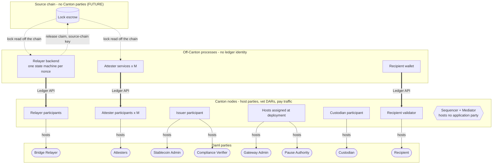
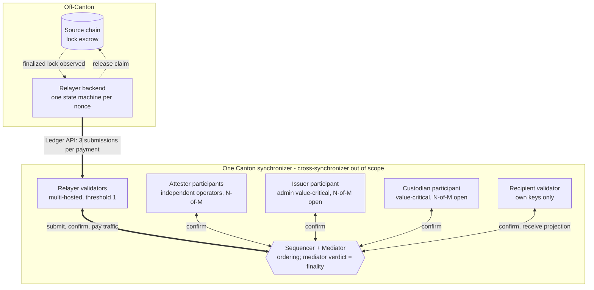
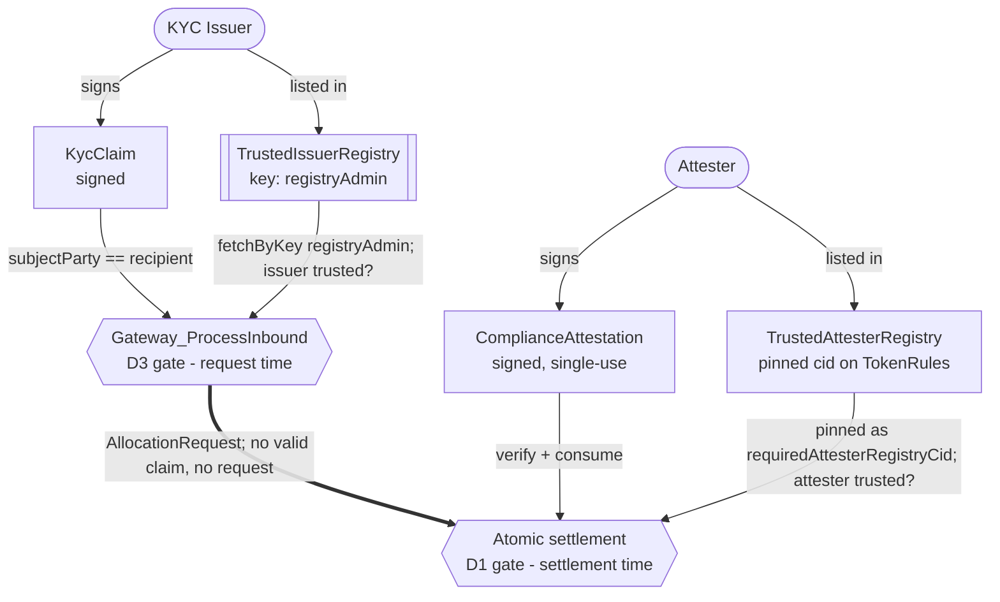

# Architectural Overview Report: Cross-Chain Stablecoin Payment Orchestration on Canton

This document is a *reference design* for private, atomic settlement on Canton of stablecoin payments that originate on external blockchains. It composes the OpenZeppelin Canton components in this workspace with the Canton Network Token Standard V2.

Every claim carries a source tag, and [status at a glance](#status-at-a-glance) states once, per component, what exists and what needs to be built. Tags then mark an item at its first mention in a section rather than at every mention.

| Tag | Meaning |
|---|---|
| `[EXPERIMENT]` | experimental code, in this workspace or in the `experiments/` folder of the `OpenZeppelin/canton-contracts` repository |
| `[EVIDENCE]` | code in the [`OpenZeppelin/canton-token-template`](https://github.com/OpenZeppelin/canton-token-template) repository, outside the M1 surface |
| `[UPSTREAM]` | Splice, CIP, or external-ecosystem reference, including the CIP-0112 interface ([section 3](#the-upstream-choice-surface-upstream)) |
| `[FUTURE]` | proposed RI-level design, not built in M1 scope |
| `[GAP]` | a required change to code that already exists, and therefore a blocker for the claim it sits under rather than something a later milestone adds |

Where this report links a CIP-0112 choice name into `tokenCIP112-v1`, the target is the registry's `*Impl` method, because that is where the behaviour lives; the choice itself is declared upstream.

## 1. Product Definition

Institutional participants accept value that reaches Canton from an external chain, either as an already-native Canton stablecoin such as `USDCx` or as a gateway-minted wrapped instrument (written `wTOK` throughout), while the settlement amount, the payer and payee identities, and the compliance markers project only to explicitly authorized parties.

The report writes **inbound** for the direction that moves value from the external chain to Canton (**lock-and-mint**), and **outbound** for the direction that moves it back (**burn-and-release**). Neither name describes a direction between parties inside Canton. 

Paying a recipient from pre-positioned destination-side liquidity (_lock-and-unlock_), is not supported ([section 3](#3-target-design)).

The cross-chain transfer must credit the recipient with exactly the intended amount or nothing at all, and no intermediary may hold the assets in transit. Settlement therefore centers on the [CIP-0112](https://github.com/canton-foundation/cips/blob/main/cip-0112/cip-0112.md) [committed allocation](https://github.com/canton-foundation/cips/blob/main/cip-0112/cip-0112.md#416-committed-allocations-for-prefunded-trading-and-iterated-settlement): each leg's amount is fixed on-ledger by the allocation side its authorizer signed, and one all-or-nothing transaction settles them. A signed side makes an amount non-repudiable, not necessarily *correct*; ensuring that the  inbound amount, recipient, and instrument are correct falls to the explicit binding checks of [section 3](#reserve-and-lock-attestation-model-future).

`OpenZeppelin/canton-contracts` holds an [experimental implementation of that settlement](https://github.com/OpenZeppelin/canton-contracts/tree/7696749737885e25cd88422847105f890f03b00d/experiments/token/tokenCIP112-v1/daml/OpenZeppelin/TokenCIP112V1) `[EXPERIMENT]`. Its privacy property is per-party projection: a counterparty sees only the legs on which it sends or receives, so one recipient's payment is never visible to another. The issuing admin of the settled instrument is the deliberate exception, because it signs that instrument's holdings and allocations and therefore sits inside the trust boundary ([Privacy and Visibility Model](#privacy-and-visibility-model)).

For institutional control, the design proposes 4 gates:

| Gate | Mechanism | Where enforced | Tag | Invariant |
|---|---|---|---|---|
| **D1** Compliance | a single-use attestation from a registry-listed attester, bound to this settlement's own legs and never cached | [`SettlementFactory_SettleBatch`](https://github.com/OpenZeppelin/canton-contracts/blob/7696749737885e25cd88422847105f890f03b00d/experiments/token/tokenCIP112-v1/daml/OpenZeppelin/TokenCIP112V1/Registry.daml#L79), against the [`TrustedAttesterRegistry`](https://github.com/OpenZeppelin/canton-contracts/blob/7696749737885e25cd88422847105f890f03b00d/experiments/token/tokenCIP112-v1/daml/OpenZeppelin/TokenCIP112V1/D1.daml#L22) pinned on `TokenRules` | `[EXPERIMENT]` (`canton-contracts`) | no valid attestation, no settlement |
| **D2** Seizure | mark the allocation, then sweep its locked holdings to a preset custodian account | [`TokenAllocation_MarkD2Seizure`](https://github.com/OpenZeppelin/canton-contracts/blob/7696749737885e25cd88422847105f890f03b00d/experiments/token/tokenCIP112-v1/daml/OpenZeppelin/TokenCIP112V1/Allocation.daml#L158) plus one of two sweep choices | `[EXPERIMENT]` (`canton-contracts`) | never burns the asset, never returns seized funds to the sender, and the freeze window is bounded and releasable |
| **D3** Identity | the recipient holds a `KycClaim` from an issuer listed in the `TrustedIssuerRegistry` | the gateway, at request time, before any allocation exists | the `ShapeB` file `[EXPERIMENT]` from this workspace | no valid claim from a listed issuer, no interaction with the system |
| **D4** Authority | every privileged action binds to a named role rather than to one admin | [`openzeppelin-access-control-v1`](https://github.com/OpenZeppelin/canton-contracts/tree/cec416d6e3c2118551c761d5598c403ab27ee342/experiments/access/access-control-v1) role administration and `openzeppelin-ownable-v1` two-step handover | `[FUTURE]` | privileges are granted, transferred, and revoked without redeploying, and each traces to a role |

**Privacy scope.** The privacy guarantee covers the Canton side only. The source-chain lock is a public transaction on its own chain, and it necessarily encodes enough routing data for the transfer to be correctly routed on Canton. An external observer of the source chain can therefore link a public lock of amount *N* to the fact that some identified Canton recipient will be credited *N*. Canton's per-party projection hides everything downstream: the settled holding, the settlement events, the compliance markers, and every subsequent private transfer. Hiding the source-chain linkage itself, through hashed commitments, shielded payloads, or relayer-side blinding, is out of scope.

### Operational Scope and Boundaries

The reference implementation favors simplicity and modular extensibility.

| Feature Category | In-Scope Architectural Components |
|---|---|
| Atomic Settlement | Private on-Canton settlement of inbound stablecoin payments via `SettlementFactory_SettleBatch` `[UPSTREAM]`. |
| Cross-Chain Bridge | An inbound and outbound bridge **interface** (the Standardized Messaging Gateway) as a bounded, verifiable mock: attested inbound mint and attested outbound redemption. |
| Compliance & Control | D1 attested settlement, D2 seizure to a preset custodian account, D3 single-synchronizer identity. |
| Asset Representation | The gateway-minted `wTOK`, conforming to the CIP-0112 holding interfaces, and the integration to settle an existing native Canton stablecoin such as `USDCx` by interface. |
| Component Integration | Direct reuse of `openzeppelin-access-control-v1`, `openzeppelin-ownable-v1`, and `openzeppelin-pausable-v1`, the CIP-0112 settlement spine, and patterns from [`canton-token-template`](https://github.com/OpenZeppelin/canton-token-template) and [`canton-stablecoin`](https://github.com/OpenZeppelin/canton-stablecoin). |

| Feature Category | Out-of-Scope Architectural Components |
|---|---|
| Production Bridge Infrastructure | Production bridge and relayer services, external oracle infrastructure, validator networks, cryptographic light-client proofs. |
| Stablecoin Mechanism | The issuance, peg, and CDP mechanism itself; `USDCx` issuance and its native rail are external. |
| Off-Ledger Compliance Shortcuts | Off-ledger caching of compliance status, probabilistic risk scoring, heuristic filtering. |
| Legacy Standards | Any reliance on the superseded CIP-56 token standard or legacy V1 allocation paths. |
| Cross-Synchronizer Operation | The RI is cross-chain but single-synchronizer on Canton. Cross-synchronizer settlement and identity are out of scope. |


### Instrument Naming: `wTOK` vs `USDCx` `[UPSTREAM]`

Every flow in this report mints, settles, and redeems `wTOK`, a generic gateway-minted wrapped instrument, whose holdings are [`TokenHolding`](https://github.com/OpenZeppelin/canton-contracts/blob/7696749737885e25cd88422847105f890f03b00d/experiments/token/tokenCIP112-v1/daml/OpenZeppelin/TokenCIP112V1/Holding.daml#L17) contracts, issued by the Stablecoin Admin. 

Where a native rail exists (i.e. USDCx), the RI only aims to *settle* its mint output by interface and takes no issuer role; the gateway is the reference rail for assets that lack a native Canton path.


### Target Ecosystem Participants

- **Regulated financial institutions and corporate treasuries** accept inbound liquidity from public networks without exposing treasury flows, payment detail, or counterparty relationships.
- **Bridge and gateway builders** replace the messaging integration behind the interface boundary and reuse the settlement and compliance layers unchanged.
- **Wallet and client integrators** validate delegated-accept inbound flows, where a standing `TransferPreapproval` supplies an offline treasury's co-authorization, against a working reference.
- **Security and assurance auditors** evaluate the reserve invariant, the explicit authority boundaries, and the proposed validation workflow (`daml-lint`, `daml-props`, `daml-verify`).

### Canton Mechanics the Design Depends On

For the gateway to cannot credit a holding to a recipient, it needs the recipient's own authority, live or delegated, so Daml's propose-and-accept pattern is used.

The design uses [contract keys](https://github.com/digital-asset/canton/releases/tag/v3.5.1) `[GAP]` so the `PauseState`, the trusted-issuer registry, and the consumed-nonce registry have stable contract references.

### Registry Uniqueness Under Non-Unique Keys `[GAP]`

A Canton 3.x key is a lookup handle, not a uniqueness constraint, so the rail supplies uniqueness itself. The [contract-keys reference](https://docs.canton.network/appdev/modules/m3-contract-keys) `[UPSTREAM]` states three properties the design must absorb:

- several active contracts of one template may share a key, and `DA.ContractKeys` ships `lookupNByKey` and `lookupAllByKey` for exactly that case;
- negative lookups are not validated, so no check may rest on the *absence* of a key;
- where duplicates exist, `fetchByKey` resolution order is not guaranteed and the submitter can steer it, because command submission prioritizes disclosed contracts over known contracts.

Only the maintainer can create a duplicate, but creating one is an ordinary rotation mistake: a migration that creates the successor before archiving the predecessor leaves both active. From that point the Bridge Relayer, which builds every inbound submission and holds no minting trust, picks which registry the gateway sees by disclosing it. A `ConsumedNonceRegistry` that lacks a given `(sourceChainId, nonce)` lets an already-minted lock mint a second time, and a `TrustedIssuerRegistry` with a wider `trustedIssuers` list passes a D3 check that the narrower one refuses.

The RI therefore anchors every keyed registry to an on-ledger successor chain. Each version pins the genesis contract id and consumes its predecessor, so a consumer resolves by key and then checks the anchor it pinned once. A planted parallel registry fails against that anchor rather than against operator vigilance.

```daml
-- [FUTURE] Uniqueness comes from the chain, not from the key.
template ConsumedNonceRegistry
  with
    admin : Party
    genesis : Optional (ContractId ConsumedNonceRegistry)      -- None only at genesis; pinned by every consumer
    predecessor : Optional (ContractId ConsumedNonceRegistry)  -- None only at genesis
    consumed : [Text]
  where
    signatory admin
    key admin : Party        -- convenience lookup only; carries no uniqueness
    maintainer key
```

The genesis version cannot name itself, because a contract id does not exist until its create commits, so `genesis` carries `None` on the first version exactly as `predecessor` does. A consumer that pinned the genesis id *g* therefore accepts a resolved registry when the resolved id is *g* itself or its `genesis` is `Some g`, and rejects everything else.

Two constraints follow. `lookupByKey` requires authorization from **all** maintainers of the key, so the design resolves registries with `fetchByKey`, which like `fetch` needs authorization from one *stakeholder* of the contract it returns. That is a weaker rule but not a free one: a caller that resolves a registry another party signs must be a stakeholder of it ([section 4.1](#41-component-standardized-messaging-gateway-bounded-mock-future)). And the trusted-attester registry stays outside this scheme: pinning it by contract id on the settlement registry is the same anchoring idea without the key ([D1](#capability-gates-d1-d4)).

### Status at a Glance

Six of the thirteen components below are `[FUTURE]`, and the design's whole cross-chain boundary is among them. The five `[GAP]` marks are the sharper list: changes to code that already exists, without which the claims above them do not hold.

| Component | Tag | Location | What is missing |
|---|---|---|---|
| CIP-0112 settlement spine (`TokenRules`, `TokenAllocation`, `TokenHolding`, event log) | `[EXPERIMENT]` | [`canton-contracts` `tokenCIP112-v1`](https://github.com/OpenZeppelin/canton-contracts/tree/7696749737885e25cd88422847105f890f03b00d/experiments/token/tokenCIP112-v1) | nothing for settlement itself; the `wTOK` registry must still close `TokenRules_Mint` `[GAP]` |
| D1 attestation path (`TrustedAttesterRegistry`, `ComplianceAttestation`) | `[EXPERIMENT]` | same package, `D1.daml` | the N-of-M quorum choice `[GAP]` |
| D2 seizure path (mark, two sweeps, `BurnerCapability`, `SeizureOrder`) | `[EXPERIMENT]` | same package, `Allocation.daml` and `D1.daml` | capability revocation or rotation |
| D3 identity hook (`KycClaim`, `TrustedIssuerRegistry`) | `[EXPERIMENT]` | this workspace, [`experiments/identity/hook-shape-b`](../../experiments/identity/hook-shape-b/) | the choice that enforces the check on the inbound path, and the observer entries that authorize the gateway to read the claim and the registry `[GAP]` |
| D4 per-action role binding | `[FUTURE]` | libraries in `canton-contracts` `experiments/access` | the wiring; the role and ownership primitives exist, this rail does not use them yet |
| Access control, ownership handover, pausing | `[EXPERIMENT]` | `canton-contracts` `experiments/access` and `experiments/security` | nothing for access control and ownership; `PauseState` needs the observer entry that authorizes the gateway to read it `[GAP]` |
| Holdings and standing `TransferPreapproval` | `[EVIDENCE]` | [`canton-token-template`](https://github.com/OpenZeppelin/canton-token-template) | the spine-aware delegated allocate-and-accept choice |
| Standardized Messaging Gateway | `[FUTURE]` | [section 4.1](#41-component-standardized-messaging-gateway-bounded-mock-future) | the whole implementation is deferred to other milestones |
| `LockAttestation` carrier and `ConsumedNonceRegistry` | `[FUTURE]` | [section 3](#reserve-and-lock-attestation-model-future) | the whole implementation is deferred to other milestones |
| `wTOK` attested mint and redemption burn | `[FUTURE]` | [section 3](#reserve-and-lock-attestation-model-future) | the whole implementation is deferred to other milestones |
| Contract keys on `PauseState` and the issuer registry | `[GAP]` | [section 1](#registry-uniqueness-under-non-unique-keys-gap) | SDK support, Daml-LF 2.3 on Protocol Version 35, and a deploy-and-migrate path per template |
| Token Standard V2 interfaces | `[UPSTREAM]` | Splice `splice-api-token-*`, vendored as pinned DARs | nothing; consumed by interface |
| `daml-lint`, `daml-props`, `daml-verify` | `[FUTURE]` | [section 5.2](#52-automated-validation-engine-future) | the whole validation pipeline for this rail |

---

## 2. Architecture Overview

The architecture composes reused OpenZeppelin Daml primitives, the CIP-0112 settlement spine as the engine for all asset movement, and a bounded gateway mock at the cross-chain boundary.

### Parties, Nodes, and Processes

Parties exist only on Canton. The source chain has addresses and keys, and neither ledger records that a given address and a given party belong together. What links them is one off-Canton process holding both credentials, so the pairing is a deployment fact rather than a protocol guarantee.

That makes "the attesters sign" two different things. Inbound, the attester party is a signatory of the `InboundMessage` and the source chain never sees the signature. Outbound, the escrow cannot read Canton, so the `RedemptionAttestation` needs a signature the escrow's own verifier accepts, and each attester holds a source-chain key as well as a Canton party.

| Name | Kind | What it does |
|---|---|---|
| Bridge Relayer | party | settlement executor; signs the `TokenAllocationRequest`; holds `BRIDGE_RELAYER_ROLE`, which the gateway's `operator` field checks. Transport and liveness only, so a relayer with no attestation cannot mint |
| Attesters, M of them | party | the trust role, separate from the relayer's transport role; signs the `InboundMessage` `[FUTURE]`, the `ComplianceAttestation` `[EXPERIMENT]`, and the `RedemptionAttestation` `[FUTURE]`; listed in the `TrustedAttesterRegistry` |
| Stablecoin Admin | party | `wTOK` issuing admin; signs its holdings, allocations, and mint legs |
| Compliance Verifier | party | `TrustedIssuerRegistry` admin; issues the `KycClaim` |
| Custodian | party | `BurnerCapability` assignee; owns the preset sweep account |
| Recipient, or Holder outbound | party | signs the receiving allocation, live or through a standing `TransferPreapproval` |
| Pause Authority | party | signs the `PauseState` and maintains its key |
| Gateway Admin `[FUTURE]` | party | the gateway's `admin`; maintains the `ConsumedNonceRegistry` key |
| Redemption operator `[FUTURE]` | party | holds the `RedemptionBurnCapability` |
| Lawful-process authority | party | signs the `SeizureOrder`; registry-listed, and never the admin |
| Participant, or validator | Canton node | hosts parties, vets the DAR versions their transactions select, and buys the traffic they burn |
| Sequencer and Mediator | Canton node | ordering, and the verdict that makes a transaction final; hosts no application party |
| Relayer backend `[FUTURE]` | off-Canton process | watches the source chain, one state machine per nonce, and submits every inbound command as the Bridge Relayer |
| Attester services `[FUTURE]` | off-Canton process | M independent operators on M participants; each submits as its own attester party |
| Recipient wallet | off-Canton process | creates the standing `TransferPreapproval` and submits as the Recipient |
| Lock escrow `[FUTURE]` | source-chain contract | holds the backing, and releases it against a verified `RedemptionAttestation` |

The gateway and the registries are contracts, not services. `StandardizedMessagingGateway` is a template carrying one choice that the relayer exercises, and `PauseState`, `TrustedAttesterRegistry`, `TrustedIssuerRegistry`, and `ConsumedNonceRegistry` are single contracts a caller fetches. `LockAttestation` is a data record inside the `InboundMessage` rather than a contract, so what an attester signs on the inbound path is the carrier and not the lock attestation itself.



### Node and Hosting Topology

The postures in the labels below are the targets that [Decentralization and Trust Topology](#decentralization-and-trust-topology) argues for. The `[FUTURE]` cross-chain boundary sits outside the synchronizer entirely, and the remaining diagrams in this report sit one plane below, on contracts and choices rather than nodes.



Three properties follow from the layout:
1. The relayer is the only block on both sides of the boundary, so it pays nearly all the traffic ([section 6.1](#61-traffic-costs)) and its validator running out of traffic halts the rail ([section 5.4](#54-failure-modes-and-recovery)). 
2. Each participant sees only the views its own parties are informees of, so no single block holds a whole settlement. 
3. Every participant hosting an informee must have vetted the DAR version the submitter selects, which makes the vetted package set a per-node deployment property.

### Core Components and Library Mapping

| Component Suite | Applied Templates and Libraries | Architectural Function |
|---|---|---|
| Access Control `[EXPERIMENT]` (`canton-contracts`) | `openzeppelin-access-control-v1`: [`RoleGrant`](https://github.com/OpenZeppelin/canton-contracts/blob/cec416d6e3c2118551c761d5598c403ab27ee342/experiments/access/access-control-v1/daml/OpenZeppelin/AccessControlV1.daml#L58), `RoleAdmin`, `DefaultAdminTransferOffer`, [`requireRole`](https://github.com/OpenZeppelin/canton-contracts/blob/cec416d6e3c2118551c761d5598c403ab27ee342/experiments/access/access-control-v1/daml/OpenZeppelin/AccessControlV1.daml#L287) | Role-based permissioning. Gates the relayer and custodian roles; D4 authority. |
| Ownership Lifecycle `[EXPERIMENT]` (`canton-contracts`) | `openzeppelin-ownable-v1`: [`Ownership`](https://github.com/OpenZeppelin/canton-contracts/blob/cec416d6e3c2118551c761d5598c403ab27ee342/experiments/access/ownable-v1/daml/OpenZeppelin/OwnableV1.daml#L41), `OwnershipOffer` | D4: two-step handover of gateway and factory administration. |
| Emergency Stop `[EXPERIMENT]` (`canton-contracts`) | `openzeppelin-pausable-v1`: `PauseState`, [`whenNotPaused`](https://github.com/OpenZeppelin/canton-contracts/blob/cec416d6e3c2118551c761d5598c403ab27ee342/experiments/security/pausable-v1/daml/OpenZeppelin/PausableV1.daml#L77) | Circuit breaker. `whenNotPaused` halts inbound processing during anomalies. |
| Settlement Spine `[EXPERIMENT]` (`canton-contracts`) | `OpenZeppelin.TokenCIP112V1`: [`TokenRules`](https://github.com/OpenZeppelin/canton-contracts/blob/7696749737885e25cd88422847105f890f03b00d/experiments/token/tokenCIP112-v1/daml/OpenZeppelin/TokenCIP112V1/Registry.daml#L28), [`TokenAllocationRequest`](https://github.com/OpenZeppelin/canton-contracts/blob/7696749737885e25cd88422847105f890f03b00d/experiments/token/tokenCIP112-v1/daml/OpenZeppelin/TokenCIP112V1/AllocationRequest.daml#L18), [`TokenAllocation`](https://github.com/OpenZeppelin/canton-contracts/blob/7696749737885e25cd88422847105f890f03b00d/experiments/token/tokenCIP112-v1/daml/OpenZeppelin/TokenCIP112V1/Allocation.daml#L67), [`TokenHolding`](https://github.com/OpenZeppelin/canton-contracts/blob/7696749737885e25cd88422847105f890f03b00d/experiments/token/tokenCIP112-v1/daml/OpenZeppelin/TokenCIP112V1/Holding.daml#L17), [`TokenEventLog`](https://github.com/OpenZeppelin/canton-contracts/blob/7696749737885e25cd88422847105f890f03b00d/experiments/token/tokenCIP112-v1/daml/OpenZeppelin/TokenCIP112V1/Base.daml#L75), [`BurnerCapability`](https://github.com/OpenZeppelin/canton-contracts/blob/7696749737885e25cd88422847105f890f03b00d/experiments/token/tokenCIP112-v1/daml/OpenZeppelin/TokenCIP112V1/Allocation.daml#L52) | Core engine for all asset movement. `wTOK` holdings are `TokenHolding` contracts ([instrument naming](#instrument-naming-wtok-vs-usdcx-upstream)); an instrument issued elsewhere settles through the same interfaces. |
| Identity Verification `[EXPERIMENT]` (this workspace) | `ShapeB`: [`KycClaim`](../../experiments/identity/hook-shape-b/daml/OpenZeppelin/Experimental/Identity/ShapeB.daml#L43), `TrustedIssuerRegistry` | D3: a recipient must hold a `KycClaim` from a trusted issuer to receive a compliance-gated inflow. |
| Holdings & Preapproval `[EVIDENCE]` | `OpenZeppelin/canton-token-template` (`SimpleToken.*`): `SimpleHolding`, `SimpleTokenRules`, `LockedSimpleHolding`, `TransferPreapproval` | Holds value, and lets a recipient agree in advance. The recipient signs a `TransferPreapproval` once, and the relayer acts under it later. The template's one choice, `TransferPreapproval_Send`, sends a transfer and cannot create an allocation on the settlement spine. The choice that can is `[FUTURE]` ([section 4.2](#42-component-inbound-dvp-via-delegated-accept-future)). |
| Messaging Gateway `[FUTURE]` | `StandardizedMessagingGateway` (bounded mock, [section 4.1](#41-component-standardized-messaging-gateway-bounded-mock-future)) | The boundary with the external chain. It accepts a message that reports a lock on that chain, signed by the attesters, then starts a settlement on the spine. |

### Per-Party Projection

Because Canton settles on per-party projection, the settlement fractures into bilateral requests: the relayer and the recipient are the only initial observers of the inbound `TokenAllocationRequest`, and no other recipient sees that traffic. A committed allocation locks the bridging funds until the settlement deadline, so the recipient knows the liquidity is reserved and cannot be double-spent or withdrawn before the DvP concludes.

### Decentralization and Trust Topology

Canton hosts a party on one or more nodes. The `PartyToParticipant` [confirmation threshold](https://docs.canton.network/overview/reference/decentralization) `[UPSTREAM]` says how many of those nodes must confirm the party's transactions.

A threshold above 1 stops one bad node from acting for the party. It also stops the party from sending Ledger API commands, because a command goes through a single node and carries no signature of the party. Such a party must let other parties submit for it, or sign its transactions externally.

The hosting nodes are also the nodes that check Daml authorization for the party. If enough of them collude, they confirm a contract that the party never agreed to sign. So a 3-of-5 rule written in Daml is worth 3-of-5 only if the party's confirmation threshold is 3 or more.

The **Stablecoin Admin** (it authors `wTOK` mint legs) and the **Custodian** (it can sweep locked value) hold value-critical authority, so no single key may exercise either role. Canton offers two routes to that N-of-M posture, and the choice between them is open ([section 7](#7-open-design-questions)):

- **On-ledger approval workflow.** The multisig is written in Daml ([Multiple Party Agreement](https://docs.canton.network/appdev/modules/m3-design-patterns#multiple-party-agreement)): approvers record approvals as contracts, and the final choice executes under the role party's inherited authority once a threshold exists. Approvals are durable, named, and auditable on-ledger. The price is a hosting rule and a setup rule. The role party must sit at a confirmation threshold of N or more, or the Daml quorum counts for nothing. And a party above threshold 1 can only build on the state it created while still at threshold 1, so an unplanned change needs a smart contract upgrade or a temporary return to threshold 1.
- **External party with threshold signing keys.** The role party's transactions require N of M keys held by independent organizations. This is invisible to the Daml code and costs one ledger transaction per action, but the signing ceremony must finish inside the prepared transaction's validity window and the approval record stays off-ledger. Since [Canton 3.5](https://github.com/digital-asset/canton/releases/tag/v3.5.1). The [Bitsafe decentralization-manager](https://github.com/DLC-link/decentralization-manager) is one candidate implementation.

| Role | Target posture | Why |
|---|---|---|
| Attesters | several independent parties in the `TrustedAttesterRegistry`, threshold N-of-M, never all-of-M | one unavailable or unvetted attester must not halt the rail, and one malicious attester must not mint |
| Bridge Relayer | multi-hosted on several validators, confirmation threshold 1 | it holds no minting trust and is the most submission-heavy role in the design; integrity comes from the attester split, and relay should ultimately be permissionless so no single party gates liveness |
| Pause authority | multi-hosted, confirmation threshold 1 | an emergency stop must be instant, and a quorum would slow it down; the price is a griefing window where a malicious pauser stalls settlement until deadlines lapse, capped by the sender's right to reclaim committed funds |
| Compliance Verifier | several independent issuers in the `TrustedIssuerRegistry` | a recipient needs a `KycClaim` from only one listed issuer, so no single issuer can block onboarding; the flip side is that the registry is only as strict as its most permissive issuer, which makes the choice of who to list a governance decision |
| Recipients | no rail-side decentralization | nothing binds a recipient without their own signature, live or through their standing `TransferPreapproval`, so they trust only their own keys and validator |

The `[EXPERIMENT]` spine does not meet the attester row yet: it verifies one attestation, and the choice that would verify a quorum is a `[GAP]` ([section 7](#7-open-design-questions)).

---

## 3. Target Design

The inbound payment is the primary critical path: a deterministic sequence of state transitions on the CIP-0112 spine, from an attested source-chain lock to a privately projected Canton credit.

**Bridge mode `[FUTURE]`.** The design rejects lock-and-unlock because it adds a liquidity-provider role and an inventory-imbalance surface that a reference rail does not need. The gateway interface is the seam where an alternative mode plugs in.

1. **Inbound message.** The external chain finalizes a locked deposit. Through an N-of-M quorum, attesters sign an `InboundMessage` carrying the typed `LockAttestation` (locked amount, Canton recipient, target instrument, nonce, expiry). The gateway consumes the attestation, therefore providing replay protection.
2. **Request and gate.** The relayer creates a [`TokenAllocationRequest`](https://github.com/OpenZeppelin/canton-contracts/blob/7696749737885e25cd88422847105f890f03b00d/experiments/token/tokenCIP112-v1/daml/OpenZeppelin/TokenCIP112V1/AllocationRequest.daml#L18) `[EXPERIMENT]`, an executor-signed request naming the mint leg with exactly the attested amount. Identity is checked on-ledger and fails closed: the recipient must hold a valid, unexpired `KycClaim` from a listed issuer (D3, whose enforcing choice is the `[FUTURE]` gateway's), and the settlement itself will require a D1 `ComplianceAttestation` `[EXPERIMENT]`, a separate contract from the `LockAttestation` carrier of step 1.
3. **Recipient co-authorization via `TransferPreapproval`.** A recipient cannot be bound unilaterally. For an offline corporate treasury that cannot sign interactively, the recipient's wallet pre-establishes a `TransferPreapproval` for the wrapped instrument. The relayer exercises it, through a delegated allocate-and-accept choice ([section 4.2](#42-component-inbound-dvp-via-delegated-accept-future)), to run [`AllocationFactory_Allocate`](https://github.com/OpenZeppelin/canton-contracts/blob/7696749737885e25cd88422847105f890f03b00d/experiments/token/tokenCIP112-v1/daml/OpenZeppelin/TokenCIP112V1/Registry.daml#L280), producing a committed [`TokenAllocation`](https://github.com/OpenZeppelin/canton-contracts/blob/7696749737885e25cd88422847105f890f03b00d/experiments/token/tokenCIP112-v1/daml/OpenZeppelin/TokenCIP112V1/Allocation.daml#L67) in one atomic submission. That same submission exercises [`AllocationRequest_Accept`](https://github.com/OpenZeppelin/canton-contracts/blob/7696749737885e25cd88422847105f890f03b00d/experiments/token/tokenCIP112-v1/daml/OpenZeppelin/TokenCIP112V1/AllocationRequest.daml#L61), consuming the request and leaving no payment residue.
4. **Atomic DvP** The relayer packages the committed allocations into one [`SettlementFactory_SettleBatch`](https://github.com/OpenZeppelin/canton-contracts/blob/7696749737885e25cd88422847105f890f03b00d/experiments/token/tokenCIP112-v1/daml/OpenZeppelin/TokenCIP112V1/Registry.daml#L79). The batch is all-or-nothing, so the application must validate inputs before submission and minimize concurrent consumption of the allocations it references. On success the recipient's holding is created and projected to the recipient, the executing relayer, and the Stablecoin Admin, with the matching events emitted through the `TransferEventsV2.EventLog` host. Events are scoped per authorizer, so a recipient in a multi-leg batch sees its own legs and no one else's.

### The Upstream Choice Surface `[UPSTREAM]`

Steps 3 and 4 call CIP-0112 interface choices, not choices this design owns. `AllocationFactory_Allocate`, `AllocationRequest_Accept`, `SettlementFactory_SettleBatch`, `Allocation_Cancel`, and `Allocation_Withdraw` are declared in `Splice.Api.Token.*`, and the settlement registry supplies the `*Impl` method behind each one. The argument record of such a choice is fixed by the CIP, so a registry cannot append a field and a caller cannot pass one.

Registry-specific arguments travel in the standard's own extension slot instead: `ExtraArgs`, whose `context : ChoiceContext` is a `TextMap` of `AnyValue`. The D1 attestation reaches the settlement factory that way, under the key [`d1AttestationContextKey`](https://github.com/OpenZeppelin/canton-contracts/blob/7696749737885e25cd88422847105f890f03b00d/experiments/token/tokenCIP112-v1/daml/OpenZeppelin/TokenCIP112V1/Base.daml#L43). When the registry requires attestation and that key is absent, the settle fails with `this factory requires a D1 compliance attestation in the choice context`, so omission fails closed.

```daml
-- What the settling caller places in the choice context (section 4.2).
extraArgs = ExtraArgs with
  context = ChoiceContext with
    values = TextMap.fromList
      [(d1AttestationContextKey, AV_ContractId (toAnyContractId attestationCid))]
  meta = emptyMetadata
```

The same slot carries the registry's internal plumbing: `settlementFactory_settleBatchImpl` mints a per-authorizer [`BatchSettlementAuthorization`](https://github.com/OpenZeppelin/canton-contracts/blob/7696749737885e25cd88422847105f890f03b00d/experiments/token/tokenCIP112-v1/daml/OpenZeppelin/TokenCIP112V1/Allocation.daml#L37) and hands it to each allocation's settle under `batchAuthorizationContextKey`, which makes the batch cover check and the D1 gate unavoidable rather than conventional. `SettlementFactory_SettleBatch` returns one `AllocationResult` per settled allocation and no receipt contract.

### Data and State Flow

The diagrams decompose the design around the shared `Atomic settlement` hub. Keyed contracts are marked with their key.

**A. Compliance and identity (D1 + D3).** The registries list several independent attesters and issuers, with one of each shown. The gates fire at different points: D3 identity at **request** time in the gateway, D1 compliance at **settlement** time. They are also reached differently. The gateway key-resolves the issuer registry, while the attester registry's contract id is pinned on `TokenRules` as `requiredAttesterRegistryCid` and the settling caller supplies only the attestation. [`ComplianceAttestation_Verify`](https://github.com/OpenZeppelin/canton-contracts/blob/7696749737885e25cd88422847105f890f03b00d/experiments/token/tokenCIP112-v1/daml/OpenZeppelin/TokenCIP112V1/D1.daml#L83) also checks `registry.admin == factoryAdmin`, but on a registry the caller never named.



**B. Inbound mint settlement.** The attesters sign the one-time carrier; the gateway consumes it, records the nonce, and creates the executor-signed request whose amount is exactly the attested amount. The recipient's standing `TransferPreapproval` supplies their authority to commit the receiving allocation, and the mint leg and the credit settle in one transaction.


**C. Outbound redemption.** The holder's burn is the irreversible commit; the attested release on the source chain follows it.


**D. Pausing and seizure (control plane).** The pause authority halts inbound processing by key; the Custodian's sweep is validated against the capability witness and hardcoded to the preset destination.


### Execution Model

Only the settle is atomic. The inbound path is three relayer-submitted ledger commands, orchestrated off-ledger by the relayer's backend: a submission returns once accepted, and the outcome arrives on the completion stream, correlated by command id.

| # | Step | Submitter | Kind |
|---|---|---|---|
| 1 | Source-chain lock observed `[FUTURE]` | relayer | off-Canton |
| 2 | Carrier `[FUTURE]` and compliance attestation `[EXPERIMENT]` | attester | async ledger commands, automated |
| 3 | `Gateway_ProcessInbound` `[FUTURE]` | bridge relayer | async ledger command; consumes the nonce |
| 4 | Delegated allocate and accept `[FUTURE]` choice on an `[EVIDENCE]` template | bridge relayer | one atomic submission under the recipient's preapproval |
| 5 | `SettlementFactory_SettleBatch` `[UPSTREAM]` | bridge relayer | one atomic transaction; final at the mediator verdict, seconds |

Command deduplication (24h) makes relayer crash-restart safe for steps 4 and 5: resubmitting cannot double-execute. Step 3 is the exception in consequence rather than in mechanism, because once `Gateway_ProcessInbound` commits the nonce is spent, and a settlement that never completes cannot be re-driven without a fresh attestation. A stalled workflow blocks only this rail, since inbound settlements serialize on the per-rail nonce registry ([section 5.5](#55-throughput-and-contention-future)).

The relayer backend tracks each inbound payment as a state machine keyed by nonce and command id. Every step either lands on the completion stream or times out against its deadline and marks the workflow stuck, raising an operator alert that names the pending step and the deadline after which the locked funds unlock. [Section 5.4](#54-failure-modes-and-recovery) enumerates the stuck states and their exits.

### Time Model and Deadlines

- Ledger time is accurate only to `ledgerTimeRecordTimeTolerance` (60s default), so every deadline check is fuzzy by that much and sub-minute deadlines are meaningless.
- Externally signed (prepared) transactions must be submitted within `preparationTimeRecordTimeTolerance`, 24h by default, so any externally signed leg must complete prepare, sign, and submit inside that window. CIP-0107 exposes the same window through the token-standard APIs.
- CIP-0112 defines the deadline fields but no values: `settlementDeadline` (an allocation must not settle after it, and committed allocations become withdrawable) and a registry-set `expiresAt` for hygiene expiry. Enforcement lives in each token registry, so with third-party tokens the expiry policy is per registry (`Amulet` caps allocation lifetimes at 90 days).
- The settlement registry's own ceilings `[EXPERIMENT]` bind before any RI policy does. `TokenRules` carries `maxTTL`, an upper bound on how long an allocation or transfer instruction may occupy storage, with longer workflow deadlines rejected outright rather than truncated; `maxAttestationValidity`, which caps an attestation's window (`ComplianceAttestation_Verify` asserts `expiresAt <= issuedAt addRelTime maxValidity`); and `maxSeizureExtension`, which caps how far past the settlement deadline a D2 seizure window may reach. Every `TokenAllocation` additionally requires `expiresAt < lockExpiresAt`.

Deadlines are derived per flow rather than picked globally:

```text
slowest required actor's SLA <= settlementDeadline
  <= min(maxTTL, operation staleness tolerance, capital-lock tolerance)
```

The 24h `preparationTimeRecordTimeTolerance` is a separate per-submission constraint and does not bound the allocation's deadline, so a multi-day `settlementDeadline` is compatible with signing each submission inside its own window.

| Flow | Slowest actor | Window | Rationale |
|---|---|---|---|
| Inbound settle `[FUTURE]` | automated attester plus relayer | `settlementDeadline`, minutes to an hour | not price-sensitive, but a lapse strands the spent nonce, so the deadline must comfortably exceed the attester and relayer SLAs |
| Outbound redemption `[FUTURE]` | attester | `settlementDeadline`, hours | burn-first; the source-chain claim is standing and replay-protected, so slow release costs latency, not funds |
| D1 attestation `[EXPERIMENT]` | attester | the attestation's own `expiresAt`, capped by `maxAttestationValidity` | verified at settle, so the window must span gateway processing through settle; the registry cap stops an attester issuing a permanent pass |

The attestation's validity window must therefore cover the whole inbound path from gateway processing to settle, and staying inside it is the relayer's operational responsibility.

### Reserve and Lock-Attestation Model `[FUTURE]`

The flow above shows *how* an inbound payment settles privately. The core of a bridge is **what binds the Canton mint to real, locked backing on the source chain**. Without this the design is a private DvP engine with a trust gap at the boundary.

**What is attested.** Every inbound mint is authorized by a typed `LockAttestation`, a Daml-visible record asserting that backing is locked on the source chain and is claimable only by minting the matching amount on Canton:

```daml
-- [FUTURE] RI-level type carried by `InboundMessage`.
data LockAttestation = LockAttestation with
  sourceChainId      : Text         -- e.g. "ethereum-mainnet"
  lockTxId           : Text         -- the source-chain lock/escrow transaction
  lockedAsset        : Text         -- source-chain asset locked (foreign reference, so Text)
  lockedAmount       : Decimal      -- exact backing locked on the source chain
  cantonRecipient    : Party        -- who may receive the minted wrapped asset
  cantonInstrumentId : InstrumentId -- typed on-ledger identity bound to its issuing admin
  nonce              : Text         -- replay-protection sequence id (one-time)
  expiry             : Time         -- attestation validity window
```

**Who signs it, and what binds.** Not a lone relayer: the attestation is verified on-ledger against the `TrustedAttesterRegistry`, which is what separates the relayer's transport role from the trust role. The target posture is a threshold N-of-M attester set ([section 2](#decentralization-and-trust-topology)). The inbound `AllocationFactory_Allocate` references the attestation, and the mint asserts that `instructionAmount == attestation.lockedAmount` (no over-mint), that `recipient == attestation.cantonRecipient` and the instrument matches, and that the attestation is registry-trusted, unexpired, and carries an unconsumed `nonce`. Any failure fails the batch: no mint, no partial credit.

**How the nonce is enforced.** Two layers. `InboundMessage_Consume` archives the carrier, so one carrier can never be processed twice. Because a *second* carrier could still be attested for the same lock, an admin-signed `ConsumedNonceRegistry` `[FUTURE]` records `(sourceChainId, nonce)` at consumption and fails closed on a duplicate, which holds even if the attesters misbehave. The registry observes the attester set, mirroring `TrustedAttesterRegistry`'s own `observer attesters`, so the parties who must not re-attest a used nonce can read the dedup state and any admin edit is witnessed. Since `lockTxId` already identifies the lock uniquely, an implementation may key entries by `(sourceChainId, lockTxId)` and drop the `nonce` field.

**Reserve invariant.** Minted wrapped supply never exceeds the sum of valid, unredeemed `LockAttestation`s: `mintedSupply <= sum of lockedAmount(unredeemed)`. Mint increments the claimed reserve and redemption decrements it. This is the on-ledger statement of 1:1 backing.

**Where the coupling must bite `[GAP]`.** Settlement conserves value at *settlement*, funding the recipient's leg from a sender's locked holdings, so the unbacked-issuance surface is the *creation* of the wrapped input holdings rather than the settle. An attested-mint choice (`Wtok_MintAttested`, co-authorized by the Stablecoin Admin) must therefore be the only creator of `wTOK` holdings: it re-verifies the checks above and creates the holdings that fund the admin's SenderSide leg. The mint is modeled as a funded transfer leg rather than a sibling create, because the minted amount must be conserved against custodied backing and must pass the same per-instrument conservation check as every other leg.

That is a required change to the registry, not a property of it. The spine ships [`TokenRules_Mint`](https://github.com/OpenZeppelin/canton-contracts/blob/7696749737885e25cd88422847105f890f03b00d/experiments/token/tokenCIP112-v1/daml/OpenZeppelin/TokenCIP112V1/Registry.daml#L149), an admin mint that checks only a positive amount and a regular target account and consumes no attestation. The `wTOK` registry must close it, either by using a registry template that omits the choice or by gating the choice on the same attestation. Appending a stricter choice is not enough, because a stricter choice does not close a looser one ([Implementing Smart Contract Upgrades](#implementing-smart-contract-upgrades)). Until then the 1:1 reserve invariant holds by admin discipline rather than by construction. [`TokenRules_Burn`](https://github.com/OpenZeppelin/canton-contracts/blob/7696749737885e25cd88422847105f890f03b00d/experiments/token/tokenCIP112-v1/daml/OpenZeppelin/TokenCIP112V1/Registry.daml#L170) is admin-plus-account-controlled in the same way, which shapes the `RedemptionBurnCapability` below.

### Outbound Redemption (burn on Canton, release on source chain) `[FUTURE]`

Redemption mirrors the inbound flow:

1. **Burn on Canton.** The holder requests redemption and the wrapped holding is burned, producing a typed `RedemptionAttestation` `{ cantonInstrumentId, amount, sourceChainDestination, drawnDown, nonce, expiry }`. `cantonInstrumentId` names the instrument the burn removed supply from, `drawnDown` lists the `LockAttestation` references the burn draws against and the amount taken from each, and `expiry` bounds the standing source-chain claim. Without those three fields the reserve arithmetic has nothing on-ledger to bind to. The burn gate is **not** the D2 `BurnerCapability`, which is the Custodian's seizure credential and must never be reused for user-initiated redemption. The redemption burn is gated by a separate `RedemptionBurnCapability`, the same witness shape (admin-signed, choice-less, instrument-scoped) but held by the redemption operator and exercised in a choice co-authorized by the holder, whose asset is being burned.
2. **Attest.** A registry-trusted attester signs the `RedemptionAttestation` through the same `TrustedAttesterRegistry` path.
3. **Release on the source chain.** The signed attestation is submitted to the source-chain escrow, which releases `amount` to `sourceChainDestination`, and the reserve is decremented. The burn references and draws down specific unredeemed `LockAttestation`s, so `sum of lockedAmount(unredeemed)` and actual supply cannot drift under partial burns.

**Cross-chain atomicity.** The source-chain release is not in the same Daml transaction as the Canton burn, because no protocol spans both ledgers atomically. The design is therefore burn-first and attested-release: the Canton burn is the irreversible commit, and the foreign release is gated on the signed burn attestation. If the release stalls, the burn is already final, so the reserve accounting stays sound and the redemption becomes a standing, replay-protected claim that the holder or any relayer can resubmit until the escrow releases. The failure mode is delayed release, never double-spend or unbacked supply.

### Inbound Delivery Guarantees and Recovery

Nothing guarantees that the Canton-side settlement of an attested lock *executes*: delivery liveness is bounded by the trusted relayer and attester set. The design adds no automatic cross-chain recovery protocol, because compensating messages back to the source chain would require multi-round message passing with its own delay, cost, and failure surface. The guarantees are structural and fail-closed:

- **Before the gateway step, nothing is credited `[FUTURE]`.** A stalled relayer leaves the source-chain backing locked and the Canton side untouched. Once `Gateway_ProcessInbound` commits, the nonce is spent, so a failed settlement cannot be re-driven on Canton and recovery falls to the source-chain refund.
- **On Canton, stalled committed value is recoverable `[EXPERIMENT]`.** Once the settlement deadline passes, the executors may [`Allocation_Cancel`](https://github.com/OpenZeppelin/canton-contracts/blob/7696749737885e25cd88422847105f890f03b00d/experiments/token/tokenCIP112-v1/daml/OpenZeppelin/TokenCIP112V1/Allocation.daml#L144) and the authorizer may [`Allocation_Withdraw`](https://github.com/OpenZeppelin/canton-contracts/blob/7696749737885e25cd88422847105f890f03b00d/experiments/token/tokenCIP112-v1/daml/OpenZeppelin/TokenCIP112V1/Allocation.daml#L134) `[UPSTREAM]`, both returning the locked holdings and both blocked while a D2 seizure is in flight. Because a committed allocation with `settlementDeadline = None` could never be released, the spine refuses to create one: the finite deadline is structural, not RI policy.
- **The source-chain lock itself** is outside Canton's authority. Reclaiming it after a permanently failed inbound flow, through a timeout and forced refund at the escrow, is a gateway-contract concern and an open question ([section 7](#7-open-design-questions)).

### Privacy and Visibility Model

Canton guarantees reads only to a contract's signatories and observers; other parties see a contract only transiently, when a transaction they witness divulges it. Target visibility per template, all `[EXPERIMENT]` code in the `canton-contracts` settlement spine unless stated otherwise:

| Contract | Signatories | Observers |
|---|---|---|
| `TokenAllocationRequest` | settlement executors (the bridge relayer) | the leg's authorizer |
| `AllocationFactory_Allocate`, `TokenAllocation` | the instrument admin (Stablecoin Admin for `wTOK`), the leg's authorizer | settlement executors |
| `TokenEventLog`, an ephemeral emit host archived in the transaction that creates it | the instrument admin | none |
| `wTOK` holding | the instrument admin, the account's parties | the lock's observers, when locked |
| [`ComplianceAttestation`](https://github.com/OpenZeppelin/canton-contracts/blob/7696749737885e25cd88422847105f890f03b00d/experiments/token/tokenCIP112-v1/daml/OpenZeppelin/TokenCIP112V1/D1.daml#L53) | the attester | the executor verifying it |
| `TrustedAttesterRegistry` | the factory admin | listed attesters |
| `SeizureOrder` | the lawful-process authority | the instrument admin |
| [`TokenAllowance`](https://github.com/OpenZeppelin/canton-contracts/blob/7696749737885e25cd88422847105f890f03b00d/experiments/token/tokenCIP112-v1/daml/OpenZeppelin/TokenCIP112V1/Allowance.daml#L73) | the instrument admin, the owner's account parties | the spender |
| `KycClaim`, `TrustedIssuerRegistry` `[EXPERIMENT]` (this workspace) | the issuing party / the registry admin | the claim's subject and the gateway's admin `[GAP]` / the gateway's admin `[GAP]` |
| `PauseState` `[EXPERIMENT]`, gateway and nonce registry `[FUTURE]` | the pauser / the gateway's admin and operator / the gateway's admin | the gateway's admin `[GAP]` / none / the attester set |

Consequences:

- **No recipient sees another recipient's legs.** Each `TokenAllocation` carries only the legs its authorizer sends or receives, so a batch carrying several inbound payments does not cross-disclose them. This is the privacy claim the spine actually enforces.
- **The Stablecoin Admin sees every `wTOK` payment.** It signs the instrument's holdings and allocations, and a leg's `meta` payload travels into the emitted event log, so amounts, accounts, and memos are readable by construction. This is a trust assumption rather than a leak to be closed: an issuer that authors the mint leg cannot also be blind to it, and CIP-0112 places the instrument admin on those contracts. Anyone whose memo must stay private from the issuer of the asset they are paid in should not use a gateway-minted instrument. The boundary follows the instrument, not this RI: for `USDCx` settled by interface, the party in that position is Circle, so a `wTOK` rail adds one reader to the set that exists for any Canton-native instrument.
- **The relayer and the attesters see what they handle.** The relayer is an executor and therefore an observer of every allocation it assembles, so its transport-only role bounds its authority rather than its visibility. Attesters see the legs of the settlements they attest, which makes registry membership a privacy decision on top of the compliance one. The Custodian sees nothing until a seizure, because `custodianDestination` is a data field on the D2 hook rather than an observer entry.
- **A gate the gateway runs makes the gateway a stakeholder `[GAP]`.** `fetch` and `fetchByKey` need authorization from one stakeholder of the contract they return, and `Gateway_ProcessInbound` carries only the gateway's own `admin` and `operator` authority. The pause state, the issuer registry, and every `KycClaim` the gateway checks must therefore name the gateway's admin as an observer, which is a required change to three templates that already exist. Naming the admin rather than the operator keeps durable registry and claim visibility off the relayer, whose set the design wants to open ([section 2](#decentralization-and-trust-topology)). The submitting relayer still witnesses the claim transiently, because a fetch divulges to whoever witnesses the exercise.
- **Settlement outcomes arrive as events, not as a queryable log contract.** `withTempEventLog` creates and archives the host inside one transaction, and the event data lives in the exercise node its observers witness. Integrators ingest the transfer-events stream ([section 5.6](#56-off-ledger-reconciliation-upstream)) rather than the ACS, and the durable evidence of a settled payment is the recipient's holding.
- **No PII on ledger.** A `KycClaim` carries an issuer reference, not personal attributes; the data stays with the issuer off-ledger.

### Capability Gates D1-D4

The four gates and their invariants are tabled in [section 1](#1-product-definition). This section carries what that table cannot: where each gate is weaker or stronger than its one-line statement.

**D1 `[EXPERIMENT]`.** The check runs on `SettlementFactory_SettleBatch`, which requires an attestation covering this specific settlement from a registry-listed attester. Attestations are single-use, so none can be cached or reused. The trust anchor is a pinned contract id, not a key and not a caller argument: [`requireD1Attestation`](https://github.com/OpenZeppelin/canton-contracts/blob/7696749737885e25cd88422847105f890f03b00d/experiments/token/tokenCIP112-v1/daml/OpenZeppelin/TokenCIP112V1/Registry.daml#L383) reads `requiredAttesterRegistryCid` from `TokenRules`, and the caller supplies only the attestation through the choice context.

Two consequences belong to the deployment rather than to the code. A registry created with `requiredAttesterRegistryCid = None` verifies nothing and every settle succeeds without an attestation, so setting that field is a precondition of the D1 claim rather than a default. And rotating the attester roster means recreating `TokenRules`, because the cid is stamped on it. That rotation cost is what this registry pays instead of depending on key uniqueness.

**D2 `[EXPERIMENT]`.** Seizure is a strict lock-and-sweep: `TokenAllocation_MarkD2Seizure` locks, then [`TokenAllocation_SweepD2Seizure`](https://github.com/OpenZeppelin/canton-contracts/blob/7696749737885e25cd88422847105f890f03b00d/experiments/token/tokenCIP112-v1/daml/OpenZeppelin/TokenCIP112V1/Allocation.daml#L207) sweeps the locked holdings to the preset custodian account. For settled holdings the equivalent is a forced-sweep choice on the evidence `LockedSimpleHolding` (`LockedSimpleHolding_ForcedSweep` `[GAP]`, since that template ships only `_Unlock`).

The two sweep paths differ in authority. The in-flight sweep needs the admin's mark plus the burner's capability, and it must land inside both the settlement deadline and the seizure window. [`TokenAllocation_SweepD2WithLawfulProcess`](https://github.com/OpenZeppelin/canton-contracts/blob/7696749737885e25cd88422847105f890f03b00d/experiments/token/tokenCIP112-v1/daml/OpenZeppelin/TokenCIP112V1/Allocation.daml#L221) is the only path past the settlement deadline, and it costs more: a `SeizureOrder` signed by a non-admin party that must itself be listed in the trusted-attester registry, binding the case reference, the subject account, and the custodian destination. The admin cannot sign that order.

The mark is bounded and reversible. It refuses a window past `maxSeizureExtension`, the admin can lift it with [`TokenAllocation_UnmarkD2Seizure`](https://github.com/OpenZeppelin/canton-contracts/blob/7696749737885e25cd88422847105f890f03b00d/experiments/token/tokenCIP112-v1/daml/OpenZeppelin/TokenCIP112V1/Allocation.daml#L177), and once it lapses [`TokenAllocation_ReleaseLapsedD2Seizure`](https://github.com/OpenZeppelin/canton-contracts/blob/7696749737885e25cd88422847105f890f03b00d/experiments/token/tokenCIP112-v1/daml/OpenZeppelin/TokenCIP112V1/Allocation.daml#L188) lets any stakeholder release it, so an abandoned mark cannot strand funds. `BurnerCapability` is deliberately choice-less, a witness rather than an actor: the sweep choices fetch it and validate `admin`, `assignee`, and `instrumentScope` before archiving any holding. D2 never burns the asset to nothing and never returns seized funds to the sender, though ordinary transfer *failures* do return to sender. Revocation today is structural, since the admin archives the contract; a rotation choice is an open question ([section 7](#7-open-design-questions)).

**D3 `[EXPERIMENT]`.** Identity is single-synchronizer: a recipient must hold a `KycClaim` from a party in the `TrustedIssuerRegistry`. Both templates live in this workspace (ShapeB), but the gateway choice that *enforces* the check is `[FUTURE]`, so the gate exists today as templates plus a test harness rather than as a wired inbound rail. Cross-domain resolution is deferred and kept forward-compatible through additive SCU.

**D4 `[FUTURE]`.** No single admin holds every privilege. Each action sits with the role responsible for it: relay with the `BRIDGE_RELAYER` role grant, mint-leg authoring with the `STABLECOIN_ADMIN`, seizure with the `CUSTODIAN`'s capability witness `[EXPERIMENT]`, and registry maintenance with the `COMPLIANCE_VERIFIER`. A permission binds by direct controllership when its holder is fixed for the life of the contract, and through `RoleGrant` and `requireRole` when it must be swappable or revocable without recreating the contract, so authority can change hands without redeploying.

### Implementing Smart Contract Upgrades

The SCU rules are `[UPSTREAM]` Daml platform constraints; their application to this rail is `[FUTURE]`. An existing choice's arguments must never be mutated to require a new field. Extensions travel through appended `Optional` fields, new serializable types, and new choices. A template can add a new interface, but an interface definition itself cannot change; only an interface *instance* can.

Cross-domain identity (D3, deferred) shows the pattern: the settlement path is not mutated, and instead a new `[FUTURE]` choice such as `SettlementFactory_SettleBatchWithCrossDomainProof` accepts an `Optional CrossDomainProof`, so existing relayers keep working. This is the additive path proven in the `OpenZeppelin/canton-specs` identity-hook upgrade spike.

Two limits matter. A template's `key` definition can be neither added nor removed in a later version, and package vetting rejects the upload rather than the compiler rejecting the build, so the key plan of [section 1](#registry-uniqueness-under-non-unique-keys-gap) is a deploy-and-migrate path for `PauseState` and `TrustedIssuerRegistry`. And SCU extensions are not security retrofits: adding a stricter choice does not close the looser one. If the stricter path must become mandatory, the upgrade must also make the looser choice fail unconditionally and mark it `deprecated`.

### Extension Points

- `openzeppelin-pausable-v1`, `openzeppelin-ownable-v1`, and `openzeppelin-access-control-v1` are plug-and-play `[EXPERIMENT]`: any template needing a circuit breaker, two-step handover, or role gating composes them without modification.
- The atomic settlement primitive `[EXPERIMENT]` serves any system that needs multi-leg DvP. The DEX and Lending RIs ride the same entrypoint, with no parallel settlement path.
- The Standardized Messaging Gateway `[FUTURE]` is the pluggable bridge boundary: a production gateway, or an alternative bridge mode, replaces the mock without touching settlement or compliance.
- The `KycClaim` and `TrustedIssuerRegistry` identity hook `[EXPERIMENT]` is the substitution point for richer identity regimes, including the deferred cross-domain D3 `[FUTURE]`.

---

## 4. Sample Component Structure

The snippets below are illustrative rather than production code. They exemplify the flows and omit non-essential detail such as basic checks, the `ensure` block, and most comments.

### 4.1 Component: Standardized Messaging Gateway (bounded mock) `[FUTURE]`

The gateway is the cross-chain boundary. Its single choice validates the relayer's role grant, resolves the pause state and the identity and nonce registries by key (each keyed by its own maintaining authority, so membership changes never leave a stale contract id) and checks each resolved registry against the genesis anchor it pins, reads the recipient's `KycClaim`, consumes the one-time attested carrier, records the nonce fail-closed, and creates an executor-signed allocation request whose amount is exactly the attested amount. The recipient-side allocation is deliberately not created here: the gateway carries no recipient authority, so binding the recipient happens in [section 4.2](#42-component-inbound-dvp-via-delegated-accept-future) under the recipient's own standing signature.

The choice runs with the gateway's `admin` and `operator` authority and nothing else, so every contract it reads must name the gateway's admin as an observer for the read to be authorized at all ([Privacy and Visibility Model](#privacy-and-visibility-model)). Only the nonce registry satisfies that today, because the gateway's own admin signs it.

```daml
module CrossChain.Gateway where

import Splice.Api.Token.AllocationV2 (AllocationSpecification(..), SettlementInfo, TransferLegSide, TransferSide(..))
import Splice.Api.Token.HoldingV2 (Account(..), InstrumentId)
import OpenZeppelin.AccessControlV1 (RoleGrant, requireRole)
import OpenZeppelin.TokenCIP112V1.AllocationRequest (TokenAllocationRequest(..))
import OpenZeppelin.Experimental.Identity.ShapeB (KycClaim, TrustedIssuerRegistry)
import OpenZeppelin.PausableV1 (PauseState, whenNotPaused)
import CrossChain.Inbound (ConsumedNonceRegistry(..), InboundMessage(..), LockAttestation(..))

data GatewayRole = Relayer | Seizer deriving (Eq, Show)

roleId : GatewayRole -> Text
roleId Relayer = "BRIDGE_RELAYER_ROLE"
roleId Seizer  = "CUSTODIAN_SEIZER_ROLE"

-- [FUTURE] bounded mock of the gateway interface; no implementation exists.
template StandardizedMessagingGateway
  with
    admin : Party
    operator : Party
    stablecoinAdmin : Party  -- issuing admin of the gateway-minted wTOK
    pauser : Party           -- maintainer of the PauseState key
    registryAdmin : Party    -- compliance verifier; maintainer of the issuer-registry key
    issuerRegistryGenesis : ContractId TrustedIssuerRegistry  -- successor-chain anchors: the genesis
                                                              -- ids themselves, so never Optional here
    nonceRegistryGenesis : ContractId ConsumedNonceRegistry
  where
    signatory admin, operator

    nonconsuming choice Gateway_ProcessInbound : ContractId TokenAllocationRequest
      with
        relayerGrant : ContractId RoleGrant
        inboundMessageCid : ContractId InboundMessage
        recipient : Party
        recipientAccount : Account          -- the recipient's wTOK account; owner must be `recipient`
        inboundSettlement : SettlementInfo  -- executors, reference id, and settle-before time
        mintLegSide : TransferLegSide       -- the recipient's ReceiverSide of the mint leg
        kycClaimCid : ContractId KycClaim
      controller operator
      do
        grant <- fetch relayerGrant
        requireRole operator (roleId Relayer) admin grant

        -- Pause gate and D3 identity, resolved by key, then checked against the
        -- pinned genesis anchor because a key carries no uniqueness (section 1).
        -- `admin` authorizes each of these three reads, so the pause state, the
        -- registry, and the claim must all name it as an observer [GAP].
        (_, pause) <- fetchByKey @PauseState pauser
        whenNotPaused pause
        (registryCid, registry) <- fetchByKey @TrustedIssuerRegistry registryAdmin
        assertMsg "issuer registry off the pinned chain"
          (registryCid == issuerRegistryGenesis || registry.genesis == Some issuerRegistryGenesis)
        claim <- fetch kycClaimCid
        assertMsg "identity mismatch" (claim.subjectParty == recipient)
        assertMsg "issuer not trusted" (claim.declaredIssuer `elem` registry.trustedIssuers)

        -- Bind to backing and replay-protect: every field of the mint leg
        -- derives from the signed LockAttestation, `InboundMessage_Consume`
        -- archives the one-time carrier, and the nonce registry fails closed on
        -- a duplicate. `instrumentId` on a leg side is the id component only,
        -- so the admin is checked against the attestation separately.
        now <- getTime
        att <- exercise inboundMessageCid InboundMessage_Consume
        assertMsg "attestation expired" (now <= att.expiry)
        assertMsg "recipient mismatch" (recipient == att.cantonRecipient)
        assertMsg "instrument admin mismatch" (att.cantonInstrumentId.admin == stablecoinAdmin)
        assertMsg "account owner mismatch" (recipientAccount.owner == Some recipient)
        assertMsg "amount mismatch" (mintLegSide.amount == att.lockedAmount)
        assertMsg "instrument mismatch" (mintLegSide.instrumentId == att.cantonInstrumentId.id)
        assertMsg "not the recipient's receive side" (mintLegSide.side == ReceiverSide)
        (nonceRegCid, nonceReg) <- fetchByKey @ConsumedNonceRegistry admin
        assertMsg "nonce registry off the pinned chain"
          (nonceRegCid == nonceRegistryGenesis || nonceReg.genesis == Some nonceRegistryGenesis)
        exercise nonceRegCid ConsumedNonceRegistry_Record with
          sourceChainId = att.sourceChainId; nonce = att.nonce

        -- The executor-signed request names the mint leg with exactly the attested
        -- amount. `TokenAllocationRequest` carries no authorizer field: the
        -- authorizer is the account on each allocation specification, and the
        -- request's signatories are the settlement executors.
        create TokenAllocationRequest with
          settlement = inboundSettlement
          allocations =
            [ AllocationSpecification with
                admin = att.cantonInstrumentId.admin
                authorizer = recipientAccount
                transferLegSides = [mintLegSide]
                settlementDeadline = Some att.expiry
                nextIterationFunding = None
                committed = True
            ]
          requestedAt = now
          settleAt = Some att.expiry
```

### 4.2 Component: Inbound DvP via Delegated Accept `[FUTURE]`

The evidence template `TransferPreapproval` exposes only `TransferPreapproval_Send`. What the snippet relies on is the pattern, which is real: a recipient-signed standing contract whose choice body contributes the recipient's authority when a third party exercises it. The delegated choice exercised below, `TransferPreapproval_AllocateInbound`, is an RI-level `[FUTURE]` design, and the snippet shows its call site rather than its body. Implementation consolidates it either as an SCU-additive choice on the evidence template or as a dedicated recipient-signed `DelegatedAcceptGrant` template. Both spine steps that need the recipient's signature run inside its body: creating the recipient's `AllocationFactory_Allocate` from the gateway's request, whose `actors` must carry the authorizer's own authority, and accepting it into a committed `TokenAllocation`.

```daml
module CrossChain.Orchestrator where

import DA.TextMap qualified as TextMap
import Splice.Api.Token.AllocationInstructionV2 (AllocationInstructionResult_Output(..))
import Splice.Api.Token.AllocationV2 (FinalizedAllocation(..), SettlementFactory_SettleBatchResult)
import Splice.Api.Token.MetadataV1 (AnyValue(..), ChoiceContext(..), ExtraArgs(..), emptyMetadata)
import OpenZeppelin.TokenCIP112V1
import OpenZeppelin.TokenCIP112V1.Base (d1AttestationContextKey)
import SimpleToken.Preapproval (TransferPreapproval)

template CrossChainDvP
  with
    executor : Party    -- the relayer, acting as authorized settlement executor
  where
    signatory executor

    choice Execute_Inbound_Settlement : SettlementFactory_SettleBatchResult
      with
        requestCid : ContractId AllocationRequest  -- the gateway's executor-signed request
        recipientPreapprovalCid : ContractId TransferPreapproval
        issuerSendAllocationId : ContractId Allocation  -- issuer's SenderSide of the mint leg
        batchFactoryCid : ContractId SettlementFactory
        settlement : SettlementInfo
        transferLegs : [TransferLeg]
        attestationCid : ContractId ComplianceAttestation
      controller executor
      do
        -- The recipient's co-authorization flows through a choice on their own
        -- signed TransferPreapproval: its body runs AllocationFactory_Allocate
        -- for the request's legs under the recipient's signature. The executor
        -- only triggers it, since a party list confers no authority.
        result <- exercise recipientPreapprovalCid TransferPreapproval_AllocateInbound with
          requestCid; executor
        allocationId <- case result.output of
          AllocationInstructionResult_Completed with allocationCid = cid -> pure cid
          _ -> fail "inbound allocation did not complete"

        -- Atomic DvP: the issuer's SenderSide mint leg and the recipient's
        -- ReceiverSide settle together or not at all. The D1 attestation rides the
        -- choice context; the attester registry is pinned on TokenRules, so the
        -- caller never names it.
        let finalized cid = FinalizedAllocation with
              allocationCid = cid
              extraTransferLegSides = []
              nextIterationFunding = None
        exercise batchFactoryCid SettlementFactory_SettleBatch with
          settlement; transferLegs
          allocations = map finalized [issuerSendAllocationId, allocationId]
          actors = settlement.executors
          extraArgs = ExtraArgs with
            context = ChoiceContext with
              values = TextMap.fromList
                [(d1AttestationContextKey, AV_ContractId (toAnyContractId attestationCid))]
            meta = emptyMetadata
```

### 4.3 Component: D2 Lock-and-Sweep

D2 reuses the spine's real seizure mechanism; there is no bespoke seizure template.

```daml
-- D2SeizureHook is a spine data record (seizureCaseRef, custodianDestination,
-- inFlightHandlingStatus), not a template, and BurnerCapability has no choices.
-- Seizure runs on the Allocation / holding:
--
--   in-flight allocation, inside the settlement deadline:
--     exercise allocationId TokenAllocation_MarkD2Seizure with seizureHook = ...
--     exercise allocationId TokenAllocation_SweepD2Seizure with burnerCap = burnerCapId
--   past the settlement deadline, lawful process only (SeizureOrder is signed by
--   a registry-listed authority, never by the admin):
--     exercise allocationId TokenAllocation_SweepD2WithLawfulProcess with
--       burner = custodian; burnerCap = burnerCapId; seizureOrderCid = orderId
--   settled / locked holding [FUTURE] (the evidence template ships only _Unlock):
--     exercise lockedHoldingId LockedSimpleHolding_ForcedSweep with
--       burner = custodian; burnerCap = burnerCapId   -- swept to preset custodianDestination
--
-- Never burns the asset to nothing; never returns seized funds to sender.
```

---

## 5. Security & Auditability

Security rests on Daml's authorization model and deterministic state transitions rather than bespoke cryptography, and Canton's per-party projections create natural containment boundaries.

### 5.1 Security Invariants

- **Conservation of funds `[EXPERIMENT]`.** Settlement cannot output more value than its input `TokenAllocation`s: on every settle path the engine archives the locked input holdings and asserts, per instrument, that they cover the authorizer's SenderSide leg amounts, returning any surplus as a single unlocked change holding. (`nextIterationFunding` is inert forward-compatible metadata; M1 implements no iterated settlement, so no path defers conservation.)
- **1:1 reserve backing `[FUTURE]`.** Minted wrapped supply never exceeds the sum of valid, unredeemed `LockAttestation`s. A mint requires a registry-trusted, unexpired, non-replayed attestation whose `lockedAmount` equals the minted amount, and redemption burns first and decrements the reserve. The invariant is not enforceable until the `wTOK` registry closes the spine's ungated `TokenRules_Mint` `[GAP]`; on the registry as shipped, the Stablecoin Admin alone can violate it.
- **Replay protection `[FUTURE]`.** One source-chain lock can credit Canton at most once, through one-time carrier consumption and then the consumed-nonce registry. That layer holds only while the registry the gateway resolves sits on the pinned successor chain, because key resolution alone does not establish it ([section 1](#registry-uniqueness-under-non-unique-keys-gap)).
- **Privacy partitioning `[EXPERIMENT]`.** Amount, payer, and payload memo of a settled leg project only to that leg's counterparties, the executing relayer, the attester whose attestation gates the settlement, and the issuing admin of the instrument. The Compliance Verifier observes no settlement leg. If any other party could observe them, above all a recipient of a different leg in the same batch, the invariant is broken; the enforcing structure is the per-authorizer `TokenAllocation`.
- **Non-custodial recipient binding.** No allocation binds a recipient without their signature `[EXPERIMENT]`, supplied live or through their standing `TransferPreapproval` `[EVIDENCE]` via a delegated choice that is `[FUTURE]`. Stalled committed value is recoverable after the settlement deadline `[EXPERIMENT]`, and the finite `settlementDeadline` is enforced twice: the [`TokenAllocation` ensure block](https://github.com/OpenZeppelin/canton-contracts/blob/7696749737885e25cd88422847105f890f03b00d/experiments/token/tokenCIP112-v1/daml/OpenZeppelin/TokenCIP112V1/Allocation.daml#L93) refuses to create that shape, and [`allocateImpl`](https://github.com/OpenZeppelin/canton-contracts/blob/7696749737885e25cd88422847105f890f03b00d/experiments/token/tokenCIP112-v1/daml/OpenZeppelin/TokenCIP112V1/Registry.daml#L280) rejects it again at allocate time (`Registry.daml` L297).

### 5.2 Automated Validation Engine `[FUTURE]`

Three tiers, built on OpenZeppelin verification tools:

1. [`daml-lint`](https://github.com/OpenZeppelin/daml-lint/commits/main/): static analysis through abstract-syntax-tree checks for decimal bounds, unguarded division, positivity, archive-before-execute, anti-patterns, and naming conventions.
2. [`daml-props`](https://github.com/OpenZeppelin/daml-props): property-based testing that fuzzes state transitions to check conservation, supply, and balance invariants under extreme inputs.
3. [`daml-verify`](https://github.com/OpenZeppelin/daml-verify): Z3-backed proofs asserting the logical impossibility of undesired states.

### 5.3 Threat Model

| Vector | Attack | Mitigation |
|---|---|---|
| Malicious relayer routing | Routes valid inbound funds to an unauthorized or sanctioned account. | `[FUTURE]` The signed `LockAttestation` pins `cantonRecipient`, and D3 requires a `KycClaim` whose `subjectParty` matches it. The relayer cannot spoof the destination. |
| Unbacked mint | A relayer, or anyone without attester authorization, mints `wTOK` with no real source-chain lock. | `[FUTURE]` Amount and instrument derive only from a registry-trusted, unexpired, single-use `LockAttestation`, and a lone relayer holds transport authority rather than trust authority. This also requires the `wTOK` registry to close the spine's admin mint; against a compromised Stablecoin Admin key on the registry as shipped, it does not hold. Residual risk concentrates in the attester set. |
| Replay of a used lock | A consumed `InboundMessage`, or a second carrier for the same lock, is submitted again to mint twice. | `[FUTURE]` One-time carrier consumption plus the consumed-nonce registry: a duplicate `(sourceChainId, nonce)` fails closed even if the attesters misbehave, provided the resolved registry sits on the pinned successor chain. |
| Delegated spend on `wTOK` | A spender draws on a CIP-86 allowance to move a holder's balance without a fresh signature. | `[EXPERIMENT]` An allowance ([`TokenRules_ApproveAllowance`](https://github.com/OpenZeppelin/canton-contracts/blob/7696749737885e25cd88422847105f890f03b00d/experiments/token/tokenCIP112-v1/daml/OpenZeppelin/TokenCIP112V1/Registry.daml#L195), [`TokenRules_TransferFrom`](https://github.com/OpenZeppelin/canton-contracts/blob/7696749737885e25cd88422847105f890f03b00d/experiments/token/tokenCIP112-v1/daml/OpenZeppelin/TokenCIP112V1/Registry.daml#L236)) is created only by the owner's own account parties and is capped by `remaining`. Whether `wTOK` exposes the surface at all is the same decision as closing the admin mint ([section 7](#7-open-design-questions)). |
| Shadowing registry duplicate | A rotation leaves two `ConsumedNonceRegistry` or `TrustedIssuerRegistry` contracts active under one key, and the submitter discloses whichever suits it. | `[FUTURE]` The key prevents nothing, because Canton 3.x keys are not unique. Each consumer checks the resolved registry against the genesis anchor it pins and fails closed when the registry is off that chain. |
| Toxic or spam inflow | A sender forces a settlement onto an unwilling recipient. | `[EXPERIMENT]` Without the recipient's accept, live or through their standing `TransferPreapproval` `[EVIDENCE]`, the allocation never commits; unsettled allocations expire and return to sender. |
| Compromised admin key | A compromised Stablecoin Admin or Custodian key attempts arbitrary expropriation. | `[EXPERIMENT]` D2 sweeps are hardcoded to the preset `custodianDestination`, and a sweep past the settlement deadline needs a `SeizureOrder` the admin cannot sign. An in-flight seizure inside the deadline needs no such order, so that window is the residual exposure. `[FUTURE]` Supply-changing authority is slated for N-of-M multisig; today a single key holds it. |
| D1 deployed unset | The `wTOK` registry is created with `requiredAttesterRegistryCid = None`, so every settle passes with no attestation. | `[EXPERIMENT]` The spine offers no mitigation, because an unset field is a silent no-op. The RI sets and asserts the field at deployment, which is a deployment-time control rather than a code-level one. |
| Forced upgrades breaking in-flight allocations | A poorly executed upgrade mutates fields, rendering existing `TokenAllocation` contracts un-settleable. | `[FUTURE]` Programmatic adherence to the SCU rule (Optional appends and new choices only), so existing choices stay operable and in-flight settlements conclude before users transition. Adding a key is outside that rule and is caught at package vetting, which only `--localnet` can exercise. |
| UTXO fragmentation | Many small transfers accumulate holding dust. | `[EXPERIMENT]` Settlement returns a sender's surplus as a single change holding per instrument rather than many fragments. |
| DAR unvetting | A participant unvets the rail's DAR, blocking every choice on contracts its parties are stakeholders of. | `[UPSTREAM]` A transaction succeeds only if every participant hosting each informee has vetted the package version the submitter selected. Unvetting therefore freezes contracts rather than freeing them: the holder cannot move the asset either, and the locked value stays swept-able once re-vetted. Attester-side liveness risk is bounded by the N-of-M posture; holder-side unvetting is an inherent Canton vetting property with no protocol-level bypass. |

### 5.4 Failure Modes and Recovery

Beyond the adversarial vectors sit liveness failures: parties that crash, stall, or never appear, and the infrastructure they depend on. One invariant governs them.

**Bounded custody.** Every locked holding has a unilateral, time-bounded exit for its owner that does not depend on the workflow contract surviving. A committed allocation becomes withdrawable after `settlementDeadline`, and once the funding lock expires [`TokenHolding_OwnerUnlock`](https://github.com/OpenZeppelin/canton-contracts/blob/7696749737885e25cd88422847105f890f03b00d/experiments/token/tokenCIP112-v1/daml/OpenZeppelin/TokenCIP112V1/Holding.daml#L33) `[EXPERIMENT]` lets the account parties reclaim the holding directly, which covers the case where the admin already collected the referencing allocation. The non-recoverable resource is not funds but the consumed nonce: a settlement that lapses after `Gateway_ProcessInbound` needs a fresh attestation to re-drive. The sole custody exception is an active D2 seizure with a finite window and a lawful-process reference.

| Failure | Effect while pending | Recovery path | Funds locked at most |
|---|---|---|---|
| Attester never signs the carrier `[FUTURE]` | nothing on Canton | reclaiming the source-chain lock is an open question ([section 7](#7-open-design-questions)) | nothing locked on Canton |
| Relayer crashes before `Gateway_ProcessInbound` `[FUTURE]` | nothing consumed | any relayer resubmits; the carrier is standing | nothing locked |
| Relayer crashes after `Gateway_ProcessInbound` `[FUTURE]` | nonce spent, settlement pending | complete allocate and settle on restart (deduplication-safe); if the deadline lapses, funds unlock but the nonce stays spent and a fresh attestation is required | `settlementDeadline` |
| Attestation expires before the settle `[EXPERIMENT]` | settle blocked, fail closed | re-attest within the window, else deadline lapse and withdraw | `settlementDeadline` |
| Recipient has no `TransferPreapproval` `[EVIDENCE]` | delegated accept fails, nothing locked | recipient establishes the preapproval; relayer retries | nothing locked |
| Pause during in-flight settlement `[EXPERIMENT]` | settle blocked by `whenNotPaused` | unpause, or deadline lapse and withdraw (the griefing window of [section 2](#decentralization-and-trust-topology)) | `settlementDeadline` |
| Relayer validator out of traffic `[UPSTREAM]` | the rail halts, because every inbound submission is relayer-paid | traffic top-up and monitoring ([section 6](#6-network-economics-traffic-costs-and-app-rewards)) | `settlementDeadline` |
| Synchronizer outage `[UPSTREAM]` | ledger halted: no one can settle, and no one can withdraw | service resumes; if `settlementDeadline` lapsed during the outage the allocation is withdraw-only | outage duration plus `settlementDeadline` |
| D2 marked, never swept `[EXPERIMENT]` | settle, withdraw, and cancel all blocked | `TokenAllocation_UnmarkD2Seizure` by the admin, or `TokenAllocation_ReleaseLapsedD2Seizure` by any stakeholder once the window lapses | seizure window end, itself capped by `maxSeizureExtension` |

Each row becomes a Daml Script test in the RI test suite. Bounded custody caps the loss, not the inconvenience: a recipient whose relayer stalls waits out `settlementDeadline`, and a stranded nonce costs a fresh attestation round-trip.

### 5.5 Throughput and Contention `[FUTURE]`

Every inbound mint records its nonce in the single admin-keyed `ConsumedNonceRegistry`, archiving and recreating that one contract per settlement, so inbound settlements for the rail serialize: two concurrent mints consume the same registry contract, and the synchronizer commits one and forces the other to retry against the new state. Contention is per rail, a consequence of the consuming nonce record rather than a global ledger bottleneck.

The mitigation is sharding the registry, one per `sourceChainId` or per source-chain escrow contract, which restores parallelism across sources while keeping the fail-closed dedup guarantee within each shard. Independent rails settle in parallel, and several allocations can ride one `SettlementFactory_SettleBatch`.

### 5.6 Off-Ledger Reconciliation `[UPSTREAM]`

A treasury reconciles its private Canton settlement against the inbound external-chain event without parsing raw transaction trees: the Token Standard V2 transfer-events API (`Splice.Api.Token.TransferEventsV2`) emits holdings-change events the recipient correlates with the id of the gateway's `InboundMessage`, giving a 1:1 audit linkage between the external lock or burn and the Canton credit. This is an upstream API surface, not vendored here, and the linkage is a reference pattern; the report makes no reconciliation-completeness, accounting-standard, or audit-readiness claim.

---

## 6. Network Economics: Traffic Costs and App Rewards

Canton meters every ledger transaction as synchronizer traffic and pays apps back through Splice rewards.

### 6.1 Traffic costs

Traffic beyond a small free base rate is bought in Canton Coin and burned by the submitting participant's validator. Cost is proportional to serialized view bytes with read amplification per recipient (`writeCost * (1 + recipients * readFactor / 10^4)`, summed per envelope). The price is calibrated so a standard Canton Coin transfer burns about 1 USD ([CIP-0042](https://github.com/canton-foundation/cips/blob/main/cip-0042/cip-0042.pdf)); the current 60 USD/MB is set by the Tokenomics Committee under authority delegated by [CIP-0084](https://github.com/canton-foundation/cips/blob/main/cip-0084/cip-0084.md).

- An inbound payment is roughly three relayer-submitted transactions, plus the attester's carrier and attestation and the issuer's mint-leg funding. The settle is the heaviest: it projects the batch outputs to the recipient, the relayer, and the Stablecoin Admin, and verifies the attestation and registry on the way.
- The Bridge Relayer pays for nearly everything. Its own purchases mint `ValidatorRewardCoupon`s to its validator operator, a partial rebate.
- Failed transactions burn traffic and earn no rewards, because CIP-0104 credits only successful confirmation requests. The loser of two concurrent inbound mints retries and pays twice; sharding the nonce registry bounds that waste as well as the contention ([section 5.5](#55-throughput-and-contention-future)).
- Several allocations can ride one `SettlementFactory_SettleBatch`, sharing one confirmation round-trip and one set of views.
- Validator auto-top-up is off by default, and the validator's reserved-traffic floor protects its own automation rather than this app. Running the rail requires configured top-up plus balance monitoring on the relayer's validator.

### 6.2 App rewards

Since CIP-0078 only featured apps earn rewards, and rewards are traffic-based ([CIP-0104](https://github.com/canton-foundation/cips/blob/main/cip-0104/cip-0104.md)). The scheme is off until the super validators vote it on: `rewardConfigMintingVersion` must be set to `RewardVersion_TrafficBasedAppRewards`, and the default is still `RewardVersion_FeaturedAppMarkers`, so whether this subsection applies at M2 is a governance question before it is a design one.

The natural holder of the `FeaturedAppRight` (granted jointly by the super validators, on application to the Global Synchronizer Foundation) is the party operating the gateway. The pipeline runs entirely off the application path, because super-validator automation measures activity from sequencer and mediator data and the app creates nothing on-ledger to earn. Each successful confirmation request credits its traffic cost to its **app confirmers**: featured parties that confirm the request's views, meaning they sign created contracts or sign or act on exercised ones. Contract and choice observers earn nothing, and each envelope's cost splits equally among its confirmers. Per round the DSO issues each party one `Splice.Amulet.RewardCouponV2` carrying a minting allowance, which is the traffic credit priced in CC, scaled by the issuance curve's `appRewardPercentage` tranche and diluted pro rata when oversubscribed. The provider's wallet automation mints against the coupon within `rewardCouponTimeToLive` (default 36 hours). Sharing rewards with the attesters or the Stablecoin Admin happens there: the provider accounts for the split off Scan's activity records and names beneficiaries out of its allowance (CIP-0073 minting delegations), because per-transaction beneficiary attribution is not supported.

Two tensions are specific to this RI. A `FeaturedAppRight` names one provider party, so featuring a single relayer sits poorly with permissionless relay ([section 2](#decentralization-and-trust-topology)): the relay set either shares one party or leaves most relayers unrewarded. And the earn rule pays signers rather than submitters. The relayer signs only the `TokenAllocationRequest`, while the Stablecoin Admin signs the instructions, allocations, and holdings, so most of the credit for relayer-funded transactions accrues to the admin if the admin is featured, and to nobody if only the relayer is.

| Transaction | Who pays traffic | Confirms, so earns (if featured) |
| --- | --- | --- |
| Inbound carrier `[FUTURE]` and compliance attestation `[EXPERIMENT]` | attester | attester (signs the `InboundMessage` and `ComplianceAttestation`) |
| `Gateway_ProcessInbound` `[FUTURE]` | bridge relayer | relayer (signs the executor-side `TokenAllocationRequest`); the gateway's admin and operator on the gateway views |
| Delegated allocate and accept `[FUTURE]` | bridge relayer | Stablecoin Admin and the recipient (sign the instruction and allocation); the relayer only observes and earns nothing |
| `SettlementFactory_SettleBatch` `[UPSTREAM]` | bridge relayer | Stablecoin Admin (signs the settled holdings); the relayer as the acting executor |

The report defines no fee model, so there is no revenue for rewards to rebate: the credit is an issuance-scaled fraction of each transaction's own burn and cannot carry the rail by itself. Who charges for orchestration, and how, stays with the business design. A precise calculation of application rewards and traffic cost under CIP-0104 accounting is deferred to M2, once the implementation and DevNet simulations are available.

---

## 7. Open Design Questions

Decisions to settle before implementation, not M1 build items. Severity is how much of the design the answer moves; **Blocks** names what cannot be built or deployed until it is answered. The owner is the internal team unless the question belongs to someone else by construction.

| Question | Blocks | Severity | Owner |
|---|---|---|---|
| **Attester and relayer trust model.** [Section 2](#decentralization-and-trust-topology) fixes the shape. Open: M and the threshold N, attester selection, rotation, slashing for a false attestation, how the set is governed, and whether the quorum-verifying choice takes one aggregated attestation or M attestations. | the quorum-verifying choice `[GAP]`, and any production attester set | **High** - the largest trust surface in the design | internal team |
| **Multisig for value-critical roles.** Open: whether the Stablecoin Admin and the Custodian each use the on-ledger approval workflow, an external party with threshold signing keys on `PartyToParticipant`, or a combination, the N and M per role, and the confirmation threshold that hosts each role party, because the on-ledger route is only as strong as that threshold. | party onboarding for both roles; today a single key holds each | **High** - a compromised key is unmitigated until it lands | internal team |
| **Closing the admin mint on `wTOK`.** Open: whether `wTOK` gets a purpose-built registry template that omits `TokenRules_Mint` and the allowance surface, or the shared `TokenRules` gains an attestation gate and keeps allowances, and which of the two the SCU path can deliver on a live rail ([section 3](#reserve-and-lock-attestation-model-future)). | the `wTOK` registry template, and with it the reserve invariant `[GAP]` | **High** - the headline economic claim rests on it | internal team |
| **Registry uniqueness enforcement.** Open: who pins the genesis contract id and how it reaches each consumer, how a rotation keeps predecessor and successor from being active together, whether the chain is walked on every read or trusted after one anchor check, and whether keying `PauseState` earns a new package lineage at all ([section 1](#registry-uniqueness-under-non-unique-keys-gap)). | the gateway's registry resolution, and the keying work `[GAP]` | **High** - replay protection and the D3 gate both rest on it | internal team |
| **Capability lifecycle.** Open: the SCU-additive `BurnerCapability_Revoke` and `_Rotate` shape (single contract or a registry of capabilities), and the holder and co-authorization model for the `[FUTURE]` `RedemptionBurnCapability`. | any public authority surface, and the outbound burn gate | Medium | internal team |
| **Outbound-redemption atomicity.** Burn-first and attested-release rules out double-spend and unbacked supply, but the foreign release is not atomic with the burn. Open: the standing-claim resubmission protocol and SLA for a stalled release, and whether a bounded grace window before burn suits specific source chains. | the redemption operator's runbook and SLA | Medium | internal team |
| **Synchrony and time assumptions.** Open: the values for `maxTTL`, `maxAttestationValidity`, and `maxSeizureExtension`, the margin between source-chain finality and Canton ledger time, attester turnaround ceilings, and whether the nonce should be recorded at settlement rather than at the gateway, since no window size makes a consumed-but-unsettled nonce retryable. | every deployment, since `TokenRules` stamps the ceilings at creation | Medium | internal team |
| **Expired inbound-allocation lifecycle.** Open: who *operationally* runs the post-deadline reclaim for a dead inbound flow, since an automated handler needs executor or authorizer authority, and how the local lifecycle aligns with the upstream Token Standard V2 allocation lifecycle once imported. | the reclaim automation and its authority model | Medium | internal team |
| **Gateway behavior under source-chain reorgs.** Open: how inbound attestations are sequenced if the origin chain deep-reorgs, and whether the gateway manages confirmation delays internally or the relayer uses a time-locked `TokenAllocation` against rollback risk. | the production gateway's finality policy | Medium | whoever builds the production gateway |
| **Aligning gateway scope with native rails.** Open: a general rule for when an inbound asset already has a native Canton rail, so the architecture never re-bridges an already-bridged asset. | which assets the rail onboards; no code | Low - a scope rule, not a mechanism | internal team |
| **Cross-domain identity proof injection (D3, deferred).** Open: whether the `TrustedIssuerRegistry` ingests external state proofs through an oracle, or relies on a CCID protocol synchronized across the global synchronizer. | D3 beyond a single synchronizer; nothing in M1 | Low - explicitly deferred | internal team, then an audit of the proof-injection trust model |

**Composability with the other RIs** is a forward-compatibility property rather than an open question: recipients holding instruments settled here can provide liquidity to the DEX RI ([`01`](./dex.md)) pools or collateralize a Lending RI ([`02`](./lending.md)) vault, over the shared settlement entrypoint ([Extension Points](#extension-points)).
