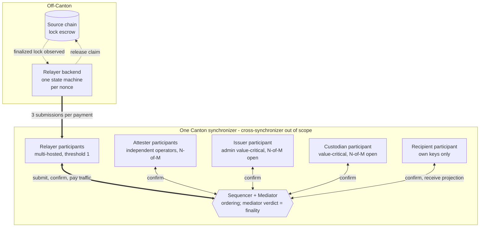
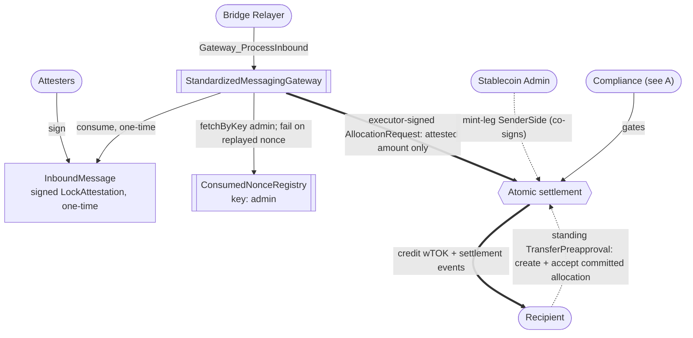
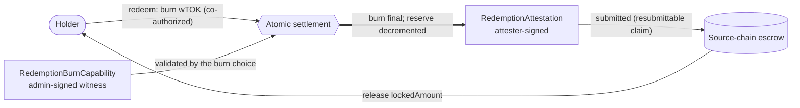
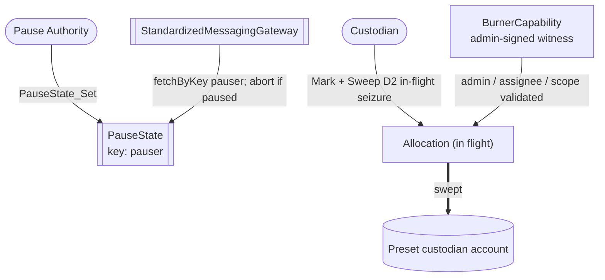

# Cross-chain stablecoin payment reference architecture

This document is a *reference design* for private, atomic settlement on Canton of stablecoin payments that originate on external blockchains. It composes the OpenZeppelin Canton components in this workspace with the Canton Network Token Standard V2.

A tag marks each component where it first appears. [Status at a glance](#status-at-a-glance) lists, once per component, what exists and what needs to be built.

| Tag | Meaning |
|---|---|
| `[EXPERIMENT]` | experimental code, in this workspace or in the `experiments/` folder of the `OpenZeppelin/canton-contracts` repository |
| `[EVIDENCE]` | code in the [`OpenZeppelin/canton-token-template`](https://github.com/OpenZeppelin/canton-token-template) repository, outside the experiment packages above |
| `[UPSTREAM]` | Splice, CIP, or external-ecosystem reference, including the CIP-0112 interface ([section 3](#upstream-choice-surface)) |
| `[FUTURE]` | proposed design with no implementation |
| `[GAP]` | a required change to code that already exists, and therefore a blocker for the claim it sits under |

## 1. Product Definition

Institutional participants accept value that reaches Canton from an external chain. The value arrives either as a Canton-native stablecoin such as `USDCx`, or as a gateway-minted wrapped instrument, written `wTOK` throughout. The settlement amount, the payer and payee identities, and the compliance markers project only to parties the design authorizes explicitly.

**Inbound** moves value from the external chain to Canton, by **lock-and-mint**. **Outbound** moves it back, by **burn-and-release**. Neither name describes a direction between parties inside Canton.

The cross-chain transfer must credit the recipient with exactly the intended amount or nothing at all, and no intermediary may hold the assets in transit. Settlement therefore centers on the [CIP-0112](https://github.com/canton-foundation/cips/blob/main/cip-0112/cip-0112.md) [committed allocation](https://github.com/canton-foundation/cips/blob/main/cip-0112/cip-0112.md#416-committed-allocations-for-prefunded-trading-and-iterated-settlement): each leg's amount is fixed on-ledger by the allocation side its authorizer signed, and one all-or-nothing transaction settles them. A signed side makes an amount non-repudiable. It does not make the amount *correct*. The binding checks of [section 3](#reserve-and-lock-attestation-model) are what tie the inbound amount, recipient, and instrument to the attestation.

`OpenZeppelin/canton-contracts` holds an [experimental implementation of that settlement](https://github.com/OpenZeppelin/canton-contracts/tree/7696749737885e25cd88422847105f890f03b00d/experiments/token/tokenCIP112-v1/daml/OpenZeppelin/TokenCIP112V1). Per-party projection is what makes it private: a counterparty sees only the legs on which it sends or receives, so one recipient's payment is never visible to another. The issuing admin of the settled instrument is the one deliberate exception. It signs that instrument's holdings and allocations, so it sits inside the trust boundary ([Privacy and Visibility Model](#privacy-and-visibility-model)).

For institutional control, the design proposes four gates. **D1** through **D4** are shorthand shared with the sibling reference architectures, not Canton or CIP-0112 requirements.

| Gate | Mechanism | Where enforced | Tag | Invariant |
|---|---|---|---|---|
| **D1** Compliance | a single-use attestation from a registry-listed attester, bound to this settlement's own legs and never cached | [`SettlementFactory_SettleBatch`](https://github.com/OpenZeppelin/canton-contracts/blob/7696749737885e25cd88422847105f890f03b00d/experiments/token/tokenCIP112-v1/daml/OpenZeppelin/TokenCIP112V1/Registry.daml#L79), against the [`TrustedAttesterRegistry`](https://github.com/OpenZeppelin/canton-contracts/blob/7696749737885e25cd88422847105f890f03b00d/experiments/token/tokenCIP112-v1/daml/OpenZeppelin/TokenCIP112V1/D1.daml#L22) pinned on `TokenRules` | `[EXPERIMENT]` (`canton-contracts`) | no valid attestation, no settlement |
| **D2** Seizure | mark the allocation, then sweep its locked holdings to a preset custodian account | [`TokenAllocation_MarkD2Seizure`](https://github.com/OpenZeppelin/canton-contracts/blob/7696749737885e25cd88422847105f890f03b00d/experiments/token/tokenCIP112-v1/daml/OpenZeppelin/TokenCIP112V1/Allocation.daml#L158) plus one of two sweep choices | `[EXPERIMENT]` (`canton-contracts`) | never burns the asset, never returns seized funds to the sender, and the freeze window is bounded and releasable |
| **D3** Identity | the recipient holds a `KycClaim` from an issuer listed in the `TrustedIssuerRegistry` | the gateway, at request time, before any allocation exists | templates `[EXPERIMENT]` (this workspace, `ShapeB`); the enforcing choice `[FUTURE]` | no valid claim from a listed issuer, no allocation request |
| **D4** Authority | every privileged action binds to a named role rather than to one admin | [`openzeppelin-access-control-v1`](https://github.com/OpenZeppelin/canton-contracts/tree/cec416d6e3c2118551c761d5598c403ab27ee342/experiments/access/access-control-v1) role administration and `openzeppelin-ownable-v1` two-step handover | `[FUTURE]` | privileges are granted, transferred, and revoked without redeploying, and each traces to a role |

**Privacy scope.** The privacy guarantee covers the Canton side only. The source-chain lock is a public transaction, and it must carry enough data to route the transfer on Canton. An observer of the source chain can therefore link a public lock of amount *N* to a named Canton recipient who will receive *N*. Canton's per-party projection hides everything downstream: the settled holding, the settlement events, the compliance markers, and every subsequent private transfer. Hiding that link is out of scope, whether through hashed commitments, shielded payloads, or relayer-side blinding.

### Operational Scope and Boundaries

| Feature Category | Out-of-Scope Architectural Components |
|---|---|
| Off-Canton Bridge Infrastructure | Everything behind the interface boundary: the relayer backend, the attester services, the source-chain lock escrow, external oracle infrastructure, source-chain validator sets, and cryptographic light-client proofs. |
| Stablecoin Mechanism | The issuance, peg, and CDP mechanism itself; `USDCx` issuance and its native rail are external. |
| Off-Ledger Compliance Shortcuts | Off-ledger caching of compliance status, probabilistic risk scoring, heuristic filtering. |
| Legacy Standards | Any reliance on the superseded CIP-56 token standard or legacy V1 allocation paths. |
| Cross-Synchronizer Operation | This design is cross-chain but single-synchronizer on Canton. Cross-synchronizer settlement and identity are out of scope. |

### Instrument Naming: `wTOK` vs `USDCx`

Every flow in this report mints, settles, and redeems `wTOK`, a generic gateway-minted wrapped instrument, whose holdings are [`TokenHolding`](https://github.com/OpenZeppelin/canton-contracts/blob/7696749737885e25cd88422847105f890f03b00d/experiments/token/tokenCIP112-v1/daml/OpenZeppelin/TokenCIP112V1/Holding.daml#L17) contracts, issued by the Stablecoin Admin.

Where a native rail already exists, as it does for `USDCx`, this design only *settles* its output by interface and takes no issuer role. The gateway is the rail for assets that have no native Canton path.

### Registry Uniqueness Under Non-Unique Keys

A [Canton 3.x key](https://docs.canton.network/appdev/modules/m3-contract-keys) does not enforce uniqueness, so this design has to supply it. The Bridge Relayer builds every inbound submission, and its disclosures decide which of two same-key registries the gateway resolves. A nonce registry that lacks an entry lets an already-minted lock mint twice. An issuer registry with a wider list passes a D3 check that the narrower one refuses. One botched rotation creates the pair: the successor goes on the ledger before the predecessor is archived.

**Decision.** Every keyed registry sits on an on-ledger successor chain. Each version pins the genesis contract id and consumes its predecessor. Each consumer checks a resolved registry against the genesis it pinned once. A planted parallel registry then fails a check, and no operator has to notice it.

**Consequences.** The genesis version cannot name itself, so its pinned field is empty. A consumer therefore accepts the genesis id itself, or any version that points at it. The gateway resolves with `fetchByKey`, so it must be a stakeholder of every registry it reads ([section 4.1](#41-component-standardized-messaging-gateway)). No check may rest on the absence of a key. The trusted-attester registry stays outside the scheme: the settlement registry pins it by contract id, which is the same anchoring without a key ([D1](#capability-gates-d1-d4)).

### Status at a Glance

Six of the thirteen components below are not built, the cross-chain boundary among them.

| Component | Tag | Location | What is missing |
|---|---|---|---|
| CIP-0112 settlement spine (`TokenRules`, `TokenAllocation`, `TokenHolding`, event log) | `[EXPERIMENT]` | [`canton-contracts` `tokenCIP112-v1`](https://github.com/OpenZeppelin/canton-contracts/tree/7696749737885e25cd88422847105f890f03b00d/experiments/token/tokenCIP112-v1) | nothing for settlement itself; the `wTOK` registry must still close [`TokenRules_Mint`](https://github.com/OpenZeppelin/canton-contracts/blob/7696749737885e25cd88422847105f890f03b00d/experiments/token/tokenCIP112-v1/daml/OpenZeppelin/TokenCIP112V1/Registry.daml#L149), the admin mint that consumes no attestation and so can issue unbacked supply `[GAP]` ([section 3](#reserve-and-lock-attestation-model)) |
| D1 attestation path (`TrustedAttesterRegistry`, `ComplianceAttestation`) | `[EXPERIMENT]` | same package, `D1.daml` | the choice that verifies an N-of-M attester quorum rather than the one `ComplianceAttestation` the spine verifies today `[GAP]` ([section 2](#decentralization-and-trust-topology)) |
| D2 seizure path (mark, two sweeps, `BurnerCapability`, `SeizureOrder`) | `[EXPERIMENT]` | same package, `Allocation.daml` and `D1.daml` | `LockedSimpleHolding_ForcedSweep`, the sweep for an already-*settled* holding, since the evidence template ships only `_Unlock` `[GAP]`; and capability revocation or rotation |
| D3 identity hook (`KycClaim`, `TrustedIssuerRegistry`) | `[EXPERIMENT]` | this workspace, [`experiments/identity/hook-shape-b`](../../experiments/identity/hook-shape-b/) | `Gateway_ProcessInbound`, the choice that runs the check on the inbound path, and the observer entries that authorize the gateway to read the claim and the registry `[GAP]` |
| D4 per-action role binding | `[FUTURE]` | libraries in `canton-contracts` `experiments/access` | the wiring; the role and ownership primitives exist, this rail does not use them yet |
| Access control, ownership handover, pausing | `[EXPERIMENT]` | `canton-contracts` `experiments/access` and `experiments/security` | nothing for access control and ownership; `PauseState` needs the observer entry that authorizes the gateway to read it `[GAP]` |
| Holdings and standing `TransferPreapproval` | `[EVIDENCE]` | [`canton-token-template`](https://github.com/OpenZeppelin/canton-token-template) | `TransferPreapproval_AllocateInbound`, a delegated choice that allocates on the settlement spine under the recipient's standing signature; the template's own `TransferPreapproval_Send` only sends a transfer ([section 4.2](#42-component-inbound-dvp-via-delegated-accept)) |
| Standardized Messaging Gateway | `[FUTURE]` | [section 4.1](#41-component-standardized-messaging-gateway) | the whole implementation |
| `LockAttestation` carrier and `ConsumedNonceRegistry` | `[FUTURE]` | [section 3](#reserve-and-lock-attestation-model) | the whole implementation |
| `wTOK` attested mint and redemption burn | `[FUTURE]` | [section 3](#reserve-and-lock-attestation-model) | the whole implementation |
| Contract keys on `PauseState` and the issuer registry | `[GAP]` | [section 1](#registry-uniqueness-under-non-unique-keys) | SDK support, Daml-LF 2.3 on Protocol Version 35, and a deploy-and-migrate path per template |
| Token Standard V2 interfaces | `[UPSTREAM]` | Splice `splice-api-token-*`, vendored as pinned DARs | nothing; consumed by interface |
| `daml-lint`, `daml-props`, `daml-verify` | `[FUTURE]` | [section 5.2](#52-automated-validation-engine) | the whole validation pipeline for this rail |

---

## 2. Architecture Overview

### Parties, Nodes, and Processes

Parties exist only on Canton. The source chain has addresses and keys, and neither ledger records that an address and a party belong together. One off-Canton process holds both credentials, and that is the only thing that links them. The pairing is therefore a deployment fact, not a protocol guarantee.

"The attesters sign" therefore means two different things. Inbound, the attester party signs the `InboundMessage`, and the source chain never sees that signature. Outbound, the escrow cannot read Canton. The `RedemptionAttestation` needs a signature the escrow's own verifier accepts, so each attester holds a source-chain key as well as a Canton party.

| Name | Kind | What it does |
|---|---|---|
| Bridge Relayer | party | settlement executor; signs the `TokenAllocationRequest`; holds `BRIDGE_RELAYER_ROLE`, which the gateway's `operator` field checks. Transport and liveness only, so a relayer with no attestation cannot mint |
| Attesters, M of them | party | the trust role, separate from the relayer's transport role; signs the `InboundMessage`, the `ComplianceAttestation`, and the `RedemptionAttestation`; listed in the `TrustedAttesterRegistry` |
| Stablecoin Admin | party | `wTOK` issuing admin; signs its holdings, allocations, and mint legs |
| Compliance Verifier | party | `TrustedIssuerRegistry` admin; issues the `KycClaim` |
| Custodian | party | `BurnerCapability` assignee; owns the preset sweep account |
| Recipient, or Holder outbound | party | signs the receiving allocation, live or through a standing `TransferPreapproval` |
| Pause Authority | party | signs the `PauseState` and maintains its key |
| Gateway Admin | party | the gateway's `admin`; maintains the `ConsumedNonceRegistry` key |
| Redemption operator | party | holds the `RedemptionBurnCapability` |
| Lawful-process authority | party | signs the `SeizureOrder`; registry-listed, and never the admin |
| Sequencer and Mediator | Canton node | hosts no application party |
| Relayer backend | off-Canton process | watches the source chain, one state machine per nonce, and submits every inbound command as the Bridge Relayer |
| Attester services | off-Canton process | M independent operators on M participants; each submits as its own attester party |
| Recipient wallet | off-Canton process | creates the standing `TransferPreapproval` and submits as the Recipient |
| Lock escrow | source-chain contract | holds the backing, and releases it against a verified `RedemptionAttestation` |

The gateway and the registries are contracts, not services. `StandardizedMessagingGateway` is a template with one choice that the relayer exercises. `PauseState`, `TrustedAttesterRegistry`, `TrustedIssuerRegistry`, and `ConsumedNonceRegistry` are single contracts that a caller fetches. `LockAttestation` is a data record inside the `InboundMessage`, not a contract of its own, so an attester signs the carrier and not the lock attestation.

### Node and Hosting Topology

The postures in the labels below are the targets that [Decentralization and Trust Topology](#decentralization-and-trust-topology) argues for. The cross-chain boundary sits outside the synchronizer.

The relayer is the only party on both sides of the boundary. It pays nearly all the traffic ([section 6.1](#61-traffic-costs)), and the rail halts if its validator runs out ([section 5.4](#54-failure-modes-and-recovery)).

### Decentralization and Trust Topology

Two constraints bound every posture below. First, a quorum written in Daml is worth its stated N only if the role party's [`PartyToParticipant` confirmation threshold](https://docs.canton.network/overview/reference/decentralization) is at least N. Second, a party above threshold 1 cannot submit for itself. It acts through another party's submission, or through external signing.

The **Stablecoin Admin** authors `wTOK` mint legs and the **Custodian** can sweep locked value. Both hold value-critical authority, so no single key may exercise either role. Canton offers two routes to an N-of-M posture, and the choice between them is open ([section 7](#7-open-design-questions)):

- **On-ledger approval workflow.** The multisig is written in Daml, as a [Multiple Party Agreement](https://docs.canton.network/appdev/modules/m3-design-patterns#multiple-party-agreement). The approvals are durable, named, and auditable on-ledger. The price is two rules. The role party must sit at a confirmation threshold of N or more, or the Daml quorum counts for nothing. And a party above threshold 1 can only build on state it created at threshold 1. An unplanned change therefore needs an upgrade, or a temporary return to threshold 1.
- **External party with threshold signing keys.** The role party's transactions require N of M keys held by independent organizations. The Daml code never sees this, and each action costs one ledger transaction. The price is that the signing ceremony must finish inside the prepared transaction's validity window, and the approval record stays off-ledger. Since [Canton 3.4](https://blog.digitalasset.com/developers/release-notes/canton-3.4-release-notes-for-splice-0.5.0) the threshold and the keys live on `PartyToParticipant`, which deprecates `PartyToKeyMapping`. Onboarding such a party today therefore means putting them there. The [Bitsafe decentralization-manager](https://github.com/DLC-link/decentralization-manager) is one candidate implementation.

| Role | Target posture | Why |
|---|---|---|
| Attesters | several independent parties in the `TrustedAttesterRegistry`, threshold N-of-M, never all-of-M | one unavailable or unvetted attester must not halt the rail, and one malicious attester must not mint |
| Bridge Relayer | multi-hosted on several participants, confirmation threshold 1 | it holds no minting trust and is the most submission-heavy role in the design; integrity comes from the attester split, and relay should ultimately be permissionless so no single party gates liveness |
| Pause authority | multi-hosted, confirmation threshold 1 | an emergency stop must be instant, and a quorum would slow it down; the price is a griefing window where a malicious pauser stalls settlement until deadlines lapse, capped by the sender's right to reclaim committed funds |
| Compliance Verifier | several independent issuers in the `TrustedIssuerRegistry` | a recipient needs a `KycClaim` from only one listed issuer, so no single issuer can block onboarding; the flip side is that the registry is only as strict as its most permissive issuer, which makes the choice of who to list a governance decision |
| Recipients | no rail-side decentralization | nothing binds a recipient without their own signature, live or through their standing `TransferPreapproval`, so they trust only their own keys and participant |

---

## 3. Target Design

The inbound payment is the critical path: an attested source-chain lock becomes a privately projected Canton credit through a fixed sequence of steps on the CIP-0112 spine. Steps 2 and 4 run on the settlement spine that exists; everything at the cross-chain boundary is proposed design ([status at a glance](#status-at-a-glance)).

**Bridge mode.** The rejected alternative is lock-and-unlock, which pays a recipient from liquidity held on the destination side. It adds a liquidity-provider role and an inventory-imbalance surface that a reference rail does not need. The gateway interface is the seam where an alternative mode plugs in.

1. **Inbound message.** The external chain finalizes a locked deposit. An attester signs an `InboundMessage` carrying the typed `LockAttestation` (locked amount, Canton recipient, target instrument, nonce, expiry). The carrier has one attester signatory, which matches the single attestation the spine verifies. An N-of-M quorum aggregated onto the carrier is the design target ([section 2](#decentralization-and-trust-topology)). `Gateway_ProcessInbound` consumes that carrier once, which is what gives replay protection.
2. **Request and gate.** The relayer creates a `TokenAllocationRequest`, an executor-signed request naming the mint leg with exactly the attested amount. The identity check runs on-ledger and fails closed: the recipient must hold a valid, unexpired `KycClaim` from a listed issuer. That is D3, and the gateway choice enforces it. The settle later needs a D1 `ComplianceAttestation`, which is a separate contract from the carrier of step 1.
3. **Recipient co-authorization via `TransferPreapproval`.** For an offline corporate treasury that cannot sign interactively, the recipient's wallet pre-establishes a `TransferPreapproval` for the wrapped instrument. The relayer exercises it, through a delegated allocate-and-accept choice ([section 4.2](#42-component-inbound-dvp-via-delegated-accept)), to run `AllocationFactory_Allocate`, which commits a `TokenAllocation` in one atomic submission. That same submission exercises `AllocationRequest_Accept`, so the request is consumed and the payment leaves no residue.
4. **Atomic DvP.** The relayer packages the committed allocations into one `SettlementFactory_SettleBatch`. The batch is all-or-nothing. On success the recipient's holding projects to the recipient, the executing relayer, and the Stablecoin Admin. The matching events go out through the `TransferEventsV2.EventLog` host. Events are scoped per authorizer, so a recipient in a multi-leg batch sees its own legs and no one else's.

### Upstream Choice Surface

Steps 3 and 4 call CIP-0112 interface choices, not choices this design owns. `AllocationFactory_Allocate`, `AllocationRequest_Accept`, `SettlementFactory_SettleBatch`, `Allocation_Cancel`, and `Allocation_Withdraw` are declared in `Splice.Api.Token.*`, and the settlement registry supplies the `*Impl` method behind each one.

Registry-specific arguments travel in the standard's own extension slot, `ExtraArgs`. The D1 attestation reaches the settlement factory that way, and a settle that omits it fails instead of passing ungated. The registry threads its own per-batch authorization through the same slot. That is what makes the conservation check and the D1 gate unavoidable instead of conventional. Settlement returns a result per allocation and no receipt contract, so there is nothing on-ledger to query afterwards.

### Data and State Flow

Keyed contracts are marked with their key.

**A. Compliance and identity (D1 + D3).** The registries list several independent attesters and issuers. The gates fire at different points: D3 identity at **request** time in the gateway, D1 compliance at **settlement** time. They are also reached differently. The gateway resolves the issuer registry by key. The attester registry is pinned on `TokenRules` instead, so the settling caller supplies only the attestation. `ComplianceAttestation_Verify` also checks `registry.admin == factoryAdmin`, but on a registry the caller never named.

**B. Inbound mint settlement.**

**C. Outbound redemption.** The holder's burn is the irreversible commit; the attested release on the source chain follows it.

**D. Pausing and seizure (control plane).** The pause authority halts inbound processing by key; the Custodian's sweep is validated against the capability witness and hardcoded to the preset destination.

### Execution Model

Only the settle is atomic. The inbound path is three relayer-submitted ledger commands, orchestrated off-ledger by the relayer's backend.

Command deduplication (24h) makes those three commands safe to resubmit after a crash: resubmitting cannot double-execute. A stalled workflow blocks only this rail, since inbound settlements serialize on the per-rail nonce registry ([section 5.5](#55-throughput-and-contention)).

The relayer backend tracks each inbound payment as a state machine keyed by nonce and command id. Every step either lands on the completion stream, or times out against its deadline and marks the workflow stuck.

### Time Model and Deadlines

CIP-0112 defines the deadline fields and no values. `settlementDeadline` stops a settle and makes a committed allocation withdrawable, and a registry-set `expiresAt` handles hygiene expiry. Enforcement sits in each token registry, so with a third-party token the policy is that registry's (`Amulet` caps allocation lifetimes at 90 days).

The settlement registry's own ceilings bind before any policy this design sets: `maxTTL` on how long an allocation may occupy storage, which rejects a longer deadline outright instead of truncation; `maxAttestationValidity` on an attestation's window, which stops an attester issuing a permanent pass; and `maxSeizureExtension` on how far past the settlement deadline a D2 seizure window may reach. Their values are an open question ([section 7](#7-open-design-questions)).

Each flow therefore derives its own deadline, between the slowest required actor's SLA and the tightest of `maxTTL`, staleness tolerance, and capital-lock tolerance. Ledger-time tolerance makes sub-minute deadlines meaningless. The prepared-transaction window bounds each submission and not the allocation, so a multi-day `settlementDeadline` still lets every submission be signed inside its own window.

| Flow | Slowest actor | Window | Rationale |
|---|---|---|---|
| Inbound settle | automated attester plus relayer | `settlementDeadline`, minutes to an hour | not price-sensitive, but a lapse strands the spent nonce, so the deadline must comfortably exceed the attester and relayer SLAs |
| Outbound redemption | attester | `settlementDeadline`, hours | burn-first; the source-chain claim is standing and replay-protected, so slow release costs latency, not funds |
| D1 attestation | attester | the attestation's own `expiresAt`, capped by `maxAttestationValidity` | verified at settle, so the window must span gateway processing through settle; the registry cap stops an attester issuing a permanent pass |

### Reserve and Lock-Attestation Model

The flow above settles an inbound payment privately. What makes it a bridge is the binding between the Canton mint and the backing locked on the source chain.

**What is attested.** Every inbound mint is authorized by a typed `LockAttestation`, carried inside the `InboundMessage`. It asserts that backing is locked on the source chain, and that the backing is claimable only by minting the matching amount on Canton. It identifies the lock, the amount, the Canton recipient, the target instrument, a one-time nonce, and its own expiry. The lock and the asset are foreign references, so nothing on Canton can validate them. That is the trust the attester set carries.

**Who signs it, and what binds.** Not a lone relayer. The check runs on-ledger against the `TrustedAttesterRegistry`, and that is what separates the relayer's transport role from the trust role. The target posture is a threshold N-of-M attester set ([section 2](#decentralization-and-trust-topology)). The mint binds amount, recipient, and instrument to the attestation. It also requires the attestation to be registry-trusted, unexpired, and to carry an unconsumed nonce. Any failure fails the batch: no mint, no partial credit.

**How the nonce is enforced.** Two layers. `InboundMessage_Consume` archives the carrier, so one carrier can never be processed twice. A *second* carrier could still be attested for the same lock. An admin-signed `ConsumedNonceRegistry` therefore records `(sourceChainId, nonce)` at consumption and fails closed on a duplicate, which holds even if the attesters misbehave. The registry observes the attester set, so the parties who must not re-attest a used nonce can read the dedup state and witness any admin edit. Since `lockTxId` already identifies the lock, an implementation may key entries by `(sourceChainId, lockTxId)` instead.

**Reserve invariant.** Minted wrapped supply never exceeds the sum of the locked amounts of valid, unredeemed attestations. Mint increments the claimed reserve and redemption decrements it.

**Which choice has to enforce the binding.** Settlement conserves value at settle time, and it funds the recipient's leg from a sender's locked holdings. The exposure to unbacked issuance is therefore the *creation* of those wrapped holdings, not the settle. One attested-mint choice, co-authorized by the Stablecoin Admin, must be the only creator of `wTOK` holdings. It re-verifies the checks above and creates the holdings that fund the admin's sender-side leg. The mint is a funded transfer leg and not a sibling create, so the minted amount passes the same per-instrument conservation check as every other leg.

That is a required change to the registry, not a property of it. The spine ships `TokenRules_Mint`, an admin mint that checks only a positive amount and a regular target account and consumes no attestation. The `wTOK` registry must close it, either by using a registry template that omits the choice or by gating the choice on the same attestation. Appending a stricter choice is not enough, because a stricter choice does not close a looser one ([Smart Contract Upgrade Path](#smart-contract-upgrade-path)). Until then the 1:1 reserve invariant holds by admin discipline rather than by construction. `TokenRules_Burn` is admin-plus-account-controlled in the same way, which shapes the `RedemptionBurnCapability` below.

### Outbound Redemption: Burn on Canton, Release on Source Chain

Redemption mirrors the inbound flow:

1. **Burn on Canton.** The holder requests redemption, the burn destroys the wrapped holding, and the burn produces a typed `RedemptionAttestation` `{ cantonInstrumentId, amount, sourceChainDestination, drawnDown, nonce, expiry }`. That attestation names the instrument the burn removed supply from. It lists the lock attestations the burn draws against, with the amount taken from each, and it bounds the standing source-chain claim. Without all three the reserve arithmetic has nothing on-ledger to bind to. The burn gate is **not** the D2 `BurnerCapability`, which is the Custodian's seizure credential and must never be reused for user-initiated redemption. A separate `RedemptionBurnCapability` gates the redemption burn. It has the same witness shape, but the redemption operator holds it, and the holder whose asset the burn destroys co-authorizes the choice.
2. **Attest.** A registry-trusted attester signs the `RedemptionAttestation` through the same `TrustedAttesterRegistry` path.
3. **Release on the source chain.** The signed attestation is submitted to the source-chain escrow, which releases `amount` to `sourceChainDestination`, and the reserve is decremented. The burn references and draws down specific unredeemed `LockAttestation`s, so `sum of lockedAmount(unredeemed)` and actual supply cannot drift under partial burns.

**Cross-chain atomicity.** The source-chain release is not in the same Daml transaction as the Canton burn. The design is therefore burn-first and attested-release: the Canton burn is the irreversible commit, and the foreign release is gated on the signed burn attestation. If the release stalls, the burn is already final, so the reserve accounting stays sound. The redemption becomes a standing, replay-protected claim, and the holder or any relayer can resubmit it until the escrow releases. The failure mode is delayed release, never double-spend or unbacked supply.

### Inbound Delivery Guarantees and Recovery

Nothing guarantees that the Canton-side settlement of an attested lock *executes*: delivery liveness is bounded by the trusted relayer and attester set. The design adds no automatic cross-chain recovery protocol. Compensating messages back to the source chain would need multi-round message passing, with its own delay, cost, and failure surface. What remains is structural and fail-closed ([section 5.4](#54-failure-modes-and-recovery)). The source-chain lock is outside Canton's authority either way, so a timeout and forced refund at the escrow belongs to the gateway contract and is an open question ([section 7](#7-open-design-questions)).

### Privacy and Visibility Model

Target visibility per template, all in the settlement spine unless stated otherwise. Anyone outside a row sees that contract only transiently, when a transaction they witness divulges it:

| Contract | Signatories | Observers |
|---|---|---|
| `TokenAllocationRequest` | settlement executors (the bridge relayer) | the leg's authorizer |
| `AllocationFactory_Allocate`, `TokenAllocation` | the instrument admin (Stablecoin Admin for `wTOK`), the leg's authorizer | settlement executors |
| `TokenEventLog`, an ephemeral emit host archived in the transaction that creates it | the instrument admin | none |
| `wTOK` holding | the instrument admin, the account's parties | the lock's observers, when locked |
| `ComplianceAttestation` | the attester | the executor verifying it |
| `TrustedAttesterRegistry` | the factory admin | listed attesters |
| `SeizureOrder` | the lawful-process authority | the instrument admin |
| `TokenAllowance` | the instrument admin, the owner's account parties | the spender |
| `KycClaim`, `TrustedIssuerRegistry` (this workspace) | the issuing party / the registry admin | the claim's subject and the gateway's admin / the gateway's admin |
| `PauseState`, gateway and nonce registry | the pauser / the gateway's admin and operator / the gateway's admin | the gateway's admin / none / the attester set |

Consequences:

- **No recipient sees another recipient's legs.** Each `TokenAllocation` carries only the legs its own authorizer sends or receives. A batch of several inbound payments therefore discloses nothing across them.
- **The Stablecoin Admin sees every `wTOK` payment.** It signs the instrument's holdings and allocations, and a leg's `meta` payload travels into the event log. Amounts, accounts, and memos are readable by construction. This is a trust assumption and not a leak to close. An issuer that authors the mint leg cannot also be blind to it, and CIP-0112 puts the instrument admin on those contracts. The boundary follows the instrument, not this design: for `USDCx`, the party in that position is Circle.
- **The relayer and the attesters see what they handle.** The relayer is an executor, so it observes every allocation it assembles. Its transport-only role bounds its authority, not its visibility. Attesters see the legs of the settlements they attest, so registry membership is a privacy decision as well as a compliance one. The Custodian sees nothing until a seizure, because the D2 hook holds its destination as a data field and not as an observer entry.
- **A gate the gateway runs makes the gateway a stakeholder.** A fetch needs authorization from one stakeholder of the contract it returns, and `Gateway_ProcessInbound` carries only the gateway's own admin and operator authority. The pause state, the issuer registry, and every `KycClaim` the gateway checks must therefore name the gateway's admin as an observer. That is a required change to three templates that already exist. The admin carries it rather than the operator, which keeps durable registry and claim visibility off the relayer, whose set the design wants to open ([section 2](#decentralization-and-trust-topology)). The submitting relayer still witnesses the claim transiently, because a fetch divulges to whoever witnesses the exercise.
- **Settlement outcomes arrive as events, not as a queryable log contract.** The emit host is created and archived inside one transaction, so the event data lives in the exercise node its observers witness. Integrators therefore read the transfer-events stream ([section 5.6](#56-off-ledger-reconciliation)) and not the ACS. The durable evidence of a settled payment is the recipient's holding.
- **No PII on ledger.** A `KycClaim` carries an issuer reference, not personal attributes; the data stays with the issuer off-ledger.

### Capability Gates D1-D4

The four gates and their invariants are tabled in [section 1](#1-product-definition).

**D1.** The check runs on `SettlementFactory_SettleBatch`, which requires an attestation covering this specific settlement from a registry-listed attester. Attestations are single-use, so none can be cached or reused. The trust anchor is a pinned contract id, not a key and not a caller argument: `requireD1Attestation` reads `requiredAttesterRegistryCid` from `TokenRules`, and the caller supplies only the attestation through the choice context.

Two consequences belong to the deployment rather than to the code. A registry created with no attester registry pinned verifies nothing, and every settle then succeeds without an attestation. Setting that field is a precondition of the D1 claim, not a default. And rotating the attester roster means recreating `TokenRules`, because the cid is stamped on it.

**D2.** Seizure is a strict lock-and-sweep: a mark locks the allocation, then a sweep moves the locked holdings to the preset custodian account. The equivalent sweep for an already-settled holding does not exist yet, because the evidence template ships only `_Unlock`.

The two sweep paths differ in authority. The in-flight sweep needs the admin's mark plus the burner's capability, and must land inside both the settlement deadline and the seizure window. One choice is the only path past the settlement deadline, and it costs more. It needs a `SeizureOrder` signed by a non-admin party that the trusted-attester registry lists, and that order binds the case reference, the subject account, and the custodian destination. The admin cannot sign it.

The mark is bounded and reversible. It refuses a window past `maxSeizureExtension`, the admin can lift it, and any stakeholder can release it once it lapses. An abandoned mark therefore cannot strand funds. `BurnerCapability` is a witness and not an actor, so a sweep validates it before it archives any holding. D2 never burns the asset and never returns seized funds to the sender, though ordinary transfer *failures* do return to sender. Revocation today means the admin archives the capability; a rotation choice is an open question ([section 7](#7-open-design-questions)).

**D3.** Identity is single-synchronizer: a recipient must hold a `KycClaim` from a party in the `TrustedIssuerRegistry`. Both templates live in this workspace, but the gateway choice that *enforces* the check does not exist. The gate is therefore templates plus a test harness today, not a wired inbound rail. Cross-domain resolution is deferred and kept forward-compatible through additive SCU.

**D4.** No single admin holds every privilege. Each action sits with the role responsible for it: relay with the `BRIDGE_RELAYER` role grant, mint-leg authoring with the `STABLECOIN_ADMIN`, seizure with the `CUSTODIAN`'s capability witness, and registry maintenance with the `COMPLIANCE_VERIFIER`. A permission binds by direct controllership when its holder is fixed for the life of the contract. It binds through `RoleGrant` and `requireRole` when it must be swappable or revocable, so authority can change hands without a redeploy.

### Smart Contract Upgrade Path

The design stays upgradeable through additive Smart Contract Upgrade. Cross-domain identity (D3, deferred) is the pattern: the settlement path is never mutated, and a new choice takes the proof as an appended optional argument, so existing relayers keep working. The identity-hook upgrade spike in this workspace is the evidence that the additive path holds.

Two limits bind this design specifically. A template's `key` definition can be neither added nor removed in a later version. Package vetting rejects the upload, so the compiler never catches it. The key plan of [section 1](#registry-uniqueness-under-non-unique-keys) is therefore a deploy-and-migrate path for `PauseState` and `TrustedIssuerRegistry`, not an upgrade. And SCU extensions are not security retrofits: adding a stricter choice does not close the looser one. If the stricter path must become mandatory, the upgrade must also make the looser choice fail unconditionally and mark it `deprecated`.

### Extension Points

- The Standardized Messaging Gateway is the substitution point for the bridge boundary: an alternative bridge mode, or a different source-chain proof scheme, changes the gateway and leaves settlement and compliance untouched.
- The `KycClaim` and `TrustedIssuerRegistry` identity hook is the substitution point for a richer identity regime, including the deferred cross-domain D3.

---

## 4. Component Structure

Two components carry authority this design has to place deliberately.

### 4.1 Component: Standardized Messaging Gateway

The gateway is a contract signed by its admin and its operator, with one nonconsuming choice that the relayer exercises. That choice does six things. It validates the relayer's role grant. It resolves the pause state and the identity and nonce registries by key, and checks each against the genesis anchor it pins. It reads the recipient's `KycClaim`. It consumes the one-time attested carrier. It records the nonce fail-closed. And it creates an executor-signed allocation request. Every field of the mint leg it names binds to the carrier's `LockAttestation`: amount, recipient, instrument, and the recipient's receive side of the leg.

The choice runs with the gateway's admin and operator authority and nothing else. Each contract it reads must therefore name the gateway's admin as an observer for the read to be authorized ([Privacy and Visibility Model](#privacy-and-visibility-model)). Only the nonce registry satisfies that today, because the gateway's own admin signs it.

Binding the recipient happens in 4.2, under the recipient's own standing signature, because the gateway holds no recipient authority.

### 4.2 Component: Inbound DvP via Delegated Accept

The recipient's co-authorization flows through a choice on a contract the recipient signed, which contributes their authority when the relayer exercises it.

The evidence template exposes only `TransferPreapproval_Send`, which sends a transfer and cannot allocate on the settlement spine. The delegated choice this design needs, `TransferPreapproval_AllocateInbound`, does not exist. Two shapes can carry it, and the choice between them is open: an SCU-additive choice on the evidence template, or a dedicated recipient-signed `DelegatedAcceptGrant` template. Either way, both spine steps that need the recipient's signature run inside its body. Those steps create the recipient's allocation from the gateway's request, then accept it into a committed allocation.

The relayer then settles the issuer's sender side and the recipient's receiver side in one batch. It presents the D1 attestation through the standard's extension slot. The attester registry is pinned on `TokenRules`, so the caller never names it.

## 5. Security and Auditability

Security rests on Daml's authorization model and on per-party projection, not on cryptography this design supplies.

### 5.1 Security Invariants

- **Conservation of funds.** Settlement cannot output more value than its input `TokenAllocation`s. Every settle path archives the locked inputs and asserts, per instrument, that they cover the authorizer's sender-side amounts. Any surplus returns as one change holding.
- **1:1 reserve backing.** Minted wrapped supply never exceeds the sum of valid, unredeemed `LockAttestation`s. Blocked on closing the spine's admin mint `[GAP]` ([section 3](#reserve-and-lock-attestation-model)).
- **Replay protection.** One source-chain lock can credit Canton at most once, through one-time carrier consumption and then the consumed-nonce registry, provided that registry sits on its anchored successor chain ([section 1](#registry-uniqueness-under-non-unique-keys)).
- **Privacy partitioning.** Amount, payer, and memo of a settled leg project only to that leg's counterparties, the executing relayer, the attester whose attestation gates the settle, and the instrument's issuing admin. The Compliance Verifier observes no settlement leg. The per-authorizer `TokenAllocation` is what enforces this, and a recipient of a different leg in the same batch seeing them would break it.
- **Non-custodial recipient binding.** No allocation binds a recipient without their signature, live or through their standing `TransferPreapproval`. Committed value is recoverable once the settlement deadline passes, and the spine refuses to create an allocation that has no deadline at all.

### 5.2 Automated Validation Engine

Three tiers apply to the invariants above: [`daml-lint`](https://github.com/OpenZeppelin/daml-lint/commits/main/) for decimal bounds and archive-before-execute, [`daml-props`](https://github.com/OpenZeppelin/daml-props) for conservation and reserve backing under generated inputs, and [`daml-verify`](https://github.com/OpenZeppelin/daml-verify) for the narrow invariants a proof can close. None is wired to this rail yet.

### 5.3 Threat Model

| Vector | Attack | Mitigation |
|---|---|---|
| Malicious relayer routing | Routes valid inbound funds to an unauthorized or sanctioned account. | The signed `LockAttestation` pins `cantonRecipient`, and D3 requires a `KycClaim` whose `subjectParty` matches it. The relayer cannot spoof the destination. |
| Unbacked mint | A relayer, or anyone without attester authorization, mints `wTOK` with no real source-chain lock. | Amount and instrument derive only from a registry-trusted, unexpired, single-use `LockAttestation`, and a lone relayer holds transport authority rather than trust authority. The admin mint has to be closed first `[GAP]` ([section 3](#reserve-and-lock-attestation-model)). Residual risk concentrates in the attester set. |
| Replay of a used lock | A consumed `InboundMessage`, or a second carrier for the same lock, is submitted again to mint twice. | One-time carrier consumption plus the consumed-nonce registry: a duplicate `(sourceChainId, nonce)` fails closed even if the attesters misbehave, provided the resolved registry sits on the pinned successor chain. |
| Delegated spend on `wTOK` | A spender draws on a CIP-86 allowance to move a holder's balance without a fresh signature. | An allowance (`TokenRules_ApproveAllowance`, `TokenRules_TransferFrom`) is created only by the owner's own account parties and is capped by `remaining`. Whether `wTOK` exposes the surface at all is the same decision as closing the admin mint ([section 7](#7-open-design-questions)). |
| Shadowing registry duplicate | A rotation leaves two `ConsumedNonceRegistry` or `TrustedIssuerRegistry` contracts active under one key, and the submitter discloses whichever suits it. | The key prevents nothing, because Canton 3.x keys are not unique. Each consumer checks the resolved registry against the genesis anchor it pins and fails closed when the registry is off that chain. |
| Toxic or spam inflow | A sender forces a settlement onto an unwilling recipient. | The allocation never commits without the recipient's accept ([section 5.1](#51-security-invariants)); unsettled allocations expire and return to sender. |
| Compromised admin key | A compromised Stablecoin Admin or Custodian key attempts arbitrary expropriation. | D2 sweeps are hardcoded to the preset `custodianDestination`, and a sweep past the settlement deadline needs a `SeizureOrder` the admin cannot sign. An in-flight seizure inside the deadline needs no such order, so that window is the residual exposure. Supply-changing authority is slated for N-of-M multisig; today a single key holds it. |
| D1 deployed unset | The `wTOK` registry is created with `requiredAttesterRegistryCid = None`, so every settle passes with no attestation. | The spine offers no mitigation, because an unset field is a silent no-op. The reference implementation sets and asserts the field at deployment, which is a deployment-time control rather than a code-level one. |
| Forced upgrades breaking in-flight allocations | A poorly executed upgrade mutates fields, so existing `TokenAllocation` contracts can no longer settle. | Programmatic adherence to the SCU rule (Optional appends and new choices only), so existing choices stay operable and in-flight settlements conclude before users transition. Adding a key is outside that rule and is caught at package vetting, which only `--localnet` can exercise. |
| UTXO fragmentation | Many small transfers accumulate holding dust. | Settlement returns a sender's surplus as a single change holding per instrument rather than many fragments. |
| DAR unvetting | A participant unvets the rail's DAR, which blocks every choice on contracts its parties are stakeholders of. | A transaction succeeds only if every participant hosting each informee has vetted the package version the submitter selected. Unvetting therefore freezes contracts rather than freeing them: the holder cannot move the asset either, and the locked value stays swept-able once re-vetted. Attester-side liveness risk is bounded by the N-of-M posture; holder-side unvetting is an inherent Canton vetting property with no protocol-level bypass. |

### 5.4 Failure Modes and Recovery

Beyond the adversarial vectors sit liveness failures: parties that crash, stall, or never appear, and the infrastructure they depend on. One invariant governs them.

**Bounded custody.** Every locked holding has a unilateral, time-bounded exit for its owner that does not depend on the workflow contract surviving. A committed allocation becomes withdrawable after `settlementDeadline`. Once the funding lock expires, the account parties can reclaim the holding directly, which covers the case where the admin already collected the referencing allocation. The non-recoverable resource is not funds but the consumed nonce: a settlement that lapses after `Gateway_ProcessInbound` needs a fresh attestation to re-drive. The sole custody exception is an active D2 seizure with a finite window and a lawful-process reference.

| Failure | Effect while pending | Recovery path | Funds locked at most |
|---|---|---|---|
| Attester never signs the carrier | nothing on Canton | reclaiming the source-chain lock is an open question ([section 7](#7-open-design-questions)) | nothing locked on Canton |
| Relayer crashes before `Gateway_ProcessInbound` | nothing consumed | any relayer resubmits; the carrier is standing | nothing locked |
| Relayer crashes after `Gateway_ProcessInbound` | nonce spent, settlement pending | complete allocate and settle on restart (deduplication-safe); if the deadline lapses, funds unlock but the nonce stays spent | `settlementDeadline` |
| Attestation expires before the settle | settle blocked, fail closed | re-attest within the window, else deadline lapse and withdraw | `settlementDeadline` |
| Recipient has no `TransferPreapproval` | delegated accept fails, nothing locked | recipient establishes the preapproval; relayer retries | nothing locked |
| Pause during in-flight settlement | settle blocked by `whenNotPaused` | unpause, or deadline lapse and withdraw (the griefing window of [section 2](#decentralization-and-trust-topology)) | `settlementDeadline` |
| Relayer validator out of traffic | the rail halts, because every inbound submission is relayer-paid | traffic top-up and monitoring ([section 6](#6-network-economics-traffic-costs-and-app-rewards)) | `settlementDeadline` |
| Synchronizer outage | ledger halted: no one can settle, and no one can withdraw | service resumes; if `settlementDeadline` lapsed during the outage the allocation is withdraw-only | outage duration plus `settlementDeadline` |
| D2 marked, never swept | settle, withdraw, and cancel all blocked | `TokenAllocation_UnmarkD2Seizure` by the admin, or `TokenAllocation_ReleaseLapsedD2Seizure` by any stakeholder once the window lapses | seizure window end, itself capped by `maxSeizureExtension` |

### 5.5 Throughput and Contention

Every inbound mint records its nonce in one admin-keyed `ConsumedNonceRegistry`, and each settlement archives and recreates that contract. Inbound settlements for the rail therefore serialize. The contention is per rail, and it follows from the consuming nonce record.

Sharding the registry is the mitigation, one shard per `sourceChainId` or per source-chain escrow contract. That restores parallelism across sources, and each shard keeps its own fail-closed dedup guarantee. Independent rails settle in parallel, and several allocations can ride one `SettlementFactory_SettleBatch`.

### 5.6 Off-Ledger Reconciliation

The Token Standard V2 transfer-events API emits holdings-change events, and the recipient correlates them with the id of the gateway's `InboundMessage`. That gives a 1:1 linkage between the external lock or burn and the Canton credit. The API is upstream and not vendored here, and the linkage is a reference pattern.

---

## 6. Network Economics: Traffic Costs and App Rewards

Who pays for the rail, and who earns from it, is not symmetric. Both follow from where the design puts submission and signing.

### 6.1 Traffic Costs

Cost scales with serialized view bytes, and with the number of recipients each view projects to ([CIP-0042](https://github.com/canton-foundation/cips/blob/main/cip-0042/cip-0042.pdf), [CIP-0084](https://github.com/canton-foundation/cips/blob/main/cip-0084/cip-0084.md)). The projection choices of this design are therefore its cost model.

- An inbound payment is roughly three relayer-submitted transactions, plus the attester's carrier and attestation and the issuer's mint-leg funding. The settle is the heaviest: it projects the batch outputs to the recipient, the relayer, and the Stablecoin Admin, and verifies the attestation and registry on the way.
- The Bridge Relayer pays for nearly everything. Its own purchases mint `ValidatorRewardCoupon`s to its validator operator, a partial rebate.
- Failed transactions burn traffic and earn no rewards, because CIP-0104 credits only successful confirmation requests. The loser of two concurrent inbound mints retries and pays twice; sharding the nonce registry bounds that waste as well as the contention ([section 5.5](#55-throughput-and-contention)).
- Several allocations can ride one `SettlementFactory_SettleBatch`, which shares one confirmation round-trip and one set of views.
- Validator auto-top-up is off by default, and the validator's reserved-traffic floor protects its own automation rather than this app. Running the rail requires configured top-up plus balance monitoring on the relayer's validator.

### 6.2 App Rewards

Traffic-based app rewards ([CIP-0104](https://github.com/canton-foundation/cips/blob/main/cip-0104/cip-0104.md)) are off until the super validators vote them on. The analysis below assumes they vote it on.

The party operating the gateway holds the `FeaturedAppRight`. Rewards accrue to the parties that *confirm* a successful request, not to the one that submits it. Per-transaction beneficiary attribution does not exist, so the gateway operator settles any split with the attesters or the Stablecoin Admin off-ledger, out of its own allowance.

Two tensions follow, both specific to this design. First, a `FeaturedAppRight` names one provider party, which sits poorly with permissionless relay ([section 2](#decentralization-and-trust-topology)). The relay set either shares one party, or leaves most relayers unrewarded. Second, the earn rule pays signers and not submitters. The relayer signs only the `TokenAllocationRequest`, while the Stablecoin Admin signs the instructions, allocations, and holdings. Most of the credit for relayer-funded transactions therefore goes to the admin if the admin is featured, and to nobody if only the relayer is.

The report defines no fee model, so there is no revenue for rewards to rebate: the credit is an issuance-scaled fraction of each transaction's own burn and cannot carry the rail by itself.

---

## 7. Open Design Questions

Decisions to settle before implementation starts, rather than build tasks. Severity is how much of the design the answer moves; **Blocks** names what cannot be built or deployed until it is answered. The owner is the internal team unless the question belongs to someone else by construction.

| Question | Blocks | Severity | Owner |
|---|---|---|---|
| **Attester and relayer trust model.** [Section 2](#decentralization-and-trust-topology) fixes the shape. Open: M and the threshold N, attester selection, rotation, slashing for a false attestation, how the set is governed, and whether the quorum-verifying choice takes one aggregated attestation or M attestations. | the quorum-verifying choice, and any production attester set | **High** - the largest trust surface in the design | internal team |
| **Multisig for value-critical roles.** Open: whether the Stablecoin Admin and the Custodian each use the on-ledger approval workflow, an external party with threshold signing keys on `PartyToParticipant`, or a combination, the N and M per role, and the confirmation threshold that hosts each role party, because the on-ledger route is only as strong as that threshold. | party onboarding for both roles; today a single key holds each | **High** - a compromised key is unmitigated until it lands | internal team |
| **Closing the admin mint on `wTOK`.** Open: whether `wTOK` gets a purpose-built registry template that omits `TokenRules_Mint` and the allowance surface, or the shared `TokenRules` gains an attestation gate and keeps allowances, and which of the two the SCU path can deliver on a live rail ([section 3](#reserve-and-lock-attestation-model)). | the `wTOK` registry template, and with it the reserve invariant | **High** - the headline economic claim rests on it | internal team |
| **Registry uniqueness enforcement.** Open: who pins the genesis contract id and how it reaches each consumer, how a rotation keeps predecessor and successor from being active together, whether the chain is walked on every read or trusted after one anchor check, and whether keying `PauseState` earns a new package lineage at all ([section 1](#registry-uniqueness-under-non-unique-keys)). | the gateway's registry resolution, and the keying work | **High** - replay protection and the D3 gate both rest on it | internal team |
| **Capability lifecycle.** Open: the SCU-additive `BurnerCapability_Revoke` and `_Rotate` shape (single contract or a registry of capabilities), and the holder and co-authorization model for the `RedemptionBurnCapability`. | any public authority surface, and the outbound burn gate | Medium | internal team |
| **Outbound-redemption atomicity.** Burn-first and attested-release rules out double-spend and unbacked supply, but the foreign release is not atomic with the burn. Open: the standing-claim resubmission protocol and SLA for a stalled release, and whether a bounded grace window before burn suits specific source chains. | the redemption operator's runbook and SLA | Medium | internal team |
| **Synchrony and time assumptions.** Open: the values for `maxTTL`, `maxAttestationValidity`, and `maxSeizureExtension`, the margin between source-chain finality and Canton ledger time, attester turnaround ceilings, and whether the nonce should be recorded at settlement rather than at the gateway, since no window size makes a consumed-but-unsettled nonce retryable. | every deployment, since `TokenRules` stamps the ceilings at creation | Medium | internal team |
| **Expired inbound-allocation lifecycle.** Open: who *operationally* runs the post-deadline reclaim for a dead inbound flow, since an automated handler needs executor or authorizer authority, and how the local lifecycle aligns with the upstream Token Standard V2 allocation lifecycle once imported. | the reclaim automation and its authority model | Medium | internal team |
| **Gateway behavior under source-chain reorgs.** Open: how inbound attestations are sequenced if the origin chain deep-reorgs, and whether the gateway manages confirmation delays internally or the relayer uses a time-locked `TokenAllocation` against rollback risk. | the production gateway's finality policy | Medium | whoever builds the production gateway |
| **Aligning gateway scope with native rails.** Open: a general rule for when an inbound asset already has a native Canton rail, so the architecture never re-bridges an already-bridged asset. | which assets the rail onboards; no code | Low - a scope rule, not a mechanism | internal team |
| **Cross-domain identity proof injection (D3, deferred).** Open: whether the `TrustedIssuerRegistry` ingests external state proofs through an oracle, or relies on a CCID protocol synchronized across the global synchronizer. | D3 beyond a single synchronizer; nothing in the scope above | Low - explicitly deferred | internal team, then an audit of the proof-injection trust model |

**Composability with the other reference architectures** needs no new mechanism. A recipient that holds an instrument settled here can supply a [DEX](./dex.md) pool, or collateralize a [lending](./lending.md) vault, over the shared settlement entrypoint ([Extension Points](#extension-points)).
