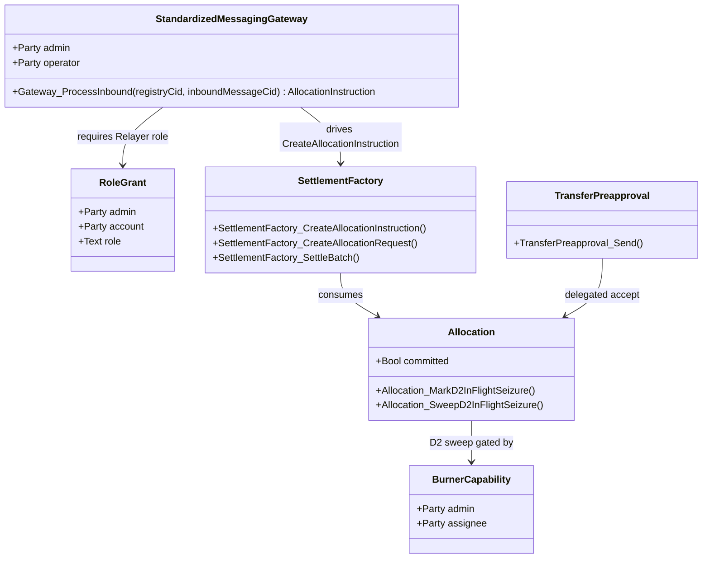
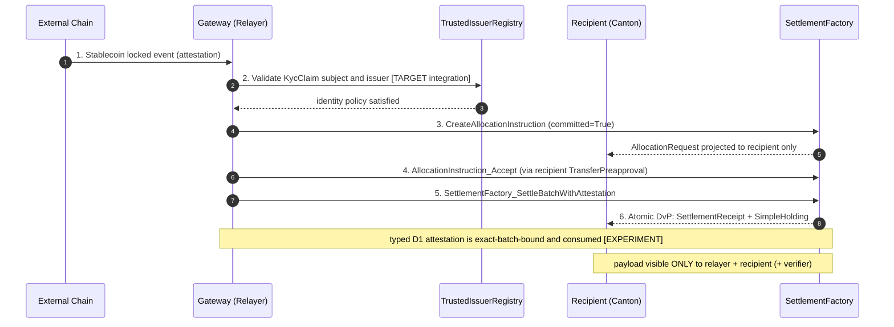

# Architectural Overview Report: Cross-Chain Stablecoin Payment Orchestration on Canton

Status: **target architecture.** This report defines a cross-chain stablecoin
payment architecture and distinguishes the executable evidence, reusable
library components, upstream dependencies, and target-only components that
support it. It does not claim conformance, audit readiness, or production
readiness.

> **Evidence tags**
>
> - `[EXPERIMENT]` - executable research code and tests in `canton-specs` or an
>   OpenZeppelin reference implementation.
> - `[LIBRARY]` - reusable package source and versioned DAR artifacts maintained
>   in [`canton-contracts`](https://github.com/OpenZeppelin/canton-contracts).
> - `[UPSTREAM]` - Canton, Splice, CIP, or external ecosystem behavior that this
>   architecture consumes rather than implements.
> - `[TARGET]` - a required target-architecture component or invariant specified
>   by this report for an implementation to complete and validate.

> **Design priority order** governs every interface and snippet, in this exact
> order: **1) Security -> 2) Simplicity -> 3) Readability -> 4) Auditability.**

> **Scope.** The architecture uses the experimental CIP-0112 settlement spine,
> reusable OpenZeppelin authorization components, and upstream Token Standard V2
> concepts. The Standardized Messaging Gateway, reserve and redemption protocol,
> and cross-synchronizer workflow are `[TARGET]`. USDCx is `[UPSTREAM]` and is
> consumed as a native Canton instrument rather than re-bridged.

---

## 1. Product Definition

This reference architecture defines private, atomic settlement on Canton for
stablecoin payments originating on external blockchains. It resolves the
tension between cross-chain liquidity and the
privacy requirements of enterprise compliance: institutional participants can
accept an inbound asset representation - an already-native stablecoin such as
USDCx, or a gateway-minted wrapped instrument, written **`wTOK`** throughout -
while keeping the settlement amount, payer/payee identities, and compliance
markers projected only to explicitly authorized parties.

> **Privacy scope (explicit non-goal).** The privacy guarantee covers the
> **Canton side only**. The source-chain lock is a public transaction on its own
> chain, and it necessarily encodes enough routing data (e.g. a Canton-recipient
> reference) for the attesters to produce the `LockAttestation` - so an external
> observer who reads the source chain can link a public lock of amount *N* to the
> fact that some identified Canton recipient will be credited *N*. What Canton's
> per-party projection hides is everything downstream: the settled holding, the
> receipt, compliance markers, and all subsequent private transfers. Decoupling
> or hiding the source-chain linkage itself (hashed commitments, shielded
> payloads, relayer-side blinding) is out of scope for this architecture.

The target design uses a **Standardized Messaging Gateway** `[TARGET]` on top of
the **CIP-0112 / Token Standard V2 settlement spine** `[EXPERIMENT]`
(`OpenZeppelin.Experimental.Settlement.Cip112`).

### Educational Framing: How to Think About Building This on Canton

On public EVM networks, a bridge mints tokens into a globally visible state
ledger any observer can trace. Canton operates on **per-party projection**: a
contract is visible only to its signatories/observers. So the inbound message
from the gateway does **not** mint-and-broadcast an asset in one global update.
Instead the gateway drives an isolated, recipient-targeted allocation on the
spine; because Daml-LF 2.1 is **keyless** (archive-and-recreate, not mutation),
the atomic delivery-vs-payment archives the inbound request and creates a
[`SettlementReceipt`](../../experiments/settlement/cip-0112/daml/OpenZeppelin/Experimental/Settlement/Cip112.daml) visible only to the recipient, the relayer, and the required
compliance verifiers. Cross-chain settlement thereby inherits Canton's data
compartmentalization.

### Target Users

Regulated financial institutions, multinational corporate treasuries, and
compliance-first DeFi platforms on Canton that need to accept inbound liquidity
from public networks **without** exposing internal treasury flows, payment
detail, or counterparty relationships to competitors or on-chain analytics.

### Scope

Scope favors a small, demonstrably correct core; everything else is an explicit
extension point or excluded.

| Feature Category | In-Scope | Out-of-Scope (Excluded) |
|---|---|---|
| Atomic Settlement | Private on-Canton settlement of inbound stablecoin payments via [`SettlementFactory_SettleBatch`](../../experiments/settlement/cip-0112/daml/OpenZeppelin/Experimental/Settlement/Cip112.daml) (atomic DvP). | Custom settlement primitives, fallback matching engines, fragmented parallel liquidity pools. |
| Cross-Chain Bridge | `[TARGET]` Daml-facing inbound and outbound interfaces for a Standardized Messaging Gateway. | Production bridge nodes, source-chain validators, oracle infrastructure, and cryptographic light-client proofs. |
| Compliance & Control | `[EXPERIMENT]` D1 fail-closed verification through `NodeComplianceAttestation` and `TrustedAttesterRegistry`; D2 lock-and-sweep through [`BurnerCapability`](../../experiments/settlement/cip-0112/daml/OpenZeppelin/Experimental/Settlement/Cip112.daml). | Off-ledger caching of compliance status, probabilistic risk scoring, heuristic filtering. |
| Identity Framework | `[EXPERIMENT]` Single-domain, issuer-held KYC and deterministic claims. | `[TARGET]` Cross-domain identity resolution through mechanisms such as ONCHAINID, ERC-3643, or CCID. |
| Asset Issuance | The gateway-minted wrapped instrument (`wTOK`) and the integration **shape** for settling an existing native Canton stablecoin (e.g. USDCx) by interface. | The stablecoin issuance / peg / CDP mechanism itself. |

The standardized interface boundary keeps gateway implementation choices
independent from the settlement spine and compliance logic.

### Instrument naming: `wTOK` vs USDCx `[UPSTREAM]`

All flows in this report (sections [2](#2-architecture-overview)-[4](#4-interfaces--usage-examples)) mint, settle, and redeem a **generic
gateway-minted wrapped instrument, `wTOK`**, whose issuing admin is the
StablecoinAdmin defined by this architecture. **USDCx is not that instrument**:
it is already native on
Canton via Circle's own xReserve lock-and-mint + CCTP rail, so routing it
through this gateway would re-bridge an already-bridged asset, adding trust
surface. Where a native rail exists, the architecture simply *settles* the
native mint output by interface (no architecture-side issuer role); the gateway
is the reference rail only for assets that **lack** a native Canton path. The general
native-rail-vs-gateway rule is an open question.

---

## 2. Architecture Overview

A modular, multi-party topology isolates external messaging, compliance
verification, asset allocation, and atomic settlement. `roleId` wrappers manage
node boundaries and capability grants so no participant can unilaterally force a
state transition without the required co-authorization.

When a cross-chain locking event occurs externally, the gateway (holding a
`RoleGrant` as relayer) emits an `InboundMessage` on Canton, and the relayer
drives the spine: [`SettlementFactory_CreateAllocationInstruction`](../../experiments/settlement/cip-0112/daml/OpenZeppelin/Experimental/Settlement/Cip112.daml) ->
(recipient accept) [`AllocationInstruction_Accept`](../../experiments/settlement/cip-0112/daml/OpenZeppelin/Experimental/Settlement/Cip112.daml) -> [`Allocation`](../../experiments/settlement/cip-0112/daml/OpenZeppelin/Experimental/Settlement/Cip112.daml), plus a
recipient-targeted [`AllocationRequest`](../../experiments/settlement/cip-0112/daml/OpenZeppelin/Experimental/Settlement/Cip112.daml).

### Party and Role Model

| Operational Role | `roleId` wrapper | Responsibilities / trust boundary |
|---|---|---|
| BridgeRelayer | `Relayer` | Monitors the external chain, submits `InboundMessage`, and acts as settlement executor through the target gateway boundary. |
| ComplianceAttester | `Verifier` | Signs `NodeComplianceAttestation` contracts and is authorized through `TrustedAttesterRegistry`; target gateway policy determines how identity evidence authorizes issuance. |
| IdentityIssuer | `Verifier` | Issues `KycClaim` contracts used by the single-domain identity experiment. |
| Custodian | `Seizer` | Holds the `BurnerCapability` for D2 lock-and-sweep to a preset destination under mandate. |
| StablecoinAdmin | `Issuer` | Issuing admin of the gateway-minted wrapped instrument (`wTOK`) - its mint leg is admin-authored and the [section 4.1](#41-standardized-messaging-gateway-target) gateway asserts `att.cantonInstrumentId.admin == admin`; oversees `SimpleTokenRules`. It has **no** authority over an externally-issued instrument like USDCx ([section 1](#1-product-definition)): in the settled-native case there is no architecture-side issuer role. |
| Recipient | Implicit (end-user) | Treasury receiving funds; may use `TransferPreapproval` to accept compliance-gated inflows without a live signature. |

### Trust and Topology

Topology is defined per contract by which nodes participate. Because Daml uses
per-party projection, the settlement is fractured into bilateral requests: the
BridgeRelayer and Recipient are the only initial observers of the
`AllocationRequest`; the StablecoinAdmin and Custodian stay blind to intent
until needed. At [`SettlementFactory_SettleBatch`](../../experiments/settlement/cip-0112/daml/OpenZeppelin/Experimental/Settlement/Cip112.daml), the StablecoinAdmin's node is
enlisted only to validate fund conservation and run the `SimpleTokenRules`
3-way dispatch.

A committed allocation (`RequestedAllocation.committed = True`, set by the
relayer) locks the bridging funds until the settlement deadline, so the
recipient knows the liquidity is reserved and cannot be double-spent or
arbitrarily withdrawn before the DvP concludes.

---

## 3. Target Design

A deterministic sequence of keyless Daml-LF 2.1 state transitions on the
CIP-0112 spine.

1. **Inbound message `[TARGET]`.** The external chain finalizes a locked deposit. The
   attester(s) sign an `InboundMessage` carrying the typed `LockAttestation`
   ([section 3.5](#35-reserve--lock-attestation-model-target)) - locked amount, Canton recipient, target instrument, nonce, expiry.
   The carrier is **created directly by the attesters' own authority** (a plain
   attester-signed `create`), *not* through a gateway choice - the gateway's
   single choice, `Gateway_ProcessInbound`, only *consumes* an already-existing
   carrier via its `InboundMessage_Consume` choice ([section 4.1](#41-standardized-messaging-gateway-target)), one-time, giving
   replay protection.
2. **Allocate + typed D1 check `[EXPERIMENT]`.** The relayer drives
   [`SettlementFactory_CreateAllocationInstruction`](../../experiments/settlement/cip-0112/daml/OpenZeppelin/Experimental/Settlement/Cip112.daml) toward the recipient. Before
   it can settle the recipient leg it must pass the **D1 compliance check**. The
   experimental spine implements a typed, node-applied path through
   [`SettlementFactory_SettleBatchWithAttestation`](../../experiments/settlement/cip-0112/daml/OpenZeppelin/Experimental/Settlement/Cip112.daml),
   [`NodeComplianceAttestation`](../../experiments/settlement/cip-0112/daml/OpenZeppelin/Experimental/Settlement/Cip112.daml), and
   [`TrustedAttesterRegistry`](../../experiments/settlement/cip-0112/daml/OpenZeppelin/Experimental/Settlement/Cip112.daml).
   A factory configured with `requiresNodeAttestation = Some True` rejects the
   plain settlement path. The attested path verifies the signer, validity window,
   settlement reference, and exact transfer-leg set, then consumes the
   attestation to prevent replay. Shape B `KycClaim` and
   `TrustedIssuerRegistry` contracts provide separate `[EXPERIMENT]` evidence for
   subject-level identity; connecting those claims to node attestation issuance
   is part of the gateway `[TARGET]` boundary.
3. **Recipient co-authorization via `TransferPreapproval` `[TARGET]`.** A recipient cannot
   be bound unilaterally; a new signatory must co-authorize. For an offline
   corporate treasury that cannot provide a live interactive signature, the
   recipient's wallet pre-establishes a `TransferPreapproval` for the wrapped
   instrument (`wTOK`). The relayer leverages it to complete the recipient's required
   accept in a single atomic submission, converting the [`AllocationInstruction`](../../experiments/settlement/cip-0112/daml/OpenZeppelin/Experimental/Settlement/Cip112.daml)
   into a committed [`Allocation`](../../experiments/settlement/cip-0112/daml/OpenZeppelin/Experimental/Settlement/Cip112.daml).
4. **Atomic DvP `[EXPERIMENT]`.** The relayer packages the [`Allocation`](../../experiments/settlement/cip-0112/daml/OpenZeppelin/Experimental/Settlement/Cip112.daml) into the single
   [`SettlementFactory_SettleBatch`](../../experiments/settlement/cip-0112/daml/OpenZeppelin/Experimental/Settlement/Cip112.daml) entrypoint. Settlement enforces value
   conservation per instrument: the archived locked input holdings must cover the
   authorizer's SenderSide leg amounts, and any surplus returns as a single new
   *change* holding (reducing fragmentation). Under-funded senders fail closed.
   (`nextIterationFunding` is inert Token Standard V2-shaped metadata in the
   experiment and is neither validated nor acted on.) On
   success the [`Allocation`](../../experiments/settlement/cip-0112/daml/OpenZeppelin/Experimental/Settlement/Cip112.daml) is archived and a
   [`SettlementReceipt`](../../experiments/settlement/cip-0112/daml/OpenZeppelin/Experimental/Settlement/Cip112.daml) + `SimpleHolding` are created for the recipient only.

### 3.5 Reserve & lock-attestation model `[TARGET]`

The flow above shows *how* an inbound payment settles privately, but the core
of a bridge is **what binds the Canton mint to real, locked backing on the source
chain**. Without this the design is a private DvP engine with a trust gap at the
boundary. The reserve model makes that binding explicit.

**What is attested.** Every inbound mint is authorized by a typed
`LockAttestation` `[TARGET]` - a Daml-visible record asserting that backing is
locked/escrowed on the source chain and is claimable *only* by minting the
matching amount on Canton:

```daml
-- [TARGET] Daml-facing type carried by the inbound message.
data LockAttestation = LockAttestation with
  sourceChainId   : Text       -- e.g. "ethereum-mainnet"
  lockTxId        : Text        -- the source-chain lock/escrow transaction
  lockedAsset     : Text        -- source-chain asset locked (e.g. USDC) - a
                                --   foreign-chain reference, so Text
  lockedAmount    : Decimal     -- exact backing locked on the source chain
  cantonRecipient : Party       -- who may receive the minted wrapped asset
  cantonInstrumentId : InstrumentId  -- the Canton instrument to mint: a typed
                                --   on-ledger identity bound to its issuing admin,
                                --   so a forged attestation cannot name an
                                --   arbitrary/unissued instrument
  nonce           : Text        -- replay-protection sequence id (one-time)
  expiry          : Time        -- attestation validity window
```

**Who signs it `[TARGET]`.** Reserve attesters are distinct from relayers. The
experimental [`SettlementFactory_SettleBatchWithAttestation`](../../experiments/settlement/cip-0112/daml/OpenZeppelin/Experimental/Settlement/Cip112.daml)
and [`TrustedAttesterRegistry`](../../experiments/settlement/cip-0112/daml/OpenZeppelin/Experimental/Settlement/Cip112.daml)
establish the on-ledger pattern: registry-rooted signer trust, validity checks,
exact-batch binding, and consuming verification. `NodeComplianceAttestation`
does not carry source-chain lock fields, so the target gateway requires a
dedicated reserve-attestation carrier or an explicitly typed payload that binds
the lock, instrument, recipient, amount, and replay identifier. This separates
the relayer's *transport* role from the attester's *mint authorization* role.

> **Accuracy caveat.** The intended posture is a **threshold N-of-M** attestor
> set, but the spine's consuming
> [`NodeComplianceAttestation_Verify`](../../experiments/settlement/cip-0112/daml/OpenZeppelin/Experimental/Settlement/Cip112.daml)
> choice (driven by
> [`SettlementFactory_SettleBatchWithAttestation`](../../experiments/settlement/cip-0112/daml/OpenZeppelin/Experimental/Settlement/Cip112.daml))
> verifies a **single** registry-rooted attestation - one signed by an attester in
> a `TrustedAttesterRegistry` whose admin equals the factory admin, consumed
> single-use and bound to the exact transfer-leg id set (an unbound attestation is
> rejected) - not an N-of-M quorum. Quorum-signing is the design target, not the
> experimental guarantee, and needs an aggregated-attestation or M-attestation-verifying
> choice.

**The binding (fail-closed).** The inbound
[`AllocationInstruction`](../../experiments/settlement/cip-0112/daml/OpenZeppelin/Experimental/Settlement/Cip112.daml)
references a `LockAttestation` id, and the mint asserts:

- `instructionAmount == attestation.lockedAmount` (no over-mint);
- `recipient == attestation.cantonRecipient` and instrument matches;
- the attestation is quorum-signed, unexpired, and its `nonce` has not been
  consumed (replay protection - the keyless archive-and-recreate of the inbound
  message already gives one-time consumption).

If any check fails the batch fails closed - no mint, no partial credit.

**How the `nonce` is enforced on Canton.** Two layers:

1. **Carrier consumption `[TARGET]`.** The `InboundMessage`
   carrying the attestation is archived by its own consuming
   `InboundMessage_Consume` choice ([section 4.1](#41-standardized-messaging-gateway-target)), so one carrier can never be processed
   twice.
2. **Consumed-nonce registry `[TARGET]`.** Carrier consumption does not stop a
   *second* carrier being attested for the same lock. On-ledger dedup: an
   admin-signed `ConsumedNonceRegistry` contract; `Gateway_ProcessInbound`
   records `(sourceChainId, nonce)` at consumption and **fails closed** if the
   pair is already present - a duplicate carrier cannot mint even if the
   attesters misbehave. Without this layer, dedup rests solely on the honesty
   assumption that attesters never re-attest a used nonce.

Since `lockTxId` already uniquely identifies the source-chain lock, an
implementation may key the registry by `(sourceChainId, lockTxId)` and drop the
separate `nonce` field.

**Reserve invariant.** Total Canton-minted wrapped supply for an
instrument never exceeds the sum of valid, unredeemed `LockAttestation`s for it:
`mintedSupply <= Σ lockedAmount(unredeemed)`. Mint increments the claimed reserve;
redemption ([section 3.6](#36-outbound-redemption-burn-on-canton--release-on-source-chain-target)) decrements it. This is the on-ledger statement of 1:1 backing.

**Where the coupling must bite.** `SettleBatch` conserves value at *settlement*
by funding the recipient's leg from a sender's locked holdings - so the actual
unbacked-issuance surface is the *creation* of the wrapped input holdings that get
locked, not the settle. The mint of the wrapped instrument must therefore be
reachable **only** through the attested inbound flow (the `Gateway_ProcessInbound`
-> attested allocation path, [section 4.1](#41-standardized-messaging-gateway-target)), consuming a `LockAttestation` with
`mintedAmount == lockedAmount` - there is **no** standalone admin mint of the
wrapped instrument. That keeps backing enforced where supply is created, not
merely where it settles.

### 3.6 Outbound redemption (burn on Canton -> release on source chain) `[TARGET]`

Redemption is the other half of any bridge and the path a regulated user needs.
It is the mirror of the inbound flow:

1. **Burn on Canton.** The holder requests redemption; the wrapped holding is
   burned, emitting an
   [`EventLog_HoldingsChange`](../../experiments/settlement/cip-0112/daml/OpenZeppelin/Experimental/Settlement/Cip112.daml)
   and producing a typed `RedemptionAttestation` `[TARGET]`
   `{ amount, sourceChainDestination, nonce }`. The burn gate is **not** the D2
   [`BurnerCapability`](../../experiments/settlement/cip-0112/daml/OpenZeppelin/Experimental/Settlement/Cip112.daml):
   that is the Custodian's *seizure* credential (assignee = Custodian, scope =
   D2 mandates) and must never be reused for user-initiated redemption. The
   redemption burn is gated by a separate `[TARGET]`
   `RedemptionBurnCapability` - same witness shape (admin-signed, choice-less,
   instrument-scoped) but held by the redemption operator - exercised in a
   choice co-authorized by the holder (it is the holder's asset being burned).
2. **Attest.** A registry-trusted attester signs the `RedemptionAttestation`
   (again via the `TrustedAttesterRegistry` path) - an N-of-M quorum is the
   target posture, but see the [section 3.5](#35-reserve--lock-attestation-model-target) accuracy caveat: the experimental typed path
   verifies a single trusted-attester signature, not a threshold.
3. **Release on the source chain.** The signed burn attestation is submitted to
   the source-chain escrow contract, which releases `amount` of locked backing
   to `sourceChainDestination` and the reserve is decremented. So the reserve set
   stays the ground truth, the burn **references and draws down specific unredeemed
   `LockAttestation`(s)** (marking them redeemed / decrementing their remaining
   `lockedAmount`), rather than being keyed only by its own new `nonce` - otherwise
   `Σ lockedAmount(unredeemed)` and actual supply could drift under partial burns.

**Cross-chain atomicity.** The source-chain release is **not** in the
same Daml transaction as the Canton burn (no protocol spans both ledgers
atomically). The design is therefore **burn-first / attested-release**: the
Canton burn is the irreversible commit, and the foreign release is gated on the
signed burn attestation. If the foreign release stalls, the burn is already
final, so the reserve accounting stays sound (supply went down) and the
redemption becomes a **standing, replay-protected claim** the holder (or any
relayer) can resubmit until the escrow releases. The failure mode is *delayed
release*, never *double-spend* or *unbacked supply*.

**Inbound delivery guarantees and recovery.** The mirror question for the
inbound leg: nothing guarantees the Canton-side settlement *executes* - delivery
liveness is bounded by the trusted relayer/attester set. The design
deliberately adds no automatic cross-chain recovery protocol: compensating
messages back to the source chain would require multi-round message passing with
its own delay, cost, and failure surface. The guarantees are instead structural
and fail-closed:

- **Before settlement, nothing is credited.** A stalled or failed relayer leaves
  the source-chain backing locked and the Canton side untouched - no partial
  state, no unbacked credit.
- **On Canton, stalled committed value is recoverable.** A committed
  [`Allocation`](../../experiments/settlement/cip-0112/daml/OpenZeppelin/Experimental/Settlement/Cip112.daml)
  becomes releasable once its settlement deadline passes: the executors may
  [`Allocation_Cancel`](../../experiments/settlement/cip-0112/daml/OpenZeppelin/Experimental/Settlement/Cip112.daml)
  and the authorizer may
  [`Allocation_Withdraw`](../../experiments/settlement/cip-0112/daml/OpenZeppelin/Experimental/Settlement/Cip112.daml),
  both returning the locked holdings (blocked while a D2 seizure is in flight).
  Because a committed allocation with `settlementDeadline = None` can **never**
  be released, the target architecture requires a finite `settlementDeadline` on every committed
  inbound allocation.
- **The source-chain lock itself** is outside Canton's authority; reclaiming it
  after a permanently failed inbound flow (timeout + forced refund at the escrow)
  is a gateway-contract concern, tracked as an open question.

### D1-D4 Attachment

- **D1 - compliance `[EXPERIMENT]`.** The settlement spine implements the
  node-applied, fail-closed typed attestation path. A factory may make this path
  mandatory; the plain `SettleBatch` path remains available only when the
  factory does not require node attestation. Shape B provides separate typed
  identity evidence.
- **D2 - seizure (lock-and-sweep) `[EXPERIMENT]`.** Under mandate, the Custodian uses the
  single-admin [`BurnerCapability`](../../experiments/settlement/cip-0112/daml/OpenZeppelin/Experimental/Settlement/Cip112.daml) to sweep a targeted holding to an admin-preset
  `custodianDestination`. `BurnerCapability` is **deliberately choice-less** - a
  capability *witness*, not an actor: it carries no behavior of its own, and the
  D2 sweep choices fetch it and validate `admin` / `assignee` / `instrumentScope`
  before archiving any holding. The authority lives in the sweep choices; the
  capability is the credential they check (holding the contract does not confer
  an independent method). Revocation is structural: the admin, as sole
  signatory, archives the contract. Explicit rotation and reissue choices are a
  `[TARGET]` authority-lifecycle requirement. For in-flight allocations this is
  the spine's
  [`Allocation_MarkD2InFlightSeizure`](../../experiments/settlement/cip-0112/daml/OpenZeppelin/Experimental/Settlement/Cip112.daml) -> [`Allocation_SweepD2InFlightSeizure`](../../experiments/settlement/cip-0112/daml/OpenZeppelin/Experimental/Settlement/Cip112.daml); for
  settled holdings a forced-sweep choice on `LockedSimpleHolding` is `[TARGET]`.
  It **does not** burn the asset and
  **does not** return it to the sender. Ordinary transfer *failures* do return to
  sender.
- **D3 - identity.** Issuer-held, single-domain KYC is `[EXPERIMENT]`;
  cross-domain proof resolution is `[TARGET]` and follows an additive SCU shape.
- **D4 - authority.** Single-admin capability authority is `[EXPERIMENT]`;
  governed multi-party authority is `[TARGET]`.

### The SCU Extension Story

Never mutate an existing choice's args to require a new field; extend via
`Optional` fields, new types, and new choices. Daml 3.x SCU compatibility does
not permit retroactively adding interface instances to existing templates
`[UPSTREAM]`; new templates and choices implement new interfaces.
The target cross-domain identity extension (D3) appends a **new** choice such as
`SettleBatchWithCrossDomainProof` that accepts an `Optional CrossDomainProof`;
existing relayers calling the baseline
`SettlementFactory_SettleBatch` keep working. This is the additive path proven
in the [`identity/upgrade`](../../experiments/identity/upgrade/) experiment.

---

## 4. Interfaces & Usage Examples

Names map to cited source components; target-only modules such as the gateway
and orchestrator are tagged `[TARGET]`. Import paths use the module names:
`OpenZeppelin.AccessControlV1`, `OpenZeppelin.Experimental.Settlement.Cip112`,
`canton-token-template` `SimpleToken.*`; `KycClaim` and
`TrustedIssuerRegistry` are the
[`identity/hook-shape-b`](../../experiments/identity/hook-shape-b/) types, not
credential-gateway types.

### 4.1 Standardized Messaging Gateway `[TARGET]`

```daml
module CrossChain.Gateway where

import OpenZeppelin.AccessControlV1 (RoleGrant, requireRole)
import OpenZeppelin.Experimental.Settlement.Cip112 (SettlementFactory)
-- KycClaim / TrustedIssuerRegistry: OpenZeppelin.Experimental.Identity.ShapeB
import OpenZeppelin.Experimental.Identity.ShapeB
  (IdentityClaimKind(..), KycClaim, TrustedIssuerRegistry)

data GatewayRole = Relayer | Seizer deriving (Eq, Show)

roleId : GatewayRole -> Text
roleId Relayer = "BRIDGE_RELAYER_ROLE"
roleId Seizer  = "CUSTODIAN_SEIZER_ROLE"

-- [TARGET] Daml-facing gateway boundary.
template StandardizedMessagingGateway
  with
    admin : Party
    operator : Party
  where
    signatory admin, operator
    -- NB: no stored `registry : ContractId TrustedIssuerRegistry` field. The
    -- registry archive-and-recreates whenever a trusted issuer is added or
    -- removed, so a stored cid would brick after the first membership change
    -- (the same dangling-pointer hazard as a stored `PauseState` cid). The
    -- current registry is passed as a choice argument, disclosed at exercise time.

    -- `InboundMessage` is a one-time carrier: a template signed by the attester(s),
    -- holding the `LockAttestation` value. It exposes a *consuming* choice
    -- `InboundMessage_Consume` (controller = the gateway relayer/operator) that
    -- returns the attestation and archives the carrier - so the relayer's authority
    -- drives the archive while the attesters' signature is what made the message
    -- trustworthy (a bare `archive` would need the attesters' authority, which the
    -- gateway does not hold). Consuming the carrier gives one-time
    -- processing; to also stop a second carrier being minted for the same `nonce`,
    -- the attesters must not re-attest a used nonce and/or a consumed-nonce registry
    -- backs it (section 3.5). Note the experimental spine verifies a single trusted attester,
    -- not N-of-M (see the section 3.5 caveat); the quorum is `[TARGET]`.
    nonconsuming choice Gateway_ProcessInbound : ContractId AllocationInstruction
      with
        relayerGrant : ContractId RoleGrant
        registryCid : ContractId TrustedIssuerRegistry  -- current registry, passed in (not stored)
        inboundMessageCid : ContractId InboundMessage   -- one-time carrier of the LockAttestation
        recipient : Party
        kycClaim : ContractId KycClaim
        settlementFactory : ContractId SettlementFactory
      controller operator
      do
        -- 1. Authority: validate the relayer grant against openzeppelin-access-control-v1.
        g <- fetch relayerGrant
        requireRole operator (roleId Relayer) admin g

        -- 2. D1 (Shape B, fail-closed): the KycClaim's subjectParty must match
        --    the recipient and its issuer must be trusted by the current registry.
        --    This on-ledger identity check can authorize issuance of the
        --    NodeComplianceAttestation consumed during settlement.
        registry <- fetch registryCid
        claim <- fetch kycClaim
        now <- getTime
        assertMsg "D1: signer and declared issuer mismatch"
          (claim.claimSigner == claim.declaredIssuer)
        assertMsg "D1: recipient identity mismatch" (claim.subjectParty == recipient)
        assertMsg "D1: issuer not in current trusted registry"
          (claim.declaredIssuer `elem` registry.trustedIssuers)
        assertMsg "D1: wrong claim kind" (claim.claimKind == KYC_VALIDATED)
        assertMsg "D1: claim expired" (now <= claim.validUntil)

        -- 3. Bind to backing + replay-protect. The mint amount is not a free
        --    operator argument - it is derived from a signed `LockAttestation`, and
        --    the carrier is consumed (via its own choice, using the relayer's
        --    authority - not a bare `archive`) so the same lock cannot be minted
        --    twice. No attestation => no mint.
        att <- exercise inboundMessageCid InboundMessage_Consume  -- returns the LockAttestation, archives the carrier
        assertMsg "attestation expired" (now <= att.expiry)
        assertMsg "recipient != attested recipient" (recipient == att.cantonRecipient)
        assertMsg "attested instrument admin is not this gateway's admin"
          (att.cantonInstrumentId.admin == admin)
        let inboundAmount = att.lockedAmount   -- bound to the attested locked backing

        -- 4. Drive the spine: create the recipient's committed allocation whose
        --    single ReceiverSide is exactly (inboundAmount, att.cantonInstrumentId)
        --    - so the minted leg amount is the attested amount, not a free field.
        --    `actors = [recipient]` means this create carries the recipient's
        --    authority; for an offline treasury that authority is supplied by the
        --    recipient's standing `TransferPreapproval` (the same delegation the
        --    section 4.2 accept uses), which the relayer triggers - it is not authority the
        --    gateway (admin+operator) holds directly. The matching issuer SenderSide
        --    of the mint leg is committed separately by the admin (section 4.2's
        --    `issuerSendAllocationId`), so the batch is both-sided.
        exercise settlementFactory SettlementFactory_CreateAllocationInstruction with
          allocation = AllocationSpecification with
            settlement = inboundSettlement; admin
            authorizer = recipientAccount recipient
            transferLegSides =
              [ receiverSide (mintLeg recipient inboundAmount att.cantonInstrumentId) ]
            nextIterationFunding = None; committed = True; meta = emptyMetadata
          requestedAt = now; inputHoldingCids = []
          d1ComplianceHook = None; actors = [recipient]
```

### 4.2 Inbound DvP via `SettleBatch` + delegated accept `[TARGET]`

> **Evidence boundary.** The `canton-token-template` `TransferPreapproval`
> `[EXPERIMENT]` demonstrates the recipient-signed standing-authority pattern
> through `TransferPreapproval_Send`. The spine-aware
> `TransferPreapproval_AcceptInboundInstruction` shown below is `[TARGET]`.
> It can be represented as an additive preapproval choice or as a dedicated
> recipient-signed `DelegatedAcceptGrant`; neither alternative changes the
> recipient co-authorization requirement.

```daml
module CrossChain.Orchestrator where

import OpenZeppelin.Experimental.Settlement.Cip112
-- TransferPreapproval: canton-token-template (SimpleToken.Preapproval) supplies
-- the recipient-signed preapproval PATTERN; the delegated-accept choice used
-- below is [TARGET] (see the evidence boundary above this snippet).
import SimpleToken.Preapproval (TransferPreapproval)

template CrossChainDvP
  with
    executor : Party    -- the relayer, acting as authorized settlement executor
  where
    signatory executor

    choice Execute_Inbound_Settlement : ContractId SettlementReceipt
      with
        instructionId : ContractId AllocationInstruction
        recipientPreapprovalCid : ContractId TransferPreapproval  -- recipient's standing delegated-accept
        issuerSendAllocationId : ContractId Allocation  -- issuer's SenderSide of the mint leg (admin-authored)
        batchFactory : ContractId SettlementFactory
        settlement : SettlementInfo
        transferLegs : [TransferLeg]
        d1AttestationCid : ContractId NodeComplianceAttestation
        d1RegistryCid : ContractId TrustedAttesterRegistry
      controller executor
      do
        -- Recipient's required co-authorization: AllocationInstruction_Accept's
        -- controller is the recipient (the allocation authorizer), which an offline
        -- treasury cannot provide live. Authority must therefore flow through a
        -- choice on the recipient-signed `TransferPreapproval` - whose signatory is
        -- the recipient - not by passing a party list as `actors` (a party list
        -- confers no authority). The preapproval's delegated-accept choice runs the
        -- `AllocationInstruction_Accept` inside its own body, contributing the
        -- recipient's signature; the executor only triggers it.
        -- `TransferPreapproval_AcceptInboundInstruction` is [TARGET]; the cited
        -- experiment demonstrates the standing-authority pattern through _Send.
        result <- exercise recipientPreapprovalCid TransferPreapproval_AcceptInboundInstruction with
          instructionId; executor
        let allocationId = case result of
              AllocationInstructionCompleted cid -> cid
              _ -> error "instruction did not complete"

        -- Atomic DvP via the single spine entrypoint. The mint leg is
        -- issuer->recipient, so both sides must be in the batch, each in its own
        -- allocation (the spine's per-allocation leg-side check): the recipient's
        -- ReceiverSide is `allocationId` (accepted above), the issuer's SenderSide
        -- is `issuerSendAllocationId` (authored by the admin/issuer, whose mint
        -- authority the gateway holds). Settlement conserves value per instrument
        -- (locked funds must cover sender obligations; surplus returns as change);
        -- a failed batch returns holdings to the sender. D1 is re-checked through
        -- the typed attestation path, which consumes an exact-batch-bound
        -- attestation rooted in the factory admin's registry.
        receipts <- exercise batchFactory SettlementFactory_SettleBatchWithAttestation with
          settlement
          transferLegs
          allocationCids = [issuerSendAllocationId, allocationId]
          actors = settlement.executors
          attestationCid = d1AttestationCid
          registryCid = d1RegistryCid
        case receipts of
          r :: _ -> pure r
          [] -> abort "SettleBatch returned no receipt"
```

### 4.3 D2 lock-and-sweep `[EXPERIMENT]` / `[TARGET]`

```daml
-- D2SeizureHook is a spine data record (seizureCaseRef, custodianDestination,
-- inFlightHandlingStatus), not a template, and there is no "BurnerCapability_Seize"
-- (BurnerCapability has no choices). Seizure runs on the Allocation / holding:
--
--   in-flight allocation:
--     exercise allocationId Allocation_MarkD2InFlightSeizure with seizureHook = ...
--     exercise allocationId Allocation_SweepD2InFlightSeizure with burnerCap = burnerCapId
--   settled / locked holding [TARGET]:
--     exercise lockedHoldingId LockedSimpleHolding_ForcedBurn with
--       burner = custodian; burnerCap = burnerCapId   -- swept to preset custodianDestination
--
-- Never burns the asset to nothing; never returns seized funds to sender.
```

---

## 5. Diagrams

The diagrams separate target gateway behavior from the experimental settlement
spine and reusable authorization packages.

### 5.1 Interface / Component Diagram



### 5.2 Flow-of-Funds / Settlement Diagram (Cross-chain Bridge + Batch DvP)



---

## 6. Library Dependencies

### 6.1 Cited components

| Component | Source Package | Usage | Tag |
|---|---|---|---|
| `openzeppelin-access-control-v1` | `canton-contracts` | [`RoleGrant`](https://github.com/OpenZeppelin/canton-contracts/blob/69a810a1c90f1d0b182858c536d80b56f3acc31d/packages/access/access-control-v1/daml/OpenZeppelin/AccessControlV1.daml) and [`requireRole`](https://github.com/OpenZeppelin/canton-contracts/blob/69a810a1c90f1d0b182858c536d80b56f3acc31d/packages/access/access-control-v1/daml/OpenZeppelin/AccessControlV1.daml) gate relayer and seizer capabilities. | `[LIBRARY]` |
| `openzeppelin-ownable-v1` | `canton-contracts` | [`Ownership`](https://github.com/OpenZeppelin/canton-contracts/blob/69a810a1c90f1d0b182858c536d80b56f3acc31d/packages/access/ownable-v1/daml/OpenZeppelin/OwnableV1.daml) and [`OwnershipOffer`](https://github.com/OpenZeppelin/canton-contracts/blob/69a810a1c90f1d0b182858c536d80b56f3acc31d/packages/access/ownable-v1/daml/OpenZeppelin/OwnableV1.daml) define controlled ownership handoff. | `[LIBRARY]` |
| `openzeppelin-pausable-v1` | `canton-contracts` | [`PauseState`](https://github.com/OpenZeppelin/canton-contracts/blob/69a810a1c90f1d0b182858c536d80b56f3acc31d/packages/security/pausable-v1/daml/OpenZeppelin/PausableV1.daml) and [`whenNotPaused`](https://github.com/OpenZeppelin/canton-contracts/blob/69a810a1c90f1d0b182858c536d80b56f3acc31d/packages/security/pausable-v1/daml/OpenZeppelin/PausableV1.daml) gate inbound operations during anomalies. | `[LIBRARY]` |
| [`SettlementFactory`](../../experiments/settlement/cip-0112/daml/OpenZeppelin/Experimental/Settlement/Cip112.daml) | `canton-specs` | Allocation generation, batch DvP, typed node attestation, and D2 in-flight seizure evidence. | `[EXPERIMENT]` |
| `TransferPreapproval` | [`canton-token-template`](https://github.com/OpenZeppelin/canton-token-template) | Recipient-signed standing-authority pattern through `TransferPreapproval_Send`; the spine-aware delegated-accept choice is `[TARGET]`. | `[EXPERIMENT]` / `[TARGET]` |
| `SimpleHolding` / `SimpleTokenRules` / `LockedSimpleHolding` | [`canton-token-template`](https://github.com/OpenZeppelin/canton-token-template) | Asset representation and three-way dispatch evidence; settled-holding forced sweep is `[TARGET]`. | `[EXPERIMENT]` / `[TARGET]` |
| `CredentialGatedActionRequest` / `MockVerificationResult` | [`credential-gateway`](../../experiments/identity/credential-gateway/daml/OpenZeppelin/Experimental/Credential/Gateway.daml) | Credential gating and verifier-result lifecycle. | `[EXPERIMENT]` |
| `KycClaim` / `TrustedIssuerRegistry` | [`identity/hook-shape-b`](../../experiments/identity/hook-shape-b/) | Typed subject identity and trusted-issuer checks. | `[EXPERIMENT]` |
| `NodeComplianceAttestation` / `TrustedAttesterRegistry` | [`Cip112.daml`](../../experiments/settlement/cip-0112/daml/OpenZeppelin/Experimental/Settlement/Cip112.daml) | Signed, exact-batch-bound, single-use D1 attestation enforced by `SettlementFactory_SettleBatchWithAttestation`. | `[EXPERIMENT]` |

### 6.2 Upstream and target boundaries

| Component | Role / Provider | Tag | Boundary |
|---|---|---|---|
| Standardized Messaging Gateway | Cross-chain message verification and orchestration | `[TARGET]` | The architecture specifies only the Daml-facing authorization, replay, reserve, and settlement boundary. |
| Reserve and redemption protocol | Source-chain escrow, attestation, mint, burn, and release | `[TARGET]` | Must enforce one-time lock consumption, supply-to-reserve accounting, and standing redemption claims. |
| Splice Token Standard V2 | Holding, allocation, settlement, and event interfaces | `[UPSTREAM]` | The local token package is a narrow fixture for research and does not establish conformance. |
| USDCx | Native Canton stablecoin and external cross-chain rail | `[UPSTREAM]` | Consumed as a settled instrument. Its issuance, peg, xReserve lock-and-mint, and CCTP rail remain outside this architecture. |

---

## 7. Security & Auditability

Security rests on Daml's authorization model and deterministic state
transitions rather than bespoke cryptography.

### 7.1 Invariants

- **Conservation of funds.** `[EXPERIMENT]` Settlement cannot output more value
  than its input `Allocation`s. On the standard path, `Allocation_Settle` /
  `Allocation_SettleInBatch` (via `performSettle`) archive the locked input
  holdings and assert, **per instrument**, that the locked funds cover the
  authorizer's SenderSide leg amounts; any surplus returns to the sender as an
  unlocked *change* holding (locked = sender obligations + returned change). An
  under-funded sender fails closed - no value is minted from nothing. Value
  conservation is enforced unconditionally on every settle path; there is no
  carve-out. (`nextIterationFunding` is inert forward-compatible metadata
  mirroring the Token Standard V2 allocation shape; the experiment does not act
  on it, so no path defers conservation.)
- **Privacy partitioning.** Amount, payer, and payload memo are projected only to
  the relayer, recipient, and designated compliance verifier. If the
  StablecoinAdmin could observe the memo without authorization, the invariant is
  broken.
- **1:1 reserve backing `[TARGET]` ([section 3.5](#35-reserve--lock-attestation-model-target)).** Canton-minted wrapped supply for an instrument
  never exceeds the sum of valid, unredeemed `LockAttestation`s:
  `mintedSupply <= Σ lockedAmount(unredeemed)`. A mint requires a registry-trusted,
  unexpired, non-replayed attestation whose `lockedAmount` equals the minted
  amount. The typed D1 experiment verifies one registry-trusted attester; the
  target reserve protocol requires the trust policy selected for the gateway.
  Redemption ([section 3.6](#36-outbound-redemption-burn-on-canton--release-on-source-chain-target)) burns first and decrements the
  reserve. No mint without locked backing; no double-redeem of one lock.

### 7.2 Threat Model

| Vector | Description | Mitigation |
|---|---|---|
| Malicious relayer | Routes valid inbound funds to an unauthorized/sanctioned account. | The target gateway validates a `KycClaim` whose `subjectParty` matches the exact recipient. A factory configured to require node attestation also rejects settlement without a trusted, exact-batch-bound `NodeComplianceAttestation`; the relayer cannot substitute the destination (fail-closed). |
| Malicious sender | Triggers spam/toxic settlement to an unwilling recipient. | Without a configured `TransferPreapproval` or explicit accept, the allocation is not settled and funds return to sender (transfer-failure semantics). |
| Compromised admin | Attempts arbitrary expropriation. | D4 single-admin is a structural boundary; even a compromised admin's D2 sweep is hardcoded to the preset `custodianDestination` (no arbitrary burn, no return-to-sender). |
| **Relayer centralization** (primary risk) | A single relayer is both a **liveness** chokepoint (can censor or stall inbound mints and outbound redemptions) and, if it is also the sole attestor, a **trust** chokepoint (could authorize a mint with no real source-chain lock). | Separate the relayer's *transport/liveness* role from the *attestation/trust* role. The experiment verifies one registry-trusted signer; the target requires a threshold N-of-M attestor set rooted in a registry (no mint/redeem without quorum - fail-closed, [section 3.5](#35-reserve--lock-attestation-model-target)). Relay should be permissionless so any party can submit a valid quorum-signed attestation, and the source-chain escrow needs an inbound timeout and forced-refund path. The attestor/relayer trust parameters remain an open design question. |
| UTXO fragmentation | Many small transfers accumulate holding dust. | Settlement returns a sender's surplus as a single new *change* holding per instrument (rather than many fragments); iterated settlement can further merge inputs across rounds. |

### 7.3 Validation evidence

- `[EXPERIMENT]` The
  [`Cip112Settlement.daml`](../../experiments/settlement/test/daml/OpenZeppelin/Test/Cip112Settlement.daml)
  suite exercises allocation lifecycle, batch conservation, privacy boundaries,
  D2 seizure, and the typed D1 path. D1 cases cover a valid attestation,
  untrusted signer, wrong settlement reference, expiry, substituted registry,
  replay, wrong or missing batch binding, and mandatory factory enforcement.
- `[EXPERIMENT]` The settlement exemplar exercises the spine together with
  pinned access-control and pausable DAR dependencies.
- `[LIBRARY]` Reusable authorization packages carry their package-specific tests
  and release identities in `canton-contracts`.
- `[TARGET]` Gateway, reserve, redemption, and cross-synchronizer validation must
  cover source-chain reorganization, duplicate lock attestations, partial
  redemption, stalled release, and reassignment failure.

### 7.4 Off-ledger reconciliation `[UPSTREAM]`

A treasury operating this flow reconciles its private Canton settlement against
the inbound external-chain event without parsing raw transaction trees: the
Token Standard V2 transfer-events API (`Splice.Api.Token.TransferEventsV2`,
imported in the `canton-token-template` evidence) emits holdings-change events the
recipient can correlate with the gateway's inbound message id, giving a 1:1
audit linkage between the external lock/burn and the Canton credit. This is an
**upstream** API surface, not vendored here, and the linkage is a reference
pattern - the report makes no reconciliation-completeness, accounting-standard, or
audit-readiness claim.

---

## 8. Cross-Synchronizer Domain Extension `[TARGET]`

> **Boundary:** `[EXPERIMENT]` settlement evidence is single-synchronizer.
> `[TARGET]` cross-synchronizer operation uses Canton's reassignment model and
> preserves a single-synchronizer atomic settlement boundary.

### 8.1 Cross-chain vs cross-synchronizer

- **Cross-chain `[TARGET]`:** external chain -> gateway attestation -> Canton
  settlement on one synchronizer.
- **Cross-synchronizer `[TARGET]`:** the Canton-side recipient, stablecoin
  instrument, and compliance registry may live on **different Canton
  synchronizers**; settlement then requires reassigning the relevant contracts
  onto one synchronizer before `SettleBatch`.

### 8.2 Where it touches the boundary

| Element | `[EXPERIMENT]` single-synchronizer evidence | `[TARGET]` cross-synchronizer behavior |
|---|---|---|
| Inbound `Allocation` / `SettlementReceipt` | Created/settled on the recipient's synchronizer. | Reassignable: inbound allocation assigned to the synchronizer hosting the recipient's settled-instrument holding before `SettleBatch`. |
| Settled-instrument admin (`wTOK` StablecoinAdmin, or native USDCx) | Same synchronizer as settlement. | If the settled instrument is administered on another synchronizer, it must be reachable there or reassigned in. |
| D1 `TrustedIssuerRegistry` | One synchronizer. | Synchronizer-aware registry; compliance re-checked on the settling synchronizer (no stale cross-domain attestation reuse). |
| D3 identity | Single-domain `KycClaim`. | Cross-domain proof such as ONCHAINID, ERC-3643, or CCID resolved into a synchronizer-aware registry. |

### 8.3 The additive, non-breaking path (SCU-compliant)

1. Append `Optional SynchronizerScope` to the target gateway/orchestrator templates;
   older contracts read `None`.
2. Add a new parallel choice (e.g. `Execute_Inbound_Settlement_CrossDomain`)
   alongside the unchanged single-synchronizer choice.
3. Model reassignment as workflow: reassign the inbound allocation onto the
   settling synchronizer -> `SettleBatch` there -> reassign the receipt/holding
   back. Atomicity stays at the single-synchronizer batch boundary.

### 8.4 Open questions specific to cross-synchronizer operation

- Reassignment-vs-settlement atomicity (rollback vs re-home-able allocation on
  `SettleBatch` failure) - maps to the return-to-sender rule.
- Which synchronizer's `TrustedIssuerRegistry` and verifier set govern a
  cross-domain inflow.
- Cross-domain D1 freshness (re-check on the settling synchronizer; never reuse
  across a reassignment).
- Participant and operator support required to coordinate reassignment safely.

---

## Evidence map

| Architecture capability | Source | Evidence tag |
|---|---|---|
| Settlement factory and batch DvP | [`SettlementFactory`](../../experiments/settlement/cip-0112/daml/OpenZeppelin/Experimental/Settlement/Cip112.daml), [`SettlementFactory_SettleBatch`](../../experiments/settlement/cip-0112/daml/OpenZeppelin/Experimental/Settlement/Cip112.daml) | `[EXPERIMENT]` |
| Allocation request lifecycle | [`SettlementFactory_CreateAllocationRequest`](../../experiments/settlement/cip-0112/daml/OpenZeppelin/Experimental/Settlement/Cip112.daml), [`AllocationRequest_Accept`](../../experiments/settlement/cip-0112/daml/OpenZeppelin/Experimental/Settlement/Cip112.daml), [`AllocationRequest_Reject`](../../experiments/settlement/cip-0112/daml/OpenZeppelin/Experimental/Settlement/Cip112.daml), [`AllocationRequest_Withdraw`](../../experiments/settlement/cip-0112/daml/OpenZeppelin/Experimental/Settlement/Cip112.daml) | `[EXPERIMENT]` |
| Allocation instruction lifecycle | [`SettlementFactory_CreateAllocationInstruction`](../../experiments/settlement/cip-0112/daml/OpenZeppelin/Experimental/Settlement/Cip112.daml), [`AllocationInstruction_Accept`](../../experiments/settlement/cip-0112/daml/OpenZeppelin/Experimental/Settlement/Cip112.daml), [`AllocationInstruction_Withdraw`](../../experiments/settlement/cip-0112/daml/OpenZeppelin/Experimental/Settlement/Cip112.daml) | `[EXPERIMENT]` |
| Committed allocation, settlement, cancellation, and withdrawal | [`Allocation`](../../experiments/settlement/cip-0112/daml/OpenZeppelin/Experimental/Settlement/Cip112.daml), [`Allocation_Settle`](../../experiments/settlement/cip-0112/daml/OpenZeppelin/Experimental/Settlement/Cip112.daml), [`Allocation_Cancel`](../../experiments/settlement/cip-0112/daml/OpenZeppelin/Experimental/Settlement/Cip112.daml), [`Allocation_Withdraw`](../../experiments/settlement/cip-0112/daml/OpenZeppelin/Experimental/Settlement/Cip112.daml) | `[EXPERIMENT]` |
| Settlement receipt and conservation helpers | [`SettlementReceipt`](../../experiments/settlement/cip-0112/daml/OpenZeppelin/Experimental/Settlement/Cip112.daml), [`archiveAndTallyLockedHoldings`](../../experiments/settlement/cip-0112/daml/OpenZeppelin/Experimental/Settlement/Cip112.daml), [`conserveSenderSides`](../../experiments/settlement/cip-0112/daml/OpenZeppelin/Experimental/Settlement/Cip112.daml) | `[EXPERIMENT]` |
| Typed, node-applied D1 attestation | [`SettlementFactory_SettleBatchWithAttestation`](../../experiments/settlement/cip-0112/daml/OpenZeppelin/Experimental/Settlement/Cip112.daml), [`NodeComplianceAttestation`](../../experiments/settlement/cip-0112/daml/OpenZeppelin/Experimental/Settlement/Cip112.daml), [`TrustedAttesterRegistry`](../../experiments/settlement/cip-0112/daml/OpenZeppelin/Experimental/Settlement/Cip112.daml) | `[EXPERIMENT]` |
| D2 in-flight lock-and-sweep | [`Allocation_MarkD2InFlightSeizure`](../../experiments/settlement/cip-0112/daml/OpenZeppelin/Experimental/Settlement/Cip112.daml), [`Allocation_SweepD2InFlightSeizure`](../../experiments/settlement/cip-0112/daml/OpenZeppelin/Experimental/Settlement/Cip112.daml), [`BurnerCapability`](../../experiments/settlement/cip-0112/daml/OpenZeppelin/Experimental/Settlement/Cip112.daml) | `[EXPERIMENT]` |
| Settlement test suite | [`Cip112Settlement.daml`](../../experiments/settlement/test/daml/OpenZeppelin/Test/Cip112Settlement.daml) | `[EXPERIMENT]` |
| Relayer and seizer authorization | [`RoleGrant`](https://github.com/OpenZeppelin/canton-contracts/blob/69a810a1c90f1d0b182858c536d80b56f3acc31d/packages/access/access-control-v1/daml/OpenZeppelin/AccessControlV1.daml), [`requireRole`](https://github.com/OpenZeppelin/canton-contracts/blob/69a810a1c90f1d0b182858c536d80b56f3acc31d/packages/access/access-control-v1/daml/OpenZeppelin/AccessControlV1.daml) | `[LIBRARY]` |
| Ownership handoff | [`Ownership`](https://github.com/OpenZeppelin/canton-contracts/blob/69a810a1c90f1d0b182858c536d80b56f3acc31d/packages/access/ownable-v1/daml/OpenZeppelin/OwnableV1.daml), [`OwnershipOffer`](https://github.com/OpenZeppelin/canton-contracts/blob/69a810a1c90f1d0b182858c536d80b56f3acc31d/packages/access/ownable-v1/daml/OpenZeppelin/OwnableV1.daml) | `[LIBRARY]` |
| Emergency pause | [`PauseState`](https://github.com/OpenZeppelin/canton-contracts/blob/69a810a1c90f1d0b182858c536d80b56f3acc31d/packages/security/pausable-v1/daml/OpenZeppelin/PausableV1.daml), [`whenNotPaused`](https://github.com/OpenZeppelin/canton-contracts/blob/69a810a1c90f1d0b182858c536d80b56f3acc31d/packages/security/pausable-v1/daml/OpenZeppelin/PausableV1.daml) | `[LIBRARY]` |
| Token Standard V2 interfaces and events | Splice Token Standard V2 | `[UPSTREAM]` |
| Standardized Messaging Gateway and delegated inbound accept | [Section 4](#4-interfaces--usage-examples) | `[TARGET]` |
| Lock-to-mint reserve binding | [Section 3.5](#35-reserve--lock-attestation-model-target) | `[TARGET]` |
| Burn-to-release redemption | [Section 3.6](#36-outbound-redemption-burn-on-canton--release-on-source-chain-target) | `[TARGET]` |
| Governed multi-party authority | [D4 authority](#d1d4-attachment) | `[TARGET]` |
| Cross-synchronizer operation | [Section 8](#8-cross-synchronizer-domain-extension-target) | `[TARGET]` |

## 9. Open Design Questions

These questions define trust, lifecycle, and interoperability decisions at the
`[TARGET]` boundary.

- **Production attestor / relayer trust model (decentralization).** [Section 3.5](#35-reserve--lock-attestation-model-target) fixes
  the *shape* - a threshold N-of-M attestor set verified via
  [`TrustedAttesterRegistry`](../../experiments/settlement/cip-0112/daml/OpenZeppelin/Experimental/Settlement/Cip112.daml),
  permissionless relay, fail-closed mint. The *parameters* are open: M and the
  threshold N, attestor selection / rotation / slashing for a false attestation,
  and how the attestor set is itself governed. This is the largest trust surface
  in the target architecture.
- **Outbound-redemption cross-chain atomicity ([section 3.6](#36-outbound-redemption-burn-on-canton--release-on-source-chain-target)).** Burn-first / attested-
  release guarantees no double-spend and no unbacked supply, but the foreign
  release is not atomic with the Canton burn. Open: the standing-claim
  resubmission protocol and SLA for a stalled source-chain release, and whether a
  bounded grace window before burn (escrow-then-burn) is ever preferable to
  burn-first for specific source chains.
- **Capability lifecycle (revocation / rotation) and the redemption-burn
  capability.** `BurnerCapability` is a choice-less capability witness (D1-D4
  attachment, D2): validated by the sweep choices, revocable only by the admin
  archiving it. Open before any public authority surface: the SCU-additive
  `BurnerCapability_Revoke`/`_Rotate` shape (single contract vs. registry of
  capabilities), and the concrete holder/co-authorization model for the
  `[TARGET]` `RedemptionBurnCapability` that gates outbound redemption burns
  ([section 3.6](#36-outbound-redemption-burn-on-canton--release-on-source-chain-target)) - kept strictly separate from the Custodian's seizure credential.
- **Aligning gateway scope with native rails.** USDCx bridges natively via Circle
  xReserve + CCTP ([section 1](#1-product-definition)), so this architecture settles it rather than bridging it. Open: a
  general rule for when an inbound asset already has a native Canton rail (settle
  the native mint output) versus when the generic Standardized Messaging Gateway
  is the right reference, so the architecture never re-bridges an already-bridged
  asset.
- **Standardized Messaging Gateway `[TARGET]`.** How are inbound attestations
  sequenced if the origin
  chain (Ethereum/Polygon) deep-reorgs? Does the gateway manage confirmation
  delays internally, or must the relayer Daml contract use a time-locked
  `AllocationInstruction` to mitigate cross-chain rollback risk?
- **Settled-instrument forced upgrades.** Active holdings upgrade-on-use via factory routing,
  but a forced upgrade for passive holders raises a question: how does the
  relayer detect a recipient holding a deprecated `TransferPreapproval`, and what
  is the fallback from delegated-accept to an interactive two-step offer?
- **Expired / unsettled inbound-allocation lifecycle.** A committed inbound
  `Allocation` locks bridging funds until settlement. The experiment provides
  the release primitives - post-deadline
  [`Allocation_Cancel`](../../experiments/settlement/cip-0112/daml/OpenZeppelin/Experimental/Settlement/Cip112.daml)
  (executors) and
  [`Allocation_Withdraw`](../../experiments/settlement/cip-0112/daml/OpenZeppelin/Experimental/Settlement/Cip112.daml)
  (authorizer), both returning locked holdings ([section 3.6](#36-outbound-redemption-burn-on-canton--release-on-source-chain-target)) - so the open questions are
  narrower: who *operationally* runs the reclaim for a dead inbound flow (an
  automated handler needs executor or authorizer authority), how the target gateway enforces
  the mandatory finite `settlementDeadline` on committed inbound allocations
  (a `None` deadline is unreleasable), and how this local lifecycle aligns with
  the upstream Token Standard V2 Allocation lifecycle `[UPSTREAM]`, which
  separates allocation expiry from the settlement deadline.
  (Maps to the transfer-failure return-to-sender rule.)
- **Cross-domain identity proof injection (D3) `[TARGET]`.** Does the
  `TrustedIssuerRegistry` ingest external
  state proofs via an oracle, or rely on a CCID protocol synchronized across the
  global synchronizer? The cross-domain proof-injection trust model must be
  audited.
- **Cross-synchronizer operation `[TARGET]`** (see
  [section 8](#8-cross-synchronizer-domain-extension-target)). Which participant
  controls reassignment, and which failure evidence is required before retry?
- **Composability with the other reference architectures:** recipients holding
  instruments settled here (`wTOK`, or native USDCx) can provide liquidity to
  the [DEX design](dex.md) or collateralize a [lending vault](lending.md),
  provided the applications adopt compatible standard packages and settlement
  authority assumptions.

---

## References

Every cited component carries an evidence tag. Target snippets define
architecture boundaries and must not be read as executable source.

- **Settlement spine** `[EXPERIMENT]` -
  [`Cip112.daml`](../../experiments/settlement/cip-0112/daml/OpenZeppelin/Experimental/Settlement/Cip112.daml)
  (key choices: [`SettlementFactory_SettleBatch`](../../experiments/settlement/cip-0112/daml/OpenZeppelin/Experimental/Settlement/Cip112.daml),
  [`Allocation_Settle`](../../experiments/settlement/cip-0112/daml/OpenZeppelin/Experimental/Settlement/Cip112.daml)).
- **Holdings, rules, and preapproval evidence** `[EXPERIMENT]` -
  [`canton-token-template`](https://github.com/OpenZeppelin/canton-token-template).
  Delegated inbound accept and settled-holding forced sweep are `[TARGET]`.
- **Credential gating and verification** `[EXPERIMENT]` -
  [`Gateway.daml`](../../experiments/identity/credential-gateway/daml/OpenZeppelin/Experimental/Credential/Gateway.daml).
- **Typed identity** `[EXPERIMENT]` -
  [`identity/hook-shape-b`](../../experiments/identity/hook-shape-b/) and
  [`identity/upgrade`](../../experiments/identity/upgrade/).
- **Access-control, ownership, and pause primitives** `[LIBRARY]` -
  [`canton-contracts`](https://github.com/OpenZeppelin/canton-contracts).
- **Token Standard V2** `[UPSTREAM]` - Splice holding, allocation, settlement,
  and transfer-event interfaces.
- **Gateway, reserve, redemption, and cross-synchronizer protocols** `[TARGET]` -
  [target boundaries](#62-upstream-and-target-boundaries) and
  [open design questions](#9-open-design-questions).
