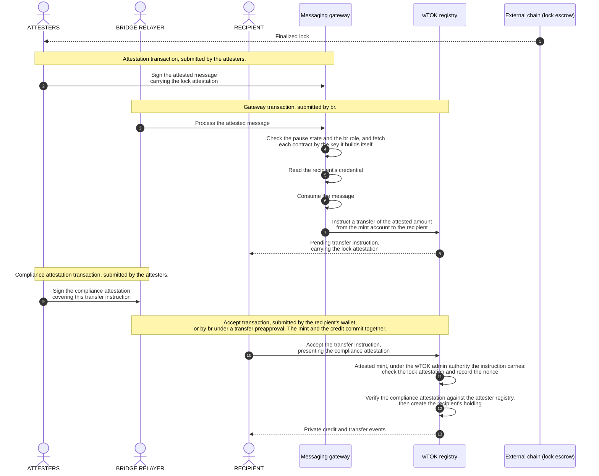
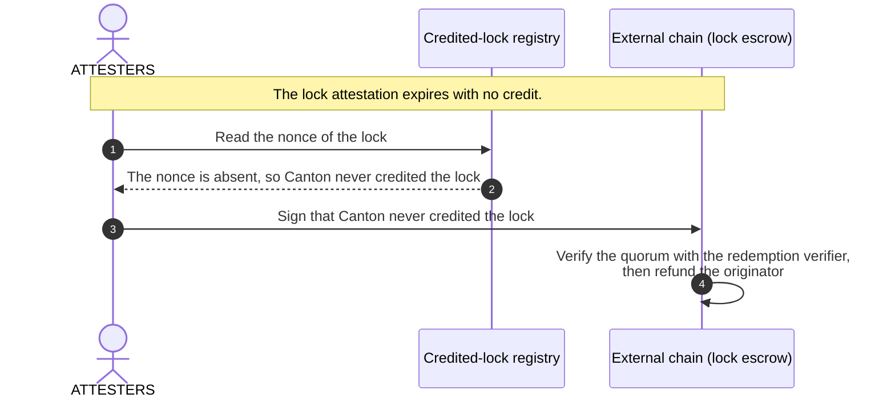
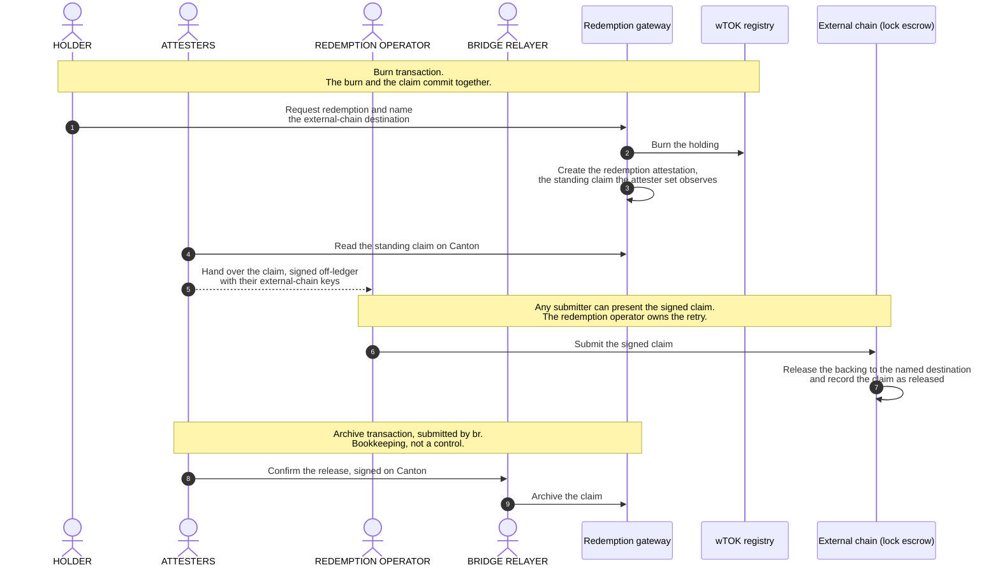
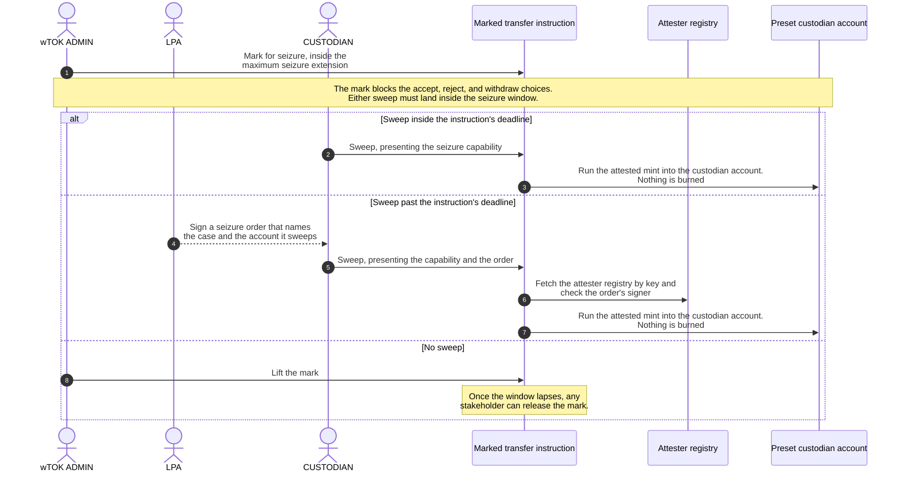

# Cross-Chain Stablecoin Payment Orchestration on Canton

This reference architecture defines the Canton side of a stablecoin bridge
(sometimes referred to as the "rail").
An attested lock on an external chain mints a wrapped instrument on Canton, and a
burn on Canton releases the backing on that chain. Each inbound credit lands as
a private transfer that the recipient accepts and that passes compliance
checks, so no intermediary holds the asset in transit.

## 1. Product Definition

Institutional holders accept a wrapped instrument, written wTOK, that the
instrument's admin mints against an attested lock. The credited amount, the
payer and payee identities, and the compliance markers project only to the
authorized parties.

The **messaging gateway** creates a Canton contract that turns an attested lock
into a transfer instruction, an offer of the credit that its recipient accepts.
It runs the checks that an inbound credit must pass, and it is the seam where a different bridge mode plugs in ([section
3.8](#38-extension-points)).

The rail names a small set of Canton parties, each defined in [section
2.1](#21-business-roles). Five of them recur throughout and carry a short code,
used after this paragraph: the **bridge relayer** (`br`) submits and executes,
the **attesters** sign the external-chain facts that no Canton check can
validate, the **wTOK admin** administers the wrapped instrument, the
**recipient** authorizes its own credit, and the control roles (the **Custodian**,
the **lawful-process authority** (`lpa`), the **pause authority** (`pa`), the
KYC issuers, the **trusted-issuer list admin** (`tla`), and the **gateway
admin** (`ga`)) hold the institutional controls of [section
1.1](#11-institutional-controls). [Section
2.3](#23-decentralization-and-trust-topology) sets how many independent
organizations stand behind each of them.

**Inbound** moves value from the external chain to Canton, by **lock-and-mint**.
**Outbound** moves it back, by **burn-and-release**.

> NOTE: This document calls the other chain the **external chain** in both directions.

The transfer must credit the recipient with the intended amount or with nothing.
On Canton, the
[CIP-0112](https://github.com/canton-foundation/cips/blob/main/cip-0112/cip-0112.md)
two-step transfer carries that property. A **transfer instruction** fixes the
sender, the recipient, the amount, and the instrument on-ledger when it is
created, and its accept credits exactly that amount in one transaction or fails
as a whole. Each inbound credit is one transfer instruction that its recipient
accepts. CIP-0112 also defines allocations and settlement batches, which settle
several movements atomically. The inbound path does not use them, because a
bridge credit has no counter-leg on Canton to settle against
([section 3.1](#31-inbound-credit)).

No transaction spans both chains. The cross-chain hop is therefore
lock-then-attested-mint, and not an atomic exchange. The binding checks
of [section 3.2](#32-reserve-and-lock-attestation) tie the inbound amount,
recipient, and instrument to the attestation.

`OpenZeppelin/canton-contracts` holds an [experimental registry
implementation](https://github.com/OpenZeppelin/canton-contracts/tree/7696749737885e25cd88422847105f890f03b00d/experiments/token/tokenCIP112-v1/daml/OpenZeppelin/TokenCIP112V1)
of the Token Standard V2 interfaces, including the transfer instruction.
Per-party projection is what makes it private. A counterparty sees only the
transfers it sends or receives, so one recipient's payment is never visible to
another. The **instrument admin** of the transferred instrument is the one
deliberate exception. It signs that instrument's holdings and transfer
instructions, so it sits inside the trust boundary ([section 2.2](#22-privacy-and-visibility)).

**Privacy scope.** The guarantee covers the Canton side only. The
external-chain lock is a public transaction, and it must carry enough data to
route the transfer on Canton. An observer of the external chain can therefore
link a public lock of amount *N* to a Canton party who will receive *N*.
Canton's per-party projection hides everything downstream: the credited
holding, the transfer events, the compliance markers, and every later private
transfer. Hiding the link itself (hashed commitments, shielded payloads, or
blinding by `br`) is out of scope.

### 1.1 Institutional Controls

We use D1 through D4 as local shorthand for four institutional controls. They
are shared with the sibling reference architectures, and they are not Canton or
CIP-0112 requirements.

| ID | Control | Mechanism | Where enforced | Invariant |
|---|---|---|---|---|
| **D1** | Compliance | A single-use attestation from an N-of-M quorum of registry-listed attesters, bound to this transfer instruction's own content and never cached. | The accept of the transfer instruction, against the attester set that the wTOK registry pins. | No valid attestation, no credit. |
| **D2** | Seizure | Mark the pending transfer instruction, then sweep the credit it carries to a preset custodian account. | The mark on the transfer instruction, plus one of the two sweep paths ([section 3.6](#36-control-enforcement)). | The asset is never burned, seized funds never return to the sender through the seizure path, and the seizure window is bounded and releasable. |
| **D3** | KYC identity | The recipient holds an identity credential that attests a KYC check by an issuer on the trusted-issuer list. | The gateway transaction, before any transfer instruction exists. | No valid credential from a listed issuer, no transfer instruction. |
| **D4** | Authority | Every privileged choice binds to a named role rather than to one admin. | Each privileged choice, against the role grant that carries the privilege. A two-step handover moves the grant. | Privileges are granted, transferred, and revoked without a redeploy. |

### 1.2 Scope

| Bridge scope | Out of scope |
|---|---|
| The Canton side of the bridge: attested mint, private transfer, and attested burn | The relayer backend, the attester services, the external-chain lock escrow, external oracles, external-chain validator sets, and light-client proofs |
| Transfers of wTOK, the wrapped instrument this design mints | The issuance, peg, and collateral mechanism of any stablecoin, and any asset that already has a native Canton rail |
| On-ledger compliance and identity checks that deny the action when the attestation or the credential is absent or invalid | Any check that reads a stored compliance flag, a risk score, or a threshold |
| Token Standard V2 (CIP-0112) two-step transfers: the transfer instruction, its accept, and the transfer preapproval that automates the accept | Token Standard V1 (CIP-0056), and the CIP-0112 allocation and settlement-batch path, which the rail does not use ([section 3.1](#31-inbound-credit)) |
| One Canton synchronizer, with a cross-chain boundary outside it | Cross-synchronizer settlement, and parties or credentials hosted on another synchronizer |
| One external chain behind the wrapped instrument | Backing one instrument from several external chains, and the per-chain reserve accounting and routing it needs |
| Seizure of a pending inbound credit, before its recipient accepts it | Any control over a wTOK holding after it is credited, which needs a forced transfer that each registry defines for itself ([section 3.6](#36-control-enforcement)) |

### 1.3 Component Status

An experimental registry package exists in `canton-contracts`. The
cross-chain boundary - the messaging gateway, the redemption gateway, the
attested message, and the attested mint - is unbuilt.

Every package below is experimental, apart from the vendored Token Standard V2
interfaces. Each one was a result of research for this proposal, so all will
require an additional analysis and a full audit. The first build step is an
end-to-end Daml Script exemplar that runs both flows against the registry
package, because a design of this kind is validated by its code and tests and
not by this text.
The "Remaining work" column lists only the work this design adds on top of a
component. An empty cell means the component already does what this design
needs, not that the component is complete or audited.

| Component | Location | Remaining work |
|---|---|---|
| Registry package: the `TokenRules` template, the transfer factory and transfer instruction, holdings, and the event log contract | [`canton-contracts` `tokenCIP112-v1`](https://github.com/OpenZeppelin/canton-contracts/tree/7696749737885e25cd88422847105f890f03b00d/experiments/token/tokenCIP112-v1) | A wTOK registry rules template that omits the admin mint and reaches the burn only from the redemption gateway ([section 6](#6-open-design-questions)). The package's [admin mint](https://github.com/OpenZeppelin/canton-contracts/blob/7696749737885e25cd88422847105f890f03b00d/experiments/token/tokenCIP112-v1/daml/OpenZeppelin/TokenCIP112V1/Registry.daml#L149) consumes no attestation and can therefore issue unbacked supply, so the wTOK registry must not expose it ([section 4.3](#43-threat-model)). A wTOK transfer instruction template, derived from the package's [`TokenTransferInstruction`](https://github.com/OpenZeppelin/canton-contracts/blob/7696749737885e25cd88422847105f890f03b00d/experiments/token/tokenCIP112-v1/daml/OpenZeppelin/TokenCIP112V1/Transfer.daml), whose sender is the `cip-112/mint` account and whose accept runs the attested mint instead of paying out locked input holdings ([section 3.1](#31-inbound-credit)) |
| Compliance attestation path (D1) | Same package, `D1.daml` | The verification of an N-of-M attester quorum ([section 2.3](#23-decentralization-and-trust-topology)), and binding the attestation to a transfer instruction and verifying it in the accept. The package binds it to settlement legs and verifies it in the settlement batch only ([section 3.6](#36-control-enforcement)) |
| Seizure path (D2): mark, sweep before the deadline, sweep after it, seizure capability, lawful-process order | Same package, `Allocation.daml` and `D1.daml` | The mark and the sweeps exist on the package's allocation only. Porting them to the inbound transfer instruction, where a sweep completes the attested mint into the custodian account instead of moving locked holdings ([section 3.6](#36-control-enforcement)). A way to rotate a capability's holder. Revoking one means the admin archives it |
| Identity credential check (D3) | This workspace, [`experiments/identity/hook-shape-b`](../../experiments/identity/hook-shape-b/) | The choice that runs the check, and making the checking party an observer of the credential and the trusted-issuer list |
| Per-choice role binding (D4) | Libraries in `canton-contracts` `experiments/access` | The wiring. The primitives exist, and this rail has to call them |
| Access control, ownership handover, and the pause state | `canton-contracts` `experiments/access` and `experiments/security` | No new access-control or ownership behavior. The pause state needs `ga` as an observer so the gateway can fetch it |
| Transfer preapproval and delegated accept | [Section 3.1](#31-inbound-credit) | The whole implementation. It is optional: a recipient without one accepts each credit from its wallet. Canton Coin's transfer preapproval is the reference shape, and it covers Canton Coin only ([section 6](#6-open-design-questions)) |
| Messaging gateway | [Section 3.1](#31-inbound-credit) | The whole implementation |
| Attested message and credited-lock registry | [Section 3.2](#32-reserve-and-lock-attestation) | The whole implementation |
| Attested mint | [Section 3.2](#32-reserve-and-lock-attestation) | The whole implementation |
| Redemption gateway and the burn it drives | [Section 3.3](#33-outbound-redemption) | The whole implementation |
| Contract keys on the pause state, the trusted-issuer list, the credited-lock registry, and the attester registry | [Section 3.4](#34-registry-uniqueness-under-non-unique-keys) | A key definition in each template, fixed before that template first deploys. The design targets Daml-LF 2.3 on Protocol Version 35 |
| Token Standard V2 interfaces | Splice `splice-api-token-*`, vendored as pinned DARs | Nothing. They are consumed by interface |
| Validation tooling | [`daml-lint`](https://github.com/OpenZeppelin/daml-lint), [`daml-props`](https://github.com/OpenZeppelin/daml-props), [`daml-verify`](https://github.com/OpenZeppelin/daml-verify) | The whole validation pipeline. Negative Daml Script tests for every fail-closed path come first: a missing, expired, or unlisted attestation, a replayed nonce, an unlisted issuer, an admin-only claim create, and an unset D1 admin. Property-based checks are supplementary, because they are costly to set up for Daml Script and can suggest more coverage than they give |

---

## 2. Architecture Overview

Two things cross the boundary between the chains:
a signature from the attester set, and the nonce of a lock
([section 3.1](#31-inbound-credit)). Everything else here is Canton-specific.

That shapes the rail as one hub with attachments. The hub is the Token
Standard V2 transfer instruction that moves wTOK privately between accounts,
and one registry creates and completes every wTOK transfer. Supply enters at
the attested mint and leaves at the burn. Each of those two needs an attester
signature, over an external-chain fact that no Canton check can validate. The
accept checks the compliance attestation ([section 3.6](#36-control-enforcement)),
and the gateway checks the identity credential before any transfer instruction
exists.

The subsections below take that rail from three angles. They name the party
behind each piece, say who can read it, and set how many independent keys stand
behind the pieces that can break the reserve.

### 2.1 Business Roles

Canton identifies an actor by a party. The external chain identifies it by an
address. Neither chain records that one address and one party are the same
actor, so no on-ledger check can validate the pairing. An operator that acts on
both chains holds both credentials, and configuration is what keeps them
aligned. The lock attestation ([section 3.1](#31-inbound-credit)) therefore
names the Canton recipient explicitly, and the attester set carries the trust
that the recipient is correct.

"The attesters sign" means two different things. Inbound, the attester party
signs on Canton, and the external chain never sees that signature. Outbound,
the escrow cannot read Canton, so each attester also holds an external-chain
key that the escrow's own verifier accepts.

**Canton parties.** Each one signs a contract or submits a command on Canton. The Code column repeats the short codes that [section 1](#1-product-definition) introduces.

| Role | Code | Responsibility and visibility |
|---|---|---|
| Bridge relayer | `br` | Transport and liveness. It co-signs every inbound transfer instruction, holds the relayer role that the gateway checks, and withdraws an instruction whose flow is dead. A relayer without an attestation cannot mint. It sees every transfer instruction it creates. |
| Attesters, M of them | - | The trust role, separate from the relayer's transport role. They sign the lock attestation ([section 3.1](#31-inbound-credit)), the compliance attestation ([section 3.6](#36-control-enforcement)), and the redemption attestation ([section 3.3](#33-outbound-redemption)). The attester registry lists them, and they see the transfer instructions they attest. |
| wTOK admin | - | The instrument admin for wTOK. One party holds three surfaces, because the registry rules template carries a single admin field: it signs the wTOK registry, it is therefore the transfer factory admin for wTOK, and it signs that instrument's holdings and transfer instructions. It authors the attested mint, so it sees every wTOK payment. It also maintains two registries the mint reads: the attester registry, which lists the parties whose signatures the compliance, mint, and sweep checks accept ([section 3.6](#36-control-enforcement)), and the credited-lock registry, which records the nonce of every lock that has already minted ([section 3.2](#32-reserve-and-lock-attestation)). |
| KYC issuers | - | They sign the identity credential that D3 checks, and they maintain its expiry and revocation. The trusted-issuer list names them. Each observes no transfer. |
| Trusted-issuer list admin | `tla` | Sole signatory of the trusted-issuer list, and the party that decides which issuers it names. It issues no credential and observes no transfer. |
| Custodian | - | Holds the seizure capability, the contract that authorizes it to sweep a marked transfer instruction ([section 3.6](#36-control-enforcement)), and owns the preset sweep account. It sees nothing until a seizure. |
| Lawful-process authority | `lpa` | Signs the seizure order that a sweep past the instruction's deadline requires ([section 3.6](#36-control-enforcement), [section 3.5](#35-time-and-deadlines)). The attester registry lists it, and it is never the wTOK admin. |
| Recipient, or Holder outbound | - | Accepts the transfer instruction that offers its credit, live from its wallet or through a transfer preapproval it signed earlier ([section 3.1](#31-inbound-credit)). |
| Pause authority | `pa` | Signs the pause state and maintains its key. The pause state is a contract that the gateway transaction and the accept fetch by key, and a set pause fails both ([section 4.4](#44-failure-modes-and-recovery)). |
| Gateway admin | `ga` | Sole signatory of the messaging gateway, and the party that operates it. It submits nothing and holds the `FeaturedAppRight`. It observes the pause state, the trusted-issuer list, and each credential the gateway checks. |

**Off-ledger actors and the external chain.** Each of these submits as one of
the parties above, or it lives on the external chain.

| Role | Responsibility and visibility |
|---|---|
| Lock escrow | External-chain contract that holds the backing for the bridged funds. It releases the backing if it receives a verified redemption attestation. Any submitter the attesters hand the signed claim to can present that attestation and release the funds ([section 3.3](#33-outbound-redemption)). |
| Relayer backend | Off-Canton process. It watches the external chain and submits every inbound command as `br`. |
| Attester services | M independent operators on M participants. Each submits as its own attester party. |
| Recipient wallet | Off-Canton process. It accepts pending transfer instructions as the recipient, and it may create a transfer preapproval so that `br` can complete a credit without a live accept. |
| Redemption operator | Off-Canton process. It submits for holders that delegate to it, and it owns the retry of a stalled release ([section 3.3](#33-outbound-redemption)). |

The gateways and the registries are contracts, not services. The messaging
gateway has one choice that `br` exercises ([section 3.1](#31-inbound-credit)),
and the redemption gateway one that the holder authorizes
([section 3.3](#33-outbound-redemption)). The pause state, the attester
registry, the trusted-issuer list, and the credited-lock registry are fetched by
key. Each key
names the party that maintains it, so only that party creates a version under
that key ([section 3.4](#34-registry-uniqueness-under-non-unique-keys)). The
lock attestation is a data record inside the attested message, so an attester
signs the message and not a standalone attestation.

### 2.2 Privacy and Visibility

The table below gives one row per contract. The signatories and the observers of
a contract are the only parties that see it. Every contract belongs to the wTOK
registry unless its row says otherwise, and a party that the row does not name
sees the contract only transiently, when a transaction it witnesses divulges it.

| Contract | Signatories | Observers |
|---|---|---|
| Inbound transfer instruction, and the factory call that creates it | The wTOK admin and `br` | The recipient |
| Event log contract, created and archived in one transaction | The wTOK admin | None |
| wTOK holding | The wTOK admin and the account's parties | The lock's observers, while locked |
| Compliance attestation | The attesters that sign it | `br`, as the party it is issued to, and the wTOK admin, whose authority verifies it inside the accept |
| Attester registry | The wTOK admin | The listed attesters |
| Seizure order | `lpa` | The wTOK admin and the Custodian |
| Identity credential | The KYC issuer that signs it | The subject and `ga` |
| Trusted-issuer list | `tla` | `ga` |
| Pause state | `pa` | `ga` |
| Attested message | The attesters that sign it | `br` |
| Redemption attestation | The wTOK admin and the holder | The attester set |
| Messaging gateway | `ga` | None |
| Redemption gateway | The wTOK admin | The holders that redeem through it |
| Transfer preapproval, when the recipient creates one | The recipient | `br` |
| Seizure capability | The wTOK admin | The Custodian |
| Credited-lock registry | The wTOK admin | The attester set |

Consequences:

- **No recipient sees another recipient's credit.** Each transfer instruction
  names one recipient and projects to that recipient alone, so concurrent
  inbound payments disclose nothing to each other.
- **The wTOK admin sees every wTOK payment.** A transfer's metadata travels into
  the update stream, so amounts, accounts, and the transfer metadata are
  readable by construction. This is a trust assumption and not a leak to close.
  The wTOK admin signs every transfer instruction and every holding of its
  instrument, so it cannot be blind to a payment. Any issued instrument
  puts its own issuer in this position. `br` and the attesters see what
  they handle for the same reason: a transport-only role bounds authority and
  not visibility, so attester membership is a privacy decision as well as a
  compliance one.
- **`ga` is a standing observer of every contract the rail
  checks.** A fetch needs a party in the enclosing choice's authorizing set to
  be a stakeholder of the fetched contract, and the gateway choice carries only
  `ga`'s authority.
  The pause state, the trusted-issuer list, and each identity credential
  therefore name `ga` as an observer. This puts durable visibility
  on one accountable party and keeps it off `br`, whose set the design
  wants to open ([section 2.3](#23-decentralization-and-trust-topology)); the
  submitting relayer sees the credential only in the transaction it submits.
  Moving the check to another choice makes that choice's controller the
  observer instead ([section 6](#6-open-design-questions)). The seizure mark
  needs no observer at all: it carries the custodian destination as a data
  field, so the Custodian sees nothing until a seizure.
- **Transfer outcomes arrive as events, not as active contracts.** The
  registry package reports each holdings change by exercising the Token
  Standard V2 `EventLog_HoldingsChange` choice on a short-lived `EventLog`
  contract that it creates and archives in the same transaction. The event data
  is the choice's argument, so it reaches its observers as an exercised event on
  the Ledger API update stream and never appears in the active contract set.
  Integrators read that stream ([section 4.6](#46-off-ledger-reconciliation)).
  The durable evidence of a credited payment is the recipient's holding.
- **No personal data on the ledger.** A credential carries an issuer reference
  and not personal attributes. The data stays with the issuer off-ledger.

### 2.3 Decentralization and Trust Topology

**Background.** A quorum written in Daml is worth its stated N only if N
independent participants must confirm it. That means N parties on disjoint
participants that separate organizations operate, or one party whose
[confirmation
threshold](https://docs.canton.network/overview/reference/decentralization) is
at least N. Also, a party above threshold 1 cannot submit for itself. It acts
through another party's submission, or through external signing. Three things
therefore carry separate names in this section: the **organization** that runs
infrastructure and holds keys, the **party** that signs on the ledger, and the
**participant** that hosts the party and confirms its transactions. A posture
below is a statement about how many organizations stand behind one party.

Canton offers three routes to an N-of-M posture, and the choice between them is
open ([section 6](#6-open-design-questions)):

- **On-ledger approval workflow.** The multisig is written in Daml, as a
  [Multiple Party
  Agreement](https://docs.canton.network/appdev/modules/m3-design-patterns#multiple-party-agreement).
  The approvals are durable, named, and auditable on-ledger.
- **External party with threshold signing keys.** The role party's transactions
  require N of M keys held by independent organizations. The Daml code never
  sees this, and each action costs one ledger transaction. The [Bitsafe
  decentralization-manager](https://github.com/DLC-link/decentralization-manager)
  is one candidate implementation.
- **Multi-hosted party with a confirmation threshold.** The role party is
  hosted on M participants that independent organizations operate, and N of
  them must confirm each transaction. The trust sits with the participant
  operators rather than with key holders, and the party needs another party's
  submission or external signing to act. Confirmations run in parallel, so the
  latency and traffic premium over a single host is small. The hosts are
  trusted in aggregate for integrity and each on its own for confidentiality,
  because every host sees everything the party sees
  ([section 2.2](#22-privacy-and-visibility)). Canton Coin and cBTC run their
  administering parties this way, [covalidation service
  providers](https://docs.digitalasset.com/covalidation/overview) offer the
  hosting as a product, and the proposed
  [CIP-0120](https://lists.sync.global/g/cip-discuss/topic/cip_0120_traffic_based/120502087)
  would reward it further. A party's hosts and threshold are readable from the
  synchronizer's topology state, so a user of the rail can verify the posture
  instead of taking it on trust.

**Decision.** The wTOK admin creates wTOK supply at the attested mint, and the
Custodian can sweep locked value.
Both hold critical authority, so no single key may exercise either role.
Everything that decides whether wTOK supply is legitimate sits with the wTOK
admin by design: the mint, the attester registry that every accept checks, and
the credited-lock registry. That registry records the nonce of every lock that
credited Canton ([section 3.2](#32-reserve-and-lock-attestation)), so that one lock mints once
even when a valid attestation for it arrives a second time. Splitting those would create a
second key that can break the reserve without being able to mint, so the answer
to the concentration is the posture below and not a division of the contracts.

The table sets each role's posture, the organizations behind it, and who
submits in its name. A party above threshold 1 submits nothing itself, so the
third column is where the posture meets the flows of [section
3](#3-target-design).

| Role | Target posture | Who submits in its name | Why |
|---|---|---|---|
| Attesters | M parties, one per independent attester organization, each on its own participant. The attester registry lists them, and every check requires N of M, never all of M | Each attester service submits as its own party | One unavailable or unvetted attester must not halt the rail, and one malicious attester must not mint |
| wTOK admin | N-of-M across independent organizations, by one of the three routes above. The route, N, and M are open ([section 6](#6-open-design-questions)) | Nothing on the payment path. Its authority enters the accept through the wTOK registry and the transfer instruction it signs, which is what lets the attested mint run inside that transaction ([section 3.2](#32-reserve-and-lock-attestation)). Registry rotations and the creation of the redemption gateway are its own transactions, externally signed or run through the approval workflow | It signs every holding of its own instrument and can create one directly, so this role can break the reserve on its own ([section 4.3](#43-threat-model)) |
| Custodian | N-of-M across independent organizations, route open ([section 6](#6-open-design-questions)) | Its own sweep submissions, externally signed or run through the approval workflow | Inside the instruction's deadline it can sweep a pending credit with no order from outside the operator set ([section 3.6](#36-control-enforcement)) |
| `br` | One party, multi-hosted on several participants that relayer host organizations operate, confirmation threshold 1 | The relayer backend on any host submits directly | It holds no minting trust and is the most submission-heavy role in the design. Integrity comes from the attester split, and relay should ultimately be permissionless, so no single organization controls liveness |
| `pa` | One party, multi-hosted, confirmation threshold 1, held by organizations other than the relayer hosts | Any host submits a pause or an unpause directly | A pause must be instant. A threshold above 1 adds little latency, because confirmations run in parallel, but it stops the party submitting for itself, and an on-ledger approval workflow adds a round of transactions. The pause lives on the ledger and outside `br` so that a compromised relayer can be stopped by a party it does not control; a pause inside the relayer backend would fall with it. The price is a griefing window where a malicious `pa` stalls inbound credits until the instructions expire, and the locks then stay creditable or refundable ([section 3.1](#31-inbound-credit)). Several hosts can each submit a pause or an unpause, so both are idempotent: a pause against a state that is already set, or an unpause against one that is already clear, succeeds and changes nothing, and a host that lost a race retries |
| `ga` and `tla` | One organization each, threshold 1. They may be the same organization | Configuration changes only: the creation of the messaging gateway, and list rotations | Neither can move value or mint. A faulty one delays credits or admits an issuer, and both are visible to the contracts' observers ([section 3.4](#34-registry-uniqueness-under-non-unique-keys)) |
| KYC issuers | Several independent issuers on the trusted-issuer list | Each issuer submits its own credentials | A recipient needs a credential from only one listed issuer, so no single issuer can block onboarding. The list is only as strict as its most permissive issuer, which makes the choice of whom to list a governance decision |
| Recipients | No rail-side decentralization | The recipient's wallet, live or through the transfer preapproval `br` exercises | Nothing credits a recipient without its own signature, live or carried by a transfer preapproval, so it trusts only its own keys and participant |

**Minimal deployment.** Every separately decentralized party costs setup, key
custody, and maintenance, so a deployment decentralizes the roles that can
break the reserve and consolidates the rest. The smallest topology this design
admits is: one relayer operator that also holds `ga` and the
`tla`; M attester organizations; the wTOK admin and the
Custodian hosted N-of-M across those same organizations, or across a
covalidation set they select; one institution outside the operator set as the
`lpa`; and `pa` with the attester
organizations or a covalidation provider, never with the relayer operator
alone. Two separations are not negotiable: `lpa` is
never the wTOK admin ([section 3.6](#36-control-enforcement)), and the
attesters are never `br` ([section 2.1](#21-business-roles)).

`br` is the only party on both sides of the cross-chain boundary. It pays
every transaction but a live accept ([section 5.1](#51-traffic-costs)), and
new offers stop when its validator runs out of traffic
([section 4.4](#44-failure-modes-and-recovery)).

---

## 3. Target Design

Only the credit is atomic, and only on Canton. The inbound path is one
relayer-submitted transaction that creates the offer, and one accept that the
recipient submits, or that `br` submits under a transfer preapproval. The
relayer backend orchestrates its own submissions off-ledger. The attesters sign
the attested message and the compliance attestation in transactions of their
own.

### 3.1 Inbound Credit

Three steps carry a finalized external-chain lock to a credited wTOK holding.
The attesters submit step 1 and, between steps 2 and 3, the compliance
attestation that step 3 presents. `br` submits step 2. The recipient submits
step 3, or `br` submits it under a transfer preapproval the recipient signed
earlier.

**Inbound credit**

```mermaid
sequenceDiagram
    autonumber
    actor Attesters as ATTESTERS
    actor Relayer as BRIDGE RELAYER
    actor Recipient as RECIPIENT
    participant App as Messaging gateway
    participant Registry as wTOK registry
    participant Chain as External chain (lock escrow)

    Chain-->>Attesters: Finalized lock
    rect rgba(255, 255, 255, .1)
        Note over Attesters,App: Attestation transaction, submitted by the attesters.
        Attesters->>App: Sign the attested message<br/>carrying the lock attestation
    end
    rect rgba(255, 255, 255, .1)
        Note over Relayer,Registry: Gateway transaction, submitted by br.
        Relayer->>App: Process the attested message
        App->>App: Check the pause state and the br role, and fetch<br/>each contract by the key it builds itself
        App->>App: Read the recipient's credential
        App->>App: Consume the message
        App->>Registry: Instruct a transfer of the attested amount<br/>from the mint account to the recipient
        Registry-->>Recipient: Pending transfer instruction,<br/>carrying the lock attestation
    end
    rect rgba(255, 255, 255, .1)
        Note over Attesters,Relayer: Compliance attestation transaction, submitted by the attesters.
        Attesters->>Relayer: Sign the compliance attestation<br/>covering this transfer instruction
    end
    rect rgba(255, 255, 255, .1)
        Note over Relayer,Registry: Accept transaction, submitted by the recipient's wallet,<br/>or by br under a transfer preapproval. The mint and the credit commit together.
        Recipient->>Registry: Accept the transfer instruction,<br/>presenting the compliance attestation
        Registry->>Registry: Attested mint, under the wTOK admin authority the instruction carries:<br/>check the lock attestation and record the nonce
        Registry->>Registry: Verify the compliance attestation against the attester registry,<br/>then create the recipient's holding
        Registry-->>Recipient: Private credit and transfer events
    end
```

1. **Attested message.** The external chain finalizes a locked deposit. The
   attesters sign an **attested message**, the Canton contract that carries
   the typed **lock attestation**: the
   locked amount, the Canton recipient, the target instrument, the lock's
   nonce, and an expiry. The nonce is the identifier the external chain
   assigned to the lock: the escrow's sequence number or the lock transaction
   id. The rail serves one chain ([section 1.2](#12-scope)) and the
   credited-lock registry is scoped to one instrument
   ([section 3.4](#34-registry-uniqueness-under-non-unique-keys)), so the nonce
   alone identifies a lock. An N-of-M quorum aggregates onto that message
   ([section 2.3](#23-decentralization-and-trust-topology)).
2. **Transfer instruction and identity check.** The **messaging gateway**, the
   contract whose single choice `br` exercises to bring a message onto the
   rail, consumes the message and, in the same choice, exercises the wTOK
   registry's `TransferFactory_Transfer` to create a **transfer instruction**:
   the Token Standard V2 contract that offers a pending transfer to its
   receiver. The sender is the `cip-112/mint` account that CIP-0112 reserves
   for minting ([CIP-0112 special account
   identifiers](https://github.com/canton-foundation/cips/blob/main/cip-0112/cip-0112.md#4321-special-account-identifiers-for-mint-and-burn)),
   the receiver is the recipient's account, and every field binds to the lock
   attestation: the amount, the recipient, and the instrument. The instruction
   carries the lock attestation itself, because the message that carried it is
   consumed here, and its metadata carries the lock's nonce under the key
   `bridge.reference.openzeppelin.com/lock-nonce`, which is the value a
   recipient later matches its transfer events against
   ([section 4.6](#46-off-ledger-reconciliation)). Nothing is minted and
   nothing is locked at this step: the instruction is a claim on the lock that
   only its accept turns into supply. Consumption archives the message, so
   that message cannot be replayed, and the mint records the lock's nonce when
   it credits ([section 3.2](#32-reserve-and-lock-attestation)). The identity
   check runs on-ledger in the same transaction and fails closed: the
   recipient must hold an unexpired credential from a listed issuer. That is
   D3. The accept later needs a separate compliance attestation.

   The wTOK admin and `br` sign the instruction, and the recipient observes
   it. The admin's authority comes from the registry whose factory choice
   creates it, and `br`'s from the gateway choice it exercises. The
   recipient's participant therefore confirms nothing at this step, and a
   recipient that is offline sees the offer when it returns. `br`, as a
   signatory, holds the standard's withdraw, which is how a dead flow is
   closed early ([section 4.4](#44-failure-modes-and-recovery)).
3. **Accept.** The recipient's wallet exercises the standard's
   `TransferInstruction_Accept`, the one choice that credits. The wTOK
   registry supplies the choice context that the Token Standard defines for
   registry-specific accept inputs, and that context names the compliance
   attestation, so a wallet that speaks the standard accepts a bridge credit
   as it accepts any other pending transfer. The accept runs the attested mint
   first, under the wTOK admin authority that the instruction carries as a
   signatory: it checks the lock attestation, records the lock's nonce, and
   creates the recipient's holding for the attested amount
   ([section 3.2](#32-reserve-and-lock-attestation)). It then verifies the
   compliance attestation against the attester registry
   ([section 3.6](#36-control-enforcement)). Either check failing rolls back
   the whole accept, so the recipient is credited with the attested amount or
   with nothing. The registry's own transfer implementation emits the transfer
   events, so the rail's contracts decide the amount and the registry reports
   the outcome.

   An offline corporate treasury cannot accept interactively. Its wallet may
   pre-establish a **transfer preapproval**: a recipient-signed contract that
   lets `br` contribute the recipient's authority to the accept. The
   CIP-0112 factory completes a transfer in one step when the actors already
   cover the receiver's account, so with a preapproval the gateway transaction
   of step 2 and the accept collapse into one relayer-submitted transaction,
   provided the compliance attestation already exists. The preapproval is an
   optimization and not a prerequisite: a recipient without one is credited
   when it accepts, and the instruction waits for it until its deadline.
   Canton Coin's transfer preapproval is the reference shape, and it covers
   Canton Coin only, so wTOK defines its own. The preapproval bounds what it
   authorizes: the instrument, an amount ceiling, an expiry, and the party
   that may exercise it ([section 6](#6-open-design-questions)). The recipient
   signs it, so it can archive it at any time.

   The recipient can also reject. A rejected or expired instruction credits
   nothing and records nothing, so the lock stays creditable under a fresh
   attestation, or refundable once the attestation expires
   ([section 3.2](#32-reserve-and-lock-attestation)).

**Fewer attester transactions.** The compliance attestation is bound to a
transfer whose content the attested message already fixes, so the attesters
could sign it together with the lock attestation, in the attested message.
The design keeps the two separate so that each failure is attributable to one
check and one party, and so that the compliance attestation is issued against
an instruction that exists. A deployment that wants lower latency may collapse
them. Both shapes keep every control of [section
3.6](#36-control-enforcement), because the checks sit in the choices and not
in the transaction boundaries. Until the compliance attestation is on the
ledger the accept fails closed, and the registry's choice-context endpoint
tells the wallet that the credit is not yet acceptable.

**Rejected alternative: lock-and-unlock.** It pays the recipient from liquidity
held on the destination side, which adds a liquidity-provider role and an
inventory-imbalance surface that a reference rail does not need.

**Rejected alternative: allocation and settlement batch.** CIP-0112 also
defines the committed allocation, which the recipient signs for the leg it
receives, and the settlement batch, which settles several such legs in one
all-or-nothing transaction. That atomicity is what an exchange needs, where one
party's leg is worth taking only if the counter-leg lands. An inbound bridge
credit has one leg and no counter-leg on Canton, so a batch binds unrelated
payments together and adds nothing within one payment. A pending transfer
instruction gives a single credit everything the allocation gave it: the
recipient's signature before any credit, an amount and a recipient fixed
on-ledger, a deadline, a pending state that the D2 mark can hold and the D1
attestation can bind to, and a registry-defined lifecycle into which a custody
provider can insert its own approval. The allocation route also costs what the
transfer route does not. The recipient must create an allocation before it can
receive at all, so an offline recipient needs a preapproval as a prerequisite
rather than as an optimization. The recipient signs the allocation, so its
participant must confirm the batch, and one timed-out recipient rejects every
payment in it. And the wallet shows a settlement to assemble rather than a
transfer to accept, which is the shape wallets support today. What the batch
buys is one credited-lock registry write for several credits
([section 4.5](#45-throughput-and-contention)), and the design spends that for
the simpler path. An adopter whose inbound credit is one leg of an atomic
exchange, for example a delivery-versus-payment where the bridged asset is
paid against another Canton asset, settles that exchange over the allocation
path, and the transfer instruction here is then the leg that funds it.

**Transfer over a direct mint.** A direct attested mint into the recipient's
account would credit it just as well. The transfer instruction reuses controls
the rail needs anyway:

- the accept carries the recipient's own signature, so nothing credits an
  unwilling recipient ([section 4.1](#41-ledger-enforced-properties)), and the
  mint runs only inside that accept, so supply changes at the credit and
  nowhere else ([section 3.2](#32-reserve-and-lock-attestation));
- D1 sits on the accept, and the D2 mark and sweep sit on the pending
  instruction ([section 3.6](#36-control-enforcement));
- the instruction is a standard contract, so the recipient's wallet renders
  the offer, the amount, and the accept without rail-specific code, and the
  registry's transfer events report the credit as any other transfer
  ([section 4.6](#46-off-ledger-reconciliation));
- a credit that is never accepted expires, and nothing needs reclaiming
  ([section 4.4](#44-failure-modes-and-recovery));
- the instruction separates offering a movement from the movement itself, so
  a recipient whose account sits with a custody provider or an account
  provider can run that provider's own approval before it accepts, which is
  how an institutional treasury integrates.

**Delivery and retry.** Nothing guarantees that the Canton credit of an
attested lock executes. Delivery liveness is bounded by the trusted `br` and
attester set, and this design adds no automatic cross-chain recovery protocol.
A message that re-drives a credit from the external chain would need
multi-round message passing, with its own delay, cost, and failure surface. What
remains is structural and fail-closed. Command deduplication over 24 hours makes
the relayer's commands safe to resubmit after a crash, provided the retry
goes to the same participant, because deduplication is scoped to the submitting
participant and not to the synchronizer. The relayer backend needs no
command-id state machine to know what to do next. It drives each step from the
active contract set, keyed by the lock's nonce: a standing attested message
calls for the gateway transaction, and a pending instruction beside a
compliance attestation and a transfer preapproval for the delegated accept. An
instruction without a preapproval waits for its recipient and needs nothing
from `br`. A restart re-reads the set and continues, which is the trigger
pattern that Splice uses for its own automation. A stall blocks only this rail
([section 4.5](#45-throughput-and-contention)). [Section
4.4](#44-failure-modes-and-recovery) maps each failure to its recovery path,
including a duplicate from a second relayer host, which the credited-lock
registry rejects instead. A
timeout that refunds the external-chain lock is the escrow's own path, and the
escrow is out of scope ([section 1.2](#12-scope)). The condition of that refund
belongs here, because it decides whether one lock pays out twice.

**Refund exclusivity.** A refund on the external chain must never pay out a lock
that Canton already credited, and no credit may follow a refund. Two rules
together give that, and each covers one of the two orderings.

- The lock attestation carries an expiry, and the mint rejects an expired
  attestation ([section 3.2](#32-reserve-and-lock-attestation)). After that
  expiry no credit can happen, so no mint overtakes a refund. The instruction's
  deadline therefore sits inside the attestation's validity
  ([section 3.5](#35-time-and-deadlines)).
- The escrow refunds only against a signed statement from an attester quorum
  that Canton never credited the lock. The credited-lock registry is the
  contract that statement reads, and the attesters observe it ([section
  3.2](#32-reserve-and-lock-attestation)). A quorum signs only after the
  attestation expires, because before then the answer can still change. The
  escrow already verifies attester signatures for a redemption release ([section
  2.1](#21-business-roles)), so a refund reuses that verifier.

**Inbound refund**

```mermaid
sequenceDiagram
    autonumber
    actor Attesters as ATTESTERS
    participant Reg as Credited-lock registry
    participant Chain as External chain (lock escrow)

    Note over Attesters,Chain: The lock attestation expires with no credit.
    Attesters->>Reg: Read the nonce of the lock
    Reg-->>Attesters: The nonce is absent, so Canton never credited the lock
    Attesters->>Chain: Sign that Canton never credited the lock
    Chain->>Chain: Verify the quorum with the redemption verifier,<br/>then refund the originator
```

### 3.2 Reserve and Lock Attestation

[Section 3.1](#31-inbound-credit) credits the payment. This section ties that
payment to the backing on the external chain.

**Attestation.** The lock attestation states that the escrow received a given
amount under a given nonce, and that only one mint of the same amount on Canton
may credit that deposit. No Canton contract can check either fact. That is the whole trust the
attester set carries. An N-of-M quorum signs the attestation
([section 2.3](#23-decentralization-and-trust-topology)), and `br` only
transports it.

**Mint checks.** The mint runs on-ledger and rejects the attestation unless:

- the signatures come from listed attesters and reach the threshold;
- the attestation has not expired;
- the amount, recipient, and instrument of the mint match it;
- the credited-lock registry does not already hold the lock's nonce.

The mint runs inside the accept transaction of
[section 3.1](#31-inbound-credit), so a failed check rolls back the whole
accept. Nothing is credited.

**Credited-lock registry.** The mint fetches the registry on-ledger and writes
the lock's nonce ([section 3.1](#31-inbound-credit)) in the transaction that
credits the recipient. Each registry version carries every nonce of the one it
replaces. The key scopes the registry to one instrument
([section 3.4](#34-registry-uniqueness-under-non-unique-keys)).

**Refund for unclaimed locks.** The registry records successful credits, not
attempts, so an instruction that expires or is rejected before its accept
leaves the lock creditable under a fresh attestation. The refund statement of [section 3.1](#31-inbound-credit)
requires that the registry does not hold the nonce. Attesters read the registry
before they sign and decline a credited lock, but the mint's check is the
safety control, so an attester that cannot reach the registry still signs.

**Reserve invariant.** The backing is one balance: every deposit Canton
credited, less every redemption the escrow released. The wTOK supply never
exceeds it. A mint adds one deposit amount to both, and a redemption removes
one burn amount from both. **Because the escrow holds the backing as one
balance, the invariant means the escrow can pay out every burn.**

**Supply creation.** The gateway transaction creates no supply, and a pending
instruction locks none. Supply is created only by the attested mint, which
runs inside the accept and which the wTOK admin authorizes as the
instruction's signatory. CIP-0112 names a special `cip-112/mint` account for
exactly this transfer ([CIP-0112 special account
identifiers](https://github.com/canton-foundation/cips/blob/main/cip-0112/cip-0112.md#4321-special-account-identifiers-for-mint-and-burn)),
so the instruction's sender is that account, and wallets and event logs
render the credit as a mint. The registry package's transfer instruction funds
an accept from holdings locked at instruction time, so the wTOK instruction
template replaces that funding with the attested mint
([section 1.3](#13-component-status)). The mint checks above apply unchanged.

### 3.3 Outbound Redemption

Redemption mirrors the inbound flow. The holder burns the wrapped holding on
Canton, the attester quorum signs the result, and the escrow releases the
backing on the external chain.

**Outbound redemption**

```mermaid
sequenceDiagram
    autonumber
    actor Holder as HOLDER
    actor Attesters as ATTESTERS
    actor Operator as REDEMPTION OPERATOR
    actor Relayer as BRIDGE RELAYER
    participant Redeem as Redemption gateway
    participant Registry as wTOK registry
    participant Chain as External chain (lock escrow)

    rect rgba(255, 255, 255, .1)
        Note over Holder,Registry: Burn transaction.<br/>The burn and the claim commit together.
        Holder->>Redeem: Request redemption and name<br/>the external-chain destination
        Redeem->>Registry: Burn the holding
        Redeem->>Redeem: Create the redemption attestation,<br/>the standing claim the attester set observes
    end
    Attesters->>Redeem: Read the standing claim on Canton
    Attesters-->>Operator: Hand over the claim, signed off-ledger<br/>with their external-chain keys
    Note over Operator,Chain: Any submitter can present the signed claim.<br/>The redemption operator owns the retry.
    Operator->>Chain: Submit the signed claim
    Chain->>Chain: Release the backing to the named destination<br/>and record the claim as released
    rect rgba(255, 255, 255, .1)
        Note over Attesters,Redeem: Archive transaction, submitted by br.<br/>Bookkeeping, not a control.
        Attesters->>Relayer: Confirm the release, signed on Canton
        Relayer->>Redeem: Archive the claim
    end
```

1. **Burn on Canton.** The holder asks for redemption and names the
   external-chain destination. The burn destroys the wrapped holding and
   produces a typed **redemption attestation** that carries:

   - the instrument the burn removed supply from;
   - the amount the burn destroyed, which is the amount the escrow releases;
   - the Canton holder whose holding the burn destroyed;
   - the external-chain destination the holder named, so the escrow releases
     only to an address the holder signed for;
   - the claim's nonce, the identifier Canton assigned to the burn.

   The instrument and the amount bind the reserve arithmetic, which has nothing
   else on-ledger to bind to. The other three identify the redemption, as the
   lock attestation identifies a deposit ([section 3.1](#31-inbound-credit)).
   The escrow sees only the signed message, so the message names the holder
   even though the holder already signs the contract. The escrow records the
   nonce when it releases the claim, so an auditor can match each release to
   one Canton burn and one holder.

   The destination is the field the escrow acts on, so the holder's wallet must
   render the amount and the external-chain destination in clear before the
   holder signs. A wallet that shows the redemption choice as opaque arguments
   defeats the binding this step creates. The same holds inbound: a pending
   transfer instruction must show its amount and the lock's nonce before the
   holder accepts, and a transfer preapproval of
   [section 3.1](#31-inbound-credit) must show its instrument, ceiling,
   expiry, and named party at signing. This design assumes wallet providers
   do all three.

   The **redemption gateway** carries that request, as the outbound counterpart
   of the messaging gateway. It initiates the redemption and owns the resulting
   external-chain claim, while the wTOK registry owns the burn itself. The
   gateway stays on Canton: it burns the holding through the registry's ordinary
   admin-plus-account-controlled burn and creates the attestation in the same
   transaction, so every burn leaves a claim. CIP-0112 also names a special
   `cip-112/burn` account ([CIP-0112 special account
   identifiers](https://github.com/canton-foundation/cips/blob/main/cip-0112/cip-0112.md#4321-special-account-identifiers-for-mint-and-burn)),
   so the burn can equally be a transfer into that account through the same
   factory; either shape keeps the claim creation in the burn's transaction. Carrying the claim to the external
   chain is the attester's and the submitter's work in steps 2 and 3. The wTOK
   admin signs the redemption gateway, which is where the burn's admin authority
   comes from, and the holder whose asset the burn destroys co-authorizes the
   choice.

   **No claim stands without a burn.** That direction is the one the escrow
   depends on, and the gateway path does not establish it. Daml authorizes a
   create from the signatories alone, so a template the wTOK admin signs by
   itself can be created by a direct submission that runs no choice and burns
   nothing. The holder is therefore a signatory of the redemption attestation
   and not an observer of it. The burn-and-create transaction already carries
   that authority, because the holder co-authorizes the burn, while an
   admin-only create fails because it lacks the holder's authorization.
   The escrow sees a signed message and no ledger state, so it cannot check the
   burn itself; the attestation's signatory set is what binds the claim to a
   burn ([section 4.3](#43-threat-model)).

   The redemption path and the D2 seizure path stay separate. A redemption
   runs on the holder's own authority and the registry's burn, and a seizure
   runs on the Custodian's capability over a marked transfer instruction
   ([section 3.6](#36-control-enforcement)).
2. **Attest.** An N-of-M quorum of registry-listed attesters signs the
   redemption attestation, through the same attester registry path as the lock
   attestation. The escrow verifies that quorum with its own verifier
   ([section 2.1](#21-business-roles)).
3. **Release on the external chain.** Any submitter presents the signed
   attestation to the escrow. The escrow releases the amount to the
   external-chain destination and decrements the reserve by the same amount,
   so the backing and the supply move together.

**Cross-chain atomicity.** The external-chain release does not sit in the same
Daml transaction as the Canton burn, so the order is burn first and attested
release second. The Canton burn is the irreversible commit, and the release
needs the signed attestation. That order assumes an external chain where any
submitter can claim the release, against escrow state that the escrow committed
before the burn.

Under that assumption, a stalled release is safe. The burn stays final, the
reserve accounting stays sound, and the redemption becomes a standing claim that
nobody can replay. The escrow records each claim it releases, so replay
protection for the outbound direction sits there, as the credited-lock registry
sits on Canton for the inbound one. The redemption operator owns the retry, and
the claim is permissionless, so the holder or any relayer can resubmit it until
the escrow releases. A stalled release therefore costs time. It never causes a
double-spend or unbacked supply.

The claim contract stands on Canton until `br` archives it, under the
authority of an attester quorum that confirms the escrow released it. That
archive is bookkeeping and not a control, because the escrow refuses a second
release either way. Attesters carry the confirmation because only they observe
the external chain, and `br` submits it because it carries transport and
pays traffic ([section 2.1](#21-business-roles)).

**Chains that cannot hold the payout back.** Some chains cannot make the payout
conditional on the attestation. On a UTXO chain without contracts, the release
is a plain threshold-signed transaction, so the payout exists only if the signer
quorum produces it. A quorum that stalls or refuses then looks the same as a
loss, and under burn-first the redeemer holds neither asset. A permissioned
release on a chain with contracts fails the same way, because the holder cannot
submit the claim itself.

The sound ordering there is burn-last. Lock the wrapped holding, authorize
on-ledger against the pinned input and output sets of the payout, sign,
broadcast, confirm the payout, and burn last. The reserve invariant then has to
allow for the in-flight window, because the backing is spent while the wrapped
holding still exists. Without that allowance, 1:1 monitoring reads an honest
redemption as under-collateralized.

Burn-last is a different trust model, and not a variant of the ordering above.
It needs an attested claim that the payout confirmed, and it needs the unlock
path and the burn path to exclude each other. This design does not cover it. A
bridge to a chain that cannot hold the payout back must not inherit the
burn-first claim.

### 3.4 Registry Uniqueness Under Non-Unique Keys

The pause state, the trusted-issuer list, the credited-lock registry, and the
attester registry are all fetched by key. A [Canton 3.x
key](https://docs.canton.network/appdev/modules/m3-contract-keys) does not
enforce uniqueness. Two contracts can share one key, and when a submitter holds
both, that submitter chooses which one a fetch by key returns. A submitter that
can create a second contract under a registry key can therefore make a check
read from a copy that says what the submitter wants.

Each registry fails in its own way. A second credited-lock registry that omits
the nonce of a lock lets the mint credit that lock a second time, because the
mint reads the copy and finds no record of the first credit. A second
trusted-issuer list with an extra issuer passes an identity check that the real
list refuses. A second attester registry with an extra member passes an
accept that the real attester registry refuses.

**Decision.** Every key carries the party that maintains it, together with every
field that scopes the contract it names. A consumer, meaning the mint, the
gateway, or any other contract that fetches a contract by key at execution time,
builds the key itself: the party comes from the consumer's own configuration,
and the instrument comes from the attested message. The caller supplies no part
of the key.

Uniqueness then rests on authority. A key's maintainer signs the contract, so
that party alone creates a version under that key. A consumer that builds the
key from the party it trusts fetches only that party's contracts, because
another party's key names another party.

The credited-lock registry is the contract where this decides who can inflate
supply, so the wTOK admin maintains it.

**Key shape.** Each key holds its maintainer and the scope of the contract.

| Contract | Key | Maintainer |
|---|---|---|
| Credited-lock registry | The maintainer, and the instrument | wTOK admin |
| Attester registry | The maintainer | wTOK admin |
| Trusted-issuer list | The maintainer, and the instrument | `tla` |
| Pause state | The maintainer, and the instrument | `pa` |

An upgrade can neither add nor remove a key definition or change its type, so
each key carries every scope field the rail can ever need
([section 3.7](#37-smart-contract-upgrade-process)).

**Visibility.** A fetch needs a party in the enclosing choice's authorizing set
to be a stakeholder of the fetched contract
([section 2.2](#22-privacy-and-visibility)). Every contract a consumer fetches
by key therefore names one of that consumer's authorizing parties as a signatory
or an observer. The gateway choices run with `ga`'s authority, so
the pause state and the trusted-issuer list name `ga` as an observer.
The mint runs inside an accept, which carries the wTOK admin's authority as
the instruction's signatory, and the wTOK admin is already the signatory of the attester registry and the
credited-lock registry as their maintainer. Those two registries therefore need
no extra observer for the mint. The attester set observes the credited-lock
registry for its own reads, when it checks a nonce before it signs an
attestation.

**Residual.** Nothing stops a maintainer from holding two active versions of
its own contract under one key and presenting a different one to different
transactions. Despite the fact that the wTOK admin can hold two credited-lock
registries or two attester registries which they pass per their discretion, the
main vulnerability here lies in the fact that the wTOK admin can mint new wTOK
tokens at will. `tla` can hold two lists and pass an
issuer that the real list refuses. `pa` can hold two pause states
and let a flow run while the rail is paused. The observers on each contract see
the duplicate: `ga` on the pause state and the trusted-issuer list,
and the attester set on the credited-lock registry. The attester registry has no
observer beyond its maintainer, so a duplicate there is visible only to the wTOK
admin. Each maintainer's own key custody keeps the bridge honest ([section
2.3](#23-decentralization-and-trust-topology)).

### 3.5 Time and Deadlines

CIP-0112 defines the deadline fields and no values. A transfer instruction
carries an `executeBefore`, after which its accept fails and the instruction
expires, and a registry-set maximum lifetime handles hygiene. Enforcement sits
in each token registry, so with a third-party token the policy is that
registry's. Canton Coin, for one, caps a pending transfer's lifetime at 90
days.

The wTOK registry's own ceilings bind before any policy this design sets: a
maximum instruction lifetime, which rejects a longer `executeBefore` outright
instead of truncating it; a maximum attestation validity, which stops an
attester issuing a permanent pass; and a maximum seizure extension, which
bounds how far past the instruction's deadline a D2 window may reach. Their
values are open ([section 6](#6-open-design-questions)).

Each flow derives its own deadline. The floor is the slowest required actor's
service level. The ceiling is the tightest of three bounds: the
instruction-lifetime ceiling, how long a lock attestation may stand before
Canton credits it, and how long the originator accepts its deposit held on the
external chain without a credit or a refund. The last bound is the one a live
accept stretches: the escrow refunds only after the attestation expires
([section 3.1](#31-inbound-credit)), and the attestation outlives the
instruction, so a recipient that never accepts holds the originator's refund
back for the whole instruction lifetime. The ledger time record time
tolerance makes sub-minute deadlines meaningless. The prepared-transaction
window bounds each submission and not the instruction, so a multi-day deadline
still lets every submission be signed inside its own window.

| Flow | Slowest actor | Window | Rationale |
|---|---|---|---|
| Inbound credit | The recipient, when it accepts live | Instruction deadline, hours to days | Not price-sensitive. A lapse credits nothing and leaves the lock creditable, so the cost is latency, and for the originator a delayed refund. The deadline spans the recipient's expected response and sits inside the attestation's validity. Under a transfer preapproval the slowest actor is `br`, and the deadline drops to minutes |
| Outbound redemption | Attester | Redemption window, hours | The burn comes first, and the external-chain claim is standing and replay-protected, so a slow release costs latency and not funds |
| Compliance attestation | Attester | The attestation's own expiry, capped by the registry's maximum attestation validity | It is verified at the accept, so the window must span gateway processing through accept. The cap stops an attester issuing a permanent pass |

### 3.6 Control Enforcement

[Section 1.1](#11-institutional-controls) states the four controls. This section
states the authority each enforcement needs, and where each one can fail.

**Attester registry.** The contract that lists the attester parties and the
threshold N a quorum must reach. The wTOK admin signs it, the listed attesters
observe it ([section 2.2](#22-privacy-and-visibility)), and its key scopes it
to that admin ([section 3.4](#34-registry-uniqueness-under-non-unique-keys)).
Every check that verifies an attestation, the D1 accept check below, the
attested mint ([section 3.2](#32-reserve-and-lock-attestation)), and the
redemption path ([section 3.3](#33-outbound-redemption)), reads the signer set
and the threshold from this one contract. It also lists the lawful-process
authority whose signature the sweep past the deadline accepts.

**D1.** Every inbound credit requires a single-use **compliance attestation**
that covers that transfer instruction and comes from an N-of-M quorum of
registry-listed attesters
([section 2.3](#23-decentralization-and-trust-topology)). The attestation
binds the instruction's full content, the recipient, the amount, the
instrument, and the lock's nonce, and not its contract id alone, so an
attestation issued for one credit cannot be re-pointed at another. The accept
fetches the attester registry by a key it builds itself, from the admin party
the wTOK registry carries, so no caller input decides which attester registry
the attestation is checked against
([section 3.4](#34-registry-uniqueness-under-non-unique-keys)). The check sits
on the only path that credits, so an accept that omits the attestation fails,
whoever submits it. The wallet need not know the attestation exists: the
registry's choice-context endpoint, the mechanism the Token Standard defines
for registry-specific accept inputs, supplies its contract id, and the accept
verifies it under the wTOK admin's authority. The attester registry's admin
must be the wTOK admin, so one party governs both the attester registry and
the wTOK registry.

The wTOK registry carries the admin party it trusts for the attester registry,
and it carries it from creation. A registry created without that party
verifies nothing, and every accept then passes with no attestation
([section 4.3](#43-threat-model)).

A withheld compliance attestation leaves no record on the ledger by itself:
the instruction stands until `br` withdraws it or its deadline lapses. `br`
therefore withdraws the instruction on-ledger through
`TransferInstruction_Withdraw` as soon as the attesters decline, with the
denial reference in the withdrawal's metadata. The denial then commits under
`br`'s signature, and the recipient and the wTOK admin see it as
stakeholders. The recipient observes the instruction and does not sign it, so
the withdrawal needs no confirmation from its participant and lands while the
recipient is down. The ledger is the record of a denial because provisioning
access to an off-ledger compliance log is harder for most organizations than
reading their own projection of the ledger. The attesters' off-ledger
compliance log holds the reasoning behind a denial.

**D2.** Seizure is a strict mark-and-sweep on a pending credit. A mark holds
the transfer instruction, which blocks its accept, reject, and withdraw, and a
sweep completes the attested mint into the preset custodian account instead of
the recipient's: it runs the same mint checks, records the lock's nonce, and
creates the custodian's holding. The instruction's deadline separates two sweep
paths:

- **Inside the deadline.** The admin's mark plus the Custodian's capability.
- **Past the deadline.** The same authority, plus a seizure order that names the
  case and the account it sweeps. A non-admin party that the attester registry
  lists signs that order.

Either sweep must land inside the seizure window. The deadline is the split
because it is where the credit lapses and the originator's right to a refund
starts ([section 4.4](#44-failure-modes-and-recovery)), and overriding that
right needs authority outside the operator set.

The mark is bounded and reversible. It refuses a window past the maximum seizure
extension, the admin can lift it, and any stakeholder can release it once it
lapses, so an abandoned mark cannot strand a credit.

D2 never burns the asset, and a sweep lands only at the preset custodian
account. The sweep records the seized owner and the mark's reference in the
swept holding's metadata, so the Custodian can attribute every unit it holds to
the instruction it came from, and a later return has a case to bind to.
Returning swept value is a custodian action outside D2, and revoking a
capability means the admin archives it. The authority for each is open
([section 6](#6-open-design-questions)).

**Seizure scope.** D2 acts on a pending transfer instruction, the credit that
its recipient has not yet accepted. A holding that is already credited sits
outside it. The token standard gives
the owner's side of every asset movement to the owner, and it leaves each
registry free to decide how it splits authorization between an account's
provider and its owner. Moving a credited holding without the owner therefore
needs a choice that a registry defines on its own holding template. The rail
asks for no such choice, so it runs on any Token Standard V2 registry, including
one whose holdings admit no forced transfer.

**Seizure and sweep**

```mermaid
sequenceDiagram
    autonumber
    actor Admin as wTOK ADMIN
    actor Authority as LPA
    actor Custodian as CUSTODIAN
    participant Target as Marked transfer instruction
    participant AttReg as Attester registry
    participant Custody as Preset custodian account

    Admin->>Target: Mark for seizure, inside the<br/>maximum seizure extension
    Note over Admin,Custody: The mark blocks the accept, reject, and withdraw choices.<br/>Either sweep must land inside the seizure window.
    alt Sweep inside the instruction's deadline
        Custodian->>Target: Sweep, presenting the seizure capability
        Target->>Custody: Run the attested mint into the custodian account.<br/>Nothing is burned
    else Sweep past the instruction's deadline
        Authority-->>Custodian: Sign a seizure order that names<br/>the case and the account it sweeps
        Custodian->>Target: Sweep, presenting the capability and the order
        Target->>AttReg: Fetch the attester registry by key and<br/>check the order's signer
        Target->>Custody: Run the attested mint into the custodian account.<br/>Nothing is burned
    else No sweep
        Admin->>Target: Lift the mark
        Note over Target: Once the window lapses, any<br/>stakeholder can release the mark.
    end
```

**D3.** The identity check binds the credential's subject to the recipient that
the lock attestation names, so `br` cannot route a credit to an account
that holds no credential.

A fetch inside a choice succeeds only if a party in that choice's authorizing
set, its controllers plus the signatories of the exercised contract, is a
stakeholder of the fetched contract ([section 2.2](#22-privacy-and-visibility)).
The submitter's own identity plays no part. The default places the check in a
gateway choice, which carries `ga`'s authority, so the credential
and the trusted-issuer list both name `ga` as an observer. Another
placement moves those entries ([section 6](#6-open-design-questions)).

The check binds when the instruction is created, and no later choice fetches
the credential, so a revocation or an expiry before the accept still credits
the recipient. The exposure is one instruction deadline, which a live accept
makes longer than a delegated one ([section 3.5](#35-time-and-deadlines)). A
second fetch at the accept would close that window, at the cost of making the
wTOK admin an observer of every credential.
[Section 2.2](#22-privacy-and-visibility) keeps that durable visibility off
the `br` set, and the credited holding would stay unchecked either way.

D3 is an entry condition and not a transfer restriction. A credited wTOK
holding moves over the standard's own transfer path, and that move checks no
credential. D2 acts only on a pending instruction, so the standard's transfer
path alone governs a credited holding.

**D4.** No single admin holds every privilege. Each choice sits with the role
responsible for it: relay with the relayer role grant, the attested mint with
the wTOK admin, seizure with the Custodian's seizure capability, and
the trusted-issuer list with its own admin. A permission whose holder never
changes sits on the contract itself. A permission that must move or be revoked
sits on a separate role grant, so a change of holder recreates no contract.
The seizure capability is the exception under the current default: it names
one holder and cannot move, so rotating the Custodian is open
([section 6](#6-open-design-questions)).

### 3.7 Smart Contract Upgrade Process

The rail will use Smart Contract Upgrade (SCU) for additive changes to its own
gateway and registry packages. An additive release will keep the package name,
raise the version, set `upgrades:` to the prior deployed DAR, and only append
`Optional` fields to existing templates, records, and action arguments; the
[Canton SCU guide](https://docs.canton.network/appdev/deep-dives/smart-contract-upgrade)
defines the remaining compatibility rules. A choice body may change, so
compatibility does not by itself preserve the meaning of an attestation, a
mint, or a redemption.

A template key cannot be added, removed, or retyped, so a scope field required
for registry uniqueness must exist from first deployment: a credited-lock
registry shard discriminator cannot be added later ([section 4.5](#45-throughput-and-contention)).

Each release will first define what each new `Optional` field means for a v1
gateway, registry, or attestation record, and will test v1 state under the v2
implementation, including the expected rejection of an old workflow facing v2
data. The gateways will also keep a protocol-level message revision: unconsumed
v1 messages and nonces stay valid and reconcile with v2, and a package rollout
alone does not drain an external-chain lock or void a signed attestation.

As a worked example, take a new compliance requirement on every mint: the v2
release changes the existing mint action to require a mint policy record,
stored as a new `Optional` field on the messaging gateway, with `None` meaning
"minting disabled until configured". A vetted v1 DAR stays callable, so
deprecation is not an access control; the cutoff is recreating the gateway
with `Some policy`, whose data no longer downgrades to a v1 view, so the old
mint action cannot execute against it. The policy is a data record and not an
interface-dispatched hook ([section 3.8](#38-extension-points)).

Before release, the operators will run `dpm build` with the `upgrades:`
lineage and `dpm upgrade-check --both`, vet the DARs at every affected
participant, and switch wallets, relayers, attesters, and gateways together to
the target package preference. If a mint/burn authority, key shape, party set,
reserve invariant, or message interpretation must cease to be usable, the rail
will deploy a separately named package and template and migrate or drain
affected state during a maintenance window.

**Protecting the authority the packages carry.** SCU checks the shape of a
package and not what a choice does, so a compatible v2 can add a choice that
lets the wTOK admin mint without an attestation. Under a multi-hosted posture
the defence is vetting: a package that fewer than N of the admin's hosts have
vetted cannot be used in the admin's transactions, so each host vets a rail
package only after an independent audit of that exact DAR, under a vetting
policy the hosts publish. Under the other two routes the same gate sits with
the key holders' approval of the upgrade. Either way, the rollout order is
audit, then vet, then switch the package preference
([section 4.3](#43-threat-model)).

**Dependency packaging.** SCU lineages are scoped by package name, and package
names are global on a synchronizer. If this rail consumed the shared access
control, pausable, or registry packages under their upstream names, its
upgrade lineage would be coupled to every other application that consumes
them: an upgrade by one application would be vetted by the users they share,
and two conflicting upgrades would leave those users vetting SCU-incompatible
packages by force. Until Canton scopes upgrades to application instances, the
rail vendors each dependency it deploys under its own package name and owns
that lineage, recording the upstream source and version of every vendored copy.

### 3.8 Extension Points

- The messaging gateway and the redemption gateway are the substitution points
  for the bridge boundary, inbound and outbound. Another bridge mode, or a
  different external-chain proof scheme, changes the two gateways and leaves the
  token, transfer, and compliance untouched.
- The identity check, with its credential and its trusted-issuer list, is the
  substitution point for a richer identity regime.

Substitution is a compile-time act. An adopter replaces the gateway module, or
the identity check, in its own copy of the rail package and redeploys under its
own package name ([section 3.7](#37-smart-contract-upgrade-process)). The
mint, accept, and burn paths carry no interface-dispatched hooks: Daml resolves
template and choice references statically, while an interface call is resolved
at runtime, and that widens what a transaction may do. Runtime configuration
lives in data records on the gateways and the registries.

---

## 4. Security and Auditability

Security rests on Daml's authorization model and on per-party projection.
This section separates what the ledger enforces from what stays trusted.

### 4.1 Ledger-Enforced Properties

| Property | Enforcement |
|---|---|
| Conservation of funds | An accept cannot output more value than its instruction states. The inbound accept creates exactly the attested amount, and every other transfer path of the registry archives its inputs and asserts, per instrument, that they cover the amount sent. Any surplus returns as one change holding. |
| 1:1 reserve backing | Minted wrapped supply never exceeds the escrow's balance, the credited deposits less the released redemptions. The wTOK registry exposes no unattested admin mint, so no relayer, attester, or operator mints without an attestation. The wTOK admin signs every holding and can create one directly, so this row binds every party except that admin ([section 4.3](#43-threat-model)). |
| Redemption claim backed by a burn | No redemption attestation exists without the burn that produced it. The holder signs the attestation, so the only transaction that can create one is the gateway's burn-and-create, and no party can fabricate a claim against the escrow on its own ([section 3.3](#33-outbound-redemption)). |
| Replay protection | One external-chain lock can credit Canton at most once. The mint records the lock's nonce in the transaction that credits the recipient, and it refuses a nonce the registry already holds. It holds provided the registry the mint fetches is the one the wTOK admin maintains ([section 3.4](#34-registry-uniqueness-under-non-unique-keys)). |
| Privacy partitioning | The amount, payer, and the metadata of a credited transfer project only to its recipient, the `br` that created the instruction, the attesters whose attestation the accept checks, and the wTOK admin. No KYC issuer observes a transfer. |
| Non-custodial recipient binding | No credit lands without the recipient's signature, live or carried by a transfer preapproval. Nothing is minted and nothing is locked before that signature, so an instruction that expires leaves no value on Canton, and no instruction can be created without a deadline. |

### 4.2 Trust Boundaries

| Trusted party or system | Required behavior and consequence |
|---|---|
| Attester set | Attests only a finalized lock, with the true amount, recipient, and instrument, and never re-attests a lock that credited. It signs a refund statement only after an attestation expires with no credit recorded ([section 3.1](#31-inbound-credit)). A quorum that attests a lock which does not exist mints unbacked supply, and one that signs a refund for a credited lock releases backing that live supply still stands on. This is the largest trust surface in the design. |
| `br` | Submits every attested message, and submits it once. It cannot change the amount or the recipient, so a faulty relayer delays a credit rather than misdirecting it. |
| wTOK admin | Administers the wTOK registry, and is therefore the transfer factory admin that signs every wTOK holding and transfer instruction. Runs the attested mint only against a valid attestation, and keeps one active version of the attester registry and of the credited-lock registry it maintains. A compromised key can issue unbacked supply, because it signs holdings of its own instrument and can create one directly; the multisig design mitigates this. |
| Custodian and `lpa` | Sweep only under a bounded mark and, past the instruction's deadline, only under a lawful-process order. A colluding pair can sweep a pending credit to the preset account inside the deadline window. |
| KYC issuers | Bind a credential to the recipient and maintain expiry and revocation. The trusted-issuer list is only as strict as its most permissive issuer. |
| `pa` | Sets the pause state for an incident, and not to grief. A malicious `pa` stalls inbound credits until the instructions expire, and the originators then re-attest or refund. |
| `ga` | Operates the gateway and observes the contracts its own checks fetch. Its authority covers the gateway transaction, so a faulty `ga` delays inbound credits and leaves a credited lock closed. |
| Lock escrow | Holds the backing, releases only against a verified redemption attestation, and refunds only against a verified statement that Canton never credited the lock. A broken escrow strands a redemption, and the Canton burn is already final. |
| Canton infrastructure | Keeps the required parties hosted, the packages vetted, and transactions confirmable inside each deadline ([section 4.3](#43-threat-model)). |

### 4.3 Threat Model

| Vector | Attack | Mitigation |
|---|---|---|
| Malicious relayer routing | Routes valid inbound funds to an unauthorized or sanctioned account. | The signed lock attestation pins the Canton recipient, and D3 requires a credential whose subject matches it. `br` cannot spoof the destination. |
| Unbacked mint | `br`, or anyone without attester authorization, mints wTOK with no real external-chain lock. | The wTOK admin co-authorizes every mint, so a relayer cannot mint at all. Two sources of unbacked supply remain: an attester quorum that signs a lock which never happened, and the admin key, which signs every holding of its own instrument and can create one directly. |
| Fabricated redemption claim | The wTOK admin creates a redemption attestation with no burn behind it and drains the backing on the external chain while Canton supply stays untouched. | The holder is a signatory of the attestation, so an admin-only create carries no authority and only the gateway's burn-and-create transaction produces a claim ([section 3.3](#33-outbound-redemption)). The residual is a holder that colludes, which costs that holder its own holding. |
| Replay of a used lock | A consumed message, or a second message for the same lock, is submitted again to mint twice. | One-time message consumption, and then the credited-lock registry that the mint writes as it credits. A nonce the registry already holds is rejected even if the attesters misbehave. |
| Shadowing registry duplicate | Two versions of one keyed contract are active under the same key, and the submitter presents whichever suits it. The contract may be a credited-lock registry, a trusted-issuer list, or an attester registry. | A key names the party that maintains it, so no other party creates a second version, and a rotation archives the version it replaces. |
| Refund of a credited lock | The escrow refunds a lock whose credit already landed on Canton, so the same value stands on both chains. | The mint refuses an expired attestation, and the escrow refunds only against an attester statement that no credit was recorded. A deadline on its own does not authorize a refund ([section 3.1](#31-inbound-credit)). |
| Toxic or spam inflow | A sender forces a credit onto an unwilling recipient. | No credit lands without the recipient's accept ([section 4.1](#41-ledger-enforced-properties)), and an instruction the recipient rejects or ignores credits nothing and expires. An offline recipient gives that approval in advance, so the bound is the preapproval's own: its instrument, its ceiling, its expiry, and the party it names. The recipient signs the preapproval, so it can archive it at any time ([section 6](#6-open-design-questions)). What a spammer can still do is fill a recipient's wallet with pending offers, each of which costs the relayer's traffic and an attester signature, so attestation issuance and the identity check are the rate limit. |
| Unattributable inbound origin | A deposit arrives over a privacy pool or a shielded-provenance path, so no sender can be attributed to it. | Nothing mints without an attestation, so an unresolved origin means the attesters withhold the signature, the deposit stays locked on the external chain, and a refund is the escrow's own path ([section 4.4](#44-failure-modes-and-recovery)). The origin resolution is a precondition on issuing one attestation, and not a stored flag, a score, or a threshold ([section 1.2](#12-scope)). |
| Compromised admin key | A compromised wTOK admin or Custodian key attempts arbitrary expropriation. | A sweep reaches only a pending credit, so a credited holding stays beyond both keys ([section 3.6](#36-control-enforcement)). A sweep is hardcoded to the preset custodian destination, and a sweep past the instruction's deadline needs an order the admin cannot sign. An in-flight seizure inside the deadline needs no such order, so that window is the residual exposure. Supply-changing authority is mitigated by N-of-M multisig. |
| D1 deployed unset | The wTOK registry is created with no attester registry admin, so every accept passes with no attestation. | The registry package cannot catch this, because an unset party is a silent no-op. The wTOK deployment has to set that party and assert it before the rail accepts a credit. |
| Failed SCU rollout | An upgrade changes how live gateway, registry, or transfer instruction state is interpreted, leaving a pending instruction or bridge message stranded. | The release preserves the SCU-compatible surface, specifies `None` and message-revision semantics, validates the full DAR lineage, and tests v1 pending instructions and redemption attestations through the selected v2 workflow. Source and target DARs are vetted wherever affected transactions are visible; breaking authority, key, reserve, or message changes use an explicit migration or drain plan. |
| Malicious package upgrade | A new version in the wTOK registry or gateway lineage adds or changes a choice that exercises the wTOK admin's authority to mint without an attestation, or the Custodian's to sweep without a mark, and the hosting participants vet it. SCU compatibility checks the shape of a package and not what a choice body does. | Vetting is the control. Every participant that hosts the wTOK admin or the Custodian vets only DARs that an independent audit has passed, under a written vetting policy, and under a multi-hosted posture a package that fewer than N hosts have vetted cannot be used in that party's transactions ([section 3.7](#37-smart-contract-upgrade-process)). |
| Package unvetting | A participant that hosts a stakeholder party unvets the rail's package, which blocks every action on the contracts that party is a stakeholder of. | Unvetting freezes contracts rather than freeing them. The holder cannot move the asset either, and a pending credit stays sweepable once re-vetted. If one attester unvets the package, the remaining attesters still reach the threshold. Holder-side unvetting is an inherent Canton vetting property with no protocol-level bypass. |

### 4.4 Failure Modes and Recovery

Beyond the adversarial vectors sit liveness failures: parties that crash, stall,
or never appear, and the infrastructure they depend on.

One invariant governs them - **bounded custody.**
Nothing is minted and nothing is locked on Canton until the recipient accepts,
and every pending instruction expires, so no failure below leaves value held
in transit. The external-chain lock keeps its refund path throughout
([section 3.1](#31-inbound-credit)).

| Failure | Effect while pending | Recovery path | Credit delayed at most |
|---|---|---|---|
| The attester never signs the message | Nothing on Canton | The escrow refunds the originator. No attestation exists, so no credit can follow the refund ([section 3.1](#31-inbound-credit)) | Nothing on Canton |
| The attestation expires with no credit | Nothing on Canton | The attester quorum signs the refund statement, and the escrow refunds the originator ([section 3.1](#31-inbound-credit)) | Nothing on Canton |
| `br` crashes before the gateway transaction | Nothing consumed | Any relayer host resubmits, because the message is standing | Nothing |
| `br` crashes after the gateway transaction | The message is consumed, and the instruction is pending | Nothing, when the recipient accepts live. Under a preapproval, `br` completes the accept on restart. If the deadline lapses, nothing credits, and the lock stays creditable under a fresh attestation | Instruction deadline |
| A second message reaches an accept for a lock that already credited | A pending instruction stands against a lock that already credited | The mint refuses the recorded nonce, so the accept fails, and `br` withdraws the instruction, or it expires. The attesters' own read of the registry rejects most duplicates earlier ([section 3.2](#32-reserve-and-lock-attestation)) | Nothing |
| The attestation expires before the accept | The accept is blocked | Re-attest within the window, or let the deadline lapse | Instruction deadline |
| The recipient never accepts | The instruction is pending, and nothing is minted or locked | The instruction expires at its deadline, and the lock stays creditable under a fresh attestation, or refundable once the attestation expires. A recipient that wants nothing rejects, which closes the offer at once | Instruction deadline |
| The pause state is set while an instruction is pending | The accept is blocked by the pause state | Clear the pause state, or let the deadline lapse ([section 2.3](#23-decentralization-and-trust-topology)) | Instruction deadline |
| The recipient's participant is down | The recipient cannot accept, and a delegated accept under its preapproval fails to confirm | The instruction needs no confirmation from the recipient to be created, withdrawn, or expired, so a down recipient delays its own credit and nothing else. `br` retries the delegated accept until the deadline. A recipient that is down repeatedly is an operational signal and not a safety problem | Instruction deadline |
| `br`'s validator runs out of traffic | New offers stop, because the gateway transaction is relayer-paid. A recipient can still accept an instruction that exists | Top up the traffic, and monitor it ([section 5.1](#51-traffic-costs)) | Instruction deadline |
| Synchronizer outage | The ledger is halted, so no one can accept and no one can withdraw | Service resumes. An instruction whose deadline lapsed during the outage has expired | Outage duration plus instruction deadline |
| Marked for seizure, never swept | The accept, reject, and withdraw choices are all blocked | The admin lifts the mark, or any stakeholder releases it once the window lapses | Seizure window end, itself capped by the maximum seizure extension |

The sole custody exception is an active D2 seizure, which has a finite window
and a lawful-process reference.

**Withdrawing a dead flow early.** An instruction whose flow can no longer
credit, because its attestation expired, its lock already credited, or its
compliance attestation was withheld, should not wait for its deadline. `br`,
as a signatory of the instruction, withdraws it through
`TransferInstruction_Withdraw` as soon as the outcome is known, with the reason
in the withdrawal's metadata ([section 3.6](#36-control-enforcement)), so the
pending state clears at once and the recipient's wallet sees a closed offer
with a stated cause rather than a lapsed one. An expired instruction that
nobody withdrew is archived by the registry's admin expiry, which is
bookkeeping and not a control.

**Duplicate submission across relayer hosts.** `br` is multi-hosted on
several participants ([section 2.3](#23-decentralization-and-trust-topology)),
and command deduplication is scoped to the participant that submits, so two
hosts that submit the same lock share no deduplication state. The messaging
gateway decides first: the message is consumed once, so the second gateway
transaction fails on an archived contract. Two messages for one lock produce
two instructions, and the credited-lock registry decides at the accept: the
first mint records the nonce, and the second fails the nonce check, or fails
earlier on contention for the registry contract
([section 4.5](#45-throughput-and-contention)). Safety does not depend on the
hosts agreeing. The cost of a duplicate is the traffic of a rejected submission
([section 5.1](#51-traffic-costs)), so which host submits which lock is an
off-ledger operational split, for example by nonce or by a leader among the
hosts, and a host that loses the race treats the rejection as a no-op.

### 4.5 Throughput and Contention

The credited-lock registry serializes every inbound mint of the rail, because
each credit archives and recreates that one contract. Its contract key scopes
it to one instrument ([section 3.4](#34-registry-uniqueness-under-non-unique-keys)),
so one contract holds every nonce of the instrument, and that contract sets the
throughput ceiling of the rail.

The mint runs inside the accept, and accepts come from many submitters: each
recipient's wallet for a live accept, and `br` for a delegated one. The
ceiling is therefore one credit per commit latency of the registry write, and
two accepts that read the same registry version contend. The loser fails on
the archived registry and retries against the new version, as a wallet retries
any contended Token Standard transfer; the registry's choice-context endpoint
hands it the current registry on every attempt. A live accept that loses costs
the recipient one rejected submission, and a delegated accept that loses costs
`br` one ([section 5.1](#51-traffic-costs)). The allocation path could batch
several credits into one registry write, and the design gives that up
([section 3.1](#31-inbound-credit)). Raising the ceiling means sharding the
registry by a nonce discriminator in its key, which has to be fixed before the
first deployment ([section 3.7](#37-smart-contract-upgrade-process)).

Rotations contend too. An accept fetches the attester registry and the
credited-lock registry, and a rotation archives the version it fetched, so a
rotation that lands while accepts are in flight fails them or is failed by
them. Rotations are rare and scheduled, so the rail treats that as an
operational window and not as a throughput factor. The gateway transaction
writes no shared registry, so offers are created in parallel, and the outbound
path touches none either: a burn consumes the holder's own holding and creates
a claim, so redemptions run in parallel with each other and with inbound
credits.

### 4.6 Off-Ledger Reconciliation

The Token Standard V2 `EventLog` interface reports each change to a holding. The
recipient matches an event to the lock's nonce, which the transfer's metadata
carries under the key named in [section 3.1](#31-inbound-credit), so one
external lock or burn maps to one Canton credit. The instruction's contract id
is not the match key, because a lock that is offered again after an expiry
gets a new instruction. The interface is upstream
and not vendored here, and this match is a reference pattern, not a rule the
rail enforces.

---

## 5. Network Economics: Traffic Costs and App Rewards

Different parties pay for the rail and earn from it. Both follow from where the
design puts submission and signing.

### 5.1 Traffic Costs

Cost scales with the serialized byte size of each sequenced message, plus a
per-recipient delivery surcharge ([traffic
accounting](https://docs.canton.network/overview/reference/tokenomics-of-gs)).
The projection choices of this design are therefore its cost model.

- An inbound payment is one relayer-submitted gateway transaction, one
  accept, and the attesters' message and compliance attestation. The accept is
  the heaviest. The attested mint runs inside it and adds to its size rather
  than costing a transaction of its own. It projects the credit to the
  recipient, `br`, and the wTOK admin, and verifies the attestation and the
  registry on the way. A live accept is submitted by the recipient's wallet,
  so the recipient's validator pays for it. A delegated accept under a
  preapproval is relayer-paid, as is the one-step credit that collapses the
  gateway transaction and the accept.
- `br` pays for everything but a live accept. Its own purchases mint
  validator reward coupons to its validator operator, which is a partial rebate.
- A failed transaction burns traffic and earns no reward, because
  [CIP-0104](https://github.com/canton-foundation/cips/blob/main/cip-0104/cip-0104.md)
  credits only a successful confirmation request. The loser of two concurrent
  inbound mints retries and pays twice. A message for a lock that already
  credited fails at the accept, the heaviest transaction of the flow, which is
  what the attesters' read of the credited-lock registry keeps it away from
  ([section 3.2](#32-reserve-and-lock-attestation)).
- Each credit is its own accept, so no two credits share a confirmation
  round-trip. The registry write inside each accept is what serializes them
  ([section 4.5](#45-throughput-and-contention)).
- Validator auto-top-up is off by default, and the validator's reserved-traffic
  floor protects its own automation rather than this app. Running the rail
  requires configured top-up plus balance monitoring on `br`'s validator.

### 5.2 App Rewards

This rail earns through traffic-based app rewards
([CIP-0104](https://github.com/canton-foundation/cips/blob/main/cip-0104/cip-0104.md)).
The super validators must vote them on first, so the rail earns nothing before
that vote.

`ga` holds the `FeaturedAppRight`. Rewards accrue to
the parties that confirm a successful request, and not to the one that submits
it. CIP-0104 records no per-transaction beneficiary, so the holder assigns
beneficiaries on-ledger per reward round, before it mints. An external party,
whether the holder or a beneficiary, needs an active minting delegation to mint
its share.

Two tensions follow, both specific to this design. First, a `FeaturedAppRight`
names one provider party, which sits poorly with permissionless relay
([section 2.3](#23-decentralization-and-trust-topology)). The relay set either
shares one party, or leaves most relayers unrewarded. Second, the earn rule pays
signers and not submitters. `br` co-signs only the transfer instruction, while the wTOK admin signs
the instruction and every holding, and the recipient signs its own holding.
Most of the credit for relayer-funded transactions therefore goes to the
wTOK admin if it is featured, and to nobody if only `br` is.

This document fixes no fee model, so under it the reward is the only income.
Network issuance parameters that the super validators set decide how much of
the traffic cost it returns, and a round below the reward minimum returns
nothing. The rail therefore needs a fee or an operator subsidy. The fee is
also a control: a relayer and an attester set that earn on every honest credit
have a business to lose, which is a mitigation no contract provides. The
candidate that fits the design is a fee output inside the accept. The lock of
amount N mints N, the recipient receives N less the fee, and the fee lands in
`br`'s account in the same all-or-nothing transaction, so the reserve
arithmetic of [section 3.2](#32-reserve-and-lock-attestation) stays exact and
no fee is collected for a credit that did not land. The attested message then
carries the fee the recipient accepted, the instruction shows it to the wallet
before the accept, and a transfer preapproval allows it. The choice is open ([section
6](#6-open-design-questions)).

---

## 6. Open Design Questions

Each question below is a decision to settle before implementation starts, and
not a build task. The **design default** is what the architecture above assumes.
**Blocks** names what cannot be built or deployed until the question is
answered, and **severity** is how much of the design the answer moves. The
internal team owns every question, and the super validators own the app-reward
activation vote.

| Question | Design default | Blocks | Severity |
|---|---|---|---|
| **Attester set and quorum shape.** The attesters carry the trust that an external-chain lock is real. Open: the set size M, the threshold N, and who admits or removes a member. Open too: whether the quorum check reads one combined attestation or M separate ones. | An N-of-M quorum signs the message, with M, N, and the admission path unset ([section 2.3](#23-decentralization-and-trust-topology)) | The quorum check, and any production attester set | **High**, the largest trust surface in the design |
| **Shape of the transfer preapproval.** A recipient that cannot accept live needs `br` to accept for it, and no upstream contract supplies that authority, because Canton Coin's transfer preapproval covers Canton Coin only. Open: the preapproval's shape. It stands in for a per-credit accept, so it has to bound what it authorizes: the instrument, an amount ceiling, an expiry, and the party that may exercise it. | The recipient signs the preapproval, and `br` exercises it through a delegated accept ([section 3.1](#31-inbound-credit)). A recipient without one accepts each credit from its wallet | Automated credit for offline recipients. The inbound path itself needs no preapproval | Medium, it sets the offline recipient's experience and not whether a credit is possible |
| **Multisig for the wTOK admin and the Custodian.** The admin can mint supply, and the Custodian can sweep locked value. Open: whether each role uses the on-ledger approval workflow, an external party with threshold signing keys, or a multi-hosted party with a confirmation threshold. The N, M, and confirmation threshold per role are open too. | N-of-M across independent organizations for each role, with the route, N, and M unset ([section 2.3](#23-decentralization-and-trust-topology)) | Party onboarding for both roles | **High**, the answer sets the key custody of the two roles that can break the reserve |
| **Closing the admin mint and the direct burn.** The shared registry rules template ships a mint that needs no attestation, so the wTOK registry must not expose that path, and it must expose no burn outside the redemption path either. Open: whether wTOK gets its own registry rules template, or the shared template gains an attestation check on the mint and routes the burn. An upgrade cannot drop a choice, so the answer has to land before the first deployment. | wTOK gets its own registry rules template, without the admin mint and with the burn reachable only from the redemption gateway ([section 4.3](#43-threat-model)) | The registry rules template that wTOK deploys, and with it the reserve invariant | **High**, the 1:1 backing claim rests on it |
| **Registry key shapes and rotation.** A key cannot change after the template that carries it first deploys. Open: the exact key fields of each contract, the rotation procedure that keeps one active version under each key. The credited-lock registry key holds one registry per instrument ([section 4.5](#45-throughput-and-contention)). | Each key carries its maintainer and the scope of the contract, and a rotation archives the version it replaces ([section 3.4](#34-registry-uniqueness-under-non-unique-keys)) | The keys themselves, because no upgrade changes them | **High**, replay protection, the identity check, and the D1 attester registry all rest on them |
| **Where the D1 and D3 checks sit.** Each control must fail at the step that [section 1.1](#11-institutional-controls) states, and both a registry-side and an application-side check can meet that. Open: whether the wTOK registry carries the compliance check and the identity check, or the bridge application carries them. The answer decides which party must observe the contracts that D3 fetches ([section 2.2](#22-privacy-and-visibility)). | The accept carries D1, and the gateway transaction carries D3 ([section 3.6](#36-control-enforcement)) | The D3 observers, and which choice carries the D1 check | Medium |
| **Capability revoke and rotate.** The seizure capability names one holder and cannot move to another. Open: whether revoke and rotate arrive as new choices on one capability contract, or a registry of capabilities holds them. | The admin archives a capability to revoke it, and no choice rotates a holder ([section 3.6](#36-control-enforcement)) | Any deployment where a capability holder can change | Medium |
| **Restitution after a sweep.** A sweep leaves the value in the Custodian's account, and no choice returns it. Open: whether the return gets its own choice, tied to the case reference and to the account the sweep emptied. Open too: whether that choice needs the non-admin authority that a past-deadline sweep needs. | The Custodian moves the funds like any other holding, and nothing ties the return to the case ([section 3.6](#36-control-enforcement)) | The Custodian's runbook, and the audit trail for a returned seizure | Medium, an unbound return can land in any account and proves nothing |
| **Deadline values.** [Section 3.5](#35-time-and-deadlines) names the ceilings and sets no values. Open: the instruction lifetime, the attestation validity, the seizure extension, the margin between external-chain finality and Canton ledger time, the attester turnaround, and how long an attester waits past an expired attestation before it signs a refund statement. | The registry stamps its ceilings at creation ([section 3.5](#35-time-and-deadlines)) | Every deployment, because those ceilings are stamped once | Medium |
| **Expiry of stale instructions.** An instruction that its recipient never accepts credits nothing and expires at its deadline, and it then stands until a party archives it. Open: whether `br` withdraws it, the registry's batched admin expiry archives it, or both. Nothing is minted or locked, so this is hygiene and not custody. | `br` withdraws known-dead instructions early, and the registry's admin expiry archives the rest ([section 4.4](#44-failure-modes-and-recovery)) | The relayer backend's cleanup automation | Low |
| **Fee model.** The rail's traffic is relayer-paid, and app rewards pay confirmers and not submitters ([section 5.2](#52-app-rewards)). Open: whether the rail charges a fee, and whether it is a fee output inside the accept, an off-ledger invoice, or an operator subsidy. A fee changes the amount the recipient receives, so the attested message, the instruction, and the preapproval have to carry it. | No fee. The reward is the only income | Whether the `br` operation is fundable, and the shape of the preapproval if a fee output is chosen | Medium, an economic decision that reaches into the preapproval and the attested message |
| **Who holds the featured app right.** CIP-0104 pays the parties that confirm a request, and `ga` confirms only the gateway transaction. Open: whether the right sits with `ga` or the relay set. Open too: how the holder points each round's rewards at the parties that paid the traffic, and how the answer changes in case a [proposed CIP-0104 amendment](https://github.com/canton-foundation/cips/pull/262/changes) that credits the submitting featured app is live. | `ga` holds the right, and the rail earns nothing until the vote passes ([section 5.2](#52-app-rewards)) | Who earns each round, and no code | Low, an attribution choice and not a mechanism |

**Composability with the other reference architectures** needs no new mechanism.
A recipient that holds an instrument credited here can supply a
[DEX](./dex.md) pool, or collateralize a [lending](./lending.md) vault, over the
standard transfer and allocation interfaces
([section 3.8](#38-extension-points)).
