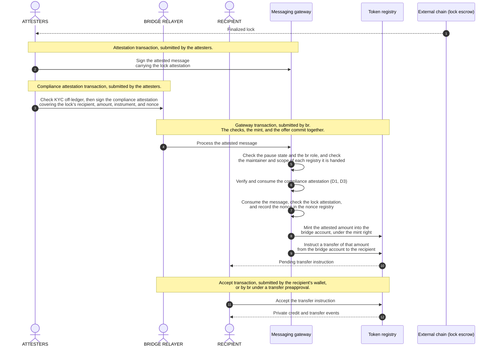
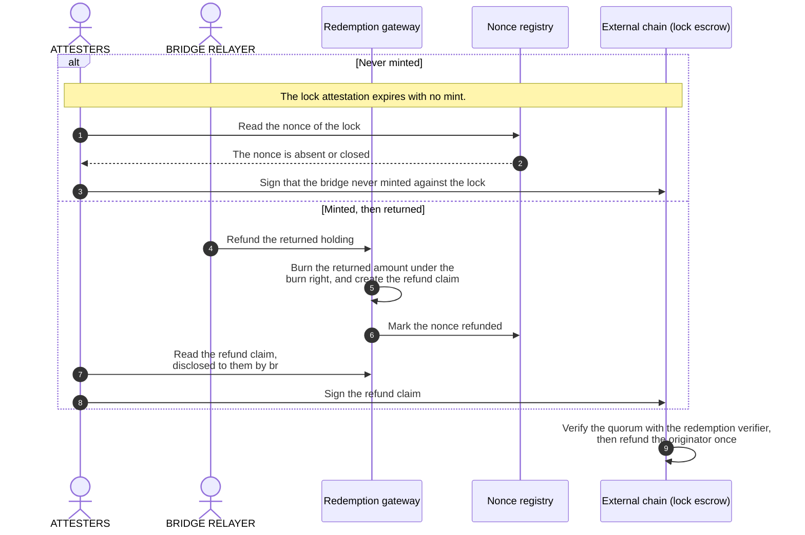
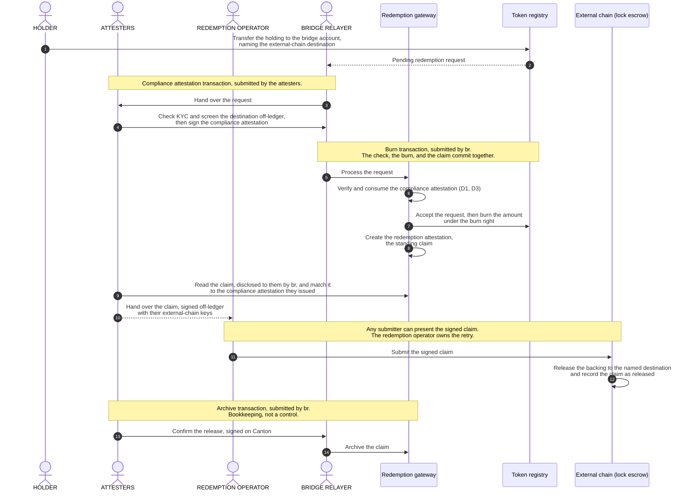

# Cross-Chain Stablecoin Payment Orchestration on Canton

This reference architecture defines the Canton side of a stablecoin bridge
(sometimes referred to as the "rail").
An attested lock on an external chain mints a wrapped instrument on Canton, and a
burn on Canton releases the backing on that chain. Each inbound credit passes
compliance checks before it is offered, and it lands as a private transfer that
the recipient accepts.

## 1. Product Definition

Holders accept a wrapped instrument, written wTOK, that the bridge
mints against an for an attested lock that passed compliance checks.
On the inbound path, the bridge mints under a
mint right that the instrument's token registry grants it, and it runs every
bridge check in its own contracts. On the outbound path, the bridge burns wTOK
under a burn right that the instrument's token registry grants it. wTOK stands
for any instrument whose Token Standard V2 registry grants that right and a
matching burn right. [Section 3.9](#39-registry-integration) defines everything
the bridge requires of a registry.
The credited amount, the payer and payee identities, and the compliance markers
project only to the authorized parties.

[Section 2.1](#21-business-roles) defines the rail's parties. This document
writes the **bridge relayer** as `br`, the **bridge admin** as `ba`, and the
**pause authority** as `pa`.

**Inbound** moves value from the external chain to Canton, by **lock-and-mint**.
**Outbound** moves it back, by **burn-and-release**, which each cross-chain hop
being attested by an off-chain attester set ([section 3.2](#32-reserve-and-lock-attestation)).

> NOTE: This document calls the other chain the **external chain** in both directions.

The transfer must credit the recipient with the intended amount or with nothing.
On Canton, the
[CIP-0112](https://github.com/canton-foundation/cips/blob/main/cip-0112/cip-0112.md)
two-step transfer carries that property. A **transfer instruction** fixes the
sender, the recipient, the amount, and the instrument on-ledger when it is
created, and its accept credits exactly that amount in one transaction or fails
as a whole. Each inbound credit is one transfer instruction that its recipient
accepts.

`OpenZeppelin/canton-contracts` holds a [draft registry
implementation](https://github.com/OpenZeppelin/canton-contracts/tree/8a81bc86d7e5b2ec38db4c0c5897ccdb20ac25b8/packages/token/tokenCIP112-v1/daml/OpenZeppelin/TokenCIP112V1)
of the Token Standard V2 interfaces, including the transfer instruction. This
document uses it as the example wTOK registry. Per-party projection is what
makes it private. A counterparty sees only the
transfers it sends or receives, so one recipient's payment is never visible to
another. The **instrument admin** of the transferred instrument is the one
deliberate exception. It signs that instrument's holdings and transfer
instructions, so it sits inside the trust boundary ([section 2.2](#22-privacy-and-visibility)).

**Privacy scope.** The guarantee covers the Canton side only. The
external-chain lock is a public transaction, and it must carry enough data to
route the transfer on Canton. Hiding the link to the Canton recepient (hashed
commitments, shielded payloads, etc.) is out of scope.

### 1.1 Institutional Controls

We use D1 through D4 as local shorthand for four institutional controls.

| ID | Control | Mechanism | Where enforced | Invariant |
|---|---|---|---|---|
| **D1** | Compliance | A single-use attestation from an N-of-M quorum of listed attesters, screened against the lock's originator and bound to the credit's recipient, amount, instrument, and lock nonce inbound, or to the redemption request outbound, and never cached. | The bridge: the messaging gateway before any transfer instruction exists, and the redemption gateway before any burn, against the attester set that the bridge's attester registry lists. | No valid attestation, no transfer instruction and no burn. |
| **D2** | Seizure | Seizure of a pending credit, implemented by a registry that offers it. | The token registry, optionally ([section 3.9](#39-registry-integration)). The bridge neither requires nor enforces it ([section 3.6](#36-control-enforcement)). | Set by the registry that implements it. |
| **D3** | KYC identity | Each attester service checks off-ledger that the recipient, or outbound the redeeming holder, passed KYC, and the compliance attestation asserts it. | The attester services, before they sign. The gateways enforce the result through D1. | No KYC, no compliance attestation, no transfer instruction and no burn. |
| **D4** | Authority | Every privileged bridge choice binds to a named role rather than to one admin. | The bridge: each privileged bridge choice, against the role grant that carries the privilege. `ba`, which holds the mint right, is N-of-M. The registry governs its own privileged choices. | Privileges are granted, transferred, and revoked without a redeploy. |

### 1.2 Scope

| Bridge scope | Out of scope |
|---|---|
| The Canton side of the bridge: attested mint, private transfer, and attested burn | The deployment and operation of the relayer backend and the attester services, the external-chain lock escrow, external oracles, external-chain validator sets, and light-client proofs |
| The mint and burn rights the bridge asks of a token registry ([section 3.9](#39-registry-integration)) | The token registry itself, its admin's key custody, and any mint path of the registry outside the bridge's grant |
| The gateway checks that deny a credit or a redemption without a valid compliance attestation | Compliance and KYC checks that the attester services run before they sign |
| Token Standard V2 (CIP-0112) two-step transfers: the transfer instruction, its accept, and the transfer preapproval that automates the accept | Token Standard V1 (CIP-0056), and the CIP-0112 allocation and settlement-batch path, which the rail does not use ([section 3.1](#31-inbound-credit)) |
| One Canton synchronizer, with a cross-chain boundary outside it | Cross-synchronizer settlement, and parties hosted on another synchronizer |
| One external chain behind the wrapped instrument | Backing one instrument from several external chains, and the per-chain reserve accounting and routing it needs |
| The controls the bridge enforces itself: D1 and D4 ([section 3.6](#36-control-enforcement)) | Seizure (D2), the KYC check (D3), which the attester services run and the gateways enforce through D1, registry-side compliance and identity checks, and any control over a wTOK holding after it is credited, which each registry implements for itself |

### 1.3 Component Status

An experimental registry package exists in `canton-contracts`, and it serves as
the example wTOK registry. The cross-chain boundary - the messaging gateway,
the redemption gateway, the attested message, and the attested mint - is
unbuilt.

Every package below is experimental, apart from the vendored Token Standard V2
interfaces. Each one was a result of research for this proposal, so all will
require an additional analysis and a full audit. The first build step is an
end-to-end Daml Script exemplar that runs both flows against the registry
package.
The "Remaining work" column lists only the work this design adds on top of a
component. An empty cell means the component already does what this design
needs, not that the component is complete or audited.

| Component | Location | Remaining work |
|---|---|---|
| Example wTOK registry: the `TokenRules` template, the transfer factory and transfer instruction, holdings, and the event log contract | [`canton-contracts` `tokenCIP112-v1`](https://github.com/OpenZeppelin/canton-contracts/tree/8a81bc86d7e5b2ec38db4c0c5897ccdb20ac25b8/packages/token/tokenCIP112-v1) | A mint right and a burn right that the registry grants to `ba` and scopes to the bridge account ([section 3.9](#39-registry-integration)). The package's [admin mint](https://github.com/OpenZeppelin/canton-contracts/blob/8a81bc86d7e5b2ec38db4c0c5897ccdb20ac25b8/packages/token/tokenCIP112-v1/daml/OpenZeppelin/TokenCIP112V1/Registry.daml#L66-L74) is the admin's own and consumes no attestation, so a wTOK deployment of this package must not use it, or the 1:1 backing fails ([section 4.3](#43-threat-model)) |
| Compliance attestation path (D1) | [Section 3.6](#36-control-enforcement) | The whole implementation: the single-use compliance attestation, including the field that asserts the attesters' KYC verdict (D3), the verification of an N-of-M attester quorum against the attester registry ([section 2.3](#23-decentralization-and-trust-topology)), and binding the attestation to the lock's content or to a redemption request and verifying it in the gateway that consumes it |
| Role grants (D4) | [`canton-contracts` `scoped-authorization-grant-v1`](https://github.com/OpenZeppelin/canton-contracts/tree/aeca01d043311d8ccc8ab7cda4d7c16e682429fa/packages/access/scoped-authorization-grant-v1) | The wiring into each privileged bridge choice |
| Pause state | [`canton-contracts` `pausable-v1`](https://github.com/OpenZeppelin/canton-contracts/tree/aeca01d043311d8ccc8ab7cda4d7c16e682429fa/packages/security/pausable-v1) | The pause state template, which `ba` signs, and its set and clear choices, gated by the pause role grant ([section 3.4](#34-registry-identity-and-uniqueness)) |
| Transfer preapproval and delegated accept | [Section 3.1](#31-inbound-credit) | The whole implementation. It is optional: a recipient without one accepts each credit from its wallet. Canton Coin's transfer preapproval is the reference shape, and it covers Canton Coin only ([section 6](#6-open-design-questions)) |
| Messaging gateway, including the registry adapter that calls a registry's mint right | [Section 3.1](#31-inbound-credit) | The whole implementation |
| Attested message and nonce registry | [Section 3.2](#32-reserve-and-lock-attestation) | The whole implementation |
| Attested mint, in the gateway transaction | [Section 3.2](#32-reserve-and-lock-attestation) | The whole implementation |
| Redemption gateway, the burn it drives, and the refund of a returned credit | [Section 3.3](#33-outbound-redemption) | The whole implementation |
| Identity checks on the pause state, the nonce registry, and the attester registry | [Section 3.4](#34-registry-identity-and-uniqueness) | The maintainer and scope fields of each template, fixed before that template first deploys, and the gateway checks that validate them. The bridge packages target Daml-LF 2.1, like the token registry, and use no contract keys |
| Token Standard V2 interfaces | Splice `splice-api-token-*`, vendored as pinned DARs | Nothing. They are consumed by interface |
| Validation tooling | [`daml-lint`](https://github.com/OpenZeppelin/daml-lint), [`daml-props`](https://github.com/OpenZeppelin/daml-props), [`daml-verify`](https://github.com/OpenZeppelin/daml-verify) | The whole validation pipeline. Negative Daml Script tests for every fail-closed path come first: a missing, expired, or unlisted attestation, a replayed nonce, a refund of a nonce already refunded, and a burn without a cleared redemption request |

---

## 2. Architecture Overview

Two things cross the boundary between the chains:
a signature from the attester set, and the nonce of a lock
([section 3.1](#31-inbound-credit)). Everything else here is Canton-specific.

That shapes the rail as one hub with attachments. The hub is the Token
Standard V2 transfer instruction that moves wTOK privately between accounts,
and the token registry creates and completes every wTOK transfer. Supply enters
at the attested mint and leaves at the burn, and the bridge reaches both
through the rights the registry grants it. Each of those two needs an attester
signature, over an external-chain fact that no Canton check can validate. The
messaging gateway checks the compliance attestation, which carries the KYC
result, before any transfer instruction exists, and the redemption gateway
checks one before any burn ([section 3.6](#36-control-enforcement)). The accept
that credits the recipient is the registry's own.

The subsections below take that rail from three angles. They name the party
behind each piece, say who can read it, and set how many independent keys stand
behind the pieces that can break the reserve.

### 2.1 Business Roles

Canton identifies an actor by a party. The external chain identifies it by an
address. Neither chain records that one address and one party are the same
actor, so no on-ledger check can validate the pairing. An operator that acts on
both chains holds both credentials, and configuration is what keeps them
aligned. The lock attestation ([section 3.1](#31-inbound-credit)) therefore
names the Canton recipient explicitly, and the attester set carries the trust
that the recipient is correct.

"The attesters sign" means two different things. Inbound, the attester party
signs on Canton, and the external chain never sees that signature. Outbound,
the escrow cannot read Canton, so each attester also holds an external-chain
key that the escrow's own verifier accepts.

**Canton parties.** Each one signs a contract or submits a command on Canton. The Code column repeats the short codes that [section 1](#1-product-definition) introduces.

| Role | Code | Responsibility and visibility |
|---|---|---|
| Bridge relayer | `br` | Transport and liveness. It exercises the gateway choices, holds the relayer role that the gateway checks, withdraws, through the gateway, an instruction whose flow is dead, and accepts or rejects each redemption request through the redemption gateway. A relayer without an attestation cannot mint. It sees every transfer instruction it creates. |
| Attesters, M of them | - | The trust role, separate from the relayer's transport role. They sign the lock attestation ([section 3.1](#31-inbound-credit)), the compliance attestation ([section 3.6](#36-control-enforcement)), the redemption attestation ([section 3.3](#33-outbound-redemption)), and the refund statement ([section 3.1](#31-inbound-credit)). The attester registry lists them. They see what they attest, and no transfer instruction. |
| Bridge admin | `ba` | The bridge's own admin. Sole signatory of the messaging gateway and the redemption gateway. It holds the mint right and the burn right that the token registry grants the bridge, and it owns the **bridge account**, the registry account where the gateway mints and from which it offers each credit. It maintains the two registries the gateway reads: the attester registry, which lists the parties whose signatures the compliance, mint, and refund checks accept ([section 3.6](#36-control-enforcement)), and the nonce registry, which records the nonce of every lock the bridge minted against ([section 3.2](#32-reserve-and-lock-attestation)). It submits nothing itself, holds the `FeaturedAppRight`, and observes the pause state. As the sender's account owner it sees every inbound credit. |
| wTOK admin | - | The instrument admin of the token registry, and not a bridge role. It grants `ba` the mint and burn rights, signs wTOK holdings and transfer instructions as the registry defines them, and therefore sees every wTOK payment. Its key custody and its own mint paths are the registry's ([section 3.9](#39-registry-integration)). |
| Recipient, or Holder outbound | - | Inbound, accepts the transfer instruction that offers its credit, live from its wallet or through a transfer preapproval it signed earlier ([section 3.1](#31-inbound-credit)). Outbound, offers its holding to the bridge account with a standard transfer that names the external-chain destination ([section 3.3](#33-outbound-redemption)). |
| Pause authority | `pa` | Holds the pause role grant, and through it sets and clears the pause state. A set pause stops new offers, burns, and refunds ([section 3.6](#36-control-enforcement), [section 4.4](#44-failure-modes-and-recovery)). |

**Off-ledger actors and the external chain.** Each of these submits as one of
the parties above, or it lives on the external chain.

| Role | Responsibility and visibility |
|---|---|
| Lock escrow | External-chain contract that holds the backing for the bridged funds. It releases the backing if it receives a verified redemption attestation. Any submitter the attesters hand the signed claim to can present that attestation and release the funds ([section 3.3](#33-outbound-redemption)). |
| Relayer backend | Off-Canton process. It watches the external chain and submits every inbound command as `br`, with the gateways attached as disclosed contracts. |
| Bridge admin backend | Off-Canton process on a participant that hosts `ba`. It serves the active attester registry and nonce registry as disclosed contracts to the attester services, and the active gateways to the relayer backend, and it submits nothing. |
| Attester services | M independent operators on M participants. Each submits as its own attester party, and each runs the compliance and KYC checks before it signs a compliance attestation ([section 3.6](#36-control-enforcement)). |
| KYC providers | Off-ledger services that the attester services consult for D3. They observe no transfer. |
| Recipient wallet | Off-Canton process. It accepts pending transfer instructions as the recipient, and it may create a transfer preapproval so that `br` can complete a credit without a live accept. |
| Redemption operator | Off-Canton process. It submits the signed claim to the escrow, and it owns the retry of a stalled release ([section 3.3](#33-outbound-redemption)). |

The gateways and the registries are contracts, not services. The messaging
gateway and the redemption gateway have the choices that `br` exercises
([section 3.1](#31-inbound-credit), [section 3.3](#33-outbound-redemption)). The pause state, the attester
registry, and the nonce registry reach the gateway as disclosed contracts,
and the gateway checks the maintainer and the scope each one carries, so only
`ba`'s contracts pass ([section 3.4](#34-registry-identity-and-uniqueness)). The
lock attestation is a data record inside the attested message, so an attester
signs the message and not a standalone attestation. The attested message, the
compliance attestation, and the release confirmation each name the `br` they
are issued to and `ba`. Consuming one needs both parties' authority, which only
a gateway transaction carries, so no party archives one outside a gateway.

### 2.2 Privacy and Visibility

The table below gives one row per contract. The signatories and the observers of
a contract are the only parties that see it. The first four rows are the token
registry's contracts, and the registry decides their exact stakeholders; the
rows show the example registry. Every other contract belongs to the bridge. A
party that a row does not name sees the contract only transiently, when a
transaction it witnesses divulges it.

| Contract | Signatories | Observers |
|---|---|---|
| Inbound transfer instruction, and the factory call that creates it | The wTOK admin and `ba`, as the owner of the sender's account | The recipient |
| Redemption request, the holder's transfer instruction to the bridge account | The wTOK admin and the holder | `ba`, as the owner of the receiver's account |
| Event log contract, created and archived in one transaction | The wTOK admin | None |
| wTOK holding, in the bridge account or the recipient's | The wTOK admin and the account's parties | The lock's observers, while locked |
| Compliance attestation | The attesters that sign it | `br`, as the party it is issued to, and `ba`, whose authority verifies it inside the gateway |
| Attester registry | `ba` | None. A listed attester reads it through disclosure ([section 3.6](#36-control-enforcement)) |
| Pause state | `ba` | None |
| Pause role grant | `ba` | The current `pa` |
| Relayer role grant | `ba` | The current `br` |
| Attested message | The attesters that sign it | `br` |
| Redemption attestation, and the refund claim | `ba` | None. An attester reads it through disclosure ([section 3.3](#33-outbound-redemption)) |
| Messaging gateway | `ba` | None. `br` exercises its choices through disclosure |
| Redemption gateway | `ba` | None. `br` exercises its choices through disclosure |
| Transfer preapproval, when the recipient creates one | The recipient | `br` |
| Nonce registry | `ba` | None. An attester reads it through disclosure ([section 3.6](#36-control-enforcement)) |

Consequences:

- **No recipient sees another recipient's credit.** Each transfer instruction
  names one recipient and projects to that recipient alone, so concurrent
  inbound payments disclose nothing to each other.
- **The wTOK admin sees every wTOK payment.** A transfer's metadata travels into
  the update stream, so amounts, accounts, and the transfer metadata are
  readable by construction. This is a trust assumption and not a leak to close.
  The wTOK admin signs every transfer instruction and every holding of its
  instrument, so it cannot be blind to a payment. Any issued instrument
  puts its own issuer in this position. `ba` sees every inbound credit as the
  owner of the account that sends it. `br` and the attesters see what
  they handle for the same reason: a transport-only role bounds authority and
  not visibility, so attester membership is a privacy decision as well as a
  compliance one.
- **Transfer outcomes arrive as events, not as active contracts.** The
  example registry reports each holdings change by exercising the Token
  Standard V2 `EventLog_HoldingsChange` choice on a short-lived `EventLog`
  contract that it creates and archives in the same transaction. The event data
  is the choice's argument, so it reaches its observers as an exercised event on
  the Ledger API update stream and never appears in the active contract set.
  Integrators read that stream ([section 4.6](#46-off-ledger-reconciliation)).
  The durable evidence of a credited payment is the recipient's holding.
- **No personal data on the ledger.** The compliance attestation carries the
  attesters' KYC verdict and not personal attributes. The KYC data stays with
  the KYC providers and the attester services.

### 2.3 Decentralization and Trust Topology

Each posture below states how many independent organizations stand behind one
party. Canton offers three routes to an N-of-M posture, and the choice between them is
open ([section 6](#6-open-design-questions)):

- **On-ledger approval workflow.** The multisig is written in Daml, as a
  [Multiple Party
  Agreement](https://docs.canton.network/appdev/modules/m3-design-patterns#multiple-party-agreement).
  The approvals are durable, named, and auditable on-ledger.
- **External party with threshold signing keys.** The role party's transactions
  require N of M keys held by independent organizations. The Daml code never
  sees this, and each action costs one ledger transaction. The [Bitsafe
  decentralization-manager](https://github.com/DLC-link/decentralization-manager)
  is one candidate implementation.
- **Multi-hosted party with a confirmation threshold.** The role party is
  hosted on M participants that independent organizations operate, and N of
  them must confirm each transaction. The trust sits with the participant
  operators rather than with key holders, and the party needs another party's
  submission or external signing to act.

**Decision.** `ba` creates wTOK supply at the attested mint, through the mint
right the registry grants it, and it owns the bridge account where minted and
returned credits sit. That is critical authority, so no single key may exercise
the role. Everything that decides whether bridge-minted supply is legitimate
sits with `ba` by design: the mint right, the attester registry that every
gateway check reads, and the nonce registry. That registry records the nonce of
every lock the bridge minted against ([section 3.2](#32-reserve-and-lock-attestation)), so that one lock mints once
even when a valid attestation for it arrives a second time. Splitting those would create a
second key that can break the reserve without being able to mint, so the answer
to the concentration is the posture below and not a division of the contracts.

The wTOK admin also signs every holding of its instrument and can create one
directly, so it can break the reserve on its own too. Its posture is the
registry's and not the bridge's to set, and the reserve claim states that trust
([section 4.2](#42-trust-boundaries)).

The table sets each role's posture, the organizations behind it, and who
submits in its name. A party above threshold 1 submits nothing itself, so the
third column is where the posture meets the flows of [section
3](#3-target-design).

| Role | Target posture | Who submits in its name | Why |
|---|---|---|---|
| Attesters | M parties, one per independent attester organization, each on its own participant. The attester registry lists them, and every check requires N of M, never all of M | Each attester service submits as its own party | One unavailable or unvetted attester must not halt the rail, and one malicious attester must not mint |
| `ba` | N-of-M across independent organizations, by one of the three routes above. The route, N, and M are open ([section 6](#6-open-design-questions)) | Nothing on the payment path. Its authority enters the gateway transaction as the gateway's signatory, which is what lets the attested mint and the offer from the bridge account run inside a transaction that `br` submits ([section 3.2](#32-reserve-and-lock-attestation)). Registry rotations and the creation of the gateways are its own transactions, externally signed or run through the approval workflow | It holds the mint right and owns the bridge account, so this role can break the reserve on its own ([section 4.3](#43-threat-model)) |
| wTOK admin | Set by the token registry, not by the bridge | The registry's own operations | It signs every holding of its own instrument and can create one directly, so the reserve claim trusts it ([section 4.2](#42-trust-boundaries)) |
| `br` | One party, multi-hosted on several participants that relayer host organizations operate, confirmation threshold 1 | The relayer backend on any host submits directly | It holds no minting trust and is the most submission-heavy role in the design. Integrity comes from the attester split, and relay should ultimately be permissionless, so no single organization controls liveness |
| `pa` | One party, multi-hosted, confirmation threshold 1, held by organizations other than the relayer hosts | Any host submits a pause or an unpause directly | A pause must be instant, so no quorum stands in front of it. The pause lives on the ledger and outside `br`, so a party that a compromised relayer does not control can stop it. The price is a griefing window where a malicious `pa` stops new offers, burns, and refunds until it unpauses or `ba` revokes its grant, and the locks stay creditable or refundable in the meantime ([section 3.1](#31-inbound-credit)). Several hosts can each submit, so a pause and an unpause are both idempotent |
| Recipients | No rail-side decentralization | The recipient's wallet, live or through the transfer preapproval `br` exercises | Nothing credits a recipient without its own signature, live or carried by a transfer preapproval, so it trusts only its own keys and participant |

`br` is the only party on both sides of the cross-chain boundary. It pays
every transaction but a live accept ([section 5.1](#51-traffic-costs)), and
new offers stop when its validator runs out of traffic
([section 4.4](#44-failure-modes-and-recovery)).

---

## 3. Target Design

Only the credit is atomic, and only on Canton. The inbound path is one
relayer-submitted gateway transaction that mints and creates the offer, and one
accept that the recipient submits, or that `br` submits under a transfer
preapproval. The relayer backend orchestrates its own submissions off-ledger.
The attesters sign the attested message and the compliance attestation in
transactions of their own.

### 3.1 Inbound Credit

Four steps carry a finalized external-chain lock to a credited wTOK holding.
The attesters submit steps 1 and 2. `br` submits step 3. The recipient submits
step 4, or `br` submits it under a transfer preapproval the recipient signed
earlier.

**Inbound credit**

```mermaid
sequenceDiagram
    autonumber
    actor Attesters as ATTESTERS
    actor Relayer as BRIDGE RELAYER
    actor Recipient as RECIPIENT
    participant App as Messaging gateway
    participant Registry as Token registry
    participant Chain as External chain (lock escrow)

    Chain-->>Attesters: Finalized lock
    rect rgba(255, 255, 255, .1)
        Note over Attesters,App: Attestation transaction, submitted by the attesters.
        Attesters->>App: Sign the attested message<br/>carrying the lock attestation
    end
    rect rgba(255, 255, 255, .1)
        Note over Attesters,Relayer: Compliance attestation transaction, submitted by the attesters.
        Attesters->>Relayer: Check KYC off-ledger, then sign the compliance attestation<br/>covering the lock's recipient, amount, instrument, and nonce
    end
    rect rgba(255, 255, 255, .1)
        Note over Relayer,Registry: Gateway transaction, submitted by br.<br/>The checks, the mint, and the offer commit together.
        Relayer->>App: Process the attested message
        App->>App: Check the pause state and the br role, and check<br/>the maintainer and scope of each registry it is handed
        App->>App: Verify and consume the compliance attestation (D1, D3)
        App->>App: Consume the message, check the lock attestation,<br/>and record the nonce in the nonce registry
        App->>Registry: Mint the attested amount into the<br/>bridge account, under the mint right
        App->>Registry: Instruct a transfer of that amount<br/>from the bridge account to the recipient
        Registry-->>Recipient: Pending transfer instruction
    end
    rect rgba(255, 255, 255, .1)
        Note over Relayer,Registry: Accept transaction, submitted by the recipient's wallet,<br/>or by br under a transfer preapproval.
        Recipient->>Registry: Accept the transfer instruction
        Registry-->>Recipient: Private credit and transfer events
    end
```

1. **Attested message.** The external chain finalizes a locked deposit. The
   attesters sign an **attested message**, the Canton contract that carries
   the typed **lock attestation**: the
   locked amount, the Canton recipient, the target instrument, the lock's
   nonce, and an expiry. The nonce is the identifier the external chain
   assigned to the lock: the escrow's sequence number, which increases by one
   per lock. The nonce registry derives its epoch from that number
   ([section 3.2](#32-reserve-and-lock-attestation)). The rail serves one chain ([section 1.2](#12-scope)) and the
   nonce registry is scoped to one instrument
   ([section 3.4](#34-registry-identity-and-uniqueness)), so the nonce
   alone identifies a lock. An N-of-M quorum aggregates onto that message
   ([section 2.3](#23-decentralization-and-trust-topology)).
2. **Compliance attestation.** The attesters sign a single-use **compliance
   attestation** for the credit that the lock will become. It binds the lock's
   content: the recipient, the amount, the instrument, and the nonce. The lock
   attestation fixes all four before any transfer instruction exists, so the
   compliance attestation needs no contract id to bind to. Each attester
   service signs only after its off-ledger checks pass: it screens the lock's
   originator on the external chain and checks the recipient's KYC. The
   attestation is issued to `br`, which presents it at step 3. That is D1 and
   D3 ([section 3.6](#36-control-enforcement)).
3. **Gateway transaction.** The **messaging gateway**, the contract whose
   choices `br` exercises to bring a message onto the rail, runs every bridge
   check in one choice, and each check fails closed:

   - the pause state is clear, and the submitter holds the relayer role;
   - the compliance attestation comes from a listed quorum, matches the lock
     attestation, and is consumed, which is D1 and D3;
   - the lock attestation passes the mint checks, and the nonce registry does
     not hold its nonce ([section 3.2](#32-reserve-and-lock-attestation)).

   The choice then consumes the message, so that message cannot be replayed,
   and records the nonce in the nonce registry. It mints the attested amount
   into the bridge account under the mint right that the registry grants
   `ba`, and it exercises the registry's `TransferFactory_Transfer` to create
   a **transfer instruction**: the Token Standard V2 contract that offers a
   pending transfer to its receiver. The sender is the bridge account, the
   receiver is the recipient's account, and every field binds to the lock
   attestation: the amount, the recipient, and the instrument. The
   instruction's metadata carries the lock's nonce under the key
   `bridge.reference.openzeppelin.com/lock-nonce`, which is the value a
   recipient later matches its transfer events against
   ([section 4.6](#46-off-ledger-reconciliation)). The minted holding stays
   locked in the instruction until the instruction resolves.

   `ba`'s authority comes from the gateway it signs, and it covers both the
   mint and the sender's side of the transfer. The recipient's participant
   therefore confirms nothing at this step, and a recipient that is offline
   sees the offer when it returns. The bridge account is the sender, so the
   standard's withdraw belongs to `ba`, and `br` exercises it through a
   gateway choice that carries `ba`'s authority. That is how a dead flow is
   closed early ([section 4.4](#44-failure-modes-and-recovery)).
4. **Accept.** The recipient's wallet exercises the standard's
   `TransferInstruction_Accept`, the one choice that credits. The accept is
   the registry's own code and runs no bridge check, because every bridge
   check ran at step 3. A wallet that speaks the standard accepts a bridge
   credit as it accepts any other pending transfer, and the registry's
   choice-context endpoint supplies whatever its own accept needs. The accept
   moves the locked holding into the recipient's account in one transaction,
   or fails as a whole, and the registry's transfer events report the credit.

   An offline corporate treasury cannot accept interactively. Its wallet may
   pre-establish a **transfer preapproval**: a recipient-signed bridge
   contract that lets `br` exercise the standard accept with the recipient's
   authority. When a preapproval exists, the gateway transaction of step 3
   accepts the instruction it creates in the same transaction, so the credit
   takes one relayer-submitted transaction. The preapproval is an
   optimization and not a prerequisite: a recipient without one is credited
   when it accepts, and the instruction waits for it until its deadline.
   Canton Coin's transfer preapproval is the reference shape, and it covers
   Canton Coin only, so the bridge defines its own. It calls only the
   standard accept, so it works with any registry. The preapproval bounds
   what it authorizes: the instrument, an amount ceiling, an expiry, and the
   party that may exercise it ([section 6](#6-open-design-questions)). The
   recipient signs it, so it can archive it at any time.

   The recipient can also reject. A rejected or withdrawn instruction
   returns the locked holding to the bridge account in the same transaction,
   by the standard's own semantics. An instruction that lapses returns
   nothing by itself: the accept fails after the deadline, but the holding
   stays locked inside the instruction until `br` withdraws it through the
   gateway ([section 4.4](#44-failure-modes-and-recovery)). `br` then refunds
   the holding, or offers it once more when the instruction lapsed during an
   outage or a pause ([section 3.2](#32-reserve-and-lock-attestation)).

**Fewer attester transactions.** The compliance attestation binds the same
content as the lock attestation, so the attesters could sign both in the
attested message. The design keeps the two separate so that each failure is
attributable to one check and one party. A deployment that wants lower latency
may collapse them. Both shapes keep every control of [section
3.6](#36-control-enforcement), because the checks sit in the gateway choice and
not in the transaction boundaries.

**Rejected alternative: lock-and-unlock.** It pays the recipient from liquidity
held on the destination side, which adds a liquidity-provider role and an
inventory-imbalance surface that a reference rail does not need.

**Rejected alternative: allocation and settlement batch.** A settlement batch
makes several legs all-or-nothing, which an exchange needs. An inbound credit
has no counter-leg on Canton, so a batch only binds unrelated payments
together, and a pending transfer instruction already gives one credit the
recipient's signature, a fixed amount and recipient, and a deadline. The
allocation route also costs more. An offline recipient needs a preapproval
before it can receive at all, the recipient's participant must confirm the
batch, so one timed-out recipient fails every payment in it, and the wallet
shows a settlement to assemble rather than a transfer to accept. A credit that
funds one leg of an atomic exchange settles that exchange over the allocation
path, with the transfer instruction here as the funding leg.

**Bridge account over a direct mint.** A mint right that names the recipient's
account would credit it just as well. Minting into the bridge's own account and
offering the credit as a transfer keeps the recipient's signature on every
credit, and it narrows the registry's grant to one account the bridge owns
([section 3.9](#39-registry-integration)). A rejected or withdrawn credit
returns to the bridge account by the standard's own semantics, so the bridge
sees how each offer ended without visibility the registry has to add. The offer is a
standard transfer instruction, so the recipient's wallet accepts it without
rail-specific code, a custody provider can run its own approval before the
accept, and a registry can implement seizure on the pending state
([section 3.6](#36-control-enforcement)).

The cost is that supply exists while an offer is pending, locked in the
bridge's outgoing instruction or returned to the bridge account. The reserve
invariant counts it ([section 3.2](#32-reserve-and-lock-attestation)).

**Delivery and retry.** Nothing guarantees that the Canton credit of an
attested lock executes. Delivery liveness is bounded by the trusted `br` and
attester set, and this design adds no automatic cross-chain recovery protocol.
A message that re-drives a credit from the external chain would need
multi-round message passing, with its own delay, cost, and failure surface. What
remains is structural and fail-closed. Command deduplication over 24 hours makes
the relayer's commands safe to resubmit after a crash, provided the retry
goes to the same participant, because deduplication is scoped to the submitting
participant and not to the synchronizer. The relayer backend needs no
command-id state machine to know what to do next. It drives each step from the
active contract set, keyed by the lock's nonce: a standing attested message
beside a compliance attestation calls for the gateway transaction, a pending
instruction beside a transfer preapproval for the delegated accept, and a
returned holding in the bridge account for a refund, or for one new offer
after an outage or a pause. An
instruction without a preapproval waits for its recipient and needs nothing
from `br`. A restart re-reads the set and continues, which is the trigger
pattern that Splice uses for its own automation. A stall blocks only this rail
([section 4.5](#45-throughput-and-contention)). [Section
4.4](#44-failure-modes-and-recovery) maps each failure to its recovery path,
including a duplicate from a second relayer host, which the nonce registry
rejects instead. A timeout that refunds the external-chain lock is the escrow's
own path, and the escrow is out of scope ([section 1.2](#12-scope)). The
condition of that refund belongs here, because it decides whether one lock
pays out twice.

**Refund exclusivity.** A refund on the external chain must never pay out a lock
whose credit stands on Canton, and no mint may follow a refund. A lock reaches
a refund from one of two states, and each state has its own rule.

- **Never minted.** The attesters never signed, the compliance attestation was
  denied, or the lock attestation expired before a gateway transaction. The
  gateway rejects an expired attestation
  ([section 3.2](#32-reserve-and-lock-attestation)), so after that expiry no
  mint can follow. The escrow refunds only against a signed statement from an
  attester quorum that the bridge never minted against the lock. The nonce
  registry is the contract that statement reads, and each attester reads it
  through disclosure ([section 3.6](#36-control-enforcement)).
  A quorum signs only after the attestation expires or the nonce registry
  records the nonce as closed, because before then the answer can still
  change. When `br` closes a message whose compliance attestation was denied,
  the gateway records the nonce as closed, and a closed nonce never mints, so
  the statement can follow at once, unless the denial requires a freeze.
- **Minted, then returned.** The recipient rejected the offer, `br` withdrew
  it, or the registry expired it, so the minted holding is back in the bridge
  account. The bridge refunds it through the redemption gateway, which burns
  the returned amount under the burn right, marks the nonce refunded in the
  nonce registry, and creates a **refund claim** that names the lock's nonce,
  all in one transaction ([section 3.3](#33-outbound-redemption)). The escrow
  releases a refund claim only to the address that funded that lock, and only
  once per lock. A refunded nonce never mints again, because the gateway
  refuses any nonce the nonce registry holds.
- **Held.** A denial that requires a freeze, for example a sanctions hit on
  the originator, must not refund the denied party. The attesters withhold the
  refund statement or the refund claim, so the backing stays in the escrow. A
  minted credit that returns under such a denial is still burned: `br` burns
  the returned holding through the redemption gateway and marks the nonce
  held, with no claim. Supply then stays below the backing. Releasing a held
  lock is a decision outside the bridge.

The escrow already verifies attester signatures for a redemption release
([section 2.1](#21-business-roles)), so both refund paths reuse that verifier.

The ledger binds a returned holding to its offer only when `br` withdraws the
offer, because the withdraw returns the holding to the gateway choice that
exercised it. When the recipient rejects or the registry expires the
instruction, `br` reads the binding from the bridge account's transfer events. A
wrong binding refunds one lock with value that another lock returned, and it
can refund a lock whose credit stands. The reserve still holds, because each
refund burns its amount before the escrow releases it, so the loss falls on
the originator whose returned value was spent. That binding is part of the
trust in `ba` and `br` ([section 4.2](#42-trust-boundaries)).

**Inbound refund**

```mermaid
sequenceDiagram
    autonumber
    actor Attesters as ATTESTERS
    actor Relayer as BRIDGE RELAYER
    participant Redeem as Redemption gateway
    participant Reg as Nonce registry
    participant Chain as External chain (lock escrow)

    alt Never minted
        Note over Attesters,Chain: The lock attestation expires with no mint.
        Attesters->>Reg: Read the nonce of the lock
        Reg-->>Attesters: The nonce is absent or closed
        Attesters->>Chain: Sign that the bridge never minted against the lock
    else Minted, then returned
        Relayer->>Redeem: Refund the returned holding
        Redeem->>Redeem: Burn the returned amount under the<br/>burn right, and create the refund claim
        Redeem->>Reg: Mark the nonce refunded
        Attesters->>Redeem: Read the refund claim,<br/>disclosed to them by br
        Attesters->>Chain: Sign the refund claim
    end
    Chain->>Chain: Verify the quorum with the redemption verifier,<br/>then refund the originator once
```

### 3.2 Reserve and Lock Attestation

[Section 3.1](#31-inbound-credit) credits the payment. This section ties that
payment to the backing on the external chain.

**Attestation.** The lock attestation states that the escrow received a given
amount under a given nonce, and that only one mint of the same amount on Canton
may credit that deposit. No Canton contract can check either fact. That is the whole trust the
attester set carries. An N-of-M quorum signs the attestation
([section 2.3](#23-decentralization-and-trust-topology)), and `br` only
transports it.

**Mint checks.** The gateway runs the mint on-ledger and rejects the attestation
unless:

- the signatures come from listed attesters and reach the threshold;
- the attestation has not expired;
- the amount, recipient, and instrument of the mint and the offer match it;
- the nonce registry does not already hold the lock's nonce.

The mint runs inside the gateway transaction of
[section 3.1](#31-inbound-credit), so a failed check rolls back the whole
gateway transaction. Nothing is minted and nothing is offered.

**Nonce registry.** The gateway fetches the registry on-ledger and writes the
lock's nonce ([section 3.1](#31-inbound-credit)) in the transaction that mints.
A nonce is in one of four states: minted, closed without a mint, refunded, or
held.
Each registry version carries every nonce of the one it replaces. The
registry's scope fields name one instrument and one **epoch**, a fixed range
of `E` consecutive nonces, and the gateway checks that the registry it is
handed carries the epoch of the nonce it processes, the nonce divided by
`E` ([section 3.4](#34-registry-identity-and-uniqueness)). An epoch
registry therefore never holds more than `E` nonces, and a mint rewrites only
the registry of its own epoch, so the bytes each mint writes stay bounded as
the rail's history grows ([section 4.5](#45-throughput-and-contention)).

`ba` creates the registry of the first epoch. Each later epoch's registry is
created by the first transaction that writes its predecessor, in the same
consuming exercise, and the predecessor records that its successor exists.
Each registry version is consumed once, so each epoch gets exactly one
registry. A nonce whose epoch has no registry yet has nothing to check against and is
rejected, and `br` retries after a write to the predecessor creates it. `E`
exceeds the number of locks that can be in flight at once, so an epoch's
registry exists before its first lock reaches the gateway. A settled epoch's
registry stays active, because a later refund or close of one of its nonces
writes it.

**Returned credits.** The registry records mints, not credits. An instruction
that is rejected, or withdrawn before or after its deadline, returns its
holding to the bridge account, and the nonce stays recorded as minted. `br` refunds the holding by
default ([section 3.1](#31-inbound-credit)). A reject, a compliance denial, and
an ordinary expiry all end in a refund, or in a hold when a denial requires a
freeze, so returned value leaves the bridge
account promptly and no credit cycles through repeated offers. The one
exception is an instruction that expired while the rail could not deliver it:
its deadline lapsed during a synchronizer outage or while the pause state was
set. `br` offers that holding once more to the same recipient, through a
gateway choice that checks a fresh compliance attestation, and refunds it if that offer also returns. The exception rests on
the outage or the pause, which the ledger records, and not on a guess about the
recipient's intent, so one infrastructure incident does not refund every
payment in flight. Attesters read the registry before they sign a lock
attestation and decline a lock that already minted, but the gateway's check is
the safety control, so an attester that cannot reach the registry still signs.

**Reserve invariant.** The backing is one balance: every deposit the bridge
minted against, less every redemption and every refund the escrow released.
The wTOK supply that the bridge minted never exceeds it. A mint adds one
deposit amount to both, and a redemption or a refund of a returned credit
removes one burn amount from both. Supply in the bridge account, locked in a
pending offer or returned from one, counts like any other supply. A held lock
burns its supply and keeps its backing, so the backing exceeds the supply by
every held amount. **Because
the escrow holds the backing as one balance, the invariant means the escrow
can pay out every burn.** The invariant covers the whole instrument only if
the bridge's mint right is the instrument's only mint path, which the registry
decides ([section 3.9](#39-registry-integration)).

**Supply creation.** Supply is created only at the gateway's attested mint,
which `ba` authorizes as the holder of the mint right and the gateway's
signatory. The mint lands in the bridge account, and the offer moves it to the
recipient only at the accept.

### 3.3 Outbound Redemption

Redemption mirrors the inbound flow. Inbound, the bridge offers a credit and
the recipient accepts it. Outbound, the holder offers its holding to the bridge
account, and the bridge accepts and burns it once the attesters clear the
request. The attester quorum then signs the claim, and the escrow releases the
backing on the external chain.

**Outbound redemption**

```mermaid
sequenceDiagram
    autonumber
    actor Holder as HOLDER
    actor Attesters as ATTESTERS
    actor Operator as REDEMPTION OPERATOR
    actor Relayer as BRIDGE RELAYER
    participant Redeem as Redemption gateway
    participant Registry as Token registry
    participant Chain as External chain (lock escrow)

    Holder->>Registry: Transfer the holding to the bridge account,<br/>naming the external-chain destination
    Registry-->>Relayer: Pending redemption request
    rect rgba(255, 255, 255, .1)
        Note over Attesters,Relayer: Compliance attestation transaction, submitted by the attesters.
        Relayer->>Attesters: Hand over the request
        Attesters->>Relayer: Check KYC and screen the destination off-ledger,<br/>then sign the compliance attestation
    end
    rect rgba(255, 255, 255, .1)
        Note over Relayer,Registry: Burn transaction, submitted by br.<br/>The check, the burn, and the claim commit together.
        Relayer->>Redeem: Process the request
        Redeem->>Redeem: Verify and consume the compliance attestation (D1, D3)
        Redeem->>Registry: Accept the request, then burn the amount<br/>under the burn right
        Redeem->>Redeem: Create the redemption attestation,<br/>the standing claim
    end
    Attesters->>Redeem: Read the claim, disclosed to them by br, and match it<br/>to the compliance attestation they issued
    Attesters-->>Operator: Hand over the claim, signed off-ledger<br/>with their external-chain keys
    Note over Operator,Chain: Any submitter can present the signed claim.<br/>The redemption operator owns the retry.
    Operator->>Chain: Submit the signed claim
    Chain->>Chain: Release the backing to the named destination<br/>and record the claim as released
    rect rgba(255, 255, 255, .1)
        Note over Attesters,Redeem: Archive transaction, submitted by br.<br/>Bookkeeping, not a control.
        Attesters->>Relayer: Confirm the release, signed on Canton
        Relayer->>Redeem: Archive the claim
    end
```

1. **Request.** The holder makes a standard `TransferFactory_Transfer` of the
   holding to the bridge account, with the external-chain destination in the
   transfer's metadata under the key
   `bridge.reference.openzeppelin.com/redeem-destination`. The registry leaves
   it as a pending transfer instruction, the **redemption request**: the
   holding is locked and has not moved. The bridge account holds no transfer
   preapproval, so no request completes before the bridge accepts it, and the
   holder can withdraw its request until then. The destination is the field
   the escrow acts on, so this design assumes the holder's wallet renders the
   amount and the destination in clear before the holder signs.
2. **Compliance attestation.** `br` reads each request, which `ba` observes as
   the receiver's account owner, and hands it to the attester services. Each
   attester service checks the holder's KYC and screens the destination
   off-ledger, and a quorum signs a single-use compliance attestation bound to
   the request: the holder, the amount, the instrument, the destination, and
   the request's contract id. That is D1 and D3 outbound
   ([section 3.6](#36-control-enforcement)).
3. **Burn.** `br` exercises the **redemption gateway**, the outbound
   counterpart of the messaging gateway, which carries `ba`'s authority. In
   one transaction it checks that the pause state is clear, verifies and
   consumes the compliance attestation,
   accepts the request as the receiver, burns the amount under the burn right
   that the registry grants `ba`, and creates the **redemption attestation**,
   the claim that carries:

   - the instrument the burn removed supply from;
   - the amount the burn destroyed, which is the amount the escrow releases;
   - the Canton holder whose request the burn consumed;
   - the external-chain destination the holder named;
   - the claim's nonce, which is the reference of the compliance attestation
     the burn consumed.

   The instrument and the amount bind the reserve arithmetic. The other three
   identify the redemption, as the lock attestation identifies a deposit
   ([section 3.1](#31-inbound-credit)). The escrow records the nonce when it
   releases the claim, so an auditor can match each release to one Canton
   burn and one holder.

   On a denial, `br` rejects the request through the same gateway, with the
   denial reference in the rejection's metadata, and the holding returns to
   the holder. A request that nobody decides is withdrawn by the holder, who
   signs it as the sender, which also returns the holding. Nothing burns
   without a cleared request.

   **No claim stands without a burn.** That direction is the one the escrow
   depends on. `ba` alone signs the claim, because the holder's authority does
   not reach the transaction that accepts its request, so a direct create by
   `ba` could produce a claim with no burn behind it. The escrow sees only a
   signed message and cannot tell. The attester backend bounds that: an
   attester signs a claim only if it matches a compliance attestation the
   attester issued, and only once per attestation. A claim with no burn
   therefore needs a real, cleared request, it pays only the destination the
   holder named, and it leaves the holder's holding unburned, so value leaves
   twice only if the holder colludes with `ba`. The rest is the trust in `ba`
   ([section 4.2](#42-trust-boundaries)).

   **Refund of a returned credit.** The refund claim of
   [section 3.1](#31-inbound-credit) runs through the same gateway without a
   request: `br` burns the returned holding from the bridge account and
   creates the claim. In place of a destination it names the lock's nonce, and
   the escrow releases it only to the address that funded that lock, once. The
   attesters sign it against the nonce registry, not against a compliance
   attestation.

4. **Attest.** An N-of-M quorum of listed attesters signs the claim, through
   the same attester registry path as the lock attestation. The escrow
   verifies that quorum with its own verifier
   ([section 2.1](#21-business-roles)). No attester is a stakeholder of the
   claim. The relayer backend hands each new claim to the attester services as
   a disclosed contract, and each attester reads it as it reads the registries
   ([section 3.6](#36-control-enforcement)), so it signs only a claim that
   stands and the burn never waits on an attester's participant.
5. **Release on the external chain.** Any submitter presents the signed
   claim to the escrow. The escrow releases the amount to the
   external-chain destination and decrements the reserve by the same amount,
   so the backing and the supply move together.

**Cross-chain atomicity.** The external-chain release does not sit in the same
Daml transaction as the Canton burn, so the order is burn first and attested
release second. The Canton burn is the irreversible commit, and the release
needs the signed attestation. That order assumes an external chain where any
submitter can claim the release, against escrow state that the escrow committed
before the burn.

Under that assumption, a stalled release is safe. The burn stays final, the
reserve accounting stays sound, and the redemption becomes a standing claim that
nobody can replay. The escrow records each claim it releases, so replay
protection for the outbound direction sits there, as the nonce registry
sits on Canton for the inbound one. The redemption operator owns the retry, and
the claim is permissionless, so the holder or any relayer can resubmit it until
the escrow releases. A stalled release therefore costs time. It never causes a
double-spend or unbacked supply.

The claim contract stands on Canton until `br` archives it, under the
authority of an attester quorum that confirms the escrow released it. That
archive is bookkeeping and not a control, because the escrow refuses a second
release either way. Attesters carry the confirmation because only they observe
the external chain, and `br` submits it because it carries transport and
pays traffic ([section 2.1](#21-business-roles)).

**Chains that cannot hold the payout back.** Some chains cannot make the payout
conditional on the attestation. On a UTXO chain without contracts, the release
is a plain threshold-signed transaction, so the payout exists only if the signer
quorum produces it. A quorum that stalls or refuses then looks the same as a
loss, and under burn-first the redeemer holds neither asset. A permissioned
release on a chain with contracts fails the same way, because the holder cannot
submit the claim itself.

The sound ordering there is burn-last. Lock the wrapped holding, authorize
on-ledger against the pinned input and output sets of the payout, sign,
broadcast, confirm the payout, and burn last. The reserve invariant then has to
allow for the in-flight window, because the backing is spent while the wrapped
holding still exists. Without that allowance, 1:1 monitoring reads an honest
redemption as under-collateralized.

Burn-last is a different trust model, and not a variant of the ordering above.
It needs an attested claim that the payout confirmed, and it needs the unlock
path and the burn path to exclude each other. This design does not cover it. A
bridge to a chain that cannot hold the payout back must not inherit the
burn-first claim.

### 3.4 Registry Identity and Uniqueness

The gateway reads three bridge contracts at execution time: the pause state,
the attester registry, and the nonce registry. `br` submits the gateway
transaction and is a stakeholder of none of them, so `br`'s participant does
not hold them. The bridge admin backend hands them to `br` as disclosed
contracts, and `br` passes their contract ids into the gateway choice. The
nonce registry changes id on every mint and refund, and the gateway choice
returns the new id, which `br` witnesses as the actor of the choice. The
attester registry and the pause state change id on a rotation or a pause, and
the bridge admin backend publishes the new contract to `br` after each.

A contract the caller supplies is a contract the caller can substitute. Each
registry fails in its own way. A second nonce registry that omits the nonce of
a lock lets the gateway mint against that lock a second time, because the
gateway reads the copy and finds no record of the first mint. A second
attester registry with an extra member passes a compliance or mint check that
the real attester registry refuses.

**Decision.** Each of the three templates carries the party that maintains it
and the fields that scope it, and the gateway validates every one of them
against a value the caller does not control: the maintainer against the
gateway's own signatory `ba`, the instrument against the attested message, and
the nonce registry's epoch against the lock's nonce divided by `E`. A contract
that fails one check fails the transaction.

Uniqueness then rests on authority. The maintainer signs the contract, so only
`ba` can create a version that passes the maintainer check, and `br` can
present only what `ba` created. The nonce registry is the contract where this
decides who can inflate supply, so `ba`, the holder of the mint right,
maintains it.

**Why not contract keys.** Canton 3 offers contract keys from Daml-LF 2.3, but
a key is a lookup and not a guarantee. Keys are not unique, so two contracts
can share one, and a key lookup resolves only against contracts the submitting
participant holds or has been handed as disclosed contracts. `br` therefore
needs the disclosed contract whether the gateway reads it through a key or
through its id, and a key built from the maintainer, the instrument, and the
epoch would be built from the same values the checks above validate. It adds
nothing the ledger enforces. The bridge packages target Daml-LF 2.1, the
version the Token Standard V2 interfaces and the example registry are built
for, and use no contract keys.

**Scope fields.** Each template holds its maintainer and the scope of the
contract.

| Contract | Scope fields beyond the maintainer | Maintainer |
|---|---|---|
| Nonce registry | The instrument, and the epoch | `ba` |
| Attester registry | None | `ba` |
| Pause state | The instrument | `ba` |

An upgrade adds only `Optional` fields, and every check above reads a required
field, so each template carries every scope field the rail can ever need from
its first deployment ([section 3.7](#37-smart-contract-upgrade-process)).

**Visibility.** `ba` signs every contract the gateway reads, and the gateway
choices run with `ba`'s authority, so none of the three needs an observer for
authorization. Disclosure is what lets `br`'s participant resolve them. The
attesters are observers of neither registry. Each attester reads them through
disclosure, when it checks a nonce or its own membership before it signs
([section 3.6](#36-control-enforcement)).

**Residual.** Nothing stops a maintainer from holding two active versions of
its own contract and presenting a different one to different transactions.
`ba` can hold two nonce registries or two attester registries and hand `br`
either at its discretion, but the larger exposure is that `ba` holds the mint
right and can mint at will. The same holds for a second pause state. These
contracts have no observer beyond `ba`, so a duplicate is visible only to
`ba`, which already holds the mint right. Each maintainer's own key custody
keeps the bridge honest ([section 2.3](#23-decentralization-and-trust-topology)).

### 3.5 Time and Deadlines

CIP-0112 defines the deadline fields and no values. A transfer instruction
carries an `executeBefore`, after which its accept fails and the instruction
expires, and a registry-set maximum lifetime handles hygiene. Enforcement sits
in each token registry, so with a third-party token the policy is that
registry's. Canton Coin, for one, caps a pending transfer's lifetime at 90
days.

Two ceilings bind before any policy this design sets. The token registry's own
maximum instruction lifetime limits the `executeBefore` the gateway may
request. The bridge stamps its own ceiling on its gateway: a maximum
attestation validity, which stops an attester issuing a permanent pass. The
bridge's values are open ([section 6](#6-open-design-questions)).

Each flow derives its own deadline. The floor is the slowest required actor's
service level. The ceiling is the tightest of two bounds: the registry's
instruction-lifetime ceiling, and how long the originator accepts its deposit
held on the external chain without a credit or a refund. The second bound is
the one a live accept stretches: a minted credit is refundable only once it
returns to the bridge account ([section 3.1](#31-inbound-credit)), so a
recipient that never accepts holds the originator's refund back for the whole
instruction lifetime, unless `br` withdraws the offer first. The ledger time record time
tolerance makes sub-minute deadlines meaningless. The prepared-transaction
window bounds each submission and not the instruction, so a multi-day deadline
still lets every submission be signed inside its own window.

| Flow | Slowest actor | Window | Rationale |
|---|---|---|---|
| Inbound credit | The recipient, when it accepts live | Instruction deadline, hours to days | Not price-sensitive. After a lapse `br` withdraws the credit to the bridge account, where it is refunded, or offered once more if the lapse fell in an outage or a pause, so the cost is latency, and for the originator a delayed refund. The deadline spans the recipient's expected response. Under a transfer preapproval the credit lands in the gateway transaction itself, so no deadline runs |
| Outbound redemption | Attester | Request deadline, then the release window, hours | The holding stays locked in the request until the attesters decide, and a denial or a lapse returns it. After the burn, the external-chain claim is standing and replay-protected, so a slow release costs latency and not funds |
| Lock and compliance attestations | Attester, then `br` | Each attestation's own expiry, capped by the bridge's maximum attestation validity | Both are verified at the gateway, so the window spans issuance through the gateway transaction only. The cap stops an attester issuing a permanent pass |

### 3.6 Control Enforcement

[Section 1.1](#11-institutional-controls) states the four controls. This section
states where each one is enforced, the authority each enforcement needs, and
where each one can fail.

**Attester registry.** The bridge contract that lists the attester parties and
the threshold N a quorum must reach. `ba` signs it and is its only
stakeholder ([section 2.2](#22-privacy-and-visibility)), and its maintainer
field names `ba`, which the gateway checks ([section 3.4](#34-registry-identity-and-uniqueness)).
Every check that verifies an attestation, the D1 gateway check below, the
attested mint ([section 3.2](#32-reserve-and-lock-attestation)), and the
redemption and refund paths ([section 3.3](#33-outbound-redemption)), reads
the signer set and the threshold from this one contract.

`ba` changes the set or the threshold by a **rotation**: it archives the
current version and creates the next one, and the bridge admin backend hands
the new contract to `br` ([section 3.4](#34-registry-identity-and-uniqueness)). The bridge trusts
`ba` with both registries. `ba` already holds the mint right, so it gains
nothing by rigging a list that only its own gateway reads, and the escrow
verifies attester signatures against its own keys on the external chain, so
the Canton attester registry cannot weaken a release or a refund there.

**Attester reads through disclosure.** An attester reads either registry
without being its stakeholder. The bridge admin backend hands it the registry
contract as a disclosed contract, and the attester exercises a nonconsuming
read choice on it, with the attester as controller, that checks what the
attester is about to sign against: its own listing on the attester registry,
or a nonce's status on the nonce registry. The ledger validates the disclosed contract against the active
version, so the attester reads the current registry and not a stale copy. The
read informs only `ba` and that attester. A participant that unvets the
package fails only its own reads, while a stakeholder's participant that
unvets the package blocks every transaction that archives or creates the
contract ([section 4.3](#43-threat-model)). With no attester as a stakeholder,
no single attester can stall a mint, a refund, a burn, or a rotation. A
message an attester already signed stalls until a quorum without it re-attests
it. The design gives up the attesters' view of every rotation and of any second
active version, which observers would have had, in exchange for that
liveness.

**D1, enforced by the bridge.** Every inbound credit requires a single-use
**compliance attestation** from an N-of-M quorum of listed attesters
([section 2.3](#23-decentralization-and-trust-topology)). Each attester
screens the lock's originator before it signs. The attestation
binds the credit's full content, the recipient, the amount, the instrument,
and the lock's nonce, so an attestation issued for one credit cannot be
re-pointed at another. The gateway verifies and consumes it in the gateway
transaction, before any transfer instruction exists, and it checks that the
attester registry it is handed names its own signatory as maintainer, so no
caller input decides which attester registry the attestation is checked against
([section 3.4](#34-registry-identity-and-uniqueness)). The check sits
on the only path that mints and offers a credit, so a gateway transaction that
omits the attestation fails, whoever submits it: no valid attestation, no
transfer instruction.

The check runs once, at the gateway, and the accept is the registry's own
choice, which the bridge cannot gate. That is an accepted downside: a denial
that the attesters reach after the offer exists does not block the credit by
itself. `br` closes that gap by withdrawing the instruction through the
gateway, under `ba`'s authority as the sender's account owner, with the denial
reference in the withdrawal's metadata. The withdrawal needs no confirmation
from the recipient's participant, so it lands while the recipient is down. The
exposure is one instruction deadline, and it is zero under a
transfer preapproval, where the credit lands in the gateway transaction itself.

A registry may add its own compliance check at the accept. That check is the
registry's to implement, and the bridge requires none of it.

Outbound, the redemption gateway runs the same check before the burn, against
a compliance attestation bound to the redemption request
([section 3.3](#33-outbound-redemption)). A denied request is rejected, and the
holding returns to its holder unburned.

A denial before the gateway leaves no instruction to withdraw. `br` then closes
the attested message through a gateway choice that records the lock's nonce as
closed in the nonce registry, with the denial reference in the choice's
metadata. The denial commits under `ba`'s authority, the lock becomes
refundable at once, or held when the denial requires a freeze
([section 3.1](#31-inbound-credit)), and the attesters'
off-ledger compliance log holds the reasoning behind it. The ledger is the
record of a denial because provisioning access to an off-ledger compliance log
is harder for most organizations than reading their own projection of the
ledger.

**D2, left to the registry.** Seizure of a pending credit needs authority over
the registry's own transfer instruction, because accept, reject, and withdraw
are that instruction's choices. CIP-0112 defines no seizure mechanism, so a
registry may implement one on its own instruction or not, and the bridge
requires nothing of it. For the bridge, a seized credit is minted supply that
never returns to the bridge account: the nonce registry keeps its nonce as
minted, so the lock is neither credited nor refundable, and the reserve
invariant still holds because the seized holding is backed like any other
([section 3.2](#32-reserve-and-lock-attestation)). Any control over a holding
that is already credited is the registry's as well, so the bridge runs on any
registry that grants the mint and burn rights
([section 3.9](#39-registry-integration)).

**D3, enforced by the bridge's attester backend.** Before it signs a
compliance attestation, each attester service checks off-ledger that the
recipient, or outbound the redeeming holder, passed KYC with a provider the
attesters accept, and the attestation asserts it. The gateways enforce D3
through D1, so `br` cannot route a credit to a recipient without KYC, and a
holder without KYC cannot redeem. The attester quorum alone decides KYC: the ledger
holds the attesters' verdict, and the evidence sits in their compliance logs.
A revocation after the gateway transaction does not stop the accept, with the
same exposure as a late D1 denial. A registry may add its own identity check
at the accept.

D3 is an entry condition and not a transfer restriction. A credited wTOK
holding moves over the standard's own transfer path, and that move checks no
KYC.

**D4, enforced by the bridge for its own choices.** Each bridge choice sits
with the role responsible for it: relay with the relayer role grant, the pause
with the pause role grant, and the attested mint, the refund, and both
registries with `ba`. A permission whose holder must move or be revoked sits on
a separate role grant, so a change of holder recreates no contract. An
attestation in flight is the exception: it names the `br` it was issued to, so
a new `br` needs it reissued. The registry's own privileged choices follow the
registry's own authority model.

**Pause.** The pause stops every bridge path that creates supply or releases
backing: the messaging gateway's mint and offer, and the redemption gateway's
burn and refund. Paths that return value still run: a withdraw, a reject, and
the registry's accept and expiry. In plain terms, the right to pause is a
permission slip. `ba` signs a pause role grant that names the current pause
holder, and the holder flips the pause state by presenting that slip. The
gateways check only the pause state, which `ba` signs, and never record who
`pa` is. To hand the pause to another party, `ba` revokes the old slip and
issues a new one. No gateway and no pause state
changes, and the old holder loses the power the moment its slip is revoked.

`ba` holds most bridge privileges by design. Splitting them would add keys that
can break the reserve, so `ba`'s N-of-M posture is the control and not
separation ([section 2.3](#23-decentralization-and-trust-topology)). Moving
`ba` to a new party is the one handover the bridge cannot complete alone. The
registry re-grants the mint and burn rights to the new party, `br` withdraws
or lets expire every pending offer, and the bridge account's holdings move to
the new party's account ([section 3.9](#39-registry-integration)).

### 3.7 Smart Contract Upgrade Process

The rail will use Smart Contract Upgrade (SCU) for additive changes to its own
gateway and registry packages. The token registry's packages follow the
registry's own upgrade lineage. An additive release will keep the package name,
raise the version, set `upgrades:` to the prior deployed DAR, and only append
`Optional` fields to existing templates, records, and action arguments; the
[Canton SCU guide](https://docs.canton.network/appdev/deep-dives/smart-contract-upgrade)
defines the remaining compatibility rules. A choice body may change, so
compatibility does not by itself preserve the meaning of an attestation, a
mint, or a redemption.

An upgrade adds only `Optional` fields, and the identity checks of
[section 3.4](#34-registry-identity-and-uniqueness) read required fields, so a
scope field must exist from first deployment: neither the nonce registry's
epoch nor a shard discriminator can be added later ([section 4.5](#45-throughput-and-contention)).

Each release will first define what each new `Optional` field means for a v1
gateway, registry, or attestation record, and will test v1 state under the v2
implementation, including the expected rejection of an old workflow facing v2
data. The gateways will also keep a protocol-level message revision: unconsumed
v1 messages and nonces stay valid and reconcile with v2, and a package rollout
alone does not drain an external-chain lock or void a signed attestation.

As a worked example, take a new compliance requirement on every mint: the v2
release changes the existing mint action to require a mint policy record,
stored as a new `Optional` field on the messaging gateway, with `None` meaning
"minting disabled until configured". A vetted v1 DAR stays callable, so
deprecation is not an access control; the cutoff is recreating the gateway
with `Some policy`, whose data no longer downgrades to a v1 view, so the old
mint action cannot execute against it. The policy is a data record and not an
interface-dispatched hook ([section 3.8](#38-extension-points)).

Before release, the operators will run `dpm build` with the `upgrades:`
lineage and `dpm upgrade-check --both`, vet the DARs at every affected
participant, and switch wallets, relayers, attesters, and gateways together to
the target package preference. If a mint/burn authority, key shape, party set,
reserve invariant, or message interpretation must cease to be usable, the rail
will deploy a separately named package and template and migrate or drain
affected state during a maintenance window.

### 3.8 Extension Points

- The messaging gateway and the redemption gateway are the substitution points
  for the bridge boundary, inbound and outbound. Another bridge mode, or a
  different external-chain proof scheme, changes the lock attestation check
  and the two gateways and leaves the token, the transfer, and the compliance
  and identity checks untouched.
- The registry adapter, the module through which the gateways exercise a
  registry's mint and burn rights, is the substitution point for a token
  registry. Each registry grants those rights in its own shape, so a new
  registry needs its own adapter ([section 3.9](#39-registry-integration)).

Substitution is a compile-time act. An adopter replaces the module in its own
copy of the rail package and redeploys under its own package name. The bridge's
mint, refund, and burn paths carry no interface-dispatched hooks. The only
interface calls are the Token Standard's transfer factory and transfer
instruction, and runtime configuration lives in data records on the gateways
and the registries.

### 3.9 Registry Integration

The bridge works with any token registry that implements the Token Standard V2
transfer interfaces and grants two rights. wTOK and the example registry stand
for such a registry throughout this document.

**What the bridge asks of a registry.**

- **A mint right**, which lets `ba` mint into the bridge account. The gateway
  exercises it only after every bridge check passes
  ([section 3.1](#31-inbound-credit)).
- **A burn right**, which lets `ba` burn holdings in the bridge account. The
  redemption gateway exercises it for a redemption and for the refund of a
  returned credit ([section 3.3](#33-outbound-redemption)).
- **The Token Standard V2 transfer factory and transfer instruction**, which
  the gateways and the recipient's wallet already use.
- **A sender-side withdraw that works after the deadline.** `br` recovers a
  lapsed credit by withdrawing it under `ba`'s authority, without the wTOK
  admin ([section 4.4](#44-failure-modes-and-recovery)). CIP-0112 forbids the
  accept after `executeBefore`, leaves the withdraw without a time condition,
  and makes the registry's expiry optional, so a registry may restrict the
  withdraw and the bridge has to ask for it. The example registry's withdraw
  has no deadline check.
- **Continuity of the rights.** The registry re-grants both rights when `ba`
  moves to a new party ([section 3.6](#36-control-enforcement)), and it keeps
  the burn right in force while the bridge account holds value or an offer is
  pending. Revoking the mint right stops new credits and fails closed.
  Revoking the burn right early leaves returned credits with no refund path.

Each registry decides how it grants the two rights, for example a role grant or
a capability contract that its admin signs and that names `ba`. The registry
adapter calls them ([section 3.8](#38-extension-points)). A right scoped to the
bridge account is narrower than one that mints into any account, and the
bridge needs no more.

**What the reserve claim asks of a registry.** The 1:1 backing covers the whole
instrument only if the bridge's mint right is the instrument's only mint path.
The registry admin signs every holding of its instrument and can create one
directly, and no bridge contract can check that it does not. A registry that
also issues the instrument natively on Canton mixes bridged and native supply,
and the reserve claim then covers the bridged part only
([section 4.2](#42-trust-boundaries)).

The example registry implements the transfer interfaces. It has no mint or burn
right that names another party, so a wTOK
deployment of it needs one ([section 1.3](#13-component-status)).

---

## 4. Security and Auditability

Security rests on Daml's authorization model and on per-party projection.
This section separates what the ledger enforces from what stays trusted.

### 4.1 Ledger-Enforced Properties

| Property | Enforcement |
|---|---|
| Conservation of funds | The gateway mints exactly the attested amount into the bridge account and offers exactly that amount, and a refund burns exactly the amount it claims. Conservation inside the accept and every other transfer is the registry's own property: the standard's accept cannot output more value than its instruction states. |
| 1:1 reserve backing | Bridge-minted supply never exceeds the escrow's balance, the deposits the bridge minted against less the released redemptions and refunds. Only `ba`'s mint right mints for the bridge, and the gateway exercises it only against a valid attestation, so no relayer, attester, or operator mints without one. This binds every party except `ba`, whose key holds the right, and the wTOK admin, which signs every holding and can create one directly ([section 3.9](#39-registry-integration)). |
| Redemption gated by compliance | No burn runs without a valid compliance attestation for its redemption request, and a denied or lapsed request returns the holding to its holder ([section 3.3](#33-outbound-redemption)). That a claim stands only with a burn behind it is not ledger-enforced: `ba` alone signs a claim, and the attester backend bounds it ([section 4.3](#43-threat-model)). |
| Replay protection | One external-chain lock mints on Canton at most once. The gateway records the lock's nonce in the transaction that mints, and it refuses a nonce the nonce registry already holds, including a refunded one. It holds provided the registry the gateway fetches is the one `ba` maintains ([section 3.4](#34-registry-identity-and-uniqueness)). |
| Privacy partitioning | The amount, payer, and the metadata of a credited transfer project only to its recipient, `ba` as the sender's account owner, the `br` that submitted the gateway transaction, and the wTOK admin. The attesters see the attestations they sign and not the transfer. No KYC provider observes a transfer. |
| Non-custodial recipient binding | No credit lands in the recipient's account without the recipient's signature, live or carried by a transfer preapproval. Until then the minted amount sits locked in the bridge's outgoing instruction, and a rejected or withdrawn instruction returns it to the bridge account. No instruction can be created without a deadline. |

### 4.2 Trust Boundaries

| Trusted party or system | Required behavior and consequence |
|---|---|
| Attester set | Attests only a finalized lock, with the true amount, recipient, and instrument, and never re-attests a lock that minted. It signs a compliance attestation only for a recipient or a redeeming holder that passed KYC. It signs a redemption claim only if it matches a compliance attestation it issued, and only once ([section 3.3](#33-outbound-redemption)). It signs a refund statement only after an attestation expires with no mint recorded, and a refund claim only after reading it on Canton ([section 3.1](#31-inbound-credit)). A quorum that attests a lock which does not exist mints unbacked supply, and one that signs a refund statement for a minted lock releases backing that live supply still stands on. This is the largest trust surface in the design. |
| `br` | Submits every attested message, and submits it once. It cannot change the amount or the recipient, so a faulty relayer delays a credit rather than misdirecting it. It binds each returned holding to the lock it came from when the ledger does not ([section 3.1](#31-inbound-credit)). |
| `ba` | Holds the mint and burn rights, owns the bridge account, and keeps one active version of the attester registry and of the nonce registry it maintains. Exercises the rights only through the gateways. A compromised key can mint unbacked supply, move a returned holding out of the bridge account, or create a claim with no burn behind it; the multisig design mitigates this. |
| wTOK admin | Administers the token registry, signs every wTOK holding and transfer instruction, and grants the bridge its rights. The reserve claim trusts it to mint the instrument only through the bridge's mint right. A compromised key can issue unbacked supply, because it signs holdings of its own instrument and can create one directly. Its key custody is the registry's. |
| KYC providers | Report a recipient's KYC status truthfully to the attester services. The KYC check is only as strict as the most permissive provider the attesters accept. |
| `pa` | Sets the pause state for an incident, and not to grief. A malicious `pa` stops new offers, burns, and refunds until it unpauses or `ba` revokes its grant, and the locks stay creditable or refundable in the meantime. |
| Lock escrow | Holds the backing, releases only against a verified redemption attestation, and refunds each lock once, only against a verified refund statement or refund claim. A broken escrow strands a redemption, and the Canton burn is already final. |
| Canton infrastructure | Keeps the required parties hosted, the packages vetted, and transactions confirmable inside each deadline ([section 4.3](#43-threat-model)). |

### 4.3 Threat Model

| Vector | Attack | Mitigation |
|---|---|---|
| Malicious relayer routing | Routes valid inbound funds to an unauthorized or sanctioned account. | The signed lock attestation pins the Canton recipient, and the compliance attestation, which carries the KYC check, binds the same recipient. `br` cannot spoof the destination. |
| Unbacked mint | `br`, or anyone without attester authorization, mints wTOK with no real external-chain lock. | Only `ba`'s mint right mints for the bridge, and the gateway exercises it only after the mint checks, so a relayer cannot mint at all. Three sources of unbacked supply remain: an attester quorum that signs a lock which never happened, `ba`'s key, which holds the right, and the wTOK admin's key, which signs every holding of its own instrument and can create one directly. |
| Fabricated redemption claim | `ba` creates a redemption attestation with no burn behind it and drains the backing on the external chain while Canton supply stays untouched. | An attester signs a redemption claim only if it matches a compliance attestation the attester issued for a real request, and only once ([section 3.3](#33-outbound-redemption)). A claim with no burn then pays only the destination its holder named and leaves the holder's holding unburned, so value leaves twice only if the holder colludes with `ba`. A refund claim pays only a lock's own originator, once. The rest is the trust in `ba` ([section 4.2](#42-trust-boundaries)). |
| Replay of a used lock | A consumed message, or a second message for the same lock, is submitted again to mint twice. | One-time message consumption, and then the nonce registry that the gateway writes as it mints. A nonce the registry already holds is rejected even if the attesters misbehave. |
| Shadowing registry duplicate | Two versions of one registry contract are active, and the submitter presents whichever suits it. The contract may be a nonce registry, an attester registry, or the pause state. | The gateway checks the maintainer and the scope of every registry it is handed, so no party but `ba` can create a version that passes, and a rotation archives the version it replaces ([section 3.4](#34-registry-identity-and-uniqueness)). |
| Refund of a credited lock | The escrow refunds a lock whose credit stands on Canton, so the same value stands on both chains. | A lock that never minted is refunded only against an attester statement, signed after the attestation expired, that the nonce registry holds no mint for it. A lock that minted is refunded only by burning the returned amount first, so the reserve holds. The escrow refunds each lock once ([section 3.1](#31-inbound-credit)). The residual is a wrong binding of a returned holding to its lock, which moves value between originators and rests on the trust in `ba` and `br`. |
| Toxic or spam inflow | A sender forces a credit onto an unwilling recipient. | No credit lands without the recipient's accept ([section 4.1](#41-ledger-enforced-properties)), and an instruction the recipient rejects or ignores returns to the bridge account. An offline recipient gives that approval in advance, so the bound is the preapproval's own: its instrument, its ceiling, its expiry, and the party it names. The recipient signs the preapproval, so it can archive it at any time ([section 6](#6-open-design-questions)). What a spammer can still do is fill a recipient's wallet with pending offers, each of which costs the relayer's traffic and two attester signatures, so attestation issuance is the rate limit. |
| Unattributable inbound origin | A deposit arrives over a privacy pool or a shielded-provenance path, so no sender can be attributed to it. | Nothing mints without an attestation, so an unresolved origin means the attesters withhold the signature, the deposit stays locked on the external chain, and a refund is the escrow's own path ([section 4.4](#44-failure-modes-and-recovery)). The origin resolution is a precondition on issuing one attestation, and not a stored flag, a score, or a threshold ([section 1.2](#12-scope)). |
| Compromised bridge admin key | A compromised `ba` key attempts arbitrary expropriation. | A credited holding sits in its recipient's account and stays beyond `ba`. What `ba` can reach is the bridge account: a pending credit through its own withdraw, and a returned credit directly. Supply-changing authority and the bridge account are mitigated by N-of-M multisig ([section 2.3](#23-decentralization-and-trust-topology)). |
| Late compliance denial | The attesters deny a credit after the gateway offered it, and the recipient accepts before anyone acts. | The accepted downside of D1 at the gateway ([section 3.6](#36-control-enforcement)). `br` withdraws the instruction as soon as the denial arrives, and the exposure is one instruction deadline. A registry may close it with its own check at the accept. |
| Failed SCU rollout | An upgrade changes how live gateway, registry, or transfer instruction state is interpreted, leaving a pending instruction or bridge message stranded. | The release preserves the SCU-compatible surface, specifies `None` and message-revision semantics, validates the full DAR lineage, and tests v1 pending instructions and redemption attestations through the selected v2 workflow. Source and target DARs are vetted wherever affected transactions are visible; breaking authority, key, reserve, or message changes use an explicit migration or drain plan. |
| Malicious package upgrade | A new version in the gateway lineage adds or changes a choice that exercises `ba`'s mint right without an attestation, and the hosting participants vet it. SCU compatibility checks the shape of a package and not what a choice body does. | Vetting is the control. Every participant that hosts `ba` vets only DARs that an independent audit has passed, under a published vetting policy, and under a multi-hosted posture a package that fewer than N hosts have vetted cannot be used in that party's transactions. Under the other two routes of [section 2.3](#23-decentralization-and-trust-topology), the gate is the key holders' approval of the upgrade. The registry's own lineage is the registry's to vet. |
| Package unvetting | A participant that hosts a stakeholder party unvets the rail's package, which blocks every action on the contracts that party is a stakeholder of. | Unvetting freezes contracts rather than freeing them. The holder cannot move the asset either, and a pending credit stays acceptable once re-vetted. If one attester unvets the package, the remaining attesters still reach the threshold, and no attester is a stakeholder of the nonce registry, the attester registry, or a redemption attestation, so its unvetting fails only its own reads ([section 3.6](#36-control-enforcement)). `br` is a stakeholder of neither gateway, so its unvetting fails only its own submissions. An attester that signed an attested message or a compliance attestation blocks only the contracts it signed, and the rest of the quorum signs a replacement without it. Holder-side unvetting is an inherent Canton vetting property with no protocol-level bypass. |

### 4.4 Failure Modes and Recovery

Beyond the adversarial vectors sit liveness failures: parties that crash, stall,
or never appear, and the infrastructure they depend on.

One invariant governs them - **bounded custody.**
Every unit the gateway mints sits in one of three places: credited to its
recipient, locked in a pending instruction that has a deadline, or back in the
bridge account, from which `br` refunds it, or offers it once more after an
outage or a pause. No failure below
leaves minted value without a path out, and the external-chain lock keeps its
refund path throughout ([section 3.1](#31-inbound-credit)).

| Failure | Effect while pending | Recovery path | Credit delayed at most |
|---|---|---|---|
| The attester never signs the message | Nothing on Canton | The escrow refunds the originator. No attestation exists, so no mint can follow the refund ([section 3.1](#31-inbound-credit)) | Nothing on Canton |
| The attestation expires with no mint | Nothing on Canton | The attester quorum signs the refund statement, and the escrow refunds the originator ([section 3.1](#31-inbound-credit)) | Nothing on Canton |
| The attesters deny the compliance attestation | Nothing minted | `br` closes the message, which records the nonce as closed, and the attester quorum signs the refund statement, or withholds it when the denial requires a freeze ([section 3.6](#36-control-enforcement)) | Nothing on Canton |
| `br` crashes before the gateway transaction | Nothing consumed | Any relayer host resubmits, because the message is standing | Nothing |
| `br` crashes after the gateway transaction | The message is consumed, the amount is minted, and the instruction is pending | Nothing, when the recipient accepts live. If the deadline lapses, `br` withdraws the instruction through the gateway, which returns the holding to the bridge account, and refunds it | Instruction deadline |
| A second message reaches the gateway for a lock that already minted | Nothing | The gateway refuses the recorded nonce, and `br` closes the message. The attesters' own read of the registry rejects most duplicates earlier ([section 3.2](#32-reserve-and-lock-attestation)) | Nothing |
| The attestation expires before the gateway transaction | Nothing minted | Re-attest within the window, or refund against the refund statement | Attestation turnaround |
| The recipient never accepts | The instruction is pending, and the minted holding is locked in it | At the deadline `br` withdraws the instruction through the gateway, which returns the holding to the bridge account, and refunds it. A recipient that wants nothing rejects, which returns it at once | Instruction deadline |
| The pause state is set | No new offer, no burn, and no refund. The accept is the registry's and still runs, and so do withdraws and rejects, which return value | Clear the pause state. If the incident needs pending offers stopped too, `br` withdraws them through the gateway ([section 2.3](#23-decentralization-and-trust-topology)) | Pause duration |
| The recipient's participant is down | The recipient cannot accept, and a delegated accept under its preapproval fails to confirm | The instruction needs no confirmation from the recipient to be created or withdrawn, so a down recipient delays its own credit and nothing else. `br` retries the delegated accept until the deadline. A recipient that is down repeatedly is an operational signal and not a safety problem | Instruction deadline |
| `br`'s validator runs out of traffic | New offers stop, because the gateway transaction is relayer-paid. A recipient can still accept an instruction that exists | Top up the traffic, and monitor it ([section 5.1](#51-traffic-costs)) | Instruction deadline |
| The attesters deny a redemption | The holding is locked in the request | `br` rejects the request through the redemption gateway, and the holding returns to the holder ([section 3.3](#33-outbound-redemption)) | Nothing burns |
| Nobody decides a redemption request | The holding is locked in the request | The holder withdraws the request, or it expires through the registry's own path, and the holding returns to the holder | Request deadline |
| Synchronizer outage | The ledger is halted, so no one can accept and no one can withdraw | Service resumes. `br` withdraws an instruction whose deadline lapsed during the outage, which returns its holding to the bridge account, and offers it once more before it refunds it ([section 3.2](#32-reserve-and-lock-attestation)) | Outage duration plus two instruction deadlines |

Where a registry implements seizure, a seized pending credit follows that
registry's rules rather than the bounds above ([section 3.6](#36-control-enforcement)).

**Withdrawing a dead flow early.** An instruction whose credit should not land,
because the attesters denied it after the offer or an incident requires it,
should not wait for its deadline. `br` withdraws it through a gateway choice
that exercises `TransferInstruction_Withdraw` under `ba`'s authority as the
sender's account owner, with the reason in the withdrawal's metadata
([section 3.6](#36-control-enforcement)). The pending state clears at once, the
holding returns to the bridge account, and the recipient's wallet sees a
closed offer with a stated cause rather than a lapsed one.

The same withdraw is the bridge's cleanup of a lapsed instruction. The
standard's accept fails after `executeBefore`, but the locked holding stays
inside the instruction until a party archives it, and the registry's own
expiry is a choice of the wTOK admin that runs only when the wTOK admin runs
it. `br` therefore withdraws every instruction at its deadline and treats the
registry's expiry as a fallback the bridge does not depend on. The withdraw
has to work after the deadline, which is one of the things the bridge asks of
a registry ([section 3.9](#39-registry-integration)).

**Duplicate submission across relayer hosts.** `br` is multi-hosted on
several participants ([section 2.3](#23-decentralization-and-trust-topology)),
and command deduplication is scoped to the participant that submits, so two
hosts that submit the same lock share no deduplication state. The messaging
gateway decides first: the message is consumed once, so the second gateway
transaction fails on an archived contract. Two messages for one lock reach two
gateway transactions, and the nonce registry decides there: the first mint
records the nonce, and the second fails the nonce check, or fails earlier on
contention for the registry contract
([section 4.5](#45-throughput-and-contention)). Safety does not depend on the
hosts agreeing. The cost of a duplicate is the traffic of a rejected submission
([section 5.1](#51-traffic-costs)), so which host submits which lock is an
off-ledger operational split, for example by nonce or by a leader among the
hosts, and a host that loses the race treats the rejection as a no-op.

### 4.5 Throughput and Contention

The nonce registry serializes every inbound mint of the rail, because each mint
archives and recreates the registry of its epoch. Consecutive locks carry
consecutive nonces and land in the same epoch
([section 3.2](#32-reserve-and-lock-attestation)), so one contract at a time
takes every mint of the instrument, and that contract sets the throughput
ceiling of the rail.

**Registry growth.** A mint recreates the registry with its whole nonce map in
the create, so the bytes of each gateway transaction grow with the number of
nonces that registry holds. A single registry per instrument would hold every
nonce the rail has ever recorded: each mint would cost more traffic
([section 5.1](#51-traffic-costs)) and take longer to confirm than the one
before it, and the registry would eventually exceed the synchronizer's maximum
request size, at which point no mint could commit. The epoch caps the map at
`E` nonces, so a mint's write is bounded by `E` and not by the rail's history.
What grows with history is the active contract set of `ba`'s participant, by
one registry of at most `E` nonces per epoch, which no transaction reads in
bulk. `E` trades the two: a smaller `E` writes fewer bytes per mint, and a
larger one creates fewer registries and keeps more locks in flight inside one
epoch.

The mint runs inside the gateway transaction, and `br` submits every gateway
transaction, so the ceiling is one mint per commit latency of the registry
write, and the contention stays among `br`'s own hosts. A gateway transaction
that loses fails on the archived registry and retries against the new version,
at the cost of one rejected submission to `br`
([section 5.1](#51-traffic-costs)). A gateway choice that processes several
messages in one transaction writes the registry once for all of them, which
raises the ceiling without the allocation path
([section 3.1](#31-inbound-credit)). Sharding each epoch's registry by a nonce
discriminator in its scope fields raises it further, because the epoch bounds the
registry's size and not its contention. The discriminator, like the epoch, has
to be fixed before the first deployment
([section 3.7](#37-smart-contract-upgrade-process)).

The accept writes no bridge contract, so accepts run in parallel with each
other and with new offers. Rotations contend with the gateway: a gateway
transaction fetches the attester registry and the nonce registry, and a rotation
archives the version it fetched, so a rotation that lands while gateway
transactions are in flight fails them or is failed by them. Rotations are rare
and scheduled, so the rail treats that as an operational window and not as a
throughput factor. A redemption accepts its own request, burns it, and creates
a claim, and it writes no shared bridge contract, so redemptions run in
parallel with each other and with inbound credits. A refund writes the nonce registry and contends with the gateway like a
mint.

### 4.6 Off-Ledger Reconciliation

The Token Standard V2 `EventLog` interface reports each change to a holding. The
recipient matches an event to the lock's nonce, which the transfer's metadata
carries under the key named in [section 3.1](#31-inbound-credit), so one
external lock or burn maps to one Canton credit. The instruction's contract id
is not the match key, because a lock that is offered again after an expiry
gets a new instruction. The interface is upstream
and not vendored here, and this match is a reference pattern, not a rule the
rail enforces.

---

## 5. Network Economics: Traffic Costs and App Rewards

Different parties pay for the rail and earn from it. Both follow from where the
design puts submission and signing.

### 5.1 Traffic Costs

Cost scales with the serialized byte size of each sequenced message, plus a
per-recipient delivery surcharge ([traffic
accounting](https://docs.canton.network/overview/reference/tokenomics-of-gs)).
The projection choices of this design are therefore its cost model.

- An inbound payment is one relayer-submitted gateway transaction, one
  accept, and the attesters' message and compliance attestation. The gateway
  transaction is the heaviest. It verifies both attestations and the nonce
  registry, and the attested mint and the offer run inside it
  rather than costing transactions of their own. The accept is the registry's
  plain transfer. A live accept is submitted by the recipient's wallet, so the
  recipient's validator pays for it. A delegated accept under a preapproval
  runs inside the gateway transaction and is relayer-paid.
- `br` pays for everything but a live accept and a redemption request, which
  the holder submits. Its own purchases mint
  validator reward coupons to its validator operator, which is a partial rebate.
- A failed transaction burns traffic and earns no reward, because
  [CIP-0104](https://github.com/canton-foundation/cips/blob/main/cip-0104/cip-0104.md)
  credits only a successful confirmation request. The loser of two concurrent
  gateway transactions retries and pays twice. A message for a lock that
  already minted fails at the gateway, the heaviest transaction of the flow,
  which is what the attesters' read of the nonce registry keeps it away from
  ([section 3.2](#32-reserve-and-lock-attestation)).
- Each credit is its own accept, so no two credits share a confirmation
  round-trip. The nonce registry write inside each gateway transaction is what
  serializes the mints ([section 4.5](#45-throughput-and-contention)).
- That write recreates the epoch's registry with every nonce it holds, so its
  bytes grow across an epoch up to `E` nonces and drop when the next epoch
  starts. The epoch keeps the per-mint cost flat over the rail's lifetime,
  where one registry per instrument would make every mint cost more than the
  last ([section 4.5](#45-throughput-and-contention)).
- Validator auto-top-up is off by default, and the validator's reserved-traffic
  floor protects its own automation rather than this app. Running the rail
  requires configured top-up plus balance monitoring on `br`'s validator.

### 5.2 App Rewards

This rail earns through traffic-based app rewards
([CIP-0104](https://github.com/canton-foundation/cips/blob/main/cip-0104/cip-0104.md)).
The super validators must vote them on first, so the rail earns nothing before
that vote.

`ba` holds the `FeaturedAppRight`. Rewards accrue to
the parties that confirm a successful request, and not to the one that submits
it. CIP-0104 records no per-transaction beneficiary, so the holder assigns
beneficiaries on-ledger per reward round, before it mints. An external party,
whether the holder or a beneficiary, needs an active minting delegation to mint
its share.

Two tensions follow, both specific to this design. First, a `FeaturedAppRight`
names one provider party, which sits poorly with permissionless relay
([section 2.3](#23-decentralization-and-trust-topology)). The relay set either
shares one party, or leaves most relayers unrewarded. Second, the earn rule pays
signers and not submitters. `br` signs none of the contracts it submits, while
`ba` signs the gateways, the bridge account's holdings, and each instruction as
its sender, the wTOK admin signs every holding, and the recipient signs its own
holding. Most of the credit for relayer-funded transactions therefore goes to
`ba` and the wTOK admin, and to nobody if only `br` is featured.

This document fixes no fee model, so under it the reward is the only income.
Network issuance parameters that the super validators set decide how much of
the traffic cost it returns, and a round below the reward minimum returns
nothing. The rail therefore needs a fee or an operator subsidy
([section 6](#6-open-design-questions)).

---

## 6. Open Design Questions

Each question below is a decision to settle before implementation starts, and
not a build task. The **design default** is what the architecture above assumes.
**Blocks** names what cannot be built or deployed until the question is
answered, and **severity** is how much of the design the answer moves. The
internal team owns every question, and the super validators own the app-reward
activation vote.

| Question | Design default | Blocks | Severity |
|---|---|---|---|
| **Attester set and quorum shape.** The attesters carry the trust that an external-chain lock is real. Open: the set size M, the threshold N, and who admits or removes a member. Open too: whether the quorum check reads one combined attestation or M separate ones. | An N-of-M quorum signs the message, with M, N, and the admission path unset ([section 2.3](#23-decentralization-and-trust-topology)) | The quorum check, and any production attester set | **High**, the largest trust surface in the design |
| **Shape of the transfer preapproval.** A recipient that cannot accept live needs `br` to accept for it, and no upstream contract supplies that authority, because Canton Coin's transfer preapproval covers Canton Coin only. Open: the preapproval's shape. It stands in for a per-credit accept, so it has to bound what it authorizes: the instrument, an amount ceiling, an expiry, and the party that may exercise it. | The recipient signs a bridge-defined preapproval, and `br` exercises the standard accept through it inside the gateway transaction ([section 3.1](#31-inbound-credit)). A recipient without one accepts each credit from its wallet | Automated credit for offline recipients. The inbound path itself needs no preapproval | Medium, it sets the offline recipient's experience and not whether a credit is possible |
| **Multisig for `ba`.** `ba` holds the mint right and owns the bridge account. Open: whether it uses the on-ledger approval workflow, an external party with threshold signing keys, or a multi-hosted party with a confirmation threshold. The N, M, and confirmation threshold are open too. The wTOK admin's posture is the registry's. | N-of-M across independent organizations, with the route, N, and M unset ([section 2.3](#23-decentralization-and-trust-topology)) | Party onboarding for `ba` | **High**, the answer sets the key custody of the bridge role that can break the reserve |
| **Shape of the registry's mint and burn rights.** Each registry grants them in its own shape, and the example registry has no right that names another party. Open: the grant shape the example registry adds, whether it bounds the mint, for example per transaction or per period, and how a registry confirms that the bridge's right is the instrument's only mint path. An upgrade cannot drop a choice, so the example registry's grant has to land before the first deployment. | A role grant that the registry admin signs, names `ba`, and scopes to the bridge account, with no bound ([section 3.9](#39-registry-integration)) | The registry adapter, and with it the mint and the refund | **High**, the 1:1 backing claim rests on the sole mint path |
| **Registry scope fields and rotation.** The identity checks of [section 3.4](#34-registry-identity-and-uniqueness) read fields that no upgrade can add later. Open: the exact scope fields of each contract, the rotation procedure that keeps one active version of each, how the bridge admin backend publishes a new version to `br`, and the nonce registry's epoch size `E`, which bounds the bytes of every mint against the number of registries and locks in flight per epoch ([section 4.5](#45-throughput-and-contention)). One nonce registry exists per instrument and epoch. | Each registry carries its maintainer and scope, the gateway checks both, and a rotation archives the version it replaces ([section 3.4](#34-registry-identity-and-uniqueness)) | The scope fields themselves, because no upgrade adds them | **High**, replay protection and the D1 attester registry rest on them |
| **Mint at the accept instead of at the gateway.** The default mints into the bridge account at the gateway, so supply exists while an offer is pending. The alternative offers a transfer from the `cip-112/mint` account, and the registry's accept mints into the recipient's account. It needs a mint right exercised at the accept, and a way for `ba` to see each offer that closed without an accept, because a mint offer has no sender account. Making `ba` the mint account's provider gives that visibility, and it deviates from the CIP-0112 guidance that the mint account has no provider. Open: whether a registry that can give that visibility should run this shape. | Mint into the bridge account at the gateway ([section 3.1](#31-inbound-credit)) | The refund path and what the bridge asks of a registry | Medium, it moves the mint and the refund rule but no control |
| **Ownership of the compliance policy.** D1 and D3 rest on each attester's off-ledger policy: which KYC providers count, which screening lists apply, and which denials require a freeze. Nothing makes the quorum apply one policy, and nothing lets an auditor check that it was applied. Open: who sets the policy, how attesters adopt a change, and what record each attester keeps per attestation and per denial. | Each attester applies its own policy and keeps its own compliance log ([section 3.6](#36-control-enforcement)) | A production attester set, and any audit of D1 and D3 | **High**, the compliance and KYC controls are only as consistent as the policy behind them |
| **KYC proven on-ledger.** The default lets the attester quorum decide KYC off-ledger. The alternative has the gateway also check an issuer-signed credential, which adds a check that the attesters cannot override. It costs a trusted-issuer list, a credential format every KYC issuer adopts, and `ba` observing every credential. Open: whether a deployment needs KYC proven on-ledger. | KYC asserted in the compliance attestation ([section 3.6](#36-control-enforcement)) | A gateway identity check, for a deployment that needs one | Medium |
| **Deadline values.** [Section 3.5](#35-time-and-deadlines) names the ceilings and sets no values. Open: the instruction lifetime the gateway requests within the registry's ceiling, the attestation validity, the margin between external-chain finality and Canton ledger time, the attester turnaround, and how long an attester waits past an expired attestation before it signs a refund statement. | The gateway stamps its ceilings at creation ([section 3.5](#35-time-and-deadlines)) | Every deployment, because those ceilings are stamped once | Medium |
| **Expiry of stale instructions.** An instruction that its recipient never accepts credits nothing after its deadline, and its locked holding returns to the bridge account only when a party archives it. The registry's own expiry is the wTOK admin's choice, so the bridge cannot rely on it. Open: whether `br` withdraws each lapsed instruction one by one or batches the withdrawals in one gateway choice. | `br` withdraws every instruction at its deadline, and the registry's expiry is a fallback the bridge does not depend on ([section 4.4](#44-failure-modes-and-recovery)) | The relayer backend's cleanup automation | Low |
| **Fee model.** The rail's traffic is relayer-paid, and app rewards pay confirmers and not submitters ([section 5.2](#52-app-rewards)). Open: whether the rail charges a fee, and whether it is a fee leg at the gateway, an off-ledger invoice, or an operator subsidy. A fee changes the amount the recipient receives, so the attested message, the instruction, and the preapproval have to carry it. | No fee. The reward is the only income | Whether the `br` operation is fundable, and the shape of the preapproval if a fee leg is chosen | Medium, an economic decision that reaches into the preapproval and the attested message |
| **Who holds the featured app right.** CIP-0104 pays the parties that confirm a request, and `ba` confirms the gateway transaction and, as the sender's account owner, each accept. Open: whether the right sits with `ba` or the relay set. Open too: how the holder points each round's rewards at the parties that paid the traffic, and how the answer changes in case a [proposed CIP-0104 amendment](https://github.com/canton-foundation/cips/pull/262/changes) that credits the submitting featured app is live. | `ba` holds the right, and the rail earns nothing until the vote passes ([section 5.2](#52-app-rewards)) | Who earns each round, and no code | Low, an attribution choice and not a mechanism |

**Composability with the other reference architectures** needs no new mechanism.
A recipient that holds an instrument credited here can supply a
[DEX](./dex.md) pool, or collateralize a [lending](./lending.md) vault, over the
standard transfer and allocation interfaces
([section 3.8](#38-extension-points)).
