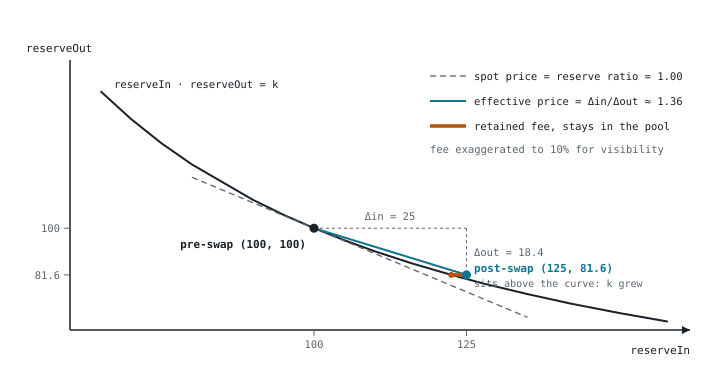
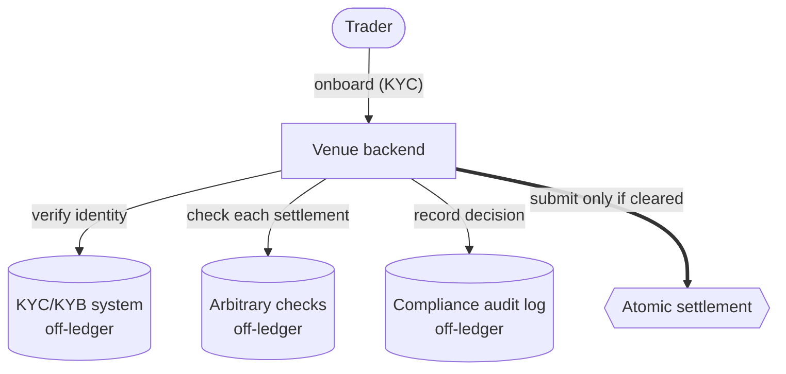
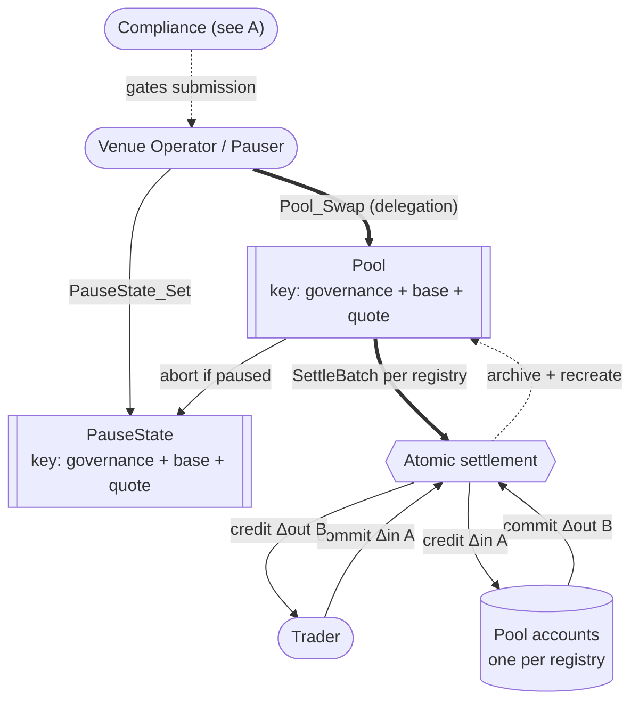
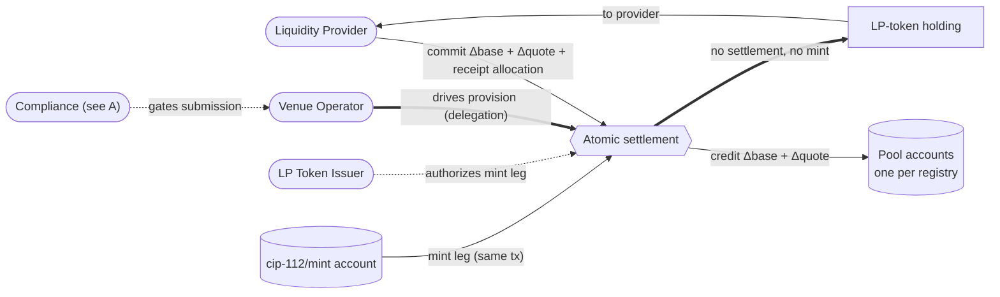
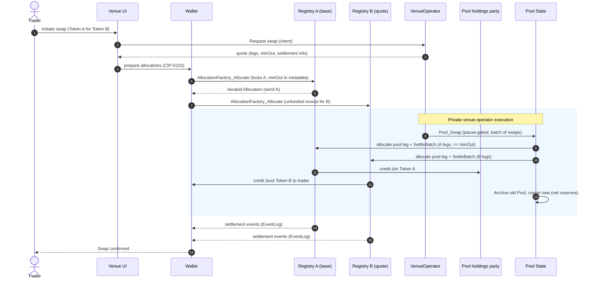

# Privacy-preserving DEX reference architecture

This document describes a *reference design* for a constant-product automated
market maker decentralized exchange (DEX) on Canton. It draws on reusable OpenZeppelin packages maintained
in [`OpenZeppelin/canton-contracts`](https://github.com/OpenZeppelin/canton-contracts),
experimental evidence in this repository, and the Canton Network Token Standard
V2.

## 1. Product Definition

This report specifies a privacy-preserving DEX for the Canton Network. To ensure high throughput, the venue is operator-run - a single organization quotes, sequences, and submits - yet the design is decentralized across the following four axes: **custody** (the venue never holds trader funds), **correctness** (the swap math is enforced on-ledger, not by operator discretion), **authority** (the venue's executor power is held by a governance party hosted across independent participant nodes), and **infrastructure** (the venue runs on the decentralized Global Synchronizer, governed by super-validator vote). No single organization can move funds or bypass the rules.

The design uses a **constant-product automated market maker (AMM)**: a pool holds reserves of two assets, `x` and `y`, and prices every trade from the invariant `x · y = k`. A trader deposits some amount `Δx` of one asset and withdraws whatever `Δy` keeps the product unchanged, i.e.
`(x + Δx) · (y − Δy) = k`. The price is thus implied by the ratio of the
reserves rather than quoted by an order book: the pool can always fill a trade, at a price that moves further along the curve the larger the trade is.

The design suits any adopter that wants to operate a compliant, non-custodial
venue - independent trading firms and crypto-native operators included - with
**financial institutions** as the target adopters: banks,
broker-dealers, asset managers, and regulated trading venues operating this
kind of exchange for their clients. It assumes an accountable operator
organization, integrates the KYC/KYB and compliance systems adopters
already run, and
keeps positions private by default.

For such a trading venue to work, the trader and the pool must be able to swap funds atomically: neither leg of the trade completes unless the other does (atomicity), and no intermediary holds the assets along the way (non-custodial). Therefore, the swapping architecture centers on the
[CIP-0112 - Canton Network Token Standard V2](https://github.com/canton-foundation/cips/blob/main/cip-0112/cip-0112.md),
specifically its support for
[atomic settlement](https://github.com/canton-foundation/cips/blob/main/cip-0112/cip-0112.md#416-committed-allocations-for-prefunded-trading-and-iterated-settlement).
The core building block is the **atomic delivery-versus-payment (DvP) swap**:
two committed allocations - the trader's input leg and the pool's
output leg - are settled in one all-or-nothing transaction. Each leg's amount is
pinned on-ledger to a signed allocation side - the input exactly, the output
bounded below by a signed `minOut` (to account for slippage) - so a trade either completes within the
trader's signed bounds or reverts entirely.

The design settles exclusively against the CIP-0112 / Splice Token Standard V2
interfaces, so it interoperates with any conformant token registry. Reusable Access Control and Pausable packages provide governance and
emergency-control building blocks. This report is a target architecture, not an
implementation report: it specifies the on-ledger pool contract snippets, the trader
wallet requirements, the venue's off-ledger services, and the deployment
topology of the venue.

### Operational Scope and Boundaries

The target architecture keeps the core **deliberately small** - one pool
template, one settlement boundary, one swap entry point - so authorities and
transaction shapes stay easy to audit. We also propose several future extensions, such as
alternative curves over the same settlement mechanism
([extension points](#extension-points)), and per-venue behavior changes through
configuration ([consumption and customization](#consumption-and-customization)).
The tables below distinguish its core design from adjacent architectural
concerns.

| Feature Category | In-Scope Architectural Components |
|---|---|
| Market Structure | A **spot** exchange whose enabling primitive is the **atomic DvP swap**. The venue built out in full is a constant-product AMM with a single liquidity pool (`x · y = k`).|
| Core Flows | Four flows modeled over one settlement boundary: **pool creation** (venue governance, LP token issuer, and pool holdings party instantiate a `Pool`), **liquidity provision / removal** (depositing both instruments mints LP tokens; burning LP tokens returns proportional reserves), **swap execution** (two-leg atomic settlement), and **fee collection** (a percentage (`feeBps`) of each swap accrues into reserves, raising LP-token redemption value). |
| Asset Representation | Fungible digital assets compliant with the CIP-0112 Token Standard V2 holding interfaces. LP tokens represent pool-share ownership and are minted/burned via CIP-0112. |
| Compliance & Control | D1: the venue backend runs arbitrary operator-defined checks on every settlement before submission - enforced off-ledger, at the venue's single execution entry point. D2: lock-and-sweep seizure is registry-level and optional - each traded instrument's registry, and the LP-token registry for pool shares, may implement it ([section 3](#d2-seizure)). D3: identity established at off-ledger onboarding; single-synchronizer identity. |
| Trust Topology | Governance-authorized venue: the `Pool` is signed by the venue governance, the LP token issuer, and the pool holdings party, and swap correctness is enforced on-ledger by the swap choice rather than by operator discretion. The full party topology and submission model is documented in [section 3](#party-and-role-model-topology). |
| Component Integration | Direct reuse of `openzeppelin-access-control-v1`, `openzeppelin-pausable-v1`, the CIP-0112 Splice interfaces, as well as patterns from the [`OpenZeppelin/canton-token-template`](https://github.com/OpenZeppelin/canton-token-template) and [`OpenZeppelin/canton-stablecoin`](https://github.com/OpenZeppelin/canton-stablecoin) codebases. |

| Feature Category | Out-of-Scope Architectural Components |
|---|---|
| Derivative Instruments | Perpetuals, futures, traditional options, and any synthetic asset deriving value from an external non-spot reference. |
| Leverage Facilities | Margin trading, undercollateralized lending, dynamic funding rates, and any protocol-enshrined leverage. |
| External Oracles | Dynamic pricing oracles dictating the pool's internal exchange rate. The AMM uses the constant-product invariant to determine price. |
| Token Standard V1 | Mixed-version settlement and V1-specific allocation paths. The design targets V2 abstractions. |
| Cross-Synchronizer Operation | Cross-synchronizer settlement and identity are out of scope. The design assumes one synchronizer. |

### Target Ecosystem Participants

- **Institutional DEX Operators** can establish compliant trading facilities with the access controls that regulated venues require, gating access through the KYC/KYB and compliance systems they already run.
- **Protocol Architects and Engineers** can evaluate the component and authority
  boundaries before implementing a venue or another AMM curve.
- **Wallet and Client Integrators** can identify the allocation, authorization,
  and projection assumptions their implementation must support.

### Educational Framing: How to Think About Building a DEX on Canton

In traditional EVM AMMs, smart contracts are autonomous, globally visible state
machines holding aggregate pool balances. Any trader's transaction updates this
global state directly, and all network nodes validate the invariant math off an
identical public state tree. Privacy is non-existent by design, and
front-running / MEV extraction via the public mempool is a structural reality.
Building this venue on Canton means rethinking two EVM assumptions, and each
one leads to a design decision.

**Privacy by default.** The venue's positions and flows should be private - the
opposite of the EVM baseline - and Canton's per-party projection provides
exactly that: a contract is visible only to its signatories and observers. A
DEX therefore cannot, and should not, expose a pool contract that any anonymous
actor reads and mutates. The design **fractures settlement into per-authorizer
allocations**: a trader's intent meets the `Pool`'s logic, but the asset
movement rides on per-party `Allocation` contracts (the
CIP-0112 Token Standard V2 interfaces), and each counterparty observes only its
own legs. Prices are quoted by the operator's API rather than read on-ledger.

**No in-place mutation.** State changes by archive-and-recreate, therefore changing `contractId`s. Two things follow. First, the pool
needs an identity that survives each recreate: the design will resolve the
`Pool` and `PauseState` by **contract key** (reintroduced in
[Canton 3.5.1+](https://github.com/digital-asset/canton/releases/tag/v3.5.1)).
Keys are not unique, so
uniqueness is an obligation of the venue: one `Pool` and one `PauseState` per
instrument pair. 

Second, the design's central bottleneck and main driver: **every state change
consumes the `Pool`, so concurrent writers race** - of two transactions
consuming the same contract, one commits and one is rejected. If any trader or LP could write on the pool directly, any transactions would be likely to fail, hurting user experience and throughput. Because of this, the design makes the venue a **single writer**: every
consuming `Pool` choice - swap, provision, removal - is driven by the venue
operator alone, and `Pool_Swap` executes a **batch of swaps** per `Pool`
update. Contention becomes a scheduling decision of the backend instead of a
race between traders.

*A note on contract keys*: they require the 3.5.1+ toolchain. The experiment
packages in `OpenZeppelin/canton-contracts` referenced by this document predate
that release and are keyless exploratory evidence; they will not be migrated. A
production implementation starts on the 3.5.1+ SDK and resolves the `Pool` and
`PauseState` by key from the outset.

## 2. Architecture Overview

The architecture is assembled from reused OpenZeppelin Daml primitives (role management, pausing), as well as the CIP-0112 DvP as the engine for all asset movement. This section maps each component to its library.

### Core Components and Library Mapping

Tags distinguish experimental packages from upstream standards:
`[EXPERIMENT]` identifies an experimental package in
[`OpenZeppelin/canton-contracts`](https://github.com/OpenZeppelin/canton-contracts),
while `[STANDARD]` identifies upstream Splice Token Standard V2 interface
packages consumed as pinned dependencies.

| Component Suite | Applied Templates and Libraries | Architectural Function |
|---|---|---|
| Access Control `[EXPERIMENT]` | `openzeppelin-access-control-v1`: [`RoleGrant`](https://github.com/OpenZeppelin/canton-contracts/blob/cec416d6e3c2118551c761d5598c403ab27ee342/experiments/access/access-control-v1/daml/OpenZeppelin/AccessControlV1.daml#L58), [`RoleAdmin`](https://github.com/OpenZeppelin/canton-contracts/blob/cec416d6e3c2118551c761d5598c403ab27ee342/experiments/access/access-control-v1/daml/OpenZeppelin/AccessControlV1.daml#L116), [`DefaultAdminTransferOffer`](https://github.com/OpenZeppelin/canton-contracts/blob/cec416d6e3c2118551c761d5598c403ab27ee342/experiments/access/access-control-v1/daml/OpenZeppelin/AccessControlV1.daml#L237), [`requireRole`](https://github.com/OpenZeppelin/canton-contracts/blob/cec416d6e3c2118551c761d5598c403ab27ee342/experiments/access/access-control-v1/daml/OpenZeppelin/AccessControlV1.daml#L287) | Role-based permissioning. Will govern the venue governance and LP token issuer. |
| Venue Constraints `[EXPERIMENT]` | `openzeppelin-pausable-v1`: [`PauseState`](https://github.com/OpenZeppelin/canton-contracts/blob/cec416d6e3c2118551c761d5598c403ab27ee342/experiments/security/pausable-v1/daml/OpenZeppelin/PausableV1.daml#L47), [`whenNotPaused`](https://github.com/OpenZeppelin/canton-contracts/blob/cec416d6e3c2118551c761d5598c403ab27ee342/experiments/security/pausable-v1/daml/OpenZeppelin/PausableV1.daml#L77) | Emergency circuit breaker. `whenNotPaused` will block new swaps as well as in-flight settlements. |
| Settlement Model `[STANDARD]` | [CIP-0112 / Splice Token Standard V2](https://github.com/canton-foundation/cips/blob/main/cip-0112/cip-0112.md) interfaces: `Holding`, `Account`, `InstrumentId` (`Splice.Api.Token.HoldingV2`); `Allocation`, `SettlementFactory` (`Splice.Api.Token.AllocationV2`); `AllocationFactory` (`Splice.Api.Token.AllocationInstructionV2`); `EventLog` (`Splice.Api.Token.TransferEventsV2`) | The interoperability boundary: the DEX will settle against any registry implementing these interfaces. |

## 3. Target Design

### Party and Role Model Topology

Duties are segregated and mapped to discrete Daml parties:

- **Venue Governance (`VENUE_GOVERNANCE`)** - the party that signs all venue
  state (`Pool`, `PauseState`) and is the settlement executor named in every
  allocation. It is **decentralized**: hosted across several independent
  participant nodes with a confirmation threshold above 1. It never holds custody of, nor any unilateral transfer right over, trader
  funds. To intermediate swaps or liquidity operations, its authority will be reachable only through choices
  on contracts it signs ([trust topology](#decentralization-and-trust-topology)).
- **Venue Operator (`VENUE_OPERATOR`)** - the party that represents off-ledger backend: quotes
  swaps off the `Pool` reserves, runs the compliance gate, and decides when to
  execute which action. It acts through **delegation contracts** signed by
  `VENUE_GOVERNANCE`, whose choices it controls; those choices encode the only
  permitted call patterns (`Pool_Swap`, provision, removal), so the operator
  times and orders actions but holds no venue authority of its own.
- **Auditor (`AUDITOR`)** - an independent party whose participant node hosts
  `VENUE_GOVERNANCE` with **observation permission** (no submission, no
  confirmation). It receives every transaction the governance party is a
  stakeholder in - swaps, provisions, removals, pauses - as they commit, and independently
  re-derives the curve, checks each fill against its trader's signed `minOut`,
  and checks each batch's composition against arrival order. It holds no venue
  authority: it detects and escalates, it cannot block. The implementation of the detection and escalation is considered out-of-scope, to be created in a customized manner by each adopter.
- **LP Token Issuer (`LP_TOKEN_ISSUER`)** - mints and burns the LP token (the
  pool-share receipt a liquidity provider receives after provisioning). It never
  touches the traded assets. Separating the issuer from the venue governance
  allows future delegation of LP-token issuance to a regulated third-party
  custodian.
- **Instrument Registrars (`INSTRUMENT_REGISTRAR`)** - the token-standard
  registries of the traded instruments. Base and quote generally have **different registrars**: each asset
  settles through its own registry's settlement factory. Contrast: the LP
  token issuer issues the pool's receipt token; an instrument registrar
  administers an asset being traded (EVM analogy: the pair contract minting
  UNI-V2 versus Circle issuing USDC).
- **Trader / Liquidity Provider** - the end-user authoring `Allocation`
  contracts from their wallet. The sole party able to lock
  their own holdings.
- **Pool Holdings Party (`POOL_HOLDINGS`)** - the party owning the
  registry-specific accounts that hold the pool's reserves. It **co-signs the
  `Pool`**, so the tokens-out legs of swaps and removals are authorized inside
  the `Pool` choices, and it is multi-hosted like the venue governance, so no
  other path to the pool's funds exists.

### Decentralization and Trust Topology

Canton decentralizes a party along three independent axes, and the design
assigns each role a deliberate position on each:

1. **governance** - whose signatures can change the party's identity and hosting (re-home the party to their own participant node and act freely);
2. **validation** - how many independent participant nodes must confirm the party's transactions (the `PartyToParticipant` confirmation threshold; a threshold above 1 defends against a malicious participant node, at a latency and cost premium, and such a party can no longer submit Ledger API commands directly - it acts through externally signed submissions or through choices submitted by others);
3. **authorization** - what the Daml signatory/controller topology requires regardless of hosting.

Two questions decide each party's security posture: **how it is hosted and
validated**, and **who submits transactions in its name**. The following table answers both:

| Party | Hosting and validation | Who submits in its name |
|---|---|---|
| `VENUE_GOVERNANCE` | multi-hosted on several independently operated participant nodes, confirmation threshold above 1; additionally hosted with observation permission on the `AUDITOR`'s node | submits `Pool` parameter and configuration changes itself, as externally signed, consortium-approved transactions (pool creation, `feeBps`, delegation grant and revocation); for swaps and liquidity operations its authority is exercised only through delegation choices submitted by `VENUE_OPERATOR` ([section 4.2](#42-component-venue-operator-delegation)) |
| `VENUE_OPERATOR` | single-organization backend on its own participant, threshold 1 | submits its own commands: the delegation exercises for swaps, provision, and removal |
| `AUDITOR` | its own participant node | submits nothing in the venue's flows; read-only observer of `VENUE_GOVERNANCE` |
| `LP_TOKEN_ISSUER` | multi-hosted like `VENUE_GOVERNANCE`: several independently operated participant nodes, confirmation threshold above 1 | never submits: it cannot act directly, and its mint and burn authority is exercised only through the `Pool` choices it co-signs (provision and removal), so LP-token supply cannot change outside them |
| `POOL_HOLDINGS` | multi-hosted like `VENUE_GOVERNANCE`: several independently operated participant nodes, confirmation threshold above 1 | never submits: it co-signs the `Pool`, so the tokens-out legs are allocated and settled inside the `Pool` choices; no other path to the pool's funds exists |
| `INSTRUMENT_REGISTRAR`s | external organizations, vetted by the listing policy | submit their own registry operations, never venue flows |
| Pause authority | multi-hosted, threshold 1 (the brake must be instant) | submits pause and unpause directly |
| Trader / LP | their own participant node or locally hosted, their own keys | submit allocations from their wallet (CIP-0103) |

The **venue governance** is decentralized because **cross-registry atomicity
is executor trust**: an executor key could settle one registry's batch without
the other, or bypass `Pool_Swap` at a factory directly. Multi-hosting removes
that key - the delegation choices
([section 4.2](#42-component-venue-operator-delegation)) are the only path to
the executor authority. One hosting candidate are the [covalidation service provider](https://docs.digitalasset.com/covalidation/overview).

The **auditor** will work from the governance party's projection; arrival
order will be measured by the record time of the traders' allocations.
Violations will be provable from its own node, feeding governance, reputation,
and the pause decision.

The **pause authority** keeps a confirmation threshold of 1 because an
emergency stop must be instant. The price is a griefing window - a malicious
pauser can freeze in-flight settlements - capped by the trader's right to
reclaim their funds after `settlementDeadline`.

**Compliance and identity checks** are off-ledger backend functions
([section 3](#d1-compliance-through-off-ledger-screening)). The ledger records
no per-settlement compliance evidence, so every screening decision must land
in an auditable off-ledger compliance log.

**Traders and liquidity providers** trust only their own keys and their own
participant node: the design is non-custodial.

**Infrastructure trust.** The single synchronizer the design assumes is the
**Global Synchronizer**: traffic is paid in Canton Coin and rewards flow through
Splice ([section 6](#6-network-economics-traffic-costs-and-app-rewards)), both
governed by super-validator vote. The residual assumptions per component:

- **Sequencer**: can censor or delay; delay abuse is covered in
  [section 5.3](#53-threat-model).
- **Mediator**: sees view metadata, can stall finality.
- **Counterparty participants**: a malicious participant misbehaves only for
  parties it hosts; confirmation thresholds above 1 mitigates this risk.
- **Super-validator governance**: sets the traffic price and grants or revokes
  the venue's `FeaturedAppRight`; a business dependency, not a custody risk.

### The AMM Math

A pool's reserve ratio (`quoteState.reserves / baseState.reserves`) denotes the **marginal spot price** - the
limiting price of an infinitesimally small trade. A concrete trade's effective
price depends on its `Δin` (or target `Δout`) through the swap arithmetic and is
always worse than the reserve ratio - the
trade itself moves the price along the curve (price impact), on top of
`feeBps`. A trader therefore requests a quote *for their specific amount* from
the venue operator backend, which reads the current `Pool` and evaluates the
curve.

**Swap arithmetic (constant-product, fee-inclusive).** Let the trader send `Δin`
of the input instrument into a pool with reserves `(reserveIn, reserveOut)` and
fee `feeBps` (basis points). The fee is taken on the input, so the amount that
actually drives the curve is:

```text
amountInWithFee = Δin · (10000 − feeBps) / 10000
Δout            = (reserveOut · amountInWithFee) / (reserveIn + amountInWithFee)
```

The post-swap reserves are `reserveIn' = reserveIn + Δin` (the full input,
including the retained fee) and `reserveOut' = reserveOut − Δout`. Because the
fee stays in the pool, the invariant is **non-decreasing**:

```text
(reserveIn + amountInWithFee) · (reserveOut − Δout)  ≥  reserveIn · reserveOut
```



**DAML implementation of the swap legs**: The trader will lock exactly
(`amountIn`, input instrument) in an **iterated allocation**
([CIP-0112 iterated settlement](https://github.com/canton-foundation/cips/blob/main/cip-0112/cip-0112.md#436-committed-allocations-and-iterated-settlement))
carrying their signed `minOut` in its metadata, and will pre-approve the output
with an unfunded iterated allocation at the output registry. `Pool_Swap` will
compute `Δout` on live reserves at settlement, abort if `Δout < minOut`, and
attach the actual legs to the allocations (`extraTransferLegSides`). A stale quote will fill at the live price or abort -
never below the signed `minOut`, since the executor authority is reachable
only through `Pool_Swap`
([section 3](#decentralization-and-trust-topology)). Traded registries must
implement iterated allocations and support allocating and settling in one
transaction, part of the instrument listing policy
([section 5.3](#53-threat-model)).

### Data and State Flow

The diagrams below decompose the design around the shared `Atomic settlement` hub:

- **A** is the off-ledger compliance and identity gate in front of it.
- **B** is the operator-driven swap: the control chain through the keyed `Pool` and the holdings it moves.
- **C** is a liquidity provision over the same hub. Keyed contracts are marked with their key.

**A. Compliance and identity, off-ledger.** Identity will be established at
onboarding against the operator's KYC/KYB systems; every quote and settlement
submission will pass arbitrary operator-defined checks. The ledger will see
only submissions that cleared the gate.



**B. Swap.** Compliance (from A) will gate the operator's submission. The venue
operator will exercise `Pool_Swap` through its delegation on the keyed,
pause-gated `Pool`; the choice will re-derive the curve, enforce each trader's
signed `minOut`, settle one `SettleBatch` per registry - swapping the trader's
and the pool's legs in one transaction - and archive and recreate the `Pool`
with the net reserve update.



**C. Liquidity provision (LP minting).** The provider will commit both
instruments into the pool accounts, and the venue operator will drive the
provision choice through its delegation, as with swaps. The LP-token mint is itself a transfer
leg from the special `cip-112/mint` account, authorized by the LP token issuer
as that registry's admin and settled in the same transaction: if the settlement
does not happen, no LP tokens will be minted.



### The Settlement-Spine Flow: Step by Step

The execution of a swap is the primary critical path. The flow will guarantee
that funds are never locked without a resolution path and that execution is
atomic.

The flow demonstrates per-authorizer allocation requests and atomic
co-settlement via
`SettlementFactory_SettleBatch`. Each registry implements both the
`AllocationFactory` and `SettlementFactory` interfaces for its own asset, and
base and quote live at different registries. The privacy boundary: the trader
will see their allocation and receipt, not the backend pool routing.



1. **Intent and Quotation.** A trader will request a quote (swap Token A → Token B)
   through the **venue UI**, which will later drive the trader's wallet over the
   [CIP-0103](https://github.com/canton-foundation/cips/blob/main/cip-0103/cip-0103.md)
   dApp API for the allocation signatures (step 2). The venue operator backend will check the trader against its
   KYC/KYB systems and arbitrary compliance checks
   ([section 3](#d1-compliance-through-off-ledger-screening)), read
   current `Pool` state, and return the quote **off-ledger**: the expected
   output, the exact legs, the `minOut` to sign, and the settlement info
   naming `VENUE_GOVERNANCE` as executor. Nothing will be created on-ledger for
   a quote. The same screening will re-run before the settle submission in
   step 4.
2. **Trader Allocation.** The trader will sign `AllocationFactory_Allocate` at
   each registry: at the input registry it will lock their Token A into an
   iterated `Allocation` (send `Δin` Token A, `minOut` in its metadata), and
   at the output registry it will create an unfunded iterated receipt allocation
   for Token B - both designating `VENUE_GOVERNANCE` as the authorized
   executor.
3. **Pool Allocation.** The pool's output legs will need no pre-arranged
   allocations: the pool holdings party co-signs the `Pool`, so `Pool_Swap`
   will allocate them from the pool accounts **inside the settling transaction**,
   under the authority inherited from the `Pool` signatory - no per-swap pool
   signature is needed.
4. **Atomic Batch Settlement.** `VENUE_OPERATOR` will exercise, through its
   delegation, the pause-gated `Pool_Swap` over a **batch of pending swaps**: it will compute each swap's
   `Δout` from live reserves, assert `Δout >= minOut`, attach the actual
   legs to the iterated allocations, settle one
   `SettlementFactory_SettleBatch`
   per registry, credit each trader's output, emit `EventLog`
   events, and create a new `Pool` with the batch's net reserve update. This
   will all commit in one Daml transaction: the reserve update and every
   settlement leg will land together or not at all, so the published price and
   the assets delivered will never diverge.

### Execution Model

In an EVM AMM a swap is one synchronous RPC round-trip. In our Canton DEX, only the final
settlement will be atomic: `Pool_Swap` will commit the curve check, both legs,
and the reserve update in one Daml transaction.

Every earlier step will be a separate asynchronous ledger command from a
different party, orchestrated off-ledger by the venue backend (a submission returns once
accepted; the outcome arrives on the completion stream, correlated by command
id). The extra round-trips are the price of the operator or pool holdings party never taking custody of in-flight trader funds.

Step-by-step execution of a swap:

| # | Step | Submitter | Kind |
|---|---|---|---|
| 1 | Quote request | trader (venue UI) | synchronous off-ledger RPC; nothing on-ledger |
| 2 | Trader allocation (locks funds) | trader wallet | async ledger command; trader online to sign |
| 3 | `Pool_Swap` settle batch (many swaps; allocates the pool legs in the same transaction) | venue operator (governance delegation) | one atomic Daml transaction; final at the mediator verdict, seconds; preceded by the backend's off-ledger compliance checks |

Assumptions:

- Between steps 2 and 3 the trader's funds will be locked; the lock will be
  time-bounded and the trader will always have a unilateral exit
  ([section 5.4](#54-failure-modes-and-recovery)).
- A stalled workflow will block nothing else on the ledger, only the venue or other entity's backend.
- Command deduplication (24h) makes backend crash-restart safe: re-submitting
  a settle cannot double-execute. Additionally, a batch swap can not execute twice due to not having the necessary funds and allocations.
- Rejections, including a lost contention race on a hot `Pool`, will arrive on
  the completion stream; the backend will re-quote and retry. Note that because of all on-ledger liquidity operations running through the venue backend, contention should not be a concern.

**Progress tracking.** The venue backend will track each swap as a state
machine keyed by `SettlementInfo.id`, driven by **ACS ingestion**: the backend
will ingest the active contract set and act whenever a trade becomes
executable - the required allocations exist and match the current `Pool`
state. A swap that stops progressing will time out against its deadline and
mark the workflow stuck, raising an operator alert and a trader-visible status (pending
step, owing party, the deadline after which the trader can withdraw).
[Section 5.4](#54-failure-modes-and-recovery) enumerates the stuck states and
their exits.

### Time Model

Time plays one role in the design: **the trader bounds how long their funds
may stay locked**. Each allocation carries a trader-chosen
`settlementDeadline` (CIP-0112): the venue must settle before it, and after it
the trader can unilaterally withdraw. Ledger time is accurate only to
`ledgerTimeRecordTimeTolerance` (60s default), so the bound is fuzzy by that
much. Guidance per flow: minutes for both swaps and liquidity operations, since we assume the operator backend is automated, and will act quickly on the needs of the users.

A trader will also be able to **cancel a pending swap before the deadline**,
venue-mediated: the backend removes the swap from the pending set and the
executor cancels the trader's allocations (`Allocation_Cancel`), unlocking the
funds immediately.

### Provision (LP mint) and Removal (LP burn) flows

Liquidity provision will reuse the swap's allocation lifecycle, with the
LP-token mint riding the same settlement as a normal transfer leg:

1. **Deposit Allocation.** The LP will allocate its two deposits (`Δbase`,
   `Δquote`) into the pool accounts, plus an unfunded receipt allocation at
   the LP-token registry authorizing receipt of the minted shares.
2. **Provision and Mint.** `VENUE_OPERATOR` will exercise the provision choice
   through its delegation. One transaction will settle both deposits and the
   mint - a **transfer leg from the special `cip-112/mint` account** to the
   LP, authorized by `LP_TOKEN_ISSUER` as that registry's admin on the send
   side and by the LP's receipt allocation on the receive side. The mint is a
   normal settlement leg: evented and exact-cover validated. The choice will compute the shares from the deposit it settles
   (`sqrt(Δbase · Δquote)` minus a `MINIMUM_LIQUIDITY` tranche on the first
   provision; `min(Δbase / baseState.reserves, Δquote / quoteState.reserves) · totalSupply`
   thereafter) and recreate the `Pool` with the increased reserves and supply.

Removal will be the inverse. The LP will allocate its LP-token
holding, and `VENUE_OPERATOR` will exercise, through its delegation, the removal choice: in one transaction it
will settle the LP tokens as a burn leg **to the special `cip-112/burn` account**
and the withdrawal
of the proportional `(shares / totalSupply)` of each reserve from the pool accounts
back to the LP as transfer legs, recreating the `Pool` with reduced reserves and
supply. Like every consuming `Pool` choice, removal will be driven only by
`VENUE_OPERATOR`, with the LP co-signing: LPs will never archive the `Pool`
themselves, so removals cannot contend with swaps
([section 5.5](#55-throughput-and-contention)).

Note that some fund movements can also work using CIP-0112 direct transfers, and are not necessarily dependent on the allocate-and-settle DvP workflow.

### Liquidity Provision, Removal, and Fee Accrual

The same settlement boundary carries the non-swap flows; all remain atomic via
`SettlementFactory_SettleBatch`.

- **Pool creation.** All four `Pool` signatories - `VENUE_GOVERNANCE`,
  `LP_TOKEN_ISSUER`, and two `POOL_HOLDINGS` - must authorize the create. Their
  signatures are gathered through a one-time propose-accept bootstrap (each
  consortium approves its step); every later recreate inherits them from the
  consumed `Pool`. Initial reserves are seeded by the first liquidity
  provision.
- **Liquidity provision.** The LP will allocate *both* instruments (two
  committed `Allocation`s) and the venue operator will batch-settle them into
  the pool reserves; in the same transaction the `LP_TOKEN_ISSUER` will mint
  LP tokens proportional to the contributed share. The new `Pool` will reflect
  the increased reserves.
- **Liquidity removal.** The LP will burn LP tokens; the batch will settle a
  withdrawal of the proportional share of *both* reserves back to the LP, and
  a new `Pool` with reduced reserves will be created.
- **Fee accrual / collection.** `feeBps` will be retained in the pool on each
  swap, so reserves will grow relative to LP-token supply - fees will accrue
  to LPs implicitly via redemption value rather than a separate claim.

All four flows will be guarded by `whenNotPaused` inside the settling choice -
a pause will block new swaps and in-flight settlements alike - and will pass
the same off-ledger compliance checks before the operator submits them.

**Reserves vs. actual holdings - where the pool's value physically lives.** The
`Pool`'s `baseState.reserves` / `quoteState.reserves` are `Decimal` *accounting* figures;
they are **not** the assets themselves. The real value will live in TSv2
holdings owned by dedicated **pool accounts** (an `Account` per asset, since accounts are
registry-specific and the two assets live in different registries), and every flow above will move holdings into or
out of those accounts, in the same transaction that updates the reserve numbers:

- **On provision**, the LP's two committed `Allocation`s will settle *into*
  the pool accounts (new holdings owned by the pool), and both `reserves`
  figures will be incremented to match.
- **On removal**, the withdrawal legs will be funded *from* the pool accounts'
  own holdings (each pool account is the sender of its asset), and reserves
  will be decremented to match.
- **The invariant** that must hold is **`reserves == Σ(pool-account holdings)` per instrument**. Because reserve updates and holding movements commit co-atomically, the two cannot drift within a
transaction; the caveat is *fragmentation* - many small holdings accumulating in
the pool accounts over time. A periodic **consolidation** step (the pool account parties merge their holdings for an instrument into one, leaving reserves unchanged) will keep
settlement cheap.

### Privacy and Visibility Model

Canton guarantees reads only to a contract's signatories and observers; other
parties see a contract only transiently, when a transaction they witness
divulges it. Target visibility per template:

| Contract | Signatories | Observers |
|---|---|---|
| `Pool`, `PauseState` | venue governance, LP token issuer and pool holdings party on `Pool` | none |
| `Allocation` | instrument registry admin, the leg's authorizer | settlement executors |
| `EventLog` events | instrument registry admin | the leg's authorizer, settlement executors |
| LP-token holding | LP token issuer, owner | none |

Consequences:

- **Traders will never see the reserves, only the configuration.** Observer
  status on the `Pool` would broadcast every reserve update (the venue's full
  flow, reconstructable by anyone) and multiply the swap's write cost per
  recipient ([section 6.1](#61-traffic-costs)). Configuration parameters -
  the instrument pair, `feeBps`, pause status - are not flow-revealing and
  will be published to traders through the operator's API. A trader wanting proof of reserves will request explicit disclosure of
  the current `Pool`.
- **The auditor sees what the governance sees.** Observation-mode hosting of
  `VENUE_GOVERNANCE` is a deliberate disclosure that turns the venue's private
  view into an accountable one
  ([section 3](#decentralization-and-trust-topology)).
- **The venue operator sees everything.**.
- **No compliance data on ledger.** Identity and check results live in the
  operator's off-ledger KYC/KYB and compliance systems; no PII or compliance evidence
  touches the immutable ledger, so the right-to-erasure conflict does not
  arise, and no third party learns who was screened or why.

### D1: Compliance through Off-Ledger Screening

Institutional DeFi requires that sanctioned or unverified parties cannot trade. The design enforces this **off-ledger, at the venue backend**: the backend will run arbitrary checks on each party and settlement - through the compliance systems the operator already runs - before submitting; no attester party, attestation contract, or on-ledger registry will be operated. The gate covers every trade path because the venue governance is the **sole settlement executor**, exercised only through the operator's delegated submissions.

The trade-off is explicit: compliance is an operational guarantee of the venue, not a ledger-enforced one - a compromised or negligent operator can submit an unscreened settlement, and the ledger records no per-settlement compliance evidence ([section 5.3](#53-threat-model)) - so every screening decision must land in an auditable off-ledger compliance log.

### D2: Seizure

Locking an in-flight allocation or a user's LP token shares
and sweeping them to a preset custodian account (**lock-and-sweep**) is a registry
capability: each traded instrument's registry may ship it, disclosed through
the instrument listing policy ([section 5.3](#53-threat-model)), and the
**LP-token registry may likewise implement it for pool shares** if the venue so
wishes. Either way it sits outside the `Pool`'s authority - the swap path
itself grants no party a seizure power, consistent with the venue never
holding unilateral power over user funds.

Adopters should therefore vet each token before listing it: whether its
registry meets the design's requirements (iterated allocations,
allocate-and-settle in one transaction) and what freeze or seizure powers it
ships, since it might break pool invariants.

### D3: Know-your-customer

Institutional DeFi requires participants to be identified. Identity is established **off-ledger, at onboarding**, through the operator's existing KYC/KYB systems; the backend will refuse to quote for or settle with unverified parties, and the ledger will carry no identity contracts. Both D1 and D3 can be **optional per pool** (permissioned versus permissionless) as venue policy.

### D4: Authority and Privilege Transfer

Institutional DeFi requires administrative power to be explicit and accountable: every privileged action traces to a named authority. There is no single admin holding every privilege. Each action sits with the role responsible for it: LP-token minting and burning with the `LP_TOKEN_ISSUER`, and swap execution with the `VENUE_GOVERNANCE` (driven by `VENUE_OPERATOR` under delegation). These privileges will be granted, transferred, and revoked through `openzeppelin-access-control` role administration, so authority can move between parties without redeploying. A permission is bound by direct controllership when its holder is fixed for the life of the contract, and through `openzeppelin-access-control` (`RoleGrant` / `requireRole`) when it must be swappable or revocable without recreating the contract.

### Wallet Integration Requirements

A trader-facing wallet must support, per CIP-0112:

- creating and accepting allocation instructions, showing the standard
  allocation content before signing: the locked input leg, the settlement
  info, and `settlementDeadline`. The `minOut` rides in allocation metadata,
  which a generic wallet renders only as opaque key-values - its meaning is
  presented by the venue UI, and the trader's signature covers it either way;
- requesting early cancellation through the venue, and exercising the
  unilateral withdraw once the deadline lapses;
- accepting disclosed contracts (quotes, `Pool` reserve verification);
- tracking swap status (pending step, owing party, deadline);
- exposing these flows to venue UIs over the
  [CIP-0103](https://github.com/canton-foundation/cips/blob/main/cip-0103/cip-0103.md)
  dApp API.

### Deployment and Bootstrap

Deployment order:

1. Parties onboarded and hosted per [section 3](#party-and-role-model-topology).
2. DARs distributed and **vetted**. A trader's participant node must vet the venue
   packages before the trader can be a contract stakeholder, so vetting rollout
   gates adoption; unvetting is a self-DoS to monitor.
3. Off-ledger venue systems deployed: the operator backend (quoting, ACS
   ingestion and triggers, batch scheduling), the venue UI, the compliance
   integration (KYC/KYB connections, the check policy, the audit log), and the
   auditor's checker replaying from its own node.
4. Venue governance signs the operator's delegation contracts
   ([section 4.2](#42-component-venue-operator-delegation)).
5. Pool creation through the propose-accept bootstrap or off-ledger coordination, and a seeded first
   provision ([section 5.1](#51-security-invariants) first-deposit resistance).
6. Pool discovery stays off-ledger: the operator's API publishes the live
   pools and their configuration; a trader verifies any pool by requesting
   explicit disclosure of the current `Pool`.

### Smart Contract Upgrade Process

The venue will use Smart Contract Upgrade (SCU) for additive changes to
DEX-owned packages. It will not upgrade a pinned Token Standard, settlement, or
library DAR: the package owner of that dependency will govern its upgrade
lineage, and the venue's listing policy will record the version it accepts.

Upgrades are themselves a governance-authority concern: a new package version
changes what the contracts carrying `VENUE_GOVERNANCE`'s authority - the
`Pool`, `PauseState`, and the delegation contracts - can do. Protection sits at
the **vetting layer**: each of the governance party's hosting nodes decides
which package versions it vets, and a transaction using an upgraded package
confirms only once the confirmation threshold of those nodes accepts it.
Deploying an upgrade is therefore an explicit act of the hosting consortium -
effectively a multi-sig over code - and no single operator or node can deploy
an upgrade that abuses the governance authority.

An additive DEX release will keep its package name, increment its version, set
`upgrades:` to the prior deployed DAR, and only append `Optional` fields to
existing templates, records, and choice arguments; the
[Canton SCU guide](https://docs.canton.network/appdev/deep-dives/smart-contract-upgrade)
defines the remaining compatibility rules. These are compatibility rules, not
a promise that a change preserves trading economics or security policy.

Every upgrade will first define what each new `Optional` field means for a v1
pool: v1 pools read as `None` under v2 code, but a v2 pool carrying `Some` may
not be usable by an old, exact-version workflow. The release will test both
directions: v1 pools and pending allocations under the v2 implementation, and
the expected rejection of a v1 workflow facing populated v2 data.

As a worked example, take a new rule requiring jurisdictional approval on
every swap.

Adding a new `Pool_SwapWithJurisdiction` choice is not enough: the old
`Pool_Swap` stays callable, so the control would be optional. The v2 release
therefore changes the body of `Pool_Swap` itself to require a jurisdictional
approval, stored as a new `Optional` configuration field on the `Pool`.
Existing pools read as `None` under v2 code, so the release
must define what `None` means: here, "swaps disabled until configured",
never "skip the check".

The same field is what retires the old code path. SCU does not delete the v1
DAR: while it stays vetted, a caller can pin the old package id and run the
old choice body, so a deprecation marker is not an access control. But once
a pool is recreated with the field set (a consuming configuration choice,
under the pool signatories' authority), its data no longer downgrades to a
v1 view, so the old `Pool_Swap` cannot execute against it. The rollout is
therefore: vet the v2 DAR on every affected participant, pause swaps, drain
pending allocations (settle the ready ones, cancel or deadline-lapse the
rest), recreate each pool with the field set, switch wallets and services to
by-package-name identifiers with the v2 package preference, and resume.

This path covers compatible changes only. If the curve, parties, key, or
pool accounting changes incompatibly, the venue instead deploys a separately
named package and template, adds a consuming migration choice to the old
template, and migrates pools in a maintenance window, one or more
transactions per active pool.

Before release, the venue will run `dpm build` with the `upgrades:` lineage and
`dpm upgrade-check --both`, validate the DAR against the target participant, and
exercise the workflow on LocalNet with the actual stakeholder vetting topology.

### Extension Points

Each extension is classified by the process above. It uses a compatible SCU
release only when it preserves existing data and policy; otherwise it uses a new
template and an explicit migration:

- **Alternative curves.** A stable-swap or concentrated-liquidity pool is a new
  template over the same allocation lifecycle and settlement spine; only the
  curve check in the swap choice changes.
- **Protocol-fee switch.** An `Optional` operator share on the `Pool` routes a
  fraction of `feeBps` to a venue account instead of reserves, giving the
  operator on-ledger revenue.
- **TWAP price feed.** The `Pool` accumulates a time-weighted price and
  publishes it through the committee-attested oracle of the
  [lending design](./lending.md), making the DEX the lending protocol's price
  source.

### Consumption and Customization

Adopters consume the DEX packages in two supported ways:

- **Compile-time: vendor and rename.** An adopter vendors the source at a
  pinned, audited release and republishes it under its own package name.
- **Runtime: configuration records.** Behavior that varies per venue -
  `feeBps`, the protocol-fee switch, pause policy - is expressed as fields and
  `Optional` configuration on the `Pool`, changed through governed choices
  rather than code changes.

---

## 4. Sample Component Structure

These snippets are illustrative rather than production code: they exemplify the flows and highlight the key parts, so they omit non-essential detail such as basic checks, the `ensure` block, and most comments.

### 4.1 Component: Pool State and Configuration

The `Pool` holds the constant-product AMM state; `PoolAssetState` factors out
the per-asset half (instrument, registry-specific account, reserves), since
base and quote live at different registries.

- **Keyed identity.** The contract key
  `(venueGovernance, baseState.instrumentId, quoteState.instrumentId)` lets
  consumers reference the pool by pair rather than by a cid that changes every
  swap; `PauseState` shares the tuple, and `Pool_Swap` is pause-gated.
- **Single entry point.** `Pool_Swap` - consuming, controlled by
  `venueGovernance` - executes a **batch of swaps**: each fills on the
  reserves the previous one left, and the `Pool` recreates once with the net
  update.
- **Trader bounds.** Each trader locks only their input; `Δout` is decided at
  settlement on live reserves, bounded below by their signed `minOut`
  ([section 3](#the-amm-math)).

```daml
module OpenZeppelin.Experimental.Dex.Amm where

import Splice.Api.Token.HoldingV2 (Account, InstrumentId)
import Splice.Api.Token.AllocationV2
import OpenZeppelin.PausableV1 (PauseState, whenNotPaused)

data PoolAssetState = PoolAssetState with
    instrumentId : InstrumentId
    account : Account
    reserves : Decimal
  deriving (Eq, Show)

data SwapSpec = SwapSpec with
    inputAllocationCid : ContractId Allocation
    receiptAllocationCid : ContractId Allocation
    baseToQuote : Bool
    amountIn : Decimal
  deriving (Eq, Show)

template Pool
  with
    venueGovernance : Party
    lpTokenIssuer : Party
    poolHoldings : Party
    baseState : PoolAssetState
    quoteState : PoolAssetState
    feeBps : Decimal
    lpTokenSupply : Decimal
  where
    signatory venueGovernance, lpTokenIssuer, poolHoldings
    key (venueGovernance, baseState.instrumentId, quoteState.instrumentId) : (Party, InstrumentId, InstrumentId)
    maintainer key._1

    choice Pool_Swap : ([SettlementFactory_SettleBatchResult], ContractId Pool)
      with
        swaps : [SwapSpec]
        baseSettlementFactoryCid : ContractId SettlementFactory
        quoteSettlementFactoryCid : ContractId SettlementFactory
        settlement : SettlementInfo
      controller venueGovernance
      do
        (_, pause) <- fetchByKey @PauseState (venueGovernance, baseState.instrumentId, quoteState.instrumentId)
        whenNotPaused pause
        let fill (base, quote, legs) s = do
              input <- fetch s.inputAllocationCid
              let minOut = signedMinOut (view input)
                  (rIn, rOut) = if s.baseToQuote then (base, quote) else (quote, base)
                  amountInWithFee = s.amountIn * (10000.0 - feeBps) / 10000.0
                  dOut = (rOut * amountInWithFee) / (rIn + amountInWithFee)
              assertMsg "output below signed minOut" (dOut >= minOut)
              pure $ if s.baseToQuote
                then (base + s.amountIn, quote - dOut, legs ++ swapLegs this s dOut)
                else (base - dOut, quote + s.amountIn, legs ++ swapLegs this s dOut)
        (newBase, newQuote, legs) <- foldlA fill (baseState.reserves, quoteState.reserves, []) swaps
        assertMsg "constant-product invariant violated"
          (newBase * newQuote >= baseState.reserves * quoteState.reserves)
        -- Venue helpers (signedMinOut, swapLegs, allocatePoolLeg, finalized,
        -- emptyExtraArgs) are omitted.
        let legsOf st = filter (\l -> l.instrumentId == st.instrumentId.id) legs
        poolBaseCid  <- allocatePoolLeg baseState  (legsOf baseState)
        poolQuoteCid <- allocatePoolLeg quoteState (legsOf quoteState)
        baseResult <- exercise baseSettlementFactoryCid SettlementFactory_SettleBatch with
          settlement; transferLegs = legsOf baseState
          allocations = finalized swaps poolBaseCid (legsOf baseState)
          actors = [venueGovernance]; extraArgs = emptyExtraArgs
        quoteResult <- exercise quoteSettlementFactoryCid SettlementFactory_SettleBatch with
          settlement; transferLegs = legsOf quoteState
          allocations = finalized swaps poolQuoteCid (legsOf quoteState)
          actors = [venueGovernance]; extraArgs = emptyExtraArgs
        newPool <- create this with
          baseState  = baseState  with reserves = newBase
          quoteState = quoteState with reserves = newQuote
        pure ([baseResult, quoteResult], newPool)
```

*The snippet typechecks against the vendored Splice V2 API DARs (with the
omitted helpers stubbed); the contract-key lines are the one exception - they
require the 3.5.1+ toolchain the design targets, as Daml-LF 2.1 rejects keys.*


### 4.2 Component: Venue Operator Delegation

The governance party's authority is reachable only through choices on contracts it
signs ([section 3](#decentralization-and-trust-topology)). The delegation
contract is that surface: `venueGovernance` signs it, `venueOperator` controls
its choices, and exercising one carries the governance authority into the inner
exercise, satisfying `Pool_Swap`'s controller. The choices here are the
venue's **only permitted call patterns**: the operator picks when and with what
arguments, and can reach nothing else. Replacing a lost operator is a new
delegation; revocation is a governance choice
([section 5.4](#54-failure-modes-and-recovery)).

```daml
-- Nonconsuming: one delegation serves every batch until revoked.
template VenueDelegation
  with
    venueGovernance : Party
    venueOperator : Party
  where
    signatory venueGovernance
    observer venueOperator

    nonconsuming choice VenueDelegation_Swap : ([SettlementFactory_SettleBatchResult], ContractId Pool)
      with
        poolKey : (Party, InstrumentId, InstrumentId)
        swapArgs : Pool_Swap
      controller venueOperator
      do
        exerciseByKey @Pool poolKey swapArgs

    -- Provision and removal delegations follow the same shape; the LP's
    -- authority rides its allocations, so no extra controller is needed
    -- (omitted).

    choice VenueDelegation_Revoke : ()
      controller venueGovernance
      do pure ()
```

---

## 5. Security & Auditability

The design prioritizes verifiable security. Simplicity over complexity minimizes the
surface for logic exploits, and Canton's per-party projections create natural
containment boundaries.

### 5.1 Security Invariants

- **Non-custodial venue (no unilateral execution)**:
  - The venue - governance and operator alike - never holds custody of, nor any unilateral right to move, trader funds.
  - The trader is the sole party able to lock their own holding into an allocation.
  - The settlement deadline blocks the trader from *unilaterally* withdrawing an allocation before `settlementDeadline`; earlier cancellation is venue-mediated ([time model](#time-model)).
  - Within one registry, the venue operator can only drive a settlement over the exact committed allocations: it cannot deviate from an authorized leg or fabricate a transfer the trader did not commit to. The output leg is drawn only from the trader's receipt approval and never below their signed `minOut`.
  - Across registries, partial settlement is prevented structurally, not by trust in a key: the executor's authority is reachable only through delegation choices that settle both batches in one Daml transaction ([section 3](#decentralization-and-trust-topology)), so no key can settle one leg alone or reach a settlement factory outside `Pool_Swap`.
- **AMM Conservation (`x · y = k`)**:
  - After a swap (minus applied fees), the product of base and quote reserves must be `>=` the product before the swap: `(baseState.reserves + Δin · (10000 − feeBps)/10000) · (quoteState.reserves − Δout) ≥
  baseState.reserves · quoteState.reserves`.
  - The settlement of the swap legs and the update of the pool reserves must happen atomically. 
- **First-deposit inflation resistance**:
  - Constant-product pool are exposed to the [*first-depositor / share-inflation* attack](https://www.openzeppelin.com/news/a-novel-defense-against-erc4626-inflation-attacks): the
  first LP mints a tiny LP-token supply, then donates assets directly into the
  pool to inflate share price and round later depositors' minted shares
  down to zero. The LP-token mint path (`LP_TOKEN_ISSUER`) must therefore
  either **burn a minimum initial liquidity** (lock the first `MINIMUM_LIQUIDITY`
  shares to a null party, the Uniswap-v2 approach) or **seed the pool from a
  trusted first provision** so the share price cannot be cheaply manipulated. This is a standard liquidity-pool hazard the reference implementation must address.
- **Funding Conservation**:
  - On every settle path the engine enforces that an authorizer's archived locked inputs cover its SenderSide obligations per instrument.
  - Per instrument, the reserves accounted for in the pool state should equal the holdings in that asset's pool account.
- **Privacy**:
  - Any trader participating in the liquidity pool should have visibility only over their holdings, as well as the transfer legs they are a sender and receiver in.
- **Auditability**:
  - Every committed swap is independently verifiable by the auditor from its own node's projection: curve math, the trader's signed `minOut` bound, and arrival-order batch composition ([section 3](#decentralization-and-trust-topology)).

### 5.2 Validation strategy

The executable compliance and interoperability
experiments validate the shared mechanisms referenced by this report. A DEX
implementation additionally needs unit and integration tests for curve math,
slippage, share issuance, reserve accounting, ordering, contention, and every
authority failure path.

The implementation will use the OpenZeppelin Daml security tooling:
[daml-lint](https://github.com/OpenZeppelin/daml-lint) for static analysis of
the Daml sources, and
[daml-props](https://github.com/OpenZeppelin/daml-props) for randomized fuzzing
and property-based tests of the invariants in
[section 5.1](#51-security-invariants). High-value invariants (conservation,
division safety) will additionally receive symbolic verification with
[daml-verify](https://github.com/OpenZeppelin/daml-verify).

### 5.3 Threat Model

| Vector | Attack | Mitigation |
|---|---|---|
| Malicious venue operator state manipulation | Venue operator submits a settlement batch favoring their own holdings, bypassing the price curve or extracting excessive slippage. | `Pool_Swap` re-derives each output on live reserves, asserts `x·y=k`, and binds every fill to the trader's signed input and `minOut`; an off-curve batch fails on-ledger. |
| Executor partial settlement / `Pool_Swap` bypass | With allocations committed at two registries, a settlement-executor key settles the trader's input batch without the pool's output batch (taking the input), or exercises a settlement factory directly, skipping the curve and reserve update. | The executor authority is reachable only through governance-signed delegation choices calling `Pool_Swap`, which settles both registries in one transaction ([section 3](#decentralization-and-trust-topology)). A compromised backend can delay or reorder, never partially settle. |
| Compliance evasion | A non-compliant or unverified party attempts to trade, or a settlement is submitted that was never checked. | The backend screens every party and settlement before submission and logs each decision ([section 3](#d1-compliance-through-off-ledger-screening)). Residual: enforcement is operational, not ledger-enforced; mitigated by the audit log and operator supervision. |
| Failed SCU rollout | A poorly executed upgrade makes a live `Pool` or pending allocation unusable, or a client selects an unintended package version. | Releases preserve the SCU-compatible surface, define `None` semantics, and test v1 state under the v2 workflow; breaking changes use an explicit migration ([SCU process](#smart-contract-upgrade-process)). |
| Venue Operator swap re-ordering / private MEV | The venue operator sees traders' allocations before batching and can order or delay batch-settlement submissions to its own benefit (e.g. sandwiching a large swap). MEV does **not** disappear on Canton - it moves from a public mempool into the venue operator's private view. | The signed `minOut` bounds every fill, and the auditor makes ordering abuse provable after the fact ([section 3](#decentralization-and-trust-topology)). |
| Malicious or buggy token registry | Settlement executes registry-implemented code for both legs. A hostile registry can fail legs selectively (griefing one side of a pair), inflate supply and drain the pool through the curve, freeze the pool account's holdings via its own freeze or seizure capability, or break settlement with a bad upgrade. | Listing is a trust decision gated by an **instrument listing policy**: audited TSv2 code, bounded admin powers, disclosed freeze or seizure capabilities, SCU-conformant upgrades. The curve cannot defend against supply inflation; the policy is the only mitigation. |
| Infrastructure censorship or delay | A sequencer or the venue's participant node delays submissions until `settlementDeadline` lapses, stalling the venue and handing traders a free withdraw option (exit if the price moved against them). | Multi-hosted parties, deadline monitoring with re-quote on lapse, deadlines sized to absorb transient delay; residual risk accepted. |

### 5.4 Failure Modes and Recovery

The adversarial vectors above are complemented by liveness failures: parties
that crash, stall, or never show up, and the infrastructure they depend on.
The design handles all of them under one invariant:

**Bounded custody.** Every locked holding has a unilateral, time-bounded exit
path for its owner: no combination of counterparty inaction, operator crash,
pause, or contention can extend custody past
`settlementDeadline`. The residual exception is a listed registry's own freeze
or seizure capability, disclosed and bounded through the instrument listing
policy ([section 5.3](#53-threat-model)).

Bounded custody covers allocations; LP reserves sit in the pool accounts
indefinitely, and removal - like every consuming `Pool` choice - runs only
through the operator, both to keep the compliance gate in front of every
settlement and to avoid LP-driven contention on the `Pool`
([section 5.5](#55-throughput-and-contention)). Losing the operator therefore
blocks LP withdrawal. Recovery is at the party layer rather than through a
parallel exit path: a lost operator gets a new delegation from the venue
governance ([authority transfer](#d4-authority-and-privilege-transfer)), and
the venue-governance party itself is multi-hosted, so its hosting consortium
can re-home it and resume operation
([section 3](#decentralization-and-trust-topology)). The residual case - the
governance party unrecoverable even by its consortium - strands LP reserves
and is an accepted risk of the operator-serialized design.

| Failure | Effect while pending | Recovery path | Funds locked at most |
|---|---|---|---|
| Quote RPC times out | nothing on-ledger; the quote is the only synchronous off-ledger call in the flow | trader retries the quote | nothing locked |
| Trader never allocates | nothing on-ledger; the quote simply lapses | trader re-quotes when ready | nothing locked |
| Trader wants out before the deadline | funds locked until `settlementDeadline` otherwise | trader requests cancellation; the executor cancels the allocations, unlocking immediately; if the venue stalls, deadline lapse + withdraw | `settlementDeadline` |
| Operator crashes or griefs (never settles) | both legs locked | committed allocations become withdrawable after the deadline (the griefing cap in [section 3](#decentralization-and-trust-topology)) | `settlementDeadline` |
| Pause during in-flight settlement | settle blocked by `whenNotPaused` | unpause, or deadline lapse + withdraw | `settlementDeadline` |
| Venue validator out of traffic | venue submissions rejected at the sequencer | traffic top-up and monitoring ([section 6](#6-network-economics-traffic-costs-and-app-rewards)); trader exit unaffected (own validator) | `settlementDeadline` |
| Synchronizer outage | ledger halted: no one can settle, and no one can withdraw | service resumes; if `settlementDeadline` lapsed during the outage the allocation is withdraw-only | outage duration + `settlementDeadline` |
| Venue operator or governance gone permanently | no new settles; LP removal blocked | a lost operator gets a new delegation from the venue governance ([authority transfer](#d4-authority-and-privilege-transfer)); a lost governance party is re-homed by its hosting consortium; reserves stranded only if the governance party is unrecoverable | allocations: `settlementDeadline`; reserves: until a successor operates |
| LP token issuer unavailable | none: the burn path needs no live issuer key | the removal choice inherits issuer authority from the `Pool` signatory, so operator-driven withdrawal still settles | nothing beyond the normal flow |

Each row becomes a Daml Script test in the RI test suite.

Bounded custody caps the loss, not the inconvenience. A trader whose
counterparties stall (an operator that
never settles, a trigger-happy pauser) still waits out `settlementDeadline`
before withdrawing, and locked capital has an opportunity cost. Service
quality is therefore a market force: pools are cheap to deploy and liquidity
is portable, so traders and LPs facing poor fill rates, slow settlement, or
frequent pauses will migrate to pools with better operators. Chronic liveness
failure is a competitive problem for a venue before it is a safety problem
for its users.

### 5.5 Throughput and Contention

Every swap batch archives and recreates the single `Pool` contract ([section 3](#3-target-design)),
so batches against the *same* pool serialize: two concurrent batches consume the same
`Pool`, and the synchronizer commits one and forces the other to retry against the
new state. Contention is therefore per-pool, a consequence of the consuming reserve
update. Because every consuming `Pool` choice -
swap, provision, removal - is driven by the venue operator alone, the backend
can sequence them: contention on a pool is a scheduling concern for one
submitter, never a race between parties.

Against an EVM AMM the design also has structural throughput advantages: with no
public mempool and no global state tree, (a) independent pools settle in parallel,
(b) there is no public-mempool MEV/front-running tax on the critical path, and (c)
several allocations can ride one `SettlementFactory_SettleBatch`, and
`Pool_Swap` batches many swaps into a single net reserve update, amortizing a
confirmation round-trip and one `Pool` archive-and-recreate over many fills.

---

## 6. Network Economics: Traffic Costs and App Rewards

Canton meters every ledger transaction as synchronizer traffic and pays apps
back through Splice rewards.

### 6.1 Traffic costs

Traffic beyond a small free base rate is bought in Canton Coin and burned by
the submitting participant's validator. Cost is proportional to serialized
view bytes with read amplification per recipient
(`writeCost * (1 + recipients * readFactor / 10^4)`, summed per envelope). The
price is calibrated so a standard Canton Coin transfer burns about 1 USD
([CIP-0042](https://github.com/canton-foundation/cips/blob/main/cip-0042/cip-0042.pdf));
the current 60 USD/MB is set by the Tokenomics Committee under the authority
delegated by [CIP-0084](https://github.com/canton-foundation/cips/blob/main/cip-0084/cip-0084.md).

Implications:

- A swap costs more than a transfer. It is roughly three ledger transactions
  (the trader's input allocation, their receipt allocation, and the settle;
  the settle batch and the pool's in-transaction allocations amortize across
  many swaps) where a plain transfer is one, and the settle is the heaviest,
  carrying more views and informees than a two-party transfer. The bill is
  also split: the trader pays for their allocations, the venue for the
  settle. The working estimate is a few USD
  per swap; exact figures come from the M2 DevNet measurement of all four
  flows.
- Failed transactions burn traffic too, e.g. losing the contention race on a hot
  `Pool`, and earn no rewards: CIP-0104 credits only successful confirmation
  requests ([section 6.2](#62-app-rewards)). This strengthens the value of
  batching ([section 5.5](#55-throughput-and-contention)) and opens a griefing angle:
  an adversary can feed the operator quotes doomed to fail and let it pay for
  the settles. This risk is limited, since the adversary burns traffic on their own trader allocation too.
- Batching amortizes: several allocations riding one settle batch share one
  confirmation round-trip and one set of views.
- Operations: validator auto-top-up is off by default,
  and the validator's reserved-traffic floor protects its own automation, not
  this app. Running the venue requires configured top-up plus balance
  monitoring, pausing intake when low.

### 6.2 App rewards

Since CIP-0078 only featured apps earn rewards. The venue holds a
`FeaturedAppRight` (granted jointly by the super validators, on application
to the Global Synchronizer Foundation), with the venue governance as provider.

Rewards are traffic-based
([CIP-0104](https://github.com/canton-foundation/cips/blob/main/cip-0104/cip-0104.md), rolling out on MainNet in increments since April 2026).
Super-validator automation
measures activity directly from sequencer and mediator data, and the app
creates nothing on-ledger to earn. The pipeline runs entirely off the swap
path, in three steps:

1. **Earn** (per transaction, automatic). The traffic cost of every successful
   confirmation request is credited to its **app confirmers**: parties holding
   an active `FeaturedAppRight` at round start that confirm the request's
   views, i.e. sign created contracts or sign/act on exercised ones. Contract
   and choice observers earn nothing. Each envelope's cost splits equally
   among its app confirmers.
2. **Issue** (per round, by the DSO). Super-validator automation agrees on
   each party's minting allowance: its traffic credit priced in CC, scaled by
   the issuance curve's `appRewardPercentage` tranche, diluted pro rata when
   oversubscribed. Exactly one DSO-created `AppRewardCoupon` per party
   carries the allowance (the app itself never creates coupons); allowances
   below `appRewardCouponThreshold` (`AmuletConfig`, default 0.50 USD) are
   burned.
3. **Collect** (within 24h, by the provider's wallet). The provider mints CC
   against the coupon within `appRewardCouponLifetime` (`AmuletConfig`,
   default 24h from creation); coupons from several rounds can batch into one
   mint. Collection is validator wallet automation. Reward
   sharing with the LP token issuer or instrument registrars happens here:
   the venue accounts for the split itself off Scan's activity records, then
   names beneficiaries and CC amounts out of its allowance (CIP-0073 minting
   delegations). Per-transaction beneficiary attribution is not supported.

Applying the earn rule to the three swap transactions
([section 3](#the-settlement-spine-flow-step-by-step)):

| Transaction | Who pays traffic | Confirms, so earns (if featured) |
| --- | --- | --- |
| Trader allocation | trader | instrument registry admin (signs the holding and allocation); the venue only observes and earns nothing |
| Settle | venue | venue governance (signs the `Pool`, confirms `Pool_Swap`); a featured registry splits the envelopes it also confirms |

The settle, being the most complex of the three ([section 6.1](#61-traffic-costs)),
debits the venue the most credit. Important to note, the venue's own traffic purchases also mint `ValidatorRewardCoupon`s to its validator operator, a further rebate on the traffic bill.

Rewards partially offset the traffic bill: the credit is an issuance-scaled
fraction of the settle transaction's own burn, so venue fees are also needed to carry the business model; rewards are a rebate.

A precise calculation of the application rewards and traffic cost, under
CIP-0104 accounting, is deferred to M2, to be done once the implementation and
testing/simulations against the DevNet are available.
