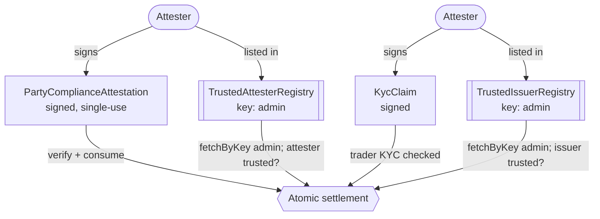
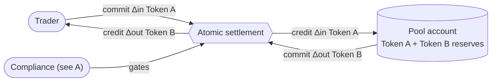
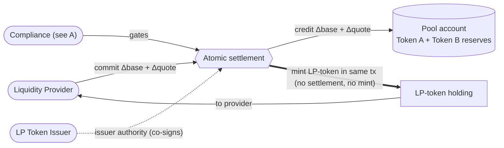
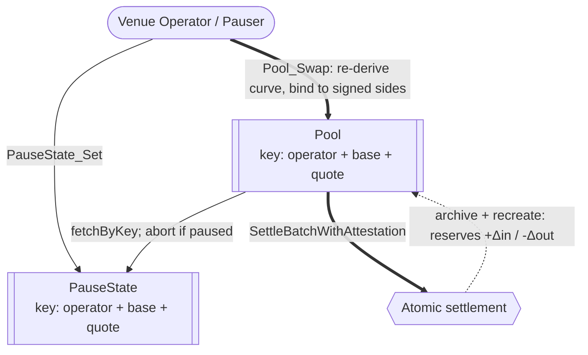
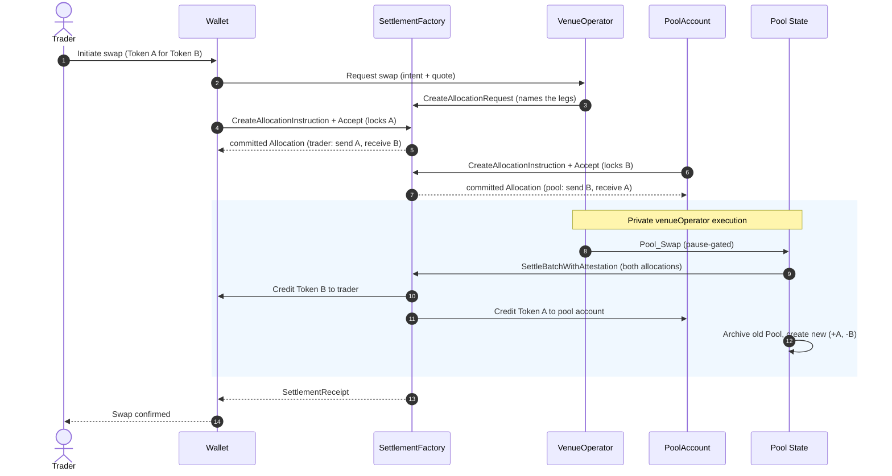

# Privacy-preserving DEX reference architecture

This document describes a *reference design* for a constant-product automated
market maker DEX on Canton. It draws on reusable OpenZeppelin packages maintained
in [`canton-contracts`](https://github.com/OpenZeppelin/canton-contracts),
experimental evidence in this repository, and the Canton Network Token Standard
V2.

## 1. Product Definition

This report specifies a privacy-preserving decentralized exchange (DEX) for the Canton Network, built on reusable settlement primitives that cooperate in a decentralized manner rather than a single monolithic venue. The design uses a **constant-product automated market maker (AMM)**: a pool holds reserves of two assets, `x` and `y`, and prices every trade from the invariant `x · y = k`. A trader deposits some amount `Δx` of one asset and withdraws whatever `Δy` keeps the product unchanged, i.e.
`(x + Δx) · (y − Δy) = k`. The price is thus implied by the ratio of the
reserves rather than quoted by an order book: the pool can always fill a trade, at a price that moves further along the curve the larger the trade is.

For such trading venue to work, the two parties of a trade must be able to swap funds atomically: neither leg of the trade completes unless the other does (atomicity), and no intermediary holds the assets along the way (non-custodial). Ideally, all of this holds without either party having to trust the executor of the trade.

Therefore, the swapping architecture centers on
[CIP-0112 - Canton Network Token Standard V2](https://github.com/canton-foundation/cips/blob/main/cip-0112/cip-0112.md),
specifically its support for
[atomic settlement](https://github.com/canton-foundation/cips/blob/main/cip-0112/cip-0112.md#416-committed-allocations-for-prefunded-trading-and-iterated-settlement).
The core building block is the **atomic delivery-versus-payment (DvP) swap**:
two committed allocations - the taker's input leg and the counterparty's
output leg - are settled in one all-or-nothing transaction. Each leg's amount is
pinned on-ledger to a signed allocation side, so a trade either completes at
the agreed amounts or reverts entirely.

The executable research in this repository provides evidence for several parts
of the design:

1. The [settlement experiment](../../experiments/settlement/) models
   per-authorizer allocation, atomic batch settlement, compliance attestations,
   and seizure of marked in-flight allocations.
2. The [identity experiments](../../experiments/identity/) separately model an
   optional trusted-issuer KYC boundary.
3. The [compliance experiments](../../experiments/compliance/) compare opaque
   off-ledger results with typed on-ledger attestations.

Reusable Access Control, Ownable, and Pausable packages provide governance and
emergency-control building blocks. This report specifies the complete pool,
wallet, service, and deployment as target architecture; the linked experiments
provide the available executable evidence.

### Operational Scope and Boundaries

The target architecture favors **simplicity and modular extensibility**. The
tables below distinguish its core design from adjacent architectural concerns.

| Feature Category | In-Scope Architectural Components |
|---|---|
| Market Structure | A **spot** exchange whose enabling primitive is the **atomic DvP swap**. The venue built out in full is a constant-product AMM with a single liquidity pool (`x · y = k`).|
| Core Flows | Four flows modeled over one settlement boundary: **pool creation** (venue operator + LP token issuer instantiate a `Pool`), **liquidity provision / removal** (depositing both instruments mints LP tokens; burning LP tokens returns proportional reserves), **swap execution** (two-leg atomic settlement), and **fee collection** (a percentage (`feeBps`) of each swap accrues into reserves, raising LP-token redemption value). |
| Asset Representation | Fungible digital assets compliant with the CIP-0112 Token Standard V2 holding interfaces. LP tokens represent pool-share ownership and are minted/burned via the spine. |
| Compliance & Control | D1: a settlement does not execute unless an attester has signalled compliance. D2: a privileged party can block settlement and sweep allocation funds to a preset custodian account. D3: single-synchronizer identity. |
| Trust Topology | Operator-authorized venue: the `Pool` is signed by the venue operator and LP token issuer, and swap correctness is enforced on-ledger by the swap choice rather than by operator discretion. |
| Component Integration | Direct reuse of `openzeppelin-access-control-v1`, `openzeppelin-ownable-v1`, `openzeppelin-pausable-v1`, the CIP-0112 settlement spine, as well as patterns from the [`canton-token-template`](https://github.com/OpenZeppelin/canton-token-template),  [`canton-stablecoin`](https://github.com/OpenZeppelin/canton-stablecoin) and [`ShapeB`](../../experiments/identity/hook-shape-b/daml/OpenZeppelin/Experimental/Identity/ShapeB.daml#L6) codebases. |

| Feature Category | Out-of-Scope Architectural Components |
|---|---|
| Derivative Instruments | Perpetuals, futures, traditional options, and any synthetic asset deriving value from an external non-spot reference. |
| Leverage Facilities | Margin trading, undercollateralized lending, dynamic funding rates, and any protocol-enshrined leverage. |
| External Oracles | Dynamic pricing oracles dictating the pool's internal exchange rate. The AMM uses the constant-product invariant to determine price. |
| Token Standard V1 | Mixed-version settlement and V1-specific allocation paths. The design targets V2 abstractions. |
| Cross-Synchronizer Operation | Cross-synchronizer settlement and identity are out of scope. The design assumes one synchronizer. |

### Target Ecosystem Participants

- **Protocol Architects and Engineers** can evaluate the component and authority
  boundaries before implementing a venue or another AMM curve.
- **Institutional DEX Operators** can establish compliant trading facilities with the access controls, KYC identity gating, and D2 asset-seizure capabilities that regulated venues require.
- **Wallet and Client Integrators** can identify the allocation, authorization,
  and projection assumptions their implementation must support.
- **Security and Assurance Auditors** can evaluate explicit authority
  boundaries, invariants, and unresolved trust assumptions.

### Educational Framing: How to Think About Building a DEX on Canton

Moving from an EVM ecosystem to Canton requires a paradigm shift in state
management, privacy boundaries, and trust topology.

In traditional EVM AMMs, smart contracts are autonomous, globally visible state
machines holding aggregate pool balances. A single trader transaction
sequentially updates this global state, with all network nodes validating the
invariant math off an identical public state tree. Privacy is non-existent by
design, and front-running / MEV extraction via the public mempool is a
structural reality.

Canton operates on a privacy-preserving, **per-party projection** model enforced
by the Canton protocol. A Canton contract is an instance of a template, signed and authorized by a set of parties (signatories). A DEX on Canton cannot rely on a globally readable pool contract that any anonymous
actor can unilaterally mutate. State changes by archive-and-recreate rather than
in-place mutation, and any signatory must actively co-authorize a transition, so
**two-step handshakes (Daml's propose-and-accept pattern) are a necessity, not a
style choice**. Where the target runtime supports them, the design uses
**contract keys** so
the `Pool`, `PauseState`, and the trusted-attester and trusted-issuer registries
keep stable, unique identities across those archive-and-recreate cycles.

To build a mathematically sound AMM in this privacy-first environment, the
architecture reconciles the transparency needed for price discovery and
invariant validation with the privacy needed for individual positions. It does
this by **fracturing settlements into per-authorizer allocation requests**:
a trader's intent interacts with the public logic of a `Pool` contract, but the
actual asset movement rides on per-party `AllocationRequest` and `Allocation`
contracts on the CIP-0112 spine. Counterparties observe only their own legs -
visibility is restricted to a strict need-to-know basis.

To keep the AMM invariant sound without trusting the venue operator to compute
it honestly, the architecture puts the invariant check **on the smart
contract**. The swap choice re-derives the constant-product output, asserts the
`x · y = k` invariant, and binds the swap to the exact amounts the trader signed
in their own allocation.

---

## 2. Architecture Overview

The architecture is assembled from reused OpenZeppelin Daml primitives (role management, two-step ownership handover, pausing), as well as the CIP-0112 settlement spine as the engine for all asset movement. This section maps each component to its library, then defines the party/role topology and the trust configuration.

### Core Components and Library Mapping

Tags distinguish reusable packages from bounded research evidence:
`[LIBRARY]` identifies a package in `canton-contracts`, while `[EXPERIMENT]`
identifies executable evidence in this repository.

| Component Suite | Applied Templates and Libraries | Architectural Function |
|---|---|---|
| Access Control `[LIBRARY]` | `openzeppelin-access-control-v1`: [`RoleGrant`](https://github.com/OpenZeppelin/canton-contracts/blob/68b7c52ccb2db496a668508101fdb0024c60c713/packages/access/access-control-v1/daml/OpenZeppelin/AccessControlV1.daml#L58), [`RoleAdmin`](https://github.com/OpenZeppelin/canton-contracts/blob/68b7c52ccb2db496a668508101fdb0024c60c713/packages/access/access-control-v1/daml/OpenZeppelin/AccessControlV1.daml#L116), [`DefaultAdminTransferOffer`](https://github.com/OpenZeppelin/canton-contracts/blob/68b7c52ccb2db496a668508101fdb0024c60c713/packages/access/access-control-v1/daml/OpenZeppelin/AccessControlV1.daml#L237), [`requireRole`](https://github.com/OpenZeppelin/canton-contracts/blob/68b7c52ccb2db496a668508101fdb0024c60c713/packages/access/access-control-v1/daml/OpenZeppelin/AccessControlV1.daml#L287) | Role-based permissioning. Governs the venue operator and LP token issuer. |
| Ownership Lifecycle `[LIBRARY]` | `openzeppelin-ownable-v1`: [`Ownership`](https://github.com/OpenZeppelin/canton-contracts/blob/68b7c52ccb2db496a668508101fdb0024c60c713/packages/access/ownable-v1/daml/OpenZeppelin/OwnableV1.daml#L41), [`OwnershipOffer`](https://github.com/OpenZeppelin/canton-contracts/blob/68b7c52ccb2db496a668508101fdb0024c60c713/packages/access/ownable-v1/daml/OpenZeppelin/OwnableV1.daml#L82) | Provides support for D4: Secure two-step handover of venue administration. |
| Venue Constraints `[LIBRARY]` | `openzeppelin-pausable-v1`: [`PauseState`](https://github.com/OpenZeppelin/canton-contracts/blob/68b7c52ccb2db496a668508101fdb0024c60c713/packages/security/pausable-v1/daml/OpenZeppelin/PausableV1.daml#L47), [`whenNotPaused`](https://github.com/OpenZeppelin/canton-contracts/blob/68b7c52ccb2db496a668508101fdb0024c60c713/packages/security/pausable-v1/daml/OpenZeppelin/PausableV1.daml#L77) | Emergency circuit breaker. `whenNotPaused` blocks new swaps as well as in-flight settlements. |
| Settlement Model `[EXPERIMENT]` | `OpenZeppelin.Experimental.Settlement.Cip112`: [`SettlementFactory`](../../experiments/settlement/cip-0112/daml/OpenZeppelin/Experimental/Settlement/Cip112.daml#L137), [`AllocationRequest`](../../experiments/settlement/cip-0112/daml/OpenZeppelin/Experimental/Settlement/Cip112.daml#L257), [`AllocationInstruction`](../../experiments/settlement/cip-0112/daml/OpenZeppelin/Experimental/Settlement/Cip112.daml#L306), [`Allocation`](../../experiments/settlement/cip-0112/daml/OpenZeppelin/Experimental/Settlement/Cip112.daml#L388), [`SettlementReceipt`](../../experiments/settlement/cip-0112/daml/OpenZeppelin/Experimental/Settlement/Cip112.daml#L588), [`ToyHolding`](../../experiments/settlement/cip-0112/daml/OpenZeppelin/Experimental/Settlement/Cip112.daml#L98), [`BurnerCapability`](../../experiments/settlement/cip-0112/daml/OpenZeppelin/Experimental/Settlement/Cip112.daml#L75) | Bounded evidence for allocation and settlement behavior. `ToyHolding` is an experimental unit of value, not a reusable token package. |
| Identity Verification `[EXPERIMENT]` | `ShapeB`: [`KycClaim`](../../experiments/identity/hook-shape-b/daml/OpenZeppelin/Experimental/Identity/ShapeB.daml#L43), [`TrustedIssuerRegistry`](../../experiments/identity/hook-shape-b/daml/OpenZeppelin/Experimental/Identity/ShapeB.daml#L74) | Provides evidence for D3: a trader must hold a `KycClaim` issued by a trusted party to interact with permissioned pools. |

The design uses the Splice Token Standard V2 interfaces as its interoperability
boundary. The settlement fixture in this repository is not a canonical Token
Standard implementation.

### Party and Role Model Topology

Duties are segregated and mapped to discrete Daml parties:

- **Venue Operator (`VENUE_OPERATOR`)** - runs the venue backend: quotes swaps
  off the public `Pool` reserves, submits batch
  settlements, and controls the venue pause switch (`PauseState`). The venue
  operator has execution authority to call the settlement factory but never
  holds custody of, nor any unilateral transfer right over trader funds.
- **LP Token Issuer (`LP_TOKEN_ISSUER`)** - manages LP-token policy. Separating
  the issuer from the venue operator supports delegating LP-token issuance to a
  regulated third-party custodian.
- **Liquidity Token Issuer (`LIQUIDITY_TOKEN_ISSUER`)** - issuer/registrar of the
  base and quote instruments when they do not already exist. Lock-and-sweep follows
  the issuer: the `LIQUIDITY_TOKEN_ISSUER` holds it for instruments it issued, and
  when an instrument is issued by another party, that issuer holds lock-and-sweep
  instead.
- **Trader / Liquidity Provider** - the end-user authoring `Allocation`
  contracts from their wallet. The sole party able to lock
  their own holdings.
- **Custodian** - owns the preset account that receives funds swept by a D2
  seizure.
- **Pool Account** - owns the holdings that back the pool's reserves. Must authorize the tokens-out leg for swapping or burning liquidity tokens. 

### Decentralization and Trust Topology

Canton decentralizes a party along three independent axes, and the design
assigns each role a deliberate position on each:

1. **governance** - whose signatures can change the party's identity and hosting (re-home the party to their own validator and act freely);
2. **validation** - how many independent validators must confirm the party's transactions (the `PartyToParticipant` confirmation threshold; a threshold above 1 defends against a malicious validator, at a latency and cost premium, and such a party can no longer submit Ledger API commands directly - it acts through externally signed submissions or through choices submitted by others);
3. **authorization** - what the Daml signatory/controller topology requires regardless of hosting.

For the roles that hold value-moving or supply-changing authority - the pool
account, the LP token issuer, and the liquidity token issuer - the design
envisions the EVM equivalent of an **N-of-M multisig**: no single key may
exercise the role's authority. Canton offers two implementation options, and
the selection remains an open question ([section 6](#6-open-design-questions)):

- **On-ledger approval workflow** - the multisig is written in Daml ([Multiple Party Agreement](https://docs.canton.network/appdev/modules/m3-design-patterns#multiple-party-agreement)): approvers
  record approvals as contracts, and the final choice executes under the role
  party's inherited authority only once a threshold of approvals exists.
  Approvals are durable, named, and auditable on-ledger.
- **External party with threshold signing keys** - the role party's
  transactions require signatures from N of M keys (`PartyToKeyMapping`), held
  by independent organizations. Invisible to the Daml code and a single ledger
  transaction per action, but the signing ceremony must complete within the
  prepared transaction's validity window, and the approval record stays
  off-ledger. The implementation could leverage something like the [Bitsafe decentralization-manager](https://github.com/DLC-link/decentralization-manager).

The powers of the **venue operator** are already bounded by trader signatures and on-ledger checks, so splitting its
identity adds little. The target topology uses a multi-hosted venue-operator
party on several validators with a confirmation threshold above 1, increasing
availability and protecting against a malicious single validator.

The **pause authority** is likewise multi-hosted so the brake is always
reachable, but its confirmation threshold stays at 1: an emergency stop must
be instant, and a quorum would slow it down. The price of that choice is a
griefing window: a malicious pauser can freeze in-flight settlements until
their deadlines lapse. This griefing is capped by the trader's right to reclaim the authorized funds after the expiration deadline.

The **custodian** owns the preset account that receives D2 sweeps. It
needs availability and protection against a malicious single validator, hence multi-hosting with confirmation threshold >1 suffices.

The **D1 or D3 attesters** should be several independent parties in the
`TrustedIssuerRegistry`/`TrustedAttesterRegistry`, so no single attester can halt trading (no
attestation, no trade). Compliance is then only as strict as the weakest listed attester, so
membership is a policy decision.

**Traders and liquidity providers** need no venue-side decentralization: the
design is non-custodial, so they only ever trust their own keys and their own
validator.

---

## 3. Target Design

### The AMM Math

A pool's reserve ratio (`quoteReserves / baseReserves`) denotes the **marginal spot price** - the
limiting price of an infinitesimally small trade. A concrete trade's effective
price depends on its `Δin` (or target `Δout`) through the swap arithmetic and is
always worse than the reserve ratio - the
trade itself moves the price along the curve (price impact), on top of
`feeBps`. A trader therefore requests a quote *for their specific amount* from
the venue operator backend, which reads the current `Pool` and evaluates the
curve.

**How traders view the current price.** The price is derived directly from the **`Pool` reserves**
(`quoteReserves`, `baseReserves`, adjusted for `feeBps`).

**Swap arithmetic (constant-product, fee-inclusive).** Let the trader send `Δin`
of the input instrument into a pool with reserves `(reserveIn, reserveOut)` and
fee `feeBps` (basis points). The fee is taken on the input, so the amount that
actually drives the curve is:

```text
amountInWithFee = Δin · (10000 − feeBps) / 10000
Δout            = (reserveOut · amountInWithFee) / (reserveIn + amountInWithFee)
```

The post-swap reserves are `reserveIn' = reserveIn + Δin` (the full input,
including the retained fee) and `reserveOut' = reserveOut − Δout`. Because the
fee stays in the pool, the invariant is **non-decreasing**:

```text
(reserveIn + amountInWithFee) · (reserveOut − Δout)  ≥  reserveIn · reserveOut
```

The target design binds the curve inputs to the trader's signed allocation: the
sender side equals (`amountIn`, input instrument), the receiver side equals
(`Δout`, output instrument), and those two transfer legs are the settlement's
only legs. Neither the venue operator nor a stale quote can move reserves away
from a value the trader signed.

The operational lifecycle orchestrates state transitions that culminate in
atomic, multi-lateral ledger updates via the CIP-0112 settlement spine.

### Data and State Flow

The diagrams below decompose the design around the shared `Atomic settlement` hub:

- **A** is the compliance and identity that gates it.
- **B** and **C** are the holdings movements it performs (a swap and a liquidity provision), each with `Compliance` plugging in from A.
- **D** is the operator-driven swap that calls into it. Keyed contracts are marked with their key.

**A. Compliance and identity (D1 + D3).** The registries list several independent attesters (two shown); any listed attester can sign a per-settlement compliance attestation or a trader's KYC claim, all checked at settlement.



**B. Swap settlement and holdings.** The trader and the pool account each commit one leg; the atomic settlement swaps them in one transaction, with compliance (from A) plugged in.



**C. Liquidity provision (LP minting).** The provider commits both instruments into the pool account through the same settlement. The LP token issuer mints the LP-token holding only as part of that settlement transaction: if the settlement does not happen, no LP tokens are minted.



**D. Swap execution and pausing.** The venue operator drives the swap on the keyed `Pool`, which pause-gates by key, calls into the atomic settlement, then archives and recreates itself with updated reserves.



### The Settlement-Spine Flow: Step by Step

The execution of a swap is the primary critical path. The flow guarantees funds
are never locked without a resolution path and that execution is atomic.

Demonstrates per-authorizer allocation requests and atomic co-settlement via
`SettlementFactory_SettleBatchWithAttestation`. The privacy boundary: the trader sees their
allocation and receipt, not the backend pool routing.



1. **Intent and Quotation.** A trader requests a quote (swap Token A → Token B).
   The venue operator backend reads current `Pool` state and returns an expected
   output amount plus an `AllocationSpecification`.
2. **Request Formulation.** The venue operator, as settlement executor, formulates
   the [`AllocationRequest`](../../experiments/settlement/cip-0112/daml/OpenZeppelin/Experimental/Settlement/Cip112.daml#L257)
   via [`SettlementFactory_CreateAllocationRequest`](../../experiments/settlement/cip-0112/daml/OpenZeppelin/Experimental/Settlement/Cip112.daml#L151),
   naming the swap's legs and their **exact** amounts.
3. **Trader Allocation.** The trader signs
   [`SettlementFactory_CreateAllocationInstruction`](../../experiments/settlement/cip-0112/daml/OpenZeppelin/Experimental/Settlement/Cip112.daml#L174),
   then [`AllocationInstruction_Accept`](../../experiments/settlement/cip-0112/daml/OpenZeppelin/Experimental/Settlement/Cip112.daml#L319)
   locks their Token A and creates a committed [`Allocation`](../../experiments/settlement/cip-0112/daml/OpenZeppelin/Experimental/Settlement/Cip112.daml#L388)
   (send `Δin` Token A, receive `Δout` Token B) designating `VENUE_OPERATOR` as the
   authorized executor.
4. **Pool Allocation.** The pool account likewise creates and accepts an
   [`AllocationInstruction`](../../experiments/settlement/cip-0112/daml/OpenZeppelin/Experimental/Settlement/Cip112.daml#L306),
   locking `Δout` of Token B from the pool-account holdings and producing the pool's
   own committed [`Allocation`](../../experiments/settlement/cip-0112/daml/OpenZeppelin/Experimental/Settlement/Cip112.daml#L388)
   (send `Δout` Token B, receive `Δin` Token A).
5. **Atomic Batch Settlement.** `VENUE_OPERATOR` exercises the pause-gated
   `Pool_Swap`, which settles both committed `Allocation`s in one
   [`SettlementFactory_SettleBatchWithAttestation`](../../experiments/settlement/cip-0112/daml/OpenZeppelin/Experimental/Settlement/Cip112.daml#L218)
   (presenting a compliance attestation from a trusted attester - see D1),
   archives the current `Pool`, credits `Δout` Token B to the trader and `Δin`
   Token A to the pool account, emits a [`SettlementReceipt`](../../experiments/settlement/cip-0112/daml/OpenZeppelin/Experimental/Settlement/Cip112.daml#L588),
   and creates a new `Pool` with updated reserves. This all commits in one Daml
   transaction: the reserve update and every settlement leg land together or not at
   all, so the published price and the assets delivered never diverge.

**How fast is a swap? (vs. EVM's single transaction.)** In an EVM AMM a swap is
one atomic transaction. Here the asset exchange is still one atomic Daml
transaction, but reaching it takes the multi-step handshake above: the operator
cannot move the trader's funds unilaterally, so the trader must lock them into a
committed `Allocation` first. The trade-off is deliberate: more round-trips to
originate a swap, in exchange for the operator never taking custody.

### Provision (LP mint) and Removal (LP burn) flows 

Liquidity provision reuses the same allocation
lifecycle, with the LP-token mint as a sibling consequence of the settlement:

1. **Deposit Allocation.** The LP commits its two deposits (`Δbase`, `Δquote`) as
   committed `Allocation`s into the pool account, through the same
   instruction-and-accept lifecycle the trader uses above.
2. **Provision and Mint.** `VENUE_OPERATOR` exercises the provision choice on the
   `Pool`. In one transaction it settles both deposit `Allocation`s over the spine
   and, as a sibling `create` rather than a transfer leg (so funding conservation
   is untouched), issues the LP a fresh LP-token holding. The mint's `admin`
   signatory is covered by the `LP_TOKEN_ISSUER` authority inherited from the
   `Pool`'s signatory, and the LP is the controller, covering its account. The
   share amount is computed inside the choice from the deposit just settled
   (`sqrt(Δbase · Δquote)` on the first provision, less a `MINIMUM_LIQUIDITY`
   tranche; `min(Δbase / baseReserves, Δquote / quoteReserves) · totalSupply`
   thereafter), and the new `Pool` records the increased reserves and supply.

Removal is the inverse. The LP presents its LP-token
holding, and `VENUE_OPERATOR` exercises the removal choice: in one transaction it
archives (burns) that holding as a sibling consequence and settles the withdrawal
of the proportional `(shares / totalSupply)` of each reserve from the pool account
back to the LP as transfer legs, recreating the `Pool` with reduced reserves and
supply.

### Liquidity Provision, Removal, and Fee Accrual

The same settlement boundary carries the non-swap flows; all remain atomic via
`SettlementFactory_SettleBatchWithAttestation`.

- **Pool creation.** `VENUE_OPERATOR` and `LP_TOKEN_ISSUER` jointly create the
  `Pool`. Initial reserves are seeded by the first liquidity provision.
- **Liquidity provision.** The LP allocates *both* instruments (two committed
  `Allocation`s) and the venue operator batch-settles them into the pool reserves; in
  the same transaction the `LP_TOKEN_ISSUER` mints LP tokens proportional to
  the contributed share. The new `Pool` reflects increased reserves.
- **Liquidity removal.** The LP burns LP tokens; the batch settles a withdrawal
  of the proportional share of *both* reserves back to the LP, and a new `Pool`
  with reduced reserves is created.
- **Fee accrual / collection.** `feeBps` is retained in the pool on each swap,
  so reserves grow relative to LP-token supply - fees accrue to LPs implicitly
  via redemption value rather than a separate claim.

All four flows are guarded by `whenNotPaused` inside the settling choice - a
pause blocks new swaps and in-flight settlements alike - and inherit the same
D1 compliance check per settlement leg.

**Reserves vs. actual holdings - where the pool's value physically lives.** The
`Pool`'s `baseReserves` / `quoteReserves` are `Decimal` *accounting* figures;
they are **not** the assets themselves. The real value lives in TSv2 holdings
owned by a dedicated **pool account** (an `Account` whose parties are the pool's
signatories), and every flow above moves holdings into or out of that account, in the same transaction that updates the reserve numbers:

- **On provision**, the LP's two committed `Allocation`s settle *into* the pool
  account (new holdings owned by the pool), and `baseReserves`/`quoteReserves`
  are incremented to match.
- **On removal**, the withdrawal legs are funded *from* the pool account's own
  holdings (the pool account is the sender), and reserves are decremented to match.
- **The invariant** that must hold is **`reserves == Σ(pool-account holdings)` per instrument**. Because reserve updates and holding movements commit co-atomically, the two cannot drift within a
transaction; the caveat is *fragmentation* - many small holdings accumulating in
the pool account over time. A periodic **consolidation** step (the pool merges
its holdings for an instrument into one, leaving reserves unchaged) keeps settlement cheap.

### D1: Compliance through Party-Applied Attestation

Institutional DeFi requires that sanctioned or unverified parties cannot trade. The design checks compliance per settlement and fails closed: no valid attestation, no trade. The settlement experiment demonstrates this through [`SettlementFactory_SettleBatchWithAttestation`](../../experiments/settlement/cip-0112/daml/OpenZeppelin/Experimental/Settlement/Cip112.daml#L218), which requires an attestation covering this specific settlement, from an attester listed in the
[`TrustedAttesterRegistry`](../../experiments/settlement/cip-0112/daml/OpenZeppelin/Experimental/Settlement/Cip112.daml#L665). The registry must share the factory's admin, so callers cannot substitute a registry of their own choosing. Attestations are single-use, so none can be cached or reused across settlements.

### D2: Seizure Through Preset Custodian Lock-and-Sweep

Institutional DeFi requires the ability to seize assets under judicial mandate. The design uses a strict **lock-and-sweep** pattern that locks the funds and sweeps them to a preset custodian account. The settlement experiment demonstrates this through [`Allocation_MarkD2InFlightSeizure`](../../experiments/settlement/cip-0112/daml/OpenZeppelin/Experimental/Settlement/Cip112.daml#L502) and [`Allocation_SweepD2InFlightSeizure`](../../experiments/settlement/cip-0112/daml/OpenZeppelin/Experimental/Settlement/Cip112.daml#L532).

### D3: Know-your-customer

Institutional DeFi requires participants to be identified. The target design uses a single-synchronizer identity architecture. Traders must hold a `KycClaim` issued by a party present in the `TrustedIssuerRegistry` to interact with permissioned pools. D1 (compliance) and D3 (identity) can be **optional per pool** (permissioned versus permissionless).

### D4: Authority and Privilege Transfer

Institutional DeFi requires administrative power to be explicit and accountable: every privileged action traces to a named authority. There is no single admin holding every privilege. Each action sits with the role responsible for it: LP-token minting and burning with the `LP_TOKEN_ISSUER`, swap execution with the `VENUE_OPERATOR`, and lock-and-sweep with the `LIQUIDITY_TOKEN_ISSUER`. These privileges are granted, transferred, and revoked through `openzeppelin-access-control-v1` role administration and the `openzeppelin-ownable-v1` two-step ownership handover, so authority can move between parties without redeploying. A permission is bound by direct controllership when its holder is fixed for the life of the contract, and through `openzeppelin-access-control-v1` (`RoleGrant` / `requireRole`) when it must be swappable or revocable without recreating the contract.

### Implementing Smart Contract Upgrades

For a smart contract upgrade, an existing choice's arguments must never be
mutated to require a new field. Extensions are managed via appended `Optional`
fields, new serializable types, and **new choices**.

Consider `Pool_Swap`. Identity gating is handled by inclusion in the
`TrustedIssuerRegistry`. Granular jurisdictional compliance (e.g. US users may
not trade a given security token) uses a separate `Pool_SwapWithJurisdiction`
choice and an appended `Optional JurisdictionalComplianceHook` field on the
`Pool`, while the existing `Pool_Swap` signature stays stable.

SCU extensions are not security retrofits: adding a stricter choice does
not close the looser one. If `Pool_Swap` were simply left live and the
frontend routed around it, anyone could bypass the frontend and call the weaker
path directly, making the jurisdiction check optional in practice. A compatible
upgrade must therefore make the superseded `Pool_Swap` choice fail
unconditionally and mark it as `deprecated`.

---

## 4. Sample Component Structure

The code below is idiomatic Daml that composes with the libraries above. These snippets are illustrative rather than production code: they exemplify the flows and highlight the key parts, so they omit non-essential detail such as basic checks, the `ensure` block, and most comments.

### 4.1 Component: Pool State and Configuration

The `Pool` holds the constant-product AMM state. The reserve-update logic lives
**here**, as a *consuming* choice (`Pool_Swap`) controlled by `venueOperator`,
which archives this `Pool` and recreates the successor with updated reserves.
The `Pool` carries a contract key `(venueOperator, baseInstrumentId,
quoteInstrumentId)`, so consumers reference it by pair rather than by a cid that
changes every swap. `Pool_Swap` is the venue's **single swap entry point** and is
**pause-gated**: it looks up that pool's `PauseState` (keyed by the same tuple) and fails while paused.

```daml
module OpenZeppelin.Experimental.Dex.Amm where

import OpenZeppelin.Experimental.Settlement.Cip112
import OpenZeppelin.Experimental.TokenStandardFixture.V2.Holding (InstrumentId)
import OpenZeppelin.Experimental.TokenStandardFixture.V2.Allocation (SettlementInfo, TransferLeg)
import OpenZeppelin.PausableV1 (PauseState, whenNotPaused)

-- | Constant-product AMM state. Reserves are `Decimal` accounting figures; the
-- assets themselves live in `poolAccount`.
template Pool
  with
    venueOperator : Party
    lpTokenIssuer : Party
    baseInstrumentId : InstrumentId
    quoteInstrumentId : InstrumentId
    poolAccount : Account
    baseReserves : Decimal
    quoteReserves : Decimal
    feeBps : Decimal
  where
    signatory venueOperator, lpTokenIssuer
    key (venueOperator, baseInstrumentId, quoteInstrumentId) : (Party, InstrumentId, InstrumentId)
    maintainer key._1

    -- Consuming: archives this Pool and recreates it with updated reserves.
    -- Controlled by venueOperator; correctness is enforced in the body.
    choice Pool_Swap : (ContractId SettlementReceipt, ContractId Pool)
      with
        traderAllocationId : ContractId Allocation   -- trader's committed input
        poolAllocationId : ContractId Allocation      -- pool's own output leg
        baseToQuote : Bool
        amountIn : Decimal
        settlementFactoryId : ContractId SettlementFactory
        settlement : SettlementInfo
        transferLegs : [TransferLeg]
        attestationCid : ContractId PartyComplianceAttestation
      controller venueOperator
      do
        -- Pause is resolved by key, per pool (same key tuple as the Pool).
        (_, pause) <- fetchByKey @PauseState (venueOperator, baseInstrumentId, quoteInstrumentId)
        whenNotPaused pause
        let (reserveIn, reserveOut, inInstrument, outInstrument) =
              if baseToQuote then (baseReserves, quoteReserves, baseInstrumentId, quoteInstrumentId)
                             else (quoteReserves, baseReserves, quoteInstrumentId, baseInstrumentId)
            amountInWithFee = amountIn * (10000.0 - feeBps) / 10000.0
            dOut = (reserveOut * amountInWithFee) / (reserveIn + amountInWithFee)
        assertMsg "constant-product invariant violated"
          ((reserveIn + amountInWithFee) * (reserveOut - dOut) >= reserveIn * reserveOut)

        -- KEY: bind the curve to what the trader signed, so the reserve math
        -- cannot run off amounts that never settle. Require the trader's signed
        -- input side == (amountIn, input, poolAccount), output side == (dOut,
        -- output, poolAccount), and `transferLegs` to be exactly those two legs.
        traderAlloc <- fetch traderAllocationId
        let sides = traderAlloc.allocation.transferLegSides
        inSide  <- case filter (\s -> s.side == SenderSide)   sides of [s] -> pure s; _ -> abort "one input side"
        outSide <- case filter (\s -> s.side == ReceiverSide) sides of [s] -> pure s; _ -> abort "one output side"
        assertMsg "input side mismatch"
          (inSide.amount == amountIn && inSide.instrumentId == inInstrument.id && inSide.otherside == poolAccount)
        assertMsg "output side mismatch"
          (outSide.amount == dOut && outSide.instrumentId == outInstrument.id && outSide.otherside == poolAccount)

        -- Atomic DvP: settle the trader's input and the pool's output in one batch,
        -- presenting the signed compliance attestation. The factory resolves its
        -- TrustedAttesterRegistry by key, so no caller-supplied registry is trusted.
        receipts <- exercise settlementFactoryId SettlementFactory_SettleBatchWithAttestation with
          settlement; transferLegs
          allocationCids = [traderAllocationId, poolAllocationId]
          actors = [venueOperator]
          attestationCid
        let (newBase, newQuote) =
              if baseToQuote then (baseReserves + amountIn, quoteReserves - dOut)
                             else (baseReserves - dOut, quoteReserves + amountIn)
        newPool <- create this with baseReserves = newBase; quoteReserves = newQuote
        pure (head receipts, newPool)
```

### 4.2 Component: D1 Party Attestation

D1 compliance is enforced at settle time and fails closed. A `SettlementFactory`
set with `requiresPartyAttestation` closes the plain path, forcing every settlement
through `SettlementFactory_SettleBatchWithAttestation`, which is given a signed
`PartyComplianceAttestation`.

The factory verifies and **consumes** the attestation before settling (single-use,
no replay). It resolves its `TrustedAttesterRegistry` **by key** (keyed by the
factory admin), so the attester must be trusted by the factory's own registry, not
one the caller supplies. The attestation must also cover this settlement, bind to
the batch's exact transfer-leg set, and be within its validity window.

```daml
-- Executors settle by presenting the attestation.
exercise factoryCid SettlementFactory_SettleBatchWithAttestation with
  settlement; transferLegs; allocationCids; actors
  attestationCid

-- The factory calls the attestation's consuming verify, passing its own admin:
choice PartyComplianceAttestation_Verify : Text
  with
    settlement : SettlementInfo; transferLegs : [TransferLeg]
    factoryAdmin : Party
  controller settlement.executors
  do
    (_, registry) <- fetchByKey @TrustedAttesterRegistry factoryAdmin
    assertMsg "attester not trusted" (attester `elem` registry.attesters)
    assertMsg "wrong settlement"     (settlementRef == settlement.settlementRef.id)
    -- also: bound to this batch's exact leg set; now within [issuedAt, expiresAt]
    pure claimKind
```

---

## 5. Security & Auditability

The design prioritizes verifiable security. Simplicity over complexity minimizes the
surface for logic exploits, and Canton's per-party projections create natural
containment boundaries.

### 5.1 Security Invariants

- **Non-custodial venue (no unilateral execution)**:
  - The venue operator never holds custody of, nor any unilateral right to move, trader funds. 
  - The trader is the sole party able to lock their own holding into an allocation.
  - The settlement deadline blocks the trader from withdrawing an allocation before `settlementDeadline`.
  - The venue operator can only drive a settlement over those exact committed allocations. The venue operator cannot deviate from the authorized leg or fabricate a transfer the trader did not commit to. 
- **AMM Conservation (`x · y = k`)**:
  - After a swap (minus applied fees), the product of base and quote reserves must be `>=` the product before the swap: `(baseReserves + Δin · (10000 − feeBps)/10000) · (quoteReserves − Δout) ≥
  baseReserves · quoteReserves`.
  - The settlement of the swap legs and the update of the pool reserves must happen atomically. 
- **First-deposit inflation resistance**:
  - Constant-product pool are exposed to the [*first-depositor / share-inflation* attack](https://www.openzeppelin.com/news/a-novel-defense-against-erc4626-inflation-attacks): the
  first LP mints a tiny LP-token supply, then donates assets directly into the
  pool to inflate share price and round later depositors' minted shares
  down to zero. The LP-token mint path (`LP_TOKEN_ISSUER`) must therefore
  either **burn a minimum initial liquidity** (lock the first `MINIMUM_LIQUIDITY`
  shares to a null party, the Uniswap-v2 approach) or **seed the pool from a
  trusted first provision** so the share price cannot be cheaply manipulated. This is a standard liquidity-pool hazard the reference implementation must address.
- **Funding Conservation**:
  - On every settle path the engine enforces that an authorizer's archived locked inputs cover its SenderSide obligations per instrument.
  - Per instrument, the reserves accounted for in the pool state should equal the holdings in the pool account.
- **Privacy**:
  - Any trader participating in the liquidity pool should have visibility only over their holdings, as well as the transfer legs they are a sender and receiver in.

### 5.2 Validation strategy

The executable settlement, compliance, identity, and interoperability
experiments validate the shared mechanisms referenced by this report. A DEX
implementation additionally needs unit and integration tests for curve math,
slippage, share issuance, reserve accounting, ordering, contention, and every
authority failure path. High-value invariants should also receive property-based
or formal analysis when supported by the implementation toolchain.

### 5.3 Threat Model and Failure Modes

| Vector | Attack | Mitigation |
|---|---|---|
| Malicious venue operator state manipulation | Venue operator submits a settlement batch favoring their own holdings, bypassing the price curve or extracting excessive slippage. | `Pool_Swap` enforces the curve on-ledger: it re-derives the output, asserts the `x·y=k` invariant, and binds the settled legs to the amounts the trader signed. A batch that favors the operator or departs from the curve fails these checks, so the operator cannot manipulate reserves even though it drives the swap. |
| Compliance evasion (D1) | A sanctioned party tries to settle without a valid attestation, or with a stale, forged, or untrusted one. | A factory with `requiresPartyAttestation` forces settlement through `SettlementFactory_SettleBatchWithAttestation`, which verifies and consumes a `PartyComplianceAttestation` signed by a party in the factory admin's `TrustedAttesterRegistry`, bound to this settlement and within its validity window. No valid attestation, no settlement. |
| Rogue seizure / asset burning (D2) | A compromised liquidity token issuer key attempts to maliciously burn user assets or return seized funds to unverified actors. | [`Allocation_SweepD2InFlightSeizure`](../../experiments/settlement/cip-0112/daml/OpenZeppelin/Experimental/Settlement/Cip112.daml#L532) hardcodes the destination to the preset `custodianDestination`; arbitrary burn is forbidden. A compromised liquidity token issuer can only sweep to the pre-approved, monitored custodian. |
| Forced upgrades breaking in-flight allocations (SCU) | A poorly executed upgrade mutates fields, rendering existing `Allocation` contracts un-settleable. | Programmatic adherence to the SCU rule (Optional appends + new choices only). The `Pool` template's existing choices stay operable; in-flight transactions conclude before users transition. |
| Venue Operator swap re-ordering / private MEV | The venue operator sees traders' allocations before batching and can order or delay batch-settlement submissions to its own benefit (e.g. sandwiching a large swap). MEV does **not** disappear on Canton - it moves from a public mempool into the venue operator's private view. | The on-ledger invariant blocks *off-curve* execution, but **not** ordering. Candidate mitigations are commit-reveal or fair-ordering for allocation intake, per-swap slippage bounds carried on the trader's signed request ([section 3](#3-target-design)), and batching rules that minimize venue-operator discretion. See [section 5.4](#54-throughput-and-contention). |

### 5.4 Throughput and Contention

Every swap archives and recreates the single `Pool` contract ([section 3](#3-target-design)),
so swaps against the *same* pool serialize: two concurrent swaps consume the same
`Pool`, and the synchronizer commits one and forces the other to retry against the
new state. Contention is therefore per-pool, a consequence of the consuming reserve
update, not a global ledger bottleneck.

Against an EVM AMM the design also has structural throughput advantages: with no
public mempool and no global state tree, (a) independent pools settle in parallel,
(b) there is no public-mempool MEV/front-running tax on the critical path, and (c)
several allocations can ride one `SettlementFactory_SettleBatchWithAttestation`,
amortizing a confirmation round-trip over many legs.

---

## 6. Open Design Questions

The following application decisions remain open before implementation.

- **Multisig implementation for value-critical roles.** The pool account, LP
  token issuer, and liquidity token issuer each require N-of-M authority
  ([section 2](#decentralization-and-trust-topology)). Open: whether each role
  uses the on-ledger approval workflow, an external party with threshold
  signing keys, or a combination; the N and M per role; and the pre-delegation
  mechanism that keeps the pool account's per-swap actions off the ceremony
  path.
- **Reserves == holdings invariant and consolidation.** The `Pool`'s reserve
  figures mirror value physically held in a pool account ([section 3](#3-target-design)). An implementation must
  maintain `reserves == Σ(pool-account holdings)` per instrument and define a
  **consolidation** cadence to merge the many small holdings that accumulate in
  the pool account over time, so settlement stays cheap. Co-atomicity keeps the
  two from drifting within a transaction; the open question is the operational
  consolidation policy and who triggers it.
- **Venue operator ordering / private MEV.** Removing the public mempool relocates MEV
  to the venue operator, which orders and times batch-settlement submissions ([section 5.4](#54-throughput-and-contention)). Fair
  intake (commit-reveal / fair-ordering), trader-signed slippage bounds, and
  batching rules that minimize venue operator discretion are candidate
  mitigations. On-ledger fair ordering, slippage bounds, and batching policy
  remain open design requirements.
- **Encoding `minOutputAmount` for a swap.** The trader's `Allocation` carries an
  **exact** receive amount ([section 3](#3-target-design)), so if reserves
  move between quote and settlement the curve check fails and the swap aborts
  rather than filling at a worse price. That is safe but brittle under
  contention: every reserve move invalidates all pending quotes. Open: how to
  express "at least `minOut`" instead. Candidates: (a) keep exact legs and
  re-quote/re-sign on failure (the specified behavior); (b) let the trader sign
  `minOut` plus a validity window and have `Pool_Swap` compute the actual `Δout`
  from live reserves at settlement, which requires the settlement spine to
  support variable-amount legs bounded by the signed minimum; (c) venue-side
  auto-retry within a trader-signed price band. Interacts with the MEV item
  above: whatever encoding is chosen is also the slippage bound that limits
  operator ordering discretion.
- **Hot-pool throughput / contention ([section 5.4](#54-throughput-and-contention)).** Per-pool serialization is inherent
  to the consuming reserve update. Pool sharding (parallel `Pool` contracts per
  pair) and venue operator-side swap batching (one settlement batch applying a net reserve
  delta) are the candidate mitigations; both need fairness modeling before
  adoption.
- **LP token force-upgrade semantics.** Active holdings upgrade-on-use during
  factory routing, but passive LP tokens held idly do not trigger an upgrade
  cycle. The threshold criteria and off-ledger events for an issuer to invoke a
  force-upgrade on passive assets remain an operational policy decision for the
  `LP_TOKEN_ISSUER`.
- **Composability with the other reference architectures**: DEX pools can be
  seeded with base/quote liquidity from **cross-chain stablecoin inflows** settled via the
  cross-chain stablecoin design ([cross-chain stablecoin](./cross-chain-stablecoin.md)), and the DEX is the
  **secondary market** for tokens distributed by the
  [confidential auction](./confidential-auction.md) - both over the same
  `SettlementFactory_SettleBatchWithAttestation` spine, with no parallel settlement path.
