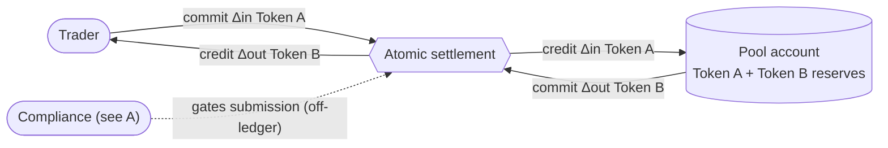
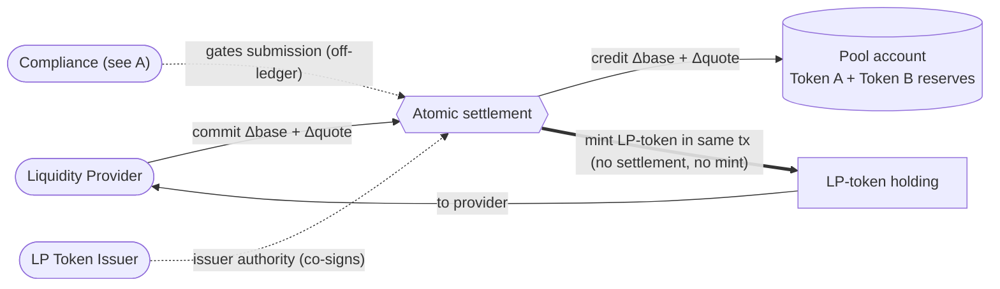
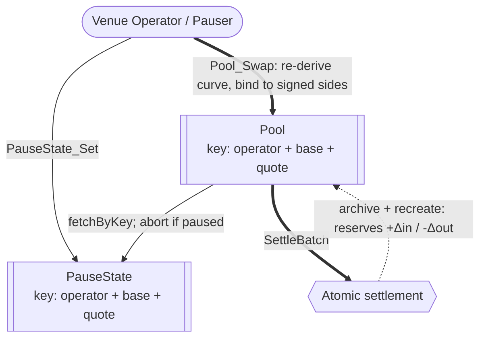
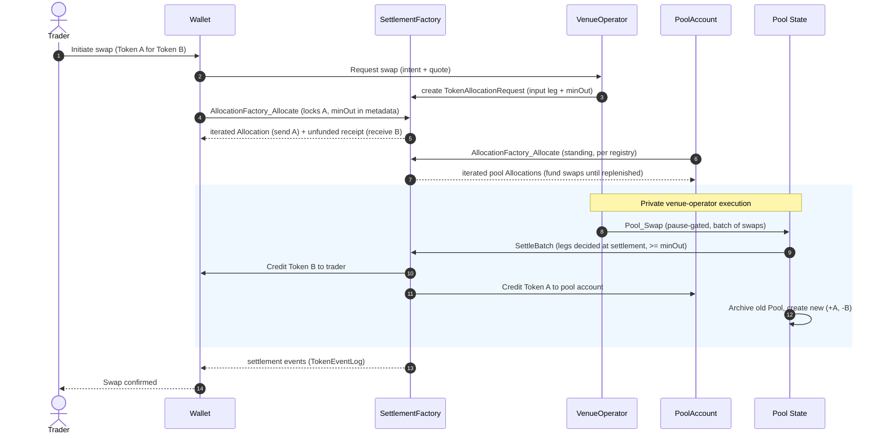

# Privacy-preserving DEX reference architecture

This document describes a *reference design* for a constant-product automated
market maker DEX on Canton. It draws on reusable OpenZeppelin packages maintained
in [`OpenZeppelin/canton-contracts`](https://github.com/OpenZeppelin/canton-contracts),
experimental evidence in this repository, and the Canton Network Token Standard
V2.

## 1. Product Definition

This report specifies a privacy-preserving decentralized exchange (DEX) for the Canton Network, built on reusable settlement primitives that cooperate in a decentralized manner rather than a single monolithic venue. The design uses a **constant-product automated market maker (AMM)**: a pool holds reserves of two assets, `x` and `y`, and prices every trade from the invariant `x · y = k`. A trader deposits some amount `Δx` of one asset and withdraws whatever `Δy` keeps the product unchanged, i.e.
`(x + Δx) · (y − Δy) = k`. The price is thus implied by the ratio of the
reserves rather than quoted by an order book: the pool can always fill a trade, at a price that moves further along the curve the larger the trade is.

For such trading venue to work, the two parties of a trade must be able to swap funds atomically: neither leg of the trade completes unless the other does (atomicity), and no intermediary holds the assets along the way (non-custodial). Ideally, all of this holds without either party having to trust the executor of the trade.

Therefore, the swapping architecture centers on
[CIP-0112 - Canton Network Token Standard V2](https://github.com/canton-foundation/cips/blob/main/cip-0112/cip-0112.md),
specifically its support for
[atomic settlement](https://github.com/canton-foundation/cips/blob/main/cip-0112/cip-0112.md#416-committed-allocations-for-prefunded-trading-and-iterated-settlement).
The core building block is the **atomic delivery-versus-payment (DvP) swap**:
two committed allocations - the taker's input leg and the counterparty's
output leg - are settled in one all-or-nothing transaction. Each leg's amount is
pinned on-ledger to a signed allocation side - the input exactly, the output
bounded below by a signed `minOut` - so a trade either completes within the
trader's signed bounds or reverts entirely.

The executable research in this repository provides evidence for several parts
of the design:

1. The [settlement experiment](https://github.com/OpenZeppelin/canton-contracts/tree/7696749737885e25cd88422847105f890f03b00d/experiments/token/tokenCIP112-v1) models
   per-authorizer allocation, atomic batch settlement, compliance attestations,
   and seizure of marked in-flight allocations.
2. The [compliance experiments](../../experiments/compliance/) compare opaque
   off-ledger results with typed on-ledger attestations.

Reusable Access Control, Ownable, and Pausable packages provide governance and
emergency-control building blocks. This report specifies the complete pool,
wallet, service, and deployment as target architecture; the linked experiments
provide the available executable evidence.

### Operational Scope and Boundaries

The target architecture favors **simplicity and modular extensibility**. The
tables below distinguish its core design from adjacent architectural concerns.

| Feature Category | In-Scope Architectural Components |
|---|---|
| Market Structure | A **spot** exchange whose enabling primitive is the **atomic DvP swap**. The venue built out in full is a constant-product AMM with a single liquidity pool (`x · y = k`).|
| Core Flows | Four flows modeled over one settlement boundary: **pool creation** (venue governance + LP token issuer instantiate a `Pool`), **liquidity provision / removal** (depositing both instruments mints LP tokens; burning LP tokens returns proportional reserves), **swap execution** (two-leg atomic settlement), and **fee collection** (a percentage (`feeBps`) of each swap accrues into reserves, raising LP-token redemption value). |
| Asset Representation | Fungible digital assets compliant with the CIP-0112 Token Standard V2 holding interfaces. LP tokens represent pool-share ownership and are minted/burned via the spine. |
| Compliance & Control | D1: the venue backend runs arbitrary operator-defined checks on every settlement before submission - enforced off-ledger, at the venue's single execution entry point. D2: a privileged party can block settlement and sweep allocation funds to a preset custodian account. D3: identity established at off-ledger onboarding; single-synchronizer identity. |
| Trust Topology | Governance-authorized venue: the `Pool` is signed by the venue governance and LP token issuer, and swap correctness is enforced on-ledger by the swap choice rather than by operator discretion. |
| Component Integration | Direct reuse of `openzeppelin-access-control-v1`, `openzeppelin-ownable-v1`, `openzeppelin-pausable-v1`, the CIP-0112 settlement spine, as well as patterns from the [`OpenZeppelin/canton-token-template`](https://github.com/OpenZeppelin/canton-token-template) and [`OpenZeppelin/canton-stablecoin`](https://github.com/OpenZeppelin/canton-stablecoin) codebases. |

| Feature Category | Out-of-Scope Architectural Components |
|---|---|
| Derivative Instruments | Perpetuals, futures, traditional options, and any synthetic asset deriving value from an external non-spot reference. |
| Leverage Facilities | Margin trading, undercollateralized lending, dynamic funding rates, and any protocol-enshrined leverage. |
| External Oracles | Dynamic pricing oracles dictating the pool's internal exchange rate. The AMM uses the constant-product invariant to determine price. |
| Token Standard V1 | Mixed-version settlement and V1-specific allocation paths. The design targets V2 abstractions. |
| Cross-Synchronizer Operation | Cross-synchronizer settlement and identity are out of scope. The design assumes one synchronizer. |

### Target Ecosystem Participants

- **Protocol Architects and Engineers** can evaluate the component and authority
  boundaries before implementing a venue or another AMM curve.
- **Institutional DEX Operators** can establish compliant trading facilities with the access controls and D2 asset-seizure capabilities that regulated venues require, gating access through the KYC/KYB and compliance systems they already run.
- **Wallet and Client Integrators** can identify the allocation, authorization,
  and projection assumptions their implementation must support.
- **Security and Assurance Auditors** can evaluate explicit authority
  boundaries, invariants, and unresolved trust assumptions.

### Educational Framing: How to Think About Building a DEX on Canton

In traditional EVM AMMs, smart contracts are autonomous, globally visible state
machines holding aggregate pool balances. A single trader transaction
sequentially updates this global state, with all network nodes validating the
invariant math off an identical public state tree. Privacy is non-existent by
design, and front-running / MEV extraction via the public mempool is a
structural reality.

Canton enforces **per-party projection** instead: a contract is an instance of a
template, signed by a set of parties (its signatories) and visible only to them
and to any observers. A DEX on Canton therefore cannot rely on a globally
readable pool contract that any anonymous actor can unilaterally mutate.

State changes by archive-and-recreate rather than in-place mutation, with every
signatory co-authorizing the transition (Daml's propose-and-accept pattern). That
is why the design resolves the `Pool` and `PauseState` by **contract key** (reintroduced in
[Canton 3.5.1+](https://github.com/digital-asset/canton/releases/tag/v3.5.1)): a
key is the identity that survives each recreate. Keys are not unique - the
platform accepts two contracts sharing one - so uniqueness stays an application
obligation: the design must guarantee one `Pool` and one `PauseState` per
instrument pair.

Keys are the design target, not what runs today. The experiment code sits on the
workspace's pinned SDK baseline and is keyless, so each choice takes a
caller-supplied registry contract id and asserts it shares the factory's admin.
By-key resolution lands with the 3.5.1+ SDK migration.

To build a mathematically sound AMM in this privacy-first environment, the
architecture reconciles the transparency needed for price discovery and
invariant validation with the privacy needed for individual positions. It does
this by **fracturing settlements into per-authorizer allocation requests**:
a trader's intent interacts with the public logic of a `Pool` contract, but the
actual asset movement rides on per-party `TokenAllocationRequest` and `TokenAllocation`
contracts on the CIP-0112 spine. Counterparties observe only their own legs -
visibility is restricted to a strict need-to-know basis.

To keep the AMM invariant sound without trusting the venue operator to compute
it honestly, the architecture puts the invariant check **on the smart
contract**. The swap choice re-derives the constant-product output, asserts the
`x · y = k` invariant, and binds the swap to the input amount and minimum
output the trader signed in their own allocation.

---

## 2. Architecture Overview

The architecture is assembled from reused OpenZeppelin Daml primitives (role management, two-step ownership handover, pausing), as well as the CIP-0112 settlement spine as the engine for all asset movement. This section maps each component to its library, then defines the party/role topology and the trust configuration.

### Core Components and Library Mapping

Tags distinguish library packages from bounded research evidence:
`[LIBRARY]` identifies a library package in
[`OpenZeppelin/canton-contracts`](https://github.com/OpenZeppelin/canton-contracts),
while `[EXPERIMENT]` identifies executable evidence in this repository
(`OpenZeppelin/canton-specs`).

| Component Suite | Applied Templates and Libraries | Architectural Function |
|---|---|---|
| Access Control `[LIBRARY]` | `openzeppelin-access-control-v1`: [`RoleGrant`](https://github.com/OpenZeppelin/canton-contracts/blob/cec416d6e3c2118551c761d5598c403ab27ee342/experiments/access/access-control-v1/daml/OpenZeppelin/AccessControlV1.daml#L58), [`RoleAdmin`](https://github.com/OpenZeppelin/canton-contracts/blob/cec416d6e3c2118551c761d5598c403ab27ee342/experiments/access/access-control-v1/daml/OpenZeppelin/AccessControlV1.daml#L116), [`DefaultAdminTransferOffer`](https://github.com/OpenZeppelin/canton-contracts/blob/cec416d6e3c2118551c761d5598c403ab27ee342/experiments/access/access-control-v1/daml/OpenZeppelin/AccessControlV1.daml#L237), [`requireRole`](https://github.com/OpenZeppelin/canton-contracts/blob/cec416d6e3c2118551c761d5598c403ab27ee342/experiments/access/access-control-v1/daml/OpenZeppelin/AccessControlV1.daml#L287) | Role-based permissioning. Governs the venue governance and LP token issuer. |
| Ownership Lifecycle `[LIBRARY]` | `openzeppelin-ownable-v1`: [`Ownership`](https://github.com/OpenZeppelin/canton-contracts/blob/cec416d6e3c2118551c761d5598c403ab27ee342/experiments/access/ownable-v1/daml/OpenZeppelin/OwnableV1.daml#L41), [`OwnershipOffer`](https://github.com/OpenZeppelin/canton-contracts/blob/cec416d6e3c2118551c761d5598c403ab27ee342/experiments/access/ownable-v1/daml/OpenZeppelin/OwnableV1.daml#L82) | Provides support for D4: Secure two-step handover of venue administration. |
| Venue Constraints `[LIBRARY]` | `openzeppelin-pausable-v1`: [`PauseState`](https://github.com/OpenZeppelin/canton-contracts/blob/cec416d6e3c2118551c761d5598c403ab27ee342/experiments/security/pausable-v1/daml/OpenZeppelin/PausableV1.daml#L47), [`whenNotPaused`](https://github.com/OpenZeppelin/canton-contracts/blob/cec416d6e3c2118551c761d5598c403ab27ee342/experiments/security/pausable-v1/daml/OpenZeppelin/PausableV1.daml#L77) | Emergency circuit breaker. `whenNotPaused` blocks new swaps as well as in-flight settlements. |
| Settlement Model `[EXPERIMENT]` | `OpenZeppelin.TokenCIP112V1`: [`TokenRules`](https://github.com/OpenZeppelin/canton-contracts/blob/7696749737885e25cd88422847105f890f03b00d/experiments/token/tokenCIP112-v1/daml/OpenZeppelin/TokenCIP112V1/Registry.daml#L28), [`TokenAllocationRequest`](https://github.com/OpenZeppelin/canton-contracts/blob/7696749737885e25cd88422847105f890f03b00d/experiments/token/tokenCIP112-v1/daml/OpenZeppelin/TokenCIP112V1/AllocationRequest.daml#L18), [`AllocationFactory_Allocate`](https://github.com/OpenZeppelin/canton-contracts/blob/7696749737885e25cd88422847105f890f03b00d/experiments/token/tokenCIP112-v1/daml/OpenZeppelin/TokenCIP112V1/Registry.daml#L280), [`TokenAllocation`](https://github.com/OpenZeppelin/canton-contracts/blob/7696749737885e25cd88422847105f890f03b00d/experiments/token/tokenCIP112-v1/daml/OpenZeppelin/TokenCIP112V1/Allocation.daml#L67), [`TokenEventLog`](https://github.com/OpenZeppelin/canton-contracts/blob/7696749737885e25cd88422847105f890f03b00d/experiments/token/tokenCIP112-v1/daml/OpenZeppelin/TokenCIP112V1/Base.daml#L75), [`TokenHolding`](https://github.com/OpenZeppelin/canton-contracts/blob/7696749737885e25cd88422847105f890f03b00d/experiments/token/tokenCIP112-v1/daml/OpenZeppelin/TokenCIP112V1/Holding.daml#L17), [`BurnerCapability`](https://github.com/OpenZeppelin/canton-contracts/blob/7696749737885e25cd88422847105f890f03b00d/experiments/token/tokenCIP112-v1/daml/OpenZeppelin/TokenCIP112V1/Allocation.daml#L52) | Bounded evidence for allocation and settlement behavior. |

The design uses the Splice Token Standard V2 interfaces as its
interoperability boundary; the `tokenCIP112-v1` package implements them
directly against the upstream splice interface packages.

### Party and Role Model Topology

Duties are segregated and mapped to discrete Daml parties:

- **Venue Governance (`VENUE_GOVERNANCE`)** - the party that signs all venue
  state (`Pool`, `PauseState`) and is the settlement executor named in every
  allocation. It is **decentralized**: hosted across several independent
  participant nodes with a confirmation threshold above 1, it cannot submit
  ledger commands directly, so its authority is reachable only through choices
  on contracts it signs ([trust topology](#decentralization-and-trust-topology)).
  It never holds custody of, nor any unilateral transfer right over, trader
  funds.
- **Venue Operator (`VENUE_OPERATOR`)** - the off-ledger backend: quotes
  swaps off the `Pool` reserves, runs the compliance gate, and decides when to
  execute which action. It acts through **delegation contracts** signed by
  `VENUE_GOVERNANCE`, whose choices it controls; those choices encode the only
  permitted call patterns (`Pool_Swap`, provision, removal), so the operator
  times and orders actions but holds no venue authority of its own.
- **Auditor (`AUDITOR`)** - an independent party whose participant node hosts
  `VENUE_GOVERNANCE` with **observation permission** (no submission, no
  confirmation). It receives every transaction the operator is a stakeholder
  in - swaps, provisions, removals, pauses - as they commit, and independently
  re-derives the curve, checks each fill against its trader's signed `minOut`,
  and checks each batch's composition against arrival order. It holds no venue
  authority: it detects and escalates, it cannot block.
- **LP Token Issuer (`LP_TOKEN_ISSUER`)** - mints and burns the LP token, the
  pool-share receipt a liquidity provider holds against the pool. It never
  touches the traded assets. Example: an LP deposits 100 base + 100 quote,
  and in that same settlement the LP token issuer mints them 100 LP tokens;
  on removal it burns them. Separating the issuer from the venue governance
  allows future delegation of LP-token issuance to a regulated third-party
  custodian.
- **Instrument Registrar (`INSTRUMENT_REGISTRAR`)** - the token-standard
  registry of the traded base and quote instruments themselves, when they do
  not already exist. Contrast: the LP token issuer issues the pool's own
  receipt token; the instrument registrar administers the assets being traded
  (EVM analogy: the pair contract minting UNI-V2 versus Circle issuing USDC).
  Lock-and-sweep follows the registrar: the `INSTRUMENT_REGISTRAR` holds it
  for instruments it issued, and when an instrument is issued by another
  party (e.g. Canton Coin), that party holds lock-and-sweep instead. Example:
  under a court order, the registrar of the base instrument marks a trader's
  locked allocation and sweeps it to the custodian.
- **Trader / Liquidity Provider** - the end-user authoring `TokenAllocation`
  contracts from their wallet. The sole party able to lock
  their own holdings.
- **Custodian** - owns the preset account that receives funds swept by a D2
  seizure.
- **Pool Account** - owns the holdings that back the pool's reserves. Must authorize the tokens-out leg for swapping or burning LP tokens.

### Decentralization and Trust Topology

Canton decentralizes a party along three independent axes, and the design
assigns each role a deliberate position on each:

1. **governance** - whose signatures can change the party's identity and hosting (re-home the party to their own validator and act freely);
2. **validation** - how many independent validators must confirm the party's transactions (the `PartyToParticipant` confirmation threshold; a threshold above 1 defends against a malicious validator, at a latency and cost premium, and such a party can no longer submit Ledger API commands directly - it acts through externally signed submissions or through choices submitted by others);
3. **authorization** - what the Daml signatory/controller topology requires regardless of hosting.

For the roles that hold value-moving or supply-changing authority - the pool
account, the LP token issuer, and the instrument registrar - the design
envisions the EVM equivalent of an **N-of-M multisig**: no single key may
exercise the role's authority. Canton offers two ways to implement this (which one is currently left as an open question)
([section 7](#7-open-design-questions)):

- **On-ledger approval workflow** - the multisig is written in Daml ([Multiple Party Agreement](https://docs.canton.network/appdev/modules/m3-design-patterns#multiple-party-agreement)): approvers
  record approvals as contracts, and the final choice executes under the role
  party's inherited authority only once a threshold of approvals exists.
  Approvals are durable, named, and auditable on-ledger.
- **External party with threshold signing keys** - the role party's
  transactions require signatures from N of M keys (`PartyToKeyMapping`), held
  by independent organizations. Invisible to the Daml code and a single ledger
  transaction per action, but the signing ceremony must complete within the
  prepared transaction's validity window, and the approval record stays
  off-ledger. The implementation could leverage something like the [Bitsafe decentralization-manager](https://github.com/DLC-link/decentralization-manager).

The powers of the **venue governance** are bounded per registry by trader
signatures and on-ledger checks, but not across registries: once allocations
are committed, their executor can settle one registry's batch without the
other, or drive a settlement factory directly, bypassing `Pool_Swap` and its
curve and reserve accounting. Cross-registry atomicity is executor trust, so
the executor itself must be trustworthy. The design therefore decentralizes
the venue-governance party across several independently operated participant nodes with a
confirmation threshold above 1, no single node can act as the party. The separate
**venue operator** party drives execution through **delegation contracts**
([section 4.2](#42-component-venue-operator-delegation)):
`VENUE_GOVERNANCE`-signed contracts whose choices, controlled by the operator,
call `Pool_Swap` and the other venue choices with the governance party's
inherited authority. The operator picks when and in what order; it
cannot reach the executor authority outside those choices, so a compromised
backend can delay or reorder, never partially settle or bypass the curve.
Hosting candidates are covalidation service providers - paid, reputation-bound,
and governed ([covalidation](https://docs.digitalasset.com/covalidation/overview)).

The **auditor** extends this topology with detection. Hosting
`VENUE_GOVERNANCE` in observation mode on the auditor's participant gives the
auditor the governance party's full projection with no authority attached. It re-executes the curve
math of every committed swap, verifies each fill met its trader's signed
`minOut`, and compares each batch's composition against arrival order, measured
by the record time of the traders' committed allocations - quote-stage
ordering happens off-ledger, before anything the auditor can see. Violations
cannot be blocked (observation grants no confirmation right), but they are
provable from the auditor's own node, feeding governance, reputation, and the
pause decision.

The **pause authority** is likewise multi-hosted so the brake is always
reachable, but its confirmation threshold stays at 1: an emergency stop must
be instant, and a quorum would slow it down. The price of that choice is a
griefing window: a malicious pauser can freeze in-flight settlements until
their deadlines lapse. This griefing is capped by the trader's right to reclaim the authorized funds after the expiration deadline.

The **custodian** owns the preset account that receives D2 sweeps. It
needs availability and protection against a malicious single validator, hence multi-hosting with confirmation threshold >1 suffices.

**Compliance and identity checks** are an off-ledger function of the venue
backend: it gates onboarding against the operator's KYC/KYB systems and runs
arbitrary checks on every settlement submission. It needs no on-ledger
decentralization, but every screening
decision should be accompanied by an auditable off-ledger compliance log, because the
ledger records no per-settlement compliance evidence.

**Traders and liquidity providers** need no venue-side decentralization: the
design is non-custodial, so they only ever trust their own keys and their own
validator.

**Infrastructure trust.** The single synchronizer the design assumes is the
**Global Synchronizer**: traffic is paid in Canton Coin and rewards flow through
Splice ([section 6](#6-network-economics-traffic-costs-and-app-rewards)), both
governed by super-validator vote. The residual assumptions per component:

- **Sequencer**: can censor or delay, never forge; delay abuse is covered in
  [section 5.3](#53-threat-model).
- **Mediator**: sees view metadata, not payloads; can stall finality, never
  move funds.
- **Counterparty participants**: a malicious participant misbehaves only for
  parties it hosts; confirmation thresholds above 1 contain it.
- **Super-validator governance**: sets the traffic price and grants or revokes
  the venue's `FeaturedAppRight`; a business dependency, not a custody risk.

---

## 3. Target Design

### The AMM Math

A pool's reserve ratio (`quoteState.reserves / baseState.reserves`) denotes the **marginal spot price** - the
limiting price of an infinitesimally small trade. A concrete trade's effective
price depends on its `Δin` (or target `Δout`) through the swap arithmetic and is
always worse than the reserve ratio - the
trade itself moves the price along the curve (price impact), on top of
`feeBps`. A trader therefore requests a quote *for their specific amount* from
the venue operator backend, which reads the current `Pool` and evaluates the
curve.

**How traders view the current price.** The price is derived from the **`Pool` reserves**
(`quoteState.reserves`, `baseState.reserves`, adjusted for `feeBps`), quoted by the
operator's API rather than read on-ledger
([privacy model](#privacy-and-visibility-model)).

**Swap arithmetic (constant-product, fee-inclusive).** Let the trader send `Δin`
of the input instrument into a pool with reserves `(reserveIn, reserveOut)` and
fee `feeBps` (basis points). The fee is taken on the input, so the amount that
actually drives the curve is:

```text
amountInWithFee = Δin · (10000 − feeBps) / 10000
Δout            = (reserveOut · amountInWithFee) / (reserveIn + amountInWithFee)
```

The post-swap reserves are `reserveIn' = reserveIn + Δin` (the full input,
including the retained fee) and `reserveOut' = reserveOut − Δout`. Because the
fee stays in the pool, the invariant is **non-decreasing**:

```text
(reserveIn + amountInWithFee) · (reserveOut − Δout)  ≥  reserveIn · reserveOut
```


The target design binds the curve **input** to the trader's signed allocation
and decides the **output** at settlement time. The trader locks exactly
(`amountIn`, input instrument) in an **iterated allocation**
([CIP-0112 iterated settlement](https://github.com/canton-foundation/cips/blob/main/cip-0112/cip-0112.md#436-committed-allocations-and-iterated-settlement))
whose metadata carries their signed `minOut`, and pre-approves receipt of the
output through an unfunded iterated allocation at the output registry.
`Pool_Swap` computes `Δout` from live reserves at settlement, aborts if
`Δout < minOut`, and attaches the actual legs to the iterated allocations
(`extraTransferLegSides`); unspent input flows back automatically as change. A
stale quote therefore fills at the live price when it clears the trader's bound
and aborts otherwise: the venue can never fill below the signed `minOut`. That
guarantee rests on the decentralized operator topology
([section 2](#decentralization-and-trust-topology)): the executor's authority is
reachable only through `Pool_Swap`, which enforces the bound. It also
requires the traded registries to implement CIP-0112 iterated allocations,
which becomes part of the instrument listing policy
([section 5.3](#53-threat-model)).

The operational lifecycle orchestrates state transitions that culminate in
atomic, multi-lateral ledger updates via the CIP-0112 settlement spine.

### Data and State Flow

The diagrams below decompose the design around the shared `Atomic settlement` hub:

- **A** is the off-ledger compliance and identity gate in front of it.
- **B** and **C** are the holdings movements it performs (a swap and a liquidity provision), each with `Compliance` from A gating the operator's submission.
- **D** is the operator-driven swap that calls into it. Keyed contracts are marked with their key.

**A. Compliance and identity, off-ledger.** Identity is established at
onboarding against the operator's KYC/KYB systems; every quote and settlement
submission passes arbitrary operator-defined checks. The ledger sees only
submissions that cleared the gate.


**B. Swap settlement and holdings.** The trader and the pool account each commit one leg; the atomic settlement swaps them in one transaction, with compliance (from A) gating the operator's submission.



**C. Liquidity provision (LP minting).** The provider commits both instruments into the pool account through the same settlement. The LP token issuer mints the LP-token holding only as part of that settlement transaction: if the settlement does not happen, no LP tokens are minted.



**D. Swap execution and pausing.** The venue operator drives the swap on the keyed `Pool`, which pause-gates by key, calls into the atomic settlement, then archives and recreates itself with updated reserves.



### The Settlement-Spine Flow: Step by Step

The execution of a swap is the primary critical path. The flow guarantees funds
are never locked without a resolution path and that execution is atomic.

Demonstrates per-authorizer allocation requests and atomic co-settlement via
`SettlementFactory_SettleBatch`. The privacy boundary: the trader sees their
allocation and receipt, not the backend pool routing.



1. **Intent and Quotation.** A trader requests a quote (swap Token A → Token B).
   The venue operator backend checks the trader against its KYC/KYB systems and
   arbitrary compliance checks
   ([section 3](#d1-compliance-through-off-ledger-screening)), reads
   current `Pool` state, and returns an expected output amount plus an
   `AllocationSpecification`. The same screening re-runs before the settle
   submission in step 5.
2. **Request Formulation.** The venue operator, under its delegation from
   `VENUE_GOVERNANCE` (the named settlement executor), creates
   the [`TokenAllocationRequest`](https://github.com/OpenZeppelin/canton-contracts/blob/7696749737885e25cd88422847105f890f03b00d/experiments/token/tokenCIP112-v1/daml/OpenZeppelin/TokenCIP112V1/AllocationRequest.daml#L18),
   naming the input leg's **exact** amount and the trader's signed `minOut`.
3. **Trader Allocation.** The trader signs
   [`AllocationFactory_Allocate`](https://github.com/OpenZeppelin/canton-contracts/blob/7696749737885e25cd88422847105f890f03b00d/experiments/token/tokenCIP112-v1/daml/OpenZeppelin/TokenCIP112V1/Registry.daml#L280),
   which locks their Token A into an iterated [`TokenAllocation`](https://github.com/OpenZeppelin/canton-contracts/blob/7696749737885e25cd88422847105f890f03b00d/experiments/token/tokenCIP112-v1/daml/OpenZeppelin/TokenCIP112V1/Allocation.daml#L67)
   (send `Δin` Token A, `minOut` in its metadata) and creates an unfunded
   iterated receipt allocation for Token B, both designating `VENUE_GOVERNANCE`
   as the authorized executor.
4. **Pool Allocation.** The pool account maintains a **standing iterated
   allocation per registry**, funded from the pool-account holdings and
   replenished periodically; each swap's output leg is drawn from it at
   settlement, so no per-swap pool signature is needed.
5. **Atomic Batch Settlement.** `VENUE_OPERATOR` exercises, through its
   delegation, the pause-gated `Pool_Swap` over a **batch of pending swaps**: it computes each swap's
   `Δout` from live reserves, asserts `Δout >= minOut`, attaches the actual
   legs to the iterated allocations, and settles one
   [`SettlementFactory_SettleBatch`](https://github.com/OpenZeppelin/canton-contracts/blob/7696749737885e25cd88422847105f890f03b00d/experiments/token/tokenCIP112-v1/daml/OpenZeppelin/TokenCIP112V1/Registry.daml#L79)
   per registry, credits each trader's output, emits [`TokenEventLog`](https://github.com/OpenZeppelin/canton-contracts/blob/7696749737885e25cd88422847105f890f03b00d/experiments/token/tokenCIP112-v1/daml/OpenZeppelin/TokenCIP112V1/Base.daml#L75)
   entries, and creates a new `Pool` with the batch's net reserve update. This
   all commits in one Daml transaction: the reserve update and every settlement
   leg land together or not at all, so the published price and the assets
   delivered never diverge.

### Execution Model

In an EVM AMM a swap is one synchronous RPC round-trip. In our Canton DEX, only the final
settlement is atomic: `Pool_Swap` commits the curve check, both legs, and the
reserve update in one Daml transaction.

Every earlier step is a separate asynchronous ledger command from a different
party, orchestrated off-ledger by the venue backend (a submission returns once
accepted; the outcome arrives on the completion stream, correlated by command
id). The extra round-trips are the price of the operator or pool account never taking custody.

Step-by-step execution of a swap:

| # | Step | Submitter | Kind |
|---|---|---|---|
| 1 | Quote request | trader wallet | synchronous off-ledger RPC |
| 2 | `TokenAllocationRequest` creation | venue operator (governance delegation) | async ledger command |
| 3 | Trader allocation (locks funds) | trader wallet | async ledger command; trader online to sign |
| 4 | Standing pool allocation (per registry, replenished periodically) | pool account | off the per-swap critical path; a threshold-key pool account makes replenishment a signing ceremony, 24h ceiling (see below) |
| 5 | `Pool_Swap` settle batch (many swaps) | venue operator (governance delegation) | one atomic Daml transaction; final at the mediator verdict, seconds; preceded by the backend's off-ledger compliance checks |

Assumptions:

- Between steps 3 and 5 the trader's funds are locked; the lock is
  time-bounded and the trader always has a unilateral exit
  ([section 5.4](#54-failure-modes-and-recovery)).
- A stalled workflow blocks nothing else on the ledger, only the venue or other entity's backend.
- Command deduplication (24h) makes backend crash-restart safe: re-submitting
  a settle cannot double-execute.
- Rejections, including a lost contention race on a hot `Pool`, arrive on the
  completion stream; the backend re-quotes and retries.

**Progress tracking.** The async model requires the venue backend to track each
swap as a state machine keyed by command id: every step above either lands on
the completion stream or times out against its deadline and marks the workflow
stuck. A stuck workflow raises an operator alert and a trader-visible status
(pending step, owing party, the deadline after which the trader can withdraw).
[Section 5.4](#54-failure-modes-and-recovery) enumerates the stuck states and
their exits.

### Time Model and Deadlines

Canton features that the protocol must take into consideration:

- Ledger time is accurate only to `ledgerTimeRecordTimeTolerance` (60s
  default). Every deadline check is fuzzy by that much; sub-minute deadlines
  are meaningless.
- Externally signed (prepared) transactions must be submitted within
  `preparationTimeRecordTimeTolerance`, 24h by default. Any leg signed by an
  external party (threshold-key pool account, custody-held trader keys) must
  complete prepare, sign, submit within 24h. CIP-0107 exposes the same window
  through the token-standard APIs.
- CIP-0112 defines the deadline fields and their semantics but no values:
  `settlementDeadline` (an allocation must not settle after it; committed
  allocations become withdrawable after it) and a registry-set `expiresAt`
  for hygiene expiry. Enforcement lives in each token registry's
  implementation, so with third-party compliant tokens the expiry policy is
  per registry (Amulet caps allocation lifetimes at 90 days). It is possible that an additional, venue-specific deadline is necessary, that supersedes the deadlines registered in the custom token registries.

Deadlines are derived per flow, not picked globally:

```text
slowest required actor's SLA <= settlementDeadline
  <= min(quote staleness, trader capital-lock tolerance, 24h if any external signer)
```

| Flow | Slowest actor | `settlementDeadline` | Rationale |
|---|---|---|---|
| Swap | pre-delegated pool leg | 5 to 15 minutes | slow execution increases the possibility of undesired, sharp price movements; a longer deadline only extends locked capital and the operator's ordering window |
| Liquidity provision / removal | LP custody signing, possibly N-of-M | hours, up to 24h | not price-sensitive; ratio drift handled by re-quote; can be made faster through signer automation |
| Pool account via multisig | automated approver parties | minutes | multiple parties approve automatically per policy; the threshold-key variant is bounded by 24h |

Consequence for compliance: the checks are automated, off-ledger, and on
the quote and settle path, adding no ledger round-trip; `settlementDeadline`
covers only the allocation and settle steps. Actors with human latency stay
off the swap critical path.

### Provision (LP mint) and Removal (LP burn) flows 

Liquidity provision reuses the same allocation
lifecycle, with the LP-token mint as a sibling consequence of the settlement:

1. **Deposit Allocation.** The LP commits its two deposits (`Δbase`, `Δquote`) as
   committed `TokenAllocation`s into the pool account, through the same
   `AllocationFactory_Allocate` the trader uses above.
2. **Provision and Mint.** `VENUE_OPERATOR` exercises, through its delegation, the provision choice on the
   `Pool`. In one transaction it settles both deposit `TokenAllocation`s over the spine
   and, as a sibling `create` rather than a transfer leg (so funding conservation
   is untouched), issues the LP a fresh LP-token holding. Creating the holding requires the
   authority of both of its signatories. The `LP_TOKEN_ISSUER` signs the `Pool`,
   so the choice already carries its authority for the holding's `admin`. The LP
   contributes the owner-side authority as a controller of the choice, which
   also credits the holding to its account. The
   share amount is computed inside the choice from the deposit just settled
   (`sqrt(Δbase · Δquote)` on the first provision, less a `MINIMUM_LIQUIDITY`
   tranche; `min(Δbase / baseState.reserves, Δquote / quoteState.reserves) · totalSupply`
   thereafter), and the new `Pool` records the increased reserves and supply.

Removal is the inverse. The LP presents its LP-token
holding, and `VENUE_OPERATOR` exercises, through its delegation, the removal choice: in one transaction it
archives (burns) that holding as a sibling consequence and settles the withdrawal
of the proportional `(shares / totalSupply)` of each reserve from the pool account
back to the LP as transfer legs, recreating the `Pool` with reduced reserves and
supply. Like every consuming `Pool` choice, removal is driven only by
`VENUE_OPERATOR`, with the LP co-signing: LPs never archive the `Pool`
themselves, so removals cannot contend with swaps
([section 5.5](#55-throughput-and-contention)).

### Liquidity Provision, Removal, and Fee Accrual

The same settlement boundary carries the non-swap flows; all remain atomic via
`SettlementFactory_SettleBatch`.

- **Pool creation.** `VENUE_GOVERNANCE` and `LP_TOKEN_ISSUER` jointly create the
  `Pool`. Initial reserves are seeded by the first liquidity provision.
- **Liquidity provision.** The LP allocates *both* instruments (two committed
  `TokenAllocation`s) and the venue operator batch-settles them into the pool reserves; in
  the same transaction the `LP_TOKEN_ISSUER` mints LP tokens proportional to
  the contributed share. The new `Pool` reflects increased reserves.
- **Liquidity removal.** The LP burns LP tokens; the batch settles a withdrawal
  of the proportional share of *both* reserves back to the LP, and a new `Pool`
  with reduced reserves is created.
- **Fee accrual / collection.** `feeBps` is retained in the pool on each swap,
  so reserves grow relative to LP-token supply - fees accrue to LPs implicitly
  via redemption value rather than a separate claim.

All four flows are guarded by `whenNotPaused` inside the settling choice - a
pause blocks new swaps and in-flight settlements alike - and pass the same
off-ledger compliance checks before the operator submits them.

**Reserves vs. actual holdings - where the pool's value physically lives.** The
`Pool`'s `baseState.reserves` / `quoteState.reserves` are `Decimal` *accounting* figures;
they are **not** the assets themselves. The real value lives in TSv2 holdings
owned by dedicated **pool accounts** (an `Account` per asset, since accounts are
registry-specific and the two assets live in different registries), and every flow above moves holdings into or
out of those accounts, in the same transaction that updates the reserve numbers:

- **On provision**, the LP's two committed `TokenAllocation`s settle *into* the pool
  accounts (new holdings owned by the pool), and both `reserves` figures
  are incremented to match.
- **On removal**, the withdrawal legs are funded *from* the pool accounts' own
  holdings (each pool account is the sender of its asset), and reserves are decremented to match.
- **The invariant** that must hold is **`reserves == Σ(pool-account holdings)` per instrument**. Because reserve updates and holding movements commit co-atomically, the two cannot drift within a
transaction; the caveat is *fragmentation* - many small holdings accumulating in
the pool accounts over time. A periodic **consolidation** step (the pool merges
its holdings for an instrument into one, leaving reserves unchanged) keeps settlement cheap.

### Privacy and Visibility Model

Canton guarantees reads only to a contract's signatories and observers; other
parties see a contract only transiently, when a transaction they witness
divulges it. Target visibility per template:

| Contract | Signatories | Observers |
|---|---|---|
| `Pool`, `PauseState` | venue governance (+ LP token issuer on `Pool`) | none |
| `TokenAllocationRequest` | settlement executors (venue governance) | the leg's authorizer |
| `TokenAllocation` | instrument registry admin, the leg's authorizer | settlement executors |
| `TokenEventLog` entries | instrument registry admin | the leg's authorizer, settlement executors |
| LP-token holding | LP token issuer, owner | none |

Consequences:

- **Traders never observe the `Pool`.** Observer status would broadcast every
  reserve update (the venue's full flow, reconstructable by anyone) and multiply
  the swap's write cost per recipient ([section 6.1](#61-traffic-costs)). A
  trader wanting proof of reserves requests explicit disclosure of the current
  `Pool`.
- **The auditor sees what the governance sees.** Observation-mode hosting of
  `VENUE_GOVERNANCE` is a deliberate disclosure that turns the venue's private
  view into an accountable one
  ([section 2](#decentralization-and-trust-topology)).
- **The venue operator sees everything.** That is the private-MEV surface of
  [section 5.5](#55-throughput-and-contention), not a third-party leak.
- **No compliance data on ledger.** Identity and check results live in the
  operator's off-ledger KYC/KYB and compliance systems; no PII or compliance evidence
  touches the immutable ledger, so the right-to-erasure conflict does not
  arise, and no third party learns who was screened or why.

### D1: Compliance through Off-Ledger Screening

Institutional DeFi requires that sanctioned or unverified parties cannot trade. The design enforces this **off-ledger, at the venue backend**: every trade passes through the operator's single execution entry point (`Pool_Swap`, executor-driven settlement), and the backend runs arbitrary checks on each party and settlement - through the KYC/KYB and compliance systems the operator already runs - before submitting. Adopters integrate their existing compliance stack directly; no attester party, attestation contract, or on-ledger registry is operated.

The gate placement is sound because the venue governance is the **sole settlement executor** and its authority is exercised only through the venue operator's delegated submissions: a trader cannot settle without them, so a submission-time check covers every trade path. The trade-off is explicit: compliance becomes an operational guarantee of the venue rather than a ledger-enforced one - a compromised or negligent operator can submit an unscreened settlement, and the ledger records no per-settlement compliance evidence ([section 5.3](#53-threat-model)). Screening decisions must therefore land in an auditable off-ledger compliance log.

### D2: Seizure Through Preset Custodian Lock-and-Sweep

Institutional DeFi requires the ability to seize assets under judicial mandate. The design uses an optional, strict **lock-and-sweep** pattern that locks the funds and sweeps them to a preset custodian account. The settlement experiment demonstrates this through [`TokenAllocation_MarkD2Seizure`](https://github.com/OpenZeppelin/canton-contracts/blob/7696749737885e25cd88422847105f890f03b00d/experiments/token/tokenCIP112-v1/daml/OpenZeppelin/TokenCIP112V1/Allocation.daml#L158) and [`TokenAllocation_SweepD2Seizure`](https://github.com/OpenZeppelin/canton-contracts/blob/7696749737885e25cd88422847105f890f03b00d/experiments/token/tokenCIP112-v1/daml/OpenZeppelin/TokenCIP112V1/Allocation.daml#L207).

### D3: Know-your-customer

Institutional DeFi requires participants to be identified. The target design uses a single-synchronizer identity architecture and establishes identity **off-ledger, at onboarding**: the venue verifies traders and LPs through the operator's existing KYC/KYB systems, and the backend refuses to quote for or settle with unverified parties. The ledger carries no identity contracts. Compliance checks and identity verification can be **optional per pool** (permissioned versus permissionless) as venue policy; seizure (D2) stays on-ledger, **optional per instrument**, set at issuance.

### D4: Authority and Privilege Transfer

Institutional DeFi requires administrative power to be explicit and accountable: every privileged action traces to a named authority. There is no single admin holding every privilege. Each action sits with the role responsible for it: LP-token minting and burning with the `LP_TOKEN_ISSUER`, swap execution with the `VENUE_GOVERNANCE` (driven by `VENUE_OPERATOR` under delegation), and lock-and-sweep with the `INSTRUMENT_REGISTRAR`. These privileges are granted, transferred, and revoked through `openzeppelin-access-control` role administration and the `openzeppelin-ownable` two-step ownership handover, so authority can move between parties without redeploying. A permission is bound by direct controllership when its holder is fixed for the life of the contract, and through `openzeppelin-access-control` (`RoleGrant` / `requireRole`) when it must be swappable or revocable without recreating the contract.

### Wallet Integration Requirements

A trader-facing wallet must support, per CIP-0112:

- creating and accepting allocation instructions, showing the locked input,
  the signed `minOut`, and `settlementDeadline` before signing;
- exercising the unilateral withdraw once the deadline lapses;
- accepting disclosed contracts (quotes, `Pool` reserve verification);
- tracking swap status of the completion stream (pending step, owing party,
  deadline).

### Deployment and Bootstrap

Deployment order:

1. Parties onboarded and hosted per [section 2](#party-and-role-model-topology).
2. DARs distributed and **vetted**. A trader's validator must vet the venue
   packages before the trader can be a contract stakeholder, so vetting rollout
   gates adoption; unvetting is a self-DoS to monitor.
3. Venue compliance integration configured: KYC/KYB system connections, the
   check policy, and the audit log.
4. Pool creation and a seeded first provision
   ([section 5.1](#51-security-invariants) first-deposit resistance).
5. A keyed **pool directory** contract listing live pools per pair: without
   global state, traders cannot otherwise discover that a pool exists.

### Smart Contract Upgrade Process

The venue will use Smart Contract Upgrade (SCU) for additive changes to
DEX-owned packages. It will not upgrade a pinned Token Standard, settlement, or
library DAR: the package owner of that dependency will govern its upgrade
lineage, and the venue's listing policy will record the version it accepts.

An additive DEX release will keep its package name, increment its version, set
`upgrades:` to the prior deployed DAR, and only append `Optional` fields to
existing templates, records, and choice arguments; the
[Canton SCU guide](https://docs.canton.network/appdev/deep-dives/smart-contract-upgrade)
defines the remaining compatibility rules. These are compatibility rules, not
a promise that a change preserves trading economics or security policy.

Every upgrade will first define what each new `Optional` field means for a v1
pool: v1 pools read as `None` under v2 code, but a v2 pool carrying `Some` may
not be usable by an old, exact-version workflow. The release will test both
directions: v1 pools and pending allocations under the v2 implementation, and
the expected rejection of a v1 workflow facing populated v2 data.

As a worked example, take a new rule requiring jurisdictional approval on
every swap.

Adding a new `Pool_SwapWithJurisdiction` choice is not enough: the old
`Pool_Swap` stays callable, so the control would be optional. The v2 release
therefore changes the body of `Pool_Swap` itself to require a jurisdictional
hook, stored as a new `Optional` field on the `Pool`. Existing pools read as `None` under v2 code, so the release
must define what `None` means: here, "swaps disabled until configured",
never "skip the check".

The same field is what retires the old code path. SCU does not delete the v1
DAR: while it stays vetted, a caller can pin the old package id and run the
old choice body, so a deprecation marker is not an access control. But once
a pool is recreated with `Some hook` (a consuming configuration choice,
under the pool signatories' authority), its data no longer downgrades to a
v1 view, so the old `Pool_Swap` cannot execute against it. The rollout is
therefore: vet the v2 DAR on every affected participant, pause swaps, drain
pending allocations (settle the ready ones, cancel or deadline-lapse the
rest), recreate each pool with its hook, switch wallets and services to
by-package-name identifiers with the v2 package preference, and resume.

This path covers compatible changes only. If the curve, parties, key, or
pool accounting changes incompatibly, the venue instead deploys a separately
named package and template, adds a consuming migration choice to the old
template, and migrates pools in a maintenance window, one or more
transactions per active pool.

Before release, the venue will run `dpm build` with the `upgrades:` lineage and
`dpm upgrade-check --both`, validate the DAR against the target participant, and
exercise the workflow on LocalNet with the actual stakeholder vetting topology.

### Extension Points

Each extension is classified by the process above. It uses a compatible SCU
release only when it preserves existing data and policy; otherwise it uses a new
template and an explicit migration:

- **Alternative curves.** A stable-swap or concentrated-liquidity pool is a new
  template over the same allocation lifecycle and settlement spine; only the
  curve check in the swap choice changes.
- **Protocol-fee switch.** An `Optional` operator share on the `Pool` routes a
  fraction of `feeBps` to a venue account instead of reserves, giving the
  operator on-ledger revenue.
- **TWAP price feed.** The `Pool` accumulates a time-weighted price and
  publishes it through the committee-attested oracle of the
  [lending design](./lending.md), making the DEX the lending protocol's price
  source.

---

## 4. Sample Component Structure

These snippets are illustrative rather than production code: they exemplify the flows and highlight the key parts, so they omit non-essential detail such as basic checks, the `ensure` block, and most comments.

### 4.1 Component: Pool State and Configuration

The `Pool` holds the constant-product AMM state. The per-asset state
(instrument, account, reserves) is factored into a shared `PoolAssetState`: the
two assets live in different registries, so each side carries its own
registry-specific account and settles through its own registry's settlement
factory. The reserve-update logic lives
**here**, as a *consuming* choice (`Pool_Swap`) controlled by `venueGovernance`,
which archives this `Pool` and recreates the successor with updated reserves.
The `Pool` carries a contract key `(venueGovernance, baseState.instrumentId,
quoteState.instrumentId)`, so consumers reference it by pair rather than by a cid that
changes every swap. `Pool_Swap` is the venue's **single swap entry point**: it
executes a **batch of swaps** in one transaction - each fills on the reserves
the previous one left, and the `Pool` recreates once with the net update - and
is **pause-gated**: it looks up that pool's `PauseState` (keyed by the same
tuple) and fails while paused. Each trader locks only their input; the output
is decided at settlement on live reserves, bounded below by the trader's signed
`minOut` ([section 3](#the-amm-math)).

```daml
module OpenZeppelin.Experimental.Dex.Amm where

import OpenZeppelin.TokenCIP112V1
import Splice.Api.Token.HoldingV2 (InstrumentId)
import Splice.Api.Token.AllocationV2 (SettlementInfo, TransferLeg)
import OpenZeppelin.PausableV1 (PauseState, whenNotPaused)

-- | Per-asset pool state, shared by the base and quote sides.
-- |`reserves` is a `Decimal` accounting figure; the asset itself
-- lives in `account`.
data PoolAssetState = PoolAssetState with
    instrumentId : InstrumentId
    account : Account          -- registry-specific; one per asset
    reserves : Decimal
  deriving (Eq, Show)

-- | One swap in a batch. The trader locked amountIn in an iterated input
-- allocation carrying their signed minOut in its metadata, and pre-approved
-- the output through an unfunded iterated receipt allocation; the output
-- amount is decided at settlement, on live reserves.
data SwapSpec = SwapSpec with
    inputAllocationCid : ContractId Allocation
    receiptAllocationCid : ContractId Allocation
    baseToQuote : Bool
    amountIn : Decimal
  deriving (Eq, Show)

-- | Constant-product AMM state.
template Pool
  with
    venueGovernance : Party
    lpTokenIssuer : Party
    baseState : PoolAssetState
    quoteState : PoolAssetState
    feeBps : Decimal
    lpInstrumentId : Text
    lpTokenSupply : Decimal
  where
    signatory venueGovernance, lpTokenIssuer
    key (venueGovernance, baseState.instrumentId, quoteState.instrumentId) : (Party, InstrumentId, InstrumentId)
    maintainer key._1

    -- Consuming: archives this Pool and recreates it with the batch's net
    -- reserve update. Controlled by venueGovernance; correctness is enforced
    -- in the body.
    choice Pool_Swap : ([ContractId TokenEventLog], ContractId Pool)
      with
        swaps : [SwapSpec]
        poolBaseAllocationCid : ContractId Allocation    -- standing, per registry
        poolQuoteAllocationCid : ContractId Allocation
        baseSettlementFactoryCid : ContractId SettlementFactory
        quoteSettlementFactoryCid : ContractId SettlementFactory
        settlement : SettlementInfo
      controller venueGovernance
      do
        -- Pause is resolved by key, per pool (same key tuple as the Pool).
        (_, pause) <- fetchByKey @PauseState (venueGovernance, baseState.instrumentId, quoteState.instrumentId)
        whenNotPaused pause
        -- Fold the curve over the batch: each swap fills on the reserves the
        -- previous one left. dOut is decided here, on live reserves, and
        -- checked against the minOut the trader signed into their input
        -- allocation's metadata. Each SwapSpec's amountIn is checked against
        -- that allocation's signed side, and the legs are constructed here
        -- (omitted).
        let fill (base, quote, legs) s = do
              input <- fetch s.inputAllocationCid
              let minOut = signedMinOut input.allocation.meta
                  (rIn, rOut) = if s.baseToQuote then (base, quote) else (quote, base)
                  amountInWithFee = s.amountIn * (10000.0 - feeBps) / 10000.0
                  dOut = (rOut * amountInWithFee) / (rIn + amountInWithFee)
              assertMsg "output below signed minOut" (dOut >= minOut)
              let legs' = legs ++ swapLegs this s dOut
              pure $ if s.baseToQuote
                then (base + s.amountIn, quote - dOut, legs')
                else (base - dOut, quote + s.amountIn, legs')
        (newBase, newQuote, legs) <- foldlA fill (baseState.reserves, quoteState.reserves, []) swaps
        assertMsg "constant-product invariant violated"
          (newBase * newQuote >= baseState.reserves * quoteState.reserves)
        -- One batch per registry, all swaps' legs of that instrument together,
        -- both exercises in this one choice body, hence one Daml transaction:
        -- the whole batch is all-or-nothing. The legs attach to the iterated
        -- allocations as extraTransferLegSides, and unspent input returns to
        -- each trader as change (`finalized` builds those entries, omitted).
        -- Compliance and identity are checked off-ledger before this
        -- submission (section 3).
        let legsOf st = filter (\l -> l.instrumentId.admin == st.instrumentId.admin) legs
        baseReceipts <- exercise baseSettlementFactoryCid SettlementFactory_SettleBatch with
          settlement
          transferLegs = legsOf baseState
          allocations = finalized swaps poolBaseAllocationCid (legsOf baseState)
          actors = [venueGovernance]
          extraArgs = emptyExtraArgs
        quoteReceipts <- exercise quoteSettlementFactoryCid SettlementFactory_SettleBatch with
          settlement
          transferLegs = legsOf quoteState
          allocations = finalized swaps poolQuoteAllocationCid (legsOf quoteState)
          actors = [venueGovernance]
          extraArgs = emptyExtraArgs
        newPool <- create this with
          baseState  = baseState  with reserves = newBase
          quoteState = quoteState with reserves = newQuote
        pure (baseReceipts <> quoteReceipts, newPool)
```

### 4.2 Component: Venue Operator Delegation

The governance partys authority will only be reachable through choices on contracts it
signs ([section 2](#decentralization-and-trust-topology)). The delegation
contract is that surface: `venueGovernance` signs it, `venueOperator` controls
its choices, and exercising one carries the governance authority into the inner
exercise, satisfying `Pool_Swap`'s controller. The choices here are the
venue's **only permitted call patterns**: the operator picks when and with what
arguments, and can reach nothing else. Replacing a lost operator is a new
delegation; revocation is a governance choice
([section 5.4](#54-failure-modes-and-recovery)).

```daml
-- Nonconsuming: one delegation serves every batch until revoked.
template VenueDelegation
  with
    venueGovernance : Party
    venueOperator : Party
  where
    signatory venueGovernance
    observer venueOperator

    nonconsuming choice VenueDelegation_Swap : ([ContractId TokenEventLog], ContractId Pool)
      with
        poolKey : (Party, InstrumentId, InstrumentId)
        swapArgs : Pool_Swap
      controller venueOperator
      do
        exerciseByKey @Pool poolKey swapArgs

    -- Provision and removal delegations follow the same shape, adding the LP
    -- as co-controller for the owner-side authority (omitted).

    choice VenueDelegation_Revoke : ()
      controller venueGovernance
      do pure ()
```

---

## 5. Security & Auditability

The design prioritizes verifiable security. Simplicity over complexity minimizes the
surface for logic exploits, and Canton's per-party projections create natural
containment boundaries.

### 5.1 Security Invariants

- **Non-custodial venue (no unilateral execution)**:
  - The venue - governance and operator alike - never holds custody of, nor any unilateral right to move, trader funds.
  - The trader is the sole party able to lock their own holding into an allocation.
  - The settlement deadline blocks the trader from withdrawing an allocation before `settlementDeadline`.
  - Within one registry, the venue operator can only drive a settlement over the exact committed allocations: it cannot deviate from an authorized leg or fabricate a transfer the trader did not commit to. The output leg is drawn only from the trader's receipt approval and never below their signed `minOut`.
  - Across registries, partial settlement is prevented structurally, not by trust in a key: the executor's authority is reachable only through delegation choices that settle both batches in one Daml transaction ([section 2](#decentralization-and-trust-topology)), so no key can settle one leg alone or reach a settlement factory outside `Pool_Swap`.
- **AMM Conservation (`x · y = k`)**:
  - After a swap (minus applied fees), the product of base and quote reserves must be `>=` the product before the swap: `(baseState.reserves + Δin · (10000 − feeBps)/10000) · (quoteState.reserves − Δout) ≥
  baseState.reserves · quoteState.reserves`.
  - The settlement of the swap legs and the update of the pool reserves must happen atomically. 
- **First-deposit inflation resistance**:
  - Constant-product pool are exposed to the [*first-depositor / share-inflation* attack](https://www.openzeppelin.com/news/a-novel-defense-against-erc4626-inflation-attacks): the
  first LP mints a tiny LP-token supply, then donates assets directly into the
  pool to inflate share price and round later depositors' minted shares
  down to zero. The LP-token mint path (`LP_TOKEN_ISSUER`) must therefore
  either **burn a minimum initial liquidity** (lock the first `MINIMUM_LIQUIDITY`
  shares to a null party, the Uniswap-v2 approach) or **seed the pool from a
  trusted first provision** so the share price cannot be cheaply manipulated. This is a standard liquidity-pool hazard the reference implementation must address.
- **Funding Conservation**:
  - On every settle path the engine enforces that an authorizer's archived locked inputs cover its SenderSide obligations per instrument.
  - Per instrument, the reserves accounted for in the pool state should equal the holdings in that asset's pool account.
- **Privacy**:
  - Any trader participating in the liquidity pool should have visibility only over their holdings, as well as the transfer legs they are a sender and receiver in.
- **Auditability**:
  - Every committed swap is independently verifiable by the auditor from its own node's projection: curve math, the trader's signed `minOut` bound, and arrival-order batch composition ([section 2](#decentralization-and-trust-topology)).

### 5.2 Validation strategy

The executable settlement, compliance, and interoperability
experiments validate the shared mechanisms referenced by this report. A DEX
implementation additionally needs unit and integration tests for curve math,
slippage, share issuance, reserve accounting, ordering, contention, and every
authority failure path. High-value invariants should also receive property-based
or formal analysis when supported by the implementation toolchain.

### 5.3 Threat Model

| Vector | Attack | Mitigation |
|---|---|---|
| Malicious venue operator state manipulation | Venue operator submits a settlement batch favoring their own holdings, bypassing the price curve or extracting excessive slippage. | `Pool_Swap` enforces the curve on-ledger: it re-derives the output, asserts the `x·y=k` invariant, and binds the settled legs to the amounts the trader signed. A batch that favors the operator or departs from the curve fails these checks, so the operator cannot manipulate reserves even though it drives the swap. |
| Executor partial settlement / `Pool_Swap` bypass | With allocations committed at two registries, a settlement-executor key settles the trader's input batch without the pool's output batch (taking the input), or exercises a settlement factory directly, skipping the curve and reserve update. | The executor is the decentralized venue-governance party ([section 2](#decentralization-and-trust-topology)): multi-hosted with a confirmation threshold above 1, it cannot submit directly, and its authority attaches only through governance-signed delegation choices that call `Pool_Swap`, which settles both batches in one Daml transaction. A compromised operator backend can delay or reorder, never partially settle. |
| Compliance evasion | A non-compliant or unverified party attempts to trade, or a settlement is submitted that was never checked. | All settlement flows through the venue governance, the sole settlement executor, reached only through the venue operator's delegated submissions; the operator's backend runs arbitrary checks on every party and settlement through its compliance systems before submission and logs each decision ([section 3](#d1-compliance-through-off-ledger-screening)). Residual risk: enforcement is operational, not ledger-enforced - a compromised or negligent operator can submit an unscreened settlement. Mitigations: an auditable screening log and operator supervision. |
| Rogue seizure / asset burning (D2) | A compromised instrument registrar key attempts to maliciously burn user assets or return seized funds to unverified actors. | [`TokenAllocation_SweepD2Seizure`](https://github.com/OpenZeppelin/canton-contracts/blob/7696749737885e25cd88422847105f890f03b00d/experiments/token/tokenCIP112-v1/daml/OpenZeppelin/TokenCIP112V1/Allocation.daml#L207) hardcodes the destination to the preset `custodianDestination`; arbitrary burn is forbidden. A compromised instrument registrar can only sweep to the pre-approved, monitored custodian. |
| Failed SCU rollout | A poorly executed upgrade makes a live `Pool` or pending allocation unusable, or a client selects an unintended package version. | The release preserves the SCU-compatible surface, specifies `None` semantics, validates the complete DAR lineage, and tests v1 state and pending allocations through the selected v2 workflow. Every informed participant vets the required source and target DARs, and wallets and services switch under one announced package preference. A breaking pool change uses an explicit migration rather than claiming that active contracts upgrade automatically. |
| Venue Operator swap re-ordering / private MEV | The venue operator sees traders' allocations before batching and can order or delay batch-settlement submissions to its own benefit (e.g. sandwiching a large swap). MEV does **not** disappear on Canton - it moves from a public mempool into the venue operator's private view. | The on-ledger invariant blocks *off-curve* execution, but **not** ordering. The trader-signed `minOut` ([section 3](#the-amm-math)) bounds every fill, and the auditor's arrival-order check ([section 2](#decentralization-and-trust-topology)) makes ordering abuse detectable and provable after the fact; See [section 5.5](#55-throughput-and-contention). |
| Malicious or buggy token registry | Settlement executes registry-implemented code for both legs. A hostile registry can fail legs selectively (griefing one side of a pair), inflate supply and drain the pool through the curve, freeze the pool account's holdings via its own D2 capability, or break settlement with a bad upgrade. | Listing is a trust decision, gated by an **instrument listing policy**: audited TSv2 registry code, bounded admin powers, disclosed D2/freeze capabilities, and SCU-conformant upgrade governance. The curve cannot defend against supply inflation of a listed asset; the policy is the only mitigation. |
| Infrastructure censorship or delay | A sequencer or the venue's validator delays submissions until `settlementDeadline` lapses, stalling the venue and handing traders a free withdraw option (exit if the price moved against them). | Multi-hosted parties ([section 2](#decentralization-and-trust-topology)), deadline monitoring with re-quote on lapse, and deadlines long enough to absorb transient delay. Residual risk is accepted as part of the infrastructure trust assumptions. |

### 5.4 Failure Modes and Recovery

The adversarial vectors above are complemented by liveness failures: parties
that crash, stall, or never show up, and the infrastructure they depend on.
The design handles all of them under one invariant:

**Bounded custody.** Every locked holding has a unilateral, time-bounded exit
path for its owner: no combination of counterparty inaction, operator crash,
pause, or contention can extend custody past
`settlementDeadline`. The sole exception is an active D2 seizure with an
explicit, finite seizure window end and lawful-process reference.

Bounded custody covers allocations; LP reserves sit in the pool accounts
indefinitely, and removal - like every consuming `Pool` choice - runs only
through the operator, both to keep the compliance gate in front of every
settlement and to avoid LP-driven contention on the `Pool`
([section 5.5](#55-throughput-and-contention)). Losing the operator therefore
blocks LP withdrawal. Recovery is at the party layer rather than through a
parallel exit path: a lost operator gets a new delegation from the venue
governance ([authority transfer](#d4-authority-and-privilege-transfer)), and
the venue-governance party itself is multi-hosted, so its hosting consortium
can re-home it and resume operation
([section 2](#decentralization-and-trust-topology)). The residual case - the
governance party unrecoverable even by its consortium - strands LP reserves
and is an accepted risk of the operator-serialized design.

| Failure | Effect while pending | Recovery path | Funds locked at most |
|---|---|---|---|
| Quote RPC times out | nothing on-ledger; the quote is the only synchronous off-ledger call in the flow | trader retries the quote | nothing locked |
| Trader never allocates | request dangles, nothing locked | executor withdraws the request, or `settlementDeadline` passes | nothing locked |
| Pool account never allocates | trader leg locked, settlement impossible | either the trader withdraws after the deadline, or executor cancels earlier | `settlementDeadline` |
| Operator crashes or griefs (never settles) | both legs locked | committed allocations become withdrawable after the deadline (the griefing cap in [section 2](#decentralization-and-trust-topology)) | `settlementDeadline` |
| Pause during in-flight settlement | settle blocked by `whenNotPaused` | unpause, or deadline lapse + withdraw | `settlementDeadline` |
| Venue validator out of traffic | venue submissions rejected at the sequencer | traffic top-up and monitoring ([section 6](#6-network-economics-traffic-costs-and-app-rewards)); trader exit unaffected (own validator) | `settlementDeadline` |
| Synchronizer outage | ledger halted: no one can settle, and no one can withdraw | service resumes; if `settlementDeadline` lapsed during the outage the allocation is withdraw-only | outage duration + `settlementDeadline` |
| D2 marked, never swept | settle, withdraw, and cancel all blocked | admin unmark; lawful-process sweep bounded by the seizure window | seizure window end |
| Venue operator or governance gone permanently | no new settles; LP removal blocked | a lost operator gets a new delegation from the venue governance ([authority transfer](#d4-authority-and-privilege-transfer)); a lost governance party is re-homed by its hosting consortium; reserves stranded only if the governance party is unrecoverable | allocations: `settlementDeadline`; reserves: until a successor operates |
| LP token issuer unavailable | none: the burn path needs no live issuer key | the removal choice inherits issuer authority from the `Pool` signatory, so operator-driven withdrawal still settles | nothing beyond the normal flow |

Each row becomes a Daml Script test in the RI test suite.

Bounded custody caps the loss, not the inconvenience. A trader whose
counterparties stall (a pool account that never allocates, an operator that
never settles, a trigger-happy pauser) still waits out `settlementDeadline`
before withdrawing, and locked capital has an opportunity cost. Service
quality is therefore a market force: pools are cheap to deploy and liquidity
is portable, so traders and LPs facing poor fill rates, slow settlement, or
frequent pauses will migrate to pools with better operators. Chronic liveness
failure is a competitive problem for a venue before it is a safety problem
for its users.

### 5.5 Throughput and Contention

Every swap archives and recreates the single `Pool` contract ([section 3](#3-target-design)),
so swaps against the *same* pool serialize: two concurrent swaps consume the same
`Pool`, and the synchronizer commits one and forces the other to retry against the
new state. Contention is therefore per-pool, a consequence of the consuming reserve
update, not a global ledger bottleneck. Because every consuming `Pool` choice -
swap, provision, removal - is driven by the venue operator alone, the backend
can sequence them: contention on a pool is a scheduling concern for one
submitter, never a race between parties.

Against an EVM AMM the design also has structural throughput advantages: with no
public mempool and no global state tree, (a) independent pools settle in parallel,
(b) there is no public-mempool MEV/front-running tax on the critical path, and (c)
several allocations can ride one `SettlementFactory_SettleBatch`, and
`Pool_Swap` batches many swaps into a single net reserve update, amortizing a
confirmation round-trip and one `Pool` archive-and-recreate over many fills.

---

## 6. Network Economics: Traffic Costs and App Rewards

Canton meters every ledger transaction as synchronizer traffic and pays apps
back through Splice rewards.

### 6.1 Traffic costs

Traffic beyond a small free base rate is bought in Canton Coin and burned by
the submitting participant's validator. Cost is proportional to serialized
view bytes with read amplification per recipient
(`writeCost * (1 + recipients * readFactor / 10^4)`, summed per envelope). The
price is calibrated so a standard Canton Coin transfer burns about 1 USD
([CIP-0042](https://github.com/canton-foundation/cips/blob/main/cip-0042/cip-0042.pdf));
the current 60 USD/MB is set by the Tokenomics Committee under the authority
delegated by [CIP-0084](https://github.com/canton-foundation/cips/blob/main/cip-0084/cip-0084.md).

Implications:

- A swap costs more than a transfer. It is roughly four ledger transactions
  (request, trader allocation, pool allocation, settle) where a
  plain transfer is one, and the settle is the heaviest of the four, carrying
  more views and informees than a two-party transfer. The bill is also split:
  the trader pays for their allocation, the venue for the request and the
  settle. The working estimate is a few USD
  per swap; exact figures come from the M2 DevNet measurement of all four
  flows.
- Failed transactions burn traffic too, e.g. losing the contention race on a hot
  `Pool`, and earn no rewards: CIP-0104 credits only successful confirmation
  requests ([section 6.2](#62-app-rewards)). This strengthens the case for
  batching ([section 7](#7-open-design-questions)) and opens a griefing angle:
  an adversary can feed the operator quotes doomed to fail and let it pay for
  the settles. This risk is limited, since the adversary burns traffic on their own trader allocation too.
- Batching amortizes: several allocations riding one settle batch share one
  confirmation round-trip and one set of views.
- Operations: validator auto-top-up is off by default,
  and the validator's reserved-traffic floor protects its own automation, not
  this app. Running the venue requires configured top-up plus balance
  monitoring, pausing intake when low.

### 6.2 App rewards

Since CIP-0078 only featured apps earn rewards. The venue holds a
`FeaturedAppRight` (granted jointly by the super validators, on application
to the Global Synchronizer Foundation), with the venue governance as provider.

Rewards are traffic-based
([CIP-0104](https://github.com/canton-foundation/cips/blob/main/cip-0104/cip-0104.md), rolling out on MainNet in increments since April 2026).
Super-validator automation
measures activity directly from sequencer and mediator data, and the app
creates nothing on-ledger to earn. The pipeline runs entirely off the swap
path, in three steps:

1. **Earn** (per transaction, automatic). The traffic cost of every successful
   confirmation request is credited to its **app confirmers**: parties holding
   an active `FeaturedAppRight` at round start that confirm the request's
   views, i.e. sign created contracts or sign/act on exercised ones. Contract
   and choice observers earn nothing. Each envelope's cost splits equally
   among its app confirmers.
2. **Issue** (per round, by the DSO). Super-validator automation agrees on
   each party's minting allowance: its traffic credit priced in CC, scaled by
   the issuance curve's `appRewardPercentage` tranche, diluted pro rata when
   oversubscribed. Exactly one DSO-created `AppRewardCoupon` per party
   carries the allowance (the app itself never creates coupons); allowances
   below `appRewardCouponThreshold` (`AmuletConfig`, default 0.50 USD) are
   burned.
3. **Collect** (within 24h, by the provider's wallet). The provider mints CC
   against the coupon within `appRewardCouponLifetime` (`AmuletConfig`,
   default 24h from creation); coupons from several rounds can batch into one
   mint. Collection is validator wallet automation. Reward
   sharing with the LP token issuer or instrument registrars happens here:
   the venue accounts for the split itself off Scan's activity records, then
   names beneficiaries and CC amounts out of its allowance (CIP-0073 minting
   delegations). Per-transaction beneficiary attribution is not supported.

Applying the earn rule to the four swap transactions
([section 3](#the-settlement-spine-flow-step-by-step)):

| Transaction | Who pays traffic | Confirms, so earns (if featured) |
| --- | --- | --- |
| Allocation request | venue | venue governance (signs the `TokenAllocationRequest`) |
| Trader allocation | trader | instrument registry admin (signs the holding and allocation); the venue only observes and earns nothing |
| Pool allocation | pool account | as trader allocation |
| Settle | venue | venue governance (signs the `Pool`, confirms `Pool_Swap`); a featured registry splits the envelopes it also confirms |

The settle, being the most complex of the four ([section 6.1](#61-traffic-costs)),
debits the venue the most credit. Important to note, the venue's own traffic purchases also mint `ValidatorRewardCoupon`s to its validator operator, a further rebate on the traffic bill.

Rewards partially offset the traffic bill: the credit is an issuance-scaled
fraction of the settle transaction's own burn, so venue fees are also needed to carry the business model; rewards are a rebate.

A precise calculation of the application rewards and traffic cost, under
CIP-0104 accounting, is deferred to M2, to be done once the implementation and
testing/simulations against the DevNet are available.

---

## 7. Open Design Questions

The following application decisions remain open before implementation.

- **Multisig implementation for value-critical roles.** The pool account, LP
  token issuer, and instrument registrar each require N-of-M authority
  ([section 2](#decentralization-and-trust-topology)). Open: whether each role
  uses the on-ledger approval workflow, an external party with threshold
  signing keys, or a combination; the N and M per role; and the pre-delegation
  mechanism that keeps the pool account's per-swap actions off the ceremony
  path.
- **Reserves == holdings invariant and consolidation.** The `Pool`'s reserve
  figures mirror value physically held in a pool account ([section 3](#3-target-design)). An implementation must
  maintain `reserves == Σ(pool-account holdings)` per instrument and define a
  **consolidation** cadence to merge the many small holdings that accumulate in
  the pool account over time, so settlement stays cheap. Co-atomicity keeps the
  two from drifting within a transaction; the open question is the operational
  consolidation policy and who triggers it.
- **Venue operator ordering / private MEV.** Removing the public mempool relocates MEV
  to the venue operator, which orders and times batch-settlement submissions ([section 5.5](#55-throughput-and-contention)). The
  trader-signed `minOut` ([section 3](#the-amm-math)) already bounds how far
  ordering discretion can move any single fill, and the auditor detects
  out-of-arrival-order batches after the fact
  ([section 2](#decentralization-and-trust-topology)).
- **Hot-pool throughput / contention ([section 5.5](#55-throughput-and-contention)).** Per-pool serialization is inherent
  to the consuming reserve update. `Pool_Swap` already batches many swaps into
  one settlement with a net reserve delta
  ([section 4.1](#41-component-pool-state-and-configuration)).
- **LP token migration semantics.** Active holdings encounter the selected
  implementation during factory routing, but passive LP tokens held idly do not
  re-create themselves. The threshold criteria and off-ledger events for an
  issuer to begin an application-level migration of passive assets remain an
  operational policy decision for the `LP_TOKEN_ISSUER`.
- **Composability with the other reference architectures**: DEX pools can be
  seeded with base/quote liquidity from **cross-chain stablecoin inflows** settled via the
  cross-chain stablecoin design ([cross-chain stablecoin](./cross-chain-stablecoin.md)), and the DEX is the
  **secondary market** for tokens distributed by the
  [confidential auction](./confidential-auction.md) - both over the same
  `SettlementFactory_SettleBatch` spine, with no parallel settlement path.
