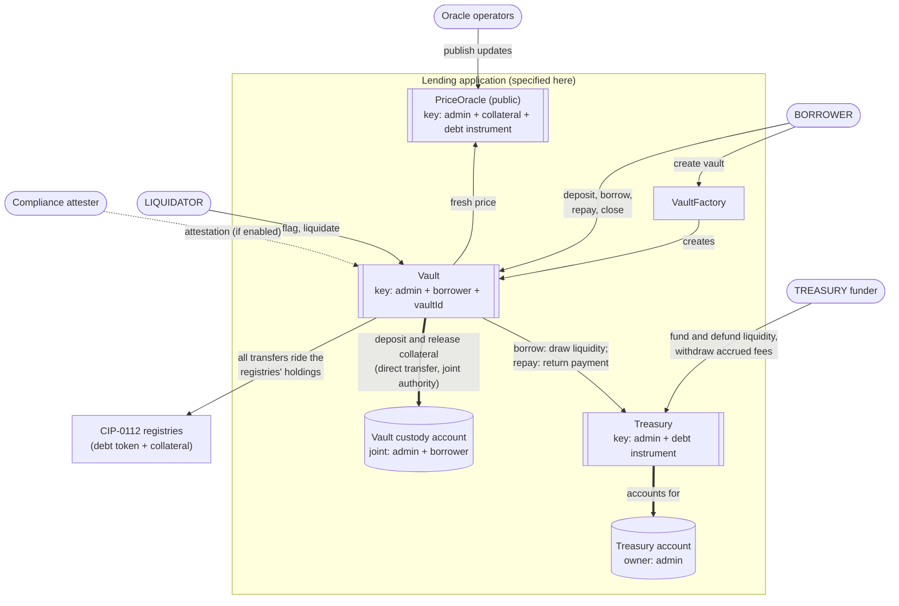
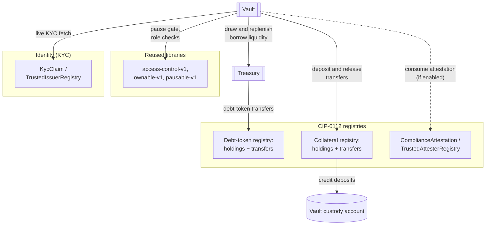
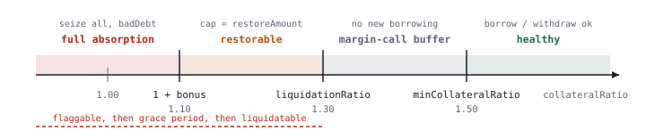
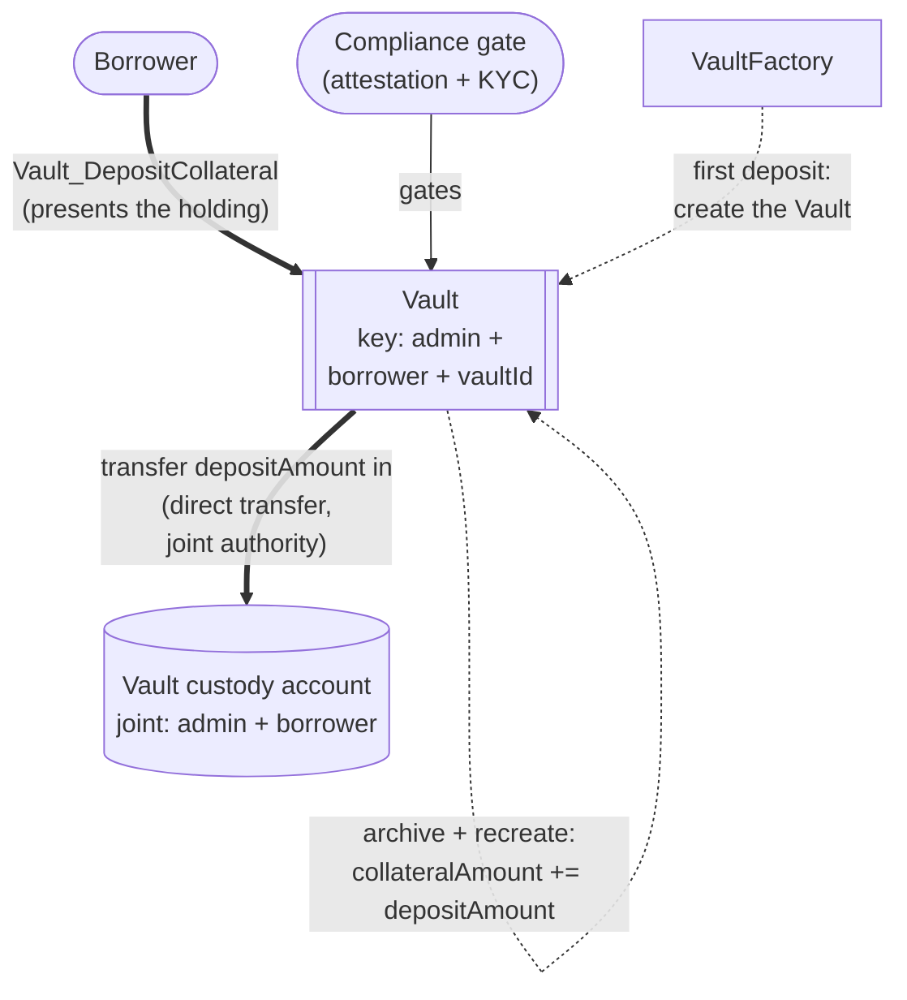
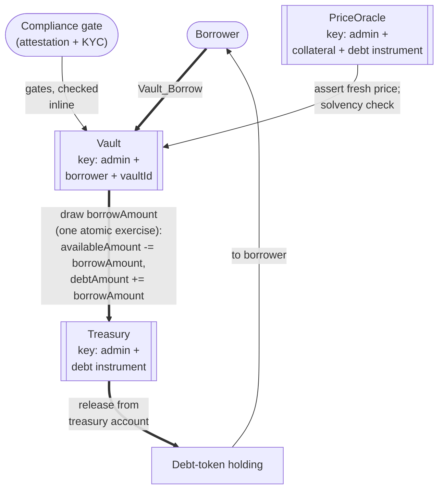
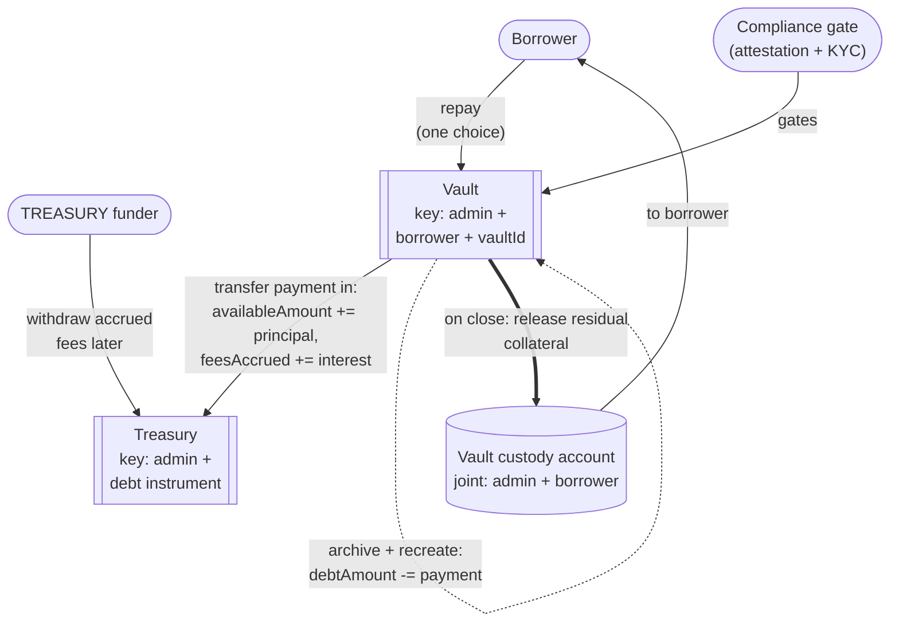
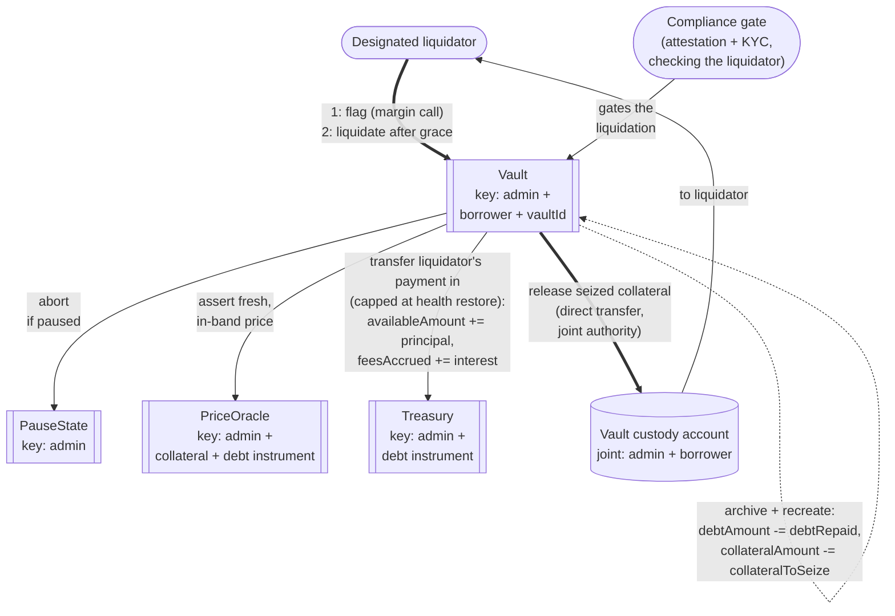
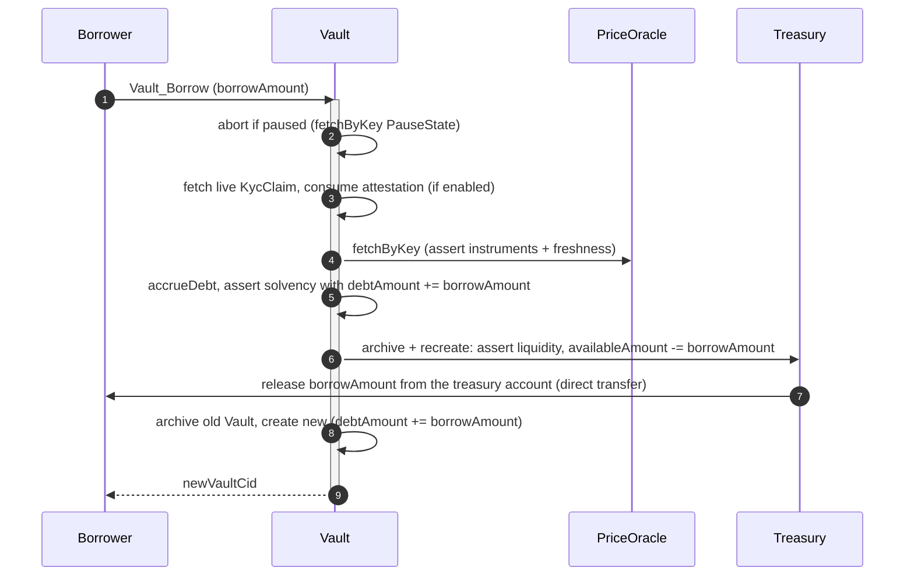
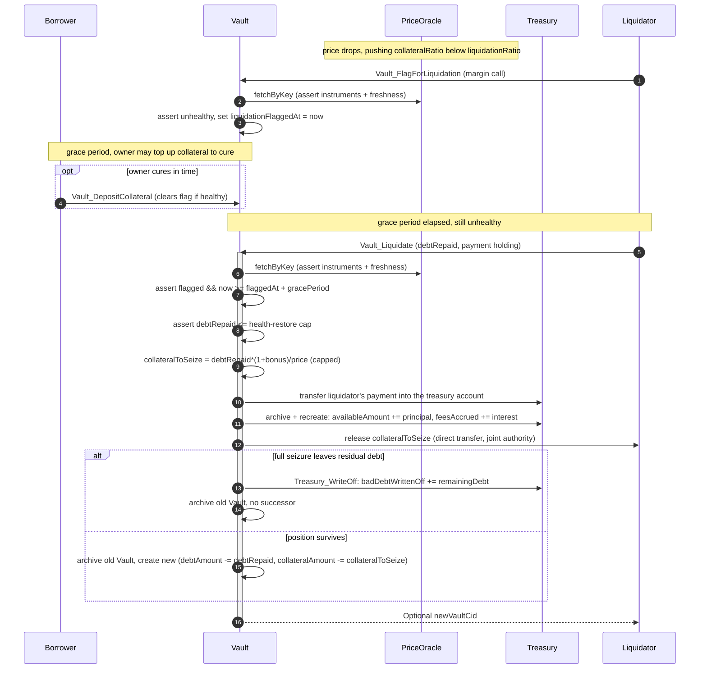

# Architectural Overview Report: Canton Reference Institutional Lending Protocol

This report defines a reference architecture for a vault-based,
overcollateralized institutional lending protocol on Canton. It composes
three kinds of material into one target application design: reusable
OpenZeppelin Daml components (access, ownership, pause), bounded experiments
for the token and identity mechanisms, and vault and oracle patterns
from companion OpenZeppelin projects, all settling through the Canton Network
Token Standard V2. The components and experiments are existing evidence; the
lending application that composes them is specified here and remains to be
built.

## 1. Product Definition

The product is a lending protocol for the Canton Network. Its core object is
the **Vault**: an isolated collateralized debt position (CDP), held as a
discrete Daml contract per position. Four properties
define the protocol:

- **Fixed-rate.** The `interestRate` is immutable for the life of a
  position; there is no utilization-based rate curve.
- **Open-term.** A position has no maturity date: it stays open until the
  owner repays and closes it, or it is liquidated.
- **Overcollateralized.** A borrower must lock collateral worth more than the
  debt it backs: borrowing keeps `collateralRatio` at or above
  `minCollateralRatio`, and a position that later falls under
  `liquidationRatio` becomes liquidatable. The surplus is the buffer that
  keeps the debt fully covered through collateral price movement.
- **Permissioned.** Every party acts under a verified identity:
  borrowers and liquidators must hold a valid `KycClaim` from an issuer in
  the `TrustedIssuerRegistry`, so no anonymous party can open, service, or
  liquidate a position. Value movements can additionally be gated by
  per-operation compliance attestations.

The design adapts the [`OpenZeppelin/canton-stablecoin`](https://github.com/OpenZeppelin/canton-stablecoin)
vault codebase and wires it onto [CIP-0112, the Canton Network Token Standard V2](https://github.com/canton-foundation/cips/blob/main/cip-0112/cip-0112.md).
Every asset is a holding co-signed by its own registry, and all value moves
through that registry's rails. Both instruments are ordinary TSv2 tokens: the
collateral and the **debt token** alike may be issued by any third party. A privileged funder (the
`TREASURY` role, often the vault admin itself or the
debt token's issuer) provisions the borrow liquidity: it deposits debt tokens
into a protocol **treasury** and
earns the interest as revenue; borrows draw from the treasury, repayments flow
back into it, and an exhausted treasury blocks new borrows.
Every movement must be atomic: a borrow checks solvency, then draws debt tokens against a matching debt increase; a repayment returns them against a matching decrease; a liquidation exchanges the liquidator's payment for the seized collateral in one transaction. Nothing
completes partially, and no intermediary holds the assets along the way.

Daml's transaction atomicity carries most of that on its own. Debt-token draws and returns, as well as collateral deposits and releases, all happen inside the vault choice itself, which already
carries the authority they need: the treasury account is owned by the vault admin, a vault signatory, and the payer signs as the choice controller. The interest portion of a payment accrues in the treasury as the funder's revenue. Collateral moves the same way: a deposit transfers the borrower's holding into the vault's custody account under the same in-choice authority, so no flow waits on a settlement counterparty or an asynchronous handshake.

Each mechanism is
independently evidenced: registry holdings and transfers and per-operation
attestations in
[`tokenCIP112-v1`](https://github.com/OpenZeppelin/canton-contracts/tree/7696749737885e25cd88422847105f890f03b00d/experiments/token/tokenCIP112-v1);
KYC claims validated against a trusted-issuer registry in the [identity packages](../../experiments/identity/);
role, ownership, and pause management in `openzeppelin-access-control-v1`,
`openzeppelin-ownable-v1`, and `openzeppelin-pausable-v1`.
This report composes them into one target lending application conforming to
Token Standard V2.

### Operational Scope and Boundaries

The target architecture favors **simplicity and modular extensibility**. The
tables below define its scope.

| Feature Category | In-Scope Architectural Components |
|---|---|
| Interest Model | A fixed, immutable `interestRate`; open-term positions with no maturity date. Accrual is **simple (non-compounding) interest** off the tracked principal ([section 3](#3-target-design)). |
| Core Flows | The five vault flows: **vault creation with collateral deposit**, **borrow**, **repay**, **liquidation**, and **close** (collateral return on a fully repaid position), plus the **treasury funding** flow that provisions and reclaims borrow liquidity. How each flow moves value is specified in [section 3](#3-target-design). |
| Asset Representation | Fungible digital assets compliant with the CIP-0112 Token Standard V2 holding interfaces. Both the debt token and the collateral may be issued by any third party: each is custodied and transferred, never minted or burned ([section 3](#3-target-design)). |
| Pricing | The keyed `PriceOracle` interface the vaults consume, naming both the collateral and quote instruments, with max-staleness and per-update deviation guards enforced by every price-dependent choice ([section 4](#44-component-price-oracle-interface)). Deploying a vault for an instrument pair presupposes that pair is priceable: the oracle mechanism must be able to produce a `price` for it, by a direct feed or by composing per-instrument feeds off-ledger before publishing. |
| Fees | Interest arrives in the treasury with the payment that carries it and accrues to the treasury funder as revenue. The `liquidationBonus` is the liquidator's seizure premium, paid from the borrower's collateral. The funder's treasury capital absorbs bad debt; the interest revenue is its compensation for that risk. |
| Compliance & Control | **Compliance attestation** (optional per deployment, [section 3](#compliance-is-re-checked-on-every-operation)): when the gate is enabled, no value-moving operation executes unless an attester has signaled compliance, re-checked per operation; attestation mentions elsewhere in this report assume the gate is enabled. **Identity verification**: single-synchronizer KYC. |
| Component Integration | Direct reuse of `openzeppelin-access-control-v1`, `openzeppelin-ownable-v1`, `openzeppelin-pausable-v1`, CIP-0112 holdings and transfers, as well as the vault, oracle, and identity patterns from the [`OpenZeppelin/canton-stablecoin`](https://github.com/OpenZeppelin/canton-stablecoin), [`OpenZeppelin/canton-token-template`](https://github.com/OpenZeppelin/canton-token-template) and [`ShapeB`](../../experiments/identity/hook-shape-b/daml/OpenZeppelin/Experimental/Identity/ShapeB.daml#L6) codebases. |

The compliance and control terms above are this report's names for three control requirements tracked externally under the IDs D1, D3, and D4: **compliance attestation** (D1), **know-your-customer identity** (D3), and **authority and privilege transfer** (D4). The report uses the names throughout and keeps the IDs only here, for traceability; each control is specified in [section 3](#3-target-design).

| Feature Category | Out-of-Scope Architectural Components |
|---|---|
| Interest Models | Dynamic, variable, or algorithmic rates, utilization rate curves, floating-rate oracles, and fixed maturity dates. |
| Leverage Facilities | Undercollateralized loans, flash loans, recursive leverage, and rehypothecation. |
| Liquidation Mechanics | Market-driven bidding-war auctions, and whole-vault forced seizure regardless of payment. |
| Liquidity Provision | Open, multi-party liquidity provision. The treasury has a single privileged funder; depositors sharing its fees are an extension ([section 3](#extension-points)), not part of this design. |
| Price Production | Producing the price is a dependency, not part of this design: the update mechanism or external oracle service is an implementation decision, consumed as-is provided it satisfies the interface requirements ([section 4](#44-component-price-oracle-interface)). Multi-asset dynamic oracles and off-ledger TWAP aggregators likewise remain outside this architecture. |
| Token Standard | Defining or extending the Token Standard V2 abstractions: the architecture consumes them as-is from upstream. CIP-56 and V1 allocation paths are outside this architecture. |
| Cross-Synchronizer Operation | Cross-synchronizer settlement and identity are **out of scope**; the architecture assumes a single synchronizer. |

### Target Ecosystem Participants

- **Institutional Asset Managers and Tokenized-Fund Issuers** can run high-value collateralized credit operations with deterministic outcomes and no public data leakage.
- **Asset Issuers and Large Token Holders** can put idle debt-token inventory to work as treasury liquidity, earning the protocol's interest revenue against solvency-checked, overcollateralized debt.
- **Wallet and Client Integrators** can build the borrower-facing wallet
  flows (deposit, borrow, repay, close) on the specified handshakes and
  per-party transfers.
- **Security and Assurance Auditors** can evaluate the authority boundaries,
  security invariants, trust assumptions, and residual risks stated in this
  report.

### Educational Framing: How to Think About Building a Lending Protocol on Canton

In the [ERC-4626](https://docs.openzeppelin.com/contracts/5.x/erc4626) lineage, one globally visible contract manages pooled liquidity, debt shares, and interest accrual for every party, broadcasting each one's collateral balance and liquidation threshold publicly.

Canton enforces **per-party projection** instead: a contract is an instance of a template, signed by a set of parties (its signatories) and visible only to them and to any observers. That is why each **vault is its own contract** rather than a share in a pool. A position is visible only to the borrower, the vault admin, the liquidators that police it, and any regulatory observers - and because visibility is a precondition for action, the liquidator set is declared as observers rather than left implicit.

State changes by archive-and-recreate rather than in-place mutation, with every signatory co-authorizing the transition (Daml's propose-and-accept pattern). That is why the design resolves the `Vault`, `PriceOracle`, `PauseState`, `Treasury`, and the trusted-attester and trusted-issuer registries by **contract key** (reintroduced in [Canton 3.5.1+](https://github.com/digital-asset/canton/releases/tag/v3.5.1)): a key is the identity that survives each recreate. Keys are not unique - the platform accepts two contracts sharing one - so uniqueness stays an application obligation. The vault creation should perform checks against duplicate positions.

Contract keys are supported on the network today and our production implementation will use them throughout. The experiment code referenced here predates the workspace's move to the 3.5.1+ SDK and is still keyless, so choices may take a caller-supplied registry contract id and assert it shares the factory's admin. The experiments and the existing components (such as `PauseState`) will migrate to by-key resolution with the SDK upgrade.

---

## 2. Architecture Overview

This section maps each component to its source, then defines the party/role topology and the trust configuration.

The two block diagrams below show the main components of the target
architecture; the table that follows maps each block to its source. Solid
edges are runtime interactions, dashed edges are standing governance or
trust relationships, and keyed contracts are marked with their key.

The first diagram shows the actors, the lending application's own contracts, and the rail-side components they touch:



The second shows the components the vault choices depend on, grouped by
source:



### Core Components and Library Mapping

Tags distinguish the source of each component: `[LIBRARY]` identifies a
library package in
[`OpenZeppelin/canton-contracts`](https://github.com/OpenZeppelin/canton-contracts),
`[EXPERIMENT]` identifies executable evidence in this repository
(`OpenZeppelin/canton-specs`), and `[REFERENCE]` identifies code in a
companion OpenZeppelin repository that informs the design.

| Component Suite | Applied Templates and Libraries | Architectural Function |
|---|---|---|
| Access Control `[LIBRARY]` | `openzeppelin-access-control-v1`: [`RoleGrant`](https://github.com/OpenZeppelin/canton-contracts/blob/cec416d6e3c2118551c761d5598c403ab27ee342/experiments/access/access-control-v1/daml/OpenZeppelin/AccessControlV1.daml#L58), [`RoleAdmin`](https://github.com/OpenZeppelin/canton-contracts/blob/cec416d6e3c2118551c761d5598c403ab27ee342/experiments/access/access-control-v1/daml/OpenZeppelin/AccessControlV1.daml#L116), [`DefaultAdminTransferOffer`](https://github.com/OpenZeppelin/canton-contracts/blob/cec416d6e3c2118551c761d5598c403ab27ee342/experiments/access/access-control-v1/daml/OpenZeppelin/AccessControlV1.daml#L237), [`requireRole`](https://github.com/OpenZeppelin/canton-contracts/blob/cec416d6e3c2118551c761d5598c403ab27ee342/experiments/access/access-control-v1/daml/OpenZeppelin/AccessControlV1.daml#L287) | Role-based permissioning for the vault admin, liquidators, oracle operators, and pausers. |
| Ownership Lifecycle `[LIBRARY]` | `openzeppelin-ownable-v1`: [`Ownership`](https://github.com/OpenZeppelin/canton-contracts/blob/cec416d6e3c2118551c761d5598c403ab27ee342/experiments/access/ownable-v1/daml/OpenZeppelin/OwnableV1.daml#L41), [`OwnershipOffer`](https://github.com/OpenZeppelin/canton-contracts/blob/cec416d6e3c2118551c761d5598c403ab27ee342/experiments/access/ownable-v1/daml/OpenZeppelin/OwnableV1.daml#L82) | Two-step handover of protocol administration. |
| Protocol Constraints `[LIBRARY]` | `openzeppelin-pausable-v1`: [`PauseState`](https://github.com/OpenZeppelin/canton-contracts/blob/cec416d6e3c2118551c761d5598c403ab27ee342/experiments/security/pausable-v1/daml/OpenZeppelin/PausableV1.daml#L47), [`whenNotPaused`](https://github.com/OpenZeppelin/canton-contracts/blob/cec416d6e3c2118551c761d5598c403ab27ee342/experiments/security/pausable-v1/daml/OpenZeppelin/PausableV1.daml#L77) | Emergency circuit breaker used by all critical flows. |
| CIP-0112 Token Registry `[LIBRARY]` | `OpenZeppelin.TokenCIP112V1`: [`TokenRules`](https://github.com/OpenZeppelin/canton-contracts/blob/7696749737885e25cd88422847105f890f03b00d/experiments/token/tokenCIP112-v1/daml/OpenZeppelin/TokenCIP112V1/Registry.daml#L28), [`TokenAllocationRequest`](https://github.com/OpenZeppelin/canton-contracts/blob/7696749737885e25cd88422847105f890f03b00d/experiments/token/tokenCIP112-v1/daml/OpenZeppelin/TokenCIP112V1/AllocationRequest.daml#L18), [`AllocationFactory_Allocate`](https://github.com/OpenZeppelin/canton-contracts/blob/7696749737885e25cd88422847105f890f03b00d/experiments/token/tokenCIP112-v1/daml/OpenZeppelin/TokenCIP112V1/Registry.daml#L280), [`TokenAllocation`](https://github.com/OpenZeppelin/canton-contracts/blob/7696749737885e25cd88422847105f890f03b00d/experiments/token/tokenCIP112-v1/daml/OpenZeppelin/TokenCIP112V1/Allocation.daml#L67), [`TokenEventLog`](https://github.com/OpenZeppelin/canton-contracts/blob/7696749737885e25cd88422847105f890f03b00d/experiments/token/tokenCIP112-v1/daml/OpenZeppelin/TokenCIP112V1/Base.daml#L75), [`TokenHolding`](https://github.com/OpenZeppelin/canton-contracts/blob/7696749737885e25cd88422847105f890f03b00d/experiments/token/tokenCIP112-v1/daml/OpenZeppelin/TokenCIP112V1/Holding.daml#L17), [`BurnerCapability`](https://github.com/OpenZeppelin/canton-contracts/blob/7696749737885e25cd88422847105f890f03b00d/experiments/token/tokenCIP112-v1/daml/OpenZeppelin/TokenCIP112V1/Allocation.daml#L52) | Demonstrates the holding and attestation mechanisms the flows ride. |
| Identity Verification `[EXPERIMENT]` | `ShapeB`: [`KycClaim`](../../experiments/identity/hook-shape-b/daml/OpenZeppelin/Experimental/Identity/ShapeB.daml#L43), [`TrustedIssuerRegistry`](../../experiments/identity/hook-shape-b/daml/OpenZeppelin/Experimental/Identity/ShapeB.daml#L74) | Demonstrates the four KYC-claim checks: the claim kind, a registry-listed issuer, the right subject, and an unexpired validity window. |
| Vault / CDP Core `[REFERENCE]` | [`OpenZeppelin/canton-stablecoin`](https://github.com/OpenZeppelin/canton-stablecoin): `Vault`, `VaultFactory`, `VaultParams`, `PriceOracle` | Provides the vault mechanics that inform this design. The target architecture uses simple interest, payment-proportional liquidation, and treasury-funded debt instead of the reference code's discrete compounding, whole-vault seizure, and minted stablecoin ([section 3](#3-target-design)). |

Token Standard V2 interfaces are the target asset interoperability
boundary; the `tokenCIP112-v1` package implements them directly against the
upstream splice interface packages.

### Party and Role Model Topology

Duties are segregated and mapped to discrete Daml parties:

- **Vault Admin (`VAULT_ADMIN`)** - operates the `VaultFactory` and the `Treasury`, configures `VaultParams`, the `TrustedIssuerRegistry` (accepted KYC issuers), and the `TrustedAttesterRegistry` (accepted compliance attesters). The admin owns the treasury account but issues nothing: it can mint neither instrument, and treasury liquidity moves only through the solvency-coupled vault choices and the funder's own fund and defund paths ([section 3](#the-treasury)).
- **Treasury Funder (`TREASURY`)** - the privileged party that provisions borrow liquidity: it deposits debt tokens via `Treasury_Fund`, reclaims un-borrowed liquidity and accrued fees via `Treasury_Defund`, and earns the protocol's interest revenue in return. Its capital absorbs bad debt, compensated by the interest revenue. The role is typically the vault admin itself, the debt token's issuer, or a large holder; opening it to multiple independent liquidity providers is an extension ([section 3](#extension-points)).
- **Borrower (`BORROWER`)** - the entity locking collateral and drawing debt. Only the borrower can commit their own holdings as collateral. To interact with the protocol, the borrower must hold a valid `KycClaim`, verified at vault creation and fetched live by each risk-increasing vault choice. Visibility is limited to the borrower's own vaults and the public configuration contracts.
- **Liquidator (`LIQUIDATOR`)** - a role granted via `openzeppelin-access-control-v1`. Each liquidator is an observer of the vaults it polices, so it can monitor the `PriceOracle` and vault solvency from its own projection; it may only liquidate a vault that is still unhealthy after the margin-call grace period, and only in proportion to the debt tokens it repays.
- **Oracle Operator(s) (`ORACLE_PROVIDER`)** - the implementation-defined party set that updates the `PriceOracle`, bound by the interface requirements ([section 4](#44-component-price-oracle-interface)): no single party, not even the vault admin, should be able to move or stall the published price.
- **Vault Custody Account** - owns the collateral holdings that back a vault; there is **one custody account per vault**, so collateral is never commingled across positions. It is held under the vault's **joint authority** ([trust topology](#decentralization-and-trust-topology)), and collateral leaves it only through the choices that release it (withdrawal, close, liquidation).

The topology separates public market data from private positions: the `PriceOracle` carries a broad observer set so participants can independently verify the price path; the `VaultFactory` terms and the `Treasury`'s available liquidity reach prospective borrowers through explicit disclosure; and each `Vault` restricts visibility to its signatories (vault admin and borrower) plus a minimal observer set: the designated liquidators and any regulatory observer parties.

### Decentralization and Trust Topology

Canton decentralizes a party along three independent axes, and the design assigns each role a deliberate position on each:

1. **governance** - whose signatures can change the party's identity and hosting (re-home the party to their own participant node and act freely);
2. **validation** - how many independent participant nodes must confirm the party's transactions (the `PartyToParticipant` confirmation threshold; a threshold above 1 defends against a malicious participant node, at a latency and cost premium, and such a party can no longer submit Ledger API commands directly - it acts through externally signed submissions or through choices submitted by others);
3. **authorization** - what the Daml signatory/controller topology requires regardless of hosting.

Two roles hold value-moving authority as a single party: the vault admin,
whose account custodies the treasury liquidity, and the treasury funder.
For each, we envision the
EVM equivalent of an N-of-M multisig: no single key may exercise the party's
authority. Canton offers two ways to implement the multisig; selecting one remains an open question ([section 7](#7-open-design-questions)):

- **On-ledger approval workflow** - the multisig is written in Daml ([Multiple Party Agreement](https://docs.canton.network/appdev/modules/m3-design-patterns#multiple-party-agreement)): approvers record approvals as contracts, and the final choice executes under the role party's inherited authority only once a threshold of approvals exists. Approvals are durable, named, and auditable on-ledger.
- **External party with threshold signing keys** - the role party's transactions require signatures from N of M keys (`PartyToParticipant`), held by independent organizations. Invisible to the Daml code and a single ledger transaction per action, but the signing ceremony must complete within the prepared transaction's validity window, and the approval record stays off-ledger. The implementation could leverage something like the [Bitsafe decentralization-manager](https://github.com/DLC-link/decentralization-manager).

We envision the vault custody account as a registry `Account`
with the borrower as owner and the vault admin as provider, so every holding
it contains is co-signed by both. Moving collateral outside the vault's
choices would therefore require the borrower plus the admin quorum; inside
the vault's choices both signatures arrive automatically, inherited from the
`Vault`'s own signatories.

For roles that need to submit routinely and are not of critical importance, we envision keeping the confirmation threshold at 1, with each such role's powers bounded on-ledger. The treasury funder provisions the protocol's liquidity and collects its revenue, so its confirmation threshold is above 1: no single compromised key or participant node can act for it.

Whatever update mechanism the **oracle operators** run ([section 4](#44-component-price-oracle-interface)), an all-of-M quorum should be deliberately avoided: a single offline member, or one whose participant node has unvetted the protocol DAR, would stall every price update until the staleness guard freezes the protocol.

The **pause authority** is multi-hosted so the brake is always reachable, but its confirmation threshold stays at 1: an emergency stop must be instant, and a quorum would slow it down. The price of that choice is griefing: a malicious pauser can freeze the protocol's flows, though no funds are ever stranded and everything resumes when the pause lifts. This griefing is not solvency-neutral: it can freeze liquidation while collateral keeps repricing, an exposure tracked in [section 7](#7-open-design-questions).

The **liquidator** set should contain several independently granted parties, so liquidation liveness never hinges on one keeper: any designated liquidator may flag or complete a liquidation.

**Borrowers** need no protocol-side decentralization: outside the custodied collateral they only ever trust their own keys and their own participant node.

---

## 3. Target Design

### The CDP Math

Two figures track a position: `principalAmount` is the debt tokens drawn from the treasury and not yet repaid, and `debtAmount` is what the borrower owes - that principal plus the interest accrued on it - so `principalAmount <= debtAmount` always. A vault's health is its **collateral ratio**: `collateralRatio = (collateralAmount · price) / debtAmount`, priced by the `PriceOracle`. Borrowing and collateral withdrawal must keep the ratio at or above `VaultParams.minCollateralRatio`; falling below the `liquidationRatio` exposes the position to a margin call.

The vault utilizes **simple interest accrual**: `accrueDebt` computes `newDebt = oldDebt + principalAmount · interestRate · elapsedYears`, where `elapsedYears` derives from `now - lastAccrualTime`. Accrual runs on every state-changing choice before the solvency check, and `lastAccrualTime` resets on each recreation. Because interest is always charged on the principal, it does not matter how often accrual runs: two accruals over `t₁` and `t₂` add exactly what one accrual over `t₁+t₂` would; whether a compounding variant is also needed is an open question ([section 7](#7-open-design-questions)).

**Liquidation arithmetic (payment-proportional, health-restoring).** Two bounds govern every liquidation pass: the collateral released is proportional to the payment, and the payment is capped at exactly what returns the vault to health.

```text
-- Seizure is proportional to the payment:
collateralToSeize = min(collateralAmount, debtRepaid · (1 + liquidationBonus) / price)

-- The smallest repayment that lifts the ratio back to minCollateralRatio:
restoreAmount = (minCollateralRatio · accruedDebt - collateralAmount · price)
                / (minCollateralRatio - 1 - liquidationBonus)

-- The payment cap, by regime:
repayCap = if collateralRatio > 1 + liquidationBonus
           then restoreAmount                                      -- restorable
           else collateralAmount · price / (1 + liquidationBonus)  -- full absorption

debtRepaid <= repayCap
```



Taking each element of the codeblock in turn:

- **Proportional seizure.** `debtRepaid` is the amount the liquidator's own exercise pays into the treasury in the same transaction, never the vault's full accrued debt, so a liquidator can never take more collateral than their payment (plus bonus) buys.
- **Restorable vault (`collateralRatio > 1 + liquidationBonus`).** Repaying `x` reduces the debt to `accruedDebt - x` and the collateral value to `collateralAmount · price - x · (1 + liquidationBonus)`. While the ratio sits above `1 + liquidationBonus`, every such repayment raises it, so the vault can be cured. `restoreAmount` is the exact `x` that brings the ratio back to `minCollateralRatio`, and it caps the payment: a smaller `debtRepaid` moves the vault partway back to health, one equal to `restoreAmount` restores it fully, and the choice rejects anything larger, so a liquidation never repays or seizes more than the cure requires. The restore target is `minCollateralRatio` rather than `liquidationRatio`, so a cured vault lands inside the margin-call buffer instead of restarting on the liquidation boundary.
- **Underwater vault (`collateralRatio <= 1 + liquidationBonus`).** No repayment can restore health, so the cap becomes what the remaining collateral can pay for: the pass seizes all of it, writes the uncovered remainder off against the treasury as bad debt, and closes the position, so no zero-collateral vault survives.
- **Well-definedness.** Protocol configuration requires `minCollateralRatio > liquidationRatio > 1 + liquidationBonus`. The first gap is the margin-call buffer; the second keeps the restorable regime reachable, so a freshly flagged vault can still be partially cured; and the chain keeps `restoreAmount`'s denominator positive and its value within what the collateral supports.

### Data and State Flow

The diagrams below show the four vault flows: **A** collateral deposit, **B** borrow, **C** repay and close, **D** margin call and liquidation. Every flow is atomic: each executes as a single ledger transaction that commits in full or not at all, and every value movement is a direct transfer under authority the vault choice already carries: deposits and payments transfer in (into custody and the treasury respectively), and everything the protocol releases (borrowed debt tokens, returned or seized collateral) transfers out. In each diagram, the `Compliance gate` node stands for the compliance-attestation check and the live KYC-claim fetch ([section 3](#compliance-is-re-checked-on-every-operation)), and keyed contracts are marked with their key.

**A. Collateral deposit.** The borrower presents the collateral holding they are locking; the vault choice transfers it into the vault's custody account, and the vault's own record of how much collateral backs the position grows by the same amount. The first deposit goes through the `VaultFactory` instead: creation transfers it identically, but creates the `Vault` rather than updating one ([section 4.1](#41-component-vaultfactory-and-vault-creation)).



**B. Borrow (treasury draw coupled to debt).** The borrower asks the vault for debt tokens; the vault checks compliance, reads the current price, checks the treasury holds enough un-borrowed liquidity, and assesses whether the locked collateral is worth enough to cover the new debt. If so, it draws the tokens from the treasury to the borrower and records the higher debt, all in one transaction: the treasury account's owner and the borrower both already stand behind the vault, so the vault choice itself carries every signature the draw needs. An exhausted treasury blocks this flow and only this flow.



**C. Repay and close.** Two separate choices serve this flow. **Repay** pays down debt: the vault checks compliance, transfers the payment out of the borrower's wallet into the treasury account, and records the lower debt: the principal portion replenishes the treasury's borrowable liquidity, and the interest portion accrues to its `feesAccrued`. **Close** winds down a repaid position: it hands the remaining collateral back to the borrower in one transaction. No quote step is needed: accrual is deterministic and the borrower sees the vault, so its wallet computes the exact payoff itself. A wallet that wants a one-shot exit submits repay and close in a single command, and the pair commits atomically. The treasury funder withdraws its accrued fees on its own schedule.



**D. Margin call and liquidation.** A designated liquidator flags the unhealthy vault, which opens the borrower's cure window. Once the grace period passes and the position is still unhealthy, the liquidator triggers the liquidation: at the current oracle price, the vault transfers the liquidator's debt-token payment straight from its wallet into the treasury (capped at what restores health; principal replenishes liquidity, interest accrues to fees), hands the liquidator seized collateral worth the payment plus the liquidation bonus, and records the reduced debt and collateral.



### The Vault Flows: Step by Step

This walkthrough names the concrete choices behind the flows:

1. **Treasury funding.** The funder provisions borrow liquidity with `Treasury_Fund`, transferring debt tokens into the treasury account and raising its `availableAmount`; `Treasury_Defund` reclaims un-borrowed liquidity and accrued fees.
2. **Vault creation and deposits.** The borrower presents a collateral holding to `VaultFactory_CreateVault`, which checks the KYC claim, transfers the initial collateral into the custody account, and instantiates the `Vault` with the deposited `collateralAmount`. Top-ups use `Vault_DepositCollateral`; `Vault_WithdrawCollateral` releases collateral back as long as the solvency check passes.
3. **Borrow.** `Vault_Borrow` consumes the compliance attestation, fetches the live `KycClaim`, ensures the treasury's `availableAmount` covers the the request, and requires that existing plus requested debt keeps `collateralRatio` at or above `minCollateralRatio` at a fresh `PriceOracle` reading, before drawing the tokens from the treasury to the borrower and incrementing `debtAmount`.



4. **Repay and close.** `Vault_Repay` transfers the payment into the treasury account, reduces `debtAmount`, and updates the `Treasury` by key: liquidity up by the principal portion, `feesAccrued` up by the interest portion. `Vault_Close` winds the fully repaid position down, releasing the residual collateral.
5. **Margin call and liquidation.** `Vault_FlagForLiquidation` opens the grace window; once it elapses on a still-unhealthy vault, `Vault_Liquidate` names `debtRepaid` (capped by the health-restore formula), consumes a compliance attestation checking the liquidator, transfers the payment into the treasury, and releases the proportional collateral. It recreates the residual `Vault`, unless a full seizure leaves residual debt: then it writes the remainder off against the treasury and closes the position.


### Execution Model

In an EVM lending pool every action is one synchronous transaction against
shared state. The Canton flows decompose into a sequence of ledger commands,
but almost every flow here is **single-driver**: one party submits each of
its steps back-to-back, the counterparty authorities (the vault admin's, the
instrument admin's) are carried by contract signatories rather than requested
live, and the cross-party dependencies on the critical path are the
automated attester and the price: a
price-dependent choice reads the standing published price with no operator
involvement, but blocks on the operators' next publish if it has gone stale.
A client that submits and waits per command therefore
experiences each flow as a synchronous sequence completing in seconds.
Every value-moving step is a single atomic exercise.

Step-by-step execution, per flow:

| Flow | Step | Submitter | Interaction |
|---|---|---|---|
| Deposit / creation | transfer the collateral into the vault's custody account, creating or updating the vault | borrower | async: may wait for the compliance attestation |
| Borrow | draw debt tokens from the treasury against the vault's collateral | borrower | async: may wait for a stale price to update and for the compliance attestation |
| Treasury fund / defund | provision borrow liquidity, or reclaim it plus accrued fees | treasury funder | on its own cadence, no involvement from another actor; the funder's confirmation threshold >1 routes each submission through external signing |
| Withdraw | release collateral above the solvency floor | borrower | async: may wait for a stale price to update and for the compliance attestation |
| Close | wind down a repaid position, releasing the residual collateral | borrower | sync: borrower alone; direct transfer |
| Liquidation | 1. flag the vault (the margin call) | liquidator keeper | sync: keeper alone; opens the grace period |
| Liquidation | 2. liquidate: pay into the treasury, seize collateral | liquidator keeper | keeper alone, once the grace period lapses uncured; may wait for a stale price to update and for the compliance attestation |
| Oracle publish | publish a price update | oracle operators (implementation-defined) | async: on the operators' cadence |

Assumptions and important notes:

- The oracle publish will likely be a multi-party ceremony on its own cadence,
  and a price-dependent choice that loses the race against a publish is simply retried: the oracle is re-resolved by key, so the retry runs against the fresh price with no client-side rewiring.
- Custody-held keys turn any synchronous step asynchronous: a signature that
  routes through an external custodian's approval flow comes back as a
  prepared transaction, bounded by the 24h window
  ([the time model below](#time-model-and-deadlines)).

**Progress tracking.** The borrower client and the keeper track each
flow by command id: a step that neither commits nor rejects times out against
its deadline and marks the workflow stuck, raising an alert with the pending
step.
[Section 5.3](#53-failure-modes-and-recovery) enumerates the stuck states and
their exits.

### Time Model and Deadlines

Canton features the protocol must account for:

- Ledger time is accurate only to 60 seconds. Every deadline check is fuzzy by that much, hence sub-minute deadlines
  should be avoided.
- Externally signed (prepared) transactions must be submitted within 24h by
  default: any leg signed by an external party must complete prepare, sign,
  submit inside that window.
  [CIP-0107](https://github.com/canton-foundation/cips/blob/main/cip-0107/cip-0107.md)
  exposes the
  same window.
- Attestations are single-use with a short validity window ([section 3](#compliance-is-re-checked-on-every-operation)): a gated flow must land inside the window of the attestation it consumes.

Time budgets are set per flow, not globally:

| Flow | Slowest actor | Time budget | Rationale |
|---|---|---|---|
| Collateral deposit | the borrower, one direct transfer | seconds; extend toward the 24h prepared-transaction ceiling only when the borrower signs through an external custodian | the transfer carries only authority already present in the choice; not price-sensitive, and compliance is checked inline |
| Oracle publish | oracle operators, automated | minutes (`maxStaleness`) | the staleness guard rejects slow publishes and the circuit breaker trips on gaps |

Consequence for the attestation gate: attestations are
automated and issued just-in-time, and their validity window
must cover the client's submission time. The margin-call grace window ([section 3](#margin-call-a-grace-period-before-liquidation))
is measured in ledger time, so it must exceed the 60s tolerance by a wide
margin.

### Collateral is Custodied

Both instruments are only ever transferred, never minted or burned: deposits and withdrawals move collateral between the borrower and the vault custody account under the vault's joint authority, and borrows and repayments move the debt token between the borrower and the admin-owned treasury account (the treasury). The protocol therefore needs issuing authority over neither instrument, and third-party-issued assets (a custodian bank's deposit token, a tokenized treasury bill) are compatible. 

No flow waits on a receiver acceptance or a settlement counterparty: the sender signs as the choice's controller, and the receiving account's owners are already among the choice's authorizers.

**Direct-transfer assumption.** Every flow relies on the instruments' registries supporting a transfer that completes under exactly that in-choice authority. The capability can break for a registry that interposes its own asynchronous step, such as a registrar acceptance or a pending state resolved by registry automation. Such an asset still integrates, but its legs split in two: the vault transaction issues the instruction, and the asset arrives when the registry's step lands. For deposits, borrows, and repayments that split breaks single-transaction atomicity, so both instruments should support direct transfer under account-owner authority.

**Collateral amounts vs. actual holdings.** The `Vault`'s `collateralAmount` is a `Decimal` accounting figure; the real value lives in TSv2 holdings owned by that vault's own custody account. Every flow moves holdings into or out of that account in the same transaction that updates the accounting figure, so **`collateralAmount == Σ(custody-account holdings)` per vault** cannot drift within a transaction. Deposit, withdrawal, and liquidation each pin their collateral movement to the vault's own custody account - the deposit leg must deliver into it, and every release draws from it - so the accounting can never move without the matching holdings moving. The caveat is *fragmentation*: repeated top-ups accumulate many small holdings in a custody account, so a periodic **consolidation** step (merging the account's holdings for the instrument into one, leaving `collateralAmount` unchanged) keeps transfers cheap.

### The Treasury

Borrow liquidity lives in the **treasury**: a debt-token account owned by the vault admin, fronted by a keyed `Treasury` contract `(vaultAdmin, debtInstrumentId)` carrying the accounting: `availableAmount`, the un-borrowed liquidity; `feesAccrued`, the funder's collected interest; and `badDebtWrittenOff`, the funder's recognized losses. The privileged `TREASURY` funder provisions it with `Treasury_Fund` and reclaims un-borrowed liquidity and revenue with `Treasury_Defund`; in exchange it earns the protocol's interest, and its capital absorbs any bad debt.

Admin ownership of the account is what keeps every flow a single atomic exercise: the admin signs each `Vault`, so a borrow releases treasury holdings under authority the vault choice already carries, and a repayment or liquidation payment transfers in with the payer signing as the choice's controller. Borrow asserts `availableAmount` covers the request and decrements it; **an exhausted treasury blocks new borrows** - repay, close, withdraw, and liquidation never depend on treasury liquidity. The same accounting-equals-holdings discipline as collateral applies: `availableAmount + feesAccrued == Σ(treasury-account holdings)`, updated in the same transaction as every movement.

Because the funds sit in an admin-owned account, the funder's protection is structural rather than custodial: the admin party is an N-of-M quorum ([section 2](#decentralization-and-trust-topology)), and treasury outflows are reachable only through the solvency-coupled borrow choice and the funder-controlled defund, up to the quorum's custodial residual ([section 5.1](#51-security-invariants)). Extending the treasury to multiple independent liquidity providers (depositors sharing `feesAccrued` pro rata) is a future extension ([extension points](#extension-points)), not part of this design.

Pooling liquidity also makes the `Treasury` the protocol's serialization point: every debt-token movement recreates it. [Section 5.4](#54-throughput-and-contention) details the contention and the treasury account's holding split policy.

### Fees Accrue to the Treasury

The debt paid on repay, close, or liquidation is `principal + accrued interest`; every payment transfers into the treasury account in full. The principal portion replenishes `availableAmount`, immediately borrowable again, and the interest portion accrues to `feesAccrued`: the funder's revenue, withdrawn on its own schedule via `Treasury_Defund`. Interest is the funder's compensation for capital at risk: a liquidation shortfall is written off against the treasury.

Borrowers acquire the debt tokens they owe as interest on the open market, like any other asset; a borrower's repayment capacity is never bounded by the protocol's own liquidity.

### Margin Call: a Grace Period Before Liquidation

On a public chain, a collateral top-up racing a liquidation is decided by gas and ordering luck. Canton has no public mempool, so the design makes the borrower's cure window explicit and deterministic instead. Liquidation is two-phase:

1. **Flag.** When `collateralRatio < liquidationRatio`, any designated liquidator may exercise `Vault_FlagForLiquidation`, which records `liquidationFlaggedAt` and derives a grace deadline from the protocol-set `gracePeriod` in `VaultParams`. This is the margin call; it moves no value.
2. **Cure or liquidate.** During the window the borrower may deposit collateral or repay to restore the ratio, which clears the flag. `Vault_Liquidate` asserts the vault is flagged, the grace period has elapsed, and the vault is still unhealthy, so a liquidator can never pre-empt the cure window, and a borrower who does nothing is liquidated deterministically once it closes. A partial liquidation that leaves the vault unhealthy preserves the original flag time, so the position is immediately re-liquidatable rather than granted a fresh window per pass; a partial liquidation that makes the vault healthy will also clear the flag.

### Compliance is Re-checked on Every Operation

The KYC gate at vault opening is necessary but not sufficient: a borrower can lose good standing after opening. Two distinct layers keep a position compliant. For identity, each risk-increasing vault choice (borrow, collateral top-up, withdrawal) fetches the borrower's live `KycClaim` and re-checks it: the claim must be unexpired and its issuer still listed in the `TrustedIssuerRegistry`. Revocation is the issuer archiving the claim or being delisted from the registry; either blocks new borrows, top-ups, and withdrawals immediately. The compliance-attestation gate is configured per deployment: `VaultParams` carries an optional trusted-attester registry reference. When enabled, each flow (deposit, borrow, repay, liquidation, withdrawal) consumes one single-use attestation inline, fail-closed, with no caching, so every flow sits behind the same gate. With the gate disabled, no flow waits on an attester and compliance rests on the identity layer alone.

Deliberately, the borrower's continued compliance is **not** a precondition for winding the position down: on repay and close the borrower is reducing risk, so those flows do not gate on the borrower's attestation standing (the attestation covers the operation, not the repaying borrower's status), and on the liquidation legs it is the liquidator's compliance that is checked. A now-non-compliant position can always be repaid or liquidated, never trapped, and never dependent on an attester's willingness to re-attest the borrower.

### Oracle Handling: Staleness Guard and Circuit Breaker

A single trusted price feed plus a single liquidator would be the largest live attack surface, so the design hardens the price path:

- **Named quote instrument.** `PriceOracle` carries a `debtInstrumentId` alongside `collateralInstrumentId`, so `price` is unambiguously "units of the debt token per unit of collateral". Consumers assert both ids match the vault's.
- **No single writer on the oracle.** The oracle interface forbids any single party - the vault admin included - from publishing a price alone, so a lone compromised admin cannot move the price and manufacture liquidations. The concrete update quorum is implementation-defined ([section 4](#44-component-price-oracle-interface)).
- **Max-staleness guard.** Every price-dependent choice rejects when `now - updatedAt > maxStaleness`, so a stalled feed cannot drive liquidations or fresh borrows against a dead price.
- **Per-update deviation circuit breaker.** Updates are bounded against the oracle's own `maxDeviation` field; an out-of-band move aborts the update, so the last in-band price stands.

### Know-Your-Customer Identity

The target architecture uses a single-synchronizer identity model. A borrower
holds a `KycClaim` issued by a party in the `TrustedIssuerRegistry`; vault
creation verifies the claim, and each risk-increasing vault choice fetches its
current ledger state. The Shape B experiment demonstrates the claim checks in
isolation. Integrating those checks into the vault remains part of the target
application design.

### Authority and Privilege Transfer

Institutional lending requires administrative power to be explicit and accountable: every privileged action traces to a named authority. There is no single admin holding every privilege. Each action sits with the role responsible for it: treasury releases with the `VAULT_ADMIN`, reachable only through the solvency-coupled vault choices; liquidity provisioning and fee withdrawal with the `TREASURY` funder; liquidation with the `LIQUIDATOR`; price publication with the oracle operators; and the emergency brake with the `PAUSER`. These privileges are granted, transferred, and revoked through `openzeppelin-access-control-v1` role administration and the `openzeppelin-ownable-v1` two-step ownership handover, so authority can move between parties without redeploying.

### Smart Contract Upgrade Process

The lending application will use Smart Contract Upgrade (SCU) for additive
changes to its own packages. An additive release will keep the package name,
raise the version, set `upgrades:` to the prior deployed DAR, and only append
`Optional` fields to existing templates, records, and choice arguments; the
[Canton SCU guide](https://docs.canton.network/appdev/deep-dives/smart-contract-upgrade)
defines the remaining compatibility rules. SCU preserves a representable data
shape, not loan economics.

Every release will first define what each new `Optional` field means for a v1
`Vault`, `VaultParams`, `Treasury`, and oracle record: v1 contracts read as
`None` under v2 code, but a v2 record carrying `Some` may not be usable by an
old, exact-version workflow. The release will test both directions: v1
positions under the v2 implementation, and the expected rejection of an old
client facing populated v2 data.

As a worked example, take a new per-vault debt ceiling.

Adding a new, hardened borrow choice is not enough: the existing `Vault_Borrow`
stays callable, so the ceiling would be optional. The v2 release therefore
changes the body of `Vault_Borrow` itself to enforce a ceiling stored as a new
`debtCeiling : Optional Decimal` on `VaultParams`. Existing params read as `None` under v2 code, so the release must
state what `None` means: an uncapped grandfathered vault, a defined
conservative cap, or a vault that must migrate before borrowing again.

The populated field is also what retires the old code path. SCU does not delete
the v1 DAR: while it stays vetted, a caller can pin the old package id and run
the old choice body, so a deprecation marker is not an access control. Once
`VaultParams` is recreated with `Some ceiling`, its data no longer downgrades
to a v1 view, so the old `Vault_Borrow` cannot execute against it.
Liquidation fixes follow the same principle: the fix lands in the body of the
existing liquidation path, and binding every caller needs the same data-level
cutoff or the breaking-change path below.

Changes to interest accrual, fee allocation, collateral valuation, or the
liquidation terms will require a separate economic decision: new vaults can
carry revised terms, and existing borrowers keep theirs unless they consent to
migrate. A change to parties, keys, custody, or a policy that must be unusable
for every caller is breaking: a separately named package and template, with
active positions migrated during a maintenance window.

Before release, the operators will run `dpm build` with the `upgrades:`
lineage and `dpm upgrade-check --both`, vet the DARs at the affected
participants, switch services and wallets together to the target package
preference, and exercise borrow, repay, withdraw, liquidation, oracle update,
and emergency recovery on LocalNet against live v1 positions.

### Extension Points

Protocol-level extensions the architecture supports follow the classification
above. They use SCU only when they preserve the data and economics of live
positions:

- **Debt ceilings.** A per-vault `Optional` cap in `VaultParams` and an aggregate ceiling on the `VaultFactory`, enforced by the target implementation of `Vault_Borrow`; bounds the damage of a bad price or a bad borrower. The design states the legacy `None` policy before deployment ([section 7](#7-open-design-questions)).
- **Compounding interest variant.** A new immutable terms revision for vaults that select discrete compounding. It does not retroactively alter the accrual terms of an existing vault; currently tracked as an open design question ([section 7](#7-open-design-questions)).
- **Liquidity providers.** Opening the treasury to multiple independent depositors: each funds debt tokens, shares `feesAccrued` and splits the risk with the rest.

---

## 4. Sample Component Structure

The code below is illustrative Daml for the target design, not source from an
end-to-end implementation. It highlights the flows while omitting non-essential
checks and supporting definitions. Helpers such as `accrueDebt` (adapted here to
simple interest off the principal, [section 3](#3-target-design)),
`collateralRatio`, `liquidationRepayCap` (the section 3 cap formulas),
`releaseFromCustody`, and the `require*` checks are informed by the
`[REFERENCE]` codebase and appear here as illustrative imports. Module
imports and `ensure` blocks (field sanity bounds such as non-negative
amounts and `principalAmount <= debtAmount`) are likewise omitted.

### 4.1 Component: VaultFactory and Vault Creation

The `VaultFactory` is the vault admin's standing vault-creation offer: an
admin-signed contract carrying the terms (`VaultParams` and the
instrument pair), reaching prospective borrowers through explicit disclosure.
A borrower creates their vault unilaterally. Creation is pause- and KYC-gated, transfers the
initial deposit into custody in the same transaction (a vault is never created
empty), and duplicate `(vaultAdmin, borrower, vaultId)` vaults are rejected
by an application-level check, since 3.5.1 contract keys are not unique.
`requireNoExistingVault`, `requireLiveKycClaim`,
`requireJointAccount`, and `requireCollateralHolding` (the presented holding
carries a positive `initialCollateral` of the collateral instrument) are
illustrative helpers in the style of section 4.2; `transferIntoCustody`
mirrors `releaseFromCustody`.

```daml
template VaultFactory
  with
    vaultAdmin : Party
    params : VaultParams
    collateralInstrumentId : InstrumentId
    debtInstrumentId : InstrumentId
  where
    signatory vaultAdmin
    key vaultAdmin : Party
    maintainer key

    nonconsuming choice VaultFactory_CreateVault : ContractId Vault
      with
        borrower : Party
        vaultId : Text
        custodyAccount : Account
        initialCollateral : Decimal
        kycClaimCid : ContractId KycClaim
        collateralHoldingCid : ContractId TokenHolding
        attestationCid : Optional (ContractId ComplianceAttestation)
          -- ^ Required when `params` configures the attester registry.
      controller borrower
      do
        now <- getTime
        (_, pause) <- fetchByKey @PauseState vaultAdmin
        whenNotPaused pause
        requireNoExistingVault vaultAdmin borrower vaultId
        requireLiveKycClaim kycClaimCid borrower vaultAdmin
        requireJointAccount custodyAccount vaultAdmin borrower
        requireAttestation params attestationCid borrower vaultAdmin
        -- The borrower's wallet pre-splits the holding to exactly
        -- `initialCollateral`; the deposit transfers it whole into custody.
        _ <- requireCollateralHolding collateralHoldingCid
               collateralInstrumentId initialCollateral
        _ <- transferIntoCustody custodyAccount collateralHoldingCid
               collateralInstrumentId initialCollateral

        create Vault with
          vaultAdmin; borrower; vaultId
          collateralInstrumentId; debtInstrumentId
          collateralAccount = custodyAccount
          collateralAmount = initialCollateral
          debtAmount = 0.0
          principalAmount = 0.0
          params
          lastAccrualTime = now
          liquidationFlaggedAt = None
```

### 4.2 Component: Vault State, Margin Call, and Liquidation

The `Vault` holds one borrower's CDP state. The state-update logic lives **here**, as consuming choices controlled by the relevant role, which archive this `Vault` and recreate the successor with updated figures. The `Vault` carries a contract key `(vaultAdmin, borrower, vaultId)`, so consumers reference a position by its stable identity rather than by a cid that changes on every operation. Liquidation is **pause-gated** and **margin-called**: it resolves the `PauseState` by key and requires an elapsed grace period on a flagged, still-unhealthy vault. The liquidator's payment transfers into the admin-owned treasury account under authority the choice already carries, and the custody account is jointly authorized by the vault's own signatories, so the choice releases the seized collateral itself.

Vaults are operationally independent, but not mutually invisible on the operator side: the vault admin is a signatory of every vault and sees all positions, and each liquidator observes the vaults it polices. Isolation holds between borrowers: no borrower ever sees another borrower's vault.

```daml
template Vault
  with
    vaultAdmin : Party
    borrower : Party
    vaultId : Text
    collateralInstrumentId : InstrumentId
    debtInstrumentId : InstrumentId
    collateralAccount : Account
    collateralAmount : Decimal
    debtAmount : Decimal
    principalAmount : Decimal
    params : VaultParams
    lastAccrualTime : Time
    liquidationFlaggedAt : Optional Time
  where
    signatory vaultAdmin, borrower
    observer params.liquidators
    key (vaultAdmin, borrower, vaultId) : (Party, Party, Text)
    maintainer key._1

    choice Vault_FlagForLiquidation : ContractId Vault
      with
        flagger : Party
      controller flagger
      do
        assertMsg "not a designated liquidator" (flagger `elem` params.liquidators)
        assertMsg "already flagged" (isNone liquidationFlaggedAt)
        now <- getTime
        (_, oracle) <- fetchByKey @PriceOracle (vaultAdmin, collateralInstrumentId, debtInstrumentId)
        assertMsg "oracle stale" (subTime now oracle.updatedAt <= params.maxStaleness)
        let accruedDebt = accrueDebt debtAmount principalAmount lastAccrualTime now params.interestRate
        assertMsg "vault is healthy"
          (collateralRatio collateralAmount accruedDebt oracle.price < params.liquidationRatio)
        create this with
          debtAmount = accruedDebt; lastAccrualTime = now
          liquidationFlaggedAt = Some now

    choice Vault_Liquidate : Optional (ContractId Vault)
      with
        liquidator : Party
        paymentHoldingCid : ContractId TokenHolding
        debtRepaid : Decimal
        attestationCid : Optional (ContractId ComplianceAttestation)
          -- ^ Required when `params` configures the attester registry.
      controller liquidator
      do
        assertMsg "not a designated liquidator" (liquidator `elem` params.liquidators)
        now <- getTime
        (_, pause) <- fetchByKey @PauseState vaultAdmin
        whenNotPaused pause
        (_, oracle) <- fetchByKey @PriceOracle (vaultAdmin, collateralInstrumentId, debtInstrumentId)
        assertMsg "oracle stale" (subTime now oracle.updatedAt <= params.maxStaleness)

        let flaggedAt = fromSomeNote "not flagged" liquidationFlaggedAt
        assertMsg "grace period has not elapsed" (subTime now flaggedAt >= params.gracePeriod)
        let accruedDebt = accrueDebt debtAmount principalAmount lastAccrualTime now params.interestRate
        assertMsg "vault is healthy"
          (collateralRatio collateralAmount accruedDebt oracle.price < params.liquidationRatio)

        let repayCap = liquidationRepayCap collateralAmount accruedDebt oracle.price params
        assertMsg "repayment exceeds the health-restore cap"
          (debtRepaid > 0.0 && debtRepaid <= repayCap)
        let collateralToSeize =
              min collateralAmount ((debtRepaid * (1.0 + params.liquidationBonus)) / oracle.price)

        requireAttestation params attestationCid liquidator vaultAdmin
        -- The liquidator's wallet pre-splits the payment holding to exactly
        -- `debtRepaid`; the payment transfers whole into the treasury.
        _ <- requirePaymentHolding paymentHoldingCid debtInstrumentId debtRepaid
        let principalRepaid = debtRepaid * (principalAmount / accruedDebt)
        _ <- exerciseByKey @Treasury (vaultAdmin, debtInstrumentId)
               Treasury_AcceptPayment with
                 payer = liquidator
                 paymentHoldingCid
                 principalPortion = principalRepaid
                 feePortion = debtRepaid - principalRepaid
        _ <- releaseFromCustody collateralAccount liquidator
               collateralInstrumentId collateralToSeize

        let remainingDebt = accruedDebt - debtRepaid
            remainingCollateral = collateralAmount - collateralToSeize
        if remainingCollateral == 0.0 && remainingDebt > 0.0
          then do
            -- Full absorption: the uncovered remainder is bad debt. Write it
            -- off against the treasury and close the position, so no
            -- zero-collateral vault survives. (A production implementation
            -- also sweeps residual dust below a threshold.)
            _ <- exerciseByKey @Treasury (vaultAdmin, debtInstrumentId)
                   Treasury_WriteOff with badDebt = remainingDebt
            pure None
          else do
            let stillUnhealthy = remainingDebt > 0.0 &&
                  collateralRatio remainingCollateral remainingDebt oracle.price < params.liquidationRatio
            cid <- create this with
              collateralAmount = remainingCollateral
              debtAmount = remainingDebt
              principalAmount = principalAmount - principalRepaid
              lastAccrualTime = now
              liquidationFlaggedAt = if stillUnhealthy then liquidationFlaggedAt else None
            pure (Some cid)
```

### 4.3 Component: Treasury

The `Treasury` fronts the protocol's borrow liquidity: an admin-signed, keyed contract `(vaultAdmin, debtInstrumentId)` accounting for the admin-owned treasury account, with the funder as observer; prospective borrowers learn the available capacity through explicit disclosure. As with vaults and the oracle, duplicates are excluded by an application-level check at creation, since contract keys are not unique.

Four choices cover its lifecycle, each updating the accounting in the same transaction as any holdings it moves:

- **`Treasury_Fund`** (controller: the funder) transfers debt tokens into the treasury account and raises `availableAmount`.
- **`Treasury_Defund`** (controller: the funder) reclaims accrued fees and un-borrowed liquidity, drawing `feesAccrued` down first. It is bounded by `availableAmount + feesAccrued`, so it can never touch lent-out principal, which sits with borrowers.
- **`Treasury_AcceptPayment`** (controllers: the payer and the vault admin) transfers a repayment or liquidation payment into the account, replenishing `availableAmount` by the principal portion and accruing the interest portion to `feesAccrued`. It is exercised from inside `Vault_Repay` and `Vault_Liquidate`, where the payer signs as the enclosing choice's controller.
- **`Treasury_WriteOff`** (controller: the vault admin, exercised from inside `Vault_Liquidate`) records unrecoverable debt in `badDebtWrittenOff` when a full seizure leaves residual debt. It moves no holdings: the written-off principal simply never returns to `availableAmount`, making the funder's loss explicit on-ledger.

The borrow path deliberately has no choice of its own: `Vault_Borrow` archives and recreates the `Treasury` directly, under the vault admin authority it already carries, decrementing `availableAmount` and releasing the tokens only after its own solvency check passes. With no callable draw surface, liquidity leaves the treasury only inside the borrow flow or through the funder's defund.

Because the admin signs the `Treasury` and owns its account, these choices bound every party except the admin quorum itself: a full quorum could move the account's holdings at the registry level, outside the choices - the custodial caveat of [section 5.1](#51-security-invariants), bounded by the pool balance.

### 4.4 Component: Price Oracle Interface

The `PriceOracle` is the one contract whose compromise would let an attacker manipulate the price, potentially manufacturing liquidations or borrowing unbacked amounts. This report specifies the interface the vaults consume and the requirements any update mechanism must satisfy; the mechanism itself is an implementation decision ([section 7](#7-open-design-questions)). The oracle carries a contract key `(admin, collateralInstrumentId, debtInstrumentId)`, so vaults resolve the current price by key across its archive-and-recreate update cycle. The requirements on the update mechanism:

- **No single writer.** No single party - the vault admin included - may publish a price alone.
- **No single staller.** Update liveness must not hinge on any one party's per-update cooperation. The oracle's own choices carry its signatory's authority, so a mechanism can be admin-free at publish time even though the admin signs the contract.
- **Bounded moves.** A per-update deviation bound, read from the oracle's own signed state, aborts out-of-band moves; repeated breaches trip the pauser.
- **Auditable updates.** Every published price traces to the parties that authorized it.

Candidate mechanisms include an N-of-M committee collecting approvals through the [Multiple Party Agreement](https://docs.canton.network/appdev/modules/m3-design-patterns#multiple-party-agreement) pattern, medianized per-member price submissions (each member publishes its own observation and the oracle takes the median), or pull-style signed price attestations (the price is computed and signed off-ledger, then verified and consumed inside the choice).

---

## 5. Security & Auditability

The target architecture prioritizes explicit, testable security properties.
Keeping the lending model narrow reduces the logic surface, while Canton's
per-party projections provide privacy and disclosure boundaries.

### 5.1 Security Invariants

- **Solvency conservation**:
  - Collateral can never be withdrawn, and a borrow can never succeed, if it would push `collateralRatio` below `VaultParams.minCollateralRatio`.
  - Liquidation is reachable only below `liquidationRatio`, after the margin-call grace period.
- **Lending conservation (no unbacked lending)**:
  - Debt tokens leave the treasury only with a solvency-checked `debtAmount` increment gated by `availableAmount`, or through the funder's own defund; payments return against a matching decrement. Outstanding principal never exceeds what the funder provisioned plus what repayments restored, less what liquidations wrote off into `badDebtWrittenOff`, and an exhausted treasury blocks borrows. The protocol issues nothing; the residual caveat is custodial - the full admin quorum could move treasury holdings outside the choices, bounded by the pool balance, since Daml gates holdings by signatories, not choices.
- **Seizure is payment-bound**:
  - Liquidation seizes collateral exactly proportional to the debt tokens the liquidator actually pays: `debtRepaid` transfers into the treasury in the same transaction that releases the collateral. A liquidator can never take more than their payment (plus bonus) buys.
- **Margin call before seizure**:
  - Liquidation requires a prior flag plus an elapsed `gracePeriod`, giving the borrower a deterministic cure window instead of a submission-timing race.
- **Fee integrity**:
  - On repay the borrower pays, and on liquidation the liquidator pays on the borrower's behalf and recoups from seized collateral; either way the full payment (principal plus accrued interest) transfers into the treasury: the principal portion replenishes borrowable liquidity, the interest portion accrues to `feesAccrued`, and the liquidation bonus reaches the liquidator as collateral. Value is neither destroyed nor leaked.
- **Funding conservation**:
  - A transfer never delivers more than the payer's presented holdings cover: every leg is backed, per instrument, by the holdings consumed in the same transaction.
  - Per vault, the `collateralAmount` accounted in the vault state should equal the holdings in its custody account; per protocol, `availableAmount + feesAccrued` in the `Treasury` state should equal the holdings in the treasury account.
- **Price integrity**:
  - Price-dependent choices reject a stale oracle, and price updates satisfy the no-single-writer requirement within the deviation band, so solvency is never evaluated against a dead, manipulated, or unilaterally-set price.
- **Privacy**:
  - A borrower has visibility only over their own vaults, holdings, and the transfer legs they are a sender or receiver in.

### 5.2 Threat Model

| Vector | Attack | Mitigation |
|---|---|---|
| Oracle manipulation by a compromised admin | Admin sets the price near zero and self-liquidates every vault, stealing all collateral. | The oracle interface requires no-single-writer updates: whatever the implementation's quorum, a lone admin cannot move the price; a per-update deviation bound aborts out-of-band moves, with a separate pauser trip on repeated breaches. |
| Oracle staleness | A stalled feed drives liquidations or borrows against a dead price. | Every price-dependent choice rejects when `now - updatedAt > maxStaleness`. |
| Under-paying liquidator | The liquidator supplies a tiny debt-token amount and seizes the whole vault. | Seizure is bound on-ledger to the liquidator's signed payment: `collateralToSeize = min(collateralAmount, debtRepaid · (1 + bonus) / price)` with `debtRepaid` paid from the liquidator's own holdings into the treasury in the same exercise. A small payment seizes only a small, proportional slice. |
| Liquidation front-running the borrower | A liquidation lands before the borrower can top up. | The two-phase margin call: flagging opens a `gracePeriod` the borrower owns for curing, and liquidation asserts the period has elapsed, so it cannot pre-empt the cure window. |
| Under-funded transfer leg | An under-funded deposit, repayment, or liquidation exercise attempts a broken operation. | Daml atomicity: the whole transaction reverts, collateral stays where it was, no debt is cleared. Liquidations are partial and proportional, so a well-formed smaller payment simply liquidates less. |
| Bad debt on a deeply under-water position | Collateral is worth less than debt, creating a shortfall. | The final liquidation pass seizes all remaining collateral, records the shortfall in the treasury's `badDebtWrittenOff`, and closes the position, so no insolvent zombie vault survives; the funder's capital absorbs the loss, compensated by the interest revenue. Whether a dedicated buffer should sit ahead of the funder's principal is an open design question ([section 7](#7-open-design-questions)). |
| Compliance evasion, including post-open drift | A borrower bypasses KYC, or becomes non-compliant after opening. | The `KycClaim` is validated at open and fetched live by each risk-increasing vault choice (unexpired, issuer still in the `TrustedIssuerRegistry`), and, when the attestation gate is enabled, the compliance attestation is re-checked per operation, fail-closed, with no caching; a deployment with the gate disabled relies on the KYC layer alone. A revoked or expired claim blocks new borrows, top-ups, and withdrawals immediately, while repay, close, and liquidation stay open so a position is never trapped. |
| Unauthorized admin action | An attacker with the admin key tries to drain the treasury or drain custodied collateral. | The admin party is an N-of-M quorum, so a single key exercises nothing; treasury outflows are reachable only through the solvency-coupled borrow choice and the funder-controlled defund, and even a full-quorum compromise is bounded by the pool balance; custody holdings carry the borrower's signature too, so the admin alone cannot move them outside a vault choice. |
| Failed SCU rollout | A poorly executed upgrade renders an active vault, treasury, holding, or a client workflow unusable. | The release preserves the SCU-compatible surface, specifies `None` semantics and economic treatment of live positions, validates the complete DAR lineage, and tests v1 positions through the selected v2 workflow. All participants informed of affected transactions vet the required source and target DARs; a breaking terms or custody change uses an explicit position migration. |
| DAR unvetting on a stakeholder's participant node | A party (malicious or misconfigured) unvets the protocol DAR on their participant node, so transactions on contracts they are a stakeholder of can no longer be confirmed: co-signed flows they participate in stall. | Signatories and observers alike must have the same DAR version vetted for a transaction to succeed, and the freeze cuts both ways: the unvetting party cannot move the asset either, so the contract stays frozen rather than extractable, and re-vetting restores operation. Liveness-critical sets (oracle operators, liquidators) are multi-member with sub-unanimous quorums precisely so one unvetted participant cannot stall the protocol. A borrower who unvets freezes their own custody account: every withdrawal is blocked, and the debt keeps accruing until they re-vet. |

### 5.3 Failure Modes and Recovery

The adversarial vectors above are complemented by liveness failures: parties
that crash, stall, or never show up, and the infrastructure they depend on.
The design handles them under one invariant:

**Bounded custody.** Nothing is ever locked in flight: every flow either
commits atomically or leaves funds where they were. Collateral in the custody
account is condition-bounded rather than
time-bounded: the borrower-driven withdraw and close paths stay open while
the vault is healthy, the protocol is unpaused, and the borrower's KYC claim
(plus any required operation attestation) holds.

| Failure | Effect while pending | Recovery path | Funds locked at most |
|---|---|---|---|
| Attester never attests, or attestation expires | gated flows blocked (fail closed) | re-request an attestation and retry | nothing locked |
| Oracle goes stale | borrows and liquidations blocked by the staleness guard | the oracle operators publish; the breaker resets | nothing locked; positions frozen |
| Liquidator never follows up a flag | vault stays flagged through the grace period | the borrower cures, or any other designated liquidator completes | nothing locked |
| Treasury exhausted or defunded | new borrows blocked; repay, close, withdraw, and liquidation unaffected | the funder tops up via `Treasury_Fund` | nothing locked |
| Pause during the margin-call window | liquidation blocked while collateral keeps repricing; positions can sink underwater unliquidated | unpause; the interaction is an open question ([section 7](#7-open-design-questions)) | nothing locked |
| Protocol validator out of traffic | oracle publishes stall; the staleness guard then blocks borrows and liquidations | traffic top-up and monitoring ([section 6](#6-network-economics-traffic-costs-and-app-rewards)) | nothing locked |
| Synchronizer outage | ledger halted: no one can transfer, deposit, or withdraw, while market prices keep moving off-ledger | service resumes; positions may resume underwater, liquidatable at the first fresh price | outage duration |

Each row becomes a Daml Script test in the RI test suite.

### 5.4 Throughput and Contention

Every vault operation archives and recreates that borrower's `Vault` contract, so operations against the *same* vault serialize; operations on different vaults run in parallel, up to two shared components.

The `Treasury` is the protocol's serialization point: every borrow, repay, liquidation, and treasury fund or defund archives and recreates the single keyed `Treasury`, so debt-token movements across all vaults serialize on it. A submission that loses the race re-resolves the `Treasury` by key and retries against the successor, with no client-side rewiring; deposits, withdrawals, flags, and closes never touch it. The treasury account adds a second, subtler point: a TSv2 transfer consumes the holding contract it spends, so a single large treasury holding would serialize concurrent draws. The treasury therefore should run a **split policy**: split large holdings into several smaller holdings of useful denominations - the mirror image of the consolidation the custody accounts run.

The `PriceOracle` is the other shared contract: each publish archives and recreates it, so a price update contends with in-flight price-dependent choices that fetched the prior version, and those retry against the new price by the same resolve-by-key pattern.

Against pooled EVM lending the design still has structural advantages: (a) there is no global interest-index update serializing every action - only debt-token movements touch the shared `Treasury`, while deposits, withdrawals, flags, and closes contend on nothing but the oracle read; (b) with no public mempool there is no liquidation gas race or front-running tax - the margin call replaces ordering luck with a deterministic cure window; (c) borrow, repay, and liquidation are each a single transaction, with fee accounting riding the treasury recreation those flows already perform.

---

## 6. Network Economics: Traffic Costs and App Rewards

Canton meters every ledger transaction as synchronizer traffic and pays apps
back through Splice rewards.

### 6.1 Traffic costs

Traffic beyond a small free base rate is bought in Canton Coin and burned by
the submitting participant's validator. Cost is proportional to serialized
view bytes with read amplification per recipient
(`writeCost * (1 + recipients * readFactor / 10^4)`, summed per envelope). The
price is calibrated so a standard Canton Coin transfer burns about 1 USD
([CIP-0042](https://github.com/canton-foundation/cips/blob/main/cip-0042/cip-0042.pdf));
the current 60 USD/MB is set by the Tokenomics Committee under the authority
delegated by [CIP-0084](https://github.com/canton-foundation/cips/blob/main/cip-0084/cip-0084.md).

Implications:

- The flows price very differently. A borrow, a repay, or a deposit is one
  exercise, the cheapest flows in the
  design. A liquidation is
  the heaviest single transaction: `Vault_Liquidate` touches the
  pause state, the oracle, the payment transfer, the treasury recreation, the
  custody release, and the
  vault recreation, with an informee set spanning both vault parties, the
  liquidator set, the oracle operators, and the regulatory observers.
- Interest accrual is free: `accrueDebt` runs inside every state-changing
  choice, so no standalone accrual transaction exists.
- Failed transactions burn traffic too and earn no rewards: CIP-0104 credits
  only successful confirmation requests ([section 6.2](#62-app-rewards)).
  Price-dependent choices that lose the race against an oracle publish retry
  against the new price and pay twice, and so do debt-token flows that lose
  the race on the shared `Treasury`
  ([section 5.4](#54-throughput-and-contention)). The periodic custody
  consolidation keeps collateral transfers cheap: repeated top-ups fragment
  the custody account into many small holdings, and a transfer's cost scales
  with the holdings it touches. The treasury account should run the opposite policy: split its holdings, so concurrent draws do not contend on one large
  holding.
- Operations: validator auto-top-up is off by default, and the validator's
  reserved-traffic floor protects its own automation, not this app. Running
  the protocol requires configured top-up plus balance monitoring.

### 6.2 App rewards

Since CIP-0078 only featured apps earn rewards. The natural holder of the
`FeaturedAppRight` (granted jointly by the super validators, on application
to the Global Synchronizer Foundation) is the vault admin: it signs every `Vault`, the `Treasury`, the oracle, and the
pause state.

Rewards are traffic-based
([CIP-0104](https://github.com/canton-foundation/cips/blob/main/cip-0104/cip-0104.md), rolling out on MainNet in increments since April 2026).
Super-validator automation
measures activity directly from sequencer and mediator data, and the app
creates nothing on-ledger to earn. The pipeline runs entirely off the
application path, in three steps:

1. **Earn** (per transaction, automatic). The traffic cost of every successful
   confirmation request is credited to its **app confirmers**: parties holding
   an active `FeaturedAppRight` at round start that confirm the request's
   views, i.e. sign created contracts or sign/act on exercised ones. Contract
   and choice observers earn nothing. Each envelope's cost splits equally
   among its app confirmers.
2. **Issue** (per round, by the DSO). Super-validator automation agrees on
   each party's minting allowance: its traffic credit priced in CC, scaled by
   the issuance curve's `appRewardPercentage` tranche, diluted pro rata when
   oversubscribed. Exactly one DSO-created `AppRewardCoupon` per party
   carries the allowance (the app itself never creates coupons); allowances
   below `appRewardCouponThreshold` (`AmuletConfig`, default 0.50 USD) are
   burned.
3. **Collect** (within 24h, by the provider's wallet). The provider mints CC
   against the coupon within `appRewardCouponLifetime` (`AmuletConfig`,
   default 24h from creation); coupons from several rounds can batch into one
   mint. Collection is validator wallet automation. Reward sharing with the treasury funder or the oracle operators happens here:
   the provider accounts for the split itself off Scan's activity records,
   then names beneficiaries and CC amounts out of its allowance (CIP-0073
   minting delegations). Per-transaction beneficiary attribution is not
   supported.

Applying the earn rule to the lending flows
([section 3](#the-vault-flows-step-by-step)):

| Transaction | Who pays traffic | Confirms, so earns (if featured) |
| --- | --- | --- |
| Creation or deposit | borrower | vault admin (signs the `Vault`) and the collateral instrument's admin (it co-signs the custody holdings) |
| `Vault_Borrow` | borrower | vault admin (successor `Vault` and `Treasury`) and the debt token's registry admin (it co-signs the released holding) |
| `Vault_Repay` | borrower | vault admin (successor `Vault` and `Treasury`) and the debt token's registry admin (it co-signs the payment holding) |
| `Treasury_Fund` / `Treasury_Defund` | treasury funder | vault admin (successor `Treasury`) and the debt token's registry admin |
| `Vault_FlagForLiquidation` | liquidator | vault admin (signs the successor `Vault`) |
| `Vault_Liquidate` | liquidator | vault admin and borrower (successor `Vault` and `Treasury`, payment transfer, custody release), plus the debt-token and collateral registries' admins (they co-sign the moved holdings) |
| Oracle publish | oracle operators | the update's signatories; a rebate on the protocol's own spend |

The borrower pays for most flows and, unfeatured, earns nothing; the vault
admin earns on transactions other parties pay for and rebates part of its own
oracle spend. The protocol's own traffic purchases also mint
`ValidatorRewardCoupon`s to its validator operator, a further rebate on the
traffic bill.

Rewards partially offset the traffic bill: the credit is an issuance-scaled
fraction of each transaction's own burn, so the interest revenue ([section 3](#fees-accrue-to-the-treasury)), not rewards, carries the
business model; rewards are a rebate.

A precise calculation of the application rewards and traffic cost, under
CIP-0104 accounting, is deferred to upcoming iterations, once the
implementation and testing/simulations against the DevNet are available.

---

## 7. Open Design Questions

The following choices remain open for an application adopting this architecture:

- **Multisig implementation for value-critical roles.** The vault admin and the treasury funder each require N-of-M authority ([section 2](#decentralization-and-trust-topology)). Open: whether each role uses the on-ledger approval workflow, an external party with threshold signing keys, or a combination; and the N and M per role.
- **Oracle update mechanism.** The interface requirements ([section 4](#44-component-price-oracle-interface)) admit several mechanisms: an N-of-M committee via the Multiple Party Agreement pattern, medianized per-member submissions, or pull-style signed price attestations verified in-choice. Alternatively, the oracle can be an external service consumed as-is, with the protocol enforcing only its consumer-side guards (staleness, deviation, breaker). Open: which mechanism, and its quorum sizing balancing liveness against collusion.
- **Oracle instance uniqueness.** Contract keys are not unique at the protocol level, so nothing stops a second active `PriceOracle` with the same key. If the admin alone signs the oracle, it can create a new instance at any price and let vaults resolve to it. Decentralizing the `PriceOracle` creation authorities improves this. Open: the exact signatory set, and whether vaults should pin an oracle identifier in `VaultParams` instead of trusting key resolution.
- **Bad-debt disposition beyond the funder's capital.** Bad debt is written off against the treasury. Open: whether a dedicated buffer should sit ahead of the funder's principal (a fee-split reserve, a capital top-up obligation), and how the `interestRate` is sized against expected loss.
- **Interest-accrual method.** Accrual is simple interest off the tracked principal ([section 3](#3-target-design)). Decide whether a discretely- or continuously-compounding variant is also needed, and fix explicit rounding bounds so accrual is reproducible and formally checkable.
- **Keeper sizing.** Open: whether the `liquidationBonus` is enough to attract keepers for small restore amounts, and whether a minimum liquidation size is needed to avoid dust liquidations.
- **Treasury operations.** Open: the funder's fund and defund cadence, whether defunding needs a notice period so prospective borrowers see capacity shrinking, and whether fee withdrawal should be a path separate from liquidity defunding.
- **Guaranteed liquidatability ahead of bad debt.** The protocol stays solvent only if a position can be liquidated before its collateral value falls under its debt, and several design choices delay that: the ratio buffer plus the grace period define how much adverse movement a position must survive before a keeper may act; the health-restore cap returns a vault only to `minCollateralRatio`, so a falling price forces repeated flag-grace-liquidate rounds; the staleness guard and breaker block liquidation exactly when prices move fastest; and the `liquidationBonus` net of traffic costs ([section 6](#6-network-economics-traffic-costs-and-app-rewards)) puts a floor under the vault size a keeper will touch. Open: sizing the buffer and grace window against collateral volatility, whether debt ceilings are needed, whether the breaker should keep liquidation open on a stale-but-bounded price, and stress evidence that expected bad debt fits the funder's risk pricing.
- **Pause interaction with the margin-call window.** Liquidation and cure deposits are both pause-gated, but the grace clock keeps ticking while paused: a pause spanning the window leaves the borrower no usable cure period and the vault liquidatable the moment the pause lifts. The pause is not solvency-neutral either: collateral keeps repricing and interest keeps accruing while liquidation is frozen, so a pause in a falling market deepens both the borrower's debt and the bad-debt exposure the treasury absorbs. Open: whether the grace deadline should extend by the paused duration, at the cost of tracking pause intervals on-ledger.
- **Liquidation liveness against a self-hosted borrower.** The borrower is a required stakeholder in every liquidation transaction, so a borrower hosted only on their own participant node can stall liquidation by withholding confirmation or unvetting the packages; above water the freeze is self-punishing, underwater it externalizes the loss to the funder. Candidate mitigations: onboarding-time hosting requirements (a confirming backstop participant for the borrower party), or an escrow topology where a dedicated escrow party - the admin or a third-party custodian - owns the collateral account, liquidators control its release, and the borrower is an observer rather than a signatory. Open: which topology, and how much borrower custody protection to trade for liquidation liveness.
- **Role-party rotation and per-vault parameters.** The vault admin party is embedded in every vault's key and signatory set, and the liquidator set in its parameters, so changing either implies migrating every existing vault to a factory carrying the new values. Open: whether vault choices should resolve a keyed protocol-config contract and lazily migrate stale vaults on touch (recreate under the latest terms, archive the old), whether liquidators should be checked against live role grants instead of an embedded list, and how admin-party rotation is executed at all.
- **Keyed-singleton discipline as a library component.** Contract keys are not unique, and the duplicate checks on the factory, treasury, and oracle are per-template conventions. Open: whether a reusable singleton component should enforce them: a) trusting the maintainer; b) a factory plus uniqueness registry consulted on every recreate; or c) linked-list lineage where each successor records the cid it archived, traceable to a genesis instance.
- **Treasury disclosure granularity.** The `Treasury` carries capacity, revenue, and loss figures in one contract, disclosed to prospective borrowers. Open: how much of it should be visible versus private - for example splitting a disclosed `Treasury` (borrow capacity) from a private `TreasuryState` (`feesAccrued`, `badDebtWrittenOff`), so borrowers can size a request without seeing the funder's revenue and losses.
- **Asynchronous borrow.** Borrow is a single borrower-submitted exercise. A request-and-accept variant would let the vault admin run arbitrary off-ledger checks - existing internal risk and compliance systems - before accepting, instead of porting those checks on-chain. Open: whether to offer it alongside or instead of the synchronous path.
