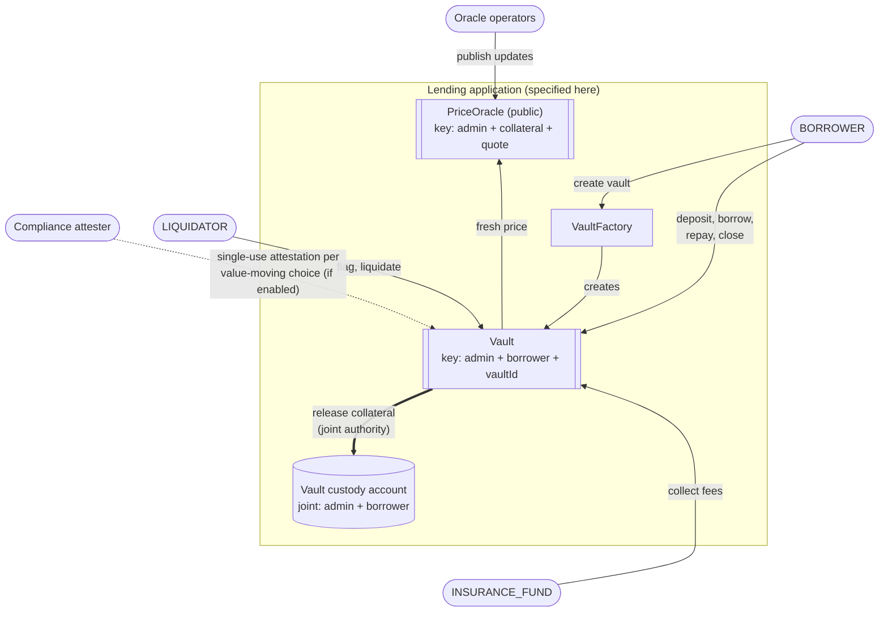
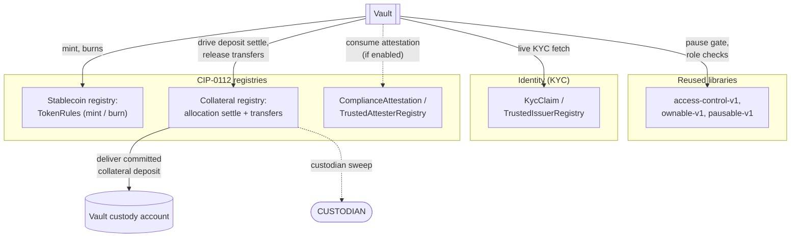
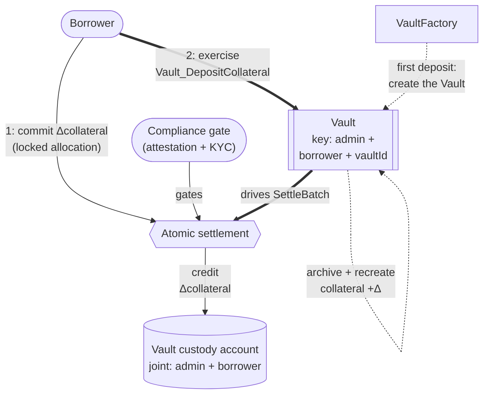
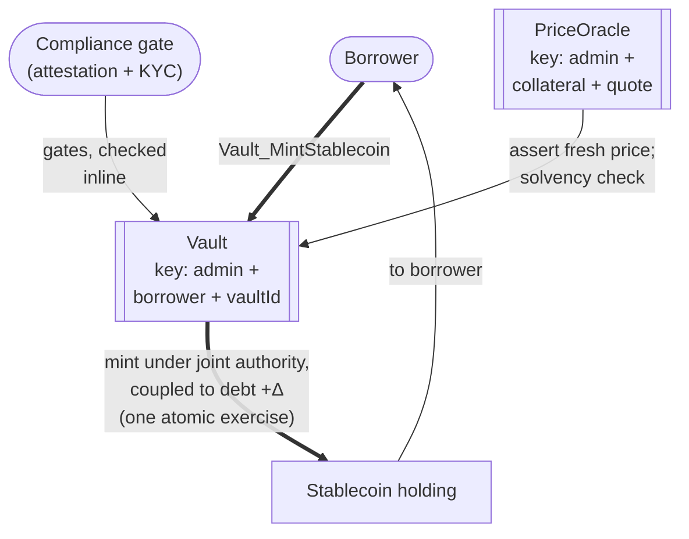
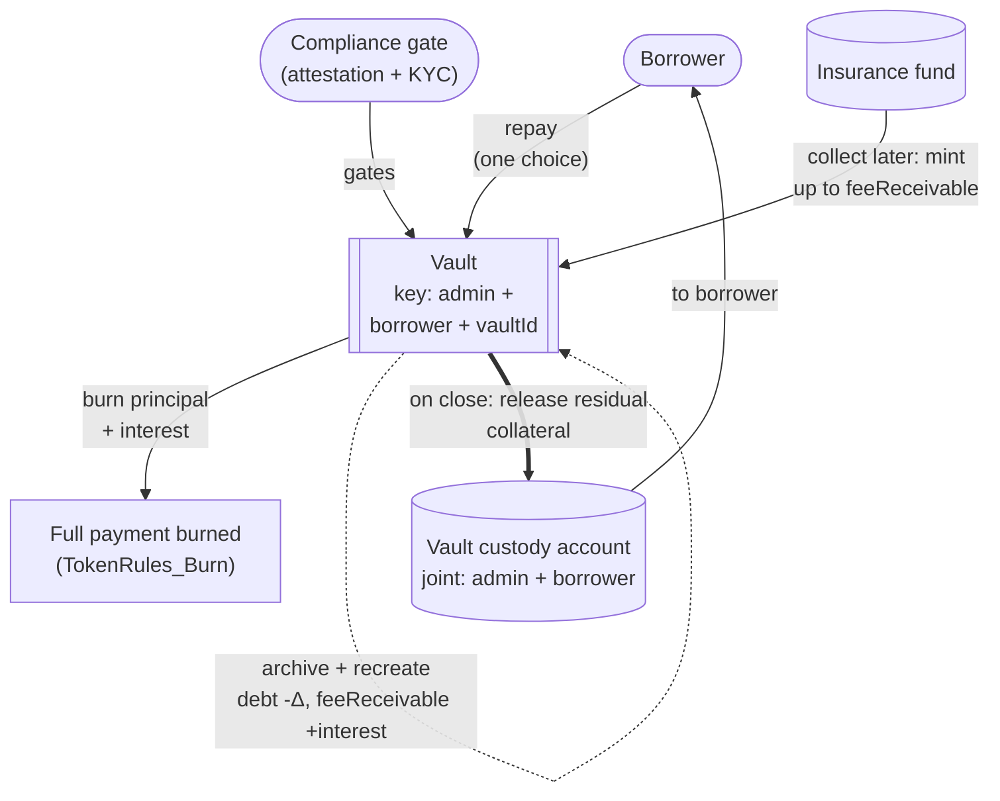
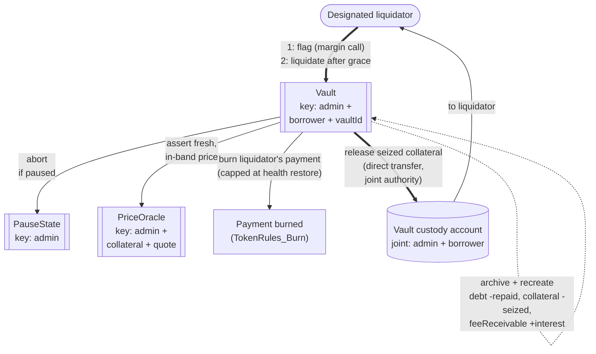
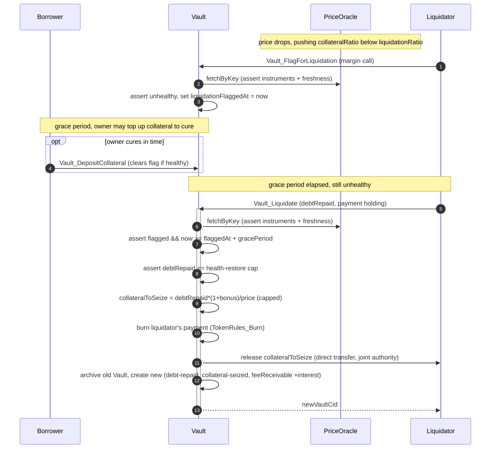

# Architectural Overview Report: Canton Reference Institutional Lending Protocol

This report defines a reference architecture for a vault-based,
overcollateralized institutional lending protocol on Canton. It composes
three kinds of material into one target application design: reusable
OpenZeppelin Daml components (access, ownership, pause), bounded experiments
for the settlement and identity mechanisms, and vault and oracle patterns
from companion OpenZeppelin projects, all settling through the Canton Network
Token Standard V2. The components and experiments are existing evidence; the
lending application that composes them is specified here and remains to be
built.

## 1. Product Definition

The product is a lending protocol for the Canton Network. Its core object is
the **Vault**: an isolated collateralized debt position (CDP), held as a
discrete Daml contract per position. Four properties
define the protocol:

- **Fixed-rate.** The `interestRate` is immutable for the life of a
  position; there is no utilization-based rate curve.
- **Open-term.** A position has no maturity date: it stays open until the
  owner repays and closes it, or it is liquidated.
- **Overcollateralized.** A borrower must lock collateral worth more than the
  debt it backs: borrowing keeps `collateralRatio` at or above
  `minCollateralRatio`, and a position that later falls under
  `liquidationRatio` becomes liquidatable. The surplus is the buffer that
  keeps the debt fully covered through collateral price movement.
- **Permissioned.** Every participant acts under a verified identity:
  borrowers and liquidators must hold a valid `KycClaim` from an issuer in
  the `TrustedIssuerRegistry`, so no anonymous party can open, service, or
  liquidate a position. Value movements can additionally be gated by
  per-operation compliance attestations.

The design adapts the [`OpenZeppelin/canton-stablecoin`](https://github.com/OpenZeppelin/canton-stablecoin)
vault codebase and wires it onto [CIP-0112, the Canton Network Token Standard V2](https://github.com/canton-foundation/cips/blob/main/cip-0112/cip-0112.md).
Every asset is a holding co-signed by its own registry, and all value moves
through that registry's rails. Every movement must be atomic: a borrow checks
solvency, then mints stablecoin together with the debt that backs it; a
repayment burns stablecoin together with the debt it clears; a liquidation exchanges the
liquidator's payment for the seized collateral in one transaction. Nothing
completes partially, and no intermediary holds the assets along the way.

Daml's transaction atomicity carries most of that on its own. Stablecoin minting and burning, as well as releasing collateral all happen inside the vault choice itself, which already
carries the authority they need. The interest portion of a payment is recorded as an
insurance-fund receivable rather than delivered. The collateral might be a third-party asset, hence it requires a committed
allocation and settlement through [CIP-0112 atomic settlement](https://github.com/canton-foundation/cips/blob/main/cip-0112/cip-0112.md#416-committed-allocations-for-prefunded-trading-and-iterated-settlement),
with each leg's amount pinned to a signed allocation side. 

Each mechanism is
independently evidenced: allocation settlement, per-settlement attestations,
and custodian lock-and-sweep in
[`tokenCIP112-v1`](https://github.com/OpenZeppelin/canton-contracts/tree/7696749737885e25cd88422847105f890f03b00d/experiments/token/tokenCIP112-v1);
KYC claims validated against a trusted-issuer registry in the [identity packages](../../experiments/identity/);
role, ownership, and pause management in `openzeppelin-access-control-v1`,
`openzeppelin-ownable-v1`, and `openzeppelin-pausable-v1`.
This report composes them into one target lending application conforming to
Token Standard V2.

### Operational Scope and Boundaries

The target architecture favors **simplicity and modular extensibility**. The
tables below define its scope.

| Feature Category | In-Scope Architectural Components |
|---|---|
| Interest Model | A fixed, immutable `interestRate`; open-term positions with no maturity date. Accrual is **simple (non-compounding) interest** off the tracked principal ([section 3](#3-target-design)). |
| Core Flows | The five vault flows: **vault creation with collateral deposit**, **borrow**, **repay**, **liquidation**, and **close** (full repay and collateral withdrawal). How each flow moves value is specified in [section 3](#3-target-design). |
| Asset Representation | Fungible digital assets compliant with the CIP-0112 Token Standard V2 holding interfaces. The stablecoin (debt token) is issued by the vault admin; collateral may be issued by any third party, since it is custodied rather than minted or burned ([section 3](#3-target-design)). |
| Pricing | The keyed `PriceOracle` interface the vaults consume, naming both the collateral and quote instruments, with max-staleness and per-update deviation guards enforced by every price-dependent choice ([section 4](#43-component-price-oracle-interface)). |
| Fees | Interest is burned with the payment that carries it and recorded in `feeReceivable`; the insurance fund can later mint the recorded amount. The `liquidationBonus` is the liquidator's seizure premium, paid from the borrower's collateral. The accumulated insurance fund is the first absorber of bad debt. |
| Compliance & Control | **Compliance attestation** (optional per deployment, [section 3](#compliance-is-re-checked-on-every-operation)): when the gate is enabled, no value-moving operation executes unless an attester has signalled compliance, re-checked per operation; attestation mentions elsewhere in this report assume the gate is enabled. **Custodian lock-and-sweep**: a privileged party can block settlement and sweep allocation funds to a preset custodian account. **Identity verification**: single-synchronizer KYC. |
| Component Integration | Direct reuse of `openzeppelin-access-control-v1`, `openzeppelin-ownable-v1`, `openzeppelin-pausable-v1`, CIP-0112 settlement, as well as the vault, oracle, and identity patterns from the [`OpenZeppelin/canton-stablecoin`](https://github.com/OpenZeppelin/canton-stablecoin), [`OpenZeppelin/canton-token-template`](https://github.com/OpenZeppelin/canton-token-template) and [`ShapeB`](../../experiments/identity/hook-shape-b/daml/OpenZeppelin/Experimental/Identity/ShapeB.daml#L6) codebases. |

The compliance and control terms above are this report's names for four control requirements tracked externally under the IDs D1-D4: **compliance attestation** (D1), **custodian lock-and-sweep** (D2), **know-your-customer identity** (D3), and **authority and privilege transfer** (D4). The report uses the names throughout and keeps the IDs only here, for traceability; each control is specified in [section 3](#3-target-design).

| Feature Category | Out-of-Scope Architectural Components |
|---|---|
| Interest Models | Dynamic, variable, or algorithmic rates, utilization rate curves, floating-rate oracles, and fixed maturity dates. |
| Leverage Facilities | Undercollateralized loans, flash loans, recursive leverage, and rehypothecation. |
| Liquidation Mechanics | Market-driven bidding-war auctions, and whole-vault forced seizure regardless of payment. |
| Price Production | Producing the price is a dependency, not part of this design: the update mechanism or external oracle service is an implementation decision, consumed as-is provided it satisfies the interface requirements ([section 4](#43-component-price-oracle-interface)). Multi-asset dynamic oracles and off-ledger TWAP aggregators likewise remain outside this architecture. |
| Token Standard | Defining or extending the Token Standard V2 abstractions: the architecture consumes them as-is from upstream. CIP-56 and V1 allocation paths are outside this architecture. |
| Cross-Synchronizer Operation | Cross-synchronizer settlement and identity are **out of scope**; the architecture assumes a single synchronizer. |

### Target Ecosystem Participants

- **Institutional Asset Managers and Tokenized-Fund Issuers** can run high-value collateralized credit operations with deterministic outcomes and no public data leakage.
- **Regulated Stablecoin Operators** can issue a collateral-backed stablecoin whose supply is provably coupled to recorded, solvency-checked vault debt.
- **Wallet and Client Integrators** can build the borrower-facing wallet
  flows (deposit, borrow, repay, close) on the specified handshakes and
  per-party allocations.
- **Security and Assurance Auditors** can evaluate the authority boundaries,
  security invariants, trust assumptions, and residual risks stated in this
  report.

### Educational Framing: How to Think About Building a Lending Protocol on Canton

Moving from an EVM ecosystem to Canton requires a paradigm shift in state management, privacy boundaries, and trust topology.

In the [ERC-4626](https://docs.openzeppelin.com/contracts/5.x/erc4626) lineage, a single globally visible contract manages pooled liquidity, debt shares, and dynamic interest accrual for all participants: a monolithic state that broadcasts every participant's collateral balance and liquidation threshold publicly.

Canton operates on a privacy-preserving, **per-party projection** model enforced by the Canton protocol. A Canton contract is an instance of a template, signed and authorized by a set of parties (signatories). State changes by archive-and-recreate rather than in-place mutation, and any signatory must actively co-authorize a transition (Daml's propose-and-accept pattern). The design uses **contract keys** (reintroduced in [Canton 3.5.1+](https://github.com/digital-asset/canton/releases/tag/v3.5.1)) so the `Vault`, `PriceOracle`, `PauseState`, and the trusted-attester and trusted-issuer registries keep stable identities across those archive-and-recreate cycles. Note that 3.5.1 keys are **not unique**: the platform does not reject two contracts sharing a key, so uniqueness is an application-level obligation - here, the factory's creation check and each registry creating exactly one contract per key.

Contract keys are the design target; they are not yet implemented in the current templates. The `[IMPLEMENTED]` experiment code sits on the workspace's pinned SDK baseline and is keyless: each choice takes a caller-supplied registry contract id and asserts that registry shares the factory's admin. The resolution by key, shown throughout, lands with the Canton 3.5.1+ SDK migration.

The per-party projection model is why the design puts each **vault in its own contract**: instead of one pooled share-accounting contract, the protocol deploys a discrete, isolated `Vault` contract per position. A borrower's position is observable only to the borrower, the vault admin, the designated liquidators that police it, and any regulatory observer parties explicitly placed in the contract's observer set. Visibility is a precondition for action on Canton: a party can flag or liquidate a vault only if the vault is in its projection, which is why the liquidator set is declared as observers rather than left implicit.

---

## 2. Architecture Overview

This section maps each component to its source, then defines the party/role topology and the trust configuration.

The two block diagrams below show the main components of the target
architecture; the table that follows maps each block to its source. Solid
edges are runtime interactions, dashed edges are standing governance or
trust relationships, and keyed contracts are marked with their key.

The first diagram shows the actors and the lending application's own
contracts:



The second shows the components the vault choices depend on, grouped by
source:



### Core Components and Library Mapping

Tags distinguish the source of each component: `[LIBRARY]` identifies a
library package in
[`OpenZeppelin/canton-contracts`](https://github.com/OpenZeppelin/canton-contracts),
`[EXPERIMENT]` identifies executable evidence in this repository
(`OpenZeppelin/canton-specs`), and `[REFERENCE]` identifies code in a
companion OpenZeppelin repository that informs the design.

| Component Suite | Applied Templates and Libraries | Architectural Function |
|---|---|---|
| Access Control `[LIBRARY]` | `openzeppelin-access-control-v1`: [`RoleGrant`](https://github.com/OpenZeppelin/canton-contracts/blob/cec416d6e3c2118551c761d5598c403ab27ee342/experiments/access/access-control-v1/daml/OpenZeppelin/AccessControlV1.daml#L58), [`RoleAdmin`](https://github.com/OpenZeppelin/canton-contracts/blob/cec416d6e3c2118551c761d5598c403ab27ee342/experiments/access/access-control-v1/daml/OpenZeppelin/AccessControlV1.daml#L116), [`DefaultAdminTransferOffer`](https://github.com/OpenZeppelin/canton-contracts/blob/cec416d6e3c2118551c761d5598c403ab27ee342/experiments/access/access-control-v1/daml/OpenZeppelin/AccessControlV1.daml#L237), [`requireRole`](https://github.com/OpenZeppelin/canton-contracts/blob/cec416d6e3c2118551c761d5598c403ab27ee342/experiments/access/access-control-v1/daml/OpenZeppelin/AccessControlV1.daml#L287) | Role-based permissioning for the vault admin, liquidators, oracle operators, and pausers. |
| Ownership Lifecycle `[LIBRARY]` | `openzeppelin-ownable-v1`: [`Ownership`](https://github.com/OpenZeppelin/canton-contracts/blob/cec416d6e3c2118551c761d5598c403ab27ee342/experiments/access/ownable-v1/daml/OpenZeppelin/OwnableV1.daml#L41), [`OwnershipOffer`](https://github.com/OpenZeppelin/canton-contracts/blob/cec416d6e3c2118551c761d5598c403ab27ee342/experiments/access/ownable-v1/daml/OpenZeppelin/OwnableV1.daml#L82) | Two-step handover of protocol administration. |
| Protocol Constraints `[LIBRARY]` | `openzeppelin-pausable-v1`: [`PauseState`](https://github.com/OpenZeppelin/canton-contracts/blob/cec416d6e3c2118551c761d5598c403ab27ee342/experiments/security/pausable-v1/daml/OpenZeppelin/PausableV1.daml#L47), [`whenNotPaused`](https://github.com/OpenZeppelin/canton-contracts/blob/cec416d6e3c2118551c761d5598c403ab27ee342/experiments/security/pausable-v1/daml/OpenZeppelin/PausableV1.daml#L77) | Emergency circuit breaker used by all critical flows. |
| CIP-0112 Settlement `[EXPERIMENT]` | `OpenZeppelin.TokenCIP112V1`: [`TokenRules`](https://github.com/OpenZeppelin/canton-contracts/blob/7696749737885e25cd88422847105f890f03b00d/experiments/token/tokenCIP112-v1/daml/OpenZeppelin/TokenCIP112V1/Registry.daml#L28), [`TokenAllocationRequest`](https://github.com/OpenZeppelin/canton-contracts/blob/7696749737885e25cd88422847105f890f03b00d/experiments/token/tokenCIP112-v1/daml/OpenZeppelin/TokenCIP112V1/AllocationRequest.daml#L18), [`AllocationFactory_Allocate`](https://github.com/OpenZeppelin/canton-contracts/blob/7696749737885e25cd88422847105f890f03b00d/experiments/token/tokenCIP112-v1/daml/OpenZeppelin/TokenCIP112V1/Registry.daml#L280), [`TokenAllocation`](https://github.com/OpenZeppelin/canton-contracts/blob/7696749737885e25cd88422847105f890f03b00d/experiments/token/tokenCIP112-v1/daml/OpenZeppelin/TokenCIP112V1/Allocation.daml#L67), [`TokenEventLog`](https://github.com/OpenZeppelin/canton-contracts/blob/7696749737885e25cd88422847105f890f03b00d/experiments/token/tokenCIP112-v1/daml/OpenZeppelin/TokenCIP112V1/Base.daml#L75), [`TokenHolding`](https://github.com/OpenZeppelin/canton-contracts/blob/7696749737885e25cd88422847105f890f03b00d/experiments/token/tokenCIP112-v1/daml/OpenZeppelin/TokenCIP112V1/Holding.daml#L17), [`BurnerCapability`](https://github.com/OpenZeppelin/canton-contracts/blob/7696749737885e25cd88422847105f890f03b00d/experiments/token/tokenCIP112-v1/daml/OpenZeppelin/TokenCIP112V1/Allocation.daml#L52) | Demonstrates the allocation, attestation, and seizure mechanisms used by the inbound asset flows. |
| Identity Verification `[EXPERIMENT]` | `ShapeB`: [`KycClaim`](../../experiments/identity/hook-shape-b/daml/OpenZeppelin/Experimental/Identity/ShapeB.daml#L43), [`TrustedIssuerRegistry`](../../experiments/identity/hook-shape-b/daml/OpenZeppelin/Experimental/Identity/ShapeB.daml#L74) | Demonstrates the four KYC-claim checks: the claim kind, a registry-listed issuer, the right subject, and an unexpired validity window. |
| Vault / CDP Core `[REFERENCE]` | [`OpenZeppelin/canton-stablecoin`](https://github.com/OpenZeppelin/canton-stablecoin): `Vault`, `VaultFactory`, `VaultParams`, `PriceOracle` | Provides the vault mechanics that inform this design. The target architecture uses simple interest and payment-proportional liquidation instead of the reference code's discrete compounding and whole-vault seizure ([section 3](#3-target-design)). |

Token Standard V2 interfaces are the target asset and settlement interoperability
boundary; the `tokenCIP112-v1` package implements them directly against the
upstream splice interface packages.

### Party and Role Model Topology

Duties are segregated and mapped to discrete Daml parties:

- **Vault Admin / Stablecoin Issuer (`VAULT_ADMIN`)** - underwrites the **stablecoin (debt) token**: operates the `VaultFactory`, configures `VaultParams`, the `TrustedIssuerRegistry` (accepted KYC issuers), and the `TrustedAttesterRegistry` (accepted compliance attesters), and issues the grants that authorize custodian seizure sweeps. The admin can mint the stablecoin, never the collateral, and only inside the vault choices ([section 3](#3-target-design)). The protocol gives the vault admin no path to issuing unbacked stablecoin.
- **Borrower (`BORROWER`)** - the entity locking collateral and drawing debt. Only the borrower can lock their own holdings into an allocation. To interact with the protocol, the borrower must hold a valid `KycClaim`, verified at vault creation and fetched live by each value-moving vault choice. Visibility is limited to the borrower's own vaults and the public configuration contracts.
- **Liquidator (`LIQUIDATOR`)** - a role granted via `openzeppelin-access-control-v1`. Each granted liquidator is placed in the observer set of the vaults it polices, so it can monitor the `PriceOracle` and vault solvency off-ledger from its own projection; authorized to liquidate only after the margin-call grace period has elapsed on a flagged, still-unhealthy vault, and only proportionally to the stablecoin it repays.
- **Oracle Operator(s) (`ORACLE_PROVIDER`)** - the implementation-defined party set that updates the `PriceOracle`, bound by the interface requirements ([section 4](#43-component-price-oracle-interface)): no single party, not even the vault admin, should be able to move or stall the published price.
- **Insurance Fund (`INSURANCE_FUND`)** - the party that collects protocol revenue: it mints the interest revenue against the vaults' `feeReceivable` records; the accumulated fund is the first absorber of recognized bad debt.
- **Custodian (`CUSTODIAN`)** - owns the preset account that receives funds swept by a custodian seizure.
- **Vault Custody Account** - owns the collateral holdings that back a vault; there is **one custody account per vault**, so collateral is never commingled across positions. It is held under the vault's **joint authority** ([trust topology](#decentralization-and-trust-topology)), and collateral leaves it only through the choices that release it (withdrawal, close, liquidation).

The topology separates public market data from private positions: `PriceOracle` and `VaultParams` carry a broad observer set so participants can independently verify the governing parameters, while each `Vault` restricts visibility to its signatories (vault admin and borrower) plus a minimal observer set: the designated liquidators and any regulatory observer parties.

### Decentralization and Trust Topology

Canton decentralizes a party along three independent axes, and the design assigns each role a deliberate position on each:

1. **governance** - whose signatures can change the party's identity and hosting (re-home the party to their own validator and act freely);
2. **validation** - how many independent validators (the Canton Network term for participant-node operators, used throughout this report) must confirm the party's transactions (the `PartyToParticipant` confirmation threshold; a threshold above 1 defends against a malicious validator, at a latency and cost premium, and such a party can no longer submit Ledger API commands directly - it acts through externally signed submissions or through choices submitted by others);
3. **authorization** - what the Daml signatory/controller topology requires regardless of hosting.

Two roles hold value-moving or supply-changing authority as a single party:
the vault admin and the insurance fund. For each, we envision the
EVM equivalent of an N-of-M multisig: no single key may exercise the party's
authority. Canton offers two ways to implement the multisig; selecting one remains an open question ([section 7](#7-open-design-questions)):

- **On-ledger approval workflow** - the multisig is written in Daml ([Multiple Party Agreement](https://docs.canton.network/appdev/modules/m3-design-patterns#multiple-party-agreement)): approvers record approvals as contracts, and the final choice executes under the role party's inherited authority only once a threshold of approvals exists. Approvals are durable, named, and auditable on-ledger.
- **External party with threshold signing keys** - the role party's transactions require signatures from N of M keys (`PartyToKeyMapping`), held by independent organizations. Invisible to the Daml code and a single ledger transaction per action, but the signing ceremony must complete within the prepared transaction's validity window, and the approval record stays off-ledger. The implementation could leverage something like the [Bitsafe decentralization-manager](https://github.com/DLC-link/decentralization-manager).

We envision the vault custody account as a registry `Account`
with the borrower as owner and the vault admin as provider, so every holding
it contains is co-signed by both. Moving collateral outside the vault's
choices would therefore require the borrower plus the admin quorum; inside
the vault's choices both signatures arrive automatically, inherited from the
`Vault`'s own signatories.

For roles that need to submit routinely (the insurance fund collecting fees), we envision keeping the confirmation threshold at 1, with each such role's powers bounded on-ledger.

Whatever update mechanism the **oracle operators** run ([section 4](#43-component-price-oracle-interface)), an all-of-M quorum should be deliberately avoided: a single offline member, or one whose validator has unvetted the protocol DAR, would stall every price update until the staleness guard freezes the protocol.

The **pause authority** is multi-hosted so the brake is always reachable, but its confirmation threshold stays at 1: an emergency stop must be instant, and a quorum would slow it down. The price of that choice is a griefing window: a malicious pauser can freeze in-flight settlements until their deadlines lapse. This griefing is capped by the authorizer's right to reclaim the allocated funds after the expiration deadline. The pause brings the additional risk of not being solvency-neutral: it freezes liquidation while collateral keeps repricing, an exposure tracked in [section 7](#7-open-design-questions).

The **custodian** owns the preset account that receives seizure sweeps. It needs availability and protection against a malicious single validator, hence multi-hosting with confirmation threshold >1 suffices.

The **liquidator** set should contain several independently granted parties, so liquidation liveness never hinges on one keeper: any designated liquidator may flag or complete a liquidation.

**Borrowers** need no protocol-side decentralization: outside the custodied collateral they only ever trust their own keys and their own validator.

---

## 3. Target Design

### The CDP Math

Two figures track a position: `principalAmount` is the stablecoin minted and not yet repaid, and `debtAmount` is what the borrower owes - that principal plus the interest accrued on it - so `principalAmount <= debtAmount` always. A vault's health is its **collateral ratio**: `collateralRatio = (collateralAmount · price) / debtAmount`, priced by the `PriceOracle`. Borrowing and collateral withdrawal must keep the ratio at or above `VaultParams.minCollateralRatio`; falling below the `liquidationRatio` exposes the position to a margin call.

The vault utilizes **simple interest accrual**: `accrueDebt` computes `newDebt = oldDebt + principalAmount · interestRate · elapsedYears`, where `elapsedYears` derives from `now - lastAccrualTime`. Accrual runs on every state-changing choice before the solvency check, and `lastAccrualTime` resets on each recreation. Because interest is always charged on the principal, it does not matter how often accrual runs: two accruals over `t₁` and `t₂` add exactly what one accrual over `t₁+t₂` would; whether a compounding variant is also needed is an open question ([section 7](#7-open-design-questions)).

**Liquidation arithmetic (payment-proportional, health-restoring).** Two bounds govern every liquidation pass: the collateral released is proportional to the payment, and the payment is capped at exactly what returns the vault to health.

```text
-- Seizure is proportional to the payment:
collateralToSeize = min(collateralAmount, debtRepaid · (1 + liquidationBonus) / price)

-- The smallest repayment that lifts the ratio back to minCollateralRatio:
restoreAmount = (minCollateralRatio · accruedDebt - collateralAmount · price)
                / (minCollateralRatio - 1 - liquidationBonus)

-- The payment cap, by regime:
repayCap = if collateralRatio > 1 + liquidationBonus
           then restoreAmount                                      -- restorable
           else collateralAmount · price / (1 + liquidationBonus)  -- full absorption

debtRepaid <= repayCap
```

Taking each element of the codeblock in turn:

- **Proportional seizure.** `debtRepaid` is the amount the liquidator's own exercise burns in the same transaction, never the vault's full accrued debt, so a liquidator can never take more collateral than their payment (plus bonus) buys.
- **Restorable vault (`collateralRatio > 1 + liquidationBonus`).** Repaying `x` leaves debt `accruedDebt - x` and collateral value `collateralAmount · price - x · (1 + liquidationBonus)`; `restoreAmount` is the `x` that sets their ratio to exactly `minCollateralRatio`. In this regime every repaid unit improves the ratio, so a payment below the cap partially cures, a payment at the cap fully cures, and nothing beyond it can be taken (no overshoot). The target is `minCollateralRatio`, not `liquidationRatio`, so a cured vault does not restart on the liquidation boundary.
- **Underwater vault (`collateralRatio <= 1 + liquidationBonus`).** No repayment can restore health, so the cap becomes what the remaining collateral can pay for: the pass seizes all of it, and the uncovered remainder is quantified as `badDebt`.
- **Well-definedness.** Protocol configuration requires the full ordering `minCollateralRatio > liquidationRatio > 1 + liquidationBonus`. The first gap is the margin-call buffer; the second keeps the restorable regime reachable, so a freshly flagged vault can still be partially cured; and the chain keeps `restoreAmount`'s denominator positive and its value within what the collateral supports.

### Data and State Flow

The diagrams below show the four vault flows: **A** collateral deposit, **B** borrow, **C** repay and close, **D** margin call and liquidation. Atomic settlement appears only in the collateral deposit; repayment and liquidation payments burn in place, and everything the protocol releases (minted stablecoin, returned or seized collateral) moves by direct transfer under the vault's joint authority in the same transaction. In each, the `Compliance gate` node stands for the compliance-attestation check and the live KYC-claim fetch ([section 3](#compliance-is-re-checked-on-every-operation)), and keyed contracts are marked with their key.

**A. Collateral deposit.** The borrower commits the collateral they are locking; settlement delivers it into the vault's custody account, and the vault's own record of how much collateral backs the position grows by the same amount. The first deposit goes through the `VaultFactory` instead: creation settles it identically, but creates the `Vault` rather than updating one ([section 4.1](#41-component-vaultfactory-and-vault-creation)).



**B. Borrow (mint coupled to debt).** The borrower asks the vault for stablecoin; the vault checks compliance, reads the current price, and assesses whether the locked collateral is worth enough to cover the new debt. If so, it mints the stablecoin to the borrower and records the higher debt, all in one transaction. This flow does not need atomic settlement: the stablecoin's issuer and the borrower both already stand behind the vault, so the vault choice itself carries every signature the mint needs.



**C. Repay and close.** The borrower pays down debt: the vault checks compliance, burns the whole payment out of the borrower's wallet (the borrower and the stablecoin issuer both already stand behind the vault, so no settlement is needed), records the lower debt, and adds the interest portion to the insurance fund's fee receivable. The insurance fund mints its accumulated fees on its own schedule, backed by that record. On close, the vault hands the remaining collateral back to the borrower in the same transaction.



**D. Margin call and liquidation.** A designated liquidator flags the unhealthy vault, which opens the borrower's cure window. Once the grace period passes and the position is still unhealthy, the liquidator triggers the liquidation: at the current oracle price, the vault burns the liquidator's stablecoin payment straight from its wallet (capped at what restores health), adds the interest portion to the insurance fund's receivable, hands the liquidator seized collateral worth the payment plus the liquidation bonus, and records the reduced debt and collateral.



### The Vault Flows: Step by Step

This walkthrough names the concrete choices behind the four flows:

1. **Vault creation and deposits.** The borrower locks collateral into a committed [`TokenAllocation`](https://github.com/OpenZeppelin/canton-contracts/blob/7696749737885e25cd88422847105f890f03b00d/experiments/token/tokenCIP112-v1/daml/OpenZeppelin/TokenCIP112V1/Allocation.daml#L67) and exercises `VaultFactory_CreateVault`, which checks the KYC claim, batch-settles the collateral into the custody account, and instantiates the `Vault` with the settled `collateralAmount`. Top-ups use `Vault_DepositCollateral`; `Vault_WithdrawCollateral` releases collateral back as long as the solvency check passes.
2. **Borrow.** `Vault_MintStablecoin` consumes the compliance attestation, fetches the live `KycClaim`, and requires that existing plus requested debt keeps `collateralRatio` at or above `minCollateralRatio` at a fresh `PriceOracle` reading, before minting to the borrower and incrementing `debtAmount`.
3. **Repay and close.** `Vault_BurnStablecoin` burns the payment via [`TokenRules_Burn`](https://github.com/OpenZeppelin/canton-contracts/blob/7696749737885e25cd88422847105f890f03b00d/experiments/token/tokenCIP112-v1/daml/OpenZeppelin/TokenCIP112V1/Registry.daml#L170), reduces `debtAmount`, and increments `feeReceivable`. The insurance fund collects via `Vault_CollectFees`; `Vault_Close` winds the position down, parking any uncollected receivable in an admin-signed contract for later collection.
4. **Margin call and liquidation.** `Vault_FlagForLiquidation` opens the grace window; once it elapses on a still-unhealthy vault, `Vault_Liquidate` names `debtRepaid` (capped by the health-restore formula), consumes a compliance attestation checking the liquidator, burns the payment, releases the proportional collateral, and recreates the residual `Vault`.

The sequence diagram below traces the margin-call and liquidation flow end to end:



### Execution Model

In an EVM lending pool every action is one synchronous transaction against
shared state. The Canton flows decompose into a sequence of ledger commands,
but almost every flow here is **single-driver**: one party submits each of
its steps back-to-back, the counterparty authorities (the vault admin's, the
instrument admin's) are carried by contract signatories rather than requested
live, and the cross-party dependencies on the critical path are the
automated attester and the price: a
price-dependent choice reads the standing published price with no operator
involvement, but blocks on the operators' next publish if it has gone stale.
A client that submits and waits per command therefore
experiences each flow as a synchronous sequence completing in seconds.
Outbound flows (borrow, withdraw, close), the repay, and the liquidation are
single atomic exercises;
the collateral deposit adds a locking step before its settle.

Step-by-step execution, per flow:

| Flow | Step | Submitter | Interaction |
|---|---|---|---|
| Deposit / creation | 1. lock the collateral for settlement | borrower | sync: borrower alone |
| Deposit / creation | 2. settle the collateral into the vault's custody account, creating or updating the vault | borrower | async: may wait for the compliance attestation |
| Borrow | mint the stablecoin against the vault's collateral | borrower | async: may wait for a stale price to update and for the compliance attestation |
| Fee collection | mint accumulated `feeReceivable` to the insurance fund | insurance fund | sync: on its own cadence, no involvement from another actor |
| Withdraw / close | release collateral back to the borrower | borrower | sync: borrower alone; direct transfer |
| Liquidation | 1. flag the vault (the margin call) | liquidator keeper | sync: keeper alone; opens the grace period |
| Liquidation | 2. liquidate: burn the payment, seize collateral | liquidator keeper | keeper alone, once the grace period lapses uncured; may wait for a stale price to update and for the compliance attestation |
| Oracle publish | publish a price update | oracle operators (implementation-defined) | async: on the operators' cadence |

Assumptions and important notes:

- Between a deposit's allocate and its settle the borrower's collateral is
  locked; the lock is time-bounded and the borrower always has a unilateral
  exit ([section 5.4](#54-failure-modes-and-recovery)).
- The oracle publish will likely be a multi-party ceremony on its own cadence,
  and a price-dependent choice that loses the race against a publish is simply retried: the oracle is re-resolved by key, so the retry runs against the fresh price with no client-side rewiring.
- Custody-held keys turn any synchronous step asynchronous: a signature that
  routes through an external custodian's approval flow comes back as a
  prepared transaction, bounded by the 24h window
  ([the time model below](#time-model-and-deadlines)).

**Progress tracking.** The borrower client and the keeper track each
flow by command id: a step that neither commits nor rejects times out against
its deadline and marks the workflow stuck, raising an alert with the pending
step and the deadline after which funds unlock.
[Section 5.4](#54-failure-modes-and-recovery) enumerates the stuck states and
their exits.

### Time Model and Deadlines

Canton features the protocol must account for:

- Ledger time is accurate only to 60 seconds. Every deadline check is fuzzy by that much, hence sub-minute deadlines
  should be avoided.
- Externally signed (prepared) transactions must be submitted within 24h by
  default: any leg signed by an external party must complete prepare, sign,
  submit inside that window.
  [CIP-0107](https://github.com/canton-foundation/cips/blob/main/cip-0107/cip-0107.md)
  (externally signed transactions for the token-standard APIs) exposes the
  same window.
- CIP-0112 defines the deadline fields and their semantics but no values:
  `settlementDeadline` (an allocation must not settle after it; committed
  allocations become withdrawable after it) and a registry-set `expiresAt`
  for hygiene expiry. Enforcement lives in each token registry's
  implementation, so with third-party compliant tokens the expiry policy is
  per registry.

Deadlines are derived per flow, not picked globally:

```text
slowest required actor's SLA <= settlementDeadline
  <= min(operation staleness tolerance, capital-lock tolerance, 24h if any external signer)
```

| Flow | Slowest actor | Time budget | Rationale |
|---|---|---|---|
| Collateral deposit | the borrower end to end: allocate, then settle, back-to-back | minutes (`settlementDeadline`); extend toward the 24h prepared-transaction ceiling only when the borrower signs through an external custodian | both steps carry only the borrower's authority, so a live wallet completes them in one session; not price-sensitive, and compliance is re-checked at settle time |
| Oracle publish | oracle operators, automated | minutes (`maxStaleness`) | the staleness guard rejects slow publishes and the circuit breaker trips on gaps |

Consequence for the attestation gate: attestations are
automated, issued just-in-time with a short validity window, and
`settlementDeadline` must exceed the attester's SLA. The margin-call grace window ([section 3](#margin-call-a-grace-period-before-liquidation))
is measured in ledger time, so it must exceed the 60s tolerance by a wide
margin.

### Collateral is Custodied

Collateral is only ever **transferred**, never minted or burned: a deposit settles the borrower's collateral holding into the vault custody account through CIP-0112 settlement, and a withdrawal releases it back by direct transfer under the vault's joint authority. The vault admin therefore needs no issuing authority over the collateral instrument, only over the stablecoin. Institution-supplied, third-party-issued collateral (a custodian bank's deposit token, a tokenized treasury) is therefore compatible.

To facilitate value transfers, the design assumes that the vault admin **is** the stablecoin's registry admin, which is what lets vault choices mint and burn it directly; a third-party debt token would push borrow and repay onto that token's own registry rails. The deposit rides the allocation rail rather than a receiver-accepted transfer instruction for two reasons: a committed allocation is the standard pre-signed rail a third-party registry offers an executor, and in-flight deposits are the surface the custodian lock-and-sweep control is defined over.

**Direct-transfer assumption.** The direct-transfer capability can break for a registry that interposes its own asynchronous step, such as a registrar acceptance or a pending state resolved by registry automation. Such an asset still integrates, but its releases split in two: the vault transaction issues the instruction, and the collateral arrives when the registry's step lands.

**Collateral amounts vs. actual holdings.** The `Vault`'s `collateralAmount` is a `Decimal` accounting figure; the real value lives in TSv2 holdings owned by that vault's own custody account. Every flow moves holdings into or out of that account in the same transaction that updates the accounting figure, so **`collateralAmount == Σ(custody-account holdings)` per vault** cannot drift within a transaction. Deposit, withdrawal, and liquidation each pin their collateral movement to the vault's own custody account - the deposit leg must deliver into it, and every release draws from it - so the accounting can never move without the matching holdings moving. The caveat is *fragmentation*: repeated top-ups accumulate many small holdings in a custody account, so a periodic **consolidation** step (merging the account's holdings for the instrument into one, leaving `collateralAmount` unchanged) keeps settlement cheap.

### Fees Are Burned, Then Collected

The debt paid on repay, close, or liquidation is `principal + accrued interest`; all flows burn the full payment via the registry's `TokenRules_Burn` and record the interest portion in the vault's `feeReceivable`; the insurance fund realises that revenue later by exercising `Vault_CollectFees`, which mints up to the recorded receivable. Those fees are protocol revenue, the on-ledger analogue of interest paid to the lender, and the accumulated fees are the first absorber of any liquidation shortfall.

Interest creates a structural liquidity gap: the protocol mints only principal, yet borrowers owe principal plus interest, so aggregate debt always exceeds circulating supply by the accrued interest. The stablecoin that pays interest must come from other borrowers' minted principal or from the insurance fund's re-minted fees re-entering circulation.

### Margin Call: a Grace Period Before Liquidation

On a public chain, a collateral top-up racing a liquidation is decided by gas and ordering luck. Canton has no public mempool, so the design makes the borrower's cure window explicit and deterministic instead. Liquidation is two-phase:

1. **Flag.** When `collateralRatio < liquidationRatio`, any designated liquidator may exercise `Vault_FlagForLiquidation`, which records `liquidationFlaggedAt` and derives a grace deadline from the protocol-set `gracePeriod` in `VaultParams`. This is the margin call; it moves no value.
2. **Cure or liquidate.** During the window the borrower may deposit collateral or repay to restore the ratio, which clears the flag. `Vault_Liquidate` asserts the vault is flagged, the grace period has elapsed, and the vault is still unhealthy, so a liquidator can never pre-empt the cure window, and a borrower who does nothing is liquidated deterministically once it closes. A partial liquidation that leaves the vault unhealthy preserves the original flag time, so the position is immediately re-liquidatable rather than granted a fresh window per pass; a partial liquidation that makes the vault healthy will also clear the flag.

### Compliance is Re-checked on Every Operation

The KYC gate at vault opening is necessary but not sufficient: a borrower can lose good standing after opening. Two distinct layers keep a position compliant. For identity, each value-moving vault choice fetches the borrower's live `KycClaim` and re-checks it: the claim must be unexpired and its issuer still listed in the `TrustedIssuerRegistry`. Revocation is the issuer archiving the claim or being delisted from the registry; either blocks new borrows, top-ups, and withdrawals immediately. The compliance-attestation gate is configured per deployment: `VaultParams` carries an optional trusted-attester registry reference for the direct flows, and the collateral registry's own `requiredAttesterRegistryCid` pins it for the settled deposit. When enabled, each flow consumes one single-use attestation: the deposit settlement consumes it in `SettleBatch`, fail-closed, with no caching, and the pure-direct flows (mint, repay, liquidation, withdrawal) consume it inline, so every flow sits behind the same gate. With the gate disabled, no flow waits on an attester and compliance rests on the identity layer alone.

Deliberately, the borrower's continued compliance is **not** a precondition for winding the position down: on repay and close the borrower is reducing risk, so those flows do not gate on the borrower's attestation standing (the attestation covers the operation, not the repaying borrower's status), and on the liquidation legs it is the liquidator's compliance that is checked. A now-non-compliant position can always be repaid or liquidated, never trapped, and never dependent on an attester's willingness to re-attest the borrower.

### Oracle Handling: Staleness Guard and Circuit Breaker

A single trusted price feed plus a single liquidator would be the largest live attack surface, so the design hardens the price path:

- **Named quote instrument.** `PriceOracle` carries a `stablecoinInstrumentId` alongside `collateralInstrumentId`, so `price` is unambiguously "units of this stablecoin per unit of this collateral". Consumers assert both ids match the vault's.
- **No single writer on the oracle.** The oracle interface forbids any single party - the vault admin included - from publishing a price alone, so a lone compromised admin cannot move the price and manufacture liquidations. The concrete update quorum is implementation-defined ([section 4](#43-component-price-oracle-interface)).
- **Max-staleness guard.** Every price-dependent choice rejects when `now - updatedAt > maxStaleness`, so a stalled feed cannot drive liquidations or fresh borrows against a dead price.
- **Per-update deviation circuit breaker.** Updates are bounded against the oracle's own `maxDeviation` field; an out-of-band move aborts the update, so the last in-band price stands.

### Custodian Lock-and-Sweep

The target architecture uses a strict **lock-and-sweep** policy for authorized
seizure. The settlement experiment demonstrates the in-flight allocation path:
[`TokenAllocation_MarkD2Seizure`](https://github.com/OpenZeppelin/canton-contracts/blob/7696749737885e25cd88422847105f890f03b00d/experiments/token/tokenCIP112-v1/daml/OpenZeppelin/TokenCIP112V1/Allocation.daml#L158)
marks the locked funds, and
[`TokenAllocation_SweepD2Seizure`](https://github.com/OpenZeppelin/canton-contracts/blob/7696749737885e25cd88422847105f890f03b00d/experiments/token/tokenCIP112-v1/daml/OpenZeppelin/TokenCIP112V1/Allocation.daml#L207)
routes them to the preset custodian account. Seized assets are neither burned nor
returned to the sender.
Applying the same policy to locked vault collateral is part of the target lending
design and is not demonstrated by the companion holding implementation.

### Know-Your-Customer Identity

The target architecture uses a single-synchronizer identity model. A borrower
holds a `KycClaim` issued by a party in the `TrustedIssuerRegistry`; vault
creation verifies the claim, and each value-moving vault choice fetches its
current ledger state. The Shape B experiment demonstrates the claim checks in
isolation. Integrating those checks into the vault remains part of the target
application design.

### Authority and Privilege Transfer

Institutional lending requires administrative power to be explicit and accountable: every privileged action traces to a named authority. There is no single admin holding every privilege. Each action sits with the role responsible for it: stablecoin issuance and burning with the `VAULT_ADMIN`, reachable only through the solvency-coupled vault choices; liquidation with the `LIQUIDATOR`; price publication with the oracle operators; the emergency brake with the `PAUSER`; and lock-and-sweep with the custodian-preset seizure path. These privileges are granted, transferred, and revoked through `openzeppelin-access-control-v1` role administration and the `openzeppelin-ownable-v1` two-step ownership handover, so authority can move between parties without redeploying.

### Implementing Smart Contract Upgrades

For a smart contract upgrade, an existing choice's arguments must never be mutated to require a new field. Extensions are managed via appended `Optional` fields, new serializable types, and **new choices**. An interface definition cannot change once deployed; only an interface instance (its implementation in a template) can, so new capabilities arrive as new templates and choices, never by retroactively re-instancing the deployed `Vault`.

For example, per-vault debt ceilings ([section 7](#7-open-design-questions))
could be implemented as an appended `debtCeiling : Optional Decimal` on `VaultParams` and a
new ceiling-enforcing mint choice. Existing contracts read the appended
field as `None`, while the `Vault_MintStablecoin` and `Vault_BurnStablecoin`
signatures remain unchanged for existing clients.

SCU extensions are not security retrofits: adding a stricter choice does not close the looser one. If a hardened liquidation choice shipped while the original stayed live, anyone could call the weaker path directly. Hence such an upgrade must also make the superseded choice fail unconditionally and be marked as `deprecated`.

### Extension Points

Protocol-level extensions the architecture supports, each landing SCU-safe per the rules above:

- **Debt ceilings.** A per-vault `Optional` cap in `VaultParams` and an aggregate ceiling on the `VaultFactory`, enforced by a new mint choice; bounds the damage of a bad price or a bad borrower ([section 7](#7-open-design-questions)).
- **Compounding interest variant.** An `Optional` accrual mode on `VaultParams` selecting discrete compounding where required, served by a new accrual-aware choice pair; currently tracked as an open design question ([section 7](#7-open-design-questions)).
- **Savings rate.** A deposit contract paying stablecoin holders a share of the insurance fund's collected interest - a demand-side lever for the interest-liquidity gap.
---

## 4. Sample Component Structure

The code below is illustrative Daml for the target design, not source from an
end-to-end implementation. It highlights the flows while omitting non-essential
checks and supporting definitions. Helpers such as `accrueDebt` (adapted here to
simple interest off the principal, [section 3](#3-target-design)),
`collateralRatio`, `liquidationRepayCap` (the section 3 cap formulas),
`releaseFromCustody`, and the `require*` validators are informed by the
`[REFERENCE]` codebase and appear here as illustrative imports. Module
imports and `ensure` blocks (field sanity bounds such as non-negative
amounts and `principalAmount <= debtAmount`) are likewise omitted.

### 4.1 Component: VaultFactory and Vault Creation

The `VaultFactory` is the vault admin's standing vault-creation offer: an
admin-signed contract publishing the terms (`VaultParams` and the
instrument pair). A borrower creates their vault unilaterally. Creation is pause- and KYC-gated, settles the
committed initial deposit in the same transaction (a vault is never created
empty), and duplicate `(vaultAdmin, borrower, vaultId)` vaults are rejected
by an application-level check, since 3.5.1 contract keys are not unique.
`requireNoExistingVault`, `requireLiveKycClaim`,
`requireJointAccount`, `requireFactoryAdmin`, and `requireDepositLeg` (exactly one leg delivers a positive
`initialCollateral` of the collateral instrument into custody) are
illustrative helpers in the style of section 4.2.

```daml
template VaultFactory
  with
    vaultAdmin : Party
    params : VaultParams
    collateralInstrumentId : InstrumentId
    stablecoinInstrumentId : InstrumentId
    prospects : [Party]
  where
    signatory vaultAdmin
    observer prospects
    key vaultAdmin : Party
    maintainer key

    nonconsuming choice VaultFactory_CreateVault : ContractId Vault
      with
        borrower : Party
        vaultId : Text
        custodyAccount : Account
        initialCollateral : Decimal
        kycClaimCid : ContractId KycClaim
        settlementFactoryCid : ContractId SettlementFactory
        allocationCid : ContractId Allocation
        settlement : SettlementInfo
        transferLegs : [TransferLeg]
        attestationCid : Optional (ContractId ComplianceAttestation)
          -- ^ Required when the collateral registry configures its
          -- attestation gate.
      controller borrower
      do
        now <- getTime
        (_, pause) <- fetchByKey @PauseState vaultAdmin
        whenNotPaused pause
        requireNoExistingVault vaultAdmin borrower vaultId
        requireLiveKycClaim kycClaimCid borrower vaultAdmin
        requireJointAccount custodyAccount vaultAdmin borrower
        requireFactoryAdmin settlementFactoryCid collateralInstrumentId.admin
        requireDepositLeg transferLegs collateralInstrumentId custodyAccount initialCollateral

        -- The attestation rides the choice context (`extraArgs`): the standard
        -- interface choice has no attestation field; the registry fails closed.
        _ <- exercise settlementFactoryCid SettlementFactory_SettleBatch with
          settlement; transferLegs
          allocationCids = [allocationCid]
          actors = [borrower]
          extraArgs = ExtraArgs with
            context = ChoiceContext with
              values = case attestationCid of
                None -> TextMap.empty
                Some cid -> TextMap.fromList
                  [(d1AttestationContextKey, AV_ContractId (toAnyContractId cid))]
            meta = emptyMetadata

        create Vault with
          vaultAdmin; borrower; vaultId
          collateralInstrumentId; stablecoinInstrumentId
          collateralAccount = custodyAccount
          collateralAmount = initialCollateral
          debtAmount = 0.0
          principalAmount = 0.0
          feeReceivable = 0.0
          params
          lastAccrualTime = now
          liquidationFlaggedAt = None
```

### 4.2 Component: Vault State, Margin Call, and Liquidation

The `Vault` holds one borrower's CDP state. The state-update logic lives **here**, as consuming choices controlled by the relevant role, which archive this `Vault` and recreate the successor with updated figures. The `Vault` carries a contract key `(vaultAdmin, borrower, vaultId)`, so consumers reference a position by its stable identity rather than by a cid that changes on every operation. Liquidation is **pause-gated** and **margin-called**: it resolves the `PauseState` by key and requires an elapsed grace period on a flagged, still-unhealthy vault. No settlement is involved: the liquidator's payment burns under the choice's own authority, and the custody account is jointly authorized by the vault's own signatories, so the choice releases the seized collateral itself.

```daml
template Vault
  with
    vaultAdmin : Party
    borrower : Party
    vaultId : Text
    collateralInstrumentId : InstrumentId
    stablecoinInstrumentId : InstrumentId
    collateralAccount : Account
    collateralAmount : Decimal
    debtAmount : Decimal
    principalAmount : Decimal
    feeReceivable : Decimal
    params : VaultParams
    lastAccrualTime : Time
    liquidationFlaggedAt : Optional Time
  where
    signatory vaultAdmin, borrower
    observer params.liquidators
    key (vaultAdmin, borrower, vaultId) : (Party, Party, Text)
    maintainer key._1

    choice Vault_FlagForLiquidation : ContractId Vault
      with
        flagger : Party
      controller flagger
      do
        assertMsg "not a designated liquidator" (flagger `elem` params.liquidators)
        assertMsg "already flagged" (isNone liquidationFlaggedAt)
        now <- getTime
        (_, oracle) <- fetchByKey @PriceOracle (vaultAdmin, collateralInstrumentId, stablecoinInstrumentId)
        assertMsg "oracle stale" (subTime now oracle.updatedAt <= params.maxStaleness)
        let accruedDebt = accrueDebt debtAmount principalAmount lastAccrualTime now params.interestRate
        assertMsg "vault is healthy"
          (collateralRatio collateralAmount accruedDebt oracle.price < params.liquidationRatio)
        create this with
          debtAmount = accruedDebt; lastAccrualTime = now
          liquidationFlaggedAt = Some now

    choice Vault_Liquidate : ContractId Vault
      with
        liquidator : Party
        stablecoinRulesCid : ContractId TokenRules
        paymentHoldingCid : ContractId TokenHolding
        debtRepaid : Decimal
        attestationCid : Optional (ContractId ComplianceAttestation)
          -- ^ Required when `params` configures the attester registry.
      controller liquidator
      do
        assertMsg "not a designated liquidator" (liquidator `elem` params.liquidators)
        now <- getTime
        (_, pause) <- fetchByKey @PauseState vaultAdmin
        whenNotPaused pause
        (_, oracle) <- fetchByKey @PriceOracle (vaultAdmin, collateralInstrumentId, stablecoinInstrumentId)
        assertMsg "oracle stale" (subTime now oracle.updatedAt <= params.maxStaleness)

        let flaggedAt = fromSomeNote "not flagged" liquidationFlaggedAt
        assertMsg "grace period has not elapsed" (subTime now flaggedAt >= params.gracePeriod)
        let accruedDebt = accrueDebt debtAmount principalAmount lastAccrualTime now params.interestRate
        assertMsg "vault is healthy"
          (collateralRatio collateralAmount accruedDebt oracle.price < params.liquidationRatio)

        let repayCap = liquidationRepayCap collateralAmount accruedDebt oracle.price params
        assertMsg "repayment exceeds the health-restore cap"
          (debtRepaid > 0.0 && debtRepaid <= repayCap)
        let collateralToSeize =
              min collateralAmount ((debtRepaid * (1.0 + params.liquidationBonus)) / oracle.price)

        requireAttestation params attestationCid liquidator vaultAdmin
        requireFactoryAdmin stablecoinRulesCid vaultAdmin
        -- The liquidator's wallet pre-splits the payment holding to exactly
        -- `debtRepaid`; the registry burns whole holdings.
        paymentAccount <- requirePaymentHolding paymentHoldingCid
                            stablecoinInstrumentId debtRepaid
        exercise stablecoinRulesCid TokenRules_Burn with
          holdingCid = paymentHoldingCid
          account = paymentAccount
          reason = "liquidation " <> vaultId
        _ <- releaseFromCustody collateralAccount liquidator
               collateralInstrumentId collateralToSeize

        let principalRepaid = debtRepaid * (principalAmount / accruedDebt)
            remainingDebt = accruedDebt - debtRepaid
            remainingCollateral = collateralAmount - collateralToSeize
            stillUnhealthy = remainingDebt > 0.0 &&
              collateralRatio remainingCollateral remainingDebt oracle.price < params.liquidationRatio
        create this with
          collateralAmount = remainingCollateral
          debtAmount = remainingDebt
          principalAmount = principalAmount - principalRepaid
          feeReceivable = feeReceivable + (debtRepaid - principalRepaid)
          lastAccrualTime = now
          liquidationFlaggedAt = if stillUnhealthy then liquidationFlaggedAt else None
```

### 4.3 Component: Price Oracle Interface

The `PriceOracle` is the one contract whose compromise would let an attacker manipulate the price, potentially manufacturing liquidations or borrowing unbacked amounts. This report specifies the interface the vaults consume and the requirements any update mechanism must satisfy; the mechanism itself is an implementation decision ([section 7](#7-open-design-questions)). The oracle carries a contract key `(admin, collateralInstrumentId, stablecoinInstrumentId)`, so vaults resolve the current price by key across its archive-and-recreate update cycle. The requirements on the update mechanism:

- **No single writer.** No single party - the vault admin included - may publish a price alone.
- **No single staller.** Update liveness must not hinge on any one party's per-update cooperation. The oracle's own choices carry its signatory's authority, so a mechanism can be admin-free at publish time even though the admin signs the contract.
- **Bounded moves.** A per-update deviation bound, read from the oracle's own signed state, aborts out-of-band moves; repeated breaches trip the pauser.
- **Auditable updates.** Every published price traces to the parties that authorized it.

Candidate mechanisms include an N-of-M committee collecting approvals through the [Multiple Party Agreement](https://docs.canton.network/appdev/modules/m3-design-patterns#multiple-party-agreement) pattern, medianized per-member price submissions (each member publishes its own observation and the oracle takes the median), or pull-style signed price attestations (the price is computed and signed off-ledger, then verified and consumed inside the choice).

---

## 5. Security & Auditability

The target architecture prioritizes explicit, testable security properties.
Keeping the lending model narrow reduces the logic surface, while Canton's
per-party projections provide privacy and disclosure boundaries.

### 5.1 Security Invariants

- **Solvency conservation**:
  - Collateral can never be withdrawn, and a borrow can never succeed, if it would push `collateralRatio` below `VaultParams.minCollateralRatio`.
  - Liquidation is reachable only below `liquidationRatio`, after the margin-call grace period.
- **Debt conservation (no unbacked issuance)**:
  - Stablecoin is minted only together with a solvency-checked `debtAmount` increment, or as fee revenue the insurance fund collects against `feeReceivable` - interest that was already burned; stablecoin is only burned against a matching `debtAmount` decrement. There is no standalone admin mint, so circulating supply never exceeds recorded vault debt. Holds against every party except the vault admin quorum itself, since Daml gates contract creation by signatories, not choices.
- **Seizure is payment-bound**:
  - Liquidation seizes collateral exactly proportional to the stablecoin the liquidator actually pays: `debtRepaid` is burned in the same transaction that releases the collateral. A liquidator can never take more than their payment (plus bonus) buys.
- **Margin call before seizure**:
  - Liquidation requires a prior flag plus an elapsed `gracePeriod`, giving the borrower a deterministic cure window instead of a submission-timing race.
- **Fee integrity**:
  - On repay and liquidation the full payment is burned: the principal portion removes backing from supply, the interest portion accrues to `feeReceivable`, and the liquidation bonus reaches the liquidator as collateral. Value is neither destroyed nor leaked.
- **Funding conservation**:
  - A settlement never delivers more than the payer locked for it: every delivery is covered, per instrument, by the funds committed to that settlement.
  - Per vault, the `collateralAmount` accounted in the vault state should equal the holdings in its custody account.
- **Price integrity**:
  - Price-dependent choices reject a stale oracle, and price updates satisfy the no-single-writer requirement within the deviation band, so solvency is never evaluated against a dead, manipulated, or unilaterally-set price.
- **Privacy**:
  - A borrower has visibility only over their own vaults, holdings, and the transfer legs they are a sender or receiver in.

### 5.2 Validation Expectations

The experiments and library packages provide bounded evidence for individual
mechanisms. An implementation of this design will add application-level
evidence for:

1. vault lifecycle behavior across creation, borrow, repay, margin call,
   liquidation, and close;
2. collateral, debt, fee, and settlement conservation under success, rollback,
   partial liquidation, and concurrent submission;
3. authorization and privacy for every signatory, observer, controller, and
   disclosed contract;
4. stale-oracle, compromised-oracle, paused, expired-credential, failed
   attestation, and unavailable-participant paths; and
5. package compatibility and contract-migration behavior for every supported
   upgrade.

### 5.3 Threat Model

| Vector | Attack | Mitigation |
|---|---|---|
| Oracle manipulation by a compromised admin | Admin sets the price near zero and self-liquidates every vault, stealing all collateral. | The oracle interface requires no-single-writer updates: whatever the implementation's quorum, a lone admin cannot move the price; a per-update deviation bound aborts out-of-band moves, with a separate pauser trip on repeated breaches. |
| Oracle staleness | A stalled feed drives liquidations or borrows against a dead price. | Every price-dependent choice rejects when `now - updatedAt > maxStaleness`. |
| Under-paying liquidator | The liquidator supplies a tiny stablecoin amount and seizes the whole vault. | Seizure is bound on-ledger to the liquidator's signed payment: `collateralToSeize = min(collateralAmount, debtRepaid · (1 + bonus) / price)` with `debtRepaid` burned from the liquidator's own holdings in the same exercise. A small payment seizes only a small, proportional slice. |
| Liquidation front-running the borrower | A liquidation lands before the borrower can top up. | The two-phase margin call: flagging opens a `gracePeriod` the borrower owns for curing, and liquidation asserts the period has elapsed, so it cannot pre-empt the cure window. |
| Settlement-leg failure | An under-funded or stale deposit batch, or an under-funded liquidation exercise, attempts a broken operation. | Daml atomicity: the whole transaction reverts, collateral stays where it was, no debt is cleared. Liquidations are partial and proportional, so a well-formed smaller payment simply liquidates less. |
| Bad debt on a deeply under-water position | Collateral is worth less than debt, creating a protocol-level shortfall. | The shortfall is recognized and quantified as `badDebt`; the insurance fund capitalized from routed fees is its first absorber; what happens when the fund is exhausted is an open design question ([section 7](#7-open-design-questions)). |
| Compliance evasion, including post-open drift | A borrower bypasses KYC, or becomes non-compliant after opening. | The `KycClaim` is validated at open and fetched live by each vault choice (unexpired, issuer still in the `TrustedIssuerRegistry`), and, when the attestation gate is enabled, the compliance attestation is re-checked per operation, fail-closed, with no caching; a deployment with the gate disabled relies on the KYC layer alone. A revoked or expired claim blocks new borrows, top-ups, and withdrawals immediately, while repay, close, and liquidation stay open so a position is never trapped. |
| Unauthorized admin action | An attacker with the admin key tries to mint unbacked stablecoin, drain custodied collateral, or invoke a custodian seizure. | Minting is reachable only through the solvency-coupled vault choice and the fee collection bounded by `feeReceivable`, which re-mints at most the interest already burned; custody holdings carry the borrower's signature too, so the admin alone cannot move them outside a vault choice; seizure requires an admin-issued, time-bounded sweep capability and sweeps only to the preset custodian account. |
| Forced upgrades breaking in-flight allocations (SCU) | A poorly executed upgrade mutates fields, rendering existing `TokenAllocation` contracts un-settleable. | Programmatic adherence to the SCU rule (Optional appends and new choices only). The `Vault` template's existing choices stay operable; in-flight settlements conclude before users transition. |
| DAR unvetting on a stakeholder's validator | A party (malicious or misconfigured) unvets the protocol DAR on their validator, so transactions on contracts they are a stakeholder of can no longer be confirmed: a custodian sweep of their funds fails, and co-signed flows they participate in stall. | Signatories and observers alike must have the same DAR version vetted for a transaction to succeed, and the freeze cuts both ways: the unvetting party cannot move the asset either, so the contract stays frozen rather than extractable, and re-vetting restores operation. Liveness-critical sets (oracle operators, liquidators) are multi-member with sub-unanimous quorums precisely so one unvetted participant cannot stall the protocol. A borrower who unvets freezes their own custody account: seizure is blocked, but so is every withdrawal, and the debt keeps accruing until they re-vet. |

### 5.4 Failure Modes and Recovery

The adversarial vectors above are complemented by liveness failures: parties
that crash, stall, or never show up, and the infrastructure they depend on.
The design handles them under one invariant:

**Bounded custody.** Funds committed to a settlement have a unilateral,
time-bounded exit: an in-flight allocation is reclaimable by its owner once
`settlementDeadline` passes. Collateral in the custody account is condition-bounded rather than
time-bounded: the borrower-driven withdraw and close paths stay open while
the vault is healthy, the protocol is unpaused, and the borrower's KYC claim
(plus any required operation attestation) holds. An active
custodian seizure suspends both exits, bounded by an explicit, finite
seizure window and a lawful-process reference.

| Failure | Effect while pending | Recovery path | Funds locked at most |
|---|---|---|---|
| Borrower never completes the allocation | request dangles, nothing locked | allocation expiry; nothing to recover | nothing locked |
| Attester never attests, or attestation expires | settle blocked (fail closed) | re-request within the window; else deadline lapse and withdraw | `settlementDeadline` |
| Oracle goes stale | borrows and liquidations blocked by the staleness guard | the oracle operators publish; the breaker resets | nothing locked; positions frozen |
| Liquidator never follows up a flag | vault stays flagged through the grace period | the borrower cures, or any other designated liquidator completes | nothing locked |
| Pause during the margin-call window | liquidation blocked while collateral keeps repricing; positions can sink underwater unliquidated | unpause; the interaction is an open question ([section 7](#7-open-design-questions)) | nothing locked |
| Protocol validator out of traffic | oracle publishes stall; the staleness guard then blocks borrows and liquidations | traffic top-up and monitoring ([section 6](#6-network-economics-traffic-costs-and-app-rewards)) | nothing locked |
| Synchronizer outage | ledger halted: no one can settle, and no one can withdraw, while market prices keep moving off-ledger | service resumes; positions may resume underwater, liquidatable at the first fresh price; if `settlementDeadline` lapsed during the outage the allocation is withdraw-only | outage duration + `settlementDeadline` |
| Seizure marked, never swept | settle, withdraw, and cancel all blocked | admin unmark; lawful-process sweep bounded by the seizure window | seizure window end |

Each row becomes a Daml Script test in the RI test suite.

### 5.5 Throughput and Contention

Every vault operation archives and recreates that borrower's `Vault` contract, so operations against the *same* vault serialize; operations on different vaults run in parallel. The shared hot contract is the `PriceOracle`: each publish archives and recreates it, so a price update contends with in-flight price-dependent choices that fetched the prior version, and those retry against the new price. Since vaults resolve the oracle by key, a retry picks up the fresh contract without client-side rewiring.

Against pooled EVM lending the design has structural advantages: (a) with no shared market state, there is no global interest-index update serializing every action - unrelated borrowers never contend; (b) with no public mempool there is no liquidation gas race or front-running tax - the margin call replaces ordering luck with a deterministic cure window; (c) borrow, repay, and liquidation are each a single transaction, and fee accounting rides the vault's own archive-and-recreate at zero extra contention.

---

## 6. Network Economics: Traffic Costs and App Rewards

Canton meters every ledger transaction as synchronizer traffic and pays apps
back through Splice rewards.

### 6.1 Traffic costs

Traffic beyond a small free base rate is bought in Canton Coin and burned by
the submitting participant's validator. Cost is proportional to serialized
view bytes with read amplification per recipient
(`writeCost * (1 + recipients * readFactor / 10^4)`, summed per envelope). The
price is calibrated so a standard Canton Coin transfer burns about 1 USD
([CIP-0042](https://github.com/canton-foundation/cips/blob/main/cip-0042/cip-0042.pdf));
the current 60 USD/MB is set by the Tokenomics Committee under the authority
delegated by [CIP-0084](https://github.com/canton-foundation/cips/blob/main/cip-0084/cip-0084.md).

Implications:

- The flows price very differently. A borrow or a repay is one exercise
  (`Vault_MintStablecoin`, `Vault_BurnStablecoin`), the cheapest flows in the
  design. A deposit rides the allocation lifecycle plus a settle. A liquidation is
  the heaviest single transaction: `Vault_Liquidate` touches the
  pause state, the oracle, the payment burn, the custody release, and the
  vault recreation, with an informee set spanning both vault parties, the
  liquidator set, the oracle operators, and the regulatory observers.
- Interest accrual is free: `accrueDebt` runs inside every state-changing
  choice, so no standalone accrual transaction exists.
- Failed transactions burn traffic too and earn no rewards: CIP-0104 credits
  only successful confirmation requests ([section 6.2](#62-app-rewards)).
  Price-dependent choices that lose the race against an oracle publish retry
  against the new price and pay twice. The one-vault-operation-per-batch
  policy ([section 3](#3-target-design)) gives up batching amortization to
  keep those failures isolated, and the periodic custody consolidation exists
  precisely to keep the settle legs cheap.
- Operations: validator auto-top-up is off by default, and the validator's
  reserved-traffic floor protects its own automation, not this app. Running
  the protocol requires configured top-up plus balance monitoring.

### 6.2 App rewards

Since CIP-0078 only featured apps earn rewards. The natural holder of the
`FeaturedAppRight` (granted jointly by the super validators, on application
to the Global Synchronizer Foundation) is the vault admin: it signs every `Vault`, the oracle, and the pause state, and it
administers the stablecoin registry.

Rewards are traffic-based
([CIP-0104](https://github.com/canton-foundation/cips/blob/main/cip-0104/cip-0104.md), rolling out on MainNet in increments since April 2026).
Super-validator automation
measures activity directly from sequencer and mediator data, and the app
creates nothing on-ledger to earn. The pipeline runs entirely off the
application path, in three steps:

1. **Earn** (per transaction, automatic). The traffic cost of every successful
   confirmation request is credited to its **app confirmers**: parties holding
   an active `FeaturedAppRight` at round start that confirm the request's
   views, i.e. sign created contracts or sign/act on exercised ones. Contract
   and choice observers earn nothing. Each envelope's cost splits equally
   among its app confirmers.
2. **Issue** (per round, by the DSO). Super-validator automation agrees on
   each party's minting allowance: its traffic credit priced in CC, scaled by
   the issuance curve's `appRewardPercentage` tranche, diluted pro rata when
   oversubscribed. Exactly one DSO-created `AppRewardCoupon` per party
   carries the allowance (the app itself never creates coupons); allowances
   below `appRewardCouponThreshold` (`AmuletConfig`, default 0.50 USD) are
   burned.
3. **Collect** (within 24h, by the provider's wallet). The provider mints CC
   against the coupon within `appRewardCouponLifetime` (`AmuletConfig`,
   default 24h from creation); coupons from several rounds can batch into one
   mint. Collection is validator wallet automation. Reward sharing with the insurance fund or the oracle operators happens here:
   the provider accounts for the split itself off Scan's activity records,
   then names beneficiaries and CC amounts out of its allowance (CIP-0073
   minting delegations). Per-transaction beneficiary attribution is not
   supported.

Applying the earn rule to the lending flows
([section 3](#the-vault-flows-step-by-step)):

| Transaction | Who pays traffic | Confirms, so earns (if featured) |
| --- | --- | --- |
| Collateral allocation | borrower | the collateral instrument's admin (signs the holding and allocation) |
| Creation or deposit settle | borrower | vault admin (signs the `Vault`) and the collateral instrument's admin (its registry settles the allocation and co-signs the custody holdings) |
| `Vault_MintStablecoin` | borrower | vault admin (signs the successor `Vault` and the minted holding) |
| `Vault_BurnStablecoin` | borrower | vault admin (successor `Vault` and the burn) |
| `Vault_CollectFees` | insurance fund | vault admin (signs the successor `Vault` and the minted holding) |
| `Vault_FlagForLiquidation` | liquidator | vault admin (signs the successor `Vault`) |
| `Vault_Liquidate` | liquidator | vault admin and borrower (successor `Vault`, burn, custody release), plus the collateral instrument's admin (it co-signs the custody-release holdings) |
| Oracle publish | oracle operators | the update's signatories; a rebate on the protocol's own spend |

The borrower pays for most flows and, unfeatured, earns nothing; the vault
admin earns on transactions other parties pay for and rebates part of its own
oracle spend. The protocol's own traffic purchases also mint
`ValidatorRewardCoupon`s to its validator operator, a further rebate on the
traffic bill.

Rewards partially offset the traffic bill: the credit is an issuance-scaled
fraction of each transaction's own burn, so the interest ([section 3](#fees-are-burned-then-collected)), not rewards, carries the
business model; rewards are a rebate.

A precise calculation of the application rewards and traffic cost, under
CIP-0104 accounting, is deferred to M2, to be done once the implementation and
testing/simulations against the DevNet are available.

---

## 7. Open Design Questions

The following choices remain open for an application adopting this architecture:

- **Multisig implementation for value-critical roles.** The vault admin and the insurance fund each require N-of-M authority ([section 2](#decentralization-and-trust-topology)). Open: whether each role uses the on-ledger approval workflow, an external party with threshold signing keys, or a combination; and the N and M per role.
- **Oracle update mechanism.** The interface requirements ([section 4](#43-component-price-oracle-interface)) admit several mechanisms: an N-of-M committee via the Multiple Party Agreement pattern, medianized per-member submissions, or pull-style signed price attestations verified in-choice. Alternatively, the oracle can be an external service consumed as-is, with the protocol enforcing only its consumer-side guards (staleness, deviation, breaker). Open: which mechanism, and its quorum sizing balancing liveness against collusion.
- **Bad-debt disposition beyond the insurance fund.** What happens when the insurance fund is exhausted (a socialized-loss path across outstanding positions, an admin write-off, or a capital top-up obligation), and how the fund's fee slice is sized against expected loss.
- **Interest-accrual method.** Accrual is simple interest off the tracked principal ([section 3](#3-target-design)). Decide whether a discretely- or continuously-compounding variant is also needed, and fix explicit rounding bounds so accrual is reproducible and formally checkable.
- **Keeper sizing.** Open: whether the `liquidationBonus` is enough to attract keepers for small restore amounts, and whether a minimum liquidation size is needed to avoid dust liquidations.
- **Fee collection mechanics.** Open: the insurance fund's collection cadence, whether per-vault `Vault_CollectFees` calls should batch across vaults, and the lifecycle of the admin-signed receivable contract that parks uncollected fees when a vault closes.
- **Interest liquidity.** Aggregate debt exceeds circulating supply by the accrued interest ([section 3](#fees-are-burned-then-collected)). Open: whether the insurance fund's collection and spending cadence recycles enough stablecoin for borrowers to service interest, and whether stressed conditions need an explicit supply source.
- **Guaranteed liquidatability ahead of bad debt.** The protocol stays solvent only if a position can be liquidated before its collateral value falls under its debt, and several design choices delay that: the ratio buffer plus the grace period define how much adverse movement a position must survive before a keeper may act; the health-restore cap returns a vault only to `minCollateralRatio`, so a falling price forces repeated flag-grace-liquidate rounds; the staleness guard and breaker block liquidation exactly when prices move fastest; and the `liquidationBonus` net of traffic costs ([section 6](#6-network-economics-traffic-costs-and-app-rewards)) puts a floor under the vault size a keeper will touch. Open: sizing the buffer and grace window against collateral volatility, whether debt ceilings are needed, whether the breaker should keep liquidation open on a stale-but-bounded price, and stress evidence that expected bad debt fits the insurance fund.
- **Pause interaction with the margin-call window.** Liquidation and cure deposits are both pause-gated, but the grace clock keeps ticking while paused: a pause spanning the window leaves the borrower no usable cure period and the vault liquidatable the moment the pause lifts. The pause is not solvency-neutral either: collateral keeps repricing and interest keeps accruing while liquidation is frozen, so a pause in a falling market deepens both the borrower's debt and the bad-debt exposure the insurance fund absorbs. Open: whether the grace deadline should extend by the paused duration, at the cost of tracking pause intervals on-ledger.
