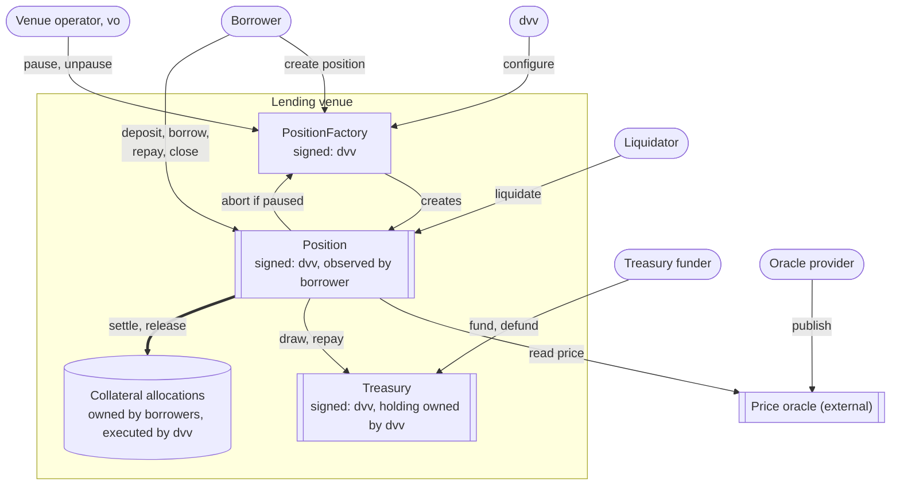
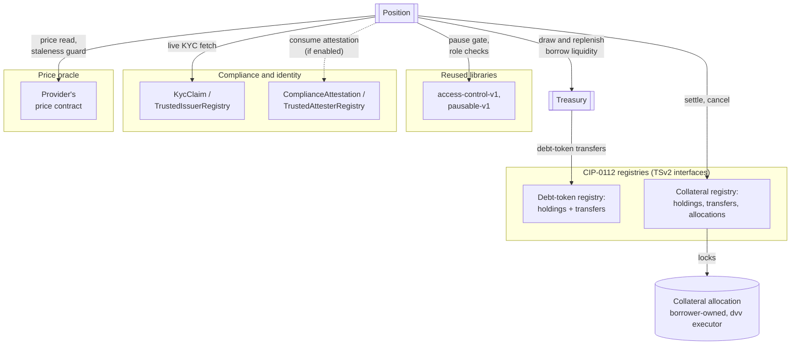
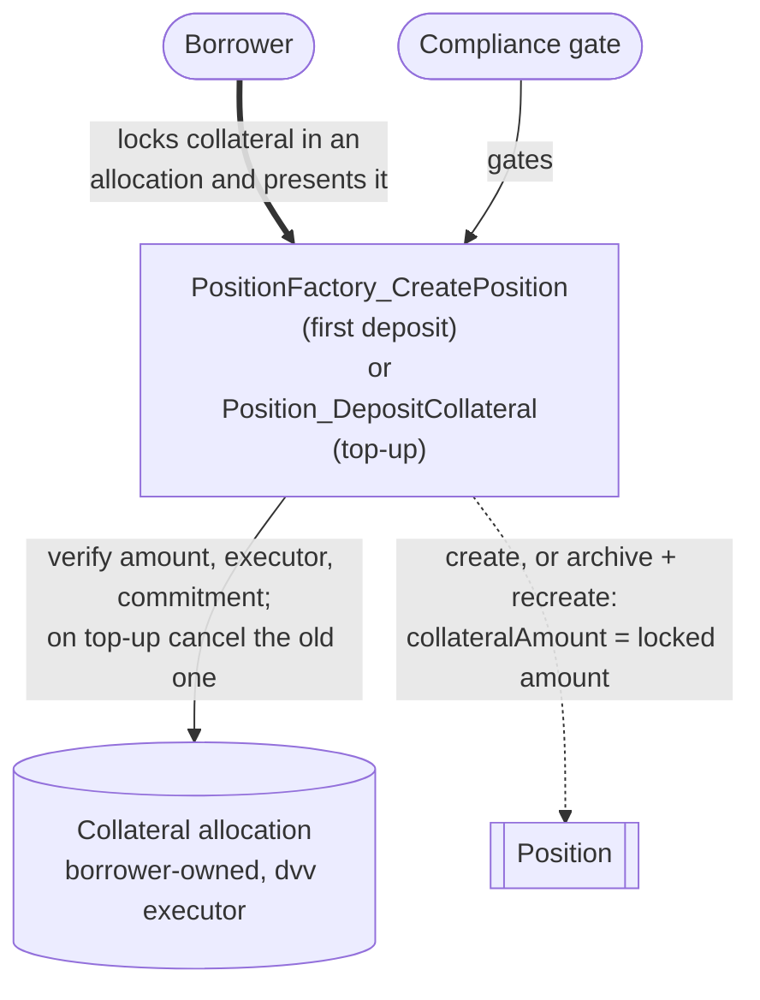
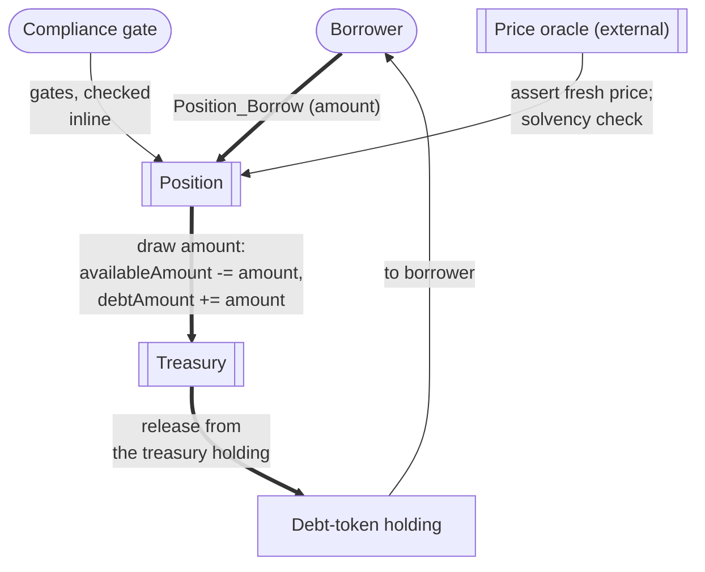
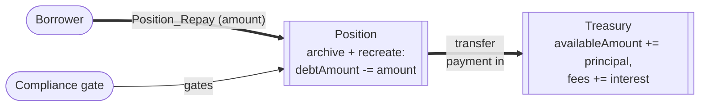
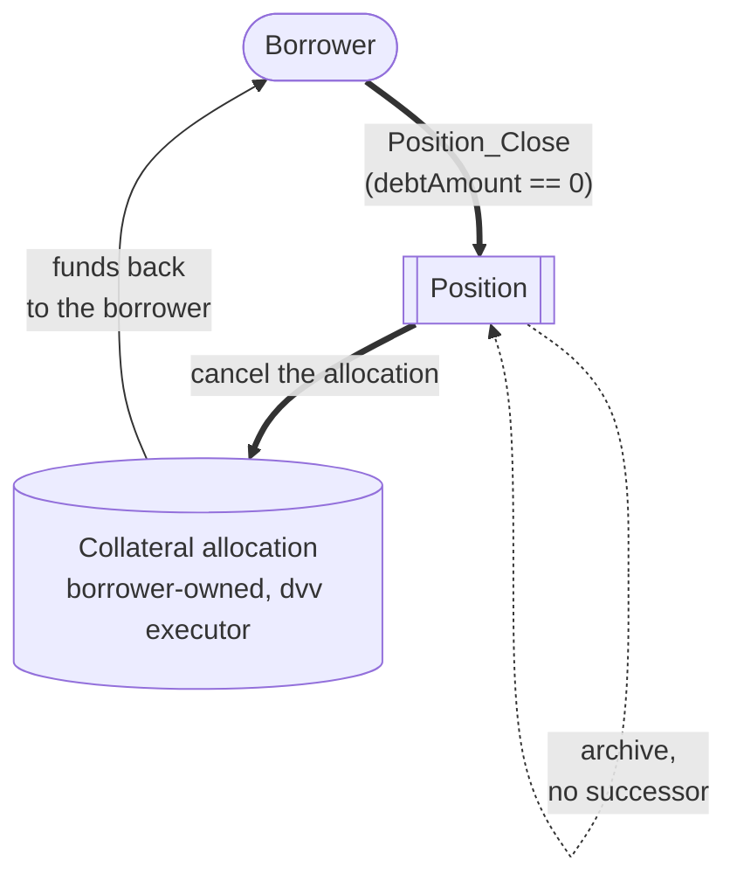
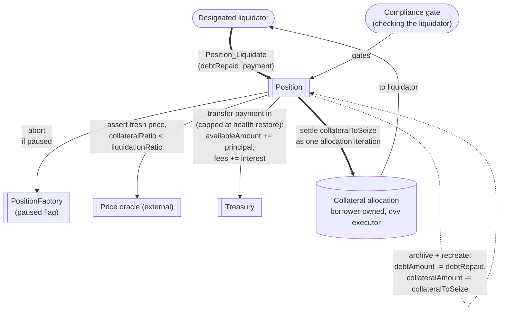
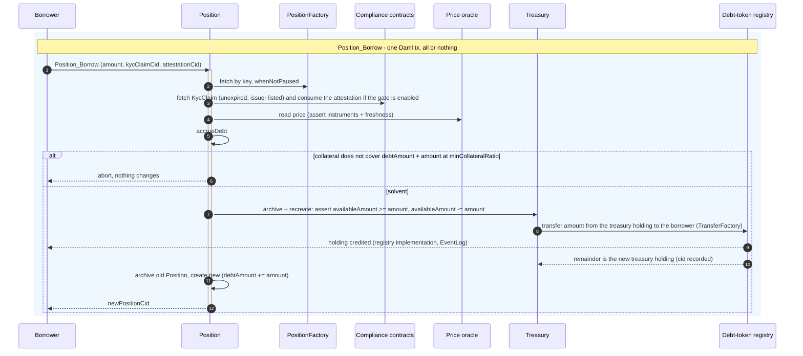
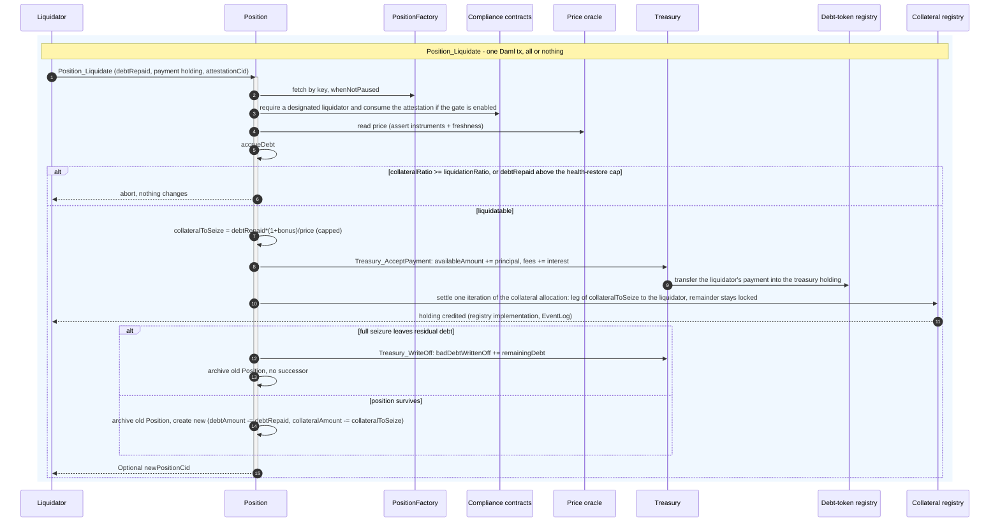

# Architectural Overview Report: Canton Reference Lending Venue

This report defines a reference architecture for a vault-based,
overcollateralized lending venue on Canton. It composes
reusable OpenZeppelin Daml components (access, pause) and bounded
experiments for the compliance and identity mechanisms into one target
application, settling through the Canton Network Token Standard V2 (TSv2).

## 1. Product Definition

The product is a lending venue for the Canton Network. Its core object is
the **Position**: an isolated collateralized debt position (CDP), held as a
discrete Daml contract. Four properties
define the protocol:

- **Fixed-rate.** The `interestRate` is immutable for the life of a
  position.
- **Open-term.** A position has no maturity date: it stays open until the
  owner repays and closes it, or it is liquidated.
- **Permissioned.** Every party acts under a verified identity: borrowers
  and liquidators need to pass KYC checks from a trusted issuer, and value
  movements can additionally be gated by per-operation compliance
  attestations ([compliance](#compliance-is-re-checked-on-every-operation)).
- **Overcollateralized.** A borrower must lock collateral worth more than the
  debt it backs: borrowing must keep `collateralRatio` at or above
  `minCollateralRatio`, and a position that falls under
  `liquidationRatio` becomes liquidatable. The interval between `minCollateralRatio` and `liquidationRatio` is the buffer that
  gives the borrower room to top up before liquidation becomes possible.

The design settles on [CIP-0112, the Canton Network Token Standard V2](https://github.com/canton-foundation/cips/blob/6f37c896a5a76ec3bc1aa67bc045623ae5df41e5/cip-0112/cip-0112.md):
every asset is a holding co-signed by its own registry, and the protocol
moves assets only through the TSv2 interfaces, so any conformant registry
works. The collateral and the **debt token** may both be issued by third
parties. A privileged **treasury funder** deposits debt tokens into the
venue's **treasury** and earns the interest; borrows draw from the
treasury, repayments flow back, and an exhausted treasury blocks new
borrows.

Every operation and fund movement is designed to be atomic: a borrow checks solvency
and draws debt tokens against a matching debt increase; a repayment returns
them against a matching decrease; a liquidation exchanges the
liquidator's payment for the seized collateral, in one transaction.

This report is a target architecture, not an implementation report: it
specifies the on-ledger contract shapes, the borrower wallet requirements,
the operator's off-ledger services, and the deployment topology of the
venue.

### Operational Scope and Boundaries

The target architecture keeps the core **deliberately small**: one treasury
per venue, one price dependency, one `Position` contract per borrower, and
direct transfers under authority the choices already carry, so authorization flow
and transaction shapes stay easy to audit. Operational conditions will be set through contract parameters
([consumption and customization](#consumption-and-customization)).
The tables below define the scope.

| Feature Category | In-Scope Architectural Components |
|---|---|
| Interest Model | A fixed, immutable `interestRate`; open-term positions with no maturity date. Accrual is **simple (non-compounding) interest** off the tracked principal ([section 3](#3-target-design)). |
| Core Flows | The five position flows: **position creation with collateral deposit**, **borrow**, **repay**, **liquidation**, and **close** (collateral return on a fully repaid position), plus the **treasury flows** to provision and reclaim borrow liquidity. How each flow moves value is specified in [section 3](#3-target-design). |
| Asset Representation | Fungible digital assets compliant with the CIP-0112 Token Standard V2 holding interfaces. Both the debt token and the collateral may be issued by any third party: collateral stays owned by the borrower, locked in an allocation the venue executes, and debt tokens move into and out of the `dvv`-owned treasury; nothing is minted or burned ([section 3](#3-target-design)). |
| Pricing | The read of the price: every price-dependent choice fetches the selected oracle provider's price contract and enforces the instrument and staleness guards on it ([section 4.4](#44-dependency-price-oracle)). |
| Fees | Interest accrues to the treasury funder as revenue and compensates it for absorbing bad debt; a configurable share of it accrues to the venue as its own revenue ([the treasury](#the-treasury)). The `liquidationBonus` is the liquidator's seizure premium, paid from the borrower's collateral. |
| Compliance & Control | **Compliance attestation**, optional per deployment: when enabled, no value-moving operation executes unless an attester has signaled compliance for it ([compliance](#compliance-is-re-checked-on-every-operation)). **Identity verification**: on-ledger KYC claims from trusted issuers. |
| Trust Topology | Validation-anchored venue: every `Position` and the `Treasury` are signed by a **decentralized venue validation party (`dvv`)**, hosted across several independent participant nodes with a confirmation threshold above 1. The `dvv` also owns the treasury holding and is the sole executor of every collateral allocation; solvency and seizure bounds are enforced on-ledger by DAML code rather than by operator discretion. The full party topology and submission model is documented in [party topology](#party-and-role-model-topology). |
| Component Integration | Reused OpenZeppelin packages and experiments and the CIP-0112 Splice interfaces ([section 2](#core-components-and-library-mapping)), plus patterns from [`OpenZeppelin/canton-token-template`](https://github.com/OpenZeppelin/canton-token-template). |

</br>

| Feature Category | Out-of-Scope Architectural Components |
|---|---|
| Interest Models | Dynamic, variable, or algorithmic rates, utilization rate curves and fixed maturity dates. |
| Leverage Facilities | Undercollateralized loans, flash loans, recursive leverage, and rehypothecation. |
| Liquidation Mechanics | Market-driven bidding-war auctions, and whole-position forced seizure regardless of payment. |
| Liquidity Provision | Open, multi-party liquidity provision. The treasury has a single privileged funder; depositors sharing its fees are an extension ([section 3](#extension-points)). |
| Price Oracle | The oracle is a dependency: its contract, its update mechanism or external service, and producing a price for the pair at all (by a direct feed or by composing per-instrument feeds off-ledger) are consumed as-is from a provider that meets the requirements in [section 4.4](#44-dependency-price-oracle). Multi-asset dynamic oracles and TWAP aggregators likewise remain outside this architecture. |
| Token Standard | Defining or extending the Token Standard V2 abstractions: the architecture consumes them as-is from upstream. CIP-56 and V1 allocation paths are outside this architecture. |
| Cross-Synchronizer Operation | Cross-synchronizer settlement and identity are **out of scope**; the architecture assumes a single synchronizer. |

### Target Ecosystem Participants

- **Institutional Asset Managers and Tokenized-Fund Issuers** can run high-value collateralized credit operations with deterministic outcomes and no public data leakage.
- **Asset Issuers and Large Token Holders** can put idle debt-token inventory to work as treasury liquidity, earning the venue's interest revenue against solvency-checked, overcollateralized debt.
- **Wallet and Client Integrators** can build the borrower-facing wallet
  flows (deposit, borrow, repay, close) on the specified direct transfers and
  collateral allocations,
  exposed to venue UIs over the
  [CIP-0103](https://github.com/canton-foundation/cips/blob/6f37c896a5a76ec3bc1aa67bc045623ae5df41e5/cip-0103/cip-0103.md)
  dApp API.

### Background: How to Think About Building a Lending Protocol on Canton

In the [ERC-4626](https://docs.openzeppelin.com/contracts/5.x/erc4626) lineage, one globally visible contract manages pooled liquidity, debt shares, and interest accrual for every party, broadcasting each one's collateral balance and liquidation threshold publicly. Building this protocol on Canton means rethinking two EVM assumptions, and each one leads to a design decision.

**Privacy by default.** Canton enforces **per-party projection**: a contract is an instance of a template, signed by a set of parties (its signatories) and visible only to them and to any observers. That is why each **position is its own contract** rather than a share in a pool. A position is visible only to the borrower, the venue's validation party (`dvv`, [party topology](#party-and-role-model-topology)), and the liquidators that police it.

**No in-place mutation.** State changes by archive-and-recreate, therefore changing `contractId`s. The design resolves the `Position`, `PositionFactory`, `Treasury`, the trusted-attester and trusted-issuer registries, and the external price oracle by **contract key** (reintroduced in [Canton 3.5.1+](https://github.com/digital-asset/canton/releases/tag/v3.5.1)). Keys are not unique, so the venue is responsible with enforcing uniqueness.

**Decentralizing a party.** The `dvv` party signs every venue contract, owns the treasury holding, and executes every collateral allocation, so the trust question moves from contracts to parties. Canton decentralizes a party along three independent axes:

1. **party governance** - whose signatures can change the party's identity and hosting (re-home the party to their own participant node and act freely);
2. **validation** - how many independent participant nodes must confirm the party's transactions (the `PartyToParticipant` confirmation threshold; a threshold above 1 defends against a malicious participant node, and such a party can no longer submit Ledger API commands directly - it acts through externally signed submissions or through choices submitted by others);
3. **authorization** - what the Daml signatory/controller topology requires regardless of hosting.

Three layers carry these axes: **organizations** (the legal entities that operate infrastructure and can be held accountable), their **participant nodes** (the infrastructure that hosts and confirms), and **parties** (the on-ledger identities hosted on those nodes). Guarantees are only as strong as the organizations behind the nodes: a party confirmed at threshold `f + 1` keeps its guarantees until `f + 1` distinct participant nodes collude, so the threshold should be spread across participant nodes of different organizations. The design assigns each role a deliberate position on each axis ([trust topology](#decentralization-and-trust-topology)).

**New versus existing components.** The venue adds one organization, the venue operator, and its own contracts: the `PositionFactory` and `Position`, the `Treasury`. When enabled, it also adds the trusted-attester and trusted-issuer registries. The `dvv` hosting consortium can be assembled from the operator and existing covalidation offerings ([trust topology](#decentralization-and-trust-topology)). Everything else is assumed to already exist: the debt token and the collateral are each administered by their issuer's own **registry** application, whose contracts hold the asset's holdings and transfer factory; the design assumes both registries implement the CIP-0112 TSv2 interfaces and support direct transfers, and the collateral registry additionally committed iterated allocations ([collateral](#collateral-stays-with-the-borrower)), and the two generally have different registrars. The price oracle is likewise external: a provider's price contract the positions read, selected by `dvv`.

*A note on contract keys*: they require the 3.5.1+ toolchain. The experiment packages referenced by this document predate that release and are keyless exploratory evidence; they will not be migrated. A production implementation starts on the 3.5.1+ SDK and resolves the keyed contracts from the outset.

---

## 2. Architecture Overview

The two block diagrams below show the main components of the target
architecture; the table that follows maps each block to its source.

The first diagram shows the actors, the venue's own contracts, and the external components they touch:


```mermaid
flowchart TB
    Consortium([dvv])
    Operator([Venue operator, vo])
    Funder([Treasury funder])
    Borrower([Borrower])
    Liquidator([Liquidator])
    Provider([Oracle provider])

    subgraph Target["Lending venue"]
        Factory["PositionFactory<br/>signed: dvv"]
        Position[["Position<br/>signed: dvv, observed by borrower"]]
        Treasury[["Treasury<br/>signed: dvv, holding owned by dvv"]]
        Collateral[("Collateral allocations<br/>owned by borrowers, executed by dvv")]
    end

    Oracle[["Price oracle (external)"]]

    Consortium -->|"configure"| Factory
    Operator -->|"pause, unpause"| Factory
    Funder -->|"fund, defund"| Treasury
    Borrower -->|"create position"| Factory
    Factory -->|"creates"| Position
    Borrower -->|"deposit, borrow,<br/>repay, close"| Position
    Liquidator -->|"liquidate"| Position
    Provider -->|"publish"| Oracle
    Position -->|"abort if paused"| Factory
    Position -->|"read price"| Oracle
    Position -->|"draw, repay"| Treasury
    Position ==>|"settle, release"| Collateral
```

The second shows the components the position choices depend on, grouped by
source:


```mermaid
flowchart TB
    Position[["Position"]]
    Treasury[["Treasury"]]
    Collateral[("Collateral allocation<br/>borrower-owned, dvv executor")]

    subgraph Libraries["Reused libraries"]
        Gov["access-control-v1,<br/>pausable-v1"]
    end

    subgraph Identity["Compliance and identity"]
        Kyc["KycClaim /<br/>TrustedIssuerRegistry"]
        Att["ComplianceAttestation /<br/>TrustedAttesterRegistry"]
    end

    subgraph Rail["CIP-0112 registries (TSv2 interfaces)"]
        Debt["Debt-token registry:<br/>holdings + transfers"]
        Coll["Collateral registry:<br/>holdings, transfers, allocations"]
    end

    subgraph Price["Price oracle"]
        Oracle["Provider's<br/>price contract"]
    end

    Position -->|"price read,<br/>staleness guard"| Oracle
    Position -->|"pause gate,<br/>role checks"| Gov
    Position -->|"live KYC fetch"| Kyc
    Position -->|"draw and replenish<br/>borrow liquidity"| Treasury
    Treasury -->|"debt-token transfers"| Debt
    Position -.->|"consume attestation<br/>(if enabled)"| Att
    Position -->|"settle, cancel"| Coll
    Coll -->|"locks"| Collateral
```

### Core Components and Library Mapping

Tags mark each component's source: `[PACKAGE]` for released packages and
`[EXPERIMENT]` for experimental packages in
[`OpenZeppelin/canton-contracts`](https://github.com/OpenZeppelin/canton-contracts)
or this repository, and `[STANDARD]` for upstream Splice Token Standard V2
interfaces consumed as pinned dependencies.

| Component Suite | Applied Templates and Libraries | Architectural Function |
|---|---|---|
| Access Control `[EXPERIMENT]` | `openzeppelin-access-control-v1`: [`RoleGrant`](https://github.com/OpenZeppelin/canton-contracts/blob/cec416d6e3c2118551c761d5598c403ab27ee342/experiments/access/access-control-v1/daml/OpenZeppelin/AccessControlV1.daml#L58), [`RoleAdmin`](https://github.com/OpenZeppelin/canton-contracts/blob/cec416d6e3c2118551c761d5598c403ab27ee342/experiments/access/access-control-v1/daml/OpenZeppelin/AccessControlV1.daml#L116), [`DefaultAdminTransferOffer`](https://github.com/OpenZeppelin/canton-contracts/blob/cec416d6e3c2118551c761d5598c403ab27ee342/experiments/access/access-control-v1/daml/OpenZeppelin/AccessControlV1.daml#L237), [`requireRole`](https://github.com/OpenZeppelin/canton-contracts/blob/cec416d6e3c2118551c761d5598c403ab27ee342/experiments/access/access-control-v1/daml/OpenZeppelin/AccessControlV1.daml#L287) | Role-based permissioning for the liquidator role, granted under the `dvv` authority. |
| Venue Constraints `[PACKAGE]` | `openzeppelin-api-pausable-v1`: [`Pausable`](https://github.com/OpenZeppelin/canton-contracts/blob/a2d576344fe96d49751b276e8c638e02ef682c57/packages/security/api-pausable-v1/daml/OpenZeppelin/Api/PausableV1.daml#L42); `openzeppelin-pausable-v1`: [`whenNotPaused`](https://github.com/OpenZeppelin/canton-contracts/blob/a2d576344fe96d49751b276e8c638e02ef682c57/packages/security/pausable-v1/daml/OpenZeppelin/PausableV1.daml#L46) | Emergency circuit breaker: the `PositionFactory` carries the `paused` flag and implements `Pausable`, every gated choice calls `whenNotPaused` on it, and `vo` can pause and unpause. |
| Asset Rails `[STANDARD]` | [CIP-0112 / Splice Token Standard V2](https://github.com/canton-foundation/cips/blob/6f37c896a5a76ec3bc1aa67bc045623ae5df41e5/cip-0112/cip-0112.md) interfaces: `Holding`, `Account`, `InstrumentId` (`Splice.Api.Token.HoldingV2`); `TransferFactory`, `TransferInstruction` (`Splice.Api.Token.TransferInstructionV2`); `Allocation`, `SettlementFactory` (`Splice.Api.Token.AllocationV2`); `AllocationFactory` (`Splice.Api.Token.AllocationInstructionV2`); `EventLog` (`Splice.Api.Token.TransferEventsV2`) | The interoperability boundary: every draw and payment is a direct transfer, and every collateral deposit locks an allocation that liquidation settles and release cancels, against any registry implementing these interfaces. |
| Compliance Attestation `[EXPERIMENT]` | `OpenZeppelin.TokenCIP112V1`: [`TrustedAttesterRegistry`](https://github.com/OpenZeppelin/canton-contracts/blob/7696749737885e25cd88422847105f890f03b00d/experiments/token/tokenCIP112-v1/daml/OpenZeppelin/TokenCIP112V1/D1.daml#L22), [`ComplianceAttestation`](https://github.com/OpenZeppelin/canton-contracts/blob/7696749737885e25cd88422847105f890f03b00d/experiments/token/tokenCIP112-v1/daml/OpenZeppelin/TokenCIP112V1/D1.daml#L53) | Demonstrates the single-use, registry-bound attestation the optional compliance gate consumes. |
| Identity Verification `[EXPERIMENT]` | `ShapeB`: [`KycClaim`](../../experiments/identity/hook-shape-b/daml/OpenZeppelin/Experimental/Identity/ShapeB.daml#L43), [`TrustedIssuerRegistry`](../../experiments/identity/hook-shape-b/daml/OpenZeppelin/Experimental/Identity/ShapeB.daml#L74) | Demonstrates the KYC compliance check. |

---

## 3. Target Design

### Party and Role Model Topology

Duties are segregated and mapped to discrete Daml parties. The venue
introduces two parties, `dvv` and `vo`, plus the roles below; the instrument
registries, the oracle provider, and the borrowers are pre-existing
network structure
([Background](#background-how-to-think-about-building-a-lending-protocol-on-canton)):

- **Decentralized Venue Validation (`dvv`)** - signs all venue state (the
  `PositionFactory`, every `Position`, the `Treasury`, and the
  compliance registries), owns the treasury holding, and is the sole
  executor of every position's collateral allocation. It sets the venue's
  operational parameters (`PositionParams`, the liquidator set, the oracle
  selection, the accepted attester and issuer lists) through
  consortium-approved configuration changes. It is multi-hosted at a
  confirmation threshold above 1. Its
  authority is **delegated** through the choices of the contracts it signs,
  which `vo` exercises
  ([trust topology](#decentralization-and-trust-topology)).
- **Venue Operator (`vo`)** - the party of the organization running the
  off-ledger backend, single-hosted on its own node: it handles pausing and the venue fee withdrawal, as well as serves the disclosed
  `PositionFactory` and `Treasury` to prospective borrowers and monitors
  positions and the oracle.
- **Treasury Funder** - provisions borrow liquidity and earns the interest net of the venue fee
  ([the treasury](#the-treasury)); typically the operator organization, the
  debt token's issuer, or a large holder. Opening the role to multiple
  providers at once is an extension ([extension points](#extension-points)).
- **Borrower** - an end-user locking collateral and drawing debt;
  only the borrower can commit their own holdings as collateral.
- **Liquidator** - observes positions, monitors solvency from its own
  projection, as well as exercises liquidations ([the CDP math](#the-cdp-math)).
- **Oracle Provider** - the external organization publishing the price
  contract the positions read; `dvv` selects it against the requirements of
  [section 4.4](#44-dependency-price-oracle).
- **Instrument Registrars** - the TSv2 registries of the debt token and the
  collateral, generally different organizations.

Each position's **collateral stays owned by the borrower**, locked in a
committed iterated allocation with `dvv` as executor and referenced from
the `Position` ([collateral](#collateral-stays-with-the-borrower)). It moves only through the position
choices (deposit, withdrawal, close, liquidation), which carry `dvv`'s
executor authority: the borrower cannot withdraw it unilaterally, and outside
those choices settling it would need the `dvv` consortium.

Visibility separates public market data from private positions: the
oracle provider's price contract must be visible, by observership or disclosure, to
every party that submits a price-dependent choice and to `dvv`; the
`PositionFactory` terms and the `Treasury`'s available
liquidity reach prospective borrowers through explicit disclosure served by
`vo`; each `Position` is visible to `dvv`, its borrower, and
its designated liquidators, so `dvv`'s nodes and the operator backend see
every position while no borrower sees another's.

### Decentralization and Trust Topology

Two questions decide each party's security posture: **how it is hosted and
validated**, and **who submits transactions in its name**. The following
table answers both:

| Party | Hosting and validation | Who submits in its name |
|---|---|---|
| `dvv` | multi-hosted on several participant nodes, confirmation threshold above 1; optionally also hosted on a regulator's or auditor's node, with observation permission or confirming | submits configuration changes only, as externally signed, consortium-approved transactions (factory and treasury creation, `PositionParams` including the oracle selection, the liquidator set, the attester and issuer lists); in every position and treasury flow its authority is exercised inside choices on contracts it signs, submitted by the party driving that flow |
| `vo` | single-hosted on the operator's participant node, which also hosts one of the `dvv` replicas, so the backend reads the venue's state there | pauses and unpauses, and withdraws the venue fee share; the backend discloses and monitors off-ledger |
| Treasury funder | its own participant node; whether to multi-host it is the funder's own decision | submits `Treasury_Fund` and `Treasury_Defund` |
| Oracle provider | external organization, selected against [section 4.4](#44-dependency-price-oracle) | publishes its own price contract, never venue flows |
| Liquidators | their own participant nodes; several independently granted parties, so liquidation liveness never hinges on one keeper | performs liquidations |
| Borrowers | their own participant node or locally hosted, their own keys | submit deposits, borrows, repayments, withdrawals, closes, and allocation refreshes from their wallet (CIP-0103) |
| Instrument registrars admin | external organizations | submit their own registry operations |

The `dvv` party is decentralized because **treasury and collateral outflows
are executor trust**: whoever holds `dvv`'s authority can move the treasury
holding or settle every collateral allocation at the registry level, outside
the solvency-coupled choices. Multi-hosting removes that:
the `dvv` authority is reachable only through the venue's choices or through
externally signed transactions that `f + 1` hosting organizations approve.
One hosting candidate is the
[covalidation service provider](https://docs.digitalasset.com/covalidation/overview).

**A minimal viable deployment.** `dvv` is hosted on three confirming
participant nodes, one per organization, with a confirmation threshold of 2
of 3:

| Organization | Role for `dvv` | Other responsibilities |
|---|---|---|
| Venue operator | confirming node | hosts `vo`; runs the backend and the disclosure API; pauses; typically fills the treasury funder role |
| Venue validator A (covalidation offering) | confirming node | - |
| Venue validator B (covalidation offering) | confirming node | - |
| Oracle provider (external) | - | publishes the price contract the positions read |
| Regulator or auditor (optional) | observing node | independent monitoring of every position and price |

A threshold of 2 of 3 means breaking the guarantees `dvv` checks takes two
colluding organizations; changing venue configuration is likewise a 2-of-3
consortium action. Larger deployments add covalidation organizations and
raise the threshold.

**The pause authority** sits with `vo`, single-hosted, so an emergency stop
is instant. The price is griefing: a malicious operator can freeze the venue's
flows, though no funds are stranded and everything resumes when the pause
lifts; a pause in a falling market is an open question
([section 7](#7-open-design-questions-for-the-implementation-phase)).

### The CDP Math

Two figures track a position: `principalAmount` is the debt tokens drawn from the treasury and not yet repaid, and `debtAmount` is what the borrower owes - that principal plus the interest accrued on it - so `principalAmount <= debtAmount` always. A position's health is its **collateral ratio**: `collateralRatio = (collateralAmount · price) / debtAmount`, priced by the oracle. Borrowing and collateral withdrawal must keep the ratio at or above `PositionParams.minCollateralRatio`; falling below the `liquidationRatio` makes the position liquidatable.

The position utilizes **simple interest accrual**: `accrueDebt` computes `newDebt = oldDebt + principalAmount · interestRate · elapsedYears`, where `elapsedYears` derives from `now - lastAccrualTime`. Accrual runs on every state-changing choice before the solvency check, and `lastAccrualTime` resets on each recreation. Because interest is always charged on the principal, it does not matter how often accrual runs: two accruals over `t₁` and `t₂` add exactly what one accrual over `t₁+t₂` would.

**Liquidation arithmetic (payment-proportional, health-restoring).** Two bounds govern every liquidation pass: the collateral released is proportional to the payment, and the payment is capped at exactly what returns the position to health.

```text
-- Seizure is proportional to the payment:
collateralToSeize = min(collateralAmount, debtRepaid · (1 + liquidationBonus) / price)

-- The smallest repayment that lifts the ratio back to minCollateralRatio:
restoreAmount = (minCollateralRatio · accruedDebt - collateralAmount · price)
                / (minCollateralRatio - 1 - liquidationBonus)

-- The payment cap, by regime:
repayCap = if collateralRatio > 1 + liquidationBonus
           then restoreAmount                                      -- restorable
           else collateralAmount · price / (1 + liquidationBonus)  -- full absorption

debtRepaid <= repayCap
```


Taking each element of the codeblock in turn:

- **Proportional seizure.** `debtRepaid` is the amount the liquidator's own exercise pays into the treasury in the same transaction, never the position's full accrued debt, so a liquidator can never take more collateral than their payment (plus bonus) buys.
- **Restorable position (`collateralRatio > 1 + liquidationBonus`).** Repaying `x` reduces the debt to `accruedDebt - x` and the collateral value to `collateralAmount · price - x · (1 + liquidationBonus)`. While the ratio sits above `1 + liquidationBonus`, every such repayment raises it, so the position can be cured. `restoreAmount` is the exact `x` that brings the ratio back to `minCollateralRatio`, and it caps the payment: a smaller `debtRepaid` moves the position partway back to health, one equal to `restoreAmount` restores it fully, and the choice rejects anything larger, so a liquidation never repays or seizes more than the cure requires. The restore target is `minCollateralRatio` rather than `liquidationRatio`, so a cured position lands inside the cure buffer instead of on the liquidation boundary. A partial liquidation that leaves the position unhealthy can be liquidated again immediately.
- **Underwater position (`collateralRatio <= 1 + liquidationBonus`).** No repayment can restore health, so the cap becomes what the remaining collateral can pay for: the pass seizes all of it, writes the uncovered remainder off against the treasury as bad debt, and closes the position, so no zero-collateral position survives.
- **Well-definedness.** Venue configuration requires `minCollateralRatio > liquidationRatio > 1 + liquidationBonus`. The first gap is the borrower's cure buffer; the second keeps the restorable regime reachable, so a newly liquidatable position can still be partially cured; and the chain keeps `restoreAmount`'s denominator positive and its value within what the collateral supports.

### Data and State Flow

The diagrams below show the five position flows: **A** creation and collateral deposit, **B** borrow, **C** repay, **D** close, **E** liquidation. Each is one ledger transaction: the position choice computes the amounts and initiates the transfers and allocation settlements ([collateral](#collateral-stays-with-the-borrower)), and the registries' own implementations move the holdings and emit the events. `Compliance gate` stands for the checks of [compliance](#compliance-is-re-checked-on-every-operation).

**A. Position creation and collateral deposit.** The first deposit goes through `PositionFactory_CreatePosition`: the borrower's wallet locks the collateral in a committed allocation naming `dvv` as executor, and the choice verifies it and creates the `Position` referencing it ([section 4.1](#41-component-positionfactory-and-position-creation)). A top-up goes through `Position_DepositCollateral` with a replacement allocation for the new total: the choice cancels the old one and records the new.


```mermaid
flowchart TD
    Borrower([Borrower])
    Compliance(["Compliance gate"])
    Choice["PositionFactory_CreatePosition<br/>(first deposit)<br/>or<br/>Position_DepositCollateral<br/>(top-up)"]
    Position[["Position"]]
    Collateral[("Collateral allocation<br/>borrower-owned, dvv executor")]

    Borrower ==>|"locks collateral in an<br/>allocation and presents it"| Choice
    Compliance -->|"gates"| Choice
    Choice -->|"verify amount, executor, commitment;<br/>on top-up cancel the old one"| Collateral
    Choice -.->|"create, or archive + recreate:<br/>collateralAmount = locked amount"| Position
```

**B. Borrow (treasury draw coupled to debt).** The position checks compliance, reads the current price, checks the treasury's un-borrowed liquidity, and asserts that the collateral covers the new debt; if so, it draws the tokens to the borrower and records the higher debt.


```mermaid
flowchart TD
    Borrower([Borrower])
    Compliance(["Compliance gate"])
    Oracle[["Price oracle (external)"]]
    Position[["Position"]]
    Treasury[["Treasury"]]
    Coin["Debt-token holding"]

    Borrower ==>|"Position_Borrow (amount)"| Position
    Compliance -->|"gates, checked<br/>inline"| Position
    Oracle -->|"assert fresh price;<br/>solvency check"| Position
    Position ==>|"draw amount:<br/>availableAmount -= amount,<br/>debtAmount += amount"| Treasury
    Treasury ==>|"release from<br/>the treasury holding"| Coin
    Coin -->|"to borrower"| Borrower
```

**C. Repay.** `Position_Repay` transfers the payment from the borrower's wallet into the treasury and records the lower debt. No quote step is needed: accrual is deterministic and the borrower sees the position, so the user interface computes the exact payoff itself.


```mermaid
flowchart LR
    Borrower([Borrower])
    Compliance(["Compliance gate"])
    Position[["Position<br/>archive + recreate:<br/>debtAmount -= amount"]]
    Treasury[["Treasury<br/>availableAmount += principal,<br/>fees += interest"]]

    Borrower ==>|"Position_Repay (amount)"| Position
    Compliance -->|"gates"| Position
    Position ==>|"transfer<br/>payment in"| Treasury
```

**D. Close.** `Position_Close` winds down a fully repaid position: it cancels the collateral allocation, which returns the collateral to the borrower, and archives the `Position`. A one-shot exit submits repay and close in a single command, and the pair commits atomically.


```mermaid
flowchart TD
    Borrower([Borrower])
    Position[["Position"]]
    Collateral[("Collateral allocation<br/>borrower-owned, dvv executor")]

    Borrower ==>|"Position_Close<br/>(debtAmount == 0)"| Position
    Position ==>|"cancel the allocation"| Collateral
    Collateral -->|"funds back<br/>to the borrower"| Borrower
    Position -.->|"archive,<br/>no successor"| Position
```

**E. Liquidation.** Once `collateralRatio` is below `liquidationRatio`, a designated liquidator pays debt tokens into the treasury, capped at what restores health, and receives collateral worth the payment plus the liquidation bonus at the current oracle price, settled out of the borrower's allocation ([the CDP math](#the-cdp-math)).


```mermaid
flowchart TD
    Liquidator([Designated liquidator])
    Compliance(["Compliance gate<br/>(checking the liquidator)"])
    Position[["Position"]]
    Factory[["PositionFactory<br/>(paused flag)"]]
    Oracle[["Price oracle (external)"]]
    Treasury[["Treasury"]]
    Collateral[("Collateral allocation<br/>borrower-owned, dvv executor")]

    Liquidator ==>|"Position_Liquidate<br/>(debtRepaid, payment)"| Position
    Compliance -->|"gates"| Position
    Position -->|"abort<br/>if paused"| Factory
    Position -->|"assert fresh price,<br/>collateralRatio < liquidationRatio"| Oracle
    Position -->|"transfer payment in<br/>(capped at health restore):<br/>availableAmount += principal,<br/>fees += interest"| Treasury
    Position ==>|"settle collateralToSeize<br/>as one allocation iteration"| Collateral
    Collateral -->|"to liquidator"| Liquidator
    Position -.->|"archive + recreate:<br/>debtAmount -= debtRepaid,<br/>collateralAmount -= collateralToSeize"| Position
```

### The Position Flows: Step by Step

This walkthrough names the concrete choices behind the flows:

1. **Treasury funding.** `Treasury_Fund` transfers debt tokens into the treasury and raises `availableAmount`; `Treasury_Defund` reclaims un-borrowed liquidity and accrued fees.
2. **Position creation.** The borrower's wallet locks the collateral in a committed iterated allocation executed by `dvv` and presents it to `PositionFactory_CreatePosition`, which runs the compliance gate, verifies the allocation, and instantiates the `Position` referencing it.
3. **Collateral deposit, withdrawal, and refresh.** `Position_DepositCollateral` replaces the allocation with a larger one; `Position_WithdrawCollateral` cancels it and re-allocates the remainder while the solvency check passes, so the difference returns to the borrower's account; `Position_RefreshCollateral` replaces it before its deadline ([collateral](#collateral-stays-with-the-borrower)).
4. **Borrow.** `Position_Borrow` runs the compliance gate, requires `availableAmount` to cover the request and `collateralRatio` to stay at or above `minCollateralRatio` at a fresh oracle reading, then draws the tokens and increments `debtAmount`.


```mermaid
sequenceDiagram
    autonumber
    participant B as Borrower
    participant P as Position
    participant F as PositionFactory
    participant C as Compliance contracts
    participant O as Price oracle
    participant T as Treasury
    participant R as Debt-token registry

    rect rgb(240, 248, 255)
    Note over B, R: Position_Borrow - one Daml tx, all or nothing
    B->>P: Position_Borrow (amount, kycClaimCid, attestationCid)
    activate P
    P->>F: fetch by key, whenNotPaused
    P->>C: fetch KycClaim (unexpired, issuer listed) and consume the attestation if the gate is enabled
    P->>O: read price (assert instruments + freshness)
    P->>P: accrueDebt
    alt collateral does not cover debtAmount + amount at minCollateralRatio
        P-->>B: abort, nothing changes
    else solvent
        P->>T: archive + recreate: assert availableAmount >= amount, availableAmount -= amount
        T->>R: transfer amount from the treasury holding to the borrower (TransferFactory)
        R-->>B: holding credited (registry implementation, EventLog)
        R-->>T: remainder is the new treasury holding (cid recorded)
        P->>P: archive old Position, create new (debtAmount += amount)
        P-->>B: newPositionCid
    end
    deactivate P
    end
```

5. **Repay.** `Position_Repay` transfers the payment into the treasury and reduces `debtAmount`.
6. **Close.** `Position_Close` cancels the allocation of a fully repaid position, returning the collateral to the borrower, and archives it.
7. **Liquidation.** Below `liquidationRatio`, `Position_Liquidate` takes `debtRepaid` (capped by the health-restore formula) into the treasury and settles the proportional collateral to the liquidator as one allocation iteration, recreating the residual `Position` or, when a full seizure leaves residual debt, writing it off against the treasury and closing the position.


```mermaid
sequenceDiagram
    autonumber
    participant L as Liquidator
    participant P as Position
    participant F as PositionFactory
    participant C as Compliance contracts
    participant O as Price oracle
    participant T as Treasury
    participant RD as Debt-token registry
    participant RC as Collateral registry

    rect rgb(240, 248, 255)
    Note over L, RC: Position_Liquidate - one Daml tx, all or nothing
    L->>P: Position_Liquidate (debtRepaid, payment holding, attestationCid)
    activate P
    P->>F: fetch by key, whenNotPaused
    P->>C: require a designated liquidator and consume the attestation if the gate is enabled
    P->>O: read price (assert instruments + freshness)
    P->>P: accrueDebt
    alt collateralRatio >= liquidationRatio, or debtRepaid above the health-restore cap
        P-->>L: abort, nothing changes
    else liquidatable
        P->>P: collateralToSeize = debtRepaid*(1+bonus)/price (capped)
        P->>T: Treasury_AcceptPayment: availableAmount += principal, fees += interest
        T->>RD: transfer the liquidator's payment into the treasury holding
        P->>RC: settle one iteration of the collateral allocation: leg of collateralToSeize to the liquidator, remainder stays locked
        RC-->>L: holding credited (registry implementation, EventLog)
        alt full seizure leaves residual debt
            P->>T: Treasury_WriteOff: badDebtWrittenOff += remainingDebt
            P->>P: archive old Position, no successor
        else position survives
            P->>P: archive old Position, create new (debtAmount -= debtRepaid, collateralAmount -= collateralToSeize)
        end
        P-->>L: Optional newPositionCid
    end
    deactivate P
    end
```

**Monitoring.** The operator backend and the liquidator keepers work from
**ACS ingestion**, in the style of Splice triggers: a keeper acts when a
position it observes falls under `liquidationRatio`; the backend alerts when
the oracle approaches `maxStaleness`, the treasury nears exhaustion, a
collateral allocation nears its deadline unrefreshed, or a submission is
rejected. Clients track their flows by the position's contract
key rather than by command id: a submission either commits as the successor
contract or is rejected and retried against the current state
([section 5.4](#54-failure-modes-and-recovery)).

### Time Model

Time plays three roles in the design: interest accrual off `lastAccrualTime`,
the oracle staleness guard, and the collateral allocation deadline
([collateral](#collateral-stays-with-the-borrower)). Ledger time is accurate only to
`ledgerTimeRecordTimeTolerance` (60s default), so `maxStaleness` is measured
in ledger time and must exceed the tolerance by a wide margin. Externally signed (prepared) transactions must be submitted
within 24h by default
([CIP-0107](https://github.com/canton-foundation/cips/blob/6f37c896a5a76ec3bc1aa67bc045623ae5df41e5/cip-0107/cip-0107.md)),
which bounds any flow signed through a custodian or by a multi-hosted
funder. Attestations, where enabled, are single-use with a short validity
window that must cover the client's submission time
([compliance](#compliance-is-re-checked-on-every-operation)).

### Collateral Stays With the Borrower

Both instruments are only transferred, never minted or burned, so
third-party-issued assets (a custodian bank's deposit token, a tokenized
treasury bill) are compatible. Collateral never changes owner while a
position is open: the borrower locks it in a **committed iterated
allocation** ([CIP-0112](https://github.com/canton-foundation/cips/blob/6f37c896a5a76ec3bc1aa67bc045623ae5df41e5/cip-0112/cip-0112.md#436-committed-allocations-and-iterated-settlement)) naming `dvv` as executor, and the `Position`
references it. Committed means the borrower cannot withdraw it; iterated
means the venue can settle part of it, as a liquidation does. Because `dvv`
signs every `Position`, a position choice carries the executor authority, so
no flow waits on the borrower, a receiver acceptance, or a settlement
counterparty: liquidation settles one iteration with a transfer leg to the
liquidator, withdrawal cancels the allocation and re-allocates the remainder
in the same transaction, close cancels it. The registry keeps attributing the
collateral to the borrower, so a freeze reaches one customer, and the venue
never holds customer funds. The treasury differs: its liquidity is a
`dvv`-owned holding, since the funder is a single professional counterparty.

**Allocation lifetime.** Registries cap how long an allocation may live and
may expire an idle one, while positions are open-term, so the borrower's
wallet refreshes the allocation before its deadline through
`Position_RefreshCollateral`, which swaps the reference in the same
transaction. A position whose allocation is inside its refresh window with
no replacement becomes liquidatable regardless of ratio, so the lock never
lapses on outstanding debt. A long deadline, months rather than days, keeps
refreshes rare and also gives borrowers a bounded exit should the venue
itself disappear.

**Instant-transfer requirement.** Every flow requires both registries to
complete a transfer under that in-choice authority, in the same transaction.
A registry that interposes its own asynchronous step, such as a registrar
acceptance or a pending state resolved by registry automation, would split
the flow in two and break its atomicity, so such an instrument is not
supported; before listing an instrument the venue verifies that its
registry completes a transfer on the holder's authority alone, with no
custodian or registrar step. The collateral registry must additionally
support committed iterated allocations with the lifetime policy above, and
instruments whose locked amounts decay are excluded or over-collateralized.

**Accounting equals holdings.** The `Position`'s `collateralAmount` and the
`Treasury`'s figures are `Decimal` accounting; the value lives in TSv2
contracts. The `Position` references its allocation
(`collateralAllocationCid`) and the `Treasury` a **single consolidated
`Holding`** (`holdingCid`), each resolved at exercise time rather than
trusted blindly; every flow settles against or merges into them in the same
transaction that updates the accounting and records the successor id, so
`collateralAmount == locked amount` per position and `availableAmount` plus
the fee balances `== treasury holding` cannot drift, and no separate
consolidation step exists.

### The Treasury

Borrow liquidity lives in the **treasury**: a debt-token holding owned by
`dvv`, tracked by a `Treasury` contract
carrying the accounting: `availableAmount`, the un-borrowed liquidity;
`feesAccrued`, the funder's collected interest; `venueFeesAccrued`, the venue's; and `badDebtWrittenOff`, the
funder's recognized losses. The funder provisions it with `Treasury_Fund`
and reclaims un-borrowed liquidity and revenue with `Treasury_Defund`.

Every payment on repay or liquidation is `principal + accrued
interest` and transfers into the treasury in full: the principal portion
replenishes `availableAmount`, immediately borrowable again, and the
interest portion splits between `feesAccrued`, the funder's revenue, and
`venueFeesAccrued`, the venue's, in the proportion `venueFeeShare` that
`dvv` sets; `vo` withdraws the venue's share with
`Treasury_WithdrawVenueFees`, and how the consortium members split it is an
off-ledger agreement. Borrow
asserts `availableAmount` covers the request and decrements it; **an
exhausted treasury blocks new borrows**. A liquidation
shortfall is written off against the treasury: interest is the funder's
compensation for that risk. Borrowers acquire the debt tokens they owe as
interest on the open market, so repayment capacity is never bounded by the
venue's own liquidity.

Treasury outflows are reachable only through the solvency-coupled borrow
choice and the funder-controlled defund; the residual is `dvv` consortium
collusion ([section 5.1](#51-security-invariants)). Pooling liquidity makes
the `Treasury` the venue's serialization point
([section 5.5](#55-throughput-and-contention)); extending it to multiple
independent liquidity providers is an extension
([extension points](#extension-points)).

### Compliance is Re-checked on Every Operation

The **compliance gate** has two layers. Identity: a borrower holds a
`KycClaim` from an issuer in the `TrustedIssuerRegistry`; creation verifies
it, and every risk-increasing choice (borrow, deposit, withdrawal) re-fetches
it live, so an archived claim or a delisted issuer blocks those flows
immediately. Attestation, optional per deployment: when `PositionParams`
names a trusted-attester registry, every flow except close consumes one
single-use attestation inline, fail-closed. Both lists are `dvv`
configuration ([trust topology](#decentralization-and-trust-topology)).

Winding a position down never depends on the borrower's standing: repay and
close reduce risk, and liquidation checks the liquidator's compliance, so a
non-compliant position can always be repaid or liquidated, never trapped.

### Oracle Handling

A single trusted price feed plus a single liquidator would be the largest
live attack surface, so the design hardens the price path on the consumer
side and places the rest on the dependency
([section 4.4](#44-dependency-price-oracle)):

- **Named quote instrument.** The price contract carries a `debtInstrumentId` alongside `collateralInstrumentId`, so `price` is unambiguously "units of the debt token per unit of collateral". Consumers assert both ids match the position's.
- **Max-staleness guard.** Every price-dependent choice rejects when `now - updatedAt > maxStaleness`, so a stalled feed cannot drive liquidations or fresh borrows against a dead price.
- **Operator monitoring.** The backend watches the feed for staleness and out-of-band moves, and `vo` halts the venue on a suspect feed ([monitoring](#the-position-flows-step-by-step)).

### Authority and Privilege Transfer

Every privileged action traces to a named authority, and no single admin
holds them all: treasury transfers and collateral settlements sit with `dvv`, reachable
only through the position choices; funding and fee withdrawal with the
treasury funder; liquidation with the liquidators; price publication with the
oracle provider; the pause and the venue fee withdrawal with `vo`; and venue configuration, including the
liquidator, attester, and issuer lists, with the `dvv` consortium. Swappable
roles (liquidators) are granted and revoked through
`openzeppelin-access-control-v1`; fixed holders (the borrower on its
position, the funder on the treasury) are bound by direct controllership.
There is no ownership-handover contract: changing the organizations behind
`dvv` is a hosting change at the party layer.

### Smart Contract Upgrade Process

The lending application will use Smart Contract Upgrade (SCU) for additive
changes to its own packages. An additive release will keep the package name,
raise the version, set `upgrades:` to the prior deployed DAR, and only append
`Optional` fields to existing templates, records, and choice arguments; the
[Canton SCU guide](https://docs.canton.network/appdev/deep-dives/smart-contract-upgrade)
defines the remaining compatibility rules. SCU preserves a representable data
shape, not loan economics.

Upgrades are themselves a `dvv`-authority concern: a new package version
changes what the contracts carrying `dvv`'s authority (the `PositionFactory`,
every `Position`, and the `Treasury`) can do. Protection sits at the
**vetting layer**: each of the `dvv` party's hosting nodes decides which
package versions it vets, and a transaction using an upgraded package
confirms only once the confirmation threshold of those nodes accepts it.
Deploying an upgrade is therefore an explicit act of the hosting consortium,
effectively a multi-sig over code, and no single operator or node can deploy
an upgrade that abuses the `dvv` authority.

Every release will first define what each new `Optional` field means for a v1
`Position`, `PositionParams`, and `Treasury` record: v1 contracts read as
`None` under v2 code, but a v2 record carrying `Some` may not be usable by an
old, exact-version workflow. The release will test both directions: v1
positions under the v2 implementation, and the expected rejection of an old
client facing populated v2 data.

As a worked example, take a new per-position debt ceiling.

Adding a new, hardened borrow choice is not enough: the existing `Position_Borrow`
stays callable, so the ceiling would be optional. The v2 release therefore
changes the body of `Position_Borrow` itself to enforce a ceiling stored as a new
`debtCeiling : Optional Decimal` on `PositionParams`. Existing params read as `None` under v2 code, so the release must
state what `None` means: an uncapped grandfathered position, a defined
conservative cap, or a position that must migrate before borrowing again.

The populated field is also what retires the old code path. SCU does not delete
the v1 DAR: while it stays vetted, a caller can pin the old package id and run
the old choice body, so a deprecation marker is not an access control. Once
`PositionParams` is recreated with `Some ceiling`, its data no longer downgrades
to a v1 view, so the old `Position_Borrow` cannot execute against it.
Liquidation fixes follow the same principle: the fix lands in the body of the
existing liquidation path, and binding every caller needs the same data-level
cutoff or the breaking-change path below.

Changes to interest accrual, fee allocation, collateral valuation, or the
liquidation terms will require a separate economic decision: new positions can
carry revised terms, and existing borrowers keep theirs unless they consent to
migrate. A change to parties, keys, custody, or a policy that must be unusable
for every caller is breaking: a separately named package and template, with
active positions migrated during a maintenance window.

Before release, the operators will run `dpm build` with the `upgrades:`
lineage and `dpm upgrade-check --both`, vet the DARs at the affected
participants, switch services and wallets together to the target package
preference, and exercise borrow, repay, withdraw, liquidation, oracle staleness,
and emergency recovery on LocalNet against live v1 positions.

### Extension Points

Protocol-level extensions the architecture supports follow the classification
above. They use SCU only when they preserve the data and economics of live
positions:

- **Debt ceilings.** A per-position `Optional` cap in `PositionParams` and an aggregate ceiling on the `PositionFactory`, enforced in `Position_Borrow`; bounds the damage of a bad price or a bad borrower. The [SCU process](#smart-contract-upgrade-process) walks through its rollout.
- **Compounding interest variant.** A new immutable terms revision for positions that select discrete compounding, never retroactive.
- **Liquidity providers.** Opening the treasury to multiple independent depositors: each funds debt tokens, shares `feesAccrued` and splits the risk with the rest.

### Consumption and Customization

Adopters consume the lending packages in one of two ways, with the
recommended option to be decided at implementation time:

- **Import the published DAR.** The packages keep the OpenZeppelin name and
  upgrade lineage: integration and fixes are ordinary dependency upgrades,
  but a template patch can only arrive as an OpenZeppelin release (or a full
  migration). Package names are global and SCU is scoped to them, so two
  applications sharing a library DAR also share its upgrade lineage.
- **Vendor and rename.** The adopter copies the source at a pinned, audited
  release and republishes it under its own package name: it owns the upgrade
  lineage and can deploy fixes independently of any third party, at the price
  of maintaining the fork and stepping outside the audited artifact with any
  local change.

Either way, behavior that varies per deployment (`PositionParams`, including
the oracle selection and `maxStaleness`, the liquidator set, the attester and
issuer lists) is expressed as fields and `Optional` configuration on the
venue's contracts, changed through governed choices rather than code
changes. Beyond the TSv2 asset interfaces and the OpenZeppelin `Pausable`
view, the design defines no Daml interfaces or hook contracts of its own: every position, treasury, and oracle
reference is a statically linked template resolved by key, which keeps the
reachable transaction shapes fixed and auditable.

---

## 4. Sample Component Structure

These snippets show the **shape** of each component: types, signatories,
keys, and choice declarations, with choice bodies summarized in comments
rather than implemented. They are **design sketches**, not yet implemented in
any end-to-end Daml Script. The declarations follow the vendored Splice V2
API shapes; `accrueDebt`, `collateralRatio`, and `liquidationRepayCap` are
the formulas of [the CDP math](#the-cdp-math).

### 4.1 Component: PositionFactory and Position Creation

The `PositionFactory` is the venue's standing position-creation offer: a
`dvv`-signed contract carrying the terms (`PositionParams` and the instrument
pair) and the venue's `paused` flag. A borrower creates their position unilaterally; creation
verifies the borrower's collateral allocation in the same transaction, so a
position is never created empty.

```daml
template PositionFactory
  with
    dvv : Party
    vo : Party
    params : PositionParams
    collateralInstrumentId : InstrumentId
    debtInstrumentId : InstrumentId
    paused : Bool
  where
    signatory dvv
    observer vo
    key dvv : Party
    maintainer key

    interface instance Pausable for PositionFactory where
      view = PausableView with paused

    -- Body (omitted): whenNotPaused this; reject a duplicate (dvv, borrower,
    -- positionId); run the compliance gate on the borrower; verify the
    -- presented allocation (authorizer borrower, executor dvv, committed,
    -- locked amount = initialCollateral); create the Position referencing
    -- it, with zero debt.
    nonconsuming choice PositionFactory_CreatePosition : ContractId Position
      with
        borrower : Party
        positionId : Text
        initialCollateral : Decimal
        kycClaimCid : ContractId KycClaim
        collateralAllocationCid : ContractId Allocation
        attestationCid : Optional (ContractId ComplianceAttestation)
      controller borrower

    -- Body (omitted): whenNotPaused this, then recreate with paused = True;
    -- PositionFactory_Unpause mirrors it with whenPaused.
    choice PositionFactory_Pause : ContractId PositionFactory
      controller vo
```

### 4.2 Component: Position State and Liquidation

The `Position` holds one borrower's CDP state; its consuming choices archive it and recreate the successor with updated figures. `dvv` is its only signatory and the borrower an observer, so liquidation needs no confirmation from the borrower's node and a silent or unvetted borrower cannot stall it. The borrower's own choices run under their controller authority; their collateral stays in their own name, and their protection is the choice logic plus the `dvv` threshold.

```daml
template Position
  with
    dvv : Party
    borrower : Party
    positionId : Text
    collateralInstrumentId : InstrumentId
    debtInstrumentId : InstrumentId
    collateralAllocationCid : ContractId Allocation   -- borrower-owned, dvv executor
    collateralLockDeadline : Time
    collateralAmount : Decimal
    debtAmount : Decimal
    principalAmount : Decimal
    params : PositionParams
    lastAccrualTime : Time
  where
    signatory dvv
    observer borrower, params.liquidators
    key (dvv, borrower, positionId) : (Party, Party, Text)
    maintainer key._1

    -- Body (omitted): require a designated liquidator; whenNotPaused on the
    -- PositionFactory fetched by key; fetch the oracle by key and assert
    -- freshness; accrue; assert collateralRatio < liquidationRatio and
    -- 0 < debtRepaid <= liquidationRepayCap;
    -- collateralToSeize = min collateralAmount (debtRepaid * (1 + bonus) / price);
    -- run the compliance gate on the liquidator; Treasury_AcceptPayment by key,
    -- splitting principal and interest pro rata; settle one allocation
    -- iteration with a leg of collateralToSeize to the liquidator; on full absorption with
    -- residual debt, Treasury_WriteOff and archive without a successor;
    -- otherwise recreate with the reduced figures.
    choice Position_Liquidate : Optional (ContractId Position)
      with
        liquidator : Party
        paymentHoldingCid : ContractId Holding
        debtRepaid : Decimal
        attestationCid : Optional (ContractId ComplianceAttestation)
      controller liquidator

    -- Position_DepositCollateral, Position_WithdrawCollateral,
    -- Position_RefreshCollateral, Position_Borrow, Position_Repay, and
    -- Position_Close follow the same shape, controlled by the borrower.
```

### 4.3 Component: Treasury

The `Treasury` fronts the venue's borrow liquidity ([the treasury](#the-treasury)): a `dvv`-signed contract with key `(dvv, debtInstrumentId)` and the funder as observer, referencing the consolidated treasury holding (`holdingCid`). Five choices cover its lifecycle, each updating the accounting and the referenced holding in the same transaction as the holdings it moves:

- **`Treasury_Fund`** (controller: the funder) transfers debt tokens into the treasury holding and raises `availableAmount`.
- **`Treasury_Defund`** (controller: the funder) reclaims accrued fees and un-borrowed liquidity, drawing `feesAccrued` down first. It is bounded by `availableAmount + feesAccrued`, so it can never touch lent-out principal, which sits with borrowers.
- **`Treasury_AcceptPayment`** (controllers: the payer and `dvv`) transfers a repayment or liquidation payment into the holding, replenishing `availableAmount` by the principal portion and splitting the interest portion into the fee balances ([the treasury](#the-treasury)). It is exercised from inside `Position_Repay` and `Position_Liquidate`, where the payer signs as the enclosing choice's controller.
- **`Treasury_WithdrawVenueFees`** (controller: `vo`) transfers the venue's accrued fee balance out of the holding to the venue operator.
- **`Treasury_WriteOff`** (controller: `dvv`, exercised from inside `Position_Liquidate`) records unrecoverable debt in `badDebtWrittenOff` when a full seizure leaves residual debt. It moves no holdings: the written-off principal simply never returns to `availableAmount`, making the funder's loss explicit on-ledger.

### 4.4 Dependency: Price Oracle

The price oracle is not a venue component but a **pinned dependency**, like the token registries: an external provider publishes a price contract carrying `price` and `updatedAt`, keyed by `(provider, collateralInstrumentId, debtInstrumentId)`, the lending package depends on the provider's package as a pinned DAR, and `PositionParams` names the key, so every price-dependent choice fetches the current price by key across the provider's archive-and-recreate update cycle. `dvv` selects the provider as a configuration decision, and the position choices enforce only the consumer-side guards ([oracle handling](#oracle-handling)). Before selection, a provider must satisfy:

- **No single writer.** No single party may publish a price alone, so a lone compromised party cannot manufacture liquidations.
- **No single staller.** Update liveness must not hinge on any one party's per-update cooperation; an all-of-M quorum stalls on one offline member.
- **Bounded moves.** A per-update deviation bound aborts out-of-band publishes, so the last in-band price stands.
- **Auditable updates.** Every published price traces to the parties that authorized it.

Providers may run an N-of-M committee through the [Multiple Party Agreement](https://docs.canton.network/appdev/modules/m3-design-patterns#multiple-party-agreement) pattern, multi-hosted parties, medianized per-member submissions, or pull-style signed price attestations verified inside the publish choice; which provider to consume, and the quorum to demand, is left to the adopter.

---

## 5. Security & Auditability

### 5.1 Security Invariants

- **Solvency conservation**:
  - Collateral can never be withdrawn, and a borrow can never succeed, if it would push `collateralRatio` below `PositionParams.minCollateralRatio`.
  - Liquidation is reachable only below `liquidationRatio`.
- **Lending conservation (no unbacked lending)**:
  - Debt tokens leave the treasury only with a solvency-checked `debtAmount` increment gated by `availableAmount`, or through the funder's own defund; payments return against a matching decrement.
  - Outstanding principal never exceeds what the funder provisioned plus what repayments restored, less what liquidations wrote off into `badDebtWrittenOff`. The residual caveat is custodial - an externally signed transaction approved by `f + 1` of `dvv`'s hosting organizations could move the treasury holding or settle collateral allocations outside the choices.
- **Collateral custody**:
  - Collateral is never owned by the venue: it stays locked in the borrower's allocation, which only position choices settle or cancel.
- **Seizure is payment-bound**:
  - Liquidation seizes collateral exactly proportional to the debt tokens the liquidator actually pays: `debtRepaid` transfers into the treasury in the same transaction that releases the collateral. 
  - A liquidator can never take more than their payment (plus bonus) buys.
- **Fee integrity**:
  - The full payment (principal plus accrued interest) transfers into the treasury on repay and liquidation, split between principal and the fee balances; the liquidation bonus reaches the liquidator as collateral. Value is neither destroyed nor leaked.
- **Funding conservation**:
  - A transfer never delivers more than the payer's presented holdings cover: every leg is backed, per instrument, by the holdings consumed in the same transaction.
  - Per position, the `collateralAmount` accounted in the position state should equal the locked amount of the allocation it references; per venue, `availableAmount` plus the fee balances in the `Treasury` state should equal the treasury holding it references.
- **Price integrity**:
  - Price-dependent choices reject a stale oracle, and the selected provider meets the dependency requirements ([section 4.4](#44-dependency-price-oracle)), so solvency is never evaluated against a dead, manipulated, or unilaterally-set price.
- **Privacy**:
  - A borrower has visibility only over their own positions, holdings, and the transfer legs they are a sender or receiver in.

### 5.2 Validation Strategy

The identity and compliance experiments validate the shared mechanisms
referenced by this report. A lending implementation additionally needs unit
and integration tests for accrual, the collateral-ratio and liquidation-cap
formulas, treasury accounting, the oracle staleness guard, and every
authority failure path.

The implementation will use the OpenZeppelin Daml security tooling:
[daml-lint](https://github.com/OpenZeppelin/daml-lint) for static analysis of
the Daml sources. High-value invariants (solvency and lending conservation,
division safety in the cap formulas) from
[section 5.1](#51-security-invariants) can additionally receive symbolic
verification with [daml-verify](https://github.com/OpenZeppelin/daml-verify).
The Daml Script suite will also include **negative tests** for every
authority and validation failure path, in the style of the token standard's
[negative allocation tests](https://github.com/canton-network/splice/blob/main/daml/splice-amulet-test/daml/Splice/Scripts/TokenStandard/TestAmuletAllocationNegative.daml).

### 5.3 Threat Model

| Vector | Attack | Mitigation |
|---|---|---|
| Oracle manipulation by a compromised publisher | A single oracle party sets the price near zero and a colluding liquidator seizes every position. | The provider must meet the no-single-writer and bounded-moves requirements before selection ([section 4.4](#44-dependency-price-oracle)); the operator monitors the feed and pauses on a suspect one. |
| Oracle staleness | A stalled feed drives liquidations or borrows against a dead price. | Every price-dependent choice rejects when `now - updatedAt > maxStaleness`. |
| Under-paying liquidator | The liquidator supplies a tiny debt-token amount and seizes the whole position. | Seizure is bound on-ledger to the payment the liquidator's own exercise makes into the treasury: `collateralToSeize = min(collateralAmount, debtRepaid · (1 + bonus) / price)` ([the CDP math](#the-cdp-math)). |
| Liquidation racing the borrower's top-up | A liquidation lands before the borrower can top up. | The buffer between `minCollateralRatio` and `liquidationRatio` is the borrower's warning zone ([the CDP math](#the-cdp-math)); there is no public mempool to front-run in, and a top-up and a liquidation on the same position serialize on the ledger, the loser retrying against the new state. |
| Collateral lock lapse | The borrower lets the collateral allocation reach its deadline or registry expiry without refreshing, unlocking the collateral while debt is outstanding. | A position inside its refresh window without a replacement is liquidatable regardless of ratio, and the backend alerts the borrower ahead of the window ([collateral](#collateral-stays-with-the-borrower)). |
| Under-funded transfer leg | An under-funded deposit, repayment, or liquidation exercise attempts a broken operation. | Daml atomicity: the whole transaction reverts, collateral stays where it was, no debt is cleared. |
| Bad debt on a deeply under-water position | Collateral is worth less than debt, creating a shortfall. | The final liquidation pass seizes all remaining collateral, records the shortfall in `badDebtWrittenOff`, and closes the position; the funder's capital absorbs the loss ([section 7](#7-open-design-questions-for-the-implementation-phase) on a dedicated buffer). |
| Compliance evasion, including post-open drift | A borrower bypasses KYC, or becomes non-compliant after opening. | The compliance gate runs on every risk-increasing choice, fail-closed ([compliance](#compliance-is-re-checked-on-every-operation)); repay, close, and liquidation stay open so a position is never trapped. |
| Unauthorized `dvv` or operator action | An attacker controlling one `dvv` hosting node, or the operator backend, tries to drain the treasury or the collateral. | `dvv` confirms at a threshold above 1, so a single node exercises nothing, and even an `f + 1` collusion is bounded by the treasury holding and the collateral allocations `dvv` executes ([section 5.1](#51-security-invariants)); `vo` holds no venue authority beyond the pause and the venue fee withdrawal. |
| Failed SCU rollout | A poorly executed upgrade renders an active position, treasury, holding, or a client workflow unusable. | The release defines `None` semantics and the economic treatment of live positions and tests v1 positions under the v2 workflow; breaking changes use an explicit migration ([SCU process](#smart-contract-upgrade-process)). |
| Malicious venue package upgrade | An SCU release deploys choices that abuse the `dvv` authority: a callable draw on the `Treasury`, a weakened liquidation cap. | Upgrades bind at the vetting layer of the `dvv` hosting nodes ([SCU process](#smart-contract-upgrade-process)). |
| DAR unvetting on a stakeholder's participant node | A party (malicious or misconfigured) unvets the venue DAR on their participant node, so transactions on contracts they are a stakeholder of can no longer be confirmed: co-signed flows they participate in stall. | Signatories and observers alike must have the same DAR version vetted for a transaction to succeed, and the freeze cuts both ways: the unvetting party cannot move the asset either, so the contract stays frozen rather than extractable, and re-vetting restores operation. The liquidator set is multi-member precisely so one unvetted participant cannot stall the venue; the oracle provider's liveness is a dependency requirement ([section 4.4](#44-dependency-price-oracle)). A borrower who unvets can no longer submit their own flows, while liquidation proceeds without them, since they observe the position rather than confirm it. |

### 5.4 Failure Modes and Recovery

The adversarial vectors above are complemented by liveness failures: parties
that crash, stall, or never show up, and the infrastructure they depend on.
The design handles them under one invariant:

**Bounded custody.** Nothing is ever locked in flight: every flow either
commits atomically or leaves funds where they were. Collateral locked in the borrower's allocation is condition-bounded rather than
time-bounded: the borrower-driven withdraw and close paths stay open while
the position is healthy, the venue is unpaused, and the borrower's KYC claim
(plus any required operation attestation) holds.

| Failure | Effect while pending | Recovery path | Funds locked at most |
|---|---|---|---|
| Attester never attests, or attestation expires | gated flows blocked (fail closed) | re-request an attestation and retry | nothing locked |
| Oracle goes stale | borrows, withdrawals, and liquidations blocked by the staleness guard; deposits, repayments, and closes unaffected | the provider publishes, or `dvv` switches the venue to a fallback provider by configuration | nothing locked; risk-increasing flows and liquidation paused |
| Collateral allocation nears expiry unrefreshed | the lock would lapse on outstanding debt | the borrower refreshes, or the position becomes liquidatable inside the refresh window | the allocation itself, until refreshed or liquidated |
| Treasury exhausted or defunded | new borrows blocked; repay, close, withdraw, and liquidation unaffected | the funder tops up via `Treasury_Fund` | nothing locked |
| Pause in a falling market | liquidation blocked while collateral keeps repricing; positions can sink underwater unliquidated | unpause; whether liquidation should stay open while paused is an open question ([section 7](#7-open-design-questions-for-the-implementation-phase)) | nothing locked |
| Venue validator out of traffic | `vo`'s pause submissions rejected; borrower, liquidator, and funder flows are unaffected, since they pay their own traffic | traffic top-up and monitoring ([section 6](#6-network-economics-traffic-costs-and-app-rewards)) | nothing locked |
| Synchronizer outage | ledger halted: no one can transfer, deposit, or withdraw, while market prices keep moving off-ledger | service resumes; positions may resume underwater, liquidatable at the first fresh price | outage duration |

Each row becomes a Daml Script test in the RI test suite.

### 5.5 Throughput and Contention

Every position operation archives and recreates that borrower's `Position` and iterates or replaces its collateral allocation, so operations against the *same* position serialize; operations on different positions run in parallel, up to the shared contracts below.

The `Treasury` is the venue's serialization point: every borrow, repay, liquidation, and treasury fund or defund recreates it, so debt-token movements across all positions serialize on it, while deposits, withdrawals, and closes never touch it. The price oracle is the other: each provider publish recreates it and contends with in-flight price-dependent choices. A submission that loses either race re-resolves the contract by key and retries against the successor, with no client-side rewiring.

Against pooled EVM lending there is no global interest-index update serializing every action, and no public mempool, so no liquidation gas race.

---

## 6. Network Economics: Traffic Costs and App Rewards

Canton meters every ledger transaction as synchronizer traffic and pays apps
back through Splice rewards.

### 6.1 Traffic costs

Traffic beyond a small free base rate is bought in Canton Coin and burned by
the submitting participant's validator. Cost is proportional to serialized
view bytes with read amplification per recipient
(`writeCost * (1 + recipients * readFactor / 10^4)`, summed per envelope). The
price is calibrated so a standard Canton Coin transfer burns about 1 USD
([CIP-0042](https://github.com/canton-foundation/cips/blob/6f37c896a5a76ec3bc1aa67bc045623ae5df41e5/cip-0042/cip-0042.pdf));
the current 60 USD/MB is set by the Tokenomics Committee under the authority
delegated by [CIP-0084](https://github.com/canton-foundation/cips/blob/6f37c896a5a76ec3bc1aa67bc045623ae5df41e5/cip-0084/cip-0084.md).

Implications:

- The flows price very differently. A borrow, a repay, or a deposit is one
  exercise, the cheapest flows in the
  design. A liquidation is
  the heaviest single transaction: `Position_Liquidate` touches the
  factory's pause flag, the oracle, the payment transfer, the treasury recreation, the
  collateral release, and the
  position recreation, with an informee set spanning both position parties, the
  liquidator set, and the debt-token and collateral registries' admins.
- Interest accrual is free: `accrueDebt` runs inside every state-changing
  choice, so no standalone accrual transaction exists.
- Failed transactions burn traffic too and earn no rewards: CIP-0104 credits
  only successful confirmation requests ([section 6.2](#62-app-rewards)).
  Price-dependent choices that lose the race against an oracle publish retry
  against the new price and pay twice, and so do debt-token flows that lose
  the race on the shared `Treasury`
  ([section 5.5](#55-throughput-and-contention)). A transfer's cost scales
  with the contracts it touches, which one allocation per position and one
  treasury holding keep at one.
- Operations: validator auto-top-up is off by default, and the validator's
  reserved-traffic floor protects its own automation, not this app. Running
  the venue requires configured top-up plus balance monitoring.

### 6.2 App rewards

Since CIP-0078 only featured apps earn rewards. The natural holder of the
`FeaturedAppRight` (granted jointly by the super validators, on application
to the Global Synchronizer Foundation) is the `dvv` party: it signs every
`Position` and the `Treasury`.

Rewards are traffic-based
([CIP-0104](https://github.com/canton-foundation/cips/blob/6f37c896a5a76ec3bc1aa67bc045623ae5df41e5/cip-0104/cip-0104.md), rolling out on MainNet in increments since April 2026).
Super-validator automation
measures activity directly from sequencer and mediator data, and the app
creates nothing on-ledger to earn. The pipeline runs entirely off the
application path, in three steps:

1. **Earn** (per transaction, automatic). The traffic cost of every successful
   confirmation request is credited to its **app confirmers**: parties holding
   an active `FeaturedAppRight` at round start that confirm the request's
   views, i.e. sign created contracts or sign/act on exercised ones. Contract
   and choice observers earn nothing. Each envelope's cost splits equally
   among its app confirmers.
2. **Issue** (per round, by the DSO). Super-validator automation agrees on
   each party's minting allowance: its traffic credit priced in CC, scaled by
   the issuance curve's `appRewardPercentage` tranche, diluted pro rata when
   oversubscribed. Exactly one DSO-created `AppRewardCoupon` per party
   carries the allowance (the app itself never creates coupons); allowances
   below `appRewardCouponThreshold` (`AmuletConfig`, default 0.50 USD) are
   burned.
3. **Collect** (within 24h, by the provider's wallet). The provider mints CC
   against the coupon within `appRewardCouponLifetime` (`AmuletConfig`,
   default 24h from creation); coupons from several rounds can batch into one
   mint. Collection is validator wallet automation. Reward sharing with the treasury funder happens here:
   the provider accounts for the split itself off Scan's activity records,
   then names beneficiaries and CC amounts out of its allowance (CIP-0073
   minting delegations). Per-transaction beneficiary attribution is not
   supported.

Applying the earn rule to the lending flows
([section 3](#the-position-flows-step-by-step)):

| Transaction | Who pays traffic | Confirms, so earns (if featured) |
| --- | --- | --- |
| Creation or deposit | borrower | `dvv` (signs the `Position`) and the collateral instrument's admin (it co-signs the allocation) |
| `Position_Borrow` | borrower | `dvv` (successor `Position` and `Treasury`) and the debt token's registry admin (it co-signs the released holding) |
| `Position_Repay` | borrower | `dvv` (successor `Position` and `Treasury`) and the debt token's registry admin (it co-signs the payment holding) |
| `Treasury_Fund` / `Treasury_Defund` | treasury funder | `dvv` (successor `Treasury`) and the debt token's registry admin |
| `Position_Liquidate` | liquidator | `dvv` (successor `Position` and `Treasury`, payment transfer, collateral settlement), plus the debt-token and collateral registries' admins (they co-sign the moved holdings) |

The borrower pays for most flows and, unfeatured, earns nothing; `dvv`
earns on transactions other parties pay for. The venue's own traffic purchases also mint
`ValidatorRewardCoupon`s to its validator operator, a further rebate on the
traffic bill.

Rewards partially offset the traffic bill: the credit is an issuance-scaled
fraction of each transaction's own burn, so the funder's interest and the
venue's fee share ([the treasury](#the-treasury)), not rewards, carry the two
business models; rewards are a rebate.

A precise calculation of the application rewards and traffic cost, under
CIP-0104 accounting, is deferred to upcoming iterations, once the
implementation and testing/simulations against the DevNet are available.

---

## 7. Open Design Questions for the Implementation Phase

The following choices remain open for an application adopting this architecture:

- **Keeper sizing.** Open: whether the `liquidationBonus` is enough to attract keepers for small restore amounts, and whether a minimum liquidation size is needed to avoid dust liquidations.
- **Treasury operations.** Open: the funder's fund and defund cadence, whether defunding needs a notice period so prospective borrowers see capacity shrinking, and whether fee withdrawal should be a path separate from liquidity defunding.
- **Guaranteed liquidatability ahead of bad debt.** The venue stays solvent only if a position can be liquidated before its collateral value falls under its debt, and several design choices delay that: the ratio buffer defines how much adverse movement a position must survive before a keeper may act; the health-restore cap returns a position only to `minCollateralRatio`, so a falling price forces repeated liquidation rounds; the staleness guard and the provider's deviation bound block liquidation exactly when prices move fastest; and the `liquidationBonus` net of traffic costs ([section 6](#6-network-economics-traffic-costs-and-app-rewards)) puts a floor under the position size a keeper will touch. Open: sizing the buffer against collateral volatility, whether debt ceilings are needed, whether liquidation should stay open on a stale-but-bounded price, and stress evidence that expected bad debt fits the funder's risk pricing.
- **Pause in a falling market.** Liquidation and cure deposits are both pause-gated, and the pause is not solvency-neutral: collateral keeps repricing and interest keeps accruing while liquidation is frozen, so a pause in a falling market deepens both the borrower's debt and the bad-debt exposure the treasury absorbs. Open: whether liquidation should stay open while paused.
- **Role-party rotation and per-position parameters.** The `dvv` party is embedded in every position's key and signatory set, and the liquidator set in its parameters, so changing either implies migrating every existing position to a factory carrying the new values. Open: whether position choices should resolve a keyed venue-config contract and lazily migrate stale positions on touch (recreate under the latest terms, archive the old), whether liquidators should be checked against live role grants instead of an embedded list, and how replacing the `dvv` party itself, as opposed to re-homing it, would be executed.
- **Treasury disclosure granularity.** The `Treasury` carries capacity, revenue, and loss figures in one contract, disclosed to prospective borrowers. Open: how much of it should be visible versus private - for example splitting a disclosed `Treasury` (borrow capacity) from a private `TreasuryState` (`feesAccrued`, `badDebtWrittenOff`), so borrowers can size a request without seeing the funder's revenue and losses.
- **Asynchronous borrow.** Borrow is a single borrower-submitted exercise. A request-and-accept variant would let the operator run off-ledger checks - existing internal risk and compliance systems - before accepting, through a `dvv`-signed delegation this design does not otherwise need, instead of porting those checks on-chain. Open: whether to offer it alongside or instead of the synchronous path.
