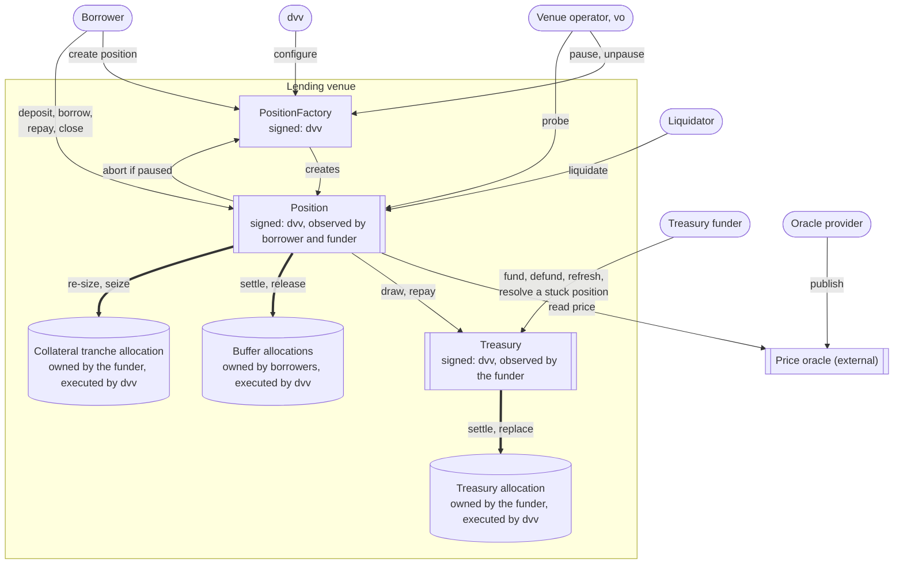
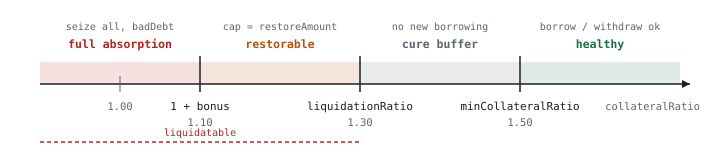
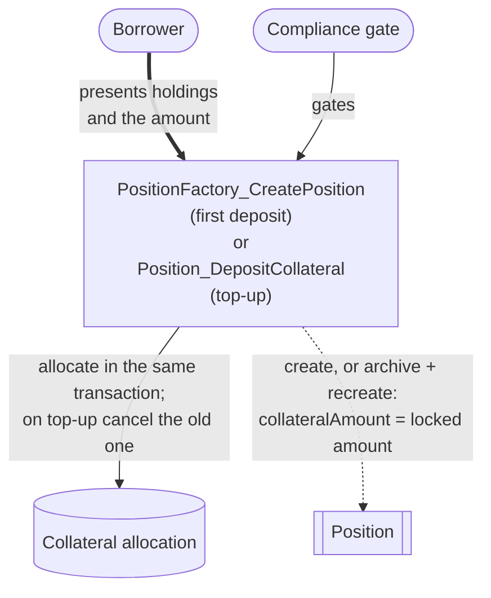
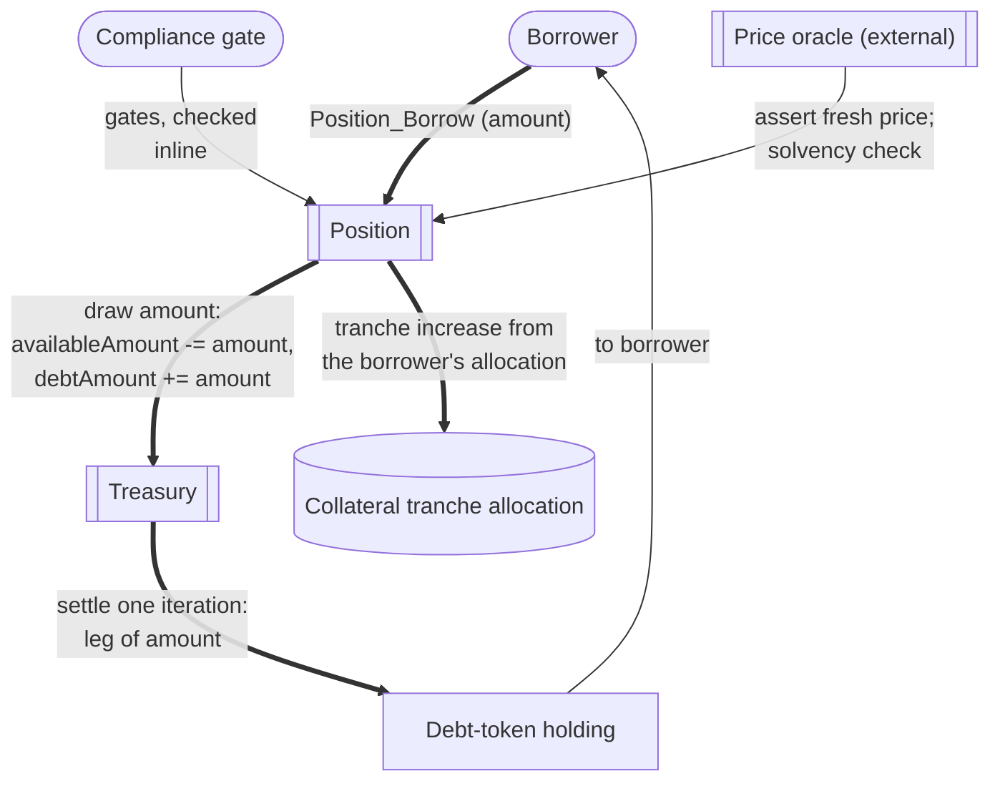
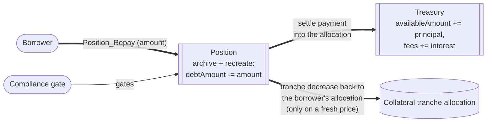
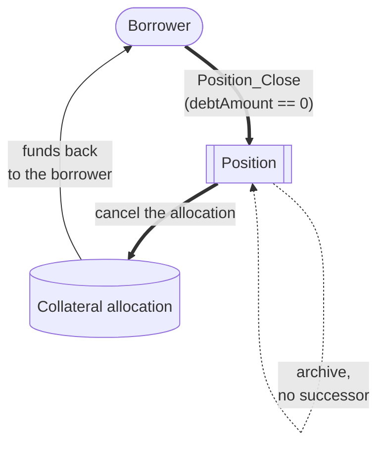
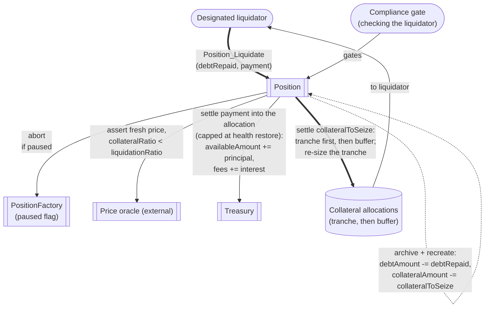

# Architectural Overview Report: Canton Reference Lending Venue

This report is the target architecture for a vault-based, overcollateralized
lending venue on Canton: the on-ledger contract shapes, the borrower wallet
requirements, the operator's off-ledger services, and the deployment
topology. It composes reusable OpenZeppelin Daml components (access, pause)
and bounded experiments for compliance and identity into one application
that settles through the Canton Network Token Standard V2 (TSv2).

## 1. Product Definition

The core object is the **Position**: an isolated collateralized debt
position (CDP) held as its own Daml contract. Four properties define the
venue:

- **Fixed-rate.** The `interestRate` is immutable for the life of a position.
- **Open-term.** A position has no maturity: it stays open until repaid and
  closed, or liquidated.
- **Permissioned.** Borrowers hold a KYC claim from a trusted issuer,
  liquidators are designated by the venue, and value movements can
  additionally be gated by per-operation compliance attestations
  ([compliance](#compliance-is-re-checked-on-every-operation)).
- **Overcollateralized.** Borrowing and withdrawal must keep
  `collateralRatio` at or above `minCollateralRatio`; a position under
  `liquidationRatio` is liquidatable. The gap between the two is the
  borrower's cure buffer.

Assets settle through [CIP-0112, the Canton Network Token Standard V2](https://github.com/canton-foundation/cips/blob/6f37c896a5a76ec3bc1aa67bc045623ae5df41e5/cip-0112/cip-0112.md):
every asset is a holding co-signed by its own registry, and the venue moves
assets only through the TSv2 interfaces, so any conformant registry works.
The collateral and the **debt token** may both be issued by third parties. A
privileged **treasury funder** commits debt tokens to the venue's
**treasury** and earns the interest; borrows draw from it, repayments flow
back, and an exhausted treasury blocks new borrows.

### Operational Scope and Boundaries

The core is deliberately small: one treasury per venue, one price
dependency, one `Position` contract per CDP, and direct transfers under
authority the choices already carry. Deployment-specific conditions are
contract parameters ([consumption and customization](#consumption-and-customization)).

| Feature Category | In-Scope Architectural Components |
|---|---|
| Interest Model | Fixed `interestRate`, open term, **simple (non-compounding) interest** on the tracked principal ([the CDP math](#the-cdp-math)). |
| Core Flows | Position creation with collateral deposit, borrow, repay, liquidation, and close, plus treasury funding, defunding, and refresh ([the position flows](#the-position-flows)), and the time-based resolution of a stuck position ([time-based liquidation](#time-based-liquidation)). |
| Asset Representation | CIP-0112 TSv2 holdings. Collateral and borrow liquidity stay in their owners' allocations, which the venue executes but never holds; nothing is minted or burned ([collateral](#collateral-allocations)). |
| Pricing | Every price-dependent choice fetches the selected provider's price contract and enforces the instrument and staleness guards ([section 4.4](#44-dependency-price-oracle)). |
| Fees | Interest accrues to the treasury funder, which absorbs bad debt; a configurable share goes to the venue operator ([the treasury](#the-treasury)). The `liquidationBonus` is the liquidator's premium, paid from the borrower's collateral. |
| Compliance & Control | Optional per-operation **compliance attestation** and on-ledger **KYC claims** from trusted issuers ([compliance](#compliance-is-re-checked-on-every-operation)). |
| Trust Topology | Every `Position` and the `Treasury` are signed by a **decentralized venue validation party (`dvv`)** hosted across independent participant nodes at a confirmation threshold above 1; solvency and seizure bounds are enforced by Daml code, not operator discretion ([party topology](#party-and-role-model-topology)). |
| Component Integration | Reused OpenZeppelin packages and experiments and the CIP-0112 Splice interfaces ([section 2](#core-components-and-library-mapping)), plus patterns from [`OpenZeppelin/canton-token-template`](https://github.com/OpenZeppelin/canton-token-template). |

<br/>

| Feature Category | Out-of-Scope Architectural Components |
|---|---|
| Interest Models | Dynamic or algorithmic rates, utilization curves, fixed maturities. |
| Leverage Facilities | Undercollateralized loans, flash loans, recursive leverage, rehypothecation. |
| Liquidation Mechanics | Auctions, and whole-position seizure regardless of payment. |
| Liquidity Provision | Multi-party liquidity provision: the treasury has a single funder ([extension points](#extension-points)). |
| Price Oracle | The oracle contract, its update mechanism, and producing a price for the pair at all are consumed as-is from a provider meeting [section 4.4](#44-dependency-price-oracle); multi-asset oracles and TWAP aggregators likewise. |
| Token Standard | Defining or extending TSv2; CIP-56 and V1 allocation paths. |
| Cross-Synchronizer Operation | Settlement and identity across synchronizers: the architecture assumes one. |

### Target Ecosystem Participants

- **Institutional asset managers and tokenized-fund issuers**: collateralized credit with deterministic outcomes and no public data leakage.
- **Asset issuers and large token holders**: idle debt-token inventory earns interest as treasury liquidity against overcollateralized debt.
- **Wallet and client integrators**: borrower flows built on direct transfers and collateral allocations, exposed to venue UIs over the [CIP-0103](https://github.com/canton-foundation/cips/blob/6f37c896a5a76ec3bc1aa67bc045623ae5df41e5/cip-0103/cip-0103.md) dApp API.

### Background: How to Think About Building a Lending Protocol on Canton

In the [ERC-4626](https://docs.openzeppelin.com/contracts/5.x/erc4626) lineage one globally visible contract manages pooled liquidity, debt shares, and accrual for every party, broadcasting each one's balance and liquidation threshold. Canton changes two assumptions.

**Privacy by default.** A contract is visible only to its signatories and observers (per-party projection), so each **position is its own contract** rather than a share in a pool, visible only to the borrower, `dvv`, the funder, and the liquidators that police it.

**No in-place mutation.** State changes by archive-and-recreate, so contract ids change. The design resolves the `Position`, `PositionFactory`, `Treasury`, the compliance registries, and the price oracle by **contract key** (reintroduced in [Canton 3.5.1+](https://github.com/digital-asset/canton/releases/tag/v3.5.1)). Keys are not unique, so the venue enforces uniqueness. The experiment packages this document references predate that release and are keyless; a production implementation starts on the 3.5.1+ SDK.

**Decentralizing a party.** `dvv` signs every venue contract and executes every allocation the venue relies on, so the trust question moves from contracts to parties. Canton decentralizes a party on three independent axes: **party governance** (whose signatures can re-home it), **validation** (how many participant nodes must confirm its transactions; above 1, the party can no longer submit Ledger API commands directly and acts through externally signed submissions or through choices submitted by others), and **authorization** (what the Daml signatory and controller topology requires). Guarantees are only as strong as the organizations behind the nodes: a party confirmed at threshold `f + 1` holds until `f + 1` nodes of distinct organizations collude ([trust topology](#decentralization-and-trust-topology)).

**New versus existing components.** The venue adds one organization, the operator, and its own contracts: `PositionFactory`, `Position`, `Treasury`, and, when enabled, the attester and issuer registries. The debt token and the collateral are administered by their issuers' own **registries**, which must implement the TSv2 interfaces and meet the requirements in [collateral](#collateral-allocations); the price oracle is a provider's contract selected by `dvv`.

---

## 2. Architecture Overview

The diagram shows the actors, the venue's own contracts, and the external components they touch; the table that follows maps each component to its source.


```mermaid
flowchart TB
    Consortium([dvv])
    Operator([Venue operator, vo])
    Funder([Treasury funder])
    Borrower([Borrower])
    Liquidator([Liquidator])
    Provider([Oracle provider])

    subgraph Target["Lending venue"]
        Factory["PositionFactory<br/>signed: dvv"]
        Position[["Position<br/>signed: dvv, observed by borrower and funder"]]
        Treasury[["Treasury<br/>signed: dvv, observed by the funder"]]
        Collateral[("Buffer allocations<br/>owned by borrowers, executed by dvv")]
        Liquidity[("Treasury allocation<br/>owned by the funder, executed by dvv")]
        Tranche[("Collateral tranche allocation<br/>owned by the funder, executed by dvv")]
    end

    Oracle[["Price oracle (external)"]]

    Consortium -->|"configure"| Factory
    Operator -->|"pause, unpause"| Factory
    Operator -->|"probe"| Position
    Funder -->|"fund, defund, refresh,<br/>resolve a stuck position"| Treasury
    Borrower -->|"create position"| Factory
    Factory -->|"creates"| Position
    Borrower -->|"deposit, borrow,<br/>repay, close"| Position
    Liquidator -->|"liquidate"| Position
    Provider -->|"publish"| Oracle
    Position -->|"abort if paused"| Factory
    Position -->|"read price"| Oracle
    Position -->|"draw, repay"| Treasury
    Position ==>|"settle, release"| Collateral
    Position ==>|"re-size, seize"| Tranche
    Treasury ==>|"settle, replace"| Liquidity
```

### Core Components and Library Mapping

Tags mark each component's source: `[PACKAGE]` for released packages and
`[EXPERIMENT]` for experimental packages in
[`OpenZeppelin/canton-contracts`](https://github.com/OpenZeppelin/canton-contracts)
or this repository, and `[STANDARD]` for upstream Splice Token Standard V2
interfaces consumed as pinned dependencies.

| Component Suite | Applied Templates and Libraries | Architectural Function |
|---|---|---|
| Access Control `[EXPERIMENT]` | `openzeppelin-access-control-v1`: [`RoleGrant`](https://github.com/OpenZeppelin/canton-contracts/blob/cec416d6e3c2118551c761d5598c403ab27ee342/experiments/access/access-control-v1/daml/OpenZeppelin/AccessControlV1.daml#L58), [`RoleAdmin`](https://github.com/OpenZeppelin/canton-contracts/blob/cec416d6e3c2118551c761d5598c403ab27ee342/experiments/access/access-control-v1/daml/OpenZeppelin/AccessControlV1.daml#L116), [`DefaultAdminTransferOffer`](https://github.com/OpenZeppelin/canton-contracts/blob/cec416d6e3c2118551c761d5598c403ab27ee342/experiments/access/access-control-v1/daml/OpenZeppelin/AccessControlV1.daml#L237), [`requireRole`](https://github.com/OpenZeppelin/canton-contracts/blob/cec416d6e3c2118551c761d5598c403ab27ee342/experiments/access/access-control-v1/daml/OpenZeppelin/AccessControlV1.daml#L287) | Role-based permissioning for the liquidator role, granted under the `dvv` authority. |
| Venue Constraints `[PACKAGE]` | `openzeppelin-api-pausable-v1`: [`Pausable`](https://github.com/OpenZeppelin/canton-contracts/blob/a2d576344fe96d49751b276e8c638e02ef682c57/packages/security/api-pausable-v1/daml/OpenZeppelin/Api/PausableV1.daml#L42); `openzeppelin-pausable-v1`: [`whenNotPaused`](https://github.com/OpenZeppelin/canton-contracts/blob/a2d576344fe96d49751b276e8c638e02ef682c57/packages/security/pausable-v1/daml/OpenZeppelin/PausableV1.daml#L46) | Emergency circuit breaker: the `PositionFactory` carries the `paused` flag, every gated choice calls `whenNotPaused` on it, and `vo` pauses and unpauses. |
| Asset Rails `[STANDARD]` | [CIP-0112 / Splice Token Standard V2](https://github.com/canton-foundation/cips/blob/6f37c896a5a76ec3bc1aa67bc045623ae5df41e5/cip-0112/cip-0112.md) interfaces: `Holding`, `Account`, `InstrumentId` (`Splice.Api.Token.HoldingV2`); `TransferFactory`, `TransferInstruction` (`Splice.Api.Token.TransferInstructionV2`); `Allocation`, `SettlementFactory` (`Splice.Api.Token.AllocationV2`); `AllocationFactory` (`Splice.Api.Token.AllocationInstructionV2`); `EventLog` (`Splice.Api.Token.TransferEventsV2`) | The interoperability boundary: collateral and borrow liquidity are committed allocations the choices settle, iterate, replace, or cancel, and payments are allocated and settled in the same transaction, against any registry implementing these interfaces. |
| Compliance Attestation `[EXPERIMENT]` | `OpenZeppelin.TokenCIP112V1`: [`TrustedAttesterRegistry`](https://github.com/OpenZeppelin/canton-contracts/blob/7696749737885e25cd88422847105f890f03b00d/experiments/token/tokenCIP112-v1/daml/OpenZeppelin/TokenCIP112V1/D1.daml#L22), [`ComplianceAttestation`](https://github.com/OpenZeppelin/canton-contracts/blob/7696749737885e25cd88422847105f890f03b00d/experiments/token/tokenCIP112-v1/daml/OpenZeppelin/TokenCIP112V1/D1.daml#L53) | The single-use, registry-bound attestation the optional compliance gate consumes. |
| Identity Verification `[EXPERIMENT]` | `ShapeB`: [`KycClaim`](../../experiments/identity/hook-shape-b/daml/OpenZeppelin/Experimental/Identity/ShapeB.daml#L43), [`TrustedIssuerRegistry`](../../experiments/identity/hook-shape-b/daml/OpenZeppelin/Experimental/Identity/ShapeB.daml#L74) | The KYC claim the compliance gate checks. |

---

## 3. Target Design

### Party and Role Model Topology

The venue introduces two parties, `dvv` and `vo`; the registries, the oracle
provider, the funder, borrowers, and liquidators are pre-existing network
structure.

- **Decentralized Venue Validation (`dvv`)**: signs all venue state (the
  `PositionFactory`, every `Position`, the `Treasury`, and the compliance
  registries) and is the sole executor of every borrower's allocation and
  of the funder's treasury and tranche allocations. It sets `PositionParams`, the liquidator set, the
  oracle selection, and the attester and issuer lists through
  consortium-approved configuration changes. Multi-hosted at a confirmation
  threshold above 1 ([trust topology](#decentralization-and-trust-topology)).
- **Venue Operator (`vo`)**: the organization running the off-ledger backend,
  single-hosted on its own node. It pauses, withdraws the venue fee, serves
  the disclosed `PositionFactory` and `Treasury` to prospective borrowers,
  probes positions for liveness, and monitors positions and the oracle.
- **Treasury Funder**: locks the borrow liquidity and holds the seizable
  collateral tranches, can resolve a stuck position ([time-based liquidation](#time-based-liquidation)), and earns the interest net of the venue fee; typically the operator, the debt token's issuer, or a
  large holder. Multiple funders are an extension
  ([extension points](#extension-points)).
- **Borrower**: locks collateral and draws debt; only the borrower can commit
  their own holdings.
- **Liquidator**: monitors solvency from its own projection and exercises
  liquidations ([the CDP math](#the-cdp-math)).
- **Oracle Provider**: the external organization publishing the price
  contract the positions read, selected by `dvv` against
  [section 4.4](#44-dependency-price-oracle).
- **Instrument Registrars**: the TSv2 registries of the debt token and the
  collateral, generally different organizations.

Visibility separates public market data from private positions: the price
contract must be visible, by observership or disclosure, to every party that
submits a price-dependent choice and to `dvv`; the `PositionFactory` terms
and the `Treasury`'s available liquidity reach prospective borrowers through
disclosure served by `vo`; each `Position` is visible to `dvv`, its borrower,
the funder, and its designated liquidators, so no borrower sees another's
and the funder, as counterparty, sees every position.

### Decentralization and Trust Topology

Two questions decide each party's security posture: how it is hosted and
validated, and who submits in its name.

| Party | Hosting and validation | Who submits in its name |
|---|---|---|
| `dvv` | multi-hosted on several participant nodes, confirmation threshold above 1; optionally also hosted on a regulator's or auditor's node, observing or confirming | configuration changes only, as externally signed, consortium-approved transactions (factory and treasury creation, `PositionParams` including the oracle selection, the liquidator set, the attester and issuer lists); in every position and treasury flow its authority is exercised inside choices on contracts it signs, submitted by the party driving that flow |
| `vo` | single-hosted on the operator's participant node, which also hosts one of the `dvv` replicas, so the backend reads the venue's state there | pauses and unpauses, withdraws the venue fee share, and submits liveness probes; the backend discloses and monitors off-ledger |
| Treasury funder | multi-hosted at confirmation threshold 1, since its participant confirms every borrow, repayment, and liquidation | `Treasury_Fund`, `Treasury_OpenTranche`, `Treasury_Defund`, `Treasury_Refresh`, and `Treasury_ResolveStuck` |
| Oracle provider | external organization, selected against [section 4.4](#44-dependency-price-oracle) | publishes its own price contract, never venue flows |
| Liquidators | their own participant nodes; several independently designated parties, so liquidation liveness never hinges on one keeper | liquidations |
| Borrowers | their own participant node or a wallet provider's, their own keys | deposits, borrows, repayments, withdrawals, closes, and allocation refreshes from their wallet (CIP-0103) |
| Instrument registrars | external organizations | their own registry operations |

`dvv` is decentralized because **treasury and collateral outflows are
executor trust**: whoever holds its authority can settle the treasury
allocation and every collateral allocation at the registry level, outside
the solvency-coupled choices. Multi-hosting makes that authority reachable only
through the venue's choices or through externally signed transactions that
`f + 1` hosting organizations approve. One hosting candidate is the
[covalidation service provider](https://docs.digitalasset.com/covalidation/overview).

**A minimal viable deployment.** `dvv` is hosted on three confirming
participant nodes, one per organization, with a confirmation threshold of 2
of 3:

| Organization | Role for `dvv` | Other responsibilities |
|---|---|---|
| Venue operator | confirming node | hosts `vo`; runs the backend and the disclosure API; pauses; typically fills the treasury funder role |
| Venue validator A (covalidation offering) | confirming node | - |
| Venue validator B (covalidation offering) | confirming node | - |
| Oracle provider (external) | - | publishes the price contract the positions read |
| Regulator or auditor (optional) | observing node | independent monitoring of every position and price |

Breaking the guarantees `dvv` checks, or changing venue configuration, takes
two colluding organizations. Larger deployments add covalidation
organizations and raise the threshold.

**The pause authority** sits with `vo`, single-hosted, so an emergency stop
is instant. The price is griefing: a malicious operator can freeze the
venue's flows, though no funds are stranded and everything resumes when the
pause lifts. A pause in a falling market is an open question
([section 7](#7-open-design-questions-for-the-implementation-phase)).

### The CDP Math

Two figures track a position: `principalAmount` is the debt tokens drawn and not yet repaid, and `debtAmount` is that principal plus accrued interest, so `principalAmount <= debtAmount` always; `seizableAmount` is the part of the collateral held in the funder's tranche allocation ([time-based liquidation](#time-based-liquidation)). Health is the **collateral ratio** `collateralRatio = (collateralAmount · price) / debtAmount` at the oracle price. Borrowing and withdrawal must keep it at or above `PositionParams.minCollateralRatio`; below `liquidationRatio` the position is liquidatable.

Interest is simple: `accrueDebt` computes `newDebt = oldDebt + principalAmount · interestRate · elapsedYears` from `now - lastAccrualTime`, runs inside every state-changing choice before the solvency check, and resets `lastAccrualTime` on recreation. Charging on the principal makes accrual frequency irrelevant: two accruals over `t₁` and `t₂` add exactly what one over `t₁+t₂` would.

**Liquidation arithmetic (payment-proportional, health-restoring).** The collateral released is proportional to the payment, and the payment is capped at what returns the position to health.

```text
-- Seizure is proportional to the payment:
collateralToSeize = min(collateralAmount, debtRepaid · (1 + liquidationBonus) / price)

-- The smallest repayment that lifts the ratio back to minCollateralRatio:
restoreAmount = (minCollateralRatio · accruedDebt - collateralAmount · price)
                / (minCollateralRatio - 1 - liquidationBonus)

-- The payment cap, by regime:
repayCap = if collateralRatio > 1 + liquidationBonus
           then restoreAmount                                      -- restorable
           else collateralAmount · price / (1 + liquidationBonus)  -- full absorption

debtRepaid <= repayCap
```



- **Proportional seizure.** `debtRepaid` is what the liquidator's own exercise pays into the treasury in the same transaction, never the full accrued debt, so a liquidator can never take more collateral than their payment plus bonus buys.
- **Restorable position (`collateralRatio > 1 + liquidationBonus`).** Repaying `x` lowers the debt by `x` and the collateral value by `x · (1 + liquidationBonus)`, which raises the ratio while it sits above `1 + liquidationBonus`. `restoreAmount` is the exact `x` that returns the ratio to `minCollateralRatio`, so a cured position lands inside the cure buffer rather than on the liquidation boundary; the choice rejects a larger payment, and a partial liquidation that leaves the position unhealthy can be liquidated again immediately.
- **Underwater position (`collateralRatio <= 1 + liquidationBonus`).** No repayment can restore health, so the pass seizes all remaining collateral, writes the uncovered remainder off against the treasury as bad debt, and closes the position.
- **Well-definedness.** Configuration requires `minCollateralRatio > liquidationRatio > 1 + liquidationBonus`: the first gap is the cure buffer, the second keeps a newly liquidatable position curable and `restoreAmount`'s denominator positive.

### The Position Flows

Each flow is one ledger transaction: the position choice computes the
amounts and initiates the transfers and allocation settlements
([collateral](#collateral-allocations)), and the registries' own
implementations move the holdings and emit the events. `Compliance gate`
stands for the checks of
[compliance](#compliance-is-re-checked-on-every-operation). The treasury
flows, `Treasury_Fund`, `Treasury_Defund`, and `Treasury_Refresh`, sit
outside the position flows ([the treasury](#the-treasury)).

**A. Position creation and collateral deposit.** The first deposit goes through `PositionFactory_CreatePosition`: the borrower presents holdings, and the choice allocates the collateral from them in the same transaction and creates the `Position` referencing it ([section 4.1](#41-component-positionfactory-and-position-creation)). `Position_DepositCollateral` re-allocates the released and the new holdings; `Position_WithdrawCollateral` settles one iteration without legs that reserves `collateralAmount - withdrawAmount` for the next, while the solvency check passes; `Position_RefreshCollateral` re-allocates before the deadline.


```mermaid
flowchart TD
    Borrower([Borrower])
    Compliance(["Compliance gate"])
    Choice["PositionFactory_CreatePosition<br/>(first deposit)<br/>or<br/>Position_DepositCollateral<br/>(top-up)"]
    Position[["Position"]]
    Collateral[("Collateral allocation")]

    Borrower ==>|"presents holdings<br/>and the amount"| Choice
    Compliance -->|"gates"| Choice
    Choice -->|"allocate in the same transaction;<br/>on top-up cancel the old one"| Collateral
    Choice -.->|"create, or archive + recreate:<br/>collateralAmount = locked amount"| Position
```

**B. Borrow.** `Position_Borrow` runs the compliance gate, reads a fresh price, requires `availableAmount` to cover the request and the collateral to cover the new debt at `minCollateralRatio`, then settles one iteration of the treasury allocation with a leg of the amount to the borrower, re-sizes the tranche, and records the higher debt.


```mermaid
flowchart TD
    Borrower([Borrower])
    Compliance(["Compliance gate"])
    Oracle[["Price oracle (external)"]]
    Position[["Position"]]
    Treasury[["Treasury"]]
    Coin["Debt-token holding"]
    Tranche[("Collateral tranche allocation")]

    Borrower ==>|"Position_Borrow (amount)"| Position
    Compliance -->|"gates, checked<br/>inline"| Position
    Oracle -->|"assert fresh price;<br/>solvency check"| Position
    Position ==>|"draw amount:<br/>availableAmount -= amount,<br/>debtAmount += amount"| Treasury
    Treasury ==>|"settle one iteration:<br/>leg of amount"| Coin
    Coin -->|"to borrower"| Borrower
    Position ==>|"tranche increase from<br/>the borrower's allocation"| Tranche
```

```mermaid
sequenceDiagram
    autonumber
    participant B as Borrower
    participant P as Position
    participant F as PositionFactory
    participant C as Compliance contracts
    participant O as Price oracle
    participant T as Treasury
    participant R as Debt-token registry
    participant RC as Collateral registry

    rect rgb(240, 248, 255)
    Note over B, RC: Position_Borrow - one Daml tx, all or nothing
    B->>P: Position_Borrow (amount, kycClaimCid, attestationCid)
    activate P
    P->>F: fetch by key, whenNotPaused
    P->>C: fetch KycClaim (unexpired, issuer listed); consume the attestation if the gate is enabled
    P->>O: fetch by key, assert instruments and freshness
    P->>P: accrueDebt
    alt collateral does not cover debtAmount + amount at minCollateralRatio
        P-->>B: abort, nothing changes
    else solvent
        P->>T: Treasury_Draw (amount): assert availableAmount >= amount
        T->>R: settle one iteration of the treasury allocation: leg of amount to the borrower, reserve the rest for the next iteration
        R-->>B: holding credited (registry implementation, EventLog)
        R-->>T: next-iteration allocation cid
        T->>T: archive + recreate: availableAmount -= amount, treasuryAllocationCid updated
        P->>RC: re-size the tranche: leg of the increase from the borrower's allocation to the funder's tranche allocation
        P->>P: archive old Position, create new (debtAmount += amount, principalAmount += amount, seizableAmount re-sized)
        P-->>B: newPositionCid
    end
    deactivate P
    end
```

**C. Repay.** `Position_Repay` allocates the payment from the borrower's holdings, settles it into the treasury allocation in the same transaction, records the lower debt, and re-sizes the tranche when the oracle is fresh. No quote step is needed: accrual is deterministic and the borrower sees the position, so the user interface computes the exact payoff itself.


```mermaid
flowchart LR
    Borrower([Borrower])
    Compliance(["Compliance gate"])
    Position[["Position<br/>archive + recreate:<br/>debtAmount -= amount"]]
    Treasury[["Treasury<br/>availableAmount += principal,<br/>fees += interest"]]
    Tranche[("Collateral tranche allocation")]

    Borrower ==>|"Position_Repay (amount)"| Position
    Compliance -->|"gates"| Position
    Position ==>|"settle payment<br/>into the allocation"| Treasury
    Position ==>|"tranche decrease back to<br/>the borrower's allocation<br/>(only on a fresh price)"| Tranche
```

**D. Close.** `Position_Close` winds down a fully repaid position: it cancels the borrower's allocation, which returns the collateral, and archives the `Position` (and its resolution record, if any). A one-shot exit submits repay and close in a single command, and the pair commits atomically.


```mermaid
flowchart TD
    Borrower([Borrower])
    Position[["Position"]]
    Collateral[("Collateral allocation")]

    Borrower ==>|"Position_Close<br/>(debtAmount == 0)"| Position
    Position ==>|"cancel the allocation"| Collateral
    Collateral -->|"funds back<br/>to the borrower"| Borrower
    Position -.->|"archive,<br/>no successor"| Position
```

**E. Liquidation.** Below `liquidationRatio`, a designated liquidator pays debt tokens into the treasury, capped at what restores health, and receives collateral worth the payment plus the liquidation bonus at the current oracle price, settled from the funder's tranche allocation first and the borrower's allocation for any remainder ([the CDP math](#the-cdp-math)). The residual `Position` is recreated, or, when a full seizure leaves residual debt, the shortfall is written off against the treasury and the position closed.


```mermaid
flowchart TD
    Liquidator([Designated liquidator])
    Compliance(["Compliance gate<br/>(checking the liquidator)"])
    Position[["Position"]]
    Factory[["PositionFactory<br/>(paused flag)"]]
    Oracle[["Price oracle (external)"]]
    Treasury[["Treasury"]]
    Collateral[("Collateral allocations<br/>(tranche, then buffer)")]

    Liquidator ==>|"Position_Liquidate<br/>(debtRepaid, payment)"| Position
    Compliance -->|"gates"| Position
    Position -->|"abort<br/>if paused"| Factory
    Position -->|"assert fresh price,<br/>collateralRatio < liquidationRatio"| Oracle
    Position -->|"settle payment into the allocation<br/>(capped at health restore):<br/>availableAmount += principal,<br/>fees += interest"| Treasury
    Position ==>|"settle collateralToSeize:<br/>tranche first, then buffer;<br/>re-size the tranche"| Collateral
    Collateral -->|"to liquidator"| Liquidator
    Position -.->|"archive + recreate:<br/>debtAmount -= debtRepaid,<br/>collateralAmount -= collateralToSeize"| Position
```

```mermaid
sequenceDiagram
    autonumber
    participant L as Liquidator
    participant P as Position
    participant F as PositionFactory
    participant C as Compliance contracts
    participant O as Price oracle
    participant T as Treasury
    participant RD as Debt-token registry
    participant RC as Collateral registry

    rect rgb(240, 248, 255)
    Note over L, RC: Position_Liquidate - one Daml tx, all or nothing
    L->>P: Position_Liquidate (debtRepaid, paymentHoldingCid, attestationCid)
    activate P
    P->>F: fetch by key, whenNotPaused
    P->>P: require a designated liquidator (requireRole)
    P->>C: consume the attestation if the gate is enabled
    P->>O: fetch by key, assert instruments and freshness
    P->>P: accrueDebt
    alt collateralRatio >= liquidationRatio, or debtRepaid above the health-restore cap
        P-->>L: abort, nothing changes
    else liquidatable
        P->>P: collateralToSeize = min(collateralAmount, debtRepaid * (1 + bonus) / price)
        P->>T: Treasury_AcceptPayment (debtRepaid, split pro rata into principal and interest)
        T->>RD: allocate the payment holding and settle it into the treasury allocation in one batch; reserve the principal for the next iteration
        RD-->>T: next-iteration allocation cid
        T->>T: archive + recreate: availableAmount += principal, fees += interest
        P->>RC: settle collateralToSeize to the liquidator: from the tranche allocation first, the borrower's allocation for any remainder; re-size the tranche
        RC-->>L: holding credited (registry implementation, EventLog)
        alt full seizure leaves residual debt
            P->>T: Treasury_WriteOff: badDebtWrittenOff += remainingDebt
            P->>P: archive old Position, no successor
        else position survives
            P->>P: archive old Position, create new (debtAmount -= debtRepaid, principalAmount -= principal, collateralAmount -= collateralToSeize, seizableAmount re-sized)
        end
        P-->>L: Optional newPositionCid
    end
    deactivate P
    end
```

**Monitoring.** The operator backend and the liquidator keepers work from
**ACS ingestion**, in the style of Splice triggers: a keeper acts when a
position it observes falls under `liquidationRatio`; the backend probes every
live position on a schedule ([time-based liquidation](#time-based-liquidation)) and alerts when a probe fails, a position nears its stuck deadline,
the oracle approaches `maxStaleness`, the treasury nears exhaustion, an
allocation nears its deadline unrefreshed, or a submission is rejected.
Clients track their flows by the position's contract key rather than by
command id: a submission either commits as the successor contract or is
rejected and retried against the current state
([section 5.4](#54-failure-modes-and-recovery)).

### Time Model

Time plays four roles: interest accrual off `lastAccrualTime`, the oracle
staleness guard, the allocation deadlines
([collateral](#collateral-allocations)), and the stuck period after which an
untouched position can be resolved ([time-based liquidation](#time-based-liquidation)). Ledger time is accurate
only to `ledgerTimeRecordTimeTolerance` (60s default), so `maxStaleness` is
measured in ledger time and must exceed the tolerance by a wide margin.
Externally signed transactions must be submitted within 24h by default
([CIP-0107](https://github.com/canton-foundation/cips/blob/6f37c896a5a76ec3bc1aa67bc045623ae5df41e5/cip-0107/cip-0107.md)),
which bounds any flow signed through a custodian or by a multi-hosted
funder. Attestations, where enabled, are single-use with a short validity
window that must cover the client's submission time.

### Collateral Allocations

Both instruments are only transferred, never minted or burned, so
third-party-issued assets are compatible. Every locked amount is a
**committed iterated allocation** ([CIP-0112](https://github.com/canton-foundation/cips/blob/6f37c896a5a76ec3bc1aa67bc045623ae5df41e5/cip-0112/cip-0112.md#436-committed-allocations-and-iterated-settlement))
naming `dvv` as executor: the borrower's collateral buffer, the funder's
seizable tranche ([time-based liquidation](#time-based-liquidation)), and the funder's liquidity
([the treasury](#the-treasury)). Committed means the owner cannot withdraw
it; iterated means the venue can settle part of it. Because `dvv` signs every
venue contract, its choices carry the executor authority, so no flow waits on
any party beyond its submitter. The registry keeps attributing each
allocation to its owner, so a freeze reaches one customer, and the venue
holds no funds of any party.

**One allocation, one position.** A borrower's allocation is created inside
the choice that needs it, from holdings the borrower presents, never
accepted from outside, and carries the position's id as its settlement id
with `dvv` as sole executor; every position choice asserts both, and the
position key `(dvv, borrower, positionId)` is unique, so one allocation
backs at most one position. The tranche allocation is one per venue,
referenced by the `Treasury`; each position's share of it is its
`seizableAmount`.

**Allocation lifetime.** Registries cap how long an allocation may live and
may expire an idle one, while positions are open-term, so the borrower
refreshes its allocation before the deadline through
`Position_RefreshCollateral`, which re-allocates it in the same transaction,
and the funder refreshes the treasury and tranche allocations through
`Treasury_Refresh`. A position that enters its refresh window, a configured
period before the deadline, with no replacement becomes liquidatable
regardless of ratio; where nobody can act, the stuck deadline applies
([time-based liquidation](#time-based-liquidation)). A long deadline, months
rather than days, keeps refreshes rare.

**Instant allocation and settlement requirement.** Every flow allocates,
settles, iterates, or cancels under in-choice authority, in one transaction,
at both registries: `AllocationFactory_Allocate` must return a completed
allocation rather than a pending `AllocationInstruction`, and settlement must
complete without a registrar step, which the venue verifies before listing
an instrument and which the Amulet registry satisfies. Registries whose
accounts route allocations through an approval workflow stay excluded until
the token standard ties a pending instruction to its allocation. Both
registries must support iterated settlement with reserved funding and
incoming legs; instruments whose locked amounts decay are excluded or
over-collateralized.

**Accounting equals allocations.** The `Position` and the `Treasury`
reference their allocations by contract id, resolved at exercise time rather
than trusted blindly, and every flow settles against or replaces them in the
same transaction that updates the figures, so the accounting always equals
the locked and reserved amounts ([section 5.1](#51-security-invariants)) and
no separate consolidation step exists.

### Time-Based Liquidation

An allocation returns to its owner when it expires, and settling it needs
its owner's participant to confirm, so with all collateral in the borrower's
name a borrower who stops confirming would recover it at the deadline while
the debt stays outstanding. The design therefore splits each position's
collateral by ownership:

- the **seizable tranche**, `seizableAmount = min(collateralAmount, debtAmount · liquidationRatio / price)`, sits in a **tranche allocation** the funder owns, one per venue, with `dvv` as executor;
- the **buffer**, the rest, stays in the borrower's own allocation.

Choices that read a fresh price re-size the tranche and move the difference
between the two allocations in the same transaction; a repayment or deposit
under a stale oracle leaves it untouched, so the funder's cover never shrinks
on stale information. Liquidation seizes from the tranche first and from the
buffer for any remainder.

**Probe and resolution.** `vo` probes every live position on a schedule with
an iteration that moves nothing; a borrower's own actions count as touches
too. A position untouched for longer than `PositionParams.stuckPeriod` is
stuck, and the funder may resolve it: `Treasury_ResolveStuck` settles the
tranche to the funder's account and records a `PositionResolution` with the
debt cleared at the last published price, any shortfall written off, and any
excess owed to the borrower. The choice never consumes the `Position` or the
borrower's allocation, so it needs nothing from the borrower; a resolved
position accepts only `Position_Close`. If the registries expire the
allocations before anyone acts, each party keeps its own side, the same
split without the record.

Residuals: the tranche is only as fresh as the last touch, interest accrued
while stuck is uncovered, the excess is a claim on the funder, and the funder
must be eligible to hold the collateral instrument
([section 7](#7-open-design-questions-for-the-implementation-phase)).

### The Treasury

Borrow liquidity lives in the **treasury**: a committed iterated allocation
of debt tokens owned by the funder with `dvv` as executor, tracked by a
`Treasury` contract carrying `availableAmount` (the un-borrowed liquidity),
`feesAccrued` (the funder's interest), `venueFeesAccrued` (the venue's), and
`badDebtWrittenOff` (the funder's recognized losses); the allocation's
reserved funding equals the first three. The funder provisions it with
`Treasury_Fund`, reclaims un-borrowed liquidity and revenue with
`Treasury_Defund`, refreshes it with `Treasury_Refresh`, and opens the
tranche allocation with `Treasury_OpenTranche`
([section 4.3](#43-component-treasury)).

Every payment on repay or liquidation is `principal + accrued interest`,
settled into the treasury allocation in the same transaction: the principal
is reserved for the next iteration, immediately borrowable again, and the
interest accrues to `feesAccrued` and `venueFeesAccrued` in the proportion
`venueFeeShare` that `dvv` sets; `vo` withdraws the venue's share with
`Treasury_WithdrawVenueFees`. Borrow asserts `availableAmount` covers the
request, so **an exhausted treasury blocks new borrows**. A liquidation
shortfall is written off against the treasury: interest is the funder's
compensation for that risk. Borrowers acquire the debt tokens they owe as
interest on the open market, so repayment capacity is never bounded by the
venue's own liquidity.

The funder's participant confirms every borrow, repayment, and liquidation,
so its liveness gates them ([section 5.4](#54-failure-modes-and-recovery)).
Treasury outflows are reachable only through the solvency-coupled borrow and
the funder's defund; the residual is `dvv` consortium collusion
([section 5.1](#51-security-invariants)). The `Treasury` is the venue's
serialization point ([section 5.5](#55-throughput-and-contention)); multiple
funders are an extension ([extension points](#extension-points)).

### Compliance is Re-checked on Every Operation

The **compliance gate** has two layers. Identity: a borrower holds a
`KycClaim` from an issuer in the `TrustedIssuerRegistry`; creation verifies
it, and every risk-increasing choice (borrow, deposit, withdrawal) re-fetches
it live, so an archived claim or a delisted issuer blocks those flows
immediately. Attestation, optional per deployment: when `PositionParams`
names a trusted-attester registry, every flow except close consumes one
single-use attestation inline, fail-closed; probes and resolution are not
gated. Both lists are `dvv`
configuration ([trust topology](#decentralization-and-trust-topology)).

Winding a position down never depends on the borrower's standing: repay and
close reduce risk, and liquidation checks the liquidator's compliance, so a
non-compliant position can always be repaid or liquidated, never trapped.

### Oracle Handling

A single trusted price feed plus a single liquidator would be the largest
live attack surface, so the design hardens the price path on the consumer
side and places the rest on the dependency
([section 4.4](#44-dependency-price-oracle)):

- **Named quote instrument.** The price contract carries `debtInstrumentId` and `collateralInstrumentId`, so `price` is unambiguously "units of the debt token per unit of collateral"; consumers assert both ids match the position's.
- **Max-staleness guard.** Every price-dependent choice rejects when `now - updatedAt > maxStaleness`.
- **Operator monitoring.** The backend watches the feed for staleness and out-of-band moves, and `vo` pauses the venue on a suspect feed.

### Authority and Privilege Transfer

Every privileged action traces to the named authority in the
[trust topology](#decentralization-and-trust-topology) table, and no single
admin holds them all. Swappable roles (liquidators) are granted and revoked
through `openzeppelin-access-control-v1`; fixed holders (the borrower on its
position, the funder on the treasury) are bound by direct controllership.
There is no ownership-handover contract: changing the organizations behind
`dvv` is a hosting change at the party layer.

### Smart Contract Upgrade Process

The application uses Smart Contract Upgrade (SCU) for additive changes to
its own packages: a release keeps the package name, raises the version, sets
`upgrades:` to the prior deployed DAR, and only appends `Optional` fields to
templates, records, and choice arguments; the
[Canton SCU guide](https://docs.canton.network/appdev/deep-dives/smart-contract-upgrade)
defines the remaining rules. SCU preserves a representable data shape, not
loan economics.

Upgrades are a `dvv`-authority concern: a new package version changes what
the contracts carrying `dvv`'s authority can do. Protection sits at the
**vetting layer**: each `dvv` hosting node decides which package versions it
vets, and a transaction on an upgraded package confirms only once the
confirmation threshold of those nodes accepts it. Deploying an upgrade is an
explicit act of the hosting consortium, effectively a multi-sig over code.

Every release defines what each new `Optional` field means for a v1
`Position`, `PositionParams`, or `Treasury` record (v1 contracts read as
`None` under v2 code, while a v2 record carrying `Some` is unusable by an
exact-version v1 workflow) and tests both directions. Worked example, a
per-position debt ceiling: adding a new hardened borrow choice is not enough,
because the existing `Position_Borrow` stays callable, so the v2 release
changes its body to enforce `debtCeiling : Optional Decimal` on
`PositionParams` and states what `None` means for grandfathered positions: an
uncapped position, a conservative default cap, or a position that must
migrate before borrowing again. The populated field is also what retires the
old code path: SCU does not delete the v1 DAR and a caller can pin the old
package id, but once `PositionParams` carries `Some ceiling` its data no
longer downgrades to a v1 view. Liquidation fixes follow the same principle.

Changes to accrual, fee allocation, collateral valuation, or liquidation
terms are a separate economic decision: new positions carry revised terms
and existing borrowers keep theirs unless they consent to migrate. A change
to parties, keys, custody, or a policy that must bind every caller is
breaking: a separately named package and template, with active positions
migrated during a maintenance window. Before release, the operators run
`dpm build` with the `upgrades:` lineage and `dpm upgrade-check --both`, vet
the DARs at the affected participants, switch services and wallets together
to the target package preference, and exercise every flow and the emergency
paths on LocalNet against live v1 positions.

### Extension Points

Extensions use SCU only when they preserve the data and economics of live
positions:

- **Debt ceilings.** A per-position `Optional` cap in `PositionParams` and an aggregate ceiling on the `PositionFactory`, enforced in `Position_Borrow`; the [SCU process](#smart-contract-upgrade-process) walks through its rollout.
- **Compounding interest variant.** A new immutable terms revision for positions that select discrete compounding, never retroactive.
- **Liquidity providers.** Opening the treasury to multiple independent funders, each locking its own allocation, sharing `feesAccrued` and splitting the risk.

### Consumption and Customization

Adopters either **import the published DAR**, keeping the OpenZeppelin name
and upgrade lineage so fixes arrive as ordinary dependency upgrades but only
as OpenZeppelin releases, or **vendor and rename** at a pinned, audited
release, owning the lineage and the fork. Package names are global and SCU
is scoped to them, so two applications sharing a library DAR share its
lineage. Either way, deployment-specific behavior (`PositionParams`,
including the oracle selection and `maxStaleness`, the liquidator set, the
attester and issuer lists) is configuration on the venue's contracts,
changed through governed choices rather than code changes. Beyond the TSv2
asset interfaces and the OpenZeppelin `Pausable` view, the design defines no
Daml interfaces or hook contracts of its own: every position, treasury, and
oracle reference is a statically linked template resolved by key, which
keeps the reachable transaction shapes fixed and auditable.

---

## 4. Sample Component Structure

These snippets show the **shape** of each component: types, signatories,
keys, and choice declarations, with choice bodies summarized in comments.
They are **design sketches**, not yet implemented in any end-to-end Daml
Script. The declarations follow the vendored Splice V2 API shapes;
`accrueDebt`, `collateralRatio`, and `liquidationRepayCap` are the formulas
of [the CDP math](#the-cdp-math).

### 4.1 Component: PositionFactory and Position Creation

The `PositionFactory` is the venue's standing position-creation offer: a
`dvv`-signed contract carrying the terms (`PositionParams` and the instrument
pair) and the venue's `paused` flag. A borrower creates their position
unilaterally; creation allocates the collateral from the presented holdings
in the same transaction, so a position is never created empty and no
allocation is accepted from outside.

```daml
template PositionFactory
  with
    dvv : Party
    vo : Party
    funder : Party
    params : PositionParams
    collateralInstrumentId : InstrumentId
    debtInstrumentId : InstrumentId
    paused : Bool
  where
    signatory dvv
    observer vo
    key dvv : Party
    maintainer key

    interface instance Pausable for PositionFactory where
      view = PausableView with paused

    -- Body (omitted): whenNotPaused this; reject a duplicate (dvv, borrower,
    -- positionId); run the compliance gate on the borrower; allocate
    -- initialCollateral from collateralHoldingCids into a committed iterated
    -- allocation (settlement id positionId, executors [dvv]) and require the
    -- completed result; create the Position referencing it, with zero debt.
    nonconsuming choice PositionFactory_CreatePosition : ContractId Position
      with
        borrower : Party
        positionId : Text
        initialCollateral : Decimal
        kycClaimCid : ContractId KycClaim
        collateralHoldingCids : [ContractId Holding]
        attestationCid : Optional (ContractId ComplianceAttestation)
        extraArgs : ExtraArgs   -- collateral registry context
      controller borrower

    -- Body (omitted): whenNotPaused this, then recreate with paused = True;
    -- PositionFactory_Unpause mirrors it with whenPaused.
    choice PositionFactory_Pause : ContractId PositionFactory
      controller vo
```

### 4.2 Component: Position State and Liquidation

The `Position` holds one borrower's CDP state; its consuming choices archive it and recreate the successor with updated figures. `dvv` is its only signatory; the borrower and the funder are observers, so the contract itself needs no confirmation from the borrower's node, while the borrower's allocation does ([time-based liquidation](#time-based-liquidation)). The borrower's own choices run under their controller authority, and their protection is the choice logic plus the `dvv` threshold.

```daml
template Position
  with
    dvv : Party
    borrower : Party
    positionId : Text
    collateralInstrumentId : InstrumentId
    debtInstrumentId : InstrumentId
    funder : Party
    collateralAllocationCid : ContractId Allocation   -- borrower-owned buffer, dvv executor
    collateralLockDeadline : Time
    collateralAmount : Decimal
    seizableAmount : Decimal   -- the position's share of the funder's tranche allocation
    debtAmount : Decimal
    principalAmount : Decimal
    params : PositionParams
    lastAccrualTime : Time
  where
    signatory dvv
    observer borrower, funder, params.liquidators
    key (dvv, borrower, positionId) : (Party, Party, Text)
    maintainer key._1

    -- Body (omitted): require a designated liquidator; whenNotPaused on the
    -- PositionFactory fetched by key; fetch the oracle by key and assert
    -- freshness; accrue; assert collateralRatio < liquidationRatio and
    -- 0 < debtRepaid <= liquidationRepayCap;
    -- collateralToSeize = min collateralAmount (debtRepaid * (1 + bonus) / price);
    -- run the compliance gate on the liquidator; Treasury_AcceptPayment by key,
    -- which allocates the payment and settles it into the treasury allocation,
    -- splitting principal and interest pro rata; settle collateralToSeize to the
    -- liquidator from the tranche allocation first and the buffer for any
    -- remainder, then re-size the tranche; on full absorption with residual
    -- debt, Treasury_WriteOff and archive without a successor; otherwise
    -- recreate with the reduced figures.
    choice Position_Liquidate : Optional (ContractId Position)
      with
        liquidator : Party
        paymentHoldingCid : ContractId Holding
        debtRepaid : Decimal
        attestationCid : Optional (ContractId ComplianceAttestation)
      controller liquidator

    -- Position_DepositCollateral, Position_WithdrawCollateral,
    -- Position_RefreshCollateral, Position_Borrow, Position_Repay, and
    -- Position_Close follow the same shape, controlled by the borrower.
    -- Position_Probe (controller vo) settles an iteration with no legs on the
    -- borrower's allocation. Every choice except Position_Close rejects a
    -- position that has a PositionResolution.
```

### 4.3 Component: Treasury

The `Treasury` is a `dvv`-signed contract with key `(dvv, debtInstrumentId)` and the funder as observer, referencing the treasury allocation (`treasuryAllocationCid`) and the collateral tranche allocation (`trancheAllocationCid`) ([the treasury](#the-treasury)). Each choice updates the accounting and the allocation references in the same transaction that moves the holdings:

- **`Treasury_Fund`** (controller: the funder) allocates the presented holdings, folding in any live allocation, and raises `availableAmount`.
- **`Treasury_OpenTranche`** (controller: the funder) opens the unfunded tranche allocation on the collateral registry, which positions fill and drain ([time-based liquidation](#time-based-liquidation)).
- **`Treasury_Refresh`** (controller: the funder) re-allocates the live treasury and tranche allocations before their deadlines.
- **`Treasury_Defund`** (controller: the funder) settles one iteration with a leg to the funder's account, bounded by `availableAmount + feesAccrued`, so it can never touch lent-out principal.
- **`Treasury_Draw`** (controller: `dvv`, exercised from inside `Position_Borrow`) settles one iteration with a leg to the borrower and lowers `availableAmount`.
- **`Treasury_AcceptPayment`** (controllers: the payer and `dvv`) allocates the payment from the payer's holding and settles it into the treasury allocation in one batch, reserving the principal and splitting the interest into the fee balances; exercised from inside `Position_Repay` and `Position_Liquidate`.
- **`Treasury_WithdrawVenueFees`** (controller: `vo`) settles one iteration with a leg of the venue's accrued fee balance to the operator.
- **`Treasury_WriteOff`** (controller: `dvv`, exercised from inside `Position_Liquidate`) records unrecoverable debt in `badDebtWrittenOff` when a full seizure leaves residual debt; it moves no holdings.
- **`Treasury_ResolveStuck`** (controller: the funder) resolves a position untouched for longer than `stuckPeriod`: it settles the position's `seizableAmount` to the funder's account and creates a `PositionResolution` keyed like the position, recording the debt cleared, any shortfall written off, and any excess owed to the borrower, without consuming the `Position` or the borrower's allocation ([time-based liquidation](#time-based-liquidation)).

### 4.4 Dependency: Price Oracle

The price oracle is not a venue component but a **pinned dependency**, like the token registries: an external provider publishes a price contract carrying `price` and `updatedAt`, keyed by `(provider, collateralInstrumentId, debtInstrumentId)`; the lending package depends on the provider's package as a pinned DAR, and `PositionParams` names the key, so every price-dependent choice fetches the current price by key across the provider's archive-and-recreate cycle. `dvv` selects the provider as a configuration decision, and the position choices enforce only the consumer-side guards ([oracle handling](#oracle-handling)). Before selection, a provider must satisfy:

- **No single writer.** No single party may publish a price alone, so a lone compromised party cannot manufacture liquidations.
- **No single staller.** Update liveness must not hinge on any one party's per-update cooperation; an all-of-M quorum stalls on one offline member.
- **Bounded moves.** A per-update deviation bound aborts out-of-band publishes, so the last in-band price stands.
- **Auditable updates.** Every published price traces to the parties that authorized it.

Providers may run an N-of-M committee through the [Multiple Party Agreement](https://docs.canton.network/appdev/modules/m3-design-patterns#multiple-party-agreement) pattern, multi-hosted parties, medianized per-member submissions, or pull-style signed price attestations verified inside the publish choice; which provider to consume, and the quorum to demand, is left to the adopter.

---

## 5. Security & Auditability

### 5.1 Security Invariants

- **Solvency conservation**:
  - Collateral can never be withdrawn, and a borrow can never succeed, if it would push `collateralRatio` below `PositionParams.minCollateralRatio`.
  - Liquidation is reachable only below `liquidationRatio`.
- **Lending conservation (no unbacked lending)**:
  - Debt tokens leave the treasury only with a solvency-checked `debtAmount` increment gated by `availableAmount`, or through the funder's own defund; payments return against a matching decrement.
  - Outstanding principal never exceeds what the funder provisioned plus what repayments restored, less what liquidations wrote off into `badDebtWrittenOff`. The residual caveat is custodial - an externally signed transaction approved by `f + 1` of `dvv`'s hosting organizations could settle the treasury allocation or the collateral allocations outside the choices.
- **Collateral custody**:
  - Collateral is never owned by the venue: the buffer stays locked in the borrower's allocation and the seizable tranche in the funder's, and only position and treasury choices settle, iterate, replace, or cancel them.
  - Borrow liquidity is never owned by the venue: it stays locked in the funder's allocation, which only treasury choices iterate or replace.
- **Tranche integrity**:
  - After every choice that reads a fresh price, `seizableAmount = min(collateralAmount, debtAmount · liquidationRatio / price)` at that price; no choice shrinks the tranche without a fresh price; and a resolution is reachable only after `stuckPeriod` without a successful touch ([time-based liquidation](#time-based-liquidation)).
- **Seizure is payment-bound**:
  - Liquidation seizes collateral exactly proportional to the debt tokens the liquidator actually pays: `debtRepaid` transfers into the treasury in the same transaction that releases the collateral.
  - A liquidator can never take more than their payment (plus bonus) buys.
- **Fee integrity**:
  - The full payment (principal plus accrued interest) transfers into the treasury on repay and liquidation, split between principal and the fee balances; the liquidation bonus reaches the liquidator as collateral. Value is neither destroyed nor leaked.
- **Funding conservation**:
  - A transfer never delivers more than the payer's presented holdings cover: every leg is backed, per instrument, by the holdings consumed in the same transaction.
  - Per position, `collateralAmount - seizableAmount` equals the locked amount of the borrower's allocation; the sum of `seizableAmount` over open positions equals the tranche allocation's reserved funding; `availableAmount` plus the fee balances equals the treasury allocation's reserved funding.
- **Price integrity**:
  - Price-dependent choices reject a stale oracle, and the selected provider meets the dependency requirements ([section 4.4](#44-dependency-price-oracle)), so solvency is never evaluated against a dead, manipulated, or unilaterally-set price.
- **Privacy**:
  - A borrower has visibility only over their own positions, holdings, and the transfer legs they are a sender or receiver in; the funder, as counterparty, sees every position, and borrowers never see each other.

### 5.2 Validation Strategy

The identity and compliance experiments validate the shared mechanisms
referenced by this report. A lending implementation additionally needs unit
and integration tests for accrual, the collateral-ratio and liquidation-cap
formulas, treasury accounting, the oracle staleness guard, and every
authority failure path, with **negative tests** for each in the style of the
token standard's
[negative allocation tests](https://github.com/canton-network/splice/blob/main/daml/splice-amulet-test/daml/Splice/Scripts/TokenStandard/TestAmuletAllocationNegative.daml).
[daml-lint](https://github.com/OpenZeppelin/daml-lint) covers static
analysis, and the high-value invariants of
[section 5.1](#51-security-invariants) (solvency and lending conservation,
division safety in the cap formulas) can receive symbolic verification with
[daml-verify](https://github.com/OpenZeppelin/daml-verify).

### 5.3 Threat Model

| Vector | Attack | Mitigation |
|---|---|---|
| Oracle manipulation by a compromised publisher | A single oracle party sets the price near zero and a colluding liquidator seizes every position. | The provider must meet the no-single-writer and bounded-moves requirements before selection ([section 4.4](#44-dependency-price-oracle)); the operator monitors the feed and pauses on a suspect one. |
| Oracle staleness | A stalled feed drives liquidations or borrows against a dead price. | Every price-dependent choice rejects when `now - updatedAt > maxStaleness`. |
| Under-paying liquidator | The liquidator supplies a tiny debt-token amount and seizes the whole position. | Seizure is bound on-ledger to the payment the liquidator's own exercise makes into the treasury: `collateralToSeize = min(collateralAmount, debtRepaid · (1 + bonus) / price)` ([the CDP math](#the-cdp-math)). |
| Liquidation racing the borrower's top-up | A liquidation lands before the borrower can top up. | The buffer between `minCollateralRatio` and `liquidationRatio` is the borrower's warning zone; there is no public mempool to front-run in, and a top-up and a liquidation on the same position serialize on the ledger, the loser retrying against the new state. |
| Borrower stalls settlement | The borrower lets its allocation expire or goes offline so it cannot be settled, to recover collateral while debt is outstanding. | The seizable tranche already sits in the funder's allocation, so inaction leaves the borrower only the buffer, and the stuck deadline resolves the position without the borrower ([time-based liquidation](#time-based-liquidation)). |
| Premature resolution | The funder resolves a position that is merely idle. | Resolution is gated on-ledger by `stuckPeriod` since the last successful touch, and the scheduled probe touches every live position, so only a position whose borrower has stopped confirming can be resolved; any excess is recorded as owed to the borrower. |
| Under-funded transfer leg | An under-funded deposit, repayment, or liquidation exercise attempts a broken operation. | Daml atomicity: the whole transaction reverts, collateral stays where it was, no debt is cleared. |
| Bad debt on a deeply under-water position | Collateral is worth less than debt, creating a shortfall. | The final liquidation pass seizes all remaining collateral, records the shortfall in `badDebtWrittenOff`, and closes the position; the funder's capital absorbs the loss ([section 7](#7-open-design-questions-for-the-implementation-phase) on a dedicated buffer). |
| Compliance evasion, including post-open drift | A borrower bypasses KYC, or becomes non-compliant after opening. | The compliance gate runs on every risk-increasing choice, fail-closed ([compliance](#compliance-is-re-checked-on-every-operation)); repay, close, and liquidation stay open so a position is never trapped. |
| Unauthorized `dvv` or operator action | An attacker controlling one `dvv` hosting node, or the operator backend, tries to drain the treasury or the collateral. | `dvv` confirms at a threshold above 1, so a single node exercises nothing, and even an `f + 1` collusion is bounded by the treasury and collateral allocations `dvv` executes ([section 5.1](#51-security-invariants)); `vo` holds no venue authority beyond the pause and the venue fee withdrawal. |
| Failed SCU rollout | A poorly executed upgrade renders an active position, treasury, holding, or a client workflow unusable. | The release defines `None` semantics and the economic treatment of live positions and tests v1 positions under the v2 workflow; breaking changes use an explicit migration ([SCU process](#smart-contract-upgrade-process)). |
| Malicious venue package upgrade | An SCU release deploys choices that abuse the `dvv` authority: a callable draw on the `Treasury`, a weakened liquidation cap. | Upgrades bind at the vetting layer of the `dvv` hosting nodes ([SCU process](#smart-contract-upgrade-process)). |
| DAR unvetting on a stakeholder's participant node | A party (malicious or misconfigured) unvets the venue DAR on their participant node, so transactions on contracts they are a stakeholder of can no longer be confirmed: co-signed flows they participate in stall. | An unvetting borrower blocks live liquidation on its own position only: the tranche is out of its reach and resolution never informs it ([time-based liquidation](#time-based-liquidation)). The liquidator set is multi-member so one unvetted participant cannot stall the venue, and the oracle provider's liveness is a dependency requirement ([section 4.4](#44-dependency-price-oracle)). |

### 5.4 Failure Modes and Recovery

Liveness failures complement the adversarial vectors above. The design
handles them under one invariant, **bounded custody**: every flow either
commits atomically or leaves funds where they were. The buffer is
condition-bounded rather than time-bounded: withdraw and close stay open
while the position is healthy, the venue is unpaused, and the borrower's
compliance holds; the tranche is bounded by the stuck deadline
([time-based liquidation](#time-based-liquidation)).

| Failure | Effect while pending | Recovery path | Funds locked at most |
|---|---|---|---|
| Attester never attests, or attestation expires | gated flows blocked (fail closed) | re-request an attestation and retry | nothing locked |
| Oracle goes stale | borrows, withdrawals, and liquidations blocked by the staleness guard; deposits, repayments, and closes unaffected, with the tranche left as it is until a fresh price | the provider publishes, or `dvv` switches the venue to a fallback provider by configuration | nothing locked; risk-increasing flows and liquidation paused |
| Collateral allocation nears expiry unrefreshed | the buffer would return to the borrower on outstanding debt | the borrower refreshes, the position becomes liquidatable inside the refresh window, or it resolves after the stuck deadline | the buffer, until refreshed, liquidated, or expired |
| Treasury exhausted or defunded | new borrows blocked; repay, close, withdraw, and liquidation unaffected | the funder tops up via `Treasury_Fund` | nothing locked |
| Treasury allocation nears expiry unrefreshed | after expiry the liquidity returns to the funder: borrows, repayments, and liquidation payments have no destination and block; deposits, withdrawals, and zero-debt closes are unaffected | the backend alerts the funder ahead of the window; `Treasury_Refresh` or `Treasury_Fund` re-provisions ([section 7](#7-open-design-questions-for-the-implementation-phase) on a repayment fallback) | nothing locked; positions wait |
| Funder's participant unavailable | borrows, repayments, and liquidation payments rejected, since each iterates the funder-signed allocations | the funder's multi-hosting ([trust topology](#decentralization-and-trust-topology)); until a replica confirms, positions wait | nothing locked |
| Borrower's participant unavailable | liquidation, probes, and the borrower's own flows fail on that position | after `stuckPeriod` the funder resolves the position ([time-based liquidation](#time-based-liquidation)) | the buffer, until the borrower returns |
| `dvv` nodes below the confirmation threshold | every venue flow stalls, resolution included | the consortium restores or re-homes `dvv`; failing that, registry expiry returns each allocation to its owner | until the registries expire the allocations |
| Pause in a falling market | liquidation blocked while collateral keeps repricing; positions can sink underwater unliquidated | unpause; whether liquidation should stay open while paused is an open question ([section 7](#7-open-design-questions-for-the-implementation-phase)) | nothing locked |
| Venue validator out of traffic | `vo`'s pause and probe submissions rejected; borrower, liquidator, and funder flows are unaffected, since they pay their own traffic | traffic top-up and monitoring ([section 6](#6-network-economics-traffic-costs-and-app-rewards)) | nothing locked |
| Synchronizer outage | ledger halted: no one can transfer, deposit, or withdraw, while market prices keep moving off-ledger | service resumes; positions may resume underwater, liquidatable at the first fresh price | outage duration |

Each row becomes a Daml Script test in the RI test suite.

### 5.5 Throughput and Contention

Operations against the same position serialize, since each archives and
recreates that `Position` and iterates or replaces its allocation;
operations on different positions run in parallel, up to two shared
contracts. The `Treasury` is the venue's serialization point: every borrow,
repay, liquidation, fund, and defund recreates it and iterates the treasury
allocation, and borrows, repayments, and liquidations also iterate the
tranche allocation, which serializes with the `Treasury` rather than adding a
point of its own, while deposits,
withdrawals, and closes never touch it. The price oracle is the other: each
provider publish recreates it and contends with in-flight price-dependent
choices. A submission that loses either race re-resolves the contract by key
and retries against the successor, with no client-side rewiring. Against
pooled EVM lending there is no global interest-index update serializing
every action, and no public mempool, so no liquidation gas race.

---

## 6. Network Economics: Traffic Costs and App Rewards

Canton meters every ledger transaction as synchronizer traffic and pays apps
back through Splice rewards.

### 6.1 Traffic costs

Traffic beyond a small free base rate is bought in Canton Coin and burned by
the submitting participant's validator, priced per serialized view byte with
read amplification per recipient
([CIP-0042](https://github.com/canton-foundation/cips/blob/6f37c896a5a76ec3bc1aa67bc045623ae5df41e5/cip-0042/cip-0042.pdf));
the current 60 USD/MB is set by the Tokenomics Committee under
[CIP-0084](https://github.com/canton-foundation/cips/blob/6f37c896a5a76ec3bc1aa67bc045623ae5df41e5/cip-0084/cip-0084.md).
Consequences:

- A deposit or withdrawal is one exercise at one registry; a borrow or repay
  also carries the tranche leg at the collateral registry. A liquidation is the
  heaviest transaction: `Position_Liquidate` touches the pause flag, the
  oracle, the payment allocation and settlement, the treasury, the collateral settlement, and
  the position, with an informee set spanning both position parties, the
  liquidator set, and both registries' admins.
- Accrual is free: it runs inside every state-changing choice. A probe is
  one small exercise per live position per cycle, paid by the venue
  ([time-based liquidation](#time-based-liquidation)).
- Failed transactions burn traffic and earn nothing. Choices that lose a
  race against an oracle publish or on the shared `Treasury` retry and pay
  twice ([section 5.5](#55-throughput-and-contention)). One allocation per
  position and one treasury allocation keep each flow's holding count at
  one.
- Validator auto-top-up is off by default and the reserved-traffic floor
  protects the validator's own automation, so running the venue requires
  configured top-up and balance monitoring.

### 6.2 App rewards

Since CIP-0078 only featured apps earn rewards; the natural holder of the
`FeaturedAppRight` (granted by the super validators, on application to the
Global Synchronizer Foundation) is `dvv`, which signs every `Position` and
the `Treasury`. Rewards are traffic-based
([CIP-0104](https://github.com/canton-foundation/cips/blob/6f37c896a5a76ec3bc1aa67bc045623ae5df41e5/cip-0104/cip-0104.md),
rolling out on MainNet since April 2026): the traffic cost of every
successful confirmation request is credited to its **app confirmers**,
parties holding an active `FeaturedAppRight` that sign created contracts or
sign or act on exercised ones; observers earn nothing, and each envelope's
cost splits equally among its app confirmers. Super-validator automation
measures activity from sequencer and mediator data, issues one
`AppRewardCoupon` per party per round (allowances below
`appRewardCouponThreshold` are burned), and the provider's wallet mints CC
against it within `appRewardCouponLifetime`. The funder confirms every
treasury iteration, so it earns directly if featured; any further sharing
happens at collection through CIP-0073 minting delegations, computed off
Scan's activity records. Per-transaction beneficiary attribution is not supported.

Applying the earn rule to the [position flows](#the-position-flows):

| Transaction | Who pays traffic | Confirms, so earns (if featured) |
| --- | --- | --- |
| Creation or deposit | borrower | `dvv` (signs the `Position`) and the collateral instrument's admin (it co-signs the allocation) |
| `Position_Borrow` | borrower | `dvv` (successor `Position` and `Treasury`), the treasury funder (it co-signs the treasury and tranche allocations), and both registries' admins |
| `Position_Repay` | borrower | `dvv` (successor `Position` and `Treasury`), the treasury funder, and both registries' admins |
| `Treasury_Fund` / `Treasury_Defund` | treasury funder | `dvv` (successor `Treasury`), the funder, and the debt token's registry admin |
| `Position_Liquidate` | liquidator | `dvv` (successor `Position` and `Treasury`, payment and collateral settlements), the treasury funder, plus the debt-token and collateral registries' admins (they co-sign the moved holdings) |
| `Position_Probe` | `vo` | `dvv` (successor `Position`), the borrower (it co-signs its allocation), and the collateral registry admin |
| `Treasury_ResolveStuck` | treasury funder | `dvv`, the funder, and the collateral registry admin |

The borrower pays for most flows and, unfeatured, earns nothing; `dvv` earns
on transactions other parties pay for, and the venue's own traffic purchases
mint `ValidatorRewardCoupon`s to its validator operator. The credit is an
issuance-scaled fraction of each transaction's own burn, so rewards are a
rebate: the funder's interest and the venue's fee share
([the treasury](#the-treasury)) carry the two business models. A precise
CIP-0104 accounting is deferred until the implementation can be simulated
against DevNet.

---

## 7. Open Design Questions for the Implementation Phase

- **Keeper sizing.** Whether the `liquidationBonus` attracts keepers for small restore amounts, and whether a minimum liquidation size is needed to avoid dust liquidations.
- **Treasury operations.** The funder's fund, defund, and refresh cadence, whether defunding needs a notice period so prospective borrowers see capacity shrinking, and whether fee withdrawal should be a path separate from liquidity defunding.
- **Guaranteed liquidatability ahead of bad debt.** Several choices delay liquidation: the ratio buffer, the health-restore cap that returns a position only to `minCollateralRatio` so a falling price forces repeated rounds, the staleness guard and the provider's deviation bound that block liquidation exactly when prices move fastest, and the `liquidationBonus` net of traffic costs ([section 6](#6-network-economics-traffic-costs-and-app-rewards)) that floors the position size a keeper will touch. Open: sizing the buffer against collateral volatility, whether debt ceilings are needed, whether liquidation should stay open on a stale-but-bounded price, and stress evidence that expected bad debt fits the funder's risk pricing.
- **Pause in a falling market.** Liquidation and cure deposits are both pause-gated while collateral keeps repricing and interest keeps accruing, so a pause deepens both the borrower's debt and the treasury's bad-debt exposure. Open: whether liquidation should stay open while paused.
- **Role-party rotation and per-position parameters.** `dvv` is embedded in every position's key and signatory set, the funder in its observers and tranche, and the liquidator set in its parameters, so changing any of them implies migrating every position. Open: whether position choices should resolve a keyed venue-config contract and lazily migrate stale positions on touch, whether liquidators should be checked against live role grants instead of an embedded list, and how replacing the `dvv` party itself, as opposed to re-homing it, would be executed.
- **Treasury disclosure granularity.** The `Treasury` carries capacity, revenue, and loss figures in one contract disclosed to prospective borrowers. Open: whether to split a disclosed `Treasury` (borrow capacity) from a private `TreasuryState` (`feesAccrued`, `badDebtWrittenOff`), so borrowers can size a request without seeing the funder's revenue and losses.
- **Tranche sizing and resolution pricing.** Open: whether probes should also re-size the tranche, the stuck period against the probe cadence, how the excess owed to the borrower is settled, and whether resolution should wait for a fresh price ([time-based liquidation](#time-based-liquidation)).
- **Treasury unavailability.** While the treasury allocation is expired or the funder's participant is down, borrowers cannot repay and liquidators cannot pay, yet interest accrues. Open: a repayment fallback by direct transfer to the funder's account, and whether accrual should pause meanwhile.
- **Asynchronous borrow.** A request-and-accept variant would let the operator run its existing off-ledger risk and compliance systems before accepting, through a `dvv`-signed delegation this design does not otherwise need. Open: whether to offer it alongside or instead of the synchronous path.
