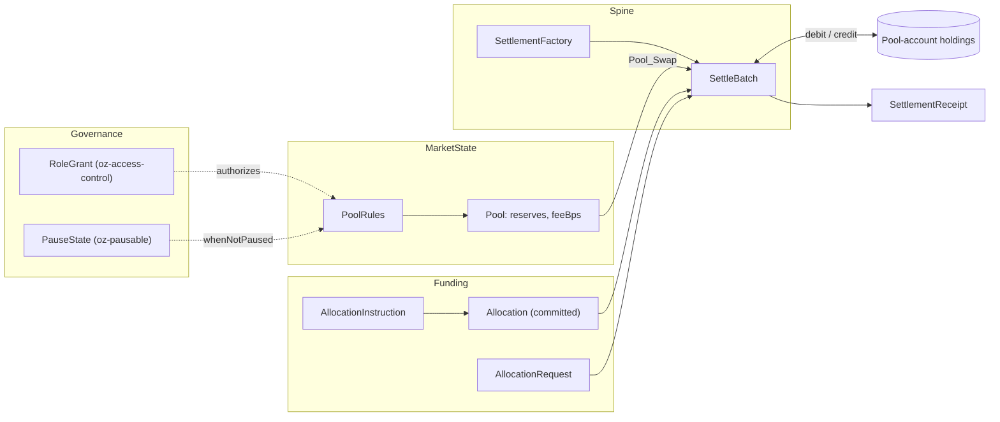
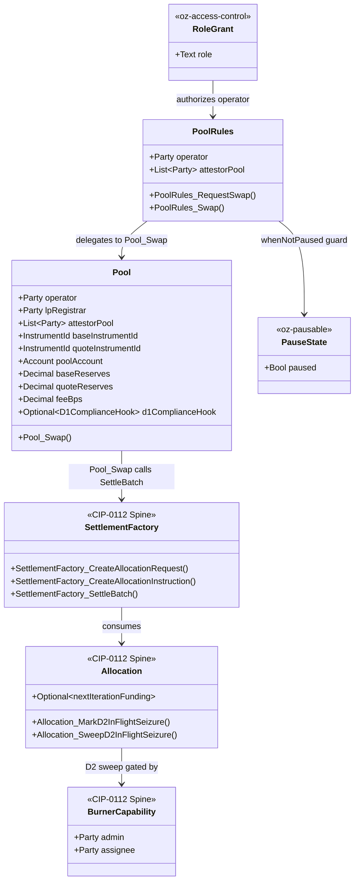

# Architectural Overview Report: Canton Reference Decentralized Exchange (DEX)

Status: **reference-design report.** It describes a *reference design* grounded in
the real OpenZeppelin Canton components in this workspace; it is **not** a claim of
acceptance, conformance, audit readiness, or production readiness.

> **Source-grounding tags** (throughout): `[IMPLEMENTED]` real code in the M1
> library base ([`canton-specs`](https://github.com/OpenZeppelin/canton-specs) /
> [`canton-contracts`](https://github.com/OpenZeppelin/canton-contracts)) ·
> `[EVIDENCE]` real code in an evidence repo
> ([`canton-token-template`](https://github.com/OpenZeppelin/canton-token-template),
> [`canton-stablecoin`](https://github.com/OpenZeppelin/canton-stablecoin)) ·
> `[UPSTREAM]` Splice / CIP reference, not vendored here · `[FUTURE]` proposed
> RI-level design, not built in M1.
>
> **Design priority order** (governs every interface and snippet):
> **1) Security → 2) Simplicity → 3) Readability → 4) Auditability.**

This is the architecture documentation for a privacy-preserving spot exchange on
the CIP-0112 / Token Standard V2 settlement spine. Its subject is a set of modular
**atomic delivery-versus-payment (DvP) swap primitives**, with a constant-product
**AMM** built out end-to-end as the worked demonstration. Companion deliverables
(reference code, demo front-end, threat model) are named but out of scope here.

---

## 1. Product Definition

### Who this is for, and what they expect

The design starts from the Canton Network stakeholders and the guarantees they
expect from an institutional venue. Those expectations — not an AMM feature list —
drive every choice in this document.

| Stakeholder | What they expect | Design consequence |
|---|---|---|
| **Institutional venue operator** | Run a trading venue without ever taking custody of, or unilateral transfer rights over, user funds. | Operator has execution authority only; the trader is the sole Party that can lock their own holding ([§7.1](#71-security-invariants)). |
| **Liquidity provider / trader** | Positions and flow stay private; no public mempool to be front-run in. | Per-Party projection: value rides on per-Party `Allocation` contracts; counterparties see only their own legs ([§2](#2-architecture-overview)). |
| **Compliance officer / regulator** | Compliance enforced on the settlement path, fail-closed — not bolted onto a front-end. | D1 checked per settlement leg; D2 judicial seizure to a preset custodian ([§3](#3-how-we-implement-it)). |
| **Protocol architect** | Fork a small, obviously-correct core and add their own market structure. | The **swap primitive** is the deliverable; the AMM is one instantiation of it (below). |
| **Auditor** | Explicit authority boundaries and a clear upgrade story. | Signatory-vs-controller topology ([§2](#2-architecture-overview)); SCU non-mutation rule ([§3](#3-how-we-implement-it)). |

### The Canton design model these expectations assume

Three Canton facts shape the whole design; they are stated once here and referenced
throughout:

- **Party is the actor.** Signatories, observers, controllers, and executors are
  **Parties** (each hosted on one or more participant nodes). Backend endpoints are
  scoped to Party access, and a contract is authorized by its signatory Parties, not
  by nodes. "Who may do X" is always a Party question.
- **Per-Party projection is the privacy model**, enforced by the Canton protocol: a
  contract is visible only to its stakeholder Parties. There is no globally readable
  pool state an anonymous participant can mutate, and no public mempool.
- **Daml is keyless.** State changes by archive-and-recreate, not in-place mutation,
  and a Party cannot be made a signatory without actively authorizing the transition
  that adds it — so **two-step handshakes are a necessity, not a style choice**
  ([§3](#3-how-we-implement-it)).
- **Code must be vetted, not merely present.** A Daml package (DAR) must be uploaded
  *and vetted* on a participant node before the Parties it hosts can transact with it;
  un-vetting a DAR blocks those Parties from *any* transaction using it — including a
  D2 lock-and-sweep. A transaction commits only if the hosting participants of **all**
  its signatories and observers have the **same** DAR version vetted (necessary, not
  sufficient), which makes upgrade/vetting coordination an operational prerequisite
  (SCU rollout, [§3](#3-how-we-implement-it); failure modes, [§7.4](#74-throughput-and-contention)).

*(For readers coming from EVM: an EVM contract is globally callable by any account,
off a shared public state tree. A Canton contract is different — an instance of a
Daml template, carrying both state and choices (business logic), authorized by its
signatory Parties and visible only to its stakeholders. MEV does not vanish; it moves
from a public mempool into the operator's private view ([Q6](#9-open-design-questions)).)*

### The primitive: atomic swaps, not the AMM

The load-bearing primitive is the **atomic DvP swap**: two committed `Allocation`s —
the taker's input leg and the counterparty's output leg — settled in one
all-or-nothing [`SettlementFactory_SettleBatch`](../../experiments/cip112-settlement/daml/OpenZeppelin/Experimental/Settlement/Cip112.daml#L249),
where the both-sided check pins each leg's exact amount to a signed allocation side.
Reusable primitives that cooperate this way — rather than one monolithic venue —
carry the security, compliance, and privacy guarantees *regardless of how the price
was discovered*.

Price discovery is the only axis on which venues differ. Each venue is a thin layer
that produces a signed (amount-in, amount-out) pair and hands it to the same swap
core: an AMM derives the pair from an `x·y=k` curve (built out here), a CLOB from a
matched resting order, an RFQ venue from a signed dealer quote. Each is a separate
application that emits swap legs into the same `SettleBatch` — not a
re-parameterization of the pool — so it inherits the primitive's guarantees without
re-deriving them. **Hence the scope choice:** this RI delivers the swap primitive and
the guidance for building venues on it; the AMM is the one venue built out in full, as
a **design plus a compiling exemplar** ([§4](#4-interfaces--usage-examples)), not a
production venue. Adopters build CLOB / RFQ / other venues on the same core.

The architecture builds on the **CIP-0112 / Token Standard V2 settlement spine**
`[IMPLEMENTED]` (`OpenZeppelin.Experimental.Settlement.Cip112` — the `Experimental`
segment marks the pre-promotion module namespace, which graduates to a stable path
once the primitive is promoted into `canton-contracts`), so reservation, swaps, and
liquidity mechanics execute through standardized allocation and settlement contracts —
no custom, siloed off-ledger balance sheet.

### Scope

The scope is a deliberate engineering posture, not minimalism: keep the shipped core
small and obviously correct so it can be audited and reused across the suite, and name
everything deferred as an explicit extension point or out-of-scope — so a reviewer sees
the boundary precisely instead of guessing it.

| In scope | Detail |
|---|---|
| Market structure | A **spot** exchange whose enabling primitive is the atomic DvP swap. The venue built out in full is a single-pool constant-product AMM (`x·y=k`). |
| Core flows (grant M2) | **Pool creation**, **liquidity provision/removal** (mint/burn LP tokens), **swap execution** (two-leg DvP), **fee collection** (`feeBps` accrues into reserves) — each modeled as settlement over the spine ([§3](#3-how-we-implement-it)). |
| Asset representation | Fungible assets on the CIP-0112 TSv2 holding interfaces; LP tokens minted/burned via the spine. |
| Settlement | Atomic DvP **only** through [`SettlementFactory_SettleBatch`](../../experiments/cip112-settlement/daml/OpenZeppelin/Experimental/Settlement/Cip112.daml#L249), value conservation enforced unconditionally on every settle path. |
| Compliance & control | D1 node-side compliance (Shape B, fail-closed, per settlement); D2 lock-and-sweep seizure gated by single-admin [`BurnerCapability`](../../experiments/cip112-settlement/daml/OpenZeppelin/Experimental/Settlement/Cip112.daml#L98); D3 single-synchronizer KYC, SCU-forward-compatible; D4 single-admin authority. |
| Consensus topology | A decentralized **attestor pool** (Parties) co-authorizes pool state transitions ([§2](#2-architecture-overview)). |
| Reuse | `oz-access-control`, `oz-ownable`, `oz-pausable`, the spine, `canton-token-template` / `canton-stablecoin` evidence, and the in-repo [`credential-gateway`](../../experiments/credential-gateway/daml/OpenZeppelin/Experimental/Credential/Gateway.daml). |

| Out of scope | Reason |
|---|---|
| Derivatives, synthetics | Spot trading only. |
| Leverage / margin / funding rates | No protocol-enshrined leverage. |
| External pricing oracles | The AMM invariant dictates price; `PriceOracle` `[EVIDENCE]` is referenced only for future stable-pool deviation checks. |
| CIP-56 / V1 allocation paths | V2 abstractions only. |
| Cross-synchronizer operation | Deferred; forward-compatible ([§8](#8-cross-synchronizer-extension-planned-future)). |

### Positioning

The differentiation is institutional posture in the settlement layer: compliance on
the settlement path, positions private by construction, and value moving only on the
standardized spine (any V2 asset lists without bespoke integration). The goal is a
readable, forkable institutional baseline that composes with the rest of this suite
over one spine — benchmarking against other venues is out of scope until the mechanics
are built and can be measured ([Q10](#9-open-design-questions)).

---

## 2. Architecture Overview

Operations partition into **Market State**, **Funding & Authorization**, **Asset
Reservation** (the spine), and **Registry Definitions**, orchestrated by reused
role-management, pausing, and settlement primitives. The data/state flow across those
layers:



### Core components and library mapping

| Component suite | Templates / libraries | Function |
|---|---|---|
| Access Control `[IMPLEMENTED]` | `oz-access-control`: [`RoleGrant`](../../access-control/daml/OpenZeppelin/AccessControl.daml), [`RoleAdmin`](../../access-control/daml/OpenZeppelin/AccessControl.daml), `DefaultAdminTransferOffer`, [`requireRole`](../../access-control/daml/OpenZeppelin/AccessControl.daml) | Role-based permissioning via the `roleId : MyRole -> Text` closed-sum wrapper (prevents role collision across administrative scopes). Governs operators, LP registrars, compliance officers. |
| Ownership `[IMPLEMENTED]` | `oz-ownable`: [`Ownership`](../../ownable/daml/OpenZeppelin/Ownable.daml), [`OwnershipOffer`](../../ownable/daml/OpenZeppelin/Ownable.daml) | Two-step handover of the single-admin authority (D4). |
| Venue constraints `[IMPLEMENTED]` | `oz-pausable`: [`PauseState`](../../pausable/daml/OpenZeppelin/Pausable.daml), [`whenNotPaused`](../../pausable/daml/OpenZeppelin/Pausable.daml) | Origination guard: blocks new swaps/liquidity adds; does not disturb in-flight settlements. |
| Settlement spine `[IMPLEMENTED]` | `Cip112`: [`SettlementFactory`](../../experiments/cip112-settlement/daml/OpenZeppelin/Experimental/Settlement/Cip112.daml#L191), [`AllocationRequest`](../../experiments/cip112-settlement/daml/OpenZeppelin/Experimental/Settlement/Cip112.daml#L322), [`AllocationInstruction`](../../experiments/cip112-settlement/daml/OpenZeppelin/Experimental/Settlement/Cip112.daml#L379), [`Allocation`](../../experiments/cip112-settlement/daml/OpenZeppelin/Experimental/Settlement/Cip112.daml#L474), [`SettlementReceipt`](../../experiments/cip112-settlement/daml/OpenZeppelin/Experimental/Settlement/Cip112.daml#L695), [`ToyHolding`](../../experiments/cip112-settlement/daml/OpenZeppelin/Experimental/Settlement/Cip112.daml#L133), [`BurnerCapability`](../../experiments/cip112-settlement/daml/OpenZeppelin/Experimental/Settlement/Cip112.daml#L98) | Core engine for all asset movement; atomic, multi-lateral, interface-bound. `ToyHolding` is the toy unit of value (real assets implement the TSv2 holding interface). |
| Asset evidence `[EVIDENCE]` | `canton-token-template`: `SimpleHolding`, `LockedSimpleHolding`, `SimpleTokenRules`, `TransferPreapproval` (the D2 `*_ForcedBurn` choice is a `[FUTURE]` extension — the template ships only `_Unlock`) | Holding and seizure logic; 3-way transfer dispatch and delegated credit. |
| Advanced state `[EVIDENCE]` | `canton-stablecoin`: `Vault`, `VaultFactory`, `VaultParams`, `PriceOracle` | Basis for stable-pool types and oracle-deviation checks. |
| Identity `[IMPLEMENTED]` (experimental) | [`credential-gateway`](../../experiments/credential-gateway/daml/OpenZeppelin/Experimental/Credential/Gateway.daml): `CredentialGatedActionRequest`, `MockVerificationResult`, `MockVerifierAuthorization`; D3 `KycClaim` + `TrustedIssuerRegistry` | D3 identity and D1 compliance via verifiable data structures for node-side attestation. |

### Party and role model

Duties are segregated across discrete Parties:

- **Venue Operator (`DEX_OPERATOR`)** — runs the venue backend: quotes swaps off
  the public `Pool` reserves, creates `PoolRules`, and submits batch settlements.
  Has execution authority to call the settlement factory but never holds custody of,
  nor any unilateral transfer right over, trader funds. (An AMM has no matching
  engine — the curve sets the price.)
- **LP Registrar (`DEX_LP_REGISTRAR`)** — manages LP-token policy; separated from
  the operator to allow future delegation to a regulated custodian.
- **Asset Administrator (`DEX_ADMIN`)** — issuer/registrar of the base and quote
  instruments; holds the [`BurnerCapability`](../../experiments/cip112-settlement/daml/OpenZeppelin/Experimental/Settlement/Cip112.daml#L98) for D2 seizure.
- **Trader / Liquidity Provider** — end-user Party authoring `Allocation`s from their
  wallet; the sole Party able to lock their own holdings.
- **Attestor Pool** — a per-pool set of **Parties** (`attestorPool : [Party]`) that
  co-authorize pool state transitions, each hosted on its operating entity's
  participant node (the validating infrastructure), acting as joint signatories on the
  `Pool`. It is both a consortium of Parties (the actors) and, underneath, their
  independent participant nodes.

### Trust topology: signatory vs. controller (canonical)

Every Canton contract declares which Parties participate in validation; validation
is restricted to the nodes hosting those Parties (unlike EVM, where every validator
re-executes all transitions). To stop the operator from unilaterally moving reserves,
the `Pool` names `attestorPool` in its signatories **and makes them controllers of
the swap choice**. This distinction is load-bearing and is relied on throughout:

- **Signatory status delegates authority.** In Daml, a contract's signatories
  delegate their authority to the consequences of any choice exercised on it. So a
  swap choice with `controller operator` would let the operator recreate `Pool`
  *alone*, on the attestors' delegated authority, without any attestor seeing that
  swap. Routing through `PoolRules` does not help — it is signed by `attestorPool`
  too and leaks the same authority.
- **Controllership forces per-action consent.** Making the swap entry choice
  `controller operator :: attestorPool` means the *exercise itself* requires each
  attestor's authorization at submission time (multi-party submission / external
  signing). Each attestor independently re-derives `Δout` from the public reserves,
  confirms the `k`-invariant, and only then co-signs.

**Signatory status governs who can *recreate* `Pool`; controllership governs who
must *approve this swap*.** The latter is what keeps the operator from moving
reserves, and it is referenced (not re-argued) in [§3](#3-how-we-implement-it) and [§4](#4-interfaces--usage-examples).

**Who holds the attestor keys.** Each attestor is a Party whose signing key is held by
the entity operating its participant node; LPs and traders trust that per-pool set as
they trust the operator not to take custody. Different pools may carry different
attestor sets. The intended model is a configurable **N-of-M threshold** — all-of-M is
just the `N = M` special case, and is what the exemplar code shows for simplicity.
N-of-M is the target precisely because all-of-M is unlikely to be acceptable: one
offline attestor stalls every swap. The threshold construction, the liveness cost, and
the privacy circle a larger set widens are open questions ([Q1](#9-open-design-questions),
[Q2](#9-open-design-questions)). Parties acting as joint required signatories across
independent participant nodes — a decentralized, multi-hosted arrangement — is an
existing Canton pattern, so integrating a production node-consensus layer is intended
to be a drop-in, not a rewrite.

---

## 3. How We Implement It

A swap is the primary critical path. The flow guarantees funds are never locked
without a resolution path and that the exchange is atomic.

### The settlement-spine flow

1. **Intent and quotation.** The trader requests a quote (Token A → B). The operator
   backend reads current `Pool` state and returns an expected output plus an
   `AllocationSpecification`. There is no separate price oracle: the spot price is a
   deterministic function of the public reserves (`quoteReserves / baseReserves`,
   adjusted for `feeBps`), so the trader can verify any quote against on-ledger state.
2. **Allocation generation.** The trader signs
   [`SettlementFactory_CreateAllocationInstruction`](../../experiments/cip112-settlement/daml/OpenZeppelin/Experimental/Settlement/Cip112.daml#L228), then
   [`AllocationInstruction_Accept`](../../experiments/cip112-settlement/daml/OpenZeppelin/Experimental/Settlement/Cip112.daml#L392) locks their Token A and creates a committed
   [`Allocation`](../../experiments/cip112-settlement/daml/OpenZeppelin/Experimental/Settlement/Cip112.daml#L474) naming `DEX_OPERATOR` as executor.
3. **Request formulation.** The trader formulates an [`AllocationRequest`](../../experiments/cip112-settlement/daml/OpenZeppelin/Experimental/Settlement/Cip112.daml#L322) (via
   [`SettlementFactory_CreateAllocationRequest`](../../experiments/cip112-settlement/daml/OpenZeppelin/Experimental/Settlement/Cip112.daml#L205)) naming Token B and its
   **exact** requested amount.
4. **Batch formulation.** `DEX_OPERATOR` aggregates the trader's `Allocation` and
   `AllocationRequest` with the pool's state into a
   [`SettlementFactory_SettleBatch`](../../experiments/cip112-settlement/daml/OpenZeppelin/Experimental/Settlement/Cip112.daml#L249) instruction.
5. **Attestor verification.** The `attestorPool` Parties verify the AMM invariant
   against the proposed state and append their required signatures (controllership,
   [§2](#2-architecture-overview)).
6. **Atomic settlement.** `SettleBatch` executes as one Daml transaction: consumes
   the input `Allocation`, archives the current `Pool`, emits a
   [`SettlementReceipt`](../../experiments/cip112-settlement/daml/OpenZeppelin/Experimental/Settlement/Cip112.daml#L695), credits Token B, and creates a new `Pool`.

Reaching step 6 takes a **multi-step handshake** (lock input, then request, then
batch-settle) forced by the keyless model ([§1](#1-product-definition)): a new signatory must actively
co-authorize, so the trader cannot both lock funds and have the pool consume them in
one unilateral call. The trade-off is deliberate — more round-trips to *originate* a
swap, in exchange for the operator never holding custody and the exchange being
atomic and private once it fires. Operator-side batching ([§7.4](#74-throughput-and-contention)) amortizes the
final consensus round across many traders.

> **Non-negotiable enforcement:** atomic DvP is achieved **only** through
> [`SettlementFactory_SettleBatch`](../../experiments/cip112-settlement/daml/OpenZeppelin/Experimental/Settlement/Cip112.daml#L249). The direct
> [`Allocation_Settle`](../../experiments/cip112-settlement/daml/OpenZeppelin/Experimental/Settlement/Cip112.daml#L493) path proves authorization exists but is not atomic
> multi-lateral co-settlement, so it is not used for the asset exchange.

### AMM math, on-ledger binding, and co-atomicity

This is the core of the DEX, so it is specified concretely. Let the trader send
`Δin` of the input into reserves `(reserveIn, reserveOut)` with fee `feeBps`. The
fee is taken on the input:

```text
amountInWithFee = Δin · (10000 − feeBps) / 10000
Δout            = (reserveOut · amountInWithFee) / (reserveIn + amountInWithFee)
```

(Integer-basis-points form of `Δin · (1 − feeBps/10000)`, written to keep the bps
denominator explicit and division-safe.) Post-swap reserves are
`reserveIn' = reserveIn + Δin` (full input, including retained fee) and
`reserveOut' = reserveOut − Δout`; because the fee stays in the pool the invariant
is **non-decreasing**:

```text
(reserveIn + amountInWithFee) · (reserveOut − Δout)  ≥  reserveIn · reserveOut
```

**Slippage bound (spine reality).** The spine is **exact-in / exact-out**: an
`AllocationRequest` has no `minOutputAmount` field — it carries exact per-leg
amounts, and `SettleBatch` enforces that every authorizer's signed leg sides are
delivered exactly. So the trader's protection is **the exact output amount they
themselves signed**: the operator cannot settle a batch delivering less than the
signed `ReceiverSide` amount without failing authorization, nor more without another
Party funding it. A *personal* slippage bound must therefore be part of the trader's
own signed authorization, never an operator-supplied choice argument. Two spine-native
ways to express it: (1) **sign the quoted `Δout`** — if the curve moves, amounts no
longer match and the batch fails, forcing a re-quote (simplest); or (2) an RI-level
`minOutputAmount` on a **trader-signed** wrapper (e.g. a `SwapIntent`) that
`Pool_Swap` reads from that contract. An operator-supplied bound would let the
operator choose the floor, breaking non-custodiality.

**The decisive step** is that `Pool_Swap` does not merely re-assert the curve — it
**binds the curve inputs to the trader's own signed allocation**: it reads
`traderAllocationId` and asserts the signed sender side equals (`amountIn`, input
instrument), the signed receiver side equals (`Δout`, output instrument), and the
settled `transferLegs` are exactly those two legs. The tie from curve to signature is
enforced *on-ledger* by the choice itself — not left to attestor diligence or
`SettleBatch` leg-pinning alone — so neither the operator nor a stale quote can move
reserves off a value the trader did not sign.

**Co-atomicity.** The reserve transition and the asset movement are **one** Daml
transaction. A single `PoolRules_Swap → Pool_Swap` exercise (driven by `operator`,
co-controlled by `attestorPool`):

1. settles **two** committed allocations in one `SettleBatch` — the trader's (input
   `Δin`) and the pool's own (output `Δout`, funded from the bound `poolAccount`
   holdings) — and
2. archives the current `Pool` (consuming choice) and creates the successor with
   reserves updated by `+Δin / −Δout`.

Under **Canton's** all-or-nothing transaction semantics there is no state where
reserves moved but legs did not, or vice versa. This is the on-ledger realization of
the [§7.1](#71-security-invariants) *AMM Conservation* invariant, enforced by Canton
consensus rather than operator discipline.

**Reserves vs. holdings.** `baseReserves`/`quoteReserves` are `Decimal` *accounting*
figures, not the assets. The real value lives in TSv2 holdings owned by a dedicated
**pool account** (an `Account` whose parties are the pool's signatories). Provision
settles the LP's holdings *into* that account and increments reserves to match;
removal funds the withdrawal legs *from* it and decrements reserves. Because reserve
updates and holding movements commit co-atomically, the two cannot drift within a
transaction; the residual risk is *fragmentation* (many small holdings), addressed
by a periodic consolidation step. The `reserves == Σ(pool-account holdings)`
invariant, funded seeding, and consolidation cadence are tracked as [Q3](#9-open-design-questions).

### Liquidity provision, removal, and fee accrual

All non-swap flows stay atomic via `SettleBatch` and are guarded by `whenNotPaused`
at origination:

- **Pool creation.** `DEX_OPERATOR`, `DEX_LP_REGISTRAR`, and `attestorPool`
  jointly create the `Pool`; initial reserves are seeded by the first provision.
- **Liquidity provision.** The LP allocates *both* instruments; the operator
  batch-settles them into the pool account and, in the same transaction,
  `DEX_LP_REGISTRAR` mints LP tokens proportional to the contributed share.
- **Liquidity removal.** The LP burns LP tokens; the batch settles a proportional
  withdrawal of *both* reserves back to the LP.
- **Fee accrual.** `feeBps` is retained on each swap, so reserves grow relative to
  LP-token supply — fees accrue to LPs via redemption value, not a separate claim. A
  dynamic-fee hook is an SCU extension point ([Q11](#9-open-design-questions)), not M1.

### D1 compliance: node-side attestation (Shape B)

The intended D1 posture is compliance checked per settlement, **no caching**,
**fail-closed**. This is a design commitment, not an already-closed gate: base
[`SettlementFactory_SettleBatch`](../../experiments/cip112-settlement/daml/OpenZeppelin/Experimental/Settlement/Cip112.daml#L249) can settle with **no** attestation; the requirement
is engaged by the allocation's optional [`D1ComplianceHook`](../../experiments/cip112-settlement/daml/OpenZeppelin/Experimental/Settlement/Cip112.daml#L41) (when
`requiresPerSettlementReference` is set) and the additive typed-attestation path — the
real spine choice [`SettlementFactory_SettleBatchWithAttestation`](../../experiments/cip112-settlement/daml/OpenZeppelin/Experimental/Settlement/Cip112.daml#L274)
against a [`TrustedAttesterRegistry`](../../experiments/cip112-settlement/daml/OpenZeppelin/Experimental/Settlement/Cip112.daml#L778)
(a factory can be configured to make that path mandatory).

The RI selects **Shape B** (signed node attestation) over Shape A (an off-ledger API
gate), which would add a centralized failure point, latency, and conflict with the
attestor topology. The on-ledger seam is the `D1ComplianceHook` config record
(`hookRef`, `requiresPerSettlementReference`) carried on the `Pool`; at `SettleBatch`
time the node-side check requires a `CredentialGatedActionRequest` with a
`MockVerificationResult` — a stand-in for a live compliance-verification result (which
in production could be a signed node attestation or a zero-knowledge proof; nothing
here *requires* ZK) — proving the trader is unflagged within current ledger-time
bounds. Whether the contract stays oblivious or verifies a signed attestation
on-ledger is [Q8](#9-open-design-questions).

### D2 seizure: admin-preset custodian lock-and-sweep

D2 implements judicial seizure via a strict **lock-and-sweep** that **forbids
arbitrary burning** and **forbids returning seized funds to the sender**. It uses
the real spine choices on [`Allocation`](../../experiments/cip112-settlement/daml/OpenZeppelin/Experimental/Settlement/Cip112.daml#L474):
[`Allocation_MarkD2InFlightSeizure`](../../experiments/cip112-settlement/daml/OpenZeppelin/Experimental/Settlement/Cip112.daml#L595) blocks settlement, then
[`Allocation_SweepD2InFlightSeizure`](../../experiments/cip112-settlement/daml/OpenZeppelin/Experimental/Settlement/Cip112.daml#L625) (gated by the single-admin
[`BurnerCapability`](../../experiments/cip112-settlement/daml/OpenZeppelin/Experimental/Settlement/Cip112.daml#L98)) sweeps the locked holding to the
`custodianDestination : Account` in the [`D2SeizureHook`](../../experiments/cip112-settlement/daml/OpenZeppelin/Experimental/Settlement/Cip112.daml#L46) config record. By
contrast, a transfer that *fails* returns to sender — assets are never marooned by
technical faults. (**Decided D2 semantics:** seizure → preset custodian; transfer
failures → sender.)

### D3 identity: single-synchronizer v1, SCU-forward-compatible

Traders hold a `KycClaim` issued by a Party in the `TrustedIssuerRegistry` to
interact with permissioned pools (identity gating is **optional per pool**). To stay
compatible with cross-synchronizer models (ONCHAINID / ERC-3643 / Chainlink CCID) without
breaking state, identity requirements are declared via `Optional` fields; a
cross-synchronizer proof type is later appended within the existing `Optional` parameter,
leaving single-synchronizer logic intact — the additive path proven in the `canton-specs`
identity-hook upgrade spike. Off-ledger resolution of external attributes is
[Q7](#9-open-design-questions).

### D4 authority: single-admin capability

M1 critical actions (LP-token minting, burning, seizure, ownership handoff) use a
**single-admin capability** via `oz-access-control`. Role-admin delegation and the
timelocked admin handoff are in M1 scope; only the multi-sig *signing* model and
multi-hosted-party authority are deferred to M3, keeping the M1 core small.

> **`[FUTURE]` maker-checker.** An institutional desk's two-tier internal control
> (maker proposes, checker approves) is an *internal* control, expressed with the
> native propose-accept handshake gated by distinct `oz-access-control` role grants.
> It leaves the venue's `PoolRules` interface unchanged (the venue still sees one
> committed `Allocation`) and is an SCU extension point, not a separate authority path.

### The SCU extension story (canonical)

**Smart Contract Upgrade (SCU)** is Canton's mechanism for evolving **templates**
safely. The non-negotiable rule: an existing choice's argument type must never be
mutated to require a new field — extensions use appended `Optional` fields, new
serializable types, and **new, parallel choices**.

Interfaces are governed by different rules and must not be conflated with templates.
An **interface *definition* is immutable** — you cannot change or remove an interface a
template already implements — but a template *may add* a new interface, and an
interface *instance*'s **implementation** (the code behind its methods) *can* change
([Canton SCU docs](https://docs.canton.network/appdev/deep-dives/smart-contract-upgrade#upgrading-interfaces)).
Daml 3.x additionally removed **retroactive interface instances** `[UPSTREAM]` (they
broke clean upgrades). So a new compliance/reporting facet is added by a new choice
and/or a new template implementing a new interface — never by mutating an existing
choice's args or retroactively re-instancing an existing `Pool` / `PoolRules`.
Example: granular jurisdictional compliance is added as a new
`PoolRules_SwapWithJurisdiction` reading a newly appended
`Optional JurisdictionalComplianceHook`, not by mutating `PoolRules_Swap`.

**An upgrade takes effect by vetting, not by deployment alone.** A new package version
is live only once its DAR is **vetted** on the participant nodes hosting the affected
Parties, and a transaction commits only if all its signatories' and observers' hosting
participants have the same version vetted ([§1](#1-product-definition)). Vetting (and
un-vetting) is therefore the real lever for enabling a new choice or retiring an old
one across the venue; coordinating it is an operational prerequisite.

**Closing the weaker path is a body change, not frontend routing.** Adding a stricter
parallel choice does *not* close the looser one; leaving `PoolRules_Swap` live and
routing around it in the frontend lets anyone call the weaker path directly. The SCU
rule forbids mutating a choice's *arguments* but **permits updating its body**, so the
correct deprecation is to make `PoolRules_Swap`'s body fail unconditionally
(`assertMsg "deprecated: use PoolRules_SwapWithJurisdiction" False`), reverting the
weaker path while leaving its signature — and in-flight `AllocationRequest`
compatibility — intact.

---

## 4. Interfaces & Usage Examples

Idiomatic Daml that composes with the real components above. RI-introduced templates
not in the spine today are tagged `[FUTURE]`.

### 4.1 Pool state and configuration `[IMPLEMENTED]` (experimental)

> **Realized as compiling code** in
> [`experiments/dex-amm`](../../experiments/dex-amm/daml/OpenZeppelin/Experimental/Dex/Amm.daml)
> (`oz-experimental-dex-amm`), built under `dpm build --all` and exercised by the
> `dexSwapExemplar` Daml Script, which proves at runtime: (1) the operator alone
> **cannot** drive a swap (`submitMustFail`); (2) the pool delivers exactly the
> curve's `dOut`; (3) the pool funds its own output leg from its bound `poolAccount`,
> so the reserve *delta* matches real holding movement; (4) the pause guard sits on
> the reserve-updating choice. The snippet below is the shape; the module is the
> source of truth.

The reserve-update logic lives **here**, as a *consuming* choice on `Pool` (not on
`PoolRules`), on the signatory-vs-controller basis established in [§2](#2-architecture-overview):
recreating the successor `Pool` runs on the signatories' inherited authority
(`operator + lpRegistrar + attestorPool`), while forcing the attestors to validate
*this* swap is separate — they are made **controllers** (`controller operator ::
attestorPool`). The exemplar shows all-of-M (every attestor a required controller) for
simplicity; the intended model is a configurable N-of-M threshold ([Q1](#9-open-design-questions)).

```daml
-- Pool AND PoolRules live in one module in the realized package.
module OpenZeppelin.Experimental.Dex.Amm where

import OpenZeppelin.Experimental.Settlement.Cip112  -- spine: D1ComplianceHook, etc.
import OpenZeppelin.Experimental.TokenStandard.V2.Holding (InstrumentId)
import OpenZeppelin.Experimental.TokenStandard.V2.Allocation (SettlementInfo, TransferLeg)
import OpenZeppelin.Pausable (PauseState, whenNotPaused)
-- `allDistinct` is a local helper (see the module).

-- | The core state of the constant-product AMM.
template Pool
  with
    operator : Party
    lpRegistrar : Party
    attestorPool : [Party]            -- explicitly configured consensus topology
    -- Typed instrument identity binds each id to its issuing admin, so a Pool can
    -- only name instruments that admin issued.
    baseInstrumentId : InstrumentId
    quoteInstrumentId : InstrumentId
    -- The canonical account whose holdings are the reserves; bound into every swap
    -- so the trader's signed counterparty cannot be a different account.
    poolAccount : Account
    baseReserves : Decimal
    quoteReserves : Decimal
    feeBps : Decimal
    -- SCU extension point (config record, not a contract id).
    d1ComplianceHook : Optional D1ComplianceHook
  where
    signatory operator, lpRegistrar
    signatory attestorPool

    ensure
      baseReserves >= 0.0 &&
      quoteReserves >= 0.0 &&
      feeBps >= 0.0 && feeBps <= 10000.0 &&
      baseInstrumentId /= quoteInstrumentId &&
      allDistinct (operator :: lpRegistrar :: attestorPool) &&
      not (null attestorPool)

    -- Consuming reserve update, co-controlled by the attestors (per-swap consent,
    -- §2). Archives this Pool and creates the successor on inherited authority.
    choice Pool_Swap : (ContractId SettlementReceipt, ContractId Pool)
      with
        traderAllocationId : ContractId Allocation  -- trader's committed input (Δin);
                                                    -- its signed ReceiverSide is the exact-out bound
        poolAllocationId : ContractId Allocation     -- pool's own leg, funded from pool-account holdings
        pauseStateId : ContractId PauseState
        baseToQuote : Bool
        amountIn : Decimal                  -- Δin; must equal the trader's signed input leg
        outputAmount : Decimal              -- the trader's signed exact output
        settlementFactoryId : ContractId SettlementFactory
        settlement : SettlementInfo
        transferLegs : [TransferLeg]        -- exactly: trader→pool Δin, pool→trader Δout
        d1ComplianceRef : Optional Text
      controller operator :: attestorPool
      do
        assertMsg "positive input required" (amountIn > 0.0)
        pause <- fetch pauseStateId
        whenNotPaused pause                 -- Pool_Swap is directly exercisable, so guard here too
        let (reserveIn, reserveOut) =
              if baseToQuote then (baseReserves, quoteReserves)
                             else (quoteReserves, baseReserves)
            (inInstrument, outInstrument) =
              if baseToQuote then (baseInstrumentId, quoteInstrumentId)
                             else (quoteInstrumentId, baseInstrumentId)
            amountInWithFee = amountIn * (10000.0 - feeBps) / 10000.0
            dOut = (reserveOut * amountInWithFee) / (reserveIn + amountInWithFee)
        assertMsg "constant-product invariant violated"
          ((reserveIn + amountInWithFee) * (reserveOut - dOut) >= reserveIn * reserveOut)
        assertMsg "quote drift: signed output != curve output" (outputAmount == dOut)
        -- On-ledger binding (§3): tie the submitter-supplied curve inputs to what the
        -- trader signed, so the reserve math cannot run off numbers that don't settle.
        traderAlloc <- fetch traderAllocationId
        let traderAccount = traderAlloc.allocation.authorizer
            signedSides = traderAlloc.allocation.transferLegSides
        inSide <- case filter (\s -> s.side == SenderSide) signedSides of
          [s] -> pure s
          _ -> abort "trader allocation must sign exactly one sender (input) side"
        outSide <- case filter (\s -> s.side == ReceiverSide) signedSides of
          [s] -> pure s
          _ -> abort "trader allocation must sign exactly one receiver (output) side"
        assertMsg "signed input side != (amountIn, input instrument)"
          (inSide.amount == amountIn && inSide.instrumentId == inInstrument.id)
        assertMsg "signed output side != (dOut, output instrument)"
          (outSide.amount == dOut && outSide.instrumentId == outInstrument.id)
        -- Bind the counterparty identity to this pool's canonical account.
        assertMsg "input counterparty is not the pool account" (inSide.otherside == poolAccount)
        assertMsg "output counterparty is not the pool account" (outSide.otherside == poolAccount)
        let expectedInLeg = TransferLeg with
              transferLegId = inSide.transferLegId
              sender = traderAccount; receiver = poolAccount
              amount = amountIn; instrumentId = inInstrument.id; meta = inSide.meta
            expectedOutLeg = TransferLeg with
              transferLegId = outSide.transferLegId
              sender = poolAccount; receiver = traderAccount
              amount = dOut; instrumentId = outInstrument.id; meta = outSide.meta
        assertMsg "settled legs != the two legs the trader signed"
          (transferLegs == [expectedInLeg, expectedOutLeg])
        -- Atomic DvP: trader input + pool output settle in one batch. SettleBatch's
        -- both-sided check pins each leg's exact amount to a signed side.
        receipts <- exercise settlementFactoryId SettlementFactory_SettleBatch with
          settlement
          transferLegs
          allocationCids = [traderAllocationId, poolAllocationId]
          actors = [operator]
          d1ComplianceRef
        let (newBase, newQuote) =
              if baseToQuote then (baseReserves + amountIn, quoteReserves - dOut)
                             else (baseReserves - dOut, quoteReserves + amountIn)
        newPool <- create this with baseReserves = newBase; quoteReserves = newQuote
        traderReceipt <- case receipts of
          r :: _ -> pure r                  -- receipts align with allocationCids order
          [] -> abort "SettleBatch returned no receipt"
        pure (traderReceipt, newPool)
```

### 4.2 Swap execution rules `[IMPLEMENTED]` (experimental)

`PoolRules` decouples static execution permissions from dynamic `Pool` state. Two
deliberate choices: (1) it stores **no** `poolId` / `pauseStateId` — those choices are
consuming, so any stored `ContractId` would be bricked after the first toggle/swap;
the current `Pool` and `PauseState` are passed as choice arguments. (2) The reserve
update is **delegated to `Pool_Swap`**, and `PoolRules_Swap` is co-controlled by the
attestors (`operator :: attestorPool`), for the same per-swap-consent reason as
[§2](#2-architecture-overview) (an operator-only entry choice would leak the attestors' delegated
authority).

```daml
-- (same module as §4.1 — Pool_Swap is in scope)

template PoolRules
  with
    operator : Party
    attestorPool : [Party]
  where
    signatory operator
    signatory attestorPool

    -- Origination gate. Since SettlementFactory_CreateAllocationRequest is controlled
    -- by the executors (not the trader), this is a pause-gated *intent signal*; the
    -- committed Allocation/AllocationRequest are built through the standard spine
    -- lifecycle (executor creates the request; trader accepts, locking funds).
    nonconsuming choice PoolRules_RequestSwap : ()
      with
        trader : Party
        pauseStateId : ContractId PauseState
      controller trader
      do
        pause <- fetch pauseStateId
        whenNotPaused pause
        pure ()

    -- Atomic DvP. Co-controlled by the attestors, then delegates to Pool_Swap, which
    -- archives-and-recreates and returns the successor cid (no dangling pointer).
    nonconsuming choice PoolRules_Swap : (ContractId SettlementReceipt, ContractId Pool)
      with
        poolId : ContractId Pool                     -- current pool, passed in (not stored)
        pauseStateId : ContractId PauseState          -- current PauseState, passed in (not stored)
        traderAllocationId : ContractId Allocation
        poolAllocationId : ContractId Allocation       -- pool's own output leg
        baseToQuote : Bool
        amountIn : Decimal
        outputAmount : Decimal                         -- trader's signed exact output
        settlementFactoryId : ContractId SettlementFactory
        settlement : SettlementInfo
        transferLegs : [TransferLeg]
        d1ComplianceRef : Optional Text
      controller operator :: attestorPool
      do
        pause <- fetch pauseStateId
        whenNotPaused pause                          -- defence-in-depth; Pool_Swap re-checks
        exercise poolId Pool_Swap with
          traderAllocationId; poolAllocationId; pauseStateId
          baseToQuote; amountIn; outputAmount
          settlementFactoryId; settlement; transferLegs; d1ComplianceRef
```

> **SCU note ([§3](#3-how-we-implement-it)):** to deprecate `PoolRules_Swap`, update *its own body* to
> fail unconditionally (an SCU-permitted body change), never leave it live and route
> around it in the frontend.

### 4.3 D2 seizure and D4 authority

D2 uses the **real spine choices**, gated by the single-admin `BurnerCapability`
`[IMPLEMENTED]`. There is no separate `ExecuteSeizure` template — the `D2SeizureHook`
is a config record carrying the preset `custodianDestination`, and the action runs on
the `Allocation` itself.

```daml
-- [IMPLEMENTED] spine config record (OpenZeppelin.Experimental.Settlement.Cip112):
--   data D2SeizureHook = D2SeizureHook with
--     seizureCaseRef : Text
--     custodianDestination : Account   -- admin-preset; never burn, never return-to-sender
--     inFlightHandlingStatus : Text
--
-- [IMPLEMENTED] capability (single-admin authority, D4):
--   template BurnerCapability with
--     admin : Party; assignee : Party
--     instrumentScope : Optional InstrumentId; featureFlag : Text

-- Seizure of an in-flight allocation (two real choices on `Allocation`):
--   1. Block settlement:
--        exercise allocationId Allocation_MarkD2InFlightSeizure with seizureHook = ...
--   2. Lock-and-sweep to the preset custodian (BurnerCapability-gated):
--        exercise allocationId Allocation_SweepD2InFlightSeizure with
--          burnerCap = burnerCapId          -- proves D4 single-admin authority
--          -- destination is the hook's custodianDestination; fails closed on tamper.
```

---

## 5. Diagrams

Structurally compatible with the **proposed** `canton-settlement-explorer` tool
`[FUTURE]` (presets: *Privacy DEX*, *Batch DvP*) — a design target, not a tool in this
repo today.

### 5.1 Interface and component diagram



### 5.2 Flow-of-funds settlement diagram (Privacy DEX preset)

Per-Party allocation requests and atomic co-settlement via `SettleBatch`. Privacy
boundary: the trader sees their own allocation and receipt, not the backend pool
routing or attestor verification.


---

## 6. Library Dependencies

### 6.1 Internal

| Package | Consumed | Context | Tag |
|---|---|---|---|
| `oz-access-control` | [`RoleGrant`](../../access-control/daml/OpenZeppelin/AccessControl.daml), [`RoleAdmin`](../../access-control/daml/OpenZeppelin/AccessControl.daml), `DefaultAdminTransferOffer`, [`requireRole`](../../access-control/daml/OpenZeppelin/AccessControl.daml) | D4 authority and role administration. | `[IMPLEMENTED]` |
| `oz-ownable` | [`Ownership`](../../ownable/daml/OpenZeppelin/Ownable.daml), [`OwnershipOffer`](../../ownable/daml/OpenZeppelin/Ownable.daml) | Two-step transfer of protocol ownership. | `[IMPLEMENTED]` |
| `oz-pausable` | [`PauseState`](../../pausable/daml/OpenZeppelin/Pausable.daml), [`whenNotPaused`](../../pausable/daml/OpenZeppelin/Pausable.daml) | Circuit breaker in `PoolRules`. | `[IMPLEMENTED]` |
| `Cip112` | [`SettlementFactory`](../../experiments/cip112-settlement/daml/OpenZeppelin/Experimental/Settlement/Cip112.daml#L191), [`AllocationRequest`](../../experiments/cip112-settlement/daml/OpenZeppelin/Experimental/Settlement/Cip112.daml#L322), [`AllocationInstruction`](../../experiments/cip112-settlement/daml/OpenZeppelin/Experimental/Settlement/Cip112.daml#L379), [`Allocation`](../../experiments/cip112-settlement/daml/OpenZeppelin/Experimental/Settlement/Cip112.daml#L474), [`SettlementReceipt`](../../experiments/cip112-settlement/daml/OpenZeppelin/Experimental/Settlement/Cip112.daml#L695), [`ToyHolding`](../../experiments/cip112-settlement/daml/OpenZeppelin/Experimental/Settlement/Cip112.daml#L133), [`BurnerCapability`](../../experiments/cip112-settlement/daml/OpenZeppelin/Experimental/Settlement/Cip112.daml#L98), [`D1ComplianceHook`](../../experiments/cip112-settlement/daml/OpenZeppelin/Experimental/Settlement/Cip112.daml#L41), [`D2SeizureHook`](../../experiments/cip112-settlement/daml/OpenZeppelin/Experimental/Settlement/Cip112.daml#L46) | The shared settlement engine. | `[IMPLEMENTED]` (experimental) |
| `canton-token-template` | `SimpleHolding`, `LockedSimpleHolding`, `SimpleTokenRules`, `TransferPreapproval` | Underlying token logic; D2 `*_ForcedBurn` is `[FUTURE]` (template ships only `_Unlock`). | `[EVIDENCE]` (+ `[FUTURE]`) |
| `canton-stablecoin` | `VaultFactory`, `PriceOracle` | Future stable-pool extensions and slippage circuit-breaker feeds. | `[EVIDENCE]` |
| [`credential-gateway`](../../experiments/credential-gateway/daml/OpenZeppelin/Experimental/Credential/Gateway.daml) | [`CredentialGatedActionRequest`](../../experiments/credential-gateway/daml/OpenZeppelin/Experimental/Credential/Gateway.daml), [`MockVerificationResult`](../../experiments/credential-gateway/daml/OpenZeppelin/Experimental/Credential/Gateway.daml), [`MockVerifierAuthorization`](../../experiments/credential-gateway/daml/OpenZeppelin/Experimental/Credential/Gateway.daml) | D1/D3 credential gating and verification. | `[IMPLEMENTED]` (experimental) |
| `canton-specs` identity-hook | `KycClaim`, `TrustedIssuerRegistry` | Typed D3 Shape-B identity, layered via SCU. | `[IMPLEMENTED]` (experimental) |

### 6.2 External

The architecture operates against the **Splice Token Standard V2** interfaces
`[UPSTREAM]`. Present implementation: local stand-ins designed to maximally match the
V2 interfaces, against which the RI interfaces via the `Cip112` spine (targeting the
*interfaces*, not DAR/package-ID pins). Planned migration: once the published V2 DARs
ship and the import gate is cleared, the stand-ins are swapped for the published DARs
— interface-based design makes this a thin substitution. Import remains gated; no
public-API, conformance, or release-readiness claim.

---

## 7. Security & Auditability

Simplicity minimizes the surface for logic exploits; Canton's per-Party projections
create natural containment boundaries.

### 7.1 Security invariants

- **Non-custodial venue.** The operator never holds custody of, nor any unilateral
  right to move, trader funds. The trader is the sole Party able to lock their own
  holding (via [`AllocationInstruction_Accept`](../../experiments/cip112-settlement/daml/OpenZeppelin/Experimental/Settlement/Cip112.daml#L392)); the operator can only drive
  [`SettlementFactory_SettleBatch`](../../experiments/cip112-settlement/daml/OpenZeppelin/Experimental/Settlement/Cip112.daml#L249) over the *exact* committed
  [`Allocation`](../../experiments/cip112-settlement/daml/OpenZeppelin/Experimental/Settlement/Cip112.daml#L474) and the trader's own [`AllocationRequest`](../../experiments/cip112-settlement/daml/OpenZeppelin/Experimental/Settlement/Cip112.daml#L322) (whose signed
  exact-output amount is the bound — [§3](#3-how-we-implement-it)). **Reclaim is precisely bounded:**
  a trader cannot self-settle (`Allocation_Settle` / `Allocation_SettleInBatch`
  require `admin :: executors`); reclaim via
  [`Allocation_Withdraw`](../../experiments/cip112-settlement/daml/OpenZeppelin/Experimental/Settlement/Cip112.daml#L583) is gated by
  [`requireWithdrawAllowed`](../../experiments/cip112-settlement/daml/OpenZeppelin/Experimental/Settlement/Cip112.daml#L1409), which for a committed allocation blocks withdraw
  until after `settlementDeadline` (and outright if there is none). **So a swap
  allocation must carry a `settlementDeadline`** — with one, the trader is guaranteed
  reclaim after it lapses; without one, operator inaction would strand the trader.
  This is Daml's non-transitive authorization: a choice authorizes only its declared
  consequences.
- **AMM conservation (`x·y=k`).** After a swap (fees applied), reserves' product is
  `≥` the pre-swap product. Enforced in `Pool_Swap`, verified off-ledger by attestors
  before signature.
- **Funding conservation.** On every settle path the engine enforces that an
  authorizer's archived locked inputs cover its SenderSide obligations per instrument
  — surplus returns as unlocked change; an under-funded sender fails closed — so a
  swap can never move out more than backs it. Enforced unconditionally.
  `nextIterationFunding` is inert forward-compatible TSv2 metadata in M1 (neither
  validated nor acted on); iterated settlement is [Q5](#9-open-design-questions).
- **First-deposit inflation resistance.** Like every constant-product pool, the RI is
  exposed to the first-depositor share-inflation attack; the LP-mint path must
  address it before minting logic is built ([Q4](#9-open-design-questions)).

### 7.2 The validation ladder `[FUTURE]`

The three-tier ladder is **proposed**, not built in M1; `daml-lint` / `daml-props` /
`daml-verify` do not exist in this repo or any named evidence repo. The **real** M1
gate is `dpm build --all` plus the Daml Script suites run by `scripts/run-tests.sh`
and `scripts/check-scaffold.sh` (wired in [`.github/workflows/ci.yml`](../../.github/workflows/ci.yml)),
with anchors validated by `scripts/refresh-ri-anchors.sh`.

| Tier | Proposed tooling `[FUTURE]` | Purpose |
|---|---|---|
| L1: Static analysis | `daml-lint` | AST checks: decimal bounds, unguarded division, positivity, archive-before-execute, anti-patterns. |
| L2: Generative testing | `daml-props` | Property-based testing with shrinking: fuzzed state transitions to stress conservation/supply/balance invariants. |
| L3: Formal verification | `daml-verify` | Z3-backed proofs (conservation, division-safety, temporal): unauthorized transitions logically impossible. |

### 7.3 Threat model and failure modes

| Vector | Attack | Mitigation |
|---|---|---|
| Malicious operator state manipulation | Operator submits a `SettleBatch` bypassing the curve or extracting slippage. | Attestors are **controllers** ([§2](#2-architecture-overview)), so the operator cannot exercise the swap alone; without their co-authorization the transaction fails at the synchronizer. |
| Compliance evasion (D1) | Sanctioned user routes through a secondary contract to bypass the [`D1ComplianceHook`](../../experiments/cip112-settlement/daml/OpenZeppelin/Experimental/Settlement/Cip112.daml#L41). | Shape-B evaluates true fund origin at the `SettleBatch` layer, fail-closed; without a fresh valid `MockVerificationResult` the batch is invalid. |
| Rogue seizure / burning (D2) | Compromised admin key tries to burn assets or divert seized funds. | [`Allocation_SweepD2InFlightSeizure`](../../experiments/cip112-settlement/daml/OpenZeppelin/Experimental/Settlement/Cip112.daml#L625) hardcodes the preset `custodianDestination`; arbitrary burn forbidden. |
| Upgrade breaks in-flight allocations (SCU) | A bad upgrade mutates fields, rendering `Allocation`s un-settleable. | SCU rule ([§3](#3-how-we-implement-it)): `Optional` appends + new choices only; existing `PoolRules` stay operable. |
| First-depositor share inflation | First LP mints negligible supply, then donates into the pool account to inflate share price. | Burn a `MINIMUM_LIQUIDITY` tranche and/or seed from a trusted first provision ([Q4](#9-open-design-questions)). |
| Operator ordering / private MEV | Operator orders/delays `SettleBatch` to its benefit (e.g. sandwiching). | Attestors block *off-curve* execution, **not ordering**. Mitigations are operational, not yet on-ledger ([Q6](#9-open-design-questions)). |

### 7.4 Throughput and contention

Because the keyless model archives and recreates the single `Pool` on every swap
([§3](#3-how-we-implement-it)), swaps against the *same* pool serialize: two concurrent swaps consume the
same `Pool` cid, so the synchronizer commits one and forces the other to retry.
Contention is per-pool, not a global bottleneck. Structural advantages over an EVM
AMM: independent pools settle in parallel, there is no public-mempool MEV tax on the
critical path, and several allocations can ride one `SettleBatch`. Removing the public
mempool relocates the ordering advantage to the operator ([Q6](#9-open-design-questions)); hot-pool
contention mitigations (pool sharding, operator-side batching) are [Q9](#9-open-design-questions).

**Batch atomicity and its failure modes.** `SettleBatch` is all-or-nothing: if any one
leg fails, the whole batch reverts and nothing settles. The usual cause is concurrent
state change — the committed `Allocation` was already archived (reclaimed after its
deadline, or seized), or the holdings backing it were archived/altered by another
transaction — surfacing as a contract-not-active error. This is inherent to keyless
archive-and-recreate, not a bug; the venue minimizes it by serializing per-pool
submissions and keeping the window between allocation and batch small. Package
**vetting** is a related liveness dependency: an un-vetted DAR on any involved
participant blocks that Party's legs ([§1](#1-product-definition)).

---

## 8. Cross-Synchronizer Extension (Planned) `[FUTURE]`

> **Shared model:** the cross-synchronizer mechanism (per-synchronizer assignment +
> unassign/assign reassignment, and the SCU-compliant additive path) is identical
> across all four RIs and is defined in the
> [suite overview](./README.md#cross-synchronizer-model-canonical). This section
> elaborates only the RI-specific topology.
>
> **Status: out of scope for M1; deferred.** The scaffold is single-synchronizer
> only, and D3 cross-synchronizer identity is deferred. This plans the extension so it can
> be added later **without re-architecting the settlement core**.

On Canton every contract is assigned to exactly one synchronizer; a transaction uses
only same-synchronizer contracts; contracts move via the **reassignment protocol**
(unassign → assign), not mutation. A cross-synchronizer DEX is therefore a set of
per-synchronizer contracts plus a disciplined reassignment workflow that preserves
atomicity and privacy — the topology-layer analogue of the per-Party projection
mindset in [§1](#1-product-definition).

| Element | Single-synchronizer v1 | Cross-synchronizer extension (planned) |
|---|---|---|
| `Pool` state | One `Pool` on one synchronizer; attestors reachable there. | `Pool` stays on a *home* synchronizer; cross-synchronizer swaps reassign the trader's `Allocation` to it for `SettleBatch`, then reassign output/change back. |
| `Allocation` / `AllocationInstruction` | Created and settled on the pool's synchronizer. | Must become **reassignable**: created on the trader's home synchronizer, assigned to the pool's before `SettleBatch`. |
| `attestorPool` | All hosted on the pool's synchronizer. | Per-synchronizer attestor membership and a reassignment-aware threshold. |
| D1 compliance | Node-side check on the settlement synchronizer. | Re-evaluated on the synchronizer where the leg settles; no stale attestation carried across a reassignment. |
| D3 identity | Single-synchronizer `KycClaim`. | Cross-synchronizer identity resolved into a synchronizer-aware `TrustedIssuerRegistry` (deferred D3 work). |

**Additive, non-breaking path (SCU):** (1) append `Optional SynchronizerScope` to
`Pool` and the allocation wrappers (older contracts read `None`); (2) add a new,
parallel `PoolRules_SwapCrossSynchronizer` beside the unchanged `PoolRules_Swap`; (3) model
reassignment as workflow (reassign `Allocation` → `SettleBatch` → reassign back);
(4) keep atomicity at the single-synchronizer batch boundary by reassigning all legs
onto that synchronizer *before* the batch. Cross-synchronizer open questions are
[Q14](#9-open-design-questions)–[Q17](#9-open-design-questions).

---

## Implementation Status (Code Map)

> **Living document.** Each row links to real source; refresh with
> `scripts/refresh-ri-anchors.sh`. Status: ✅ promoted library surface or verified
> passing tests · 🟡 experimental scaffold (real, unpromoted; includes toy stand-ins)
> · ⬜ planned, not built in M1.

| RI capability | Source anchor | Status |
|---|---|---|
| Settlement factory (spine entrypoint) | [`SettlementFactory`](../../experiments/cip112-settlement/daml/OpenZeppelin/Experimental/Settlement/Cip112.daml#L191) | 🟡 |
| Atomic multi-lateral DvP (batch settle) | [`SettlementFactory_SettleBatch`](../../experiments/cip112-settlement/daml/OpenZeppelin/Experimental/Settlement/Cip112.daml#L249) | 🟡 |
| Allocation request lifecycle | [`AllocationRequest`](../../experiments/cip112-settlement/daml/OpenZeppelin/Experimental/Settlement/Cip112.daml#L322), [`SettlementFactory_CreateAllocationRequest`](../../experiments/cip112-settlement/daml/OpenZeppelin/Experimental/Settlement/Cip112.daml#L205), [`AllocationRequest_Accept`](../../experiments/cip112-settlement/daml/OpenZeppelin/Experimental/Settlement/Cip112.daml#L336) | 🟡 |
| Allocation instruction lifecycle (lock input) | [`AllocationInstruction`](../../experiments/cip112-settlement/daml/OpenZeppelin/Experimental/Settlement/Cip112.daml#L379), [`SettlementFactory_CreateAllocationInstruction`](../../experiments/cip112-settlement/daml/OpenZeppelin/Experimental/Settlement/Cip112.daml#L228), [`AllocationInstruction_Accept`](../../experiments/cip112-settlement/daml/OpenZeppelin/Experimental/Settlement/Cip112.daml#L392) | 🟡 |
| Committed allocation + settle path | [`Allocation`](../../experiments/cip112-settlement/daml/OpenZeppelin/Experimental/Settlement/Cip112.daml#L474), [`Allocation_Settle`](../../experiments/cip112-settlement/daml/OpenZeppelin/Experimental/Settlement/Cip112.daml#L493) | 🟡 |
| Settlement receipt | [`SettlementReceipt`](../../experiments/cip112-settlement/daml/OpenZeppelin/Experimental/Settlement/Cip112.daml#L695) | 🟡 |
| D1 compliance hook (config record seam) | [`D1ComplianceHook`](../../experiments/cip112-settlement/daml/OpenZeppelin/Experimental/Settlement/Cip112.daml#L41) | 🟡 |
| D2 seizure: mark in-flight (lock) | [`Allocation_MarkD2InFlightSeizure`](../../experiments/cip112-settlement/daml/OpenZeppelin/Experimental/Settlement/Cip112.daml#L595) | 🟡 |
| D2 seizure: sweep to preset custodian | [`Allocation_SweepD2InFlightSeizure`](../../experiments/cip112-settlement/daml/OpenZeppelin/Experimental/Settlement/Cip112.daml#L625), [`D2SeizureHook`](../../experiments/cip112-settlement/daml/OpenZeppelin/Experimental/Settlement/Cip112.daml#L46) | 🟡 |
| D4 single-admin authority (burner capability) | [`BurnerCapability`](../../experiments/cip112-settlement/daml/OpenZeppelin/Experimental/Settlement/Cip112.daml#L98) | 🟡 |
| Spine test suite | [`Cip112Settlement.daml`](../../test/daml/OpenZeppelin/Test/Cip112Settlement.daml) | ✅ |
| Toy holding (unit of value, stand-in) | [`ToyHolding`](../../experiments/cip112-settlement/daml/OpenZeppelin/Experimental/Settlement/Cip112.daml#L133) | 🟡 |
| Access control library | [`requireRole`](../../access-control/daml/OpenZeppelin/AccessControl.daml), [`RoleGrant`](../../access-control/daml/OpenZeppelin/AccessControl.daml), [`RoleAdmin`](../../access-control/daml/OpenZeppelin/AccessControl.daml) | ✅ |
| Ownership library (two-step handover) | [`Ownership`](../../ownable/daml/OpenZeppelin/Ownable.daml), [`OwnershipOffer`](../../ownable/daml/OpenZeppelin/Ownable.daml) | ✅ |
| Pausable library (origination guard) | [`PauseState`](../../pausable/daml/OpenZeppelin/Pausable.daml), [`whenNotPaused`](../../pausable/daml/OpenZeppelin/Pausable.daml) | ✅ |
| Real TSv2 holding interface (replaces `ToyHolding`) | `[FUTURE]` — not built in M1 | ⬜ |
| Node-applied signed D1 attestation (on-ledger verify) | `[FUTURE]` — beyond the `D1ComplianceHook` reference field | ⬜ |
| AMM `Pool` state (constant-product reserves) | [`Pool`](../../experiments/dex-amm/daml/OpenZeppelin/Experimental/Dex/Amm.daml) ([§4.1](#41-pool-state-and-configuration-implemented-experimental)) | 🟡 |
| `PoolRules` swap / request-swap; `Pool_Swap` reserve update | [`PoolRules` / `Pool_Swap`](../../experiments/dex-amm/daml/OpenZeppelin/Experimental/Dex/Amm.daml) (§§[4.1](#41-pool-state-and-configuration-implemented-experimental)–[4.2](#42-swap-execution-rules-implemented-experimental)) | 🟡 |
| DEX swap exemplar (attestor co-consent, exact-out, reserves==holdings delta, pause guard) | [`dexSwapExemplar`](../../experiments/dex-amm/daml/OpenZeppelin/Experimental/Dex/Amm.daml) (run by `scripts/run-tests.sh`) | ✅ |
| Liquidity provision / removal + LP-token mint/burn | `[FUTURE]` — RI business logic ([§3](#3-how-we-implement-it)) | ⬜ |
| Fee accrual (`feeBps` into reserves) | `[FUTURE]` — RI business logic ([§3](#3-how-we-implement-it)) | ⬜ |
| Cross-synchronizer operation (D3 deferred) | `[FUTURE]` — [§8](#8-cross-synchronizer-extension-planned-future) | ⬜ |

## 9. Open Design Questions

Decisions to settle with the internal team before implementation; not M1 build items.
Referenced by ID (`Qk`) throughout this report.

1. **Attestor threshold, liveness, and rotation.** `attestorPool` is a static array
   treated as all-of-M, so one offline attestor stalls every swap (liveness/DoS). An
   **N-of-M threshold** is the intended mitigation. **Rotation** should require joint
   consent of all current *and* incoming attestors, so no subset can unilaterally swap
   the trust set. Dynamic add/remove, slashing, and threshold mechanics need
   definition (dependent on governance tooling). ([§2](#2-architecture-overview), [§4.1](#41-pool-state-and-configuration-implemented-experimental))
2. **Attestor privacy minimization.** Each attestor must see a swap's reserves and
   `Δin`/`Δout` to verify the curve, so a more decentralized set means less private
   swaps. Direction: verify the invariant against a **ZK proof of correct `Δout`**
   rather than raw amounts. ([§2](#2-architecture-overview))
3. **Reserves == holdings invariant, seeding, and consolidation.** Maintain
   `reserves == Σ(pool-account holdings)` per instrument; the per-swap delta is
   co-atomic ([§3](#3-how-we-implement-it)), but the *absolute* invariant also requires funded seeding at
   provision. Define a **consolidation** cadence (merge accumulated small holdings)
   and who triggers it. ([§3](#3-how-we-implement-it))
4. **First-deposit inflation mitigation.** Resist the first-depositor share-inflation
   attack: burn a `MINIMUM_LIQUIDITY` tranche on first mint and/or seed from a trusted
   first provision. Deferred to when mint/burn logic is built. ([§7.1](#71-security-invariants), [§7.3](#73-threat-model-and-failure-modes))
5. **Iterated settlement for incremental fills.** M1 enforces value conservation
   unconditionally and does not implement iterated settlement; `nextIterationFunding`
   is inert TSv2 metadata. A future incremental-fill venue would account cumulative net
   outflow against a committed budget. ([§7.1](#71-security-invariants))
6. **Operator ordering / private MEV.** Removing the public mempool relocates MEV to
   the operator, which orders/times `SettleBatch`. Candidates: fair intake
   (commit-reveal / fair-ordering), trader-signed slippage bounds ([§3](#3-how-we-implement-it)), and
   batching rules minimizing operator discretion; none enforced on-ledger today.
   ([§7.3](#73-threat-model-and-failure-modes), [§7.4](#74-throughput-and-contention))
7. **Cross-synchronizer identity resolution.** Off-ledger mechanics for syncing external
   ONCHAINID / ERC-3643 / Chainlink CCID attributes into the Canton
   `TrustedIssuerRegistry` remain to be standardized. ([§3](#3-how-we-implement-it), [§8](#8-cross-synchronizer-extension-planned-future))
8. **D1 attestation shape.** Whether the contract stays oblivious (off-ledger gate) or
   verifies a signed node attestation on-ledger at exercise time is open; non-blocking
   via the optional hook + SCU path. ([§3](#3-how-we-implement-it))
9. **Hot-pool throughput / contention.** Per-pool serialization is inherent to keyless
   archive-and-recreate. Pool sharding and operator-side swap batching (one
   `SettleBatch` applying a net reserve delta) are candidates; both need fairness
   modeling and an attestor-verification story for batched transitions. ([§7.4](#74-throughput-and-contention))
10. **Positioning vs. live venues.** A measured feature/throughput comparison against
    named live Canton DEXs is deferred to M2. ([§1](#1-product-definition))
11. **Dynamic fee hooks.** Volatility-adjusted fees (using `PriceOracle` deviation)
    are feasible within the SCU framework but need modeling to avoid latency-arbitrage
    and spine congestion. ([§3](#3-how-we-implement-it))
12. **LP-token force-upgrade semantics.** Active holdings upgrade-on-use during factory
    routing, but passive LP tokens held idly do not. Threshold criteria and off-ledger
    trigger for an issuer force-upgrade are an operational policy for
    `DEX_LP_REGISTRAR`.
13. **Composability with the other RIs** (forward-compatibility): DEX pools can be
    seeded with **cross-chain stablecoin inflows** ([`03`](./03-cross-chain-stablecoin.md)),
    and the DEX is the **secondary market** for tokens from the Auction RI
    ([`04`](./04-confidential-auction.md)) — both over the same `SettleBatch` spine,
    no parallel settlement path.

**Cross-synchronizer** ([§8](#8-cross-synchronizer-extension-planned-future)):

14. **Reassignment vs. settlement atomicity.** Failure model if an `Allocation` is
    assigned to the pool synchronizer but `SettleBatch` then fails — rolled back, or
    trader retains a re-home-able allocation? (Maps to transfer-failure return-to-sender.)
15. **Attestor pool across synchronizers.** How are membership and threshold defined
    when settlement can occur on more than one synchronizer? Per-synchronizer sub-pool?
16. **Cross-synchronizer D1 freshness.** Confirm compliance is always re-checked on the
    settling synchronizer, never reused across a reassignment.
17. **Reassignment tooling maturity.** Cross-synchronizer reassignment tooling is part
    of the evolving Canton / Digital Asset stack; assumed drop-in as it matures.

---

## References

All interface, template, choice, and field names are grounded in real source.
Authoritative sources:

- **Settlement spine** `[IMPLEMENTED]` —
  `canton-specs/experiments/cip112-settlement/daml/OpenZeppelin/Experimental/Settlement/Cip112.daml`.
- **Access-control / ownership / pause** `[IMPLEMENTED]` — `canton-specs`
  `access-control/`, `ownable/`, `pausable/`.
- **Holdings / rules / preapproval** `[EVIDENCE]` —
  `canton-token-template/simple-token/daml/SimpleToken/{Holding,Rules,Preapproval}.daml`
  (D2 `LockedSimpleHolding_ForcedBurn` is `[FUTURE]`; template ships only `_Unlock`).
- **Vault / oracle** `[EVIDENCE]` —
  `canton-stablecoin/stablecoin/daml/Stablecoin/{Vault,Oracle}.daml`.
- **Credential gating / verification** `[IMPLEMENTED]` (experimental) —
  `canton-specs/experiments/credential-gateway/daml/OpenZeppelin/Experimental/Credential/Gateway.daml`.
- **AMM `Pool` / `PoolRules` + swap exemplar** `[IMPLEMENTED]` (experimental) —
  `canton-specs/experiments/dex-amm/daml/OpenZeppelin/Experimental/Dex/Amm.daml`
  (§§[4.1](#41-pool-state-and-configuration-implemented-experimental)–[4.2](#42-swap-execution-rules-implemented-experimental);
  the `dexSwapExemplar` script runs under `scripts/run-tests.sh`).
- **Typed D3 identity** `[IMPLEMENTED]` —
  `canton-specs/experiments/identity-hook-shape-b/` and `identity-hook-upgrade-*/`.
- **Settlement architecture spec** —
  [`cip0112-m1-ri-spec.md`](../architecture/cip0112-m1-ri-spec.md).
- **Diagram tooling** `[FUTURE]` — a proposed `canton-settlement-explorer`. Not built.
- **Validation ladder** `[FUTURE]` — proposed `daml-lint` / `daml-props` /
  `daml-verify` ([§7.2](#72-the-validation-ladder-future)). Not built; real M1 gate is `dpm build --all`
  + `scripts/run-tests.sh` + `scripts/check-scaffold.sh`.
- **Token Standard V2 upstream** `[UPSTREAM]` — `hyperledger-labs/splice`
  `token-standard-v2-upcoming` (import gated).
