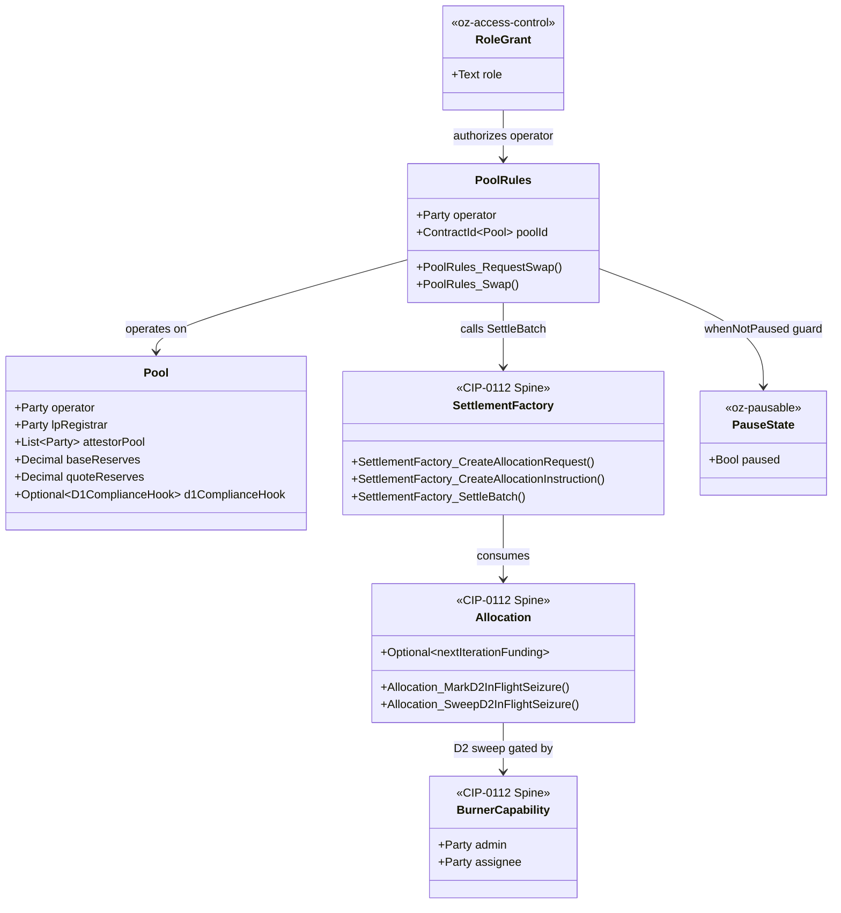
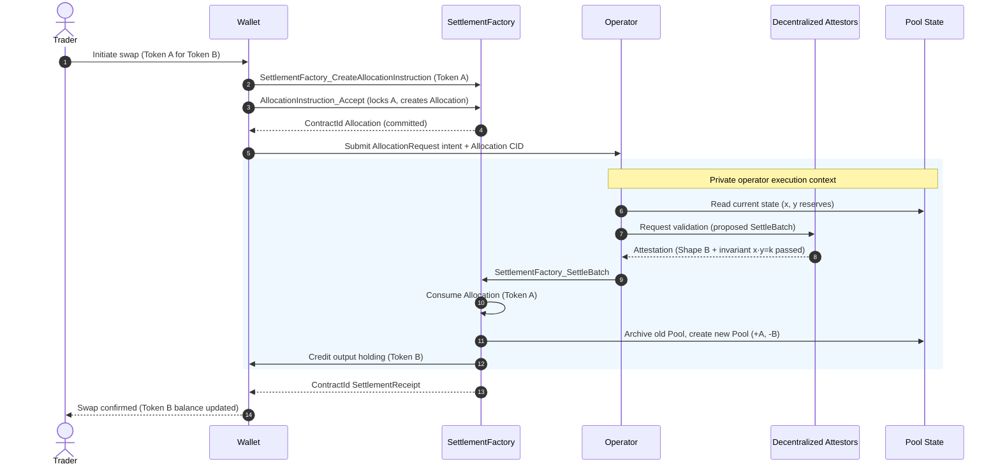

# Architectural Overview Report: Canton Reference Decentralized Exchange (DEX)

Status: **reviewed reference-design report**, non-public, outside the committed
M1 public-library surface. This is RI #1 of four — see the suite-level view in [`00-portfolio.md`](./00-portfolio.md)
and the index [`README.md`](./README.md). It describes a *reference design* grounded in the
real OpenZeppelin Canton components in this workspace; it is **not** a claim of
M1 acceptance, conformance, audit readiness, or production readiness.

> **Google Docs import:** `File → Open` this `.md` in Docs (or paste with
> `Edit → Paste`). H1/H2/H3 headings drive the Docs outline pane; the tables
> import cleanly; apply a monospace paragraph style to fenced code blocks after
> import. Mermaid blocks do not render in Docs — render them with
> `canton-settlement-explorer` and paste the image, keeping the fenced source.

> **Source-grounding tags** (used throughout):
> `[IMPLEMENTED]` real code in the M1 library base (`canton-specs` /
> `canton-contracts`) · `[EVIDENCE]` real code in an evidence repo
> (`canton-token-template`, `canton-stablecoin`, `zk-credential-gateway`), not
> the M1 surface · `[UPSTREAM]` Splice / CIP reference, not vendored here ·
> `[FUTURE]` proposed RI-level design, not built in M1 scope.

> **Design priority order** governs every interface and snippet, in this exact
> order: **1) Readability → 2) Simplicity → 3) Security → 4) Auditability.**

> **Grant alignment** (source of truth:
> [`../research/canton-ecosystem-grant-proposal.md`](../research/canton-ecosystem-grant-proposal.md),
> scope lock: [`../../M2_DEX_SCOPE.md`](../../M2_DEX_SCOPE.md)): this is **RI #1
> (Privacy-Preserving DEX)**. This document is the **Architecture Documentation**
> deliverable, authored in **grant M1** (research & design) for the DEX
> **implementation** in **grant M2** (Q2 2026). Its companion deliverables —
> working reference code, demo front-end, threat model, and "how to build DeFi
> on Canton" educational materials — are **named here but delivered in M2**
> (MIT-licensed). The report honors the **CIP-56 → CIP-0112 / Token Standard V2
> retarget**: CIP-56 is superseded; the DEX builds only on V2 abstractions.

---

## 1. Product Definition

The Reference Implementation (RI) documented here is an open-source, fully
functional Decentralized Exchange (DEX) engineered for the Canton Network.
Drawing on prior architectural experience deploying privacy-preserving DeFi
primitives (e.g. the LunarSwap design on Midnight), this RI demonstrates the
full lifecycle of a trading venue operating under institutional compliance,
privacy, and asset-segregation constraints. The objective is a readable,
verifiable, forkable foundation that ecosystem developers can use to construct
exchange variations, from Automated Market Makers (AMMs) to Central Limit Order
Books (CLOBs).

The architecture is built on the **CIP-0112 / Token Standard V2 settlement
spine** `[IMPLEMENTED]` (`OpenZeppelin.Experimental.Settlement.Cip112` in
`canton-specs` / `canton-contracts`). Anchoring the DEX to this standardized
settlement infrastructure ensures that asset reservations, atomic swaps, and
liquidity mechanics execute via standardized allocation and settlement
contracts, eliminating any custom, siloed off-ledger balance sheet.

### Operational Scope and Boundaries

The RI is deliberately bounded. The scope bias is **simplicity and modular
extensibility over complexity**: ship the small, obviously-correct core and name
everything else as an explicit extension point or out-of-scope.

| Feature Category | In-Scope Architectural Components |
|---|---|
| Market Structure | A simple **spot** exchange. The primary reference is a constant-product AMM with a single liquidity pool (`x · y = k`) to establish a spot price. The CLOB variation is described as a *parameterization* of the same settlement core. |
| Core Flows | The four flows the grant M2 acceptance names, each modeled as settlement over the spine: **pool creation** (operator + LP registrar + attestor pool instantiate a `Pool`), **liquidity provision / removal** (deposit both instruments → mint LP tokens; burn LP tokens → withdraw proportional reserves), **swap execution** (two-leg DvP), and **fee collection** (`feeBps` accrues into reserves, raising LP-token redemption value). |
| Asset Representation | Fungible digital assets compliant with the CIP-0112 Token Standard V2 holding interfaces. LP tokens represent pool-share ownership and are minted/burned via the spine. |
| Settlement Mechanics | Atomic delivery-versus-payment (DvP) executed **only** through `SettlementFactory_SettleBatch`. The design uses committed allocations and the `nextIterationFunding` field to support prefunded trading and partial fills. |
| Compliance & Control | D1 node-applied compliance checking on every settlement leg (Shape B). D2 lock-and-sweep seizure gated by a single-admin `BurnerCapability`. D3 single-domain v1 issuer-held KYC, forward-compatible with cross-domain models via SCU conventions. |
| Consensus Topology | Explicit multi-party signatory configuration: a decentralized attestor pool co-authorizes liquidity-pool state transitions, validating trading logic without centralizing execution authority. |
| Component Integration | Direct reuse of `oz-access-control`, `oz-ownable`, `oz-pausable`, the CIP-0112 settlement spine, and evidence patterns from `canton-token-template`, `canton-stablecoin`, and `zk-credential-gateway`. |

| Feature Category | Out-of-Scope Architectural Components |
|---|---|
| Derivative Instruments | Perpetuals, futures, traditional options, and any synthetic asset deriving value from an external non-spot reference. Spot trading only. |
| Leverage Facilities | Margin trading, undercollateralized lending, dynamic funding rates, and any protocol-enshrined leverage. |
| External Oracles | Dynamic pricing oracles dictating the pool's internal exchange rate. The AMM invariant dictates the price; `PriceOracle` `[EVIDENCE]` is referenced only for boundary analysis or future stable-pool deviation checks. |
| Legacy Standards | Any reliance on the superseded CIP-56 token standard or legacy V1 allocation paths. The RI operates strictly on V2 abstractions. |
| Cross-Synchronizer Operation | Multi-synchronizer / cross-domain settlement and identity are **deferred** (see §8). M1 is single-domain v1; the design is forward-compatible, not multi-domain today. |

### Target Ecosystem Participants

- **Protocol Architects and Engineers** — fork the codebase to deploy
  proprietary trading venues or advanced AMM curves, studying verifiable
  workflow boundaries.
- **Institutional DEX Operators** — regulated entities establishing compliant
  trading facilities that require access controls, KYC identity gating, and
  D2 asset-seizure capabilities.
- **Wallet and Client Integrators** — validate user submission flows against a
  working decentralized application implementing two-step handshakes and
  per-party allocation requests.
- **Security and Assurance Auditors** — evaluate explicit authority boundaries,
  the Daml SCU upgrade narrative, and the validation ladder
  (`daml-lint → daml-props → daml-verify`) when assessing readiness.

### Educational Framing: How to Think About Building a DEX on Canton

Moving from an EVM ecosystem to Canton requires a paradigm shift in state
management, privacy boundaries, and consensus topology.

In traditional EVM AMMs, smart contracts are autonomous, globally visible state
machines holding aggregate pool balances. A single trader transaction
sequentially updates this global state, with all network nodes validating the
invariant math off an identical public state tree. Privacy is non-existent by
design, and front-running / MEV extraction via the public mempool is a
structural reality.

Canton operates on a privacy-preserving, **per-party projection** model enforced
by the Daml-LF 2.1 execution environment. A Canton contract is a cryptographic
commitment agreed by a specific, explicitly configured set of nodes. A DEX on
Canton cannot rely on a globally readable pool contract that any anonymous
participant can unilaterally mutate. Daml-LF 2.1 is also **keyless**: state
changes by archive-and-recreate, not in-place mutation, and any new signatory
must actively co-authorize a state transition — so **two-step handshakes are a
necessity, not a style choice**.

To build a mathematically sound AMM in this privacy-first environment, the
architecture reconciles the transparency needed for price discovery and
invariant validation with the privacy needed for individual positions. The RI
does this by **fracturing settlements into per-authorizer allocation requests**:
a trader's intent interacts with the public logic of a `Pool` contract, but the
actual asset movement rides on per-party `AllocationRequest` and `Allocation`
contracts on the CIP-0112 spine. Counterparties observe only their own legs —
visibility is restricted to a strict need-to-know basis.

To validate the AMM invariant without centralizing trust in a single operator
node, the architecture introduces a **decentralized attestor pool**: a set of
node-backed parties configured as required signatories on the `Pool` contract.
They collectively attest to the mathematical correctness of a transition before
authorizing settlement — mapping the decentralized-execution paradigm directly
onto Canton's per-contract signatory topology.

---

## 2. Architecture Overview

The system partitions operations into distinct layers: **Market State**,
**Funding & Authorization**, **Asset Reservation** (the Settlement Spine), and
**Registry Definitions**. Orchestration is governed by reused primitives for
role management, pausing, and formally verifiable execution paths.

### Core Components and Library Mapping

| Component Suite | Applied Templates and Libraries | Architectural Function |
|---|---|---|
| Access Control `[IMPLEMENTED]` | `oz-access-control`: `RoleGrant`, `RoleAdmin`, `DefaultAdminTransferOffer`, `requireRole` | Role-based permissioning. Uses the `roleId : MyRole -> Text` closed-sum wrapper to prevent role collision across administrative domains. Governs venue operators, LP registrars, and compliance officers. |
| Ownership Lifecycle `[IMPLEMENTED]` | `oz-ownable`: `Ownership`, `OwnershipOffer` | Secure two-step handover of ultimate protocol administration (the single-admin capability authority, D4). |
| Venue Constraints `[IMPLEMENTED]` | `oz-pausable`: `PauseState`, `whenNotPaused` | Emergency circuit breaker. `whenNotPaused` is an origination guard: it blocks new swaps / liquidity additions but does not disturb in-flight settlements. |
| Settlement Spine `[IMPLEMENTED]` | `OpenZeppelin.Experimental.Settlement.Cip112`: `SettlementFactory`, `AllocationRequest`, `AllocationInstruction`, `Allocation`, `SettlementReceipt`, `ToyHolding`, `BurnerCapability` | Core engine for all asset movement. `ToyHolding` is the toy unit of value (real assets implement the TSv2 holding interface). The spine makes transfers atomic, multi-lateral, and interface-bound. |
| Asset Evidence `[EVIDENCE]` | `canton-token-template`: `SimpleHolding`, `LockedSimpleHolding`, `*_ForcedBurn`, `SimpleTokenRules`, `TransferPreapproval` | Holding and forced-burn/seizure logic. `SimpleTokenRules` provides the 3-way transfer dispatch; `TransferPreapproval` manages delegated/standing credit. |
| Advanced State `[EVIDENCE]` | `canton-stablecoin`: `Vault`, `VaultFactory`, `VaultParams`, `PriceOracle` | Basis for advanced pool types (e.g. stableswaps) and a baseline price reference for oracle-deviation checks in extreme volatility. |
| Identity Verification `[EVIDENCE]` / `[IMPLEMENTED]` | `zk-credential-gateway`: `CredentialGatedActionRequest`, `MockVerificationResult`, `MockVerifierAuthorization`; D3 Shape-B types `KycClaim` + `TrustedIssuerRegistry` from the `canton-specs` identity-hook experiment | Fulfils the D3 identity and D1 compliance mandates via verifiable data structures for node-applied attestation. |

> **Attribution note:** `KycClaim` and `TrustedIssuerRegistry` are the typed D3
> identity **Shape B** types demonstrated in the `canton-specs`
> identity-hook-shape-b / identity-hook-upgrade experiments, **not** templates
> inside `zk-credential-gateway`. The gateway supplies the gating/verification
> primitives (`CredentialGatedActionRequest`, `MockVerificationResult`); the
> typed KYC claim shape is the forward-compatible target layered in via SCU.

### Party and Role Model Topology

Duties are segregated and mapped to discrete Daml parties:

- **Venue Operator (`CANTON_OPERATOR`)** — manages the matching engine, creates
  `PoolRules`, and submits batch settlements. Has execution authority to call
  the settlement factory but **never** holds custody or unilateral transfer
  rights over trader funds.
- **LP Registrar (`CANTON_LP_REGISTRAR`)** — manages LP-token policy. Separating
  the registrar from the operator allows future delegation of LP-token issuance
  to a regulated third-party custodian.
- **Asset Administrator (`CANTON_ADMIN`)** — issuer/registrar of the base and
  quote instruments. Controls instrument configuration and holds the
  `BurnerCapability` required for D2 seizure.
- **Trader / Liquidity Provider** — the end-user authoring `Allocation`
  contracts from their wallet. The sole party cryptographically able to lock
  their own holdings.
- **Decentralized Attestor Pool** — a consortium of nodes modeled as
  `attestorPool : [Party]`, acting as joint signatories on the core `Pool`
  state.

### Trust Topology and Consensus Configuration

Every Canton contract must declare which nodes participate in transaction
validation. Unlike EVM (all nodes validate all transitions), Canton restricts
validation to nodes hosting the signatories and observers of the involved
contracts.

To prevent the Venue Operator from unilaterally manipulating pool reserves,
spoofing a price curve, or trading outside slippage bounds, the `Pool` contract
includes `attestorPool` in its signatories. When a swap occurs, the operator
computes the proposed next reserves, but the transition must be co-signed by a
programmatic threshold of the attestor pool. The attestor nodes run independent
verification against the public `Pool` state, checking that the
constant-product invariant holds (accounting for `feeBps`) before supplying
their cryptographic authorizations.

This maps onto Canton's native node-side compliance model. Because the
underlying capability already exists in the ecosystem (e.g. BitSafe cBTC
infrastructure `[UPSTREAM]`) and Digital Asset is building tooling for exactly
this pattern, integrating an enterprise-grade node-consensus layer is intended
to be a **drop-in**, not a structural rewrite. The exact membership-rotation and
threshold mechanics are an open question (see §9).

---

## 3. How We Implement It

The operational lifecycle orchestrates state transitions that culminate in
atomic, multi-lateral ledger updates via the CIP-0112 settlement spine. The
design prioritizes Readability, Simplicity, Security, and Auditability, in that
order.

### The Settlement-Spine Flow: Step by Step

The execution of a swap is the primary critical path. The flow guarantees funds
are never locked without a resolution path and that execution is atomic.

1. **Intent and Quotation.** A trader requests a quote (swap Token A → Token B).
   The operator backend reads current `Pool` state and returns an expected
   output amount plus an `AllocationSpecification`.
2. **Allocation Generation.** The trader signs
   `SettlementFactory_CreateAllocationInstruction` to create an
   `AllocationInstruction`, then `AllocationInstruction_Accept` locks their
   Token A holding and creates a committed `Allocation` designating
   `CANTON_OPERATOR` as the authorized executor. The `nextIterationFunding`
   field conserves any unfilled remainder so a partial fill (relevant for the
   CLOB parameterization) rolls forward into a new allocation iteration.
3. **Request Formulation.** The trader formulates an `AllocationRequest` (via
   `SettlementFactory_CreateAllocationRequest`) naming the desired output asset
   (Token B) and the minimum acceptable amount — enforcing personal slippage
   bounds.
4. **Batch Formulation.** `CANTON_OPERATOR` aggregates the trader's `Allocation`
   and `AllocationRequest` with the pool's active state and constructs a
   `SettlementFactory_SettleBatch` instruction.
5. **Attestor Verification.** The `attestorPool` nodes observe the proposed
   batch, verify the AMM invariants against the proposed state, and append their
   required signatures.
6. **Atomic Settlement.** `SettlementFactory_SettleBatch` executes as a single
   Daml transaction: it consumes the input `Allocation`, archives the current
   `Pool` state, emits a `SettlementReceipt` for the trader, credits the Token B
   holding to the trader, and creates a new `Pool` reflecting updated reserves.

> **Non-negotiable enforcement:** atomic DvP is achieved **only** through
> `SettlementFactory_SettleBatch` (one Daml transaction over many allocations).
> The direct `Allocation_Settle` path proves authorization exists (via fetched
> peer allocations/receipts) but is **not** atomic multi-lateral co-settlement,
> so it is intentionally not used for the asset exchange.

### Liquidity Provision, Removal, and Fee Accrual

The same spine carries the non-swap flows the grant M2 acceptance requires; all
remain atomic via `SettlementFactory_SettleBatch`.

- **Pool creation.** `CANTON_OPERATOR`, `CANTON_LP_REGISTRAR`, and the
  `attestorPool` jointly create the `Pool` (their joint signature is the
  configured consensus topology). Initial reserves are seeded by the first
  liquidity provision.
- **Liquidity provision.** The LP allocates *both* instruments (two committed
  `Allocation`s) and the operator batch-settles them into the pool reserves; in
  the same transaction the `CANTON_LP_REGISTRAR` mints LP tokens proportional to
  the contributed share. The new `Pool` reflects increased reserves.
- **Liquidity removal.** The LP burns LP tokens; the batch settles a withdrawal
  of the proportional share of *both* reserves back to the LP, and a new `Pool`
  with reduced reserves is created.
- **Fee accrual / collection.** `feeBps` is retained in the pool on each swap,
  so reserves grow relative to LP-token supply — fees accrue to LPs implicitly
  via redemption value rather than a separate claim. A dynamic-fee hook is an
  explicit SCU extension point (§9), not M1 scope.

All four flows are guarded by `whenNotPaused` at origination and inherit the
same D1 compliance check per settlement leg.

### D1 Compliance: Node-Applied Attestation (Shape B)

Compliance is checked on **every** settlement leg with **no caching**, on a
**fail-closed** basis (PLAN.md Decision Log; AGENTS.md §Decision Authority). The
RI selects **Shape B** (signed node attestation) for the D1 seam.

Shape A (an off-ledger API gate) would introduce a centralized failure point,
add latency to the settlement path, and conflict with the decentralized
attestor topology. With Shape B, compliance is pushed to participating nodes:
the on-ledger seam is the optional `D1ComplianceHook` config record
(`hookRef`, `requiresPerSettlementReference`) carried on the `Pool`. At
`SettleBatch` time, the node-side check requires a `CredentialGatedActionRequest`
accompanied by a `MockVerificationResult` (a stand-in for a live zero-knowledge
verification result in production) proving the trader has not been flagged
within the current ledger-time bounds.

> **Open D1 clarification (non-blocking):** whether the contract stays oblivious
> to the result (pure off-ledger gate) or verifies a signed node attestation
> on-ledger at exercise time is still open (PLAN.md Open Questions). The RI
> builds behind the optional hook and can add typed on-ledger attestation later
> via the SCU path.

### D2 Seizure: Admin-Preset Custodian Lock-and-Sweep

Institutional DeFi requires the ability to seize assets under judicial mandate.
The RI implements D2 via a strict **lock-and-sweep** pattern that **forbids**
arbitrary burning and **forbids** returning seized funds to the sender.

Seizure uses the real spine choices on `Allocation`:
`Allocation_MarkD2InFlightSeizure` blocks settlement of a targeted allocation,
then `Allocation_SweepD2InFlightSeizure` (gated by the single-admin
`BurnerCapability`) sweeps the locked holding to the
`custodianDestination : Account` carried in the `D2SeizureHook` config record.
The destination is **admin-preset** (e.g. a regulated cold-storage vault). By
contrast, a standard transfer that *fails* due to transient faults or invalid
parameters returns to sender — assets are never marooned by technical faults.
This matches the decided D2 semantics: *seizure routes to the preset custodian;
transfer failures return to sender.*

### D3 Identity: Single-Domain V1 to Cross-Domain via SCU

The system uses a single-domain v1 identity architecture. Traders must hold a
`KycClaim` issued by a party present in the `TrustedIssuerRegistry` to interact
with permissioned pools (compliance/identity gating is **optional per pool** —
permissioned vs permissionless).

To stay forward-compatible with cross-domain models (ONCHAINID / ERC-3643 /
Chainlink CCID) without breaking existing state, the system relies on SCU
conventions: base interfaces declare identity requirements via `Optional`
fields. When cross-domain identity is introduced later, a new serializable type
representing the cross-domain proof is appended within the existing `Optional`
parameter, leaving the single-domain `KycClaim` logic fully functional. This is
the same additive path proven in the `canton-specs` identity-hook upgrade spike.

### D4 Authority: Single-Admin Capability

M1 critical actions — LP-token minting, asset burning, seizure execution, and
protocol-ownership handoff — are controlled via a **single-admin capability
authority**. `CANTON_ADMIN` uses `oz-access-control` primitives. The transition
to on-ledger multi-sig or a multi-hosted party is explicitly deferred to M3,
keeping the M1 core small, readable, and secure. (The access-control library
itself — role-admin delegation and the timelocked admin handoff — is in M1
scope; only the multi-sig *signing* model is deferred.)

> **`[FUTURE]` institutional internal authorization (maker-checker).** An
> institutional trading desk submitting liquidity typically requires a
> two-tier internal control — a junior trader (maker) proposes, a risk officer
> (checker) approves — *before* an order reaches the venue. This is an internal
> control, not a venue mechanism: it is expressed with the **propose-accept
> (two-step handshake)** pattern already native to Canton, gated by distinct
> `oz-access-control` role grants for the maker and checker parties, and it
> leaves the venue's external `PoolRules` interface unchanged (the venue still
> sees a single committed `Allocation`). It is an explicit SCU extension point,
> not M1 scope, and is not a separate settlement or authority path.

### The SCU Extension Story

The **non-negotiable SCU rule**: an existing choice's arguments must never be
mutated to require a new field. Extensions are managed via appended `Optional`
fields, new serializable types, and **new, parallel choices**.

This also dictates *how* the RI gains new interfaces. Daml 3.x removed
**retroactive interface instances** `[UPSTREAM]` (the mechanism that
retroactively bolted an interface onto an already-deployed template), because
they broke clean upgrade paths. The RI therefore commits to forward-compatible
interface hierarchies from day one: a new compliance or reporting facet is added
by a new template implementing the interface plus a new choice, never by
retroactively re-instancing an existing `Pool` / `PoolRules`.

Consider `PoolRules_Swap`. Initially, identity gating is handled by inclusion in
the `TrustedIssuerRegistry`. To later add granular jurisdictional compliance
(e.g. US users may not trade a given security token), `PoolRules` is **not**
mutated. Instead a new choice `PoolRules_SwapWithJurisdiction` is introduced.
The original `PoolRules_Swap` remains active and can be softly deprecated by
frontend routing. The new choice uses a newly appended
`Optional JurisdictionalComplianceHook` field on the `Pool` to enforce the
advanced logic — layering compliance without disrupting in-flight
`AllocationRequest` contracts, honoring the keyless, non-mutating nature of
Daml-LF 2.1.

---

## 4. Interfaces & Usage Examples

Interfaces are prioritized by Readability, Simplicity, Security, and
Auditability. Code below is idiomatic Daml that composes with the real
components above. Templates introduced by the RI (not present in the spine
today) are tagged `[FUTURE]`.

### 4.1 Component: Pool State and Configuration `[FUTURE]`

The `Pool` represents the constant-product AMM state. It uses the decentralized
attestor pool and the spine's `D1ComplianceHook` data record as an `Optional`
SCU extension point.

```daml
module CantonDex.Dex.Pool where

import OpenZeppelin.Experimental.Settlement.Cip112  -- spine: D1ComplianceHook, etc.

-- | The core state of the constant-product AMM. [FUTURE] RI-level template.
template Pool
  with
    operator : Party
    lpRegistrar : Party
    attestorPool : [Party]            -- explicitly configured consensus topology
    baseInstrumentId : Text
    quoteInstrumentId : Text
    baseReserves : Decimal
    quoteReserves : Decimal
    feeBps : Decimal
    -- SCU extension point: forward compatibility for D1/D3 overlays.
    -- The spine's D1ComplianceHook is a config record (hookRef,
    -- requiresPerSettlementReference), not a contract id.
    d1ComplianceHook : Optional D1ComplianceHook
  where
    signatory operator, lpRegistrar
    signatory attestorPool            -- joint attestor signatories
    observer operator                 -- read visibility for indexer projections

    -- Security guard: mathematical sanity of basic pool state.
    ensure
      baseReserves >= 0.0 &&
      quoteReserves >= 0.0 &&
      feeBps >= 0.0 && feeBps <= 10000.0
```

### 4.2 Component: Swap Execution Rules `[FUTURE]`

`PoolRules` decouples dynamic state from static execution permissions,
maximizing auditability and preventing state bloat during high-frequency
trading.

```daml
module CantonDex.Dex.PoolRules where

import OpenZeppelin.Experimental.Settlement.Cip112
import OpenZeppelin.Pausable (PauseState, whenNotPaused)

template PoolRules
  with
    operator : Party
    attestorPool : [Party]
    poolId : ContractId Pool
    pauseStateId : ContractId PauseState
  where
    signatory operator
    signatory attestorPool

    -- SCU adherence: old choice's arguments stay stable.
    nonconsuming choice PoolRules_RequestSwap : ContractId AllocationRequest
      with
        trader : Party
        inputInstrumentId : Text
        inputAmount : Decimal
        minOutputAmount : Decimal
        settlementFactoryId : ContractId SettlementFactory
      controller trader
      do
        pause <- fetch pauseStateId
        whenNotPaused pause                       -- block intent if venue halted
        -- Create the per-party request on the spine; visibility is the
        -- trader's projection only.
        exercise settlementFactoryId SettlementFactory_CreateAllocationRequest with ..

    -- Atomic DvP executed strictly via SettleBatch.
    nonconsuming choice PoolRules_Swap : (ContractId SettlementReceipt, ContractId Pool)
      with
        allocationId : ContractId Allocation
        requestId : ContractId AllocationRequest
        settlementFactoryId : ContractId SettlementFactory
      controller operator
      do
        pool <- fetch poolId

        -- 1. D1 compliance (Shape B): node-side attestation is required at
        --    SettleBatch time; the optional hook records that requirement.
        --    (On-ledger attestation verification is a [FUTURE] SCU add-on.)

        -- 2. Constant-product invariant (x · y = k) accounting for feeBps is
        --    validated by the attestorPool before they sign; the choice also
        --    re-checks the proposed reserves as an `assert`.

        -- 3. Atomic delivery-vs-payment via the required spine entrypoint.
        --    extraTransferLegSides pins the concrete legs to prevent smuggling.
        receipt <- exercise settlementFactoryId SettlementFactory_SettleBatch with
          allocations = [allocationId]
          requests = [requestId]
          -- iterated-settlement parameters (extraTransferLegSides,
          -- nextIterationFunding) defined here

        newPool <- create pool with
          baseReserves = pool.baseReserves   -- updated per computed swap deltas
          quoteReserves = pool.quoteReserves
        return (receipt, newPool)
```

### 4.3 Component: D2 Seizure and D4 Authority

D2 seizure uses the **real spine choices**, gated by the single-admin
`BurnerCapability` `[IMPLEMENTED]`. There is no separate `ExecuteSeizure`
template — the `D2SeizureHook` is a config record carrying the preset
`custodianDestination`, and the action runs on the `Allocation` itself.

```daml
-- [IMPLEMENTED] spine config record (OpenZeppelin.Experimental.Settlement.Cip112):
--   data D2SeizureHook = D2SeizureHook with
--     seizureCaseRef : Text
--     custodianDestination : Account   -- admin-preset; never burn, never return-to-sender
--     inFlightHandlingStatus : Text
--
-- [IMPLEMENTED] capability (single-admin authority, D4):
--   template BurnerCapability with
--     admin : Party; assignee : Party
--     instrumentScope : Optional InstrumentId; featureFlag : Text

-- Seizure of an in-flight allocation (two real choices on `Allocation`):
--   1. Block settlement of the targeted allocation:
--        exercise allocationId Allocation_MarkD2InFlightSeizure with seizureHook = ...
--   2. Lock-and-sweep to the preset custodian (BurnerCapability-gated):
--        exercise allocationId Allocation_SweepD2InFlightSeizure with
--          burnerCap = burnerCapId          -- proves D4 single-admin authority
--          -- destination is the hook's custodianDestination; the choice fails
--          -- closed if parameters are tampered with.
```

---

## 5. Diagrams

The following Mermaid diagrams are structurally compatible with the
`canton-settlement-explorer` validation tool (presets: *Privacy DEX*,
*Batch DvP*). Render externally for Google Docs.

### 5.1 Interface and Component Diagram



### 5.2 Flow-of-Funds Settlement Diagram (Privacy DEX Preset)

Demonstrates per-authorizer allocation requests and atomic co-settlement via
`SettlementFactory_SettleBatch`. The privacy boundary: the trader sees their
allocation and receipt, not the backend pool routing or attestor verification.



---

## 6. Library Dependencies

### 6.1 Internal Dependencies

| Internal Package | Consumed Templates / Types | Application Context | Tag |
|---|---|---|---|
| `oz-access-control` | `RoleGrant`, `RoleAdmin`, `DefaultAdminTransferOffer`, `requireRole` | D4 single-admin authority and role administration. | `[IMPLEMENTED]` |
| `oz-ownable` | `Ownership`, `OwnershipOffer` | Lifecycle management and two-step transfer of protocol ownership. | `[IMPLEMENTED]` |
| `oz-pausable` | `PauseState`, `whenNotPaused` | Emergency circuit breaker in `PoolRules`. | `[IMPLEMENTED]` |
| `OpenZeppelin.Experimental.Settlement.Cip112` | `SettlementFactory`, `AllocationRequest`, `AllocationInstruction`, `Allocation`, `SettlementReceipt`, `ToyHolding`, `BurnerCapability`, `D1ComplianceHook`, `D2SeizureHook` | The shared settlement engine. | `[IMPLEMENTED]` (experimental) |
| `canton-token-template` | `SimpleHolding`, `LockedSimpleHolding`, `SimpleTokenRules`, `TransferPreapproval`, `*_ForcedBurn` | Underlying token logic and forced-burn/seizure evidence. | `[EVIDENCE]` |
| `canton-stablecoin` | `VaultFactory`, `PriceOracle` | Baseline for future stable-pool extensions and slippage circuit-breaker price feeds. | `[EVIDENCE]` |
| `zk-credential-gateway` | `CredentialGatedActionRequest`, `MockVerificationResult`, `MockVerifierAuthorization` | D1/D3 credential gating and verification. | `[EVIDENCE]` |
| `canton-specs` identity-hook experiment | `KycClaim`, `TrustedIssuerRegistry` | Typed D3 Shape-B identity, layered via SCU. | `[IMPLEMENTED]` (experimental) |

### 6.2 External Dependencies

The architecture operates against the **Splice Token Standard V2** interfaces
for interoperability `[UPSTREAM]`.

- **Present implementation:** local mocks / stand-ins designed to **maximally
  match the Splice V2 standard interfaces**. Source-of-record pin:
  `hyperledger-labs/splice` @ `token-standard-v2-upcoming` @ `1e34121b…` (the
  literal `canton-network/splice` @ `token-standard-v2-daml-preview` @
  `b91de5d4…` "preview" branch is demoted to historical evidence; its V2 DAR set
  and checksums are catalogued in
  `canton-token-template/docs/CIP-0112-EXTENSION-PLAN.md`). This is the
  workspace-standing decision (RI_RESEARCH_BRIEFING.md): design against
  *interfaces*, not DAR/package-ID pins. The RI interfaces directly against the
  `OpenZeppelin.Experimental.Settlement.Cip112` spine.
- **Planned migration:** once published Splice Token Standard V2 DARs ship and
  the import gate is cleared (PLAN.md; `M2_DEX_SCOPE.md` §A), the local stand-ins are
  swapped for the published DARs. Interface-based design is intended to make this
  a thin substitution. **Note:** import remains gated; this report makes no
  public-API stability, conformance, or release-readiness claim.

---

## 7. Security & Auditability

The RI prioritizes verifiable security. Simplicity over complexity minimizes the
surface for logic exploits, and Canton's per-party projections create natural
containment boundaries.

### 7.1 Security Invariants

- **Non-custodial venue (no unilateral execution).** The venue operator never
  holds custody of, nor any unilateral right to move, trader funds. The trader is
  the sole party cryptographically able to lock their own holding (via
  `AllocationInstruction_Accept`), and the operator can only drive
  `SettlementFactory_SettleBatch` over the *exact* committed `Allocation` and the
  trader's own `AllocationRequest` (min-output bound) — it cannot deviate from the
  authorized leg, fabricate a transfer the trader did not commit, or indefinitely
  freeze a trader's own holding (the trader can always settle or reclaim it
  independently). This is Daml's **non-transitive authorization** model: a choice
  authorizes only its declared consequences. It is the property that keeps the
  reference venue a settlement/matching layer rather than a custodial intermediary,
  and it is what `extraTransferLegSides` pinning and the `attestorPool` co-signature
  jointly enforce.
- **AMM Conservation (`x · y = k`).** After a swap (minus applied fees), the
  product of base and quote reserves must be `>=` the product before the swap:
  `(baseReserves + Δin · (1 − feeBps/10000)) · (quoteReserves − Δout) ≥
  baseReserves · quoteReserves`. Enforced in `PoolRules_Swap` and verified
  off-ledger by the attestor pool before signature.
- **Funding Conservation (`nextIterationFunding`).** Essential for prefunded
  orders and the CLOB parameterization. The settlement implementation guarantees
  the per-instrument net outflow from an authorizer never exceeds
  `nextIterationFunding`, and `extraTransferLegSides` blocks smuggling unrelated
  transfer legs into an authorizer's allocation — preventing liquidity-drain
  attacks.

### 7.2 The Validation Ladder

The Daml code is run through a three-tier validation ladder. (Tooling exists in
the workspace; the latency figures below are illustrative, not benchmarked.)

| Tier | Tooling | Purpose and Scope |
|---|---|---|
| Level 1: Static analysis | `daml-lint` | AST checks: decimal bounds, unguarded division, positivity, archive-before-execute, anti-patterns, naming conventions. |
| Level 2: Generative testing | `daml-props` | Property-based testing with shrinking: thousands of fuzzed state transitions to ensure conservation/supply/balance invariants hold under extreme inputs. |
| Level 3: Formal verification | `daml-verify` | Z3-backed proofs (conservation C1–C3, division-safety D1–D3, temporal T1–T3): proves unauthorized transitions (e.g. swapping while paused, or bypassing a D1 hook) are logically impossible within the contract graph. |

### 7.3 Threat Model and Failure Modes

| Vector | Attack | Mitigation |
|---|---|---|
| Malicious operator state manipulation | Operator submits a `SettleBatch` favoring their own holdings, bypassing the price curve or extracting excessive slippage. | `attestorPool` signatories on `Pool` block the transition. Without their Shape-B attestation that the math is sound, the transaction fails Canton consensus at the synchronizer level. |
| Compliance evasion (D1) | A sanctioned user routes through a secondary contract to obscure origin and bypass the `D1ComplianceHook`. | Shape-B compliance evaluates the true fund origin at the `SettleBatch` layer; fail-closed. Without a fresh, valid `MockVerificationResult` signed by a compliance node, the batch is invalid. |
| Rogue seizure / asset burning (D2) | A compromised admin key attempts to maliciously burn user assets or return seized funds to unverified actors. | `Allocation_SweepD2InFlightSeizure` hardcodes the destination to the preset `custodianDestination`; arbitrary burn is forbidden. A compromised admin can only sweep to the pre-approved, monitored custodian. |
| Forced upgrades breaking in-flight allocations (SCU) | A poorly executed upgrade mutates fields, rendering existing `Allocation` contracts un-settleable. | Programmatic adherence to the SCU rule (Optional appends + new choices only). Existing `PoolRules` stay operable; in-flight transactions conclude before users transition. |

---

## 8. Cross-Synchronizer Domain Extension (Planned) `[FUTURE]`

> **Shared model:** the cross-synchronizer mechanism (per-synchronizer
> assignment + unassign/assign reassignment, and the SCU-compliant additive
> path) is identical across all four RIs and is owned in
> [`00-portfolio.md`](./00-portfolio.md) §5. This section elaborates only the
> RI-specific topology.

> **Status: out of scope for the initial M1 design; deferred and planned for
> eventual development.** The CIP-0112 settlement scaffold in this workspace is
> **single-synchronizer only** — there is no cross-domain / multi-synchronizer
> machinery today, and D3 cross-domain identity is deferred (PLAN.md Decision
> Log, AGENTS.md §Decision Authority). This section plans the extension so it can
> be added later **without re-architecting the settlement core**, following
> Canton's real cross-synchronizer model and the SCU forward-compatibility rule.

### 8.1 What "cross-synchronizer" means on Canton

On Canton, every contract is **assigned to exactly one synchronizer domain** at a
time; a transaction can only use contracts on the same synchronizer. Moving a
contract between synchronizers is done by the **reassignment protocol**
(unassign on the source synchronizer → assign on the target), not by mutation.
A cross-synchronizer DEX therefore is not "one global pool seen everywhere"; it
is a set of per-synchronizer contracts plus a disciplined reassignment workflow
that preserves atomicity and privacy across domains.

This is the topology-layer analogue of the per-party projection mindset shift in
§1: just as privacy is a function of who is a signatory/observer, cross-domain
reach is a function of which synchronizer each contract is assigned to and how it
is reassigned.

### 8.2 Where the DEX touches the synchronizer boundary

| Element | Single-domain v1 (today) | Cross-synchronizer extension (planned) |
|---|---|---|
| `Pool` state | One `Pool` on one synchronizer; `attestorPool` nodes all reachable there. | The `Pool` stays on a *home* synchronizer; cross-domain swaps reassign the trader's `Allocation` to the home synchronizer for the duration of `SettleBatch`, then reassign change/output back. |
| `Allocation` / `AllocationInstruction` | Created and settled on the same synchronizer as the `Pool`. | Must become **reassignable**: created on the trader's home synchronizer, unassigned, and assigned to the pool's synchronizer before `SettleBatch`. |
| `attestorPool` consensus | All attestor parties hosted on the pool's synchronizer. | Attestor set must be reachable on the synchronizer where settlement occurs; cross-domain pools imply per-synchronizer attestor membership and a reassignment-aware threshold. |
| D1 compliance | Node-side check on the settlement synchronizer. | Compliance must be re-evaluated on the synchronizer where the leg actually settles; a leg cannot "carry" a stale attestation across a reassignment (fail-closed still holds). |
| D3 identity | Single-domain `KycClaim` from a trusted issuer on one synchronizer. | Cross-domain identity (ONCHAINID / ERC-3643 / Chainlink CCID) resolved into a synchronizer-aware `TrustedIssuerRegistry`; this is the deferred D3 work. |

### 8.3 The additive, non-breaking path (SCU-compliant)

Following the non-negotiable SCU rule (never mutate an existing choice's args;
extend via `Optional` appends, new serializable types, and new choices):

1. **Append an `Optional` home-synchronizer descriptor.** Add
   `Optional SynchronizerScope` fields to `Pool` and the RI-level allocation
   wrappers. Older single-domain contracts read `None` and behave exactly as
   today.
2. **Add a new, parallel cross-domain choice.** Introduce
   `PoolRules_SwapCrossDomain` alongside the unchanged `PoolRules_Swap`. The new
   choice orchestrates the reassignment-aware flow; the original stays valid for
   single-domain swaps and in-flight allocations.
3. **Model reassignment explicitly as workflow, not mutation.** Cross-domain
   settlement is: reassign trader `Allocation` to the pool synchronizer →
   `SettleBatch` there → reassign output/change holdings back. Each step is an
   archive-and-recreate-style assignment, consistent with Daml-LF 2.1.
4. **Keep atomicity at the batch boundary.** True DvP remains
   `SettlementFactory_SettleBatch` on a single synchronizer; cross-domain
   atomicity is achieved by reassigning all required legs onto that synchronizer
   *before* the batch, never by splitting one DvP across two synchronizers.

### 8.4 Open questions specific to cross-synchronizer operation

- **Reassignment atomicity vs. settlement atomicity.** What is the failure model
  if an `Allocation` is assigned to the pool synchronizer but `SettleBatch` then
  fails — is the reassignment rolled back, or does the trader retain a
  re-home-able allocation? (Maps to the transfer-failure return-to-sender rule.)
- **Attestor pool across synchronizers.** How is attestor membership and the
  signing threshold defined when settlement can occur on more than one
  synchronizer? Does each synchronizer carry its own attestor sub-pool?
- **Cross-domain D1 freshness.** Confirm that compliance is always re-checked on
  the settling synchronizer and that no attestation is reused across a
  reassignment boundary.
- **Tooling maturity.** Cross-synchronizer reassignment tooling is part of the
  evolving Canton/Digital Asset stack; this section assumes drop-in integration
  as that tooling matures (consistent with the §2 attestor-pool assumption).

---

## 9. Open Questions

- **Node rotation in the attestor pool.** `attestorPool : [Party]` is currently
  a static array. Dynamic add/remove of attestor nodes — slashing conditions for
  malicious attestations and threshold/multi-signature requirements for
  membership changes — needs definition, dependent on forthcoming governance
  tooling.
- **Cross-domain identity resolution.** The architecture supports single-domain
  v1 identity with forward compatibility (D3). The off-ledger resolution
  mechanics for syncing external ONCHAINID / ERC-3643 attributes into the Canton
  `TrustedIssuerRegistry` remain to be standardized (see §8).
- **D1 attestation shape.** Whether the contract stays oblivious (off-ledger
  gate) or verifies a signed node attestation on-ledger at exercise time is open
  (PLAN.md Open Questions); non-blocking via the optional hook + SCU path.
- **Dynamic fee hooks.** The current `feeBps` is static. Volatility-adjusted fee
  hooks (using `PriceOracle` deviation metrics) are feasible within the SCU
  framework but require modeling to avoid latency-arbitrage vectors and oracle
  congestion of the settlement spine.
- **LP token force-upgrade semantics.** Active holdings upgrade-on-use during
  factory routing, but passive LP tokens held idly do not trigger an upgrade
  cycle. The threshold criteria and off-ledger events for an issuer to invoke a
  force-upgrade on passive assets remain an operational policy decision for the
  `CANTON_LP_REGISTRAR`.
- **Composability with the other RIs** (forward-compatibility; suite view
  [`00-portfolio.md`](./00-portfolio.md) §3): DEX pools can be seeded with
  base/quote liquidity from **cross-chain stablecoin inflows** settled via the
  Stablecoin RI ([`03`](./03-cross-chain-stablecoin.md)), and the DEX is the
  **secondary market** for tokens distributed by the Auction RI
  ([`04`](./04-confidential-auction.md)) — both over the same
  `SettlementFactory_SettleBatch` spine, with no parallel settlement path.

---

## References

All interface, template, choice, and field names in this report are grounded in
real source in this workspace (verified 2026-06-24). Authoritative sources:

- **Settlement spine** `[IMPLEMENTED]` —
  `canton-specs/experiments/cip112-settlement/daml/OpenZeppelin/Experimental/Settlement/Cip112.daml`
  (mirrored byte-identically in `canton-contracts/experiments/cip112-settlement/`).
- **AL-7 primitives** `[IMPLEMENTED]` — `canton-specs` `access-control/`,
  `ownable/`, `pausable/` (`OpenZeppelin.AccessControl`,
  `OpenZeppelin.Ownable`, `OpenZeppelin.Pausable`).
- **Holdings / forced-burn / rules / preapproval** `[EVIDENCE]` —
  `canton-token-template/simple-token/daml/SimpleToken/{Holding,Rules,Preapproval}.daml`.
- **Vault / oracle** `[EVIDENCE]` —
  `canton-stablecoin/stablecoin/daml/Stablecoin/{Vault,Oracle}.daml`.
- **Credential gating / verification** `[EVIDENCE]` —
  `zk-credential-gateway/daml/src/ZkCredentialGateway/{GatedAction,Verification,Types}.daml`.
- **Typed D3 identity (KycClaim, TrustedIssuerRegistry)** `[IMPLEMENTED]` —
  `canton-specs/experiments/identity-hook-shape-b/` and `identity-hook-upgrade-*/`.
- **Decision authority (D1–D4), scope, SCU rule** — root
  [`PLAN.md`](../../PLAN.md) (Decision Log) and [`AGENTS.md`](../../AGENTS.md)
  (§Decision Authority); briefing in
  [`docs/research/RI_RESEARCH_BRIEFING.md`](../research/RI_RESEARCH_BRIEFING.md).
- **Grant scope / milestones / deliverables (source of truth)** —
  [`docs/research/canton-ecosystem-grant-proposal.md`](../research/canton-ecosystem-grant-proposal.md)
  (PR #298, approved; CIP-56→CIP-0112 retarget) and the distilled
  [`M2_DEX_SCOPE.md`](../../M2_DEX_SCOPE.md).
- **Existing RI/settlement architecture spec** —
  [`canton-specs/docs/architecture/cip0112-m1-ri-spec.md`](../architecture/cip0112-m1-ri-spec.md).
- **Diagram tooling** `[IMPLEMENTED]` — `canton-settlement-explorer` (presets:
  Privacy DEX, Batch DvP, Multi-leg Settlement).
- **Validation ladder** `[IMPLEMENTED]` — `daml-lint`, `daml-props`,
  `daml-verify`.
- **Token Standard V2 upstream** `[UPSTREAM]` — `hyperledger-labs/splice`
  `token-standard-v2-upcoming` (source-evidence pin; import gated per PLAN.md).
- **BitSafe cBTC node-side capability** `[UPSTREAM]` — cited as ecosystem
  precedent for node-side attestation; not vendored here.

> **Removed in review:** the original draft cited external/non-workspace URLs
> (a `srikanth-bitdynamics/Canton-Dex-Reference-Implementation` GitHub repo,
> Medium ecosystem round-ups, and a CoinStats "fundamental analysis" page) as
> authoritative sources. None are part of this workspace or an authoritative
> spec; they were removed and replaced with the workspace-grounded references
> above. See the review record in
> [`../reviews/2026-06-24T21-54-54Z_REVIEW.md`](../reviews/2026-06-24T21-54-54Z_REVIEW.md).
>
> **Re-review 2026-06-24 (expert "blueprint" pass):** a second expert draft
> (a US-financial-regulation-framed blueprint) was assessed against this report.
> Its verifiable signal — the non-custodial / no-unilateral-execution property
> (§7.1), an institutional maker-checker extension (§3), and the Daml-3.x
> retroactive-interface-instance removal (§3) — was integrated. Its
> non-verifiable content was rejected: an order-book-first reframe and the
> fabricated templates `Market` / `Order` / `MatchedPair` / `OraclePrice`
> (contradicts the grant's AMM-lead / CLOB-as-parameterization framing);
> fabricated `MakerChecker` / `GiveProposed` choices; `FROST` signatures (absent
> from the workspace); `ComplianceRegistry` / `BlacklistValidator` /
> `ClaimsValidator`; "Lock by State / Lock by Archiving" terminology (the real
> mechanism is archive-and-recreate, already described); and the entire
> OCC / *Espinoza* / FDICIA / SOX citation set with its external "Works cited"
> URLs (non-workspace, non-spec — house conventions bar them). Record:
> [`../reviews/2026-06-24T23-29-57Z_REVIEW.md`](../reviews/2026-06-24T23-29-57Z_REVIEW.md).
