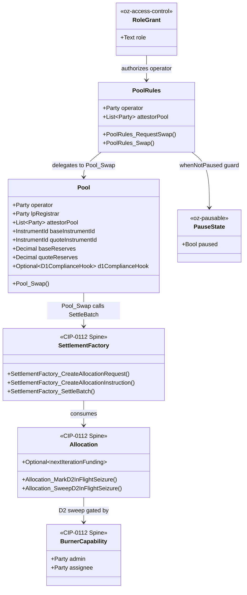
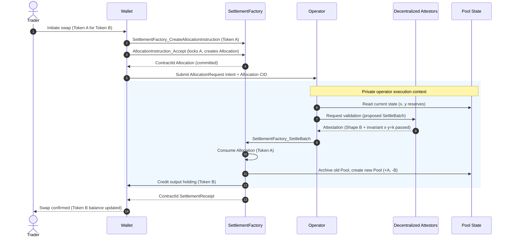

# Architectural Overview Report: Canton Reference Decentralized Exchange (DEX)

Status: **reference-design report.** It describes a *reference design* grounded
in the real OpenZeppelin Canton components in this workspace; it is **not** a
claim of acceptance, conformance, audit readiness, or production readiness.

> **Source-grounding tags** (used throughout):
> `[IMPLEMENTED]` real code in the M1 library base ([`canton-specs`](https://github.com/OpenZeppelin/canton-specs) /
> [`canton-contracts`](https://github.com/OpenZeppelin/canton-contracts)) · `[EVIDENCE]` real code in an evidence repo
> ([`canton-token-template`](https://github.com/OpenZeppelin/canton-token-template), [`canton-stablecoin`](https://github.com/OpenZeppelin/canton-stablecoin)), not
> the M1 surface · `[UPSTREAM]` Splice / CIP reference, not vendored here ·
> `[FUTURE]` proposed RI-level design, not built in M1 scope.

> **Design priority order** governs every interface and snippet, in this exact
> order: **1) Security → 2) Simplicity → 3) Readability → 4) Auditability.**

> **What this document is.** The **Architecture Documentation** for a
> privacy-preserving **spot DEX** reference design on the CIP-0112 / Token
> Standard V2 settlement spine — a constant-product AMM as the lead. A CLOB is
> named as a **separate application built on the same atomic DvP settlement
> spine**, not a re-parameterization of the AMM. Companion deliverables (working
> reference code, demo front-end, threat model, "how to build DeFi on Canton"
> materials) are named here but out of scope for this document. The design
> builds only on Token Standard V2 abstractions.

---

## 1. Product Definition

The Reference Implementation (RI) documented here is an open-source, fully
functional Decentralized Exchange (DEX) engineered for the Canton Network.
Drawing on prior architectural experience deploying privacy-preserving DeFi
primitives (e.g. the LunarSwap design on Midnight), this RI demonstrates the
full lifecycle of a trading venue operating under institutional compliance,
privacy, and asset-segregation constraints. The objective is a readable,
verifiable, forkable foundation that ecosystem developers can use to construct
exchange variations, from Automated Market Makers (AMMs) to Central Limit Order
Books (CLOBs).

The architecture is built on the **CIP-0112 / Token Standard V2 settlement
spine** `[IMPLEMENTED]` (`OpenZeppelin.Experimental.Settlement.Cip112` in
`canton-specs` / `canton-contracts`). Anchoring the DEX to this standardized
settlement infrastructure ensures that asset reservations, atomic swaps, and
liquidity mechanics execute via standardized allocation and settlement
contracts, eliminating any custom, siloed off-ledger balance sheet.

### Operational Scope and Boundaries

The RI is deliberately bounded. The scope bias is **simplicity and modular
extensibility over complexity**: ship the small, obviously-correct core and name
everything else as an explicit extension point or out-of-scope.

| Feature Category | In-Scope Architectural Components |
|---|---|
| Market Structure | A simple **spot** exchange. The primary reference is a constant-product AMM with a single liquidity pool (`x · y = k`) to establish a spot price. A CLOB is a **separate application built on the same atomic DvP settlement spine** (see *Settlement Mechanics* below) — it reuses the settlement core, but is not a re-parameterization of the AMM. |
| Core Flows | The four flows the grant M2 acceptance names, each modeled as settlement over the spine: **pool creation** (operator + LP registrar + attestor pool instantiate a `Pool`), **liquidity provision / removal** (deposit both instruments → mint LP tokens; burn LP tokens → withdraw proportional reserves), **swap execution** (two-leg DvP), and **fee collection** (`feeBps` accrues into reserves, raising LP-token redemption value). |
| Asset Representation | Fungible digital assets compliant with the CIP-0112 Token Standard V2 holding interfaces. LP tokens represent pool-share ownership and are minted/burned via the spine. |
| Settlement Mechanics | Atomic delivery-versus-payment (DvP) executed **only** through [`SettlementFactory_SettleBatch`](../../experiments/cip112-settlement/daml/OpenZeppelin/Experimental/Settlement/Cip112.daml#L237). The design uses committed allocations and the optional `nextIterationFunding` field to support prefunded trading and partial fills (explained under *Security Invariants* §7.1). |
| Compliance & Control | D1 node-applied compliance checking (Shape B) — the intended per-settlement, fail-closed posture, engaged by the optional `D1ComplianceHook` / typed attestation path (base `SettleBatch` does not itself mandate an attestation; see "D1 Compliance"). D2 lock-and-sweep seizure gated by a single-admin [`BurnerCapability`](../../experiments/cip112-settlement/daml/OpenZeppelin/Experimental/Settlement/Cip112.daml#L98). D3 single-domain v1 issuer-held KYC, forward-compatible with cross-domain models via SCU conventions. |
| Consensus Topology | Explicit multi-party signatory configuration: a decentralized attestor pool co-authorizes liquidity-pool state transitions, validating trading logic without centralizing execution authority. |
| Component Integration | Direct reuse of `oz-access-control`, `oz-ownable`, `oz-pausable`, the CIP-0112 settlement spine, and evidence patterns from `canton-token-template`, `canton-stablecoin`, plus the in-repo [`credential-gateway`](../../experiments/credential-gateway/daml/OpenZeppelin/Experimental/Credential/Gateway.daml) experiment. |

| Feature Category | Out-of-Scope Architectural Components |
|---|---|
| Derivative Instruments | Perpetuals, futures, traditional options, and any synthetic asset deriving value from an external non-spot reference. Spot trading only. |
| Leverage Facilities | Margin trading, undercollateralized lending, dynamic funding rates, and any protocol-enshrined leverage. |
| External Oracles | Dynamic pricing oracles dictating the pool's internal exchange rate. The AMM invariant dictates the price; `PriceOracle` `[EVIDENCE]` is referenced only for boundary analysis or future stable-pool deviation checks. |
| Legacy Standards | Any reliance on the superseded CIP-56 token standard or legacy V1 allocation paths. The RI operates strictly on V2 abstractions. |
| Cross-Synchronizer Operation | Multi-synchronizer / cross-domain settlement and identity are **deferred** (see §8). M1 is single-domain v1; the design is forward-compatible, not multi-domain today. |

### Target Ecosystem Participants

- **Protocol Architects and Engineers** — fork the codebase to deploy
  proprietary trading venues or advanced AMM curves, studying verifiable
  workflow boundaries.
- **Institutional DEX Operators** — regulated entities establishing compliant
  trading facilities that require access controls, KYC identity gating, and
  D2 asset-seizure capabilities.
- **Wallet and Client Integrators** — validate user submission flows against a
  working decentralized application implementing two-step handshakes and
  per-party allocation requests.
- **Security and Assurance Auditors** — evaluate explicit authority boundaries,
  the Daml SCU upgrade narrative, and the **proposed** validation ladder
  (`daml-lint → daml-props → daml-verify`, `[FUTURE]` — see §7.2) when assessing
  readiness; the real M1 gate today is `dpm build --all` + the script suites.

### Educational Framing: How to Think About Building a DEX on Canton

Moving from an EVM ecosystem to Canton requires a paradigm shift in state
management, privacy boundaries, and consensus topology.

In traditional EVM AMMs, smart contracts are autonomous, globally visible state
machines holding aggregate pool balances. A single trader transaction
sequentially updates this global state, with all network nodes validating the
invariant math off an identical public state tree. Privacy is non-existent by
design, and front-running / MEV extraction via the public mempool is a
structural reality.

Canton operates on a privacy-preserving, **per-party projection** model enforced
by the Daml-LF 2.1 execution environment. A Canton contract is a cryptographic
commitment agreed by a specific, explicitly configured set of nodes. A DEX on
Canton cannot rely on a globally readable pool contract that any anonymous
participant can unilaterally mutate. Daml-LF 2.1 is also **keyless**: state
changes by archive-and-recreate, not in-place mutation, and any new signatory
must actively co-authorize a state transition — so **two-step handshakes are a
necessity, not a style choice**.

To build a mathematically sound AMM in this privacy-first environment, the
architecture reconciles the transparency needed for price discovery and
invariant validation with the privacy needed for individual positions. The RI
does this by **fracturing settlements into per-authorizer allocation requests**:
a trader's intent interacts with the public logic of a `Pool` contract, but the
actual asset movement rides on per-party `AllocationRequest` and `Allocation`
contracts on the CIP-0112 spine. Counterparties observe only their own legs —
visibility is restricted to a strict need-to-know basis.

To validate the AMM invariant without centralizing trust in a single operator
node, the architecture introduces a **decentralized attestor pool**: a set of
node-backed parties configured as required signatories on the `Pool` contract.
They collectively attest to the mathematical correctness of a transition before
authorizing settlement — mapping the decentralized-execution paradigm directly
onto Canton's per-contract signatory topology.

### Positioning vs. Live Canton DEXs

This reference design is not trying to out-feature existing live Canton venues
on market mechanics. Its differentiation is the institutional posture baked into
the settlement layer: (1) **compliance is on the settlement path** — the intended
posture is D1 node-applied checks that fail-closed per settlement, engaged by the
allocation's optional compliance hook / typed attestation gate rather than bolted
on at a front-end (the base `SettleBatch` does not itself mandate an attestation —
see "D1 Compliance" below); (2) **bids and positions are private by
construction** — per-party
projection keeps a trader's flow off every node that is not a participant, with
no public mempool to front-run; and (3) **value moves only on the standardized
CIP-0112 / Token Standard V2 spine** via atomic DvP, so the venue never operates
a custom, siloed balance sheet and any V2-compliant asset can be listed without
bespoke integration. The intent is a readable, forkable institutional baseline
that composes with the rest of this suite over one settlement spine — not a
claim to displace existing venues. A concrete feature-by-feature comparison
against named live venues is deferred to the M2 implementation, when the
mechanics are built and can be measured rather than asserted.

---

## 2. Architecture Overview

The system partitions operations into distinct layers: **Market State**,
**Funding & Authorization**, **Asset Reservation** (the Settlement Spine), and
**Registry Definitions**. Orchestration is governed by reused primitives for
role management, pausing, and formally verifiable execution paths.

### Core Components and Library Mapping

| Component Suite | Applied Templates and Libraries | Architectural Function |
|---|---|---|
| Access Control `[IMPLEMENTED]` | `oz-access-control`: [`RoleGrant`](../../access-control/daml/OpenZeppelin/AccessControl.daml), [`RoleAdmin`](../../access-control/daml/OpenZeppelin/AccessControl.daml), `DefaultAdminTransferOffer`, [`requireRole`](../../access-control/daml/OpenZeppelin/AccessControl.daml) | Role-based permissioning. Uses the `roleId : MyRole -> Text` closed-sum wrapper to prevent role collision across administrative domains. Governs venue operators, LP registrars, and compliance officers. |
| Ownership Lifecycle `[IMPLEMENTED]` | `oz-ownable`: [`Ownership`](../../ownable/daml/OpenZeppelin/Ownable.daml), [`OwnershipOffer`](../../ownable/daml/OpenZeppelin/Ownable.daml) | Secure two-step handover of ultimate protocol administration (the single-admin capability authority, D4). |
| Venue Constraints `[IMPLEMENTED]` | `oz-pausable`: [`PauseState`](../../pausable/daml/OpenZeppelin/Pausable.daml), [`whenNotPaused`](../../pausable/daml/OpenZeppelin/Pausable.daml) | Emergency circuit breaker. `whenNotPaused` is an origination guard: it blocks new swaps / liquidity additions but does not disturb in-flight settlements. |
| Settlement Spine `[IMPLEMENTED]` | `OpenZeppelin.Experimental.Settlement.Cip112`: [`SettlementFactory`](../../experiments/cip112-settlement/daml/OpenZeppelin/Experimental/Settlement/Cip112.daml#L185), [`AllocationRequest`](../../experiments/cip112-settlement/daml/OpenZeppelin/Experimental/Settlement/Cip112.daml#L299), [`AllocationInstruction`](../../experiments/cip112-settlement/daml/OpenZeppelin/Experimental/Settlement/Cip112.daml#L356), [`Allocation`](../../experiments/cip112-settlement/daml/OpenZeppelin/Experimental/Settlement/Cip112.daml#L454), [`SettlementReceipt`](../../experiments/cip112-settlement/daml/OpenZeppelin/Experimental/Settlement/Cip112.daml#L647), [`ToyHolding`](../../experiments/cip112-settlement/daml/OpenZeppelin/Experimental/Settlement/Cip112.daml#L133), [`BurnerCapability`](../../experiments/cip112-settlement/daml/OpenZeppelin/Experimental/Settlement/Cip112.daml#L98) | Core engine for all asset movement. `ToyHolding` is the toy unit of value (real assets implement the TSv2 holding interface). The spine makes transfers atomic, multi-lateral, and interface-bound. |
| Asset Evidence `[EVIDENCE]` | `canton-token-template`: `SimpleHolding`, `LockedSimpleHolding`, `*_ForcedBurn`, `SimpleTokenRules`, `TransferPreapproval` | Holding and forced-burn/seizure logic. `SimpleTokenRules` provides the 3-way transfer dispatch; `TransferPreapproval` manages delegated/standing credit. |
| Advanced State `[EVIDENCE]` | `canton-stablecoin`: `Vault`, `VaultFactory`, `VaultParams`, `PriceOracle` | Basis for advanced pool types (e.g. stableswaps) and a baseline price reference for oracle-deviation checks in extreme volatility. |
| Identity Verification `[IMPLEMENTED]` (experimental) | [`credential-gateway`](../../experiments/credential-gateway/daml/OpenZeppelin/Experimental/Credential/Gateway.daml): `CredentialGatedActionRequest`, `MockVerificationResult`, `MockVerifierAuthorization`; D3 Shape-B types `KycClaim` + `TrustedIssuerRegistry` from the `canton-specs` identity-hook experiment | Fulfils the D3 identity and D1 compliance mandates via verifiable data structures for node-applied attestation. |

### Party and Role Model Topology

Duties are segregated and mapped to discrete Daml parties:

- **Venue Operator (`CANTON_OPERATOR`)** — runs the venue backend: quotes swaps
  off the public `Pool` reserves, creates `PoolRules`, and submits batch
  settlements. An AMM has **no order-matching engine** — the constant-product
  curve, not a matching book, sets the price; "matching" belongs only to the
  separate CLOB application. The operator has execution authority to call the
  settlement factory but **never** holds custody or unilateral transfer rights
  over trader funds.
- **LP Registrar (`CANTON_LP_REGISTRAR`)** — manages LP-token policy. Separating
  the registrar from the operator allows future delegation of LP-token issuance
  to a regulated third-party custodian.
- **Asset Administrator (`CANTON_ADMIN`)** — issuer/registrar of the base and
  quote instruments. Controls instrument configuration and holds the
  `BurnerCapability` required for D2 seizure.
- **Trader / Liquidity Provider** — the end-user authoring `Allocation`
  contracts from their wallet. The sole party cryptographically able to lock
  their own holdings.
- **Decentralized Attestor Pool** — a consortium of nodes modeled as
  `attestorPool : [Party]`, acting as joint signatories on the core `Pool`
  state.

### Trust Topology and Consensus Configuration

Every Canton contract must declare which nodes participate in transaction
validation. Unlike EVM (all nodes validate all transitions), Canton restricts
validation to nodes hosting the signatories and observers of the involved
contracts.

To prevent the Venue Operator from unilaterally manipulating pool reserves,
spoofing a price curve, or trading outside slippage bounds, the `Pool` contract
includes `attestorPool` in its signatories. When a swap occurs, the operator
computes the proposed next reserves, but the transition must be co-signed by a
programmatic threshold of the attestor pool. The attestor nodes run independent
verification against the public `Pool` state, checking that the
constant-product invariant holds (accounting for `feeBps`) before supplying
their cryptographic authorizations.

This maps onto Canton's native node-side compliance model: node-backed parties
acting as required signatories is an existing ecosystem pattern, so integrating
an enterprise-grade node-consensus layer is intended to be a **drop-in**, not a
structural rewrite. The exact membership-rotation and threshold mechanics are an
open question (see §9).

**Who holds the attestor keys.** The attestor pool is a **per-pool** set of
node-backed parties, configured at `Pool` creation and trusted by that pool's
participants — not a single global consortium. Each attestor party's signing key
is held by the entity operating that node; the pool's LPs and traders trust that
specific set the same way they trust the operator not to hold custody. Different
pools may carry different attestor sets.

**Liveness and threshold (open — §9).** Modeling the attestors as *all-of-M*
required signatories means one offline or unreachable attestor stalls every swap
on that pool — a liveness/DoS risk. An **N-of-M threshold** is the intended
answer (the transition needs any N of M attestor signatures, tolerating M−N
outages), and it also makes rotation more robust. **Rotation authorization**
should require the joint consent of *all current and all incoming* attestors, so
neither the operator nor a partial subset can unilaterally swap the trust set.

**Privacy vs. decentralization tradeoff.** These two goals pull against each
other here: the more decentralized the attestor pool, the **less private** a
swap is, because every attestor must see enough of the swap (reserves, `Δin`,
`Δout`) to verify the curve math before signing. A larger, more independent
attestor set therefore widens the circle that learns each trade. A future
direction is to **minimize what an attestor must see** — e.g. verifying the
invariant against a zero-knowledge proof of correct `Δout` rather than the raw
amounts (see §9).

---

## 3. How We Implement It

The operational lifecycle orchestrates state transitions that culminate in
atomic, multi-lateral ledger updates via the CIP-0112 settlement spine. The
design prioritizes Security, Simplicity, Readability, and Auditability, in that
order.

### The Settlement-Spine Flow: Step by Step

The execution of a swap is the primary critical path. The flow guarantees funds
are never locked without a resolution path and that execution is atomic.

1. **Intent and Quotation.** A trader requests a quote (swap Token A → Token B).
   The operator backend reads current `Pool` state and returns an expected
   output amount plus an `AllocationSpecification`.
2. **Allocation Generation.** The trader signs
   [`SettlementFactory_CreateAllocationInstruction`](../../experiments/cip112-settlement/daml/OpenZeppelin/Experimental/Settlement/Cip112.daml#L216) to create an
   [`AllocationInstruction`](../../experiments/cip112-settlement/daml/OpenZeppelin/Experimental/Settlement/Cip112.daml#L356), then [`AllocationInstruction_Accept`](../../experiments/cip112-settlement/daml/OpenZeppelin/Experimental/Settlement/Cip112.daml#L369) locks their
   Token A holding and creates a committed [`Allocation`](../../experiments/cip112-settlement/daml/OpenZeppelin/Experimental/Settlement/Cip112.daml#L454) designating
   `CANTON_OPERATOR` as the authorized executor. The optional
   `nextIterationFunding` field conserves any unfilled remainder so a partial
   fill (relevant for the separate CLOB application) rolls forward into a new
   allocation iteration; the lead AMM swap is single-iteration.
3. **Request Formulation.** The trader formulates an [`AllocationRequest`](../../experiments/cip112-settlement/daml/OpenZeppelin/Experimental/Settlement/Cip112.daml#L299) (via
   [`SettlementFactory_CreateAllocationRequest`](../../experiments/cip112-settlement/daml/OpenZeppelin/Experimental/Settlement/Cip112.daml#L193)) naming the desired output asset
   (Token B) and its **exact** requested amount (the spine is exact-in /
   exact-out — see the slippage-bound note below; `AllocationRequest` has no
   `minOutputAmount` field, so the trader's signed exact amount *is* the floor).
4. **Batch Formulation.** `CANTON_OPERATOR` aggregates the trader's [`Allocation`](../../experiments/cip112-settlement/daml/OpenZeppelin/Experimental/Settlement/Cip112.daml#L454)
   and [`AllocationRequest`](../../experiments/cip112-settlement/daml/OpenZeppelin/Experimental/Settlement/Cip112.daml#L299) with the pool's active state and constructs a
   [`SettlementFactory_SettleBatch`](../../experiments/cip112-settlement/daml/OpenZeppelin/Experimental/Settlement/Cip112.daml#L237) instruction.
5. **Attestor Verification.** The `attestorPool` nodes observe the proposed
   batch, verify the AMM invariants against the proposed state, and append their
   required signatures.
6. **Atomic Settlement.** [`SettlementFactory_SettleBatch`](../../experiments/cip112-settlement/daml/OpenZeppelin/Experimental/Settlement/Cip112.daml#L237) executes as a single
   Daml transaction: it consumes the input [`Allocation`](../../experiments/cip112-settlement/daml/OpenZeppelin/Experimental/Settlement/Cip112.daml#L454), archives the current
   `Pool` state, emits a [`SettlementReceipt`](../../experiments/cip112-settlement/daml/OpenZeppelin/Experimental/Settlement/Cip112.daml#L647) for the trader, credits the Token B
   holding to the trader, and creates a new `Pool` reflecting updated reserves.

**How fast is a swap? (vs. EVM's single transaction.)** In an EVM AMM a swap is
one atomic transaction. Here the *asset exchange* is still a single atomic Daml
transaction (step 6), but reaching it takes a **multi-step handshake**: the
trader first creates and accepts an `AllocationInstruction` to lock the input
(steps 2), then formulates an `AllocationRequest` (step 3), and only then does
the operator batch-settle (steps 4–6). This is not incidental latency — it is
forced by Daml-LF 2.1's keyless, two-step-handshake model (§1): a new signatory
must actively co-authorize a state transition, so the trader cannot both lock
funds and have the pool consume them in one unilateral call the way an EVM
`swap()` does. The trade-off is deliberate: more round-trips to *originate* a
swap, in exchange for the operator never holding custody and the settlement
being atomic and privacy-preserving once it fires. (Operator-side batching, §7.4,
amortizes the final consensus round across many traders' allocations.)

> **Non-negotiable enforcement:** atomic DvP is achieved **only** through
> [`SettlementFactory_SettleBatch`](../../experiments/cip112-settlement/daml/OpenZeppelin/Experimental/Settlement/Cip112.daml#L237) (one Daml transaction over many allocations).
> The direct [`Allocation_Settle`](../../experiments/cip112-settlement/daml/OpenZeppelin/Experimental/Settlement/Cip112.daml#L474) path proves authorization exists (via fetched
> peer allocations/receipts) but is **not** atomic multi-lateral co-settlement,
> so it is intentionally not used for the asset exchange.

### The AMM Math and Pool-to-Settlement Co-Atomicity

This is the core of the DEX, so it is specified concretely rather than left to
implementation. Two properties must hold together: the swap arithmetic is the
standard constant-product rule, and the `Pool` reserve update commits in the
**same** Daml transaction as the asset legs.

**How traders view the current price.** There is no separate price oracle: the
spot price is derived directly from the **public `Pool` reserves**
(`quoteReserves / baseReserves`, adjusted for `feeBps`). Any party the `Pool` is
disclosed to — every LP and the operator are signatories, and an indexer
projection can be exposed to traders — reads the live reserves and computes the
same price the curve will charge. A trader typically obtains it by requesting a
quote from the operator backend (flow step 1), which simply reads the current
`Pool`; the trader can independently verify that quote against the on-ledger
reserves, since the price is a deterministic function of public state, not an
operator-asserted number.

**Swap arithmetic (constant-product, fee-inclusive).** Let the trader send `Δin`
of the input instrument into a pool with reserves `(reserveIn, reserveOut)` and
fee `feeBps` (basis points). The fee is taken on the input, so the amount that
actually drives the curve is

```text
amountInWithFee = Δin · (10000 − feeBps) / 10000
Δout            = (reserveOut · amountInWithFee) / (reserveIn + amountInWithFee)
```

(This is the integer-basis-points form of `Δin · (1 − feeBps/10000)` — identical
value, written to keep the `10000` bps denominator explicit and division-safe.)

The post-swap reserves are `reserveIn' = reserveIn + Δin` (the full input,
including the retained fee) and `reserveOut' = reserveOut − Δout`. Because the
fee stays in the pool, the invariant is **non-decreasing**:

```text
(reserveIn + amountInWithFee) · (reserveOut − Δout)  ≥  reserveIn · reserveOut
```

**How the slippage bound is actually enforced (spine reality).** The CIP-0112
spine is **exact-in / exact-out**: an `AllocationRequest` does **not** carry a
`minOutputAmount` field — it carries `allocations : [RequestedAllocation]`, each
naming an *exact* transfer-leg amount, and `SettleBatch` enforces that every
authorizer's signed leg sides are delivered exactly (`allAuthorizerLegSidesPresent`
+ both-sidedness). So the trader's protection is **the exact output amount they
themselves signed**: the operator cannot settle a batch that delivers less than
the trader's signed `ReceiverSide` amount without failing authorization, and
cannot deliver more without another party funding it. There are two RI-level
ways to express a *personal slippage bound* on top of this exact-amount spine,
and the non-negotiable rule for both is that **the bound is part of the trader's
own signed authorization, never an operator-supplied choice argument**:

1. **Sign the quoted `Δout` (single-shot).** The trader signs a request for the
   exact `Δout` quoted at submission; if the curve has moved by settlement time
   the amounts no longer match and the batch fails, forcing a re-quote. Simplest
   and fully spine-native.
2. **RI-level `minOutputAmount` on the trader's request wrapper.** If accept-≥-min
   semantics are wanted, the `minOutputAmount` must live on an RI-level wrapper
   that the **trader** signs (e.g. a `SwapIntent` the trader authorizes), and
   `PoolRules_Swap` reads it from *that trader-signed contract* — not from a
   `minOutputAmount` choice argument the operator fills in. An operator-supplied
   bound (as the earlier draft snippet showed) lets the operator, not the trader,
   choose the floor, which breaks the non-custodial invariant.

The attestor pool re-derives `Δout` from the public reserves and checks the
invariant before co-signing; the on-ledger reserve-update choice re-asserts the
curve so neither the operator nor a stale quote can move reserves off it.

**How the attestor co-signature actually attaches.** The successor `Pool`
created by the reserve update carries `attestorPool` in its `signatory` set. On
Canton, a transaction cannot commit unless it is authorized by the signatories
of every contract it creates — so the operator's swap transaction **cannot
commit without the attestor parties co-authorizing the submission** (multi-party
submission / external signing). That co-authorization *is* the per-swap attestor
signature: the attestor nodes re-derive `Δout` from the public reserves, confirm
the `k`-invariant, and only then supply their authorization. The on-ledger
assertion in `Pool_Swap` is deterministic and re-checked, but the *fresh*
per-transition consent is the attestors signing the transaction that recreates
`Pool`. This is why the reserve update is a consuming choice on `Pool` (whose
signatories include `attestorPool`) rather than a plain `operator`-controlled
choice: `controller operator` names who *drives* the swap, but the *authority*
to recreate `Pool` comes from its signatories, so the operator alone cannot move
reserves. (Threshold/liveness for the attestor set — N-of-M rather than
all-of-M — is an open question, §9.)

**Co-atomicity.** The `Pool` reserve transition and the asset movement are
**one** Daml transaction. A single exercise of `PoolRules_Swap` → `Pool_Swap`
(driven by `operator`, authorized by `Pool`'s signatories including
`attestorPool`):

1. consumes the trader's committed input `Allocation` and settles the legs via
   `SettlementFactory_SettleBatch` (debiting `Δin`, crediting `Δout`), and
2. archives the current `Pool` (the choice is *consuming*) and creates the new
   `Pool` with reserves updated by `+Δin / −Δout`,

all under Daml-LF 2.1's all-or-nothing transaction semantics. There is no
intermediate state in which reserves have moved but the legs have not settled,
or vice versa: either the whole tuple (reserve update + every settlement leg)
commits, or the transaction rolls back and nothing changes. This is what keeps
the published pool price and the assets actually delivered mutually consistent,
and it is the on-ledger realization of the §7.1 *AMM Conservation* invariant —
the property is enforced by Canton consensus, not by operator discipline.

### Liquidity Provision, Removal, and Fee Accrual

The same spine carries the non-swap flows the grant M2 acceptance requires; all
remain atomic via `SettlementFactory_SettleBatch`.

- **Pool creation.** `CANTON_OPERATOR`, `CANTON_LP_REGISTRAR`, and the
  `attestorPool` jointly create the `Pool` (their joint signature is the
  configured consensus topology). Initial reserves are seeded by the first
  liquidity provision.
- **Liquidity provision.** The LP allocates *both* instruments (two committed
  `Allocation`s) and the operator batch-settles them into the pool reserves; in
  the same transaction the `CANTON_LP_REGISTRAR` mints LP tokens proportional to
  the contributed share. The new `Pool` reflects increased reserves.
- **Liquidity removal.** The LP burns LP tokens; the batch settles a withdrawal
  of the proportional share of *both* reserves back to the LP, and a new `Pool`
  with reduced reserves is created.
- **Fee accrual / collection.** `feeBps` is retained in the pool on each swap,
  so reserves grow relative to LP-token supply — fees accrue to LPs implicitly
  via redemption value rather than a separate claim. A dynamic-fee hook is an
  explicit SCU extension point (§9), not M1 scope.

All four flows are guarded by `whenNotPaused` at origination and inherit the
same D1 compliance check per settlement leg.

**Reserves vs. actual holdings — where the pool's value physically lives.** The
`Pool`'s `baseReserves` / `quoteReserves` are `Decimal` *accounting* figures;
they are **not** the assets themselves. The real value lives in TSv2 holdings
owned by a dedicated **pool account** (an `Account` whose parties are the pool's
signatories), and every flow above moves holdings into or out of that account
via `SettleBatch` in the same transaction that updates the reserve numbers:

- **On provision**, the LP's two committed `Allocation`s settle *into* the pool
  account (new holdings owned by the pool), and `baseReserves`/`quoteReserves`
  are incremented to match.
- **On removal**, the withdrawal legs are funded *from* the pool account's own
  holdings (the pool is the sender), and reserves are decremented to match — so
  "where do the holdings come from" is: the pool account has held them since
  provision.
- **The binding invariant** the RI must maintain is
  **`reserves == Σ(pool-account holdings)` per instrument** (an extension of the
  §7.1 AMM-Conservation invariant to the holding layer). Because reserve updates
  and holding movements commit co-atomically, the two cannot drift within a
  transaction; the risk is *fragmentation* — many small holdings accumulating in
  the pool account over time. A periodic **consolidation** step (the pool merges
  its holdings for an instrument into one, a pure holding-layer operation that
  leaves reserves unchanged) keeps settlement cheap. Both the reserves==holdings
  invariant and consolidation cadence are called out as open questions (§9);
  they are the holding-layer complement to the on-ledger reserve math.

### D1 Compliance: Node-Applied Attestation (Shape B)

The **intended** D1 posture is that compliance is checked per settlement with
**no caching**, on a **fail-closed** basis. This is a design commitment, not an
already-closed gate: the base [`SettlementFactory_SettleBatch`](../../experiments/cip112-settlement/daml/OpenZeppelin/Experimental/Settlement/Cip112.daml#L237) path can settle a
batch with **no** attestation; the requirement is engaged by the allocation's
optional [`D1ComplianceHook`](../../experiments/cip112-settlement/daml/OpenZeppelin/Experimental/Settlement/Cip112.daml#L41) (when `requiresPerSettlementReference` is set) and by
the additive typed-attestation path (`SettlementFactory_SettleBatchWithAttestation`
+ `TrustedAttesterRegistry`). The RI selects **Shape B** (signed node attestation)
for the D1 seam.

Shape A (an off-ledger API gate) would introduce a centralized failure point,
add latency to the settlement path, and conflict with the decentralized
attestor topology. With Shape B, compliance is pushed to participating nodes:
the on-ledger seam is the optional [`D1ComplianceHook`](../../experiments/cip112-settlement/daml/OpenZeppelin/Experimental/Settlement/Cip112.daml#L41) config record
(`hookRef`, `requiresPerSettlementReference`) carried on the `Pool`. At
`SettleBatch` time, the node-side check requires a `CredentialGatedActionRequest`
accompanied by a `MockVerificationResult` (a stand-in for a live zero-knowledge
verification result in production) proving the trader has not been flagged
within the current ledger-time bounds.

> **Open D1 clarification (non-blocking):** whether the contract stays oblivious
> to the result (pure off-ledger gate) or verifies a signed node attestation
> on-ledger at exercise time is still open (see §9). The RI builds behind the
> optional hook and can add typed on-ledger attestation later via the SCU path.

### D2 Seizure: Admin-Preset Custodian Lock-and-Sweep

Institutional DeFi requires the ability to seize assets under judicial mandate.
The RI implements D2 via a strict **lock-and-sweep** pattern that **forbids**
arbitrary burning and **forbids** returning seized funds to the sender.

Seizure uses the real spine choices on [`Allocation`](../../experiments/cip112-settlement/daml/OpenZeppelin/Experimental/Settlement/Cip112.daml#L454):
[`Allocation_MarkD2InFlightSeizure`](../../experiments/cip112-settlement/daml/OpenZeppelin/Experimental/Settlement/Cip112.daml#L568) blocks settlement of a targeted allocation,
then [`Allocation_SweepD2InFlightSeizure`](../../experiments/cip112-settlement/daml/OpenZeppelin/Experimental/Settlement/Cip112.daml#L577) (gated by the single-admin
[`BurnerCapability`](../../experiments/cip112-settlement/daml/OpenZeppelin/Experimental/Settlement/Cip112.daml#L98)) sweeps the locked holding to the
`custodianDestination : Account` carried in the [`D2SeizureHook`](../../experiments/cip112-settlement/daml/OpenZeppelin/Experimental/Settlement/Cip112.daml#L46) config record.
The destination is **admin-preset** (e.g. a regulated cold-storage vault). By
contrast, a standard transfer that *fails* due to transient faults or invalid
parameters returns to sender — assets are never marooned by technical faults.
This matches the decided D2 semantics: *seizure routes to the preset custodian;
transfer failures return to sender.*

### D3 Identity: Single-Domain V1 to Cross-Domain via SCU

The system uses a single-domain v1 identity architecture. Traders must hold a
`KycClaim` issued by a party present in the `TrustedIssuerRegistry` to interact
with permissioned pools (compliance/identity gating is **optional per pool** —
permissioned vs permissionless).

To stay forward-compatible with cross-domain models (ONCHAINID / ERC-3643 /
Chainlink CCID) without breaking existing state, the system relies on SCU
conventions: base interfaces declare identity requirements via `Optional`
fields. When cross-domain identity is introduced later, a new serializable type
representing the cross-domain proof is appended within the existing `Optional`
parameter, leaving the single-domain `KycClaim` logic fully functional. This is
the same additive path proven in the `canton-specs` identity-hook upgrade spike.

### D4 Authority: Single-Admin Capability

M1 critical actions — LP-token minting, asset burning, seizure execution, and
protocol-ownership handoff — are controlled via a **single-admin capability
authority**. `CANTON_ADMIN` uses `oz-access-control` primitives. The transition
to on-ledger multi-sig or a multi-hosted party is explicitly deferred to M3,
keeping the M1 core small, readable, and secure. (The access-control library
itself — role-admin delegation and the timelocked admin handoff — is in M1
scope; only the multi-sig *signing* model is deferred.)

> **`[FUTURE]` institutional internal authorization (maker-checker).** An
> institutional trading desk submitting liquidity typically requires a
> two-tier internal control — a junior trader (maker) proposes, a risk officer
> (checker) approves — *before* an order reaches the venue. This is an internal
> control, not a venue mechanism: it is expressed with the **propose-accept
> (two-step handshake)** pattern already native to Canton, gated by distinct
> `oz-access-control` role grants for the maker and checker parties, and it
> leaves the venue's external `PoolRules` interface unchanged (the venue still
> sees a single committed `Allocation`). It is an explicit SCU extension point,
> not M1 scope, and is not a separate settlement or authority path.

### The SCU Extension Story

The **non-negotiable SCU rule**: an existing choice's arguments must never be
mutated to require a new field. Extensions are managed via appended `Optional`
fields, new serializable types, and **new, parallel choices**.

This also dictates *how* the RI gains new interfaces. Daml 3.x removed
**retroactive interface instances** `[UPSTREAM]` (the mechanism that
retroactively bolted an interface onto an already-deployed template), because
they broke clean upgrade paths. The RI therefore commits to forward-compatible
interface hierarchies from day one: a new compliance or reporting facet is added
by a new template implementing the interface plus a new choice, never by
retroactively re-instancing an existing `Pool` / `PoolRules`.

Consider `PoolRules_Swap`. Initially, identity gating is handled by inclusion in
the `TrustedIssuerRegistry`. To later add granular jurisdictional compliance
(e.g. US users may not trade a given security token), `PoolRules` is **not**
mutated. Instead a new choice `PoolRules_SwapWithJurisdiction` is introduced,
using a newly appended `Optional JurisdictionalComplianceHook` field on the
`Pool` to enforce the advanced logic — layering compliance without disrupting
in-flight `AllocationRequest` contracts, honoring the keyless, non-mutating
nature of Daml-LF 2.1.

**Closing the weaker path is a body change, not frontend routing.** SCU
extensions are *not* security retrofits: adding a stricter parallel choice does
**not** close the looser one. If `PoolRules_Swap` were simply left live and the
frontend routed around it, anyone could bypass the frontend and call the weaker
path directly — the jurisdiction check would be optional in practice. The SCU
rule forbids mutating a choice's *arguments*, but it **permits updating a
choice's body**. So the correct deprecation is to change `PoolRules_Swap`'s body
to fail unconditionally (`assertMsg "deprecated: use PoolRules_SwapWithJurisdiction" False`)
in the upgraded package, which indefinitely reverts the weaker path while
leaving its signature — and therefore in-flight `AllocationRequest`
compatibility — intact. "Soft deprecation by frontend routing" is a UX
convenience layered on top, never the security boundary.

---

## 4. Interfaces & Usage Examples

Interfaces are prioritized by Security, Simplicity, Readability, and
Auditability. Code below is idiomatic Daml that composes with the real
components above. Templates introduced by the RI (not present in the spine
today) are tagged `[FUTURE]`.

### 4.1 Component: Pool State and Configuration `[FUTURE]`

The `Pool` represents the constant-product AMM state. It uses the decentralized
attestor pool and the spine's `D1ComplianceHook` data record as an `Optional`
SCU extension point. The reserve-update logic lives **here**, as a *consuming*
choice on `Pool` (not on `PoolRules`): a consuming choice runs with the
authority of all of `Pool`'s signatories (`operator`, `lpRegistrar`,
`attestorPool`), so it can archive this `Pool` and create the successor — which
needs exactly those signatories — in one transaction, and return the new
`ContractId` so no caller is left holding a dangling pointer (finding: reserve
update must archive-and-recreate with full authority, §7.1 co-atomicity).

```daml
module CantonDex.Dex.Pool where

import OpenZeppelin.Experimental.Settlement.Cip112  -- spine: D1ComplianceHook, etc.
import OpenZeppelin.Experimental.TokenStandard.V2.Holding (InstrumentId)
import DA.List (unique)

-- | The core state of the constant-product AMM. [FUTURE] RI-level template.
template Pool
  with
    operator : Party
    lpRegistrar : Party
    attestorPool : [Party]            -- explicitly configured consensus topology
    -- Typed instrument identity, NOT bare Text: an InstrumentId binds the id to
    -- its issuing admin, so a Pool can only name instruments that admin issued.
    baseInstrumentId : InstrumentId
    quoteInstrumentId : InstrumentId
    baseReserves : Decimal
    quoteReserves : Decimal
    feeBps : Decimal
    -- SCU extension point: forward compatibility for D1/D3 overlays.
    -- The spine's D1ComplianceHook is a config record (hookRef,
    -- requiresPerSettlementReference), not a contract id.
    d1ComplianceHook : Optional D1ComplianceHook
  where
    signatory operator, lpRegistrar
    signatory attestorPool            -- joint attestor signatories
    -- No `observer operator`: operator is already a signatory, hence a
    -- stakeholder with full visibility — an observer clause would be redundant.

    -- Security guards: mathematical sanity AND structural well-formedness.
    -- (A starting point, not exhaustive — see §9 for attestor threshold bounds.)
    ensure
      baseReserves >= 0.0 &&
      quoteReserves >= 0.0 &&
      feeBps >= 0.0 && feeBps <= 10000.0 &&
      baseInstrumentId /= quoteInstrumentId &&        -- the two legs must differ
      unique (operator :: lpRegistrar :: attestorPool) &&  -- all parties distinct
      not (null attestorPool)                          -- consensus set non-empty

    -- Reserve update as a CONSUMING choice on Pool. Because Pool's signatories
    -- are operator + lpRegistrar + attestorPool, the body has all three
    -- authorities: it settles the legs, archives THIS Pool, and creates the
    -- successor (needing those same signatories), returning the new cid.
    choice Pool_Swap : (ContractId SettlementReceipt, ContractId Pool)
      with
        operatorActor : Party
        traderRequest : AllocationRequest   -- the trader's OWN signed request (exact out)
        traderAllocationId : ContractId Allocation
        baseToQuote : Bool
        amountIn : Decimal                  -- Δin; must equal the trader's signed input leg
        settlementFactoryId : ContractId SettlementFactory
        settlement : SettlementInfo
        transferLegs : [TransferLeg]        -- exact legs (debit Δin / credit signed Δout)
        d1ComplianceRef : Optional Text
      controller operatorActor
      do
        assertMsg "only the venue operator drives a swap" (operatorActor == operator)
        -- Constant-product math (integer-bps fee form; division-safe).
        let (reserveIn, reserveOut) =
              if baseToQuote then (baseReserves, quoteReserves)
                             else (quoteReserves, baseReserves)
            amountInWithFee = amountIn * (10000.0 - feeBps) / 10000.0
            dOut = (reserveOut * amountInWithFee) / (reserveIn + amountInWithFee)
        -- k-invariant re-asserted on-ledger. The attestors ALSO verify this: the
        -- successor Pool below carries `attestorPool` as signatories, so the
        -- submitting transaction cannot commit without their co-authorization —
        -- that IS the per-swap attestor co-signature (see §2 and finding on
        -- attestor mechanism). The operator cannot move reserves off the curve.
        assertMsg "constant-product invariant violated"
          ((reserveIn + amountInWithFee) * (reserveOut - dOut) >= reserveIn * reserveOut)
        -- Slippage bound is the trader's EXACT signed output amount in
        -- `traderRequest` (spine is exact-in/exact-out) — the operator supplies
        -- NO output floor of its own. `dOut` must match the trader's signed
        -- ReceiverSide amount or SettleBatch's both-sided check fails.
        receipts <- exercise settlementFactoryId SettlementFactory_SettleBatch with
          settlement
          transferLegs
          allocationCids = [traderAllocationId]
          actors = [operator]
          d1ComplianceRef
        let (newBase, newQuote) =
              if baseToQuote then (baseReserves + amountIn, quoteReserves - dOut)
                             else (baseReserves - dOut, quoteReserves + amountIn)
        newPool <- create this with baseReserves = newBase; quoteReserves = newQuote
        pure (head receipts, newPool)
```

### 4.2 Component: Swap Execution Rules `[FUTURE]`

`PoolRules` decouples static execution permissions from dynamic `Pool` state.
Two deliberate choices, both addressing findings on the earlier draft:

- **It stores no `poolId` or `pauseStateId` field.** `PauseState_Set` and every
  reserve update are *consuming* (archive-and-recreate), so any stored
  `ContractId` would be bricked after the first pause toggle or swap. The current
  `Pool` and `PauseState` are therefore **passed as choice arguments** (disclosed
  by the operator/pauser at exercise time), never persisted on `PoolRules`.
- **The reserve update is delegated to `Pool_Swap`** (the consuming choice on
  `Pool`, §4.1), so the archive-and-recreate carries `lpRegistrar` + `attestorPool`
  authority. `PoolRules` itself only adds the `whenNotPaused` origination guard.

```daml
module CantonDex.Dex.PoolRules where

import OpenZeppelin.Experimental.Settlement.Cip112
import OpenZeppelin.Pausable (PauseState, whenNotPaused)
import CantonDex.Dex.Pool (Pool, Pool_Swap)

template PoolRules
  with
    operator : Party
    attestorPool : [Party]
  where
    signatory operator
    signatory attestorPool

    nonconsuming choice PoolRules_RequestSwap : ContractId AllocationRequest
      with
        trader : Party
        pauseStateId : ContractId PauseState        -- current PauseState, passed in (not stored)
        settlementFactoryId : ContractId SettlementFactory
        -- ... trader's requested exact input/output amounts ...
      controller trader
      do
        pause <- fetch pauseStateId
        whenNotPaused pause                          -- block intent if venue halted
        -- Create the per-party request on the spine; visibility is the
        -- trader's projection only. The trader signs their EXACT requested
        -- amounts here (no operator-supplied output floor).
        exercise settlementFactoryId SettlementFactory_CreateAllocationRequest with ..

    -- Atomic DvP. Pause-guarded at origination, then delegates the reserve
    -- update to Pool_Swap so the archive-and-recreate runs with full Pool
    -- signatory authority (operator + lpRegistrar + attestorPool) and returns
    -- the successor Pool cid — no dangling pointer, no operator-controlled math.
    nonconsuming choice PoolRules_Swap : (ContractId SettlementReceipt, ContractId Pool)
      with
        poolId : ContractId Pool                     -- CURRENT pool, passed in (not stored)
        pauseStateId : ContractId PauseState          -- current PauseState, passed in (not stored)
        traderRequest : AllocationRequest             -- trader's OWN signed request (exact out)
        traderAllocationId : ContractId Allocation
        baseToQuote : Bool
        amountIn : Decimal
        settlementFactoryId : ContractId SettlementFactory
        settlement : SettlementInfo
        transferLegs : [TransferLeg]
        d1ComplianceRef : Optional Text
      controller operator
      do
        pause <- fetch pauseStateId
        whenNotPaused pause                          -- SWAP is now pause-guarded too
        exercise poolId Pool_Swap with
          operatorActor = operator
          traderRequest; traderAllocationId; baseToQuote; amountIn
          settlementFactoryId; settlement; transferLegs; d1ComplianceRef
```

> **SCU note (see §3):** because a stricter path added later (e.g.
> `PoolRules_SwapWithJurisdiction`) does **not** close this one, the way to
> deprecate `PoolRules_Swap` is to update *its own body* to `assertMsg`/`error`
> unconditionally (an SCU-permitted body change), not to leave it live and route
> around it in the frontend.

### 4.3 Component: D2 Seizure and D4 Authority

D2 seizure uses the **real spine choices**, gated by the single-admin
`BurnerCapability` `[IMPLEMENTED]`. There is no separate `ExecuteSeizure`
template — the `D2SeizureHook` is a config record carrying the preset
`custodianDestination`, and the action runs on the `Allocation` itself.

```daml
-- [IMPLEMENTED] spine config record (OpenZeppelin.Experimental.Settlement.Cip112):
--   data D2SeizureHook = D2SeizureHook with
--     seizureCaseRef : Text
--     custodianDestination : Account   -- admin-preset; never burn, never return-to-sender
--     inFlightHandlingStatus : Text
--
-- [IMPLEMENTED] capability (single-admin authority, D4):
--   template BurnerCapability with
--     admin : Party; assignee : Party
--     instrumentScope : Optional InstrumentId; featureFlag : Text

-- Seizure of an in-flight allocation (two real choices on `Allocation`):
--   1. Block settlement of the targeted allocation:
--        exercise allocationId Allocation_MarkD2InFlightSeizure with seizureHook = ...
--   2. Lock-and-sweep to the preset custodian (BurnerCapability-gated):
--        exercise allocationId Allocation_SweepD2InFlightSeizure with
--          burnerCap = burnerCapId          -- proves D4 single-admin authority
--          -- destination is the hook's custodianDestination; the choice fails
--          -- closed if parameters are tampered with.
```

---

## 5. Diagrams

The following Mermaid diagrams are structurally compatible with the **proposed**
`canton-settlement-explorer` tool `[FUTURE]` (presets: *Privacy DEX*,
*Batch DvP*) — a design target, not a tool that exists in this repo today.

### 5.1 Interface and Component Diagram



### 5.2 Flow-of-Funds Settlement Diagram (Privacy DEX Preset)

Demonstrates per-authorizer allocation requests and atomic co-settlement via
`SettlementFactory_SettleBatch`. The privacy boundary: the trader sees their
allocation and receipt, not the backend pool routing or attestor verification.



---

## 6. Library Dependencies

### 6.1 Internal Dependencies

| Internal Package | Consumed Templates / Types | Application Context | Tag |
|---|---|---|---|
| `oz-access-control` | [`RoleGrant`](../../access-control/daml/OpenZeppelin/AccessControl.daml), [`RoleAdmin`](../../access-control/daml/OpenZeppelin/AccessControl.daml), `DefaultAdminTransferOffer`, [`requireRole`](../../access-control/daml/OpenZeppelin/AccessControl.daml) | D4 single-admin authority and role administration. | `[IMPLEMENTED]` |
| `oz-ownable` | [`Ownership`](../../ownable/daml/OpenZeppelin/Ownable.daml), [`OwnershipOffer`](../../ownable/daml/OpenZeppelin/Ownable.daml) | Lifecycle management and two-step transfer of protocol ownership. | `[IMPLEMENTED]` |
| `oz-pausable` | [`PauseState`](../../pausable/daml/OpenZeppelin/Pausable.daml), [`whenNotPaused`](../../pausable/daml/OpenZeppelin/Pausable.daml) | Emergency circuit breaker in `PoolRules`. | `[IMPLEMENTED]` |
| `OpenZeppelin.Experimental.Settlement.Cip112` | [`SettlementFactory`](../../experiments/cip112-settlement/daml/OpenZeppelin/Experimental/Settlement/Cip112.daml#L185), [`AllocationRequest`](../../experiments/cip112-settlement/daml/OpenZeppelin/Experimental/Settlement/Cip112.daml#L299), [`AllocationInstruction`](../../experiments/cip112-settlement/daml/OpenZeppelin/Experimental/Settlement/Cip112.daml#L356), [`Allocation`](../../experiments/cip112-settlement/daml/OpenZeppelin/Experimental/Settlement/Cip112.daml#L454), [`SettlementReceipt`](../../experiments/cip112-settlement/daml/OpenZeppelin/Experimental/Settlement/Cip112.daml#L647), [`ToyHolding`](../../experiments/cip112-settlement/daml/OpenZeppelin/Experimental/Settlement/Cip112.daml#L133), [`BurnerCapability`](../../experiments/cip112-settlement/daml/OpenZeppelin/Experimental/Settlement/Cip112.daml#L98), [`D1ComplianceHook`](../../experiments/cip112-settlement/daml/OpenZeppelin/Experimental/Settlement/Cip112.daml#L41), [`D2SeizureHook`](../../experiments/cip112-settlement/daml/OpenZeppelin/Experimental/Settlement/Cip112.daml#L46) | The shared settlement engine. | `[IMPLEMENTED]` (experimental) |
| `canton-token-template` | `SimpleHolding`, `LockedSimpleHolding`, `SimpleTokenRules`, `TransferPreapproval`, `*_ForcedBurn` | Underlying token logic and forced-burn/seizure evidence. | `[EVIDENCE]` |
| `canton-stablecoin` | `VaultFactory`, `PriceOracle` | Baseline for future stable-pool extensions and slippage circuit-breaker price feeds. | `[EVIDENCE]` |
| [`credential-gateway`](../../experiments/credential-gateway/daml/OpenZeppelin/Experimental/Credential/Gateway.daml) | [`CredentialGatedActionRequest`](../../experiments/credential-gateway/daml/OpenZeppelin/Experimental/Credential/Gateway.daml), [`MockVerificationResult`](../../experiments/credential-gateway/daml/OpenZeppelin/Experimental/Credential/Gateway.daml), [`MockVerifierAuthorization`](../../experiments/credential-gateway/daml/OpenZeppelin/Experimental/Credential/Gateway.daml) | D1/D3 credential gating and verification (extracted in-repo from the former external gateway). | `[IMPLEMENTED]` (experimental) |
| `canton-specs` identity-hook experiment | `KycClaim`, `TrustedIssuerRegistry` | Typed D3 Shape-B identity, layered via SCU. | `[IMPLEMENTED]` (experimental) |

### 6.2 External Dependencies

The architecture operates against the **Splice Token Standard V2** interfaces
for interoperability `[UPSTREAM]`.

- **Present implementation:** local stand-ins designed to **maximally match the
  Splice Token Standard V2 interfaces**, against which the RI interfaces directly
  via the `OpenZeppelin.Experimental.Settlement.Cip112` spine. The design targets
  the V2 *interfaces*, not DAR/package-ID pins.
- **Planned migration:** once the published Token Standard V2 DARs ship and the
  import gate is cleared, the local stand-ins are swapped for the published DARs;
  interface-based design is intended to make this a thin substitution. Import
  remains gated; this report makes no public-API stability, conformance, or
  release-readiness claim.

---

## 7. Security & Auditability

The RI prioritizes verifiable security. Simplicity over complexity minimizes the
surface for logic exploits, and Canton's per-party projections create natural
containment boundaries.

### 7.1 Security Invariants

- **Non-custodial venue (no unilateral execution).** The venue operator never
  holds custody of, nor any unilateral right to move, trader funds. The trader is
  the sole party cryptographically able to lock their own holding (via
  [`AllocationInstruction_Accept`](../../experiments/cip112-settlement/daml/OpenZeppelin/Experimental/Settlement/Cip112.daml#L369)), and the operator can only drive
  [`SettlementFactory_SettleBatch`](../../experiments/cip112-settlement/daml/OpenZeppelin/Experimental/Settlement/Cip112.daml#L237) over the *exact* committed [`Allocation`](../../experiments/cip112-settlement/daml/OpenZeppelin/Experimental/Settlement/Cip112.daml#L454) and the
  trader's own [`AllocationRequest`](../../experiments/cip112-settlement/daml/OpenZeppelin/Experimental/Settlement/Cip112.daml#L299) (whose signed exact-output amount is the
  bound — the spine is exact-in/exact-out; see §3) — it cannot deviate from the
  authorized leg or fabricate a transfer the trader did not commit. It also
  cannot *indefinitely* freeze a trader's holding: settlement itself is **not**
  unilateral to the trader (`Allocation_Settle` / `Allocation_SettleInBatch`
  require `admin :: executors` authority, so a trader cannot self-settle a swap),
  **but** the trader can independently *reclaim* their locked holding via
  [`Allocation_Withdraw`](../../experiments/cip112-settlement/daml/OpenZeppelin/Experimental/Settlement/Cip112.daml#L559) (controller = the authorizer's own account parties,
  subject to the withdraw-allowed guard), and any unsettled lock expires at the
  `settlementDeadline` — so funds are never permanently stranded by operator
  inaction. This is Daml's **non-transitive authorization** model: a choice
  authorizes only its declared consequences. It is the property that keeps the
  reference venue a settlement layer rather than a custodial intermediary, and it
  is what `extraTransferLegSides` pinning and the `attestorPool` co-signature
  jointly enforce.
- **AMM Conservation (`x · y = k`).** After a swap (minus applied fees), the
  product of base and quote reserves must be `>=` the product before the swap:
  `(baseReserves + Δin · (10000 − feeBps)/10000) · (quoteReserves − Δout) ≥
  baseReserves · quoteReserves`. Enforced in `Pool_Swap` and verified off-ledger
  by the attestor pool before signature.
- **First-deposit inflation resistance.** Like every constant-product pool, the
  RI is exposed to the classic *first-depositor / share-inflation* attack: the
  first LP mints a tiny LP-token supply, then donates assets directly into the
  pool account to inflate share price and round later depositors' minted shares
  down to zero. The LP-token mint path (`CANTON_LP_REGISTRAR`) must therefore
  either **burn a minimum initial liquidity** (lock the first `MINIMUM_LIQUIDITY`
  shares to a null party, the Uniswap-v2 approach) or **seed the pool from a
  trusted first provision** so the share price cannot be cheaply manipulated. See
  the §7.3 threat-model row; this is a standard liquidity-pool hazard the RI must
  address before minting logic is built (§9).
- **Funding Conservation (`nextIterationFunding`).** `nextIterationFunding` is
  an optional per-instrument funding budget (`Optional [(Text, Decimal)]`)
  carried on a committed `Allocation`. **What it is:** it lets one committed
  allocation settle across *several* iterations instead of being fully consumed
  in a single batch. **The limitation it solves:** the base settlement path is
  exact-in / exact-out — an allocation must settle its whole amount in one
  `SettleBatch`, which cannot express a *partial fill* or a *standing prefunded
  order* that fills incrementally. When `nextIterationFunding` is set, the spine
  (`requireIteratedSettlementAllowed` → `conserveSenderSides`) **defers**
  per-iteration value-conservation coverage: the funding spans iterations, so it
  is positivity-checked rather than value-accounted each settlement, while any
  surplus is still returned as unlocked "change" so no value is minted or burned.
  The implementation guarantees the per-instrument net outflow from an authorizer
  never exceeds the committed `nextIterationFunding`, and `extraTransferLegSides`
  blocks smuggling unrelated transfer legs into an authorizer's allocation —
  preventing liquidity-drain attacks. This is the mechanism the CLOB application
  relies on for partial fills; the lead AMM swap flow is single-iteration
  (`nextIterationFunding = None`).

### 7.2 The Validation Ladder `[FUTURE]`

The three-tier ladder below is **proposed**, not built in M1. The `daml-lint` /
`daml-props` / `daml-verify` tools (and any latency figures) do not exist in this
repo or any named evidence repo. The **real** M1 gate is `dpm build --all` plus
the Daml Script suites run by `scripts/run-tests.sh` and
`scripts/check-scaffold.sh` (wired in CI, `.github/workflows/ci.yml`), with
living-doc anchors validated by `scripts/refresh-ri-anchors.sh`.

| Tier | Proposed tooling `[FUTURE]` | Purpose and Scope |
|---|---|---|
| Level 1: Static analysis | `daml-lint` `[FUTURE]` | AST checks: decimal bounds, unguarded division, positivity, archive-before-execute, anti-patterns, naming conventions. |
| Level 2: Generative testing | `daml-props` `[FUTURE]` | Property-based testing with shrinking: thousands of fuzzed state transitions to ensure conservation/supply/balance invariants hold under extreme inputs. |
| Level 3: Formal verification | `daml-verify` `[FUTURE]` | Z3-backed proofs (conservation C1–C3, division-safety D1–D3, temporal T1–T3): would prove unauthorized transitions (e.g. swapping while paused, or bypassing a D1 hook) are logically impossible within the contract graph. |

### 7.3 Threat Model and Failure Modes

| Vector | Attack | Mitigation |
|---|---|---|
| Malicious operator state manipulation | Operator submits a `SettleBatch` favoring their own holdings, bypassing the price curve or extracting excessive slippage. | `attestorPool` signatories on `Pool` block the transition. Without their Shape-B attestation that the math is sound, the transaction fails Canton consensus at the synchronizer level. |
| Compliance evasion (D1) | A sanctioned user routes through a secondary contract to obscure origin and bypass the [`D1ComplianceHook`](../../experiments/cip112-settlement/daml/OpenZeppelin/Experimental/Settlement/Cip112.daml#L41). | Shape-B compliance evaluates the true fund origin at the `SettleBatch` layer; fail-closed. Without a fresh, valid `MockVerificationResult` signed by a compliance node, the batch is invalid. |
| Rogue seizure / asset burning (D2) | A compromised admin key attempts to maliciously burn user assets or return seized funds to unverified actors. | [`Allocation_SweepD2InFlightSeizure`](../../experiments/cip112-settlement/daml/OpenZeppelin/Experimental/Settlement/Cip112.daml#L577) hardcodes the destination to the preset `custodianDestination`; arbitrary burn is forbidden. A compromised admin can only sweep to the pre-approved, monitored custodian. |
| Forced upgrades breaking in-flight allocations (SCU) | A poorly executed upgrade mutates fields, rendering existing `Allocation` contracts un-settleable. | Programmatic adherence to the SCU rule (Optional appends + new choices only). Existing `PoolRules` stay operable; in-flight transactions conclude before users transition. |
| First-depositor share inflation | The first LP mints a negligible LP-token supply, then donates assets straight into the pool account to inflate the share price so later depositors' minted shares round to zero (they deposit, get ~0 shares, LP redeems the inflated pool). | Burn a `MINIMUM_LIQUIDITY` tranche on the first mint (locked to a null party) and/or seed from a trusted first provision, so share price cannot be cheaply skewed. Not yet built — flagged for the LP-mint logic (§7.1, §9). |
| Operator swap re-ordering / private MEV | The operator sees traders' allocations before batching and can order or delay `SettleBatch` submissions to its own benefit (e.g. sandwiching a large swap). MEV does **not** disappear on Canton — it moves from a public mempool into the operator's private view. | Attestors block *off-curve* execution, but **not** ordering. Mitigations are operational/design, not yet enforced on-ledger: commit-reveal or fair-ordering for allocation intake, per-swap slippage bounds carried on the trader's own signed request (§3), and minimizing operator discretion via batching rules. Called out honestly in §7.4 and §9. |

### 7.4 Throughput and Contention

Throughput on this design has a structural shape worth stating up front. Because
Daml-LF 2.1 is keyless and every swap **archives and recreates** the single
`Pool` contract (§3 co-atomicity), swaps against the *same* pool serialize:
two concurrent swaps both consume the same `Pool` contract id, so the
synchronizer commits one and forces the other to retry against the new state.
Contention is therefore **per-pool**, a direct consequence of keyless
archive-and-recreate — not a global ledger bottleneck.

The design also has genuine throughput *advantages* over an EVM AMM: there is no
public mempool and no global state tree, so (a) independent pools settle fully in
**parallel** (no shared global contention), (b) there is no *public-mempool*
MEV/front-running tax on the critical path, and (c) several allocations can ride
a single `SettlementFactory_SettleBatch`, amortizing one consensus round over
many legs.

> **MEV does not disappear — it relocates.** Point (b) is about the *public*
> mempool: removing it does not remove MEV, it moves the timing/ordering
> advantage from anonymous searchers into the hands of the **operator**, who
> alone sees traders' allocations before batching and can re-order or delay
> `SettleBatch` submissions to its benefit. The attestor pool constrains *what*
> settles (on-curve math) but not the *order* in which the operator submits.
> This is a real residual risk (see the §7.3 operator-reordering row), mitigated
> — not eliminated — by trader-signed slippage bounds, fair-ordering / commit-
> reveal intake, and minimizing operator discretion; it is an open question (§9),
> not a solved property.

Mitigations for hot-pool contention are an explicit open question (§9), not built
in M1: **pool sharding** (multiple parallel `Pool` contracts for the same pair,
load-balanced by the operator) and **swap batching** (the operator aggregates
several traders' allocations into one `SettleBatch` that applies the net reserve
delta once). Both need modeling for fairness and for how the attestor pool
verifies a batched transition before they are committed to.

---

## 8. Cross-Synchronizer Domain Extension (Planned) `[FUTURE]`

> **Shared model:** the cross-synchronizer mechanism (per-synchronizer
> assignment + unassign/assign reassignment, and the SCU-compliant additive
> path) is identical across all four RIs and is owned in
> [`00-portfolio.md`](./00-portfolio.md) §5. This section elaborates only the
> RI-specific topology.

> **Status: out of scope for the initial M1 design; deferred and planned for
> eventual development.** The CIP-0112 settlement scaffold in this workspace is
> **single-synchronizer only** — there is no cross-domain / multi-synchronizer
> machinery today, and D3 cross-domain identity is deferred. This section plans
> the extension so it can be added later **without re-architecting the
> settlement core**, following
> Canton's real cross-synchronizer model and the SCU forward-compatibility rule.

### 8.1 What "cross-synchronizer" means on Canton

On Canton, every contract is **assigned to exactly one synchronizer domain** at a
time; a transaction can only use contracts on the same synchronizer. Moving a
contract between synchronizers is done by the **reassignment protocol**
(unassign on the source synchronizer → assign on the target), not by mutation.
A cross-synchronizer DEX therefore is not "one global pool seen everywhere"; it
is a set of per-synchronizer contracts plus a disciplined reassignment workflow
that preserves atomicity and privacy across domains.

This is the topology-layer analogue of the per-party projection mindset shift in
§1: just as privacy is a function of who is a signatory/observer, cross-domain
reach is a function of which synchronizer each contract is assigned to and how it
is reassigned.

### 8.2 Where the DEX touches the synchronizer boundary

| Element | Single-domain v1 (today) | Cross-synchronizer extension (planned) |
|---|---|---|
| `Pool` state | One `Pool` on one synchronizer; `attestorPool` nodes all reachable there. | The `Pool` stays on a *home* synchronizer; cross-domain swaps reassign the trader's `Allocation` to the home synchronizer for the duration of `SettleBatch`, then reassign change/output back. |
| `Allocation` / `AllocationInstruction` | Created and settled on the same synchronizer as the `Pool`. | Must become **reassignable**: created on the trader's home synchronizer, unassigned, and assigned to the pool's synchronizer before `SettleBatch`. |
| `attestorPool` consensus | All attestor parties hosted on the pool's synchronizer. | Attestor set must be reachable on the synchronizer where settlement occurs; cross-domain pools imply per-synchronizer attestor membership and a reassignment-aware threshold. |
| D1 compliance | Node-side check on the settlement synchronizer. | Compliance must be re-evaluated on the synchronizer where the leg actually settles; a leg cannot "carry" a stale attestation across a reassignment (fail-closed still holds). |
| D3 identity | Single-domain `KycClaim` from a trusted issuer on one synchronizer. | Cross-domain identity (ONCHAINID / ERC-3643 / Chainlink CCID) resolved into a synchronizer-aware `TrustedIssuerRegistry`; this is the deferred D3 work. |

### 8.3 The additive, non-breaking path (SCU-compliant)

Following the non-negotiable SCU rule (never mutate an existing choice's args;
extend via `Optional` appends, new serializable types, and new choices):

1. **Append an `Optional` home-synchronizer descriptor.** Add
   `Optional SynchronizerScope` fields to `Pool` and the RI-level allocation
   wrappers. Older single-domain contracts read `None` and behave exactly as
   today.
2. **Add a new, parallel cross-domain choice.** Introduce
   `PoolRules_SwapCrossDomain` alongside the unchanged `PoolRules_Swap`. The new
   choice orchestrates the reassignment-aware flow; the original stays valid for
   single-domain swaps and in-flight allocations.
3. **Model reassignment explicitly as workflow, not mutation.** Cross-domain
   settlement is: reassign trader `Allocation` to the pool synchronizer →
   `SettleBatch` there → reassign output/change holdings back. Each step is an
   archive-and-recreate-style assignment, consistent with Daml-LF 2.1.
4. **Keep atomicity at the batch boundary.** True DvP remains
   `SettlementFactory_SettleBatch` on a single synchronizer; cross-domain
   atomicity is achieved by reassigning all required legs onto that synchronizer
   *before* the batch, never by splitting one DvP across two synchronizers.

### 8.4 Open questions specific to cross-synchronizer operation

- **Reassignment atomicity vs. settlement atomicity.** What is the failure model
  if an `Allocation` is assigned to the pool synchronizer but `SettleBatch` then
  fails — is the reassignment rolled back, or does the trader retain a
  re-home-able allocation? (Maps to the transfer-failure return-to-sender rule.)
- **Attestor pool across synchronizers.** How is attestor membership and the
  signing threshold defined when settlement can occur on more than one
  synchronizer? Does each synchronizer carry its own attestor sub-pool?
- **Cross-domain D1 freshness.** Confirm that compliance is always re-checked on
  the settling synchronizer and that no attestation is reused across a
  reassignment boundary.
- **Tooling maturity.** Cross-synchronizer reassignment tooling is part of the
  evolving Canton/Digital Asset stack; this section assumes drop-in integration
  as that tooling matures (consistent with the §2 attestor-pool assumption).

---

## Implementation Status (Code Map)

> **Living document.** Each row links to real source. Refresh the anchors with
> `scripts/refresh-ri-anchors.sh` (see [`README.md`](./README.md)). Status:
> ✅ implemented in the promoted library surface (or verified passing tests) ·
> 🟡 implemented in the **experimental settlement scaffold** (real code, not
> yet promoted; includes toy stand-ins) · ⬜ planned, not built in M1.

| RI capability | Source anchor | Status |
|---|---|---|
| Settlement factory (spine entrypoint) | [`SettlementFactory`](../../experiments/cip112-settlement/daml/OpenZeppelin/Experimental/Settlement/Cip112.daml#L185) | 🟡 |
| Atomic multi-lateral DvP (batch settle) | [`SettlementFactory_SettleBatch`](../../experiments/cip112-settlement/daml/OpenZeppelin/Experimental/Settlement/Cip112.daml#L237) | 🟡 |
| Allocation request lifecycle | [`AllocationRequest`](../../experiments/cip112-settlement/daml/OpenZeppelin/Experimental/Settlement/Cip112.daml#L299), [`SettlementFactory_CreateAllocationRequest`](../../experiments/cip112-settlement/daml/OpenZeppelin/Experimental/Settlement/Cip112.daml#L193), [`AllocationRequest_Accept`](../../experiments/cip112-settlement/daml/OpenZeppelin/Experimental/Settlement/Cip112.daml#L313) | 🟡 |
| Allocation instruction lifecycle (lock input) | [`AllocationInstruction`](../../experiments/cip112-settlement/daml/OpenZeppelin/Experimental/Settlement/Cip112.daml#L356), [`SettlementFactory_CreateAllocationInstruction`](../../experiments/cip112-settlement/daml/OpenZeppelin/Experimental/Settlement/Cip112.daml#L216), [`AllocationInstruction_Accept`](../../experiments/cip112-settlement/daml/OpenZeppelin/Experimental/Settlement/Cip112.daml#L369) | 🟡 |
| Committed allocation + settle path | [`Allocation`](../../experiments/cip112-settlement/daml/OpenZeppelin/Experimental/Settlement/Cip112.daml#L454), [`Allocation_Settle`](../../experiments/cip112-settlement/daml/OpenZeppelin/Experimental/Settlement/Cip112.daml#L474) | 🟡 |
| Settlement receipt | [`SettlementReceipt`](../../experiments/cip112-settlement/daml/OpenZeppelin/Experimental/Settlement/Cip112.daml#L647) | 🟡 |
| D1 compliance hook (config record seam) | [`D1ComplianceHook`](../../experiments/cip112-settlement/daml/OpenZeppelin/Experimental/Settlement/Cip112.daml#L41) | 🟡 |
| D2 seizure: mark in-flight (lock) | [`Allocation_MarkD2InFlightSeizure`](../../experiments/cip112-settlement/daml/OpenZeppelin/Experimental/Settlement/Cip112.daml#L568) | 🟡 |
| D2 seizure: sweep to preset custodian | [`Allocation_SweepD2InFlightSeizure`](../../experiments/cip112-settlement/daml/OpenZeppelin/Experimental/Settlement/Cip112.daml#L577), [`D2SeizureHook`](../../experiments/cip112-settlement/daml/OpenZeppelin/Experimental/Settlement/Cip112.daml#L46) | 🟡 |
| D4 single-admin authority (burner capability) | [`BurnerCapability`](../../experiments/cip112-settlement/daml/OpenZeppelin/Experimental/Settlement/Cip112.daml#L98) | 🟡 |
| Spine test suite | [`Cip112Settlement.daml`](../../test/daml/OpenZeppelin/Test/Cip112Settlement.daml) (33 `test_` scripts) | ✅ |
| Toy holding (unit of value, stand-in) | [`ToyHolding`](../../experiments/cip112-settlement/daml/OpenZeppelin/Experimental/Settlement/Cip112.daml#L133) | 🟡 |
| Access control library | [`requireRole`](../../access-control/daml/OpenZeppelin/AccessControl.daml), [`RoleGrant`](../../access-control/daml/OpenZeppelin/AccessControl.daml), [`RoleAdmin`](../../access-control/daml/OpenZeppelin/AccessControl.daml) | ✅ |
| Ownership library (two-step handover) | [`Ownership`](../../ownable/daml/OpenZeppelin/Ownable.daml), [`OwnershipOffer`](../../ownable/daml/OpenZeppelin/Ownable.daml) | ✅ |
| Pausable library (origination guard) | [`PauseState`](../../pausable/daml/OpenZeppelin/Pausable.daml), [`whenNotPaused`](../../pausable/daml/OpenZeppelin/Pausable.daml) | ✅ |
| Real TSv2 holding interface (replaces `ToyHolding`) | `[FUTURE]` — not built in M1 | ⬜ |
| Node-applied signed D1 attestation (on-ledger verify) | `[FUTURE]` — beyond the `D1ComplianceHook` reference field | ⬜ |
| AMM `Pool` state (constant-product reserves) | `[FUTURE]` — RI-level template (§4.1) | ⬜ |
| `PoolRules` swap / request-swap execution; `Pool_Swap` reserve update (consuming, full-authority archive-and-recreate) | `[FUTURE]` — RI-level templates (§4.1–§4.2) | ⬜ |
| Liquidity provision / removal + LP-token mint/burn | `[FUTURE]` — RI business logic (§3) | ⬜ |
| Fee accrual (`feeBps` into reserves) | `[FUTURE]` — RI business logic (§3) | ⬜ |
| Cross-synchronizer operation (D3 deferred) | `[FUTURE]` — §8, deferred | ⬜ |

## 9. Open Questions

- **Attestor threshold, liveness, and rotation.** `attestorPool : [Party]` is
  currently a static array treated as all-of-M signatories, which means one
  offline/unreachable attestor stalls every swap on that pool (liveness/DoS). An
  **N-of-M threshold** is the intended mitigation (tolerate M−N outages), and it
  makes rotation harder to DoS. **Rotation authorization** should require the
  joint consent of all current *and* all incoming attestors, so no subset can
  unilaterally swap the trust set. Dynamic add/remove, slashing for malicious
  attestations, and the threshold mechanics all need definition, dependent on
  forthcoming governance tooling.
- **Attestor privacy minimization.** Because each attestor must currently see a
  swap's reserves and `Δin`/`Δout` to verify the curve, a more decentralized
  attestor set means less private swaps (§2). A future direction is to let
  attestors verify the invariant against a **zero-knowledge proof of correct
  `Δout`** rather than the raw amounts, decoupling decentralization from
  information leakage.
- **Reserves == holdings invariant and consolidation.** The `Pool`'s reserve
  figures mirror value physically held in a pool account (§3). The RI must
  maintain `reserves == Σ(pool-account holdings)` per instrument and define a
  **consolidation** cadence to merge the many small holdings that accumulate in
  the pool account over time, so settlement stays cheap. Co-atomicity keeps the
  two from drifting within a transaction; the open question is the operational
  consolidation policy and who triggers it.
- **First-deposit inflation mitigation.** The LP-token mint path must resist the
  first-depositor share-inflation attack (§7.1, §7.3) — burn a `MINIMUM_LIQUIDITY`
  tranche on first mint and/or seed from a trusted first provision. The exact
  approach is deferred to when the mint/burn logic is built.
- **Operator ordering / private MEV.** Removing the public mempool relocates MEV
  to the operator, which orders and times `SettleBatch` submissions (§7.4). Fair
  intake (commit-reveal / fair-ordering), trader-signed slippage bounds, and
  batching rules that minimize operator discretion are candidate mitigations;
  none are enforced on-ledger today.
- **Cross-domain identity resolution.** The architecture supports single-domain
  v1 identity with forward compatibility (D3). The off-ledger resolution
  mechanics for syncing external ONCHAINID / ERC-3643 attributes into the Canton
  `TrustedIssuerRegistry` remain to be standardized (see §8).
- **D1 attestation shape.** Whether the contract stays oblivious (off-ledger
  gate) or verifies a signed node attestation on-ledger at exercise time is open;
  non-blocking via the optional hook + SCU path.
- **Hot-pool throughput / contention (§7.4).** Per-pool serialization is inherent
  to keyless archive-and-recreate. Pool sharding (parallel `Pool` contracts per
  pair) and operator-side swap batching (one `SettleBatch` applying a net reserve
  delta) are the candidate mitigations; both need fairness modeling and an
  attestor-verification story for batched transitions before adoption.
- **Positioning vs. live venues.** A concrete, measured feature/throughput
  comparison against named live Canton DEXs is deferred to M2, when the mechanics
  exist and can be benchmarked rather than asserted.
- **Dynamic fee hooks.** The current `feeBps` is static. Volatility-adjusted fee
  hooks (using `PriceOracle` deviation metrics) are feasible within the SCU
  framework but require modeling to avoid latency-arbitrage vectors and oracle
  congestion of the settlement spine.
- **LP token force-upgrade semantics.** Active holdings upgrade-on-use during
  factory routing, but passive LP tokens held idly do not trigger an upgrade
  cycle. The threshold criteria and off-ledger events for an issuer to invoke a
  force-upgrade on passive assets remain an operational policy decision for the
  `CANTON_LP_REGISTRAR`.
- **Composability with the other RIs** (forward-compatibility): DEX pools can be
  seeded with base/quote liquidity from **cross-chain stablecoin inflows** settled via the
  Stablecoin RI ([`03`](./03-cross-chain-stablecoin.md)), and the DEX is the
  **secondary market** for tokens distributed by the Auction RI
  ([`04`](./04-confidential-auction.md)) — both over the same
  `SettlementFactory_SettleBatch` spine, with no parallel settlement path.

---

## References

All interface, template, choice, and field names in this report are grounded in
real source in this workspace. Authoritative sources:

- **Settlement spine** `[IMPLEMENTED]` —
  `canton-specs/experiments/cip112-settlement/daml/OpenZeppelin/Experimental/Settlement/Cip112.daml`.
- **Access-control / ownership / pause primitives** `[IMPLEMENTED]` —
  `canton-specs` `access-control/`, `ownable/`, `pausable/`
  (`OpenZeppelin.AccessControl`, `OpenZeppelin.Ownable`, `OpenZeppelin.Pausable`).
- **Holdings / forced-burn / rules / preapproval** `[EVIDENCE]` —
  `canton-token-template/simple-token/daml/SimpleToken/{Holding,Rules,Preapproval}.daml`.
- **Vault / oracle** `[EVIDENCE]` —
  `canton-stablecoin/stablecoin/daml/Stablecoin/{Vault,Oracle}.daml`.
- **Credential gating / verification** `[IMPLEMENTED]` (experimental) —
  `canton-specs/experiments/credential-gateway/daml/OpenZeppelin/Experimental/Credential/Gateway.daml`.
- **Typed D3 identity (KycClaim, TrustedIssuerRegistry)** `[IMPLEMENTED]` —
  `canton-specs/experiments/identity-hook-shape-b/` and `identity-hook-upgrade-*/`.
- **Settlement architecture spec** —
  [`cip0112-m1-ri-spec.md`](../architecture/cip0112-m1-ri-spec.md).
- **Diagram tooling** `[FUTURE]` — a proposed `canton-settlement-explorer`
  (presets: Privacy DEX, Batch DvP, Multi-leg Settlement). Not built; exists
  nowhere in this repo or a named evidence repo.
- **Validation ladder** `[FUTURE]` — proposed `daml-lint`, `daml-props`,
  `daml-verify` tooling (§7.2). Not built. The real M1 gate is `dpm build --all`
  + `scripts/run-tests.sh` + `scripts/check-scaffold.sh`, wired in
  [`.github/workflows/ci.yml`](../../.github/workflows/ci.yml).
- **Token Standard V2 upstream** `[UPSTREAM]` — `hyperledger-labs/splice`
  `token-standard-v2-upcoming` (import gated).
