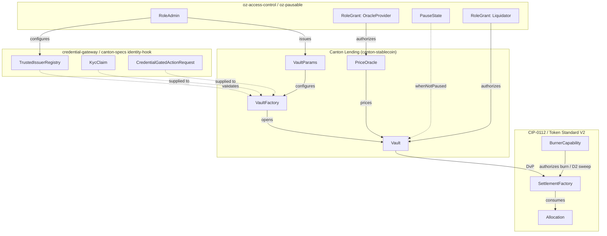
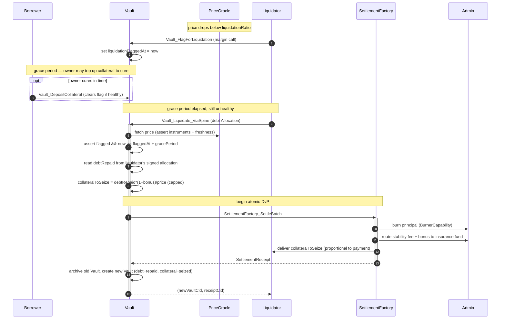

# Architectural Overview Report: Institutional Lending Protocol on Canton

Status: **reference-design report**. It describes a *reference design* grounded
in the real OpenZeppelin Canton components in this workspace; it is **not** a
claim of acceptance, conformance, audit readiness, or production readiness.

> **Source-grounding tags** (throughout):
> `[IMPLEMENTED]` real code in the M1 library base ([`canton-specs`](https://github.com/OpenZeppelin/canton-specs) /
> [`canton-contracts`](https://github.com/OpenZeppelin/canton-contracts)) · `[EVIDENCE]` real code in an evidence repo
> ([`canton-token-template`](https://github.com/OpenZeppelin/canton-token-template), [`canton-stablecoin`](https://github.com/OpenZeppelin/canton-stablecoin)) · `[UPSTREAM]` Splice / CIP
> reference, not vendored here · `[FUTURE]` proposed RI-level design, not built in M1.
>
> **Design priority order** (governs every interface and snippet):
> **1) Security → 2) Simplicity → 3) Readability → 4) Auditability.** Where
> security and readability conflict, security wins: liquidation seizure is bound
> on-ledger to the liquidator's signed payment ([§4.4](#44-margin-call--payment-proportional-liquidation-future-correcting-vault_liquidate-evidence)), the oracle is
> committee-attested rather than single-admin ([§3](#3-how-we-implement-it)), and minting is reachable
> only through a solvency-coupled path ([§3](#3-how-we-implement-it)).

This is the architecture documentation for a vault-based institutional lending
reference design on the **CIP-0112 / Token Standard V2** settlement spine;
settlement builds only on V2 abstractions. Companion working code, demo
front-end, and threat model are named but out of scope here.

---

## 1. Product Definition

This Reference Implementation (RI) is a fixed-rate, **open-term**,
overcollateralized, permissioned lending protocol for the Canton Network, built
around the **Vault** — an isolated collateralized debt position (CDP) grounded in
the real `canton-stablecoin` `Vault` `[EVIDENCE]`. *Fixed-rate* means the
`stabilityFeeRate` is immutable for the life of a position (no utilization curve);
it does **not** mean a fixed term — a position stays open until the owner repays and
withdraws (`Vault_Close`) or is liquidated (there is no maturity field in `Vault`).
It wires onto the **CIP-0112 / Token Standard V2 settlement spine** `[IMPLEMENTED]`
(`OpenZeppelin.Experimental.Settlement.Cip112`), with credential gating via the in-repo
[`credential-gateway`](../../experiments/credential-gateway/daml/OpenZeppelin/Experimental/Credential/Gateway.daml) `[IMPLEMENTED]` (experimental) and capability access control via
[`oz-access-control`](../../access-control/daml/OpenZeppelin/AccessControl.daml) `[IMPLEMENTED]`.

### Who this is for, and what they expect

The design starts from the Canton Network stakeholders and the guarantees they
expect from a regulated lending venue. Those expectations — not a DeFi feature
list — drive every choice in this document.

| Stakeholder | What they expect | Design consequence |
|---|---|---|
| **Institutional borrower / asset manager** | Collateral, debt, and liquidation threshold stay private; positions are not broadcast to the network. | Contract-per-Vault under per-Party projection: a `Vault` is observable only to the borrower, the issuer, and designated regulatory Parties ([§2](#2-architecture-overview)). |
| **Stablecoin issuer / admin** | Never forced to issue stablecoin that is not fully backed. | Minting is reachable **only** through solvency-coupled `Vault_MintStablecoin`; the 1:1 debt-conservation invariant holds ([§3](#3-how-we-implement-it)). |
| **Compliance officer / regulator** | Compliance on the settlement path, fail-closed and continuous — not bolted onto a front-end. | D1 Shape-B check re-run per value-moving leg, no caching ([§3](#3-how-we-implement-it)). |
| **Liquidator / keeper** | Deterministic, fair liquidation with no submission-timing race. | Margin-call grace period, then payment-proportional seizure bound on-ledger to the amount actually repaid ([§4.4](#44-margin-call--payment-proportional-liquidation-future-correcting-vault_liquidate-evidence)). |
| **Risk / oracle operator** | No single party can move the price and manufacture liquidations. | Committee-attested `PriceOracle_UpdatePrice` plus staleness and deviation guards ([§3](#3-how-we-implement-it)). |
| **Auditor** | Explicit authority boundaries, a predictable rate primitive, and a clean upgrade story. | Capability authority (D4); immutable `stabilityFeeRate`; SCU non-mutation rule ([§3](#3-how-we-implement-it)). |

### The Canton design model these expectations assume

Three Canton facts shape the whole design; they are stated once here and
referenced throughout:

- **Party is the actor.** The admin/issuer, borrower, liquidator, oracle-committee
  members, and treasury holder are all **Parties**, each hosted on one or more
  participant nodes. "Who may do X" is always a Party question, and backend
  endpoints are scoped to Party access.
- **Per-Party projection is the privacy model.** A `Vault` is visible only to its
  stakeholder Parties — the borrower, the issuer, and designated regulatory
  Parties. There is no globally visible pooled-vault contract broadcasting every
  participant's collateral balance and liquidation threshold.
- **Daml-LF 2.1 is keyless.** There are no contract keys; configuration
  (`VaultParams`) and state (`Vault`) are separate *contracts* referenced by
  ContractId, and every state change is archive-and-recreate. A new signatory must
  actively co-authorize a transition, so **two-step handshakes are a necessity, not
  a style choice** ([§3](#3-how-we-implement-it)).

*(For readers coming from EVM: the ERC-4626 share-accounting vault — one globally
visible contract tracking a pooled underlying-to-share rate, updated by an
`UpdateSharePrice`-style choice — is deliberately **not** used; it would broadcast
pooled positions and assumes contract-key lookups the keyless LF-2.1 spine does not
provide.)*

### Scope

Scope favors simplicity, modular extensibility, and a demonstrably correct core
over feature complexity.

| Capability Area | In-Scope (Reference design) | Out-of-Scope (Excluded) |
|---|---|---|
| Interest Model | Fixed, immutable `stabilityFeeRate` in `VaultParams`; open-term positions (no maturity). Accrual **compounds discretely** across operations ([§3](#3-how-we-implement-it)). | Dynamic / variable / algorithmic rates, utilization rate curves, floating-rate oracles, fixed maturity/term dates. |
| Collateralization | Overcollateralized borrowing against on-ledger assets; collateral **transferred into vault custody** (not minted/burned), so **institution-supplied / third-party-issued collateral** is supported ([§3](#3-how-we-implement-it)). | Undercollateralized loans, flash loans, recursive leverage, rehypothecation. |
| Liquidation | `Vault_Liquidate_ViaSpine` on undercollateralization, after a **margin-call grace period** ([§3](#3-how-we-implement-it)). **Partial, payment-proportional** seizure bound on-ledger to the stablecoin the liquidator repays ([§4.4](#44-margin-call--payment-proportional-liquidation-future-correcting-vault_liquidate-evidence)). | Market-driven bidding-war auctions; whole-vault forced seizure regardless of payment (the `canton-stablecoin` `Vault_Liquidate` behaviour the RI corrects). |
| Settlement | Atomic DvP **only** via `SettlementFactory_SettleBatch`. | Direct un-batched `Allocation_Settle` for co-settlement. |
| Pricing | `PriceOracle` mapping a single collateral asset to a named `stablecoinInstrumentId`, with staleness + deviation guards and a **committee-attested** update path ([§3](#3-how-we-implement-it), [§4.2](#42-configuration-and-pricing-evidence-canton-stablecoin-shapes)). | Multi-asset dynamic oracles, external off-chain TWAP aggregators. |
| Fees | Stability fee + liquidation bonus **routed to a protocol treasury / insurance fund** (not burned); only the backing principal is burned on repay ([§3](#3-how-we-implement-it)). | Per-position LP reward streams; algorithmic fee markets. |
| Identity & Compliance | D1 Shape B (signed node attestation) using `KycClaim` + `TrustedIssuerRegistry`; credential gating via `credential-gateway`, **re-checked on every value-moving operation** ([§3](#3-how-we-implement-it)), not only at open. | Cross-synchronizer identity aggregation (ERC-3643, ONCHAINID, Chainlink CCID) — deferred, SCU-forward-compatible only ([Q8](#9-open-design-questions)). |
| Authority & Access | Capability-based (`oz-access-control`) for mint/burn/seizure/handoff; **oracle updates committee-attested** so no single admin can move the price. On-ledger multi-sig is a **named M3 extension**. | On-ledger multi-sig / DAO execution. |

**Target users.** Institutional asset managers, tokenized-fund issuers, and
regulated stablecoin operators that need high-value collateralized transactions,
robust risk parameters, and integration with compliance registries over
decentralized rails — without public data leakage.

---

## 2. Architecture Overview

The protocol decomposes into modular Daml templates mapped to life-cycle stages,
with role-based access control and a clean separation across collateral custody,
debt issuance, economic parameterization, and liquidation.

### System Components and Library Integration

| Component | Library Origin | Responsibility | Tag |
|---|---|---|---|
| `VaultParams` | `canton-stablecoin` | Immutable risk config: `minCollateralRatio`, `liquidationRatio`, `liquidationBonus`, fixed `stabilityFeeRate`. | `[EVIDENCE]` |
| `VaultFactory` | `canton-stablecoin` | Vault creation entry point (`VaultFactory_OpenVault`); the RI layers an initial compliance check before opening. | `[EVIDENCE]` |
| `Vault` | `canton-stablecoin` | Stateful CDP: `collateralAmount`, `debtAmount`, `params`, `lastAccrualTime`; choices `Vault_DepositCollateral`, `Vault_WithdrawCollateral`, `Vault_MintStablecoin`, `Vault_BurnStablecoin`, `Vault_Liquidate` (RI adapts → `Vault_FlagForLiquidation` + `Vault_Liquidate_ViaSpine`, [section 4.4](#44-margin-call--payment-proportional-liquidation-future-correcting-vault_liquidate-evidence)), `Vault_Close`; helpers `accrueDebt`, `collateralRatio`. | `[EVIDENCE]` |
| `PriceOracle` | `canton-stablecoin` | Trusted feed: `collateralInstrumentId`, `price`, `updatedAt`, `observers`; updated via `PriceOracle_UpdatePrice`. | `[EVIDENCE]` |
| [`SettlementFactory`](../../experiments/cip112-settlement/daml/OpenZeppelin/Experimental/Settlement/Cip112.daml#L191) | `OpenZeppelin.Experimental.Settlement.Cip112` | Atomic multi-leg settlement: [`SettlementFactory_CreateAllocationRequest`](../../experiments/cip112-settlement/daml/OpenZeppelin/Experimental/Settlement/Cip112.daml#L205), [`SettlementFactory_CreateAllocationInstruction`](../../experiments/cip112-settlement/daml/OpenZeppelin/Experimental/Settlement/Cip112.daml#L228), [`SettlementFactory_SettleBatch`](../../experiments/cip112-settlement/daml/OpenZeppelin/Experimental/Settlement/Cip112.daml#L249). | `[IMPLEMENTED]` |
| Role management | `oz-access-control` | [`RoleGrant`](../../access-control/daml/OpenZeppelin/AccessControl.daml), [`RoleAdmin`](../../access-control/daml/OpenZeppelin/AccessControl.daml), [`requireRole`](../../access-control/daml/OpenZeppelin/AccessControl.daml); `roleId : MyRole -> Text` closed-sum wrapper prevents string-matching role collisions. | `[IMPLEMENTED]` |
| Admin flow | `oz-ownable` / `oz-pausable` | [`Ownership`](../../ownable/daml/OpenZeppelin/Ownable.daml)/[`OwnershipOffer`](../../ownable/daml/OpenZeppelin/Ownable.daml) for handoff; [`PauseState`](../../pausable/daml/OpenZeppelin/Pausable.daml)/[`whenNotPaused`](../../pausable/daml/OpenZeppelin/Pausable.daml) kill-switch. | `[IMPLEMENTED]` |
| Credentials | [`credential-gateway`](../../experiments/credential-gateway/daml/OpenZeppelin/Experimental/Credential/Gateway.daml) | `CredentialGatedActionRequest`, `MockVerificationResult`, `MockVerifierAuthorization`, `CredentialRevocationStatus` for KYC gating. | `[IMPLEMENTED]` (experimental) |
| Typed D3 identity | `canton-specs` identity-hook Shape-B | `KycClaim`, `TrustedIssuerRegistry` — the typed D3 identity shape (from the identity-hook Shape-B experiment, not `credential-gateway`), layered via SCU. | `[IMPLEMENTED]` (experimental) |

### Party and Role Model

Data visibility is bounded by contract participation (signatory/observer); duties
are segregated across discrete Parties.

- **Admin / Issuer** — underwriter of the **stablecoin (debt) token**, assigned via
  `RoleAdmin`; holds the `BurnerCapability` and configures the
  `TrustedIssuerRegistry`. Its mint/burn authority is scoped to the **stablecoin
  instrument only** — never the collateral ([Collateral is custodied, not
  minted](#collateral-is-custodied-not-minted-institution-supplied-collateral)) — and is reachable *only* through `Vault_MintStablecoin`, so the
  admin cannot issue unbacked stablecoin ([Mint is coupled to
  debt](#mint-is-coupled-to-debt-no-unbacked-issuance)).
- **Borrower** — institutional entity locking collateral. Must present a valid
  `MockVerificationResult` derived from a `KycClaim` to interact with the
  `VaultFactory`, and stays subject to the compliance re-check on every subsequent
  value-moving operation ([§3](#3-how-we-implement-it)). Visibility limited to their own `Vault`s and
  public config.
- **Liquidator** — role granted via `oz-access-control`; runs off-ledger
  monitoring of `PriceOracle` and vault solvency, and may exercise
  `Vault_Liquidate_ViaSpine` **only after the margin-call grace period has elapsed**
  on a flagged, still-unhealthy vault ([§3](#3-how-we-implement-it)). Seizure is bound on-ledger to the
  stablecoin actually repaid.
- **Oracle Committee** — a set of independent attestor Parties (mirroring the DEX
  `attestorPool`) that **co-control** `PriceOracle_UpdatePrice` alongside the admin
  (`controller admin :: oracleCommittee`), so no single party — not even a
  compromised admin — can move the published price ([§3](#3-how-we-implement-it)). Authorized via
  `RoleGrant` (`OracleProvider`); the quorum/threshold is [Q4](#9-open-design-questions).
- **Treasury / Insurance-fund holder** — receives the routed stability-fee and
  liquidation-bonus portions ([Fees are routed, not
  burned](#fees-are-routed-not-burned-protocol-revenue--insurance-fund)); the accumulated fund is the first absorber of recognized bad
  debt.

### Trust and Topology

The topology separates public market data from private positions. `PriceOracle`
and `VaultParams` are highly visible (signatory `admin`, broad observer set), so
participants can independently verify the governing parameters; the `Vault`
minimizes its observer set to `admin`, the specific `borrower`, and designated
regulatory Parties only. Because Canton applies transaction execution at the
hosting participant node, D1 compliance checks run locally, fail-closed, on every
settlement leg before global finalization — no external API calls, no caching.

M1 uses **single-admin capability authority** for stablecoin mint/burn/seizure, but
the price path is deliberately **not** single-admin — the one component whose
compromise would let the admin steal collateral requires committee consent ([§3](#3-how-we-implement-it)).
Broader **Multi-Party Attestation** (a *multiply attested* vault issuer, decentralizing
the trust anchor without an on-ledger multi-sig bottleneck) is a named M3 extension
([Q6](#9-open-design-questions)).

---

## 3. How We Implement It

The CDP model is expressed as a sequence of atomic Canton transactions under
Daml-LF 2.1 keyless semantics: every state change archives the prior contract and
recreates an updated instance with a new Contract ID.

### The Settlement-Spine Flow

All value transfers to/from the `Vault` route through
[`SettlementFactory_SettleBatch`](../../experiments/cip112-settlement/daml/OpenZeppelin/Experimental/Settlement/Cip112.daml#L249) for atomic DvP. The direct [`Allocation_Settle`](../../experiments/cip112-settlement/daml/OpenZeppelin/Experimental/Settlement/Cip112.daml#L493)
path proves authorization of a single leg, not atomic co-settlement of
interdependent legs, so it is not used for DvP.

1. **Vault origination + collateral deposit.** The borrower locks collateral into an
   [`Allocation`](../../experiments/cip112-settlement/daml/OpenZeppelin/Experimental/Settlement/Cip112.daml#L474) (via [`SettlementFactory_CreateAllocationInstruction`](../../experiments/cip112-settlement/daml/OpenZeppelin/Experimental/Settlement/Cip112.daml#L228) →
   [`AllocationInstruction`](../../experiments/cip112-settlement/daml/OpenZeppelin/Experimental/Settlement/Cip112.daml#L379) accept) and presents a `CredentialGatedActionRequest` +
   `MockVerificationResult` to the `VaultFactory`. On verification,
   `VaultFactory_OpenVault` batch-settles the collateral **into a vault custody account
   (a transfer, not a burn)** and instantiates the `Vault`. Top-ups use
   `Vault_DepositCollateral`, reductions `Vault_WithdrawCollateral` — both
   solvency-checked, both re-running the compliance check.
2. **Borrow.** `Vault_MintStablecoin` runs a solvency check (requested + existing debt
   must keep `collateralRatio ≥ VaultParams.minCollateralRatio`, priced by
   `PriceOracle`), then mints stablecoin to the borrower via a `SettleBatch` leg *in
   the same transaction that increments* `debtAmount` ([Mint is coupled to
   debt](#mint-is-coupled-to-debt-no-unbacked-issuance)).
3. **Repay.** `Vault_BurnStablecoin` **burns only the backing principal** via
   [`BurnerCapability`](../../experiments/cip112-settlement/daml/OpenZeppelin/Experimental/Settlement/Cip112.daml#L98) and **routes the accrued stability fee to the treasury /
   insurance fund** ([Fees are routed, not burned](#fees-are-routed-not-burned-protocol-revenue--insurance-fund)), reducing `debtAmount`; collateral
   is released via `Vault_WithdrawCollateral` on `Vault_Close`.
4. **Liquidation (after a margin call).** Below `liquidationRatio` the position is
   first **flagged** (`Vault_FlagForLiquidation`), opening a deterministic cure window
   ([Margin call](#margin-call-a-grace-period-before-liquidation)). Only after the grace period elapses on a still-unhealthy vault may
   an authorized liquidator exercise `Vault_Liquidate_ViaSpine`; `SettleBatch`
   atomically burns the liquidator's principal, routes the `liquidationBonus` to the
   insurance fund, and sweeps **collateral proportional to the amount repaid**
   ([§4.4](#44-margin-call--payment-proportional-liquidation-future-correcting-vault_liquidate-evidence)), recreating the residual in a new `Vault`.

### Interest Accrual and Bad-Debt Recognition (grounded in `Vault.daml` `[EVIDENCE]`)

Both mechanics are concrete in the `canton-stablecoin` `Vault` the RI adapts, so are
stated here as decided behaviour:

- **Interest accrual compounds discretely.** `accrueDebt` computes
  `newDebt = oldDebt * (1 + stabilityFeeRate * elapsedYears)` (`elapsedYears` from
  `now - lastAccrualTime`), runs on every state-changing choice before the solvency
  check, and resets `lastAccrualTime` to `now` on each recreation with `oldDebt` the
  running accrued debt. So across windows `t₁` then `t₂` debt grows by
  `P·(1 + r·t₁)·(1 + r·t₂)`, exceeding simple interest `P·(1 + r·(t₁+t₂))` by
  `P·r²·t₁·t₂` — **discrete compounding at every interaction**. (The real docstring
  calls itself "linear"; the code compounds, and this RI states the actual behaviour.)
  The accrual method is [Q1](#9-open-design-questions).
- **Bad debt is recognized and absorbed by the insurance fund.** Liquidation
  ([§4.4](#44-margin-call--payment-proportional-liquidation-future-correcting-vault_liquidate-evidence)) seizes collateral **proportional to the stablecoin repaid**, reading
  `debtRepaid` from the liquidator's *signed* allocation — unlike the real
  `Vault_Liquidate`, whose under-water branch hands over **all** collateral regardless
  of payment (a 1-unit payment could seize the whole vault). Any genuine shortfall is
  still quantified as `badDebt` in `VaultLiquidationResult`; the insurance fund (below)
  is its first absorber, exhausted-fund fallback in [Q2](#9-open-design-questions).

### Collateral is Custodied, Not Minted (institution-supplied collateral)

In the raw `canton-stablecoin` `Vault`, `Vault_DepositCollateral` **burns** the
incoming collateral and `Vault_WithdrawCollateral` **mints** fresh holdings — and
because `SimpleHolding` is `signatory admin, owner`, minting requires the admin to be
the collateral **issuer** (the real `VaultFactory` even `ensure`s
`collateralInstrumentId.admin == admin`), making institution-supplied collateral
impossible. The RI instead routes collateral through the spine: a deposit is a
`SettleBatch` **transfer** into a vault custody account, a withdrawal transfers it
back. Nothing is minted or burned, so the admin needs issuing authority over the
**stablecoin only** — third-party-issued collateral (a custodian bank, a
tokenized-treasury issuer) is first-class, and the admin's minting power is confined
to the stablecoin, the basis for the next two properties.

### Mint is Coupled to Debt (no unbacked issuance)

Stablecoin can be created **only** inside `Vault_MintStablecoin`, which in one atomic
transaction (a) runs the solvency check, (b) recreates the `Vault` with
`debtAmount = accruedDebt + mintAmount`, and (c) mints *exactly* `mintAmount` to the
borrower via a `SettleBatch` leg. There is no standalone admin-mint choice, so the
admin cannot conjure stablecoin unmatched by recorded, solvency-checked debt;
symmetrically `Vault_BurnStablecoin` reduces `debtAmount` by exactly the principal
burned. This is the on-ledger realisation of the **debt-conservation invariant**:
every circulating stablecoin unit is backed 1:1 by outstanding vault debt.

### Fees are Routed, Not Burned (protocol revenue → insurance fund)

On repay/close/liquidation the settled debt is `principal + accrued stability fee`
(plus `liquidationBonus` on a liquidation). Burning the **entire** payment (as raw
`canton-stablecoin` does) destroys the fee, so the RI **splits** it on-ledger: the
backing-principal portion is burned via `BurnerCapability` (preserving the 1:1
invariant), and the **stability-fee + liquidation-bonus portions transfer to a
protocol treasury / insurance-fund account** — the on-ledger analogue of interest to
the lender, and the first absorber of any liquidation shortfall ([Q2](#9-open-design-questions)).

### Margin Call: a Grace Period Before Liquidation

Canton has no public mempool, so rather than leave a top-up-vs-liquidation outcome to
submission timing, the RI makes the borrower's cure window **explicit and
deterministic**. Liquidation is two-phase:

1. **Flag.** When `collateralRatio < liquidationRatio`, anyone monitoring (typically
   a keeper) may exercise `Vault_FlagForLiquidation`, recording `liquidationFlaggedAt`
   and deriving `gracePeriodEnd = now + gracePeriod` (a protocol-set `VaultParams`
   field). This is the margin call.
2. **Cure or liquidate.** During the grace window the owner may
   `Vault_DepositCollateral` (or repay) to restore the ratio, clearing the flag.
   `Vault_Liquidate_ViaSpine` `assertMsg`s that the vault is flagged **and**
   `now >= gracePeriodEnd` **and** still unhealthy — so a liquidator cannot pre-empt
   the cure window, and an idle owner is liquidated deterministically once it closes.

The two new choices are additive, SCU-safe extensions over the base.

### Compliance is Re-checked on Every Operation (not only at open)

The `VaultFactory_OpenVault` KYC gate is necessary but not sufficient — a borrower can
lose standing after opening. Because every value-moving operation settles through
`SettleBatch`, the same D1 path ([D1–D4 attachment](#d1d4-attachment-strategy)) runs **per leg, fail-closed, no
caching**, checking the party *moving value on that leg*. So the borrower's credential
is re-evaluated on each `Vault_DepositCollateral`, `Vault_WithdrawCollateral`, and
`Vault_MintStablecoin`, and a revoked `CredentialRevocationStatus` blocks new
borrows/top-ups/withdrawals immediately. Wind-down is deliberately exempt: on
`Vault_BurnStablecoin`/`Vault_Close` the borrower is repaying, and on liquidation it is
the *liquidator's* compliance that is checked — so a non-compliant position can always
be repaid or liquidated, never trapped. (The real `Vault` has no compliance check; this
is an RI-level addition.)

### Oracle Handling: Staleness Guard + Circuit Breaker

A single trusted `PriceOracle` plus a single liquidator is the largest live attack
surface — the real `canton-stablecoin` `PriceOracle` is single-admin, carries no
staleness/deviation/pause logic, and does not even name the instrument its price is
quoted in — so the RI hardens the price path in the design (not deferred). This is
the **canonical home** for oracle hardening:

- **Named quote instrument.** `PriceOracle` carries a `stablecoinInstrumentId`
  alongside `collateralInstrumentId`, so `price` is unambiguously "units of *this*
  stablecoin per unit of *this* collateral". Consumers assert both ids match the
  vault's, closing the ambiguity where a feed quoted in a different unit could be
  applied to the wrong debt token.
- **Committee-attested updates (no single-writer price).** `PriceOracle_UpdatePrice`
  is `controller admin :: oracleCommittee` — mirroring the DEX `attestorPool`, the
  **full committee (all-of-M)** co-signs each price. This is the primary defence
  against the "compromised admin sets `price → ε` and liquidates everyone" attack: a
  lone admin can no longer move the price. Members are `RoleGrant`-authorized
  (`OracleProvider`); an N-of-M *threshold* (so one offline attestor cannot stall
  updates) is [Q4](#9-open-design-questions).
- **Max-staleness guard.** `PriceOracle` carries an `updatedAt : Time`; every
  price-dependent choice (`Vault_Mint*`, `Vault_Withdraw*`, `Vault_FlagForLiquidation`,
  `Vault_Liquidate_ViaSpine`) rejects when `now - updatedAt > maxStaleness` (a
  `VaultParams` bound), so a stalled feed cannot drive liquidations or fresh borrows
  against a dead price. (`maxStaleness` is an additive `[FUTURE]` `VaultParams` field;
  `maxDeviation` lives on the `PriceOracle` itself — [§4.2](#42-configuration-and-pricing-evidence-canton-stablecoin-shapes) — both SCU-compatible.)
- **Per-update deviation circuit breaker.** `PriceOracle_UpdatePrice` bounds the jump
  against the oracle's own `maxDeviation` (`|newPrice - price| / price <= maxDeviation`);
  an out-of-band move **aborts the update**, so the last in-band price stands and the
  staleness guard eventually fires. The abort persists nothing, so tripping the
  `oz-pausable` kill-switch on repeated breaches is a *separate* admin/keeper action.
- **TWAP (deferred).** A time-weighted average price is a named follow-on hardening
  ([Q4](#9-open-design-questions)); its additive `Optional` carrier is an SCU extension point.

### D1–D4 Attachment Strategy

- **D1 — compliance (node-applied).** A per-settlement, fail-closed check, engaged on
  the M1 spine by the optional `D1ComplianceHook` / typed attestation path (not
  mandated by base `SettleBatch`). The RI selects **Shape B** (signed node
  attestation) over Shape A (off-ledger gate): a `KycClaim` from a
  `TrustedIssuerRegistry` is submitted as a native contract payload, enforced
  deterministically at the participant node with no external calls, and a
  `CredentialRevocationStatus` of revoked triggers fail-closed rejection via the
  optional [`D1ComplianceHook`](../../experiments/cip112-settlement/daml/OpenZeppelin/Experimental/Settlement/Cip112.daml#L41). (Whether the contract stays oblivious or verifies the
  attestation on-ledger at exercise time is [Q7](#9-open-design-questions); the node-applied signed attestation
  is `[FUTURE]`, the hook today a reference field only.)
- **D2 — seizure (lock-and-sweep).** Under legal mandate the admin sweeps collateral
  to an admin-**preset** `custodianDestination` (carried in the spine's
  [`D2SeizureHook`](../../experiments/cip112-settlement/daml/OpenZeppelin/Experimental/Settlement/Cip112.daml#L46) config record), gated by the single-admin [`BurnerCapability`](../../experiments/cip112-settlement/daml/OpenZeppelin/Experimental/Settlement/Cip112.daml#L98).
  In-flight allocations use the real spine choices [`Allocation_MarkD2InFlightSeizure`](../../experiments/cip112-settlement/daml/OpenZeppelin/Experimental/Settlement/Cip112.daml#L595)
  → [`Allocation_SweepD2InFlightSeizure`](../../experiments/cip112-settlement/daml/OpenZeppelin/Experimental/Settlement/Cip112.daml#L625); locked vault collateral uses a forced sweep
  (`LockedSimpleHolding_ForcedBurn` `[FUTURE]` — the evidence template ships only
  `_Unlock`). Seized assets are **never** burned and **never** returned to sender;
  ordinary transfer *failures* do return to sender.
- **D3 — identity.** Single-synchronizer v1 with issuer-held KYC. Cross-synchronizer (ERC-3643 /
  ONCHAINID / Chainlink CCID) deferred but forward-compatible via additive SCU
  ([Q8](#9-open-design-questions)).
- **D4 — authority.** Single-admin capability via [`oz-access-control`](../../access-control/daml/OpenZeppelin/AccessControl.daml)
  ([`RoleAdmin`](../../access-control/daml/OpenZeppelin/AccessControl.daml)) for pause, parameter updates, and seizure. On-ledger multi-sig is an
  M3 extension `[FUTURE]`.

### The SCU Extension Story

The SCU rule: never mutate an existing choice's arguments. Extend via appended
`Optional` fields, new serializable types, and new choices; new interfaces come from
new templates/choices, not retroactive re-instancing of the deployed `Vault` — Daml
3.x removed **retroactive interface instances** `[UPSTREAM]` because they broke clean
upgrades. Example: a cross-chain identity hash adds `crossSynchronizerIdentity : Optional
Text` (read `None` by older contracts) plus a **new** `Vault_UpdateIdentity` choice,
leaving `Vault_MintStablecoin` / `Vault_BurnStablecoin` signatures untouched — the
additive path proven in the `canton-specs` identity-hook upgrade spike.

---

## 4. Interfaces & Usage Examples

Interfaces are prioritized by Security, Simplicity, Readability, Auditability.
RI-level templates that adapt or extend `canton-stablecoin` are tagged `[FUTURE]`;
field/choice names match real `canton-stablecoin` source.

### 4.1 Role wrappers `[FUTURE]`

```daml
module Lending.Types where

import OpenZeppelin.AccessControl (RoleGrant)

-- Closed-sum wrapper: precise role ids, no raw-string matching.
data VaultRole = VaultAdmin | Liquidator | OracleProvider | Pauser
  deriving (Eq, Show)

roleId : VaultRole -> Text
roleId VaultAdmin     = "VAULT_ADMIN"
roleId Liquidator     = "LIQUIDATOR"
roleId OracleProvider = "ORACLE_PROVIDER"
roleId Pauser         = "PAUSER"
```

### 4.2 Configuration and pricing `[EVIDENCE]` (canton-stablecoin shapes)

```daml
-- Real canton-stablecoin shapes (grounded in Stablecoin/Vault.daml and
-- Stablecoin/Oracle.daml). VaultParams is a data record (embedded by value in
-- VaultFactory / Vault), not a template — so there is no `paramsCid` to store or
-- brick; the config travels with the contract that embeds it. Instrument ids are
-- `InstrumentId` (bound to the issuing admin), not `Text`.
data VaultParams = VaultParams
  with
    minCollateralRatio : Decimal   -- e.g. 1.50 (150%)
    liquidationRatio : Decimal     -- triggers liquidation-flag below this
    liquidationBonus : Decimal     -- fixed-discount penalty, e.g. 0.10
    stabilityFeeRate : Decimal     -- fixed / immutable rate (open-term, no maturity)
    -- [FUTURE] additive (SCU-appended) risk params — not in the current real
    -- 4-field shape; the margin-call (section 3) and liquidation (section 4.4) designs reference
    -- these, protocol-set (never liquidator-supplied):
    --   maxStaleness : RelTime     -- reject a price older than this
    --   gracePeriod  : RelTime     -- margin-call cure window before liquidation
    --   closeFactor  : Decimal     -- max fraction of debt one liquidation may repay
    -- Because VaultParams is a `data` record it cannot carry its own `ensure`; the
    -- VaultFactory validates the bounds at open — in particular 0.0 < closeFactor
    -- <= 1.0 (a 0 close factor would make `debtRepaid <= closeFactor*debt` force
    -- debtRepaid <= 0 and brick liquidation) and gracePeriod >= 0.
    -- (maxDeviation lives on the PriceOracle, not here — see below.)
  deriving (Eq, Show)
  -- (collateralInstrumentId / stablecoinInstrumentId : InstrumentId live on
  --  VaultFactory and Vault; the oracle ALSO names both — see below.)

-- PriceOracle IS a real template, extended here with two RI hardenings over the
-- real 5-field shape (both [FUTURE] additive / SCU-appended):
--   * `stablecoinInstrumentId` — the real oracle names only the collateral; the
--     RI also names the quote instrument, so `price` is unambiguously "units of
--     this stablecoin per unit of this collateral" and consumers assert both.
--   * `oracleCommittee` + committee-controlled update — the real update path is
--     `controller admin` alone; the RI co-controls it with the full committee (like the DEX
--     attestorPool) so no single compromised admin can move the price (section 3).
-- The update path is *consuming* (archive-and-recreate to publish), so the cid is
-- passed to consumers at exercise time (liquidation's `oracleCid`), never stored.
template PriceOracle
  with
    admin : Party
    oracleCommittee : [Party]      -- [FUTURE] attestor set co-signing updates (all-of-M)
    collateralInstrumentId : InstrumentId
    stablecoinInstrumentId : InstrumentId  -- [FUTURE] the unit `price` is quoted in
    price : Decimal                -- units of stablecoinInstrumentId per collateral unit
    -- Circuit-breaker bound, set at creation and mutable only via a separate
    -- governance choice — not a per-update argument, so a submitting committee
    -- cannot widen its own deviation bound (the writer-set-bound anti-pattern).
    maxDeviation : Decimal
    updatedAt : Time
    observers : [Party]            -- real field: distinct readers (not the admin)
  where
    signatory admin, oracleCommittee
    observer observers
    ensure price > 0.0 && maxDeviation > 0.0 &&
           collateralInstrumentId /= stablecoinInstrumentId

    -- Committee-attested, RoleGrant-gated, deviation-bounded price publish. The
    -- deviation bound is read from `this.maxDeviation` (trusted signed state), not
    -- supplied by the caller.
    choice PriceOracle_UpdatePrice : ContractId PriceOracle
      with
        newPrice : Decimal
      controller admin :: oracleCommittee   -- full committee co-signs; no single writer
      do
        assertMsg "price must be positive" (newPrice > 0.0)
        -- Per-update circuit breaker against `this.maxDeviation`. A breach aborts
        -- the update (the stale-but-safe last price stands, and staleness guards
        -- eventually fire); pausing on repeated breaches is a separate admin
        -- action, since an aborting transaction cannot also persist a pause.
        assertMsg "price deviation out of band"
          (abs (newPrice - price) / price <= maxDeviation)
        now <- getTime
        create this with price = newPrice; updatedAt = now
```

### 4.3 Vault opening with identity gating `[FUTURE]` (RI adapter over `VaultFactory_OpenVault`)

```daml
module Lending.Vault where

import OpenZeppelin.Experimental.Settlement.Cip112 (SettlementFactory)
import OpenZeppelin.Experimental.Credential.Gateway (CredentialGatedActionRequest, MockVerificationResult)
-- KycClaim / TrustedIssuerRegistry: canton-specs identity-hook Shape-B
import OpenZeppelin.Experimental.Identity.ShapeB (KycClaim, TrustedIssuerRegistry)

template LendingVaultFactory
  with
    admin : Party
    vaultFactoryCid : ContractId VaultFactory  -- real canton-stablecoin factory
  where
    signatory admin

    -- New RI choice wrapping the canton-stablecoin VaultFactory_OpenVault path.
    -- Two deliberate pointer choices, mirroring the DEX pointer rules:
    --  * `VaultFactory` is nonconsuming (reusable — it does not archive on open),
    --    so its cid is stable and safe to store. `VaultParams` rides inside it as
    --    an embedded `data` value, so there is no separate params cid to brick.
    --  * `TrustedIssuerRegistry` archive-and-recreates on issuer add/remove, so
    --    it is passed as a choice argument (disclosed at exercise time), never
    --    stored — the same dangling-pointer hazard as a stored `PauseState` cid.
    nonconsuming choice LendingVaultFactory_OpenGatedVault : ContractId Vault
      with
        borrower : Party
        registryCid : ContractId TrustedIssuerRegistry  -- current registry, passed in
        complianceRequest : CredentialGatedActionRequest
        verificationResult : MockVerificationResult
        kycClaim : KycClaim
      controller borrower            -- two-step handshake: borrower co-authorizes
      do
        -- D1 Shape B: deterministic, node-applied validation (no external calls).
        assertMsg "KYC issuer not trusted" (kycClaim.declaredIssuer == admin)
        assertMsg "verification not accepted" (isAccepted verificationResult)
        -- Delegate to the real factory choice to open the Vault.
        -- exercise vaultFactoryCid VaultFactory_OpenVault with ..
        create Vault with .. -- (canton-stablecoin Vault; see 4.4)
```

### 4.4 Margin call + payment-proportional liquidation `[FUTURE]` (correcting `Vault_Liquidate` `[EVIDENCE]`)

This is the **canonical home** for payment-proportional liquidation. The real
`Vault_Liquidate` seizes the whole vault in one shot and, in its under-water branch,
hands over all collateral regardless of how much the liquidator pays — the critical
vulnerability the RI corrects with (1) a margin-call flag + grace period and (2) a
seizure bound on-ledger to the stablecoin the liquidator actually signed for.

```daml
-- canton-stablecoin Vault fields (exact): admin, owner, collateralInstrumentId,
-- stablecoinInstrumentId, collateralAmount, debtAmount, params, lastAccrualTime.
-- The RI adds three additive (SCU-appended) fields:
--   liquidationFlaggedAt : Optional Time  -- None until flagged; set by the flag choice
--   principalAmount      : Decimal        -- borrowed principal, tracked apart from
--                                         --   accrued fee so the fee split (section 3) is
--                                         --   computable; debtAmount stays the total
--   collateralAccount    : Account        -- the canonical custody account whose
--                                         --   holdings back collateralAmount; bound into
--                                         --   deposit/withdraw/liquidation so each delta is
--                                         --   sourced from the right account (the analogue of
--                                         --   the DEX pool's poolAccount; the absolute
--                                         --   collateralAmount == Σ holdings also needs funded
--                                         --   deposits, like the DEX seeding caveat)
-- The real `Vault_Liquidate` seizes the whole vault in one shot and, in its
-- under-water branch, hands over all collateral regardless of how much the
-- liquidator pays (booking the gap as badDebt) — a critical vulnerability. The RI
-- replaces that with (1) a margin-call flag + grace period, and (2) a
-- payment-proportional liquidation whose seizure is bound on-ledger to the
-- stablecoin the liquidator actually signed for.

    -- Phase 1 — margin call. Permissionless: anyone may flag an unhealthy vault,
    -- which starts the owner's cure clock. It does not move value.
    choice Vault_FlagForLiquidation : ContractId Vault
      with
        flagger : Party
        oracleCid : ContractId PriceOracle
      controller flagger
      do
        now <- getTime
        oracle <- fetch oracleCid
        assertMsg "oracle instrument mismatch"
          (oracle.collateralInstrumentId == collateralInstrumentId &&
           oracle.stablecoinInstrumentId == stablecoinInstrumentId)
        assertMsg "oracle stale" (subTime now oracle.updatedAt <= params.maxStaleness)
        let accruedDebt = accrueDebt debtAmount lastAccrualTime now params.stabilityFeeRate
        assertMsg "vault is healthy — cannot flag"
          (collateralRatio collateralAmount accruedDebt oracle.price < params.liquidationRatio)
        -- Start the grace window; the owner may cure via Vault_DepositCollateral,
        -- which clears the flag when the ratio is restored.
        create this with
          debtAmount = accruedDebt; lastAccrualTime = now
          liquidationFlaggedAt = Some now

    -- Phase 2 — liquidation, only after the grace period, and only proportional
    -- to what the liquidator pays.
    choice Vault_Liquidate_ViaSpine : (ContractId Vault, ContractId SettlementReceipt)
      with
        liquidator : Party
        oracleCid : ContractId PriceOracle             -- current oracle, passed in (mutable)
        settlementFactoryCid : ContractId SettlementFactory
        debtAllocationId : ContractId Allocation       -- liquidator's committed stablecoin
        vaultCollateralAllocationId : ContractId Allocation  -- VAULT's committed collateral (funds the seize leg);
                                                             -- committed by admin+owner (the collateral custody
                                                             -- account's parties) via the standard spine lifecycle
                                                             -- when the vault is flagged/serviced, not by the liquidator
        protocolAllocationId : ContractId Allocation   -- protocol/treasury's committed RECEIVER side for the
                                                       -- payment leg — needed so SettleBatch's both-sided check
                                                       -- sees the admin-side of the liquidator→protocol payment
                                                       -- (three parties: liquidator, protocol, vault custody)
        settlement : SettlementInfo
        transferLegs : [TransferLeg]                   -- exact legs (debt in / collateral out / fee out)
      controller liquidator
      do
        now <- getTime
        oracle <- fetch oracleCid
        assertMsg "oracle instrument mismatch"
          (oracle.collateralInstrumentId == collateralInstrumentId &&
           oracle.stablecoinInstrumentId == stablecoinInstrumentId)
        -- Oracle freshness: `maxStaleness` is a protocol-set VaultParams field, not
        -- a liquidator-supplied arg — a liquidator must not widen it to liquidate
        -- against a dead price.
        assertMsg "oracle stale" (subTime now oracle.updatedAt <= params.maxStaleness)

        -- Margin-call gate: the vault must have been flagged and the grace period
        -- must have elapsed. This removes the top-up-vs-liquidation race: the owner
        -- owns the whole [flaggedAt, flaggedAt + gracePeriod] window to cure.
        case liquidationFlaggedAt of
          None -> abort "not flagged — call Vault_FlagForLiquidation first (margin call)"
          Some flaggedAt ->
            assertMsg "grace period has not elapsed"
              (subTime now flaggedAt >= params.gracePeriod)

        -- Accrue, then confirm still unhealthy (the owner may have partially cured).
        let accruedDebt = accrueDebt debtAmount lastAccrualTime now params.stabilityFeeRate
        assertMsg "vault is solvent"
          (collateralRatio collateralAmount accruedDebt oracle.price < params.liquidationRatio)

        -- On-ledger binding — pay side: read how much stablecoin the liquidator
        -- actually signed to pay, and drive seizure off that — never off the
        -- vault's full accrued debt.
        liqAlloc <- fetch debtAllocationId
        let liquidatorAccount = liqAlloc.allocation.authorizer
        paySide <- case filter (\s -> s.side == SenderSide) liqAlloc.allocation.transferLegSides of
          [s] | s.instrumentId == stablecoinInstrumentId.id -> pure s
          _ -> abort "liquidator must sign exactly one stablecoin payment (sender) side"
        let debtRepaid = paySide.amount
        assertMsg "payment must be positive" (debtRepaid > 0.0)
        -- Partial / proportional liquidation: one call may repay at most a
        -- `closeFactor` slice of the debt (enough to restore health, not the whole
        -- position), and never more than the outstanding debt. (The VaultFactory
        -- validates `0.0 < closeFactor <= 1.0` at open, so this cap can never
        -- brick to 0.)
        assertMsg "repayment exceeds close-factor cap"
          (debtRepaid <= min accruedDebt (params.closeFactor * accruedDebt))
        -- Collateral seized is exactly what the payment (plus bonus) buys, capped by
        -- what the vault holds. A tiny payment now seizes only a tiny slice.
        let collateralToSeize =
              min collateralAmount ((debtRepaid * (1.0 + params.liquidationBonus)) / oracle.price)

        -- On-ledger binding — seize side (the other half; without this the seize
        -- amount would be operator-asserted via `transferLegs`, re-opening the very
        -- gap). Read the vault's own committed collateral allocation and require its
        -- signed sender side to be exactly `collateralToSeize` of the collateral
        -- instrument, then pin `transferLegs` to exactly the two bound legs — mirror
        -- of the DEX `Pool_Swap` leg binding (RI-01, section 4.1).
        vaultCollAlloc <- fetch vaultCollateralAllocationId
        let vaultCollateralAccount = vaultCollAlloc.allocation.authorizer
        collSide <- case filter (\s -> s.side == SenderSide) vaultCollAlloc.allocation.transferLegSides of
          [s] | s.instrumentId == collateralInstrumentId.id -> pure s
          _ -> abort "vault must sign exactly one collateral (sender) side"
        -- Account-identity binding (the DEX poolAccount analogue): the collateral
        -- must be sourced from this vault's canonical custody account, else the
        -- recreate could draw down `collateralAmount` while some other account's
        -- holdings actually moved — decoupling the vault's accounting from reality.
        assertMsg "collateral not sourced from this vault's custody account"
          (vaultCollateralAccount == collateralAccount)
        assertMsg "seized collateral != collateralToSeize" (collSide.amount == collateralToSeize)
        assertMsg "collateral must be delivered to the paying liquidator"
          (collSide.otherside == liquidatorAccount)
        -- The payment must be delivered to the protocol account (the issuer/admin),
        -- so it cannot be redirected; binding the receiver mirrors the pool-account
        -- identity binding in the DEX. That protocol account must also be the
        -- authorizer of `protocolAllocationId`, so its ReceiverSide of the payment
        -- leg is present in the batch (both-sidedness holds across all three
        -- parties: liquidator, protocol, vault custody).
        protocolAlloc <- fetch protocolAllocationId
        assertMsg "payment must be delivered to the protocol (admin) account"
          (paySide.otherside.owner == Some admin && protocolAlloc.allocation.authorizer == paySide.otherside)
        let expectedPayLeg = TransferLeg with
              transferLegId = paySide.transferLegId
              sender = liquidatorAccount; receiver = paySide.otherside
              amount = debtRepaid; instrumentId = stablecoinInstrumentId.id; meta = paySide.meta
            expectedSeizeLeg = TransferLeg with
              transferLegId = collSide.transferLegId
              sender = vaultCollateralAccount; receiver = liquidatorAccount
              amount = collateralToSeize; instrumentId = collateralInstrumentId.id; meta = collSide.meta
        assertMsg "settled legs != the bound (payment, seize) legs"
          (transferLegs == [expectedPayLeg, expectedSeizeLeg])

        -- Fee split (see section 3, "Fees are routed, not burned"). The debt commingles
        -- principal and accrued fee; the RI tracks `principalAmount` (an additive
        -- field, below) so the split is computable. Of the `debtRepaid` received at
        -- the protocol account, the principal fraction is burned via
        -- `BurnerCapability` (removing backing from supply, preserving the 1:1
        -- invariant) and the fee fraction is retained as insurance-fund capital.
        let principalRepaid =
              if accruedDebt == 0.0 then 0.0 else debtRepaid * (principalAmount / accruedDebt)

        -- Atomic DvP over the three bound allocations (liquidator payment side,
        -- protocol receiver side, vault collateral side) — every leg now has both
        -- signed sides in the batch. `transferLegs` is already pinned to the two
        -- legs whose amounts are `debtRepaid` / `collateralToSeize` above, so
        -- neither over-seizure nor under-payment can settle.
        receipts <- exercise settlementFactoryCid SettlementFactory_SettleBatch with
          settlement
          transferLegs
          allocationCids = [debtAllocationId, protocolAllocationId, vaultCollateralAllocationId]
          actors = settlement.executors
          d1ComplianceRef = None

        -- Recreate the (partially) liquidated vault: debt, principal, and collateral
        -- each fall by the settled amounts, so the `collateralAmount` delta matches
        -- the collateral that actually moved from `collateralAccount`. If the
        -- position is now healthy the flag clears; if still
        -- under-water the original flag time is preserved (not reset to `now`), so
        -- the vault — already past grace — is immediately re-liquidatable rather
        -- than granted a fresh grace window each partial pass.
        let remainingDebt = accruedDebt - debtRepaid
            remainingCollateral = collateralAmount - collateralToSeize
            stillUnhealthy =
              collateralRatio remainingCollateral remainingDebt oracle.price < params.liquidationRatio
        receipt <- case receipts of
          r :: _ -> pure r            -- receipts align with allocationCids order
          [] -> abort "SettleBatch returned no receipt"
        newVault <- create this with
          collateralAmount = remainingCollateral
          debtAmount = remainingDebt
          principalAmount = principalAmount - principalRepaid
          lastAccrualTime = now
          liquidationFlaggedAt = if stillUnhealthy then liquidationFlaggedAt else None
        return (newVault, receipt)

    -- D2 lock-and-sweep: no bespoke "D2SeizureHook_Sweep" template — D2SeizureHook
    -- is a spine config record (seizureCaseRef, custodianDestination,
    -- inFlightHandlingStatus). Seizure is gated by BurnerCapability and routes to
    -- the preset custodianDestination; never burn, never return-to-sender.
```

The absolute `collateralAmount == Σ(custody-account holdings)` invariant — beyond the
per-transaction delta bound above — also requires funded deposits and a consolidation
cadence, tracked as [Q5](#9-open-design-questions).

---

## 5. Diagrams

Mermaid below maps to scenarios for the proposed `canton-settlement-explorer` `[FUTURE]`
(presets: Batch DvP, Multi-leg Settlement).

### 5.1 Interface and Component Diagram



### 5.2 Flow-of-Funds and Settlement Diagram (Liquidation)



---

## 6. Library Dependencies

### 6.1 Internal Dependencies

| Package | Consumed Templates / Primitives | Rationale | Tag |
|---|---|---|---|
| `canton-token-template` | `SimpleHolding`, `LockedSimpleHolding`, `SimpleTokenRules`, `TransferPreapproval` | Asset representation; the D2 forced-sweep choice (`LockedSimpleHolding_ForcedBurn`) is a `[FUTURE]` extension — the evidence template ships only `_Unlock`. | `[EVIDENCE]` (+ `[FUTURE]` extension) |
| `canton-stablecoin` | `Vault`, `VaultFactory`, `VaultParams`, `PriceOracle`, `Vault_Liquidate` (adapted → `Vault_Liquidate_ViaSpine`) | Core CDP mechanics — the lending operational logic. The RI **corrects** the real `Vault_Liquidate` (whole-vault seizure + under-water branch) into a spine-routed, margin-called, payment-proportional `Vault_Liquidate_ViaSpine` ([section 4.4](#44-margin-call--payment-proportional-liquidation-future-correcting-vault_liquidate-evidence)). | `[EVIDENCE]` |
| `oz-access-control` | [`RoleGrant`](../../access-control/daml/OpenZeppelin/AccessControl.daml), [`RoleAdmin`](../../access-control/daml/OpenZeppelin/AccessControl.daml), `DefaultAdminTransferOffer`, [`requireRole`](../../access-control/daml/OpenZeppelin/AccessControl.daml) | Capability-based authority and the party/role model. | `[IMPLEMENTED]` |
| `oz-ownable` | [`Ownership`](../../ownable/daml/OpenZeppelin/Ownable.daml), [`OwnershipOffer`](../../ownable/daml/OpenZeppelin/Ownable.daml) | Administrative handoff between legal entities. | `[IMPLEMENTED]` |
| `oz-pausable` | [`PauseState`](../../pausable/daml/OpenZeppelin/Pausable.daml), [`whenNotPaused`](../../pausable/daml/OpenZeppelin/Pausable.daml) | Emergency protocol freeze. | `[IMPLEMENTED]` |
| [`credential-gateway`](../../experiments/credential-gateway/daml/OpenZeppelin/Experimental/Credential/Gateway.daml) | `CredentialGatedActionRequest`, `MockVerificationResult`, `MockVerifierAuthorization`, `CredentialRevocationStatus` | D1 compliance / KYC gating without on-chain data leakage. | `[IMPLEMENTED]` (experimental) |
| `OpenZeppelin.Experimental.Settlement.Cip112` | [`SettlementFactory`](../../experiments/cip112-settlement/daml/OpenZeppelin/Experimental/Settlement/Cip112.daml#L191), [`Allocation`](../../experiments/cip112-settlement/daml/OpenZeppelin/Experimental/Settlement/Cip112.daml#L474), [`AllocationInstruction`](../../experiments/cip112-settlement/daml/OpenZeppelin/Experimental/Settlement/Cip112.daml#L379), [`AllocationRequest`](../../experiments/cip112-settlement/daml/OpenZeppelin/Experimental/Settlement/Cip112.daml#L322), [`SettlementReceipt`](../../experiments/cip112-settlement/daml/OpenZeppelin/Experimental/Settlement/Cip112.daml#L695), [`BurnerCapability`](../../experiments/cip112-settlement/daml/OpenZeppelin/Experimental/Settlement/Cip112.daml#L98), [`D1ComplianceHook`](../../experiments/cip112-settlement/daml/OpenZeppelin/Experimental/Settlement/Cip112.daml#L41), [`D2SeizureHook`](../../experiments/cip112-settlement/daml/OpenZeppelin/Experimental/Settlement/Cip112.daml#L46) | Atomic DvP spine; D1/D2 seams. | `[IMPLEMENTED]` (experimental) |
| `canton-specs` identity-hook Shape-B | `KycClaim`, `TrustedIssuerRegistry` | Typed D3 identity, layered via SCU. | `[IMPLEMENTED]` (experimental) |

### 6.2 External Dependencies

The settlement mechanics rely on the **Splice Token Standard V2** interfaces
`[UPSTREAM]`, superseding CIP-0056. Present implementation: local stand-ins designed
to **maximally match the V2 interfaces**, targeting the *interfaces*, not
DAR/package-ID pins. Planned migration: once the published V2 DARs ship and the import
gate clears, the stand-ins are swapped for the published DARs — a thin substitution.
Import remains gated; no public-API, conformance, or release-readiness claim.

---

## 7. Security & Auditability

Security relies on Daml ledger immutability, the absence of global state, and
node-applied execution; per-Party projections create natural containment boundaries.

### 7.1 Security Invariants

- **Solvency conservation.** Collateral cannot be withdrawn (nor a borrow succeed) if
  it would push `collateralRatio` below `VaultParams.minCollateralRatio`;
  `Vault_Liquidate_ViaSpine` is bounded by `ratio < liquidationRatio`.
- **Debt conservation (no unbacked issuance).** Stablecoin is minted **only** inside
  `Vault_MintStablecoin`, atomically with a solvency-checked `debtAmount` increment,
  and burned only against a `debtAmount` decrement — so every circulating unit is
  backed 1:1 ([Mint is coupled to debt](#mint-is-coupled-to-debt-no-unbacked-issuance)).
- **Seizure is payment-bound.** Liquidation seizes collateral **exactly proportional
  to the stablecoin the liquidator signed for**
  (`collateralToSeize = min(collateralAmount, debtRepaid·(1+bonus)/price)`,
  `debtRepaid` read from the liquidator's own allocation), closing the
  "pay-1-unit-seize-everything" vulnerability ([§4.4](#44-margin-call--payment-proportional-liquidation-future-correcting-vault_liquidate-evidence)).
- **Partial, minimal liquidation.** A single liquidation repays at most a
  `closeFactor` slice and seizes only the matching collateral, restoring health with
  the least collateral consumed and re-runnable until healthy ([Q3](#9-open-design-questions)).
- **Margin call before seizure.** Liquidation requires a prior
  `Vault_FlagForLiquidation` plus an elapsed `gracePeriod`, giving the owner a
  deterministic cure window instead of a submission-timing race ([§3](#3-how-we-implement-it)).
- **Fee integrity.** On repay/liquidation the backing **principal** is burned while
  the **stability fee + liquidation bonus** route to the treasury / insurance fund —
  value is neither destroyed nor leaked ([Fees are routed, not
  burned](#fees-are-routed-not-burned-protocol-revenue--insurance-fund)).
- **Price freshness + no single-writer price.** Price-dependent choices reject a stale
  oracle (`now - updatedAt > maxStaleness`); `PriceOracle_UpdatePrice` enforces a
  per-update deviation bound **and is co-signed by the oracle committee**, so solvency
  is never evaluated against a dead, manipulated, or unilaterally-set price ([§3](#3-how-we-implement-it)).

### 7.2 The Validation Ladder `[FUTURE]`

The ladder below is **proposed**, not built in M1. `daml-lint` / `daml-props` /
`daml-verify` are external OpenZeppelin tools **not** wired into this repo's CI and
**not** run against this RI scaffold. The **real** M1 gate is `dpm build --all` plus
the Daml Script suites run by `scripts/run-tests.sh` and `scripts/check-scaffold.sh`
(CI: `.github/workflows/ci.yml`), with living-doc anchors validated by
`scripts/refresh-ri-anchors.sh`.

| Tier | Proposed tooling `[FUTURE]` | Purpose and Scope |
|---|---|---|
| Level 1: Static analysis | `daml-lint` `[FUTURE]` | Decimal bounds, unguarded division, positivity, archive-before-execute; the `roleId` closed-sum wrapper and `whenNotPaused` guards on state-altering choices. |
| Level 2: Generative testing | `daml-props` `[FUTURE]` | Property-based testing with shrinking: conservation/supply/balance invariants under fuzzed inputs; unauthorized parties cannot reach admin functions (D4). |
| Level 3: Formal verification | `daml-verify` `[FUTURE]` | Z3-backed proofs: collateral cannot be extracted below `minCollateralRatio`; `Vault_Liquidate_ViaSpine` bounded by the solvency assertion and by `collateralToSeize ≤ debtRepaid·(1+bonus)/price` (seizure never exceeds payment); pause/compliance bypass impossible. |

### 7.3 Threat Model and Failure Modes

| Vector | Failure Mode | Mitigation |
|---|---|---|
| Oracle manipulation by a compromised admin | Admin sets `price → ε` and self-liquidates every vault, stealing all collateral. | `PriceOracle_UpdatePrice` is **co-controlled by the oracle committee** (`controller admin :: oracleCommittee`), so a lone admin cannot move the price; a per-update deviation bound (from the oracle's own `maxDeviation`) aborts out-of-band jumps, with a separate `oz-pausable` trip on repeated breaches. Committee co-signing is the structural fix; the breaker is defence-in-depth ([§3](#3-how-we-implement-it), [Q4](#9-open-design-questions)). |
| Oracle staleness | `PriceOracle` stalled → liquidations/borrows against a dead price. | Price-dependent choices reject when `now - updatedAt > maxStaleness`. TWAP + multiple feeds are a named follow-on ([Q4](#9-open-design-questions)). |
| Under-paying liquidator ("pay 1, take all") | Liquidator supplies a tiny amount and seizes the whole vault. | Seizure is **bound on-ledger to the signed payment**: `collateralToSeize = min(collateralAmount, debtRepaid·(1+bonus)/price)`, `debtRepaid` read from the liquidator's allocation and pinned by `SettleBatch`'s both-sided check ([§4.4](#44-margin-call--payment-proportional-liquidation-future-correcting-vault_liquidate-evidence)). |
| Liquidation front-running the borrower | A liquidation lands before the owner can top up. | Two-phase margin call: `Vault_FlagForLiquidation` opens a `gracePeriod` the owner owns; `Vault_Liquidate_ViaSpine` asserts flagged + elapsed, so it cannot pre-empt the cure window ([§3](#3-how-we-implement-it)). |
| Settlement-leg failure | Liquidator under-funds the batch → broken liquidation. | Daml atomicity: the `SettleBatch` reverts entirely; collateral stays locked, no debt cleared. Partial/proportional liquidation means a well-formed under-funded batch simply liquidates less. |
| Bad debt / under-water position | Collateral worth less than debt → protocol shortfall. | Quantified in `VaultLiquidationResult.badDebt`; the **insurance fund** (from routed fees) is its first absorber, with socialized-loss / admin-write-off the residual open decision ([Q2](#9-open-design-questions)). |
| Unbacked issuance | Admin mints stablecoin not matched by collateral. | Mintable only inside `Vault_MintStablecoin`, atomically coupled to a solvency-checked debt increment — no standalone admin mint ([Mint is coupled to debt](#mint-is-coupled-to-debt-no-unbacked-issuance)). |
| Compliance evasion (D1), incl. post-open drift | Borrower bypasses KYC, or becomes non-compliant after opening. | Shape B `KycClaim` validated against `TrustedIssuerRegistry` at open **and re-checked per settlement leg** (fail-closed, no caching); a revoked credential blocks new borrows/top-ups/withdrawals, while repay/close/liquidation stay open so a position is never trapped ([§3](#3-how-we-implement-it)). |
| Unauthorized admin action | Attacker tries to mint unbacked debt or invoke D2 seizure. | Requires a valid `BurnerCapability` / `RoleAdmin` contract id, unforgeable under Daml-LF; D2 sweep is hardcoded to the preset `custodianDestination`. |

---

## 8. Cross-Synchronizer Extension (Planned) `[FUTURE]`

> **Shared model:** the cross-synchronizer mechanism (per-synchronizer assignment +
> unassign/assign reassignment, and the SCU-compliant additive path) is identical
> across all four RIs and is defined in the
> [suite overview](./README.md#cross-synchronizer-model-canonical). This section
> elaborates only the RI-specific topology.
>
> **Status: out of scope for M1; deferred.** The protocol and the CIP-0112 scaffold
> are **single-synchronizer**, and D3 cross-synchronizer identity is deferred. This plans
> the extension so it can be added later **without re-architecting the settlement
> core**.

On Canton every contract is assigned to exactly one synchronizer, a transaction uses
only same-synchronizer contracts, and contracts move via the **reassignment protocol**
(unassign → assign), not mutation. A cross-synchronizer lending protocol is therefore
per-synchronizer `Vault`, `PriceOracle`, and `VaultParams` contracts plus a disciplined
reassignment workflow preserving atomicity and privacy — the topology-layer analogue of
the per-Party projection mindset in [§1](#1-product-definition).

| Element | Single-synchronizer v1 (today) | Cross-synchronizer extension (planned) |
|---|---|---|
| `Vault` | One vault on the home synchronizer. | Vault stays on its home synchronizer; cross-synchronizer collateral is reassigned in for the settling transaction, then results reassigned back. |
| Collateral / debt `Allocation` | Created and settled on the vault's synchronizer. | Must be **reassignable**: collateral on the borrower's home synchronizer is unassigned, assigned to the vault's synchronizer before `SettleBatch`. |
| `PriceOracle` | One oracle per synchronizer. | Liquidation must price against the oracle on the **settling** synchronizer; no stale cross-synchronizer price reuse. |
| D1 compliance | Node-side check on the settling synchronizer. | Re-evaluated on whichever synchronizer the leg settles; no attestation carried across a reassignment (fail-closed holds). |
| D3 identity | Single-synchronizer `KycClaim`. | Cross-synchronizer identity (ONCHAINID / ERC-3643 / CCID) resolved into a synchronizer-aware `TrustedIssuerRegistry` — the deferred D3 work. |

**Additive, non-breaking path (SCU):** (1) append `Optional SynchronizerScope` to
`Vault` / RI allocation wrappers (older contracts read `None`); (2) add a new parallel
choice (e.g. `Vault_LiquidateCrossSynchronizer`) alongside the unchanged single-synchronizer
choice; (3) model reassignment as workflow — reassign collateral/debt onto the vault's
synchronizer → `SettleBatch` there → reassign results back; (4) keep atomicity at the
single-synchronizer batch boundary by reassigning all legs onto that synchronizer
*before* the batch. Cross-synchronizer open questions are [Q12](#9-open-design-questions)–[Q15](#9-open-design-questions).

---

## Implementation Status (Code Map)

> **Living document.** Each row links to real source. Refresh the anchors with
> `scripts/refresh-ri-anchors.sh` (see [`README.md`](./README.md)). Status:
> ✅ implemented in the promoted library surface (or verified passing tests) ·
> 🟡 implemented in the **experimental settlement scaffold** (real code, not
> yet promoted; includes toy stand-ins) · ⬜ planned, not built in M1.

| RI capability | Source anchor | Status |
|---|---|---|
| Settlement factory (DvP entry point) | [`SettlementFactory`](../../experiments/cip112-settlement/daml/OpenZeppelin/Experimental/Settlement/Cip112.daml#L191) | 🟡 |
| Atomic batch settle (collateral / borrow / repay / liquidation movements) | [`SettlementFactory_SettleBatch`](../../experiments/cip112-settlement/daml/OpenZeppelin/Experimental/Settlement/Cip112.daml#L249) | 🟡 |
| Create allocation request | [`SettlementFactory_CreateAllocationRequest`](../../experiments/cip112-settlement/daml/OpenZeppelin/Experimental/Settlement/Cip112.daml#L205) | 🟡 |
| Create allocation instruction | [`SettlementFactory_CreateAllocationInstruction`](../../experiments/cip112-settlement/daml/OpenZeppelin/Experimental/Settlement/Cip112.daml#L228) | 🟡 |
| Allocation request lifecycle | [`AllocationRequest`](../../experiments/cip112-settlement/daml/OpenZeppelin/Experimental/Settlement/Cip112.daml#L322) · [`AllocationRequest_Accept`](../../experiments/cip112-settlement/daml/OpenZeppelin/Experimental/Settlement/Cip112.daml#L336) · [`AllocationRequest_Reject`](../../experiments/cip112-settlement/daml/OpenZeppelin/Experimental/Settlement/Cip112.daml#L343) · [`AllocationRequest_Withdraw`](../../experiments/cip112-settlement/daml/OpenZeppelin/Experimental/Settlement/Cip112.daml#L350) | 🟡 |
| Allocation instruction lifecycle | [`AllocationInstruction`](../../experiments/cip112-settlement/daml/OpenZeppelin/Experimental/Settlement/Cip112.daml#L379) · [`AllocationInstruction_Accept`](../../experiments/cip112-settlement/daml/OpenZeppelin/Experimental/Settlement/Cip112.daml#L392) · [`AllocationInstruction_Withdraw`](../../experiments/cip112-settlement/daml/OpenZeppelin/Experimental/Settlement/Cip112.daml#L410) | 🟡 |
| Allocation (locked collateral / debt leg) | [`Allocation`](../../experiments/cip112-settlement/daml/OpenZeppelin/Experimental/Settlement/Cip112.daml#L474) · [`Allocation_Settle`](../../experiments/cip112-settlement/daml/OpenZeppelin/Experimental/Settlement/Cip112.daml#L493) · [`Allocation_Cancel`](../../experiments/cip112-settlement/daml/OpenZeppelin/Experimental/Settlement/Cip112.daml#L570) · [`Allocation_Withdraw`](../../experiments/cip112-settlement/daml/OpenZeppelin/Experimental/Settlement/Cip112.daml#L583) | 🟡 |
| Settlement receipt | [`SettlementReceipt`](../../experiments/cip112-settlement/daml/OpenZeppelin/Experimental/Settlement/Cip112.daml#L695) | 🟡 |
| Transfer leg record | [`TransferLeg`](../../experiments/cip112-settlement/daml/OpenZeppelin/Experimental/Settlement/Cip112.daml#L29) | 🟡 |
| D1 compliance hook (reference field; node-applied signed attestation is `[FUTURE]`) | [`D1ComplianceHook`](../../experiments/cip112-settlement/daml/OpenZeppelin/Experimental/Settlement/Cip112.daml#L41) | 🟡 |
| D2 seizure hook config (preset `custodianDestination`) | [`D2SeizureHook`](../../experiments/cip112-settlement/daml/OpenZeppelin/Experimental/Settlement/Cip112.daml#L46) | 🟡 |
| D2 lock-and-sweep on in-flight allocations | [`Allocation_MarkD2InFlightSeizure`](../../experiments/cip112-settlement/daml/OpenZeppelin/Experimental/Settlement/Cip112.daml#L595) · [`Allocation_SweepD2InFlightSeizure`](../../experiments/cip112-settlement/daml/OpenZeppelin/Experimental/Settlement/Cip112.daml#L625) | 🟡 |
| Seizure capability (gates burn / D2 sweep) | [`BurnerCapability`](../../experiments/cip112-settlement/daml/OpenZeppelin/Experimental/Settlement/Cip112.daml#L98) | 🟡 |
| Holding lock / conserve / unlock helpers | [`lockInputHoldings`](../../experiments/cip112-settlement/daml/OpenZeppelin/Experimental/Settlement/Cip112.daml#L953) · [`archiveAndTallyLockedHoldings`](../../experiments/cip112-settlement/daml/OpenZeppelin/Experimental/Settlement/Cip112.daml#L1028) · [`conserveSenderSides`](../../experiments/cip112-settlement/daml/OpenZeppelin/Experimental/Settlement/Cip112.daml#L1048) · [`unlockHoldings`](../../experiments/cip112-settlement/daml/OpenZeppelin/Experimental/Settlement/Cip112.daml#L1165) | 🟡 |
| Toy holding (stand-in for the real TSv2 holding interface) | [`ToyHolding`](../../experiments/cip112-settlement/daml/OpenZeppelin/Experimental/Settlement/Cip112.daml#L133) | 🟡 |
| Experimental feature flag | [`experimentalFeatureFlag`](../../experiments/cip112-settlement/daml/OpenZeppelin/Experimental/Settlement/Cip112.daml#L72) | 🟡 |
| Spine test coverage | [`Cip112Settlement.daml`](../../test/daml/OpenZeppelin/Test/Cip112Settlement.daml) | ✅ |
| Role / capability authority (D4) | [`RoleGrant`](../../access-control/daml/OpenZeppelin/AccessControl.daml) · [`RoleAdmin`](../../access-control/daml/OpenZeppelin/AccessControl.daml) · [`requireRole`](../../access-control/daml/OpenZeppelin/AccessControl.daml) · [`hasRole`](../../access-control/daml/OpenZeppelin/AccessControl.daml) | ✅ |
| Admin handoff | [`Ownership`](../../ownable/daml/OpenZeppelin/Ownable.daml) · [`OwnershipOffer`](../../ownable/daml/OpenZeppelin/Ownable.daml) | ✅ |
| Emergency freeze | [`PauseState`](../../pausable/daml/OpenZeppelin/Pausable.daml) · [`whenNotPaused`](../../pausable/daml/OpenZeppelin/Pausable.daml) | ✅ |
| Real TSv2 holding interface (replaces `ToyHolding`) | — `[FUTURE]` | ⬜ |
| Node-applied signed D1 attestation (on-ledger verification at exercise) | — `[FUTURE]` | ⬜ |
| Vault / CDP (`Vault`, `VaultFactory`, `VaultParams`) | `canton-stablecoin` `[EVIDENCE]` (`stablecoin/daml/Stablecoin/Vault.daml`) | ⬜ |
| Interest accrual (`accrueDebt`, fixed `stabilityFeeRate`; discretely compounding — [section 3](#3-how-we-implement-it)) | `canton-stablecoin` `[EVIDENCE]` `[FUTURE]` (RI logic not built in M1) | ⬜ |
| Margin call + payment-proportional liquidation (`Vault_FlagForLiquidation`, `Vault_Liquidate_ViaSpine`) | `canton-stablecoin` `[EVIDENCE]` `[FUTURE]` (RI correction of `Vault_Liquidate`; not built in M1) | ⬜ |
| Fee routing / insurance fund (fees → treasury, not burned — [section 3](#3-how-we-implement-it)) | — `[FUTURE]` (RI logic not built in M1) | ⬜ |
| Price oracle (`PriceOracle`, committee-attested `PriceOracle_UpdatePrice`, `stablecoinInstrumentId`) | `canton-stablecoin` `[EVIDENCE]` (`stablecoin/daml/Stablecoin/Oracle.daml`) `[FUTURE]` | ⬜ |
| Cross-synchronizer operation (D3 deferred) | — `[FUTURE]` (see [section 8](#8-cross-synchronizer-extension-planned-future)) | ⬜ |
| On-ledger multi-sig authority (D4→M3) | — `[FUTURE]` | ⬜ |

## 9. Open Design Questions

Decisions to settle with the internal team before implementation; not M1 build items.
Referenced by ID (`Qk`) throughout this report.

1. **Interest-accrual method.** Accrual **compounds discretely** across operations
   today ([§3](#3-how-we-implement-it)). Decide whether to keep that, switch to **true simple interest** off
   the original principal (requires tracking `principalAmount` separately), or offer a
   **continuously-compounding** variant — with explicit rounding bounds so accrual is
   reproducible and formally checkable. One method, or several configurable per
   `VaultParams`?
2. **Bad-debt disposition beyond the insurance fund.** Fees route to a protocol
   **insurance fund** as the first absorber of `VaultLiquidationResult.badDebt`
   ([§3](#3-how-we-implement-it)). Still open: what happens when the fund is exhausted — **socialized loss**
   across positions, **admin write-off**, or a capital top-up obligation — and how the
   fund's fee slice is sized against expected loss.
3. **Partial-liquidation parameters + keeper sizing.** Liquidation is
   payment-proportional with a `closeFactor` cap ([§4.4](#44-margin-call--payment-proportional-liquidation-future-correcting-vault_liquidate-evidence)). Still open: the concrete
   `closeFactor` value, whether the `liquidationBonus` is enough to attract keepers for
   small slices, and whether to add a *minimum* liquidation size to avoid dust
   liquidations.
4. **Oracle hardening: committee threshold, TWAP, and multiple feeds.** The price path
   is committee-co-signed with max-staleness + per-update deviation guards ([§3](#3-how-we-implement-it)).
   Still open: the committee quorum size / **N-of-M threshold** (so one offline
   attestor cannot stall updates), whether to also require a **TWAP** (and its window)
   and/or multiple independent feeds, and where the bounds live (`VaultParams` vs a
   separate oracle-policy contract).
5. **Collateral-custody invariant, seeding, and consolidation.** Maintain
   `collateralAmount == Σ(custody-account holdings)` per vault; the per-liquidation
   delta is co-atomic ([§4.4](#44-margin-call--payment-proportional-liquidation-future-correcting-vault_liquidate-evidence)), but the *absolute* invariant also requires funded
   deposits at open/top-up and a defined consolidation cadence for accumulated small
   holdings (the DEX `reserves == Σ holdings` analogue).
6. **Multi-party attestation scaling (M3).** Multi-attestation can be expressed by
   stacking `oz-access-control` grants ([§2](#2-architecture-overview)), but threshold mechanics (e.g.
   2-of-3 compliance verifiers) are undecided: native in the `VaultFactory` vs an
   intermediary authorization contract (separation of concerns).
7. **D1 attestation shape.** Whether the contract stays oblivious (off-ledger gate) or
   verifies a signed node attestation on-ledger at exercise time is open; non-blocking
   via the optional hook + SCU path ([§3](#3-how-we-implement-it)).
8. **Cross-synchronizer identity resolution.** When ERC-3643 / ONCHAINID / Chainlink CCID
   are added via SCU, the on-chain mapping equating an external CCID with a Canton
   `KycClaim` needs formal specification ([§3](#3-how-we-implement-it)).
9. **Iterated settlement for incremental fills.** M1 does not implement iterated
   settlement (`nextIterationFunding` is inert forward-compatible metadata). A future
   extension letting a borrower commit funds across iterations must design the
   automated return when a partial sequence expires without finalizing, avoiding manual
   admin intervention.
10. **Oracle-update economics.** `PriceOracle` has no inherent on-chain incentive;
    whether high-frequency updates need a fee carve-out from `stabilityFeeRate` to
    offset node-attestation costs is open.
11. **Composability with the other RIs** (forward-compatibility; the
    [suite overview](./README.md#how-the-reports-compose)): seized collateral from
    `Vault_Liquidate_ViaSpine` could be routed to the Auction RI
    ([`04`](./04-confidential-auction.md)) for confidential fair-value recovery;
    conversely a borrower can mint stablecoin here and **bid in the Auction RI**.
    Lending shares the vault / oracle / credential stack with the Stablecoin RI
    ([`03`](./03-cross-chain-stablecoin.md)) — all over the shared
    `SettlementFactory_SettleBatch` spine.

**Cross-synchronizer** ([§8](#8-cross-synchronizer-extension-planned-future)):

12. **Reassignment vs. settlement atomicity.** If collateral is assigned to the vault's
    synchronizer but `SettleBatch` then fails, is the reassignment rolled back, or does
    the borrower retain a re-home-able allocation? (Maps to return-to-sender.)
13. **Oracle and liquidator set across synchronizers.** Which synchronizer's
    `PriceOracle` and liquidator set govern a vault whose collateral lives on another
    synchronizer?
14. **Cross-synchronizer D1 freshness.** Confirm compliance is re-checked on the settling
    synchronizer, never reused across a reassignment.
15. **Reassignment tooling maturity.** Cross-synchronizer reassignment tooling is part
    of the evolving Canton / Digital Asset stack; assumed drop-in as it matures.

---

## References

All interface, template, choice, and field names are grounded in real source in this
workspace. Authoritative sources:

- **Vault / CDP / oracle** `[EVIDENCE]` —
  `canton-stablecoin/stablecoin/daml/Stablecoin/{Vault,Oracle}.daml`
  (`VaultParams`, `VaultFactory` + `VaultFactory_OpenVault`, `Vault` +
  `Vault_{DepositCollateral,WithdrawCollateral,MintStablecoin,BurnStablecoin,Liquidate,Close}`,
  the `accrueDebt` helper (discretely compounding in behaviour, despite its "linear"
  docstring — [§3](#3-how-we-implement-it)) and `collateralRatio`, the `VaultLiquidationResult` record
  carrying `badDebt`, and `PriceOracle` + `PriceOracle_UpdatePrice` with its
  `updatedAt` field). The real `Vault_Liquidate` seizes the whole vault and, in its
  under-water branch, hands over all collateral regardless of payment — the
  vulnerability `Vault_Liquidate_ViaSpine` corrects ([§4.4](#44-margin-call--payment-proportional-liquidation-future-correcting-vault_liquidate-evidence)).
- **Settlement spine** `[IMPLEMENTED]` —
  `canton-specs/experiments/cip112-settlement/daml/OpenZeppelin/Experimental/Settlement/Cip112.daml`.
- **Holdings / rules / preapproval** `[EVIDENCE]` —
  `canton-token-template/simple-token/daml/SimpleToken/{Holding,Rules,Preapproval}.daml`
  (the D2 forced-sweep choice `LockedSimpleHolding_ForcedBurn` is `[FUTURE]` — the
  evidence template ships only `_Unlock`).
- **Credential gating / verification** `[IMPLEMENTED]` (experimental) —
  `canton-specs/experiments/credential-gateway/daml/OpenZeppelin/Experimental/Credential/Gateway.daml`.
- **Typed D3 identity (KycClaim, TrustedIssuerRegistry)** `[IMPLEMENTED]` —
  `canton-specs/experiments/identity-hook-shape-b/` and `identity-hook-upgrade-*/`.
- **Access-control / ownable / pausable primitives** `[IMPLEMENTED]` —
  `canton-specs` `access-control/`, `ownable/`, `pausable/`
  (`OpenZeppelin.AccessControl`, `OpenZeppelin.Ownable`, `OpenZeppelin.Pausable`).
- **Diagram tooling** `[FUTURE]` — proposed `canton-settlement-explorer`; not built in
  this repo.
- **Validation ladder** `[FUTURE]` — proposed `daml-lint`, `daml-props`, `daml-verify`
  ([§7.2](#72-the-validation-ladder-future)); external OZ tools, not wired into this repo's CI. The real M1 gate is
  `dpm build --all` + `scripts/run-tests.sh` + `scripts/check-scaffold.sh`
  ([`.github/workflows/ci.yml`](../../.github/workflows/ci.yml)).
- **Token Standard V2 upstream** `[UPSTREAM]` — `hyperledger-labs/splice`
  `token-standard-v2-upcoming` (designed against the interfaces; import gated).
