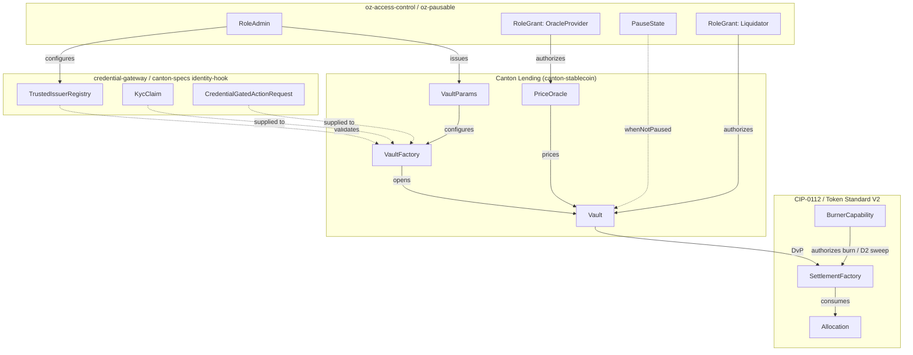
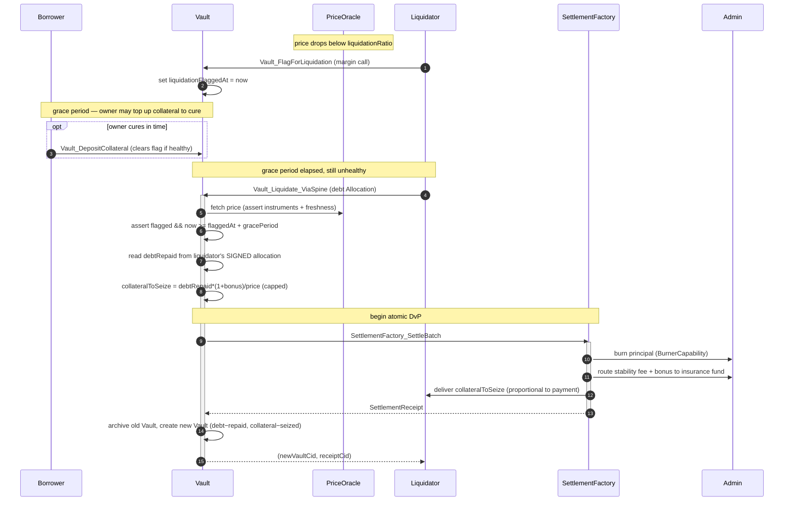

# Architectural Overview Report: Institutional Lending Protocol on Canton

Status: **reference-design report**. It describes a *reference design* grounded
in the real OpenZeppelin Canton components in this workspace; it is **not** a
claim of acceptance, conformance, audit readiness, or production readiness.

> **Source-grounding tags** (used throughout):
> `[IMPLEMENTED]` real code in the M1 library base ([`canton-specs`](https://github.com/OpenZeppelin/canton-specs) /
> [`canton-contracts`](https://github.com/OpenZeppelin/canton-contracts)) · `[EVIDENCE]` real code in an evidence repo
> ([`canton-token-template`](https://github.com/OpenZeppelin/canton-token-template), [`canton-stablecoin`](https://github.com/OpenZeppelin/canton-stablecoin)), not
> the M1 surface · `[UPSTREAM]` Splice / CIP reference, not vendored here ·
> `[FUTURE]` proposed RI-level design, not built in M1 scope.

> **Design priority order** governs every interface and snippet, in this exact
> order: **1) Security → 2) Simplicity → 3) Readability → 4) Auditability.**
> Security leads and governs the design: where security and readability conflict,
> security wins. Liquidation seizure is bound on-ledger to the liquidator's signed
> payment (§4.4) rather than the terser "seize the whole vault"; the oracle is
> committee-attested rather than single-admin (§3); and stablecoin minting is
> reachable only through a solvency-coupled path (§3).

> **Scope.** This is the architecture documentation for a vault-based
> institutional lending reference design targeting **CIP-0112 / Token Standard
> V2**; settlement builds only on V2 abstractions. Companion working code, demo
> front-end, and threat model are out of scope for this document.

---

## 1. Product Definition

This Reference Implementation (RI) is a fixed-rate, **open-term** (no fixed
maturity date), overcollateralized, permissioned lending protocol designed for
the Canton Network. It is a blueprint for regulated DeFi lending workflows built
around the **Vault** — an isolated collateralized debt position (CDP) mapped onto
Canton's privacy and settlement primitives. "Fixed-rate" means the
`stabilityFeeRate` is **immutable for the life of a position** (no
utilization-based rate curve); it does **not** mean the loan has a fixed term.
Grounded in the real `canton-stablecoin` `Vault` `[EVIDENCE]`, a position stays
open until the owner repays and withdraws (`Vault_Close`) or is liquidated —
there is no maturity/expiry field or logic in the `Vault` template.

The architecture adapts the `canton-stablecoin` codebase `[EVIDENCE]` and wires
it onto the **CIP-0112 / Token Standard V2 settlement spine** `[IMPLEMENTED]`
(`OpenZeppelin.Experimental.Settlement.Cip112`). It embeds credential gating via
the in-repo [`credential-gateway`](../../experiments/credential-gateway/daml/OpenZeppelin/Experimental/Credential/Gateway.daml) experiment `[IMPLEMENTED]` (experimental) and capability-based access control via
[`oz-access-control`](../../access-control/daml/OpenZeppelin/AccessControl.daml) `[IMPLEMENTED]`, combining DeFi composability with
institutional compliance prerequisites. The target utility is tokenized treasury
operations, collateral mobility, and stablecoin issuance for institutional
actors who require deterministic outcomes with operational privacy.

### Educational Framing: Contract-per-Vault vs. Share-Accounting

Canton's structural paradigm diverges sharply from Ethereum's ERC-4626. Under
ERC-4626, a single globally visible contract manages pooled liquidity, debt
shares, and dynamic interest accrual for all participants — a monolithic state
that broadcasts every participant's collateral balance and liquidation
threshold publicly.

Canton operates on a UTXO-like model driven by Daml. The **vault-as-contract**
model deploys a discrete, isolated `Vault` contract for each borrower-issuer
relationship. This enforces Canton's per-party-projection privacy: a borrower's
collateral, debt, and liquidation threshold are concealed from the broader
network — observable only to the borrower, the vault issuer, and any regulatory
nodes explicitly placed in the contract's observer set. Replacing dynamic,
algorithmic rate curves with a **fixed, immutable `stabilityFeeRate`** (locked
for the life of the position, though the position itself is open-term) radically
simplifies auditability and yields a predictable primitive that is verifiable by
formal methods, avoiding the exploit vectors of utilization-based rate curves.

This is a deliberate departure from the ERC-4626 tokenized-vault lineage: a
share-accounting vault — one contract tracking a pooled underlying-to-share exchange rate, updated
by a `UpdateSharePrice`-style choice — is an EVM-shaped pattern, not a
Canton-idiomatic one, and it would broadcast pooled positions. The reference
design is also explicitly **keyless**: there is no `(operator, vaultId)`-keyed
`VaultState` / `VaultConfig` singleton resolved by `fetchByKey`. Daml-LF 2.1 has
no contract keys; configuration (`VaultParams`) and state (`Vault`) are separate
*contracts* referenced by ContractId, and every state change is
archive-and-recreate. Routing the protocol through pooled shares or contract-key
lookups would break both the per-borrower privacy model and the keyless
settlement semantics the spine depends on.

### Scope Definition

The bias favors simplicity, modular extensibility, and a demonstrably correct
core over feature complexity.

| Capability Domain | IN SCOPE (Reference design) | OUT OF SCOPE (Excluded) |
|---|---|---|
| Interest Model | Fixed, immutable `stabilityFeeRate` in `VaultParams`; open-term positions (no maturity). Accrual **compounds discretely** across operations (§3). | Dynamic / variable / algorithmic rates, utilization rate curves, floating-rate oracles, fixed maturity/term dates. |
| Collateralization | Overcollateralized borrowing against on-ledger assets; collateral **transferred into vault custody** (not minted/burned), so **institution-supplied / third-party-issued collateral** is supported (§3). | Undercollateralized loans, flash loans, recursive leverage, rehypothecation. |
| Liquidation | `Vault_Liquidate_ViaSpine` on undercollateralization, after a **margin-call grace period** (§3). **Partial, payment-proportional** seizure: collateral seized is bound on-ledger to the stablecoin the liquidator actually repays (§4.4). | Market-driven bidding-war auctions; whole-vault forced seizure regardless of payment (the `canton-stablecoin` `Vault_Liquidate` behaviour the RI corrects). |
| Settlement | Atomic DvP **only** via `SettlementFactory_SettleBatch`. | Direct un-batched `Allocation_Settle` for co-settlement. |
| Pricing | `PriceOracle` mapping a single collateral asset to a named `stablecoinInstrumentId`, with staleness + deviation guards and a **committee-attested** update path (§3, §4.2). | Multi-asset dynamic oracles, external off-chain TWAP aggregators. |
| Fees | Stability fee + liquidation bonus **routed to a protocol treasury / insurance fund** (not burned); only the backing principal is burned on repay (§3). | Per-position LP reward streams; algorithmic fee markets. |
| Identity & Compliance | D1 Shape B (signed node attestation) using `KycClaim` + `TrustedIssuerRegistry`; credential gating via `credential-gateway`, **re-checked on every value-moving operation** (§3), not only at open. | Cross-domain identity aggregation (ERC-3643, ONCHAINID, Chainlink CCID) — deferred, SCU-forward-compatible only. |
| Authority & Access | Capability-based (`oz-access-control`) for mint/burn/seizure/handoff; **oracle updates committee-attested** so no single admin can move the price. Full on-ledger multi-sig is a **named M3 extension**. | On-ledger multi-sig / DAO execution. |

### Target Users

Institutional asset managers, tokenized-fund issuers, and regulated stablecoin
operators that need high-value collateralized transactions, robust risk
parameters, and integration with compliance registries over decentralized,
resilient rails — without public data leakage.

---

## 2. Architecture Overview

The protocol decomposes into modular Daml templates mapped to life-cycle stages,
with strict role-based access control and a clean separation across collateral
custody, debt issuance, economic parameterization, and liquidation.

### System Components and Library Integration

| Component | Library Origin | Responsibility | Tag |
|---|---|---|---|
| `VaultParams` | `canton-stablecoin` | Immutable risk config: `minCollateralRatio`, `liquidationRatio`, `liquidationBonus`, fixed `stabilityFeeRate`. | `[EVIDENCE]` |
| `VaultFactory` | `canton-stablecoin` | Vault creation entry point (`VaultFactory_OpenVault`); the RI layers an initial compliance check before opening. | `[EVIDENCE]` |
| `Vault` | `canton-stablecoin` | Stateful CDP: `collateralAmount`, `debtAmount`, `params`, `lastAccrualTime`; choices `Vault_DepositCollateral`, `Vault_WithdrawCollateral`, `Vault_MintStablecoin`, `Vault_BurnStablecoin`, `Vault_Liquidate` (RI adapts → `Vault_FlagForLiquidation` + `Vault_Liquidate_ViaSpine`, §4.4), `Vault_Close`; helpers `accrueDebt`, `collateralRatio`. | `[EVIDENCE]` |
| `PriceOracle` | `canton-stablecoin` | Trusted feed: `collateralInstrumentId`, `price`, `updatedAt`, `observers`; updated via `PriceOracle_UpdatePrice`. | `[EVIDENCE]` |
| [`SettlementFactory`](../../experiments/cip112-settlement/daml/OpenZeppelin/Experimental/Settlement/Cip112.daml#L185) | `OpenZeppelin.Experimental.Settlement.Cip112` | Atomic multi-leg settlement: [`SettlementFactory_CreateAllocationRequest`](../../experiments/cip112-settlement/daml/OpenZeppelin/Experimental/Settlement/Cip112.daml#L193), [`SettlementFactory_CreateAllocationInstruction`](../../experiments/cip112-settlement/daml/OpenZeppelin/Experimental/Settlement/Cip112.daml#L216), [`SettlementFactory_SettleBatch`](../../experiments/cip112-settlement/daml/OpenZeppelin/Experimental/Settlement/Cip112.daml#L237). | `[IMPLEMENTED]` |
| Role management | `oz-access-control` | [`RoleGrant`](../../access-control/daml/OpenZeppelin/AccessControl.daml), [`RoleAdmin`](../../access-control/daml/OpenZeppelin/AccessControl.daml), [`requireRole`](../../access-control/daml/OpenZeppelin/AccessControl.daml); `roleId : MyRole -> Text` closed-sum wrapper prevents string-matching role collisions. | `[IMPLEMENTED]` |
| Admin flow | `oz-ownable` / `oz-pausable` | [`Ownership`](../../ownable/daml/OpenZeppelin/Ownable.daml)/[`OwnershipOffer`](../../ownable/daml/OpenZeppelin/Ownable.daml) for handoff; [`PauseState`](../../pausable/daml/OpenZeppelin/Pausable.daml)/[`whenNotPaused`](../../pausable/daml/OpenZeppelin/Pausable.daml) kill-switch. | `[IMPLEMENTED]` |
| Credentials | [`credential-gateway`](../../experiments/credential-gateway/daml/OpenZeppelin/Experimental/Credential/Gateway.daml) | `CredentialGatedActionRequest`, `MockVerificationResult`, `MockVerifierAuthorization`, `CredentialRevocationStatus` for KYC gating. | `[IMPLEMENTED]` (experimental) |
| Typed D3 identity | `canton-specs` identity-hook Shape-B | `KycClaim`, `TrustedIssuerRegistry` — the typed D3 identity shape (from the identity-hook Shape-B experiment, not `credential-gateway`), layered via SCU. | `[IMPLEMENTED]` (experimental) |

### Party and Role Model

Data visibility is bounded by contract participation (signatory/observer).

- **Admin / Issuer** — primary underwriter of the **stablecoin (debt) token**.
  Assigned via `RoleAdmin`; holds the `BurnerCapability` and configures the
  `TrustedIssuerRegistry`. The admin's mint/burn authority is scoped to the
  **stablecoin instrument only** — never the collateral (see §3, "Collateral
  is custodied, not minted"). Its mint authority is reachable *only* through
  `Vault_MintStablecoin`, which couples issuance atomically to a solvency-checked
  debt increment, so the admin cannot issue unbacked stablecoin (§3, "Mint is
  coupled to debt").
- **Borrower** — institutional entity locking collateral. Must present a valid
  `MockVerificationResult` derived from a `KycClaim` to interact with the
  `VaultFactory`, and remains subject to the compliance re-check on every
  subsequent value-moving operation (§3). Visibility limited to their own
  `Vault`s and public config.
- **Liquidator** — specialized role granted via `oz-access-control`. Runs
  off-ledger monitoring of `PriceOracle` and vault solvency; authorized to
  exercise `Vault_Liquidate_ViaSpine` **only after the margin-call grace period
  has elapsed** on a flagged, still-unhealthy vault (§3). Seizure is bound
  on-ledger to the stablecoin the liquidator actually repays.
- **Oracle Committee** — a set of independent attestors (mirroring the DEX
  `attestorPool`) that **co-control** `PriceOracle_UpdatePrice` alongside the
  admin (`controller admin :: oracleCommittee`). No single party — not even a
  compromised admin — can move the published price, which closes the
  "admin sets price to 0 and self-liquidates everyone" attack (§3, §7.3). Members
  are authorized via `RoleGrant` (`OracleProvider`).
- **Treasury / Insurance-fund holder** — the party that receives the routed
  stability-fee and liquidation-bonus portions (§3, "Fees are routed, not
  burned"); the accumulated fund is the first absorber of recognized bad debt.

### Trust and Topology

The topology separates public market data from private positions. `PriceOracle`
and `VaultParams` are highly visible (signatory `admin`, broad observer set), so
participants can independently verify the governing parameters. The `Vault`
minimizes its observer set — `admin`, the specific `borrower`, and designated
regulatory nodes only. Because Canton applies transaction execution at the
hosting participant node, compliance checks run locally, fail-closed, on every
settlement leg before global finalization — no external API calls, no caching.

M1 uses **single-admin capability authority** for stablecoin mint/burn/seizure,
but the price path is deliberately **not** single-admin: `PriceOracle_UpdatePrice`
is committee-co-controlled (above), so the one component whose compromise would
let the admin steal collateral (the price) requires independent consent. The
architecture anticipates broader **Multi-Party Attestation** as a named M3 extension: a
vault issuer that is *multiply attested*, where several independent attestors
hold distinct `MockVerifierAuthorization` roles and a vault is compliant only
when the required attestors' credentials overlap — decentralizing the trust
anchor without an on-ledger multi-sig execution bottleneck.

---

## 3. How We Implement It

The CDP model is expressed as a sequence of atomic Canton transactions under
Daml-LF 2.1 keyless semantics: every state change archives the prior contract
and recreates an updated instance with a new Contract ID.

### The Settlement-Spine Flow

All value transfers to/from the `Vault` route through
[`SettlementFactory_SettleBatch`](../../experiments/cip112-settlement/daml/OpenZeppelin/Experimental/Settlement/Cip112.daml#L237) for atomic DvP. The direct [`Allocation_Settle`](../../experiments/cip112-settlement/daml/OpenZeppelin/Experimental/Settlement/Cip112.daml#L474)
path is not used for DvP — it proves authorization of a single leg, not atomic
co-settlement of interdependent legs.

1. **Vault origination + collateral deposit.** The borrower creates an
   [`AllocationInstruction`](../../experiments/cip112-settlement/daml/OpenZeppelin/Experimental/Settlement/Cip112.daml#L356) (via [`SettlementFactory_CreateAllocationInstruction`](../../experiments/cip112-settlement/daml/OpenZeppelin/Experimental/Settlement/Cip112.daml#L216),
   accepted to lock the collateral into an [`Allocation`](../../experiments/cip112-settlement/daml/OpenZeppelin/Experimental/Settlement/Cip112.daml#L454)) and presents a
   `CredentialGatedActionRequest` + `MockVerificationResult` to the
   `VaultFactory`. On successful compliance verification, `VaultFactory_OpenVault`
   batch-settles the collateral **into a vault custody account (a transfer, not a
   burn)** and instantiates the `Vault` with a verified `collateralAmount`.
   (Subsequent top-ups use `Vault_DepositCollateral`; reductions use
   `Vault_WithdrawCollateral`, both solvency-checked and both re-running the
   compliance check.)
2. **Borrow (debt disbursement).** The borrower exercises `Vault_MintStablecoin`.
   The vault runs a deterministic solvency check — requested debt plus existing
   debt must keep `collateralRatio` at or above `VaultParams.minCollateralRatio`
   priced by `PriceOracle`. On success the admin mints stablecoin holdings
   delivered to the borrower via a `SettleBatch` leg *in the same transaction that
   increments* `debtAmount` (mint is coupled to debt, below); the old `Vault` is
   archived and recreated with the updated `debtAmount`.
3. **Repay.** The borrower allocates stablecoin and exercises
   `Vault_BurnStablecoin`; a batch settlement **burns only the backing principal**
   via [`BurnerCapability`](../../experiments/cip112-settlement/daml/OpenZeppelin/Experimental/Settlement/Cip112.daml#L98) and **routes the accrued stability-fee portion to the
   treasury / insurance fund** (fees are routed, not burned, below), reducing
   `debtAmount`. Collateral is released via `Vault_WithdrawCollateral` when the
   loan closes (`Vault_Close`).
4. **Liquidation (after a margin call).** If `PriceOracle` shows the vault below
   `liquidationRatio`, the position is first **flagged** (`Vault_FlagForLiquidation`),
   opening a deterministic grace period in which the owner may top up collateral
   to cure (margin call, below). Only once the grace period has elapsed and the
   vault is still unhealthy does an authorized liquidator exercise
   `Vault_Liquidate_ViaSpine`, providing an `Allocation` of stablecoin. `SettleBatch`
   atomically burns the liquidator's principal, routes the `liquidationBonus` to the
   insurance fund, and sweeps **collateral proportional to the amount actually
   repaid** (a partial liquidation restoring health, not a whole-vault seizure —
   §4.4). The residual collateral is recreated in a new `Vault` for the borrower.

### Interest Accrual and Bad-Debt Recognition (grounded in `Vault.daml` `[EVIDENCE]`)

These two mechanics are concrete in the `canton-stablecoin` `Vault` the RI
adapts, so they are stated here as decided behavior rather than open design:

- **Interest accrual compounds discretely, with an explicit per-step formula.**
  `accrueDebt` computes `newDebt = oldDebt * (1 + stabilityFeeRate * elapsedYears)`,
  where `elapsedYears` is derived from `now - lastAccrualTime`. A *single*
  application over one elapsed window is affine in time, but `oldDebt` is the
  **running, already-accrued debt** (the current `Vault`'s
  `debtAmount`, not the original principal) and `lastAccrualTime` is **reset to
  `now`** on every recreation. Accrual runs on every state-changing choice
  (`Vault_DepositCollateral`, `Vault_WithdrawCollateral`, `Vault_MintStablecoin`,
  `Vault_BurnStablecoin`, `Vault_Liquidate_ViaSpine`, `Vault_Close`) before the
  solvency check, so across two windows `t₁` then `t₂` the debt grows by
  `P·(1 + r·t₁)·(1 + r·t₂)` — which **compounds** (it exceeds the true simple-interest
  `P·(1 + r·(t₁+t₂))` by `P·r²·t₁·t₂`). So the accurate characterization is
  **discrete compounding at every interaction**, not simple interest. (The real
  `canton-stablecoin` `accrueDebt` docstring calls itself "linear"; that comment is
  inconsistent with the code's behaviour, and this RI states the behaviour the code
  actually exhibits.) Whether to keep discrete compounding, switch to **true simple
  interest** accrued off the original principal, or offer a **continuously-compounding**
  variant — each with explicit rounding bounds so accrual is reproducible and
  formally checkable — is the named open question (§9), not a silent default.
- **Bad debt is recognized, quantified, and absorbed by the insurance fund.**
  The RI's liquidation (`Vault_Liquidate_ViaSpine`, §4.4) seizes collateral
  **proportional to the stablecoin the liquidator actually repays** —
  `collateralToSeize = min(collateralAmount, (debtRepaid · (1 + liquidationBonus)) / oracle.price)`
  where `debtRepaid` is read from the liquidator's *signed* allocation, not from
  the vault's full accrued debt. This is a deliberate departure from the real
  `canton-stablecoin` `Vault_Liquidate`, whose under-water branch (`collateralToSeize
  >= collateralAmount`) hands the liquidator **all** collateral regardless of how
  little they pay, booking the gap as `badDebt = accruedDebt - min(liquidatorPayment,
  accruedDebt)` — a critical vulnerability (a 1-unit payment could seize the whole
  vault). By binding seizure to payment on-ledger, the RI removes that vector: a
  liquidator can never take more collateral than their payment (plus bonus) buys.
  Any genuine shortfall on a deeply under-water position is still quantified as
  `badDebt` in the returned `VaultLiquidationResult`, and its **disposition** is
  the protocol **insurance fund** capitalized from routed fees (below); a
  socialized-loss / admin-write-off fallback is the residual open decision (§9).

### Collateral is Custodied, Not Minted (institution-supplied collateral)

A subtlety the RI corrects from the raw `canton-stablecoin` `Vault`:
`Vault_DepositCollateral` there **archives (burns)** the incoming collateral
holdings and `Vault_WithdrawCollateral` **creates (mints)** fresh ones — and
because `SimpleHolding` is `signatory admin, owner`, minting collateral requires
the vault admin to be the **issuer of the collateral instrument** (the real
`VaultFactory` even `ensure`s `collateralInstrumentId.admin == admin`). That
makes institution-supplied collateral — collateral issued by some *other* party
(a custodian bank, a tokenized-treasury issuer) — impossible.

The RI routes collateral through the settlement spine instead: a deposit is a
`SettleBatch` **transfer** of the borrower's collateral holding into a vault
custody account, and a withdrawal transfers it back. No collateral is minted or
burned, so **the vault admin needs no issuing authority over the collateral
instrument** — only over the stablecoin (debt) token. Institution-supplied,
third-party-issued collateral is therefore first-class. The admin's minting power
is confined to the stablecoin, which is exactly what the next two properties lean
on.

### Mint is Coupled to Debt (no unbacked issuance)

Stablecoin can be created **only** inside `Vault_MintStablecoin`, which in one
atomic transaction (a) runs the solvency check, (b) recreates the `Vault` with
`debtAmount = accruedDebt + mintAmount`, and (c) mints *exactly* `mintAmount` of
stablecoin to the borrower via a `SettleBatch` leg. There is no standalone
admin-mint choice, so the admin cannot conjure stablecoin that is not matched by
recorded, solvency-checked vault debt. Symmetrically, `Vault_BurnStablecoin`
reduces `debtAmount` by exactly the principal burned. This is the on-ledger
realisation of the **debt-conservation invariant** (§7.1): every stablecoin unit
in circulation is backed 1:1 by outstanding vault debt — the defining property of
a collateral-backed stablecoin, and the admin cannot mint at will.

### Fees are Routed, Not Burned (protocol revenue → insurance fund)

On repay/close/liquidation the debt being settled is `principal + accrued
stability fee`, and a liquidation additionally charges the `liquidationBonus`.
Burning the **entire** payment (as raw `canton-stablecoin` does) destroys the fee
— economically the same as giving it to no one. The RI instead **splits** the
settled stablecoin on-ledger: the portion equal to the backing principal is
burned via `BurnerCapability` (removing the backing from supply, preserving the
1:1 invariant), while the **stability-fee and liquidation-bonus portions are
transferred to a protocol treasury / insurance-fund account** rather than burned.
Those fees are protocol/institution revenue — the on-ledger analogue of interest
paid to the lender — and, per the bad-debt design above, the accumulated
insurance fund is the first absorber of any liquidation shortfall, lowering
net bad debt.

### Margin Call: a Grace Period Before Liquidation

On a public chain a top-up racing a liquidation is decided by gas/ordering luck;
Canton has no public mempool to front-run, so the RI makes the borrower's cure
window **explicit and deterministic** rather than leaving it to submission
timing. Liquidation is two-phase:

1. **Flag.** When `collateralRatio < liquidationRatio`, anyone monitoring
   (typically a keeper) may exercise `Vault_FlagForLiquidation`, which records
   `liquidationFlaggedAt` and derives a `gracePeriodEnd = now + gracePeriod`
   (`gracePeriod` a protocol-set `VaultParams` field). This is the margin call.
2. **Cure or liquidate.** During the grace window the owner may
   `Vault_DepositCollateral` (or repay) to restore the ratio; a successful cure
   clears the flag. `Vault_Liquidate_ViaSpine` `assertMsg`s that the vault is
   flagged **and** `now >= gracePeriodEnd` **and** still unhealthy — so a
   liquidator cannot pre-empt the owner's cure window, and an owner who does
   nothing is liquidated deterministically once it closes.

This mirrors institutional margin-call practice and removes the "did my top-up or
the liquidation land first?" race. (The two new choices are additive, SCU-safe
extensions over the `canton-stablecoin` base.)

### Compliance is Re-checked on Every Operation (not only at open)

The initial `VaultFactory_OpenVault` KYC gate is necessary but not sufficient: a
borrower can lose good standing (credential revoked, jurisdiction change) after
opening. Because every value-moving `Vault` operation settles through
`SettleBatch`, the same D1 path (`D1ComplianceHook` / Shape-B attestation, §D1
below) is engaged **per leg, fail-closed, with no caching**, and each leg checks
the compliance of the party *moving value on that leg*. So the **borrower's**
credential is re-evaluated on each `Vault_DepositCollateral`,
`Vault_WithdrawCollateral`, and `Vault_MintStablecoin`, and a
`CredentialRevocationStatus` of *revoked* blocks the borrower's *new* borrows,
top-ups, and withdrawals immediately. Deliberately, the borrower's continued
compliance is **not** a precondition for winding the position down: on
`Vault_BurnStablecoin`/`Vault_Close` the borrower is repaying (reducing risk),
and on the liquidation legs it is the *liquidator's* compliance that is checked,
not the borrower's — so a now-non-compliant position can always be repaid or
liquidated, never trapped. (The real `canton-stablecoin` `Vault` has no
compliance check at all; this per-operation posture is an RI-level addition.)

### Oracle Handling: Staleness Guard + Circuit Breaker

A single trusted `PriceOracle` plus a single liquidator is the largest live
attack surface — the real `canton-stablecoin` `PriceOracle` is single-admin,
carries no staleness/deviation/pause logic, and does not even name the instrument
its price is quoted in — so the RI hardens the price path in the design (not
deferred):

- **Named quote instrument.** `PriceOracle` carries a `stablecoinInstrumentId`
  alongside `collateralInstrumentId`, so `price` is unambiguously "units of *this*
  stablecoin per unit of *this* collateral". Consumers assert both ids match the
  vault's, closing the ambiguity where a feed quoted in a different unit could be
  applied to the wrong debt token.
- **Committee-attested updates (no single-writer price).** `PriceOracle_UpdatePrice`
  is `controller admin :: oracleCommittee` — mirroring the DEX `attestorPool`, the
  **full committee (all-of-M)** must co-sign each price. This is the primary
  defence against the "compromised admin sets `price → ε` and liquidates
  everyone" attack: a lone admin can no longer move the price, so it can no longer
  manufacture liquidations. Members are `RoleGrant`-authorized (`OracleProvider`).
  (An N-of-M *threshold* — needed so one offline attestor cannot stall updates —
  is the open question in §9, exactly as for the DEX attestor pool.)
- **Max-staleness guard (consumes `updatedAt`).** `PriceOracle` carries an
  `updatedAt : Time`. Every price-dependent choice (`Vault_Mint*`,
  `Vault_Withdraw*`, `Vault_FlagForLiquidation`, `Vault_Liquidate_ViaSpine`)
  rejects when `now - updatedAt >
  maxStaleness` (a `VaultParams` bound), so a stalled feed cannot drive
  liquidations or fresh borrows against a dead price. (`maxStaleness` is an
  additive `[FUTURE]` `VaultParams` field; `maxDeviation` lives on the
  `PriceOracle` itself — see §4.2 — both SCU-compatible.)
- **Per-update deviation circuit breaker.** `PriceOracle_UpdatePrice` bounds the
  jump between consecutive prices against the oracle's own `maxDeviation` field
  (`|newPrice - price| / price <= maxDeviation`); an out-of-band move **aborts the
  update**, so the last in-band price stands (and the staleness guard eventually
  fires if no valid update follows). Note the abort cannot itself flip a pause —
  an aborting transaction persists nothing — so tripping the `oz-pausable`
  kill-switch on repeated breaches is a *separate* admin/keeper action, not a
  side effect of the rejected update. Together this blunts single-update oracle
  manipulation.
- **TWAP (deferred).** A time-weighted average price over a window is named as a
  follow-on hardening for manipulation resistance; the additive `Optional`
  carrier for it is an SCU extension point (§9).

### D1–D4 Attachment Strategy

- **D1 — compliance (node-applied).** The intended posture is a per-settlement,
  fail-closed check; on the M1 spine this is engaged by the optional
  `D1ComplianceHook` / typed attestation path, not mandated by the base
  `SettleBatch`. The RI selects
  **Shape B** (signed node attestation) over Shape A (off-ledger gate): a
  `KycClaim` from a `TrustedIssuerRegistry` is submitted as a native contract
  payload, so the engine enforces compliance deterministically at the
  participant node with no external calls. A `CredentialRevocationStatus` of
  revoked triggers fail-closed rejection via the optional [`D1ComplianceHook`](../../experiments/cip112-settlement/daml/OpenZeppelin/Experimental/Settlement/Cip112.daml#L41).
  *(Open, non-blocking: whether the contract stays oblivious or verifies the
  attestation on-ledger at exercise time — the node-applied signed attestation
  is `[FUTURE]`; the hook today is a reference field only.)*
- **D2 — seizure (lock-and-sweep).** Under legal mandate the admin sweeps
  collateral to an admin-**preset** `custodianDestination` (carried in the
  spine's [`D2SeizureHook`](../../experiments/cip112-settlement/daml/OpenZeppelin/Experimental/Settlement/Cip112.daml#L46) config record), gated by the single-admin
  [`BurnerCapability`](../../experiments/cip112-settlement/daml/OpenZeppelin/Experimental/Settlement/Cip112.daml#L98). In-flight allocations use the real spine choices
  [`Allocation_MarkD2InFlightSeizure`](../../experiments/cip112-settlement/daml/OpenZeppelin/Experimental/Settlement/Cip112.daml#L568) → [`Allocation_SweepD2InFlightSeizure`](../../experiments/cip112-settlement/daml/OpenZeppelin/Experimental/Settlement/Cip112.daml#L577);
  locked vault collateral uses the forced-burn-to-custodian path
  (`LockedSimpleHolding_ForcedBurn` evidence). Seized assets are **never** burned
  and **never** returned to sender; ordinary transfer *failures* do return to
  sender.
- **D3 — identity.** Single-domain v1 with issuer-held KYC. Cross-domain
  (ERC-3643 / ONCHAINID / Chainlink CCID) deferred but forward-compatible via
  additive SCU.
- **D4 — authority.** Single-admin capability via [`oz-access-control`](../../access-control/daml/OpenZeppelin/AccessControl.daml)
  ([`RoleAdmin`](../../access-control/daml/OpenZeppelin/AccessControl.daml)) for pause, parameter updates, and seizure. On-ledger multi-sig is
  an M3 extension `[FUTURE]` (D4→M3).

### The SCU Extension Story

The SCU rule: never mutate an existing choice's arguments to require a new field.
Extend via appended `Optional` fields, new serializable types, and new choices.
New interfaces are likewise added by new templates/choices implementing them, not
by retroactively re-instancing the deployed `Vault` — Daml 3.x removed
**retroactive interface instances** `[UPSTREAM]` precisely because they broke
clean upgrade paths.

Example — adding a cross-chain identity hash for future regulation: the `Vault`
template gains `crossDomainIdentity : Optional Text` (read `None` by older
contracts), and a **new** choice `Vault_UpdateIdentity` records it. The existing
`Vault_MintStablecoin` / `Vault_BurnStablecoin` choices keep their type
signatures untouched, so older clients keep working — compliance is layered over
time without a network-wide breaking upgrade. This is the same additive path
proven in the `canton-specs` identity-hook upgrade spike.

---

## 4. Interfaces & Usage Examples

Interfaces are prioritized by Security, Simplicity, Readability, Auditability.
RI-level templates that adapt or extend `canton-stablecoin` are tagged
`[FUTURE]`; field/choice names match real `canton-stablecoin` source.

### 4.1 Role wrappers `[FUTURE]`

```daml
module Lending.Types where

import OpenZeppelin.AccessControl (RoleGrant)

-- Closed-sum wrapper: precise role ids, no raw-string matching.
data VaultRole = VaultAdmin | Liquidator | OracleProvider | Pauser
  deriving (Eq, Show)

roleId : VaultRole -> Text
roleId VaultAdmin     = "VAULT_ADMIN"
roleId Liquidator     = "LIQUIDATOR"
roleId OracleProvider = "ORACLE_PROVIDER"
roleId Pauser         = "PAUSER"
```

### 4.2 Configuration and pricing `[EVIDENCE]` (canton-stablecoin shapes)

```daml
-- Real canton-stablecoin shapes (grounded in Stablecoin/Vault.daml and
-- Stablecoin/Oracle.daml). VaultParams is a DATA record (embedded by value in
-- VaultFactory / Vault), NOT a template — so there is no `paramsCid` to store or
-- brick; the config travels with the contract that embeds it. Instrument ids are
-- `InstrumentId` (bound to the issuing admin), NOT `Text`.
data VaultParams = VaultParams
  with
    minCollateralRatio : Decimal   -- e.g. 1.50 (150%)
    liquidationRatio : Decimal     -- triggers liquidation-flag below this
    liquidationBonus : Decimal     -- fixed-discount penalty, e.g. 0.10
    stabilityFeeRate : Decimal     -- FIXED / immutable rate (open-term, no maturity)
    -- [FUTURE] additive (SCU-appended) risk params — NOT in the current real
    -- 4-field shape; the margin-call (§3) and liquidation (§4.4) designs reference
    -- these, protocol-set (never liquidator-supplied):
    --   maxStaleness : RelTime     -- reject a price older than this
    --   gracePeriod  : RelTime     -- margin-call cure window before liquidation
    --   closeFactor  : Decimal     -- max fraction of debt one liquidation may repay
    -- Because VaultParams is a `data` record it cannot carry its own `ensure`; the
    -- VaultFactory validates the bounds at open — in particular 0.0 < closeFactor
    -- <= 1.0 (a 0 close factor would make `debtRepaid <= closeFactor*debt` force
    -- debtRepaid <= 0 and brick liquidation) and gracePeriod >= 0.
    -- (maxDeviation lives on the PriceOracle, not here — see below.)
  deriving (Eq, Show)
  -- (collateralInstrumentId / stablecoinInstrumentId : InstrumentId live on
  --  VaultFactory and Vault; the oracle ALSO names both — see below.)

-- PriceOracle IS a real template, extended here with two RI hardenings over the
-- real 5-field shape (both [FUTURE] additive / SCU-appended):
--   * `stablecoinInstrumentId` — the real oracle names only the collateral; the
--     RI also names the quote instrument, so `price` is unambiguously "units of
--     THIS stablecoin per unit of THIS collateral" and consumers assert both.
--   * `oracleCommittee` + committee-controlled update — the real update path is
--     `controller admin` alone; the RI co-controls it with the full committee (like the DEX
--     attestorPool) so no single compromised admin can move the price (§3, §7.3).
-- The update path is *consuming* (archive-and-recreate to publish), so the cid is
-- passed to consumers at exercise time (liquidation's `oracleCid`), never stored.
template PriceOracle
  with
    admin : Party
    oracleCommittee : [Party]      -- [FUTURE] attestor set co-signing updates (all-of-M)
    collateralInstrumentId : InstrumentId
    stablecoinInstrumentId : InstrumentId  -- [FUTURE] the unit `price` is quoted in
    price : Decimal                -- units of stablecoinInstrumentId per collateral unit
    -- Circuit-breaker bound, set at creation and mutable ONLY via a separate
    -- governance choice — NOT a per-update argument, so a submitting committee
    -- cannot widen its own deviation bound (the writer-set-bound anti-pattern).
    maxDeviation : Decimal
    updatedAt : Time
    observers : [Party]            -- real field: distinct readers (NOT admin)
  where
    signatory admin, oracleCommittee
    observer observers             -- legitimate (observers /= the admin signatory)
    ensure price > 0.0 && maxDeviation > 0.0 &&
           collateralInstrumentId /= stablecoinInstrumentId

    -- Committee-attested, RoleGrant-gated, deviation-bounded price publish. The
    -- deviation bound is read from `this.maxDeviation` (trusted signed state), not
    -- supplied by the caller.
    choice PriceOracle_UpdatePrice : ContractId PriceOracle
      with
        newPrice : Decimal
      controller admin :: oracleCommittee   -- full committee co-signs; no single writer
      do
        assertMsg "price must be positive" (newPrice > 0.0)
        -- Per-update circuit breaker against `this.maxDeviation`. A breach ABORTS
        -- the update (the stale-but-safe last price stands, and staleness guards
        -- eventually fire); pausing on repeated breaches is a separate admin
        -- action, since an aborting transaction cannot also persist a pause.
        assertMsg "price deviation out of band"
          (abs (newPrice - price) / price <= maxDeviation)
        now <- getTime
        create this with price = newPrice; updatedAt = now
```

### 4.3 Vault opening with identity gating `[FUTURE]` (RI adapter over `VaultFactory_OpenVault`)

```daml
module Lending.Vault where

import OpenZeppelin.Experimental.Settlement.Cip112 (SettlementFactory)
import OpenZeppelin.Experimental.Credential.Gateway (CredentialGatedActionRequest, MockVerificationResult)
-- KycClaim / TrustedIssuerRegistry: canton-specs identity-hook Shape-B
import OpenZeppelin.Experimental.Identity.ShapeB (KycClaim, TrustedIssuerRegistry)

template LendingVaultFactory
  with
    admin : Party
    vaultFactoryCid : ContractId VaultFactory  -- real canton-stablecoin factory
  where
    signatory admin

    -- New RI choice wrapping the canton-stablecoin VaultFactory_OpenVault path.
    -- Two deliberate pointer choices, mirroring the DEX fixes:
    --  * `VaultFactory` is nonconsuming (reusable — it does NOT archive on open),
    --    so its cid is stable and safe to STORE. `VaultParams` rides inside it as
    --    an embedded `data` value, so there is no separate params cid to brick.
    --  * `TrustedIssuerRegistry` archive-and-recreates on issuer add/remove, so
    --    it is passed as a choice ARGUMENT (disclosed at exercise time), never
    --    stored — the same dangling-pointer hazard as a stored `PauseState` cid.
    nonconsuming choice LendingVaultFactory_OpenGatedVault : ContractId Vault
      with
        borrower : Party
        registryCid : ContractId TrustedIssuerRegistry  -- current registry, passed in
        complianceRequest : CredentialGatedActionRequest
        verificationResult : MockVerificationResult
        kycClaim : KycClaim
      controller borrower            -- two-step handshake: borrower co-authorizes
      do
        -- D1 Shape B: deterministic, node-applied validation (no external calls).
        assertMsg "KYC issuer not trusted" (kycClaim.declaredIssuer == admin)
        assertMsg "verification not accepted" (isAccepted verificationResult)
        -- Delegate to the real factory choice to open the Vault.
        -- exercise vaultFactoryCid VaultFactory_OpenVault with ..
        create Vault with .. -- (canton-stablecoin Vault; see 4.4)
```

### 4.4 Margin call + payment-proportional liquidation `[FUTURE]` (correcting `Vault_Liquidate` `[EVIDENCE]`)

```daml
-- canton-stablecoin Vault fields (exact): admin, owner, collateralInstrumentId,
-- stablecoinInstrumentId, collateralAmount, debtAmount, params, lastAccrualTime.
-- The RI adds THREE additive (SCU-appended) fields:
--   liquidationFlaggedAt : Optional Time  -- None until flagged; set by the flag choice
--   principalAmount      : Decimal        -- borrowed principal, tracked apart from
--                                         --   accrued fee so the fee split (§3) is
--                                         --   computable; debtAmount stays the total
--   collateralAccount    : Account        -- the CANONICAL custody account whose
--                                         --   holdings back collateralAmount; bound into
--                                         --   deposit/withdraw/liquidation so each DELTA is
--                                         --   sourced from the right account (the analogue of
--                                         --   the DEX pool's poolAccount; the absolute
--                                         --   collateralAmount == Σ holdings also needs funded
--                                         --   deposits, like the DEX seeding caveat)
-- The real `Vault_Liquidate` seizes the WHOLE vault in one shot and, in its
-- under-water branch, hands over ALL collateral regardless of how much the
-- liquidator pays (booking the gap as badDebt) — the critical vuln. The RI
-- replaces that with (1) a margin-call flag + grace period, and (2) a
-- payment-proportional liquidation whose seizure is bound on-ledger to the
-- stablecoin the liquidator actually signed for.

    -- PHASE 1 — margin call. Permissionless: anyone may flag an unhealthy vault,
    -- which starts the owner's cure clock. It does NOT move value.
    choice Vault_FlagForLiquidation : ContractId Vault
      with
        flagger : Party
        oracleCid : ContractId PriceOracle
      controller flagger
      do
        now <- getTime
        oracle <- fetch oracleCid
        assertMsg "oracle instrument mismatch"
          (oracle.collateralInstrumentId == collateralInstrumentId &&
           oracle.stablecoinInstrumentId == stablecoinInstrumentId)
        assertMsg "oracle stale" (subTime now oracle.updatedAt <= params.maxStaleness)
        let accruedDebt = accrueDebt debtAmount lastAccrualTime now params.stabilityFeeRate
        assertMsg "vault is healthy — cannot flag"
          (collateralRatio collateralAmount accruedDebt oracle.price < params.liquidationRatio)
        -- Start the grace window; the owner may cure via Vault_DepositCollateral,
        -- which clears the flag when the ratio is restored.
        create this with
          debtAmount = accruedDebt; lastAccrualTime = now
          liquidationFlaggedAt = Some now

    -- PHASE 2 — liquidation, only after the grace period, and only proportional
    -- to what the liquidator pays.
    choice Vault_Liquidate_ViaSpine : (ContractId Vault, ContractId SettlementReceipt)
      with
        liquidator : Party
        oracleCid : ContractId PriceOracle             -- current oracle, passed in (mutable)
        settlementFactoryCid : ContractId SettlementFactory
        debtAllocationId : ContractId Allocation       -- liquidator's committed stablecoin
        vaultCollateralAllocationId : ContractId Allocation  -- VAULT's committed collateral (funds the seize leg);
                                                             -- committed by admin+owner (the collateral custody
                                                             -- account's parties) via the standard spine lifecycle
                                                             -- when the vault is flagged/serviced, not by the liquidator
        protocolAllocationId : ContractId Allocation   -- protocol/treasury's committed RECEIVER side for the
                                                       -- payment leg — needed so SettleBatch's both-sided check
                                                       -- sees the admin-side of the liquidator→protocol payment
                                                       -- (three parties: liquidator, protocol, vault custody)
        settlement : SettlementInfo
        transferLegs : [TransferLeg]                   -- exact legs (debt in / collateral out / fee out)
      controller liquidator
      do
        now <- getTime
        oracle <- fetch oracleCid
        assertMsg "oracle instrument mismatch"
          (oracle.collateralInstrumentId == collateralInstrumentId &&
           oracle.stablecoinInstrumentId == stablecoinInstrumentId)
        -- Oracle freshness: `maxStaleness` is a protocol-set VaultParams field, NOT
        -- a liquidator-supplied arg — a liquidator must not widen it to liquidate
        -- against a dead price.
        assertMsg "oracle stale" (subTime now oracle.updatedAt <= params.maxStaleness)

        -- MARGIN CALL GATE: the vault must have been flagged AND the grace period
        -- must have elapsed. This removes the top-up-vs-liquidation race: the owner
        -- owns the whole [flaggedAt, flaggedAt + gracePeriod] window to cure.
        case liquidationFlaggedAt of
          None -> abort "not flagged — call Vault_FlagForLiquidation first (margin call)"
          Some flaggedAt ->
            assertMsg "grace period has not elapsed"
              (subTime now flaggedAt >= params.gracePeriod)

        -- Accrue, then confirm STILL unhealthy (the owner may have partially cured).
        let accruedDebt = accrueDebt debtAmount lastAccrualTime now params.stabilityFeeRate
        assertMsg "vault is solvent"
          (collateralRatio collateralAmount accruedDebt oracle.price < params.liquidationRatio)

        -- ON-LEDGER BINDING — PAY SIDE (root-cause fix for "pay 1 unit, seize
        -- everything"): read how much stablecoin the liquidator actually SIGNED to
        -- pay, and drive seizure off THAT — never off the vault's full accrued debt.
        liqAlloc <- fetch debtAllocationId
        let liquidatorAccount = liqAlloc.allocation.authorizer
        paySide <- case filter (\s -> s.side == SenderSide) liqAlloc.allocation.transferLegSides of
          [s] | s.instrumentId == stablecoinInstrumentId.id -> pure s
          _ -> abort "liquidator must sign exactly one stablecoin payment (sender) side"
        let debtRepaid = paySide.amount
        assertMsg "payment must be positive" (debtRepaid > 0.0)
        -- PARTIAL / PROPORTIONAL liquidation: one call may repay at most a
        -- `closeFactor` slice of the debt (enough to restore health, not the whole
        -- position), and never more than the outstanding debt. (The VaultFactory
        -- validates `0.0 < closeFactor <= 1.0` at open, so this cap can never
        -- brick to 0.)
        assertMsg "repayment exceeds close-factor cap"
          (debtRepaid <= min accruedDebt (params.closeFactor * accruedDebt))
        -- Collateral seized is EXACTLY what the payment (plus bonus) buys, capped by
        -- what the vault holds. A tiny payment now seizes only a tiny slice.
        let collateralToSeize =
              min collateralAmount ((debtRepaid * (1.0 + params.liquidationBonus)) / oracle.price)

        -- ON-LEDGER BINDING — SEIZE SIDE (the other half; without this the seize
        -- amount would be operator-asserted via `transferLegs`, re-opening the very
        -- gap). Read the VAULT's own committed collateral allocation and require its
        -- signed sender side to be EXACTLY `collateralToSeize` of the collateral
        -- instrument, then pin `transferLegs` to exactly the two bound legs — mirror
        -- of the DEX `Pool_Swap` fix (§01 §4.1).
        vaultCollAlloc <- fetch vaultCollateralAllocationId
        let vaultCollateralAccount = vaultCollAlloc.allocation.authorizer
        collSide <- case filter (\s -> s.side == SenderSide) vaultCollAlloc.allocation.transferLegSides of
          [s] | s.instrumentId == collateralInstrumentId.id -> pure s
          _ -> abort "vault must sign exactly one collateral (sender) side"
        -- ACCOUNT-IDENTITY BINDING (the DEX poolAccount analogue): the collateral
        -- MUST be sourced from THIS vault's canonical custody account, else the
        -- recreate could draw down `collateralAmount` while some other account's
        -- holdings actually moved — decoupling the vault's accounting from reality.
        assertMsg "collateral not sourced from this vault's custody account"
          (vaultCollateralAccount == collateralAccount)
        assertMsg "seized collateral != collateralToSeize" (collSide.amount == collateralToSeize)
        assertMsg "collateral must be delivered to the paying liquidator"
          (collSide.otherside == liquidatorAccount)
        -- The payment must be delivered to the protocol account (the issuer/admin),
        -- so it cannot be redirected; binding the receiver mirrors the pool-account
        -- identity binding in the DEX. That protocol account must ALSO be the
        -- authorizer of `protocolAllocationId`, so its ReceiverSide of the payment
        -- leg is present in the batch (both-sidedness holds across all three
        -- parties: liquidator, protocol, vault custody).
        protocolAlloc <- fetch protocolAllocationId
        assertMsg "payment must be delivered to the protocol (admin) account"
          (paySide.otherside.owner == Some admin && protocolAlloc.allocation.authorizer == paySide.otherside)
        let expectedPayLeg = TransferLeg with
              transferLegId = paySide.transferLegId
              sender = liquidatorAccount; receiver = paySide.otherside
              amount = debtRepaid; instrumentId = stablecoinInstrumentId.id; meta = paySide.meta
            expectedSeizeLeg = TransferLeg with
              transferLegId = collSide.transferLegId
              sender = vaultCollateralAccount; receiver = liquidatorAccount
              amount = collateralToSeize; instrumentId = collateralInstrumentId.id; meta = collSide.meta
        assertMsg "settled legs != the bound (payment, seize) legs"
          (transferLegs == [expectedPayLeg, expectedSeizeLeg])

        -- FEE SPLIT (see §3 "Fees are routed, not burned"). The debt commingles
        -- principal and accrued fee; the RI tracks `principalAmount` (an additive
        -- field, below) so the split is computable. Of the `debtRepaid` received at
        -- the protocol account, the principal fraction is burned via
        -- `BurnerCapability` (removing backing from supply, preserving the 1:1
        -- invariant) and the fee fraction is retained as insurance-fund capital.
        let principalRepaid =
              if accruedDebt == 0.0 then 0.0 else debtRepaid * (principalAmount / accruedDebt)

        -- Atomic DvP over the three bound allocations (liquidator payment side,
        -- protocol receiver side, vault collateral side) — every leg now has BOTH
        -- signed sides in the batch. `transferLegs` is already pinned to the two
        -- legs whose amounts are `debtRepaid` / `collateralToSeize` above, so
        -- neither over-seizure nor under-payment can settle.
        receipts <- exercise settlementFactoryCid SettlementFactory_SettleBatch with
          settlement
          transferLegs
          allocationCids = [debtAllocationId, protocolAllocationId, vaultCollateralAllocationId]
          actors = settlement.executors
          d1ComplianceRef = None

        -- Recreate the (partially) liquidated vault: debt, principal, and collateral
        -- each fall by the settled amounts, so the `collateralAmount` DELTA matches
        -- the collateral that actually moved from `collateralAccount`. If the
        -- position is now healthy the flag clears; if still
        -- under-water the ORIGINAL flag time is preserved (NOT reset to `now`), so
        -- the vault — already past grace — is immediately re-liquidatable rather
        -- than granted a fresh grace window each partial pass.
        let remainingDebt = accruedDebt - debtRepaid
            remainingCollateral = collateralAmount - collateralToSeize
            stillUnhealthy =
              collateralRatio remainingCollateral remainingDebt oracle.price < params.liquidationRatio
        receipt <- case receipts of   -- (Daml's Prelude has no `head`)
          r :: _ -> pure r            -- receipts align with allocationCids order
          [] -> abort "SettleBatch returned no receipt"
        newVault <- create this with
          collateralAmount = remainingCollateral
          debtAmount = remainingDebt
          principalAmount = principalAmount - principalRepaid
          lastAccrualTime = now
          liquidationFlaggedAt = if stillUnhealthy then liquidationFlaggedAt else None
        return (newVault, receipt)

    -- D2 lock-and-sweep: NO bespoke "D2SeizureHook_Sweep" template — D2SeizureHook
    -- is a spine config record (seizureCaseRef, custodianDestination,
    -- inFlightHandlingStatus). Seizure is gated by BurnerCapability and routes to
    -- the preset custodianDestination; never burn, never return-to-sender.
```

---

## 5. Diagrams

Mermaid below maps to scenarios for the proposed `canton-settlement-explorer` `[FUTURE]`
(presets: Batch DvP, Multi-leg Settlement).

### 5.1 Interface and Component Diagram



### 5.2 Flow-of-Funds and Settlement Diagram (Liquidation)



---

## 6. Library Dependencies

### 6.1 Internal Dependencies

| Package | Consumed Templates / Primitives | Rationale | Tag |
|---|---|---|---|
| `canton-token-template` | `SimpleHolding`, `LockedSimpleHolding`, `SimpleTokenRules`, `TransferPreapproval`, `*_ForcedBurn` | Asset representation + forced-burn/seizure evidence (D2 collateral sweep). | `[EVIDENCE]` |
| `canton-stablecoin` | `Vault`, `VaultFactory`, `VaultParams`, `PriceOracle`, `Vault_Liquidate` (adapted → `Vault_Liquidate_ViaSpine`) | Core CDP mechanics — the lending operational logic. The RI **corrects** the real `Vault_Liquidate` (whole-vault seizure + under-water branch) into a spine-routed, margin-called, payment-proportional `Vault_Liquidate_ViaSpine` (§4.4). | `[EVIDENCE]` |
| `oz-access-control` | [`RoleGrant`](../../access-control/daml/OpenZeppelin/AccessControl.daml), [`RoleAdmin`](../../access-control/daml/OpenZeppelin/AccessControl.daml), `DefaultAdminTransferOffer`, [`requireRole`](../../access-control/daml/OpenZeppelin/AccessControl.daml) | Capability-based authority and the party/role model. | `[IMPLEMENTED]` |
| `oz-ownable` | [`Ownership`](../../ownable/daml/OpenZeppelin/Ownable.daml), [`OwnershipOffer`](../../ownable/daml/OpenZeppelin/Ownable.daml) | Administrative handoff between legal entities. | `[IMPLEMENTED]` |
| `oz-pausable` | [`PauseState`](../../pausable/daml/OpenZeppelin/Pausable.daml), [`whenNotPaused`](../../pausable/daml/OpenZeppelin/Pausable.daml) | Emergency protocol freeze. | `[IMPLEMENTED]` |
| [`credential-gateway`](../../experiments/credential-gateway/daml/OpenZeppelin/Experimental/Credential/Gateway.daml) | `CredentialGatedActionRequest`, `MockVerificationResult`, `MockVerifierAuthorization`, `CredentialRevocationStatus` | D1 compliance / KYC gating without on-chain data leakage. | `[IMPLEMENTED]` (experimental) |
| `OpenZeppelin.Experimental.Settlement.Cip112` | [`SettlementFactory`](../../experiments/cip112-settlement/daml/OpenZeppelin/Experimental/Settlement/Cip112.daml#L185), [`Allocation`](../../experiments/cip112-settlement/daml/OpenZeppelin/Experimental/Settlement/Cip112.daml#L454), [`AllocationInstruction`](../../experiments/cip112-settlement/daml/OpenZeppelin/Experimental/Settlement/Cip112.daml#L356), [`AllocationRequest`](../../experiments/cip112-settlement/daml/OpenZeppelin/Experimental/Settlement/Cip112.daml#L299), [`SettlementReceipt`](../../experiments/cip112-settlement/daml/OpenZeppelin/Experimental/Settlement/Cip112.daml#L647), [`BurnerCapability`](../../experiments/cip112-settlement/daml/OpenZeppelin/Experimental/Settlement/Cip112.daml#L98), [`D1ComplianceHook`](../../experiments/cip112-settlement/daml/OpenZeppelin/Experimental/Settlement/Cip112.daml#L41), [`D2SeizureHook`](../../experiments/cip112-settlement/daml/OpenZeppelin/Experimental/Settlement/Cip112.daml#L46) | Atomic DvP spine; D1/D2 seams. | `[IMPLEMENTED]` (experimental) |
| `canton-specs` identity-hook Shape-B | `KycClaim`, `TrustedIssuerRegistry` | Typed D3 identity, layered via SCU. | `[IMPLEMENTED]` (experimental) |

### 6.2 External Dependencies

The settlement mechanics rely on the **Splice Token Standard V2** interfaces
`[UPSTREAM]`, superseding CIP-0056.

- **Present implementation:** local mocks/stand-ins designed to **maximally match
  the Splice Token Standard V2 interfaces**. The design targets the *interfaces*,
  not DAR/package-ID pins.
- **Planned migration:** once the published Splice Token Standard V2 DARs ship and
  the import gate clears, the local stand-ins are swapped for the published DARs —
  intended as a thin substitution. **Note:** import remains gated; no public-API
  stability, conformance, or release-readiness claim.

---

## 7. Security & Auditability

Security relies on Daml ledger immutability, the absence of global state, and
node-applied execution. The validation ladder spans static analysis, generative
property testing, and formal proofs.

### 7.1 Security Invariants

- **Solvency conservation.** Collateral can never be withdrawn (or a borrow
  succeed) if it would push `collateralRatio` below `VaultParams.minCollateralRatio`;
  `Vault_Liquidate_ViaSpine` is bounded by `ratio < liquidationRatio`.
- **Debt conservation (no unbacked issuance).** Stablecoin is minted **only**
  inside `Vault_MintStablecoin`, atomically with a solvency-checked `debtAmount`
  increment, and burned only against a `debtAmount` decrement — there is no
  standalone admin mint. So every circulating stablecoin unit is backed 1:1 by
  recorded vault debt; the admin cannot mint at will (§3, "Mint is coupled to debt").
- **Seizure is payment-bound.** Liquidation seizes collateral **exactly
  proportional to the stablecoin the liquidator signed for**
  (`collateralToSeize = min(collateralAmount, debtRepaid·(1+bonus)/price)`,
  `debtRepaid` read from the liquidator's own allocation). A liquidator can never
  take more than their payment buys — closing the `canton-stablecoin`
  "pay-1-unit-seize-everything" vulnerability (§4.4).
- **Partial, minimal liquidation.** A single liquidation may repay at most a
  `closeFactor` slice of the debt and seizes only the matching collateral, so an
  unhealthy position is restored with the **least** collateral consumed rather
  than wholesale — favourable to the borrower and re-runnable until healthy.
- **Margin call before seizure.** Liquidation requires a prior
  `Vault_FlagForLiquidation` plus an elapsed `gracePeriod`, giving the owner a
  deterministic cure window instead of a submission-timing race (§3).
- **Fee integrity.** On repay/liquidation the backing **principal** is burned
  (preserving the 1:1 invariant) while the **stability fee + liquidation bonus**
  route to the treasury / insurance fund — value is neither destroyed nor
  leaked (§3, "Fees are routed, not burned").
- **Price freshness + no single-writer price.** Price-dependent choices reject a
  stale oracle (`now - updatedAt > maxStaleness`); `PriceOracle_UpdatePrice`
  enforces a per-update deviation bound **and is co-signed by the oracle
  committee**, so solvency is never evaluated against a dead, manipulated, or
  unilaterally-set price.

### 7.2 The Validation Ladder `[FUTURE]`

The ladder below is **proposed**, not built in M1. `daml-lint` / `daml-props` /
`daml-verify` are external OpenZeppelin tools that are **not** wired into this
repo's CI and have **not** been run against this RI scaffold. The **real** M1
gate is `dpm build --all` plus the Daml Script suites run by
`scripts/run-tests.sh` and `scripts/check-scaffold.sh` (CI:
`.github/workflows/ci.yml`), with living-doc anchors validated by
`scripts/refresh-ri-anchors.sh`.

| Tier | Proposed tooling `[FUTURE]` | Purpose and Scope |
|---|---|---|
| Level 1: Static analysis | `daml-lint` `[FUTURE]` | Decimal bounds, unguarded division, positivity, archive-before-execute; the `roleId` closed-sum wrapper and `whenNotPaused` guards on state-altering choices. |
| Level 2: Generative testing | `daml-props` `[FUTURE]` | Property-based testing with shrinking: conservation/supply/balance invariants under fuzzed inputs; unauthorized parties cannot reach admin functions (D4). |
| Level 3: Formal verification | `daml-verify` `[FUTURE]` | Z3-backed proofs: collateral cannot be extracted below `minCollateralRatio`; `Vault_Liquidate_ViaSpine` bounded by the solvency assertion and by `collateralToSeize ≤ debtRepaid·(1+bonus)/price` (seizure never exceeds payment); pause/compliance bypass impossible. |

### 7.3 Threat Model and Failure Modes

| Vector | Failure Mode | Mitigation |
|---|---|---|
| Oracle manipulation by a compromised admin | Admin sets `price → ε` and self-liquidates every vault, stealing all collateral. | `PriceOracle_UpdatePrice` is **co-controlled by the oracle committee** (`controller admin :: oracleCommittee`), so a lone admin cannot move the price; plus a per-update deviation bound (read from the oracle's own `maxDeviation`) whose breach aborts the update, with a separate admin/keeper `oz-pausable` trip on repeated breaches. This is the primary defence; committee co-signing is the structural fix, the breaker/pause is defence-in-depth. |
| Oracle staleness | `PriceOracle` stalled → liquidations/borrows against a dead price. | Price-dependent choices (`Vault_Mint*`, `Vault_Withdraw*`, `Vault_FlagForLiquidation`, `Vault_Liquidate_ViaSpine`) reject when `now - updatedAt > maxStaleness`. TWAP + multiple feeds are a named follow-on (§9). |
| Under-paying liquidator ("pay 1, take all") | Liquidator supplies a tiny stablecoin amount and seizes the whole vault. | Seizure is **bound on-ledger to the liquidator's signed payment**: `collateralToSeize = min(collateralAmount, debtRepaid·(1+bonus)/price)` with `debtRepaid` read from the liquidator's own allocation and pinned by `SettleBatch`'s both-sided check. A small payment seizes only a small, proportional slice (§4.4). |
| Liquidation front-running the borrower | A liquidation lands before the owner can top up. | Two-phase margin call: `Vault_FlagForLiquidation` opens a `gracePeriod` the owner owns for curing; `Vault_Liquidate_ViaSpine` asserts the vault is flagged and the grace period has elapsed, so it cannot pre-empt the cure window (§3). |
| Settlement-leg failure | Liquidator under-funds the batch → attempted broken liquidation. | Daml atomicity: the `SettleBatch` reverts entirely; collateral stays locked, no debt cleared. Liquidations are partial/proportional, so a well-formed under-funded batch simply liquidates less. |
| Bad debt / under-water position | Collateral worth less than debt → protocol-level shortfall. | `Vault_Liquidate_ViaSpine` recognizes and quantifies the shortfall in `VaultLiquidationResult.badDebt`; the **insurance fund** (capitalized from routed fees, §3) is its first absorber, with socialized-loss / admin-write-off as the residual open decision (§9). |
| Unbacked issuance | Admin mints stablecoin not matched by collateral. | Stablecoin is mintable only inside `Vault_MintStablecoin`, atomically coupled to a solvency-checked debt increment — no standalone admin mint exists (§3, §7.1 "Debt conservation"). |
| Compliance evasion (D1), incl. post-open drift | Borrower bypasses KYC, or becomes non-compliant after opening. | Shape B `KycClaim` validated against the `TrustedIssuerRegistry` at open **and re-checked per settlement leg** (fail-closed, no caching) on every value-moving `Vault` operation; a revoked credential blocks new borrows/top-ups/withdrawals immediately, while repay/close/liquidation stay open so a position is never trapped (§3). |
| Unauthorized admin action | Attacker tries to mint unbacked debt or invoke D2 seizure. | Requires a valid `BurnerCapability` / `RoleAdmin` contract id, unforgeable under Daml-LF semantics; D2 sweep is hardcoded to the preset `custodianDestination`. |

---

## 8. Cross-Synchronizer Domain Extension (Planned) `[FUTURE]`

> **Shared model:** the cross-synchronizer mechanism (per-synchronizer
> assignment + unassign/assign reassignment, and the SCU-compliant additive
> path) is identical across all four RIs and is defined in
> the [suite overview](./README.md#cross-synchronizer-model-canonical). This section elaborates only the
> RI-specific topology.

> **Status: out of scope for the initial design; deferred and planned for
> eventual development.** Today the protocol and the CIP-0112 scaffold are
> **single-synchronizer**, and D3 cross-domain identity is deferred. This section
> plans the extension following Canton's real cross-synchronizer model
> (per-synchronizer contract assignment + the unassign/assign reassignment
> protocol) and the SCU rule.

### 8.1 What "cross-synchronizer" means for a lending vault

Each contract is assigned to exactly one synchronizer; a transaction uses only
contracts on the same synchronizer. A cross-synchronizer lending protocol is not
one globally visible vault — it is per-synchronizer `Vault`, `PriceOracle`, and
`VaultParams` contracts plus a disciplined reassignment workflow that preserves
atomicity and privacy across domains.

### 8.2 Where the protocol touches the synchronizer boundary

| Element | Single-domain v1 (today) | Cross-synchronizer extension (planned) |
|---|---|---|
| `Vault` | One vault on the home synchronizer. | Vault stays on its home synchronizer; cross-domain collateral is reassigned in for the settling transaction, then results reassigned back. |
| Collateral / debt `Allocation` | Created and settled on the vault's synchronizer. | Must be **reassignable**: collateral on the borrower's home synchronizer is unassigned, assigned to the vault's synchronizer before `SettleBatch`. |
| `PriceOracle` | One oracle per synchronizer. | Liquidation must price against the oracle on the **settling** synchronizer; no stale cross-domain price reuse. |
| D1 compliance | Node-side check on the settling synchronizer. | Re-evaluated on whichever synchronizer the leg settles; no attestation carried across a reassignment (fail-closed holds). |
| D3 identity | Single-domain `KycClaim`. | Cross-domain identity (ONCHAINID / ERC-3643 / CCID) resolved into a synchronizer-aware `TrustedIssuerRegistry` — the deferred D3 work. |

### 8.3 The additive, non-breaking path (SCU-compliant)

1. Append `Optional SynchronizerScope` to `Vault` / RI allocation wrappers; older
   contracts read `None` and behave as today.
2. Add a new parallel choice (e.g. `Vault_LiquidateCrossDomain`) alongside the
   unchanged single-domain choice.
3. Model reassignment as workflow, not mutation: reassign collateral/debt
   allocations onto the vault's synchronizer → `SettleBatch` there → reassign
   results back. Each step is an archive-and-recreate-style assignment.
4. Keep atomicity at the batch boundary: true DvP stays a single `SettleBatch` on
   one synchronizer; cross-domain atomicity is achieved by reassigning all legs
   onto that synchronizer *before* the batch.

### 8.4 Open questions specific to cross-synchronizer operation

- Reassignment-vs-settlement atomicity: if collateral is assigned to the vault's
  synchronizer but `SettleBatch` then fails, is the reassignment rolled back, or
  does the borrower retain a re-home-able allocation? (Maps to return-to-sender.)
- Cross-domain liquidation: which synchronizer's `PriceOracle` and liquidator set
  govern a vault whose collateral lives on another synchronizer?
- Cross-domain D1 freshness: confirm compliance is re-checked on the settling
  synchronizer, never reused across a reassignment.
- Reassignment tooling maturity (evolving Canton/Digital Asset stack); assumes
  drop-in integration as it matures.

---

## Implementation Status (Code Map)

> **Living document.** Each row links to real source. Refresh the anchors with
> `scripts/refresh-ri-anchors.sh` (see [`README.md`](./README.md)). Status:
> ✅ implemented in the promoted library surface (or verified passing tests) ·
> 🟡 implemented in the **experimental settlement scaffold** (real code, not
> yet promoted; includes toy stand-ins) · ⬜ planned, not built in M1.

| RI capability | Source anchor | Status |
|---|---|---|
| Settlement factory (DvP entry point) | [`SettlementFactory`](../../experiments/cip112-settlement/daml/OpenZeppelin/Experimental/Settlement/Cip112.daml#L185) | 🟡 |
| Atomic batch settle (collateral / borrow / repay / liquidation movements) | [`SettlementFactory_SettleBatch`](../../experiments/cip112-settlement/daml/OpenZeppelin/Experimental/Settlement/Cip112.daml#L237) | 🟡 |
| Create allocation request | [`SettlementFactory_CreateAllocationRequest`](../../experiments/cip112-settlement/daml/OpenZeppelin/Experimental/Settlement/Cip112.daml#L193) | 🟡 |
| Create allocation instruction | [`SettlementFactory_CreateAllocationInstruction`](../../experiments/cip112-settlement/daml/OpenZeppelin/Experimental/Settlement/Cip112.daml#L216) | 🟡 |
| Allocation request lifecycle | [`AllocationRequest`](../../experiments/cip112-settlement/daml/OpenZeppelin/Experimental/Settlement/Cip112.daml#L299) · [`AllocationRequest_Accept`](../../experiments/cip112-settlement/daml/OpenZeppelin/Experimental/Settlement/Cip112.daml#L313) · [`AllocationRequest_Reject`](../../experiments/cip112-settlement/daml/OpenZeppelin/Experimental/Settlement/Cip112.daml#L320) · [`AllocationRequest_Withdraw`](../../experiments/cip112-settlement/daml/OpenZeppelin/Experimental/Settlement/Cip112.daml#L327) | 🟡 |
| Allocation instruction lifecycle | [`AllocationInstruction`](../../experiments/cip112-settlement/daml/OpenZeppelin/Experimental/Settlement/Cip112.daml#L356) · [`AllocationInstruction_Accept`](../../experiments/cip112-settlement/daml/OpenZeppelin/Experimental/Settlement/Cip112.daml#L369) · [`AllocationInstruction_Withdraw`](../../experiments/cip112-settlement/daml/OpenZeppelin/Experimental/Settlement/Cip112.daml#L388) | 🟡 |
| Allocation (locked collateral / debt leg) | [`Allocation`](../../experiments/cip112-settlement/daml/OpenZeppelin/Experimental/Settlement/Cip112.daml#L454) · [`Allocation_Settle`](../../experiments/cip112-settlement/daml/OpenZeppelin/Experimental/Settlement/Cip112.daml#L474) · [`Allocation_Cancel`](../../experiments/cip112-settlement/daml/OpenZeppelin/Experimental/Settlement/Cip112.daml#L551) · [`Allocation_Withdraw`](../../experiments/cip112-settlement/daml/OpenZeppelin/Experimental/Settlement/Cip112.daml#L559) | 🟡 |
| Settlement receipt | [`SettlementReceipt`](../../experiments/cip112-settlement/daml/OpenZeppelin/Experimental/Settlement/Cip112.daml#L647) | 🟡 |
| Transfer leg record | [`TransferLeg`](../../experiments/cip112-settlement/daml/OpenZeppelin/Experimental/Settlement/Cip112.daml#L29) | 🟡 |
| D1 compliance hook (reference field; node-applied signed attestation is `[FUTURE]`) | [`D1ComplianceHook`](../../experiments/cip112-settlement/daml/OpenZeppelin/Experimental/Settlement/Cip112.daml#L41) | 🟡 |
| D2 seizure hook config (preset `custodianDestination`) | [`D2SeizureHook`](../../experiments/cip112-settlement/daml/OpenZeppelin/Experimental/Settlement/Cip112.daml#L46) | 🟡 |
| D2 lock-and-sweep on in-flight allocations | [`Allocation_MarkD2InFlightSeizure`](../../experiments/cip112-settlement/daml/OpenZeppelin/Experimental/Settlement/Cip112.daml#L568) · [`Allocation_SweepD2InFlightSeizure`](../../experiments/cip112-settlement/daml/OpenZeppelin/Experimental/Settlement/Cip112.daml#L577) | 🟡 |
| Seizure capability (gates burn / D2 sweep) | [`BurnerCapability`](../../experiments/cip112-settlement/daml/OpenZeppelin/Experimental/Settlement/Cip112.daml#L98) | 🟡 |
| Holding lock / conserve / unlock helpers | [`lockInputHoldings`](../../experiments/cip112-settlement/daml/OpenZeppelin/Experimental/Settlement/Cip112.daml#L873) · [`archiveAndTallyLockedHoldings`](../../experiments/cip112-settlement/daml/OpenZeppelin/Experimental/Settlement/Cip112.daml#L951) · [`conserveSenderSides`](../../experiments/cip112-settlement/daml/OpenZeppelin/Experimental/Settlement/Cip112.daml#L972) · [`unlockHoldings`](../../experiments/cip112-settlement/daml/OpenZeppelin/Experimental/Settlement/Cip112.daml#L1090) | 🟡 |
| Toy holding (stand-in for the real TSv2 holding interface) | [`ToyHolding`](../../experiments/cip112-settlement/daml/OpenZeppelin/Experimental/Settlement/Cip112.daml#L133) | 🟡 |
| Experimental feature flag | [`experimentalFeatureFlag`](../../experiments/cip112-settlement/daml/OpenZeppelin/Experimental/Settlement/Cip112.daml#L72) | 🟡 |
| Spine test coverage (33 `test_` scripts) | [`Cip112Settlement.daml`](../../test/daml/OpenZeppelin/Test/Cip112Settlement.daml) | ✅ |
| Role / capability authority (D4) | [`RoleGrant`](../../access-control/daml/OpenZeppelin/AccessControl.daml) · [`RoleAdmin`](../../access-control/daml/OpenZeppelin/AccessControl.daml) · [`requireRole`](../../access-control/daml/OpenZeppelin/AccessControl.daml) · [`hasRole`](../../access-control/daml/OpenZeppelin/AccessControl.daml) | ✅ |
| Admin handoff | [`Ownership`](../../ownable/daml/OpenZeppelin/Ownable.daml) · [`OwnershipOffer`](../../ownable/daml/OpenZeppelin/Ownable.daml) | ✅ |
| Emergency freeze | [`PauseState`](../../pausable/daml/OpenZeppelin/Pausable.daml) · [`whenNotPaused`](../../pausable/daml/OpenZeppelin/Pausable.daml) | ✅ |
| Real TSv2 holding interface (replaces `ToyHolding`) | — `[FUTURE]` | ⬜ |
| Node-applied signed D1 attestation (on-ledger verification at exercise) | — `[FUTURE]` | ⬜ |
| Vault / CDP (`Vault`, `VaultFactory`, `VaultParams`) | `canton-stablecoin` `[EVIDENCE]` (`stablecoin/daml/Stablecoin/Vault.daml`) | ⬜ |
| Interest accrual (`accrueDebt`, fixed `stabilityFeeRate`; discretely compounding — §3) | `canton-stablecoin` `[EVIDENCE]` `[FUTURE]` (RI logic not built in M1) | ⬜ |
| Margin call + payment-proportional liquidation (`Vault_FlagForLiquidation`, `Vault_Liquidate_ViaSpine`) | `canton-stablecoin` `[EVIDENCE]` `[FUTURE]` (RI correction of `Vault_Liquidate`; not built in M1) | ⬜ |
| Fee routing / insurance fund (fees → treasury, not burned — §3) | — `[FUTURE]` (RI logic not built in M1) | ⬜ |
| Price oracle (`PriceOracle`, committee-attested `PriceOracle_UpdatePrice`, `stablecoinInstrumentId`) | `canton-stablecoin` `[EVIDENCE]` (`stablecoin/daml/Stablecoin/Oracle.daml`) `[FUTURE]` | ⬜ |
| Cross-synchronizer operation (D3 deferred) | — `[FUTURE]` (see §8) | ⬜ |
| On-ledger multi-sig authority (D4→M3) | — `[FUTURE]` | ⬜ |

## 9. Open Design Questions

Decisions to settle with the internal team before implementation, not M1 build
items. The design above resolves several points earlier drafts left open —
payment-proportional partial liquidation, a margin-call grace period, a
committee-attested oracle, and fee routing to an insurance fund. What remains are
residual parameterizations and deeper hardening choices, each referenced from the
section that motivates it.

- **Bad-debt disposition beyond the insurance fund.** The design routes fees to a
  protocol **insurance fund** as the first absorber of `VaultLiquidationResult.badDebt`
  (§3). Still open: what happens when the fund is exhausted — a **socialized-loss**
  path across outstanding positions, an **admin write-off**, or a capital top-up
  obligation — and how the fund's fee slice is sized against expected loss.
- **Interest-accrual method.** Accrual **compounds discretely** across operations
  today (§3), which earlier drafts mislabelled "linear". Decide whether to keep
  that, switch to **true simple interest** off the original principal (requires
  tracking `principalAmount` separately), or offer a **continuously-compounding**
  variant — with explicit rounding bounds so accrual is reproducible and formally
  checkable. One method, or several configurable per `VaultParams`?
- **Partial-liquidation parameters + keeper sizing.** Liquidation is now
  partial/payment-proportional with a `closeFactor` cap (§4.4). Still open: the
  concrete `closeFactor` value, keeper incentives (is the `liquidationBonus`
  enough to attract keepers for small slices?), and whether to add a *minimum*
  liquidation size to avoid dust liquidations.
- **Oracle hardening beyond the committee + breaker.** The design co-signs price
  updates with an oracle committee and adds max-staleness + per-update deviation
  guards (§3). Still open: whether to also require a **TWAP** (and its window)
  and/or multiple independent feeds, the committee quorum size/threshold, and
  where the bounds live (`VaultParams` vs a separate oracle-policy contract).
- **Multi-party attestation scaling (M3).** Multi-attestation can be expressed by
  stacking `oz-access-control` grants, but threshold mechanics (e.g. 2-of-3
  compliance verifiers) are undecided: native in the `VaultFactory` vs an
  intermediary authorization contract (separation of concerns).
- **Cross-domain identity sub-systems.** When ERC-3643 / ONCHAINID are added via
  SCU, the on-chain mapping equating an external CCID with a Canton `KycClaim`
  needs formal specification.
- **Iterated-settlement edge cases.** If a borrower commits funds via
  `nextIterationFunding` but lets the time-lock expire without finalizing, how is
  the automated return orchestrated without manual admin intervention?
- **Oracle update economics.** `PriceOracle` has no inherent on-chain incentive;
  whether high-frequency updates need a fee carve-out from `stabilityFeeRate` to
  offset node-attestation costs is open.
- **Cross-synchronizer operation** (see §8) — deferred; tracked there until
  ecosystem reassignment tooling matures.
- **Composability with the other RIs** (forward-compatibility;
  the [suite overview](./README.md#how-the-reports-compose)): seized collateral from
  `Vault_Liquidate_ViaSpine` could be routed to the Auction RI
  ([`04`](./04-confidential-auction.md)) for confidential fair-value recovery;
  conversely, a borrower can mint stablecoin here and **bid in the Auction RI**.
  Lending shares the vault / oracle / credential stack with the Stablecoin RI
  ([`03`](./03-cross-chain-stablecoin.md)) — all over the shared
  `SettlementFactory_SettleBatch` spine.

---

## References

All interface, template, choice, and field names are grounded in real source in
this workspace. Authoritative sources:

- **Vault / CDP / oracle** `[EVIDENCE]` —
  `canton-stablecoin/stablecoin/daml/Stablecoin/{Vault,Oracle}.daml`
  (`VaultParams`, `VaultFactory` + `VaultFactory_OpenVault`, `Vault` +
  `Vault_{DepositCollateral,WithdrawCollateral,MintStablecoin,BurnStablecoin,Liquidate,Close}`,
  the `accrueDebt` helper (discretely compounding in behaviour, despite its
  "linear" docstring — §3) and `collateralRatio`, the `VaultLiquidationResult`
  record carrying the `badDebt` field, and `PriceOracle` +
  `PriceOracle_UpdatePrice` with its `updatedAt` field). The real
  `Vault_Liquidate` seizes the whole vault and, in its under-water branch,
  hands over all collateral regardless of payment — the vulnerability the RI's
  `Vault_Liquidate_ViaSpine` corrects (§4.4).
- **Settlement spine** `[IMPLEMENTED]` —
  `canton-specs/experiments/cip112-settlement/daml/OpenZeppelin/Experimental/Settlement/Cip112.daml`.
- **Holdings / forced-burn / rules / preapproval** `[EVIDENCE]` —
  `canton-token-template/simple-token/daml/SimpleToken/{Holding,Rules,Preapproval}.daml`.
- **Credential gating / verification** `[IMPLEMENTED]` (experimental) —
  `canton-specs/experiments/credential-gateway/daml/OpenZeppelin/Experimental/Credential/Gateway.daml`.
- **Typed D3 identity (KycClaim, TrustedIssuerRegistry)** `[IMPLEMENTED]` —
  `canton-specs/experiments/identity-hook-shape-b/` and `identity-hook-upgrade-*/`.
- **Access-control / ownable / pausable primitives** `[IMPLEMENTED]` —
  `canton-specs` `access-control/`, `ownable/`, `pausable/`
  (`OpenZeppelin.AccessControl`, `OpenZeppelin.Ownable`, `OpenZeppelin.Pausable`).
- **Diagram tooling** `[FUTURE]` — proposed `canton-settlement-explorer`; not
  built in this repo.
- **Validation ladder** `[FUTURE]` — proposed `daml-lint`, `daml-props`,
  `daml-verify` (§7.2); external OZ tools, not wired into this repo's CI. The
  real M1 gate is `dpm build --all` + `scripts/run-tests.sh` +
  `scripts/check-scaffold.sh` ([`.github/workflows/ci.yml`](../../.github/workflows/ci.yml)).
- **Token Standard V2 upstream** `[UPSTREAM]` — `hyperledger-labs/splice`
  `token-standard-v2-upcoming` (designed against the interfaces; import gated).
