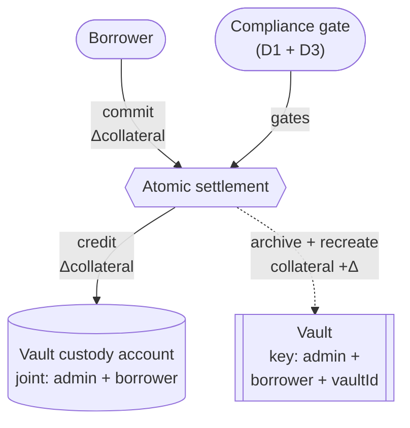
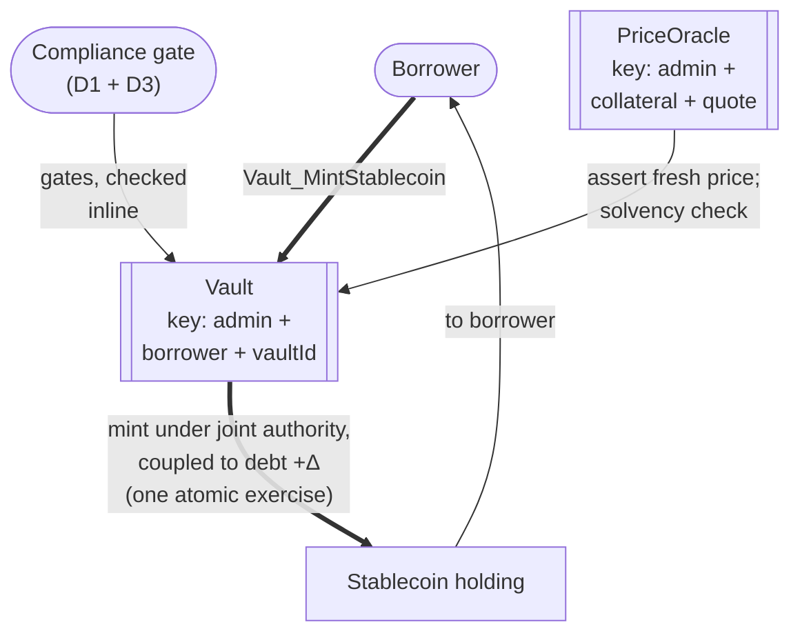
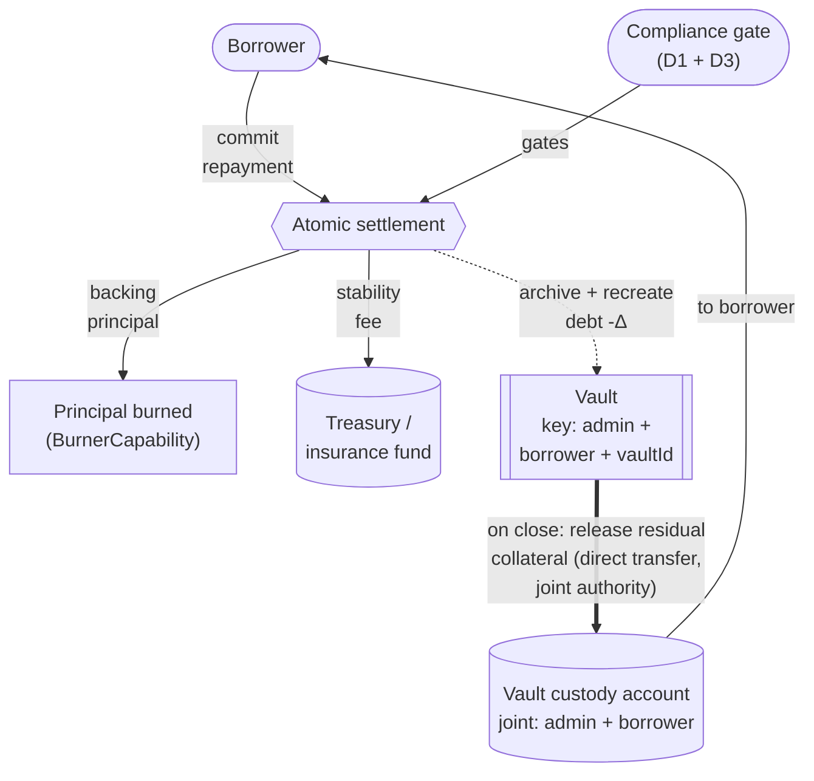
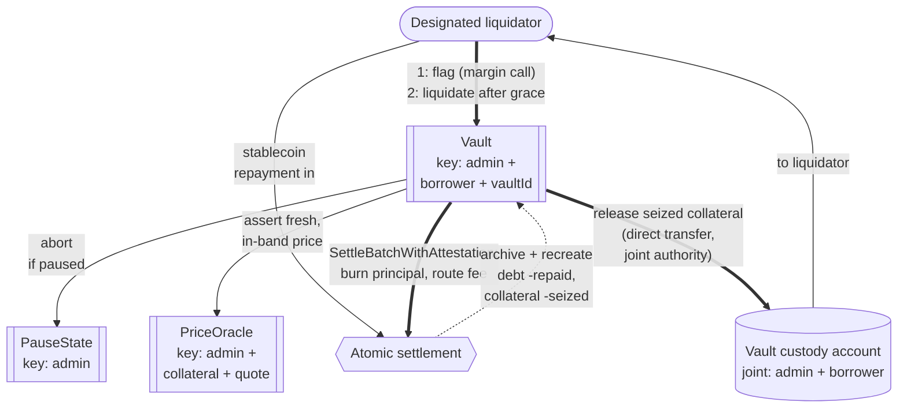
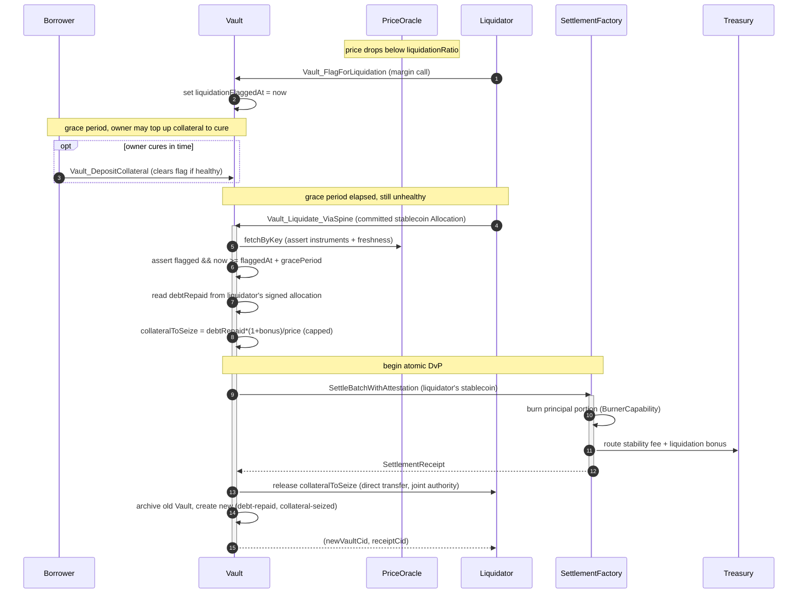

# Architectural Overview Report: Canton Reference Institutional Lending Protocol

This document describes a *reference design* for a vault-based, overcollateralized institutional lending protocol on Canton, grounded in the OpenZeppelin Canton components from this workspace, as well as the Canton Network Token Standard V2.

## 1. Product Definition

This report specifies a fixed-rate, **open-term**, overcollateralized, permissioned lending protocol for the Canton Network. Its core object is the **Vault**: an isolated collateralized debt position (CDP), held as a discrete Daml contract per borrower-issuer relationship. "Fixed-rate" means the `stabilityFeeRate` is immutable for the life of a position (no utilization-based rate curve); "open-term" means a position has no maturity date: it stays open until the owner repays and closes it, or it is liquidated.

The design adapts the [`canton-stablecoin`](https://github.com/OpenZeppelin/canton-stablecoin) vault codebase and wires it onto the CIP-0112 settlement spine. For such a protocol to work, every value movement must be atomic: a borrow must mint stablecoin only together with the solvency-checked debt increment that backs it, a repayment must burn principal only together with the debt decrement, and a liquidation must exchange the liquidator's payment for the seized collateral in one transaction. Neither side of any of these exchanges may complete without the other, and no intermediary holds the assets along the way.

That atomicity comes from two complementary mechanisms. Funds flowing **into** the protocol (a collateral deposit, a repayment, a liquidation payment) arrive as committed allocations settled through [CIP-0112 - Canton Network Token Standard V2](https://github.com/canton-foundation/cips/blob/main/cip-0112/cip-0112.md) [atomic settlement](https://github.com/canton-foundation/cips/blob/main/cip-0112/cip-0112.md#416-committed-allocations-for-prefunded-trading-and-iterated-settlement): the **atomic delivery-versus-payment (DvP) batch**, with each leg's amount pinned on-ledger to a signed allocation side. Funds the protocol **releases** (minted stablecoin, returned or seized collateral) move by direct transfer under authority the vault choice already carries, coupled to the accounting update by Daml's native transaction atomicity.

OpenZeppelin currently has an experimental implementation of atomic settlement, inside the [OpenZeppelin/canton-specs repository](https://github.com/OpenZeppelin/canton-specs/blob/main/experiments/cip112-settlement/daml/OpenZeppelin/Experimental/Settlement/Cip112.daml). The implementation has built-in capabilities for:

1. Privacy through per-party projection: a borrower's collateral, debt, and liquidation threshold are visible only to the parties on their own vault and settlement legs. Other borrowers' positions are never visible to them.
2. D1: Compliance through Party-Applied Attestation - compliance is checked per settlement, with no caching. Failure to adhere to compliance results in no value movement.
3. D2: Seizure through Preset Custodian Lock-and-Sweep - a privileged party can sweep the funds in a locked allocation to a preset custodian account.
4. D3: Identity through Trusted-Issuer KYC - a borrower must hold a `KycClaim` from an issuer in the `TrustedIssuerRegistry` to open and operate a vault.

One further compliance capability comes from `openzeppelin-access-control`: **D4: Authority through Per-Role Privilege Transfer** - each privileged action sits with a named role rather than a single admin. Privileges can be transferred, granted or revoked.

### Operational Scope and Boundaries

The reference implementation favors **simplicity and modular extensibility**. Through the tables below, we highlight what we consider in versus out-of-scope.

| Feature Category | In-Scope Architectural Components |
|---|---|
| Interest Model | A fixed, immutable `stabilityFeeRate` carried in `VaultParams`; open-term positions with no maturity date. Accrual is **simple (non-compounding) interest** off the tracked principal ([section 3](#3-how-we-implement-it)). |
| Core Flows | The five vault flows: **vault origination with collateral deposit**, **borrow** (stablecoin mint coupled to a solvency-checked debt increment), **repay** (principal burned, fees routed), **margin call and payment-proportional liquidation**, and **close** (full repay and collateral withdrawal). Inbound funds arrive as committed allocations settled over the spine; the mint and every collateral release move by direct transfer under the vault's joint authority ([section 3](#3-how-we-implement-it)). |
| Asset Representation | Fungible digital assets compliant with the CIP-0112 Token Standard V2 holding interfaces. The stablecoin (debt token) is issued by the vault admin; collateral may be issued by any third party, since it is custodied rather than minted or burned ([section 3](#3-how-we-implement-it)). |
| Pricing | A committee-attested `PriceOracle` that names both the collateral and quote instruments, with max-staleness and per-update deviation guards. |
| Fees | The stability fee and liquidation bonus are routed to a protocol treasury / insurance fund; only the backing principal is burned on repay. |
| Compliance & Control | D1: a settlement does not execute unless an attester has signalled compliance, re-checked on every value-moving operation. D2: a privileged party can sweep allocation funds to a preset custodian account. D3: single-synchronizer identity. |
| Component Integration | Direct reuse of `openzeppelin-access-control`, `openzeppelin-ownable`, `openzeppelin-pausable`, the CIP-0112 settlement spine, as well as the vault, oracle, and identity patterns from the [`canton-stablecoin`](https://github.com/OpenZeppelin/canton-stablecoin), [`canton-token-template`](https://github.com/OpenZeppelin/canton-token-template) and [`ShapeB`](../../experiments/identity-hook-shape-b/daml/OpenZeppelin/Experimental/Identity/ShapeB.daml) codebases. |

| Feature Category | Out-of-Scope Architectural Components |
|---|---|
| Interest Models | Dynamic, variable, or algorithmic rates, utilization rate curves, floating-rate oracles, and fixed maturity dates. |
| Leverage Facilities | Undercollateralized loans, flash loans, recursive leverage, and rehypothecation. |
| Liquidation Mechanics | Market-driven bidding-war auctions, and whole-vault forced seizure regardless of payment. |
| External Oracles | Multi-asset dynamic oracles and external off-ledger TWAP aggregators. A TWAP is named as a follow-on hardening, not built here. |
| Legacy Standards | Any reliance on the superseded CIP-56 token standard or legacy V1 allocation paths. The RI integrates strictly with V2 abstractions. |
| Cross-Synchronizer Operation | Cross-synchronizer settlement and identity have not been fully considered, so they are **out of scope**. The design for M1 is single-synchronizer. |

### Target Ecosystem Participants

- **Institutional Asset Managers and Tokenized-Fund Issuers** can run high-value collateralized credit operations with deterministic outcomes and no public data leakage.
- **Regulated Stablecoin Operators** can issue a collateral-backed stablecoin whose supply is provably coupled to recorded, solvency-checked vault debt.
- **Wallet and Client Integrators** can validate borrower submission flows against a working decentralized application implementing two-step handshakes and per-party allocation requests.
- **Security and Assurance Auditors** can evaluate explicit authority boundaries and the **proposed** validation workflow (`daml-lint → daml-props → daml-verify`).

### Educational Framing: How to Think About Building a Lending Protocol on Canton

Moving from an EVM ecosystem to Canton requires a paradigm shift in state management, privacy boundaries, and trust topology.

In the ERC-4626 lineage, a single globally visible contract manages pooled liquidity, debt shares, and dynamic interest accrual for all participants: a monolithic state that broadcasts every participant's collateral balance and liquidation threshold publicly.

Canton operates on a privacy-preserving, **per-party projection** model enforced by the Canton protocol. A Canton contract is an instance of a template, signed and authorized by a set of parties (signatories). State changes by archive-and-recreate rather than in-place mutation, and any signatory must actively co-authorize a transition, so **two-step handshakes (Daml's propose-and-accept pattern) are a necessity, not a style choice**. The design uses **contract keys** (reintroduced in Canton 3.5.1) so the `Vault`, `PriceOracle`, `PauseState`, and the trusted-attester and trusted-issuer registries keep stable, unique identities across those archive-and-recreate cycles.

The **vault-as-contract** model follows directly: instead of one pooled share-accounting contract, the protocol deploys a discrete, isolated `Vault` contract per borrower-issuer relationship. A borrower's position is observable only to the borrower, the vault admin, the designated liquidators that police it, and any regulatory observer parties explicitly placed in the contract's observer set. Visibility is a precondition for action on Canton: a party can flag or liquidate a vault only if the vault is in its projection, which is why the liquidator set is declared as observers rather than left implicit.

Replacing dynamic, algorithmic rate curves with a fixed, immutable `stabilityFeeRate` completes the picture: it radically simplifies auditability and yields a predictable primitive that is verifiable by formal methods, avoiding the exploit vectors of utilization-based rate curves.

---

## 2. Architecture Overview

The architecture is assembled from reused OpenZeppelin Daml primitives (role management, two-step ownership handover, pausing), the CIP-0112 settlement spine as the engine for inbound asset movement, and the `canton-stablecoin` vault mechanics it adapts. This section maps each component to its library, then defines the party/role topology and the trust configuration.

### Core Components and Library Mapping

Tags: `[IMPLEMENTED]` is real code in this workspace; `[EVIDENCE]` is real code in a companion OpenZeppelin repo that the RI adapts; `[FUTURE]` is RI-level design not yet built.

| Component Suite | Applied Templates and Libraries | Architectural Function |
|---|---|---|
| Access Control `[IMPLEMENTED]` | `openzeppelin-access-control`: [`RoleGrant`](../../access-control/daml/OpenZeppelin/AccessControl.daml#58), [`RoleAdmin`](../../access-control/daml/OpenZeppelin/AccessControl.daml#116), [`DefaultAdminTransferOffer`](../../access-control/daml/OpenZeppelin/AccessControl.daml#L237), [`requireRole`](../../access-control/daml/OpenZeppelin/AccessControl.daml#287) | Role-based permissioning. Governs the vault admin, liquidators, oracle committee members, and pausers. |
| Ownership Lifecycle `[IMPLEMENTED]` | `openzeppelin-ownable`: [`Ownership`](../../ownable/daml/OpenZeppelin/Ownable.daml#41), [`OwnershipOffer`](../../ownable/daml/OpenZeppelin/Ownable.daml#82) | Provides support for D4: Secure two-step handover of protocol administration between legal entities. |
| Protocol Constraints `[IMPLEMENTED]` | `openzeppelin-pausable`: [`PauseState`](../../pausable/daml/OpenZeppelin/Pausable.daml#47), [`whenNotPaused`](../../pausable/daml/OpenZeppelin/Pausable.daml#77) | Emergency circuit breaker. `whenNotPaused` will block new borrows as well as in-flight settlements. |
| Settlement Spine `[IMPLEMENTED]` | `OpenZeppelin.Experimental.Settlement.Cip112`: [`SettlementFactory`](../../experiments/cip112-settlement/daml/OpenZeppelin/Experimental/Settlement/Cip112.daml#L191), [`AllocationRequest`](../../experiments/cip112-settlement/daml/OpenZeppelin/Experimental/Settlement/Cip112.daml#L322), [`AllocationInstruction`](../../experiments/cip112-settlement/daml/OpenZeppelin/Experimental/Settlement/Cip112.daml#L379), [`Allocation`](../../experiments/cip112-settlement/daml/OpenZeppelin/Experimental/Settlement/Cip112.daml#L474), [`SettlementReceipt`](../../experiments/cip112-settlement/daml/OpenZeppelin/Experimental/Settlement/Cip112.daml#L695), [`ToyHolding`](../../experiments/cip112-settlement/daml/OpenZeppelin/Experimental/Settlement/Cip112.daml#L133), [`BurnerCapability`](../../experiments/cip112-settlement/daml/OpenZeppelin/Experimental/Settlement/Cip112.daml#L98) | Core engine for inbound asset movement (deposits, repayments, liquidation payments). `ToyHolding` is the toy unit of value, and can be replaced by real assets implementing the TSv2 holding interface. |
| Identity Verification `[IMPLEMENTED]` | `ShapeB`: [`KycClaim`](../../experiments/identity-hook-shape-b/daml/OpenZeppelin/Experimental/Identity/ShapeB.daml#50), [`TrustedIssuerRegistry`](../../experiments/identity-hook-shape-b/daml/OpenZeppelin/Experimental/Identity/ShapeB.daml#84) | Provides support for D3: A borrower must hold a `KycClaim` issued by a trusted party, in order to open and operate a vault. The claim is fetched live by each value-moving vault choice, so an expired or revoked claim blocks new value-moving operations. |
| Vault / CDP Core `[EVIDENCE]` | [`canton-stablecoin`](https://github.com/OpenZeppelin/canton-stablecoin): `Vault`, `VaultFactory`, `VaultParams`, `PriceOracle` | Core CDP mechanics the RI adapts: solvency-checked mint and burn, accrual, and liquidation. The RI replaces the evidence codebase's discrete-compounding accrual with simple interest, and its whole-vault seizure with a margin-called, payment-proportional design ([section 3](#3-how-we-implement-it)). |

As external dependencies, the reference implementation will integrate with the Splice Token Standard V2 interfaces to ensure maximum interoperability.

### Party and Role Model Topology

Duties are segregated and mapped to discrete Daml parties:

- **Vault Admin / Stablecoin Issuer (`VAULT_ADMIN`)** - underwrites the **stablecoin (debt) token**: configures `VaultParams` and the trusted registries, and holds the `BurnerCapability`. Its mint authority is scoped to the stablecoin only, never the collateral, and is reachable only through the solvency-coupled borrow path ([section 3](#3-how-we-implement-it)), so the admin cannot issue unbacked stablecoin.
- **Borrower (`BORROWER`)** - the institutional entity locking collateral and drawing debt. The sole party able to lock their own holdings into an allocation. Must hold a valid `KycClaim`, verified at origination and fetched live by each value-moving vault choice; the per-settlement gate is the D1 attestation. Visibility is limited to their own vaults and the public configuration contracts.
- **Liquidator (`LIQUIDATOR`)** - a role granted via `openzeppelin-access-control`. Each granted liquidator is placed in the observer set of the vaults it polices, so it can monitor the `PriceOracle` and vault solvency off-ledger from its own projection; authorized to liquidate only after the margin-call grace period has elapsed on a flagged, still-unhealthy vault, and only proportionally to the stablecoin it actually repays.
- **Oracle Committee (`ORACLE_PROVIDER` members)** - a set of independent parties that co-attest every `PriceOracle` update. No single party, not even the vault admin, can move the published price.
- **Treasury / Insurance Fund (`TREASURY`)** - the party that receives the routed stability-fee and liquidation-bonus portions; the accumulated fund is the first absorber of recognized bad debt.
- **Custodian (`CUSTODIAN`)** - owns the preset account that receives funds swept by a D2 seizure.
- **Vault Custody Account** - owns the holdings that back a vault's `collateralAmount`; there is **one custody account per vault**, so collateral is never commingled across positions. It is held under the vault's **joint authority**: the vault admin and the borrower are its account parties, so neither can move collateral unilaterally, and both signatures meet only inside vault choices. Collateral leaves it only through the choices that release it (withdrawal, close, liquidation).

The topology separates public market data from private positions: `PriceOracle` and `VaultParams` carry a broad observer set so participants can independently verify the governing parameters, while each `Vault` restricts visibility to its signatories (vault admin and borrower) plus a minimal observer set: the designated liquidators and any regulatory observer parties.

### Decentralization and Trust Topology

Canton decentralizes a party along three independent axes, and the design assigns each role a deliberate position on each:

1. **governance** - whose signatures can change the party's identity and hosting (re-home the party to their own validator and act freely);
2. **validation** - how many independent validators must confirm the party's transactions (the `PartyToParticipant` confirmation threshold; a threshold above 1 defends against a malicious validator, at a latency and cost premium, and such a party can no longer submit Ledger API commands directly - it acts through externally signed submissions or through choices submitted by others);
3. **authorization** - what the Daml signatory/controller topology requires regardless of hosting.

For the roles that hold value-moving or supply-changing authority - the vault admin, the treasury, and the vault custody account - the design envisions the EVM equivalent of an **N-of-M multisig**: no single key may exercise the role's authority. The custody account inherits this protection through its joint authorization: its account parties are the (N-of-M) vault admin and the borrower, so moving collateral outside the vault's choices requires the borrower plus the admin quorum, while inside the vault's choices both authorities arrive by signatory inheritance, with no per-release ceremony. Canton offers two ways to implement the multisig (which one is currently left as an open question) ([section 6](#6-open-design-questions)):

- **On-ledger approval workflow** - the multisig is written in Daml ([Multiple Party Agreement](https://docs.canton.network/appdev/modules/m3-design-patterns#multiple-party-agreement)): approvers record approvals as contracts, and the final choice executes under the role party's inherited authority only once a threshold of approvals exists. Approvals are durable, named, and auditable on-ledger.
- **External party with threshold signing keys** - the role party's transactions require signatures from N of M keys (`PartyToKeyMapping`), held by independent organizations. Invisible to the Daml code and a single ledger transaction per action, but the signing ceremony must complete within the prepared transaction's validity window, and the approval record stays off-ledger. The implementation could leverage something like the [Bitsafe decentralization-manager](https://github.com/DLC-link/decentralization-manager).

Where such a role must also submit routinely (the vault admin publishing oracle updates), it either keeps its confirmation threshold at 1 with its powers bounded on-ledger, or submits through externally signed transactions or a delegate that holds submission rights.

The **oracle committee** requires N-of-M attestations per price update. All-of-M is deliberately avoided: a single offline member, or one whose validator has unvetted the protocol DAR, would stall every price update until the staleness guard freezes the protocol.

The **pause authority** is multi-hosted so the brake is always reachable, but its confirmation threshold stays at 1: an emergency stop must be instant, and a quorum would slow it down. The price of that choice is a griefing window: a malicious pauser can freeze in-flight settlements until their deadlines lapse. This griefing is capped by the authorizer's right to reclaim the allocated funds after the expiration deadline.

The **custodian** owns the preset account that receives D2 sweeps. It needs availability and protection against a malicious single validator, hence multi-hosting with confirmation threshold >1 suffices.

The **liquidator** set should contain several independently granted parties, each declared as an observer of the vaults it polices, so liquidation liveness never hinges on one keeper. Any designated liquidator may flag an unhealthy vault, and sizing the set removes the single-monitor dependency.

**Borrowers** need no protocol-side decentralization: outside the custodied collateral they only ever trust their own keys and their own validator.

---

## 3. How We Implement It

### The CDP Math

A vault's health is its **collateral ratio**: `collateralRatio = (collateralAmount · price) / debtAmount`, priced by the `PriceOracle`. Borrowing and collateral withdrawal must keep the ratio at or above `VaultParams.minCollateralRatio`; falling below the (lower) `liquidationRatio` exposes the position to a margin call.

**Interest accrual (simple, non-compounding).** `accrueDebt` computes `newDebt = oldDebt + principalAmount · stabilityFeeRate · elapsedYears`, where `elapsedYears` derives from `now - lastAccrualTime`. Accrual runs on every state-changing choice before the solvency check, and `lastAccrualTime` resets on each recreation. Because each increment is linear in the tracked `principalAmount`, never in the accumulated debt, splitting a period changes nothing: across windows `t₁` then `t₂` the debt grows to `P·(1 + r·(t₁+t₂))`, exactly simple interest, no matter how often accrual runs. This departs from the `canton-stablecoin` evidence code, which compounds discretely (`newDebt = oldDebt · (1 + r·t)`, so the total depends on the interaction pattern); whether a compounding variant is also needed is an open question ([section 6](#6-open-design-questions)).

**Liquidation arithmetic (payment-proportional).** Collateral seized is bound to the stablecoin the liquidator actually repays:

```text
collateralToSeize = min(collateralAmount, debtRepaid · (1 + liquidationBonus) / price)
debtRepaid       <= closeFactor · accruedDebt
```

`debtRepaid` is read from the liquidator's own signed allocation, never from the vault's full accrued debt, so a liquidator can never take more collateral than their payment (plus bonus) buys. The `closeFactor` cap makes liquidations partial: each pass repays at most a slice of the debt and seizes only the matching collateral, restoring health with the least collateral consumed. Any genuine shortfall on a deeply under-water position is quantified as `badDebt`, whose first absorber is the insurance fund.

### Data and State Flow

The diagrams below show the four vault flows: **A** collateral deposit, **B** borrow, **C** repay and close, **D** margin call and liquidation. Atomic settlement appears exactly where funds flow **in** from a payer (the deposit, the repayment, the liquidation payment); everything the protocol releases (minted stablecoin, returned or seized collateral) moves by direct transfer under the vault's joint authority in the same transaction. In each, the `Compliance gate` node stands for the D1 attestation check and the D3 live KYC-claim fetch ([section 3](#d1-compliance-through-party-applied-attestation)), and keyed contracts are marked with their key.

**A. Collateral deposit.** The borrower commits collateral; the settlement credits it to the vault custody account, and the keyed `Vault` archives and recreates with the incremented `collateralAmount` in the same transaction, so the accounting never moves without the holdings.



**B. Borrow (mint coupled to debt).** The borrower exercises the mint choice; the vault verifies the compliance gate inline, prices the solvency check against the keyed oracle, then mints the stablecoin to the borrower and archives and recreates with the incremented debt, all in one exercise. This is the one flow that needs no atomic settlement: the vault's signatories are the stablecoin issuer and the borrower, so the choice already carries every authority the mint requires, and Daml's transaction atomicity couples the mint to the debt increment. If the transaction does not commit, no stablecoin is minted and no debt is recorded.



**C. Repay and close (principal burned, fees routed).** The borrower commits stablecoin; the settlement burns exactly the backing principal via the `BurnerCapability` and routes the accrued fee portion to the treasury, recreating the `Vault` with reduced debt. On close, the vault releases the residual collateral back to the borrower by direct transfer under its joint authority, in the same transaction, so no custody-side allocation is needed.



**D. Margin call and liquidation.** A designated liquidator flags the unhealthy vault, opening the borrower's cure window; after the grace period it drives the pause-gated liquidation, which prices against the keyed oracle, settles the liquidator's committed stablecoin over the spine (principal burned, fee and bonus routed), releases the seized collateral to the liquidator by direct transfer under the vault's joint authority, and archives and recreates with reduced debt and collateral, all in one transaction.



### The Settlement-Spine Flow: Step by Step

The settlement spine carries the protocol's **inbound** funds: collateral deposits, repayments, and liquidation payments arrive as committed allocations and settle through [`SettlementFactory_SettleBatchWithAttestation`](../../experiments/cip112-settlement/daml/OpenZeppelin/Experimental/Settlement/Cip112.daml#L274), which is also where the D1 attestation is verified and consumed. Outbound value typically needs no settlement factory. The stablecoin mint and every collateral release (withdrawal, close, seizure) move by direct transfer under authority the vault choice already carries: the admin's issuer authority for the mint, and the vault's joint authority over its custody account for collateral. Daml's transaction atomicity couples each release to the accounting update, and the direct paths verify and consume D1 attestations inline, so no flow sits outside the compliance gate.

1. **Vault origination and collateral deposit.** The borrower locks collateral into a committed [`Allocation`](../../experiments/cip112-settlement/daml/OpenZeppelin/Experimental/Settlement/Cip112.daml#L474) (instruction-and-accept lifecycle) and presents their KYC claim to the vault factory. On successful verification the factory batch-settles the collateral **into the vault custody account** and instantiates the `Vault` with the verified `collateralAmount`. Subsequent top-ups use `Vault_DepositCollateral`; reductions use `Vault_WithdrawCollateral`, which releases collateral back to the borrower by direct transfer under the vault's joint authority. Both are solvency-checked and re-run the compliance check.
2. **Borrow.** The borrower exercises `Vault_MintStablecoin`. The vault verifies and consumes the D1 attestation, fetches the live `KycClaim`, then runs a deterministic solvency check: requested plus existing debt must keep `collateralRatio` at or above `minCollateralRatio`, priced by a fresh `PriceOracle` reading. On success the choice mints the stablecoin directly to the borrower, under the vault's joint authority (the admin is the stablecoin issuer), in the same exercise that increments `debtAmount`.
3. **Repay.** The borrower allocates stablecoin and exercises `Vault_BurnStablecoin`; the batch burns only the backing principal via the [`BurnerCapability`](../../experiments/cip112-settlement/daml/OpenZeppelin/Experimental/Settlement/Cip112.daml#L98) and routes the accrued stability-fee portion to the treasury, reducing `debtAmount`. Collateral is released via `Vault_WithdrawCollateral` (a direct transfer under joint authority) as health allows, and `Vault_Close` winds the position down.
4. **Liquidation, after a margin call.** If the vault is below `liquidationRatio`, any designated liquidator may flag it (`Vault_FlagForLiquidation`), opening a deterministic grace period in which the borrower may cure. Only once the grace period has elapsed and the vault is still unhealthy does an authorized liquidator exercise `Vault_Liquidate_ViaSpine`, providing a committed stablecoin allocation. The batch atomically burns the liquidator's principal portion and routes the fee and bonus to the treasury; in the same transaction the choice releases the payment-proportional collateral from the custody account to the liquidator by direct transfer under the vault's joint authority, and the residual position is recreated in a new `Vault`.

A batch settles **all-or-nothing**: if any leg fails, because an allocation was already archived or a backing holding was concurrently consumed, the entire batch fails. The protocol therefore keeps batches minimal (only the legs of one vault operation), validates that every referenced allocation is still active before submission, and relies on the allocation expiry so a failed batch never strands locked funds.



### Collateral is Custodied, Not Minted

Collateral is only ever **transferred**, never minted or burned: a deposit settles the borrower's collateral holding into the vault custody account over the spine, and a withdrawal releases it back by direct transfer under the vault's joint authority. The vault admin therefore needs no issuing authority over the collateral instrument, only over the stablecoin. Institution-supplied, third-party-issued collateral (a custodian bank's deposit token, a tokenized treasury) is therefore first-class.

**Direct-transfer assumption.** The release legs assume the collateral instrument exposes a transfer that can be exercised synchronously inside the vault transaction. An asset that supports only two-step, instructed transfers (instruction, then registrar or receiver acceptance) still integrates, but its releases happen over the two steps: the vault transaction issues the instruction and the collateral arrives when the acceptance lands, so the release is no longer same-transaction for that asset.

**Collateral amounts vs. actual holdings.** The `Vault`'s `collateralAmount` is a `Decimal` accounting figure; the real value lives in TSv2 holdings owned by that vault's own custody account (one account per vault, so the invariant is meaningful per position). Every flow moves holdings into or out of that account in the same transaction that updates the accounting figure, so **`collateralAmount == Σ(custody-account holdings)` per vault** cannot drift within a transaction. Deposit, withdrawal, and liquidation each bind their collateral leg to the custody account's identity, so the accounting can never move without the matching holdings moving. The caveat is *fragmentation*: repeated top-ups accumulate many small holdings in a custody account, so a periodic **consolidation** step (merging the account's holdings for the instrument into one, leaving `collateralAmount` unchanged) keeps settlement cheap.

### Mint is Coupled to Debt

Stablecoin can be created **only** inside `Vault_MintStablecoin`, which in one atomic transaction (a) verifies and consumes the D1 attestation and fetches the live `KycClaim`, (b) runs the solvency check, (c) recreates the `Vault` with `debtAmount = accruedDebt + mintAmount`, and (d) mints exactly `mintAmount` to the borrower. There is no standalone admin-mint choice. Symmetrically, `Vault_BurnStablecoin` reduces `debtAmount` by exactly the principal burned. This is the on-ledger realisation of the **debt-conservation invariant**: every stablecoin unit in circulation is backed 1:1 by outstanding, solvency-checked vault debt.

The mint is direct, not a settlement leg. The vault's signatories are the stablecoin issuer and the borrower, so the choice already carries every authority issuance requires, and Daml's transaction atomicity provides the mint-to-debt coupling; routing a one-party issuance through the DvP machinery would add nothing. The attestation check is inlined precisely so this direct path stays behind the same D1 gate as the settled flows.

### Fees are Routed, Not Burned

The debt settled on repay, close, or liquidation is `principal + accrued stability fee`, and a liquidation additionally charges the `liquidationBonus`. The settlement splits the payment on-ledger: the portion equal to the backing principal is burned via the `BurnerCapability` (removing the backing from supply, preserving the 1:1 invariant), while the fee and bonus portions transfer to the treasury / insurance fund. Those fees are protocol revenue, the on-ledger analogue of interest paid to the lender, and the accumulated fund is the first absorber of any liquidation shortfall. The vault tracks `principalAmount` separately from `debtAmount` so the split is computable at settlement time.

### Margin Call: a Grace Period Before Liquidation

On a public chain, a collateral top-up racing a liquidation is decided by gas and ordering luck. Canton has no public mempool, so the design makes the borrower's cure window explicit and deterministic instead. Liquidation is two-phase:

1. **Flag.** When `collateralRatio < liquidationRatio`, any designated liquidator may exercise `Vault_FlagForLiquidation`, which records `liquidationFlaggedAt` and derives a grace deadline from the protocol-set `gracePeriod` in `VaultParams`. This is the margin call; it moves no value.
2. **Cure or liquidate.** During the window the borrower may deposit collateral or repay to restore the ratio, which clears the flag. `Vault_Liquidate_ViaSpine` asserts the vault is flagged, the grace period has elapsed, and the vault is still unhealthy, so a liquidator can never pre-empt the cure window, and a borrower who does nothing is liquidated deterministically once it closes. A partial liquidation that leaves the vault unhealthy preserves the original flag time, so the position is immediately re-liquidatable rather than granted a fresh window per pass.

### Compliance is Re-checked on Every Operation

The KYC gate at vault opening is necessary but not sufficient: a borrower can lose good standing after opening. Two distinct layers keep a position compliant. For D3 identity, each value-moving vault choice fetches the borrower's live `KycClaim` and re-checks it: the claim must be unexpired and its issuer still listed in the `TrustedIssuerRegistry`. Revocation is the issuer archiving the claim or being delisted from the registry; either blocks new borrows, top-ups, and withdrawals immediately. For D1 compliance, each flow consumes one single-use attestation: inbound settlements consume it in `SettleBatchWithAttestation`, fail-closed, with no caching, covering any release in the same transaction, and the pure-direct flows (mint, withdrawal) consume it inline, so every flow sits behind the same gate.

Deliberately, the borrower's continued compliance is **not** a precondition for winding the position down: on repay and close the borrower is reducing risk, so those settlements do not gate on the borrower's D1 standing (the attestation covers the settlement, not the repaying borrower's status), and on the liquidation legs it is the liquidator's compliance that is checked. A now-non-compliant position can always be repaid or liquidated, never trapped, and never dependent on an attester's willingness to re-attest the borrower.

### Oracle Handling: Staleness Guard and Circuit Breaker

A single trusted price feed plus a single liquidator would be the largest live attack surface, so the design hardens the price path:

- **Named quote instrument.** `PriceOracle` carries a `stablecoinInstrumentId` alongside `collateralInstrumentId`, so `price` is unambiguously "units of this stablecoin per unit of this collateral". Consumers assert both ids match the vault's.
- **Committee-attested updates.** A price publish consumes an N-of-M oracle-committee approval, so a lone compromised admin cannot move the price and manufacture liquidations.
- **Max-staleness guard.** Every price-dependent choice rejects when `now - updatedAt > maxStaleness`, so a stalled feed cannot drive liquidations or fresh borrows against a dead price.
- **Per-update deviation circuit breaker.** Updates are bounded against the oracle's own `maxDeviation` field; an out-of-band move aborts the update, so the last in-band price stands. Tripping the `openzeppelin-pausable` kill-switch on repeated breaches is a separate pauser action, since an aborting transaction persists nothing.

### D1: Compliance through Party-Applied Attestation

Institutional lending requires that sanctioned or unverified parties cannot move value. The RI checks compliance per settlement and fails closed: no valid attestation, no value movement. Our atomic-settlement codebase currently showcases an experimental example via [`SettlementFactory_SettleBatchWithAttestation`](../../experiments/cip112-settlement/daml/OpenZeppelin/Experimental/Settlement/Cip112.daml#L274), which requires an attestation covering this specific settlement, from an attester listed in the [`TrustedAttesterRegistry`](../../experiments/cip112-settlement/daml/OpenZeppelin/Experimental/Settlement/Cip112.daml#L778). The registry must share the factory's admin, so callers cannot substitute a registry of their own choosing. Attestations are single-use, so none can be cached or reused across settlements.

### D2: Seizure Through Preset Custodian Lock-and-Sweep

Institutional lending requires the ability to seize assets under judicial mandate. The RI implements D2 via a strict **lock-and-sweep** pattern that locks the funds and sweeps them to a preset custodian account. In-flight allocations use [`Allocation_MarkD2InFlightSeizure`](../../experiments/cip112-settlement/daml/OpenZeppelin/Experimental/Settlement/Cip112.daml#L595) for locking and [`Allocation_SweepD2InFlightSeizure`](../../experiments/cip112-settlement/daml/OpenZeppelin/Experimental/Settlement/Cip112.daml#L625) for sweeping to the preset custodian account. Seized assets are never burned and never returned to sender; ordinary transfer failures do return to sender. A forced sweep of locked vault collateral is a `[FUTURE]` extension over the evidence holding template, which today ships only an unlock choice.

### D3: Know-your-customer

Institutional lending requires participants to be identified. The RI implements D3 via a single-synchronizer identity architecture. Borrowers must hold a `KycClaim` issued by a party present in the `TrustedIssuerRegistry` to open and operate a vault, verified at origination; each subsequent value-moving vault choice fetches the claim's live state, while per-settlement compliance is D1's attestation gate.

### D4: Authority and Privilege Transfer

Institutional lending requires administrative power to be explicit and accountable: every privileged action traces to a named authority. There is no single admin holding every privilege. Each action sits with the role responsible for it: stablecoin issuance and burning with the `VAULT_ADMIN`, reachable only through the solvency-coupled vault choices; liquidation with the `LIQUIDATOR`; price publication with the oracle committee; the emergency brake with the `PAUSER`; and lock-and-sweep with the custodian-preset seizure path. These privileges are granted, transferred, and revoked through `openzeppelin-access-control` role administration and the `openzeppelin-ownable` two-step ownership handover, so authority can move between parties without redeploying.

### Implementing Smart Contract Upgrades

For a smart contract upgrade, an existing choice's arguments must never be mutated to require a new field. Extensions are managed via appended `Optional` fields, new serializable types, and **new choices**. An interface definition cannot change once deployed; only an interface instance (its implementation in a template) can, so new capabilities arrive as new templates and choices, never by retroactively re-instancing the deployed `Vault`.

Consider cross-domain identity. To later record an external identity reference for a future regulation, the `Vault` template gains `crossDomainIdentity : Optional Text` (read as `None` by older contracts) and a **new** choice `Vault_UpdateIdentity` records it. The existing `Vault_MintStablecoin` / `Vault_BurnStablecoin` choices keep their signatures untouched, so older clients keep working.

SCU extensions are not security retrofits: adding a stricter choice does not close the looser one. If a hardened liquidation choice shipped while the original stayed live, anyone could call the weaker path directly. Hence such an upgrade must also make the superseded choice fail unconditionally and be marked as `deprecated`.

### Extension Points

The reference implementation is modular code meant to be extended, and these are its seams:

- `openzeppelin-pausable`, `openzeppelin-ownable`, and `openzeppelin-access-control` are plug-and-play: any template adopts the pause gate, ownership handover, or role checks without redesign.
- The atomic-settlement primitive is application-agnostic: the batch entrypoint that settles the protocol's inbound funds serves any DvP flow, and is the same spine the DEX, Stablecoin, and Auction RIs build on.
- The `ShapeB` identity hook is a swappable seam: a different KYC provider integrates by issuing `KycClaim`s from a party listed in the `TrustedIssuerRegistry`, with no change to the vault choices that fetch them.
- The `PriceOracle` is a component boundary: a TWAP variant or a multi-feed aggregator replaces it behind the same contract key and the same consumer asserts.
- New vault capabilities land as SCU-safe appended `Optional` fields and new choices, per the rules above.

---

## 4. Sample Component Structure

The code below is idiomatic Daml that composes with the libraries above. These snippets are illustrative rather than production code: they exemplify the flows and highlight the key parts, so they omit non-essential detail such as basic checks, the `ensure` block, and most comments. Helpers such as `accrueDebt` (adapted here to simple interest off the principal, [section 3](#3-how-we-implement-it)), `collateralRatio`, and `signedSenderAmount` come from the `[EVIDENCE]` codebase and appear here as illustrative imports.

### 4.1 Component: Vault State, Margin Call, and Liquidation

The `Vault` holds one borrower's CDP state. The state-update logic lives **here**, as consuming choices controlled by the relevant role, which archive this `Vault` and recreate the successor with updated figures. The `Vault` carries a contract key `(vaultAdmin, borrower, vaultId)`, so consumers reference a position by its stable identity rather than by a cid that changes on every operation. Liquidation is **pause-gated** and **margin-called**: it resolves the `PauseState` by key and requires an elapsed grace period on a flagged, still-unhealthy vault. Only the liquidator's payment rides the settlement batch; the custody account is jointly authorized by the vault's own signatories, so the choice releases the seized collateral itself.

```daml
module OpenZeppelin.Experimental.Lending.Vault where

import OpenZeppelin.Experimental.Settlement.Cip112
import OpenZeppelin.Experimental.TokenStandard.V2.Holding (InstrumentId)
import OpenZeppelin.Experimental.TokenStandard.V2.Allocation (SettlementInfo, TransferLeg)
import OpenZeppelin.Pausable (PauseState, whenNotPaused)

-- | One borrower's CDP. Amounts are `Decimal` accounting figures; the collateral
-- itself lives in `collateralAccount`, jointly authorized by `vaultAdmin` and
-- `borrower`, so it moves only inside this template's choices.
template Vault
  with
    vaultAdmin : Party
    borrower : Party
    vaultId : Text
    collateralInstrumentId : InstrumentId
    stablecoinInstrumentId : InstrumentId
    collateralAccount : Account
    collateralAmount : Decimal
    debtAmount : Decimal
    principalAmount : Decimal
    params : VaultParams
    lastAccrualTime : Time
    liquidationFlaggedAt : Optional Time
  where
    signatory vaultAdmin, borrower
    -- Designated liquidators observe the vault: visibility is what lets them
    -- monitor solvency and exercise the flag choice.
    observer params.liquidators
    key (vaultAdmin, borrower, vaultId) : (Party, Party, Text)
    maintainer key._1

    -- Phase 1, the margin call. Open to any designated liquidator: it starts
    -- the borrower's cure clock and moves no value.
    choice Vault_FlagForLiquidation : ContractId Vault
      with
        flagger : Party
      controller flagger
      do
        assertMsg "not a designated liquidator" (flagger `elem` params.liquidators)
        now <- getTime
        (_, oracle) <- fetchByKey @PriceOracle (vaultAdmin, collateralInstrumentId, stablecoinInstrumentId)
        assertMsg "oracle stale" (subTime now oracle.updatedAt <= params.maxStaleness)
        let accruedDebt = accrueDebt debtAmount principalAmount lastAccrualTime now params.stabilityFeeRate
        assertMsg "vault is healthy"
          (collateralRatio collateralAmount accruedDebt oracle.price < params.liquidationRatio)
        create this with
          debtAmount = accruedDebt; lastAccrualTime = now
          liquidationFlaggedAt = Some now

    -- Phase 2, liquidation: only after the grace period, and only proportional
    -- to what the liquidator pays.
    choice Vault_Liquidate_ViaSpine : (ContractId Vault, ContractId SettlementReceipt)
      with
        liquidator : Party
        settlementFactoryId : ContractId SettlementFactory
        debtAllocationId : ContractId Allocation        -- liquidator's committed stablecoin
        settlement : SettlementInfo
        transferLegs : [TransferLeg]
        attestationCid : ContractId ComplianceAttestation
      controller liquidator
      do
        now <- getTime
        (_, pause) <- fetchByKey @PauseState vaultAdmin
        whenNotPaused pause
        (_, oracle) <- fetchByKey @PriceOracle (vaultAdmin, collateralInstrumentId, stablecoinInstrumentId)
        assertMsg "oracle stale" (subTime now oracle.updatedAt <= params.maxStaleness)

        -- Margin-call gate: flagged, grace elapsed, still unhealthy.
        flaggedAt <- case liquidationFlaggedAt of
          None -> abort "not flagged: call Vault_FlagForLiquidation first"
          Some t -> pure t
        assertMsg "grace period has not elapsed" (subTime now flaggedAt >= params.gracePeriod)
        let accruedDebt = accrueDebt debtAmount principalAmount lastAccrualTime now params.stabilityFeeRate
        assertMsg "vault is solvent"
          (collateralRatio collateralAmount accruedDebt oracle.price < params.liquidationRatio)

        -- KEY: bind seizure to what the liquidator signed. `debtRepaid` is read
        -- from the liquidator's own allocation, capped by the close factor; the
        -- choice itself computes `collateralToSeize` and releases exactly that
        -- amount, so there is no custody-side allocation to mis-size.
        liqAlloc <- fetch debtAllocationId
        let debtRepaid = signedSenderAmount liqAlloc stablecoinInstrumentId
        assertMsg "repayment exceeds close-factor cap"
          (debtRepaid > 0.0 && debtRepaid <= params.closeFactor * accruedDebt)
        let collateralToSeize =
              min collateralAmount ((debtRepaid * (1.0 + params.liquidationBonus)) / oracle.price)

        -- Inbound leg over the spine: burn the principal portion and route
        -- fee + bonus to the treasury, D1-attested, all-or-nothing.
        receipts <- exercise settlementFactoryId SettlementFactory_SettleBatchWithAttestation with
          settlement; transferLegs
          allocationCids = [debtAllocationId]
          actors = [liquidator]
          attestationCid

        -- Outbound leg by direct transfer: the custody account is jointly
        -- authorized by this vault's signatories, both present here, so the
        -- choice releases the seized collateral to the liquidator itself.
        _ <- releaseFromCustody collateralAccount liquidator
               collateralInstrumentId collateralToSeize

        let remainingDebt = accruedDebt - debtRepaid
            remainingCollateral = collateralAmount - collateralToSeize
            stillUnhealthy =
              collateralRatio remainingCollateral remainingDebt oracle.price < params.liquidationRatio
        newVault <- create this with
          collateralAmount = remainingCollateral
          debtAmount = remainingDebt
          principalAmount = principalAmount - debtRepaid * (principalAmount / accruedDebt)
          lastAccrualTime = now
          -- A still-unhealthy vault keeps its original flag time, so it is
          -- immediately re-liquidatable rather than granted a fresh grace window.
          liquidationFlaggedAt = if stillUnhealthy then liquidationFlaggedAt else None
        pure (newVault, head receipts)
```

### 4.2 Component: Committee-Attested Price Oracle

The `PriceOracle` is the one contract whose compromise would let an attacker manufacture liquidations, so its update path is never single-writer: a publish consumes an N-of-M committee approval collected through the [Multiple Party Agreement](https://docs.canton.network/appdev/modules/m3-design-patterns#multiple-party-agreement) pattern, so no single party (not even the admin) can move the price, and no publish requires every member (one offline member cannot stall updates). The oracle carries a contract key `(admin, collateralInstrumentId, stablecoinInstrumentId)`, so vaults resolve the current price by key across its archive-and-recreate publish cycle.

```daml
-- N-of-M approval carrier: committee members accumulate as signatories.
template PriceUpdateProposal
  with
    admin : Party
    oracleCommittee : [Party]
    collateralInstrumentId : InstrumentId
    stablecoinInstrumentId : InstrumentId
    newPrice : Decimal
    approvers : [Party]                    -- members who have signed so far
  where
    signatory admin, approvers
    observer oracleCommittee

    choice PriceUpdateProposal_Approve : ContractId PriceUpdateProposal
      with approver : Party
      controller approver
      do
        assertMsg "not a committee member" (approver `elem` oracleCommittee)
        assertMsg "already approved" (approver `notElem` approvers)
        create this with approvers = approver :: approvers

    -- Consuming: carries the approvers' inherited authority, so publishing needs
    -- N approvals, not all M signatures at once.
    choice PriceUpdateProposal_Publish : ContractId PriceOracle
      controller admin
      do
        (oracleCid, oracle) <- fetchByKey @PriceOracle
          (admin, collateralInstrumentId, stablecoinInstrumentId)
        exercise oracleCid PriceOracle_ApplyUpdate with newPrice; approvers

template PriceOracle
  with
    admin : Party
    oracleCommittee : [Party]
    committeeThreshold : Int               -- N of M, deliberately below all-of-M
    collateralInstrumentId : InstrumentId
    stablecoinInstrumentId : InstrumentId  -- the unit `price` is quoted in
    price : Decimal
    maxDeviation : Decimal                 -- circuit-breaker bound, governance-set
    updatedAt : Time
    observers : [Party]
  where
    signatory admin
    observer oracleCommittee, observers
    key (admin, collateralInstrumentId, stablecoinInstrumentId) : (Party, InstrumentId, InstrumentId)
    maintainer key._1
    ensure price > 0.0 && maxDeviation > 0.0 &&
           committeeThreshold >= 1 && committeeThreshold <= length oracleCommittee &&
           collateralInstrumentId /= stablecoinInstrumentId

    -- The approvers are controllers, so the call is only authorizable with their
    -- signatures present: in practice through PriceUpdateProposal_Publish, whose
    -- consuming exercise carries them. The deviation bound is read from
    -- `this.maxDeviation` (trusted signed state), never caller-supplied.
    -- Committee membership and threshold rotate by archive-and-recreate under
    -- the same key.
    choice PriceOracle_ApplyUpdate : ContractId PriceOracle
      with
        newPrice : Decimal
        approvers : [Party]
      controller admin :: approvers
      do
        -- `dedup`: a duplicated approver must not count twice toward the quorum.
        assertMsg "committee threshold not met"
          (length (dedup (filter (`elem` oracleCommittee) approvers)) >= committeeThreshold)
        assertMsg "price must be positive" (newPrice > 0.0)
        assertMsg "price deviation out of band"
          (abs (newPrice - price) / price <= maxDeviation)
        now <- getTime
        create this with price = newPrice; updatedAt = now
```

---

## 5. Security & Auditability

The RI prioritizes verifiable security. Simplicity over complexity minimizes the surface for logic exploits, and Canton's per-party projections create natural containment boundaries.

### 5.1 Security Invariants

- **Solvency conservation**:
  - Collateral can never be withdrawn, and a borrow can never succeed, if it would push `collateralRatio` below `VaultParams.minCollateralRatio`.
  - Liquidation is reachable only below `liquidationRatio`, after the margin-call grace period.
- **Debt conservation (no unbacked issuance)**:
  - Stablecoin is minted only inside `Vault_MintStablecoin`, atomically with a solvency-checked `debtAmount` increment, and burned only against a `debtAmount` decrement. There is no standalone admin mint, so every circulating unit is backed 1:1 by recorded vault debt. Holds against every party except the full N-of-M admin quorum, since Daml gates creation by signatories, not choices ([section 3](#mint-is-coupled-to-debt)).
- **Seizure is payment-bound**:
  - Liquidation seizes collateral exactly proportional to the stablecoin the liquidator signed for, with `debtRepaid` read from the liquidator's own allocation and the release computed and executed by the choice itself. A liquidator can never take more than their payment (plus bonus) buys.
- **Margin call before seizure**:
  - Liquidation requires a prior flag plus an elapsed `gracePeriod`, giving the borrower a deterministic cure window instead of a submission-timing race.
- **Fee integrity**:
  - On repay and liquidation the backing principal is burned while the stability fee and liquidation bonus route to the treasury. Value is neither destroyed nor leaked.
- **Funding conservation**:
  - On every settle path the engine enforces that an authorizer's archived locked inputs cover its SenderSide obligations per instrument.
  - Per vault, the `collateralAmount` accounted in the vault state should equal the holdings in its custody account.
- **Price integrity**:
  - Price-dependent choices reject a stale oracle, and price updates require N-of-M committee approval within the deviation band, so solvency is never evaluated against a dead, manipulated, or unilaterally-set price.
- **Privacy**:
  - A borrower has visibility only over their own vaults, holdings, and the transfer legs they are a sender or receiver in.

### 5.2 Automated Validation Engine

We propose a three-tier validation approach, based on verification tools built by OpenZeppelin:

1. [`daml-lint`](https://github.com/OpenZeppelin/daml-lint/commits/main/): Static analysis through abstract-syntax tree checks: decimal bounds, unguarded division, positivity, archive-before-execute, anti-patterns, naming conventions.
2. [`daml-props`](https://github.com/OpenZeppelin/daml-props): Property based testing by fuzzing state transitions to ensure conservation/supply/balance invariants hold under extreme inputs.
3. [`daml-verify`](https://github.com/OpenZeppelin/daml-verify): Formal verification through Z3-backed proofs, asserting logical impossibility of undesired states (collateral extraction below `minCollateralRatio`, seizure exceeding payment, pause or compliance bypass).

These tools are proposed for the RI, not wired into this repo's CI today; the current gate is `dpm build --all` plus the Daml Script suites run by `scripts/run-tests.sh` and `scripts/check-scaffold.sh`.

### 5.3 Threat Model and Failure Modes

| Vector | Attack | Mitigation |
|---|---|---|
| Oracle manipulation by a compromised admin | Admin sets the price near zero and self-liquidates every vault, stealing all collateral. | A price publish requires N-of-M committee approval carried by the consumed `PriceUpdateProposal`, whose approvers are controllers of the update, so a lone admin cannot move the price; a per-update deviation bound (read from the oracle's own `maxDeviation`) aborts out-of-band moves, with a separate pauser trip on repeated breaches. |
| Oracle staleness | A stalled feed drives liquidations or borrows against a dead price. | Every price-dependent choice rejects when `now - updatedAt > maxStaleness`. A TWAP and multiple feeds are named follow-ons. |
| Under-paying liquidator | The liquidator supplies a tiny stablecoin amount and seizes the whole vault. | Seizure is bound on-ledger to the liquidator's signed payment: `collateralToSeize = min(collateralAmount, debtRepaid · (1 + bonus) / price)` with `debtRepaid` read from the liquidator's own allocation; the choice itself computes and releases exactly that amount of collateral. A small payment seizes only a small, proportional slice. |
| Liquidation front-running the borrower | A liquidation lands before the borrower can top up. | The two-phase margin call: flagging opens a `gracePeriod` the borrower owns for curing, and liquidation asserts the period has elapsed, so it cannot pre-empt the cure window. |
| Settlement-leg failure | An under-funded or stale batch attempts a broken liquidation. | Daml atomicity: the whole transaction reverts, collateral stays in the custody account, no debt is cleared. Liquidations are partial and proportional, so a well-formed smaller batch simply liquidates less. |
| Bad debt on a deeply under-water position | Collateral is worth less than debt, creating a protocol-level shortfall. | The shortfall is recognized and quantified as `badDebt`; the insurance fund capitalized from routed fees is its first absorber, with the exhaustion path an open design question ([section 6](#6-open-design-questions)). |
| Compliance evasion (D1), including post-open drift | A borrower bypasses KYC, or becomes non-compliant after opening. | The `KycClaim` is validated at open and fetched live by each vault choice (unexpired, issuer still in the `TrustedIssuerRegistry`), and the D1 attestation is re-checked per settlement, fail-closed, with no caching. A revoked or expired claim blocks new borrows, top-ups, and withdrawals immediately, while repay, close, and liquidation stay open so a position is never trapped. |
| Unauthorized admin action | An attacker with the admin key tries to mint unbacked stablecoin, drain custodied collateral, or invoke a D2 seizure. | Minting is reachable only through the solvency-coupled vault choice; custody holdings carry the borrower's signature too, so the admin alone cannot move them outside a vault choice; seizure requires the `BurnerCapability` and sweeps only to the preset custodian account. These authorities are unforgeable contract instances under Daml's authorization model. |
| Forced upgrades breaking in-flight allocations (SCU) | A poorly executed upgrade mutates fields, rendering existing `Allocation` contracts un-settleable. | Programmatic adherence to the SCU rule (Optional appends and new choices only). The `Vault` template's existing choices stay operable; in-flight settlements conclude before users transition. |
| DAR unvetting on a stakeholder's validator | A party (malicious or misconfigured) unvets the protocol DAR on their validator, so transactions on contracts they are a stakeholder of can no longer be confirmed: a D2 sweep of their funds fails, and co-signed flows they participate in stall. | Signatories and observers alike must have the same DAR version vetted for a transaction to succeed, and the freeze cuts both ways: the unvetting party cannot move the asset either, so the contract stays frozen rather than extractable, and re-vetting restores operation. Liveness-critical sets (oracle committee, liquidators) are N-of-M and multi-member precisely so one unvetted participant cannot stall the protocol. A borrower who unvets freezes their own custody account: seizure is blocked, but so is every withdrawal, and the debt keeps accruing until they re-vet. |

### 5.4 Throughput and Contention

Every vault operation archives and recreates that borrower's `Vault` contract, so operations against the *same* vault serialize; operations on different vaults run in parallel, which fits the one-position-per-contract model far better than a pooled design. The shared hot contract is the `PriceOracle`: each publish archives and recreates it, so a price update contends with in-flight price-dependent choices that fetched the prior version, and those retry against the new price. Since vaults resolve the oracle by key, a retry picks up the fresh contract without client-side rewiring.

---

## 6. Open Design Questions

Decisions to settle with the internal team before implementation, not M1 build items.

- **Multisig implementation for value-critical roles.** The vault admin, treasury, and oracle committee each require N-of-M authority ([section 2](#decentralization-and-trust-topology)). Open: whether each role uses the on-ledger approval workflow, an external party with threshold signing keys, or a combination; and the N and M per role, including the oracle committee quorum that balances liveness against collusion.
- **Bad-debt disposition beyond the insurance fund.** The insurance fund is the first absorber of recognized `badDebt` ([section 3](#3-how-we-implement-it)). Still open: what happens when the fund is exhausted (a socialized-loss path across outstanding positions, an admin write-off, or a capital top-up obligation), and how the fund's fee slice is sized against expected loss.
- **Interest-accrual method.** Accrual is simple interest off the tracked principal ([section 3](#3-how-we-implement-it)). Decide whether a discretely- or continuously-compounding variant is also needed, and fix explicit rounding bounds so accrual is reproducible and formally checkable.
- **Partial-liquidation parameters and keeper sizing.** Open: the concrete `closeFactor` value, whether the `liquidationBonus` is enough to attract keepers for small slices, and whether a minimum liquidation size is needed to avoid dust liquidations.
- **Pause interaction with the margin-call window.** Liquidation and cure deposits are both pause-gated, but the grace clock keeps ticking while paused: a pause spanning the window leaves the borrower no usable cure period and the vault liquidatable the moment the pause lifts. Open: whether the grace deadline should extend by the paused duration, at the cost of tracking pause intervals on-ledger.
- **Oracle delivery model: push vs request-driven.** The design assumes a push model (Chainlink price-feed style): the committee publishes on its own cadence and consumers `fetchByKey` the latest in-band price, gated by the staleness assert. The alternative is request-driven (Chainlink VRF / Pyth-pull style): a vault operation first creates a price request, the committee responds with a fresh attestation, and the action executes against that response in a follow-up transaction. Open: which model the committee operates. Push makes every vault choice single-transaction but forces the committee to publish continuously (and fund it, see update economics below); request-driven prices only on demand and always fresh, but splits borrow and liquidation into two round-trips, adds a liveness dependency on committee response time inside the margin-call window, and needs replay scoping so one response cannot serve two actions.
- **Oracle hardening beyond the committee and breaker.** Whether to also require a TWAP (and its window) and/or multiple independent feeds, and where the bounds live (`VaultParams` vs a separate oracle-policy contract).
- **Oracle update economics.** Committee-attested publishing has no inherent on-ledger incentive; whether high-frequency updates need a fee carve-out from the stability fee to fund them is open.