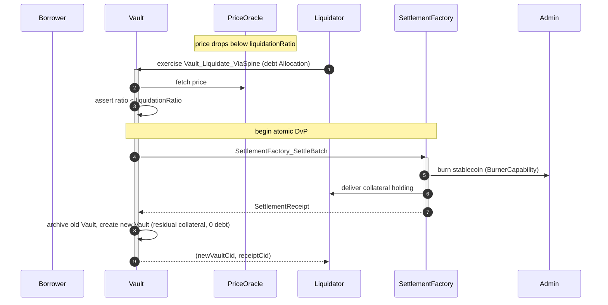

# Architectural Overview Report: Institutional Lending Protocol on Canton

Status: **reviewed reference-design report**, non-public, outside the committed
M1 public-library surface. This is RI #2 of four — see the suite-level view in [`00-portfolio.md`](./00-portfolio.md)
and the index [`README.md`](./README.md). It describes a *reference design* grounded in the
real OpenZeppelin Canton components in this workspace; it is **not** a claim of
M1/M3 acceptance, conformance, audit readiness, or production readiness.

> **Google Docs import:** `File → Open` this `.md` in Docs (or paste with
> `Edit → Paste`). H1/H2/H3 headings drive the Docs outline pane; the tables
> import cleanly; apply a monospace paragraph style to fenced code blocks after
> import. Mermaid blocks do not render in Docs — render them with
> `canton-settlement-explorer` and paste the image, keeping the fenced source.

> **Source-grounding tags** (used throughout):
> `[IMPLEMENTED]` real code in the M1 library base (`canton-specs` /
> `canton-contracts`) · `[EVIDENCE]` real code in an evidence repo
> (`canton-token-template`, `canton-stablecoin`, `zk-credential-gateway`), not
> the M1 surface · `[UPSTREAM]` Splice / CIP reference, not vendored here ·
> `[FUTURE]` proposed RI-level design, not built in M1 scope.

> **Design priority order** governs every interface and snippet, in this exact
> order: **1) Readability → 2) Simplicity → 3) Security → 4) Auditability.**

> **Grant alignment** (source of truth:
> [`../research/canton-ecosystem-grant-proposal.md`](../research/canton-ecosystem-grant-proposal.md),
> scope lock: [`../../M3_LENDING_SCOPE.md`](../../M3_LENDING_SCOPE.md)): this is
> **RI #2 (Lending Protocol)**. This document is the **Architecture
> Documentation** deliverable, authored in **grant M1** (research & design) for
> the Lending **implementation** in **grant M3** (Q3 2026). Its companion
> deliverables — working reference code, demo front-end, threat model, and (where
> relevant) an FI evaluation guide — are **named here but delivered in M3**
> (MIT-licensed). The report honors the **CIP-56 → CIP-0112 / Token Standard V2
> retarget**: settlement builds only on V2 abstractions.

---

## 1. Product Definition

This Reference Implementation (RI) is a fixed-rate, overcollateralized,
permissioned lending protocol designed for the Canton Network. It is a blueprint
for regulated DeFi lending workflows built around the **Vault** — an isolated
collateralized debt position (CDP) mapped onto Canton's privacy and settlement
primitives.

The architecture adapts the `canton-stablecoin` codebase `[EVIDENCE]` and wires
it onto the **CIP-0112 / Token Standard V2 settlement spine** `[IMPLEMENTED]`
(`OpenZeppelin.Experimental.Settlement.Cip112`). It embeds credential gating via
`zk-credential-gateway` `[EVIDENCE]` and capability-based access control via
[`oz-access-control`](../../access-control/daml/OpenZeppelin/AccessControl.daml) `[IMPLEMENTED]`, combining DeFi composability with
institutional compliance prerequisites. The target utility is tokenized treasury
operations, collateral mobility, and stablecoin issuance for institutional
actors who require deterministic outcomes with operational privacy.

### Educational Framing: Contract-per-Vault vs. Share-Accounting

Canton's structural paradigm diverges sharply from Ethereum's ERC-4626. Under
ERC-4626, a single globally visible contract manages pooled liquidity, debt
shares, and dynamic interest accrual for all participants — a monolithic state
that broadcasts every participant's collateral balance and liquidation
threshold publicly.

Canton operates on a UTXO-like model driven by Daml. The **vault-as-contract**
model deploys a discrete, isolated `Vault` contract for each borrower-issuer
relationship. This enforces Canton's per-party-projection privacy: a borrower's
collateral, debt, and liquidation threshold are concealed from the broader
network — observable only to the borrower, the vault issuer, and any regulatory
nodes explicitly placed in the contract's observer set. Replacing dynamic,
algorithmic rate curves with **fixed-rate, term-locked** parameters radically
simplifies auditability and yields a predictable primitive that is verifiable by
formal methods, avoiding the exploit vectors of utilization-based rate curves.

This is a deliberate departure from OpenZeppelin's own ERC-4626 tokenized-vault
lineage (which the grant cites as cross-ecosystem experience): a share-accounting
vault — one contract tracking a pooled underlying-to-share exchange rate, updated
by a `UpdateSharePrice`-style choice — is an EVM-shaped pattern, not a
Canton-idiomatic one, and it would broadcast pooled positions. The reference
design is also explicitly **keyless**: there is no `(operator, vaultId)`-keyed
`VaultState` / `VaultConfig` singleton resolved by `fetchByKey`. Daml-LF 2.1 has
no contract keys; configuration (`VaultParams`) and state (`Vault`) are separate
*contracts* referenced by ContractId, and every state change is
archive-and-recreate. Routing the protocol through pooled shares or contract-key
lookups would break both the per-borrower privacy model and the keyless
settlement semantics the spine depends on.

### Scope Definition

The bias favors simplicity, modular extensibility, and a demonstrably correct
core over feature complexity.

| Capability Domain | IN SCOPE (Reference design) | OUT OF SCOPE (Excluded) |
|---|---|---|
| Interest Model | Fixed-rate, fixed-term lending. `stabilityFeeRate` is an immutable, term-locked parameter in `VaultParams`. | Dynamic / variable / algorithmic rates, utilization rate curves, floating-rate oracles. |
| Collateralization | Overcollateralized borrowing against on-ledger assets; collateral deposit, withdrawal, debt repayment. | Undercollateralized loans, flash loans, recursive leverage, rehypothecation. |
| Liquidation | `Vault_Liquidate` on undercollateralization — fixed-discount collateral seizure with a fixed `liquidationBonus`. | Dynamic liquidation auctions, fractional liquidations, market-driven bidding wars. |
| Settlement | Atomic DvP **only** via `SettlementFactory_SettleBatch`. | Direct un-batched `Allocation_Settle` for co-settlement. |
| Pricing | `PriceOracle` mapping a single collateral asset to debt units for solvency thresholds. | Multi-asset dynamic oracles, external off-chain TWAP aggregators. |
| Identity & Compliance | D1 Shape B (signed node attestation) using `KycClaim` + `TrustedIssuerRegistry`; credential gating via `zk-credential-gateway`. | Cross-domain identity aggregation (ERC-3643, ONCHAINID, Chainlink CCID) — deferred, SCU-forward-compatible only. |
| Authority & Access | Single-admin capability (`oz-access-control`) for mint/burn/seizure/handoff. Multi-party attestation is a **named M3 extension**. | On-ledger multi-sig / DAO execution. |

### Target Users

Institutional asset managers, tokenized-fund issuers, and regulated stablecoin
operators that need high-value collateralized transactions, robust risk
parameters, and integration with compliance registries over decentralized,
resilient rails — without public data leakage.

---

## 2. Architecture Overview

The protocol decomposes into modular Daml templates mapped to life-cycle stages,
with strict role-based access control and a clean separation across collateral
custody, debt issuance, economic parameterization, and liquidation.

### System Components and Library Integration

| Component | Library Origin | Responsibility | Tag |
|---|---|---|---|
| `VaultParams` | `canton-stablecoin` | Immutable risk config: `minCollateralRatio`, `liquidationRatio`, `liquidationBonus`, fixed `stabilityFeeRate`. | `[EVIDENCE]` |
| `VaultFactory` | `canton-stablecoin` | Vault creation entry point (`VaultFactory_OpenVault`); the RI layers an initial compliance check before opening. | `[EVIDENCE]` |
| `Vault` | `canton-stablecoin` | Stateful CDP: `collateralAmount`, `debtAmount`, `params`, `lastAccrualTime`; choices `Vault_DepositCollateral`, `Vault_WithdrawCollateral`, `Vault_MintStablecoin`, `Vault_BurnStablecoin`, `Vault_Liquidate`, `Vault_Close`; helpers `accrueDebt`, `collateralRatio`. | `[EVIDENCE]` |
| `PriceOracle` | `canton-stablecoin` | Trusted feed: `collateralInstrumentId`, `price`, `updatedAt`, `observers`; updated via `PriceOracle_UpdatePrice`. | `[EVIDENCE]` |
| [`SettlementFactory`](../../experiments/cip112-settlement/daml/OpenZeppelin/Experimental/Settlement/Cip112.daml#L236) | `OpenZeppelin.Experimental.Settlement.Cip112` | Atomic multi-leg settlement: [`SettlementFactory_CreateAllocationRequest`](../../experiments/cip112-settlement/daml/OpenZeppelin/Experimental/Settlement/Cip112.daml#L244), [`SettlementFactory_CreateAllocationInstruction`](../../experiments/cip112-settlement/daml/OpenZeppelin/Experimental/Settlement/Cip112.daml#L267), [`SettlementFactory_SettleBatch`](../../experiments/cip112-settlement/daml/OpenZeppelin/Experimental/Settlement/Cip112.daml#L288). | `[IMPLEMENTED]` |
| Role management | `oz-access-control` | [`RoleGrant`](../../access-control/daml/OpenZeppelin/AccessControl.daml), [`RoleAdmin`](../../access-control/daml/OpenZeppelin/AccessControl.daml), [`requireRole`](../../access-control/daml/OpenZeppelin/AccessControl.daml); `roleId : MyRole -> Text` closed-sum wrapper prevents string-matching role collisions. | `[IMPLEMENTED]` |
| Admin flow | `oz-ownable` / `oz-pausable` | [`Ownership`](../../ownable/daml/OpenZeppelin/Ownable.daml)/[`OwnershipOffer`](../../ownable/daml/OpenZeppelin/Ownable.daml) for handoff; [`PauseState`](../../pausable/daml/OpenZeppelin/Pausable.daml)/[`whenNotPaused`](../../pausable/daml/OpenZeppelin/Pausable.daml) kill-switch. | `[IMPLEMENTED]` |
| Credentials | `zk-credential-gateway` | `CredentialGatedActionRequest`, `MockVerificationResult`, `MockVerifierAuthorization`, `CredentialRevocationStatus` for KYC gating. | `[EVIDENCE]` |
| Typed D3 identity | `canton-specs` identity-hook Shape-B | `KycClaim`, `TrustedIssuerRegistry` — the forward-compatible D3 shape, layered via SCU. | `[IMPLEMENTED]` (experimental) |

> **Attribution note:** `KycClaim` and `TrustedIssuerRegistry` are the typed D3
> identity **Shape-B** types demonstrated in the `canton-specs`
> identity-hook-shape-b / identity-hook-upgrade experiments, **not** templates
> inside `zk-credential-gateway`. The gateway supplies the gating/verification
> primitives; the typed KYC claim shape is the forward-compatible target.

### Party and Role Model

Data visibility is bounded by contract participation (signatory/observer).

- **Admin / Issuer** — primary underwriter of the stablecoin and debt tokens.
  Assigned via `RoleAdmin`; holds the `BurnerCapability` and configures the
  `TrustedIssuerRegistry`. Guarantor of economic integrity.
- **Borrower** — institutional entity locking collateral. Must present a valid
  `MockVerificationResult` derived from a `KycClaim` to interact with the
  `VaultFactory`. Visibility limited to their own `Vault`s and public config.
- **Liquidator** — specialized role granted via `oz-access-control`. Runs
  off-ledger monitoring of `PriceOracle` and vault solvency; authorized to
  exercise `Vault_Liquidate` on a breach.
- **Oracle Provider** — authorized via a specific `RoleGrant` to call
  `PriceOracle_UpdatePrice`. Tightly guarded given oracle-manipulation risk.

### Trust and Topology

The topology separates public market data from private positions. `PriceOracle`
and `VaultParams` are highly visible (signatory `admin`, broad observer set), so
participants can independently verify the governing parameters. The `Vault`
minimizes its observer set — `admin`, the specific `borrower`, and designated
regulatory nodes only. Because Canton applies transaction execution at the
hosting participant node, compliance checks run locally, fail-closed, on every
settlement leg before global finalization — no external API calls, no caching.

M1 uses **single-admin capability authority** for mint/burn/seizure. The
architecture anticipates **Multi-Party Attestation** as a named M3 extension: a
vault issuer that is *multiply attested*, where several independent attestors
hold distinct `MockVerifierAuthorization` roles and a vault is compliant only
when the required attestors' credentials overlap — decentralizing the trust
anchor without an on-ledger multi-sig execution bottleneck.

---

## 3. How We Implement It

The CDP model is expressed as a sequence of atomic Canton transactions under
Daml-LF 2.1 keyless semantics: every state change archives the prior contract
and recreates an updated instance with a new Contract ID.

### The Settlement-Spine Flow

All value transfers to/from the `Vault` route through
[`SettlementFactory_SettleBatch`](../../experiments/cip112-settlement/daml/OpenZeppelin/Experimental/Settlement/Cip112.daml#L288) for atomic DvP. The direct [`Allocation_Settle`](../../experiments/cip112-settlement/daml/OpenZeppelin/Experimental/Settlement/Cip112.daml#L483)
path is not used for DvP — it proves authorization of a single leg, not atomic
co-settlement of interdependent legs.

1. **Vault origination + collateral deposit.** The borrower creates an
   [`AllocationInstruction`](../../experiments/cip112-settlement/daml/OpenZeppelin/Experimental/Settlement/Cip112.daml#L383) (via [`SettlementFactory_CreateAllocationInstruction`](../../experiments/cip112-settlement/daml/OpenZeppelin/Experimental/Settlement/Cip112.daml#L267),
   accepted to lock the collateral into an [`Allocation`](../../experiments/cip112-settlement/daml/OpenZeppelin/Experimental/Settlement/Cip112.daml#L468)) and presents a
   `CredentialGatedActionRequest` + `MockVerificationResult` to the
   `VaultFactory`. On successful compliance verification, `VaultFactory_OpenVault`
   batch-settles the collateral into custody and instantiates the `Vault` with a
   verified `collateralAmount`. (Subsequent top-ups use `Vault_DepositCollateral`;
   reductions use `Vault_WithdrawCollateral`, both solvency-checked.)
2. **Borrow (debt disbursement).** The borrower exercises `Vault_MintStablecoin`.
   The vault runs a deterministic solvency check — requested debt plus existing
   debt must keep `collateralRatio` at or above `VaultParams.minCollateralRatio`
   priced by `PriceOracle`. On success the admin mints stablecoin holdings
   delivered to the borrower via a `SettleBatch` leg; the old `Vault` is archived
   and recreated with the updated `debtAmount`.
3. **Repay.** The borrower allocates debt tokens and exercises
   `Vault_BurnStablecoin`; a batch settlement transfers the debt tokens to the
   admin (burned via [`BurnerCapability`](../../experiments/cip112-settlement/daml/OpenZeppelin/Experimental/Settlement/Cip112.daml#L160)) and reduces `debtAmount`. Collateral is
   released proportionally via `Vault_WithdrawCollateral` when the loan closes
   (`Vault_Close`).
4. **Liquidation.** If `PriceOracle` shows the vault below `liquidationRatio`, an
   authorized liquidator exercises `Vault_Liquidate`, providing an `Allocation`
   of stablecoin covering the debt plus the `liquidationBonus`. `SettleBatch`
   atomically burns the liquidator's debt tokens, clears the position, and sweeps
   the collateral to the liquidator; any residual collateral is recreated in a
   new `Vault` for the borrower.

### D1–D4 Attachment Strategy

- **D1 — compliance (node-applied).** Checked on every leg. The RI selects
  **Shape B** (signed node attestation) over Shape A (off-ledger gate): a
  `KycClaim` from a `TrustedIssuerRegistry` is submitted as a native contract
  payload, so the engine enforces compliance deterministically at the
  participant node with no external calls. A `CredentialRevocationStatus` of
  revoked triggers fail-closed rejection via the optional [`D1ComplianceHook`](../../experiments/cip112-settlement/daml/OpenZeppelin/Experimental/Settlement/Cip112.daml#L103).
  *(Open, non-blocking: whether the contract stays oblivious or verifies the
  attestation on-ledger at exercise time — the node-applied signed attestation
  is `[FUTURE]`; the hook today is a reference field only.)*
- **D2 — seizure (lock-and-sweep).** Under legal mandate the admin sweeps
  collateral to an admin-**preset** `custodianDestination` (carried in the
  spine's [`D2SeizureHook`](../../experiments/cip112-settlement/daml/OpenZeppelin/Experimental/Settlement/Cip112.daml#L108) config record), gated by the single-admin
  [`BurnerCapability`](../../experiments/cip112-settlement/daml/OpenZeppelin/Experimental/Settlement/Cip112.daml#L160). In-flight allocations use the real spine choices
  [`Allocation_MarkD2InFlightSeizure`](../../experiments/cip112-settlement/daml/OpenZeppelin/Experimental/Settlement/Cip112.daml#L543) → [`Allocation_SweepD2InFlightSeizure`](../../experiments/cip112-settlement/daml/OpenZeppelin/Experimental/Settlement/Cip112.daml#L552);
  locked vault collateral uses the forced-burn-to-custodian path
  (`LockedSimpleHolding_ForcedBurn` evidence). Seized assets are **never** burned
  and **never** returned to sender; ordinary transfer *failures* do return to
  sender.
- **D3 — identity.** Single-domain v1 with issuer-held KYC. Cross-domain
  (ERC-3643 / ONCHAINID / Chainlink CCID) deferred but forward-compatible via
  additive SCU.
- **D4 — authority.** Single-admin capability via [`oz-access-control`](../../access-control/daml/OpenZeppelin/AccessControl.daml)
  ([`RoleAdmin`](../../access-control/daml/OpenZeppelin/AccessControl.daml)) for pause, parameter updates, and seizure. On-ledger multi-sig is
  an M3 extension `[FUTURE]` (D4→M3).

### The SCU Extension Story

The SCU rule: never mutate an existing choice's arguments to require a new field.
Extend via appended `Optional` fields, new serializable types, and new choices.
New interfaces are likewise added by new templates/choices implementing them, not
by retroactively re-instancing the deployed `Vault` — Daml 3.x removed
**retroactive interface instances** `[UPSTREAM]` precisely because they broke
clean upgrade paths.

Example — adding a cross-chain identity hash for future regulation: the `Vault`
template gains `crossDomainIdentity : Optional Text` (read `None` by older
contracts), and a **new** choice `Vault_UpdateIdentity` records it. The existing
`Vault_MintStablecoin` / `Vault_BurnStablecoin` choices keep their type
signatures untouched, so older clients keep working — compliance is layered over
time without a network-wide breaking upgrade. This is the same additive path
proven in the `canton-specs` identity-hook upgrade spike.

---

## 4. Interfaces & Usage Examples

Interfaces are prioritized by Readability, Simplicity, Security, Auditability.
RI-level templates that adapt or extend `canton-stablecoin` are tagged
`[FUTURE]`; field/choice names match real `canton-stablecoin` source.

### 4.1 Role wrappers `[FUTURE]`

```daml
module Lending.Types where

import OpenZeppelin.AccessControl (RoleGrant)

-- Closed-sum wrapper: precise role ids, no raw-string matching.
data VaultRole = VaultAdmin | Liquidator | OracleProvider | Pauser
  deriving (Eq, Show)

roleId : VaultRole -> Text
roleId VaultAdmin     = "VAULT_ADMIN"
roleId Liquidator     = "LIQUIDATOR"
roleId OracleProvider = "ORACLE_PROVIDER"
roleId Pauser         = "PAUSER"
```

### 4.2 Configuration and pricing `[EVIDENCE]` (canton-stablecoin shapes)

```daml
-- Real canton-stablecoin shapes (field names exact); shown for grounding.
template VaultParams
  with
    admin : Party
    collateralInstrumentId : Text
    stablecoinInstrumentId : Text
    minCollateralRatio : Decimal   -- e.g. 1.50 (150%)
    liquidationRatio : Decimal     -- triggers Vault_Liquidate below this
    liquidationBonus : Decimal     -- fixed-discount penalty, e.g. 0.10
    stabilityFeeRate : Decimal     -- FIXED, term-locked (no variable accrual)
  where
    signatory admin
    observer admin                 -- extendable to public observers

template PriceOracle
  with
    admin : Party
    collateralInstrumentId : Text
    price : Decimal                -- collateral valued in stablecoin units
    updatedAt : Time
    observers : [Party]
  where
    signatory admin
    observer observers
    -- choice PriceOracle_UpdatePrice (controller admin / oracle-provider role)
```

### 4.3 Vault opening with identity gating `[FUTURE]` (RI adapter over `VaultFactory_OpenVault`)

```daml
module Lending.Vault where

import OpenZeppelin.Experimental.Settlement.Cip112 (SettlementFactory)
import ZkCredentialGateway.GatedAction (CredentialGatedActionRequest)
import ZkCredentialGateway.Verification (MockVerificationResult)
-- KycClaim / TrustedIssuerRegistry: canton-specs identity-hook Shape-B
import IdentityHook.ShapeB (KycClaim, TrustedIssuerRegistry)

template LendingVaultFactory
  with
    admin : Party
    registryCid : ContractId TrustedIssuerRegistry
    paramsCid : ContractId VaultParams
  where
    signatory admin

    -- New RI choice wrapping the canton-stablecoin VaultFactory_OpenVault path.
    nonconsuming choice LendingVaultFactory_OpenGatedVault : ContractId Vault
      with
        borrower : Party
        complianceRequest : CredentialGatedActionRequest
        verificationResult : MockVerificationResult
        kycClaim : KycClaim
      controller borrower            -- two-step handshake: borrower co-authorizes
      do
        -- D1 Shape B: deterministic, node-applied validation (no external calls).
        assertMsg "KYC issuer not trusted" (kycClaim.declaredIssuer == admin)
        assertMsg "verification not accepted" (isAccepted verificationResult)
        -- Delegate to the real factory choice to open the Vault.
        -- exercise vaultFactoryCid VaultFactory_OpenVault with ..
        create Vault with .. -- (canton-stablecoin Vault; see 4.4)
```

### 4.4 Liquidation + D2 seizure `[FUTURE]` (adapting `Vault_Liquidate` `[EVIDENCE]`)

```daml
-- canton-stablecoin Vault fields (exact): admin, owner, collateralInstrumentId,
-- stablecoinInstrumentId, collateralAmount, debtAmount, params, lastAccrualTime.
-- Vault_Liquidate is a real choice; the RI routes its DvP through SettleBatch.

    choice Vault_Liquidate_ViaSpine : (ContractId Vault, ContractId SettlementReceipt)
      with
        liquidator : Party
        oracleCid : ContractId PriceOracle
        settlementFactoryCid : ContractId SettlementFactory
        debtAllocationId : ContractId Allocation     -- liquidator's committed stablecoin
      controller liquidator
      do
        params <- fetch paramsCid
        oracle <- fetch oracleCid
        -- Solvency: must be below liquidationRatio to liquidate.
        let ratio = (collateralAmount * oracle.price) / debtAmount
        assertMsg "vault is solvent" (ratio < params.liquidationRatio)

        -- Atomic DvP: liquidator pays debt + liquidationBonus, receives collateral.
        -- Atomicity is solely via SettlementFactory_SettleBatch.
        receipt <- exercise settlementFactoryCid SettlementFactory_SettleBatch with
          allocations = [debtAllocationId]
          requests = []                 -- collateral delivery leg(s) configured here
        -- residual collateral recreated in a new Vault for the borrower.
        newVault <- create this with debtAmount = 0.0
        return (newVault, receipt)

    -- D2 lock-and-sweep: NO bespoke "D2SeizureHook_Sweep" template — D2SeizureHook
    -- is a spine config record (seizureCaseRef, custodianDestination,
    -- inFlightHandlingStatus). Seizure is gated by BurnerCapability and routes to
    -- the preset custodianDestination; never burn, never return-to-sender.
```

---

## 5. Diagrams

Mermaid below maps to scenarios validatable in `canton-settlement-explorer`
(presets: Batch DvP, Multi-leg Settlement). Render externally for Docs.

### 5.1 Interface and Component Diagram


### 5.2 Flow-of-Funds and Settlement Diagram (Liquidation)



---

## 6. Library Dependencies

### 6.1 Internal Dependencies

| Package | Consumed Templates / Primitives | Rationale | Tag |
|---|---|---|---|
| `canton-token-template` | `SimpleHolding`, `LockedSimpleHolding`, `SimpleTokenRules`, `TransferPreapproval`, `*_ForcedBurn` | Asset representation + forced-burn/seizure evidence (D2 collateral sweep). | `[EVIDENCE]` |
| `canton-stablecoin` | `Vault`, `VaultFactory`, `VaultParams`, `PriceOracle`, `Vault_Liquidate` | Core CDP mechanics — the lending operational logic. | `[EVIDENCE]` |
| `oz-access-control` | [`RoleGrant`](../../access-control/daml/OpenZeppelin/AccessControl.daml), [`RoleAdmin`](../../access-control/daml/OpenZeppelin/AccessControl.daml), `DefaultAdminTransferOffer`, [`requireRole`](../../access-control/daml/OpenZeppelin/AccessControl.daml) | Capability-based authority and the party/role model. | `[IMPLEMENTED]` |
| `oz-ownable` | [`Ownership`](../../ownable/daml/OpenZeppelin/Ownable.daml), [`OwnershipOffer`](../../ownable/daml/OpenZeppelin/Ownable.daml) | Administrative handoff between legal entities. | `[IMPLEMENTED]` |
| `oz-pausable` | [`PauseState`](../../pausable/daml/OpenZeppelin/Pausable.daml), [`whenNotPaused`](../../pausable/daml/OpenZeppelin/Pausable.daml) | Emergency protocol freeze. | `[IMPLEMENTED]` |
| `zk-credential-gateway` | `CredentialGatedActionRequest`, `MockVerificationResult`, `MockVerifierAuthorization`, `CredentialRevocationStatus` | D1 compliance / KYC gating without on-chain data leakage. | `[EVIDENCE]` |
| `OpenZeppelin.Experimental.Settlement.Cip112` | [`SettlementFactory`](../../experiments/cip112-settlement/daml/OpenZeppelin/Experimental/Settlement/Cip112.daml#L236), [`Allocation`](../../experiments/cip112-settlement/daml/OpenZeppelin/Experimental/Settlement/Cip112.daml#L468), [`AllocationInstruction`](../../experiments/cip112-settlement/daml/OpenZeppelin/Experimental/Settlement/Cip112.daml#L383), [`AllocationRequest`](../../experiments/cip112-settlement/daml/OpenZeppelin/Experimental/Settlement/Cip112.daml#L326), [`SettlementReceipt`](../../experiments/cip112-settlement/daml/OpenZeppelin/Experimental/Settlement/Cip112.daml#L585), [`BurnerCapability`](../../experiments/cip112-settlement/daml/OpenZeppelin/Experimental/Settlement/Cip112.daml#L160), [`D1ComplianceHook`](../../experiments/cip112-settlement/daml/OpenZeppelin/Experimental/Settlement/Cip112.daml#L103), [`D2SeizureHook`](../../experiments/cip112-settlement/daml/OpenZeppelin/Experimental/Settlement/Cip112.daml#L108) | Atomic DvP spine; D1/D2 seams. | `[IMPLEMENTED]` (experimental) |
| `canton-specs` identity-hook Shape-B | `KycClaim`, `TrustedIssuerRegistry` | Typed D3 identity, layered via SCU. | `[IMPLEMENTED]` (experimental) |

### 6.2 External Dependencies

The settlement mechanics rely on the **Splice Token Standard V2** interfaces
`[UPSTREAM]`, superseding CIP-0056.

- **Present implementation:** local mocks/stand-ins designed to **maximally match
  the Splice V2 standard interfaces**. Source-of-record pin:
  `hyperledger-labs/splice` @ `token-standard-v2-upcoming` @ `1e34121b…` (the
  literal `canton-network/splice` @ `token-standard-v2-daml-preview` @
  `b91de5d4…` "preview" branch is demoted to historical evidence; its V2 DAR set
  and checksums are catalogued in
  `canton-token-template/docs/CIP-0112-EXTENSION-PLAN.md`). Design against
  *interfaces*, not DAR/package-ID pins (RI_RESEARCH_BRIEFING.md).
- **Planned migration:** once published Splice Token Standard V2 DARs ship and
  the import gate clears (PLAN.md; `M3_LENDING_SCOPE.md` §A), local stand-ins are
  swapped for the published DARs — intended as a thin substitution. **Note:**
  import remains gated; no public-API stability, conformance, or
  release-readiness claim.

---

## 7. Security & Auditability

Security relies on Daml ledger immutability, the absence of global state, and
node-applied execution. The validation ladder spans static analysis, generative
property testing, and formal proofs.

### 7.1 Security Invariants

- **Solvency conservation.** Collateral can never be withdrawn (or a borrow
  succeed) if it would push `collateralRatio` below `VaultParams.minCollateralRatio`;
  `Vault_Liquidate` is bounded by `ratio < liquidationRatio`.
- **Debt conservation.** Stablecoin minted on borrow equals debt recorded; debt
  burned on repay equals debt cleared. No unbacked issuance — minting requires
  the admin's authority and a solvency-passing vault.
- **Settlement atomicity.** Liquidation and repayment are single `SettleBatch`
  transactions: they either complete fully or revert — no partial liquidation.

### 7.2 The Validation Ladder

| Tier | Tooling | Purpose and Scope |
|---|---|---|
| Level 1: Static analysis | `daml-lint` | Decimal bounds, unguarded division, positivity, archive-before-execute; verifies the `roleId` closed-sum wrapper and `whenNotPaused` guards on state-altering choices. |
| Level 2: Generative testing | `daml-props` | Property-based testing with shrinking: conservation/supply/balance invariants under fuzzed inputs; verifies unauthorized parties cannot reach admin functions (D4). |
| Level 3: Formal verification | `daml-verify` | Z3-backed proofs: collateral cannot be extracted below `minCollateralRatio`; `Vault_Liquidate` is bounded by the solvency assertion; pause/compliance bypass is impossible. |

(Tooling exists in the workspace; no benchmark latencies are claimed.)

### 7.3 Threat Model and Failure Modes

| Vector | Failure Mode | Mitigation |
|---|---|---|
| Oracle manipulation | `PriceOracle` manipulated or stalled → unjust liquidations or bad-debt accrual. | Updates restricted via `oz-access-control` `RoleGrant` to trusted providers; bound max price deviation per update and reject anomalous spikes. |
| Settlement-leg failure | Liquidator under-funds the batch → attempted partial/broken liquidation. | Daml atomicity: the `SettleBatch` reverts entirely; partial liquidation is impossible; collateral stays locked, no debt cleared. |
| Compliance evasion (D1) | Borrower attempts to bypass KYC. | Shape B requires a statically-provided `KycClaim` validated against the `TrustedIssuerRegistry`; a protected choice cannot execute without valid credentials in the payload (fail-closed). |
| Unauthorized admin action | Attacker tries to mint unbacked debt or invoke D2 seizure. | Requires a valid `BurnerCapability` / `RoleAdmin` contract id, unforgeable under Daml-LF semantics; D2 sweep is hardcoded to the preset `custodianDestination`. |

---

## 8. Cross-Synchronizer Domain Extension (Planned) `[FUTURE]`

> **Shared model:** the cross-synchronizer mechanism (per-synchronizer
> assignment + unassign/assign reassignment, and the SCU-compliant additive
> path) is identical across all four RIs and is owned in
> [`00-portfolio.md`](./00-portfolio.md) §5. This section elaborates only the
> RI-specific topology.

> **Status: out of scope for the initial M1 design; deferred and planned for
> eventual development.** Today the protocol and the CIP-0112 scaffold are
> **single-synchronizer**, and D3 cross-domain identity is deferred (PLAN.md
> Decision Log; AGENTS.md §Decision Authority). This section plans the extension
> following Canton's real cross-synchronizer model (per-synchronizer contract
> assignment + the unassign/assign reassignment protocol) and the SCU rule.

### 8.1 What "cross-synchronizer" means for a lending vault

Each contract is assigned to exactly one synchronizer; a transaction uses only
contracts on the same synchronizer. A cross-synchronizer lending protocol is not
one globally visible vault — it is per-synchronizer `Vault`, `PriceOracle`, and
`VaultParams` contracts plus a disciplined reassignment workflow that preserves
atomicity and privacy across domains.

### 8.2 Where the protocol touches the synchronizer boundary

| Element | Single-domain v1 (today) | Cross-synchronizer extension (planned) |
|---|---|---|
| `Vault` | One vault on the home synchronizer. | Vault stays on its home synchronizer; cross-domain collateral is reassigned in for the settling transaction, then results reassigned back. |
| Collateral / debt `Allocation` | Created and settled on the vault's synchronizer. | Must be **reassignable**: collateral on the borrower's home synchronizer is unassigned, assigned to the vault's synchronizer before `SettleBatch`. |
| `PriceOracle` | One oracle per synchronizer. | Liquidation must price against the oracle on the **settling** synchronizer; no stale cross-domain price reuse. |
| D1 compliance | Node-side check on the settling synchronizer. | Re-evaluated on whichever synchronizer the leg settles; no attestation carried across a reassignment (fail-closed holds). |
| D3 identity | Single-domain `KycClaim`. | Cross-domain identity (ONCHAINID / ERC-3643 / CCID) resolved into a synchronizer-aware `TrustedIssuerRegistry` — the deferred D3 work. |

### 8.3 The additive, non-breaking path (SCU-compliant)

1. Append `Optional SynchronizerScope` to `Vault` / RI allocation wrappers; older
   contracts read `None` and behave as today.
2. Add a new parallel choice (e.g. `Vault_LiquidateCrossDomain`) alongside the
   unchanged single-domain choice.
3. Model reassignment as workflow, not mutation: reassign collateral/debt
   allocations onto the vault's synchronizer → `SettleBatch` there → reassign
   results back. Each step is an archive-and-recreate-style assignment.
4. Keep atomicity at the batch boundary: true DvP stays a single `SettleBatch` on
   one synchronizer; cross-domain atomicity is achieved by reassigning all legs
   onto that synchronizer *before* the batch.

### 8.4 Open questions specific to cross-synchronizer operation

- Reassignment-vs-settlement atomicity: if collateral is assigned to the vault's
  synchronizer but `SettleBatch` then fails, is the reassignment rolled back, or
  does the borrower retain a re-home-able allocation? (Maps to return-to-sender.)
- Cross-domain liquidation: which synchronizer's `PriceOracle` and liquidator set
  govern a vault whose collateral lives on another synchronizer?
- Cross-domain D1 freshness: confirm compliance is re-checked on the settling
  synchronizer, never reused across a reassignment.
- Reassignment tooling maturity (evolving Canton/Digital Asset stack); assumes
  drop-in integration as it matures.

---

## Implementation Status (Code Map)

> **Living document.** Each row links to real source. Refresh the anchors with
> `scripts/refresh-ri-anchors.sh` (see [`README.md`](./README.md)). Status:
> ✅ implemented in the promoted library surface (or verified passing tests) ·
> 🟡 implemented in the **experimental settlement scaffold** (real code, not
> yet promoted; includes toy stand-ins) · ⬜ planned, not built in M1.

| RI capability | Source anchor | Status |
|---|---|---|
| Settlement factory (DvP entry point) | [`SettlementFactory`](../../experiments/cip112-settlement/daml/OpenZeppelin/Experimental/Settlement/Cip112.daml#L236) | 🟡 |
| Atomic batch settle (collateral / borrow / repay / liquidation movements) | [`SettlementFactory_SettleBatch`](../../experiments/cip112-settlement/daml/OpenZeppelin/Experimental/Settlement/Cip112.daml#L288) | 🟡 |
| Create allocation request | [`SettlementFactory_CreateAllocationRequest`](../../experiments/cip112-settlement/daml/OpenZeppelin/Experimental/Settlement/Cip112.daml#L244) | 🟡 |
| Create allocation instruction | [`SettlementFactory_CreateAllocationInstruction`](../../experiments/cip112-settlement/daml/OpenZeppelin/Experimental/Settlement/Cip112.daml#L267) | 🟡 |
| Allocation request lifecycle | [`AllocationRequest`](../../experiments/cip112-settlement/daml/OpenZeppelin/Experimental/Settlement/Cip112.daml#L326) · [`AllocationRequest_Accept`](../../experiments/cip112-settlement/daml/OpenZeppelin/Experimental/Settlement/Cip112.daml#L340) · [`AllocationRequest_Reject`](../../experiments/cip112-settlement/daml/OpenZeppelin/Experimental/Settlement/Cip112.daml#L347) · [`AllocationRequest_Withdraw`](../../experiments/cip112-settlement/daml/OpenZeppelin/Experimental/Settlement/Cip112.daml#L354) | 🟡 |
| Allocation instruction lifecycle | [`AllocationInstruction`](../../experiments/cip112-settlement/daml/OpenZeppelin/Experimental/Settlement/Cip112.daml#L383) · [`AllocationInstruction_Accept`](../../experiments/cip112-settlement/daml/OpenZeppelin/Experimental/Settlement/Cip112.daml#L396) · [`AllocationInstruction_Withdraw`](../../experiments/cip112-settlement/daml/OpenZeppelin/Experimental/Settlement/Cip112.daml#L414) | 🟡 |
| Allocation (locked collateral / debt leg) | [`Allocation`](../../experiments/cip112-settlement/daml/OpenZeppelin/Experimental/Settlement/Cip112.daml#L468) · [`Allocation_Settle`](../../experiments/cip112-settlement/daml/OpenZeppelin/Experimental/Settlement/Cip112.daml#L483) · [`Allocation_Cancel`](../../experiments/cip112-settlement/daml/OpenZeppelin/Experimental/Settlement/Cip112.daml#L526) · [`Allocation_Withdraw`](../../experiments/cip112-settlement/daml/OpenZeppelin/Experimental/Settlement/Cip112.daml#L534) | 🟡 |
| Settlement receipt | [`SettlementReceipt`](../../experiments/cip112-settlement/daml/OpenZeppelin/Experimental/Settlement/Cip112.daml#L585) | 🟡 |
| Transfer leg record | [`TransferLeg`](../../experiments/cip112-settlement/daml/OpenZeppelin/Experimental/Settlement/Cip112.daml#L67) | 🟡 |
| D1 compliance hook (reference field; node-applied signed attestation is `[FUTURE]`) | [`D1ComplianceHook`](../../experiments/cip112-settlement/daml/OpenZeppelin/Experimental/Settlement/Cip112.daml#L103) | 🟡 |
| D2 seizure hook config (preset `custodianDestination`) | [`D2SeizureHook`](../../experiments/cip112-settlement/daml/OpenZeppelin/Experimental/Settlement/Cip112.daml#L108) | 🟡 |
| D2 lock-and-sweep on in-flight allocations | [`Allocation_MarkD2InFlightSeizure`](../../experiments/cip112-settlement/daml/OpenZeppelin/Experimental/Settlement/Cip112.daml#L543) · [`Allocation_SweepD2InFlightSeizure`](../../experiments/cip112-settlement/daml/OpenZeppelin/Experimental/Settlement/Cip112.daml#L552) | 🟡 |
| Seizure capability (gates burn / D2 sweep) | [`BurnerCapability`](../../experiments/cip112-settlement/daml/OpenZeppelin/Experimental/Settlement/Cip112.daml#L160) | 🟡 |
| Holding lock / archive / unlock helpers | [`lockInputHoldings`](../../experiments/cip112-settlement/daml/OpenZeppelin/Experimental/Settlement/Cip112.daml#L682) · [`archiveHoldings`](../../experiments/cip112-settlement/daml/OpenZeppelin/Experimental/Settlement/Cip112.daml#L706) · [`unlockHoldings`](../../experiments/cip112-settlement/daml/OpenZeppelin/Experimental/Settlement/Cip112.daml#L714) | 🟡 |
| Toy holding (stand-in for the real TSv2 holding interface) | [`ToyHolding`](../../experiments/cip112-settlement/daml/OpenZeppelin/Experimental/Settlement/Cip112.daml#L195) | 🟡 |
| Experimental feature flag | [`experimentalFeatureFlag`](../../experiments/cip112-settlement/daml/OpenZeppelin/Experimental/Settlement/Cip112.daml#L133) | 🟡 |
| Spine test coverage (20 scripts) | [`Cip112Settlement.daml`](../../test/daml/OpenZeppelin/Test/Cip112Settlement.daml) | ✅ |
| Role / capability authority (D4) | [`RoleGrant`](../../access-control/daml/OpenZeppelin/AccessControl.daml) · [`RoleAdmin`](../../access-control/daml/OpenZeppelin/AccessControl.daml) · [`requireRole`](../../access-control/daml/OpenZeppelin/AccessControl.daml) · [`hasRole`](../../access-control/daml/OpenZeppelin/AccessControl.daml) | ✅ |
| Admin handoff | [`Ownership`](../../ownable/daml/OpenZeppelin/Ownable.daml) · [`OwnershipOffer`](../../ownable/daml/OpenZeppelin/Ownable.daml) | ✅ |
| Emergency freeze | [`PauseState`](../../pausable/daml/OpenZeppelin/Pausable.daml) · [`whenNotPaused`](../../pausable/daml/OpenZeppelin/Pausable.daml) | ✅ |
| Real TSv2 holding interface (replaces `ToyHolding`) | — `[FUTURE]` | ⬜ |
| Node-applied signed D1 attestation (on-ledger verification at exercise) | — `[FUTURE]` | ⬜ |
| Vault / CDP (`Vault`, `VaultFactory`, `VaultParams`) | `canton-stablecoin` `[EVIDENCE]` (`stablecoin/daml/Stablecoin/Vault.daml`) | ⬜ |
| Interest accrual (`accrueDebt`, fixed `stabilityFeeRate`) | `canton-stablecoin` `[EVIDENCE]` `[FUTURE]` (RI logic not built in M1) | ⬜ |
| Liquidation engine (`Vault_Liquidate` via spine) | `canton-stablecoin` `[EVIDENCE]` `[FUTURE]` (RI logic not built in M1) | ⬜ |
| Price oracle (`PriceOracle`, `PriceOracle_UpdatePrice`) | `canton-stablecoin` `[EVIDENCE]` (`stablecoin/daml/Stablecoin/Oracle.daml`) `[FUTURE]` | ⬜ |
| Cross-synchronizer operation (D3 deferred) | — `[FUTURE]` (see §8) | ⬜ |
| On-ledger multi-sig authority (D4→M3) | — `[FUTURE]` | ⬜ |

## 9. Open Questions

- **Multi-party attestation scaling (M3).** Multi-attestation can be expressed by
  stacking `oz-access-control` grants, but threshold mechanics (e.g. 2-of-3
  compliance verifiers) are undecided: native in the `VaultFactory` vs an
  intermediary authorization contract (separation of concerns).
- **Cross-domain identity sub-systems.** When ERC-3643 / ONCHAINID are added via
  SCU, the on-chain mapping equating an external CCID with a Canton `KycClaim`
  needs formal specification.
- **Iterated-settlement edge cases.** If a borrower commits funds via
  `nextIterationFunding` but lets the time-lock expire without finalizing, how is
  the automated return orchestrated without manual admin intervention?
- **Oracle update economics.** `PriceOracle` has no inherent on-chain incentive;
  whether high-frequency updates need a fee carve-out from `stabilityFeeRate` to
  offset node-attestation costs is open.
- **Cross-synchronizer operation** (see §8) — deferred; tracked there until
  ecosystem reassignment tooling matures.
- **Composability with the other RIs** (forward-compatibility; suite view
  [`00-portfolio.md`](./00-portfolio.md) §3): seized collateral from
  `Vault_Liquidate` could be routed to the Auction RI
  ([`04`](./04-confidential-auction.md)) for confidential fair-value recovery;
  conversely, a borrower can mint stablecoin here and **bid in the Auction RI**.
  Lending shares the vault / oracle / credential stack with the Stablecoin RI
  ([`03`](./03-cross-chain-stablecoin.md)) — all over the shared
  `SettlementFactory_SettleBatch` spine.

---

## References

All interface, template, choice, and field names are grounded in real source in
this workspace (verified 2026-06-24). Authoritative sources:

- **Vault / CDP / oracle** `[EVIDENCE]` —
  `canton-stablecoin/stablecoin/daml/Stablecoin/{Vault,Oracle}.daml`
  (`VaultParams`, `VaultFactory` + `VaultFactory_OpenVault`, `Vault` +
  `Vault_{DepositCollateral,WithdrawCollateral,MintStablecoin,BurnStablecoin,Liquidate,Close}`,
  `PriceOracle` + `PriceOracle_UpdatePrice`).
- **Settlement spine** `[IMPLEMENTED]` —
  `canton-specs/experiments/cip112-settlement/daml/OpenZeppelin/Experimental/Settlement/Cip112.daml`.
- **Holdings / forced-burn / rules / preapproval** `[EVIDENCE]` —
  `canton-token-template/simple-token/daml/SimpleToken/{Holding,Rules,Preapproval}.daml`.
- **Credential gating / verification** `[EVIDENCE]` —
  `zk-credential-gateway/daml/src/ZkCredentialGateway/{GatedAction,Verification,Types}.daml`.
- **Typed D3 identity (KycClaim, TrustedIssuerRegistry)** `[IMPLEMENTED]` —
  `canton-specs/experiments/identity-hook-shape-b/` and `identity-hook-upgrade-*/`.
- **AL-7 primitives** `[IMPLEMENTED]` — `canton-specs` `access-control/`,
  `ownable/`, `pausable/`.
- **Decision authority (D1–D4), scope, SCU rule** — root
  [`PLAN.md`](../../PLAN.md), [`AGENTS.md`](../../AGENTS.md), briefing
  [`docs/research/RI_RESEARCH_BRIEFING.md`](../research/RI_RESEARCH_BRIEFING.md).
- **Grant scope / milestones / deliverables (source of truth)** —
  [`docs/research/canton-ecosystem-grant-proposal.md`](../research/canton-ecosystem-grant-proposal.md)
  (PR #298, approved; CIP-56→CIP-0112 retarget) and the distilled
  [`M3_LENDING_SCOPE.md`](../../M3_LENDING_SCOPE.md).
- **Diagram tooling** `[IMPLEMENTED]` — `canton-settlement-explorer`.
- **Validation ladder** `[IMPLEMENTED]` — `daml-lint`, `daml-props`,
  `daml-verify`.
- **Token Standard V2 upstream** `[UPSTREAM]` — `hyperledger-labs/splice`
  `token-standard-v2-upcoming` (import gated per PLAN.md).

> **Removed in review:** the original draft cited external/non-workspace URLs
> (a `srikanth-bitdynamics/Canton-Dex-Reference-Implementation` GitHub repo,
> `peektism` GitHub, Medium ecosystem round-ups, and assorted unrelated GitHub
> repos / news pages — Fidelity, Cantor8, MarketsMedia, TokenIQ, FlowYieldVaults,
> minimalist-dex, defi-oracles, a Sherlock audit issue) as authoritative
> sources. None are part of this workspace or an authoritative spec; they were
> removed and replaced with the workspace-grounded references above. See the
> review record in
> [`../reviews/2026-06-24T22-38-29Z_REVIEW.md`](../reviews/2026-06-24T22-38-29Z_REVIEW.md).
>
> **Re-review 2026-06-25 (expert "blueprint" pass):** a second expert draft (a
> US-financial-regulation-framed blueprint, §8 Lending) was assessed. Its central
> proposal — a **Daml-native ERC-4626 share-accounting vault** with a
> `(operator, vaultId)`-keyed `VaultState` / `VaultConfig` resolved by
> `fetchByKey` and an `UpdateSharePrice` oracle choice — **contradicts the locked
> CDP scope** (`M3_LENDING_SCOPE.md`: "contract-per-vault, NOT ERC-4626
> share-accounting") and is built on identifiers that **do not exist** (`VaultState`
> and `VaultConfig` appear only in a test/model file; there are **no contract keys**
> anywhere in `canton-stablecoin`; the real choices are `Vault_*`-prefixed with
> `PriceOracle_UpdatePrice`). It was **rejected**, and §1 was hardened to name and
> exclude that model explicitly. Also rejected: `TransferInstructionV2` /
> `AmuletAllocationV2` (fabricated; only `AllocationV2` / `AllocationRequestV2` /
> `HoldingV2` exist, as upstream `Splice.Api.Token.*` imports), `ComplianceRegistry`
> / `BlacklistValidator` / `ClaimsValidator` (the decided D1 model is the
> node-applied `D1ComplianceHook`, already in §3), and the entire OCC / FDICIA /
> SOX external-citation set. Integrated: the §1 CDP-vs-share-vault hardening and a
> `[UPSTREAM]` retroactive-interface-instance note (§3). Record:
> [`../reviews/2026-06-25T01-57-36Z_REVIEW.md`](../reviews/2026-06-25T01-57-36Z_REVIEW.md).
