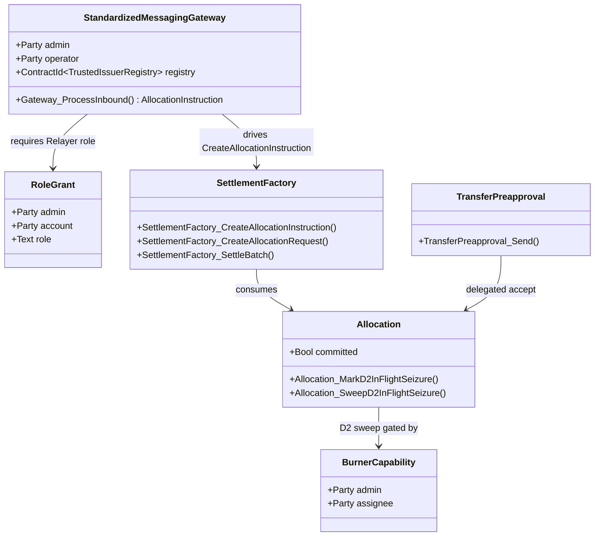
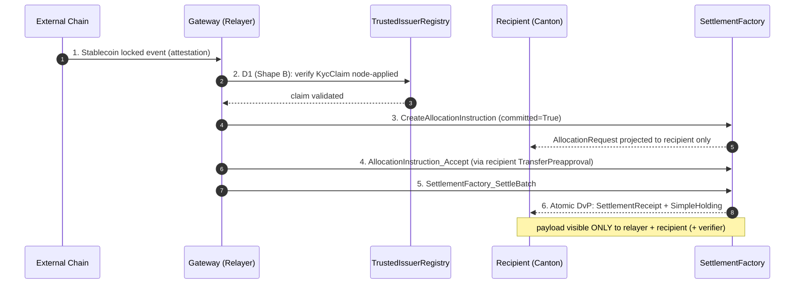

# Architectural Overview Report: Cross-Chain Stablecoin Payment Orchestration on Canton

Status: **reference-design report.** It describes a *reference design* grounded
in the real OpenZeppelin Canton components in this workspace; it is **not** a
claim of acceptance, conformance, audit readiness, or production readiness.

> **Source-grounding tags** (used throughout):
> `[IMPLEMENTED]` real code in the M1 library base ([`canton-specs`](https://github.com/OpenZeppelin/canton-specs) /
> [`canton-contracts`](https://github.com/OpenZeppelin/canton-contracts)) · `[EVIDENCE]` real code in an evidence repo
> ([`canton-token-template`](https://github.com/OpenZeppelin/canton-token-template), [`canton-stablecoin`](https://github.com/OpenZeppelin/canton-stablecoin)), not
> the M1 surface · `[UPSTREAM]` Splice / CIP / external-ecosystem reference, not
> vendored here · `[FUTURE]` proposed RI-level design, not built in M1 scope.

> **Design priority order** governs every interface and snippet, in this exact
> order: **1) Security → 2) Simplicity → 3) Readability → 4) Auditability.**

> **Scope.** This is the architecture documentation for a Cross-Chain Stablecoin
> Payment Orchestration reference design on the CIP-0112 / Token Standard V2
> settlement spine. Two components are **planned / external, not present in this
> workspace**: the **Standardized Messaging Gateway** (`[FUTURE]`, modeled as a
> bounded mock) and **USDCx** (an external ecosystem stablecoin, consumed by
> interface) — both flagged throughout and in Open Questions.

---

## 1. Product Definition

This Reference Implementation (RI) is an architectural blueprint for private,
atomic settlement on Canton of stablecoin payments originating on external
blockchains. It resolves the tension between cross-chain liquidity and the
privacy requirements of enterprise compliance: institutional participants can
accept an inbound asset representation (e.g. USDCx) while keeping the settlement
amount, payer/payee identities, and compliance markers projected only to
explicitly authorized parties.

The design uses a **Standardized Messaging Gateway** `[FUTURE]` (modeled as a
bounded mock) on top of the **CIP-0112 / Token Standard V2 settlement spine**
`[IMPLEMENTED]` (`OpenZeppelin.Experimental.Settlement.Cip112`).

### Educational Framing: "How to think about building this on Canton"

On public EVM networks, a bridge mints tokens into a globally visible state
ledger any observer can trace. Canton operates on **per-party projection**: a
contract is visible only to its signatories/observers. So the inbound message
from the gateway does **not** mint-and-broadcast an asset in one global update.
Instead the gateway drives an isolated, recipient-targeted allocation on the
spine; because Daml-LF 2.1 is **keyless** (archive-and-recreate, not mutation),
the atomic delivery-vs-payment archives the inbound request and creates a
[`SettlementReceipt`](../../experiments/cip112-settlement/daml/OpenZeppelin/Experimental/Settlement/Cip112.daml#L647) visible only to the recipient, the relayer, and the required
compliance verifiers. Cross-chain settlement thereby inherits Canton's data
compartmentalization.

### Target Users

Regulated financial institutions, multinational corporate treasuries, and
compliance-first DeFi platforms on Canton that need to accept inbound liquidity
from public networks **without** exposing internal treasury flows, payment
detail, or counterparty relationships to competitors or on-chain analytics.

### Scope

The bias favors simplicity and a demonstrably correct core; everything else is
an explicit extension point or out-of-scope.

| Feature Category | In-Scope | Out-of-Scope (Excluded) |
|---|---|---|
| Atomic Settlement | Private on-Canton settlement of inbound stablecoin payments via [`SettlementFactory_SettleBatch`](../../experiments/cip112-settlement/daml/OpenZeppelin/Experimental/Settlement/Cip112.daml#L237) (atomic DvP). | Custom settlement primitives, fallback matching engines, fragmented parallel liquidity pools. |
| Cross-Chain Bridge | An inbound/outbound bridge **interface** (the Standardized Messaging Gateway) as a **bounded, verifiable mock**. | Production bridge/relayer nodes, external oracle infra, validator networks, cryptographic light-client proofs. |
| Compliance & Control | D1 fail-closed verification on every leg (`CredentialGatedActionRequest` + `TrustedIssuerRegistry`); D2 lock-and-sweep via [`BurnerCapability`](../../experiments/cip112-settlement/daml/OpenZeppelin/Experimental/Settlement/Cip112.daml#L98). | Off-ledger caching of compliance status, probabilistic risk scoring, heuristic filtering. |
| Identity Framework | Single-domain v1, issuer-held KYC, deterministic claims. | Cross-domain identity resolution (ONCHAINID / ERC-3643 / Chainlink CCID) — deferred, SCU-forward-compatible only. |
| Asset Issuance | The integration **shape** for an existing Canton stablecoin (USDCx) as the settled instrument. | The stablecoin issuance / peg / CDP mechanism itself. |

Narrowing scope to the standardized interface boundary means a production
gateway can be swapped in later without modifying the settlement spine or the
compliance logic.

### USDCx: settled, not re-bridged `[UPSTREAM]`

USDCx is the named instrument, but the architecture treats it as **external and
already-native**. USDCx went live on Canton (December 2025) via Circle's
**xReserve** lock-and-mint plus **CCTP**, explicitly *without reliance on
third-party bridges*: the lock/attestation/mint is Circle's own rail. Routing
USDCx through a generic CCIP/LayerZero-style gateway would therefore **re-bridge
an asset that is already bridged** — adding trust surface, not removing it.

So this RI **settles** USDCx (consumes the already-minted Canton instrument by
interface) rather than bridging it. The generic Standardized Messaging Gateway
(§3, §4.1) is the reference rail for assets that **lack** a native Canton
lock-and-mint path; where a native rail exists (USDCx via xReserve/CCTP), the
native mint output is the settled instrument and no parallel bridge is
introduced. The reserve / lock-attestation model in §3.5 is the design for the
generic case; for USDCx the equivalent guarantees are provided by xReserve and
are out of this architecture's scope.

---

## 2. Architecture Overview

A modular, multi-party topology isolates external messaging, compliance
verification, asset allocation, and atomic settlement. `roleId` wrappers manage
node boundaries and capability grants so no participant can unilaterally force a
state transition without the required co-authorization.

When a cross-chain locking event occurs externally, the gateway (holding a
`RoleGrant` as relayer) emits an `InboundMessage` on Canton. Rather than a
direct transfer — which would violate Canton's co-authorization model — the
relayer drives the spine: [`SettlementFactory_CreateAllocationInstruction`](../../experiments/cip112-settlement/daml/OpenZeppelin/Experimental/Settlement/Cip112.daml#L216) →
(recipient accept) [`AllocationInstruction_Accept`](../../experiments/cip112-settlement/daml/OpenZeppelin/Experimental/Settlement/Cip112.daml#L369) → [`Allocation`](../../experiments/cip112-settlement/daml/OpenZeppelin/Experimental/Settlement/Cip112.daml#L454), plus a
recipient-targeted [`AllocationRequest`](../../experiments/cip112-settlement/daml/OpenZeppelin/Experimental/Settlement/Cip112.daml#L299).

### Party and Role Model

| Operational Role | `roleId` wrapper | Responsibilities / trust boundary |
|---|---|---|
| BridgeRelayer | `Relayer` | Monitors the external chain; submits `InboundMessage`; operates the gateway mock; acts as settlement executor. |
| ComplianceVerifier | `Verifier` | Maintains the `TrustedIssuerRegistry`; issues the `KycClaim` for D1 attestation. |
| Custodian | `Seizer` | Holds the `BurnerCapability` for D2 lock-and-sweep to a preset destination under mandate. |
| StablecoinAdmin | `Issuer` | Single-admin authority for the settled asset (USDCx); oversees `SimpleTokenRules`. |
| Recipient | Implicit (end-user) | Treasury receiving funds; may use `TransferPreapproval` to accept compliance-gated inflows without a live signature. |

### Trust and Topology

Topology is defined per contract by which nodes participate. Because Daml uses
per-party projection, the settlement is fractured into bilateral requests: the
BridgeRelayer and Recipient are the only initial observers of the
`AllocationRequest`; the StablecoinAdmin and Custodian stay blind to intent
until needed. At [`SettlementFactory_SettleBatch`](../../experiments/cip112-settlement/daml/OpenZeppelin/Experimental/Settlement/Cip112.daml#L237), the StablecoinAdmin's node is
enlisted only to validate fund conservation and run the `SimpleTokenRules`
3-way dispatch.

The topology also provides economic security: a committed allocation
(`RequestedAllocation.committed = True`, set by the relayer) locks the bridging
funds until the settlement deadline, so the recipient has cryptographic
certainty the liquidity is reserved and cannot be double-spent or arbitrarily
withdrawn before the DvP concludes.

---

## 3. How We Implement It

A deterministic sequence of keyless Daml-LF 2.1 state transitions on the
CIP-0112 spine.

1. **Inbound message.** The external chain finalizes a locked deposit. The
   gateway (relayer role) creates an `InboundMessage` carrying the hashed
   payload, external sender id, and Canton recipient. Keyless archive-and-recreate
   makes it a one-time consumed artifact (replay protection).
2. **Allocate + D1 check.** The relayer drives
   [`SettlementFactory_CreateAllocationInstruction`](../../experiments/cip112-settlement/daml/OpenZeppelin/Experimental/Settlement/Cip112.daml#L216) toward the recipient. Before
   it can target the recipient it must pass the **D1 compliance check**. The RI
   selects **Shape B** (signed node attestation) over Shape A (off-ledger gate):
   off-ledger gates add async caching vulnerabilities and break atomic
   composability within one Daml transaction. The on-ledger [`D1ComplianceHook`](../../experiments/cip112-settlement/daml/OpenZeppelin/Experimental/Settlement/Cip112.daml#L41)
   requires referencing a valid `MockVerificationResult` /
   `CredentialGatedActionRequest` signed by a party in the
   `TrustedIssuerRegistry`. Without a valid, unexpired `KycClaim`, the hook fails
   closed, node-applied — full rollback.
3. **Recipient co-authorization via `TransferPreapproval`.** A recipient cannot
   be bound unilaterally; a new signatory must co-authorize. For an offline
   corporate treasury that cannot provide a live interactive signature, the
   recipient's wallet pre-establishes a `TransferPreapproval` for the USDCx
   instrument. The relayer leverages it to complete the recipient's required
   accept in a single atomic submission, converting the [`AllocationInstruction`](../../experiments/cip112-settlement/daml/OpenZeppelin/Experimental/Settlement/Cip112.daml#L356)
   into a committed [`Allocation`](../../experiments/cip112-settlement/daml/OpenZeppelin/Experimental/Settlement/Cip112.daml#L454). *(This delegated-accept pattern is what makes
   the flow work for cold/offline recipients; it is not a workaround for any
   fixed transaction-timeout.)*
4. **Atomic DvP.** The relayer packages the [`Allocation`](../../experiments/cip112-settlement/daml/OpenZeppelin/Experimental/Settlement/Cip112.daml#L454) into the single
   [`SettlementFactory_SettleBatch`](../../experiments/cip112-settlement/daml/OpenZeppelin/Experimental/Settlement/Cip112.daml#L237) entrypoint. Settlement enforces value
   conservation per instrument: the archived locked input holdings must cover the
   authorizer's SenderSide leg amounts, and any surplus returns as a single new
   *change* holding (reducing fragmentation). Under-funded senders fail closed.
   (`nextIterationFunding` is a positivity-checked label/amount map for the
   iterated-settlement path; it does **not** perform this value accounting.) On
   success the [`Allocation`](../../experiments/cip112-settlement/daml/OpenZeppelin/Experimental/Settlement/Cip112.daml#L454) is archived and a
   [`SettlementReceipt`](../../experiments/cip112-settlement/daml/OpenZeppelin/Experimental/Settlement/Cip112.daml#L647) + `SimpleHolding` are created for the recipient only.

### 3.5 Reserve & lock-attestation model `[FUTURE]`

The previous flow shows *how* an inbound payment settles privately, but the core
of a bridge is **what binds the Canton mint to real, locked backing on the source
chain**. Without this the design is a private DvP engine with a trust gap at the
boundary. The reserve model makes that binding explicit.

**What is attested.** Every inbound mint is authorized by a typed
`LockAttestation` `[FUTURE]` — a Daml-visible record asserting that backing is
locked/escrowed on the source chain and is claimable *only* by minting the
matching amount on Canton:

```daml
-- [FUTURE] RI-level type carried by the inbound message.
data LockAttestation = LockAttestation with
  sourceChainId   : Text       -- e.g. "ethereum-mainnet"
  lockTxId        : Text        -- the source-chain lock/escrow transaction
  lockedAsset     : Text        -- source-chain asset locked (e.g. USDC)
  lockedAmount    : Decimal     -- exact backing locked on the source chain
  cantonRecipient : Party       -- who may receive the minted wrapped asset
  cantonInstrumentId : Text     -- the Canton instrument to mint
  nonce           : Text        -- replay-protection sequence id (one-time)
  expiry          : Time        -- attestation validity window
```

**Who signs it.** Not a lone relayer. The attestation is co-signed by a
**threshold N-of-M attestor set**, and verified on-ledger via the spine's
existing typed node-attestation path —
[`SettlementFactory_SettleBatchWithAttestation`](../../experiments/cip112-settlement/daml/OpenZeppelin/Experimental/Settlement/Cip112.daml#L259)
checked against the
[`TrustedAttesterRegistry`](../../experiments/cip112-settlement/daml/OpenZeppelin/Experimental/Settlement/Cip112.daml#L730).
This separates the relayer's *transport* role (move bytes) from the *trust* role
(authorize minting): a relayer with no attestor quorum cannot mint.

**The binding (fail-closed).** The inbound
[`AllocationInstruction`](../../experiments/cip112-settlement/daml/OpenZeppelin/Experimental/Settlement/Cip112.daml#L356)
references a `LockAttestation` id, and the mint asserts:

- `instructionAmount == attestation.lockedAmount` (no over-mint);
- `recipient == attestation.cantonRecipient` and instrument matches;
- the attestation is quorum-signed, unexpired, and its `nonce` has not been
  consumed (replay protection — the keyless archive-and-recreate of the inbound
  message already gives one-time consumption).

If any check fails the batch fails closed — no mint, no partial credit.

**Reserve invariant (§7.1).** Total Canton-minted wrapped supply for an
instrument never exceeds the sum of valid, unredeemed `LockAttestation`s for it:
`mintedSupply ≤ Σ lockedAmount(unredeemed)`. Mint increments the claimed reserve;
redemption (§3.6) decrements it. This is the on-ledger statement of 1:1 backing.

### 3.6 Outbound redemption (burn on Canton → release on source chain) `[FUTURE]`

Redemption is the other half of any bridge and the path a regulated user needs.
It is the mirror of the inbound flow:

1. **Burn on Canton.** The holder requests redemption; the wrapped holding is
   burned (`BurnerCapability`-gated burn), emitting an
   [`EventLog_HoldingsChange`](../../experiments/cip112-settlement/daml/OpenZeppelin/Experimental/Settlement/Cip112.daml#L646)
   and producing a typed `RedemptionAttestation` `[FUTURE]`
   `{ amount, sourceChainDestination, nonce }`.
2. **Attest.** The N-of-M attestor set co-signs the `RedemptionAttestation`
   (again via the `TrustedAttesterRegistry` path).
3. **Release on the source chain.** The signed burn attestation is submitted to
   the source-chain escrow contract, which releases `amount` of locked backing
   to `sourceChainDestination` and the reserve is decremented.

**Cross-chain atomicity, honestly.** The source-chain release is **not** in the
same Daml transaction as the Canton burn (no protocol spans both ledgers
atomically). The design is therefore **burn-first / attested-release**: the
Canton burn is the irreversible commit, and the foreign release is gated on the
signed burn attestation. If the foreign release stalls, the burn is already
final, so the reserve accounting stays sound (supply went down) and the
redemption becomes a **standing, replay-protected claim** the holder (or any
relayer) can resubmit until the escrow releases. The failure mode is *delayed
release*, never *double-spend* or *unbacked supply*. This residual asymmetry is
called out in §7 and §9.

### D1–D4 Attachment

- **D1 — compliance.** Node-applied, fail-closed — the intended per-settlement
  posture, engaged on the M1 spine by the optional `D1ComplianceHook` / typed
  attestation path (base `SettleBatch` does not itself mandate it); Shape B as above.
  *(Open, non-blocking: contract-oblivious vs on-ledger attestation
  verification.)*
- **D2 — seizure (lock-and-sweep).** Under mandate, the Custodian uses the
  single-admin [`BurnerCapability`](../../experiments/cip112-settlement/daml/OpenZeppelin/Experimental/Settlement/Cip112.daml#L98) to sweep a targeted holding to an admin-preset
  `custodianDestination`. For in-flight allocations this is the spine's
  [`Allocation_MarkD2InFlightSeizure`](../../experiments/cip112-settlement/daml/OpenZeppelin/Experimental/Settlement/Cip112.daml#L568) → [`Allocation_SweepD2InFlightSeizure`](../../experiments/cip112-settlement/daml/OpenZeppelin/Experimental/Settlement/Cip112.daml#L577); for
  settled holdings the forced-burn-to-custodian path
  (`LockedSimpleHolding_ForcedBurn` evidence). It **does not** burn the asset and
  **does not** return it to the sender. Ordinary transfer *failures* do return to
  sender.
- **D3 — identity.** Single-domain v1, issuer-held KYC; cross-domain deferred but
  forward-compatible via additive SCU.
- **D4 — authority.** Single-admin capability for M1 (multi-sig → M3).

### The SCU Extension Story

Never mutate an existing choice's args to require a new field; extend via
`Optional` fields, new types, and new choices. New interfaces are added by new
templates/choices implementing them, not by retroactive interface instances — a
mechanism Daml 3.x removed `[UPSTREAM]` because it broke clean upgrade paths.
Today the settlement validates a single-domain `KycClaim`. To add cross-domain identity (D3) later, a **new**
choice (e.g. `…SettleBatchWithCrossDomainProof`) is appended that accepts an
`Optional CrossDomainProof`; existing relayers calling the legacy
`SettlementFactory_SettleBatch` keep working. This is the additive path proven
in the `canton-specs` identity-hook upgrade spike.

---

## 4. Interfaces & Usage Examples

Names map to real workspace components; RI-level modules (the gateway and
orchestrator) are tagged `[FUTURE]`. Import paths use the real module names:
`OpenZeppelin.AccessControl`, `OpenZeppelin.Experimental.Settlement.Cip112`,
`canton-token-template` `SimpleToken.*`; `KycClaim`/`TrustedIssuerRegistry` are
the `canton-specs` identity-hook Shape-B types (not credential-gateway).

### 4.1 Standardized Messaging Gateway (bounded mock) `[FUTURE]`

```daml
module CrossChain.Gateway where

import OpenZeppelin.AccessControl (RoleGrant, requireRole)
import OpenZeppelin.Experimental.Settlement.Cip112 (SettlementFactory)
import OpenZeppelin.Experimental.Credential.Gateway (CredentialGatedActionRequest)
-- KycClaim / TrustedIssuerRegistry: canton-specs identity-hook Shape-B
import IdentityHook.ShapeB (KycClaim, TrustedIssuerRegistry)

data GatewayRole = Relayer | Seizer deriving (Eq, Show)

roleId : GatewayRole -> Text
roleId Relayer = "BRIDGE_RELAYER_ROLE"
roleId Seizer  = "CUSTODIAN_SEIZER_ROLE"

-- [FUTURE] bounded mock of the planned Contracts-Library gateway.
template StandardizedMessagingGateway
  with
    admin : Party
    operator : Party
    registry : ContractId TrustedIssuerRegistry
  where
    signatory admin, operator

    nonconsuming choice Gateway_ProcessInbound : ContractId AllocationInstruction
      with
        relayerGrant : ContractId RoleGrant
        inboundAmount : Decimal
        recipient : Party
        kycClaim : ContractId KycClaim
        settlementFactory : ContractId SettlementFactory
      controller operator
      do
        -- 1. Authority: validate the relayer grant against oz-access-control.
        g <- fetch relayerGrant
        requireRole operator (roleId Relayer) admin g

        -- 2. D1 (Shape B, fail-closed): the KycClaim's subjectParty must match
        --    the recipient; verified node-applied, no off-ledger oracle.
        claim <- fetch kycClaim
        assertMsg "D1: recipient identity mismatch" (claim.subjectParty == recipient)

        -- 3. Drive the spine: create the (committed) allocation instruction.
        exercise settlementFactory SettlementFactory_CreateAllocationInstruction with ..
```

### 4.2 Inbound DvP via `SettleBatch` + delegated accept `[FUTURE]`

```daml
module CrossChain.Orchestrator where

import OpenZeppelin.Experimental.Settlement.Cip112
-- TransferPreapproval is canton-token-template (SimpleToken.Preapproval)
import SimpleToken.Preapproval (TransferPreapproval)

template CrossChainDvP
  with
    executor : Party    -- the relayer, acting as authorized settlement executor
  where
    signatory executor

    choice Execute_Inbound_Settlement : ContractId SettlementReceipt
      with
        allocationRequestId : ContractId AllocationRequest
        instructionId : ContractId AllocationInstruction
        batchFactory : ContractId SettlementFactory
      controller executor
      do
        -- Recipient's required co-authorization is satisfied via their standing
        -- TransferPreapproval (delegated accept for an offline treasury).
        allocationId <- exercise instructionId AllocationInstruction_Accept

        -- Atomic DvP via the single spine entrypoint. Settlement conserves value
        -- per instrument (locked funds must cover sender obligations; surplus
        -- returns as change); a failed batch returns holdings to the sender.
        receipt <- exercise batchFactory SettlementFactory_SettleBatch with
          allocations = [allocationId]
          requests = [allocationRequestId]
        return receipt
```

### 4.3 D2 lock-and-sweep `[FUTURE]` (real mechanism, no bespoke template)

```daml
-- D2SeizureHook is a SPINE DATA RECORD (seizureCaseRef, custodianDestination,
-- inFlightHandlingStatus) — NOT a template, and there is no "BurnerCapability_Seize"
-- (BurnerCapability has no choices). Seizure runs on the Allocation / holding:
--
--   in-flight allocation:
--     exercise allocationId Allocation_MarkD2InFlightSeizure with seizureHook = ...
--     exercise allocationId Allocation_SweepD2InFlightSeizure with burnerCap = burnerCapId
--   settled / locked holding:
--     exercise lockedHoldingId LockedSimpleHolding_ForcedBurn with
--       burner = custodian; burnerCap = burnerCapId   -- swept to preset custodianDestination
--
-- Never burns the asset to nothing; never returns seized funds to sender.
```

---

## 5. Diagrams

Maps to proposed `canton-settlement-explorer` `[FUTURE]` presets *Cross-chain Bridge* + *Batch DvP*.

### 5.1 Interface / Component Diagram



### 5.2 Flow-of-Funds / Settlement Diagram (Cross-chain Bridge + Batch DvP)



---

## 6. Library Dependencies

### 6.1 Internal Dependencies (present in workspace)

| Component | Source Package | Usage | Tag |
|---|---|---|---|
| `oz-access-control` | `canton-specs` / `canton-contracts` | [`RoleGrant`](../../access-control/daml/OpenZeppelin/AccessControl.daml)/[`requireRole`](../../access-control/daml/OpenZeppelin/AccessControl.daml) gating the gateway ([`hasRole`](../../access-control/daml/OpenZeppelin/AccessControl.daml), [`RoleAdmin`](../../access-control/daml/OpenZeppelin/AccessControl.daml)); D4 single-admin authority. | `[IMPLEMENTED]` |
| `oz-ownable` | `canton-specs` / `canton-contracts` | [`Ownership`](../../ownable/daml/OpenZeppelin/Ownable.daml) over hooks/factories; secure handoff via [`OwnershipOffer`](../../ownable/daml/OpenZeppelin/Ownable.daml). | `[IMPLEMENTED]` |
| `oz-pausable` | `canton-specs` / `canton-contracts` | [`PauseState`](../../pausable/daml/OpenZeppelin/Pausable.daml) ([`whenNotPaused`](../../pausable/daml/OpenZeppelin/Pausable.daml)) halts inbound requests during anomalies. | `[IMPLEMENTED]` |
| [`SettlementFactory`](../../experiments/cip112-settlement/daml/OpenZeppelin/Experimental/Settlement/Cip112.daml#L185) (CIP-0112 spine) | `canton-specs` | Allocation generation + [`SettlementFactory_SettleBatch`](../../experiments/cip112-settlement/daml/OpenZeppelin/Experimental/Settlement/Cip112.daml#L237) DvP. | `[IMPLEMENTED]` (experimental) |
| `TransferPreapproval` | `canton-token-template` (`SimpleToken.Preapproval`) | Delegated recipient accept for offline treasuries. | `[EVIDENCE]` |
| `SimpleHolding` / `SimpleTokenRules` / `LockedSimpleHolding` / `*_ForcedBurn` | `canton-token-template` | Asset representation, 3-way dispatch, D2 evidence. | `[EVIDENCE]` |
| `CredentialGatedActionRequest` / `MockVerificationResult` | [`credential-gateway`](../../experiments/credential-gateway/daml/OpenZeppelin/Experimental/Credential/Gateway.daml) | D1 credential gating. | `[IMPLEMENTED]` (experimental) |
| `KycClaim` / `TrustedIssuerRegistry` | `canton-specs` identity-hook Shape-B (not `credential-gateway` templates; the gateway supplies the gating/verification primitives) | Typed D3 identity for D1 Shape-B node attestation (spine reference field [`D1ComplianceHook`](../../experiments/cip112-settlement/daml/OpenZeppelin/Experimental/Settlement/Cip112.daml#L41)). | `[IMPLEMENTED]` (experimental) |

### 6.2 External / Planned Dependencies

| Component | Role / Provider | Status | Note |
|---|---|---|---|
| Standardized Messaging Gateway | Cross-chain messaging (OpenZeppelin Contracts Library) | **Planned `[FUTURE]`** | **Not present in this workspace.** Modeled as a bounded mock (`StandardizedMessagingGateway`); to be swapped for a production CCIP/LayerZero-style integration. Build only its Daml-facing interface. |
| Splice Token Standard V2 DARs | V2 settlement rules | **Planned `[UPSTREAM]`** | Designed against the Token Standard V2 interfaces (`hyperledger-labs/splice`); local stand-ins until the published DARs ship. Import gated. |
| USDCx | External, already-native Canton instrument | **External** | Consumed via interface only as a *settled* instrument; its issuance, peg, and cross-chain rail (Circle xReserve lock-and-mint + CCTP) are external to this architecture. This RI does **not** bridge USDCx (see §1, §9). |

---

## 7. Security & Auditability

Security relies on Daml's structural rigidity and deterministic state
transitions, not obscure cryptography.

### 7.1 Invariants

- **Conservation of funds.** `[IMPLEMENTED]` Settlement cannot output more value
  than its input `Allocation`s. On the standard path, `Allocation_Settle` /
  `Allocation_SettleInBatch` (via `performSettle`) archive the locked input
  holdings and assert, **per instrument**, that the locked funds cover the
  authorizer's SenderSide leg amounts; any surplus returns to the sender as an
  unlocked *change* holding (locked = sender obligations + returned change). An
  under-funded sender fails closed — no value is minted from nothing. (Value
  accounting is done here, **not** by `nextIterationFunding`, which is
  positivity-checked only; the iterated-settlement path defers per-iteration
  conservation.)
- **Privacy partitioning.** Amount, payer, and payload memo are projected only to
  the relayer, recipient, and designated compliance verifier. If the
  StablecoinAdmin could observe the memo without authorization, the invariant is
  broken.
- **1:1 reserve backing (§3.5).** Canton-minted wrapped supply for an instrument
  never exceeds the sum of valid, unredeemed `LockAttestation`s:
  `mintedSupply ≤ Σ lockedAmount(unredeemed)`. A mint requires a quorum-signed,
  unexpired, non-replayed attestation whose `lockedAmount` equals the minted
  amount; redemption (§3.6) burns first and decrements the reserve. No mint
  without locked backing; no double-redeem of one lock.

### 7.2 Threat Model

| Vector | Description | Mitigation |
|---|---|---|
| Malicious relayer | Routes valid inbound funds to an unauthorized/sanctioned account. | D1 hook requires a node-applied `KycClaim` whose `subjectParty` matches the exact recipient; the relayer cannot spoof the destination (fail-closed). |
| Malicious sender | Triggers spam/toxic settlement to an unwilling recipient. | Without a configured `TransferPreapproval` or explicit accept, the allocation is not settled and funds return to sender (transfer-failure semantics). |
| Compromised admin | Attempts arbitrary expropriation. | D4 single-admin is a structural boundary; even a compromised admin's D2 sweep is hardcoded to the preset `custodianDestination` (no arbitrary burn, no return-to-sender). |
| **Relayer centralization** (primary risk) | A single relayer is both a **liveness** chokepoint (can censor or stall inbound mints and outbound redemptions) and, if it is also the sole attestor, a **trust** chokepoint (could authorize a mint with no real source-chain lock). | Separate the relayer's *transport/liveness* role from the *attestation/trust* role; require a **threshold N-of-M attestor set** via [`TrustedAttesterRegistry`](../../experiments/cip112-settlement/daml/OpenZeppelin/Experimental/Settlement/Cip112.daml#L730) (no mint/redeem without quorum — fail-closed, §3.5); make **relay permissionless** (anyone may submit a valid quorum-signed attestation, so no single party gates liveness); add an inbound timeout + forced-refund so locked funds are never stranded by a stalled relayer. The production attestor/relayer trust model and its decentralization path is an open question (§9). |
| UTXO fragmentation | Many small transfers accumulate holding dust. | Settlement returns a sender's surplus as a single new *change* holding per instrument (rather than many fragments); iterated settlement can further merge inputs across rounds. |

### 7.3 Validation Ladder `[FUTURE]`

The tiers below are a **proposed** validation ladder, not built in M1. The
`daml-lint` / `daml-props` / `daml-verify` tools named here do not exist in this
repo or any named evidence repo. The **real** M1 gate is `dpm build --all` plus
the Daml Script suites run by `scripts/run-tests.sh` (spine suite + deep
settlement exemplar) and `scripts/check-scaffold.sh`, wired in CI
(`.github/workflows/ci.yml`); the living-doc code anchors are validated by
`scripts/refresh-ri-anchors.sh`.

| Tier | Proposed tooling `[FUTURE]` | Purpose |
|---|---|---|
| Static analysis | `daml-lint` `[FUTURE]` | Validate SCU rules (no illegal field mutation; only `Optional` extensions), decimal bounds, archive-before-execute, `roleId` wrapper, `whenNotPaused`. |
| Generative testing | `daml-props` `[FUTURE]` | Property-based testing with shrinking over `SettleBatch`: fuzzed extra-transfer-leg scenarios would check funding conservation never breaks. |
| Formal verification | `daml-verify` `[FUTURE]` | Z3 proofs over D1–D4 mappings — e.g. `Gateway_ProcessInbound` unreachable unless a valid `KycClaim` path exists, sealing the D1 gate on-ledger. |

### 7.4 Off-ledger reconciliation `[UPSTREAM]`

A treasury operating this flow reconciles its private Canton settlement against
the inbound external-chain event without parsing raw transaction trees: the
Token Standard V2 transfer-events API (`Splice.Api.Token.TransferEventsV2`,
imported in the `canton-token-template` evidence) emits holdings-change events the
recipient can correlate with the gateway's inbound message id, giving a 1:1
audit linkage between the external lock/burn and the Canton credit. This is an
**upstream** API surface, not vendored here, and the linkage is a reference
pattern — the report makes no reconciliation-completeness, accounting-standard, or
audit-readiness claim.

---

## 8. Cross-Synchronizer Domain Extension (Planned) `[FUTURE]`

> **Shared model:** the cross-synchronizer mechanism (per-synchronizer
> assignment + unassign/assign reassignment, and the SCU-compliant additive
> path) is identical across all four RIs and is owned in
> [`00-portfolio.md`](./00-portfolio.md) §5. This section elaborates only the
> RI-specific topology (including the cross-chain vs cross-synchronizer
> distinction below).

> **Status: out of scope for the initial M1 design; deferred and planned.** Note
> the distinction: this RI is *cross-chain* (bridging from external L1s/L2s via
> the gateway) but still **single-synchronizer on Canton** today. Operating the
> Canton-side settlement across **multiple Canton synchronizer domains** is a
> separate, deferred capability (D3 cross-domain identity is also deferred). This
> section plans it per Canton's per-synchronizer assignment + unassign/assign
> reassignment model and the SCU rule.

### 8.1 Cross-chain vs cross-synchronizer

- **Cross-chain** (in scope as a mock): external chain → gateway attestation →
  Canton settlement on one synchronizer.
- **Cross-synchronizer** (planned): the Canton-side recipient, stablecoin
  instrument, and compliance registry may live on **different Canton
  synchronizers**; settlement then requires reassigning the relevant contracts
  onto one synchronizer before `SettleBatch`.

### 8.2 Where it touches the boundary

| Element | Single-synchronizer (today) | Cross-synchronizer (planned) |
|---|---|---|
| Inbound `Allocation` / `SettlementReceipt` | Created/settled on the recipient's synchronizer. | Reassignable: inbound allocation assigned to the synchronizer hosting the recipient's USDCx holding before `SettleBatch`. |
| USDCx instrument admin | Same synchronizer as settlement. | If USDCx is administered on another synchronizer, the settled instrument must be reachable there or reassigned in. |
| D1 `TrustedIssuerRegistry` | One synchronizer. | Synchronizer-aware registry; compliance re-checked on the settling synchronizer (no stale cross-domain attestation reuse). |
| D3 identity | Single-domain `KycClaim`. | Cross-domain proof (ONCHAINID / ERC-3643 / CCID) resolved into a synchronizer-aware registry — the deferred D3 work. |

### 8.3 The additive, non-breaking path (SCU-compliant)

1. Append `Optional SynchronizerScope` to the RI gateway/orchestrator templates;
   older contracts read `None`.
2. Add a new parallel choice (e.g. `Execute_Inbound_Settlement_CrossDomain`)
   alongside the unchanged single-synchronizer choice.
3. Model reassignment as workflow: reassign the inbound allocation onto the
   settling synchronizer → `SettleBatch` there → reassign the receipt/holding
   back. Atomicity stays at the single-synchronizer batch boundary.

### 8.4 Open questions specific to cross-synchronizer operation

- Reassignment-vs-settlement atomicity (rollback vs re-home-able allocation on
  `SettleBatch` failure) — maps to the return-to-sender rule.
- Which synchronizer's `TrustedIssuerRegistry` and verifier set govern a
  cross-domain inflow.
- Cross-domain D1 freshness (re-check on the settling synchronizer; never reuse
  across a reassignment).
- Reassignment tooling maturity (evolving Canton/DA stack; assumes drop-in).

---

## Implementation Status (Code Map)

> **Living document.** Each row links to real source. Refresh the anchors with
> `scripts/refresh-ri-anchors.sh` (see [`README.md`](./README.md)). Status:
> ✅ implemented in the promoted library surface (or verified passing tests) ·
> 🟡 implemented in the **experimental settlement scaffold** (real code, not
> yet promoted; includes toy stand-ins) · ⬜ planned, not built in M1.

| RI capability | Source anchor | Status |
|---|---|---|
| Settlement spine factory (reused for payment legs) | [`SettlementFactory`](../../experiments/cip112-settlement/daml/OpenZeppelin/Experimental/Settlement/Cip112.daml#L185) | 🟡 |
| Atomic batch DvP entrypoint (inbound payment settle) | [`SettlementFactory_SettleBatch`](../../experiments/cip112-settlement/daml/OpenZeppelin/Experimental/Settlement/Cip112.daml#L237) | 🟡 |
| Allocation request creation | [`SettlementFactory_CreateAllocationRequest`](../../experiments/cip112-settlement/daml/OpenZeppelin/Experimental/Settlement/Cip112.daml#L193) | 🟡 |
| Allocation instruction creation | [`SettlementFactory_CreateAllocationInstruction`](../../experiments/cip112-settlement/daml/OpenZeppelin/Experimental/Settlement/Cip112.daml#L216) | 🟡 |
| Allocation request lifecycle (accept / reject / withdraw) | [`AllocationRequest_Accept`](../../experiments/cip112-settlement/daml/OpenZeppelin/Experimental/Settlement/Cip112.daml#L313) · [`AllocationRequest_Reject`](../../experiments/cip112-settlement/daml/OpenZeppelin/Experimental/Settlement/Cip112.daml#L320) · [`AllocationRequest_Withdraw`](../../experiments/cip112-settlement/daml/OpenZeppelin/Experimental/Settlement/Cip112.daml#L327) | 🟡 |
| Allocation instruction lifecycle (delegated accept / withdraw) | [`AllocationInstruction_Accept`](../../experiments/cip112-settlement/daml/OpenZeppelin/Experimental/Settlement/Cip112.daml#L369) · [`AllocationInstruction_Withdraw`](../../experiments/cip112-settlement/daml/OpenZeppelin/Experimental/Settlement/Cip112.daml#L388) | 🟡 |
| Committed allocation + settle | [`Allocation`](../../experiments/cip112-settlement/daml/OpenZeppelin/Experimental/Settlement/Cip112.daml#L454) · [`Allocation_Settle`](../../experiments/cip112-settlement/daml/OpenZeppelin/Experimental/Settlement/Cip112.daml#L474) | 🟡 |
| Allocation cancel / withdraw | [`Allocation_Cancel`](../../experiments/cip112-settlement/daml/OpenZeppelin/Experimental/Settlement/Cip112.daml#L551) · [`Allocation_Withdraw`](../../experiments/cip112-settlement/daml/OpenZeppelin/Experimental/Settlement/Cip112.daml#L559) | 🟡 |
| Settlement receipt (private credit artifact) | [`SettlementReceipt`](../../experiments/cip112-settlement/daml/OpenZeppelin/Experimental/Settlement/Cip112.daml#L647) | 🟡 |
| D1 compliance hook (reference field on the spine) | [`D1ComplianceHook`](../../experiments/cip112-settlement/daml/OpenZeppelin/Experimental/Settlement/Cip112.daml#L41) | 🟡 |
| Node-applied signed D1 attestation | [`D1ComplianceHook`](../../experiments/cip112-settlement/daml/OpenZeppelin/Experimental/Settlement/Cip112.daml#L41) | ⬜ `[FUTURE]` |
| D2 lock-and-sweep seizure (in-flight) | [`Allocation_MarkD2InFlightSeizure`](../../experiments/cip112-settlement/daml/OpenZeppelin/Experimental/Settlement/Cip112.daml#L568) · [`Allocation_SweepD2InFlightSeizure`](../../experiments/cip112-settlement/daml/OpenZeppelin/Experimental/Settlement/Cip112.daml#L577) | 🟡 |
| D2 seizure data record + burner capability | [`D2SeizureHook`](../../experiments/cip112-settlement/daml/OpenZeppelin/Experimental/Settlement/Cip112.daml#L46) · [`BurnerCapability`](../../experiments/cip112-settlement/daml/OpenZeppelin/Experimental/Settlement/Cip112.daml#L98) | 🟡 |
| Settlement helpers (lock / conserve / unlock holdings) | [`lockInputHoldings`](../../experiments/cip112-settlement/daml/OpenZeppelin/Experimental/Settlement/Cip112.daml#L873) · [`archiveAndTallyLockedHoldings`](../../experiments/cip112-settlement/daml/OpenZeppelin/Experimental/Settlement/Cip112.daml#L951) · [`conserveSenderSides`](../../experiments/cip112-settlement/daml/OpenZeppelin/Experimental/Settlement/Cip112.daml#L972) · [`unlockHoldings`](../../experiments/cip112-settlement/daml/OpenZeppelin/Experimental/Settlement/Cip112.daml#L1090) | 🟡 |
| Transfer-leg model + experimental gating flag | [`TransferLeg`](../../experiments/cip112-settlement/daml/OpenZeppelin/Experimental/Settlement/Cip112.daml#L29) · [`experimentalFeatureFlag`](../../experiments/cip112-settlement/daml/OpenZeppelin/Experimental/Settlement/Cip112.daml#L72) | 🟡 |
| Toy holding (stand-in for real TSv2 holding) | [`ToyHolding`](../../experiments/cip112-settlement/daml/OpenZeppelin/Experimental/Settlement/Cip112.daml#L133) | 🟡 |
| Spine test suite (33 `test_` scripts) | [`Cip112Settlement.daml`](../../test/daml/OpenZeppelin/Test/Cip112Settlement.daml) | ✅ |
| Access control (relayer / seizer roles, D4 authority) | [`RoleGrant`](../../access-control/daml/OpenZeppelin/AccessControl.daml) · [`requireRole`](../../access-control/daml/OpenZeppelin/AccessControl.daml) · [`hasRole`](../../access-control/daml/OpenZeppelin/AccessControl.daml) · [`RoleAdmin`](../../access-control/daml/OpenZeppelin/AccessControl.daml) | ✅ |
| Ownable (hook / factory ownership handoff) | [`Ownership`](../../ownable/daml/OpenZeppelin/Ownable.daml) · [`OwnershipOffer`](../../ownable/daml/OpenZeppelin/Ownable.daml) | ✅ |
| Pausable (halt inbound requests) | [`PauseState`](../../pausable/daml/OpenZeppelin/Pausable.daml) · [`whenNotPaused`](../../pausable/daml/OpenZeppelin/Pausable.daml) | ✅ |
| Typed node-attestation path (reserve / lock-attestation backbone) | [`SettlementFactory_SettleBatchWithAttestation`](../../experiments/cip112-settlement/daml/OpenZeppelin/Experimental/Settlement/Cip112.daml#L259) · [`TrustedAttesterRegistry`](../../experiments/cip112-settlement/daml/OpenZeppelin/Experimental/Settlement/Cip112.daml#L730) | 🟡 (real node-side integration ⬜) |
| Reserve / lock-attestation model (`LockAttestation`, 1:1 backing — §3.5) | — (planned) | ⬜ `[FUTURE]` |
| Outbound redemption (burn → attested release, §3.6) | — (planned) | ⬜ `[FUTURE]` |
| Real TSv2 holding interface | — (pending import) | ⬜ `[FUTURE]` |
| On-ledger multi-sig authority (D4 → M3) | — (planned) | ⬜ `[FUTURE]` |
| Cross-synchronizer / cross-domain operation (D3 deferred; single-domain v1, no multi-synchronizer machinery in the scaffold — see §8) | — (planned) | ⬜ `[FUTURE]` |
| Cross-chain orchestration / bridge / identity-claim business logic (gateway mock + orchestrator) | — (planned) | ⬜ `[FUTURE]` |

## 9. Open Questions

- **Production attestor / relayer trust model (decentralization).** §3.5 fixes
  the *shape* — a threshold N-of-M attestor set verified via
  [`TrustedAttesterRegistry`](../../experiments/cip112-settlement/daml/OpenZeppelin/Experimental/Settlement/Cip112.daml#L730),
  permissionless relay, fail-closed mint. The *parameters* are open: M and the
  threshold N, attestor selection / rotation / slashing for a false attestation,
  and how the attestor set is itself governed. This is the largest trust surface
  and should be settled with the internal team before implementation.
- **Outbound-redemption cross-chain atomicity (§3.6).** Burn-first / attested-
  release guarantees no double-spend and no unbacked supply, but the foreign
  release is not atomic with the Canton burn. Open: the standing-claim
  resubmission protocol and SLA for a stalled source-chain release, and whether a
  bounded grace window before burn (escrow-then-burn) is ever preferable to
  burn-first for specific source chains.
- **Aligning gateway scope with native rails.** USDCx bridges natively via Circle
  xReserve + CCTP (§1), so this RI settles it rather than bridging it. Open: a
  general rule for when an inbound asset already has a native Canton rail (settle
  the native mint output) versus when the generic Standardized Messaging Gateway
  is the right reference, so the architecture never re-bridges an already-bridged
  asset.
- **Standardized Messaging Gateway (planned, absent).** The gateway is a
  Contracts-Library component **not yet present in this workspace**. When the
  production gateway lands, how are inbound attestations sequenced if the origin
  chain (Ethereum/Polygon) deep-reorgs? Does the gateway manage confirmation
  delays internally, or must the relayer Daml contract use a time-locked
  `AllocationInstruction` to mitigate cross-chain rollback risk?
- **USDCx forced upgrades.** Active holdings upgrade-on-use via factory routing,
  but a forced upgrade for passive holders raises a question: how does the
  relayer detect a recipient holding a deprecated `TransferPreapproval`, and what
  is the fallback from delegated-accept to an interactive two-step offer?
- **Expired / unsettled inbound-allocation lifecycle.** A committed inbound
  `Allocation` locks bridging funds until settlement; if the DvP never completes
  (recipient never finalizes, origin reorg, deadline lapses), the local CIP-0112
  scaffold has **no cancel/withdraw/reject path** — the choices today are
  `Allocation_Settle` and the two D2 seizure choices. The upstream Token Standard
  V2 Allocation lifecycle `[UPSTREAM]` separates an allocation's expiry from its
  settlement deadline and adds cancel/withdraw/reject semantics, which would let
  an automated handler reclaim dead capital without the original signer. Whether
  M1 reserves this via an additive `[FUTURE]` cancel choice on the RI orchestrator
  (return-to-sender on expiry) or defers entirely to the upstream lifecycle once
  imported is open. (Maps to the transfer-failure return-to-sender rule.)
- **Cross-domain identity proof injection (D3).** When ONCHAINID / ERC-3643
  equivalents are supported, does the `TrustedIssuerRegistry` ingest external
  state proofs via an oracle, or rely on a CCID protocol synchronized across the
  global synchronizer? The cross-domain proof-injection trust model must be
  audited.
- **Cross-synchronizer operation** (see §8) — deferred; tracked there.
- **Composability with the other RIs** (forward-compatibility; suite view
  [`00-portfolio.md`](./00-portfolio.md) §3): recipients holding USDCx settled
  here can provide liquidity to the DEX RI ([`01`](./01-dex.md)) pools or
  collateralize a Lending RI ([`02`](./02-lending.md)) vault — all over the same
  `SettlementFactory_SettleBatch` spine, with no parallel settlement path.

---

## References

All interface, template, choice, and field names are grounded in real source in
this workspace, except components explicitly marked planned/external.

- **Settlement spine** `[IMPLEMENTED]` —
  [`Cip112.daml`](../../experiments/cip112-settlement/daml/OpenZeppelin/Experimental/Settlement/Cip112.daml)
  (key choices: [`SettlementFactory_SettleBatch`](../../experiments/cip112-settlement/daml/OpenZeppelin/Experimental/Settlement/Cip112.daml#L237),
  [`Allocation_Settle`](../../experiments/cip112-settlement/daml/OpenZeppelin/Experimental/Settlement/Cip112.daml#L474)).
- **Holdings / rules / preapproval / forced-burn** `[EVIDENCE]` —
  `canton-token-template/simple-token/daml/SimpleToken/{Holding,Rules,Preapproval}.daml`
  (`TransferPreapproval` + `TransferPreapproval_Send`/`_MintInto`;
  `LockedSimpleHolding_ForcedBurn`).
- **Credential gating / verification** `[IMPLEMENTED]` (experimental) —
  `canton-specs/experiments/credential-gateway/daml/OpenZeppelin/Experimental/Credential/Gateway.daml`.
- **Typed D3 identity (KycClaim, TrustedIssuerRegistry)** `[IMPLEMENTED]` —
  `canton-specs/experiments/identity-hook-shape-b/` and `identity-hook-upgrade-*/`.
- **Access-control / ownership / pause primitives** `[IMPLEMENTED]` —
  `canton-specs` `access-control/`, `ownable/`, `pausable/`.
- **Token Standard V2 upstream** `[UPSTREAM]` — `hyperledger-labs/splice`
  (Token Standard V2 interfaces; import gated).
- **Planned / external (not in workspace):** the **Standardized Messaging
  Gateway** (OpenZeppelin Contracts-Library component) and **USDCx** (external
  Canton ecosystem stablecoin, bridged natively via Circle xReserve + CCTP). See
  §6.2 and Open Questions.
