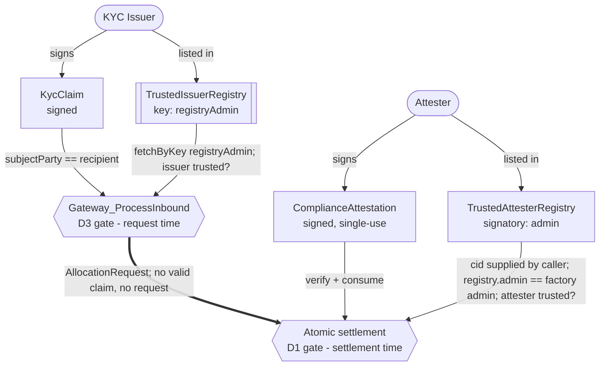
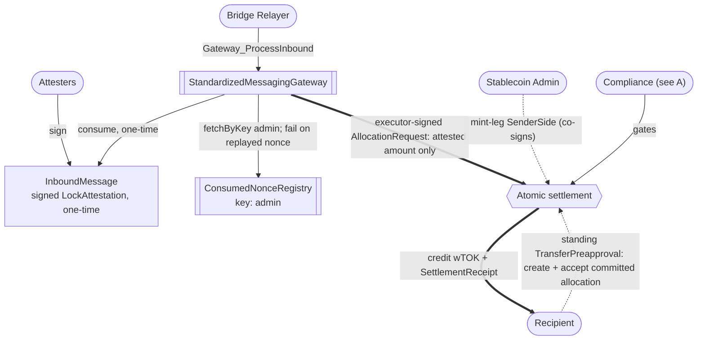
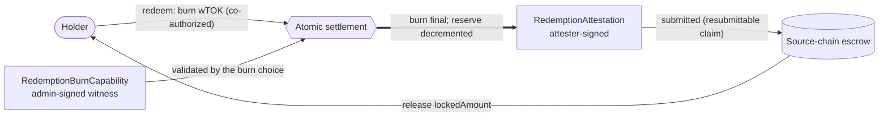
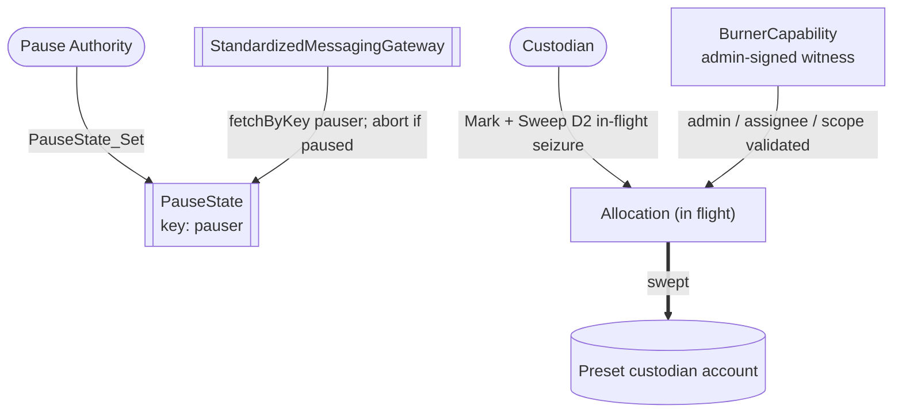
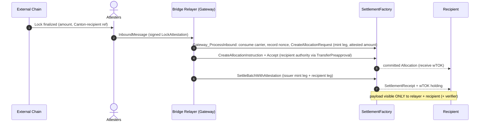

# Architectural Overview Report: Cross-Chain Stablecoin Payment Orchestration on Canton

This document describes a *reference design* for private, atomic settlement on Canton of stablecoin payments originating on external blockchains, grounded in the OpenZeppelin Canton components from this workspace, as well as the Canton Network Token Standard V2.

Source-grounding tags used throughout: `[IMPLEMENTED]` real code in this workspace, `[EVIDENCE]` real code in an evidence repo ([`canton-token-template`](https://github.com/OpenZeppelin/canton-token-template), [`canton-stablecoin`](https://github.com/OpenZeppelin/canton-stablecoin)) but not the M1 surface, `[UPSTREAM]` Splice / CIP / external-ecosystem reference, `[FUTURE]` proposed RI-level design, not built in M1 scope.

## 1. Product Definition

This report specifies a cross-chain stablecoin payment orchestration design for the Canton Network. Institutional participants accept an inbound asset representation, either an already-native Canton stablecoin such as USDCx or a gateway-minted wrapped instrument (written **`wTOK`** throughout), while the settlement amount, payer and payee identities, and compliance markers stay projected only to explicitly authorized parties.

Two components are planned or external rather than present in this workspace: the **Standardized Messaging Gateway** `[FUTURE]` (modeled as a bounded mock) and **USDCx** (an external ecosystem stablecoin, consumed by interface). Both are flagged throughout and in [section 6](#6-open-design-questions).

For such a payment rail to work, the inbound credit must settle atomically: the recipient is credited exactly the attested amount or nothing at all, and no intermediary holds the assets along the way. Therefore the settlement architecture centers on [CIP-0112 - Canton Network Token Standard V2](https://github.com/canton-foundation/cips/blob/main/cip-0112/cip-0112.md), specifically its support for [atomic settlement](https://github.com/canton-foundation/cips/blob/main/cip-0112/cip-0112.md#416-committed-allocations-for-prefunded-trading-and-iterated-settlement). The core building block is the **atomic delivery-versus-payment (DvP) settlement**: committed allocations are settled in one all-or-nothing transaction, with each leg's amount fixed on-ledger by the allocation sides their authorizers signed. A signed side is what makes the amount non-repudiable, not what makes it *correct*: tying the inbound amount, recipient, and instrument to the attesters' `LockAttestation` is the job of the explicit binding checks in [section 3](#3-how-we-implement-it), without which a signed side is only the submitter's own declaration.

OpenZeppelin currently has an experimental implementation of atomic settlement, inside the [OpenZeppelin/canton-specs repository](https://github.com/OpenZeppelin/canton-specs/blob/main/experiments/cip112-settlement/daml/OpenZeppelin/Experimental/Settlement/Cip112.daml). The implementation has built-in capabilities for:

1. Privacy through per-party projection: a participant sees only the legs on which they are the sender or receiver. Other parties' payments are never visible to them.
2. D1: Compliance through Party-Applied Attestation - compliance is checked per settlement, with no caching. Failure to adhere to compliance results in no credit.
3. D2: Seizure through Preset Custodian Lock-and-Sweep - a privileged party can sweep the funds in a locked allocation to a preset custodian account.
4. D3: Identity through Trusted-Issuer KYC - a recipient must hold a `KycClaim` from an issuer in the `TrustedIssuerRegistry` to receive a compliance-gated inflow.

One further compliance capability comes from `openzeppelin-access-control`: **D4: Authority through Per-Role Privilege Transfer** - each privileged action sits with a named role rather than a single admin. Privileges can be transferred, granted or revoked.

**Privacy scope (explicit non-goal).** The privacy guarantee covers the **Canton side only**. The source-chain lock is a public transaction on its own chain, and it necessarily encodes enough routing data (e.g. a Canton-recipient reference) for the attesters to produce the `LockAttestation`. An external observer who reads the source chain can therefore link a public lock of amount *N* to the fact that some identified Canton recipient will be credited *N*. What Canton's per-party projection hides is everything downstream: the settled holding, the receipt, compliance markers, and all subsequent private transfers. Decoupling or hiding the source-chain linkage itself (hashed commitments, shielded payloads, relayer-side blinding) is out of scope for this RI.

### Operational Scope and Boundaries

The reference implementation favors **simplicity and modular extensibility**. Through the tables below, we highlight what we consider in versus out-of-scope.

| Feature Category | In-Scope Architectural Components |
|---|---|
| Atomic Settlement | Private on-Canton settlement of inbound stablecoin payments via [`SettlementFactory_SettleBatchWithAttestation`](../../experiments/cip112-settlement/daml/OpenZeppelin/Experimental/Settlement/Cip112.daml#L274) (atomic DvP). |
| Cross-Chain Bridge | An inbound/outbound bridge **interface** (the Standardized Messaging Gateway) as a **bounded, verifiable mock**: attested inbound mint ([section 3](#3-how-we-implement-it)) and attested outbound redemption. |
| Compliance & Control | D1: a settlement does not execute unless an attester has signalled compliance. D2: a privileged party can block settlement and sweep allocation funds to a preset custodian account. D3: single-synchronizer identity. |
| Asset Representation | The gateway-minted wrapped instrument (`wTOK`), compliant with the CIP-0112 Token Standard V2 holding interfaces, and the integration **shape** for settling an existing native Canton stablecoin (e.g. USDCx) by interface. |
| Component Integration | Direct reuse of `openzeppelin-access-control`, `openzeppelin-ownable`, `openzeppelin-pausable`, the CIP-0112 settlement spine, as well as patterns from the [`canton-token-template`](https://github.com/OpenZeppelin/canton-token-template) and [`canton-stablecoin`](https://github.com/OpenZeppelin/canton-stablecoin) codebases. |

| Feature Category | Out-of-Scope Architectural Components |
|---|---|
| Production Bridge Infrastructure | Production bridge/relayer services, external oracle infrastructure, validator networks, and cryptographic light-client proofs. |
| Stablecoin Mechanism | The stablecoin issuance / peg / CDP mechanism itself; USDCx issuance and its native rail are external. |
| Cross-Domain Identity | Cross-domain identity resolution (ONCHAINID / ERC-3643 / Chainlink CCID); deferred, kept SCU-forward-compatible only. |
| Off-Ledger Compliance Shortcuts | Off-ledger caching of compliance status, probabilistic risk scoring, heuristic filtering. |
| Legacy Standards | Any reliance on the superseded CIP-56 token standard or legacy V1 allocation paths. The RI integrates strictly with V2 abstractions. |
| Cross-Synchronizer Operation | This RI is *cross-chain* (external chains to and from Canton via the gateway) but single-synchronizer on Canton. Cross-synchronizer settlement and identity have not been fully considered, so they are **out of scope**. The design for M1 is single-synchronizer. |

Narrowing scope to the standardized interface boundary means a production gateway can be swapped in later without modifying the settlement spine or the compliance logic.

### Instrument Naming: `wTOK` vs USDCx `[UPSTREAM]`

All flows in this report mint, settle, and redeem a **generic gateway-minted wrapped instrument, `wTOK`**, whose issuing admin is this RI's Stablecoin Admin. **USDCx is not that instrument**: it is already issued on Canton through Circle's own first-party rail, [xReserve](https://www.circle.com/blog/usdcx-on-canton-now-available-via-circle-xreserve) — USDC deposited into the xReserve contract on Ethereum is held there and USDCx is minted 1:1 on Canton, i.e. **lock-and-mint** in the taxonomy below, with Circle as the issuing authority. (Circle Gateway and CCTP sit *beside* that rail to keep USDCx interoperable with native USDC on other chains; CCTP is burn-and-mint and is not the USDCx mint path.) Routing USDCx through this gateway would therefore re-bridge an already-bridged asset, adding trust surface. Where a native rail exists, the RI simply *settles* the native mint output by interface (no RI-side issuer role); the gateway is the reference rail only for assets that **lack** a native Canton path. The general native-rail-vs-gateway rule is an open question ([section 6](#6-open-design-questions)).

### Target Ecosystem Participants

- **Regulated Financial Institutions and Corporate Treasuries** can accept inbound liquidity from public networks without exposing internal treasury flows, payment detail, or counterparty relationships to competitors or on-chain analytics.
- **Bridge and Gateway Builders** can swap a production messaging integration in behind the standardized interface boundary, reusing the settlement and compliance layers unchanged.
- **Wallet and Client Integrators** can validate delegated-accept inbound flows (a standing `TransferPreapproval` supplying an offline treasury's co-authorization) against a working reference.
- **Security and Assurance Auditors** can evaluate the reserve invariant, explicit authority boundaries, and the **proposed** validation workflow (`daml-lint → daml-props → daml-verify`).

### Educational Framing: How to Think About Building This on Canton

On public EVM networks, a bridge mints tokens into a globally visible state ledger any observer can trace. Canton operates on a privacy-preserving, **per-party projection** model enforced by the Canton protocol: a Canton contract is an instance of a template, signed and authorized by a set of parties (signatories), and visible only to its signatories and observers.

The inbound message from the gateway therefore does **not** mint-and-broadcast an asset in one global update. Instead the gateway drives an isolated, recipient-targeted allocation on the spine. State changes by archive-and-recreate rather than in-place mutation, and the atomic DvP archives the inbound request and creates a [`SettlementReceipt`](../../experiments/cip112-settlement/daml/OpenZeppelin/Experimental/Settlement/Cip112.daml#L695) visible only to the recipient, the relayer, and the required compliance verifiers. Cross-chain settlement thereby inherits Canton's data compartmentalization.

Because a recipient's signature (or a standing delegation of it) is required to bind them to an allocation, **two-step handshakes (Daml's propose-and-accept pattern) are a necessity, not a style choice**. The design uses **contract keys** (reintroduced in [Canton 3.5.1+](https://github.com/digital-asset/canton/releases/tag/v3.5.1)) so the `PauseState`, the trusted-issuer registry, and the consumed-nonce registry keep stable, unique identities across those archive-and-recreate cycles. The trusted-attester registry is the deliberate exception: settlement takes its contract id from the caller and defeats substitution by requiring `registry.admin == factoryAdmin` (diagram A, [section 3](#3-how-we-implement-it)).

Contract keys are the design target, not what runs today, and the gap has two parts. **SDK**: the `[IMPLEMENTED]` experiment code sits on the workspace's pinned baseline, which has no key support at all, so each choice instead takes a caller-supplied registry contract id and asserts that registry shares the factory's admin. **Templates**: no template in this workspace declares a `key` today, so the by-key resolution shown below is also a template change, not only an SDK migration. Because a key's maintainers must be signatories of the keyed contract, each key is fixed by that contract's own authority rather than by the rail `admin`: [`PauseState`](../../pausable/daml/OpenZeppelin/Pausable.daml#L47) is `signatory pauser` and carries no `admin` field, so its key is `pauser`, and ShapeB's [`TrustedIssuerRegistry`](../../experiments/identity-hook-shape-b/daml/OpenZeppelin/Experimental/Identity/ShapeB.daml#L84) is `signatory registryAdmin`, so its key is `registryAdmin`. The snippets and diagrams below use those maintainers.

---

## 2. Architecture Overview

The architecture is assembled from reused OpenZeppelin Daml primitives (role management, two-step ownership handover, pausing), the CIP-0112 settlement spine as the engine for all asset movement, and a bounded gateway mock at the cross-chain boundary. This section maps each component to its library, then defines the party/role topology and the trust configuration.

### Core Components and Library Mapping

| Component Suite | Applied Templates and Libraries | Architectural Function |
|---|---|---|
| Access Control `[IMPLEMENTED]` | `openzeppelin-access-control`: [`RoleGrant`](../../access-control/daml/OpenZeppelin/AccessControl.daml#L58), [`RoleAdmin`](../../access-control/daml/OpenZeppelin/AccessControl.daml#L116), [`DefaultAdminTransferOffer`](../../access-control/daml/OpenZeppelin/AccessControl.daml#L237), [`requireRole`](../../access-control/daml/OpenZeppelin/AccessControl.daml#L287) | Role-based permissioning. Gates the bridge relayer and custodian roles; D4 authority. |
| Ownership Lifecycle `[IMPLEMENTED]` | `openzeppelin-ownable`: [`Ownership`](../../ownable/daml/OpenZeppelin/Ownable.daml#L41), [`OwnershipOffer`](../../ownable/daml/OpenZeppelin/Ownable.daml#L82) | Provides support for D4: secure two-step handover of gateway and factory administration. |
| Emergency Stop `[IMPLEMENTED]` | `openzeppelin-pausable`: [`PauseState`](../../pausable/daml/OpenZeppelin/Pausable.daml#L47), [`whenNotPaused`](../../pausable/daml/OpenZeppelin/Pausable.daml#L77) | Emergency circuit breaker. `whenNotPaused` halts inbound processing during anomalies. |
| Settlement Spine `[IMPLEMENTED]` | `OpenZeppelin.Experimental.Settlement.Cip112`: [`SettlementFactory`](../../experiments/cip112-settlement/daml/OpenZeppelin/Experimental/Settlement/Cip112.daml#L191), [`AllocationRequest`](../../experiments/cip112-settlement/daml/OpenZeppelin/Experimental/Settlement/Cip112.daml#L322), [`AllocationInstruction`](../../experiments/cip112-settlement/daml/OpenZeppelin/Experimental/Settlement/Cip112.daml#L379), [`Allocation`](../../experiments/cip112-settlement/daml/OpenZeppelin/Experimental/Settlement/Cip112.daml#L474), [`SettlementReceipt`](../../experiments/cip112-settlement/daml/OpenZeppelin/Experimental/Settlement/Cip112.daml#L695), [`ToyHolding`](../../experiments/cip112-settlement/daml/OpenZeppelin/Experimental/Settlement/Cip112.daml#L132), [`BurnerCapability`](../../experiments/cip112-settlement/daml/OpenZeppelin/Experimental/Settlement/Cip112.daml#L97) | Core engine for all asset movement. `ToyHolding` is the toy unit of value, and can be replaced by real assets implementing the TSv2 holding interface. |
| Identity Verification `[IMPLEMENTED]` | `ShapeB`: [`KycClaim`](../../experiments/identity-hook-shape-b/daml/OpenZeppelin/Experimental/Identity/ShapeB.daml#L50), [`TrustedIssuerRegistry`](../../experiments/identity-hook-shape-b/daml/OpenZeppelin/Experimental/Identity/ShapeB.daml#L84) | Provides support for D3: a recipient must hold a `KycClaim` issued by a trusted party to receive a compliance-gated inflow. |
| Holdings & Preapproval `[EVIDENCE]` | `canton-token-template` (`SimpleToken.*`): `SimpleHolding`, `SimpleTokenRules`, `LockedSimpleHolding`, `TransferPreapproval` | Asset representation and the recipient-signed standing-delegation pattern. The spine-aware delegated-accept choice the RI uses is a `[FUTURE]` extension ([section 4.2](#42-component-inbound-dvp-via-delegated-accept-future)); the evidence template ships only `TransferPreapproval_Send`. |
| Messaging Gateway `[FUTURE]` | `StandardizedMessagingGateway` (bounded mock, [section 4.1](#41-component-standardized-messaging-gateway-bounded-mock-future)) | Cross-chain boundary: consumes attester-signed inbound messages and drives the spine. To be swapped for the production OpenZeppelin Contracts-Library gateway. |

As external dependencies, the reference implementation will integrate with the Splice Token Standard V2 interfaces `[UPSTREAM]` to ensure maximum interoperability. USDCx is consumed via interface only as a *settled* instrument; its issuance, peg, and cross-chain rail are external to this architecture ([section 1](#1-product-definition)).

### Party and Role Model Topology

Duties are segregated and mapped to discrete Daml parties, with in-code role names carried by `roleId` wrappers (e.g. `BRIDGE_RELAYER_ROLE`):

- **Bridge Relayer (`BRIDGE_RELAYER`)** - monitors the external chain, operates the gateway, submits inbound messages for consumption, and acts as settlement executor. A transport and liveness role only: a relayer with no attester authorization cannot mint.
- **Attesters** - independent parties listed in the `TrustedAttesterRegistry`. They sign the `LockAttestation` that authorizes an inbound mint, the per-settlement compliance attestation (D1), and the redemption attestation on the outbound path. The trust role, deliberately separated from the relayer's transport role.
- **Compliance Verifier (`COMPLIANCE_VERIFIER`)** - maintains the `TrustedIssuerRegistry` and issues the `KycClaim` used for D3 identity gating.
- **Custodian (`CUSTODIAN`)** - holds the seizure credential for D2 lock-and-sweep and owns the preset account that receives swept funds under mandate.
- **Stablecoin Admin (`STABLECOIN_ADMIN`)** - issuing admin of the gateway-minted wrapped instrument (`wTOK`); authors the mint leg of an inbound settlement. It has **no** authority over an externally-issued instrument like USDCx: in the settled-native case there is no RI-side issuer role.
- **Recipient** - the treasury or end-user receiving funds. May pre-establish a `TransferPreapproval` to accept compliance-gated inflows without a live signature.

Because Canton settles on per-party projection, the settlement is fractured into bilateral requests: the bridge relayer and recipient are the only initial observers of the inbound `AllocationRequest`, and the Stablecoin Admin and Custodian stay blind to intent until their authority is needed. A committed allocation locks the bridging funds until the settlement deadline, so the recipient knows the liquidity is reserved and cannot be double-spent or withdrawn before the DvP concludes.

### Decentralization and Trust Topology

Canton decentralizes a party along three independent axes, and the design assigns each role a deliberate position on each:

1. **governance** - whose signatures can change the party's identity and hosting (re-home the party to their own validator and act freely);
2. **validation** - how many independent validators must confirm the party's transactions (the `PartyToParticipant` confirmation threshold; a threshold above 1 defends against a malicious validator, at a latency and cost premium, and such a party can no longer submit Ledger API commands directly - it acts through externally signed submissions or through choices submitted by others);
3. **authorization** - what the Daml signatory/controller topology requires regardless of hosting.

For the roles that hold value-moving or supply-changing authority - the **Stablecoin Admin** (it authors `wTOK` mint legs) and the **Custodian** (it can sweep locked value) - the design envisions the EVM equivalent of an **N-of-M multisig**: no single key may exercise the role's authority. Canton offers two ways to implement this (which one is currently left as an open question, [section 6](#6-open-design-questions)):

- **On-ledger approval workflow** - the multisig is written in Daml ([Multiple Party Agreement](https://docs.canton.network/appdev/modules/m3-design-patterns#multiple-party-agreement)): approvers record approvals as contracts, and the final choice executes under the role party's inherited authority only once a threshold of approvals exists. Approvals are durable, named, and auditable on-ledger.
- **External party with threshold signing keys** - the role party's transactions require signatures from N of M keys (`PartyToKeyMapping`), held by independent organizations. Invisible to the Daml code and a single ledger transaction per action, but the signing ceremony must complete within the prepared transaction's validity window, and the approval record stays off-ledger. The implementation could leverage something like the [Bitsafe decentralization-manager](https://github.com/DLC-link/decentralization-manager).

The **attesters** must be several independent parties in the `TrustedAttesterRegistry`, with a threshold **N-of-M** posture (never all-of-M: a single unavailable or unvetted attester must not halt the rail, and a single malicious attester must not mint). The spine's current typed path verifies a **single** registry-rooted attestation, consumed single-use and bound to the exact transfer-leg set, not an N-of-M quorum; quorum verification needs an aggregated-attestation or M-attestation-verifying choice and is the design target, not the current guarantee.

The **bridge relayer** holds no minting trust, so splitting its identity adds little, and it is the most submission-heavy role in the design (every inbound consume, accept, and settle). We therefore envision it multi-hosted on several validators for availability, with its confirmation threshold kept at 1 so it can keep submitting Ledger API commands directly. Integrity does not depend on that choice: it comes from the attester trust split, and relay should ultimately be permissionless (anyone may submit a valid attested message), so no single party gates liveness.

The **pause authority** is likewise multi-hosted so the brake is always reachable, but its confirmation threshold stays at 1: an emergency stop must be instant, and a quorum would slow it down. The price of that choice is a griefing window: a malicious pauser can stall inbound settlement until allocation deadlines lapse. This griefing is capped by the sender's right to reclaim committed funds after the settlement deadline.

The **Compliance Verifier** function should rest on several independent issuers in the `TrustedIssuerRegistry`, so no single issuer can halt onboarding. Compliance is then only as strict as the weakest listed issuer, so membership is a policy decision.

**Recipients** need no rail-side decentralization: nothing binds them without their own signature (live or via their standing `TransferPreapproval`), so they only ever trust their own keys and their own validator.

---

## 3. How We Implement It

The inbound payment is the primary critical path: a deterministic sequence of state transitions on the CIP-0112 spine, from an attested source-chain lock to a privately projected Canton credit.

**Bridge mode.** In the standard bridge taxonomy, the inbound path is **lock-and-mint** (backing locked on the source chain, `wTOK` minted on Canton) and the outbound path is its inverse, **burn-and-release** (`wTOK` burned on Canton, backing released from the source-chain escrow). **Lock-and-unlock** (paying recipients from pre-positioned destination-side liquidity or inventory) is not supported: it would introduce a liquidity-provider role and an inventory-imbalance surface that a reference rail does not need. The gateway interface is the seam where an alternative mode would plug in without modifying the settlement spine or the compliance logic.

1. **Inbound message.** The external chain finalizes a locked deposit. An attester signs an `InboundMessage` carrying the typed `LockAttestation` (locked amount, Canton recipient, target instrument, nonce, expiry). The carrier has a single attester signatory today, matching the single-attestation path the spine verifies; aggregating an N-of-M attester quorum onto the carrier via the [Multiple Party Agreement](https://docs.canton.network/appdev/modules/m3-design-patterns#multiple-party-agreement) pattern is the design target ([section 2](#decentralization-and-trust-topology)). The gateway's single choice, `Gateway_ProcessInbound`, only *consumes* an already-existing carrier via its `InboundMessage_Consume` choice, one time, giving replay protection ([section 4.1](#41-component-standardized-messaging-gateway-bounded-mock-future)).
2. **Request and gate.** The relayer drives [`SettlementFactory_CreateAllocationRequest`](../../experiments/cip112-settlement/daml/OpenZeppelin/Experimental/Settlement/Cip112.daml#L205), an executor-signed request naming the mint leg with exactly the attested amount. Identity is checked on-ledger and fails closed: the recipient must hold a valid, unexpired `KycClaim` from an issuer in the `TrustedIssuerRegistry` (D3), and the settlement itself will require a compliance attestation from a trusted attester (D1). No valid claim or attestation, no credit, full rollback.
3. **Recipient co-authorization via `TransferPreapproval`.** A recipient cannot be bound unilaterally; the steps that bind them need their own authority. For an offline corporate treasury that cannot provide a live interactive signature, the recipient's wallet pre-establishes a `TransferPreapproval` for the wrapped instrument. The relayer exercises it to create the recipient's [`AllocationInstruction`](../../experiments/cip112-settlement/daml/OpenZeppelin/Experimental/Settlement/Cip112.daml#L379) from the request and accept it, both under the recipient's standing signature, producing a committed [`Allocation`](../../experiments/cip112-settlement/daml/OpenZeppelin/Experimental/Settlement/Cip112.daml#L474) in a single atomic submission.
4. **Atomic DvP.** The relayer packages the committed allocations into one [`SettlementFactory_SettleBatchWithAttestation`](../../experiments/cip112-settlement/daml/OpenZeppelin/Experimental/Settlement/Cip112.daml#L274). Settlement enforces value conservation per instrument: the archived locked input holdings must cover the authorizer's SenderSide leg amounts, and any surplus returns as a single new *change* holding (reducing fragmentation). Under-funded senders fail closed. The batch is **all-or-nothing**: if any leg fails (an already-archived allocation, a consumed input holding, a failed compliance check), the entire batch fails, so the application must validate inputs before submission and minimize concurrent consumption of the allocation contracts it references. On success the allocations are archived and a [`SettlementReceipt`](../../experiments/cip112-settlement/daml/OpenZeppelin/Experimental/Settlement/Cip112.daml#L695) plus the recipient's holding are created, projected to the recipient only.

### Data and State Flow

The diagrams below decompose the design around the shared `Atomic settlement` hub:

- **A** is the compliance and identity gating: D3 at request time, D1 at settlement.
- **B** is the inbound mint it performs, with `Compliance` plugging in from A.
- **C** is the outbound redemption that mirrors B.
- **D** is the operational control plane (pausing and D2 seizure). Keyed contracts are marked with their key.

**A. Compliance and identity (D1 + D3).** The registries list several independent attesters and issuers (one of each shown). The two gates fire at different points in the flow. D3 identity is checked at **request** time, in the gateway: no valid claim from a listed issuer whose subject is the recipient, no allocation request. D1 compliance is checked at **settlement** time: a single-use attestation from a listed attester, bound to this batch's own legs. Note the two registries are reached differently: the issuer registry is key-resolved in the gateway, while the attester registry is **not** — the settling caller supplies its contract id and [`ComplianceAttestation_Verify`](../../experiments/cip112-settlement/daml/OpenZeppelin/Experimental/Settlement/Cip112.daml#L836) rejects any registry whose `admin` is not the settling factory's admin, so what defeats registry substitution there is the admin match, not a key.



**B. Inbound mint settlement.** The attesters sign the one-time carrier; the gateway consumes it, records the nonce, and creates the executor-signed allocation request whose amount is exactly the attested amount. The recipient's standing `TransferPreapproval` supplies their authority to commit the receiving allocation, and the Stablecoin Admin's mint leg and the recipient's credit settle in one transaction, with compliance (from A) plugged in.



**C. Outbound redemption.** The holder's burn is the irreversible commit; the attested release on the source chain follows it ([section 3](#outbound-redemption-burn-on-canton-release-on-source-chain-future)).



**D. Pausing and seizure (control plane).** The pause authority halts inbound processing by key; the Custodian's sweep is validated against the capability witness and hardcoded to the preset custodian destination.



### The Inbound Settlement Flow: Step by Step



### Reserve and Lock-Attestation Model `[FUTURE]`

The flow above shows *how* an inbound payment settles privately; the core of a bridge is **what binds the Canton mint to real, locked backing on the source chain**. Without this the design is a private DvP engine with a trust gap at the boundary. The reserve model makes that binding explicit.

**What is attested.** Every inbound mint is authorized by a typed `LockAttestation` `[FUTURE]`, a Daml-visible record asserting that backing is locked on the source chain and is claimable *only* by minting the matching amount on Canton:

```daml
-- [FUTURE] RI-level type carried by the inbound message.
data LockAttestation = LockAttestation with
  sourceChainId      : Text         -- e.g. "ethereum-mainnet"
  lockTxId           : Text         -- the source-chain lock/escrow transaction
  lockedAsset        : Text         -- source-chain asset locked (foreign reference, so Text)
  lockedAmount       : Decimal      -- exact backing locked on the source chain
  cantonRecipient    : Party        -- who may receive the minted wrapped asset
  cantonInstrumentId : InstrumentId -- typed on-ledger identity bound to its issuing admin
  nonce              : Text         -- replay-protection sequence id (one-time)
  expiry             : Time         -- attestation validity window
```

**Who signs it.** Not a lone relayer. It is verified on-ledger via the spine's typed attestation path, [`SettlementFactory_SettleBatchWithAttestation`](../../experiments/cip112-settlement/daml/OpenZeppelin/Experimental/Settlement/Cip112.daml#L274) checked against the [`TrustedAttesterRegistry`](../../experiments/cip112-settlement/daml/OpenZeppelin/Experimental/Settlement/Cip112.daml#L778). This separates the relayer's *transport* role (move bytes) from the *trust* role (authorize minting): a relayer with no attester authorization cannot mint. The intended posture is a threshold N-of-M attester set; see the accuracy caveat in [section 2](#decentralization-and-trust-topology) for what the current code verifies.

**The binding (fail-closed).** The inbound [`AllocationInstruction`](../../experiments/cip112-settlement/daml/OpenZeppelin/Experimental/Settlement/Cip112.daml#L379) references a `LockAttestation`, and the mint asserts:

- `instructionAmount == attestation.lockedAmount` (no over-mint);
- `recipient == attestation.cantonRecipient` and the instrument matches;
- the attestation is registry-trusted, unexpired, and its `nonce` has not been consumed.

If any check fails the batch fails closed: no mint, no partial credit.

**How the `nonce` is enforced on Canton.** Two layers:

1. **Carrier consumption.** The `InboundMessage` carrying the attestation is archived by its own consuming `InboundMessage_Consume` choice, so one carrier can never be processed twice.
2. **Consumed-nonce registry.** Carrier consumption does not stop a *second* carrier being attested for the same lock. On-ledger dedup: an admin-signed `ConsumedNonceRegistry` contract, resolved by key (`admin`), records `(sourceChainId, nonce)` at consumption and **fails closed** if the pair is already present, so a duplicate carrier cannot mint even if the attesters misbehave. Without this layer, dedup rests solely on the honesty assumption that attesters never re-attest a used nonce.

Since `lockTxId` already uniquely identifies the source-chain lock, an implementation may key the registry entries by `(sourceChainId, lockTxId)` and drop the separate `nonce` field.

**Reserve invariant.** Total Canton-minted wrapped supply for an instrument never exceeds the sum of valid, unredeemed `LockAttestation`s for it: `mintedSupply ≤ Σ lockedAmount(unredeemed)`. Mint increments the claimed reserve; redemption decrements it. This is the on-ledger statement of 1:1 backing.

**Where the coupling must bite.** Settlement conserves value at *settlement* by funding the recipient's leg from a sender's locked holdings, so the actual unbacked-issuance surface is the *creation* of the wrapped input holdings that get locked, not the settle. The mint of the wrapped instrument must therefore be reachable **only** through the attested inbound flow, consuming a `LockAttestation` with `mintedAmount == lockedAmount`; there is **no** standalone admin mint of the wrapped instrument. That keeps backing enforced where supply is created, not merely where it settles.

Concretely, a `[FUTURE]` attested-mint choice (e.g. `Wtok_MintAttested`, co-authorized by the Stablecoin Admin) is the only creator of `wTOK` holdings: it re-verifies the attestation checks above and creates the holdings that fund the admin's SenderSide leg of the inbound settlement. The mint is modeled as a funded transfer leg rather than as a sibling create (the LP-mint idiom in the DEX RI) because the minted amount must be conserved against custodied source-chain backing, not derived from pool-share accounting, so it must pass through the same per-instrument conservation check as every other leg.

### Outbound Redemption (burn on Canton, release on source chain) `[FUTURE]`

Redemption is the other half of any bridge and the path a regulated user needs. It mirrors the inbound flow:

1. **Burn on Canton.** The holder requests redemption; the wrapped holding is burned, producing a typed `RedemptionAttestation` `[FUTURE]` `{ amount, sourceChainDestination, nonce }`. The burn gate is **not** the D2 [`BurnerCapability`](../../experiments/cip112-settlement/daml/OpenZeppelin/Experimental/Settlement/Cip112.daml#L97): that is the Custodian's *seizure* credential and must never be reused for user-initiated redemption. The redemption burn is gated by a separate `[FUTURE]` `RedemptionBurnCapability`, same witness shape (admin-signed, choice-less, instrument-scoped) but held by the redemption operator, exercised in a choice co-authorized by the holder (it is the holder's asset being burned).
2. **Attest.** A registry-trusted attester signs the `RedemptionAttestation` via the same `TrustedAttesterRegistry` path (N-of-M is the target posture; [section 2](#decentralization-and-trust-topology)).
3. **Release on the source chain.** The signed burn attestation is submitted to the source-chain escrow contract, which releases `amount` of locked backing to `sourceChainDestination`, and the reserve is decremented. The burn **references and draws down specific unredeemed `LockAttestation`(s)** (marking them redeemed / decrementing their remaining `lockedAmount`) so `Σ lockedAmount(unredeemed)` and actual supply cannot drift under partial burns.

**Cross-chain atomicity.** The source-chain release is **not** in the same Daml transaction as the Canton burn (no protocol spans both ledgers atomically). The design is therefore **burn-first / attested-release**: the Canton burn is the irreversible commit, and the foreign release is gated on the signed burn attestation. If the foreign release stalls, the burn is already final, so the reserve accounting stays sound (supply went down) and the redemption becomes a standing, replay-protected claim the holder (or any relayer) can resubmit until the escrow releases. The failure mode is *delayed release*, never *double-spend* or *unbacked supply*.

### Inbound Delivery Guarantees and Recovery

Nothing guarantees the Canton-side settlement of an attested lock *executes*: delivery liveness is bounded by the trusted relayer and attester set. The design deliberately adds no automatic cross-chain recovery protocol (compensating messages back to the source chain would require multi-round message passing with its own delay, cost, and failure surface). The guarantees are structural and fail-closed:

- **Before the gateway step, nothing is credited.** A stalled or failed relayer leaves the source-chain backing locked and the Canton side untouched: no partial state, no unbacked credit. Once `Gateway_ProcessInbound` commits, the nonce is spent: a failed settlement cannot be re-driven on Canton, and recovery falls to the source-chain refund below.
- **On Canton, stalled committed value is recoverable.** A committed [`Allocation`](../../experiments/cip112-settlement/daml/OpenZeppelin/Experimental/Settlement/Cip112.daml#L474) becomes releasable once its settlement deadline passes: the executors may [`Allocation_Cancel`](../../experiments/cip112-settlement/daml/OpenZeppelin/Experimental/Settlement/Cip112.daml#L570) and the authorizer may [`Allocation_Withdraw`](../../experiments/cip112-settlement/daml/OpenZeppelin/Experimental/Settlement/Cip112.daml#L583), both returning the locked holdings (blocked while a D2 seizure is in flight). Because a committed allocation with `settlementDeadline = None` can never be released, the RI mandates a finite `settlementDeadline` on every committed inbound allocation.
- **The source-chain lock itself** is outside Canton's authority; reclaiming it after a permanently failed inbound flow (timeout + forced refund at the escrow) is a gateway-contract concern, tracked as an open question ([section 6](#6-open-design-questions)).

### D1: Compliance through Party-Applied Attestation

Institutional payment rails require that sanctioned or unverified parties cannot be paid. The RI checks compliance per settlement and fails closed: no valid attestation, no credit. Our atomic-settlement codebase currently showcases an experimental example via [`SettlementFactory_SettleBatchWithAttestation`](../../experiments/cip112-settlement/daml/OpenZeppelin/Experimental/Settlement/Cip112.daml#L274), which requires an attestation covering this specific settlement, from an attester listed in the [`TrustedAttesterRegistry`](../../experiments/cip112-settlement/daml/OpenZeppelin/Experimental/Settlement/Cip112.daml#L778). The registry must share the factory's admin, so callers cannot substitute a registry of their own choosing. Attestations are single-use, so none can be cached or reused across settlements.

### D2: Seizure through Preset Custodian Lock-and-Sweep

Institutional payment rails require the ability to seize assets under judicial mandate. The RI implements D2 via a strict **lock-and-sweep** pattern. For in-flight allocations this is the spine's [`Allocation_MarkD2InFlightSeizure`](../../experiments/cip112-settlement/daml/OpenZeppelin/Experimental/Settlement/Cip112.daml#L595) for locking, then [`Allocation_SweepD2InFlightSeizure`](../../experiments/cip112-settlement/daml/OpenZeppelin/Experimental/Settlement/Cip112.daml#L625) for sweeping the locked holdings to a preset custodian account; for settled holdings, a forced-sweep choice on the evidence `LockedSimpleHolding` (`LockedSimpleHolding_ForcedBurn` `[FUTURE]`; the evidence template ships only `_Unlock`).

[`BurnerCapability`](../../experiments/cip112-settlement/daml/OpenZeppelin/Experimental/Settlement/Cip112.daml#L97) is deliberately choice-less: a capability *witness*, not an actor. The sweep choices fetch it and validate `admin` / `assignee` / `instrumentScope` before archiving any holding; the authority lives in the sweep choices, and the capability is the credential they check. D2 never burns the asset to nothing and never returns seized funds to the sender (ordinary transfer *failures* do return to sender). Revocation today is structural (the admin archives the contract); a rotation/reissue choice is an open question ([section 6](#6-open-design-questions)).

### D3: Know-your-customer

Institutional payment rails require participants to be identified. The RI implements D3 via a single-synchronizer identity architecture: recipients must hold a `KycClaim` issued by a party present in the `TrustedIssuerRegistry` to receive compliance-gated inflows. Cross-domain identity resolution is deferred and kept forward-compatible via additive SCU.

### D4: Authority and Privilege Transfer

Institutional payment rails require administrative power to be explicit and accountable: every privileged action traces to a named authority. There is no single admin holding every privilege. Each action sits with the role responsible for it: relay with the `BRIDGE_RELAYER` role grant, mint-leg authoring with the `STABLECOIN_ADMIN`, seizure with the `CUSTODIAN`'s capability witness, and registry maintenance with the `COMPLIANCE_VERIFIER`. These privileges are granted, transferred, and revoked through `openzeppelin-access-control` role administration and the `openzeppelin-ownable` two-step ownership handover, so authority can move between parties without redeploying. A permission is bound by direct controllership when its holder is fixed for the life of the contract, and through `openzeppelin-access-control` (`RoleGrant` / `requireRole`) when it must be swappable or revocable without recreating the contract.

### Implementing Smart Contract Upgrades

For a smart contract upgrade, an existing choice's arguments must never be mutated to require a new field. Extensions are managed via appended `Optional` fields, new serializable types, and **new choices**. A template can add a new interface, but an interface definition itself cannot change; only an interface *instance* (its implementation in a template) can.

Consider cross-domain identity (D3, deferred). To add it later, the settlement path is **not** mutated. Instead a new choice (e.g. `SettlementFactory_SettleBatchWithCrossDomainProof`) is appended that accepts an `Optional CrossDomainProof`; existing relayers calling the current entrypoint keep working. This is the additive path proven in the `canton-specs` identity-hook upgrade spike.

SCU extensions are not security retrofits: adding a stricter choice does not close the looser one. If the stricter path must become mandatory, the upgrade must also make the looser choice fail unconditionally and mark it `deprecated`.

### Extension Points

The design is modular code first, and the seams below are the deliberate extension points:

- `openzeppelin-pausable`, `openzeppelin-ownable`, and `openzeppelin-access-control` are plug-and-play: any template that needs a circuit breaker, two-step handover, or role gating composes them without modification.
- The atomic settlement primitive serves any system that needs multi-leg DvP; the DEX and Lending RIs ride the same entrypoint, with no parallel settlement path.
- The Standardized Messaging Gateway is the pluggable bridge boundary: a production gateway, or an alternative bridge mode ([section 3](#3-how-we-implement-it)), swaps in behind the interface without touching settlement or compliance.
- The `KycClaim` / `TrustedIssuerRegistry` identity hook is the substitution point for richer identity regimes, including the deferred cross-domain D3.

---

## 4. Sample Component Structure

The code below is idiomatic Daml that composes with the libraries above. These snippets are illustrative rather than production code: they exemplify the flows and highlight the key parts, so they omit non-essential detail such as basic checks, the `ensure` block, and most comments.

### 4.1 Component: Standardized Messaging Gateway (bounded mock) `[FUTURE]`

The gateway is the cross-chain boundary. Its single inbound choice validates the relayer's role grant, resolves the pause state and the identity and nonce registries **by key** — each keyed by its own maintaining authority (`pauser`, `registryAdmin`, the rail `admin`), so membership changes never leave the gateway holding a stale contract id — consumes the one-time attested carrier, records the nonce fail-closed, and creates an executor-signed allocation request whose amount is exactly the attested amount. The recipient-side allocation is deliberately not created here: the gateway carries no recipient authority, so binding the recipient happens in [section 4.2](#42-component-inbound-dvp-via-delegated-accept-future) under the recipient's own standing signature.

```daml
module CrossChain.Gateway where

import OpenZeppelin.AccessControl (RoleGrant, requireRole)
import OpenZeppelin.Experimental.Settlement.Cip112 (SettlementFactory)
import OpenZeppelin.Experimental.Identity.ShapeB (KycClaim, TrustedIssuerRegistry)
import OpenZeppelin.Pausable (PauseState, whenNotPaused)

data GatewayRole = Relayer | Seizer deriving (Eq, Show)

roleId : GatewayRole -> Text
roleId Relayer = "BRIDGE_RELAYER_ROLE"
roleId Seizer  = "CUSTODIAN_SEIZER_ROLE"

-- [FUTURE] bounded mock of the planned Contracts-Library gateway.
template StandardizedMessagingGateway
  with
    admin : Party
    operator : Party
    stablecoinAdmin : Party  -- issuing admin of the gateway-minted wTOK
    pauser : Party           -- pause authority; maintainer of the PauseState key
    registryAdmin : Party    -- compliance verifier; maintainer of the issuer-registry key
  where
    signatory admin, operator

    -- `InboundMessage` is a one-time attester-signed carrier holding the
    -- `LockAttestation`. Its consuming `InboundMessage_Consume` choice (controller:
    -- the gateway operator) returns the attestation and archives the carrier.
    nonconsuming choice Gateway_ProcessInbound : ContractId AllocationRequest
      with
        relayerGrant : ContractId RoleGrant
        inboundMessageCid : ContractId InboundMessage
        recipient : Party
        kycClaimCid : ContractId KycClaim
        settlementFactoryCid : ContractId SettlementFactory
      controller operator
      do
        -- Authority: validate the relayer grant against openzeppelin-access-control.
        grant <- fetch relayerGrant
        requireRole operator (roleId Relayer) admin grant

        -- Pause gate and D3 identity, resolved by key. A key's maintainers must be
        -- signatories of the keyed contract, so each key is that contract's own
        -- authority: `pauser` for PauseState, `registryAdmin` for the issuer registry.
        (_, pause) <- fetchByKey @PauseState pauser
        whenNotPaused pause
        (_, registry) <- fetchByKey @TrustedIssuerRegistry registryAdmin
        claim <- fetch kycClaimCid
        assertMsg "identity mismatch" (claim.subjectParty == recipient)
        assertMsg "issuer not trusted" (claim.declaredIssuer `elem` registry.trustedIssuers)

        -- Bind to backing + replay-protect: the mint amount derives from the signed
        -- LockAttestation, the carrier is consumed one-time, and the nonce registry
        -- fails closed on a duplicate. No attestation, no mint.
        now <- getTime
        att <- exercise inboundMessageCid InboundMessage_Consume
        assertMsg "attestation expired" (now <= att.expiry)
        assertMsg "recipient mismatch" (recipient == att.cantonRecipient)
        assertMsg "instrument admin mismatch" (att.cantonInstrumentId.admin == stablecoinAdmin)
        (nonceRegCid, _) <- fetchByKey @ConsumedNonceRegistry admin
        exercise nonceRegCid ConsumedNonceRegistry_Record with
          sourceChainId = att.sourceChainId; nonce = att.nonce

        -- Drive the spine: the executor-signed AllocationRequest names the mint
        -- leg with exactly the attested amount. The recipient's committed
        -- allocation is created and accepted under the recipient's own authority,
        -- via their standing TransferPreapproval (section 4.2): the gateway holds
        -- no recipient authority and cannot bind them here.
        exercise settlementFactoryCid SettlementFactory_CreateAllocationRequest with
          settlement = inboundSettlement
          transferLegs = [ mintLeg recipient att.lockedAmount att.cantonInstrumentId ]
          meta = emptyMetadata
```

### 4.2 Component: Inbound DvP via Delegated Accept `[FUTURE]`

The `canton-token-template` evidence template `TransferPreapproval` is a toy preapproval exposing only `TransferPreapproval_Send`; what the snippet relies on is the *pattern*, which is real: a recipient-signed standing contract whose choice body contributes the recipient's authority when a third party exercises it. The delegated allocate-and-accept choice shown is an RI-level `[FUTURE]` design, to be consolidated at implementation time either as an SCU-additive choice on the evidence template or as a dedicated recipient-signed `DelegatedAcceptGrant` template. Both spine steps that need the recipient's signature run inside its body: creating the recipient's [`AllocationInstruction`](../../experiments/cip112-settlement/daml/OpenZeppelin/Experimental/Settlement/Cip112.daml#L379) from the gateway's request (the create's `actors` must carry the authorizer's own authority) and accepting it into a committed [`Allocation`](../../experiments/cip112-settlement/daml/OpenZeppelin/Experimental/Settlement/Cip112.daml#L474).

```daml
module CrossChain.Orchestrator where

import OpenZeppelin.Experimental.Settlement.Cip112
import SimpleToken.Preapproval (TransferPreapproval)

template CrossChainDvP
  with
    executor : Party    -- the relayer, acting as authorized settlement executor
  where
    signatory executor

    choice Execute_Inbound_Settlement : ContractId SettlementReceipt
      with
        requestCid : ContractId AllocationRequest  -- the gateway's executor-signed request (section 4.1)
        recipientPreapprovalCid : ContractId TransferPreapproval
        issuerSendAllocationId : ContractId Allocation  -- issuer's SenderSide of the mint leg
        batchFactoryCid : ContractId SettlementFactory
        settlement : SettlementInfo
        transferLegs : [TransferLeg]
        attestationCid : ContractId ComplianceAttestation
        registryCid : ContractId TrustedAttesterRegistry  -- checked against the factory's admin
      controller executor
      do
        -- The recipient's required co-authorization flows through a choice on the
        -- recipient-signed TransferPreapproval: its body creates the recipient's
        -- AllocationInstruction from the executor's AllocationRequest and runs
        -- AllocationInstruction_Accept, both under the recipient's signature; the
        -- executor only triggers it (a party list confers no authority).
        result <- exercise recipientPreapprovalCid TransferPreapproval_AllocateInbound with
          requestCid; executor
        let allocationId = case result of
              AllocationInstructionCompleted cid -> cid
              _ -> error "instruction did not complete"

        -- Atomic DvP via the attested spine entrypoint: the issuer's SenderSide
        -- mint leg and the recipient's ReceiverSide settle together or not at all,
        -- presenting the signed compliance attestation and the attester registry
        -- (D1). The registry cid is caller-supplied; verification rejects any
        -- registry whose admin is not the factory's own admin.
        receipts <- exercise batchFactoryCid SettlementFactory_SettleBatchWithAttestation with
          settlement; transferLegs
          allocationCids = [issuerSendAllocationId, allocationId]
          actors = settlement.executors
          attestationCid; registryCid
        case receipts of
          r :: _ -> pure r
          [] -> abort "SettleBatch returned no receipt"
```

### 4.3 Component: D2 Lock-and-Sweep

D2 reuses the spine's real seizure mechanism; there is no bespoke seizure template.

```daml
-- D2SeizureHook is a spine data record (seizureCaseRef, custodianDestination,
-- inFlightHandlingStatus), not a template, and BurnerCapability has no choices.
-- Seizure runs on the Allocation / holding:
--
--   in-flight allocation:
--     exercise allocationId Allocation_MarkD2InFlightSeizure with seizureHook = ...
--     exercise allocationId Allocation_SweepD2InFlightSeizure with burnerCap = burnerCapId
--   settled / locked holding [FUTURE] (the evidence template ships only _Unlock):
--     exercise lockedHoldingId LockedSimpleHolding_ForcedBurn with
--       burner = custodian; burnerCap = burnerCapId   -- swept to preset custodianDestination
--
-- Never burns the asset to nothing; never returns seized funds to sender.
```

---

## 5. Security & Auditability

The RI prioritizes verifiable security. Security rests on Daml's authorization model and deterministic state transitions rather than bespoke cryptography, and Canton's per-party projections create natural containment boundaries.

### 5.1 Security Invariants

- **Conservation of funds**:
  - Settlement cannot output more value than its input `Allocation`s. On every settle path the engine archives the locked input holdings and asserts, per instrument, that they cover the authorizer's SenderSide leg amounts; any surplus returns to the sender as a single unlocked *change* holding.
  - An under-funded sender fails closed; no value is minted from nothing. (`nextIterationFunding` is inert forward-compatible Token Standard V2 metadata; M1 does not implement iterated settlement, so no path defers conservation.)
- **1:1 reserve backing**:
  - Canton-minted wrapped supply for an instrument never exceeds the sum of valid, unredeemed `LockAttestation`s: `mintedSupply ≤ Σ lockedAmount(unredeemed)`.
  - A mint requires a registry-trusted, unexpired, non-replayed attestation whose `lockedAmount` equals the minted amount; redemption burns first and decrements the reserve. No mint without locked backing; no double-redeem of one lock.
- **Replay protection**:
  - One source-chain lock can credit Canton at most once: the attested carrier is consumed one-time, and the consumed-nonce registry fails closed on a duplicate `(sourceChainId, nonce)`.
- **Privacy partitioning**:
  - Amount, payer, and payload memo are projected only to the relayer, recipient, and designated compliance verifier. If the Stablecoin Admin could observe the memo without authorization, the invariant is broken.
- **Non-custodial recipient binding**:
  - No allocation binds a recipient without their signature, supplied live or through their standing `TransferPreapproval`.
  - Stalled committed value is recoverable after the settlement deadline, and every committed inbound allocation must carry a finite `settlementDeadline`.

### 5.2 Automated Validation Engine

We propose a three-tier validation approach, based on verification tools built by OpenZeppelin:

1. [`daml-lint`](https://github.com/OpenZeppelin/daml-lint/commits/main/): Static analysis through abstract-syntax tree checks: decimal bounds, unguarded division, positivity, archive-before-execute, anti-patterns, naming conventions.
2. [`daml-props`](https://github.com/OpenZeppelin/daml-props): Property based testing by fuzzing state transitions to ensure conservation/supply/balance invariants hold under extreme inputs.
3. [`daml-verify`](https://github.com/OpenZeppelin/daml-verify): Formal verification through Z3-backed proofs, asserting logical impossibility of undesired states.

### 5.3 Threat Model and Failure Modes

| Vector | Attack | Mitigation |
|---|---|---|
| Malicious relayer routing | Routes valid inbound funds to an unauthorized or sanctioned account. | The recipient is pinned by the attesters' signed `LockAttestation` (`cantonRecipient`), and D3 requires a `KycClaim` whose `subjectParty` matches the exact recipient. The relayer cannot spoof the destination; fail-closed. |
| Unbacked mint (relayer or forged attestation) | A relayer, or anyone without attester authorization, tries to mint `wTOK` with no real source-chain lock. | The mint amount and instrument derive only from a registry-trusted, unexpired, single-use `LockAttestation`; there is no standalone admin mint. A lone relayer holds transport authority, not trust authority. Residual risk concentrates in the attester set, which is why its N-of-M decentralization is the largest open trust question ([section 6](#6-open-design-questions)). |
| Replay of a used lock | A consumed inbound message (or a second carrier for the same lock) is submitted again to mint twice. | One-time carrier consumption plus the consumed-nonce registry: a duplicate `(sourceChainId, nonce)` fails closed even if the attesters misbehave. |
| Toxic or spam inflow | A sender forces a settlement onto an unwilling recipient. | Without the recipient's accept (live, or via their standing `TransferPreapproval`), the allocation never commits; unsettled allocations expire and return to sender. |
| Compromised admin key | A compromised Stablecoin Admin or Custodian key attempts arbitrary expropriation. | D2 sweeps are hardcoded to the preset `custodianDestination` (no arbitrary burn, no return-to-sender), and supply-changing authority is slated for N-of-M multisig ([section 2](#decentralization-and-trust-topology)). |
| Forced upgrades breaking in-flight allocations (SCU) | A poorly executed upgrade mutates fields, rendering existing `Allocation` contracts un-settleable. | Programmatic adherence to the SCU rule (Optional appends + new choices only). Existing choices stay operable; in-flight settlements conclude before users transition. |
| UTXO fragmentation | Many small transfers accumulate holding dust. | Settlement returns a sender's surplus as a single new *change* holding per instrument rather than many fragments. |
| DAR unvetting | A participant unvets the rail's DAR on their validator, blocking every choice on contracts its parties are stakeholders of: a holder freezes the D2 sweep of their own funds, and an unvetted attester or recipient blocks pending settlements they are party to. A transaction succeeds only if every **informee's** participant has vetted the package version the submitter selected for it — not that all parties run one identical DAR, since several versions of a package can be vetted and in use at once. Unvetting therefore freezes contracts rather than freeing them: the holder cannot move the asset either, and the locked value stays readable and swept-able once re-vetted. Attester-side liveness risk is bounded by the N-of-M registry posture ([section 2](#decentralization-and-trust-topology)); holder-side unvetting is an inherent Canton vetting property with no protocol-level bypass. |

### 5.4 Throughput and Contention

Every inbound mint records its nonce in the single admin-keyed `ConsumedNonceRegistry`, archiving and recreating that one contract per settlement, so inbound settlements for the rail serialize: two concurrent inbound mints consume the same registry contract, and the synchronizer commits one and forces the other to retry against the new state. Contention is per rail, a consequence of the consuming nonce record, not a global ledger bottleneck.

The mitigation is sharding the registry (one registry per `sourceChainId`, or per source-chain escrow contract), which restores parallelism across sources while keeping the fail-closed dedup guarantee within each shard. Independent rails (distinct instruments with their own registries) settle in parallel, and several allocations can ride one `SettlementFactory_SettleBatchWithAttestation`, amortizing a confirmation round-trip over many legs.

### 5.5 Off-Ledger Reconciliation `[UPSTREAM]`

A treasury operating this flow reconciles its private Canton settlement against the inbound external-chain event without parsing raw transaction trees: the Token Standard V2 transfer-events API (`Splice.Api.Token.TransferEventsV2`, imported in the `canton-token-template` evidence) emits holdings-change events the recipient can correlate with the gateway's inbound message id, giving a 1:1 audit linkage between the external lock/burn and the Canton credit. This is an upstream API surface, not vendored here, and the linkage is a reference pattern; the report makes no reconciliation-completeness, accounting-standard, or audit-readiness claim.

---

## 6. Open Design Questions

Decisions to settle with the internal team before implementation, not M1 build items.

- **Production attester / relayer trust model (decentralization).** [Section 2](#decentralization-and-trust-topology) fixes the *shape*: a threshold N-of-M attester set verified via the [`TrustedAttesterRegistry`](../../experiments/cip112-settlement/daml/OpenZeppelin/Experimental/Settlement/Cip112.daml#L778), permissionless relay, fail-closed mint. The *parameters* are open: M and the threshold N, attester selection / rotation / slashing for a false attestation, how the attester set is itself governed, and the shape of the quorum-verifying choice (aggregated attestation vs M attestations). This is the largest trust surface in the design.
- **Multisig implementation for value-critical roles.** The Stablecoin Admin and Custodian each require N-of-M authority ([section 2](#decentralization-and-trust-topology)). Open: whether each role uses the on-ledger approval workflow, an external party with threshold signing keys, or a combination, and the N and M per role.
- **Outbound-redemption cross-chain atomicity.** Burn-first / attested-release guarantees no double-spend and no unbacked supply, but the foreign release is not atomic with the Canton burn. Open: the standing-claim resubmission protocol and SLA for a stalled source-chain release, and whether a bounded grace window before burn (escrow-then-burn) is ever preferable for specific source chains.
- **Capability lifecycle (revocation / rotation).** `BurnerCapability` is a choice-less capability witness, revocable only by the admin archiving it. Open before any public authority surface: the SCU-additive `BurnerCapability_Revoke`/`_Rotate` shape (single contract vs a registry of capabilities), and the concrete holder and co-authorization model for the `[FUTURE]` `RedemptionBurnCapability` that gates outbound redemption burns, kept strictly separate from the Custodian's seizure credential.
- **Aligning gateway scope with native rails.** USDCx is minted on Canton by Circle's own xReserve lock-and-mint rail ([section 1](#1-product-definition)), so this RI settles it rather than bridging it. Open: a general rule for when an inbound asset already has a native Canton rail (settle the native mint output) versus when the generic gateway is the right reference, so the architecture never re-bridges an already-bridged asset.
- **Gateway behavior under source-chain reorgs.** When the production gateway lands, how are inbound attestations sequenced if the origin chain deep-reorgs? Does the gateway manage confirmation delays internally, or must the relayer contract use a time-locked `AllocationInstruction` to mitigate cross-chain rollback risk?
- **Expired / unsettled inbound-allocation lifecycle.** The spine provides post-deadline release primitives ([`Allocation_Cancel`](../../experiments/cip112-settlement/daml/OpenZeppelin/Experimental/Settlement/Cip112.daml#L570), [`Allocation_Withdraw`](../../experiments/cip112-settlement/daml/OpenZeppelin/Experimental/Settlement/Cip112.daml#L583)). Open: who *operationally* runs the reclaim for a dead inbound flow (an automated handler needs executor or authorizer authority), how the RI enforces the mandatory finite `settlementDeadline`, and how this local lifecycle aligns with the upstream Token Standard V2 allocation lifecycle once imported.
- **Synchrony and time assumptions.** The boundary is asynchronous by construction: the gateway consumes finalized source-chain events, and Canton settlement is a separate, later transaction, while the on-Canton windows (the attestation `expiry`, the mandatory finite `settlementDeadline`) are checked against ledger time. Open: concrete window sizes (the margin between source-chain finality and Canton ledger time, attester turnaround ceilings) and the operational SLAs around them. Also open: whether the nonce should be recorded at settlement rather than at the gateway, since no window size makes a consumed-but-unsettled nonce retryable.
- **Cross-domain identity proof injection (D3, deferred).** When ONCHAINID / ERC-3643 equivalents are supported, does the `TrustedIssuerRegistry` ingest external state proofs via an oracle, or rely on a CCID protocol synchronized across the global synchronizer? The cross-domain proof-injection trust model must be audited.
- **Composability with the other RIs** (forward-compatibility): recipients holding instruments settled here (`wTOK`, or native USDCx) can provide liquidity to the DEX RI ([`01`](./01-dex.md)) pools or collateralize a Lending RI ([`02`](./02-lending.md)) vault - all over the same `SettlementFactory_SettleBatchWithAttestation` spine, with no parallel settlement path.
