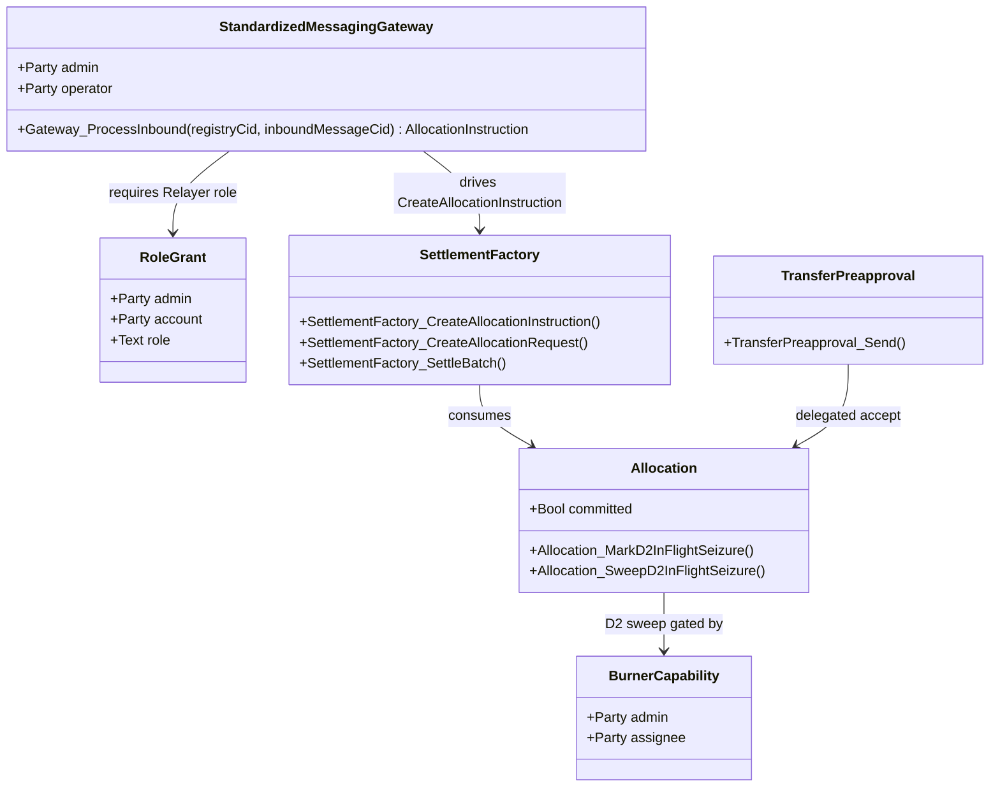
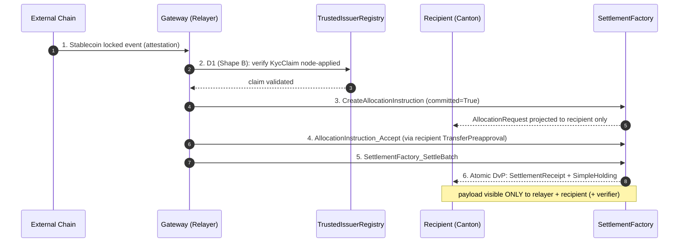

# Architectural Overview Report: Cross-Chain Stablecoin Payment Orchestration on Canton

Status: **reference-design report.** It describes a *reference design* grounded
in the real OpenZeppelin Canton components in this workspace; it is **not** a
claim of acceptance, conformance, audit readiness, or production readiness.

> **Source-grounding tags** (throughout): `[IMPLEMENTED]` real code in the M1
> library base ([`canton-specs`](https://github.com/OpenZeppelin/canton-specs) /
> [`canton-contracts`](https://github.com/OpenZeppelin/canton-contracts)) ·
> `[EVIDENCE]` real code in an evidence repo
> ([`canton-token-template`](https://github.com/OpenZeppelin/canton-token-template),
> [`canton-stablecoin`](https://github.com/OpenZeppelin/canton-stablecoin)) ·
> `[UPSTREAM]` Splice / CIP / external-ecosystem reference, not vendored here ·
> `[FUTURE]` proposed RI-level design, not built in M1.
>
> **Design priority order** (governs every interface and snippet):
> **1) Security → 2) Simplicity → 3) Readability → 4) Auditability.**

This is the architecture documentation for private, atomic settlement on Canton
of stablecoin payments that originate on external blockchains. Two components are
**planned / external, not present in this workspace**: the **Standardized
Messaging Gateway** (`[FUTURE]`, modeled as a bounded mock) and **USDCx** (an
external ecosystem stablecoin, consumed by interface). An inbound asset is an
already-native stablecoin such as USDCx, or a gateway-minted wrapped instrument
written **`wTOK`** throughout. The gateway `[FUTURE]` sits on the **CIP-0112 /
Token Standard V2 settlement spine** `[IMPLEMENTED]`
(`OpenZeppelin.Experimental.Settlement.Cip112`).

---

## 1. Product Definition

### Who this is for, and what they expect

The design starts from the Canton Network stakeholders and the guarantees they
expect. Those expectations — not a bridge feature list — drive every choice below.

| Stakeholder | What they expect | Design consequence |
|---|---|---|
| **Regulated institution / corporate treasury** (Recipient) | Accept inbound cross-chain liquidity without exposing treasury flows, payment detail, or counterparty relationships. | Per-Party projection: the settled holding, receipt, and compliance markers project only to the recipient, relayer, and verifier Parties ([§2](#2-architecture-overview)). Privacy is Canton-side only (privacy-scope note below). |
| **Compliance officer / regulator** | Compliance enforced on the settlement path, fail-closed — not at a front-end. | D1 checked per leg, node-applied, via the [`D1ComplianceHook`](../../experiments/cip112-settlement/daml/OpenZeppelin/Experimental/Settlement/Cip112.daml#L41) / typed-attestation path ([§3](#3-how-we-implement-it)); D2 seizure to a preset custodian. |
| **Bridge relayer / operator** | Move value across chains without custody or the power to mint unbacked supply. | Transport role separated from attestation/trust role; every mint bound to a registry-attested `LockAttestation` ([§3.5](#35-reserve--lock-attestation-model-future), [Q1](#9-open-design-questions)). |
| **Protocol architect / integrator** | Swap in a production gateway later without touching the settlement core. | The gateway is a bounded mock behind a standardized interface; spine and compliance logic are unchanged when it is replaced ([§4.1](#41-standardized-messaging-gateway-bounded-mock-future)). |
| **Auditor** | 1:1 backing provable on-ledger; explicit seizure authority and upgrade story. | Reserve invariant `mintedSupply ≤ Σ lockedAmount(unredeemed)` ([§3.5](#35-reserve--lock-attestation-model-future)); single-admin D2 to a preset custodian; SCU non-mutation rule ([§3](#3-how-we-implement-it)). |

Target users are regulated financial institutions, multinational treasuries, and
compliance-first DeFi platforms accepting inbound liquidity from public networks
without exposing internal flows to competitors or on-chain analytics.

> **Privacy scope (explicit non-goal).** The privacy guarantee covers the
> **Canton side only**. The source-chain lock is a public transaction that encodes
> routing data (e.g. a Canton-recipient reference) so the attesters can produce the
> `LockAttestation` — so an external observer reading the source chain can link a
> public lock of amount *N* to an identified Canton recipient being credited *N*.
> Per-Party projection hides everything downstream (settled holding, receipt,
> compliance markers, subsequent transfers); hiding the source-chain linkage itself
> (hashed commitments, shielded payloads, relayer-side blinding) is out of scope.

### The Canton design model these expectations assume

Three Canton facts shape the whole design; stated once here, referenced throughout:

- **Party is the actor.** Signatories, observers, controllers, and executors are
  **Parties**, each hosted on one or more participant nodes. "Who may do X" is
  always a Party question; backend endpoints are scoped to Party access.
- **Per-Party projection is the privacy model.** A contract is visible only to its
  stakeholder Parties. The inbound message does not mint-and-broadcast into a
  globally visible state; it drives an isolated, recipient-targeted allocation on
  the spine, so cross-chain settlement inherits Canton's data compartmentalization.
- **Daml-LF 2.1 is keyless.** State changes by archive-and-recreate, not mutation,
  and any new signatory must actively co-authorize a transition — so a recipient
  cannot be bound unilaterally ([§3](#3-how-we-implement-it) step 3).

*(For readers from EVM: a public bridge mints into a globally traceable ledger; a
Canton contract is instead a commitment among a specific set of Parties.)*

### The load-bearing edge: messaging-gateway trust

The one genuinely hard part is not the DvP but **what binds a private Canton mint to
real, locked backing on the source chain** — the edge from inbound cross-chain message
through verified backing to private atomic settlement. Without it the design is a
private settlement engine with a trust gap at the boundary. It is specified once,
canonically, in [§3.5](#35-reserve--lock-attestation-model-future); its production
decentralization is the largest open question ([Q1](#9-open-design-questions)).

### Scope

Scope favors a small, demonstrably correct core; everything else is an explicit
extension point or excluded.

| Feature Category | In-Scope | Out-of-Scope (Excluded) |
|---|---|---|
| Atomic Settlement | Private on-Canton settlement of inbound stablecoin payments via [`SettlementFactory_SettleBatch`](../../experiments/cip112-settlement/daml/OpenZeppelin/Experimental/Settlement/Cip112.daml#L249) (atomic DvP). | Custom settlement primitives, fallback matching engines, fragmented parallel liquidity pools. |
| Cross-Chain Bridge | An inbound/outbound bridge **interface** (the Standardized Messaging Gateway) as a **bounded, verifiable mock**. | Production bridge/relayer nodes, external oracle infra, validator networks, cryptographic light-client proofs. |
| Compliance & Control | D1 fail-closed verification on every leg (`CredentialGatedActionRequest` + `TrustedIssuerRegistry`); D2 lock-and-sweep via [`BurnerCapability`](../../experiments/cip112-settlement/daml/OpenZeppelin/Experimental/Settlement/Cip112.daml#L98). | Off-ledger caching of compliance status, probabilistic risk scoring, heuristic filtering. |
| Identity Framework | Single-synchronizer v1, issuer-held KYC, deterministic claims. | Cross-synchronizer identity resolution (ONCHAINID / ERC-3643 / Chainlink CCID) — deferred, SCU-forward-compatible only. |
| Asset Issuance | The gateway-minted wrapped instrument (`wTOK`) and the integration **shape** for settling an existing native Canton stablecoin (e.g. USDCx) by interface. | The stablecoin issuance / peg / CDP mechanism itself. |

Narrowing to the standardized interface boundary means a production gateway can be
swapped in later without modifying the settlement spine or the compliance logic.

### Instrument naming: `wTOK` vs USDCx `[UPSTREAM]`

All flows here ([§2](#2-architecture-overview)–[§4](#4-interfaces--usage-examples))
mint, settle, and redeem a **generic gateway-minted wrapped instrument, `wTOK`**,
whose issuing admin is this RI's StablecoinAdmin. **USDCx is not that instrument**:
it is already native on Canton via Circle's own xReserve lock-and-mint + CCTP rail,
so routing it through this gateway would re-bridge an already-bridged asset, adding
trust surface. Where a native rail exists, the RI simply *settles* the native mint
output by interface (no RI-side issuer role); the gateway is the reference rail only
for assets that **lack** a native Canton path. The general native-rail-vs-gateway
rule is [Q4](#9-open-design-questions).

---

## 2. Architecture Overview

A modular, multi-party topology isolates external messaging, compliance
verification, asset allocation, and atomic settlement. `roleId` wrappers manage
role boundaries and capability grants so no **Party** can unilaterally force a
state transition without the required co-authorization.

When a cross-chain locking event occurs externally, the gateway (holding a
`RoleGrant` as relayer) emits an `InboundMessage` on Canton, and the relayer
drives the spine: [`SettlementFactory_CreateAllocationInstruction`](../../experiments/cip112-settlement/daml/OpenZeppelin/Experimental/Settlement/Cip112.daml#L228) →
(recipient accept) [`AllocationInstruction_Accept`](../../experiments/cip112-settlement/daml/OpenZeppelin/Experimental/Settlement/Cip112.daml#L392) → [`Allocation`](../../experiments/cip112-settlement/daml/OpenZeppelin/Experimental/Settlement/Cip112.daml#L474), plus a
recipient-targeted [`AllocationRequest`](../../experiments/cip112-settlement/daml/OpenZeppelin/Experimental/Settlement/Cip112.daml#L322).

### Party and Role Model

| Operational Role | `roleId` wrapper | Responsibilities / trust boundary |
|---|---|---|
| BridgeRelayer | `Relayer` | Monitors the external chain; submits `InboundMessage`; operates the gateway mock; acts as settlement executor. |
| ComplianceVerifier | `Verifier` | Maintains the `TrustedIssuerRegistry`; issues the `KycClaim` for D1 attestation. |
| Custodian | `Seizer` | Holds the `BurnerCapability` for D2 lock-and-sweep to a preset destination under mandate. |
| StablecoinAdmin | `Issuer` | Issuing admin of `wTOK` — its mint leg is admin-authored and the [§4.1](#41-standardized-messaging-gateway-bounded-mock-future) gateway asserts `att.cantonInstrumentId.admin == admin`; oversees `SimpleTokenRules`. It has **no** authority over an externally-issued instrument like USDCx ([§1](#1-product-definition)): the settled-native case has no RI-side issuer role. |
| Recipient | Implicit (end-user) | Treasury receiving funds; may use `TransferPreapproval` to accept compliance-gated inflows without a live signature ([§3](#3-how-we-implement-it) step 3). |

### Trust and Topology

Every Canton contract declares which **Parties** participate in validation. Because
projection is per-Party, settlement is fractured into bilateral requests: the
BridgeRelayer and Recipient are the only initial observers of the
`AllocationRequest`; the StablecoinAdmin and Custodian stay blind to intent until
needed. At [`SettlementFactory_SettleBatch`](../../experiments/cip112-settlement/daml/OpenZeppelin/Experimental/Settlement/Cip112.daml#L249), the StablecoinAdmin (via its
hosting participant node) is enlisted only to validate fund conservation and run
the `SimpleTokenRules` 3-way dispatch.

A committed allocation (`RequestedAllocation.committed = True`, set by the relayer)
locks the bridging funds until the settlement deadline, so the recipient knows the
liquidity is reserved and cannot be double-spent or arbitrarily withdrawn before the
DvP concludes.

---

## 3. How We Implement It

A deterministic sequence of keyless Daml-LF 2.1 state transitions on the CIP-0112
spine.

1. **Inbound message.** The external chain finalizes a locked deposit. The attester(s)
   sign an `InboundMessage` carrying the typed `LockAttestation`
   ([§3.5](#35-reserve--lock-attestation-model-future)). The carrier is created directly
   by the attesters' own authority, *not* through a gateway choice; the gateway's single
   choice, `Gateway_ProcessInbound`, only *consumes* it via `InboundMessage_Consume`
   ([§4.1](#41-standardized-messaging-gateway-bounded-mock-future)), one-time, for replay
   protection.
2. **Allocate + D1 check.** The relayer drives
   [`SettlementFactory_CreateAllocationInstruction`](../../experiments/cip112-settlement/daml/OpenZeppelin/Experimental/Settlement/Cip112.daml#L228) toward the recipient,
   which must first pass the **D1 compliance check**. The RI selects **Shape B** (signed
   node attestation) over Shape A (off-ledger gate), which would add async caching
   vulnerabilities and break atomic composability within one Daml transaction. The
   on-ledger [`D1ComplianceHook`](../../experiments/cip112-settlement/daml/OpenZeppelin/Experimental/Settlement/Cip112.daml#L41) requires a valid `MockVerificationResult` /
   `CredentialGatedActionRequest` signed by a party in the `TrustedIssuerRegistry`;
   without a valid, unexpired `KycClaim` it fails closed, node-applied.
3. **Recipient co-authorization via `TransferPreapproval`.** A new signatory must
   co-authorize (keyless model, [§1](#1-product-definition)), so a recipient cannot
   be bound unilaterally. For an offline treasury that cannot sign interactively,
   the recipient's wallet pre-establishes a `TransferPreapproval` for `wTOK`; the
   relayer leverages it to complete the required accept in a single atomic
   submission, converting the [`AllocationInstruction`](../../experiments/cip112-settlement/daml/OpenZeppelin/Experimental/Settlement/Cip112.daml#L379) into a committed
   [`Allocation`](../../experiments/cip112-settlement/daml/OpenZeppelin/Experimental/Settlement/Cip112.daml#L474).
4. **Atomic DvP.** The relayer packages the [`Allocation`](../../experiments/cip112-settlement/daml/OpenZeppelin/Experimental/Settlement/Cip112.daml#L474) into the single
   [`SettlementFactory_SettleBatch`](../../experiments/cip112-settlement/daml/OpenZeppelin/Experimental/Settlement/Cip112.daml#L249) entrypoint, which enforces value
   conservation per instrument ([§7.1](#71-invariants)). On success the
   [`Allocation`](../../experiments/cip112-settlement/daml/OpenZeppelin/Experimental/Settlement/Cip112.daml#L474) is archived and a
   [`SettlementReceipt`](../../experiments/cip112-settlement/daml/OpenZeppelin/Experimental/Settlement/Cip112.daml#L692) + `SimpleHolding` are created for the recipient only.

### 3.5 Reserve & lock-attestation model `[FUTURE]`

This is the canonical statement of the messaging-gateway trust edge
([§1](#1-product-definition)): the binding between the Canton mint and real locked
backing on the source chain.

**What is attested.** Every inbound mint is authorized by a typed `LockAttestation`
`[FUTURE]` — a Daml-visible record asserting that backing is locked/escrowed on the
source chain and claimable *only* by minting the matching amount on Canton:

```daml
-- [FUTURE] RI-level type carried by the inbound message.
data LockAttestation = LockAttestation with
  sourceChainId   : Text       -- e.g. "ethereum-mainnet"
  lockTxId        : Text        -- the source-chain lock/escrow transaction
  lockedAsset     : Text        -- source-chain asset locked (foreign-chain ref, so Text)
  lockedAmount    : Decimal     -- exact backing locked on the source chain
  cantonRecipient : Party       -- who may receive the minted wrapped asset
  cantonInstrumentId : InstrumentId  -- Canton instrument to mint: a typed on-ledger
                                --   identity bound to its issuing admin, so a forged
                                --   attestation cannot name an unissued instrument
  nonce           : Text        -- replay-protection sequence id (one-time)
  expiry          : Time        -- attestation validity window
```

**Who signs it.** Not a lone relayer — it is verified on-ledger via the spine's typed
node-attestation path,
[`SettlementFactory_SettleBatchWithAttestation`](../../experiments/cip112-settlement/daml/OpenZeppelin/Experimental/Settlement/Cip112.daml#L274)
checked against the
[`TrustedAttesterRegistry`](../../experiments/cip112-settlement/daml/OpenZeppelin/Experimental/Settlement/Cip112.daml#L775),
separating the relayer's *transport* role from the *trust* role: a relayer with no
attester authorization cannot mint.

> **Accuracy caveat.** The intended posture is **threshold N-of-M**, but the spine's
> consuming
> [`NodeComplianceAttestation_Verify`](../../experiments/cip112-settlement/daml/OpenZeppelin/Experimental/Settlement/Cip112.daml#L836)
> choice verifies a **single** registry-rooted attestation — signed by an attester whose
> registry admin equals the factory admin, consumed single-use, bound to the exact
> transfer-leg id set — not a quorum. Quorum-signing is the target, not the current
> guarantee ([Q1](#9-open-design-questions)).

**The binding (fail-closed).** The inbound
[`AllocationInstruction`](../../experiments/cip112-settlement/daml/OpenZeppelin/Experimental/Settlement/Cip112.daml#L379)
references a `LockAttestation` id, and the mint asserts `instructionAmount ==
attestation.lockedAmount` (no over-mint); `recipient == attestation.cantonRecipient`
and instrument matches; attestation quorum-signed, unexpired, `nonce` unconsumed. Any
failure fails the batch closed.

**Replay protection.** Two layers: (1) **carrier consumption** `[FUTURE]` — the
`InboundMessage` is archived by its own consuming `InboundMessage_Consume`
([§4.1](#41-standardized-messaging-gateway-bounded-mock-future)), so a carrier cannot
be processed twice; (2) **consumed-nonce registry** `[FUTURE]` — an admin-signed
`ConsumedNonceRegistry` where `Gateway_ProcessInbound` records `(sourceChainId, nonce)`
and fails closed on a repeat, so a *duplicate* carrier cannot mint even if the attesters
misbehave. Without layer 2, dedup rests on attester honesty alone. Since `lockTxId`
uniquely identifies the lock, an implementation may key by `(sourceChainId, lockTxId)`
and drop `nonce`.

**Reserve invariant.** `mintedSupply ≤ Σ lockedAmount(unredeemed)` — the on-ledger
statement of 1:1 backing. Mint increments the claimed reserve; redemption
([§3.6](#36-outbound-redemption-burn-on-canton--release-on-source-chain-future))
decrements it.

**Where the coupling bites.** `SettleBatch` conserves value at *settlement*
([§7.1](#71-invariants)), so the unbacked-issuance surface is the *creation* of the
wrapped input holdings, not the settle. The `wTOK` mint must therefore be reachable
**only** through the attested inbound flow ([§4.1](#41-standardized-messaging-gateway-bounded-mock-future))
consuming a `LockAttestation` with `mintedAmount == lockedAmount` — there is **no**
standalone admin mint. Backing is enforced where supply is created, not merely where
it settles.

### 3.6 Outbound redemption (burn on Canton → release on source chain) `[FUTURE]`

Redemption is the mirror of the inbound flow:

1. **Burn on Canton.** The holder requests redemption; the wrapped holding is burned,
   emitting an
   [`EventLog_HoldingsChange`](../../experiments/cip112-settlement/daml/OpenZeppelin/Experimental/Settlement/Cip112.daml#L691)
   and a typed `RedemptionAttestation` `[FUTURE]` `{ amount, sourceChainDestination,
   nonce }`. The burn gate is **not** the D2
   [`BurnerCapability`](../../experiments/cip112-settlement/daml/OpenZeppelin/Experimental/Settlement/Cip112.daml#L98)
   (the Custodian's *seizure* credential, never reusable here) but a separate
   `[FUTURE]` `RedemptionBurnCapability` of the same witness shape, held by the
   redemption operator and exercised in a choice co-authorized by the holder
   ([Q3](#9-open-design-questions)).
2. **Attest.** A registry-trusted attester signs it via the `TrustedAttesterRegistry`
   path (single signature today; N-of-M is the target —
   [§3.5](#35-reserve--lock-attestation-model-future) caveat, [Q1](#9-open-design-questions)).
3. **Release on the source chain.** The signed attestation is submitted to the escrow,
   which releases `amount` to `sourceChainDestination`. The burn **draws down specific
   unredeemed `LockAttestation`(s)** (marking them redeemed) rather than keying only off
   its own `nonce` — otherwise `Σ lockedAmount(unredeemed)` and actual supply drift under
   partial burns.

**Cross-chain atomicity.** No protocol spans both ledgers atomically, so the design is
**burn-first / attested-release**: the Canton burn is the irreversible commit; the
foreign release is gated on the signed attestation. If the release stalls, the burn is
already final (supply down, accounting sound) and the redemption is a **standing,
replay-protected claim** resubmittable until the escrow releases. The failure mode is
*delayed release*, never *double-spend* or *unbacked supply* ([Q2](#9-open-design-questions)).

**Inbound delivery guarantees.** Nothing guarantees the Canton-side settlement
*executes* — liveness is bounded by the trusted relayer/attester set
([Q1](#9-open-design-questions)). The design adds no automatic cross-chain recovery
protocol; guarantees are structural and fail-closed. Before settlement nothing is
credited (a stalled relayer leaves the backing locked and Canton untouched). Stalled
*committed* value is recoverable on Canton: past its deadline, a committed
[`Allocation`](../../experiments/cip112-settlement/daml/OpenZeppelin/Experimental/Settlement/Cip112.daml#L474)
is releasable via executor
[`Allocation_Cancel`](../../experiments/cip112-settlement/daml/OpenZeppelin/Experimental/Settlement/Cip112.daml#L570)
or authorizer
[`Allocation_Withdraw`](../../experiments/cip112-settlement/daml/OpenZeppelin/Experimental/Settlement/Cip112.daml#L583)
(blocked during a D2 seizure). Since `settlementDeadline = None` is unreleasable, the
RI mandates a finite deadline on every committed inbound allocation. Reclaiming the
source-chain lock after a permanently failed flow is a gateway concern
([Q7](#9-open-design-questions)).

### D1–D4 Attachment

- **D1 — compliance.** Node-applied, fail-closed — the intended per-settlement
  posture, engaged on the M1 spine by the optional `D1ComplianceHook` / typed
  attestation path (base `SettleBatch` does not itself mandate it); Shape B as in
  [§3](#3-how-we-implement-it) step 2. Contract-oblivious vs on-ledger attestation
  verification is [Q8](#9-open-design-questions) (non-blocking).
- **D2 — seizure (lock-and-sweep).** Under mandate, the Custodian uses the single-admin
  [`BurnerCapability`](../../experiments/cip112-settlement/daml/OpenZeppelin/Experimental/Settlement/Cip112.daml#L98) to sweep a targeted holding to an admin-preset
  `custodianDestination`. `BurnerCapability` is **deliberately choice-less** — a
  *witness*, not an actor: the sweep choices fetch it and validate
  `admin`/`assignee`/`instrumentScope` before archiving any holding. Revocation is
  structural (the admin archives it); there is no rotation/reissue choice yet
  ([Q3](#9-open-design-questions)). In-flight allocations use
  [`Allocation_MarkD2InFlightSeizure`](../../experiments/cip112-settlement/daml/OpenZeppelin/Experimental/Settlement/Cip112.daml#L592) → [`Allocation_SweepD2InFlightSeizure`](../../experiments/cip112-settlement/daml/OpenZeppelin/Experimental/Settlement/Cip112.daml#L622); settled
  holdings use a forced-sweep choice on `LockedSimpleHolding` (`LockedSimpleHolding_ForcedBurn`
  `[FUTURE]` — the evidence template ships only `_Unlock`). It never burns the asset and
  never returns it to the sender; ordinary transfer *failures* do return to sender.
- **D3 — identity.** Single-synchronizer v1, issuer-held KYC; cross-synchronizer deferred but
  forward-compatible via additive SCU.
- **D4 — authority.** Single-admin capability for M1 (multi-sig → M3).

### The SCU Extension Story

Never mutate an existing choice's args to require a new field; extend via `Optional`
fields, new types, and new choices. New interfaces are added by new templates/choices
implementing them, not by retroactive interface instances — a mechanism Daml 3.x
removed `[UPSTREAM]` because it broke clean upgrade paths. Today the settlement
validates a single-synchronizer `KycClaim`; to add cross-synchronizer identity (D3) later, a
**new** choice (e.g. `…SettleBatchWithCrossSynchronizerProof`) is appended accepting an
`Optional CrossSynchronizerProof`, and existing relayers on the legacy
`SettlementFactory_SettleBatch` keep working — the additive path proven in the
`canton-specs` identity-hook upgrade spike.

---

## 4. Interfaces & Usage Examples

Names map to real workspace components; RI-level modules (gateway and orchestrator)
are tagged `[FUTURE]`. Import paths use the real module names:
`OpenZeppelin.AccessControl`, `OpenZeppelin.Experimental.Settlement.Cip112`,
`canton-token-template` `SimpleToken.*`; `KycClaim`/`TrustedIssuerRegistry` are the
`canton-specs` identity-hook Shape-B types (not credential-gateway).

### 4.1 Standardized Messaging Gateway (bounded mock) `[FUTURE]`

```daml
module CrossChain.Gateway where

import OpenZeppelin.AccessControl (RoleGrant, requireRole)
import OpenZeppelin.Experimental.Settlement.Cip112 (SettlementFactory)
import OpenZeppelin.Experimental.Credential.Gateway (CredentialGatedActionRequest)
-- KycClaim / TrustedIssuerRegistry: canton-specs identity-hook Shape-B
import OpenZeppelin.Experimental.Identity.ShapeB (KycClaim, TrustedIssuerRegistry)

data GatewayRole = Relayer | Seizer deriving (Eq, Show)

roleId : GatewayRole -> Text
roleId Relayer = "BRIDGE_RELAYER_ROLE"
roleId Seizer  = "CUSTODIAN_SEIZER_ROLE"

-- [FUTURE] bounded mock of the planned Contracts-Library gateway.
template StandardizedMessagingGateway
  with
    admin : Party
    operator : Party
  where
    signatory admin, operator
    -- No stored `registry : ContractId TrustedIssuerRegistry`: it archive-and-recreates
    -- on any membership change, so a stored cid would brick (dangling-pointer hazard).
    -- It is passed as a choice argument, disclosed at exercise time.

    -- `InboundMessage` is a one-time carrier signed by the attester(s), holding the
    -- LockAttestation. Its consuming `InboundMessage_Consume` returns the attestation
    -- and archives the carrier under the relayer's authority (a bare `archive` would
    -- need the attesters', which the gateway lacks) — one-time processing. See §3.5 for
    -- the replay/quorum model (the spine verifies a single trusted attester today, not
    -- N-of-M; the quorum is `[FUTURE]`).
    nonconsuming choice Gateway_ProcessInbound : ContractId AllocationInstruction
      with
        relayerGrant : ContractId RoleGrant
        registryCid : ContractId TrustedIssuerRegistry  -- current registry, passed in (not stored)
        inboundMessageCid : ContractId InboundMessage   -- one-time carrier of the LockAttestation
        recipient : Party
        kycClaim : ContractId KycClaim
        settlementFactory : ContractId SettlementFactory
      controller operator
      do
        -- 1. Authority: validate the relayer grant against oz-access-control.
        g <- fetch relayerGrant
        requireRole operator (roleId Relayer) admin g

        -- 2. D1 (Shape B, fail-closed): KycClaim.subjectParty must match the
        --    recipient and its issuer must be trusted by the current registry;
        --    verified node-applied, no off-ledger oracle.
        registry <- fetch registryCid
        claim <- fetch kycClaim
        assertMsg "D1: recipient identity mismatch" (claim.subjectParty == recipient)
        assertMsg "D1: issuer not in current trusted registry"
          (claim.declaredIssuer `elem` registry.trustedIssuers)

        -- 3. Bind to backing + replay-protect. The mint amount is derived from a
        --    signed LockAttestation, and the carrier is consumed via its own choice
        --    (relayer's authority, not a bare `archive`) so a lock cannot be minted
        --    twice. No attestation => no mint.
        now <- getTime
        att <- exercise inboundMessageCid InboundMessage_Consume  -- returns LockAttestation, archives carrier
        assertMsg "attestation expired" (now <= att.expiry)
        assertMsg "recipient != attested recipient" (recipient == att.cantonRecipient)
        assertMsg "attested instrument admin is not this gateway's admin"
          (att.cantonInstrumentId.admin == admin)
        let inboundAmount = att.lockedAmount   -- bound to the attested locked backing

        -- 4. Drive the spine: the recipient's committed allocation has a single
        --    ReceiverSide of exactly (inboundAmount, att.cantonInstrumentId) — attested
        --    amount, not a free field. `actors = [recipient]` carries the recipient's
        --    authority; for an offline treasury that comes from its standing
        --    TransferPreapproval (§4.2), triggered by the relayer. The matching issuer
        --    SenderSide is committed separately by the admin (§4.2's
        --    issuerSendAllocationId), so the batch is both-sided.
        exercise settlementFactory SettlementFactory_CreateAllocationInstruction with
          allocation = AllocationSpecification with
            settlement = inboundSettlement; admin
            authorizer = recipientAccount recipient
            transferLegSides =
              [ receiverSide (mintLeg recipient inboundAmount att.cantonInstrumentId) ]
            nextIterationFunding = None; committed = True; meta = emptyMetadata
          requestedAt = now; inputHoldingCids = []
          d1ComplianceHook = None; actors = [recipient]
```

### 4.2 Inbound DvP via `SettleBatch` + delegated accept `[FUTURE]`

> **Implementation detail, to be consolidated at implementation time.** The evidence
> template `SimpleToken.Preapproval (TransferPreapproval)` is a toy preapproval exposing
> only `TransferPreapproval_Send` — no `TransferPreapproval_AcceptInboundInstruction`,
> no awareness of the spine's `AllocationInstruction`. The snippet relies on the real
> *pattern* (a recipient-signed standing contract whose choice body contributes the
> recipient's authority when a third party exercises it); the delegated-accept choice
> shown is an RI-level `[FUTURE]` design, to be consolidated as an SCU-additive choice
> on the evidence template or a dedicated recipient-signed `DelegatedAcceptGrant`.

```daml
module CrossChain.Orchestrator where

import OpenZeppelin.Experimental.Settlement.Cip112
-- TransferPreapproval: canton-token-template (SimpleToken.Preapproval) supplies the
-- recipient-signed preapproval PATTERN; the delegated-accept choice below is [FUTURE]
-- (see the note above this snippet).
import SimpleToken.Preapproval (TransferPreapproval)

template CrossChainDvP
  with
    executor : Party    -- the relayer, acting as authorized settlement executor
  where
    signatory executor

    choice Execute_Inbound_Settlement : ContractId SettlementReceipt
      with
        instructionId : ContractId AllocationInstruction
        recipientPreapprovalCid : ContractId TransferPreapproval  -- recipient's standing delegated-accept
        issuerSendAllocationId : ContractId Allocation  -- issuer's SenderSide of the mint leg (admin-authored)
        batchFactory : ContractId SettlementFactory
        settlement : SettlementInfo
        transferLegs : [TransferLeg]
      controller executor
      do
        -- Recipient's required co-authorization: AllocationInstruction_Accept's
        -- controller is the recipient, which an offline treasury cannot supply live.
        -- Authority flows through a choice on the recipient-signed TransferPreapproval
        -- (not a party list as `actors`, which confers no authority): its delegated-accept
        -- choice runs AllocationInstruction_Accept in its own body, contributing the
        -- recipient's signature; the executor only triggers it.
        -- NB: TransferPreapproval_AcceptInboundInstruction is [FUTURE] (see note above).
        result <- exercise recipientPreapprovalCid TransferPreapproval_AcceptInboundInstruction with
          instructionId; executor
        let allocationId = case result of
              AllocationInstructionCompleted cid -> cid
              _ -> error "instruction did not complete"

        -- Atomic DvP via the single spine entrypoint. The mint leg is issuer->recipient,
        -- so both sides are in the batch, each in its own allocation (per-allocation
        -- leg-side check): recipient's ReceiverSide is `allocationId`; issuer's SenderSide
        -- is `issuerSendAllocationId`. Settlement conserves value per instrument (§7.1);
        -- a failed batch returns holdings to the sender. `d1ComplianceRef = None` here is
        -- the *unenforced base posture*; the RI settles via
        -- SettlementFactory_SettleBatchWithAttestation (or an allocation with
        -- D1ComplianceHook.requiresPerSettlementReference set) so a credential revoked
        -- between accept and settle blocks the leg fail-closed.
        receipts <- exercise batchFactory SettlementFactory_SettleBatch with
          settlement
          transferLegs
          allocationCids = [issuerSendAllocationId, allocationId]
          actors = settlement.executors
          d1ComplianceRef = None
        case receipts of
          r :: _ -> pure r
          [] -> abort "SettleBatch returned no receipt"
```

### 4.3 D2 lock-and-sweep `[FUTURE]` (real mechanism, no bespoke template)

```daml
-- D2SeizureHook is a spine data record (seizureCaseRef, custodianDestination,
-- inFlightHandlingStatus), not a template, and there is no "BurnerCapability_Seize"
-- (BurnerCapability has no choices). Seizure runs on the Allocation / holding:
--
--   in-flight allocation:
--     exercise allocationId Allocation_MarkD2InFlightSeizure with seizureHook = ...
--     exercise allocationId Allocation_SweepD2InFlightSeizure with burnerCap = burnerCapId
--   settled / locked holding [FUTURE] (the evidence template ships only _Unlock):
--     exercise lockedHoldingId LockedSimpleHolding_ForcedBurn with
--       burner = custodian; burnerCap = burnerCapId   -- swept to preset custodianDestination
--
-- Never burns the asset to nothing; never returns seized funds to sender.
```

---

## 5. Diagrams

Maps to proposed `canton-settlement-explorer` `[FUTURE]` presets *Cross-chain Bridge* + *Batch DvP*.

### 5.1 Interface / Component Diagram



### 5.2 Flow-of-Funds / Settlement Diagram (Cross-chain Bridge + Batch DvP)



---

## 6. Library Dependencies

### 6.1 Internal Dependencies (present in workspace)

| Component | Source Package | Usage | Tag |
|---|---|---|---|
| `oz-access-control` | `canton-specs` / `canton-contracts` | [`RoleGrant`](../../access-control/daml/OpenZeppelin/AccessControl.daml)/[`requireRole`](../../access-control/daml/OpenZeppelin/AccessControl.daml) gating the gateway ([`hasRole`](../../access-control/daml/OpenZeppelin/AccessControl.daml), [`RoleAdmin`](../../access-control/daml/OpenZeppelin/AccessControl.daml)); D4 single-admin authority. | `[IMPLEMENTED]` |
| `oz-ownable` | `canton-specs` / `canton-contracts` | [`Ownership`](../../ownable/daml/OpenZeppelin/Ownable.daml) over hooks/factories; secure handoff via [`OwnershipOffer`](../../ownable/daml/OpenZeppelin/Ownable.daml). | `[IMPLEMENTED]` |
| `oz-pausable` | `canton-specs` / `canton-contracts` | [`PauseState`](../../pausable/daml/OpenZeppelin/Pausable.daml) ([`whenNotPaused`](../../pausable/daml/OpenZeppelin/Pausable.daml)) halts inbound requests during anomalies. | `[IMPLEMENTED]` |
| [`SettlementFactory`](../../experiments/cip112-settlement/daml/OpenZeppelin/Experimental/Settlement/Cip112.daml#L191) (CIP-0112 spine) | `canton-specs` | Allocation generation + [`SettlementFactory_SettleBatch`](../../experiments/cip112-settlement/daml/OpenZeppelin/Experimental/Settlement/Cip112.daml#L249) DvP. | `[IMPLEMENTED]` (experimental) |
| `TransferPreapproval` | `canton-token-template` (`SimpleToken.Preapproval`) | Recipient-signed preapproval pattern; the spine-aware delegated-accept choice the RI uses ([§4.2](#42-inbound-dvp-via-settlebatch--delegated-accept-future)) is a `[FUTURE]` extension — the evidence template only ships `_Send`. | `[EVIDENCE]` (+ `[FUTURE]` extension) |
| `SimpleHolding` / `SimpleTokenRules` / `LockedSimpleHolding` | `canton-token-template` | Asset representation, 3-way dispatch; the D2 forced-sweep choice (`LockedSimpleHolding_ForcedBurn`) is a `[FUTURE]` extension — the evidence template ships only `_Unlock`. | `[EVIDENCE]` (+ `[FUTURE]` extension) |
| `CredentialGatedActionRequest` / `MockVerificationResult` | [`credential-gateway`](../../experiments/credential-gateway/daml/OpenZeppelin/Experimental/Credential/Gateway.daml) | D1 credential gating. | `[IMPLEMENTED]` (experimental) |
| `KycClaim` / `TrustedIssuerRegistry` | `canton-specs` identity-hook Shape-B (not `credential-gateway` templates; the gateway supplies the gating/verification primitives) | Typed D3 identity for D1 Shape-B node attestation (spine reference field [`D1ComplianceHook`](../../experiments/cip112-settlement/daml/OpenZeppelin/Experimental/Settlement/Cip112.daml#L41)). | `[IMPLEMENTED]` (experimental) |

### 6.2 External / Planned Dependencies

| Component | Role / Provider | Status | Note |
|---|---|---|---|
| Standardized Messaging Gateway | Cross-chain messaging (OpenZeppelin Contracts Library) | **Planned `[FUTURE]`** | **Not present in this workspace.** Modeled as a bounded mock (`StandardizedMessagingGateway`); to be swapped for a production CCIP/LayerZero-style integration. Build only its Daml-facing interface. |
| Splice Token Standard V2 DARs | V2 settlement rules | **Planned `[UPSTREAM]`** | Designed against the Token Standard V2 interfaces (`hyperledger-labs/splice`); local stand-ins until the published DARs ship. Import gated. |
| USDCx | External, already-native Canton instrument | **External** | Consumed via interface only as a *settled* instrument; its issuance, peg, and cross-chain rail (Circle xReserve lock-and-mint + CCTP) are external. This RI does **not** bridge USDCx (see [§1](#1-product-definition)). |

---

## 7. Security & Auditability

Security rests on Daml's authorization model and deterministic state transitions
rather than bespoke cryptography.

### 7.1 Invariants

- **Conservation of funds.** `[IMPLEMENTED]` **Canonical.** Settlement cannot output
  more value than its input `Allocation`s. On the standard path, `Allocation_Settle` /
  `Allocation_SettleInBatch` (via `performSettle`) archive the locked inputs and assert,
  **per instrument**, that the locked funds cover the authorizer's SenderSide leg
  amounts; surplus returns as an unlocked *change* holding (locked = obligations +
  change). An under-funded sender fails closed. Enforced unconditionally on every settle
  path, no carve-out. (`nextIterationFunding` is inert forward-compatible Token Standard
  V2 metadata; M1 does not implement iterated settlement, so no path defers conservation.)
- **Privacy partitioning.** Amount, payer, and payload memo are projected only to the
  relayer, recipient, and designated compliance verifier ([§1](#1-product-definition)
  privacy scope, [§2](#2-architecture-overview)). If the StablecoinAdmin could observe
  the memo without authorization, the invariant is broken.
- **1:1 reserve backing.** Canonical statement and enforcement in
  [§3.5](#35-reserve--lock-attestation-model-future):
  `mintedSupply ≤ Σ lockedAmount(unredeemed)`, mint requires a registry-trusted,
  unexpired, non-replayed attestation whose `lockedAmount` equals the minted amount,
  redemption burns first and decrements. No mint without locked backing; no
  double-redeem of one lock.

### 7.2 Threat Model

| Vector | Description | Mitigation |
|---|---|---|
| Malicious relayer | Routes valid inbound funds to an unauthorized/sanctioned account. | D1 hook requires a node-applied `KycClaim` whose `subjectParty` matches the exact recipient; the relayer cannot spoof the destination (fail-closed). |
| Malicious sender | Triggers spam/toxic settlement to an unwilling recipient. | Without a configured `TransferPreapproval` or explicit accept, the allocation is not settled and funds return to sender (transfer-failure semantics). |
| Compromised admin | Attempts arbitrary expropriation. | D4 single-admin is a structural boundary; even a compromised admin's D2 sweep is hardcoded to the preset `custodianDestination` (no arbitrary burn, no return-to-sender). |
| **Relayer centralization** (primary risk) | A single relayer is both a **liveness** chokepoint (can censor/stall mints and redemptions) and, if also the sole attestor, a **trust** chokepoint (could authorize a mint with no real source-chain lock). | Separate transport/liveness from attestation/trust; require a **threshold N-of-M attestor set** via [`TrustedAttesterRegistry`](../../experiments/cip112-settlement/daml/OpenZeppelin/Experimental/Settlement/Cip112.daml#L775) (no mint/redeem without quorum, fail-closed, [§3.5](#35-reserve--lock-attestation-model-future)); make **relay permissionless**; add an inbound timeout + forced-refund so locked funds are never stranded. Production trust/decentralization model is [Q1](#9-open-design-questions). |
| UTXO fragmentation | Many small transfers accumulate holding dust. | Settlement returns a sender's surplus as a single new *change* holding per instrument; iterated settlement can further merge inputs across rounds. |

### 7.3 Validation Ladder `[FUTURE]`

The tiers below are **proposed**, not built in M1; `daml-lint` / `daml-props` /
`daml-verify` do not exist in this repo or any named evidence repo. The **real** M1
gate is `dpm build --all` plus the Daml Script suites run by `scripts/run-tests.sh`
and `scripts/check-scaffold.sh` (wired in CI, `.github/workflows/ci.yml`); anchors are
validated by `scripts/refresh-ri-anchors.sh`.

| Tier | Proposed tooling `[FUTURE]` | Purpose |
|---|---|---|
| Static analysis | `daml-lint` `[FUTURE]` | Validate SCU rules (no illegal field mutation; only `Optional` extensions), decimal bounds, archive-before-execute, `roleId` wrapper, `whenNotPaused`. |
| Generative testing | `daml-props` `[FUTURE]` | Property-based testing with shrinking over `SettleBatch`: fuzzed extra-transfer-leg scenarios check funding conservation never breaks. |
| Formal verification | `daml-verify` `[FUTURE]` | Z3 proofs over D1–D4 mappings — e.g. `Gateway_ProcessInbound` unreachable unless a valid `KycClaim` path exists, sealing the D1 gate on-ledger. |

### 7.4 Off-ledger reconciliation `[UPSTREAM]`

A treasury reconciles its private Canton settlement against the inbound external-chain
event via the Token Standard V2 transfer-events API (`Splice.Api.Token.TransferEventsV2`,
imported in the `canton-token-template` evidence): its holdings-change events correlate
with the gateway's inbound message id, giving a 1:1 audit linkage between the external
lock/burn and the Canton credit. This **upstream** API surface is not vendored here; the
linkage is a reference pattern, with no completeness or audit-readiness claim.

---

## 8. Cross-Synchronizer Extension (Planned) `[FUTURE]`

> **Shared model:** the cross-synchronizer mechanism (per-synchronizer assignment +
> unassign/assign reassignment, and the SCU-compliant additive path) is identical
> across all four RIs and is defined in the
> [suite overview](./README.md#cross-synchronizer-model-canonical). This section
> elaborates only the RI-specific topology (including the cross-chain vs
> cross-synchronizer distinction below).
>
> **Status: out of scope for M1; deferred.** This RI is *cross-chain* (bridging from
> external L1s/L2s via the gateway) but still **single-synchronizer on Canton** today.
> Operating the Canton-side settlement across **multiple Canton synchronizers** is a
> separate, deferred capability (D3 cross-synchronizer identity likewise). This section plans
> it per Canton's reassignment model and the SCU rule.

### 8.1 Cross-chain vs cross-synchronizer

- **Cross-chain** (in scope, mock): external chain → gateway attestation → Canton
  settlement on **one** synchronizer.
- **Cross-synchronizer** (deferred): the Canton-side recipient, stablecoin
  instrument, and compliance registry may live on **different Canton synchronizers**;
  settlement then requires reassigning the relevant contracts onto one synchronizer
  before `SettleBatch`.

### 8.2 Where it touches the boundary

| Element | Single-synchronizer (today) | Cross-synchronizer (planned) |
|---|---|---|
| Inbound `Allocation` / `SettlementReceipt` | Created/settled on the recipient's synchronizer. | Reassignable: inbound allocation assigned to the synchronizer hosting the recipient's settled-instrument holding before `SettleBatch`. |
| Settled-instrument admin (`wTOK` StablecoinAdmin, or native USDCx) | Same synchronizer as settlement. | If administered on another synchronizer, must be reachable there or reassigned in. |
| D1 `TrustedIssuerRegistry` | One synchronizer. | Synchronizer-aware registry; compliance re-checked on the settling synchronizer (no stale cross-synchronizer attestation reuse). |
| D3 identity | Single-synchronizer `KycClaim`. | Cross-synchronizer proof (ONCHAINID / ERC-3643 / CCID) resolved into a synchronizer-aware registry — the deferred D3 work. |

### 8.3 The additive, non-breaking path (SCU-compliant)

1. Append `Optional SynchronizerScope` to the RI gateway/orchestrator templates;
   older contracts read `None`.
2. Add a new parallel choice (e.g. `Execute_Inbound_Settlement_CrossSynchronizer`) alongside
   the unchanged single-synchronizer choice.
3. Model reassignment as workflow: reassign the inbound allocation onto the settling
   synchronizer → `SettleBatch` there → reassign the receipt/holding back. Atomicity
   stays at the single-synchronizer batch boundary.

Cross-synchronizer open questions are [Q10](#9-open-design-questions)–[Q13](#9-open-design-questions).

---

## Implementation Status (Code Map)

> **Living document.** Each row links to real source. Refresh the anchors with
> `scripts/refresh-ri-anchors.sh` (see [`README.md`](./README.md)). Status:
> ✅ implemented in the promoted library surface (or verified passing tests) ·
> 🟡 implemented in the **experimental settlement scaffold** (real code, not
> yet promoted; includes toy stand-ins) · ⬜ planned, not built in M1.

| RI capability | Source anchor | Status |
|---|---|---|
| Settlement spine factory (reused for payment legs) | [`SettlementFactory`](../../experiments/cip112-settlement/daml/OpenZeppelin/Experimental/Settlement/Cip112.daml#L191) | 🟡 |
| Atomic batch DvP entrypoint (inbound payment settle) | [`SettlementFactory_SettleBatch`](../../experiments/cip112-settlement/daml/OpenZeppelin/Experimental/Settlement/Cip112.daml#L249) | 🟡 |
| Allocation request creation | [`SettlementFactory_CreateAllocationRequest`](../../experiments/cip112-settlement/daml/OpenZeppelin/Experimental/Settlement/Cip112.daml#L205) | 🟡 |
| Allocation instruction creation | [`SettlementFactory_CreateAllocationInstruction`](../../experiments/cip112-settlement/daml/OpenZeppelin/Experimental/Settlement/Cip112.daml#L228) | 🟡 |
| Allocation request lifecycle (accept / reject / withdraw) | [`AllocationRequest_Accept`](../../experiments/cip112-settlement/daml/OpenZeppelin/Experimental/Settlement/Cip112.daml#L336) · [`AllocationRequest_Reject`](../../experiments/cip112-settlement/daml/OpenZeppelin/Experimental/Settlement/Cip112.daml#L343) · [`AllocationRequest_Withdraw`](../../experiments/cip112-settlement/daml/OpenZeppelin/Experimental/Settlement/Cip112.daml#L350) | 🟡 |
| Allocation instruction lifecycle (delegated accept / withdraw) | [`AllocationInstruction_Accept`](../../experiments/cip112-settlement/daml/OpenZeppelin/Experimental/Settlement/Cip112.daml#L392) · [`AllocationInstruction_Withdraw`](../../experiments/cip112-settlement/daml/OpenZeppelin/Experimental/Settlement/Cip112.daml#L410) | 🟡 |
| Committed allocation + settle | [`Allocation`](../../experiments/cip112-settlement/daml/OpenZeppelin/Experimental/Settlement/Cip112.daml#L474) · [`Allocation_Settle`](../../experiments/cip112-settlement/daml/OpenZeppelin/Experimental/Settlement/Cip112.daml#L490) | 🟡 |
| Allocation cancel / withdraw | [`Allocation_Cancel`](../../experiments/cip112-settlement/daml/OpenZeppelin/Experimental/Settlement/Cip112.daml#L567) · [`Allocation_Withdraw`](../../experiments/cip112-settlement/daml/OpenZeppelin/Experimental/Settlement/Cip112.daml#L580) | 🟡 |
| Settlement receipt (private credit artifact) | [`SettlementReceipt`](../../experiments/cip112-settlement/daml/OpenZeppelin/Experimental/Settlement/Cip112.daml#L692) | 🟡 |
| D1 compliance hook (reference field on the spine) | [`D1ComplianceHook`](../../experiments/cip112-settlement/daml/OpenZeppelin/Experimental/Settlement/Cip112.daml#L41) | 🟡 |
| Node-applied signed D1 attestation | [`D1ComplianceHook`](../../experiments/cip112-settlement/daml/OpenZeppelin/Experimental/Settlement/Cip112.daml#L41) | ⬜ `[FUTURE]` |
| D2 lock-and-sweep seizure (in-flight) | [`Allocation_MarkD2InFlightSeizure`](../../experiments/cip112-settlement/daml/OpenZeppelin/Experimental/Settlement/Cip112.daml#L592) · [`Allocation_SweepD2InFlightSeizure`](../../experiments/cip112-settlement/daml/OpenZeppelin/Experimental/Settlement/Cip112.daml#L622) | 🟡 |
| D2 seizure data record + burner capability | [`D2SeizureHook`](../../experiments/cip112-settlement/daml/OpenZeppelin/Experimental/Settlement/Cip112.daml#L46) · [`BurnerCapability`](../../experiments/cip112-settlement/daml/OpenZeppelin/Experimental/Settlement/Cip112.daml#L98) | 🟡 |
| Settlement helpers (lock / conserve / unlock holdings) | [`lockInputHoldings`](../../experiments/cip112-settlement/daml/OpenZeppelin/Experimental/Settlement/Cip112.daml#L950) · [`archiveAndTallyLockedHoldings`](../../experiments/cip112-settlement/daml/OpenZeppelin/Experimental/Settlement/Cip112.daml#L1025) · [`conserveSenderSides`](../../experiments/cip112-settlement/daml/OpenZeppelin/Experimental/Settlement/Cip112.daml#L1045) · [`unlockHoldings`](../../experiments/cip112-settlement/daml/OpenZeppelin/Experimental/Settlement/Cip112.daml#L1162) | 🟡 |
| Transfer-leg model + experimental gating flag | [`TransferLeg`](../../experiments/cip112-settlement/daml/OpenZeppelin/Experimental/Settlement/Cip112.daml#L29) · [`experimentalFeatureFlag`](../../experiments/cip112-settlement/daml/OpenZeppelin/Experimental/Settlement/Cip112.daml#L72) | 🟡 |
| Toy holding (stand-in for real TSv2 holding) | [`ToyHolding`](../../experiments/cip112-settlement/daml/OpenZeppelin/Experimental/Settlement/Cip112.daml#L133) | 🟡 |
| Spine test suite | [`Cip112Settlement.daml`](../../test/daml/OpenZeppelin/Test/Cip112Settlement.daml) | ✅ |
| Access control (relayer / seizer roles, D4 authority) | [`RoleGrant`](../../access-control/daml/OpenZeppelin/AccessControl.daml) · [`requireRole`](../../access-control/daml/OpenZeppelin/AccessControl.daml) · [`hasRole`](../../access-control/daml/OpenZeppelin/AccessControl.daml) · [`RoleAdmin`](../../access-control/daml/OpenZeppelin/AccessControl.daml) | ✅ |
| Ownable (hook / factory ownership handoff) | [`Ownership`](../../ownable/daml/OpenZeppelin/Ownable.daml) · [`OwnershipOffer`](../../ownable/daml/OpenZeppelin/Ownable.daml) | ✅ |
| Pausable (halt inbound requests) | [`PauseState`](../../pausable/daml/OpenZeppelin/Pausable.daml) · [`whenNotPaused`](../../pausable/daml/OpenZeppelin/Pausable.daml) | ✅ |
| Typed node-attestation path (reserve / lock-attestation backbone) | [`SettlementFactory_SettleBatchWithAttestation`](../../experiments/cip112-settlement/daml/OpenZeppelin/Experimental/Settlement/Cip112.daml#L274) · [`TrustedAttesterRegistry`](../../experiments/cip112-settlement/daml/OpenZeppelin/Experimental/Settlement/Cip112.daml#L775) | 🟡 (real node-side integration ⬜) |
| Reserve / lock-attestation model (`LockAttestation`, 1:1 backing — [§3.5](#35-reserve--lock-attestation-model-future)) | — (planned) | ⬜ `[FUTURE]` |
| Outbound redemption (burn → attested release, [§3.6](#36-outbound-redemption-burn-on-canton--release-on-source-chain-future)) | — (planned) | ⬜ `[FUTURE]` |
| Real TSv2 holding interface | — (pending import) | ⬜ `[FUTURE]` |
| On-ledger multi-sig authority (D4 → M3) | — (planned) | ⬜ `[FUTURE]` |
| Cross-synchronizer operation (D3 deferred; single-synchronizer v1, no multi-synchronizer machinery in the scaffold — see [§8](#8-cross-synchronizer-extension-planned-future)) | — (planned) | ⬜ `[FUTURE]` |
| Cross-chain orchestration / bridge / identity-claim business logic (gateway mock + orchestrator) | — (planned) | ⬜ `[FUTURE]` |

## 9. Open Design Questions

Decisions to settle with the internal team before implementation; not M1 build items.
Referenced by ID (`Qk`) throughout this report.

1. **Production attestor / relayer trust model (decentralization).** The canonical
   gateway-trust edge ([§3.5](#35-reserve--lock-attestation-model-future),
   [§7.2](#72-threat-model)) fixes the *shape* — threshold N-of-M via
   [`TrustedAttesterRegistry`](../../experiments/cip112-settlement/daml/OpenZeppelin/Experimental/Settlement/Cip112.daml#L775),
   permissionless relay, fail-closed mint. The *parameters* are open: M and N, attestor
   selection / rotation / slashing, and how the attestor set is governed. Largest trust
   surface.
2. **Outbound-redemption cross-chain atomicity** ([§3.6](#36-outbound-redemption-burn-on-canton--release-on-source-chain-future)).
   Burn-first / attested-release avoids double-spend and unbacked supply, but the foreign
   release is not atomic with the burn. Open: the standing-claim resubmission protocol and
   SLA for a stalled release, and whether escrow-then-burn is ever preferable for specific
   source chains.
3. **Capability lifecycle and the redemption-burn capability.** `BurnerCapability` is
   revocable only by archiving it. Open before any public authority surface: the
   SCU-additive `BurnerCapability_Revoke`/`_Rotate` shape, and the holder/co-authorization
   model for the `[FUTURE]` `RedemptionBurnCapability` ([§3.6](#36-outbound-redemption-burn-on-canton--release-on-source-chain-future)),
   kept strictly separate from the Custodian's seizure credential.
4. **Native-rail vs gateway scope.** USDCx bridges natively via Circle xReserve + CCTP
   ([§1](#1-product-definition)), so this RI settles rather than bridges it. Open: a
   general rule for when an inbound asset already has a native Canton rail versus when the
   generic gateway is the right reference, so nothing is re-bridged.
5. **Production gateway sequencing.** The gateway is a Contracts-Library component **not
   yet in this workspace**. When it lands, how are inbound attestations sequenced against
   source-chain deep-reorgs — does the gateway manage confirmation delays, or must the
   relayer contract use a time-locked `AllocationInstruction`?
6. **Settled-instrument forced upgrades.** Active holdings upgrade-on-use via factory
   routing; for passive holders, how does the relayer detect a deprecated
   `TransferPreapproval`, and what is the fallback from delegated-accept to an interactive
   two-step offer?
7. **Expired / unsettled inbound-allocation lifecycle.** The scaffold provides the release
   primitives ([§3.6](#36-outbound-redemption-burn-on-canton--release-on-source-chain-future)),
   so the open items are narrower: who *operationally* runs the reclaim for a dead flow
   (needs executor or authorizer authority), how the RI enforces the mandatory finite
   `settlementDeadline`, and how this aligns with the upstream Token Standard V2 Allocation
   lifecycle `[UPSTREAM]` (which separates allocation expiry from the settlement deadline)
   once imported. Also covers reclaiming the source-chain lock after a permanently failed
   flow.
8. **D1 attestation shape.** Contract-oblivious (off-ledger gate) vs on-ledger
   node-attestation verification at exercise time; non-blocking via the optional hook + SCU
   path ([§3](#3-how-we-implement-it)).
9. **Composability with the other RIs** (the [suite overview](./README.md#how-the-reports-compose)):
   recipients holding instruments settled here (`wTOK` or native USDCx) can provide
   liquidity to the DEX RI ([`01`](./01-dex.md)) or collateralize a Lending RI
   ([`02`](./02-lending.md)) vault — all over the same `SettlementFactory_SettleBatch`
   spine, no parallel settlement path.

**Cross-synchronizer** ([§8](#8-cross-synchronizer-extension-planned-future)):

10. **Reassignment vs. settlement atomicity.** Rollback vs re-home-able allocation on
    `SettleBatch` failure — maps to the return-to-sender rule.
11. **Governing synchronizer.** Which synchronizer's `TrustedIssuerRegistry` and
    verifier set govern a cross-synchronizer inflow.
12. **Cross-synchronizer D1 freshness.** Confirm compliance is re-checked on the settling
    synchronizer, never reused across a reassignment.
13. **Reassignment tooling maturity.** Cross-synchronizer reassignment tooling is part
    of the evolving Canton / Digital Asset stack; assumed drop-in as it matures.

---

## References

All interface, template, choice, and field names are grounded in real source in this
workspace, except components explicitly marked planned/external.

- **Settlement spine** `[IMPLEMENTED]` —
  [`Cip112.daml`](../../experiments/cip112-settlement/daml/OpenZeppelin/Experimental/Settlement/Cip112.daml)
  (key choices: [`SettlementFactory_SettleBatch`](../../experiments/cip112-settlement/daml/OpenZeppelin/Experimental/Settlement/Cip112.daml#L249),
  [`Allocation_Settle`](../../experiments/cip112-settlement/daml/OpenZeppelin/Experimental/Settlement/Cip112.daml#L490)).
- **Holdings / rules / preapproval** `[EVIDENCE]` —
  `canton-token-template/simple-token/daml/SimpleToken/{Holding,Rules,Preapproval}.daml`
  (`TransferPreapproval` + `TransferPreapproval_Send`; the D2 forced-sweep choice
  `LockedSimpleHolding_ForcedBurn` is `[FUTURE]`).
- **Credential gating / verification** `[IMPLEMENTED]` (experimental) —
  `canton-specs/experiments/credential-gateway/daml/OpenZeppelin/Experimental/Credential/Gateway.daml`.
- **Typed D3 identity (KycClaim, TrustedIssuerRegistry)** `[IMPLEMENTED]` —
  `canton-specs/experiments/identity-hook-shape-b/` and `identity-hook-upgrade-*/`.
- **Access-control / ownership / pause primitives** `[IMPLEMENTED]` — `canton-specs`
  `access-control/`, `ownable/`, `pausable/`.
- **Token Standard V2 upstream** `[UPSTREAM]` — `hyperledger-labs/splice`
  (Token Standard V2 interfaces; import gated).
- **Planned / external (not in workspace):** the **Standardized Messaging Gateway**
  (OpenZeppelin Contracts-Library component) and **USDCx** (external Canton ecosystem
  stablecoin, bridged natively via Circle xReserve + CCTP). See
  [§6.2](#62-external--planned-dependencies) and [Open Design Questions](#9-open-design-questions).
