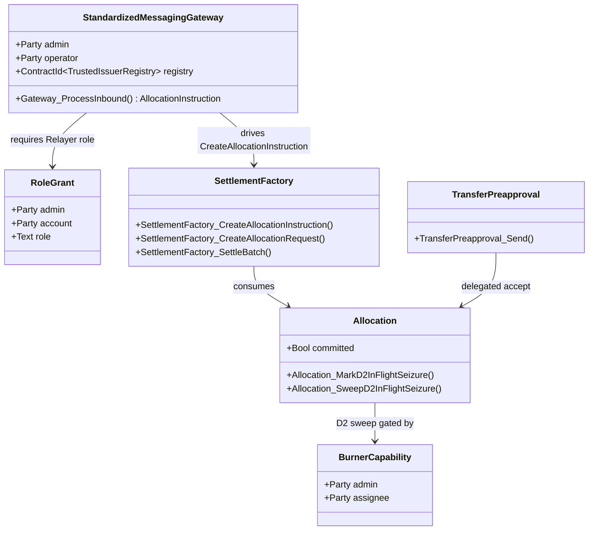
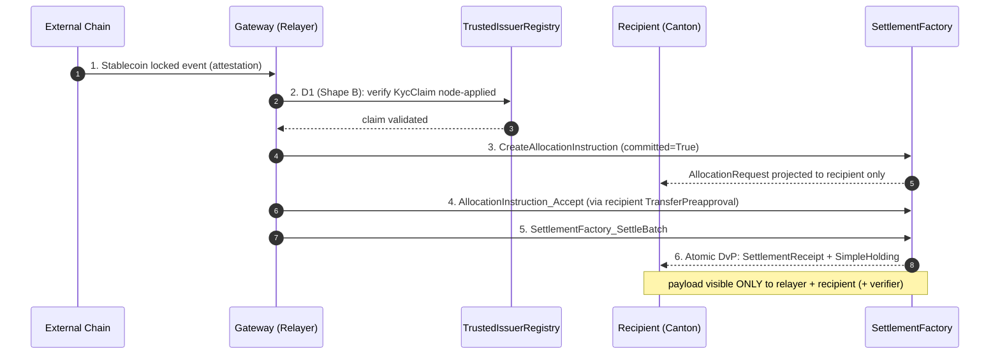

# Architectural Overview Report: Cross-Chain Stablecoin Payment Orchestration on Canton

Status: **reviewed reference-design report**, non-public, outside the committed
M1 public-library surface. This is RI #3 of four — see the suite-level view in [`00-portfolio.md`](./00-portfolio.md)
and the index [`README.md`](./README.md). It describes a *reference design* grounded in the
real OpenZeppelin Canton components in this workspace; it is **not** a claim of
M1/M4 acceptance, conformance, audit readiness, or production readiness.

> **Google Docs import:** `File → Open` this `.md` in Docs (or paste with
> `Edit → Paste`). H1/H2/H3 headings drive the Docs outline pane; the tables
> import cleanly; apply a monospace paragraph style to fenced code blocks after
> import. Mermaid blocks do not render in Docs — render them with
> `canton-settlement-explorer` and paste the image, keeping the fenced source.

> **Source-grounding tags** (used throughout):
> `[IMPLEMENTED]` real code in the M1 library base (`canton-specs` /
> `canton-contracts`) · `[EVIDENCE]` real code in an evidence repo
> (`canton-token-template`, `canton-stablecoin`, `zk-credential-gateway`), not
> the M1 surface · `[UPSTREAM]` Splice / CIP / external-ecosystem reference, not
> vendored here · `[FUTURE]` proposed RI-level design, not built in M1 scope.

> **Design priority order** governs every interface and snippet, in this exact
> order: **1) Readability → 2) Simplicity → 3) Security → 4) Auditability.**

> **Grant alignment** (source of truth:
> [`../research/canton-ecosystem-grant-proposal.md`](../research/canton-ecosystem-grant-proposal.md),
> scope lock: [`../../M4_STABLECOIN_SCOPE.md`](../../M4_STABLECOIN_SCOPE.md)): this
> is **RI #3 (Cross-Chain Stablecoin Payment Orchestration)**. This document is
> the **Architecture Documentation** deliverable, authored in **grant M1**
> (research & design) for the **implementation** in **grant M4** (Q4 2026, end
> Year 1, alongside RI 4). Companion deliverables — working reference code, demo
> front-end, threat model — are **named here but delivered in M4**
> (MIT-licensed). Two components are **planned / external, not present in this
> workspace**: the **Standardized Messaging Gateway** (`[FUTURE]`, Contracts-
> Library component) and **USDCx** (external ecosystem stablecoin) — both flagged
> throughout and in Open Questions. The report honors the **CIP-56 → CIP-0112 /
> Token Standard V2 retarget**.

---

## 1. Product Definition

This Reference Implementation (RI) is an architectural blueprint for private,
atomic settlement on Canton of stablecoin payments originating on external
blockchains. It resolves the tension between cross-chain liquidity and the
privacy requirements of enterprise compliance: institutional participants can
accept an inbound asset representation (e.g. USDCx) while keeping the settlement
amount, payer/payee identities, and compliance markers projected only to
explicitly authorized parties.

The design uses a **Standardized Messaging Gateway** `[FUTURE]` (modeled as a
bounded mock) on top of the **CIP-0112 / Token Standard V2 settlement spine**
`[IMPLEMENTED]` (`OpenZeppelin.Experimental.Settlement.Cip112`).

### Educational Framing: "How to think about building this on Canton"

On public EVM networks, a bridge mints tokens into a globally visible state
ledger any observer can trace. Canton operates on **per-party projection**: a
contract is visible only to its signatories/observers. So the inbound message
from the gateway does **not** mint-and-broadcast an asset in one global update.
Instead the gateway drives an isolated, recipient-targeted allocation on the
spine; because Daml-LF 2.1 is **keyless** (archive-and-recreate, not mutation),
the atomic delivery-vs-payment archives the inbound request and creates a
`SettlementReceipt` visible only to the recipient, the relayer, and the required
compliance verifiers. Cross-chain settlement thereby inherits Canton's data
compartmentalization.

### Target Users

Regulated financial institutions, multinational corporate treasuries, and
compliance-first DeFi platforms on Canton that need to accept inbound liquidity
from public networks **without** exposing internal treasury flows, payment
detail, or counterparty relationships to competitors or on-chain analytics.

### Scope

The bias favors simplicity and a demonstrably correct core; everything else is
an explicit extension point or out-of-scope.

| Feature Category | In-Scope | Out-of-Scope (Excluded) |
|---|---|---|
| Atomic Settlement | Private on-Canton settlement of inbound stablecoin payments via `SettlementFactory_SettleBatch` (atomic DvP). | Custom settlement primitives, fallback matching engines, fragmented parallel liquidity pools. |
| Cross-Chain Bridge | An inbound/outbound bridge **interface** (the Standardized Messaging Gateway) as a **bounded, verifiable mock**. | Production bridge/relayer nodes, external oracle infra, validator networks, cryptographic light-client proofs. |
| Compliance & Control | D1 fail-closed verification on every leg (`CredentialGatedActionRequest` + `TrustedIssuerRegistry`); D2 lock-and-sweep via `BurnerCapability`. | Off-ledger caching of compliance status, probabilistic risk scoring, heuristic filtering. |
| Identity Framework | Single-domain v1, issuer-held KYC, deterministic claims. | Cross-domain identity resolution (ONCHAINID / ERC-3643 / Chainlink CCID) — deferred, SCU-forward-compatible only. |
| Asset Issuance | The integration **shape** for an existing Canton stablecoin (USDCx) as the settled instrument. | The stablecoin issuance / peg / CDP mechanism itself. |

Narrowing scope to the standardized interface boundary means a production
gateway can be swapped in later without modifying the settlement spine or the
compliance logic.

---

## 2. Architecture Overview

A modular, multi-party topology isolates external messaging, compliance
verification, asset allocation, and atomic settlement. `roleId` wrappers manage
node boundaries and capability grants so no participant can unilaterally force a
state transition without the required co-authorization.

When a cross-chain locking event occurs externally, the gateway (holding a
`RoleGrant` as relayer) emits an `InboundMessage` on Canton. Rather than a
direct transfer — which would violate Canton's co-authorization model — the
relayer drives the spine: `SettlementFactory_CreateAllocationInstruction` →
(recipient accept) `AllocationInstruction_Accept` → `Allocation`, plus a
recipient-targeted `AllocationRequest`.

### Party and Role Model

| Operational Role | `roleId` wrapper | Responsibilities / trust boundary |
|---|---|---|
| BridgeRelayer | `Relayer` | Monitors the external chain; submits `InboundMessage`; operates the gateway mock; acts as settlement executor. |
| ComplianceVerifier | `Verifier` | Maintains the `TrustedIssuerRegistry`; issues the `KycClaim` for D1 attestation. |
| Custodian | `Seizer` | Holds the `BurnerCapability` for D2 lock-and-sweep to a preset destination under mandate. |
| StablecoinAdmin | `Issuer` | Single-admin authority for the settled asset (USDCx); oversees `SimpleTokenRules`. |
| Recipient | Implicit (end-user) | Treasury receiving funds; may use `TransferPreapproval` to accept compliance-gated inflows without a live signature. |

### Trust and Topology

Topology is defined per contract by which nodes participate. Because Daml uses
per-party projection, the settlement is fractured into bilateral requests: the
BridgeRelayer and Recipient are the only initial observers of the
`AllocationRequest`; the StablecoinAdmin and Custodian stay blind to intent
until needed. At `SettlementFactory_SettleBatch`, the StablecoinAdmin's node is
enlisted only to validate fund conservation and run the `SimpleTokenRules`
3-way dispatch.

The topology also provides economic security: a committed allocation
(`RequestedAllocation.committed = True`, set by the relayer) locks the bridging
funds until the settlement deadline, so the recipient has cryptographic
certainty the liquidity is reserved and cannot be double-spent or arbitrarily
withdrawn before the DvP concludes.

---

## 3. How We Implement It

A deterministic sequence of keyless Daml-LF 2.1 state transitions on the
CIP-0112 spine.

1. **Inbound message.** The external chain finalizes a locked deposit. The
   gateway (relayer role) creates an `InboundMessage` carrying the hashed
   payload, external sender id, and Canton recipient. Keyless archive-and-recreate
   makes it a one-time consumed artifact (replay protection).
2. **Allocate + D1 check.** The relayer drives
   `SettlementFactory_CreateAllocationInstruction` toward the recipient. Before
   it can target the recipient it must pass the **D1 compliance check**. The RI
   selects **Shape B** (signed node attestation) over Shape A (off-ledger gate):
   off-ledger gates add async caching vulnerabilities and break atomic
   composability within one Daml transaction. The on-ledger `D1ComplianceHook`
   requires referencing a valid `MockVerificationResult` /
   `CredentialGatedActionRequest` signed by a party in the
   `TrustedIssuerRegistry`. Without a valid, unexpired `KycClaim`, the hook fails
   closed, node-applied — full rollback.
3. **Recipient co-authorization via `TransferPreapproval`.** A recipient cannot
   be bound unilaterally; a new signatory must co-authorize. For an offline
   corporate treasury that cannot provide a live interactive signature, the
   recipient's wallet pre-establishes a `TransferPreapproval` for the USDCx
   instrument. The relayer leverages it to complete the recipient's required
   accept in a single atomic submission, converting the `AllocationInstruction`
   into a committed `Allocation`. *(This delegated-accept pattern is what makes
   the flow work for cold/offline recipients; it is not a workaround for any
   fixed transaction-timeout.)*
4. **Atomic DvP.** The relayer packages the `Allocation` into the single
   `SettlementFactory_SettleBatch` entrypoint. The factory enforces funding
   conservation via `nextIterationFunding` and verifies inputs match the required
   transfer legs; remaining balance returns as a single new holding (reducing
   fragmentation). On success the `Allocation` is archived and a
   `SettlementReceipt` + `SimpleHolding` are created for the recipient only.

### D1–D4 Attachment

- **D1 — compliance.** Node-applied, fail-closed, every leg; Shape B as above.
  *(Open, non-blocking: contract-oblivious vs on-ledger attestation
  verification.)*
- **D2 — seizure (lock-and-sweep).** Under mandate, the Custodian uses the
  single-admin `BurnerCapability` to sweep a targeted holding to an admin-preset
  `custodianDestination`. For in-flight allocations this is the spine's
  `Allocation_MarkD2InFlightSeizure` → `Allocation_SweepD2InFlightSeizure`; for
  settled holdings the forced-burn-to-custodian path
  (`LockedSimpleHolding_ForcedBurn` evidence). It **does not** burn the asset and
  **does not** return it to the sender. Ordinary transfer *failures* do return to
  sender.
- **D3 — identity.** Single-domain v1, issuer-held KYC; cross-domain deferred but
  forward-compatible via additive SCU.
- **D4 — authority.** Single-admin capability for M1 (multi-sig → M3).

### The SCU Extension Story

Never mutate an existing choice's args to require a new field; extend via
`Optional` fields, new types, and new choices. New interfaces are added by new
templates/choices implementing them, not by retroactive interface instances — a
mechanism Daml 3.x removed `[UPSTREAM]` because it broke clean upgrade paths.
Today the settlement validates a single-domain `KycClaim`. To add cross-domain identity (D3) later, a **new**
choice (e.g. `…SettleBatchWithCrossDomainProof`) is appended that accepts an
`Optional CrossDomainProof`; existing relayers calling the legacy
`SettlementFactory_SettleBatch` keep working. This is the additive path proven
in the `canton-specs` identity-hook upgrade spike.

---

## 4. Interfaces & Usage Examples

Names map to real workspace components; RI-level modules (the gateway and
orchestrator) are tagged `[FUTURE]`. Import paths use the real module names:
`OpenZeppelin.AccessControl`, `OpenZeppelin.Experimental.Settlement.Cip112`,
`canton-token-template` `SimpleToken.*`; `KycClaim`/`TrustedIssuerRegistry` are
the `canton-specs` identity-hook Shape-B types (not zk-credential-gateway).

### 4.1 Standardized Messaging Gateway (bounded mock) `[FUTURE]`

```daml
module CrossChain.Gateway where

import OpenZeppelin.AccessControl (RoleGrant, requireRole)
import OpenZeppelin.Experimental.Settlement.Cip112 (SettlementFactory)
import ZkCredentialGateway.GatedAction (CredentialGatedActionRequest)
-- KycClaim / TrustedIssuerRegistry: canton-specs identity-hook Shape-B
import IdentityHook.ShapeB (KycClaim, TrustedIssuerRegistry)

data GatewayRole = Relayer | Seizer deriving (Eq, Show)

roleId : GatewayRole -> Text
roleId Relayer = "BRIDGE_RELAYER_ROLE"
roleId Seizer  = "CUSTODIAN_SEIZER_ROLE"

-- [FUTURE] bounded mock of the planned Contracts-Library gateway.
template StandardizedMessagingGateway
  with
    admin : Party
    operator : Party
    registry : ContractId TrustedIssuerRegistry
  where
    signatory admin, operator

    nonconsuming choice Gateway_ProcessInbound : ContractId AllocationInstruction
      with
        relayerGrant : ContractId RoleGrant
        inboundAmount : Decimal
        recipient : Party
        kycClaim : ContractId KycClaim
        settlementFactory : ContractId SettlementFactory
      controller operator
      do
        -- 1. Authority: validate the relayer grant against the AL-7 primitive.
        g <- fetch relayerGrant
        requireRole operator (roleId Relayer) admin g

        -- 2. D1 (Shape B, fail-closed): the KycClaim's subjectParty must match
        --    the recipient; verified node-applied, no off-ledger oracle.
        claim <- fetch kycClaim
        assertMsg "D1: recipient identity mismatch" (claim.subjectParty == recipient)

        -- 3. Drive the spine: create the (committed) allocation instruction.
        exercise settlementFactory SettlementFactory_CreateAllocationInstruction with ..
```

### 4.2 Inbound DvP via `SettleBatch` + delegated accept `[FUTURE]`

```daml
module CrossChain.Orchestrator where

import OpenZeppelin.Experimental.Settlement.Cip112
-- TransferPreapproval is canton-token-template (SimpleToken.Preapproval)
import SimpleToken.Preapproval (TransferPreapproval)

template CrossChainDvP
  with
    executor : Party    -- the relayer, acting as authorized settlement executor
  where
    signatory executor

    choice Execute_Inbound_Settlement : ContractId SettlementReceipt
      with
        allocationRequestId : ContractId AllocationRequest
        instructionId : ContractId AllocationInstruction
        batchFactory : ContractId SettlementFactory
      controller executor
      do
        -- Recipient's required co-authorization is satisfied via their standing
        -- TransferPreapproval (delegated accept for an offline treasury).
        allocationId <- exercise instructionId AllocationInstruction_Accept

        -- Atomic DvP via the single spine entrypoint. Funding is conserved by
        -- the factory; a failed batch returns holdings to the sender.
        receipt <- exercise batchFactory SettlementFactory_SettleBatch with
          allocations = [allocationId]
          requests = [allocationRequestId]
        return receipt
```

### 4.3 D2 lock-and-sweep `[FUTURE]` (real mechanism, no bespoke template)

```daml
-- D2SeizureHook is a SPINE DATA RECORD (seizureCaseRef, custodianDestination,
-- inFlightHandlingStatus) — NOT a template, and there is no "BurnerCapability_Seize"
-- (BurnerCapability has no choices). Seizure runs on the Allocation / holding:
--
--   in-flight allocation:
--     exercise allocationId Allocation_MarkD2InFlightSeizure with seizureHook = ...
--     exercise allocationId Allocation_SweepD2InFlightSeizure with burnerCap = burnerCapId
--   settled / locked holding:
--     exercise lockedHoldingId LockedSimpleHolding_ForcedBurn with
--       burner = custodian; burnerCap = burnerCapId   -- swept to preset custodianDestination
--
-- Never burns the asset to nothing; never returns seized funds to sender.
```

---

## 5. Diagrams

Maps to `canton-settlement-explorer` presets *Cross-chain Bridge* + *Batch DvP*.
Render externally for Docs.

### 5.1 Interface / Component Diagram



### 5.2 Flow-of-Funds / Settlement Diagram (Cross-chain Bridge + Batch DvP)



---

## 6. Library Dependencies

### 6.1 Internal Dependencies (present in workspace)

| Component | Source Package | Usage | Tag |
|---|---|---|---|
| `oz-access-control` | `canton-specs` / `canton-contracts` | AL-7 `RoleGrant`/`requireRole` gating the gateway; D4 single-admin authority. | `[IMPLEMENTED]` |
| `oz-ownable` | `canton-specs` / `canton-contracts` | Ownership over hooks/factories; secure handoff. | `[IMPLEMENTED]` |
| `oz-pausable` | `canton-specs` / `canton-contracts` | `PauseState` halts inbound requests during anomalies. | `[IMPLEMENTED]` |
| `SettlementFactory` (CIP-0112 spine) | `canton-specs` | Allocation generation + `SettleBatch` DvP. | `[IMPLEMENTED]` (experimental) |
| `TransferPreapproval` | `canton-token-template` (`SimpleToken.Preapproval`) | Delegated recipient accept for offline treasuries. | `[EVIDENCE]` |
| `SimpleHolding` / `SimpleTokenRules` / `LockedSimpleHolding` / `*_ForcedBurn` | `canton-token-template` | Asset representation, 3-way dispatch, D2 evidence. | `[EVIDENCE]` |
| `CredentialGatedActionRequest` / `MockVerificationResult` | `zk-credential-gateway` | D1 credential gating. | `[EVIDENCE]` |
| `KycClaim` / `TrustedIssuerRegistry` | `canton-specs` identity-hook Shape-B | Typed D3 identity for D1 Shape-B node attestation. | `[IMPLEMENTED]` (experimental) |

> **Attribution note:** `KycClaim` / `TrustedIssuerRegistry` are
> `canton-specs` identity-hook-shape-b types, **not** `zk-credential-gateway`
> templates. The gateway supplies the gating/verification primitives.

### 6.2 External / Planned Dependencies

| Component | Role / Provider | Status | Note |
|---|---|---|---|
| Standardized Messaging Gateway | Cross-chain messaging (OpenZeppelin Contracts Library) | **Planned `[FUTURE]`** | **Not present in this workspace.** Modeled as a bounded mock (`StandardizedMessagingGateway`); to be swapped for a production CCIP/LayerZero-style integration. Build only its Daml-facing interface. |
| Splice Token Standard V2 DARs | V2 settlement rules | **Planned `[UPSTREAM]`** | Local stand-ins designed to maximally match the V2 interfaces; source-of-record `hyperledger-labs/splice` @ `token-standard-v2-upcoming` @ `1e34121b…` (historical preview `…-daml-preview` @ `b91de5d4…`). Import gated (PLAN.md; `M4_STABLECOIN_SCOPE.md` §A). |
| USDCx | Settled instrument admin | **External** | Consumed via interface only; issuance + peg handled off-architecture. |

---

## 7. Security & Auditability

Security relies on Daml's structural rigidity and deterministic state
transitions, not obscure cryptography.

### 7.1 Invariants

- **Conservation of funds.** `SettlementFactory_SettleBatch` cannot output more
  value than its input `Allocation`s; sum of inputs = sum of receipts + returned
  change, enforced via `nextIterationFunding`. Any mismatch is rejected by the
  Daml engine — no counterfeiting.
- **Privacy partitioning.** Amount, payer, and payload memo are projected only to
  the relayer, recipient, and designated compliance verifier. If the
  StablecoinAdmin could observe the memo without authorization, the invariant is
  broken.

### 7.2 Threat Model

| Vector | Description | Mitigation |
|---|---|---|
| Malicious relayer | Routes valid inbound funds to an unauthorized/sanctioned account. | D1 hook requires a node-applied `KycClaim` whose `subjectParty` matches the exact recipient; the relayer cannot spoof the destination (fail-closed). |
| Malicious sender | Triggers spam/toxic settlement to an unwilling recipient. | Without a configured `TransferPreapproval` or explicit accept, the allocation is not settled and funds return to sender (transfer-failure semantics). |
| Compromised admin | Attempts arbitrary expropriation. | D4 single-admin is a structural boundary; even a compromised admin's D2 sweep is hardcoded to the preset `custodianDestination` (no arbitrary burn, no return-to-sender). |
| UTXO fragmentation | Many small transfers accumulate holding dust. | Iterated settlement merges inputs; remaining balance returns as a single new holding, reducing fragmentation during the batch. |

### 7.3 Validation Ladder

| Tier | Tooling | Purpose |
|---|---|---|
| Static analysis | `daml-lint` | Validates SCU rules (no illegal field mutation; only `Optional` extensions), decimal bounds, archive-before-execute, `roleId` wrapper, `whenNotPaused`. |
| Generative testing | `daml-props` | Property-based testing with shrinking over `SettleBatch`: fuzzed extra-transfer-leg scenarios verify funding conservation never breaks. |
| Formal verification | `daml-verify` | Z3 proofs over D1–D4 mappings — e.g. `Gateway_ProcessInbound` is unreachable unless a valid `KycClaim` path exists, sealing the D1 gate on-ledger. |

(Tooling exists in the workspace; no benchmark latencies are claimed.)

### 7.4 Off-ledger reconciliation `[UPSTREAM]`

A treasury operating this flow reconciles its private Canton settlement against
the inbound external-chain event without parsing raw transaction trees: the
Token Standard V2 transfer-events API (`Splice.Api.Token.TransferEventsV2`,
imported in the `canton-token-template` evidence) emits holdings-change events the
recipient can correlate with the gateway's inbound message id, giving a 1:1
audit linkage between the external lock/burn and the Canton credit. This is an
**upstream** API surface, not vendored here, and the linkage is a reference
pattern — the report makes no reconciliation-completeness, accounting-standard, or
audit-readiness claim.

---

## 8. Cross-Synchronizer Domain Extension (Planned) `[FUTURE]`

> **Shared model:** the cross-synchronizer mechanism (per-synchronizer
> assignment + unassign/assign reassignment, and the SCU-compliant additive
> path) is identical across all four RIs and is owned in
> [`00-portfolio.md`](./00-portfolio.md) §5. This section elaborates only the
> RI-specific topology (including the cross-chain vs cross-synchronizer
> distinction below).

> **Status: out of scope for the initial M1 design; deferred and planned.** Note
> the distinction: this RI is *cross-chain* (bridging from external L1s/L2s via
> the gateway) but still **single-synchronizer on Canton** today. Operating the
> Canton-side settlement across **multiple Canton synchronizer domains** is a
> separate, deferred capability (D3 cross-domain identity is also deferred). This
> section plans it per Canton's per-synchronizer assignment + unassign/assign
> reassignment model and the SCU rule.

### 8.1 Cross-chain vs cross-synchronizer

- **Cross-chain** (in scope as a mock): external chain → gateway attestation →
  Canton settlement on one synchronizer.
- **Cross-synchronizer** (planned): the Canton-side recipient, stablecoin
  instrument, and compliance registry may live on **different Canton
  synchronizers**; settlement then requires reassigning the relevant contracts
  onto one synchronizer before `SettleBatch`.

### 8.2 Where it touches the boundary

| Element | Single-synchronizer (today) | Cross-synchronizer (planned) |
|---|---|---|
| Inbound `Allocation` / `SettlementReceipt` | Created/settled on the recipient's synchronizer. | Reassignable: inbound allocation assigned to the synchronizer hosting the recipient's USDCx holding before `SettleBatch`. |
| USDCx instrument admin | Same synchronizer as settlement. | If USDCx is administered on another synchronizer, the settled instrument must be reachable there or reassigned in. |
| D1 `TrustedIssuerRegistry` | One synchronizer. | Synchronizer-aware registry; compliance re-checked on the settling synchronizer (no stale cross-domain attestation reuse). |
| D3 identity | Single-domain `KycClaim`. | Cross-domain proof (ONCHAINID / ERC-3643 / CCID) resolved into a synchronizer-aware registry — the deferred D3 work. |

### 8.3 The additive, non-breaking path (SCU-compliant)

1. Append `Optional SynchronizerScope` to the RI gateway/orchestrator templates;
   older contracts read `None`.
2. Add a new parallel choice (e.g. `Execute_Inbound_Settlement_CrossDomain`)
   alongside the unchanged single-synchronizer choice.
3. Model reassignment as workflow: reassign the inbound allocation onto the
   settling synchronizer → `SettleBatch` there → reassign the receipt/holding
   back. Atomicity stays at the single-synchronizer batch boundary.

### 8.4 Open questions specific to cross-synchronizer operation

- Reassignment-vs-settlement atomicity (rollback vs re-home-able allocation on
  `SettleBatch` failure) — maps to the return-to-sender rule.
- Which synchronizer's `TrustedIssuerRegistry` and verifier set govern a
  cross-domain inflow.
- Cross-domain D1 freshness (re-check on the settling synchronizer; never reuse
  across a reassignment).
- Reassignment tooling maturity (evolving Canton/DA stack; assumes drop-in).

---

## 9. Open Questions

- **Standardized Messaging Gateway (planned, absent).** The gateway is a
  Contracts-Library component **not yet present in this workspace**. When the
  production gateway lands, how are inbound attestations sequenced if the origin
  chain (Ethereum/Polygon) deep-reorgs? Does the gateway manage confirmation
  delays internally, or must the relayer Daml contract use a time-locked
  `AllocationInstruction` to mitigate cross-chain rollback risk?
- **USDCx forced upgrades.** Active holdings upgrade-on-use via factory routing,
  but a forced upgrade for passive holders raises a question: how does the
  relayer detect a recipient holding a deprecated `TransferPreapproval`, and what
  is the fallback from delegated-accept to an interactive two-step offer?
- **Expired / unsettled inbound-allocation lifecycle.** A committed inbound
  `Allocation` locks bridging funds until settlement; if the DvP never completes
  (recipient never finalizes, origin reorg, deadline lapses), the local CIP-0112
  scaffold has **no cancel/withdraw/reject path** — the choices today are
  `Allocation_Settle` and the two D2 seizure choices. The upstream Token Standard
  V2 Allocation lifecycle `[UPSTREAM]` separates an allocation's expiry from its
  settlement deadline and adds cancel/withdraw/reject semantics, which would let
  an automated handler reclaim dead capital without the original signer. Whether
  M1 reserves this via an additive `[FUTURE]` cancel choice on the RI orchestrator
  (return-to-sender on expiry) or defers entirely to the upstream lifecycle once
  imported is open. (Maps to the transfer-failure return-to-sender rule.)
- **Cross-domain identity proof injection (D3).** When ONCHAINID / ERC-3643
  equivalents are supported, does the `TrustedIssuerRegistry` ingest external
  state proofs via an oracle, or rely on a CCID protocol synchronized across the
  global synchronizer? The cross-domain proof-injection trust model must be
  audited.
- **Cross-synchronizer operation** (see §8) — deferred; tracked there.
- **Composability with the other RIs** (forward-compatibility; suite view
  [`00-portfolio.md`](./00-portfolio.md) §3): recipients holding USDCx settled
  here can provide liquidity to the DEX RI ([`01`](./01-dex.md)) pools or
  collateralize a Lending RI ([`02`](./02-lending.md)) vault — all over the same
  `SettlementFactory_SettleBatch` spine, with no parallel settlement path.

---

## References

All interface, template, choice, and field names are grounded in real source in
this workspace (verified 2026-06-24), except components explicitly marked
planned/external.

- **Settlement spine** `[IMPLEMENTED]` —
  `canton-specs/experiments/cip112-settlement/daml/OpenZeppelin/Experimental/Settlement/Cip112.daml`.
- **Holdings / rules / preapproval / forced-burn** `[EVIDENCE]` —
  `canton-token-template/simple-token/daml/SimpleToken/{Holding,Rules,Preapproval}.daml`
  (`TransferPreapproval` + `TransferPreapproval_Send`/`_MintInto`;
  `LockedSimpleHolding_ForcedBurn`).
- **Credential gating / verification** `[EVIDENCE]` —
  `zk-credential-gateway/daml/src/ZkCredentialGateway/{GatedAction,Verification,Types}.daml`.
- **Typed D3 identity (KycClaim, TrustedIssuerRegistry)** `[IMPLEMENTED]` —
  `canton-specs/experiments/identity-hook-shape-b/` and `identity-hook-upgrade-*/`.
- **AL-7 primitives** `[IMPLEMENTED]` — `canton-specs` `access-control/`,
  `ownable/`, `pausable/`.
- **Decision authority (D1–D4), scope, SCU rule** — root
  [`PLAN.md`](../../PLAN.md), [`AGENTS.md`](../../AGENTS.md), briefing
  [`docs/research/RI_RESEARCH_BRIEFING.md`](../research/RI_RESEARCH_BRIEFING.md).
- **Grant scope / milestones / deliverables (source of truth)** —
  [`docs/research/canton-ecosystem-grant-proposal.md`](../research/canton-ecosystem-grant-proposal.md)
  (PR #298, approved; CIP-56→CIP-0112 retarget) and the distilled
  [`M4_STABLECOIN_SCOPE.md`](../../M4_STABLECOIN_SCOPE.md).
- **Token Standard V2 upstream** `[UPSTREAM]` — `hyperledger-labs/splice`
  `token-standard-v2-upcoming` (import gated per PLAN.md).
- **Planned / external (not in workspace):** the **Standardized Messaging
  Gateway** (OpenZeppelin Contracts-Library component) and **USDCx** (external
  Canton ecosystem stablecoin). See §6.2 and Open Questions.

> **Removed in review:** the original draft cited external/non-workspace URLs
> (a CoinStats "fundamental analysis" page, `srikanth-bitdynamics` GitHub,
> Medium posts, `cantonecosystem.com`, a jobs board, BitGo/DFNS docs, a
> `universal-verify/trusted-issuer-registry` repo, QuillAudits, and others) as
> authoritative sources, and an inaccurate "10-minute mining-round = transaction
> signing timeout" claim. None of the URLs are part of this workspace or an
> authoritative spec; they were removed and replaced with the workspace-grounded
> references above, and the `TransferPreapproval` rationale was restated as
> delegated accept for offline recipients (not a timeout workaround). See the
> review record in
> [`../reviews/2026-06-24T22-57-44Z_REVIEW.md`](../reviews/2026-06-24T22-57-44Z_REVIEW.md).
>
> **Re-review 2026-06-25 (expert "blueprint" pass):** the second expert draft's
> §9 (Cross-Chain Stablecoin) was assessed. Integrated: the §7.4 V2
> transfer-events reconciliation note (`Splice.Api.Token.TransferEventsV2`,
> `[UPSTREAM]`), the §9 expired/unsettled-allocation lifecycle open question
> (upstream cancel/withdraw/reject vs. the local scaffold's absence of one), and
> the §3 retroactive-interface-instance `[UPSTREAM]` note (suite-consistent with
> RI 1/2). Rejected: **CIP-86 as an "Ethereum JSON-RPC / MetaMask facade"** (CIP-86
> is an ERC-20 middleware & distributed indexer per
> `cip0086-cip0103-cip0104-m1-acceptance.md`, and is out of this RI's scope — the
> report does not adopt the facade framing); fabricated `AmuletAllocationV2` /
> `TransferInstructionV2` (only `AllocationV2` / `AllocationRequestV2` / `HoldingV2`
> exist, as upstream `Splice.Api.Token.*` imports — the RI uses the local spine
> `Allocation`); the claim that **Wormhole / LayerZero "exist as SVs on the Canton
> Network"** (unverifiable; the gateway stays a `[FUTURE]` mock); the
> `BatchingUtility_MergeHoldings` utility (fabricated; the report's
> fragmentation mitigation is the spine's iterated-settlement change-merge, not a
> named utility); and the OCC / FDICIA / SOX external-citation set. Record:
> [`../reviews/2026-06-25T02-29-08Z_REVIEW.md`](../reviews/2026-06-25T02-29-08Z_REVIEW.md).
