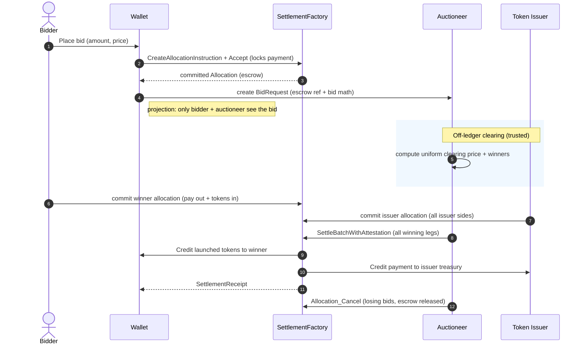
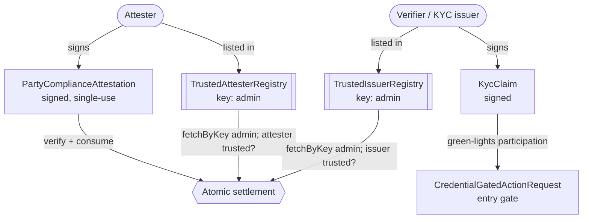
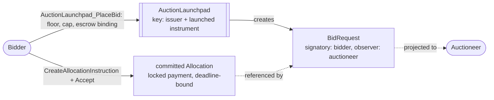
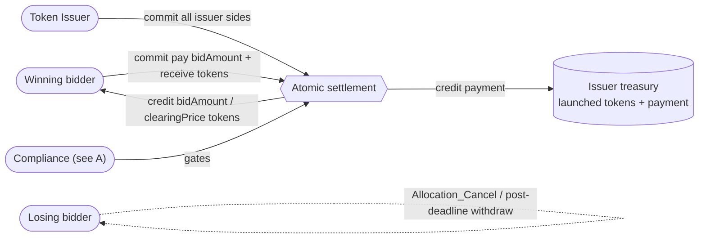
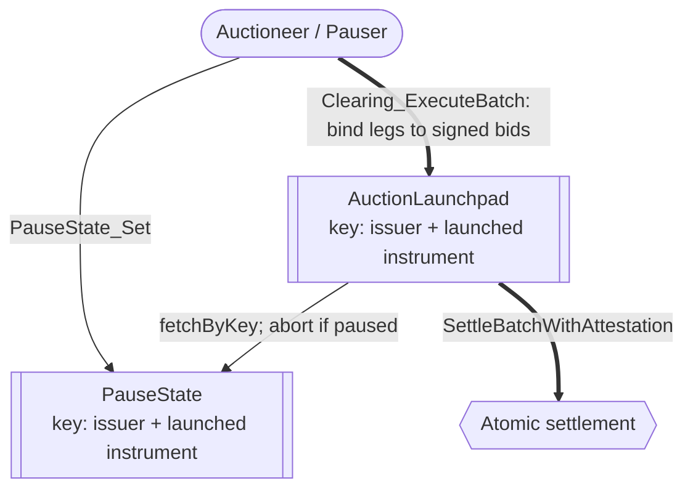

# Architectural Overview Report: Canton Confidential Auction Launchpad

This document describes a *reference design* for a sealed-bid, uniform-price token distribution launchpad on Canton, grounded in the OpenZeppelin Canton components from this workspace, as well as the Canton Network Token Standard V2.

## 1. Product Definition

This report specifies a confidential auction launchpad for institutional, regulated token distribution on the Canton Network. The launchpad runs a **single-round sealed-bid auction that settles at a uniform clearing price**: bidders place escrow-backed bids that only they and the auctioneer can see, the auctioneer clears the round off-ledger, and every winning bid settles in one atomic token-for-payment exchange. The pricing rule that selects the uniform clearing price (e.g. lowest accepted bid, highest rejected bid) is an off-ledger parameter of the auctioneer's clearing engine.

The sealed-bid property comes from Canton itself rather than from cryptographic obfuscation. Canton projects every contract only to the parties entitled to see it, so no bidder ever sees a competitor's bid, and there is no public mempool to front-run. A bid's visibility set is its bidder, the auctioneer, and the launchpad's signatories (operator and token issuer), who witness the bid gate; narrowing the issuer out of that set is an agreed improvement tracked in [section 6](#6-open-design-questions).

For the distribution to be safe, the exchange of tokens for payment must be atomic (no winner pays without receiving their tokens, and vice versa) and non-custodial (no intermediary holds bidder funds along the way). Therefore, the settlement architecture centers on [CIP-0112 - Canton Network Token Standard V2](https://github.com/canton-foundation/cips/blob/main/cip-0112/cip-0112.md), specifically its support for [atomic settlement](https://github.com/canton-foundation/cips/blob/main/cip-0112/cip-0112.md#416-committed-allocations-for-prefunded-trading-and-iterated-settlement). The core building block is the **atomic delivery-versus-payment (DvP) batch**: each winner's payment leg and the issuer's token legs are settled in one all-or-nothing transaction, with each leg's amount pinned on-ledger to a signed allocation side.

OpenZeppelin currently has an experimental implementation of atomic settlement, inside the [OpenZeppelin/canton-specs repository](https://github.com/OpenZeppelin/canton-specs/blob/main/experiments/cip112-settlement/daml/OpenZeppelin/Experimental/Settlement/Cip112.daml). The implementation has built-in capabilities for:

1. Privacy through per-party projection: a bidder sees only the legs on which they are the sender or receiver. Other bidders' bids and fills are never visible to them.
2. D1: Compliance through Party-Applied Attestation - compliance is checked per settlement, with no caching. Failure to adhere to compliance results in no settlement.
3. D2: Seizure through Preset Custodian Lock-and-Sweep - a privileged party can sweep the funds in a locked allocation to a preset custodian account.
4. D3: Identity through Trusted-Issuer KYC - a bidder must hold a `KycClaim` from an issuer in the `TrustedIssuerRegistry` to participate in the auction.

One further compliance capability comes from `openzeppelin-access-control`: **D4: Authority through Per-Role Privilege Transfer** - each privileged action sits with a named role rather than a single admin. Privileges can be transferred, granted or revoked.

### The Central Trust Limitation: the Auctioneer

Clearing runs **off-ledger, by a trusted auctioneer that sees every bid**. The design therefore delivers **confidential bid submission** - bids are hidden from competitors by per-party projection - but it does not deliver:

- **Auctioneer honesty** - a malicious or compromised auctioneer that observes all bids can favor a colluding bidder, leak bids, or compute a dishonest clearing price.
- **A verifiable pricing rule** - the rule selecting the uniform clearing price is an off-ledger computation; the ledger checks only the price bounds (`>= minBidPrice`, `<=` each winner's `bidPrice`).
- **Ledger-enforced fairness of allocation** - the conservation and leg-authorization invariants prevent value *theft* (no leg settles that a party did not sign), but they do not prevent *unfair allocation* at a sound clearing price.

This is acceptable for a confidential-submission launchpad where the issuer *is* the auctioneer and bidders trust the issuer's clearing, and it is a real improvement over a public mempool.

> **Decision (July 2026, internal review).** M1 keeps clearing **off-ledger by the trusted auctioneer**, matching the scope of the [Canton dev-fund proposal](https://github.com/canton-foundation/canton-dev-fund/blob/main/proposals/2026-04-OpenZeppelin-canton-ecosystem-stack.md) (the initial implementation is explicitly off-chain there). Migrating the clearing on-ledger (commit-reveal / verifiable clearing) is a **future exploration** within the agreement, not an M1 item.

### Operational Scope and Boundaries

The reference implementation favors **a single sealed-bid core over expansive market mechanics**. Through the tables below, we highlight what we consider in versus out-of-scope.

| Feature Category | In-Scope Architectural Components |
|---|---|
| Auction Mechanism | A single-round **sealed-bid** auction settling at a **uniform clearing price**. The pricing rule selecting that price is an off-ledger parameter of the auctioneer's clearing engine. |
| Confidentiality | Bid isolation via per-party projection: bidder, auctioneer, and the launchpad signatories only. No bidder ever projects a competitor's bid. |
| Escrow | Bid capital locked in a committed [`Allocation`](../../experiments/cip112-settlement/daml/OpenZeppelin/Experimental/Settlement/Cip112.daml#L474) under the bidder's own signature, with a deadline-gated force-refund for liveness. The winner-side settlement commits a separate post-clearing allocation; sequencing the two is an open question ([section 6](#6-open-design-questions)). |
| Atomic Settlement | Token-for-payment exchange **only** via [`SettlementFactory_SettleBatchWithAttestation`](../../experiments/cip112-settlement/daml/OpenZeppelin/Experimental/Settlement/Cip112.daml#L274) (atomic DvP, single transaction). |
| Compliance & Control | D1: a settlement does not execute unless an attester has signalled compliance. D2: a privileged party can sweep allocation funds to a preset custodian account. D3: single-synchronizer identity, gated at entry by `credential-gateway` and re-checked at settlement. |
| Component Integration | Direct reuse of `openzeppelin-access-control`, `openzeppelin-ownable`, `openzeppelin-pausable`, the CIP-0112 settlement spine, the [`credential-gateway`](../../experiments/credential-gateway/daml/OpenZeppelin/Experimental/Credential/Gateway.daml) and [`ShapeB`](../../experiments/identity-hook-shape-b/daml/OpenZeppelin/Experimental/Identity/ShapeB.daml) experiments, as well as asset patterns from [`canton-token-template`](https://github.com/OpenZeppelin/canton-token-template). |

| Feature Category | Out-of-Scope Architectural Components |
|---|---|
| Continuous Issuance | Streaming launches, continuous funding, persistent issuance. The launchpad runs discrete, finalized rounds only. |
| Algorithmic Pricing | Bonding curves and dynamic-price Dutch auctions. The settlement spine could host them later, but they are not core. |
| Secondary Market | AMM, order-book, or any post-auction liquidity venue. That is the DEX RI ([`01`](./01-dex.md)). |
| Derivative Instruments | Options, futures, and synthetics of the launched token. |
| On-Ledger Clearing Math | Bid sorting and clearing run **off-ledger**; only finalized, conservation-sound match legs settle on-ledger. |
| Legacy Standards | Any reliance on the superseded CIP-56 token standard or legacy V1 allocation paths. The RI integrates strictly with V2 abstractions. |
| Cross-Synchronizer Operation | Cross-synchronizer settlement and identity have not been fully considered, so they are **out of scope**. The design for M1 is single-synchronizer. |

### Target Ecosystem Participants

- **Institutional Asset Issuers** get fair distribution free of front-running and bid manipulation, with KYC/AML/accreditation enforced at the entry gate and re-checked at settlement.
- **Regulated Launchpad Operators** can establish compliant primary-distribution venues with the access controls, identity gating, and D2 asset-seizure capabilities that regulated offerings require.
- **Accredited Investors / Bidders** get confidentiality of intent, atomic return-to-sender for losing bids (no counterparty credit risk), and capital that can move only per their signed `AllocationInstruction`.
- **Wallet and Client Integrators** can validate escrow-and-bid submission flows against a working decentralized application implementing two-step handshakes and per-party allocation requests.
- **Security and Assurance Auditors** can evaluate explicit authority boundaries and the **proposed** validation workflow (`daml-lint → daml-props → daml-verify`).

### Educational Framing: Sealed Bids via Projection, not Commit-Reveal

On public ledgers, sealed-bid auctions need a commit-reveal pattern: publish a hash of the bid to a globally visible mempool, then reveal the plaintext later. This adds UX friction, non-revelation risk, and exposure to metadata and timing analysis.

Canton operates on a privacy-preserving, **per-party projection** model enforced by the Canton protocol. A Canton contract is an instance of a template, signed and authorized by a set of parties (signatories), and visible only to its signatories, observers, and the witnesses of the transaction that created it. A `BidRequest` with `signatory bidder, observer auctioneer`, created through the issuer-signed bid gate, is projected to the bidder, the auctioneer, and the launchpad signatories - and to no other bidder. The sealed-bid property is thus achieved without commit-reveal, and front-running is structurally prevented: the synchronizer orders transactions without seeing bid plaintext.

The same model shapes the rest of the design. State changes by archive-and-recreate rather than in-place mutation, and any signatory must actively co-authorize a transition, so **two-step handshakes (Daml's propose-and-accept pattern) are a necessity, not a style choice**: the auctioneer cannot push a minted token into a bidder's wallet; the issuer proposes and the bidder accepts. The design uses **contract keys** (reintroduced in Canton 3.5.1) so the `AuctionLaunchpad`, `PauseState`, and the trusted-attester and trusted-issuer registries keep stable, unique identities across those archive-and-recreate cycles. Keys are the design target: the `[IMPLEMENTED]` experiment code at the repository's pinned SDK baseline is keyless and passes explicit contract ids with admin-equality checks instead.

To distribute a token fairly in this privacy-first environment, the architecture reconciles the confidentiality needed for sealed bids with the verifiability needed for settlement. The RI does this by **fracturing the auction into per-authorizer allocations**: a bid's intent lives in a two-party `BidRequest`, but the actual asset movement rides on per-party `Allocation` contracts on the CIP-0112 spine, and the clearing choice binds every settled leg to the amounts each bidder signed. Counterparties observe only their own legs.

---

## 2. Architecture Overview

The architecture is assembled from reused OpenZeppelin Daml primitives (role management, two-step ownership handover, pausing), the credential-gating and identity experiments, and the CIP-0112 settlement spine as the engine for all asset movement. This section maps each component to its library, then defines the party/role topology and the trust configuration.

### Core Components and Library Mapping

| Component Suite | Applied Templates and Libraries | Architectural Function |
|---|---|---|
| Access Control `[IMPLEMENTED]` | `openzeppelin-access-control`: [`RoleGrant`](../../access-control/daml/OpenZeppelin/AccessControl.daml#58), [`RoleAdmin`](../../access-control/daml/OpenZeppelin/AccessControl.daml#116), [`DefaultAdminTransferOffer`](../../access-control/daml/OpenZeppelin/AccessControl.daml#L237), [`requireRole`](../../access-control/daml/OpenZeppelin/AccessControl.daml#287) | Role-based permissioning. Governs the token issuer and auctioneer roles. |
| Ownership Lifecycle `[IMPLEMENTED]` | `openzeppelin-ownable`: [`Ownership`](../../ownable/daml/OpenZeppelin/Ownable.daml#41), [`OwnershipOffer`](../../ownable/daml/OpenZeppelin/Ownable.daml#82) | Provides support for D4: Secure two-step handover of launchpad administration. |
| Launch Constraints `[IMPLEMENTED]` | `openzeppelin-pausable`: [`PauseState`](../../pausable/daml/OpenZeppelin/Pausable.daml#47), [`whenNotPaused`](../../pausable/daml/OpenZeppelin/Pausable.daml#77) | Emergency circuit breaker. Halts bid intake and the clearing settlement. |
| Settlement Spine `[IMPLEMENTED]` | `OpenZeppelin.Experimental.Settlement.Cip112`: [`SettlementFactory`](../../experiments/cip112-settlement/daml/OpenZeppelin/Experimental/Settlement/Cip112.daml#L191), [`AllocationRequest`](../../experiments/cip112-settlement/daml/OpenZeppelin/Experimental/Settlement/Cip112.daml#L322), [`AllocationInstruction`](../../experiments/cip112-settlement/daml/OpenZeppelin/Experimental/Settlement/Cip112.daml#L379), [`Allocation`](../../experiments/cip112-settlement/daml/OpenZeppelin/Experimental/Settlement/Cip112.daml#L474), [`SettlementReceipt`](../../experiments/cip112-settlement/daml/OpenZeppelin/Experimental/Settlement/Cip112.daml#L695), [`ToyHolding`](../../experiments/cip112-settlement/daml/OpenZeppelin/Experimental/Settlement/Cip112.daml#L133), [`BurnerCapability`](../../experiments/cip112-settlement/daml/OpenZeppelin/Experimental/Settlement/Cip112.daml#L98) | Core engine for escrow and the clearing settlement. `ToyHolding` is the toy unit of value, and can be replaced by real assets implementing the TSv2 holding interface. |
| Credential Gating `[IMPLEMENTED]` | `credential-gateway`: [`CredentialGatedActionRequest`](../../experiments/credential-gateway/daml/OpenZeppelin/Experimental/Credential/Gateway.daml#L129), [`MockVerificationResult`](../../experiments/credential-gateway/daml/OpenZeppelin/Experimental/Credential/Gateway.daml#L94) | Entry gate: a verifier green-lights a bidder's participation before any bid is accepted. |
| Identity Verification `[IMPLEMENTED]` | `ShapeB`: [`KycClaim`](../../experiments/identity-hook-shape-b/daml/OpenZeppelin/Experimental/Identity/ShapeB.daml#50), [`TrustedIssuerRegistry`](../../experiments/identity-hook-shape-b/daml/OpenZeppelin/Experimental/Identity/ShapeB.daml#84) | Provides support for D3: A bidder must hold a `KycClaim` issued by a trusted party in order to participate. |
| Asset Templates `[EVIDENCE]` | [`canton-token-template`](https://github.com/OpenZeppelin/canton-token-template): `SimpleHolding`, `LockedSimpleHolding`, `SimpleTokenRules`. `Rules_Mint`, `MintProposal`, and `RoleCapability` are `[FUTURE]` RI-level extensions of this template, to be consolidated at implementation time. | Launched-token structure and the cold-recipient mint path (propose-accept, honoring Canton co-authorization). |

As external dependencies, the reference implementation will integrate with the Splice Token Standard V2 interfaces to ensure maximum interoperability.

### Party and Role Model Topology

Duties are segregated and mapped to discrete Daml parties:

- **Launchpad Operator (`LAUNCHPAD_OPERATOR`)** - deploys the launchpad contracts and manages the `SettlementFactory`. Operational, not financial, authority: it never holds custody of bidder funds or launched tokens.
- **Token Issuer (`TOKEN_ISSUER`)** - launches the token and owns the treasury account that sources the token legs and receives the payment legs. Holds the [`BurnerCapability`](../../experiments/cip112-settlement/daml/OpenZeppelin/Experimental/Settlement/Cip112.daml#L98) (D2 seizure) and authorizes minting via `MintProposal` (`[FUTURE]`).
- **Auctioneer (`AUCTIONEER`)** - delegated by the token issuer via [`RoleGrant`](../../access-control/daml/OpenZeppelin/AccessControl.daml#58). Observes `BidRequest`s, runs the off-ledger clearing engine, and submits the clearing settlement. It cannot misdirect funds: every settled leg is bound on-ledger to a signed bid.
- **Bidder** - the end-user authoring escrow `Allocation`s and `BidRequest`s from their wallet. The sole party able to lock their own holdings, and the party that reclaims them after the settlement deadline.
- **Verifier** - a compliance entity that issues a `MockVerificationResult` attesting credential validity, green-lighting participation.
- **Custodian** - owns the preset account that receives funds swept by a D2 seizure.

### Decentralization and Trust Topology

Canton decentralizes a party along three independent axes, and the design assigns each role a deliberate position on each:

1. **governance** - whose signatures can change the party's identity and hosting (re-home the party to their own validator and act freely);
2. **validation** - how many independent validators must confirm the party's transactions (the `PartyToParticipant` confirmation threshold; a threshold above 1 defends against a malicious validator, at a latency and cost premium, and such a party can no longer submit Ledger API commands directly - it acts through externally signed submissions or through choices submitted by others);
3. **authorization** - what the Daml signatory/controller topology requires regardless of hosting.

For the role that holds value-moving and supply-changing authority - the **token issuer**, whose treasury sources every token leg, absorbs every payment leg, and holds the mint and seizure privileges - the design envisions the EVM equivalent of an **N-of-M multisig**: no single key may exercise the role's authority. Canton offers two ways to implement this (which one is currently left as an open question, [section 6](#6-open-design-questions)):

- **On-ledger approval workflow** - the multisig is written in Daml ([Multiple Party Agreement](https://docs.canton.network/appdev/modules/m3-design-patterns#multiple-party-agreement)): approvers record approvals as contracts, and the final choice executes under the role party's inherited authority only once a threshold of approvals exists. Approvals are durable, named, and auditable on-ledger.
- **External party with threshold signing keys** - the role party's transactions require signatures from N of M keys (`PartyToKeyMapping`), held by independent organizations. Invisible to the Daml code and a single ledger transaction per action, but the signing ceremony must complete within the prepared transaction's validity window, and the approval record stays off-ledger. The implementation could leverage something like the [Bitsafe decentralization-manager](https://github.com/DLC-link/decentralization-manager).

The powers of the **auctioneer** are already bounded by bidder signatures and on-ledger checks: the clearing choice binds every settled leg to a signed bid, so a rogue auctioneer cannot steal. To increase its availability we envision it as a multi-hosted party on several validators with a confirmation threshold of 1: the auctioneer submits the clearing itself, and a threshold above 1 would push every clearing submission through an external-signing ceremony (a threshold >1 party cannot submit Ledger API commands directly). Integrity does not ride on the threshold, and multi-hosting does **not** address the clearing-honesty trust described in [section 1](#the-central-trust-limitation-the-auctioneer): that residual trust is inherent to off-ledger clearing.

The **pause authority** is likewise multi-hosted so the brake is always reachable, but its confirmation threshold stays at 1: an emergency stop must be instant, and a quorum would slow it down. The price of that choice is a griefing window: a malicious pauser can freeze the launch until deadlines lapse. This griefing is capped by the bidder's right to reclaim escrow after the settlement deadline.

The **custodian** owns the preset account that receives D2 sweeps. It needs availability and protection against a malicious single validator, hence multi-hosting with confirmation threshold >1 suffices.

The **verifiers and KYC issuers** should be several independent parties in the `TrustedIssuerRegistry`/`TrustedAttesterRegistry`, so no single attester can halt the launch (no attestation, no settlement). Compliance is then only as strict as the weakest listed attester, so membership is a policy decision.

**Bidders** need no venue-side decentralization: the design is non-custodial, so they only ever trust their own keys and their own validator.

---

## 3. How We Implement It

An invariant-bound lifecycle: configuration and gating, then confidential bidding, then off-ledger clearing, then atomic on-ledger settlement.

### The Auction Lifecycle: Step by Step

1. **Configuration and access gating.** The token issuer and launchpad operator instantiate the `AuctionLaunchpad` (payment and launched instrument ids, price floor, per-bid cap, deadlines, and the `SettlementFactory` reference) and delegate the auctioneer role via `RoleGrant`. The governing `TrustedIssuerRegistry` is **not stored on the launchpad**: it archive-and-recreates on membership change, so it is resolved **by key** (its admin) at exercise time and a stale reference can never brick the launch.
2. **Credential verification.** The bidder obtains a `KycClaim` and submits a `CredentialGatedActionRequest`; the verifier issues a `MockVerificationResult` on-ledger, unlocking participation. This is the entry gate, not a check-once: the D1 path is re-evaluated at settlement, fail-closed, with no caching, so a credential revoked after this step still blocks settlement.
3. **Escrow and confidential bid.** The bidder commits payment capital by creating an `AllocationInstruction` (via [`SettlementFactory_CreateAllocationInstruction`](../../experiments/cip112-settlement/daml/OpenZeppelin/Experimental/Settlement/Cip112.daml#L228)) and accepting it ([`AllocationInstruction_Accept`](../../experiments/cip112-settlement/daml/OpenZeppelin/Experimental/Settlement/Cip112.daml#L392)), producing a committed [`Allocation`](../../experiments/cip112-settlement/daml/OpenZeppelin/Experimental/Settlement/Cip112.daml#L474) that locks the funds under the bidder's authority. Simultaneously the bidder creates a `BidRequest` (`signatory bidder, observer auctioneer`) through the bid gate, carrying the `Allocation` reference, bid amount, and price - hidden from every other bidder ([section 1](#1-product-definition) states the exact visibility set).
4. **Closure and clearing.** Bid intake ends at `biddingDeadline`, enforced inside the bid gate; the auctioneer may additionally set the keyed `PauseState` as a belt-and-braces close on top of the deadline. It then reads the active `BidRequest`s from its ledger view and runs the off-ledger clearing engine to determine the clearing price, winners, and exact asset routing.
5. **Atomic co-settlement.** Once the clearing price is published, each winner commits a **single two-sided allocation** - pay `bidAmount` out, receive `bidAmount / clearingPrice` tokens in (both of a winner's sides must live in one allocation, per the spine's per-allocation leg-side check) - and the issuer commits **one** allocation carrying every leg's issuer side. The auctioneer binds the legs to the signed bids and submits a single [`SettlementFactory_SettleBatchWithAttestation`](../../experiments/cip112-settlement/daml/OpenZeppelin/Experimental/Settlement/Cip112.daml#L274) over `winnerAllocations ++ [issuerAllocation]`, presenting a compliance attestation from a trusted attester (see D1). Settlement enforces conservation per instrument (each authorizer's locked funds must cover its SenderSide obligations; surplus returns as change) and commits atomically, delivering tokens to winners, payment to the issuer, and [`SettlementReceipt`](../../experiments/cip112-settlement/daml/OpenZeppelin/Experimental/Settlement/Cip112.daml#L695)s. The batch is **all-or-nothing**: if any single leg fails (an allocation archived concurrently, a holding consumed, a failed compliance check, a winner's validator having unvetted the DAR), the entire batch fails. The clearing engine must therefore validate every allocation immediately before submission to minimize abort-and-retry cycles.
6. **Return to sender (losing bids).** The auctioneer archives losing `BidRequest`s and cancels the corresponding payment `Allocation` ([`Allocation_Cancel`](../../experiments/cip112-settlement/daml/OpenZeppelin/Experimental/Settlement/Cip112.daml#L570) / [`Allocation_Withdraw`](../../experiments/cip112-settlement/daml/OpenZeppelin/Experimental/Settlement/Cip112.daml#L583)), releasing the lock back to the bidder. Non-matching bids **return to sender** - never seized or burned by the launchpad.



### Data and State Flow

The diagrams below decompose the design around the shared `Atomic settlement` hub:

- **A** is the compliance and identity that gates it.
- **B** is the escrow-and-bid flow that feeds it, with the confidentiality boundary marked.
- **C** is the clearing settlement it performs, with `Compliance` plugging in from A.
- **D** is the auctioneer-driven clearing that calls into it. Keyed contracts are marked with their key.

**A. Compliance and identity (D1 + D3).** The registries list several independent attesters and verifiers (two shown); any listed attester can sign a per-settlement compliance attestation or a bidder's KYC claim, all checked at settlement.



**B. Escrow and confidential bid.** The bidder locks payment capital into a committed allocation, then places the bid; the `BidRequest` is hidden from every competing bidder (its visibility set is the bidder, the auctioneer, and the launchpad signatories who witness the bid gate).



**C. Clearing settlement and holdings.** Each winner commits one two-sided allocation and the issuer commits one allocation carrying every issuer side; the atomic settlement exchanges them all in one all-or-nothing transaction, with compliance (from A) plugged in. Losing escrow is released, never swept.



**D. Clearing execution and pausing.** The auctioneer drives the clearing against the keyed `AuctionLaunchpad`, which pause-gates by key, binds every leg to a signed bid, then calls into the atomic settlement.



### Liveness Against a Stalling Auctioneer

Escrow locks a bidder's funds in a committed `Allocation` the auctioneer is expected to settle or release. If the auctioneer stalls - never clears, never archives losing bids - a bidder's capital could be locked indefinitely. The design therefore wires a hard deadline into the auction lifecycle rather than relying on auctioneer good behavior:

- **`AuctionLaunchpad` carries a `biddingDeadline` and a `settlementDeadline`.** The latter equals the escrow `Allocation`'s own `settlementDeadline`, so the escrow's expiry and the auction's settlement window are the same clock, not two independent ones.
- **Forced refund after the deadline.** Once the deadline passes, the bidder reclaims escrow with a bidder-controlled choice, without the auctioneer's cooperation: `BidRequest_ForceRefundAfterDeadline` asserts `now > settlementDeadline` and exercises `Allocation_Withdraw` on the bidder's own committed allocation. The timing constraint is not optional: the spine blocks withdrawal of a committed allocation *until* the deadline, so before it the only return path is the auctioneer's `Allocation_Cancel`; after it, the bidder reclaims unilaterally.
- **Settlement is gated by both deadlines.** The clearing choice asserts `now > biddingDeadline` (no late inclusion) and `now <= settlementDeadline` (no settling stale escrow), bounding the window in which the auctioneer can act.

This makes "funds locked indefinitely" unreachable: past `settlementDeadline`, either the batch has settled or every bidder can unilaterally refund.

### D1: Compliance through Party-Applied Attestation

Institutional distribution requires that sanctioned or unverified parties cannot settle. The RI aims to check compliance per settlement and fail closed: no valid attestation, no settlement. Our atomic-settlement codebase currently showcases an experimental example via [`SettlementFactory_SettleBatchWithAttestation`](../../experiments/cip112-settlement/daml/OpenZeppelin/Experimental/Settlement/Cip112.daml#L274), which requires an attestation covering this specific settlement, from an attester listed in the [`TrustedAttesterRegistry`](../../experiments/cip112-settlement/daml/OpenZeppelin/Experimental/Settlement/Cip112.daml#L778). The registry must share the factory's admin, so callers cannot substitute a registry of their own choosing. Attestations are single-use, so none can be cached or reused across settlements.

### D2: Seizure through Preset Custodian Lock-and-Sweep

Institutional distribution requires the ability to seize assets under judicial mandate. Seizure is isolated from the auction flow and gated by the [`BurnerCapability`](../../experiments/cip112-settlement/daml/OpenZeppelin/Experimental/Settlement/Cip112.daml#L98). It is not a burn: a targeted `Allocation` is swept to a preset custodian account via [`Allocation_MarkD2InFlightSeizure`](../../experiments/cip112-settlement/daml/OpenZeppelin/Experimental/Settlement/Cip112.daml#L595) for locking and [`Allocation_SweepD2InFlightSeizure`](../../experiments/cip112-settlement/daml/OpenZeppelin/Experimental/Settlement/Cip112.daml#L625) for sweeping (i.e. to a regulated cold-storage vault). Value is preserved and the chain of custody is maintained; ordinary settlement *failures*, by contrast, always return funds to their sender.

### D3: Know-your-customer

Institutional distribution requires participants to be identified. The RI implements D3 via a single-synchronizer identity architecture with two layers: the `credential-gateway` entry gate (a verifier green-lights participation via `MockVerificationResult`) and the typed `KycClaim` issued by a party present in the `TrustedIssuerRegistry`. Identity is checked at bid acceptance and re-checked at settlement, fail-closed, with no caching.

### D4: Authority and Privilege Transfer

Institutional distribution requires administrative power to be explicit and accountable: every privileged action traces to a named authority. There is no single admin holding every privilege. Each action sits with the role responsible for it: minting and D2 seizure with the `TOKEN_ISSUER`, clearing execution with the `AUCTIONEER`, and factory operation with the `LAUNCHPAD_OPERATOR`. These privileges are granted, transferred, and revoked through `openzeppelin-access-control` role administration and the `openzeppelin-ownable` two-step ownership handover, so authority can move between parties without redeploying. A permission is bound by direct controllership when its holder is fixed for the life of the contract, and through `openzeppelin-access-control` (`RoleGrant` / `requireRole`) when it must be swappable or revocable without recreating the contract.

### Implementing Smart Contract Upgrades

For a smart contract upgrade, an existing choice's arguments must never be mutated to require a new field. Extensions are managed via appended `Optional` fields, new serializable types, and **new choices**.

Consider cross-domain identity. D3 today is single-synchronizer (`TrustedIssuerRegistry` + `KycClaim`). To later add cross-domain identity (ONCHAINID / ERC-3643 / CCID), `BidRequest` is **not** mutated: a new `CrossDomainIdentity` type is defined, `crossDomainRef : Optional CrossDomainIdentity` is appended to `BidRequest` (older contracts read `None`), and a **new** choice `BidRequest_UpdateIdentity` archives and recreates the bid with the field populated. Legacy bid choices stay untouched and functional.

SCU extensions are not security retrofits: adding a stricter choice does not close the looser one. If a stricter clearing path were introduced while the original stayed live, anyone could bypass the frontend and call the weaker path directly. Hence such an upgrade must also make the superseded choice fail unconditionally and be marked as `deprecated`.

### Extension Points

The reference implementation is designed as modular code with deliberate extension seams:

- **Control primitives are plug-and-play**: `openzeppelin-pausable`, `openzeppelin-ownable`, and `openzeppelin-access-control` can be adopted by any template in the system (or outside it) without redesign.
- **The atomic-settlement primitive is auction-agnostic**: the same spine that clears this launchpad powers the DEX RI's swaps and can host any mechanism that reduces to committed allocations settled in one batch.
- **Identity is a swappable gate**: the `credential-gateway` entry gate and the `KycClaim`/`TrustedIssuerRegistry` pair can be replaced by a production credential scheme without touching the bid or settlement flows.
- **The clearing policy is a policy, not a structure**: uniform-price today; alternative pricing or allocation rules (pro-rata partial fills, different tie-breaking) arrive as new choices under the SCU rule above.

---

## 4. Sample Component Structure

The code below is idiomatic Daml that composes with the libraries above. These snippets are illustrative rather than production code: they exemplify the flows and highlight the key parts, so they omit non-essential detail such as basic checks, the `ensure` block, and most comments.

### 4.1 Component: Launchpad Configuration and the Bid Gate

The `AuctionLaunchpad` holds the auction parameters. It carries a contract key `(tokenIssuer, launchedInstrumentId)`, so consumers reference it by identity rather than by a cid. `AuctionLaunchpad_PlaceBid` is the **single bid entry point** and is **pause-gated**: it looks up the launch's `PauseState` (keyed by the same tuple) and fails while paused. Because `ensure` cannot `fetch`, the escrow validation lives here, on the issuer-signed launchpad, so the bound values come from trusted state rather than bidder-supplied fields.

Bidders are not stakeholders of the launchpad, so to exercise `PlaceBid` they submit with the launchpad passed as an **explicitly disclosed contract**: the launch parameters are shared off-ledger (they are public offering terms anyway) without putting every prospective bidder in the contract's observer set. Declaring a broad observer set is the alternative, at the cost of every observer witnessing each parameter update.

```daml
module OpenZeppelin.Experimental.Auction.Launchpad where

import OpenZeppelin.Experimental.Settlement.Cip112
import OpenZeppelin.Experimental.TokenStandard.V2.Holding (InstrumentId)
import OpenZeppelin.Pausable (PauseState, whenNotPaused)

template AuctionLaunchpad
  with
    operator : Party
    tokenIssuer : Party
    auctioneer : Party             -- delegated via RoleGrant; controls clearing (4.3)
    paymentInstrumentId : InstrumentId
    launchedInstrumentId : InstrumentId
    settlementFactoryCid : ContractId SettlementFactory
    minBidPrice : Decimal
    perBidCap : Decimal            -- issuer-set per-bid ceiling (not bidder-set)
    biddingDeadline : Time         -- no bids after, no settlement before, this
    settlementDeadline : Time      -- == the escrow Allocation deadline
  where
    signatory operator, tokenIssuer
    key (tokenIssuer, launchedInstrumentId) : (Party, InstrumentId)
    maintainer key._1

    -- The only way to create a BidRequest. Nonconsuming: bid submissions do
    -- not contend on the launchpad contract.
    nonconsuming choice AuctionLaunchpad_PlaceBid : ContractId BidRequest
      with
        bidder : Party
        paymentAllocationCid : ContractId Allocation
        bidAmount : Decimal
        bidPrice : Decimal
      controller bidder
      do
        -- Pause is resolved by key, per launch (same key tuple as the launchpad).
        (_, pause) <- fetchByKey @PauseState (tokenIssuer, launchedInstrumentId)
        whenNotPaused pause
        now <- getTime
        assertMsg "bidding window closed" (now <= biddingDeadline)
        assertMsg "bid price below floor" (bidPrice >= minBidPrice)
        assertMsg "bid exceeds per-bid cap" (bidAmount <= perBidCap)
        -- Bind the escrow: the bidder's own committed allocation, in the payment
        -- instrument, for exactly `bidAmount`, carrying the auction's own
        -- settlement deadline (so the post-deadline force-refund is reachable).
        alloc <- fetch paymentAllocationCid
        assertMsg "escrow not owned by bidder" (alloc.allocation.authorizer.owner == Some bidder)
        assertMsg "escrow deadline != auction settlement deadline"
          (alloc.allocation.settlement.settlementDeadline == Some settlementDeadline)
        case filter (\s -> s.side == SenderSide) alloc.allocation.transferLegSides of
          [s] | s.instrumentId == paymentInstrumentId.id && s.amount == bidAmount -> pure ()
          _ -> abort "escrow must sign exactly one payment side == (bidAmount, payment instrument)"
        create BidRequest with
          bidder; auctioneer
          paymentAllocationCid; bidAmount; bidPrice
          settlementDeadline   -- copied from trusted launchpad state
```

### 4.2 Component: The Confidential Bid

The `BidRequest` is the confidentiality boundary: only the bidder and the auctioneer project it. The spine blocks withdrawal of a committed escrow until the settlement deadline, so a bidder cannot unilaterally cancel before clearing; the guaranteed bidder-driven exit is the post-deadline force-refund.

```daml
template BidRequest
  with
    bidder : Party
    auctioneer : Party
    paymentAllocationCid : ContractId Allocation
    bidAmount : Decimal
    bidPrice : Decimal
    settlementDeadline : Time        -- bound to the launchpad's at PlaceBid time
  where
    signatory bidder
    observer auctioneer
    ensure bidAmount > 0.0 && bidPrice > 0.0

    -- Liveness: once the settlement window has closed, the bidder reclaims
    -- escrow without the auctioneer. The bidder is the Allocation authorizer
    -- and the deadline has passed, so the spine permits the withdraw.
    choice BidRequest_ForceRefundAfterDeadline : AllocationResult
      controller bidder
      do
        now <- getTime
        assertMsg "settlement window still open" (now > settlementDeadline)
        exercise paymentAllocationCid Allocation_Withdraw with actors = [bidder]
```

### 4.3 Component: Clearing and Atomic Settlement

Clearing is a choice **on the `AuctionLaunchpad` itself**, mirroring RI1's `Pool_Swap`-on-`Pool` pattern: the auctioneer is the controller, and the launchpad signatories' inherited authority covers the pause lookup and the settlement exercise. The choice binds every settled leg to a signed bid, so the auctioneer-chosen `transferLegs` cannot deviate from what bidders authorized: each winner pays exactly their signed `bidAmount`, receives exactly `bidAmount / clearingPrice`, and must have bid at or above the clearing price (uniform-price eligibility). The winner's two sides (pay out, tokens in) live in one allocation, per the spine's per-allocation leg-side check.

```daml
    -- On AuctionLaunchpad (continued from 4.1). Nonconsuming: clearing does not
    -- rewrite the launch parameters. Pause-gated like the bid gate.
    nonconsuming choice Clearing_ExecuteBatch : [ContractId SettlementReceipt]
      with
        clearingPrice : Decimal
        winningBids : [ContractId BidRequest]
        winnerAllocations : [ContractId Allocation]   -- 1:1 with winningBids; each carries
                                                      -- the winner's pay side + token side
        issuerAllocation : ContractId Allocation      -- one allocation, every issuer side
        issuerTreasury : Account
        settlement : SettlementInfo
        transferLegs : [TransferLeg]
        attestationCid : ContractId PartyComplianceAttestation
      controller auctioneer
      do
        (_, pause) <- fetchByKey @PauseState (tokenIssuer, launchedInstrumentId)
        whenNotPaused pause
        now <- getTime
        assertMsg "bidding still open" (now > biddingDeadline)
        assertMsg "settlement window closed" (now <= settlementDeadline)
        assertMsg "clearing price below floor" (clearingPrice >= minBidPrice)
        assertMsg "treasury is not the issuer's" (issuerTreasury.owner == Some tokenIssuer)

        -- KEY: derive the expected legs from each signed bid and its winner
        -- allocation, instead of trusting the auctioneer-supplied list.
        -- (`requireSingleSide` / `legsFor` are elided leg-inspection helpers.)
        expectedLegs <- forA (zip winningBids winnerAllocations) \(bidCid, winnerAllocCid) -> do
          bid <- fetch bidCid
          assertMsg "winning bid is below the clearing price" (bid.bidPrice >= clearingPrice)
          winnerAlloc <- fetch winnerAllocCid
          paySide <- requireSingleSide SenderSide paymentInstrumentId winnerAlloc
          tokSide <- requireSingleSide ReceiverSide launchedInstrumentId winnerAlloc
          let tokenAmount = bid.bidAmount / clearingPrice
          assertMsg "winner pay side != signed bidAmount" (paySide.amount == bid.bidAmount)
          assertMsg "winner token side != bidAmount/clearingPrice" (tokSide.amount == tokenAmount)
          assertMsg "payment not routed to issuer treasury" (paySide.otherside == issuerTreasury)
          assertMsg "tokens not sourced from issuer treasury" (tokSide.otherside == issuerTreasury)
          pure (legsFor bid issuerTreasury tokenAmount)
        assertMsg "settled legs != the bound per-winner (pay, deliver) legs"
          (transferLegs == concat expectedLegs)

        -- Atomic DvP: all winning legs settle in one batch, presenting the signed
        -- compliance attestation. The factory resolves its TrustedAttesterRegistry
        -- by key, so no caller-supplied registry is trusted.
        exercise settlementFactoryCid SettlementFactory_SettleBatchWithAttestation with
          settlement; transferLegs
          allocationCids = winnerAllocations ++ [issuerAllocation]
          actors = settlement.executors
          attestationCid
```

---

## 5. Security & Auditability

The RI prioritizes verifiable security. Simplicity over complexity minimizes the surface for logic exploits, and Canton's per-party projections create natural containment boundaries.

### 5.1 Security Invariants

- **Non-custodial escrow (no unilateral execution)**:
  - The launchpad never holds custody of, nor any unilateral right to move, bidder funds.
  - The bidder is the sole party able to lock their own holdings into an escrow allocation.
  - The bidder cannot withdraw a committed escrow until after the `settlementDeadline`; after it, they can withdraw unilaterally.
  - The auctioneer can only drive a settlement over exact committed allocations. It cannot deviate from the authorized legs or fabricate a transfer a bidder did not commit to.
- **Conservation**:
  - On every settle path the engine enforces that an authorizer's archived locked inputs cover its SenderSide obligations per instrument; surplus returns as a change holding, and an under-funded sender fails closed. `SettleBatchWithAttestation` cannot output more value than its inputs.
- **On-ledger binding of the clearing (theft is impossible, unfairness is not)**:
  - Every settled leg is derived from a signed bid: pay exactly `bidAmount`, receive exactly `bidAmount / clearingPrice`, eligibility `bidPrice >= clearingPrice`, and routing pinned to the issuer treasury.
  - The clearing price's *honesty* and allocation *fairness* are **not** on-ledger properties ([section 1](#the-central-trust-limitation-the-auctioneer)).
- **Confidentiality (through settlement)**:
  - A bid is never projected to another bidder. Its visibility set today is the bidder, the auctioneer, and the launchpad signatories who witness the bid gate; narrowing the issuer out of it is tracked in [section 6](#6-open-design-questions).
  - At settlement, each allocation is exercised with only the legs its own authorizer is party to, so one winner never witnesses another winner's legs; the full leg list is visible only at the factory level.
- **Liveness**:
  - Past `settlementDeadline`, every bidder can unilaterally reclaim escrow; losing bids always return to sender.

### 5.2 Automated Validation Engine

We propose a three-tier validation approach, based on verification tools built by OpenZeppelin:

1. [`daml-lint`](https://github.com/OpenZeppelin/daml-lint/commits/main/): Static analysis through abstract-syntax tree checks: decimal bounds, unguarded division, positivity, archive-before-execute, anti-patterns, naming conventions.
2. [`daml-props`](https://github.com/OpenZeppelin/daml-props): Property based testing by fuzzing state transitions (randomized `Allocation`/`BidRequest` shapes) to ensure conservation and escrow invariants hold under extreme inputs.
3. [`daml-verify`](https://github.com/OpenZeppelin/daml-verify): Formal verification through Z3-backed proofs, asserting logical impossibility of undesired states (e.g. no transition projects a `BidRequest` onto an unauthorized party).

### 5.3 Threat Model and Failure Modes

| Vector | Attack | Mitigation |
|---|---|---|
| Privacy leakage / metadata front-running | Adversaries monitor pending bids to front-run or shade their own. | Canton has no public mempool; per-party projection keeps the `BidRequest` payload with the bidder and auctioneer only, and the synchronizer orders transactions without seeing their contents. |
| Auctioneer embezzlement at settlement | The auctioneer manipulates routing or amounts to redirect payments or tokens. | The clearing choice derives every leg from a signed bid and pins routing to the issuer treasury; the factory enforces conservation per instrument. A batch that deviates fails these checks. |
| Dishonest clearing / unfair allocation | The trusted auctioneer sees all bids and computes a self-serving clearing price or favors a colluding bidder. | **Not mitigated by the conservation invariant** (which stops theft, not unfairness). Residual trust on the off-ledger clearing, accepted for M1 ([section 1](#the-central-trust-limitation-the-auctioneer)); commit-reveal / verifiable clearing is the recorded future path. |
| Stalling auctioneer (liveness) | The auctioneer never clears or releases, leaving escrow locked. | `settlementDeadline` is wired to the escrow `Allocation`; after it, `BidRequest_ForceRefundAfterDeadline` lets the bidder reclaim funds with no auctioneer signature. |
| Compliance evasion (D1) | A sanctioned party tries to settle without a valid attestation, or with a stale, forged, or untrusted one. | A factory with `requiresPartyAttestation` forces settlement through `SettlementFactory_SettleBatchWithAttestation`, which verifies and consumes a `PartyComplianceAttestation` signed by a party in the factory admin's `TrustedAttesterRegistry`, bound to this settlement and within its validity window. |
| Rogue seizure / asset burning (D2) | A compromised issuer key attempts to burn escrow or sweep it to an attacker account. | [`Allocation_SweepD2InFlightSeizure`](../../experiments/cip112-settlement/daml/OpenZeppelin/Experimental/Settlement/Cip112.daml#L625) hardcodes the destination to the preset custodian; arbitrary burn is forbidden. A compromised key can only sweep to the pre-approved, monitored custodian. |
| Forced upgrades breaking in-flight escrow (SCU) | A poorly executed upgrade mutates fields, rendering existing `Allocation` or `BidRequest` contracts unusable. | Programmatic adherence to the SCU rule (Optional appends + new choices only). Existing choices stay operable; in-flight rounds conclude before users transition. |
| DAR unvetting (liveness) | A malicious or misconfigured validator unvets the launchpad DAR. Every batch party (signatory or observer) must have the same DAR version vetted, so one affected winner blocks the entire all-or-nothing clearing batch; unvetting on the holder's participant likewise blocks a D2 sweep. | Unvetting cannot be prevented by the application. It is self-limiting: the unvetted party's own contracts freeze (readable, but no choices execute) until re-vetting, so it is no escape hatch. The clearing engine detects the failure, excludes the affected legs, and resubmits without them; the excluded escrow stays reclaimable through the post-deadline force-refund once the DAR is re-vetted. |

### 5.4 Throughput and Contention

Bid intake does not contend: `AuctionLaunchpad_PlaceBid` is nonconsuming and each bid creates independent `BidRequest` and `Allocation` contracts, so bidders submit in parallel. The serialization point is the clearing batch: one `SettleBatchWithAttestation` settles every winning leg in a single all-or-nothing transaction, so a single failed leg (a concurrently archived allocation, a consumed holding, a failed attestation, an unvetted DAR on one winner's validator) aborts the whole batch. The clearing engine must validate all inputs immediately before submission, and an oversubscribed round may need a batching policy (several smaller batches trade atomicity of the *round* for isolation of failures - a design decision recorded in [section 6](#6-open-design-questions)).

---

## 6. Open Design Questions

Decisions to settle with the internal team before implementation, not M1 build items.

- **Multisig implementation for the token issuer.** The issuer treasury holds mint, seizure, and every token-leg authority ([section 2](#decentralization-and-trust-topology)). Open: whether the role uses the on-ledger approval workflow, an external party with threshold signing keys, or a combination; the N and M; and the pre-delegation mechanism that keeps the issuer's per-round settlement actions off the ceremony path.
- **Tie-breaking at the clearing price.** When bids tie at the marginal price and supply is insufficient for all, the allocation rule (pro-rata, time-priority, random-with-seed, or issuer-chosen) is unspecified and is a primary fairness lever for a launchpad.
- **Oversubscription and partial fills.** How an oversubscribed round allocates the scarce token across winning bids (full-fill-by-rank vs pro-rata partial fills, and how partials interact with the single committed escrow `Allocation`). Whatever rule is chosen, the per-winner filled amount and returned change must be bound on-ledger to the signed bid exactly as the full-fill clearing does: a partial fill is the same theft surface per slice.
- **Post-clearing winner allocation (liveness and sequencing).** Because the token amount a winner receives (`bidAmount / clearingPrice`) is unknown at bid time, the winner's two-sided allocation can only be committed post-clearing. Open: the exact mechanism (a standing `TransferPreapproval`-style credit vs an explicit per-winner commit) and the policy for a winner who never commits it (forfeit-and-refund vs auctioneer-driven default). The sequencing against the original escrow is the sharp edge: until the escrow `Allocation` is cancelled the winner's capital is double-locked (and a winner without free funds cannot commit the second allocation at all), while cancelling the escrow before the settlement commits opens a window in which the escrow-backed guarantee is void and the winner can walk away. Also open: whether an oversubscribed round settles as one batch or several ([section 5.4](#54-throughput-and-contention)).
- **Auction-parameter and deadline policy.** Who sets `biddingDeadline` / `settlementDeadline`, the minimum bidding window, and whether deadlines can be extended (and under what authority) before clearing.
- **Issuer bid visibility.** Today every bid is witnessed by the launchpad's signatories (issuer + operator), because `AuctionLaunchpad_PlaceBid` is a choice on the issuer-signed launchpad. Agreed improvement to evaluate before implementation: move the issuer's first sight of any bid to the settlement point, where it learns only the winning legs. Candidate shapes: move the floor/cap/escrow validation into the clearing choice (bids created bidder-signed, auctioneer-observed only), or an auctioneer-signed bid gate carrying a role-authorized parameter copy. Only matters when issuer and auctioneer are different parties - the auctioneer must see all bids to clear regardless.
- **Composability with the other RIs** (forward-compatibility): post-auction secondary trading is the DEX RI ([`01`](./01-dex.md)), and participants can collateralize bids by minting stablecoin in the Lending RI ([`02`](./02-lending.md)) - both over the same `SettlementFactory_SettleBatchWithAttestation` spine, with no parallel settlement path.
