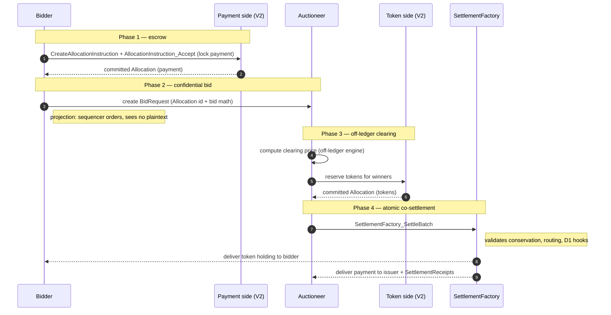

# Architectural Overview Report: Confidential Auction Launchpad on Canton

Status: **reference-design report**. It describes a *reference design* grounded
in the real OpenZeppelin Canton components in this workspace; it is **not** a
claim of acceptance, conformance, audit readiness, or production readiness.

> **Source-grounding tags** (used throughout):
> `[IMPLEMENTED]` real code in the M1 library base ([`canton-specs`](https://github.com/OpenZeppelin/canton-specs) /
> [`canton-contracts`](https://github.com/OpenZeppelin/canton-contracts)) · `[EVIDENCE]` real code in an evidence repo
> ([`canton-token-template`](https://github.com/OpenZeppelin/canton-token-template), [`canton-stablecoin`](https://github.com/OpenZeppelin/canton-stablecoin)), not
> the M1 surface · `[UPSTREAM]` Splice / CIP reference, not vendored here ·
> `[FUTURE]` proposed RI-level design, not built in M1 scope.

> **Design priority order** governs every interface and snippet, in this exact
> order: **1) Security → 2) Simplicity → 3) Readability → 4) Auditability.**

> **Scope.** This is the architecture documentation for a Confidential Auction
> Launchpad reference design targeting **CIP-0112 / Token Standard V2**;
> settlement builds only on V2 abstractions. Companion working code, demo
> front-end, and threat model are out of scope for this document.

---

## 1. Product Definition

The Confidential Auction Launchpad is a reference implementation for
institutional, regulated, confidential token distribution (ICOs) on Canton. It
leverages Canton's sub-transaction privacy and the **CIP-0112 / Token Standard
V2 settlement spine** `[IMPLEMENTED]` to establish a **sealed-bid** environment
**by protocol design** rather than cryptographic obfuscation: bids, allocations,
and settlement details are visible only to explicitly authorized parties via
native ledger projection.

### 1.1 Educational Framing: Sealed-bid via projection, not commit-reveal

On public ledgers, sealed-bid auctions use a commit-reveal pattern: publish a
hash of the bid to a globally visible mempool/ledger, then reveal the plaintext
later — adding UX friction, non-revelation risk, and exposure to metadata/timing
analysis. On Canton, privacy is **per-party projection**: a contract is visible
only to its signatories/observers, and a `BidRequest` with `signatory bidder,
observer auctioneer` materializes only on those two parties' nodes. The
synchronizer's sequencer orders the transaction by its confirmation-tree shape
but does not see the bid plaintext, so the sealed-bid property is achieved
without commit-reveal and front-running is structurally prevented.

### 1.2 In-Scope vs. Out-of-Scope

The bias favors a clean, singular sealed-bid core over expansive market
mechanics.

| Feature Category | In-Scope |
|---|---|
| Auction mechanism | Single-round **sealed-bid**, settling at a **uniform clearing price**; the pricing rule selecting that price (e.g. lowest accepted bid, highest rejected bid) is an off-ledger parameter of the auctioneer's clearing engine. |
| Confidentiality | Bid isolation via per-party projection — bidder, issuer/auctioneer, and the credential verifier only; no bidder projects competitor bids. |
| Escrow | Locked escrow via `LockedSimpleHolding` / `Allocation`; funds cryptographically bound to the settlement outcome. |
| Atomic settlement | Token-for-payment exchange **only** via [`SettlementFactory_SettleBatch`](../../experiments/cip112-settlement/daml/OpenZeppelin/Experimental/Settlement/Cip112.daml#L249) (atomic DvP, single transaction). |
| Access gating | Credential-gated participation via `credential-gateway` (`CredentialGatedActionRequest`, `MockVerificationResult`). |
| Authority | Single-admin capability via `oz-access-control` (mint/burn/seizure). |
| Compliance | D1 node-applied checks (Shape B), fail-closed — the intended posture, engaged by the optional `D1ComplianceHook` / typed attestation path (base `SettleBatch` does not itself mandate an attestation; see §3.2). |

| Feature Category | Out-of-Scope (Excluded) |
|---|---|
| Continuous issuance | Streaming launches, continuous funding, persistent issuance — discrete finalized rounds only. |
| Algorithmic pricing | Bonding curves, dynamic-price Dutch auctions (settlement spine could host them later, not core). |
| Secondary market | AMM / order-book / post-auction liquidity — that is the DEX RI. |
| Derivatives & synthetics | Options/futures/synthetics of the launched token. |
| On-ledger clearing math | Sorting/clearing runs **off-ledger**; only finalized, conservation-sound match legs settle on-ledger. |

### 1.3 Target Users

Institutional asset issuers, regulated launchpad operators, and accredited
investors in compliant jurisdictions. Issuers get fair distribution free of
front-running / bid manipulation / MEV, with KYC/AML/accreditation enforced via
`credential-gateway`. Bidders get confidentiality of intent, atomic
return-to-sender for losing bids (no counterparty credit risk), and capital that
can move only per their signed `AllocationInstruction`.

### 1.4 Central trust limitation: the auctioneer (stated up front)

The conceptual boundary of this design must be foregrounded, because it shapes
everything below. Clearing runs **off-ledger by a fully trusted auctioneer that
sees every bid**. So the design delivers **confidential bid *submission*** — bids
are hidden from competitors and from the sequencer by per-party projection — but
it does **not** deliver:

- **auctioneer honesty** — a malicious or compromised auctioneer that observes
  all bids can favor a colluding bidder, leak bids, or compute a dishonest
  clearing price;
- **a verifiable pricing rule** — the rule selecting the uniform clearing price
  is an off-ledger computation; the ledger checks only the price bounds
  (`>= minBidPrice`, `<=` each winner's `bidPrice`);
- **ledger-enforced fairness of allocation** — the conservation / leg-authorization
  invariants prevent value *theft* (no leg settles that a party did not sign),
  but they do not prevent *unfair allocation* at a sound clearing price.

This is acceptable for a confidential-submission launchpad where the issuer *is*
the auctioneer and bidders trust the issuer's clearing, and it is a real
improvement over a public mempool.

> **Decision (July 2026, internal review).** M1 keeps clearing **off-ledger by
> the trusted auctioneer**, matching the scope of the
> [Canton dev-fund proposal](https://github.com/canton-foundation/canton-dev-fund/blob/main/proposals/2026-04-OpenZeppelin-canton-ecosystem-stack.md)
> (the initial implementation is explicitly off-chain there). Migrating the
> clearing on-ledger (verifiable clearing) is a **future exploration** within
> the agreement, not an M1 item.

---

## 2. Architecture Overview

Strictly modular: access control, asset semantics, auction logic, and terminal
settlement are distinct layers, so the settlement spine stays sealed while
auction mechanics can be upgraded or substituted.

### 2.1 Component Utilization

- **Authority** — `oz-access-control` `[IMPLEMENTED]` ([`RoleGrant`](../../access-control/daml/OpenZeppelin/AccessControl.daml), `RoleAdmin`,
  `DefaultAdminTransferOffer`, [`requireRole`](../../access-control/daml/OpenZeppelin/AccessControl.daml); `roleId : MyRole -> Text`
  closed-sum wrapper) for Issuer/Auctioneer roles; `oz-ownable` `[IMPLEMENTED]`
  ([`Ownership`](../../ownable/daml/OpenZeppelin/Ownable.daml)/[`OwnershipOffer`](../../ownable/daml/OpenZeppelin/Ownable.daml)) for two-step handoff; `oz-pausable`
  `[IMPLEMENTED]` ([`PauseState`](../../pausable/daml/OpenZeppelin/Pausable.daml)/[`whenNotPaused`](../../pausable/daml/OpenZeppelin/Pausable.daml)) for the emergency halt.
- **Settlement spine** — `OpenZeppelin.Experimental.Settlement.Cip112`
  `[IMPLEMENTED]` ([`SettlementFactory`](../../experiments/cip112-settlement/daml/OpenZeppelin/Experimental/Settlement/Cip112.daml#L191), [`AllocationRequest`](../../experiments/cip112-settlement/daml/OpenZeppelin/Experimental/Settlement/Cip112.daml#L322),
  [`AllocationInstruction`](../../experiments/cip112-settlement/daml/OpenZeppelin/Experimental/Settlement/Cip112.daml#L379), [`Allocation`](../../experiments/cip112-settlement/daml/OpenZeppelin/Experimental/Settlement/Cip112.daml#L474), [`SettlementReceipt`](../../experiments/cip112-settlement/daml/OpenZeppelin/Experimental/Settlement/Cip112.daml#L695)). Atomic DvP routes
  **only** through [`SettlementFactory_SettleBatch`](../../experiments/cip112-settlement/daml/OpenZeppelin/Experimental/Settlement/Cip112.daml#L249); direct [`Allocation_Settle`](../../experiments/cip112-settlement/daml/OpenZeppelin/Experimental/Settlement/Cip112.daml#L493) is
  bypassed for the exchange (it proves authorization, not multi-party atomic
  co-settlement).
- **Assets** — `canton-token-template` `[EVIDENCE]` (`SimpleHolding`,
  `LockedSimpleHolding`, `SimpleTokenRules` 3-way dispatch); the launched token
  is minted via `Rules_Mint` / `MintProposal` `[FUTURE]` (cold recipient →
  propose → accept, honoring Canton co-authorization). **Note:** `Rules_Mint`,
  `MintProposal`, and `RoleCapability` do **not** exist in the evidence repo
  today — they are RI-level `[FUTURE]` extensions of the evidence template, to
  be consolidated at implementation time (the same consolidation rule as the
  RI-03 delegated-accept choice). `canton-stablecoin`'s `Vault` /
  `VaultFactory` / `Vault_Liquidate` / `PriceOracle` are **excluded** (CDP
  mechanics, not primary issuance).
- **Compliance/identity** — the in-repo [`credential-gateway`](../../experiments/credential-gateway/daml/OpenZeppelin/Experimental/Credential/Gateway.daml) experiment `[IMPLEMENTED]` (experimental)
  (`CredentialGatedActionRequest`, `MockVerificationResult`,
  `CredentialRevocationStatus`); typed D3 `KycClaim` + `TrustedIssuerRegistry`
  from the `canton-specs` identity-hook Shape-B experiment `[IMPLEMENTED]`
  (the typed identity shape, not `credential-gateway` templates; the gateway
  supplies the gating/verification primitives).

### 2.2 Party and Role Topology

- **Operator** — deploys the launchpad contracts and manages the
  `SettlementFactory`; operational, not financial, authority.
- **Issuer** — launches the token; single-admin authority; holds the
  [`BurnerCapability`](../../experiments/cip112-settlement/daml/OpenZeppelin/Experimental/Settlement/Cip112.daml#L98) (D2 seizure) and authorizes `Rules_Mint` via `MintProposal` (both `[FUTURE]`, §2.1).
- **Auctioneer** — delegated by the Issuer via [`RoleGrant`](../../access-control/daml/OpenZeppelin/AccessControl.daml); observes
  `BidRequest`s, runs the off-ledger clearing engine, and builds the
  `SettleBatch` payload; cannot misdirect funds (constrained by the spine's
  conservation invariants).
- **Bidder** — needs a valid `KycClaim` from a `TrustedIssuerRegistry`; retains
  control of payment assets until atomic settlement.
- **Verifier** — off-chain compliance entity; issues a `MockVerificationResult`
  attesting credential validity, green-lighting participation.

### 2.3 Trust and Topology

Each contract configures the nodes that validate it. The `BidRequest`'s
`signatory bidder, observer auctioneer` definition routes its data only to those
parties' nodes, shielding bids from the network. Daml-LF 2.1 is keyless
(archive-and-recreate, not in-place mutation), and any new signatory must
co-authorize — so the Auctioneer cannot push a minted token into a Bidder's
wallet: the Issuer creates a `MintProposal` (`[FUTURE]`, §2.1) and the Bidder actively accepts it.
Synchronizer sequencers order transactions by confirmation-tree shape while
remaining blinded to bid plaintext, eliminating sequencer front-running / MEV.

---

## 3. How We Implement It

An invariant-bound lifecycle: configuration + gating → confidential bidding →
off-ledger clearing → atomic on-ledger settlement.

### 3.1 The Settlement-Spine Flow

1. **Configuration + access gating.** The Issuer instantiates `AuctionLaunchpad`
   (payment instrument id, launched instrument id, the `SettlementFactory`
   reference — see §4.2 for the full field set) and delegates the Auctioneer
   role via `RoleGrant`. The governing `TrustedIssuerRegistry` is **not stored
   on the launchpad**: it archive-and-recreates on membership change, so a
   stored cid would brick (the same hazard as a stored `PauseState` cid). It
   governs via the step-2 credential path, passed as a choice argument at
   exercise time.
2. **Credential verification.** The Bidder obtains a `KycClaim` and submits a
   `CredentialGatedActionRequest`; the Verifier issues a `MockVerificationResult`
   on-ledger, unlocking participation. This is the entry gate, *not* a
   check-once: the same D1 path is re-evaluated per settlement leg, fail-closed,
   with no caching (§3, §7), so a credential revoked after this step still blocks
   settlement.
3. **Escrow + confidential bid.** The Bidder commits payment capital by creating
   an `AllocationInstruction` (via [`SettlementFactory_CreateAllocationInstruction`](../../experiments/cip112-settlement/daml/OpenZeppelin/Experimental/Settlement/Cip112.daml#L228))
   and accepting it ([`AllocationInstruction_Accept`](../../experiments/cip112-settlement/daml/OpenZeppelin/Experimental/Settlement/Cip112.daml#L392)), producing a committed
   [`Allocation`](../../experiments/cip112-settlement/daml/OpenZeppelin/Experimental/Settlement/Cip112.daml#L474) that locks the funds under the Bidder's authority while
   delegating settlement execution to the [`SettlementFactory`](../../experiments/cip112-settlement/daml/OpenZeppelin/Experimental/Settlement/Cip112.daml#L191). Simultaneously the
   Bidder creates a `BidRequest` (`signatory bidder, observer auctioneer`)
   carrying the `Allocation` reference, bid amount, and price — projected only to
   bidder and auctioneer.
4. **Closure + clearing.** The Auctioneer halts new submissions via `oz-pausable`
   ([`PauseState`](../../pausable/daml/OpenZeppelin/Pausable.daml)), queries its node for active `BidRequest`s, and runs the
   off-ledger clearing engine to determine the clearing price, winners, and exact
   asset routing.
5. **Atomic co-settlement.** Once the clearing price is published, each winner
   commits a **single two-sided allocation** — pay `bidAmount` out, receive
   `bidAmount / clearingPrice` tokens in (both of a winner's sides must live in
   one allocation, per the spine's per-allocation leg-side check) — and the Issuer
   commits **one** allocation carrying every leg's issuer side. The Auctioneer then
   binds the legs to the signed bids and submits a single
   [`SettlementFactory_SettleBatch`](../../experiments/cip112-settlement/daml/OpenZeppelin/Experimental/Settlement/Cip112.daml#L249) over `winnerAllocations ++ [issuerAllocation]`
   (§4.4). Settlement enforces conservation per instrument (each authorizer's
   locked funds must cover its SenderSide obligations; surplus returns as change)
   and runs the D1 hooks; on success it commits atomically, delivering tokens to
   bidders, payment to the Issuer, and
   [`SettlementReceipt`](../../experiments/cip112-settlement/daml/OpenZeppelin/Experimental/Settlement/Cip112.daml#L695)s.
6. **Return to sender (losing bids).** The Auctioneer archives losing
   `BidRequest`s and cancels the corresponding payment `Allocation`
   ([`Allocation_Cancel`](../../experiments/cip112-settlement/daml/OpenZeppelin/Experimental/Settlement/Cip112.daml#L570) / [`Allocation_Withdraw`](../../experiments/cip112-settlement/daml/OpenZeppelin/Experimental/Settlement/Cip112.daml#L583)), releasing the lock back to the bidder.
   This honors the D2 rule: non-matching bids **return to sender** — never seized
   or burned by the launchpad.

### 3.2 D1 Compliance: Shape B node attestation

The **intended** posture is compliance checked per settlement, **fail-closed**,
**node-applied** — no on-ledger caching. This is a design commitment, not an
unconditional property of the base path: the base `SettleBatch` can settle with
no attestation, and the requirement is engaged by the **optional**
[`D1ComplianceHook`](../../experiments/cip112-settlement/daml/OpenZeppelin/Experimental/Settlement/Cip112.daml#L41) (when `requiresPerSettlementReference` is set) and the typed
attestation path. The RI uses **Shape B** (signed node attestation) over Shape A
(off-ledger gate): with the hook/attestation engaged, settlement requires fresh,
cryptographically signed attestations from the relevant compliance nodes; if any
are missing/expired/invalid, the entire batch fails. *(Open, non-blocking: contract-oblivious vs on-ledger attestation
verification.)*

### 3.3 D2 Seizure: lock-and-sweep

Seizure is isolated from the auction flow and gated by the single-admin
[`BurnerCapability`](../../experiments/cip112-settlement/daml/OpenZeppelin/Experimental/Settlement/Cip112.daml#L98). It is **not** a burn: a targeted `Allocation` / holding is
swept to an admin-**preset** `custodianDestination`, via the real spine
mechanism ([`Allocation_MarkD2InFlightSeizure`](../../experiments/cip112-settlement/daml/OpenZeppelin/Experimental/Settlement/Cip112.daml#L595) → [`Allocation_SweepD2InFlightSeizure`](../../experiments/cip112-settlement/daml/OpenZeppelin/Experimental/Settlement/Cip112.daml#L625)
for in-flight allocations; `LockedSimpleHolding_ForcedBurn` to the custodian for
locked holdings). The spine's [`D2SeizureHook`](../../experiments/cip112-settlement/daml/OpenZeppelin/Experimental/Settlement/Cip112.daml#L46) is a config **data record**
(`seizureCaseRef`, `custodianDestination`, `inFlightHandlingStatus`), not an
invokable template. Value is preserved; chain of custody is maintained; nothing
is returned to a flagged sender (ordinary transfer *failures* do return to
sender).

### 3.4 SCU upgrade rule + D3 forward compatibility

Never mutate an existing choice's args to require a new field; extend via
`Optional` fields, new types, and new choices. D3 today is single-domain v1
(`TrustedIssuerRegistry` + `KycClaim`). To add cross-domain identity
(ONCHAINID / ERC-3643 / CCID) later: define a new `CrossDomainIdentity` type,
append `crossDomainRef : Optional CrossDomainIdentity` to `BidRequest`, and add a
**new** choice `BidRequest_UpdateIdentity` (archive + recreate with the field
populated). Legacy bid choices stay untouched and functional. This is the
additive path proven in the `canton-specs` identity-hook upgrade spike.

### 3.5 Liveness against a stalling auctioneer (auction deadline + forced refund)

Escrow locks a bidder's funds in a committed `Allocation` the auctioneer is
expected to settle or release. If the auctioneer **stalls** — never clears, never
archives losing bids — a bidder's capital could be locked indefinitely. The
design therefore wires a hard deadline into the auction lifecycle rather than
relying on auctioneer good behavior:

- **`AuctionLaunchpad` carries a `biddingDeadline` and a `settlementDeadline`.**
  The latter aligns with the spine's `Allocation` `settlementDeadline`, so the
  escrow's own expiry and the auction's settlement window are the **same** clock,
  not two independent ones.
- **Forced refund after the deadline.** A bidder can reclaim escrow with a
  bidder-controlled choice once the deadline passes, *without* the auctioneer's
  cooperation — `BidRequest_ForceRefundAfterDeadline` asserts `now >
  settlementDeadline` and exercises `Allocation_Withdraw` on the bidder's own
  committed allocation. Note the timing constraint is not optional: because the
  escrow is a **committed** allocation, the spine's `requireWithdrawAllowed`
  blocks `Allocation_Withdraw` *until* the deadline (and blocks it entirely with
  no deadline). So there is **no** bidder-unilateral pre-clearing withdraw — before
  the deadline the only return path is the auctioneer's `Allocation_Cancel`
  (controller = executors); after it, the bidder reclaims unilaterally. Because
  the bidder is the `Allocation` authorizer, the post-deadline path needs no
  auctioneer signature — bidder liveness does not depend on the trusted party.
- **Settlement is gated by the bidding deadline.** `Clearing_ExecuteBatch`
  asserts `now > biddingDeadline` (no late inclusion) and `now <=
  settlementDeadline` (no settling stale escrow), bounding the window in which the
  auctioneer can act.

This makes "funds locked indefinitely" unreachable: past `settlementDeadline`
either the batch has settled or every bidder can unilaterally refund.

---

## 4. Interfaces & Usage Examples

Names map to real workspace components; RI-level templates are tagged
`[FUTURE]`. Imports use real module names (`OpenZeppelin.AccessControl`,
`OpenZeppelin.Pausable`, `OpenZeppelin.Experimental.Settlement.Cip112`).

### 4.1 Access control `[FUTURE]`

```daml
module ConfidentialAuction.AccessControl where

import OpenZeppelin.AccessControl (RoleGrant, requireRole)

data AuctionRole = IssuerRole | AuctioneerRole deriving (Eq, Show)

roleId : AuctionRole -> Text
roleId IssuerRole     = "ISSUER"
roleId AuctioneerRole = "AUCTIONEER"
```

### 4.2 Launchpad configuration `[FUTURE]`

```daml
module ConfidentialAuction.Launchpad where

import OpenZeppelin.Pausable (PauseState, whenNotPaused)
import OpenZeppelin.Experimental.Settlement.Cip112 (SettlementFactory)
import OpenZeppelin.Experimental.TokenStandard.V2.Holding (InstrumentId)

template AuctionLaunchpad
  with
    operator : Party
    issuer : Party
    -- Typed instrument identity (bound to the issuing admin), not bare Text.
    paymentInstrumentId : InstrumentId
    launchedInstrumentId : InstrumentId
    settlementFactoryCid : ContractId SettlementFactory
    minBidPrice : Decimal
    perBidCap : Decimal                       -- ISSUER-set per-bid ceiling (not bidder-set)
    biddingDeadline : Time                    -- no bids / no settlement before this
    settlementDeadline : Time                 -- == the escrow Allocation deadline
  where
    signatory operator, issuer
    ensure
      minBidPrice > 0.0 &&
      perBidCap > 0.0 &&
      biddingDeadline < settlementDeadline &&
      paymentInstrumentId /= launchedInstrumentId &&   -- the two legs must differ
      operator /= issuer
    -- NB: no stored `pauseStateCid` field. `PauseState_Set` is a *consuming*
    -- choice, so it archives-and-recreates the PauseState and any stored
    -- ContractId would brick after the first toggle. The current `PauseState` is
    -- instead passed as a choice ARGUMENT to each whenNotPaused-guarded choice
    -- (disclosed by the pauser at exercise time). Halt/resume route through
    -- oz-pausable PauseState_Set (controller = issuer, validated via requireRole
    -- IssuerRole), not via a mutated local flag or a stale pointer.

    -- Bid GATE: the only way to create a BidRequest. Because `ensure` cannot
    -- `fetch`, the escrow validation lives here, on the issuer-signed launchpad, so
    -- the bound values come from trusted state — not from bidder-supplied fields.
    nonconsuming choice AuctionLaunchpad_PlaceBid : ContractId BidRequest
      with
        bidder : Party
        paymentAllocationCid : ContractId Allocation
        bidAmount : Decimal
        bidPrice : Decimal
        paymentLegId : Text
        tokenLegId : Text
      controller bidder
      do
        now <- getTime
        assertMsg "bidding window closed" (now <= biddingDeadline)
        assertMsg "bid price below floor" (bidPrice >= minBidPrice)
        -- Per-bid cap read from THIS launchpad (issuer-signed), not a
        -- bidder-declared field, so the cap actually constrains.
        assertMsg "bid exceeds per-bid cap" (bidAmount <= perBidCap)
        -- Bind the escrow: it must be the bidder's own committed allocation, in the
        -- payment instrument, for exactly `bidAmount`, and carry the SAME deadline
        -- as the auction (so the post-deadline force-refund is actually reachable —
        -- Allocation_Withdraw checks the allocation's OWN deadline).
        alloc <- fetch paymentAllocationCid
        assertMsg "escrow not owned by bidder" (alloc.allocation.authorizer.owner == Some bidder)
        assertMsg "escrow deadline != auction settlement deadline"
          (alloc.allocation.settlement.settlementDeadline == Some settlementDeadline)
        case filter (\s -> s.side == SenderSide) alloc.allocation.transferLegSides of
          [s] | s.instrumentId == paymentInstrumentId.id && s.amount == bidAmount -> pure ()
          _ -> abort "escrow must sign exactly one payment side == (bidAmount, payment instrument)"
        create BidRequest with
          bidder; auctioneer = operator; launchpadCid = self
          paymentAllocationCid; bidAmount; bidPrice
          paymentLegId; tokenLegId; crossDomainRef = None
```

### 4.3 Confidential bid + policy guards `[FUTURE]`

```daml
module ConfidentialAuction.Bid where

import OpenZeppelin.Experimental.Settlement.Cip112 (Allocation)

template BidRequest
  with
    bidder : Party
    auctioneer : Party
    launchpadCid : ContractId AuctionLaunchpad
    paymentAllocationCid : ContractId Allocation
    bidAmount : Decimal
    bidPrice : Decimal
    -- Leg ids the clearing choice binds the settled legs to (see §4.4).
    paymentLegId : Text
    tokenLegId : Text
    -- SCU additive extension point for deferred D3 cross-domain identity.
    crossDomainRef : Optional Text
  where
    -- CONFIDENTIALITY boundary: only bidder + auctioneer project this contract.
    signatory bidder
    observer auctioneer

    -- Basic integrity only. The load-bearing constraints — bid >= floor,
    -- bid <= the ISSUER-set per-bid cap, and escrow == (bidAmount, payment
    -- instrument, matching deadline) — are enforced at creation by the issuer-signed
    -- `AuctionLaunchpad_PlaceBid` gate (§4.2), NOT here: `ensure` cannot `fetch`,
    -- and a bidder-supplied cap would be vacuous (the bidder could set it freely).
    ensure (bidAmount > 0.0 && bidPrice > 0.0)

    -- IMPORTANT (spine reality): the escrow is a *committed* Allocation, and
    -- Allocation_Withdraw's `requireWithdrawAllowed` BLOCKS withdraw of a
    -- committed allocation until AFTER `settlementDeadline` (and blocks it
    -- outright if there is no deadline). So a bidder CANNOT unilaterally cancel a
    -- committed escrow before clearing — the earlier "withdraw before clearing,
    -- no auctioneer action needed" was wrong. Pre-deadline, the only return path
    -- is the auctioneer voluntarily releasing via Allocation_Cancel (controller =
    -- settlement executors); the guaranteed bidder-driven exit is the
    -- post-deadline force-refund below. This is why the escrow MUST carry a
    -- `settlementDeadline`.
    choice BidRequest_RequestCancel : ()
      controller bidder
      do
        -- Signals intent to the auctioneer; the actual unlock of a committed
        -- escrow before the deadline requires the auctioneer's Allocation_Cancel.
        pure ()

    -- Liveness: once the settlement window has closed, the bidder reclaims escrow
    -- WITHOUT the auctioneer — defeats a stalling auctioneer. The bidder is the
    -- Allocation authorizer AND the deadline has passed, so `requireWithdrawAllowed`
    -- now permits the withdraw (committed + now > deadline).
    -- Returns the spine's AllocationResult (AllocationWithdrawn with the released
    -- holding cids) — a withdraw releases holdings, it does not yield a new
    -- Allocation.
    choice BidRequest_ForceRefundAfterDeadline : AllocationResult
      controller bidder
      do
        now <- getTime
        lp <- fetch launchpadCid
        assertMsg "settlement window still open" (now > lp.settlementDeadline)
        -- The PlaceBid gate already bound the escrow deadline to the launchpad's,
        -- so `Allocation_Withdraw` (which checks the allocation's OWN deadline) is
        -- guaranteed to permit this now that the launchpad deadline has passed.
        -- `actors` must be the escrow's account parties; for a bidder-owned,
        -- provider-less escrow that is just the bidder.
        exercise paymentAllocationCid Allocation_Withdraw with actors = [bidder]
```

### 4.4 Atomic settlement via the spine `[FUTURE]`

```daml
module ConfidentialAuction.Clearing where

import OpenZeppelin.Experimental.Settlement.Cip112
  (SettlementFactory, SettlementFactory_SettleBatch, Allocation, AllocationRequest)

template AuctionClearing
  with
    auctioneer : Party
    launchpadCid : ContractId AuctionLaunchpad
  where
    signatory auctioneer

    choice Clearing_ExecuteBatch : [ContractId SettlementReceipt]
      with
        settlementFactoryCid : ContractId SettlementFactory
        clearingPrice : Decimal                            -- uniform clearing price
        winningBids : [ContractId BidRequest]              -- the bids being filled
        winnerAllocations : [ContractId Allocation]        -- 1:1 with winningBids; each is the winner's
                                                           -- SINGLE post-clearing allocation carrying BOTH its
                                                           -- pay SenderSide AND its token ReceiverSide
        issuerAllocation : ContractId Allocation           -- the ONE issuer allocation carrying every leg's
                                                           -- issuer side (token SenderSide + payment ReceiverSide)
        issuerTokenAccount : Account                       -- issuer treasury (token source / payment sink)
        settlement : SettlementInfo
        transferLegs : [TransferLeg]                       -- MUST equal the bound legs below
      controller auctioneer
      do
        -- Window guard: bidding must be closed and the settlement deadline not
        -- yet passed — no late inclusion, no settling expired escrow.
        now <- getTime
        lp <- fetch launchpadCid
        assertMsg "bidding still open" (now > lp.biddingDeadline)
        assertMsg "settlement window closed" (now <= lp.settlementDeadline)
        assertMsg "clearing price below floor" (clearingPrice >= lp.minBidPrice)
        -- Bind the token source/payment-sink to the issuer, so payment cannot be
        -- redirected to a non-issuer account and tokens cannot be sourced elsewhere.
        assertMsg "token/payment account is not the issuer treasury"
          (issuerTokenAccount.owner == Some lp.issuer)

        -- ON-LEDGER BINDING (root-cause fix for theft-by-leg-omission). `transferLegs`
        -- is auctioneer-chosen, so DERIVE the legs from each signed bid and its
        -- winner allocation instead of trusting it: each winner pays exactly their
        -- signed `bidAmount` and receives exactly `bidAmount / clearingPrice` tokens,
        -- and their `bidPrice` must be >= `clearingPrice` (uniform-price eligibility).
        --
        -- The winner's TWO sides (pay out, tokens in) live in ONE allocation, not
        -- two. The spine settles each allocation through `Allocation_SettleInBatch`,
        -- which enforces `allAuthorizerLegSidesPresent` PER ALLOCATION: every leg on
        -- which an allocation's authorizer is sender/receiver must have that side in
        -- THAT allocation. The winner is sender of the pay leg AND receiver of the
        -- token leg, so both sides must be in the winner's own allocation (splitting
        -- them across two allocations would abort with `eAllocationLegMismatch`). The
        -- token side is committed POST-CLEARING because `bidAmount / clearingPrice`
        -- is unknown at bid time — a deliberate liveness step (a winner who never
        -- commits it is simply not settled and reclaims the bid-time escrow after the
        -- deadline via `BidRequest_ForceRefundAfterDeadline`; see §9).
        expectedLegs <- forA (zip winningBids winnerAllocations) \(bidCid, winnerAllocCid) -> do
          bid <- fetch bidCid
          assertMsg "winning bid is below the clearing price" (bid.bidPrice >= clearingPrice)
          escrow <- fetch bid.paymentAllocationCid
          winnerAlloc <- fetch winnerAllocCid
          let bidderAccount = escrow.allocation.authorizer
          assertMsg "winner allocation not authorized by the bidder"
            (winnerAlloc.allocation.authorizer == bidderAccount)
          paySide <- case filter (\s -> s.side == SenderSide) winnerAlloc.allocation.transferLegSides of
            [s] | s.instrumentId == lp.paymentInstrumentId.id -> pure s
            _ -> abort "winner allocation must sign exactly one payment (sender) side"
          tokSide <- case filter (\s -> s.side == ReceiverSide) winnerAlloc.allocation.transferLegSides of
            [s] | s.instrumentId == lp.launchedInstrumentId.id -> pure s
            _ -> abort "winner allocation must sign exactly one token (receiver) side"
          let tokenAmount = bid.bidAmount / clearingPrice
          assertMsg "winner pay side != signed bidAmount" (paySide.amount == bid.bidAmount)
          assertMsg "winner token side != bidAmount/clearingPrice" (tokSide.amount == tokenAmount)
          assertMsg "payment not routed to issuer treasury" (paySide.otherside == issuerTokenAccount)
          assertMsg "tokens not sourced from issuer treasury" (tokSide.otherside == issuerTokenAccount)
          let payLeg = TransferLeg with
                transferLegId = bid.paymentLegId
                sender = bidderAccount; receiver = issuerTokenAccount
                amount = bid.bidAmount; instrumentId = lp.paymentInstrumentId.id; meta = paySide.meta
              tokenLeg = TransferLeg with
                transferLegId = bid.tokenLegId
                sender = issuerTokenAccount; receiver = bidderAccount
                amount = tokenAmount; instrumentId = lp.launchedInstrumentId.id; meta = tokSide.meta
          pure [payLeg, tokenLeg]
        -- Pin the settled legs to EXACTLY the bound per-winner (pay, deliver) pairs.
        -- A winner cannot be charged without receiving their tokens, and the
        -- "never theft" guarantee (§1.4, §7.3) is enforced on-ledger, not asserted.
        assertMsg "settled legs != the bound per-winner (pay, deliver) legs"
          (transferLegs == concat expectedLegs)

        -- Both-sidedness now holds under BOTH spine checks: factory-level
        -- `allTransferLegsAuthorized` (every leg's two sides appear across the
        -- batch) and per-allocation `allAuthorizerLegSidesPresent` (each account's
        -- sides are all in its own allocation — each winner's two sides in its
        -- winner allocation, all issuer sides in the single issuer allocation).
        exercise settlementFactoryCid SettlementFactory_SettleBatch with
          settlement
          transferLegs
          allocationCids = winnerAllocations ++ [issuerAllocation]
          actors = settlement.executors
          d1ComplianceRef = None
```

---

## 5. Diagrams

Targets the proposed `canton-settlement-explorer` `[FUTURE]` (not built here).

### 5.1 Interface and Component Diagram


### 5.2 Flow-of-Funds and Settlement Sequence



---

## 6. Library Dependencies

### 6.1 Internal Dependencies

| Package | Consumed Templates / Interfaces | Role | Tag |
|---|---|---|---|
| `oz-access-control` | [`RoleGrant`](../../access-control/daml/OpenZeppelin/AccessControl.daml), `RoleAdmin`, `DefaultAdminTransferOffer`, [`requireRole`](../../access-control/daml/OpenZeppelin/AccessControl.daml) | Authority model; closed-sum `roleId` checks. | `[IMPLEMENTED]` |
| `oz-ownable` | [`Ownership`](../../ownable/daml/OpenZeppelin/Ownable.daml), [`OwnershipOffer`](../../ownable/daml/OpenZeppelin/Ownable.daml) | Secure admin handoff. | `[IMPLEMENTED]` |
| `oz-pausable` | [`PauseState`](../../pausable/daml/OpenZeppelin/Pausable.daml), [`whenNotPaused`](../../pausable/daml/OpenZeppelin/Pausable.daml) | Circuit breaker (halt the sale). | `[IMPLEMENTED]` |
| `canton-token-template` | `SimpleHolding`, `LockedSimpleHolding`, `SimpleTokenRules`, `TransferPreapproval` (real); `RoleCapability`, `MintProposal`, `Rules_Mint` are `[FUTURE]` extensions — not in the evidence repo today (§2.1). | Asset structure, 3-way dispatch, cold-recipient mint. | `[EVIDENCE]` (+ `[FUTURE]` extensions) |
| `canton-stablecoin` | (none consumed; `Vault`/`VaultFactory`/`Vault_Liquidate`/`PriceOracle` **excluded** — CDP, not issuance) | Referenced for contrast only. | `[EVIDENCE]` |
| [`credential-gateway`](../../experiments/credential-gateway/daml/OpenZeppelin/Experimental/Credential/Gateway.daml) | `CredentialGatedActionRequest`, `MockVerificationResult`, `CredentialRevocationStatus` | D1/D3 credential gating. | `[IMPLEMENTED]` (experimental) |
| `canton-specs` identity-hook Shape-B | `KycClaim`, `TrustedIssuerRegistry` | Typed D3 identity, layered via SCU. | `[IMPLEMENTED]` (experimental) |
| `OpenZeppelin.Experimental.Settlement.Cip112` | [`SettlementFactory`](../../experiments/cip112-settlement/daml/OpenZeppelin/Experimental/Settlement/Cip112.daml#L191), [`AllocationRequest`](../../experiments/cip112-settlement/daml/OpenZeppelin/Experimental/Settlement/Cip112.daml#L322), [`AllocationInstruction`](../../experiments/cip112-settlement/daml/OpenZeppelin/Experimental/Settlement/Cip112.daml#L379), [`Allocation`](../../experiments/cip112-settlement/daml/OpenZeppelin/Experimental/Settlement/Cip112.daml#L474), [`SettlementReceipt`](../../experiments/cip112-settlement/daml/OpenZeppelin/Experimental/Settlement/Cip112.daml#L695), [`BurnerCapability`](../../experiments/cip112-settlement/daml/OpenZeppelin/Experimental/Settlement/Cip112.daml#L98), [`D1ComplianceHook`](../../experiments/cip112-settlement/daml/OpenZeppelin/Experimental/Settlement/Cip112.daml#L41), [`D2SeizureHook`](../../experiments/cip112-settlement/daml/OpenZeppelin/Experimental/Settlement/Cip112.daml#L46) | Atomic DvP spine; D1/D2 seams. | `[IMPLEMENTED]` (experimental) |

### 6.2 External Dependencies (Splice Token Standard V2)

Built against the CIP-0112 / Splice Token Standard V2 **interfaces** `[UPSTREAM]`,
targeting the interfaces rather than DAR/package-ID pins, via local stand-ins
designed to **maximally match the V2 interfaces**. The published V2 DARs are
swapped in once the import gate clears; import remains gated, and no public-API
stability / conformance / release claim is made. `nextIterationFunding` is inert
forward-compatible metadata mirroring the V2 allocation shape (this launchpad is
single-round; M1 does not implement iterated settlement); it is the
forward-compatible carrier for future multi-round / bonding-curve variants.

---

## 7. Security & Auditability

### 7.1 Threat Model and Invariants

| Threat | Mechanism | Mitigation |
|---|---|---|
| Privacy leakage / metadata front-running | Adversaries monitor a public mempool to front-run bids. | Canton has no public mempool; per-party projection keeps the `BidRequest` payload off the network; the sequencer sees the confirmation-tree shape, not contents; blast radius is bounded by a node's authorized visibility. |
| Unauthorized seizure / unilateral burn | Compromised admin attempts to burn or redirect escrow. | D2 gated by the single `BurnerCapability`; failure never defaults to seizure — a failed `SettleBatch` leaves funds in their `Allocation`, returned to sender. |
| Auctioneer embezzlement at settlement | Auctioneer manipulates routing to redirect payments. | `AllocationRequest`/leg routing is explicit; `SettlementFactory` enforces conservation at the Daml level — net outflow cannot exceed allocation and destinations must match the counter-signed routing; violating transactions are rejected. |
| Dishonest clearing / unfair allocation | Trusted auctioneer sees all bids and computes a self-serving clearing price or favors a colluding bidder. | **Not mitigated by the conservation invariant** (which stops theft, not unfairness). Residual trust on the off-ledger clearing; commit-reveal / verifiable clearing is the mitigation if auctioneer trust is unacceptable (§7.4, §9). |
| Stalling auctioneer (liveness) | Auctioneer never clears or releases, leaving escrow locked. | `settlementDeadline` is wired to the escrow `Allocation`; after it, `BidRequest_ForceRefundAfterDeadline` lets the bidder reclaim funds with no auctioneer signature (§3.5). |

**Invariants:** (a) **conservation** `[IMPLEMENTED]` — settle archives the locked
input holdings and asserts, per instrument, that they cover the authorizer's
SenderSide obligations; surplus returns as a *change* holding (locked = sender
obligations + change) and an under-funded sender fails closed, so `SettleBatch`
cannot output more value than its inputs. Conservation is enforced unconditionally
on every settle path; there is no carve-out. (`nextIterationFunding` is inert
forward-compatible metadata and performs no accounting.) (b)
**confidentiality** — bid amount/parties are projected only to bidder,
auctioneer, and the designated verifier. This holds **through settlement**:
`SettleBatch` exercises each allocation with only the legs its own authorizer
is party to (`legsForAuthorizer` in `settleAllocations`), so one winner never
witnesses another winner's legs via the exercise arguments on its own
allocation — the full leg list is visible only at the factory level (admin +
executors); (c) **liveness** — past
`settlementDeadline` every bidder can unilaterally reclaim escrow.
Conservation/confidentiality do **not** imply clearing *honesty* or allocation
*fairness* — see §7.4.

### 7.2 Validation Ladder `[FUTURE]`

The tiers below are a **proposed** validation ladder, not built in M1. The
`daml-lint` / `daml-props` / `daml-verify` tools named here do not exist in this
repo or any named evidence repo. The **real** M1 gate is `dpm build --all` plus
the Daml Script suites run by `scripts/run-tests.sh` and
`scripts/check-scaffold.sh` (wired in CI, `.github/workflows/ci.yml`), with
living-doc anchors validated by `scripts/refresh-ri-anchors.sh`.

| Tier | Proposed tooling `[FUTURE]` | Purpose |
|---|---|---|
| Static analysis | `daml-lint` `[FUTURE]` | Anti-patterns, decimal bounds, archive-before-execute; the SCU `Optional`-append rule (no breaking field changes) and the `roleId` wrapper. |
| Generative testing | `daml-props` `[FUTURE]` | Property-based fuzzing of `SettleBatch` over randomized `Allocation`/`BidRequest` shapes; attempting to force a conservation violation or orphaned-asset state. |
| Formal verification | `daml-verify` `[FUTURE]` | Z3 proofs: no transition projects a `BidRequest` onto an unauthorized party; the D1 hook cannot be bypassed in the final confirmation tree. |

### 7.3 D1–D4 Mapping

- **D1** — [`D1ComplianceHook`](../../experiments/cip112-settlement/daml/OpenZeppelin/Experimental/Settlement/Cip112.daml#L41), Shape B signed node attestation every leg,
  fail-closed.
- **D2** — [`D2SeizureHook`](../../experiments/cip112-settlement/daml/OpenZeppelin/Experimental/Settlement/Cip112.daml#L46) config + [`BurnerCapability`](../../experiments/cip112-settlement/daml/OpenZeppelin/Experimental/Settlement/Cip112.daml#L98)-gated lock-and-sweep to a
  preset custodian; no burn; losing bids return to sender.
- **D3** — `credential-gateway` + Shape-B `KycClaim` gated at bid acceptance
  **and re-checked per settlement leg** (fail-closed, no caching); cross-domain
  deferred, SCU-forward-compatible.
- **D4** — `oz-access-control` single-admin capability for M1; multi-sig → M3.

> **D1 attestation is design-intent today.** The Shape-B per-leg attestation
> requirement is the *intended* compliance gate; the base
> `SettlementFactory_SettleBatch` path can settle a batch with **no** attestation,
> and the typed node-attestation path
> (`SettlementFactory_SettleBatchWithAttestation` + `TrustedAttesterRegistry`) is
> the additive surface that turns the requirement on. Treat enforced D1 on the
> auction settle path as a design commitment, not an already-closed gate.

### 7.4 Trust model and fairness limits (and the commit-reveal option)

As stated in §1.4, the design provides confidential *submission* but rests on a
**trusted auctioneer** for clearing. The ledger invariants guarantee that no
value is stolen and that losing bids are returned; they do **not** guarantee that
the clearing price was computed honestly or that allocation among equal bids was
fair. The two ways to address this:

1. **Accept the trust** where the issuer is the auctioneer and bidders rely on the
   issuer's clearing (the conservation + return-to-sender + liveness guarantees
   already bound the damage to *unfairness*, never *theft* or *lock-up*).
2. **Remove the trust with commit-reveal / verifiable clearing.** Bidders commit a
   hash of `(bidAmount, bidPrice, nonce)` on `BidRequest`, reveal after
   `biddingDeadline`, and the clearing
   choice re-derives winners/price on-ledger from the revealed bids so the
   computation is checkable rather than asserted. This adds a reveal round and
   non-revelation handling (forfeit / ignore) but yields ledger-auditable
   fairness.

**Decided (§1.4): option 1 for M1** — trusted off-ledger clearing, per the
dev-fund proposal scope. Option 2 is the recorded future path if/when
auctioneer honesty cannot be assumed.

---

## 8. Cross-Synchronizer Domain Extension (Planned) `[FUTURE]`

> **Shared model:** the cross-synchronizer mechanism (per-synchronizer
> assignment + unassign/assign reassignment, and the SCU-compliant additive
> path) is identical across all four RIs and is defined in
> the [suite overview](./README.md#cross-synchronizer-model-canonical). This section elaborates only the
> RI-specific topology.

> **Status: out of scope for the initial M1 design; deferred and planned.** The
> auction and the CIP-0112 scaffold are **single-synchronizer** today; D3
> cross-domain identity is deferred. This section plans multi-synchronizer
> operation per Canton's per-synchronizer assignment + unassign/assign
> reassignment model and the SCU rule.

### 8.1 What changes

A cross-synchronizer launchpad is not one global auction. The `AuctionLaunchpad`,
each `BidRequest`, and the bidders' payment `Allocation`s may sit on different
synchronizers; clearing settlement requires reassigning the winning legs onto one
synchronizer before `SettleBatch`.

### 8.2 Where it touches the boundary

| Element | Single-synchronizer (today) | Cross-synchronizer (planned) |
|---|---|---|
| `BidRequest` | Bidder + auctioneer on one synchronizer. | Bid may originate on a bidder's home synchronizer; the auctioneer must be reachable there or the bid reassigned for clearing. |
| Payment / token `Allocation` | Created and settled on the launchpad's synchronizer. | Reassignable: winning bids' payment allocations unassigned and assigned to the settling synchronizer before `SettleBatch`. |
| D1 compliance | Node-side on the settling synchronizer. | Re-evaluated on whichever synchronizer the leg settles; no cross-domain attestation reuse. |
| D3 identity | Single-domain `KycClaim`. | Cross-domain proof (ONCHAINID / ERC-3643 / CCID) into a synchronizer-aware `TrustedIssuerRegistry` — deferred D3 work. |

### 8.3 The additive, non-breaking path (SCU-compliant)

1. Append `Optional SynchronizerScope` to the RI templates (`AuctionLaunchpad`,
   `BidRequest`); older contracts read `None`.
2. Add a new parallel choice (e.g. `Clearing_ExecuteBatchCrossDomain`) alongside
   the unchanged single-synchronizer clearing choice.
3. Model reassignment as workflow: reassign winning allocations onto the
   settling synchronizer → `SettleBatch` there → reassign token/receipts back.
   Atomicity stays at the single-synchronizer batch boundary; **losing-bid
   return-to-sender** must also work across the reassignment.

### 8.4 Open questions specific to cross-synchronizer operation

- Reassignment-vs-settlement atomicity (rollback vs re-home-able allocation on
  `SettleBatch` failure), and how it composes with losing-bid return-to-sender.
- Which synchronizer's `TrustedIssuerRegistry`/verifier set governs a
  cross-domain bidder.
- Cross-domain D1 freshness (re-check on the settling synchronizer).
- Reassignment tooling maturity (evolving Canton/DA stack; assumes drop-in).

---

## Implementation Status (Code Map)

> **Living document.** Each row links to real source. Refresh the anchors with
> `scripts/refresh-ri-anchors.sh` (see [`README.md`](./README.md)). Status:
> ✅ implemented in the promoted library surface (or verified passing tests) ·
> 🟡 implemented in the **experimental settlement scaffold** (real code, not
> yet promoted; includes toy stand-ins) · ⬜ planned, not built in M1.

| RI capability | Source anchor | Status |
|---|---|---|
| Settlement spine factory (escrow / winning-bid settlement) | [`SettlementFactory`](../../experiments/cip112-settlement/daml/OpenZeppelin/Experimental/Settlement/Cip112.daml#L191) | 🟡 |
| Atomic batch DvP (winning-bid co-settlement) | [`SettlementFactory_SettleBatch`](../../experiments/cip112-settlement/daml/OpenZeppelin/Experimental/Settlement/Cip112.daml#L249) | 🟡 |
| Allocation request (routing leg construction) | [`SettlementFactory_CreateAllocationRequest`](../../experiments/cip112-settlement/daml/OpenZeppelin/Experimental/Settlement/Cip112.daml#L205) · [`AllocationRequest`](../../experiments/cip112-settlement/daml/OpenZeppelin/Experimental/Settlement/Cip112.daml#L322) | 🟡 |
| Allocation request lifecycle (accept / reject / withdraw) | [`AllocationRequest_Accept`](../../experiments/cip112-settlement/daml/OpenZeppelin/Experimental/Settlement/Cip112.daml#L336) · [`AllocationRequest_Reject`](../../experiments/cip112-settlement/daml/OpenZeppelin/Experimental/Settlement/Cip112.daml#L343) · [`AllocationRequest_Withdraw`](../../experiments/cip112-settlement/daml/OpenZeppelin/Experimental/Settlement/Cip112.daml#L350) | 🟡 |
| Allocation instruction (escrow commit) | [`SettlementFactory_CreateAllocationInstruction`](../../experiments/cip112-settlement/daml/OpenZeppelin/Experimental/Settlement/Cip112.daml#L228) · [`AllocationInstruction`](../../experiments/cip112-settlement/daml/OpenZeppelin/Experimental/Settlement/Cip112.daml#L379) | 🟡 |
| Allocation instruction lifecycle (accept / withdraw) | [`AllocationInstruction_Accept`](../../experiments/cip112-settlement/daml/OpenZeppelin/Experimental/Settlement/Cip112.daml#L392) · [`AllocationInstruction_Withdraw`](../../experiments/cip112-settlement/daml/OpenZeppelin/Experimental/Settlement/Cip112.daml#L410) | 🟡 |
| Committed allocation (locked escrow for a winning/losing bid) | [`Allocation`](../../experiments/cip112-settlement/daml/OpenZeppelin/Experimental/Settlement/Cip112.daml#L474) | 🟡 |
| Allocation settle (authorization proof; not the batch path) | [`Allocation_Settle`](../../experiments/cip112-settlement/daml/OpenZeppelin/Experimental/Settlement/Cip112.daml#L493) | 🟡 |
| Losing-bid return-to-sender (cancel / withdraw escrow) | [`Allocation_Cancel`](../../experiments/cip112-settlement/daml/OpenZeppelin/Experimental/Settlement/Cip112.daml#L570) · [`Allocation_Withdraw`](../../experiments/cip112-settlement/daml/OpenZeppelin/Experimental/Settlement/Cip112.daml#L583) | 🟡 |
| Settlement receipt (delivery evidence) | [`SettlementReceipt`](../../experiments/cip112-settlement/daml/OpenZeppelin/Experimental/Settlement/Cip112.daml#L695) | 🟡 |
| D1 compliance hook (reference field on settlement legs) | [`D1ComplianceHook`](../../experiments/cip112-settlement/daml/OpenZeppelin/Experimental/Settlement/Cip112.daml#L41) | 🟡 |
| D2 seizure hook (config data record) | [`D2SeizureHook`](../../experiments/cip112-settlement/daml/OpenZeppelin/Experimental/Settlement/Cip112.daml#L46) | 🟡 |
| D2 lock-and-sweep seizure (mark → sweep in-flight) | [`Allocation_MarkD2InFlightSeizure`](../../experiments/cip112-settlement/daml/OpenZeppelin/Experimental/Settlement/Cip112.daml#L595) · [`Allocation_SweepD2InFlightSeizure`](../../experiments/cip112-settlement/daml/OpenZeppelin/Experimental/Settlement/Cip112.daml#L625) | 🟡 |
| Single-admin seizure capability | [`BurnerCapability`](../../experiments/cip112-settlement/daml/OpenZeppelin/Experimental/Settlement/Cip112.daml#L98) | 🟡 |
| Toy holding (TSv2 stand-in; not the real interface) | [`ToyHolding`](../../experiments/cip112-settlement/daml/OpenZeppelin/Experimental/Settlement/Cip112.daml#L133) | 🟡 |
| Escrow lock / unlock / conserve helpers | [`lockInputHoldings`](../../experiments/cip112-settlement/daml/OpenZeppelin/Experimental/Settlement/Cip112.daml#L953) · [`unlockHoldings`](../../experiments/cip112-settlement/daml/OpenZeppelin/Experimental/Settlement/Cip112.daml#L1165) · [`archiveAndTallyLockedHoldings`](../../experiments/cip112-settlement/daml/OpenZeppelin/Experimental/Settlement/Cip112.daml#L1028) · [`conserveSenderSides`](../../experiments/cip112-settlement/daml/OpenZeppelin/Experimental/Settlement/Cip112.daml#L1048) | 🟡 |
| Transfer leg (routing primitive) | [`TransferLeg`](../../experiments/cip112-settlement/daml/OpenZeppelin/Experimental/Settlement/Cip112.daml#L29) | 🟡 |
| Experimental feature flag (scaffold gate) | [`experimentalFeatureFlag`](../../experiments/cip112-settlement/daml/OpenZeppelin/Experimental/Settlement/Cip112.daml#L72) | 🟡 |
| Spine test coverage (33 `test_` scripts) | [`Cip112Settlement.daml`](../../test/daml/OpenZeppelin/Test/Cip112Settlement.daml) | ✅ |
| Authority / role model (Issuer, Auctioneer) | [`RoleGrant`](../../access-control/daml/OpenZeppelin/AccessControl.daml) · [`requireRole`](../../access-control/daml/OpenZeppelin/AccessControl.daml) | ✅ |
| Admin handoff (two-step ownership) | [`Ownership`](../../ownable/daml/OpenZeppelin/Ownable.daml) · [`OwnershipOffer`](../../ownable/daml/OpenZeppelin/Ownable.daml) | ✅ |
| Emergency halt (pause the sale) | [`PauseState`](../../pausable/daml/OpenZeppelin/Pausable.daml) · [`whenNotPaused`](../../pausable/daml/OpenZeppelin/Pausable.daml) | ✅ |
| Node-applied signed D1 attestation (Shape B enforcement) | `D1ComplianceHook` (field only) `[FUTURE]` | ⬜ |
| Real TSv2 holding interface (replace `ToyHolding`) | `canton-token-template` `[EVIDENCE]` `[FUTURE]` | ⬜ |
| Sealed-bid confidential auction logic | `credential-gateway` `[IMPLEMENTED]` (experimental) `[FUTURE]` | ⬜ |
| Bid privacy via projection + credential gating | `credential-gateway` `[IMPLEMENTED]` (experimental) `[FUTURE]` | ⬜ |
| Cross-synchronizer operation (D3 deferred) | §8 `[FUTURE]` | ⬜ |
| On-ledger multi-sig authority (D4 → M3) | `oz-access-control` `[FUTURE]` | ⬜ |

## 9. Open Design Questions

Decisions to settle with the internal team before implementation, not M1 build
items; each is referenced from the section that motivates it.

- **Auctioneer trust — DECIDED (July 2026 internal review; §1.4, §7.4).** M1
  accepts the trusted off-ledger auctioneer, matching the dev-fund proposal
  scope; on-ledger / verifiable clearing is a recorded **future exploration**
  within the agreement. Still open *for that future phase*: the non-revelation
  policy (forfeit escrow vs. ignore the unrevealed bid) and the reveal-round
  disclosure model.
- **Issuer visibility minimized to settlement — documented improvement,
  deferred.** Today every bid is witnessed by the launchpad's signatories
  (issuer + operator): `AuctionLaunchpad_PlaceBid` is a choice on the
  issuer-signed launchpad, and signatories see the exercise arguments and the
  `BidRequest` create under it. Agreed improvement (July 2026 internal review),
  to evaluate before implementation rather than change now: move the issuer's
  first sight of any bid to the settlement point, where it learns only the
  winning legs (recipient + amounts). Candidate shapes: move the floor/cap/escrow
  validation from the bid-time gate into `Clearing_ExecuteBatch` (bids created
  bidder-signed, auctioneer-observed only; invalid bids rejected at clearing),
  or an auctioneer-signed `BidGate` carrying a role-authorized parameter copy.
  Only matters when issuer ≠ auctioneer — the auctioneer must see all bids to
  clear regardless.
- **Tie-breaking at the clearing price.** When bids tie at the marginal price and
  supply is insufficient for all, the allocation rule (pro-rata, time-priority,
  random-with-seed, or issuer-chosen) is unspecified and is a primary fairness
  lever for a launchpad — to be defined.
- **Oversubscription / partial-fill allocation.** How an oversubscribed round
  allocates the scarce token across winning bids (full-fill-by-rank vs. pro-rata
  partial fills, and how partials interact with the single committed escrow
  `Allocation`) is undesigned and must be specified. Whatever rule is chosen, the
  per-winner filled amount and returned change **must be bound on-ledger to the
  signed bid** exactly as the full-fill clearing does (§4.4) — a partial fill is
  the same theft surface (F1) per slice, so the binding cannot be dropped for the
  partial-fill path.
- **Post-clearing winner allocation (liveness).** Because the token amount a
  winner receives (`bidAmount / clearingPrice`) is unknown at bid time, the
  winner's two-sided allocation (pay out + tokens in) can only be committed
  post-clearing (`winnerAllocations`, §4.4); the bid-time escrow provides only the
  pre-clearing commitment + force-refund. Decide the exact mechanism (a standing
  `TransferPreapproval`-style credit vs. an explicit per-winner commit) and the
  policy for a winner who never commits it (forfeit-and-refund vs.
  auctioneer-driven default) — this is the settlement-time liveness dependency the
  pin in §4.4 introduces.
- **Auction-parameter / deadline policy.** Who sets `biddingDeadline` /
  `settlementDeadline`, the minimum bidding window, and whether deadlines can be
  extended (and under what authority) before clearing.
- **Single-round, uniform-price scope.** The core is single-round at a uniform
  clearing price (the pricing rule is off-ledger). Multi-round / Dutch /
  bonding-curve variants are out of scope and depend on the iterated-settlement
  work below.
- **Iterated-settlement extensions.** M1 enforces conservation unconditionally and
  does not implement iterated settlement; `nextIterationFunding` is inert
  forward-compatible metadata. Continuous bonding curves / multi-round Dutch
  auctions would add an iterated-settlement path and must formalize how
  conservation holds across many fragmented iterations without race-condition /
  double-spend exposure.
- **D3 identity schema finalization.** The future `CrossDomainIdentity` payload
  and attribute mapping (ERC-3643 / ONCHAINID equivalents → Canton) depend on
  components not yet present; the SCU rule guarantees additive layering, but the
  industry schema is still open.
- **Validator-node thresholds for D1 Shape B.** The Confirming-Participant-Node
  threshold for compliance attestations must be issuer-specified, balancing
  availability against cryptographic security.
- **Cross-synchronizer operation** (see §8) — deferred; tracked there.
- **Composability with the other RIs** (forward-compatibility;
  the [suite overview](./README.md#how-the-reports-compose)): post-auction secondary trading is
  the DEX RI ([`01`](./01-dex.md)); participants can collateralize bids by
  minting stablecoin in the Lending RI ([`02`](./02-lending.md)). Both compose
  over the shared `SettlementFactory_SettleBatch` spine.

---

## References

All interface, template, choice, and field names are grounded in real source in
this workspace.

- **Settlement spine** `[IMPLEMENTED]` —
  `canton-specs/experiments/cip112-settlement/daml/OpenZeppelin/Experimental/Settlement/Cip112.daml`.
- **Holdings / rules / preapproval** `[EVIDENCE]` —
  `canton-token-template/simple-token/daml/SimpleToken/{Holding,Rules,Preapproval}.daml`
  (`SimpleHolding`, `LockedSimpleHolding` + `_ForcedBurn`, `SimpleTokenRules`).
  `Rules_Mint`, `MintProposal`, `RoleCapability` are `[FUTURE]` extensions, not
  in the evidence repo (§2.1).
- **Credential gating / verification** `[IMPLEMENTED]` (experimental) —
  `canton-specs/experiments/credential-gateway/daml/OpenZeppelin/Experimental/Credential/Gateway.daml`.
- **Typed D3 identity (KycClaim, TrustedIssuerRegistry)** `[IMPLEMENTED]` —
  `canton-specs/experiments/identity-hook-shape-b/` and `identity-hook-upgrade-*/`.
- **Access-control / ownable / pausable primitives** `[IMPLEMENTED]` —
  `canton-specs` `access-control/`, `ownable/`, `pausable/`.
- **Token Standard V2 upstream** `[UPSTREAM]` — `hyperledger-labs/splice`
  `token-standard-v2-upcoming` (designed against the interfaces; import gated).
