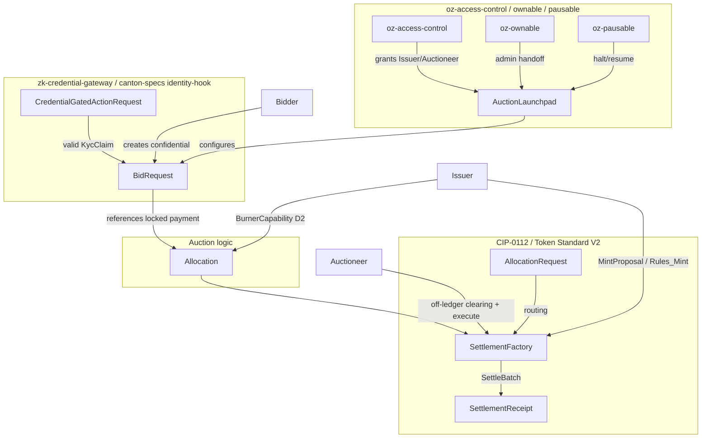

# Architectural Overview Report: Confidential Auction Launchpad on Canton

Status: **reviewed reference-design report**, non-public, outside the committed
M1 public-library surface. This is RI #4 of four — see the suite-level view in [`00-portfolio.md`](./00-portfolio.md)
and the index [`README.md`](./README.md). It describes a *reference design* grounded in the
real OpenZeppelin Canton components in this workspace; it is **not** a claim of
M1/M4 acceptance, conformance, audit readiness, or production readiness.

> **Google Docs import:** `File → Open` this `.md` in Docs (or paste with
> `Edit → Paste`). H1/H2/H3 headings drive the Docs outline pane; the tables
> import cleanly; apply a monospace paragraph style to fenced code blocks after
> import. Mermaid blocks do not render in Docs — render them with
> `canton-settlement-explorer` and paste the image, keeping the fenced source.

> **Source-grounding tags** (used throughout):
> `[IMPLEMENTED]` real code in the M1 library base (`canton-specs` /
> `canton-contracts`) · `[EVIDENCE]` real code in an evidence repo
> (`canton-token-template`, `canton-stablecoin`, `zk-credential-gateway`), not
> the M1 surface · `[UPSTREAM]` Splice / CIP reference, not vendored here ·
> `[FUTURE]` proposed RI-level design, not built in M1 scope.

> **Design priority order** governs every interface and snippet, in this exact
> order: **1) Readability → 2) Simplicity → 3) Security → 4) Auditability.**

> **Grant alignment** (source of truth:
> [`../research/canton-ecosystem-grant-proposal.md`](../research/canton-ecosystem-grant-proposal.md),
> scope lock: [`../../M4_AUCTION_SCOPE.md`](../../M4_AUCTION_SCOPE.md)): this is
> **RI #4 (Confidential Auction Launchpad)**. This document is the **Architecture
> Documentation** deliverable, authored in **grant M1** (research & design) for
> the **implementation** in **grant M4** (Q4 2026, end Year 1, alongside RI 3).
> Companion deliverables — working reference code, demo front-end, threat model
> — are **named here but delivered in M4** (MIT-licensed). The report honors the
> **CIP-56 → CIP-0112 / Token Standard V2 retarget**.

---

## 1. Product Definition

The Confidential Auction Launchpad is a reference implementation for
institutional, regulated, confidential token distribution (ICOs) on Canton. It
leverages Canton's sub-transaction privacy and the **CIP-0112 / Token Standard
V2 settlement spine** `[IMPLEMENTED]` to establish a **sealed-bid** environment
**by protocol design** rather than cryptographic obfuscation: bids, allocations,
and settlement details are visible only to explicitly authorized parties via
native ledger projection.

### 1.1 Educational Framing: Sealed-bid via projection, not commit-reveal

On public ledgers, sealed-bid auctions use a commit-reveal pattern: publish a
hash of the bid to a globally visible mempool/ledger, then reveal the plaintext
later — adding UX friction, non-revelation risk, and exposure to metadata/timing
analysis. On Canton, privacy is **per-party projection**: a contract is visible
only to its signatories/observers, and a `BidRequest` with `signatory bidder,
observer auctioneer` materializes only on those two parties' nodes. The
synchronizer's sequencer orders the transaction by its confirmation-tree shape
but does not see the bid plaintext, so the sealed-bid property is achieved
without commit-reveal and front-running is structurally prevented. If an
institution wants protection against the auctioneer too, a commit-reveal hash
can be layered onto `BidRequest` as a non-breaking SCU extension — but native
projection privacy suffices for the stated scope.

### 1.2 In-Scope vs. Out-of-Scope

The bias favors a clean, singular sealed-bid core over expansive market
mechanics.

| Feature Category | In-Scope |
|---|---|
| Auction mechanism | Single-round **sealed-bid**; first-price default, second-price as a parameterization computed by the auctioneer's off-ledger pricing engine. |
| Confidentiality | Bid isolation via per-party projection — bidder, issuer/auctioneer, and the credential verifier only; no bidder projects competitor bids. |
| Escrow | Locked escrow via `LockedSimpleHolding` / `Allocation`; funds cryptographically bound to the settlement outcome. |
| Atomic settlement | Token-for-payment exchange **only** via `SettlementFactory_SettleBatch` (atomic DvP, single transaction). |
| Access gating | Credential-gated participation via `zk-credential-gateway` (`CredentialGatedActionRequest`, `MockVerificationResult`). |
| Authority | Single-admin capability via `oz-access-control` (mint/burn/seizure). |
| Compliance | D1 node-applied checks (Shape B) on every settlement leg, fail-closed. |

| Feature Category | Out-of-Scope (Excluded) |
|---|---|
| Continuous issuance | Streaming launches, continuous funding, persistent issuance — discrete finalized rounds only. |
| Algorithmic pricing | Bonding curves, dynamic-price Dutch auctions (settlement spine could host them later, not core). |
| Secondary market | AMM / order-book / post-auction liquidity — that is the DEX RI. |
| Derivatives & synthetics | Options/futures/synthetics of the launched token. |
| On-ledger clearing math | Sorting/clearing runs **off-ledger**; only finalized, conservation-sound match legs settle on-ledger. |

### 1.3 Target Users

Institutional asset issuers, regulated launchpad operators, and accredited
investors in compliant jurisdictions. Issuers get fair distribution free of
front-running / bid manipulation / MEV, with KYC/AML/accreditation enforced via
`zk-credential-gateway`. Bidders get confidentiality of intent, atomic
return-to-sender for losing bids (no counterparty credit risk), and capital that
can move only per their signed `AllocationInstruction`.

---

## 2. Architecture Overview

Strictly modular: access control, asset semantics, auction logic, and terminal
settlement are distinct layers, so the settlement spine stays sealed while
auction mechanics can be upgraded or substituted.

### 2.1 Component Utilization

- **Authority** — `oz-access-control` `[IMPLEMENTED]` (`RoleGrant`, `RoleAdmin`,
  `DefaultAdminTransferOffer`, `requireRole`; `roleId : MyRole -> Text`
  closed-sum wrapper) for Issuer/Auctioneer roles; `oz-ownable` `[IMPLEMENTED]`
  (`Ownership`/`OwnershipOffer`) for two-step handoff; `oz-pausable`
  `[IMPLEMENTED]` (`PauseState`/`whenNotPaused`) for the emergency halt.
- **Settlement spine** — `OpenZeppelin.Experimental.Settlement.Cip112`
  `[IMPLEMENTED]` (`SettlementFactory`, `AllocationRequest`,
  `AllocationInstruction`, `Allocation`, `SettlementReceipt`). Atomic DvP routes
  **only** through `SettlementFactory_SettleBatch`; direct `Allocation_Settle` is
  bypassed for the exchange (it proves authorization, not multi-party atomic
  co-settlement).
- **Assets** — `canton-token-template` `[EVIDENCE]` (`SimpleHolding`,
  `LockedSimpleHolding`, `SimpleTokenRules` 3-way dispatch); the launched token
  is minted via `Rules_Mint` / `MintProposal` (cold recipient → propose →
  accept, honoring Canton co-authorization). `canton-stablecoin`'s `Vault` /
  `VaultFactory` / `Vault_Liquidate` / `PriceOracle` are **excluded** (CDP
  mechanics, not primary issuance).
- **Compliance/identity** — `zk-credential-gateway` `[EVIDENCE]`
  (`CredentialGatedActionRequest`, `MockVerificationResult`,
  `CredentialRevocationStatus`); typed D3 `KycClaim` + `TrustedIssuerRegistry`
  from the `canton-specs` identity-hook Shape-B experiment `[IMPLEMENTED]`.

> **Attribution note:** `KycClaim` / `TrustedIssuerRegistry` are
> `canton-specs` identity-hook-shape-b types, **not** `zk-credential-gateway`
> templates. The gateway supplies the gating/verification primitives.

### 2.2 Party and Role Topology

- **Operator** — deploys the launchpad contracts and manages the
  `SettlementFactory`; operational, not financial, authority.
- **Issuer** — launches the token; single-admin authority; holds the
  `BurnerCapability` (D2 seizure) and authorizes `Rules_Mint` via `MintProposal`.
- **Auctioneer** — delegated by the Issuer via `RoleGrant`; observes
  `BidRequest`s, runs the off-ledger clearing engine, and builds the
  `SettleBatch` payload; cannot misdirect funds (constrained by the spine's
  conservation invariants).
- **Bidder** — needs a valid `KycClaim` from a `TrustedIssuerRegistry`; retains
  control of payment assets until atomic settlement.
- **Verifier** — off-chain compliance entity; issues a `MockVerificationResult`
  attesting credential validity, green-lighting participation.

### 2.3 Trust and Topology

Each contract configures the nodes that validate it. The `BidRequest`'s
`signatory bidder, observer auctioneer` definition routes its data only to those
parties' nodes, shielding bids from the network. Daml-LF 2.1 is keyless
(archive-and-recreate, not in-place mutation), and any new signatory must
co-authorize — so the Auctioneer cannot push a minted token into a Bidder's
wallet: the Issuer creates a `MintProposal` and the Bidder actively accepts it.
Synchronizer sequencers order transactions by confirmation-tree shape while
remaining blinded to bid plaintext, eliminating sequencer front-running / MEV.

---

## 3. How We Implement It

An invariant-bound lifecycle: configuration + gating → confidential bidding →
off-ledger clearing → atomic on-ledger settlement.

### 3.1 The Settlement-Spine Flow

1. **Configuration + access gating.** The Issuer instantiates `AuctionLaunchpad`
   (payment instrument id, launched instrument id, the `SettlementFactory`
   reference, the governing `TrustedIssuerRegistry`) and delegates the Auctioneer
   role via `RoleGrant`.
2. **Credential verification.** The Bidder obtains a `KycClaim` and submits a
   `CredentialGatedActionRequest`; the Verifier issues a `MockVerificationResult`
   on-ledger, unlocking participation.
3. **Escrow + confidential bid.** The Bidder commits payment capital by creating
   an `AllocationInstruction` (via `SettlementFactory_CreateAllocationInstruction`)
   and accepting it (`AllocationInstruction_Accept`), producing a committed
   `Allocation` that locks the funds under the Bidder's authority while
   delegating settlement execution to the `SettlementFactory`. Simultaneously the
   Bidder creates a `BidRequest` (`signatory bidder, observer auctioneer`)
   carrying the `Allocation` reference, bid amount, and price — projected only to
   bidder and auctioneer.
4. **Closure + clearing.** The Auctioneer halts new submissions via `oz-pausable`
   (`PauseState`), queries its node for active `BidRequest`s, and runs the
   off-ledger clearing engine to determine the clearing price, winners, and exact
   asset routing.
5. **Atomic co-settlement.** For each winner the Auctioneer creates token
   `AllocationInstruction`s (token minted/transferred from the Issuer's treasury
   holding) and builds the final batch — winners' payment `Allocation`s + the
   Issuer's token `Allocation`s + the routing legs — then submits a single
   `SettlementFactory_SettleBatch`. The factory validates conservation (payment
   in = payment owed; tokens out = tokens owed) and runs the D1 hooks; on success
   it commits atomically, delivering tokens to bidders, payment to the Issuer,
   and `SettlementReceipt`s.
6. **Return to sender (losing bids).** The Auctioneer archives losing
   `BidRequest`s and cancels the corresponding payment `Allocation`
   (`Allocation_Cancel` / `_Withdraw`), releasing the lock back to the bidder.
   This honors the D2 rule: non-matching bids **return to sender** — never seized
   or burned by the launchpad.

### 3.2 D1 Compliance: Shape B node attestation

Compliance is checked on **every** settlement leg, **fail-closed**,
**node-applied** — no on-ledger caching. The RI uses **Shape B** (signed node
attestation) over Shape A (off-ledger gate): the optional `D1ComplianceHook` on
`SettleBatch` requires fresh, cryptographically signed attestations from the
relevant compliance nodes; if any are missing/expired/invalid, the entire batch
fails. *(Open, non-blocking: contract-oblivious vs on-ledger attestation
verification.)*

### 3.3 D2 Seizure: lock-and-sweep

Seizure is isolated from the auction flow and gated by the single-admin
`BurnerCapability`. It is **not** a burn: a targeted `Allocation` / holding is
swept to an admin-**preset** `custodianDestination`, via the real spine
mechanism (`Allocation_MarkD2InFlightSeizure` → `Allocation_SweepD2InFlightSeizure`
for in-flight allocations; `LockedSimpleHolding_ForcedBurn` to the custodian for
locked holdings). The spine's `D2SeizureHook` is a config **data record**
(`seizureCaseRef`, `custodianDestination`, `inFlightHandlingStatus`), not an
invokable template. Value is preserved; chain of custody is maintained; nothing
is returned to a flagged sender (ordinary transfer *failures* do return to
sender).

### 3.4 SCU upgrade rule + D3 forward compatibility

Never mutate an existing choice's args to require a new field; extend via
`Optional` fields, new types, and new choices. D3 today is single-domain v1
(`TrustedIssuerRegistry` + `KycClaim`). To add cross-domain identity
(ONCHAINID / ERC-3643 / CCID) later: define a new `CrossDomainIdentity` type,
append `crossDomainRef : Optional CrossDomainIdentity` to `BidRequest`, and add a
**new** choice `BidRequest_UpdateIdentity` (archive + recreate with the field
populated). Legacy bid choices stay untouched and functional. This is the
additive path proven in the `canton-specs` identity-hook upgrade spike.

---

## 4. Interfaces & Usage Examples

Names map to real workspace components; RI-level templates are tagged
`[FUTURE]`. Imports use real module names (`OpenZeppelin.AccessControl`,
`OpenZeppelin.Pausable`, `OpenZeppelin.Experimental.Settlement.Cip112`).

### 4.1 Access control `[FUTURE]`

```daml
module ConfidentialAuction.AccessControl where

import OpenZeppelin.AccessControl (RoleGrant, requireRole)

data AuctionRole = IssuerRole | AuctioneerRole deriving (Eq, Show)

roleId : AuctionRole -> Text
roleId IssuerRole     = "ISSUER"
roleId AuctioneerRole = "AUCTIONEER"
```

### 4.2 Launchpad configuration `[FUTURE]`

```daml
module ConfidentialAuction.Launchpad where

import OpenZeppelin.Pausable (PauseState, whenNotPaused)
import OpenZeppelin.Experimental.Settlement.Cip112 (SettlementFactory)

template AuctionLaunchpad
  with
    operator : Party
    issuer : Party
    paymentInstrumentId : Text
    launchedInstrumentId : Text
    settlementFactoryCid : ContractId SettlementFactory
    pauseStateCid : ContractId PauseState     -- oz-pausable kill-switch
    minBidPrice : Decimal
  where
    signatory operator, issuer
    ensure (minBidPrice > 0.0)
    -- Halt/resume route through oz-pausable PauseState_Set (controller = issuer,
    -- validated via requireRole IssuerRole), not via a mutated local flag.
```

### 4.3 Confidential bid + policy guards `[FUTURE]`

```daml
module ConfidentialAuction.Bid where

import OpenZeppelin.Experimental.Settlement.Cip112 (Allocation)

template BidRequest
  with
    bidder : Party
    auctioneer : Party
    launchpadCid : ContractId AuctionLaunchpad
    paymentAllocationCid : ContractId Allocation
    bidAmount : Decimal
    bidPrice : Decimal
    maxAllocationCap : Decimal
    -- SCU additive extension point for deferred D3 cross-domain identity.
    crossDomainRef : Optional Text
  where
    -- CONFIDENTIALITY boundary: only bidder + auctioneer project this contract.
    signatory bidder
    observer auctioneer

    -- Policy guard: integrity + per-investor cap.
    ensure (bidAmount > 0.0 && bidPrice > 0.0 && bidAmount <= maxAllocationCap)

    -- D2 / return-to-sender: bidder withdraws before clearing; the real spine
    -- choice unlocks and returns the funds (no auctioneer action needed).
    choice BidRequest_Cancel : ContractId Allocation
      controller bidder
      do exercise paymentAllocationCid Allocation_Withdraw
```

### 4.4 Atomic settlement via the spine `[FUTURE]`

```daml
module ConfidentialAuction.Clearing where

import OpenZeppelin.Experimental.Settlement.Cip112
  (SettlementFactory, SettlementFactory_SettleBatch, Allocation, AllocationRequest)

template AuctionClearing
  with
    auctioneer : Party
    launchpadCid : ContractId AuctionLaunchpad
  where
    signatory auctioneer

    choice Clearing_ExecuteBatch : [ContractId SettlementReceipt]
      with
        settlementFactoryCid : ContractId SettlementFactory
        paymentAllocations : [ContractId Allocation]      -- winners' locked payment
        tokenAllocations : [ContractId Allocation]         -- issuer's token side
        requests : [ContractId AllocationRequest]          -- routing legs (bidders ↔ tokens)
      controller auctioneer
      do
        -- Single atomic DvP. If any D1ComplianceHook fails on any leg, or the
        -- math violates conservation, the whole batch fails-closed.
        exercise settlementFactoryCid SettlementFactory_SettleBatch with
          allocations = paymentAllocations ++ tokenAllocations
          requests = requests
          -- nextIterationFunding empty: terminal single-round settlement.
```

---

## 5. Diagrams

Validatable with `canton-settlement-explorer`. Render externally for Docs.

### 5.1 Interface and Component Diagram



### 5.2 Flow-of-Funds and Settlement Sequence


---

## 6. Library Dependencies

### 6.1 Internal Dependencies

| Package | Consumed Templates / Interfaces | Role | Tag |
|---|---|---|---|
| `oz-access-control` | `RoleGrant`, `RoleAdmin`, `DefaultAdminTransferOffer`, `requireRole` | Authority model; closed-sum `roleId` checks. | `[IMPLEMENTED]` |
| `oz-ownable` | `Ownership`, `OwnershipOffer` | Secure admin handoff. | `[IMPLEMENTED]` |
| `oz-pausable` | `PauseState`, `whenNotPaused` | Circuit breaker (halt the sale). | `[IMPLEMENTED]` |
| `canton-token-template` | `SimpleHolding`, `LockedSimpleHolding`, `SimpleTokenRules`, `TransferPreapproval`, `RoleCapability`, `MintProposal`, `Rules_Mint` | Asset structure, 3-way dispatch, cold-recipient mint. | `[EVIDENCE]` |
| `canton-stablecoin` | (none consumed; `Vault`/`VaultFactory`/`Vault_Liquidate`/`PriceOracle` **excluded** — CDP, not issuance) | Referenced for contrast only. | `[EVIDENCE]` |
| `zk-credential-gateway` | `CredentialGatedActionRequest`, `MockVerificationResult`, `CredentialRevocationStatus` | D1/D3 credential gating. | `[EVIDENCE]` |
| `canton-specs` identity-hook Shape-B | `KycClaim`, `TrustedIssuerRegistry` | Typed D3 identity, layered via SCU. | `[IMPLEMENTED]` (experimental) |
| `OpenZeppelin.Experimental.Settlement.Cip112` | `SettlementFactory`, `AllocationRequest`, `AllocationInstruction`, `Allocation`, `SettlementReceipt`, `BurnerCapability`, `D1ComplianceHook`, `D2SeizureHook` | Atomic DvP spine; D1/D2 seams. | `[IMPLEMENTED]` (experimental) |

### 6.2 External Dependencies (Splice Token Standard V2)

Built against the CIP-0112 / Splice Token Standard V2 **interfaces** `[UPSTREAM]`,
ignoring DAR/package-ID pins in favor of local stand-ins designed to **maximally
match the V2 interfaces**. Source-of-record pin: `hyperledger-labs/splice` @
`token-standard-v2-upcoming` @ `1e34121b…` (historical preview `…-daml-preview`
@ `b91de5d4…`; DARs + checksums in
`canton-token-template/docs/CIP-0112-EXTENSION-PLAN.md`). Import remains gated
(PLAN.md; `M4_AUCTION_SCOPE.md` §A); no public-API stability / conformance /
release claim. `nextIterationFunding` is present in the standard but **disabled**
here (single-round); it is the extension point for multi-round / bonding-curve
variants.

---

## 7. Security & Auditability

### 7.1 Threat Model and Invariants

| Threat | Mechanism | Mitigation |
|---|---|---|
| Privacy leakage / metadata front-running | Adversaries monitor a public mempool to front-run bids. | Canton has no public mempool; per-party projection keeps the `BidRequest` payload off the network; the sequencer sees the confirmation-tree shape, not contents; blast radius is bounded by a node's authorized visibility. |
| Unauthorized seizure / unilateral burn | Compromised admin attempts to burn or redirect escrow. | D2 gated by the single `BurnerCapability`; failure never defaults to seizure — a failed `SettleBatch` leaves funds in their `Allocation`, returned to sender. |
| Auctioneer embezzlement at settlement | Auctioneer manipulates routing to redirect payments. | `AllocationRequest`/leg routing is explicit; `SettlementFactory` enforces conservation at the Daml level — net outflow cannot exceed allocation and destinations must match the counter-signed routing; violating transactions are rejected. |

**Invariants:** (a) **conservation** — `SettleBatch` cannot output more value
than its input `Allocation`s (sum in = sum out + change); (b) **confidentiality**
— bid amount/parties are projected only to bidder, auctioneer, and the
designated verifier.

### 7.2 Validation Ladder

| Tier | Tooling | Purpose |
|---|---|---|
| Static analysis | `daml-lint` | Anti-patterns, decimal bounds, archive-before-execute; enforces the SCU `Optional`-append rule (no breaking field changes) and the `roleId` wrapper. |
| Generative testing | `daml-props` | Property-based fuzzing of `SettleBatch` over randomized `Allocation`/`BidRequest` shapes; attempts to force a conservation violation or orphaned-asset state. |
| Formal verification | `daml-verify` | Z3 proofs: no transition projects a `BidRequest` onto an unauthorized party; the D1 hook cannot be bypassed in the final confirmation tree. |

(Tooling exists in the workspace; no benchmark latencies are claimed.)

### 7.3 D1–D4 Mapping

- **D1** — `D1ComplianceHook`, Shape B signed node attestation every leg,
  fail-closed.
- **D2** — `D2SeizureHook` config + `BurnerCapability`-gated lock-and-sweep to a
  preset custodian; no burn; losing bids return to sender.
- **D3** — `zk-credential-gateway` + Shape-B `KycClaim` before bid acceptance;
  cross-domain deferred, SCU-forward-compatible.
- **D4** — `oz-access-control` single-admin capability for M1; multi-sig → M3.

---

## 8. Cross-Synchronizer Domain Extension (Planned) `[FUTURE]`

> **Shared model:** the cross-synchronizer mechanism (per-synchronizer
> assignment + unassign/assign reassignment, and the SCU-compliant additive
> path) is identical across all four RIs and is owned in
> [`00-portfolio.md`](./00-portfolio.md) §5. This section elaborates only the
> RI-specific topology.

> **Status: out of scope for the initial M1 design; deferred and planned.** The
> auction and the CIP-0112 scaffold are **single-synchronizer** today; D3
> cross-domain identity is deferred. This section plans multi-synchronizer
> operation per Canton's per-synchronizer assignment + unassign/assign
> reassignment model and the SCU rule.

### 8.1 What changes

A cross-synchronizer launchpad is not one global auction. The `AuctionLaunchpad`,
each `BidRequest`, and the bidders' payment `Allocation`s may sit on different
synchronizers; clearing settlement requires reassigning the winning legs onto one
synchronizer before `SettleBatch`.

### 8.2 Where it touches the boundary

| Element | Single-synchronizer (today) | Cross-synchronizer (planned) |
|---|---|---|
| `BidRequest` | Bidder + auctioneer on one synchronizer. | Bid may originate on a bidder's home synchronizer; the auctioneer must be reachable there or the bid reassigned for clearing. |
| Payment / token `Allocation` | Created and settled on the launchpad's synchronizer. | Reassignable: winning bids' payment allocations unassigned and assigned to the settling synchronizer before `SettleBatch`. |
| D1 compliance | Node-side on the settling synchronizer. | Re-evaluated on whichever synchronizer the leg settles; no cross-domain attestation reuse. |
| D3 identity | Single-domain `KycClaim`. | Cross-domain proof (ONCHAINID / ERC-3643 / CCID) into a synchronizer-aware `TrustedIssuerRegistry` — deferred D3 work. |

### 8.3 The additive, non-breaking path (SCU-compliant)

1. Append `Optional SynchronizerScope` to the RI templates (`AuctionLaunchpad`,
   `BidRequest`); older contracts read `None`.
2. Add a new parallel choice (e.g. `Clearing_ExecuteBatchCrossDomain`) alongside
   the unchanged single-synchronizer clearing choice.
3. Model reassignment as workflow: reassign winning allocations onto the
   settling synchronizer → `SettleBatch` there → reassign token/receipts back.
   Atomicity stays at the single-synchronizer batch boundary; **losing-bid
   return-to-sender** must also work across the reassignment.

### 8.4 Open questions specific to cross-synchronizer operation

- Reassignment-vs-settlement atomicity (rollback vs re-home-able allocation on
  `SettleBatch` failure), and how it composes with losing-bid return-to-sender.
- Which synchronizer's `TrustedIssuerRegistry`/verifier set governs a
  cross-domain bidder.
- Cross-domain D1 freshness (re-check on the settling synchronizer).
- Reassignment tooling maturity (evolving Canton/DA stack; assumes drop-in).

---

## 9. Open Questions

- **Iterated-settlement extensions.** `nextIterationFunding` is disabled in this
  single-round design. Adapting it for continuous bonding curves / multi-round
  Dutch auctions requires formalizing how conservation is enforced over many
  fragmented iterations without race-condition / double-spend exposure.
- **D3 identity schema finalization.** The future `CrossDomainIdentity` payload
  and attribute mapping (ERC-3643 / ONCHAINID equivalents → Canton) depend on
  components not yet present; the SCU rule guarantees additive layering, but the
  industry schema is still open.
- **Validator-node thresholds for D1 Shape B.** The Confirming-Participant-Node
  threshold for compliance attestations must be issuer-specified, balancing
  availability against cryptographic security.
- **Cross-synchronizer operation** (see §8) — deferred; tracked there.
- **Composability with the other RIs** (forward-compatibility; suite view
  [`00-portfolio.md`](./00-portfolio.md) §3): post-auction secondary trading is
  the DEX RI ([`01`](./01-dex.md)); participants can collateralize bids by
  minting stablecoin in the Lending RI ([`02`](./02-lending.md)). Both compose
  over the shared `SettlementFactory_SettleBatch` spine.

---

## References

All interface, template, choice, and field names are grounded in real source in
this workspace (verified 2026-06-24).

- **Settlement spine** `[IMPLEMENTED]` —
  `canton-specs/experiments/cip112-settlement/daml/OpenZeppelin/Experimental/Settlement/Cip112.daml`.
- **Holdings / rules / mint / preapproval / capability** `[EVIDENCE]` —
  `canton-token-template/simple-token/daml/SimpleToken/{Holding,Rules,Preapproval}.daml`
  (`SimpleHolding`, `LockedSimpleHolding` + `_ForcedBurn`, `SimpleTokenRules`,
  `Rules_Mint`, `MintProposal`, `RoleCapability`).
- **Credential gating / verification** `[EVIDENCE]` —
  `zk-credential-gateway/daml/src/ZkCredentialGateway/{GatedAction,Verification,Types}.daml`.
- **Typed D3 identity (KycClaim, TrustedIssuerRegistry)** `[IMPLEMENTED]` —
  `canton-specs/experiments/identity-hook-shape-b/` and `identity-hook-upgrade-*/`.
- **AL-7 primitives** `[IMPLEMENTED]` — `canton-specs` `access-control/`,
  `ownable/`, `pausable/`.
- **Decision authority (D1–D4), scope, SCU rule** — root
  [`PLAN.md`](../../PLAN.md), [`AGENTS.md`](../../AGENTS.md), briefing
  [`docs/research/RI_RESEARCH_BRIEFING.md`](../research/RI_RESEARCH_BRIEFING.md).
- **Grant scope / milestones / deliverables (source of truth)** —
  [`docs/research/canton-ecosystem-grant-proposal.md`](../research/canton-ecosystem-grant-proposal.md)
  (PR #298, approved; CIP-56→CIP-0112 retarget) and the distilled
  [`M4_AUCTION_SCOPE.md`](../../M4_AUCTION_SCOPE.md).
- **Token Standard V2 upstream** `[UPSTREAM]` — `hyperledger-labs/splice`
  `token-standard-v2-upcoming` (import gated per PLAN.md).

> **Removed in review:** the original draft cited external/non-workspace URLs
> (iq.wiki, Halborn blog posts, the Canton white paper / digitalasset.com docs,
> `cantonecosystem.com`, `srikanth-bitdynamics` GitHub, and — erroneously — an
> unrelated 2003 software-engineering workshop paper on mediaTUM) as
> authoritative sources. None are part of this workspace or an authoritative
> spec; they were removed and replaced with the workspace-grounded references
> above. See the review record in
> [`../reviews/2026-06-24T23-05-38Z_REVIEW.md`](../reviews/2026-06-24T23-05-38Z_REVIEW.md).
