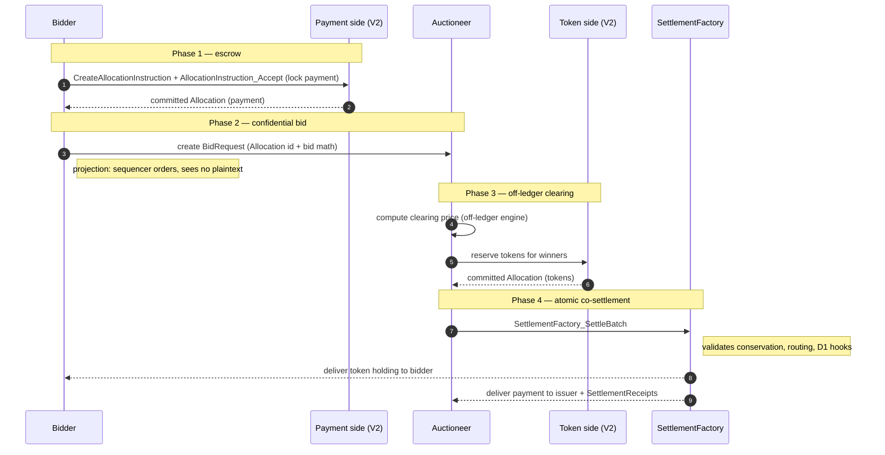

# Architectural Overview Report: Confidential Auction Launchpad on Canton

Status: **reference-design report.** It describes a *reference design* grounded
in the real OpenZeppelin Canton components in this workspace; it is **not** a
claim of acceptance, conformance, audit readiness, or production readiness.

> **Source-grounding tags** (throughout): `[IMPLEMENTED]` real code in the M1
> library base ([`canton-specs`](https://github.com/OpenZeppelin/canton-specs) /
> [`canton-contracts`](https://github.com/OpenZeppelin/canton-contracts)) ·
> `[EVIDENCE]` real code in an evidence repo
> ([`canton-token-template`](https://github.com/OpenZeppelin/canton-token-template),
> [`canton-stablecoin`](https://github.com/OpenZeppelin/canton-stablecoin)) ·
> `[UPSTREAM]` Splice / CIP reference, not vendored here · `[FUTURE]` proposed
> RI-level design, not built in M1.
>
> **Design priority order** (governs every interface and snippet):
> **1) Security → 2) Simplicity → 3) Readability → 4) Auditability.**

This is the architecture documentation for a **Confidential Auction Launchpad** on
the CIP-0112 / Token Standard V2 settlement spine `[IMPLEMENTED]` — institutional,
regulated, confidential token distribution (ICOs). Bids, allocations, and settlement
details are visible only to explicitly authorized Parties via native ledger
projection: a **sealed-bid** environment by protocol design, not cryptographic
obfuscation. Companion code, demo front-end, and threat model are out of scope.

---

## 1. Product Definition

### Who this is for, and what they expect

The design starts from the Canton Network stakeholders and the guarantees they
expect from a regulated primary-issuance venue. Those expectations — not an
auction feature list — drive every choice in this document.

| Stakeholder | What they expect | Design consequence |
|---|---|---|
| **Institutional asset issuer** | Fair distribution, free of front-running, bid manipulation, and MEV. | No public mempool; bids sealed by per-Party projection ([design model below](#the-canton-design-model-these-expectations-assume)); the sequencer sees the confirmation-tree shape, not the bid plaintext. |
| **Regulated launchpad operator** | KYC/AML/accreditation enforced on the settlement path, fail-closed. | D1 node-applied checks per settlement leg, engaged by the optional `D1ComplianceHook` ([D1 compliance](#d1-compliance-node-applied-attestation-shape-b)). |
| **Accredited investor / bidder** | Confidential intent; capital moves only on their signed instruction; losing bids come back. | Escrow is the bidder's own committed `Allocation`; losing bids return to sender ([the settlement-spine flow](#the-settlement-spine-flow)); no counterparty credit risk. |
| **Issuer as auctioneer** | Run clearing without the ledger dictating market structure. | Clearing runs off-ledger; the ledger binds only conservation and price bounds — the trust limitation stated in [the central trust limitation](#the-central-trust-limitation-the-auctioneer). |
| **Auditor** | Explicit authority boundaries; value cannot be stolen. | Single-admin authority (D4); leg-authorization and conservation invariants enforced on-ledger ([§7.1](#71-threat-model-and-invariants)). |

### The Canton design model these expectations assume

Three Canton facts shape the whole design; stated once here, referenced
throughout:

- **Party is the actor.** Signatories, observers, controllers, and executors are
  **Parties**, each hosted on one or more participant nodes. "Who may do X" is
  always a Party question; backend endpoints are scoped to Party access.
- **Per-Party projection is the sealed-bid privacy model.** A contract is visible
  only to its stakeholder Parties. A `BidRequest` declared `signatory bidder,
  observer auctioneer` projects only to those two Parties; the synchronizer's
  sequencer orders the transaction by its confirmation-tree shape but never sees
  the bid plaintext. The sealed-bid property is thus **structural** — no public
  mempool, no commit-reveal, front-running prevented by construction.
- **Daml is keyless.** State changes by archive-and-recreate, and a Party cannot be
  made a signatory without actively authorizing the transition that adds it — so
  two-step handshakes (e.g. the Issuer's `MintProposal` that a Bidder accepts) are a
  necessity, not a style choice.

*(For readers from public ledgers: a sealed-bid auction there needs commit-reveal —
publish a bid hash, reveal later — with its friction and non-revelation risk;
per-Party projection removes the need for it.)*

### The central trust limitation: the auctioneer

Clearing runs **off-ledger by a fully trusted auctioneer that sees every bid.** The
design therefore delivers **confidential bid *submission*** (bids hidden from
competitors and from the sequencer by per-Party projection) but does **not**
deliver:

- **auctioneer honesty** — a malicious or compromised auctioneer that observes all
  bids can favor a colluding bidder, leak bids, or compute a dishonest clearing
  price;
- **a verifiable pricing rule** — the rule selecting the uniform clearing price is
  an off-ledger computation; the ledger checks only the price bounds
  (`>= minBidPrice`, `<=` each winner's `bidPrice`);
- **ledger-enforced allocation fairness** — the conservation / leg-authorization
  invariants prevent value *theft* (no leg settles that a Party did not sign) but
  not *unfair allocation* at a sound clearing price.

This is acceptable where the issuer *is* the auctioneer and bidders trust its
clearing, and is a real improvement over a public mempool. Removing this trust via
verifiable clearing is [Q1](#9-open-design-questions).

> **Decision (July 2026, internal review).** M1 keeps clearing **off-ledger by the
> trusted auctioneer**, matching the
> [Canton dev-fund proposal](https://github.com/canton-foundation/canton-dev-fund/blob/main/proposals/2026-04-OpenZeppelin-canton-ecosystem-stack.md)
> scope (the initial implementation is explicitly off-chain there). Migrating
> clearing on-ledger (verifiable clearing) is a **future exploration** within the
> agreement, not an M1 item.

### Scope

Scope favors a single sealed-bid core over expansive market mechanics.

| In scope | Detail |
|---|---|
| Auction mechanism | Single-round **sealed-bid** at a **uniform clearing price**; the rule selecting that price (e.g. lowest accepted, highest rejected bid) is an off-ledger parameter of the auctioneer's engine. |
| Confidentiality | Bid isolation via per-Party projection — bidder, issuer/auctioneer, verifier only; no bidder projects competitor bids. |
| Escrow | Locked escrow via `LockedSimpleHolding` / `Allocation`; funds bound to the settlement outcome by the ledger's authorization rules. |
| Atomic settlement | Token-for-payment exchange **only** via [`SettlementFactory_SettleBatch`](../../experiments/cip112-settlement/daml/OpenZeppelin/Experimental/Settlement/Cip112.daml#L249) (atomic DvP, single transaction). |
| Access gating | Credential-gated participation via `credential-gateway` (`CredentialGatedActionRequest`, `MockVerificationResult`). |
| Authority | Single-admin capability via `oz-access-control` (mint/burn/seizure). |
| Compliance | D1 node-applied checks (Shape B), fail-closed — intended posture, engaged by the optional `D1ComplianceHook` / typed attestation path ([D1 compliance](#d1-compliance-node-applied-attestation-shape-b)). |

| Out of scope | Reason |
|---|---|
| Continuous issuance | Streaming launches / continuous funding — discrete finalized rounds only. |
| Algorithmic pricing | Bonding curves, dynamic-price Dutch auctions (the spine could host them later; not core). |
| Secondary market | AMM / order-book / post-auction liquidity is the DEX RI. |
| Derivatives & synthetics | Options / futures / synthetics of the launched token. |
| On-ledger clearing math | Sorting/clearing runs **off-ledger**; only finalized, conservation-sound match legs settle on-ledger. |

### Positioning

The differentiation is institutional posture in the settlement layer: bids private
by construction, compliance on the settlement path, and value moving only on the
standardized V2 spine (any V2 asset lists without bespoke integration). It composes
with the rest of this suite over one spine ([Q12](#9-open-design-questions)).

---

## 2. Architecture Overview

Strictly modular: access control, asset semantics, auction logic, and terminal
settlement are distinct layers, so the settlement spine stays sealed while auction
mechanics can be upgraded or substituted.

### Core components and library mapping

| Component suite | Templates / libraries | Function |
|---|---|---|
| Access Control `[IMPLEMENTED]` | `oz-access-control`: [`RoleGrant`](../../access-control/daml/OpenZeppelin/AccessControl.daml), `RoleAdmin`, `DefaultAdminTransferOffer`, [`requireRole`](../../access-control/daml/OpenZeppelin/AccessControl.daml) (`roleId : MyRole -> Text` closed-sum wrapper) | Issuer / Auctioneer roles; the wrapper prevents role collision across administrative scopes. |
| Ownership `[IMPLEMENTED]` | `oz-ownable`: [`Ownership`](../../ownable/daml/OpenZeppelin/Ownable.daml), [`OwnershipOffer`](../../ownable/daml/OpenZeppelin/Ownable.daml) | Two-step admin handoff (D4). |
| Venue constraint `[IMPLEMENTED]` | `oz-pausable`: [`PauseState`](../../pausable/daml/OpenZeppelin/Pausable.daml), [`whenNotPaused`](../../pausable/daml/OpenZeppelin/Pausable.daml) | Emergency halt of the sale. |
| Settlement spine `[IMPLEMENTED]` | `Cip112`: [`SettlementFactory`](../../experiments/cip112-settlement/daml/OpenZeppelin/Experimental/Settlement/Cip112.daml#L191), [`AllocationRequest`](../../experiments/cip112-settlement/daml/OpenZeppelin/Experimental/Settlement/Cip112.daml#L322), [`AllocationInstruction`](../../experiments/cip112-settlement/daml/OpenZeppelin/Experimental/Settlement/Cip112.daml#L379), [`Allocation`](../../experiments/cip112-settlement/daml/OpenZeppelin/Experimental/Settlement/Cip112.daml#L474), [`SettlementReceipt`](../../experiments/cip112-settlement/daml/OpenZeppelin/Experimental/Settlement/Cip112.daml#L695) | All asset movement; atomic DvP routes **only** through [`SettlementFactory_SettleBatch`](../../experiments/cip112-settlement/daml/OpenZeppelin/Experimental/Settlement/Cip112.daml#L249). Direct [`Allocation_Settle`](../../experiments/cip112-settlement/daml/OpenZeppelin/Experimental/Settlement/Cip112.daml#L493) proves authorization, not multi-party atomic co-settlement, so it is bypassed for the exchange. |
| Assets `[EVIDENCE]` | `canton-token-template`: `SimpleHolding`, `LockedSimpleHolding`, `SimpleTokenRules` (3-way dispatch); launched token minted via `Rules_Mint` / `MintProposal` `[FUTURE]` | Asset structure and cold-recipient mint (propose → accept). `Rules_Mint`, `MintProposal`, `RoleCapability` are RI-level `[FUTURE]` extensions, **not** in the evidence repo today (consolidated at implementation time, per the RI-03 delegated-accept rule). `canton-stablecoin` `Vault` / `VaultFactory` / `Vault_Liquidate` / `PriceOracle` **excluded** (CDP, not primary issuance). |
| Compliance / identity | [`credential-gateway`](../../experiments/credential-gateway/daml/OpenZeppelin/Experimental/Credential/Gateway.daml) `[IMPLEMENTED]` (experimental): `CredentialGatedActionRequest`, `MockVerificationResult`, `CredentialRevocationStatus`; `canton-specs` identity-hook Shape B `[IMPLEMENTED]` (experimental): `KycClaim`, `TrustedIssuerRegistry` | D1/D3 gating and verification; the gateway supplies the gating/verification primitives, the identity-hook the typed D3 identity shape. |

### Party and role model

- **Operator** — deploys the launchpad contracts and manages the
  `SettlementFactory`; operational, not financial, authority.
- **Issuer** — launches the token; single-admin authority; holds the
  [`BurnerCapability`](../../experiments/cip112-settlement/daml/OpenZeppelin/Experimental/Settlement/Cip112.daml#L98) (D2 seizure) and authorizes `Rules_Mint`
  via `MintProposal` (both `[FUTURE]`, [core components](#core-components-and-library-mapping)).
- **Auctioneer** — delegated by the Issuer via [`RoleGrant`](../../access-control/daml/OpenZeppelin/AccessControl.daml); observes
  `BidRequest`s, runs the off-ledger clearing engine, and builds the `SettleBatch`
  payload; cannot misdirect funds (constrained by the spine's conservation
  invariants).
- **Bidder** — needs a valid `KycClaim` from a `TrustedIssuerRegistry`; retains
  control of payment assets until atomic settlement.
- **Verifier** — off-ledger compliance Party; issues a `MockVerificationResult`
  attesting credential validity, green-lighting participation.

### Trust and topology

Every contract declares which Parties validate it; validation is restricted to the
participant nodes hosting those Parties. The `BidRequest`'s `signatory bidder,
observer auctioneer` therefore projects the bid only to those two Parties — the
sealed-bid model in [the design model](#the-canton-design-model-these-expectations-assume).
Keyless archive-and-recreate means the Auctioneer cannot push a minted token into a
Bidder's wallet: the Issuer creates a `MintProposal` (`[FUTURE]`,
[core components](#core-components-and-library-mapping)) and the Bidder accepts.
Sequencer nodes order transactions by confirmation-tree shape while blinded to bid
plaintext, so there is no sequencer front-running / MEV.

---

## 3. How We Implement It

An invariant-bound lifecycle: configuration + gating → confidential bidding →
off-ledger clearing → atomic on-ledger settlement.

### The settlement-spine flow

1. **Configuration + access gating.** The Issuer instantiates `AuctionLaunchpad`
   (payment / launched instrument ids, `SettlementFactory` reference — full field
   set in [§4.2](#42-launchpad-configuration-future)) and delegates the Auctioneer role via `RoleGrant`. The
   governing `TrustedIssuerRegistry` is **not stored** on the launchpad: it
   archive-and-recreates on membership change, so a stored cid would brick (the same
   hazard as a stored `PauseState` cid). It governs via the step-2 credential path,
   passed as a choice argument at exercise time.
2. **Credential verification.** The Bidder obtains a `KycClaim` and submits a
   `CredentialGatedActionRequest`; the Verifier issues a `MockVerificationResult`
   on-ledger, unlocking participation. This is the entry gate, not a check-once: the
   same D1 path is re-evaluated per settlement leg, fail-closed, no caching, so a
   credential revoked after this step still blocks settlement.
3. **Escrow + confidential bid.** The Bidder commits payment capital via
   [`SettlementFactory_CreateAllocationInstruction`](../../experiments/cip112-settlement/daml/OpenZeppelin/Experimental/Settlement/Cip112.daml#L228) then
   [`AllocationInstruction_Accept`](../../experiments/cip112-settlement/daml/OpenZeppelin/Experimental/Settlement/Cip112.daml#L392), producing a committed [`Allocation`](../../experiments/cip112-settlement/daml/OpenZeppelin/Experimental/Settlement/Cip112.daml#L474) that
   locks the funds under the Bidder's authority while delegating execution to the
   [`SettlementFactory`](../../experiments/cip112-settlement/daml/OpenZeppelin/Experimental/Settlement/Cip112.daml#L191). Simultaneously the Bidder creates a `BidRequest`
   (`signatory bidder, observer auctioneer`) carrying the `Allocation` reference,
   bid amount, and price — projected only to bidder and auctioneer.
4. **Closure + clearing.** The Auctioneer halts new submissions via `oz-pausable`
   ([`PauseState`](../../pausable/daml/OpenZeppelin/Pausable.daml)), reads active `BidRequest`s, and runs the off-ledger
   clearing engine to determine clearing price, winners, and asset routing.
5. **Atomic co-settlement.** Each winner commits a **single two-sided allocation** —
   pay `bidAmount` out, receive `bidAmount / clearingPrice` tokens in (both sides in
   one allocation, per the spine's per-allocation leg-side check) — and the Issuer
   commits **one** allocation carrying every leg's issuer side. The Auctioneer binds
   the legs to the signed bids and submits a single
   [`SettlementFactory_SettleBatch`](../../experiments/cip112-settlement/daml/OpenZeppelin/Experimental/Settlement/Cip112.daml#L249) over `winnerAllocations ++ [issuerAllocation]`
   ([§4.4](#44-atomic-settlement-via-the-spine-future)). Settlement enforces conservation per instrument (locked funds
   must cover SenderSide obligations; surplus returns as change) and runs the D1
   hooks; on success it commits atomically, delivering tokens to bidders, payment to
   the Issuer, and [`SettlementReceipt`](../../experiments/cip112-settlement/daml/OpenZeppelin/Experimental/Settlement/Cip112.daml#L695)s.
6. **Return to sender (losing bids).** The Auctioneer archives losing `BidRequest`s
   and cancels the payment `Allocation` ([`Allocation_Cancel`](../../experiments/cip112-settlement/daml/OpenZeppelin/Experimental/Settlement/Cip112.daml#L570) /
   [`Allocation_Withdraw`](../../experiments/cip112-settlement/daml/OpenZeppelin/Experimental/Settlement/Cip112.daml#L583)), releasing the lock to the bidder. This is the decided
   D2 rule: non-matching bids **return to sender**, never seized or burned. (Its
   survival across settlement failure and reassignment is [Q13](#9-open-design-questions).)

### D1 compliance: node-applied attestation (Shape B)

The **intended** posture is compliance checked per settlement, **fail-closed**,
**node-applied**, no on-ledger caching — a design commitment, not a property of the
base path: base `SettleBatch` can settle with **no** attestation, and the
requirement is engaged by the optional [`D1ComplianceHook`](../../experiments/cip112-settlement/daml/OpenZeppelin/Experimental/Settlement/Cip112.daml#L41) (when
`requiresPerSettlementReference` is set) and the typed attestation path. The RI uses
**Shape B** (signed node attestation) over Shape A (an off-ledger gate, adding a
centralized failure point and latency): with the hook engaged, settlement requires
fresh, signed attestations from the relevant attesting Parties, and any missing /
expired / invalid one fails the whole batch. Whether the contract stays oblivious or
verifies the attestation on-ledger is [Q10](#9-open-design-questions).

### D2 seizure: admin-preset custodian lock-and-sweep

Seizure is isolated from the auction flow and gated by the single-admin
[`BurnerCapability`](../../experiments/cip112-settlement/daml/OpenZeppelin/Experimental/Settlement/Cip112.daml#L98). It is **not** a burn: a targeted `Allocation` / holding is
swept to an admin-**preset** `custodianDestination` via the real spine mechanism
([`Allocation_MarkD2InFlightSeizure`](../../experiments/cip112-settlement/daml/OpenZeppelin/Experimental/Settlement/Cip112.daml#L595) → [`Allocation_SweepD2InFlightSeizure`](../../experiments/cip112-settlement/daml/OpenZeppelin/Experimental/Settlement/Cip112.daml#L625)
for in-flight allocations; for locked holdings a forced sweep,
`LockedSimpleHolding_ForcedBurn` `[FUTURE]` — the evidence template ships only
`_Unlock`). The spine's [`D2SeizureHook`](../../experiments/cip112-settlement/daml/OpenZeppelin/Experimental/Settlement/Cip112.daml#L46) is a config **data record**
(`seizureCaseRef`, `custodianDestination`, `inFlightHandlingStatus`), not an
invokable template. Value and chain of custody are preserved; nothing returns to a
flagged sender (ordinary transfer *failures* do return to sender).

### D3 identity and the SCU extension rule

The Smart Contract Upgrade (SCU) rule: never mutate an existing choice's args to require a new field; extend
via appended `Optional` fields, new types, and new choices. D3 today is
single-synchronizer v1 (`TrustedIssuerRegistry` + `KycClaim`). To add cross-synchronizer
identity (ONCHAINID / ERC-3643 / CCID) later: define a new `CrossSynchronizerIdentity`
type, append `crossSynchronizerRef : Optional CrossSynchronizerIdentity` to `BidRequest`, and add
a **new** choice `BidRequest_UpdateIdentity`. Legacy bid choices stay untouched — the
additive path proven in the `canton-specs` identity-hook upgrade spike. Schema
finalization is [Q9](#9-open-design-questions).

### Liveness against a stalling auctioneer

Escrow locks a bidder's funds in a committed `Allocation` the auctioneer is
expected to settle or release; if it **stalls**, capital could be locked forever.
The design wires a hard deadline into the lifecycle:

- **`AuctionLaunchpad` carries a `biddingDeadline` and a `settlementDeadline`.** The
  latter aligns with the spine's `Allocation` `settlementDeadline`, so escrow expiry
  and the settlement window are the **same** clock.
- **Forced refund after the deadline.** `BidRequest_ForceRefundAfterDeadline` asserts
  `now > settlementDeadline` and exercises [`Allocation_Withdraw`](../../experiments/cip112-settlement/daml/OpenZeppelin/Experimental/Settlement/Cip112.daml#L583) on the bidder's own
  committed allocation. Because the escrow is **committed**, the spine's
  `requireWithdrawAllowed` blocks `Allocation_Withdraw` *until* the deadline (and
  entirely with no deadline) — so there is **no** pre-clearing bidder-unilateral
  withdraw; before the deadline the only return path is the auctioneer's
  `Allocation_Cancel`. Since the bidder is the `Allocation` authorizer, the
  post-deadline path needs no auctioneer signature.
- **Settlement is gated by the bidding deadline.** `Clearing_ExecuteBatch` asserts
  `now > biddingDeadline` (no late inclusion) and `now <= settlementDeadline` (no
  settling stale escrow).

Past `settlementDeadline`, either the batch has settled or every bidder can refund —
"funds locked indefinitely" is unreachable. Deadline authority and extension policy
are [Q6](#9-open-design-questions).

---

## 4. Interfaces & Usage Examples

Names map to real workspace components; RI-level templates are tagged `[FUTURE]`.
Imports use real module names (`OpenZeppelin.AccessControl`,
`OpenZeppelin.Pausable`, `OpenZeppelin.Experimental.Settlement.Cip112`).

### 4.1 Access control `[FUTURE]`

```daml
module ConfidentialAuction.AccessControl where

import OpenZeppelin.AccessControl (RoleGrant, requireRole)

data AuctionRole = IssuerRole | AuctioneerRole deriving (Eq, Show)

roleId : AuctionRole -> Text
roleId IssuerRole     = "ISSUER"
roleId AuctioneerRole = "AUCTIONEER"
```

### 4.2 Launchpad configuration `[FUTURE]`

```daml
module ConfidentialAuction.Launchpad where

import OpenZeppelin.Pausable (PauseState, whenNotPaused)
import OpenZeppelin.Experimental.Settlement.Cip112 (SettlementFactory)
import OpenZeppelin.Experimental.TokenStandard.V2.Holding (InstrumentId)

template AuctionLaunchpad
  with
    operator : Party
    issuer : Party
    -- Typed instrument identity (bound to the issuing admin), not bare Text.
    paymentInstrumentId : InstrumentId
    launchedInstrumentId : InstrumentId
    settlementFactoryCid : ContractId SettlementFactory
    minBidPrice : Decimal
    perBidCap : Decimal                       -- issuer-set per-bid ceiling (not bidder-set)
    biddingDeadline : Time                    -- no bids / no settlement before this
    settlementDeadline : Time                 -- == the escrow Allocation deadline
  where
    signatory operator, issuer
    ensure
      minBidPrice > 0.0 &&
      perBidCap > 0.0 &&
      biddingDeadline < settlementDeadline &&
      paymentInstrumentId /= launchedInstrumentId &&   -- the two legs must differ
      operator /= issuer
    -- No stored `pauseStateCid`: PauseState_Set is *consuming*, so a stored
    -- ContractId bricks after the first toggle. The current PauseState is passed as a
    -- choice argument to each guarded choice; halt/resume route through PauseState_Set
    -- (controller = issuer, requireRole IssuerRole).

    -- Bid gate: the only way to create a BidRequest. `ensure` cannot `fetch`, so the
    -- escrow validation lives here on the issuer-signed launchpad — bound values come
    -- from trusted state, not from bidder-supplied fields.
    nonconsuming choice AuctionLaunchpad_PlaceBid : ContractId BidRequest
      with
        bidder : Party
        paymentAllocationCid : ContractId Allocation
        bidAmount : Decimal
        bidPrice : Decimal
        paymentLegId : Text
        tokenLegId : Text
      controller bidder
      do
        now <- getTime
        assertMsg "bidding window closed" (now <= biddingDeadline)
        assertMsg "bid price below floor" (bidPrice >= minBidPrice)
        -- Per-bid cap read from this launchpad (issuer-signed), so it actually binds.
        assertMsg "bid exceeds per-bid cap" (bidAmount <= perBidCap)
        -- Bind the escrow: bidder's own committed allocation, in the payment
        -- instrument, for exactly `bidAmount`, sharing the auction deadline (so the
        -- post-deadline force-refund is reachable).
        alloc <- fetch paymentAllocationCid
        assertMsg "escrow not owned by bidder" (alloc.allocation.authorizer.owner == Some bidder)
        assertMsg "escrow deadline != auction settlement deadline"
          (alloc.allocation.settlement.settlementDeadline == Some settlementDeadline)
        case filter (\s -> s.side == SenderSide) alloc.allocation.transferLegSides of
          [s] | s.instrumentId == paymentInstrumentId.id && s.amount == bidAmount -> pure ()
          _ -> abort "escrow must sign exactly one payment side == (bidAmount, payment instrument)"
        create BidRequest with
          bidder; auctioneer = operator; launchpadCid = self
          paymentAllocationCid; bidAmount; bidPrice
          paymentLegId; tokenLegId; crossSynchronizerRef = None
```

### 4.3 Confidential bid + policy guards `[FUTURE]`

```daml
module ConfidentialAuction.Bid where

import OpenZeppelin.Experimental.Settlement.Cip112 (Allocation)

template BidRequest
  with
    bidder : Party
    auctioneer : Party
    launchpadCid : ContractId AuctionLaunchpad
    paymentAllocationCid : ContractId Allocation
    bidAmount : Decimal
    bidPrice : Decimal
    -- Leg ids the clearing choice binds the settled legs to (see section 4.4).
    paymentLegId : Text
    tokenLegId : Text
    -- SCU additive extension point for deferred D3 cross-synchronizer identity.
    crossSynchronizerRef : Optional Text
  where
    -- Confidentiality boundary: only bidder + auctioneer project this contract.
    signatory bidder
    observer auctioneer

    -- Basic integrity only. The load-bearing constraints (bid >= floor, bid <=
    -- issuer-set per-bid cap, escrow == (bidAmount, payment instrument, matching
    -- deadline)) are enforced at creation by AuctionLaunchpad_PlaceBid (section 4.2):
    -- `ensure` cannot `fetch`, and a bidder-supplied cap is vacuous.
    ensure (bidAmount > 0.0 && bidPrice > 0.0)

    -- The escrow is a *committed* Allocation, so Allocation_Withdraw's
    -- `requireWithdrawAllowed` blocks withdraw until after `settlementDeadline` (and
    -- outright with no deadline). A bidder cannot cancel a committed escrow before
    -- clearing; pre-deadline the only return path is the auctioneer's
    -- Allocation_Cancel. This is why the escrow must carry a `settlementDeadline`.
    choice BidRequest_RequestCancel : ()
      controller bidder
      do
        -- Signals intent; the pre-deadline unlock is the auctioneer's Allocation_Cancel.
        pure ()

    -- Liveness: once the settlement window closes, the bidder reclaims escrow without
    -- the auctioneer. Returns the spine's AllocationResult (AllocationWithdrawn with
    -- released holding cids) — a withdraw releases holdings, not a new Allocation.
    choice BidRequest_ForceRefundAfterDeadline : AllocationResult
      controller bidder
      do
        now <- getTime
        lp <- fetch launchpadCid
        assertMsg "settlement window still open" (now > lp.settlementDeadline)
        -- PlaceBid bound the escrow deadline to the launchpad's, so Allocation_Withdraw
        -- is guaranteed now. `actors` are the escrow's account parties; for a
        -- bidder-owned, provider-less escrow that is just the bidder.
        exercise paymentAllocationCid Allocation_Withdraw with actors = [bidder]
```

### 4.4 Atomic settlement via the spine `[FUTURE]`

```daml
module ConfidentialAuction.Clearing where

import OpenZeppelin.Experimental.Settlement.Cip112
  (SettlementFactory, SettlementFactory_SettleBatch, Allocation, AllocationRequest)

template AuctionClearing
  with
    auctioneer : Party
    launchpadCid : ContractId AuctionLaunchpad
  where
    signatory auctioneer

    choice Clearing_ExecuteBatch : [ContractId SettlementReceipt]
      with
        settlementFactoryCid : ContractId SettlementFactory
        clearingPrice : Decimal                            -- uniform clearing price
        winningBids : [ContractId BidRequest]              -- the bids being filled
        winnerAllocations : [ContractId Allocation]        -- 1:1 with winningBids; each is the winner's
                                                           -- single post-clearing allocation carrying both its
                                                           -- pay SenderSide and its token ReceiverSide
        issuerAllocation : ContractId Allocation           -- the one issuer allocation carrying every leg's
                                                           -- issuer side (token SenderSide + payment ReceiverSide)
        issuerTokenAccount : Account                       -- issuer treasury (token source / payment sink)
        settlement : SettlementInfo
        transferLegs : [TransferLeg]                       -- must equal the bound legs below
      controller auctioneer
      do
        -- Window guard: bidding closed, settlement deadline not yet passed.
        now <- getTime
        lp <- fetch launchpadCid
        assertMsg "bidding still open" (now > lp.biddingDeadline)
        assertMsg "settlement window closed" (now <= lp.settlementDeadline)
        assertMsg "clearing price below floor" (clearingPrice >= lp.minBidPrice)
        -- Bind token source / payment sink to the issuer, so payment cannot be
        -- redirected and tokens cannot be sourced elsewhere.
        assertMsg "token/payment account is not the issuer treasury"
          (issuerTokenAccount.owner == Some lp.issuer)

        -- On-ledger binding: `transferLegs` is auctioneer-chosen, so derive the legs
        -- from each signed bid and its winner allocation instead of trusting it: each
        -- winner pays exactly their signed `bidAmount`, receives exactly
        -- `bidAmount / clearingPrice` tokens, and `bidPrice >= clearingPrice`
        -- (uniform-price eligibility).
        --
        -- The winner's two sides (pay out, tokens in) live in one allocation: the spine
        -- settles via `Allocation_SettleInBatch`, enforcing `allAuthorizerLegSidesPresent`
        -- per allocation, so splitting across two allocations aborts with
        -- `eAllocationLegMismatch`. The token side is committed post-clearing because
        -- `bidAmount / clearingPrice` is unknown at bid time — a winner who never commits
        -- it is simply not settled and reclaims escrow after the deadline via
        -- `BidRequest_ForceRefundAfterDeadline`.
        expectedLegs <- forA (zip winningBids winnerAllocations) \(bidCid, winnerAllocCid) -> do
          bid <- fetch bidCid
          assertMsg "winning bid is below the clearing price" (bid.bidPrice >= clearingPrice)
          escrow <- fetch bid.paymentAllocationCid
          winnerAlloc <- fetch winnerAllocCid
          let bidderAccount = escrow.allocation.authorizer
          assertMsg "winner allocation not authorized by the bidder"
            (winnerAlloc.allocation.authorizer == bidderAccount)
          paySide <- case filter (\s -> s.side == SenderSide) winnerAlloc.allocation.transferLegSides of
            [s] | s.instrumentId == lp.paymentInstrumentId.id -> pure s
            _ -> abort "winner allocation must sign exactly one payment (sender) side"
          tokSide <- case filter (\s -> s.side == ReceiverSide) winnerAlloc.allocation.transferLegSides of
            [s] | s.instrumentId == lp.launchedInstrumentId.id -> pure s
            _ -> abort "winner allocation must sign exactly one token (receiver) side"
          let tokenAmount = bid.bidAmount / clearingPrice
          assertMsg "winner pay side != signed bidAmount" (paySide.amount == bid.bidAmount)
          assertMsg "winner token side != bidAmount/clearingPrice" (tokSide.amount == tokenAmount)
          assertMsg "payment not routed to issuer treasury" (paySide.otherside == issuerTokenAccount)
          assertMsg "tokens not sourced from issuer treasury" (tokSide.otherside == issuerTokenAccount)
          let payLeg = TransferLeg with
                transferLegId = bid.paymentLegId
                sender = bidderAccount; receiver = issuerTokenAccount
                amount = bid.bidAmount; instrumentId = lp.paymentInstrumentId.id; meta = paySide.meta
              tokenLeg = TransferLeg with
                transferLegId = bid.tokenLegId
                sender = issuerTokenAccount; receiver = bidderAccount
                amount = tokenAmount; instrumentId = lp.launchedInstrumentId.id; meta = tokSide.meta
          pure [payLeg, tokenLeg]
        -- Pin settled legs to exactly the bound per-winner (pay, deliver) pairs, so a
        -- winner cannot be charged without receiving tokens — the "never theft"
        -- guarantee (see §1) is enforced on-ledger, not asserted.
        assertMsg "settled legs != the bound per-winner (pay, deliver) legs"
          (transferLegs == concat expectedLegs)

        -- Both-sidedness holds under both spine checks: factory-level
        -- `allTransferLegsAuthorized` and per-allocation `allAuthorizerLegSidesPresent`.
        exercise settlementFactoryCid SettlementFactory_SettleBatch with
          settlement
          transferLegs
          allocationCids = winnerAllocations ++ [issuerAllocation]
          actors = settlement.executors
          d1ComplianceRef = None
```

---

## 5. Diagrams

Targets the proposed `canton-settlement-explorer` `[FUTURE]` (not built here).

### 5.1 Interface and Component Diagram


### 5.2 Flow-of-Funds and Settlement Sequence



---

## 6. Library Dependencies

### 6.1 Internal Dependencies

| Package | Consumed Templates / Interfaces | Role | Tag |
|---|---|---|---|
| `oz-access-control` | [`RoleGrant`](../../access-control/daml/OpenZeppelin/AccessControl.daml), `RoleAdmin`, `DefaultAdminTransferOffer`, [`requireRole`](../../access-control/daml/OpenZeppelin/AccessControl.daml) | Authority model; closed-sum `roleId` checks. | `[IMPLEMENTED]` |
| `oz-ownable` | [`Ownership`](../../ownable/daml/OpenZeppelin/Ownable.daml), [`OwnershipOffer`](../../ownable/daml/OpenZeppelin/Ownable.daml) | Secure admin handoff. | `[IMPLEMENTED]` |
| `oz-pausable` | [`PauseState`](../../pausable/daml/OpenZeppelin/Pausable.daml), [`whenNotPaused`](../../pausable/daml/OpenZeppelin/Pausable.daml) | Circuit breaker (halt the sale). | `[IMPLEMENTED]` |
| `canton-token-template` | `SimpleHolding`, `LockedSimpleHolding`, `SimpleTokenRules`, `TransferPreapproval` (real); `RoleCapability`, `MintProposal`, `Rules_Mint` are `[FUTURE]` extensions — not in the evidence repo today ([core components](#core-components-and-library-mapping)). | Asset structure, 3-way dispatch, cold-recipient mint. | `[EVIDENCE]` (+ `[FUTURE]` extensions) |
| `canton-stablecoin` | (none consumed; `Vault` / `VaultFactory` / `Vault_Liquidate` / `PriceOracle` **excluded** — CDP, not issuance) | Referenced for contrast only. | `[EVIDENCE]` |
| [`credential-gateway`](../../experiments/credential-gateway/daml/OpenZeppelin/Experimental/Credential/Gateway.daml) | `CredentialGatedActionRequest`, `MockVerificationResult`, `CredentialRevocationStatus` | D1/D3 credential gating. | `[IMPLEMENTED]` (experimental) |
| `canton-specs` identity-hook Shape-B | `KycClaim`, `TrustedIssuerRegistry` | Typed D3 identity, layered via SCU. | `[IMPLEMENTED]` (experimental) |
| `OpenZeppelin.Experimental.Settlement.Cip112` | [`SettlementFactory`](../../experiments/cip112-settlement/daml/OpenZeppelin/Experimental/Settlement/Cip112.daml#L191), [`AllocationRequest`](../../experiments/cip112-settlement/daml/OpenZeppelin/Experimental/Settlement/Cip112.daml#L322), [`AllocationInstruction`](../../experiments/cip112-settlement/daml/OpenZeppelin/Experimental/Settlement/Cip112.daml#L379), [`Allocation`](../../experiments/cip112-settlement/daml/OpenZeppelin/Experimental/Settlement/Cip112.daml#L474), [`SettlementReceipt`](../../experiments/cip112-settlement/daml/OpenZeppelin/Experimental/Settlement/Cip112.daml#L695), [`BurnerCapability`](../../experiments/cip112-settlement/daml/OpenZeppelin/Experimental/Settlement/Cip112.daml#L98), [`D1ComplianceHook`](../../experiments/cip112-settlement/daml/OpenZeppelin/Experimental/Settlement/Cip112.daml#L41), [`D2SeizureHook`](../../experiments/cip112-settlement/daml/OpenZeppelin/Experimental/Settlement/Cip112.daml#L46) | Atomic DvP spine; D1/D2 seams. | `[IMPLEMENTED]` (experimental) |

### 6.2 External Dependencies (Splice Token Standard V2)

Built against the CIP-0112 / Splice Token Standard V2 **interfaces** `[UPSTREAM]`,
targeting the interfaces rather than DAR/package-ID pins, via local stand-ins
designed to **maximally match** them. The published V2 DARs are swapped in once the
import gate clears; import remains gated, and no public-API stability / conformance
/ release claim is made. `nextIterationFunding` is inert forward-compatible metadata
mirroring the V2 allocation shape (this launchpad is single-round; M1 does not
implement iterated settlement) — the carrier for future multi-round / bonding-curve
variants.

---

## 7. Security & Auditability

### 7.1 Threat Model and Invariants

| Threat | Mechanism | Mitigation |
|---|---|---|
| Privacy leakage / metadata front-running | Adversaries monitor a public mempool to front-run bids. | Canton has no public mempool; per-Party projection keeps the `BidRequest` payload off the network; the sequencer sees the confirmation-tree shape, not contents; blast radius is bounded by each Party's authorized visibility. |
| Unauthorized seizure / unilateral burn | Compromised admin attempts to burn or redirect escrow. | D2 gated by the single `BurnerCapability`; failure never defaults to seizure — a failed `SettleBatch` leaves funds in their `Allocation`, returned to sender. |
| Auctioneer embezzlement at settlement | Auctioneer manipulates routing to redirect payments. | `AllocationRequest` / leg routing is explicit; `SettlementFactory` enforces conservation at the Daml level — net outflow cannot exceed allocation and destinations must match the counter-signed routing; violating transactions are rejected. |
| Dishonest clearing / unfair allocation | Trusted auctioneer sees all bids and computes a self-serving clearing price or favors a colluding bidder. | **Not mitigated by the conservation invariant** (which stops theft, not unfairness). Residual trust on the off-ledger clearing; verifiable clearing is the mitigation if auctioneer trust is unacceptable ([Q1](#9-open-design-questions), [§7.4](#74-trust-model-and-fairness-limits-and-the-commit-reveal-option)). |
| Stalling auctioneer (liveness) | Auctioneer never clears or releases, leaving escrow locked. | `settlementDeadline` is wired to the escrow `Allocation`; after it, `BidRequest_ForceRefundAfterDeadline` lets the bidder reclaim funds with no auctioneer signature ([liveness](#liveness-against-a-stalling-auctioneer)). |

**Invariants:** (a) **conservation** `[IMPLEMENTED]` — settle archives the locked
input holdings and asserts, per instrument, that they cover the authorizer's
SenderSide obligations; surplus returns as a *change* holding, an under-funded
sender fails closed, so `SettleBatch` cannot output more value than its inputs.
Enforced unconditionally on every settle path (`nextIterationFunding` is inert
metadata). (b) **confidentiality** — bid amount/parties are projected only to
bidder, auctioneer, and the verifier, and this holds **through settlement**:
`SettleBatch` exercises each allocation with only the legs its own authorizer is
party to (`legsForAuthorizer` in `settleAllocations`), so one winner never witnesses
another's legs — the full list is visible only at the factory level (admin +
executors). (c) **liveness** — past `settlementDeadline` every bidder can reclaim
escrow. Conservation and confidentiality do **not** imply clearing *honesty* or
allocation *fairness* — see [§7.4](#74-trust-model-and-fairness-limits-and-the-commit-reveal-option).

### 7.2 Validation Ladder `[FUTURE]`

The tiers below are a **proposed** validation ladder, not built in M1. The
`daml-lint` / `daml-props` / `daml-verify` tools named here do not exist in this
repo or any named evidence repo. The **real** M1 gate is `dpm build --all` plus
the Daml Script suites run by `scripts/run-tests.sh` and
`scripts/check-scaffold.sh` (wired in CI, `.github/workflows/ci.yml`), with
living-doc anchors validated by `scripts/refresh-ri-anchors.sh`.

| Tier | Proposed tooling `[FUTURE]` | Purpose |
|---|---|---|
| Static analysis | `daml-lint` `[FUTURE]` | Anti-patterns, decimal bounds, archive-before-execute; the SCU `Optional`-append rule (no breaking field changes) and the `roleId` wrapper. |
| Generative testing | `daml-props` `[FUTURE]` | Property-based fuzzing of `SettleBatch` over randomized `Allocation`/`BidRequest` shapes; attempting to force a conservation violation or orphaned-asset state. |
| Formal verification | `daml-verify` `[FUTURE]` | Z3 proofs: no transition projects a `BidRequest` onto an unauthorized Party; the D1 hook cannot be bypassed in the final confirmation tree. |

### 7.3 D1–D4 Mapping

- **D1** — [`D1ComplianceHook`](../../experiments/cip112-settlement/daml/OpenZeppelin/Experimental/Settlement/Cip112.daml#L41), Shape B signed node attestation per leg,
  fail-closed. Enforced D1 is *design-intent*, not an already-closed gate: base
  `SettleBatch` can settle with no attestation, and the typed node-attestation path
  ([`SettlementFactory_SettleBatchWithAttestation`](../../experiments/cip112-settlement/daml/OpenZeppelin/Experimental/Settlement/Cip112.daml#L274) + [`TrustedAttesterRegistry`](../../experiments/cip112-settlement/daml/OpenZeppelin/Experimental/Settlement/Cip112.daml#L778)) turns
  the requirement on ([D1 compliance](#d1-compliance-node-applied-attestation-shape-b), [Q10](#9-open-design-questions)).
- **D2** — [`D2SeizureHook`](../../experiments/cip112-settlement/daml/OpenZeppelin/Experimental/Settlement/Cip112.daml#L46) config + [`BurnerCapability`](../../experiments/cip112-settlement/daml/OpenZeppelin/Experimental/Settlement/Cip112.daml#L98)-gated lock-and-sweep to a
  preset custodian; no burn; losing bids return to sender.
- **D3** — `credential-gateway` + Shape-B `KycClaim` gated at bid acceptance **and
  re-checked per settlement leg** (fail-closed, no caching); cross-synchronizer deferred,
  SCU-forward-compatible.
- **D4** — `oz-access-control` single-admin capability for M1; multi-sig → M3.

### 7.4 Trust model and fairness limits (and the commit-reveal option)

The design provides confidential *submission* but rests on a **trusted auctioneer**
for clearing ([the central trust limitation](#the-central-trust-limitation-the-auctioneer)).
The ledger invariants guarantee no value is stolen and losing bids return; they do
**not** guarantee honest clearing or fair allocation among equal bids. Two options:

1. **Accept the trust** where the issuer is the auctioneer (conservation +
   return-to-sender + liveness already bound the damage to *unfairness*, never
   *theft* or *lock-up*).
2. **Remove the trust with commit-reveal / verifiable clearing.** Bidders commit a
   hash of `(bidAmount, bidPrice, nonce)`, reveal after `biddingDeadline`, and the
   clearing choice re-derives winners/price on-ledger. This adds a reveal round and
   non-revelation handling but yields ledger-auditable fairness.

**Decided: option 1 for M1**, per the dev-fund proposal scope; option 2 is the
recorded future path ([Q1](#9-open-design-questions)).

---

## 8. Cross-Synchronizer Extension (Planned) `[FUTURE]`

> **Shared model:** the cross-synchronizer mechanism (per-synchronizer assignment +
> unassign/assign reassignment, and the SCU-compliant additive path) is identical
> across all four RIs and is defined in the
> [suite overview](./README.md#cross-synchronizer-model-canonical). This section
> elaborates only the RI-specific topology.
>
> **Status: out of scope for M1; deferred and planned.** The auction and the
> CIP-0112 scaffold are **single-synchronizer** today; D3 cross-synchronizer identity is
> deferred. This plans the extension so it can be added later **without
> re-architecting the settlement core.**

On Canton every contract is assigned to exactly one synchronizer, and a transaction
uses only same-synchronizer contracts; contracts move via the **reassignment
protocol** (unassign → assign), never by mutation. A cross-synchronizer launchpad is
therefore not one global auction: the `AuctionLaunchpad`, each `BidRequest`, and the
payment `Allocation`s may sit on different synchronizers, and clearing requires
reassigning the winning legs onto one synchronizer before `SettleBatch`.

| Element | Single-synchronizer (today) | Cross-synchronizer (planned) |
|---|---|---|
| `BidRequest` | Bidder + auctioneer on one synchronizer. | Bid may originate on the bidder's home synchronizer; the auctioneer must be reachable there or the bid reassigned for clearing. |
| Payment / token `Allocation` | Created and settled on the launchpad's synchronizer. | Reassignable: winning bids' payment allocations unassigned and assigned to the settling synchronizer before `SettleBatch`. |
| D1 compliance | Node-applied on the settling synchronizer. | Re-evaluated on whichever synchronizer the leg settles; no cross-synchronizer attestation reuse. |
| D3 identity | Single-synchronizer `KycClaim`. | Cross-synchronizer proof (ONCHAINID / ERC-3643 / CCID) into a synchronizer-aware `TrustedIssuerRegistry` — deferred D3 work. |

**Additive, non-breaking path (SCU):** (1) append `Optional SynchronizerScope` to
the RI templates (`AuctionLaunchpad`, `BidRequest`); older contracts read `None`;
(2) add a new parallel choice (e.g. `Clearing_ExecuteBatchCrossSynchronizer`) beside the
unchanged single-synchronizer clearing choice; (3) model reassignment as workflow —
reassign winning allocations onto the settling synchronizer → `SettleBatch` there →
reassign tokens/receipts back — keeping atomicity at the single-synchronizer batch
boundary. Losing-bid return-to-sender must survive the reassignment. Cross-synchronizer
open questions are [Q13](#9-open-design-questions)–[Q16](#9-open-design-questions).

---

## Implementation Status (Code Map)

> **Living document.** Each row links to real source. Refresh the anchors with
> `scripts/refresh-ri-anchors.sh` (see [`README.md`](./README.md)). Status:
> ✅ implemented in the promoted library surface (or verified passing tests) ·
> 🟡 implemented in the **experimental settlement scaffold** (real code, not
> yet promoted; includes toy stand-ins) · ⬜ planned, not built in M1.

| RI capability | Source anchor | Status |
|---|---|---|
| Settlement spine factory (escrow / winning-bid settlement) | [`SettlementFactory`](../../experiments/cip112-settlement/daml/OpenZeppelin/Experimental/Settlement/Cip112.daml#L191) | 🟡 |
| Atomic batch DvP (winning-bid co-settlement) | [`SettlementFactory_SettleBatch`](../../experiments/cip112-settlement/daml/OpenZeppelin/Experimental/Settlement/Cip112.daml#L249) | 🟡 |
| Allocation request (routing leg construction) | [`SettlementFactory_CreateAllocationRequest`](../../experiments/cip112-settlement/daml/OpenZeppelin/Experimental/Settlement/Cip112.daml#L205) · [`AllocationRequest`](../../experiments/cip112-settlement/daml/OpenZeppelin/Experimental/Settlement/Cip112.daml#L322) | 🟡 |
| Allocation request lifecycle (accept / reject / withdraw) | [`AllocationRequest_Accept`](../../experiments/cip112-settlement/daml/OpenZeppelin/Experimental/Settlement/Cip112.daml#L336) · [`AllocationRequest_Reject`](../../experiments/cip112-settlement/daml/OpenZeppelin/Experimental/Settlement/Cip112.daml#L343) · [`AllocationRequest_Withdraw`](../../experiments/cip112-settlement/daml/OpenZeppelin/Experimental/Settlement/Cip112.daml#L350) | 🟡 |
| Allocation instruction (escrow commit) | [`SettlementFactory_CreateAllocationInstruction`](../../experiments/cip112-settlement/daml/OpenZeppelin/Experimental/Settlement/Cip112.daml#L228) · [`AllocationInstruction`](../../experiments/cip112-settlement/daml/OpenZeppelin/Experimental/Settlement/Cip112.daml#L379) | 🟡 |
| Allocation instruction lifecycle (accept / withdraw) | [`AllocationInstruction_Accept`](../../experiments/cip112-settlement/daml/OpenZeppelin/Experimental/Settlement/Cip112.daml#L392) · [`AllocationInstruction_Withdraw`](../../experiments/cip112-settlement/daml/OpenZeppelin/Experimental/Settlement/Cip112.daml#L410) | 🟡 |
| Committed allocation (locked escrow for a winning/losing bid) | [`Allocation`](../../experiments/cip112-settlement/daml/OpenZeppelin/Experimental/Settlement/Cip112.daml#L474) | 🟡 |
| Allocation settle (authorization proof; not the batch path) | [`Allocation_Settle`](../../experiments/cip112-settlement/daml/OpenZeppelin/Experimental/Settlement/Cip112.daml#L493) | 🟡 |
| Losing-bid return-to-sender (cancel / withdraw escrow) | [`Allocation_Cancel`](../../experiments/cip112-settlement/daml/OpenZeppelin/Experimental/Settlement/Cip112.daml#L570) · [`Allocation_Withdraw`](../../experiments/cip112-settlement/daml/OpenZeppelin/Experimental/Settlement/Cip112.daml#L583) | 🟡 |
| Settlement receipt (delivery evidence) | [`SettlementReceipt`](../../experiments/cip112-settlement/daml/OpenZeppelin/Experimental/Settlement/Cip112.daml#L695) | 🟡 |
| D1 compliance hook (reference field on settlement legs) | [`D1ComplianceHook`](../../experiments/cip112-settlement/daml/OpenZeppelin/Experimental/Settlement/Cip112.daml#L41) | 🟡 |
| D2 seizure hook (config data record) | [`D2SeizureHook`](../../experiments/cip112-settlement/daml/OpenZeppelin/Experimental/Settlement/Cip112.daml#L46) | 🟡 |
| D2 lock-and-sweep seizure (mark → sweep in-flight) | [`Allocation_MarkD2InFlightSeizure`](../../experiments/cip112-settlement/daml/OpenZeppelin/Experimental/Settlement/Cip112.daml#L595) · [`Allocation_SweepD2InFlightSeizure`](../../experiments/cip112-settlement/daml/OpenZeppelin/Experimental/Settlement/Cip112.daml#L625) | 🟡 |
| Single-admin seizure capability | [`BurnerCapability`](../../experiments/cip112-settlement/daml/OpenZeppelin/Experimental/Settlement/Cip112.daml#L98) | 🟡 |
| Toy holding (TSv2 stand-in; not the real interface) | [`ToyHolding`](../../experiments/cip112-settlement/daml/OpenZeppelin/Experimental/Settlement/Cip112.daml#L133) | 🟡 |
| Escrow lock / unlock / conserve helpers | [`lockInputHoldings`](../../experiments/cip112-settlement/daml/OpenZeppelin/Experimental/Settlement/Cip112.daml#L953) · [`unlockHoldings`](../../experiments/cip112-settlement/daml/OpenZeppelin/Experimental/Settlement/Cip112.daml#L1165) · [`archiveAndTallyLockedHoldings`](../../experiments/cip112-settlement/daml/OpenZeppelin/Experimental/Settlement/Cip112.daml#L1028) · [`conserveSenderSides`](../../experiments/cip112-settlement/daml/OpenZeppelin/Experimental/Settlement/Cip112.daml#L1048) | 🟡 |
| Transfer leg (routing primitive) | [`TransferLeg`](../../experiments/cip112-settlement/daml/OpenZeppelin/Experimental/Settlement/Cip112.daml#L29) | 🟡 |
| Experimental feature flag (scaffold gate) | [`experimentalFeatureFlag`](../../experiments/cip112-settlement/daml/OpenZeppelin/Experimental/Settlement/Cip112.daml#L72) | 🟡 |
| Spine test coverage | [`Cip112Settlement.daml`](../../test/daml/OpenZeppelin/Test/Cip112Settlement.daml) | ✅ |
| Authority / role model (Issuer, Auctioneer) | [`RoleGrant`](../../access-control/daml/OpenZeppelin/AccessControl.daml) · [`requireRole`](../../access-control/daml/OpenZeppelin/AccessControl.daml) | ✅ |
| Admin handoff (two-step ownership) | [`Ownership`](../../ownable/daml/OpenZeppelin/Ownable.daml) · [`OwnershipOffer`](../../ownable/daml/OpenZeppelin/Ownable.daml) | ✅ |
| Emergency halt (pause the sale) | [`PauseState`](../../pausable/daml/OpenZeppelin/Pausable.daml) · [`whenNotPaused`](../../pausable/daml/OpenZeppelin/Pausable.daml) | ✅ |
| Node-applied signed D1 attestation (Shape B enforcement) | `D1ComplianceHook` (field only) `[FUTURE]` | ⬜ |
| Real TSv2 holding interface (replace `ToyHolding`) | `canton-token-template` `[EVIDENCE]` `[FUTURE]` | ⬜ |
| Sealed-bid confidential auction logic | `credential-gateway` `[IMPLEMENTED]` (experimental) `[FUTURE]` | ⬜ |
| Bid privacy via projection + credential gating | `credential-gateway` `[IMPLEMENTED]` (experimental) `[FUTURE]` | ⬜ |
| Cross-synchronizer operation (D3 deferred) | [section 8](#8-cross-synchronizer-extension-planned-future) `[FUTURE]` | ⬜ |
| On-ledger multi-sig authority (D4 → M3) | `oz-access-control` `[FUTURE]` | ⬜ |

## 9. Open Design Questions

Decisions to settle with the internal team before implementation; not M1 build
items. Referenced by ID (`Qk`) throughout this report.

1. **Auctioneer trust — decided (July 2026 internal review).** M1 accepts the
   trusted off-ledger auctioneer, matching the dev-fund proposal scope; verifiable
   on-ledger clearing is a recorded **future exploration**. Open for that phase: the
   non-revelation policy (forfeit escrow vs. ignore the bid) and the reveal-round
   disclosure model. ([the central trust limitation](#the-central-trust-limitation-the-auctioneer), [§7.4](#74-trust-model-and-fairness-limits-and-the-commit-reveal-option))
2. **Issuer visibility minimized to settlement — deferred improvement.** Today every
   bid is witnessed by the launchpad's signatories (issuer + operator), since
   `AuctionLaunchpad_PlaceBid` is a choice on the issuer-signed launchpad. Agreed
   improvement (July 2026): move the issuer's first sight of a bid to settlement,
   where it learns only the winning legs — e.g. move floor/cap/escrow validation from
   the bid gate into `Clearing_ExecuteBatch`, or an auctioneer-signed `BidGate`.
   Matters only when issuer ≠ auctioneer. ([§4.2](#42-launchpad-configuration-future))
3. **Tie-breaking at the clearing price.** When bids tie at the marginal price and
   supply is short, the allocation rule (pro-rata, time-priority, random-with-seed,
   issuer-chosen) is unspecified and is a primary fairness lever. ([§4.4](#44-atomic-settlement-via-the-spine-future))
4. **Oversubscription / partial-fill allocation.** How an oversubscribed round
   allocates the scarce token (full-fill-by-rank vs. pro-rata partials, and how
   partials interact with the single committed escrow `Allocation`) is undesigned.
   Whatever the rule, per-winner filled amount and returned change **must be bound
   on-ledger to the signed bid** as full-fill clearing does — a partial fill is the
   same theft surface per slice. ([§4.4](#44-atomic-settlement-via-the-spine-future))
5. **Post-clearing winner allocation (liveness).** The token amount a winner receives
   (`bidAmount / clearingPrice`) is unknown at bid time, so the winner's two-sided
   allocation is committed only post-clearing (`winnerAllocations`); the bid-time
   escrow gives only the pre-clearing commitment + force-refund. Decide the mechanism
   (standing `TransferPreapproval`-style credit vs. explicit per-winner commit) and
   the policy for a winner who never commits (forfeit-and-refund vs. auctioneer
   default). ([§4.4](#44-atomic-settlement-via-the-spine-future))
6. **Auction-parameter / deadline policy.** Who sets `biddingDeadline` /
   `settlementDeadline`, the minimum bidding window, and whether/how deadlines extend
   before clearing. ([liveness](#liveness-against-a-stalling-auctioneer))
7. **Single-round, uniform-price scope.** Multi-round / Dutch / bonding-curve variants
   are out of scope and depend on the iterated-settlement work ([Q8](#9-open-design-questions)).
8. **Iterated-settlement extensions.** M1 enforces conservation unconditionally and
   does not implement iterated settlement (`nextIterationFunding` is inert metadata).
   Continuous bonding curves / multi-round Dutch auctions would add an
   iterated-settlement path and must formalize how conservation holds across many
   fragmented iterations without race / double-spend exposure. ([§6.2](#62-external-dependencies-splice-token-standard-v2), [§7.1](#71-threat-model-and-invariants))
9. **D3 identity schema finalization.** The future `CrossSynchronizerIdentity` payload and
   attribute mapping (ERC-3643 / ONCHAINID → Canton) depend on components not yet
   present; SCU guarantees additive layering, but the industry schema is open. ([D3 identity](#d3-identity-and-the-scu-extension-rule), [§8](#8-cross-synchronizer-extension-planned-future))
10. **D1 attestation shape.** Whether the contract stays oblivious (off-ledger gate)
    or verifies a signed node attestation on-ledger is open; non-blocking via the
    optional hook + SCU path. ([D1 compliance](#d1-compliance-node-applied-attestation-shape-b), [§7.3](#73-d1d4-mapping))
11. **Validator-node thresholds for D1 Shape B.** The Confirming-Participant-Node
    threshold for compliance attestations must be issuer-specified, balancing
    availability against security. ([§7.3](#73-d1d4-mapping))
12. **Composability with the other RIs** (the
    [suite overview](./README.md#how-the-reports-compose)): post-auction secondary
    trading is the DEX RI ([`01`](./01-dex.md)); bids can be collateralized by
    minting stablecoin in the Lending RI ([`02`](./02-lending.md)). Both compose over
    the shared `SettlementFactory_SettleBatch` spine.

**Cross-synchronizer** ([§8](#8-cross-synchronizer-extension-planned-future)):

13. **Reassignment vs. settlement atomicity, and return-to-sender.** Failure model if
    an `Allocation` is assigned to the settling synchronizer but `SettleBatch` then
    fails — rolled back, or bidder retains a re-home-able allocation? Must compose
    with **losing-bid return-to-sender**, the canonical edge in
    [the settlement-spine flow](#the-settlement-spine-flow).
14. **Governing registry across synchronizers.** Which synchronizer's
    `TrustedIssuerRegistry` / verifier set governs a cross-synchronizer bidder.
15. **Cross-synchronizer D1 freshness.** Compliance always re-checked on the settling
    synchronizer, never reused across a reassignment.
16. **Reassignment tooling maturity.** Assumed drop-in as the evolving Canton /
    Digital Asset reassignment stack matures.

---

## References

All interface, template, choice, and field names are grounded in real source in
this workspace.

- **Settlement spine** `[IMPLEMENTED]` —
  `canton-specs/experiments/cip112-settlement/daml/OpenZeppelin/Experimental/Settlement/Cip112.daml`.
- **Holdings / rules / preapproval** `[EVIDENCE]` —
  `canton-token-template/simple-token/daml/SimpleToken/{Holding,Rules,Preapproval}.daml`
  (`SimpleHolding`, `LockedSimpleHolding`, `SimpleTokenRules`).
  `Rules_Mint`, `MintProposal`, `RoleCapability`, and
  `LockedSimpleHolding_ForcedBurn` are `[FUTURE]` extensions, not in the
  evidence repo ([core components](#core-components-and-library-mapping)).
- **Credential gating / verification** `[IMPLEMENTED]` (experimental) —
  `canton-specs/experiments/credential-gateway/daml/OpenZeppelin/Experimental/Credential/Gateway.daml`.
- **Typed D3 identity (KycClaim, TrustedIssuerRegistry)** `[IMPLEMENTED]` —
  `canton-specs/experiments/identity-hook-shape-b/` and `identity-hook-upgrade-*/`.
- **Access-control / ownable / pausable primitives** `[IMPLEMENTED]` —
  `canton-specs` `access-control/`, `ownable/`, `pausable/`.
- **Token Standard V2 upstream** `[UPSTREAM]` — `hyperledger-labs/splice`
  `token-standard-v2-upcoming` (designed against the interfaces; import gated).
</content>
</invoke>
